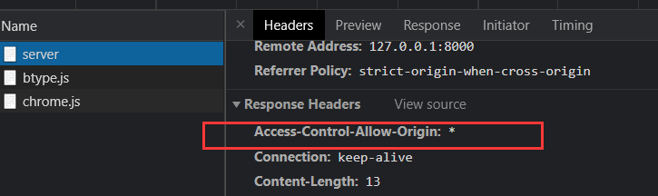
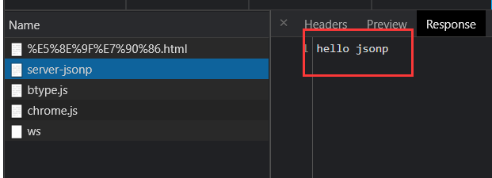
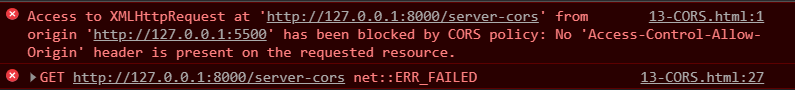

# AJAX 简介

## 概要

`AJAX`全称为`Asynchronous JavaScript And XML`，就是异步的 JS 和 XML

+ 通过`AJAX`可以在浏览器中向服务器发送异步请求，最大的优势：  **无刷新获取数据** 

+ `AJAX`不是新的编程语言，而是一种将现有的标准组合在一起使用的新方式 

**对服务器上的数据，进行查询、新增、修改、删除等操作，都需要URL**

- URL的构成

  + 对于一个项目来说，一般情况下 协议、主机地址、端口号都是不会变

  - 协议、主机地址、端口号组成的这一部分叫做根路径。
  - 注意标点符号
  - 这个网址是由后端程序员提供的，作为前端人员就是拿来使用。


## 应用场景

**场景1：关键字检索**


**场景2：注册用户名重名检测**


**场景3：菜单详情内容**


**场景4：二级三级菜单分类**


**场景5：加载更多**


**好处：** 懒加载，按需加载，提高资源利用率，加快页面整体加载速度，提升用户体验

# Ajax的作用


# 环境配置

## 安装 Node.js


- 官网地址：https://nodejs.org/en/

- cmd 键入命令`node -v`，出现版本号信息说明安装成功

```shell
node -v
```

## 使用 express


- 官网地址：https://www.expressjs.com.cn/

- **npm（node package manager）**：`Node.js`的包管理器，用于`node`插件管理（包括安装、卸载、管理依赖等）

**打开终端，键入命令**

```shell
# 初始化
npm init --yes
# 安装express框架
npm i express
```

**创建 js 文件，编写代码**

```javascript
// 1、引入express
// const express = require('express');
import express from 'express';

// 2、创建应用对象
const app = express();

// 3、创建路由规则
// request 请求报文的封装
// response 响应报文的封装
app.get('/', (request, response) => {
    // 设置响应
    response.send('Hello Express');
});

// 4、监听端口启动服务
app.listen(8000, () => {
    console.log("服务已经启动，8000 端口监听中...");
});
```

再次打开终端，键入命令 `node js文件名`

```shell
node 01-express基本使用.js
```

出现`服务已经启动，8000 端口监听中...`字样，说明启动成功

我们打开浏览器，访问`http://127.0.0.1:8000/`，出现`Hello Express`字样，验证 OK


## nodemon 自动重启工具安装

官网地址：https://www.npmjs.com/package/nodemon

- 安装命令：`npm install -g nodemon`

- 启动命令：`nodemon xxx.js`替代`node xxx.js`

优点：修改服务端代码不用每次手动`shutdown`重启，而是每次在我们修改完代码后自动重启


## IE缓存问题

------

使用`nodemon`启动项目后，对响应体内容进行修改

在 Chrome 中表现正常，二次请求都是`200`


在 IE 中表现异常，这是因为 IE 默认走了缓存，我们可以看到第二次网络请求状态码为`304`


怎么解决 IE 浏览器缓存的问题呢？

处理很简单，只需将代码添加一个时间戳参数

因为时间戳几乎是时刻变化的，这样每次请求参数都会不一样，浏览器就会将其当成不同的请求

```javascript
xhr.open('GET', 'http://127.0.0.1:8000/server-ie?t' + Date.now());
```

再来看下 IE 中的效果


# Network - 网络面板（重点）

**专门用于排查网络请求错误的**

- 面板介绍


- 隐藏时间轴（可选）


- 禁用浏览器缓存（可选）


- 模拟网速（**看看就行，不要乱调**）

- - No throttling  -- 不限速
  - Fast 3G  -- 模拟快速3G网络
  - Slow 3G – 模拟慢速3G网络


- 显示请求方式（建议）


- 查看请求状态码（目前了解）

- - 200 表示成功
  - pending 表示等待（可能网络不好或者断网了）
  - 4xx 和 5xx 都表示不同程度的错误
  - Failed 表示失败


- **查看提交的数据（非常重要）**


- **查看响应结果（非常重要）**


# 原生方式 发送AJAX请求

## 准备

### 前端

新建 HTML

```html
...
<style>
    #result {
        width: 200px;
        height: 100px;
        border: 1px solid #90b;
    }
</style>
...
<button>点击发送请求</button>
<div id="result"></div>
```

### 服务器(后端)

对路由规则稍作修改

下述代码相对于后端springboot的@getMapping("/server")

```javascript
// uel: http://127.0.0.1:8000/server
app.get('/server', (request, response) => {
    // 设置响应头，设置允许跨域
    response.setHeader('Access-Control-Allow-Origin', '*');
    // 设置响应体
    response.send('Hello Express');
});
```

按照上述步骤启动express后，浏览器访问`http://127.0.0.1:8000/server`，能够正常访问，并且响应头中出现我们设置的头部信息即可



## AJAX 发送 GET 请求

```js
const result = document.getElementById('result');
// 按钮绑定事件
const button = document.getElementsByTagName('button')[0];
button.onclick = function () {
    // 1、创建对象
    const xhr = new XMLHttpRequest();
    // 2、初始化
    xhr.open('GET', 'http://127.0.0.1:8000/server');
    // 3、发送
    xhr.send();
    // 4、事件绑定，处理服务器端返回的结果
    xhr.onreadystatechange = function () {
        // 服务端返回所有结果
        if (this.readyState === 4) {
            // 2xx 成功
            if (this.status >= 200 && this.status < 300) {
                // 状态码、状态字符串
                console.log(this.status); // 200
                console.log(this.statusText); // OK
                // 4.1 响应头
                console.log(this.getAllResponseHeaders()); // content-length: 13  content-type: text/html; charset=utf-8
                // 4.2 响应体
                console.log(this.response); // Hello Express
                // 将响应体内容设置为文本
                result.innerHTML = this.response;
            }
        }
    };
}
```

**效果**


GET 设置请求行

```js
xhr.open('GET', 'http://127.0.0.1:8000/server?a=100&b=200&c=300');
```

##  AJAX 发送 POST 请求

```js
const result = document.getElementById('result');
result.addEventListener('mouseover', function () {
    const xhr = new XMLHttpRequest();
    xhr.open('POST', 'http://127.0.0.1:8000/server');
    xhr.setRequestHeader("Content-Type","application/x-www-form-urlencoded");
    xhr.send();
    xhr.onreadystatechange = function () {
        if (this.readyState === 4 && this.status >= 200 && this.status < 300) {
            result.innerHTML = this.response;
        }
    };
});
```

创建`POST`请求的路由规则

```js
app.post('/server', (request, response) => {
    // 设置响应头，设置允许跨域
    response.setHeader('Access-Control-Allow-Origin', '*');
    // 设置响应体
    response.send('Hello Express');
});
```

重新运行`node server.js`命令，并访问浏览器，能够正常获取数据


POST 设置请求体

可以设置任意类型、任意格式的数据，只要服务器端有与之对应的处理方式即可

从语法上来说，请求体格式非常灵活；但实际使用场景中，一般会按照特定格式书写（如 JSON）

```js
xhr.send('a=100&b=200&c=300');
```

## AJAX 设置请求头信息

### 预定义的请求头

在初始化之后、发送请求之前，可以设置请求头信息

```javascript
xhr.setRequestHeader('Content-Type','application/x-www-form-urlencoded');
```


### 自定义的请求头

除了可以设置上述预定义的请求头信息，也可以设置自定义的请求头信息

```javascript
xhr.setRequestHeader('name', 'atguigu');
```

查看头信息已经有了


但是，这时候会有报错，这是因为浏览器的安全机制


我们需要在`server.js`中添加一行响应头的设置

```javascript
response.setHeader('Access-Control-Allow-Headers', '*');
```

但是仅仅如此，依然不行。我们注意到还有一个`OPTIONS`请求方法，它会对请求头进行校验，检测头信息可用不可用要知道，我们在`server.js`中并没有创建过`OPTIONS`相关的路由规则，所以是接收不到`OPTIONS`请求的

我们可以用将`post`方法改为`all`，它可以接收任意类型的请求（GET/POST/PUT/DELETE/PATCH/OPTIONS...）

```javascript
app.all('/server', (request, response) => {
    // 设置响应头，允许跨域
    response.setHeader('Access-Control-Allow-Origin', '*');
    // 设置响应头，允许任意类型的头信息
    response.setHeader('Access-Control-Allow-Headers', '*');
    // 设置响应体
    response.send('Hello Express');
});
```

重启`server.js`服务，查看网络控制台，状态已经正常了


## 服务器端响应 JSON 数据:crossed_swords:

修改`server.js`中`send`方法中的内容，需要注意的是该方法只能接收字符串和`buffer`，所以对其需要做转换

```js
const data = {
    name:'Hello Ajax'
}

let str = JSON.stringify(data);
response.send(str);
```

前端js代码

```js
const result = document.getElementById('result');
window.onkeydown = function () {
    const xhr = new XMLHttpRequest();
    xhr.open('POST', 'http://127.0.0.1:8000/server-json');
    xhr.send();
    xhr.onreadystatechange = function () {
        if (this.readyState === 4 && this.status >= 200 && this.status < 300) {
            console.log(this.response);
            result.innerHTML = this.response;
        }
    };
}
```


### 手动转换数据-JSON.parse()

因为我们服务端返回的是`json`字符串内容，所以`response`的内容类型也是字符串

这个时候使用`JSON`工具方法，可以将`json`字符串转换为`json`对象

```js
let response = this.response;
console.log(typeof response); // string
data = JSON.parse(response);
result.innerHTML = data.name;
```


### 自动转换数据

```javascript
// 设置响应体类型
xhr.responseType = 'json';
```

这样在获取结果就是`json`对象了，不用进行手动转换即可使用

```javascript
let response = this.response;
console.log(typeof response); // object
result.innerHTML = response.name;
```


## 请求超时与网络异常

### 请求超时

修改`server.js`，设置延时发送响应报文

```javascript
setTimeout(() =>{
    response.send('Hello Ajax');
}, 2000);
```

**效果**


我们这里为模拟超时而设置的延时时间较短，但是一般情况下，请求时间如果过长的话必须要进行处理

如果请求超时，则应该给出相应的超时提醒，一方面可以减少网络带宽资源的占用，一方面也可以提升用户体验

**那么要怎么设置超时的相关信息呢？**

- 超时时间：`timeout`

- 超时回调：`ontimeout`

```javascript
// 设置超时时间
xhr.timeout = 1000;
// 设置超时回调
xhr.ontimeout = () => {
    alert('请求超时！');
};
```

**效果**


可以看到，当请求时间超过我们设置的`timeout`时长后，就会调用超时回调函数，并且还能看到网络请求状态变成了`(canceled)`

### 网络异常

当然除了服务器响应时间较长导致`请求超时`之外，还有可能因为我们的网速或者其他网络问题导致请求失败

我们可以添加一个`onerror`回调函数，对此类问题进行处理

```javascript
// 设置网络异常回调
xhr.onerror = () => {
    alert("网络异常");
};
```

我们将 Chrome 的网络控制台状态切换为`offline`，模拟断网环境下的请求


可以看到，这里提示了`网络异常`，也就是走了`onerror`的回调函数，且状态变成了`(failed) net::ERR_INTERNET_DISCONNECTED`

## 手动取消请求

- `abort()`方法：手动取消请求

```javascript
const btns = document.getElementsByTagName('button');
const btn1 = btns[0];
const btn2 = btns[1];

let xhr = null;
btn1.addEventListener('click', () => {
    xhr = new XMLHttpRequest();
    xhr.open('GET', 'http://127.0.0.1:8000/server-timeout');
    xhr.send();
});
btn2.addEventListener('click', () => {
    xhr.abort();
});
```

**效果**


##  请求重复发送

如果服务器响应相对比较慢，而用户因为得不到响应而频繁地点击按钮。那么，浏览器短时间内会向服务器发起大量重复的请求，服务器就要对这些请求进行频繁的处理，服务器端的压力就会非常的大

**那么有什么办法可以解决请求重复发送的问题呢？**

思路：发送一个请求之前，查询之前是否有正在进行处理的相同请求，如果有，则取消之前的相同请求，发送一个新的请求。这样保证同一个请求同一时间内只会有一个，这样服务器的压力就会小一些

```javascript
const btns = document.getElementsByTagName('button');
let xhr = null;
// 标识是否正在发送 AJAX 请求
let isSending = false;
btns[0].addEventListener('click', () => {
    // 若上一个请求尚未完成，则手动取消请求
    if (isSending) {
        xhr.abort();
    }
    xhr = new XMLHttpRequest();
    xhr.open('GET', 'http://127.0.0.1:8000/servertimeout');
    xhr.send();
    xhr.onreadystatechange = () => {
        // 请求响应完毕后，修改变量标识  xhr.readyState === 4 表示请求响应完毕
        if (xhr.readyState === 4) {
            isSending = true;
        }
    };
});
```

**效果**


可以看出，如果频繁的点击按钮，发起同一个请求，则每次发起一个新的请求之前，都会取消上一个请求的发送

# jQuery方式 发送ajax请求

+ jQuery 脚本  

```html
<script src="https://cdn.bootcdn.net/ajax/libs/jquery/3.6.0/jquery.min.js"></script>
```

-  bootstrp 脚本  

```html
<link href="https://cdn.bootcdn.net/ajax/libs/twitter-bootstrap/5.0.2/css/bootstrap.css" rel="stylesheet">
```

## GET 请求

```javascript
$.get(url,[data],[callback],[type])
```

- `url`：请求的 URL 地址

- `data`：请求携带的参数

- `callback`：载入成功时回调函数

- `type`：设置返回内容格式，xml，html，script，ison，text，_default

```javascript
btns.eq(0).click(() => {
    $.get('http://127.0.0.1:8000/server-jquery', { a: 100, b: 200 }, (data) => {
        console.log(typeof data, data); // object {name: "Hello jquery"}
    }, 'json');
});
```


## POST请求

```plain
$.post(url,[data],[callback],[type])
```

- `url`：请求的 URL 地址

- `data`：请求携带的参数

- `callback`：载入成功时回调函数

- `type`：设置返回内容格式，xml，html，script，ison，text，_default

```javascript
btns.eq(1).click(() => {
    $.post('http://127.0.0.1:8000/server-jquery', { a: 100, b: 200 }, (data) => {
        console.log(typeof data, data); // string {name: "Hello jquery"}
    });
});
```


## 通用方法

**例子1**

```javascript
$.ajax({
    // 请求地址
    url: 'http://127.0.0.1:8000/server-jquery',
    // 请求参数
    data: { a: 100, b: 200 },
    // 请求类型
    type: 'GET',
    // 响应体类型
    dataType: 'json',
    // 成功回调
    success: data => {
        console.log(typeof data, data); // string {name: "Hello jquery"}  开启dataType后：object {name: "Hello jquery"}
    },
    // 超时时间
    timeout: 1000,
    // 失败的回调
    error: () => {
        alert('出错了');
    },
    // 头信息
    headers: {
        c: 300,
        d: 400
    }
});
```

**error 回调**


**error 网络状态**


**头信息**


**例子2**

```html
<!DOCTYPE html>
<html lang="en">
<head>
    <meta charset="UTF-8">
    <meta name="viewport" content="width=device-width, initial-scale=1.0">
    <meta http-equiv="X-UA-Compatible" content="ie=edge">
    <title>Document</title>
    <script src="https://cdn.bootcss.com/jquery/3.4.1/jquery.js"></script>
    
</head>
<body>
    <script>
        $.ajax({
            url:"https://douban.uieee.com/v2/movie/top250",
            data:{
                start:0,
                count:20
            },
            dataType:"jsonp",
            success:data=>{
                console.log(data)
            }
        })
    </script>
</body>
</html>
```

## 通用模版(推荐):crossed_swords:

```js
$.ajax({
    url: '', //请求地址
    type: '', //请求方式，GET/POST/PUT/DELETE等
    data: { //请求数据，可以是对象也可以是查询字符串
        key1: value1,
        key2: value2
    },
    headers: {
        // 头信息
    },
    dataType: '', //服务器响应数据类型，JSON/TEXT/HTML等 设置后响应数据自动转换
    success: data => {
        // 请求成功后执行的方法 // 成功回调
    },
    timeout: 1000, // 超时时间
    error: () => {
        //请求失败后执行的方法 // 失败的回调
    },
    beforeSend: () => {
        //请求之前执行的方法
    },
    complete: () => {
        //请求之后（无论成功失败）执行的方法
    }
});

```

##  ajax例子

### 1.ajax请求豆瓣top250(douban.chengbenchao.top)

```js
<script src="lib/jquery-3.4.1.js"></script>
</head>
<body>
    <script>
        var url="https://douban.uieee.com/v2/movie/top250";
        $.ajax({
            url,
            type:"get",
            dataType:"jsonp",
            success:res=>{
                var subjects=res.subjects;
                var movies=[];
                for (var i=0;i<subjects.length;i++){
                    var obj={}
                    obj.title=subjects[i].title;
                    obj.imageUrl=subjects[i].images.small;
                    movies.push(obj)
                }
                
                for(var j=0;j<movies.length;j++){
                    var item=$(`<div><p>${movies[j].title}</p></div>`)
                    $("body").append(item)//创建div元素
                    // var $img=$("")
                    // var $p=$("p")
                    // $img.attr("src",movies[j].imageUrl)
                    // console.log($img)
                    // $div.append($img)
                    
                }
            },
            error:err=>{
                console.log(err.statue)
                if(err.status==404){
                    window.location.href="404.html"
                }
            }

        })
    </script>
</body>
```

### 2.网易云音乐(music.wuhan-zhixing.top)

```js
<script src="lib/jquery-3.4.1.js"></script>
    <style>
        input{
            width: 250px;
            height: 35px;
            border: 1px solid #333;
            outline: none;
            border-radius: 20px;
            padding-left: 20px;
        }
        img{
            width: 250px;
        }
    </style>
</head>
<body>
    <input type="text" id="input" placeholder="请搜索">
    <div>
        <br>
        <audio src="" controls="controls" autoplay></audio>
    </div>
    <script>
        var url="https://music.aityp.com/";
        var input =document.getElementById("input");
         input.onkeydown =function(event){
            if(event.keyCode==13){
                console.log(this.value)
                /* 1.获取id */
                $.ajax({
                    url:`${url}search?keywords=${this.value}`,
                    type:"get",
                    dataType:"json",
                    success:res=>{
                        var id=res.result.songs[0].id;
                        // console.log(id)
                        /* 2.获取imgUrl */
                        $.ajax({
                            url:`${url}song/detail?ids=${id}`,
                            type:"get",
                            dataType:"json",
                            success:res=>{
                                var imgUrl=res.songs[0].al.picUrl;
                                $("img").attr("src",imgUrl)
                            }
                        })
                        /* 3.获取音乐Url */
                        $.ajax({
                            url:`${url}song/url?id=${id}`,
                            type:"get",
                            dataType:"json",
                            success:res=>{
                                //console.log(res.data[0].url)
                                var audioUrl=res.data[0].url;
                                $("audio").attr("src",audioUrl)
                            }
                        })
                    }

                })
            }
         }   
    </script>
</body>
```

# axios方式 发送 ajax 请求:crossed_swords:

axios 官网：https://www.npmjs.com/package/axios

下载: [axios.js](axios.js)

```js
<!-- 引入axios.js -->
<script src="./axios.js"></script>
```

## GET 请求

- `axios#get(url[,config])`

- 函数返回结果是一个`promise`对象，用`then`回调处理

```javascript
axios.defaults.baseURL = 'http://127.0.0.1:8000/';
axios.get('server-axios', {
    // 请求参数
    params: {
        a: 100,
        b: 200
    },
    // 请求头
    headers: {
        c: 300,
        d: 400
    }
}).then(value => {
    console.log(value);
});
```

**请求参数、头信息**


## PST 请求

- `axios#post(url[,data[,config]])`

```javascript
axios.post('server-axios', {
    // 请求体
    e: 500,
    f: 600
	}, {
    // 请求参数
    params: {
        a: 100,
        b: 200
    },
    // 请求头
    headers: {
        c: 300,
        d: 400
    }
}).then(value => {
    console.log(value);
});
```

**头信息**


**请求参数、请求体**


## 通用方法

- `axios(url[, config])`

```javascript
axios({
    method: 'POST',
    url: 'server-axios',
    // 请求参数
    params: {
        a: 100,
        b: 200
    },
    // 请求头
    headers: {
        c: 300,
        d: 400
    },
    // 请求体
    data: {
        e: 500,
        f: 600
    },
    // 响应体类型
    dataType: 'json'
}).then(response => {
    console.log(response.status); // 200
    console.log(response.statusText); // OK
    console.log(response.headers); // {content-length: "22", content-type: "text/html; charset=utf-8"}
    console.log(typeof response.data, response.data); // object {name: "Hello axios"}
});
```

## 通用模版(推荐):crossed_swords:

```js
axios发送get请求：
axios.get('url地址', { params: {请求的参数对象}}).then(function(res){
        //.then()表示成功的回调
        console.log(res.data)   //res.data 是服务器返回的数据,会自动转为js对象格式
    })
-------------------------------------------------------------------------------------------
axios发送post请求：
axios.post('url地址', {要提交到服务器的数据}).then(function(res){
        console.log(res.data)   //res.data 是服务器返回的数据
    })
-------------------------------------------------------------------------------------------
直接使用axios发起请求:
axios({
     method: '请求类型',
     url: '请求的URL地址',
     data: { POST数据  },    //POST 数据要通过data属性提供
     params: { GET参数 },     //GET参数要通过params属性提供
    dataType: 'json'         // 响应体类型设置后响应数据指定转换
}).then(function(res){
    // 响应数据
    console.log(res.data)
}).catch(function (error) {
    console.log(error);
});
```

## 用 params & data

- 接口文档写的是”**查询参数**”或者”**Query参数**”或者”**请求参数**”，则使用 **params**
- 接口文档写的是”**请求体**”或者 ”**body参数**”，则使用 **data**

 **前端参 {params: params} ,  后端@RequestParams("xxx") 接参**

 **前端 {data : param} 传参，后端@RequestBody 接参**

## 案例

### json数据

前端

```js
document.querySelector('#addBtn').addEventListener('click', function () {
  const bookname = document.querySelector('#addForm [name=bookname]').value
  const author = document.querySelector('#addForm [name=author]').value
  const publisher = document.querySelector('#addForm [name=publisher]').value

  const data = {
    bookname: bookname,
    author: author,
    publisher: publisher,
    appkey: 'laotang110022'
  };

  axios({
    method: 'POST',
    url: 'http://www.itcbc.com:3006/api/addbook',
    data: JSON.stringify(data),  // json数据
    headers: {
      'Content-Type': 'application/json' // Set Content-Type header to application/json
    }
  }).then(({ data: res }) => {
    myModal.hide();
    document.querySelector('#addForm').reset();
    renderBooks();
  });
});

```

后端

```java
import org.springframework.web.bind.annotation.PostMapping;
import org.springframework.web.bind.annotation.RequestBody;
import org.springframework.web.bind.annotation.RestController;

@RestController
public class BookController {

    @PostMapping("/api/addbook")
    public void addBook(@RequestBody BookRequest bookRequest) {
        // Handle the book data received from the frontend
        // Perform necessary operations, e.g., saving the book to a database
    }
}

```

### 非json

前端

```js
document.querySelector('#addBtn').addEventListener('click', function () {
  const bookname = document.querySelector('#addForm [name=bookname]').value
  const author = document.querySelector('#addForm [name=author]').value
  const publisher = document.querySelector('#addForm [name=publisher]').value

  const data = {
    bookname: bookname,
    author: author,
    publisher: publisher,
    appkey: 'laotang110022'
  };

  axios({
    method: 'POST',
    url: 'http://www.itcbc.com:3006/api/addbook',
    data: data, // 非json数据
    headers: {
      'Content-Type': 'application/json' // Set Content-Type header to application/json
    }
  }).then(({ data: res }) => {
    myModal.hide();
    document.querySelector('#addForm').reset();
    renderBooks();
  });
});
```

后端

```java
import org.springframework.web.bind.annotation.PostMapping;
import org.springframework.web.bind.annotation.RequestParam;
import org.springframework.web.bind.annotation.RestController;

@RestController
public class BookController {

    @PostMapping("/api/addbook")
    public void addBook(
            @RequestParam String bookname,
            @RequestParam String author,
            @RequestParam String publisher,
            @RequestParam String appkey
    ) {
        // Handle the form data received from the frontend
        // Perform necessary operations, e.g., saving the book to a database
    }
}

```


## 案例

### 语法练习：带条件的GET请求

带条件的查询，另一个说法是 带查询参数

在请求的配置项中，加 `params`配置即可。

```js
// axios({ /* 请求的配置 */ }).then(result => {})
axios({
  // method: 'GET', // method不写，默认表示发送的就是GET请求
  url: 'http://www.itcbc.com:3006/api/getbooks',
  // 通过 params 来指定查询条件，或查询参数
  params: {
    id: 2,
    bookname: '红楼梦'
  }
}).then(({ data }) => {
  console.log(data)
})
```

### 语法练习：POST请求

提交的bookname、author、publisher 单词不能写错，值要求是2~10个字符

```html
<script src="./axios.js"></script>
<script>
  // 发送POST请求，目的是提交数据给服务器，让服务器那边添加这条数据// 点击按钮的时候，在发送请求
  document.querySelector('button').addEventListener('click', function () {
    // axios({ /* 请求的配置 */ }).then(result => {})
    axios({
      method: 'POST',
      url: 'http://www.itcbc.com:3006/api/addbook',
      // 指定提交的数据
      data: {
        bookname: '史记', // bookname固定写法，不能改；值要求2~10个字符
        author: '司马迁',
        publisher: '北京出版社'
      }
    }).then(({ data }) => {
      console.log(data)
    })
  })
</script>
```

### 接口及接口文档

发送请求的时候，用什么地址？请求方式是什么？该提交哪些参数？这个请求是干什么的？

- 接口就是请求的那个地址，大家称它为 数据接口，简称接口
- **接口是后端设计的**, 后端需要出具一个接口的使用说明书，也就是接口文档
- 前端，要会看接口文档，会根据接口文档发送请求

**本案例使用的现成后端接口文档**：https://docs.apipost.cn/preview/f62dc0b91dc8d8ea/c31d9a50dccf65e3

### 案例-添加图书

【1】修改添加按钮

- 加入 id
- 去掉两个自定义属性

```html
<button id="add-btn" class="btn btn-success btn-sm">添加</button>
```

【2】点击添加，显示模态框

```javascript
const myModal = new bootstrap.Modal(document.querySelector('#addModal'))
document.querySelector('#add-btn').addEventListener('click', function () {
  myModal.show() // 让模态框显示
})
```

【3】点击模态框中的确认按钮，完成添加

```javascript
// 点击模态框中的确认按钮，完成添加
document.querySelector('#addBtn').addEventListener('click', function () {
  // 最终目标，就是把输入框的值，提供给接口
  const bookname = document.querySelector('#addForm [name=bookname]').value
  const author = document.querySelector('#addForm [name=author]').value
  const publisher = document.querySelector('#addForm [name=publisher]').value
  // console.log(bookname, author, publisher)
  axios({
    method: 'POST',
    url: 'http://www.itcbc.com:3006/api/addbook',
    data: {
      bookname: bookname,
      author: author,
      publisher: publisher,
      appkey: 'laotang110022'
    }
  }).then(({ data: res }) => {
    // console.log(res)
    // 添加成功
    myModal.hide() // 关闭模态框
    document.querySelector('#addForm').reset() // 重置表单
    renderBooks() // 重新获取全部图书，重新渲染
  })
})
```

#### 加入appkey区分数据

**获取图书**的时候，通过 params 添加 appkey参数，因为接口文档写的是查询参数：

```diff
axios({
  method: 'GET', // method 指定请求方式; GET不区分大小写，建议大写
  url: 'http://www.itcbc.com:3006/api/getbooks',
+  params: {
+    appkey: 'laot33ang'
+  }
})
```

**添加图书**的时候：在data中加appkey，因为接口文档写的是请求体：

```diff
axios({
  method: 'POST',
  url: 'http://www.itcbc.com:3006/api/addbook',
+  data: { bookname, author, publisher, appkey: 'laot33ang' }
})
```

**重点**：

- **自己用自己的 appkey，这样就表示使用自己的私有数据了**
- **无论是什么操作，比如获取数据、添加数据，删除数据，修改数据，appkey的值必须相同**

### 案例-删除图书

删除需要使用id，所以在循环遍历的时候，给每个 删除 按钮，添加好自定义属性，用于存储当前这条数据的id，代码如下：

```javascript
const arr = res.data.map(item => {
  return `<tr>
            <th scope="row">${item.id}</th>
            <td>${item.bookname}</td>
            <td>${item.author}</td>
            <td>${item.publisher}</td>
            <td>
              <button data-id="${item.id}" type="button" class="btn btn-link btn-sm btn-delete">删除</button>
              <button type="button" class="btn btn-link btn-sm btn-update">编辑</button>
            </td>
          </tr>`
})
```

JS代码如下：

```javascript
// ------------------------------------ 3. 删除功能 ----------------------------------
// 1. 使用事件委托的方式，为删除添加单击事件
document.querySelector('tbody').addEventListener('click', function (e) {
  // console.log(e.target.classList.contains('btn-delete'))
  // 判断，点击的目标元素，是否包含 btn-delete 这个类名（如果包含，说明点击的是删除）
  if (e.target.classList.contains('btn-delete')) {
    // 2. 点击的时候，获取到当前这条数据的id（循环遍历的时候，给每个删除添加 data-id 属性；点击删除的时候获取这个属性值）
    let id = e.target.dataset.id
    // console.log(id)
    // 3. 发送请求，删除数据
    axios({
      method: 'DELETE',
      url: 'http://www.itcbc.com:3006/api/delbook',
      params: {
        id: id,
        appkey: 'laotang0099'
      }
    }).then(({ data: res }) => {
      // console.log(res)
      renderBooks() // 调用renderBooks() 重新获取最新的数据，重新渲染到页面中
    })
  }
})
```

### 案例-修改图书

#### 点击编辑显示模态框

在删除的基础之上，再加一个判断即可。

```javascript
// 编辑的模态框
let editModal = new bootstrap.Modal(document.getElementById('editModal'))

document.querySelector('tbody').addEventListener('click', function (e) {

  // 判断点击的是否是删除
  if (e.target.classList.contains('btn-delete')) {
    // 删除的代码，略.........
  }

  // 判断点击的是否是编辑
  if (e.target.classList.contains('btn-update')) {
    // console.log('点击的是编辑')
    // 点击的是编辑 --> 显示模态框
    editModal.show()
  }

}
```

#### 数据回填

所有的修改，都需要数据回填。

数据回填，也叫做数据回显。就是把修改的这条数据放回到 输入框 中。

具体做法：循环遍历的时候，用 编辑 按钮的 data-xxx 属性，将数据存储起来：

```html
<button 
  data-id="${item.id}" 
  data-bookname="${item.bookname}" 
  data-author="${item.author}" 
  data-publisher="${item.publisher}" 
  type="button" 
  class="btn btn-link btn-sm btn-update"
>编辑</button>
```

点击编辑的时候，获取这些data-xxx属性值，设置给输入框即可：

```javascript
// 判断，点击的是否是编辑
if (e.target.classList.contains('btn-update')) {
  // console.log('点击的是编辑')
  // 获取4个 data-xxx 属性值
  let shuju = e.target.dataset // e.target 表示点击的编辑按钮； dataset 可以获取元素所有的 data-xxx 属性值
  // console.log(shuju)
  // 当前这本书的数据已经得到了，下面设置输入框的默认值
  document.querySelector('#editModal [name=bookname]').value = shuju.bookname
  document.querySelector('#editModal [name=author]').value = shuju.author
  document.querySelector('#editModal [name=publisher]').value = shuju.publisher
  document.querySelector('#editModal [name=id]').value = shuju.id
  // 点击的是编辑 --> 显示模态框
  editModal.show()
}
```

#### 点击确认完成修改

```js
// --------------------------- 点击 编辑模态框中的 确认，完成修改 -----------------------
document.querySelector('#editBtn').addEventListener('click', function () {
  // 获取输入框的值
  let id = document.querySelector('#editModal [name=id]').value
  let bookname = document.querySelector('#editModal [name=bookname]').value
  let author = document.querySelector('#editModal [name=author]').value
  let publisher = document.querySelector('#editModal [name=publisher]').value
  // 发送ajax请求，提交数据即可
  axios({
    method: 'PUT',
    url: 'http://www.itcbc.com:3006/api/updatebook',
    data: { id, bookname, author, publisher, appkey: 'laotang0099' }
  }).then(result => {
    console.log(result.data)
    // 关闭弹框
    editModal.hide()
    // 调用 renderBooks() 重新渲染数据
    renderBooks()
  })
})
```

### form-value插件

#### 说明和基本语法

在获取表单数据的时候，如果一个一个的获取，无疑是很麻烦的。比如目前的添加图书：

```javascript
let bookname = document.querySelector('#addForm [name=bookname]').value
let author = document.querySelector('#addForm [name=author]').value
let publisher = document.querySelector('#addForm [name=publisher]').value
......
......
......
```

那么如何快速的获取表单各项的值呢？

答案就是使用插件。

课程设计的时候，使用的是 form-serialize 插件；不过我推荐使用 [form-value](https://www.npmjs.com/package/form-value) 插件

form-value 就是一个快速获取表单数据的插件。

该插件功能之一是快速获取表单各项的值，也可以快速进行数据回填。

**获取表单各项值**的语法如下：

```html
<form action="">
  用户名：<input type="text" name="username"><br />
  手机号：<input type="text" name="phone" /><br />
  性　别：<input type="radio" name="sex" value="nan">男
  <input type="radio" name="sex" value="nv">女<br />
  籍　贯：
  <select name="address">
    <option value="bj">北京</option>
    <option value="sh">上海</option>
    <option value="gz">广州</option>
  </select><br />
  <input type="hidden" name="id" value="100">
  <button id="tijiao">提交</button>
</form>

<script src="./form-value.js"></script>
<script>
  document.querySelector('#tijiao').addEventListener('click', function (e) {
    e.preventDefault()
    // 使用插件提供的 val() 获取表单各项的值
    // let data = val(表单)
    let data = val(document.querySelector('form'))
    console.log(data)
  })
</script>
```

**数据回填的语法**如下：

1. 要求表单各项的 name 属性值必须具备
2. 准备对象格式的数据，要求对象的键 和 表单各项的 name 一致
3. 使用 `val(表单, 数据)` 的语法，进行数据回填

示例代码如下：

```html
<body>
  <form action="">
    书名：<input type="text" name="bookname"><br>
    作者：<input type="text" name="author"><br />
    出版社：<input type="text" name="publisher"><br />
    性别：<input type="radio" name="sex" value="nan">男
    <input type="radio" name="sex" value="nv">女<br>
    下拉框：<select name="address">
      <option value="beijing">北京</option>
      <option value="shanghai">上海</option>
      <option value="guangzhou">广州</option>
    </select>
  </form>

  <script src="./form-value.js"></script>
  <script>
    // 准备回填的数据
    let shuju = {
      // 要求对象的键和表单项的name一致
      bookname: 'aa',
      author: 'bb',
      publisher: 'cc',
      sex: 'nv',
      address: 'guangzhou'
    }
    // 数据回填
    // val(表单, 数据)
    val(document.querySelector('form'), shuju)
  </script>
</body>
```

### 图书管理案例使用form-value插件

- 添加图书时，使用 form-value 插件获取表单数据

```diff
 // 获取三个输入框的值
-// let bookname = document.querySelector('#addForm [name=bookname]').value
-// let author = document.querySelector('#addForm [name=author]').value
-// let publisher = document.querySelector('#addForm [name=publisher]').value

+let data = val(document.querySelector('#addForm'))
+// console.log(data) // {bookname: 'aa', author: 'bb', publisher: 'cc'}
+data.appkey = 'laotang0099' // 给data对象，加appkey

下面提交数据，直接用data
```

- 修改图书时，数据回填的时候，使用插件快速回填数据

```diff
 let shuju = e.target.dataset
 // console.log(shuju) // {id: '2896', bookname: '遮天三部曲', author: '振东', publisher: '红毛怪'}
 // 数据回填（找到编辑弹框中的 input，然后设置value值）
+// val(表单, 数据)
+val(document.querySelector('#editForm'), shuju)

-// document.querySelector('#editModal [name=bookname]').value = shuju.bookname
-// document.querySelector('#editModal [name=author]').value = shuju.author
-// document.querySelector('#editModal [name=publisher]').value = shuju.publisher
-// document.querySelector('#editModal [name=id]').value = shuju.id
```

- 修改图书时，使用form-value插件快速获取表单各项的值

### 图书管理案例中使用简化方法

不是说学了简化方法，前面的 axios().then() 就不用了。

- 获取数据时，使用 axios.get() 试试
- 添加图书时，使用 axios.post() 试试
- 删除图书时，使用 axios.delete() 试试
- 修改图书时，使用 axios.put() 试试

### 图书管理案例中配置请求根路径

- 在所有请求之前，配置请求根路径
- 后续的所有请求，都不需要再写请求根路径了

### 图书管理案例中使用拦截器

**进度条插件**：

```html
加载好 nprogress.css 
加载好 nprogress.js

如果需要让进度条显示，则调用 NProgress.start()  // N P 都是大写的
如果需要让进度条隐藏，则调用 NProgress.done()   // N P 都是大写的
```

**图书管理案例中使用**：

- 加入请求拦截器和响应拦截器
- 在请求拦截器的第1个函数中，return config 之前，加入 NProgress.start()
- 在响应拦截器的两个函数中，都加入 NProgress.done() （在return那行之前加）

拦截器是针对所有请求的，所以加好拦截器，无论是获取数据，添加数据，还是删除数据都会使得拦截器的代码执行，也就是都有进度条的效果了。

## axios请求方法的别名:crossed_swords:

实际上就是一些发送请求的简化写法，就是发送请求的另外的一些语法。

- 实际使用，用前两天学的 `axios({ method: '', url: '' }).then()` 可以
- 实际使用，用现在即将学的简化方法，也行


```javascript
// 以前发送GET请求，使用的是万能语法
// -------------------- 万能的写法 --------------------------------
axios({
  method: 'GET',
  url: 'http://www.itcbc.com:3006/api/getbooks',
  params: {
    appkey: 'laotang0099'
  }
}).then(({ data: res }) => {
  console.log(res)
})

// -------------------- GET和DELETE的简化写法 --------------------------------
// axios.get('url', 配置对象) // 配置对象可选，配置对象就是以前传递给 axios() 的那个对象
axios.get('http://www.itcbc.com:3006/api/getbooks', {
  params: {
    appkey: 'laotang0099'
  }
}).then(({ data: res }) => {
  console.log(res)
})


// ============================================================================
// ---------------------- POST请求、PUT请求、PATCH请求 ---------------------------
// axios.post('url', data, 配置对象).then()
axios.post('http://www.itcbc.com:3006/api/addbook', { bookname: 'aad', author: 'dd', publisher: 'dd' }).then(result => {
  console.log(result.data)
})
```

## axios全局配置

**官方参考**：https://www.axios-http.cn/docs/config_defaults

**全局配置了请求根路径，后面所有的请求，都不需要加请求根路径了**

```javascript
// 全局配置请求根路径
axios.defaults.baseURL = 'http://www.itcbc.com:3006';

//////////////////////////////////////
/////////////  全局配置了请求根路径，后面所有的请求，都不需要加请求根路径了  //////////////
//////////////////////////////////////
```

## axios拦截器

axios中的拦截器，分为请求拦截器和响应拦截器

拦截器语法：https://www.axios-http.cn/docs/interceptors


#  fetch 函数 发送 AJAX 请求

```javascript
fetch('http://127.0.0.1:8000/server-fetch?a=100&b=100', {
    // 请求方法
    method: 'POST',
    // 请求头
    headers: {
        c: 300,
        d: 400
    },
    // 请求体
    body: 'e=500&f=600'
}).then(response => {
    console.log(response);
});
```

**请求参数、头信息**


**请求体信息**


**控制台信息**


如果我们只想要响应体内容，可以修改`then`回调

```javascript
...
.then(response => {
    return response.text();
}).then(response => {
    console.log(typeof response, response); // string {"name":"Hello fetch"}
});
```

如果明确响应体内容为 json 字符串，可以按如下修改，将会返回一个 object 对象

```javascript
...
.then(response => {
    return response.json();
}).then(response => {
    console.log(typeof response, response); // object {"name":"Hello fetch"}
});
```


#  AJAX跨域问题

详情见 [跨域问题解决](C:\Users\16658\Documents\GitHub\java_note\note\spring boot3\跨域问题解决.md)

## 同源策略

同源策略（Same-Origin Policy）最早由 Netscape 公司提出，是浏览器的一种安全策略

同源：协议、域名、端口号必须完全相同，**违背同源策略就是跨域**

**server.js 代码**

```javascript
const express = require('express');
const app = express();

app.get('/home', (request, response) => {
    // 响应一个页面
    response.sendFile(__dirname + '/11-同源策略.html');
});
app.get('/data', (request, response) => {
    response.send('用户数据');
});

app.listen(9000, () => {
    console.log("服务已经启动，9000 端口监听中...");
});
```

**js 代码**

```javascript
const xhr = new XMLHttpRequest();
// 这里因为是满足同源策略的，所以url可以简写
xhr.open('GET', '/data');
xhr.send();
xhr.onreadystatechange = function () {
    if (xhr.readyState === 4 && xhr.status >= 200 && xhr.status < 300) {
        console.log(xhr.response);// 用户数据
    }
};
```

## JSONP方法

### 1）JSONP是什么

JSONP （JSON with Padding），是一个非官方的跨域解决方案，纯粹凭借程序员的聪明才智开发出来，只支持 get 请求

### 2）JSONP怎么工作的？

在网页有一些标签天生具有跨域能力，比如：`img` `link` `iframe` `script`

比如我们之前引入过，并没有报错，可以使用

```html
<script src="https://cdn.bootcdn.net/ajax/libs/jquery/3.6.0/jquery.min.js"></script>
<script src="https://cdn.bootcdn.net/ajax/libs/axios/0.21.1/axios.min.js"></script>
```

**JSONP 就是利用 script 标签的跨域能力来发送请求的**

我们在 HTML 里加入以下内容

```html
<div id="result"></div>
<script>
    function handle(data) {
        const result = document.getElementById('result');
        result.innerHTML = data.name;
    }
</script>
<script src="./js/app.js"></script>
```

**app.js 代码**

```javascript
const data = {
    name: 'JSONP'
};
handle(data);
```

我们使用`live-server`服务启动项目后，可以获取到`app.js`对应的 HTTP 地址


我们替换下`app.js`的 src 地址

```html
<script src="http://127.0.0.1:5500/12-JSONP/js/app.js"></script>
```

我们是不是可以将这个`script`脚本的 src 地址看成是服务端的方法地址？

不就是跟之前引入的`jQuery`和`axios`的 src 地址类似么，既然如此我们当然可以在服务端编写一个路由规则

```javascript
app.all('/server-jsonp', (request, response) => {
    response.send('hello jsonp'); 
});
```

控制台报错

```shell
Uncaught SyntaxError: Unexpected identifier
```

但是查看下网络响应体信息，实际上是获取到的



因为`script`标签需要的是一个 JS 脚本代码，而现在获取到的却是一串字符，是无法进行解析的

所以我们需要修改服务端响应内容

```javascript
const data = {
    name: 'JSONP'
};
let str = JSON.stringify(data);
// end 方法不会有特殊响应头
// 为了方便拼接，用模板字符串
response.end(`handle(${str})`); // 返回结果是一个函数调用
```

这次内容正常呈现，查看控制台没有报错信息，而且请求内容是我们编写的一串 JS 代码


### 3）JSONP的使用

**HTML 代码**

```html
用户名：<input type="text" id="username">
<p></p>
<script>
    //声明handle函数
    function handle(data) {
        var input = document.querySelector('input');
        input.style.border = "solid 1px #f00";
        //修改p标签的提示文本
        var p = document.querySelector('p');
        p.innerHTML = data.msg;
    }
</script>
<script>
    const input = document.querySelector('input');
    input.onblur = () => {
        let username = this.username;
        //JSONP方法
        // 1、创建一个 script 标签
        var script = document.createElement('script');
        // 2、设置 src 属性
        script.src = 'http://127.0.0.1:8000/check-username';
        // 3、将 script 插入文档中
        document.body.appendChild(script);
    };
</script>
```

**服务端代码**

```javascript
//  app.all  --> 相当于@requestMapping("/check-username")
app.all('/check-username', (request, response) => {
    const data = {
        exist: 1,
        msg:'用户名已存在'
    };
    let str = JSON.stringify(data);
    response.end(`handle(${str})`); 
});
```

**效果**


### 4）jQuery 发送 JSONP 请求

```javascript
$.getJSON(url,[data],[fn])
```

- **url**：发送请求地址

- **data**：待发送 key/value 参数

- **callback**：载入成功时回调函数

**HTML 代码**

```html
<button>点击发送请求</button><br><br>
<div id="result"></div>
<script src="https://cdn.bootcdn.net/ajax/libs/jquery/3.6.0/jquery.min.js"></script>
<script>
    $('button').eq(0).click(() => {
        //
        $.getJSON('http://127.0.0.1:8000/server-jsonp-jquery?callback=?', data => {
            $('#result').html(data.msg);
        });
    });
</script>
```

**服务端代码**

```javascript
app.all('/server-jsonp-jquery', (request, response) => {
    const data = {
        exist: 1,
        msg:'用户名已存在'
    };
    let str = JSON.stringify(data);
    response.end(`(${str})`);
});
```

此时并没有任何输出，但是请求参数中自动生成了一个`callback`的参数


因为我们现在是通过`live-server`服务的5500端口访问的`nodemon`服务的8000端口，也就是说现在是跨域访问

所以需要返回一个 JS 脚本代码，但是我们就需要一个字符串作为返回结果啊，怎么办呢？

按照`jsonp`原生代码思路，我们是一定要返回一个 JS 脚本代码的

那么`callback`参数就排上用场了，我们需要改造下服务端代码

```javascript
// 接收callback参数
var cb = request.query.callback;
response.end(`${cb}(${str})`);
```

**效果**


我们可以看到响应体内容已经自动获取了`callback`参数和服务端返回结果

## CORS(前端处理)

官网地址：https://developer.mozilla.org/zh-CN/docs/Web/HTTP/CORS

### 1）CORS是什么？

CORS（Cross-Origin Resource Sharing），跨域资源共享。CORS 是官方的跨域解决方案，它的特点是不需要在客户端做任何特殊的操作，完全在服务器中进行处理，支持 get 和 post 请求。跨域资源共享标准新增了一组 HTTP 首部字段，允许服务器声明哪些源站通过浏览器有权限访问哪些资源

### 2）CORS怎么工作的？

CORS 是通过设置一个响应头来告诉浏览器，该请求允许跨域，浏览器收到该响应以后就会对响应放行

### 3）CORS的使用

**HTML 代码**

```html
<button>点击发送请求</button><br><br>
<div id="result"></div>
<script>
    const btn = document.getElementsByTagName('button')[0];
    const result = document.querySelector('#result');
    btn.addEventListener('click', function () {
        //
        const xhr = new XMLHttpRequest();
        xhr.open('GET', 'http://127.0.0.1:8000/server-cors');
        xhr.send();
        xhr.onreadystatechange = function () {
            if (this.readyState === 4 && this.status >= 200 && this.status < 300) {
                result.innerHTML = this.response;
            }
        };
    });
</script>
```

**服务端代码**

```javascript
app.all('/server-cors', (request, response) => {
    response.send('Hello cors');
});
```

**效果**




我们要想进行跨域请求，必须在服务端返回结果时设置允许跨域的响应头

```javascript
app.all('/server-cors', (request, response) => {
    // 设置响应头，允许跨域
    response.setHeader('Access-Control-Allow-Origin', '*');
    //response.setHeader('Access-Control-Allow-Origin', 'http://127.0.0.1:8000'); 指定
    response.send('Hello cors');
});
```

**HTTP 响应首部字段:**

| HTTP 响应首部字段                  | 作用                                      |
| ---------------------------------- | ----------------------------------------- |
| `Access-Control-Allow-Origin`      | 指定了允许访问该资源的外域 URI            |
| `Access-Control-Expose-Headers`    | 让服务器把允许浏览器访问的头放入白名单    |
| `Access-Control-Max-Age`           | 指定了 preflight 请求的结果能够被缓存多久 |
| `Access-Control-Allow-Credentials` | 是否允许浏览器读取 response 的内容        |
| `Access-Control-Allow-Methods`     | 指明了实际请求所允许使用的 HTTP 方法      |
| `Access-Control-Allow-Headers`     | 指明了实际请求中允许携带的首部字段        |

一般这么使用，允许跨域、带有自定义头部信息、任意方法

```js
response.setHeader("Access-Control-Allow-Origin", "*"); 
response.setHeader("Access-Control-Allow-Headers", "*"); 
response.setHeader("Access-Control-A1low-Method", "*");
```

# FormData（重点）:crossed_swords:

## 基本使用

FormData 是一个浏览器内置对象。作用是用于获取表单数据。

- 表单各项必须有 name 属性
- let fd = new FormData(表单)  // 可以把表单中的数据收集到了
- ajax提交的时候，直接提交 fd 即可

```html
<body>
  <form action="">
    用户名：<input type="text" name="username"><br />
    密　码：<input type="password" name="pwd"><br />
    性　别：<input type="radio" value="男" name="sex">男 <input type="radio" value="女" name="sex">女<br />
    <button>提交</button>
  </form>

  <script src="./lib/axios.js"></script>
  <script>
    axios.defaults.baseURL = 'http://www.itcbc.com:3006'
    // 点击按钮，会造成表单提交，阻止默认行为，使用 FormData 收集表单数据,Ajax提交数据
    document.querySelector('button').addEventListener('click', function (e) {
      e.preventDefault() // 阻止默认行为
      // let fd = new FormData(表单)
      let fd = new FormData(document.querySelector('form'))
      // ajax提交数据，也就是提交 fd 
      axios.post('/api/formdata', fd).then(result => {
        console.log(result.data)
      })
    })
  </script>
</body>
```

## FormData相关的API

- `fd.append('键', 值)`  --- 向原有数据中，新增一个值
- `fd.delete('键')` --- 从原有数据中，移除一个值
- `fd.set('键', 值)` --- 修改原有数据中的一个值
- `fd.forEach((value, key) => {})` --- 遍历查看对象中有哪些数据

```javascript
axios.defaults.baseURL = 'http://www.itcbc.com:3006'

document.querySelector('form').addEventListener('submit', function (e) {
  e.preventDefault() // () 必须加
  // 使用内置的FormData收集表单各项数据
  // let fd = new FormData(表单)
  let fd = new FormData(this)
  // console.log(fd) // 直接输出fd，是看不见数据的

  // 1. 通过append来向 fd 对象中，追加一些数据
  fd.append('age', 20)

  // 2. 通过delete来删除 fd 对象中的数据
  fd.delete('pwd')

  // 3. 通过set来修改 fd 对象中的数据
  fd.set('sex', '妖')

  // 4. forEach遍历数据，通过它查看 fd 对象中有哪些数据
  fd.forEach((value, key) => {
    console.log(key, value)
  })
  // 下面，就可以把fd提交到服务器
  // axios({
  //   method: 'POST',
  //   url: '/api/formdata',
  //   data: fd,
  // })
  axios.post('/api/formdata', fd).then(({ data: res }) => {
    console.log(res)
  })
})
```

# 上传文件

原理和提交其他文本值一样，只不过上传，提交的是一个文件而已。

**注意，文件选择框，name 必须是 avatar，因为接口要求的**。

## 利用form标签

- new FormData() 的时候，传入 表单。这样就可以获取到表单项的值。

```html
<body>
  <form action="">
    头像：<input type="file" name="avatar">
    <button>上传</button>
  </form>

  <script src="./axios.js"></script>
  <script>
    document.querySelector('button').addEventListener('click', function (e) {
      e.preventDefault()
      // let fd = new FormData(表单)
      let fd = new FormData(document.querySelector('form'))
      axios.post('http://www.itcbc.com:3006/api/formdata', fd).then(({ data: res }) => {
        console.log(res)
      })
    })
  </script>
</body>
```

## 单独上传

```html
<input type="file" multiple style="display:none;">
<button>选择文件</button>
<hr>

```

【1】点击按钮，能够选择图片

```javascript
// 点击按钮，能够选择文件
document.querySelector('button').addEventListener('click', function () {
  // 用 代码的方式，触发一下 文件域的单击事件
  document.querySelector('input').click()
})
```

【2】文件域（文件选择框）值改变的时候，上传

- 判断，是否选择了文件
- 获取文件对象
- 创建 FormData 对象
- 把文件对象，加入到 FormData 中
- Ajax提交 FormData

```javascript
// 当 文件域 改变的时候，上传
document.querySelector('input').addEventListener('change', function () {
  // 判断一下，用户是否选择了文件
  if (this.files.length > 0) {
    // console.log(1111)
    // 1. 找到文件对象【描述文件的对象】
    // console.dir(this)
    let fileObj = this.files[0]
    // 可以加入判断类型（type）、判断大小（size单位字节）
    // 2. 创建FormData对象，并且把文件对象加入到 FormData中
    let fd = new FormData()
    // fd.append('age', 'zlis')
    fd.append('avatar', fileObj)
    // 3. ajax提交FormData
    axios.post('http://www.itcbc.com:3006/api/formdata', fd).then(({ data: res }) => {
      console.log(res)
      document.querySelector('img').src = res.data.filename
    })
  }
})
```

## 上传头像案例

```js
// 1. 点击按钮，触发文件域的单击事件；这一步保证点击按钮可以选择图片
document.querySelector('#btnChoose').addEventListener('click', function () {
  document.querySelector('#iptFile').click()
})

// 2. 文件域内容改变的时候，实现文件上传
document.querySelector('#iptFile').addEventListener('change', function () {
  // console.log(1111)
  // console.dir(this)
  if (this.files.length > 0) {
    // 表示我们选择了图片
    let fileObj = this.files[0]
    // console.log(fileObj)
    // 判断文件大小（不能超过50kb） size: 17873字节  【1024字节 = 1kb     1024kb=1M    1024M=1G】
    if (fileObj.size > 50 * 1024) {
      return alert('文件不能超过50kb') // 左右结构的代码，右侧先执行；先执行alert，然后再return
    }
    // 只允许上传 png、gif、jpg、jpeg的图片
    const allowType = ['image/png', 'image/gif', 'image/jpeg']
    if (!allowType.includes(fileObj.type)) {
      return alert('只允许上传png、gif、jpg图片')
    }

    let fd = new FormData()
    fd.append('avatar', fileObj)
    axios.post('http://www.itcbc.com:3006/api/formdata', fd).then(({ data: res }) => {
      // console.log(res)
      document.querySelector('img').src = res.data.filename
    })
  }
})
```

# Promise

Promise能够处理异步程序。Array/String/Date.......... 他们的级别是一样的

## 回调地狱


JS中，大量的使用了**回调函数**进行异步操作，而异步操作什么时候返回结果是不可控的，如果我们希望几个异步请求按照顺序来执行，那么就需要将这些异步操作嵌套起来，嵌套的层数特别多，就会形成**回调地狱** 或者叫做 **横向金字塔**。

假设有需求：

1. 有三个任意的定时器，定时器时间随机
2. 要求三个定时器都执行完毕，然后输出一句话

如何实现上述需求呢？

```javascript
setTimeout(() => {
  console.log('张三买酒回来了')
}, Math.floor(Math.random() * 1000))

setTimeout(() => {
  console.log('李四买菜回来了')
}, Math.floor(Math.random() * 1000))

setTimeout(() => {
  console.log('王五买肉回来了')
}, Math.floor(Math.random() * 1000))

console.log('开饭~')
```

解决方案：

```javascript
setTimeout(() => {
  console.log('张三买酒回来了')
  setTimeout(() => {
    console.log('李四买菜回来了')
    setTimeout(() => {
      console.log('王五买肉回来了')
      console.log('开饭~')
    }, Math.floor(Math.random() * 1000)) // 时间，随机0~1000
  }, Math.floor(Math.random() * 1000)) // 时间，随机0~1000
}, Math.floor(Math.random() * 1000)) // 时间，随机0~1000
```

## Promise简单使用

- Promise对象可以解决回调地狱的问题
- Promise 是异步编程的一种解决方案，比传统的解决方案（回调函数和事件）更合理和更强大
- Promise是JS内置对象（ES6新增）

Promise是“承诺”的意思，实例中，它里面的异步操作就相当于一个承诺，而承诺就会有两种结果，要么完成了承诺的内容，要么失败。

所以，使用Promise，分为两大部分，首先是有一个承诺（异步操作），然后再兑现结果。

第一部分：定义“承诺”

```javascript
// 实例化一个Promise，需要给它传递一个函数作为参数，而该函数又有两个形参，通常用resolve和reject来表示。该函数里面可以写异步请求的代码
// 换个角度，也可以理解为定下了一个承诺
let p = new Promise((resolve, reject) => {
  // 形参resolve，单词意思是 完成
  // 形参reject ，单词意思是 失败
  // ”承诺” 一般都需要一定的期限才能完成，当然也可能失败
  // 比如，我承诺 3 年后赚 500万，然后回来娶你。
  // 上述承诺可能成功的完成，也可能失败
  // 在编程中，如果承诺成功的完成，则调用 resolve 函数；失败调用 reject 函数
  setTimeout(() => {
    let money = Math.floor(Math.random() * 1000)
    if (money >= 500) {
      resolve('赚到钱了，回来娶你')
    } else {
      reject('赚钱太难，找个好人嫁了吧')
    }
  }, 3000)
  
});
```

第二部分：获取“承诺”的结果

```javascript
// 通过调用 Promise对象 的then方法和catch方法，分别获取成功的结果和失败的结果
p.then(success => {
  console.log(success) // 赚到钱了，回来娶你
}).catch(err => {
  console.log(err) // 赚钱太难，找个好人嫁了吧
})
```

## 完善Ajax封装

为了能够通过 then方法获取响应结果：

1. 将原生的 Ajax 请求代码封装进 Promise 中
2. 将成功的响应结果，传递给 resolve （响应状态码为 200 视为成功）
3. 将失败的结果传递给 reject （响应状态码超过 2xx 范围，视为失败）
4. 最后，返回Promise对象（调用函数的时候就会得到Promise对象，从而可以使用.then）

axios() 以及 axios.get() 调用之后都返回 Promise对象，所以能够调用 then()

实际开发中，就是直接使用 axios。自己封装只能为了锻炼编程能力。

## async 和 await 修饰符

ES6 --- ES2015

async 和 await 是 ES2017 中提出来的。

异步操作是 JavaScript 编程的麻烦事，麻烦到一直有人提出各种各样的方案，试图解决这个问题。

从最早的回调函数，到 Promise 对象，再到 Generator 函数，每次都有所改进，但又让人觉得不彻底。它们都有额外的复杂性，都需要理解抽象的底层运行机制。

异步I/O不就是读取一个文件吗，干嘛要搞得这么复杂？**异步编程的最高境界，就是根本不用关心它是不是异步。**

async 函数就是隧道尽头的亮光，很多人认为它是异步操作的终极解决方案。

ES2017 提供了async和await关键字。await和async关键词能够将异步请求的结果以返回值的方式返回给我们。

**使用async和await的基本步骤**：

1. 需要一个函数，任意函数都可以，函数前加 async
2. 函数中使用固定的语法获取结果：`let 结果 = await Promise对象`

```javascript
// async和await 代替了 then

axios.defaults.baseURL = 'http://www.itcbc.com:3006'

let p1 = axios.get('/api/province')

let p2 = axios.get('/api/city', { params: { pname: '河北省' } })

let p3 = axios.get('/api/county', { params: { pname: '河北省', cname: '承德市' } })

async function abc() {
  let res1 = await p1
  let res2 = await p2
  let res3 = await p3
  console.log(res1.data, res2.data, res3.data)
}
abc()
```

## Promise的静态方法

- Promise.resolve() --- 返回一个成功状态的Promise对象
- Promise.reject() --- 返回一个失败状态的Promise对象

```javascript
Promise.resolve('hello world')
.then(res => {
  console.log(res) // 这里输出 hello world
})
.catch(err => {
    console.log('错误的结果是：', err) // 这里不会输出
})

// --------------------------------------------------

Promise.reject('参数有误')
.then(res => {
    console.log('正确的结果是：', res) // 这里不会输出
})
.catch(err => {
    console.log('错误的结果是：', err) // 这里输出 错误的结果是：参数有误
})
```

- Promise.all([ Promise对象, Promise对象, Promise对象 ]).then(res => {})

- - all是所有的意思，等所有的Promise对象都完成，会触发then，res包含所有的3个结果

- Promise.race([ Promise对象, Promise对象, Promise对象 ]).then(res => {})

- - race是比赛、赛跑的意思，所以无论哪一个Promise对象得到结果，就算完成了

```javascript
axios.defaults.baseURL = 'http://www.itcbc.com:3006'

let p1 = axios.get('/api/province')

let p2 = axios.get('/api/city', { params: { pname: '河北省' } })

let p3 = axios.get('/api/county', { params: { pname: '河北省', cname: '承德市' } })


// all是所有的意思【需三个Promise对象都执行完，才会进入 then】
Promise.all([p1, p2, p3]).then(res => {
  console.log(res) // [ {第1个请求的result}, {第2个请求的result}, {第3个请求的result} ]
})

// race是赛跑的意思【有任意一个Promise对象执行完，就会进入 then】
Promise.race([p1, p2, p3]).then(res => {
  console.log(res) // 第1个请求的result 或 第2个请求的result 或 第3个请求的result
})
```

## 链式调用then方法

- 可以链式的调用 then 方法：`p.then().then().then()......catch()`
- 前一个then里面返回的字符串，会被下一个then方法接收到。但是没有意义；
- **前一个then里面返回Promise对象**

- - **Promise 对象中 resolve 的数据，会被下一个then接收到**
  - **Promise 对象中 reject 的数据，会被最后的 catch 接收到**

- 前一个then里面如果没有返回值，则后续的then不会接收到任何值

```javascript
axios.defaults.baseURL = 'http://www.itcbc.com:3006'

let p1 = axios.get('/api/province')

let p2 = axios.get('/api/city', { params: { pname: '河北省' } })

let p3 = axios.get('/api/county', { params: { pname: '河北省', cname: '承德市' } })


p1.then(res1 => {
  console.log(res1.data) // 得到全部的省
  return p2
}).then(res2 => {
  console.log(res2.data) // 得到 河北省中所有的市
  return p3
}).then(res3 => {
  console.log(res3.data) // 得到 河北省承德市中所有的县
}).catch(err => {
  console.log(err) // 输出错误信息
})
```

catch 方法可以统一获取错误信息

## 错误处理

先得到Promise对象

```javascript
axios.defaults.baseURL = 'http://www.itcbc.com:3006'

let p1 = axios.get('/api/province')

// 下面的参数故意写错
let p2 = axios.get('/api/city', { params: { xxx: '河北省' } })

let p3 = axios.get('/api/county', { params: { pname: '河北省', cname: '承德市' } })
```

获取结果，有两个方案，方案一，使用then获取，在链式的尾端，加入catch来进行错误处理

```javascript
// 获取结果，方案一 -------------  使用then  -----------
p1.then(res1 => {
  console.log(res1.data) // 得到全部的省
  return p2  // 由于p2请求出错了，所以直接跳到最后的catch
}).then(res2 => {
  console.log(res2.data) // 不会进入这个 then 里面
  return p3
}).then(res3 => {
  console.log(res3.data) // 不会进入这个 then 里面
}).catch(err => {
  console.dir(err) // 输出错误对象；用console.dir() 可以看到错误对象内部结构
})
```

获取结果，方案二，使用async和await获取结果，使用 `try...catch...` 来处理错误

```javascript
// 获取结果，方案二 --------- 使用async和await -----------
async function abc() {
  try {
    let res1 = await p1
    let res2 = await p2 // 由于p2请求出错了，所以直接跳到最后的catch
    let res3 = await p3 // 不执行
    console.log(res1.data, res2.data, res3.data) // 不执行
  } catch (e) {
    console.dir(e) // 输出错误对象；用console.dir() 可以看到错误对象内部结构
  }
}
abc()
```

知识点：try 或 catch 中，如果有 return 返回值，则返回值相当于是 函数的返回值

## 三种状态

- 最初状态：pending，等待中，此时promise的结果为 undefined；
- 当 resolve(value) 调用时，达到最终状态之一：fulfilled，（成功的）完成，此时可以获取结果value
- 当 reject(error) 调用时，达到最终状态之一：rejected，失败，此时可以获取错误信息 error

**当达到最终的 fulfilled 或 rejected 时，promise的状态就不会再改变了，结果也就固定了，不会再改变了**。

当调用 resolve的时候，Promise 将到达最终的状态。 达到最终状态之后，Promise的状态就不会再改变了。


**多次调用 resolve 或 reject 函数，只有第一次有效，其他的调用都无效**。

```javascript
let p = new Promise((resolve, reject) => {
  resolve(1) // 调用resolve，表示Promise到达了成功的状态；一旦成功了，Promise的结果就不会再变了
  reject(2) // 无效
  resolve(3) // 无效
  setTimeout(() => {
    resolve(4) // 无效
  }, 1000)
})

p.then(res => {
    console.log(res) // 输出 1
}).catch(err => {
    console.log(err) // 这里不执行
})
```

## async和await补充

- async 用于修饰一个 function

- - async 修饰的函数，总是返回一个 Promise 对象
  - 比如async函数中 `return 123`
  - 相当于 `return new Promise((resolve, reject) => resolve(123))`
  - 如果希望返回失败状态的Promise对象，则 `return Promise.reject(xxx)`

- await 只能出现在 async 函数内

- - 常规语法：`let 结果 = await Promise对象`;  // 获取Promise对象的结果
  - 由于 await 会等待Promise结束，所以await会**暂停**函数的执行，但不会影响**函数外**的同步任务

```javascript
// async ----------------------------------------------------------------
// async用于修饰一个函数
// async修饰的函数，如果有返回值，无论返回了什么，相当于是返回了Promise对象，原本的返回值相当于传递给了resolve
// -- 比如 return 123。相当于 return new Promise((resolve, reject) => { resolve(123) })
// 如果希望返回一个失败状态的Promise对象，则 return Promise.reject(err)
async function abc() {
   return 123
   // return Promise.reject('参数错误')
}
let p = abc() // 调用abc函数，得到Promise对象
p.then(res => {
  console.log(res)
}).catch(err => {
  console.log('错误信息是：', err)
})

// await ---------------------------------------------------------------
// 1. await 只能出现在 async函数中
// 2. await会暂停函数的执行，await下面的(不是后面的)代码会被挡住，当所有的同步代码执行完，才能执行下面的代码
function test() {
  console.log('test')
}
async function abc() {
  console.log(111)
  // await仅仅在async函数中才有效
  await test() // 左右结合的代码，右侧先执行
  // await会暂停函数的执行，await后续的代码都会暂停执行
  // 等所有的同步任务执行完毕，才能执行
  console.log(222)
  console.log(333)
}
abc()
console.log(444)
console.log(555)
```

## 同步异步？

- **new Promise里面的代码是立即执行的**
- **获取结果时（then方法时）是异步的，是最后执行的**
- **await下面的（不是await后面的）代码，可以理解是异步的，最后执行**

```javascript
console.log(1);
new Promise((resolve, reject) => {
  console.log(2);
  resolve();
  console.log(3);
}).then(res => {
  console.log(4); // 这里是异步的
})
console.log(5);
// 输出顺序： 1  2  3  5  4 ,因为只有 .then() 是异步的
```

## 小结

- Promise是异步任务的一种解决方案
- 在避免回调地狱的基础上，可以获取到异步任务的结果
- axios() 以及 axios.get() 等方法的返回值，就是 Promise对象。

**如何使用？**

- 第一步：得到Promise对象

- - 自己 new Promise()  ----- 很少用
  - 通过第三方工具得到Promise对象，比如 **axios() 、axios.get()** 等
  - 通过 **Promise.all()**   Promise.race()  Promise.resolve()  Promise.reject()
  - 调用async函数，返回值是Promise对象

- 第二步：获取结果

- - Promise对象.then(res => {}).catch(err => {})
  - **async和await 配合**


**其他小点**

- 多次调用 resolve() 或者 reject() ，只有第 1 次有效。
- new Promise() 中的代码是立即执行的；then() 里面的代码 和 await 下面一行的代码 会在同步代码之后执行，可以理解为是异步的

- - `new Promise(() => { /*这里的代码是立即执行的*/ })`
  - `then(res => { /* 这是代码是异步的 */ })`
  - `await **下面的** （不是后面的）代码是异步的`

- 链式调用then方法：前一个then返回Promise对象的话，结果会被下一个then 或最后的 catch 得到
- async函数如果有返回值，相当于函数返回了Promise对象，原来的返回值会被传递给 resolve()
- async函数中如果需要返回一个失败状态的 Promise对象，则 `return Promise.reject()`

# 个人设置案例

## 在lib文件夹中，创建request.js

在这个文件中，放请求的配置

- 配置请求根路径
- 配置拦截器

创建 request.js 之后，在 其他html页面中，别忘记引入。

```javascript
// request 请求
// 请求的配置，都放到这里

axios.defaults.baseURL = 'http://www.itcbc.com:3006'
```

## 注册

```javascript
// 注册功能
// 1. 找到按钮注册单击事件（找到表单注册submit事件也行）
document.querySelector('button').addEventListener('click', async function (e) {
  // 2. 阻止默认行为
  e.preventDefault()
  // 3. 获取账号密码
  // val(表单)  // 只要表单各项有 name 属性，即可获取到这项的值
  // console.log(val(document.querySelector('form')))
  let data = val(document.querySelector('form'))
  // 4. 按照接口文档要求，提交账号密码
  // axios.post('/api/register', data).then(({ data: res }) => {})
  const { data: res } = await axios.post('/api/register', data)
  // console.log(res)
  if (res.status === 0) {
    // 5. 注册成功-提示、重置表单、跳转到登录页     注册失败-给出提示
    location.href = './login.html'
  }
})
```

## 登录

别忘了引入 request.js

```javascript
// 登录功能
// 1. 找到按钮注册单击事件（找到表单注册submit事件也行）
document.querySelector('button').addEventListener('click', async function (e) {
  // 2. 阻止默认行为
  e.preventDefault()
  // 3. 获取账号密码
  // val(表单)  // 只要表单各项有 name 属性，即可获取到这项的值
  // console.log(val(document.querySelector('form')))
  let data = val(document.querySelector('form'))
  // 4. 按照接口文档要求，提交账号密码
  // axios.post('/api/login', data).then(({ data: res }) => {})
  const { data: res } = await axios.post('/api/login', data)
  // console.log(res)
  if (res.status === 0) {
    // 5. 登录成功-提示、重置表单、跳转到首页     注册失败-给出提示
    location.href = './index.html'
  }
})
```

## 使用响应拦截器处理错误提示

```javascript
// 2. 配置拦截器
// 添加响应拦截器
axios.interceptors.response.use(
  function (response) {
    // 2xx 范围内的状态码都会触发该函数。
    // console.log('2xx', response)
    if (response.data.status === 1) {
      alert(response.data.message)
    }
    // 对响应数据做点什么
    return response;
  },
  function (error) {
    // 超出 2xx 范围的状态码都会触发该函数。
    // console.dir('>2xx')
    // console.dir(error)
    // 加入下面的判断，是保证在有响应结果的情况下，在做。。。。。
    if (error.response) {
      if (error.response.data.status === 1) {
        alert(error.response.data.message)
      }
    }
    // 对响应错误做点什么
    return Promise.reject(error);
  }
);
```

## 令牌的作用


## 具体使用令牌

1. 登录成功后，将接口响应的 token 存起来

```javascript
document.querySelector('form').addEventListener('submit', async function (e) {
  e.preventDefault()
  const { data: res } = await axios.post('/api/login', val(this))
  if (res.status === 0) {
    // 把服务器返回的令牌存到本地存储
    localStorage.setItem('mytoken', res.token)
    alert(res.message) // 登录成功提示
    location.href = './index.html' // 跳转到index.html
  }
})
```

1. 请求获取用户信息接口的时候，加好请求头

```javascript
// 进入这个页面，应该马上获取用户信息
// 发送请求，获取用户信息（获取用户的用户名、头像、省市县数据）
axios({
  method: 'GET',
  url: '/user/info',
  // 携带请求头
  headers: {
    Authorization: localStorage.getItem('mytoken')
  }
}).then(({ data: res }) => {
  console.log(res);
})
```

上述，发送请求的时候，带请求头 ，没有问题。

但是，考虑到后续还有很多请求，都需要这个请求头，所以最好的办法是，统一配置。

## 统一配置请求头

统一配置请求头，有两个办法：

办法一：像配置请求根路径那样

```javascript
// 全局配置 请求头
axios.defaults.headers.common['Authorization'] = localStorage.getItem('mytoken')
```

办法二：加请求拦截器

```javascript
// 添加请求拦截器
axios.interceptors.request.use(
  function (config) {
    // 在发送请求之前做些什么
    // console.log(config) // config = { method: 'GET', url: '/user/info', ..... }
    // url 以 /user 开头的，才需要加这个请求头
    if (config.url.startsWith('/user/')) {
      config.headers.Authorization = localStorage.getItem('mytoken')
    }
    return config
  },
  function (error) {
    // 对请求错误做些什么
    return Promise.reject(error)
  }
)
```

## token过期处理

如果本地存储的token被人为的修改错了。

或者，token过期了（目前，我们用的token有效期是10个小时）

如果出现上述情况，那么服务器就会返回 `{ status: 1, message: '身份认证失败' }`

所以，我们在**响应**拦截器的第**2**个函数中，加判断：

- 判断status 和 message
- 移除没用的token
- 跳转到登录页面

```javascript
function (error) {
  // 超出 2xx 范围的状态码都会触发该函数。
  // console.dir(error)
  if (error.response) {
    // 因为有些请求可能没有响应结果。判断如果有响应结果的前提之下，然后在获取响应结果里面的内容
    if (error.response.data.status === 1 && error.response.data.message === '身份认证失败') {
      // 说明token遭到破坏了，或者token过期了
      localStorage.removeItem('mytoken') // 移除没用的token
      location.href = './login.html' // 跳转到登录页重新登录
    } else if (error.response.data.status === 1) {
      alert(error.response.data.message)
    }
  }
  return Promise.reject(error)
}
```

## 梳理token使用流程

1. token只有登录接口才会返回。而且 我们后续要用token，所以在**登录之后**，**将**服务器返回的**token存到本地存储**。

```
localStorage.setItem('mytoken', 服务器返回的token)
```

1. 请求其他接口的时候，需要加请求头。一般都是全局配置请求头

1. 1. 要么使用 `axios.defaults.headers.common['Authorization'] = localStorage.getItem('mytoken')`
   2. 要么就用**请求**拦截器。`config.headers.Authorization = localStorage.getItem('mytoken')`

1. 处理token过期的情况。token过期，服务器将会返回 401 状态码。在**响应拦截器**的第**2**个函数中：

```javascript
if (error.response.status === 401) {
  // 说明token有问题了（修改错了、过期了.....）
  localStorage.removeItem('mytoken') // 这行可选，可以选择将过期的token移除掉
  location.href = './login.html'
}
```

## 把获取的用户名，放到 input 中

```javascript
// 进入这个页面，应该马上获取用户信息
;(async function () {
  const { data: res } = await axios.get('/user/info')
  // console.log(res)
  // 设置用户名
  document.querySelector('#username').value = res.data.username
})()
```

## 获取省，放到下拉框中

```javascript
let province = document.querySelector('[name=province]')

// 进入页码马上获取省、切换一个省的时候获取市、切换一个市的时候获取县
;(async function () {
  const { data: res } = await axios.get('/api/province')
  // console.log(res)
  let arr = [`<option value="">--省--</option>`]
  res.forEach(item => arr.push(`<option value="${item}">${item}</option>`))
  province.innerHTML = arr.join('')
})()
```

## 省切换的时候，获取市，放到下拉框中

```javascript
let city = document.querySelector('[name=city]')

// 切换一个省的时候获取市
province.addEventListener('change', async function () {
  // console.log(province.value)
  // 切换省的时候，无论省是空值，还是有值，都要重置县
  county.innerHTML = '<option value="">--县--</option>'
  if (province.value === '') {
    // 说明没有选择任何省(清空后面的市、并且return终止函数执行)
    return (city.innerHTML = '<option value="">--市--</option>')
  }
  
  // 如果省不是空值，则发送请求，获取对应的市
  const { data: res } = await axios.get('/api/city', { params: { pname: province.value } })
  let arr = [`<option value="">--市--</option>`]
  res.forEach(item => arr.push(`<option value="${item}">${item}</option>`))
  city.innerHTML = arr.join('')
})
```

**切换省的时候，无论有没有选择省，都要重置县，重置县的代码写到 return 前面**。

## 市切换的时候，获取县，放到下拉框

```javascript
let county = document.querySelector('[name=county]')

// 切换一个市的时候获取县
city.addEventListener('change', async function () {
  // console.log(province.value)
  if (city.value === '') {
    // 说明没有选择任何市(清空后面的县、并且return终止函数执行)
    return (county.innerHTML = '<option value="">--县--</option>')
  }
  // 如果市不是空值，则发送请求，获取对应的县
  const { data: res } = await axios.get('/api/county', {
    params: {
      pname: province.value,
      cname: city.value
    }
  })
  let arr = [`<option value="">--县--</option>`]
  res.forEach(item => arr.push(`<option value="${item}">${item}</option>`))
  county.innerHTML = arr.join('')
})
```


## 点击保存，把选择的省市县提交

```javascript
// ------------------------ 点击保存，提交省市县 -------------------------
document.querySelector('button').addEventListener('click', async function (e) {
  e.preventDefault()
  let data = val(document.querySelector('form')) // 获取省市县的值
  const { data: res } = await axios.post('/user/info', data)
  if (res.status === 0) {
    alert(res.message)
  }
})
```

## 更换头像

```javascript
// ----------------------- 头像上传 -----------------------------------
// 点击 figcaption 触发文件域的单击事件
document.querySelector('figcaption').addEventListener('click', function () {
  document.querySelector('#upload').click()
})
// 文件域（文件选择框）的内容改变的时候，实现文件上传
document.querySelector('#upload').addEventListener('change', async function () {
  if (this.files.length > 0) {
    // 说明选择了图片
    // 找到文件对象
    let fileObj = this.files[0]
    // 实例化FormData
    let fd = new FormData()
    // 把文件对象加入到FormData中
    fd.append('avatar', fileObj)
    // Ajax提交FormData对象
    const { data: res } = await axios.post('/user/avatar', fd)
    if (res.status === 0) {
      alert(res.message)
      document.querySelector('img').src = res.data
    }
  }
})
```

## 页面刷新后，数据回填

页面刷新后，马上获取用户信息。

我们需要把用户的 用户名、省、市、县、头像，设置到页面中（数据回填）

但是，用户信息有三种情况：

- 刚刚注册的用户，只有用户名，其他值都是 null
- 更改了头像的用户，有头像
- 更改了籍贯的用户，有省市县

所以，数据回填的时候，需要判断一下用户是否有头像、是否有省市县。

```diff
// 进入这个页面，应该马上获取用户信息
;(async function () {
  const { data: res } = await axios.get('/user/info')
  // console.log(res)
  // 设置用户名（不需要判断，用户，肯定有用户）
  document.querySelector('#username').value = res.data.username
+ // 判断用户是否有头像
+ // if (res.data.avatar) {
+ //   document.querySelector('img').src = res.data.avatar
+ // }
+ res.data.avatar && (document.querySelector('img').src = res.data.avatar)
})()
```

处理默认的省市县：

```js
// 进入这个页面，应该马上获取用户信息
;(async function () {
  const { data: res } = await axios.get('/user/info')
  // console.log(res)
  // 设置用户名（不需要判断，用户，肯定有用户）
  document.querySelector('#username').value = res.data.username
  // 判断用户是否有头像
  // if (res.data.avatar) {
  //   document.querySelector('img').src = res.data.avatar
  // }
  res.data.avatar && (document.querySelector('img').src = res.data.avatar)
  // 判断用户，是否有省市县
  if (res.data.province && res.data.city && res.data.county) {
    // 说明用户有省市县
    // 把用户所在的省的全部的市都获取得到，放到第2个下拉框中
    let p1 = axios.get('/api/city', { params: { pname: res.data.province } })
    // 把用户所在的事里面的全部的县获取得到，放到第3个下拉框中
    let p2 = axios.get('/api/county', {
      params: {
        pname: res.data.province,
        cname: res.data.city
      }
    })
    // 
    const [{ data: shi }, { data: xian }] = await Promise.all([p1, p2])
    // console.log(result) // [{ data: [市....] }, { data: [县.....] }]
    // console.log(shi)
    // console.log(xian)
    let arr1 = ['<option value="">--市--</option>']
    shi.forEach(item => arr1.push(`<option value="${item}">${item}</option>`))
    city.innerHTML = arr1.join('')

    let arr2 = ['<option value="">--县--</option>']
    xian.forEach(item => arr2.push(`<option value="${item}">${item}</option>`))
    county.innerHTML = arr2.join('')
    // 勾选、用户所在的省、市、县
    province.value = res.data.province
    city.value = res.data.city
    county.value = res.data.county
  }
})()
```


