# 介绍

本导览将向您介绍使用 Jenkins 的基础知识及其主要功能 Jenkins Pipeline。本次导览使用“独立”Jenkins 发行版，它在您自己的机器上本地运行。

# 先决条件

对于这次旅行，您将需要：

- 一台机器：

- - 256 MB RAM，但建议使用 2 GB 以上
  - 10 GB 驱动器空间（用于 Jenkins 和您的 Docker 映像）

- 安装了以下软件：

- - Java 8 或 11（JRE 或 Java 开发工具包 (JDK) 都可以）
  - [Docker](https://docs.docker.com/)（导航到[获取 Docker](https://docs.docker.com/get-docker/)站点以访问适合您平台的 Docker 
  - 下载）

# 下载并运行 Jenkins

1. [下载 Jenkins 通用 Java 包 (.war)](https://www.jenkins.io/download)
2. 在下载目录中打开一个终端
3. 跑 java -jar jenkins.war --httpPort=8080
4. 浏览到 http://localhost:8080
5. 按照说明完成安装

安装完成后，就可以开始让 Jenkins 工作了！


nohup java -jar jenkins.war --httpPort=8086 > jenkins.log 2>&1 &


https://www.jenkins.io/


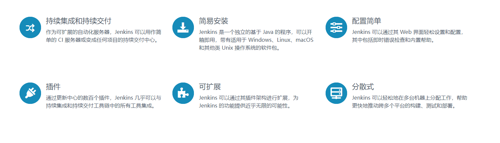

CI全称 Continuous Integration，表示持续集成。

CD包含 Continuous Delivery和 Continuous Deployment，分别是持续交付和持续部署。


## 1 创建jenkins的工作目录并赋予权限

mkdir -p /usr/local/jenkins/jenkins_home

cd /usr/local/jenkins 

chown -R 1000 jenkins_home #把当前目录的拥有者赋值给uid 1000


## 2.先编写docker-compose.yml文件

```java
version: '3.1'
services:
    jenkins:
        image: jenkins/jenkins:lts
        container_name: jenkins
        environment:
            - TZ=Asia/Shanghai
        volumes:
            - /usr/local/jenkins/jenkins_home:/var/jenkins_home
            - /var/run/docker.sock:/var/run/docker.sock
            - /usr/bin/docker:/usr/bin/docker
            - /usr/lib/x86_64-linux-gnu/libltdl.so.7:/usr/lib/x86_64-linux-gnu/libltdl.so.7
        ports:
            - "8086:8080"
        expose:
            - "8086"
            - "50000"
        privileged: true
        user: root
        restart: always
```

volumes 路径改为你自己的 /usr/local/jenkins/jenkins_home


## 3.启动：

docker-compose up -d

## 4.查看密码并登陆

docker logs -f jenkins

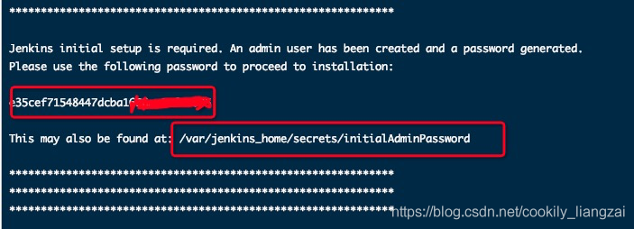


## 5 使用jenkins 

访问 ：http://centos:8080/

输入第4步 上面的密码


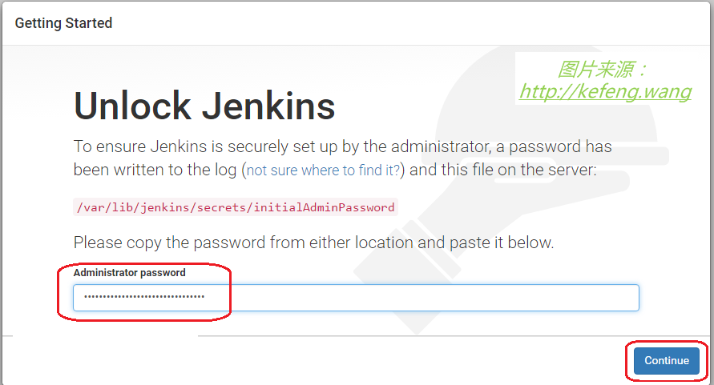


## 6 选择安装插件


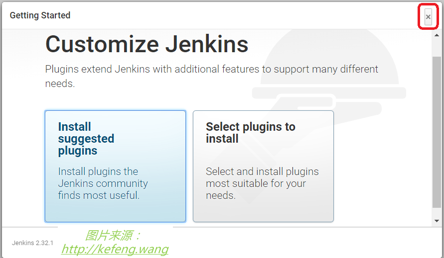


## 7 创建一个管理员账户和密码

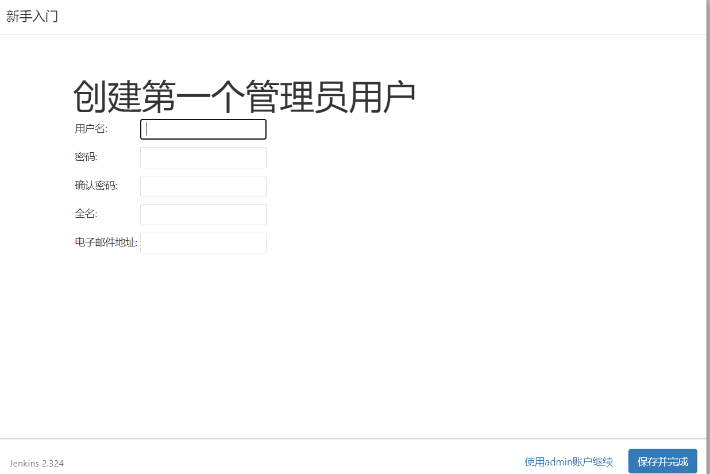

## 8 配置地址


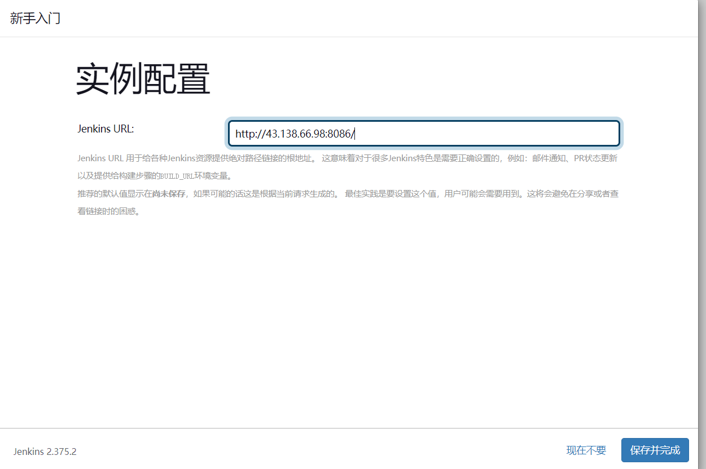


## 9 工具设置

进入：系统管理 / Global Tool Configuration 


$JAVA_HOME 查看我们的java的安装路径

which git 查看我们git安装的路径

JDK 下不勾选“自动安装”，指定别名=JDK-1.8.0.111, JAVA_HOME=/usr/java/jdk1.8.0_111Maven 下不勾选“自动安装”，指定别名=Maven-3.3.9, MAVEN_HOME=/opt/apache-maven-3.3.9点击 Save 按钮。

###  自动安装

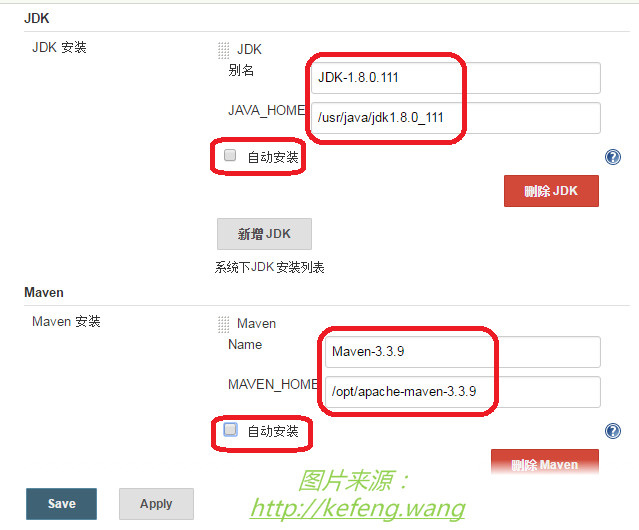

### 手动安装

拷贝JDK到jenkins数据卷目录，解压

```shell
tar -zxvf jdk-8u211-linux-x64.tar.gz
mv jdk1_8_11 jdk
```

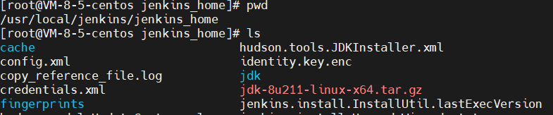

jenkins配置

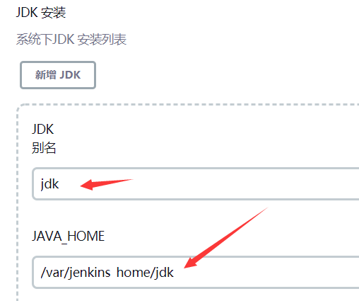

## 10 登陆到jenkins首页

创建项目-->选择maven-->输入项目名称-->选择项目类型


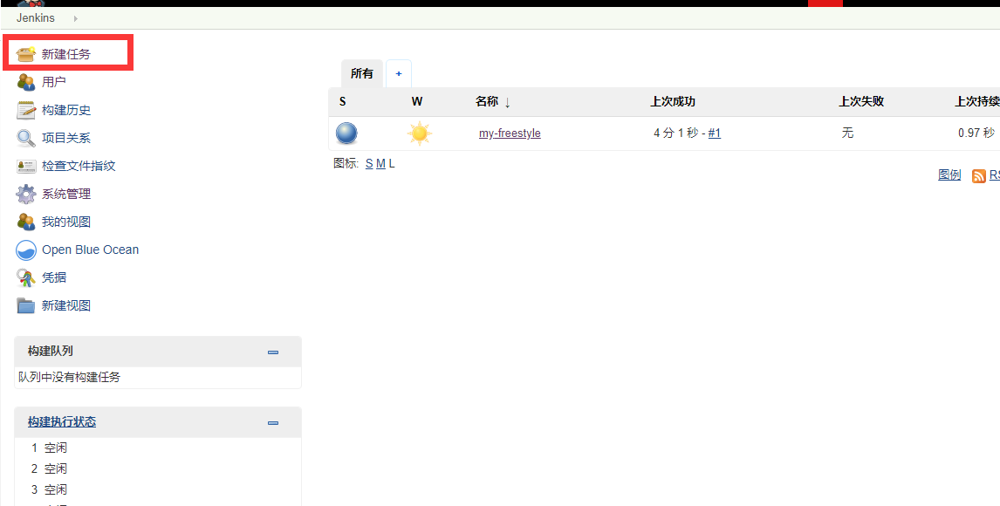


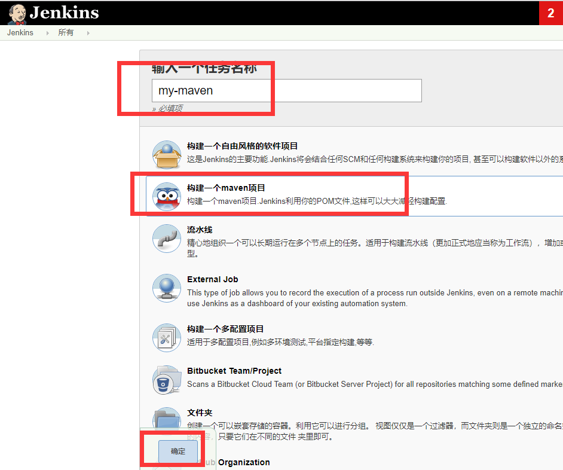


## 11 进入项目配置 

{先写一下项目描述和设置下保留的历史构建，然后向下拉}


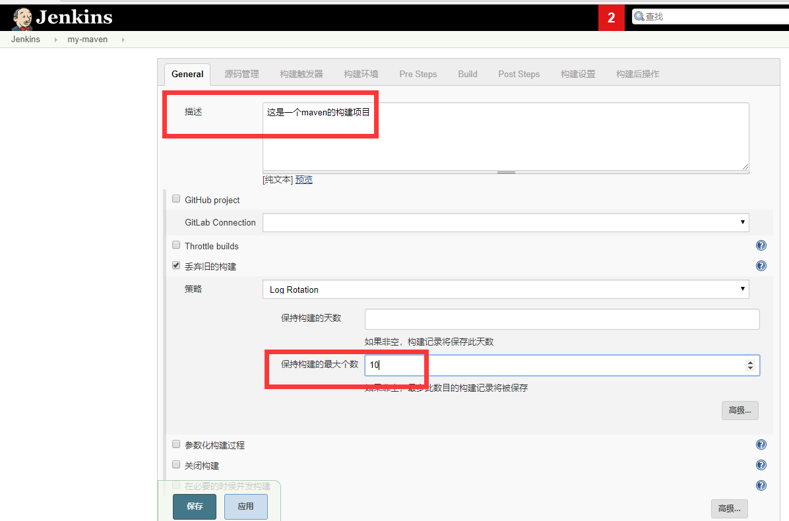


找到源吗管理（这里我们还是使用Gitlab）然后继续向下拉


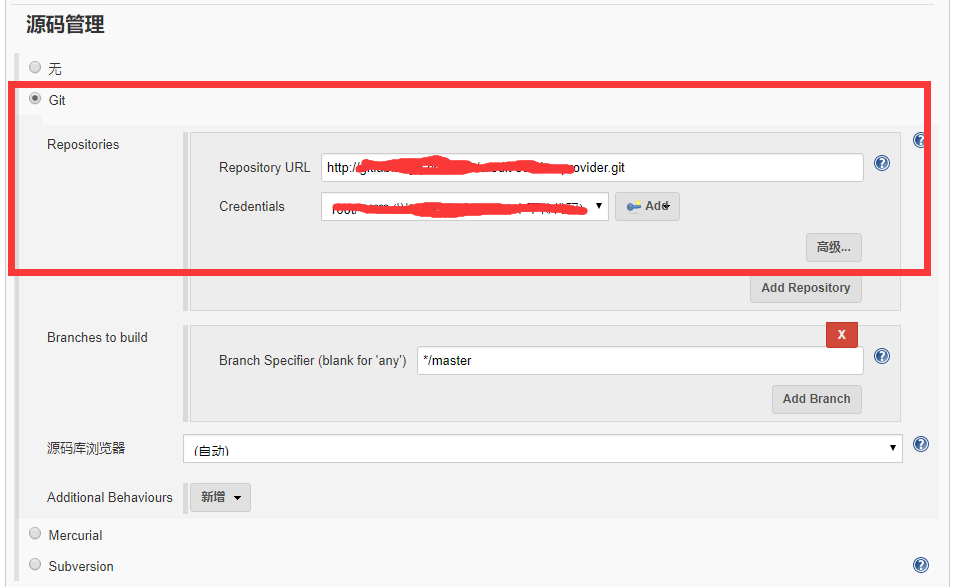


构建前

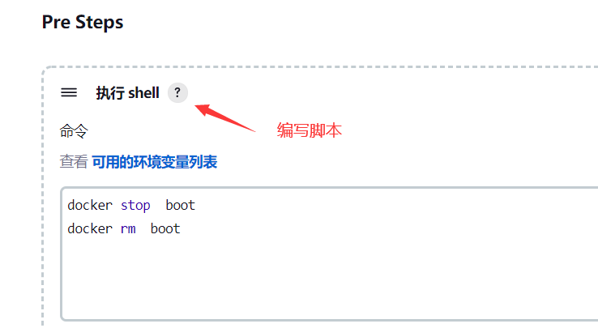


构建后

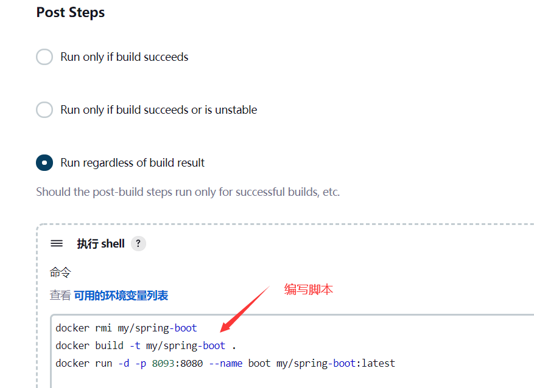


```shell
docker stop  boot
docker rm  boot
docker rmi my/spring-boot
docker build -t my/spring-boot .
docker run -d -p 8093:8080 --name boot my/spring-boot:latest


/usr/local/jenkins/jenkins_home/workspace/jenkins
```


## 12 构建项目

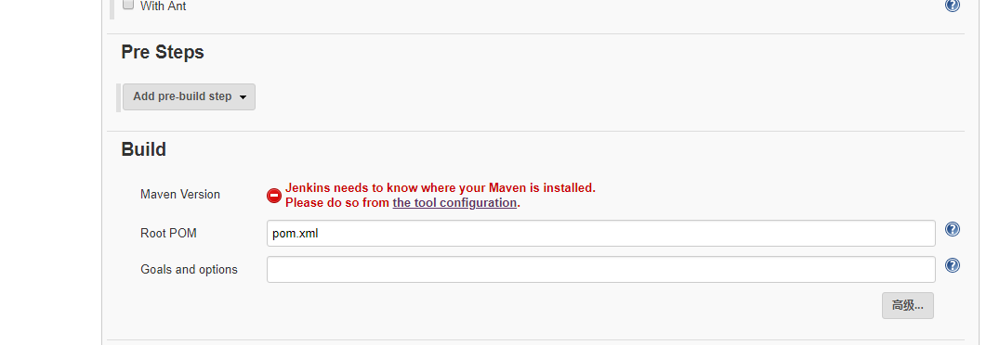

## 13 创建springboot项目

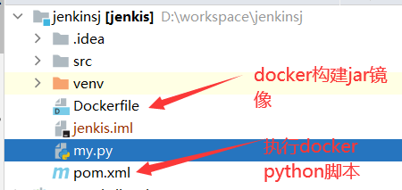

编写Dockerfile文件

```shell
## 基础镜像java
 FROM openjdk:8
 ## 作者是drgaon
 MAINTAINER zgz
 ## 就是你上传的jar包的名称。给jar包起个别名
 ADD target/jenkins.jar jenkins.jar
 ## 就是在容器中以多少端口号运行
 EXPOSE 8080
 ## 容器启动之后执行的命令，java -jar jenkins.jar 即启动jar
 ENTRYPOINT ["java","-jar","jenkins.jar"]
```

编写python脚本

```
#!/usr/bin/python
# -*- coding: UTF-8 -*-
import os
cmd1 = "docker stop boot"
cmd2 = "docker rm boot"
cmd3 = "docker rmi my/spring-boot"
cmd4 = "docker build -t my/spring-boot ."
cmd5 = "docker run -d -p 8093:8080 --name boot my/spring-boot:latest"
os.system(cmd1)
os.system(cmd2)
os.system(cmd3)
os.system(cmd4)
os.system(cmd5)
```

