# 一、引言

## 1、 购买云服务器

>1. 购买服务器:推荐去买阿里或者腾讯云,如果是学生还特别便宜,不是学生就等节日活动买 
>2. 搭建云服务器(其实就是购买时选择的那些)，设置系统和登录密码。这里我选择的是ubuntu系统
>
>其实不同操作系统的云服务器在使用 frp 时操作都是一样的，就是**下载**，**配置**，**运行**。可能有区别的地方就是防火墙相关的配置，不同云服务厂商的镜像不同可能也有一些差别

## 2、frp相关知识

> 使用frp完成远程桌面的连接

经常会在家期间会使用公司电脑，之前使用花生壳、TeamViewer，不是限制流量就是限制使用次数，经常在最关键的时候宕机，后来发现了frp内网映射的方法。

<strong style="color:red">frp 做的是事情就是可通过 公网电脑电脑A 来访问  内网电脑 B,  反之亦可</strong>

比如你有一台机子A。A有外网IP，是一台外网服务器。然后你有一台机子B。B在你的家里面。但是你想要在公司访问你的电脑。

### Ⅰ- frp作用

1. 利用处于内网或防火墙后的机器，对外网环境提供 http 或 https 服务。
2. 对于 http, https 服务支持基于域名的虚拟主机，支持自定义域名绑定，使多个域名可以共用一个80端口。
3. 利用处于内网或防火墙后的机器，对外网环境提供 tcp 和 udp 服务，例如在家里通过 ssh 访问处于公司内网环境内的主机。

### Ⅱ- frp实现功能

1. 外网通过ssh访问内网机器
2. 自定义绑定域名访问内网web服务 (必须需要公网服务器绑定域名)

### Ⅲ- frp下载说明

公网服务器与内网服务器都需要下载frp进行安装 

版本选择:   linux中吧输入命令`arch ` 查看结果，如果是“X86_64“即可选择”amd64”。

这是下载地址的`github页面` -- [`点我传送`](https://github.com/fatedier/frp/releases)

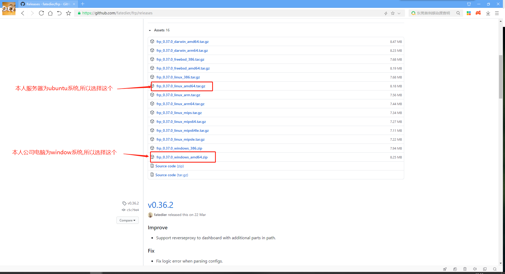


# 二、**服务器操作**

## 1、远程登录系统

>首先登录系统(可以从阿里云网页上直接链接, 也可以用其他软件) 

## 2、服务器终端操作(`Linux系统为例`):

### Ⅰ- 下载frp压缩包

由于本人是`ubuntu`系统,所以进去就是终端,输入命令:  -->[点我查看frp所有版本](https://github.com/fatedier/frp/releases)

```shell
#此命令是下载linux版本的软件,如果其他系统请自行选择
wget https://github.com/fatedier/frp/releases/download/v0.24.1/frp_0.24.1_linux_amd64.tar.gz
```

运行示例:

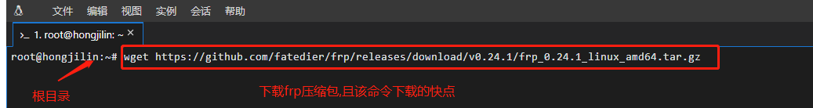

### Ⅱ- 解压

解压文件命令行(后面跟的使下载的版本)：

```shell
tar -zxvf frp_0.24.1_linux_amd64.tar.gz
```

截图示例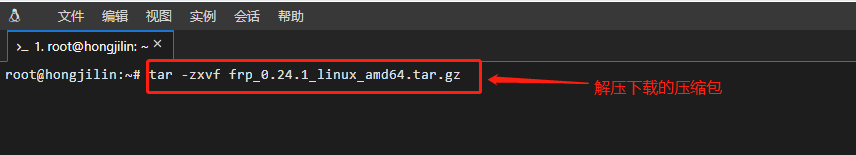 

### Ⅲ- 重命名(方便后续命令行操作将其`简化为frp`)

命令行

```shell
mv frp_0.24.1_linux_amd64 frp
```

截图示例

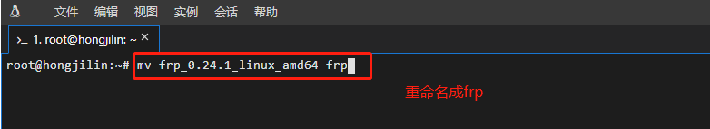 

### IV- 修改配置文件 **`frps.ini`**

  1. `注意`:此处需要先`cd frp`,再`vim frps.ini`

     ```shell
     cd frp  #先进入到frp文件目录中
     vim frps.ini  #在frp文件目录中找到frps.ini配置文件且进行修改
     ```

     截图示例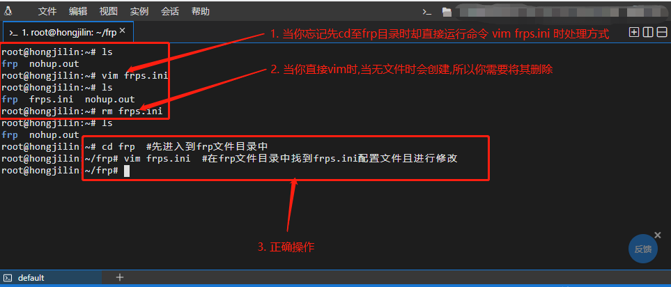

  2. 写入配置

     ```shell
     [common]
     #服务器开放的端口
     bind_port = 7000
     ```

     截图示例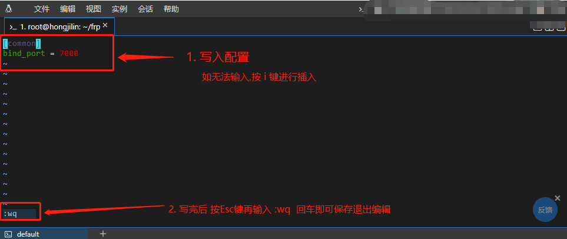

## 3、云服务器管理平台操作(`以阿里云为例`)

1. 此处以`阿里云旧版为例`(右上角可以切换新旧版本)

2. 选择安全组配置  (也可以直接左侧导航栏菜单选择`安全组`)

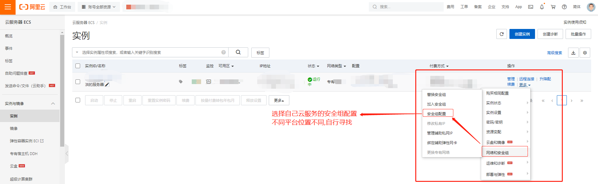

3. 点击出现的配置规则

 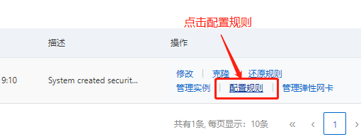 

4. 添加安全组规则

 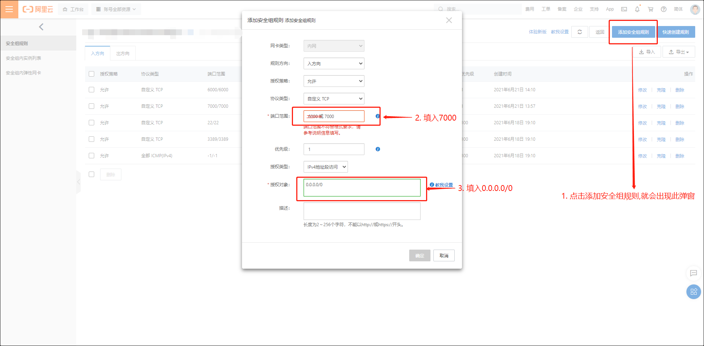

5. 至此云平台设置完成:`其实只是设置了安全组规则`

## 4、在内网目标主机上运行客户端程序

> 此步通常是都配置完成后连接使用

**nohup** :英文全称 no hang up（不挂起），用于在系统后台不挂断地运行命令，退出终端不会影响程序的运行。

**nohup** 命令，在默认情况下（非重定向时），会输出一个名叫 nohup.out 的文件到当前目录下，如果当前目录的 nohup.out 文件不可写，输出重定向到 **$HOME/nohup.out** 文件。

`终端命令`:

```shell
cd frp  #进入到frp目录
nohup ./frpc -c frpc.ini 
```

`success`:查看 nohup.out 的信息

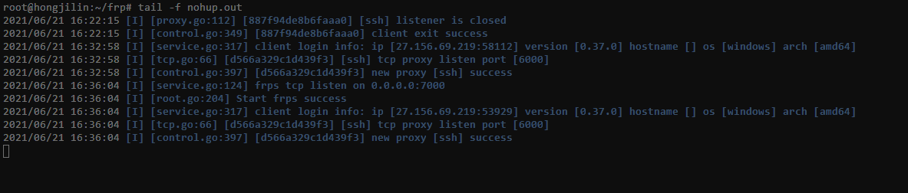

本质: 就是服务器远程连接本地

# 三、客户端配置(个人 or 公司电脑 or 学校电脑)

> 此处默认是`window`系统,如果是linux,那就参考上面,如果服务端也是window,那么就按照这个来

## 1、下载安装包、解压

>上面预先准备部分已经给出frp下载说明-->[点我传送](#Ⅲ - frp下载说明)

## 2、然后配置**frpc.ini**文件

```
[common]
server_addr = 上述配置的阿里云服务器端ip（公网ip）
server_port = 7000 #对应服务器配置中的端口

[ssh]
type = tcp
local_ip = 自己电脑的ip
local_port = 3389
remote_port = 6000
```

## 3、客服端添加端口出站规则：将端口**3389**添加到出站规则中

控制面板-->系统和安全-->防火墙-->高级设置-->出站规则-->新建规则-->...

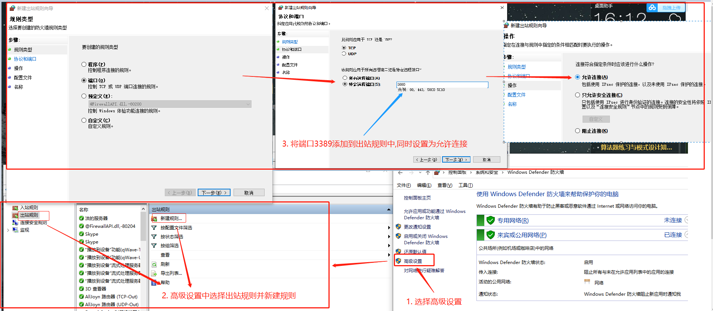

## 4、在公网服务器上运行服务端程序

在Dos中启动服务：win+R 输入cmd

1. 需要`先进入frp目录`后执行如下操作：
2. `将自己暴露出去,使外界能远程`

 ```shell
nohup ./frps -c frps.ini # 在公网服务器上运行服务端程序 
 ```

 运行示例:

 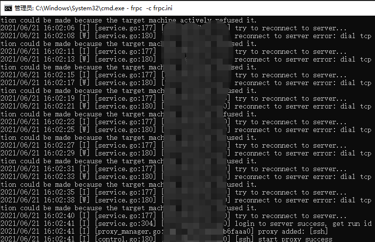 

2. `success`:查看 nohup.out 的信息， -->如果安装`winsw`后日志存在`winse.out.log`中

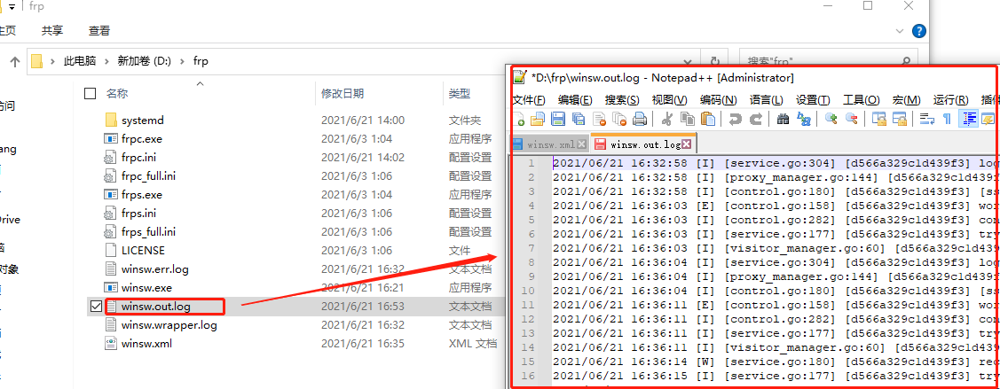

`ps`:远程访问地址--(阿里云服务公网IP):6000(端口号，remote_port)

# 四、设置开启自启动客户端frpc

服务器一般不会经常重启，但是自己的电脑涉及到经常重启问题，所以需要设置`开启自启动客户端frpc`：

1. 下载 `winsw` :  --> [`点我传送`](https://github.com/kohsuke/winsw/releases)

 改名为winsw.exe，放到frp相同的目录里，并在同一个目录里创建一个utf8编码的文本文件，文件名是 winsw.xml，内容是

 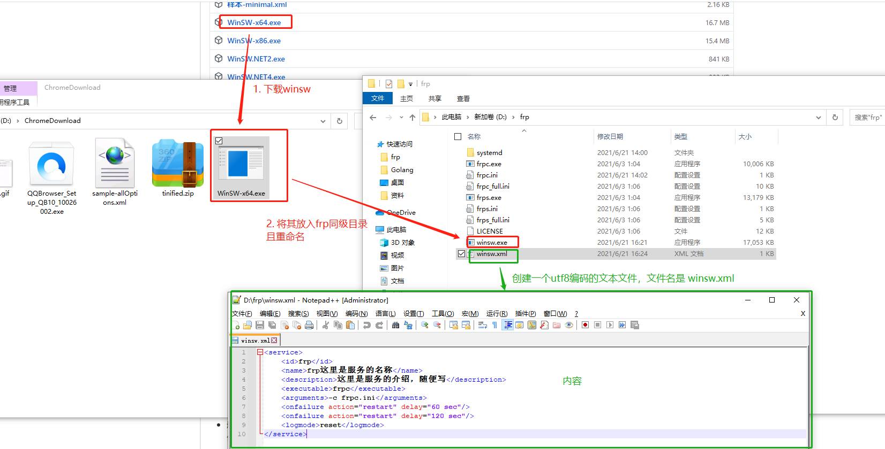

2. **启动：**以管理员权限打开一个命令窗口，cd到frp所在目录，执行：

 ```shell
winsw install
winsw start
 ```

3. 卸载服务

 ```shell
winsw stop
winsw uninstall
 ```

4. 截图示例


#  **五、远程访问方式**

- Linux远程连接：（ssh user_name@公网IP -p 6002）

```shell
[root@frp-server ~]# ssh root@49.232.149.81 -p 6002
root@49.232.149.81's password:
Last login: Tue Feb 28 09:49:28 2023 from 127.0.0.1
[root@frp-client ~]#
```

- Windows远程连接：进入远程连接桌面界面并连接（公网IP:端口）


