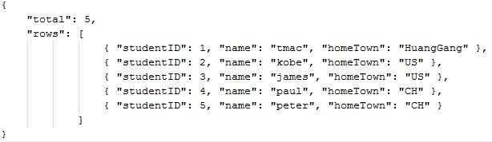
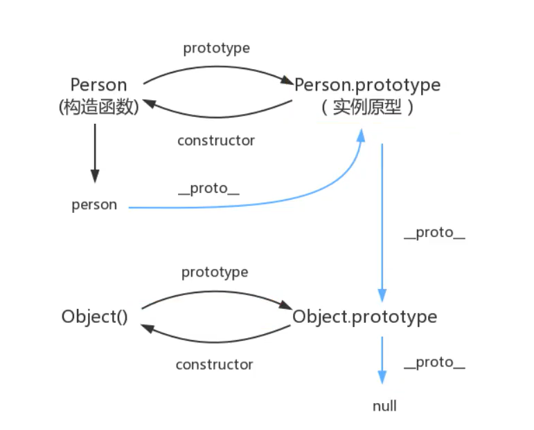
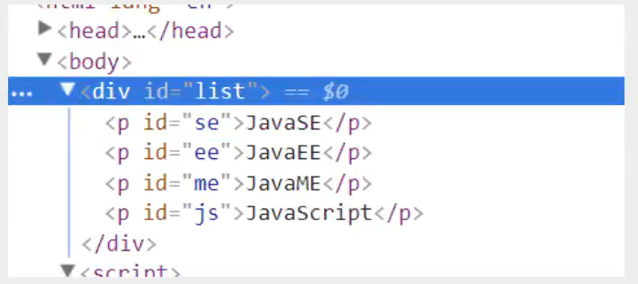
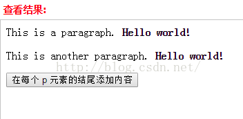
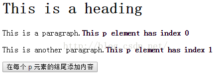
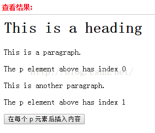
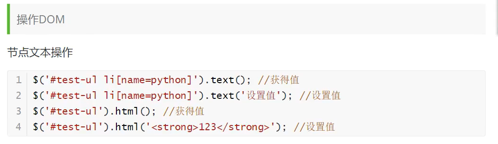
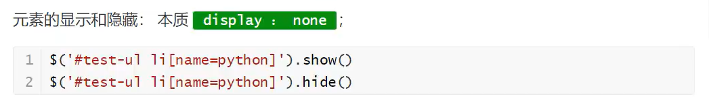

# javaScript使用方式

1、内部标签

```html
<script>
//......
</script>
```

+ 放在head  整个页面加载完成之前就进行读取。
+ 放在body 是在页面加载完成之后进行读取的。
  + 如果你的某段js中是涉及页面某个元素的获取之类的代码，如果把这段js 直接放到head 那在页面渲染的时候就会报undefind 错误。
  + 当js是给某个按钮绑定了onclick时间的时候 我们可以放到head之间。

2、外部引入

```html
<script src="abc.js"></script>
```

# 运算符

比较运算符：

- = 如果1=’1’,则为false

- == 等于 类型不一样，值一样，也会判断为true

- === 绝对等于，类型一样，值一样，判断为true

- **这是js的缺陷，尽量不使用==比较**

浮点数问题：

```JS
`console.log((1/3)===(1-2/3))`
结果为false，尽管数值是都等于1/3
尽量避免使用小数计算，因为精度问题
```

# 数据类型

JS的数据类型:  通过typeof来检测，得到的数据类型有 `String`、`number`、`boolean`、`null`、`undefined`、`Object` (Object是一切数据的基础)

typeof操作符

```js
console.log(typeof qqqq);//undefined，这个变量没有定义,但是不会报错；qqqq此时是变量；
console.log(typeof (222));//number，是一个数字； typeof是操作符而不是方法，所以后面可以加()也可以不加；
console.log(typeof "222");//string，是一个字符串
console.log(typeof false);//boolean，是一个布尔值
console.log(typeof {});//object 是一个对象
console.log(typeof null);//objecy 是一个对象，在javascript里，null是一个空指针；
console.log(typeof function(){});//function，是一个方法，也是属于object类型的；js里万物皆对象
```

## string

### 字符串的特性

- 由0个或多个16位unicode字符组成； 

- 引号:  单引号和双引号都可以(但是单引号和双引号不能交叉使用, 放在引号内的任何东西都是属于字符串，即使里面没有东西或者空格，都属于合法的字符串 ）

  ```js
  var str1="2";
  var str2='2';
  var str3="";
  var str4=" ";
  var str5="function(){}";
  //上面都是合法的string类型
  console.log(typeof str1);
  console.log(typeof str2);
  console.log(typeof str3);
  console.log(typeof str4);
  console.log(typeof str5);	
  ```

- 使用.length属性可以访问字符串的长度;

length计算包括空格

```js
//字符串长度
var strTest1="zhuanbang";//共9个
var strTest2="朱邦邦的JavaScript学习笔记";//共18
console.log(strTest1.length);//9
console.log(strTest2.length);//18
//这只是个简单的判断，如果想用JavaScript判断或者获取所占的字节，就不能这么判断了，因为中文和英文字符所占的字节长度不同，所以要想获得中文字符的真正长度，就需要对输入的字符进行判断或过滤(可以unicode区间进行判断)，如果符合中文字符，则使用不同的标准。	
```

- 无法精确返回双字节字符长度(上面已经做说明)
- 转义序列表示一个字符
- 字符串一旦被创建，其值是不能改变的，若要改变必须销毁原有字符串，然后用另一个包含新值的字符串填充改变量；

转义序列；

- \n 换行，常用的,这个需要记住；
- \ \ 斜杠\是常用转义使用的
  - \’单引号 常用
  - \”双引号 常用

- \t 制表符
- \b 空格
- \r 回车符
- \f 分页符
- \xnn 十六进制，n代表0-F
- \unnnn 以十六进制代码表示一个unicode字符

### 字符串拼接

#### 一、使用连接符 +

```js
let shy = '帅哥'
let a =  '我是' + shy
console.log(a)  // 我是帅哥
```

#### 二、数组api join拼接

```js
let arr = ['hello','java','script']
let str = arr.join("")
console.log(str) // hellojavascript
// join('--') 这个是可以换的 换--就是用--拼接
```

#### 三、末班字符串 俩 ` 拼接

```js
let a = 'java'
let b = `hello ${a}script`
console.log(b) // hellojavascript
```

#### 四、使用 js的 concat() 方法连接字符串

concat() 方法用于连接两个或多个数组或者字符串。该方法不会改变现有的数组，仅会返回被连接的新数组。

```js
let a = ['java']
let b = ['script']

let str = a.concat(b)
console.log(str)  //  ["java", "script"]
12345
let a = 'a'
let b= 'b'
console.log(a.concat(b)) // ab 
```

- Eval()

  计算字符串表达式的值并以数值形式返回；

  ```js
  var evalVal="1+2+5+8+10";
  console.log(typeof evalVal);//string
  var evalComputed=eval(evalVal);
  console.log(evalComputed,typeof evalComputed);//26 "number"
  ```

##  number

包含：正数、负数、零、小数、以及特殊的NaN, 不区分小数和整数

```js
123 //整数123
123.1 //浮点数123.1
1.123e3 //科学计数法
-99  //负数
NaN  //not a number
Infinity //表示无限大
```

数值范围（仅作了解）

- 最小值 Number.MIN_VALUE
- 最大值 Number.MAX_VALUE：
- 超出范围
  - 正无穷
    - Infinity
    - Number.POSITIVE_INFINTY
  - 负无穷
    - -Infinity
    - Number.NEGATIVE_INFINITY
  - 缺陷
    - 无法参与下一次计算
  - 检测方法，用isFinite
    - 超出范围 false
    - 合法范围true

NaN

- 非数值,不是一个数值，但是NaN属于数值类型；


- 特点

  - 任何涉及NaN的操作都将返回NaN
  - NaN与人和数值都不相等包括其自身console.log(NaN==NaN)  //err

- 检测 isNaN

  - 是数值，返回false

  - 不是数值，返回true

    //isNaN
    var age=25;
    var ageError=25-"男";
    console.log(isNaN(age));//false       age这个值不是一个数，对吗？      -> 不对  ->false
    console.log(isNaN(ageError));//true   ageError这个值不是一个数，对吗？ -> 对    ->true

## boolean

<font color = red>0、NaN、””、null、undefined、false本身；只有这六个是false类型的；其它都是true；</font>

- true为真，flase为假（false是布尔值，而Flase只是标识符）；通常用在if/else的判断语句中（如果需要的话，通常还会配合逻辑与&&，逻辑或||来完成）

- true不一定=1；flase不一定=0；

- 使用boolean()进行转换；任何数据类型的值调用Boolean()函数，都会返回一个Boolean值；也可以用(!/!!来转换)

  - true

    - Boolean的true本身
    - 任何非空字符串
    - 任何非零数值
    - 对象

  - flase

    - false本身

    - 空字符串

    - 0和NaN

          console.log(0===(-0));//true

    - null和undefined

## null 和 undefined

+ null 空
+ undefined 未定义

#### 一、相同点：

1、都是原始类型的值，且保存在栈中变量本地
2、进行条件判断时，两者都是false：

```js
console.log(undefined == null);//true  
```

#### 二、不同点

1、null是js的关键字，表示空值；undefined不是js的关键字，它是一个全局变量
2、null是Object的一个特殊值，如果一个Object为null，表示这个对象不是有效对象，null是一个不存在的对象的占位符；undefined是Globel的一个属性
3、类型不一样：

```js
 typeof(null) // object
 typeof(undefined) //undefined
 console.log(typeof(null) === 'object')//true
 console.log(typeof(undefied) === 'undefined')//true
```

4、转换的值不一样：

```js
console.log(Number(undefined));//NaN
console.log(Number(11+ undefined));//NaN

console.log(Number(null));//0
console.log(Number(11+ null));//11
```

#### 三、null何时使用

当需要释放一个对象的时候可以将该对象赋值为null，进而来释放对象

```bash
var a = {
  a:1,
  b:2
};
a = null;
12345
```

#### null、undefined是怎么产生的

1、产生null方式一：当访问一个不存的DOM节点时

```bash
console.log(document.getElementById(“#aaaaaaa”));//null
```

2、产生null方式二:Object的[原型链](https://so.csdn.net/so/search?q=原型链&spm=1001.2101.3001.7020)终点：

```bash
console.log(Object.prototype.__proto__)；//null
```

1、产生undefined方式一：声明了变量但未赋值：

```bash
var a;
console.log(a);//undefined
```

2、产生undefined方式二：对象的属性没有赋值的情况下：

```bash
var obj = {a:1}; 
console.log(obj.age)//undefined
```

3、产生undefined方式三：函数调用的时候，函数的参数没有提供的情况下：

```bash
function add(num){ 
 console.log(num)
}; 
add();//undefined
```

4、产生undefined方式四：当函数没有返回值的情况下：

```bash
var a = function(){};
console.log(a())//undefined
```

## 数组

###  一、创建数组

==java的数值必须是相同类型的对象，js中不一样，数组课存放不同类型==

注意: 此数组和java,c++的不一样

####  1.使用数组字面量表示法

```js
var arr4 = [];   //创建一个空数组
var arr5 = [20];   // 创建一个包含1项数据为20的数组
var arr6 = ["lily","lucy","Tom"];   // 创建一个包含3个字符串的数组
```

#### 2.使用 Array 构造函数

```js
var arr1 = new Array();   //创建一个空数组**
```

```js
var arr3 = new Array("lily","lucy","Tom");   // 创建一个包含3个字符串的数组
var array4 = new Array('23'); // ["23"]
```

#### 3.Array.of 方法创建数组

ES6 为数组新增创建方法的目的之一，是帮助开发者在使用 Array 构造器时避开 js 语言的一个怪异点。

**Array.of()方法总会创建一个包含所有传入参数的数组，而不管参数的数量与类型。**

```js
let arr = Array.of(1, 2);
console.log(arr.length);//2

let arr1 = Array.of(3);
console.log(arr1.length);//1
console.log(arr1[0]);//3

let arr2 = Array.of('2');
console.log(arr2.length);//1
console.log(arr2[0]);//'2'
```

####  4.Array.from 方法创建数组(es6 新增)

在 js 中将**非数组对象转换为真正的数组**是非常麻烦的。在 ES6 中，将可迭代对象或者类数组对象作为第一个参数传入，Array.from()就能返回一个数组。

```js
function arga(...args) {  //...args剩余参数数组,由传递给函数的实际参数提供
    let arg = Array.from(args);
    console.log(arg);
}

arga('arr1', 26, 'from'); // ['arr1',26,'from']
```

### 二、数组方法

1、长度

```js
arr.length
```

2、indexOf()，通过元素获得下标索引

```js
arr.indexOf(2) //找到元素为2的下标
```

3、slice(),截取数组的一部分，返回一个新数组，类似于String中的substring

4、push()、pop() 在尾部操作元素

```js
push(): 压入元素到尾部  
pop(): 弹出尾部的一个元素
```

5、unshift()、shift() 在头部操作

```js
unshift: 压入元素到头部    shift： 弹出头部的一个元素
```

6、sort() 排序

7、reverse() 元素反转

8、concat() 拼接元素

```js
arr = ['a','b','c']
arr.concat([1,2,3]) //拼接新数组 
打印arr.concat([1,2,4])为['a','b','c',1,2,3] 
但是打印原数组arr则跟之前一样：['a','b','c']
```

注意：concat并没有修改数组，只是会返回新数组

9、join 连接符 打印拼接数组，使用特定的字符串连接

```js
 arr = ['a','b','c']    arr.join("-")    ->"a-b-c"
```

10、javascript中所有的键都是字符串，值是任意对象

补充

+ arr.length:  长度

- `join()`：用指定的分隔符将数组每一项拼接为字符串
- `push()` ：向数组的末尾添加新元素
- `pop()`：删除数组的最后一项
- `shift()`：删除数组的第一项
- `unshift()`：向数组首位添加新元素
- `slice()`：按照条件查找出其中的部分元素
- `splice()`：对数组进行增删改
- `fill()`: 方法能使用特定值填充数组中的一个或多个元素
- `filter()`:“过滤”功能
- `concat()`：用于连接两个或多个数组
- `indexOf()`：检测当前值在数组中第一次出现的位置索引
- `lastIndexOf()`：检测当前值在数组中最后一次出现的位置索引
- `every()`：判断数组中每一项都是否满足条件
- `some()`：判断数组中是否存在满足条件的项
- `includes()`：判断一个数组是否包含一个指定的值
- `sort()`：对数组的元素进行排序
- `reverse()`：对数组进行倒序
- `forEach()`：ES5 及以下循环遍历数组每一项
- `map()`：ES6 循环遍历数组每一项
- `copyWithin()`:用于从数组的指定位置拷贝元素到数组的另一个指定位置中
- `find()`:返回匹配的值
- `findIndex()`:返回匹配位置的索引
- `toLocaleString()、toString()`:将数组转换为字符串
- `flat()、flatMap()`：扁平化数组
- `entries() 、keys() 、values()`:遍历数组

~~~js
#### **1.join()**

`join()`方法用于把数组中的所有元素转换一个字符串。

元素是通过指定的分隔符进行分隔的。默认使用逗号作为分隔符

```js
var arr = [1,2,3];
console.log(arr.join());   // 1,2,3
console.log(arr.join("-"));   // 1-2-3
console.log(arr);   // [1, 2, 3]（原数组不变）
```

通过**join()方法可以实现重复字符串**，只需传入字符串以及重复的次数，就能返回重复后的字符串，函数如下：

```js
function repeatString(str, n) {
//一个长度为n+1的空数组用string去拼接成字符串,就成了n个string的重复
 return new Array(n + 1).join(str);
}
console.log(repeatString("abc", 3));   // abcabcabc
console.log(repeatString("Hi", 5));   // HiHiHiHiHi
```

#### **2.push()和 pop()**

`push()` 方法**从数组末尾向数组添加元素**，可以添加一个或多个元素。

`pop()` 方法用于**删除数组的最后一个元素**并返回删除的元素。

```js
var arr = ["Lily","lucy","Tom"];
var count = arr.push("Jack","Sean");
console.log(count);  // 5
console.log(arr);   // ["Lily", "lucy", "Tom", "Jack", "Sean"]
var item = arr.pop();
console.log(item);   // Sean
console.log(arr);   // ["Lily", "lucy", "Tom", "Jack"]
```

#### **3.shift() 和 unshift()**

`shift()` 方法用于**把数组的第一个元素从其中删除**，并返回第一个元素的值。

`unshift()` 方法可**向数组的开头添加一个或更多元素**，并返回新的长度。

```js
var arr = ["Lily","lucy","Tom"];
var count = arr.unshift("Jack","Sean");
console.log(count);   // 5
console.log(arr);   //["Jack", "Sean", "Lily", "lucy", "Tom"]
var item = arr.shift();
console.log(item);   // Jack
console.log(arr);   // ["Sean", "Lily", "lucy", "Tom"]
```

#### **4.sort()**

sort() 方法用于对数组的元素进行排序。

排序顺序可以是字母或数字，并按升序或降序。

默认排序顺序为按字母升序。

```js
var arr1 = ["a", "d", "c", "b"];
console.log(arr1.sort());   // ["a", "b", "c", "d"]
arr2 = [13, 24, 51, 3];
console.log(arr2.sort());   // [13, 24, 3, 51]
console.log(arr2);   // [13, 24, 3, 51](元数组被改变)
```

为了解决上述问题，sort()方法可以接收一个比较函数作为参数，以便我们指定哪个值位于哪个值的前面。

比较函数接收两个参数，如果第一个参数应该位于第二个之前则返回一个负数，如果两个参数相等则返回 0，如果第一个参数应该位于第二个之后则返回一个正数。以下就是一个简单的比较函数：

```js
function compare(value1, value2) {
    if (value1 < value2) {
     return -1;
    } else if (value1 > value2) {
     return 1;
    } else {
     return 0;
    }
}
arr2 = [13, 24, 51, 3];
console.log(arr2.sort(compare));   // [3, 13, 24, 51]
```

如果需要通过比较函数产生降序排序的结果，只要交换比较函数返回的值即可：

```js
function compare(value1, value2) {
    if (value1 < value2) {
     return 1;
    } else if (value1 > value2) {
     return -1;
    } else {
     return 0;
    }
}
arr2 = [13, 24, 51, 3];
console.log(arr2.sort(compare));   // [51, 24, 13, 3]
```

#### **5.reverse()**

reverse() 方法用于颠倒数组中元素的顺序。

```js
var arr = [13, 24, 51, 3];
console.log(arr.reverse());   //[3, 51, 24, 13]
console.log(arr);   //[3, 51, 24, 13](原数组改变)
```

#### **6.concat()**

concat() 方法用于连接两个或多个数组。

该方法不会改变现有的数组，而仅仅会返回被连接数组的一个副本。

```js
var arr = [1,3,5,7];
var arrCopy = arr.concat(9,[11,13]);
console.log(arrCopy);   //[1, 3, 5, 7, 9, 11, 13]
console.log(arr);   // [1, 3, 5, 7](原数组未被修改)
```

从上面测试结果可以发现：传入的不是数组，则直接把参数添加到数组后面，如果传入的是数组，则将数组中的各个项添加到数组中。但是如果传入的是一个二维数组呢？

```js
var arrCopy2 = arr.concat([9,[11,13]]);
console.log(arrCopy2);   //[1, 3, 5, 7, 9, Array[2]]
console.log(arrCopy2[5]);   //[11, 13]
```

#### **7.slice()**

slice()：返回从原数组中指定开始下标到结束下标之间的项组成的新数组。

slice()方法可以接受一或两个参数，即要返回项的起始和结束位置。

在**只有一个参数**的情况下， slice()方法返回从该参数指定位置开始到当前数组末尾的所有项。

如果**有两个参数**，该方法返回起始和结束位置之间的项，但不包括结束位置的项。

**当出现负数时，将负数加上数组长度的值（6）来替换该位置的数**

```js
var arr = [1,3,5,7,9,11];
var arrCopy = arr.slice(1);
var arrCopy2 = arr.slice(1,4);
var arrCopy3 = arr.slice(1,-2);//相当于arr.slice(1,4)
var arrCopy4 = arr.slice(-4,-1);//相当于arr.slice(2,5)
console.log(arr);   //[1, 3, 5, 7, 9, 11](原数组没变)
console.log(arrCopy);   //[3, 5, 7, 9, 11]
console.log(arrCopy2);   //[3, 5, 7]
console.log(arrCopy3);   //[3, 5, 7]
console.log(arrCopy4);   //[5, 7, 9]
```

#### **8.splice()**

`splice()`：很强大的数组方法，它有很多种用法，可以**实现删除、插入和替换**。

\######## 1.删除元素,并返回删除的元素

可以删除任意数量的项，只需指定 2 个参数：要删除的第一项的位置和要删除的项数。例如， splice(0,2)会删除数组中的前两项。

```js
var arr = [1,3,5,7,9,11];
var arrRemoved = arr.splice(0,2);
console.log(arr);   //[5, 7, 9, 11]
console.log(arrRemoved);   //[1, 3]
```

\######## 2.向指定索引处添加元素

可以向指定位置插入任意数量的项，只需提供 3 个参数：起始位置、 0（要删除的项数）和要插入的项。例如，splice(2,0,4,6)会从当前数组的位置 2 开始插入 4 和 6。

```js
var array1 = [22, 3, 31, 12];
array1.splice(1, 0, 12, 35);  //[]

console.log(array1); // [22, 12, 35, 3, 31, 12]
```

\######## 3.替换指定索引位置的元素

可以向指定位置插入任意数量的项，且同时删除任意数量的项，只需指定 3 个参数：起始位置、要删除的项数和要插入的任意数量的项。插入的项数不必与删除的项数相等。例如，splice (2,1,4,6)会删除当前数组位置 2 的项，然后再从位置 2 开始插入 4 和 6。

```js
const array1 = [22, 3, 31, 12];
array1.splice(1, 1, 8);   //[3]

console.log(array1);  // [22, 8, 31, 12]
```

### **9.indexOf()和 lastIndexOf()**

**接收两个参数**：要查找的项和（可选的）表示查找起点位置的索引。

`indexOf()`：从数组的开头（位置 0）开始向后查找。

`lastIndexOf`：从数组的末尾开始向前查找。

这两个方法都返回要查找的项在数组中的位置，或者在**没找到的情况下返回-1**。在比较第一个参数与数组中的每一项时，会**使用全等操作符**。

```js
var arr = [1,3,5,7,7,5,3,1];
console.log(arr.indexOf(5));   //2
console.log(arr.lastIndexOf(5));   //5
console.log(arr.indexOf(5,2));   //2
console.log(arr.lastIndexOf(5,4));   //2
console.log(arr.indexOf("5"));   //-1
```

### **10.forEach()**

forEach()：对数组进行遍历循环，对数组中的每一项运行给定函数。这个方法没有返回值。参数都是 function 类型，默认有传，。

**参数分别为**：遍历的数组内容；第对应的数组索引，数组本身

```js
var arr = [11, 22, 33, 44, 55];
arr.forEach(function(x, index, a){
 console.log(x + '|' + index + '|' + (a === arr));
});

输出为：

 11|0|true
 22|1|true
 33|2|true
 44|3|true
 55|4|true
```

### **11.map()**

`map()` 方法返回一个新数组，数组中的元素为原始数组元素调用函数处理后的值。

`map()` 方法按照原始数组元素顺序依次处理元素。

该方法不会改变原数组

```js
var arr = [1, 2, 3, 4, 5];
var arr2 = arr.map(function(item){
 return item*item;
});
console.log(arr2);  //[1, 4, 9, 16, 25]
```

### **12.filter()**

filter()：“过滤”功能，数组中的每一项运行给定函数，返回满足过滤条件组成的数组。

```js
var arr = [1, 2, 3, 4, 5, 6, 7, 8, 9, 10];
var arr2 = arr.filter(function(x, index) {
 return index % 3 === 0 || x >= 8;
});
console.log(arr2);  //[1, 4, 7, 8, 9, 10]
```

### **13.fill() es6 新增**

fill()方法能使用特定值填充数组中的一个或多个元素。当只是用一个参数时，该方法会用该参数的值填充整个数组。

```js
let arr = [1, 2, 3, 'cc', 5];
arr.fill(1);
console.log(arr);//[1,1,1,1,1];
```

如果不想改变数组中的所有元素，而只是想改变其中一部分，那么可以使用可选的起始位置参数与结束位置参数（不包括结束位置的那个元素）

**3 个参数：** 填充数值，起始位置参数，结束位置参数（不包括结束位置的那个元素）

```js
let arr = [1, 2, 3, 'arr', 5];

arr.fill(1, 2);
console.log(arr);//[1,2,1,1,1]

arr.fill(0, 1, 3);
console.log(arr);//[1,0,0,1,1];
```

### **14.every()**

every()：判断数组中每一项都是否满足条件，只有所有项都满足条件，才会返回 true。

```js
var arr = [1, 2, 3, 4, 5];
var arr2 = arr.every(function(x) {
 return x < 10;
});
console.log(arr2);  //true
var arr3 = arr.every(function(x) {
 return x < 3;
});
console.log(arr3);  // false
```

### **15.some()**

some()：判断数组中是否存在满足条件的项，只要有一项满足条件，就会返回 true。

```js
var arr = [1, 2, 3, 4, 5];
var arr2 = arr.some(function(x) {
 return x < 3;
});
console.log(arr2);  //true
var arr3 = arr.some(function(x) {
 return x < 1;
});
console.log(arr3);  // false
```

### **16.includes() es7 新增**

includes() 方法用来判断一个数组是否包含一个指定的值，如果是返回 true，否则 false。

**参数有两个**，其中第一个是（必填）需要查找的元素值，第二个是（可选）开始查找元素的位置

```js
const array1 = [22, 3, 31, 12, 'arr'];
const includes = array1.includes(31);
console.log(includes); // true

const includes1 = array1.includes(31, 3); // 从索引3开始查找31是否存在
console.log(includes1); // false
```

需要注意的是：includes**使用===运算符**来进行值比较，仅有一个例外：**NaN 被认为与自身相等**。

```js
let values = [1, NaN, 2];
console.log(values.indexOf(NaN));//-1
console.log(values.includes(NaN));//true
```

### **17.reduce()和 reduceRight()**

这两个方法都会实现迭代数组的所有项(即累加器)，然后构建一个最终返回的值。

`reduce()`方法从数组的第一项开始，逐个遍历到最后。

`reduceRight()`则从数组的最后一项开始，向前遍历到第一项。

**4 个参数**：前一个值、当前值、项的索引和数组对象

```js
var values = [1,2,3,4,5];
var sum = values.reduceRight(function(prev, cur, index, array){
return prev + cur;
},10);   //数组一开始加了一个初始值10,可以不设默认0
console.log(sum);  //25
```

### **18.toLocaleString() 和 toString()**

将数组转换为字符串

```js
const array1 = [22, 3, 31, 12];
const str = array1.toLocaleString();
const str1 = array1.toString();

console.log(str); // 22,3,31,12
console.log(str1); // 22,3,31,12
```

### **19. find()和 findIndex()**

find()与 findIndex()方法均接受两个参数：一个回调函数，一个可选值用于指定回调函数内部的 this。

该回调函数可接受三个参数：数组的某个元素，该元素对应的索引位置，以及该数组本身。

该回调函数应当在给定的元素满足你定义的条件时返回 true，而 find()和 findIndex()方法均会在回调函数**第一次返回 true 时停止查找**。

**二者的区别是**：find()方法返回匹配的值，而 findIndex()返回匹配位置的索引。

```js
let arr = [1, 2, 3, 'arr', 5, 1, 9];

console.log(arr.find((value, keys, arr) => {
    return value > 2;
})); // 3 返回匹配的值

console.log(arr.findIndex((value, keys, arr) => {
    return value > 2;
})); // 2 返回匹配位置的索引
```

### **20.copyWithin() [es6 新增]**

copyWithin() 方法用于从数组的指定位置拷贝元素到数组的另一个指定位置中。

该方法会改变现有数组

```js
//将数组的前两个元素复制到数组的最后两个位置
let arr = [1, 2, 3, 'arr', 5];

arr.copyWithin(3, 0);
console.log(arr);//[1,2,3,1,2]
```

默认情况下，copyWithin()方法总是会一直复制到数组末尾，不过你还可以提供一个可选参数来限制到底有多少元素会被覆盖。这第三个参数指定了复制停止的位置（不包含该位置本身）。

```js
let arr = [1, 2, 3, 'arr', 5, 9, 17];

//从索引3的位置开始粘贴
//从索引0的位置开始复制
//遇到索引3时停止复制
arr.copyWithin(3, 0, 3);
console.log(arr);//[1,2,3,1,2,3,17]
```

### **21.flat() 和 flatMap() es6 新增**

flat() 方法会按照一个可指定的深度递归遍历数组，并将所有元素与遍历到的子数组中的元素合并为一个新数组返回。

**该方法返回一个新数组，对原数据没有影响。**

**参数：** 指定要提取嵌套数组的结构深度，默认值为 1。

```js
const arr1 = [0, 1, 2, [3, 4]];

console.log(arr1.flat());
// expected output: [0, 1, 2, 3, 4]

const arr2 = [0, 1, 2, [[[3, 4]]]];

console.log(arr2.flat(2));
// expected output: [0, 1, 2, [3, 4]]

//使用 Infinity，可展开任意深度的嵌套数组
var arr4 = [1, 2, [3, 4, [5, 6, [7, 8, [9, 10]]]]];
arr4.flat(Infinity);
// [1, 2, 3, 4, 5, 6, 7, 8, 9, 10]

// 扁平化数组空项,如果原数组有空位，flat()方法会跳过空位
var arr4 = [1, 2, , 4, 5];
arr4.flat();
// [1, 2, 4, 5]
```

`flatMap()`方法对原数组的每个成员执行一个函数，相当于执行Array.prototype.map(),然后**对返回值组成的数组执行flat()方法**。

该方法返回一个新数组，不改变原数组。

```js
// 相当于 [[2, 4], [3, 6], [4, 8]].flat()
[2, 3, 4].flatMap((x) => [x, x * 2])
// [2, 4, 3, 6, 4, 8]
```

### **22. entries(),keys() 和 values() 【ES6】**

entries()，keys()和values() —— 用于遍历数组。它们都返回一个遍历器对象，可以用for...of循环进行遍历

区别是**keys()是对键名的遍历**、**values()是对键值的遍历**，**entries()是对键值对的遍历**

```js
for (let index of ['a', 'b'].keys()) {  
console.log(index);  
}  
// 0  
// 1  
for (let elem of ['a', 'b'].values()) {  
console.log(elem);  
}  
// 'a'  
// 'b'  
for (let [index, elem] of ['a', 'b'].entries()) {  
console.log(index, elem);  
}  
// 0 "a"  
// 1 "b" 
```

如果不使用for...of循环，可以手动调用遍历器对象的**next方法**，进行遍历。

let letter = ['a', 'b', 'c'];  
let entries = letter.entries();  
console.log(entries.next().value); // [0, 'a']  
console.log(entries.next().value); // [1, 'b']  
console.log(entries.next().value); // [2, 'c'] 
~~~


## object

### 创建对象

#### 1. {}

```javascript
var person = {
  name: "张三",
  age: 20,
  sayHello: function() {
    console.log("你好，我是" + this.name);
  }
};
```

#### 2. new

```javascript
function Person(name, age) {
  this.name = name;
  this.age = age;
  this.sayHello = function() {
    console.log("你好，我是" + this.name);
  }
}

var person = new Person("张三", 20);
```

#### 3. Object.create() 方法

使用 `Object.create()` 方法创建一个新对象，可以指定该对象的原型对象和属性

```javascript
var person = Object.create(null);
person.name = "张三";
person.age = 20;
person.sayHello = function() {
  console.log("你好，我是" + this.name);
};
```

#### 4. 工厂函数

使用函数返回一个新的对象，可以根据传入的参数动态创建对象。

```javascript
function createPerson(name, age) {
  var person = {};
  person.name = name;
  person.age = age;
  person.sayHello = function() {
    console.log("你好，我是" + this.name);
  };
  return person;
}

var person = createPerson("张三", 20);
```

### 属性

**使用一个不存在的对象属性,不会报错! undefined**

```js
person.haha
undefined
```

**动态的删减属性,通过delete删除对象的属性**

```js
delete person.name
true
```

**动态的添加,直接给新的属性添加值即可**

```js
person.haha = "haha"
"haha"
```

**js对象获取属性有两种方法：**

1. **通过.的方式**
2. **通过[]方式**

```js
// 通过.方式获取属性值，key是静态的
var aa = {name: "zhang", age: 18};
console.log(aa.name);
 
// 通过[]获取属性值, key是动态的，可以是字符串，或者数字的形式
var bb = {"apple": 3, "pear": 2}
var cc = {1: "number1", 2: "number2"}
console.log(bb["apple"]);
console.log(cc[1]);  // 注意这里的写法跟数组容易混淆，cc仍是对象，不是数组
 
// 获取对象所有key的方法
console.log(Object.keys(bb));  // 输出[ 'apple', 'pear' ]
```

### 方法

#### 定义方法

```js
var kuangshen = {
    name:'zhang'，
    bitrh:11,
    // 方法
    age: fuinction () {
        // 今年 - 出生的年
        var now = new Date().getFullYear();
        return now - this.bitrh;
    }
}

//属性
kuangshen.name
//方法
kuangshen.age()
```

#### apply方法
apply方法是可以控制this指向的，该方法有两个参数，第一个是getArg要使用的是那个对象，第二个是数组

```js
function getAge(){
    var now = new Date().getFullYear();
    return now - this.brith;
}
getAge.apply(person,[]); //this指向了person，参数为空
```

## Symbol 类型

Symbol 是JavaScript的原始数据类型，Symbol实例是唯一且不可改变的.可以作为对象属性的标识符使用;

在没有ES6的时候，属性名是很容易被覆盖的；

	比如，你使用了一个他人提供的对象，但又想为这个对象添加新的方法（mixin模式），新方法的名字就有可能与现有方法产生冲突。

**为了从根本上防止属性名的冲突，就是ES6引入Symbol的原因。**

在其他编程语言中 symbol也被称为原子(atoms).

在JavaScript中, Symbol 是 基本数据类型 的一种，Symbol 对象是 Symbol原始值的封装 ,Symbol 类型是 ECMAScript 6 (es6) 中新添加的特性，在ECMAScript 5中没有对应的类型。

Symbol值通过Symbol函数生成。这就是说，对象的属性名现在可以有两种类型;

一是原来就有的字符串，
二是新增的Symbol类型。凡是属性名属于Symbol类型，就都是独一无二的，可以保证不会与其他属性名产生冲突。

    let aloneVal = Symbol();//注意不要用new来生成new；
    console.log(typeof aloneVal);//symbol

注意不要用new来生成new；即时在ES5中，除了使用自己定义构造函数外，也不推荐加new；因为历史遗留原因，ES6中new创建string也支持，但不推荐这么用；

Symbol函数前不能使用new命令，是因为生成的Symbol是一个原始类型的值，不是对象。也就是说，由于Symbol值不是对象，所以不能添加属性。基本上，它是一种类似于字符串的数据类型。

Symbol里面的参数，是描述使用的；仅仅是为了控制输出时候方便识别，没有别的用了；

    const s1 = Symbol('foo');
    const s2 = Symbol('bar');
    console.log(s1,s2);//Symbol(foo) Symbol(bar)

如果不加参数，它们在控制台的输出都是Symbol()，不利于区分。有了参数以后，就等于为它们加上了描述，输出的时候就能够分清，到底是哪一个值。

**注意，Symbol函数的参数只是表示对当前 Symbol 值的描述，因此相同参数的Symbol函数的返回值是不相等的。**

    //和NaN一样，连自己都不等于自己：因为里面的参数只是一个描述;
    console.log(Symbol("foo") == Symbol("foo"));//false
    console.log(Symbol("") == Symbol(""));//false
    console.log(Symbol() == Symbol());//false   连自己都不等于自己：
    const foo = Symbol();
    const bar = Symbol();
    const symbolVal = Symbol("11");
    console.log(typeof foo , typeof bar);//symbol symbol
    console.log(typeof foo === "symbol");//true
    console.log(typeof bar === "symbol");//true
    console.log(bar === bar);//true 当然如果用变量储存，俩个变量是相等的，但这并不说明2个相同Symbol值是相同的
    console.log(bar === foo);//false
    console.log(symbolVal);//Symbol(11)

**Symbol值不能与其他类型的值进行运算，会报错。**

Symbol值不能与其他类型的值进行运算，会报错;但是可以显式转为字符串/布尔值;但是不能转为数值;

    //Symbol不可以进行运算，但是可以转换为字符串和布尔值，但是不能转为数值；
    const sym=Symbol("flag");
    //console.log(sym+"hello baby");// Cannot convert a Symbol value to a string
    console.log(String(sym)+"hello one");//Symbol(flag)hello one
    console.log(sym.toString()+"hello two");//Symbol(flag)hello two
    console.log(Boolean(sym),typeof Boolean(sym));//true "boolean"
    console.log(Number(sym));//Cannot convert a Symbol value to a number

## 基本数据类型的转换

### 一、转换成字符串类型

| 方式           | 说明                         | 案例                                     |
| :------------- | :--------------------------- | :--------------------------------------- |
| toString()     | 转成字符串                   | var num =1; alert ( num.toString());     |
| String()       | 强制转换 转成字符串          | var num =1; alert ( String ( num ));     |
| 加号拼接字符串 | 和字符串拼接的结果都是字符串 | var num =1; alert ( num +＂我是字符串"); |

####  1. 变量.toString()  推荐

```javascript
var num = 10;
var str = num.toString();

console.log(str);         //10
console.log(typeof str);  //string
```

####  2. String(变量)

```javascript
console.log(String(num));  // 10
```

####  3.+拼接

```javascript
console.log(num + '');  //10
```

### 二、转换成数字类型

| 方式                   | 说明                           | 案例                |
| :--------------------- | :----------------------------- | :------------------ |
| parselnt(string)函数   | 将 string 类型转成整数数值型   | parselnt (‘15’)     |
| parseFloat(string)函数 | 将 string 类型转成浮点数数值型 | parseFloat (‘3.14’) |
| Number()强制转换函数   | 将 string 类型转换为数值型     | Number (‘12’)       |
| js 隐式转换(- * /)     | 利用算术运算隐式转换为数值型   | ‘12’ - 0            |

####  1. parseXxx(变量)  推荐

parseXXX(String s);其中XXX表示基本类型，参数为可以转成基本类型的字符串，如果字符串无法转成基本类型，将会发生数字转换的问题 

```javascript
var age = prompt('请输入您的年龄');    

console.log(parseInt(age));
console.log(parseInt('3.14')); // 3 取整
console.log(parseInt('3.94')); // 3 取整
console.log(parseInt('120px')); // 120 会去到这个px单位
console.log(parseInt('rem120px')); // NaN
console.log(parseFloat('3.14')); // 3.14
console.log(parseFloat('120px')); // 120 会去掉这个px单位
console.log(parseFloat('rem120px')); // NaN
```

####  2. Number(变量)

```javascript
var str = '123';
console.log(Number(str));
console.log(Number('12'));
```

####   3.- 拼接

```javascript
console.log('12' - 0); // 12
console.log('123' - '120');
console.log('123' * 1);
```

# 流程控制

## if

```js
var age = 3;
if (age < 3){
	alert("hhhh");
}else if(age > 5){
	alert("hhh~~");
}else{
	alert("~~");
}
```

## while循环

```js
while(age<100){
    age = age +1;
    console.log(age)
}

do{
    age = age +1;
    console.log(age)
}while(age<100)
```

## for循环

```js
for(let i=0; i<100; i++){
	console.log(i)
}
```

## forEach 循环函数

```js
var age = [12,3,12,3,12,3,12,31,23,123];

//forEach 循环函数
age.forEach(function (value) {
console.log(value)
})

//for(var index in object){}
for (var index in arr){
    if (age.hasownProperty(num)) {
        console.log("存在")
        console.log(age[num])
    }
}
```

# 集合

## map和set

Map:

```js
//学生的成绩，学生的名字
// var names = ["tom","jack","haha"];
// var scores = [100,90,80];

var map = new Map([['tom',100],['jack',90], ['haha',80]]);
var name = map.get('tom'); //通过key获得value
map.set('admin'，123456); //新增或修改
map.delete("tom"); //删除
```

Set:无序不重复的集合

```js
set.add(2); //添加
set.delete(1); //删除
console. log(set.has (3));//是否包含某个元素
```

## 遍历与迭代器遍历

遍历数组

```js
//通过forof遍历，forin遍历时用下标
var arr = [3,4,5]
for(var x of arr){
    console.log(x)
}
```

 遍历map

```js
var map = new Map([["tom",100], ["jack",90], ["haha",80]]);
for (let x of map){
	console. log(x)
}
```

​    遍历set

```js
var set = new Set([5,6,7]);
for (let x of set) {
	console. log(×)
}
```

# 函数

## 两种声明方式

### 1、命名函数

```js
// 声明定义方式
function fn() {
    ...
}
// 调用 放到函数的前面，也可以放在函数体下面
fn();
```

### 2、匿名函数

```js
// 这是函数表达式写法，匿名函数后面跟分号结束
var fn = function(){
    ...
}
// 调用的方式，函数调用必须写到函数体下面
fn();
```

例子

```js
// 声明函数
function getSum(){
  var sumNum = 0;
  for (var i = 1; i <= 100; i++) {
    sumNum += i;
  }
  alert(sumNum);
}

// 调用函数
getSum();
```

## 变量的作用域

### 全局作用域(使用var)

```js
//唯一全局变量
var KuangApp = {};
// 定义全局变量
KuangApp.name = 'kuangshen';
KuangApp.add = function (a,b) {
    return a + b;
}
```

### 局部作用域(使用let)

```js
function aaa() {
    for (let i = 0; i < 100; i++) {
        console.log(i)
    }
    console.log(i+1); 
}
```

### 常量const

在ES6之前，定义常量使用全部大写字母命名的变量就是常量

```js
var PI = '3.14' ;
console.' 1og(PI);
PI = '213'; //可以改变这个值
console.1og(PI);
```

在ES6之后，用const定义常量

```js
const PI = '3.14'; // 只读变量
console. log(PI);
PI = '123'; // TypeError: Assignment to constant variable.
console.1og(PI);
```

## 函数的参数

参数始终按值传递

- a)	基本类型-传值；
- b)	引用类型-地址；

javascript可以传任何个参数，也可以不传参数. 需要判断参数进来是否存在的问题

```js
var abs = function(x){
    //手动抛出异常来判断
    if (typeof x !== 'number') {
        throw 'not a number';
    }
    if (x >= 0) {
        return x;
    }else{
        return -x;
    }
}
```

### arguments对象

==argument对象其实就是传入的所有参数的数组==

特性：

1. arguments对象和Function是分不开的
2. 因为arguments这个对象不能显式创建
3. arguments对象只有函数开始时才可用

```js
function test() {
        var s = "";
        for (var i = 0; i < arguments.length; i++) {
            alert(arguments[i]);
            s += arguments[i] + ",";
        }
        return s;
}
test("name", "age");
//结果为name,age
```

### rest参数

例如：函数定义了两个参数，但是传入了第三个参数，要怎么取出第三个参数呢？

```js
function test(a,b){
    console.log('a->'+a);
    console.log('b->'+b);
    //以前的方法取第三个元素：
    if (arguments.length>2) {
        for(var i = 2; i<arguments.length;i++){
            console.log(arguments[i])
        }
    }
}

//现在的方法(rest参数)：在函数中定义rest参数
function test1(a,b,...rest){
    console.log('a->'+a);
    console.log('b->'+b);
    console.log(rest);
}
```

### this关键字的指向

- this，指向当前操作对象；
- callee，指向参数集合所属函数
- prototype，指向函数附带的原型对象；
- constructor，指向创建该对象的构造函数；

### 随机数

<font color = red> Math.floor(min + Math.random() * (max - min + 1) )生成随机整数</font>

```
Math.random() 返回值是一个大于等于0，且小于1的随机数
Math.random()*N 返回值是一个大于等于0，且小于N的随机数
```

# Date类

基本使用

```js
var now = new Date(); //sat Jan 04 2020 10:47:06 GMT+0800 (中国标准时间)
now. getFu11YearO); //年
now. getMonth(); //月0~11 代表月
now. getDate(); //日
now. getDay(); //星期几
now. getHours(); //时
now. getMinutes(); //分
now. getseconds(); //秒
now. getTimeO); //时间戳全世界统一1970 1.1 0:00:00 毫秒数
console. log(new Date(1578106175991)) //时间戳转为时间
```

转换

```js
now = new Date (1578106175991)
sat Jan 04 2020 10:49:35 GMT+0800 (中国标准时间)
now. toLocalestring //注意，调用是一个方式，不是一一个属性!
f toLocalestring() { [native code] }
now. toLocalestring()
"2020/1/4上午10:49:35"
now. toGMTString()
'Sat, 04 Jan 2020 02:49:35 GMT"
```

# json

## JSON的两种结构

**JSON有两种表示结构，对象和数组。**

格式:

- 对象都用{}
- 数组都用[]
- 所有的键值对都是用key:value

```js
var user = {
    name :
    "qinjiang",
    age: 3,
    sex: '男'
    }
//对象转化为json字符串(json字符串每个键都用""或'包围)
var jsonuser = JSON.stringify(user); 
//输出为{"name" : "qinjiang"，"age":3,"sex" :"男"}
//json字符串转化为对象参数为json 字符串
var obj = JSON.parse(' {"name":"qinjiang" , "age" :3,"sex":"男"}');
//输出为{name:"qingjiang",age:3,sex:"男"}
```

json和js对象的区别：

```js
var obj = {a: 'he11o' ,b: 'he11ob'};
var json = '{"a": "he11o" , "b":"he1lob"}'
```

1. 对象结构以  **”{”**  大括号开始，以  **”}”**  大括号结束。中间部分由0或多个以  **”，”**  分隔的”key(关键字)/value(值)”对构成，关键字和值之间以”：”分隔，语法结构如代码。

```
{
    key1:value1,
    key2:value2,
    ...
}
```

其中关键字是字符串，而值可以是字符串，数值，true,false,null,对象或数组


2. 数组结构以 ”[” 开始，”]” 结束。中间由0或多个以  ”，” 分隔的值列表组成，语法结构如代码。

[](javascript:void(0);)

```
[
    {
        key1:value1,
        key2:value2 
    },
    {
         key3:value3,
         key4:value4   
    }
]
```

[](javascript:void(0);)


### 认识JSON字符串

之前我一直有个困惑，分不清普通字符串，json字符串和json对象的区别。经过一番研究终于给弄明白了。比如在js中。

字符串：这个很好解释，指使用“”双引号或’’单引号包括的字符。例如：var comStr = 'this is string';
json字符串：指的是符合json格式要求的js字符串。例如：var jsonStr = "{StudentID:'100',Name:'tmac',Hometown:'usa'}";
json对象：指符合json格式要求的js对象。例如：var jsonObj = { StudentID: "100", Name: "tmac", Hometown: "usa" };


## 在JS中如何使用JSON

JSON是JS的一个子集，所以可以在JS中轻松地读，写JSON。读和写JSON都有两种方法，分别是利用”.”操作符和“[key]”的方式。
我们首先定义一个JSON对象，代码如下。

[](javascript:void(0);)

```
var obj = {
            1: "value1",
            "2": "value2",
            count: 3,
            person: [ //数组结构JSON对象，可以嵌套使用
                        {
                            id: 1,
                            name: "张三"
                        },
                        {
                            id: 2,
                            name: "李四"
                        }
                   ],
            object: { //对象结构JSON对象
                id: 1,
                msg: "对象里的对象"    
            }
        };
```

[](javascript:void(0);)

1，从JSON中读数据

[](javascript:void(0);)

```
function ReadJSON() {
            alert(obj.1); //会报语法错误，可以用alert(obj["1"]);说明数字最好不要做关键字
            alert(obj.2); //同上

            alert(obj.person[0].name); //或者alert(obj.person[0]["name"])
            alert(obj.object.msg); //或者alert(obj.object["msg"])
        }
```

[](javascript:void(0);)

2，向JSON中写数据

比如要往JSON中增加一条数据，代码如下：

```
function Add() { 
            //往JSON对象中增加了一条记录
            obj.sex= "男" //或者obj["sex"]="男"
        }
```

增加数据后的JSON对象如图：

[](https://images0.cnblogs.com/blog/311549/201306/08225647-1f3c6b7829074c529ee3365315ccc6b0.jpg)

3，修改JSON中的数据

我们现在要修改JSON中count的值，代码如下：

```
function Update() {
            obj.count = 10; //或obj["count"]=10
        }
```

修改后的JSON如图。

[](https://images0.cnblogs.com/blog/311549/201306/08225654-7373ca8222ad4b999701ce3f988d5d68.jpg)

4，删除JSON中的数据

我们现在实现从JSON中删除count这条数据，代码如下：

```
function Delete() {
            delete obj.count;
        }
```

删除后的JSON如图

[](https://images0.cnblogs.com/blog/311549/201306/08225700-1fc21b4018054d0b8d23477a035eb15f.jpg)

可以看到count已经从JSON对象中被删除了。

5，遍历JSON对象

可以使用for…in…循环来遍历JSON对象中的数据，比如我们要遍历输出obj对象的值，代码如下：

```
function Traversal() {
            for (var c in obj) {
                console.log(c + ":", obj[c]);
            }
        }
```

程序输出结果为：

[](https://images0.cnblogs.com/blog/311549/201306/08225705-188a9dd782ca4f42934fcba606e2b162.jpg)


### 在.NET中如何使用JSON

说到在.net中使用JSON，就不得不提到JSON.NET，它是一个非常著名的在.net中处理JSON的工具，我们最常用的是下面两个功能。

**1，通过序列化将.net对象转换为JSON字符串**

在web开发过程中，我们经常需要将从数据库中查询到的数据(一般为一个集合，列表或数组等)转换为JSON格式字符串传回客户端，这就需要进行序列化，这里用到的是JsonConvert对象的SerializeObject方法。其语法格式为：JsonConvert.SerializeObject(object)，代码中的”object”就是要序列化的.net对象，序列化后返回的是json字符串。

比如，现在我们有一个TStudent的学生表，表中的字段和已有数据如图所示

[](https://images0.cnblogs.com/blog/311549/201306/10165638-39a0521daa1a49b5b94ee8b764699ce4.jpg)[](https://images0.cnblogs.com/blog/311549/201306/10165646-be2e8e7ef4454ba0a12befa763b90b16.jpg)

从表中我们可以看到一共有五条数据，现在我们要从数据库中取出这些数据，然后利用JSON.NET的JsonConvert对象序列化它们为json字符串，并显示在页面上。C#代码如下

[](javascript:void(0);)

```
protected void Page_Load(object sender, EventArgs e)
        {
            using (L2SDBDataContext db = new L2SDBDataContext())
            {
                List<Student> studentList = new List<Student>();
                var query = from s in db.TStudents
                            select new { 
                                StudentID=s.StudentID,
                                Name=s.Name,
                                Hometown=s.Hometown,
                                Gender=s.Gender,
                                Brithday=s.Birthday,
                                ClassID=s.ClassID,
                                Weight=s.Weight,
                                Height=s.Height,
                                Desc=s.Desc
                            };
                foreach (var item in query)
                {
                    Student student = new Student { StudentID=item.StudentID,Name=item.Name,Hometown=item.Hometown,Gender=item.Gender,Brithday=item.Brithday,ClassID=item.ClassID,Weight=item.Weight,Height=item.Height,Desc=item.Desc};
                    studentList.Add(student);
                }
                lbMsg.InnerText = JsonConvert.SerializeObject(studentList);
            }
        }
```

[](javascript:void(0);)

输出结果

[](https://images0.cnblogs.com/blog/311549/201306/10165700-09eab47cea0d4d61a62e93d63937a40c.jpg)

从图中我们可以看到，数据库中的5条记录全部取出来并转化为json字符串了。

 

**2，使用LINQ to JSON定制JSON数据**

使用JsonConvert对象的SerializeObject只是简单地将一个list或集合转换为json字符串。但是，有的时候我们的前端框架比如ExtJs对服务端返回的数据格式是有一定要求的，比如下面的数据格式，这时就需要用到JSON.NET的LINQ to JSON，LINQ to JSON的作用就是根据需要的格式来定制json数据。

比如经常用在分页的json格式如代码：

[](javascript:void(0);)

```
{ 
    "total": 5, //记录总数
    "rows":[
        //json格式的数据列表
    ]
}
```

[](javascript:void(0);)

使用LINQ to JSON前，需要引用Newtonsoft.Json的dll和using Newtonsoft.Json.Linq的命名空间。LINQ to JSON主要使用到JObject, JArray, JProperty和JValue这四个对象，JObject用来生成一个JSON对象，简单来说就是生成”{}”，JArray用来生成一个JSON数组，也就是”[]”，JProperty用来生成一个JSON数据，格式为key/value的值，而JValue则直接生成一个JSON值。下面我们就用LINQ to JSON返回上面分页格式的数据。代码如下：

[](javascript:void(0);)

```
protected void Page_Load(object sender, EventArgs e)
        {
            using (L2SDBDataContext db = new L2SDBDataContext())
            {
                //从数据库中取出数据并放到列表list中
                List<Student> studentList = new List<Student>();
                var query = from s in db.TStudents
                            select new
                            {
                                StudentID = s.StudentID,
                                Name = s.Name,
                                Hometown = s.Hometown,
                                Gender = s.Gender,
                                Brithday = s.Birthday,
                                ClassID = s.ClassID,
                                Weight = s.Weight,
                                Height = s.Height,
                                Desc = s.Desc
                            };
                foreach (var item in query)
                {
                    Student student = new Student { StudentID = item.StudentID, Name = item.Name, Hometown = item.Hometown, Gender = item.Gender, Brithday = item.Brithday, ClassID = item.ClassID, Weight = item.Weight, Height = item.Height, Desc = item.Desc };
                    studentList.Add(student);
                }

                //基于创建的list使用LINQ to JSON创建期望格式的JSON数据
                lbMsg.InnerText = new JObject(
                        new JProperty("total",studentList.Count),
                        new JProperty("rows",
                                new JArray(
                                        //使用LINQ to JSON可直接在select语句中生成JSON数据对象，无须其它转换过程
                                        from p in studentList
                                        select new JObject(
                                                new JProperty("studentID",p.StudentID),
                                                new JProperty("name",p.Name),
                                                new JProperty("homeTown",p.Hometown)
                                            )
                                    )
                            )
                    ).ToString();
            }
        }
```

[](javascript:void(0);)

输出结果为：

[](https://images0.cnblogs.com/blog/311549/201306/10165716-effccc4be3054f5ab8ad12692ad7e613.jpg)

 

**3，处理客户端提交的JSON数据**

客户端提交过来的数据一般都是json字符串，有了更好地进行操作（面向对象的方式），所以我们一般都会想办法将json字符串转换为json对象。例如客户端提交了以下数组格式json字符串。

```
[
    {StudentID:"100",Name:"aaa",Hometown:"china"},
    {StudentID:"101",Name:"bbb",Hometown:"us"},
    {StudentID:"102",Name:"ccc",Hometown:"england"}
]
```

在服务端就可以使用JObject或JArray的Parse方法轻松地将json字符串转换为json对象，然后通过对象的方式提取数据。下面是服务端代码。

[](javascript:void(0);)

```
protected void Page_Load(object sender, EventArgs e)
        {
            string inputJsonString = @"
                [
                    {StudentID:'100',Name:'aaa',Hometown:'china'},
                    {StudentID:'101',Name:'bbb',Hometown:'us'},
                    {StudentID:'102',Name:'ccc',Hometown:'england'}
                ]";
            JArray jsonObj = JArray.Parse(inputJsonString);
            string message = @"<table border='1'>
                    <tr><td width='80'>StudentID</td><td width='100'>Name</td><td width='100'>Hometown</td></tr>";
            string tpl = "<tr><td>{0}</td><td>{1}</td><td>{2}</td></tr>";
            foreach (JObject jObject in jsonObj)
            {
                message += String.Format(tpl, jObject["StudentID"], jObject["Name"],jObject["Hometown"]);
            }
            message += "</table>";
            lbMsg.InnerHtml = message;
        }
```

[](javascript:void(0);)

输出结果：

[](https://images0.cnblogs.com/blog/311549/201306/10165723-b51ce912fc4a436195a738d0dad0d324.jpg)

**当然，服务端除了使用LINQ to JSON来转换json字符串外，也可以使用JsonConvert的DeserializeObject方法。**如下面代码实现上面同样的功能。

```
List<Student> studentList = JsonConvert.DeserializeObject<List<Student>>(inputJsonString);//注意这里必须为List<Student>类型,因为客户端提交的是一个数组json
            foreach (Student student in studentList)
            {
                message += String.Format(tpl, student.StudentID, student.Name,student.Hometown);
            }
```

### 总结

在客户端，读写json对象可以使用”.”操作符或”["key”]”，json字符串转换为json对象使用eval()函数。
在服务端，由.net对象转换json字符串优先使用JsonConvert对象的SerializeObject方法，定制输出json字符串使用LINQ to JSON。由json字符串转换为.net对象优先使用JsonConvert对象的DeserializeObject方法，然后也可以使用LINQ to JSON。

# 箭头函数:crossed_swords:

> 简化普通函数写法

## 1. 箭头函数引入

es6 新增了使用胖箭头（=>）语法定义函数表达式的能力，很大程度上，箭头函数实例化的函数对象与正式的函数表达式创建的函数对象行为是相同的。

+ 任何可以使用函数表达式的地方，都可以使用箭头函数

+ ```
  语法:  (参数) => { 函数体 }
  ```

```javascript
// 普通函数
let sum = function(a, b) {
	return a + b;
}

// 箭头函数
let sum1 = (a, b) => {
	return a + b;
}
```

## 2. 箭头函数的用法

### 1. 省略包含参数的小括号

如果只有一个参数，那也可以不用括号。只有没有参数，或者多个参数的情况下，才需要使用括号：

```javascript
// 有效
let sum = (x) => {
	return x;
};
// 有效
let sum1 = x => {
	return x;
};
// 没有参数需要括号
let sum2 = () => {
	return 1;
};
// 有多个参数需要括号
let sum3 = (a, b) => {
	return a + b;
};
```

### 2. 省略包含函数体的大括号

箭头函数也可以不用大括号，但这样会改变函数的行为。使用大括号就说明包含“函数体”，可以在一个函数中包含多条语句，跟常规的函数一样。

- 省略大括号箭头后面就只能有一行代码；
- 省略大括号会隐式返回这行代码的值；
- 省略大括号不能写return。

```javascript
// 有效
let sum = (a, b) => {
	return a + b;
};
// 有效
let sum1 = (a, b) => a + b; // 相当于 return a + b;
// 无效的写法
let sum2 = (a, b) => return a + b;
```

### 3. 嵌入函数

箭头函数简洁的语法非常适合嵌入函数的场景：

```javascript
let arr = [1, 2, 3, 4, 5];
arr.map(val => val * 2); // [2, 4, 6, 8, 10]
```

## 3. 箭头函数不能使用arguments

如果函数是使用箭头语法定义的，那么传给函数的参数将不能使用 arguments 关键字访问：

```javascript
// 普通函数
let sum = function() {
	return arguments.length;
}
sum(1, 2, 3); // 3

// 箭头函数
let sum1 = () => {
	return arguments.length;
}

sum1(1, 2); // Uncaught ReferenceError: arguments is not defined
```

虽然箭头函数中没有 arguments 对象，但可以在包装函数中把它提供给箭头函数：

```javascript
function foo() {
	let bar = () => {
		console.log(arguments.length);
	}
	bar(); 
}
foo(5, 5, 5);  // 3
```

## 4. 箭头函数中this 指向

```javascript
let num = 11;
const obj1 = {
	num: 22,
	fn1: function() {
		let num = 33;
		const obj2 = {
			num: 44,
			fn2: () => {
				console.log(this.num);
			}
		}
		obj2.fn2();
	}
}
obj1.fn1(); // 22
```

fn2中得到的结果为：22

原因箭头函数没有this，箭头函数的this是继承父执行上下文里面的this ，这里箭头函数的执行上下文是函数fn1()，所以它就继承了fn1()的this，obj1调用的fn1，所以fn1的this指向obj1， 所以obj1.num 为 22。
注意：简单对象（非函数）是没有执行上下文的！

如果fn1也是个箭头函数呢？

```javascript
let num = 11; // 
const obj1 = {
	num: 22,
	fn1: () => {
		let num = 33;
		const obj2 = {
			num: 44,
			fn2: () => {
				console.log(this.num);
			}
		}
		obj2.fn2();
	}
}
obj1.fn1(); //undefined 因为fn1也是一个箭头函数，所以它就只能继续向上找也就是window了
```

将let改成var后：

```javascript
var num = 11; // 
const obj1 = {
	num: 22,
	fn1: () => {
		let num = 33;
		const obj2 = {
			num: 44,
			fn2: () => {
				console.log(this.num);
			}
		}
		obj2.fn2();
	}
} 
obj1.fn1();   //此时结果为window.num => 11
```

原因:  

+ var和let声明变量的一个区别：使用 let 在全局作用域中声明的变量不会成为 window 对象的属性，var 声明的变量则会(不过，let 声明仍然是在全局作用域中发生的，相应变量会在页面的生命周期内存续，所以使用window访问会为undefined)：

```javascript
var a = 1;
window.a; // 1

let b = 1;
window.b; // undefined
```

# 面向对象编程

## 原型对象
当创建一个新函数时，系统会根据一组特定的规则为函数创建一个prototype属性，该属性会指向一个名为原型对象的对象，在默认情况下，该对象会自动生成一个构造函数（constructor），该构造函数是一个指向函数的指针。而在原型对象中，除了有这个构造函数，我们还可以添加其他的属性和方法。

> 通俗来讲就是，当我们新建一个函数A时，函数A内部会有一个属性，该属性指向一个对象（名字叫原型对象），而这个对象里面默认有一个构造函数，这个构造函数指向我们最初新建的函数A。然后，我们还可以在原型对象中添加属性和方法

```js
//①默认情况下，构造函数是空的
function Person（）{//构造函数首字母大写
}
//②添加属性和方法
Person.prototype.name="dp";
Person.prototype.doSomething=function(）{
    alert(this.name);
};
//③定义好构造函数和其他属性方法之后，就可以创建实例了
var person1=new Person();
var person2=new Person();
```

## 面向对象class继承

class关键字是在ES6引入的

1、添加方法

```js
//给student添加一个方法 
//1、先定义一个类、属性、方法
class student{
    constructor(name){
        this.name = name;
    }
    hello(){
        alert('hello');
    }
}
//使用方法
var person = new student('小明');
person.hello();
```

2、继承

```js
class student{
    constructor(name){
        this.name = name;
    }
    hello(){
        alert('hello');
    }
}
class xiaoStudent extends student{
    constructor(name,grade){
        super(name);
        this.grade = grade;
    }
    mygrade(){
        alert('我是一个小学生')
    }
}
//使用
var xiaoStudent = new xiaoStudent("xiaohong",1);
```

本质：查看对象原型

 原型链



# 导出模块

`export default` 和 `export` 都是 JavaScript 中用于导出模块的关键字，但它们之间有一些重要的区别。

1. `export default`（默认导出）：

   - `export default` 语句允许你导出一个模块中的默认值。每个模块只能有一个默认导出。
   - 当你导入一个带有默认导出的模块时，你可以选择为它起任何名字，而不需要使用花括号 `{}` 来包裹。
   - 默认导出是非常灵活的，因为你可以为它赋予任何名字。

   例如：

   ```javascript
   // 导出模块中的默认值
   export default function add(a, b) {
     return a + b;
   }
   
   // 导入默认导出
   import myFunction from './module';
   
   // 使用默认导出
   const result = myFunction(1, 2);
   ```

2. `export`（按具导出）：

   - `export` 关键字用于导出模块中的具名导出，你可以导出一个或多个变量、函数或对象，使用花括号 `{}` 来指定要导入的内容。
   - 具名导出必须使用与其在模块中定义时相同的名称来导入。

   例如：

   ```javascript
   // 导出具名变量和函数
   export const name = "John";
   export function sayHello() {
     console.log("Hello, " + name);
   }
   
   // 导入具名导出
   import { name, sayHello } from './module';
   
   // 使用具名导出
   console.log(name);
   sayHello();
   ```

**总结：**

- `export default` 用于导出默认值，模块只能有一个默认导出，并且在导入时可以为其起任何名字
- `export` 用于导出具名导出，可以导出多个变量、函数或对象，必须使用与其在模块中定义时相同的名称来导入

# BOM对象

## 基础BOM对象

**window**

window代表浏览器窗口

```js
window.alert(1)
undefined
window.innerHeight
258 
window.innerwidth
919
window.outerHeight
994
window.outerwidth
919
//大家可以调整浏览器窗口试试
```

**Navigator**

Navigator，封装了浏览器的信息

```js
navigator . appName
"Netscape"
navigator . appVersion
"5.0 (windows NT 10.0; WOw64) Applewebkit/537.36 (KHTML， like Gecko)
Chrome/63.0.3239.132 Safari/537.36"
navigator . userAgent
"Mozi11a/5.0 (Windows NT 10. 0; WOw64) ApplewebKit/537.36 (KHTML， like :
Gecko) Chrome/63.0. 3239.132 Safari/537.36"
navigator. platform
"Win32"
```

大对数我们不会使用navigator对象，因为会被认为修改
不建议使用这些属性来判断和编写代码

**screen**

代表屏幕尺寸

```js
screen.width
1920
screen.Height
1080
```

**lacation**

代表当前页面的URL信息

location属性：

- 主机：host
- 当前指向的位置：href
- 协议:protocol
- 重新加载的方法：f reload() //location.reload()刷新网页
  (设置新的地址:location.assign(‘想要跳转的地址’))

**document**

document代表当前的页面，HTML DOM文档树

```js
//获取具体的文档树节点：
<d1 id="app">
    <dt> Java</dt>
    <dd> JavaSE</dd>
    <dd> JavaEE</dd>
</d1>
<script>
    var d] = document. getElementById(' app ');
</script>
//获取cookie
document.cookie
//劫持cookie原理：把一段能劫持cookie的js代码放在网站上 一点开就能把你的cookie拿了
<script src='劫持cookie'></script>
<!-- 获取你的cookie上传到他的服务器 -->
//服务器端可以设置cookie为httpOnly
```

**history**

history代表浏览器的历史记录

```js
history.back() //后退
history.forward() //前进
```

## 操作DOM对象(了解, 之后都用jQuery)

浏览器网页就是一个Dom树形结构(与div包围的标签差不多)

- 更新dom节点
- 遍历dom节点
- 删除dom节点
- 添加dom节点

要操作一个dom节点，就必须先获得这个dom节点

### 获得dom节点

```js
<div>
    <h1>标题一</h1>
    <p id='p1'>p1</p>
    <p class='p2'>p2</p>
</div>
<script>
//对应css选择器
var h1 = document.getElementByTagName('h1'); //这里就是获取到了这个dom节点
var p1 = document.getElementByID('p1');
var p2 = document.getElementByclassName('p1');
var father = document.getElementByID('father');
var childrens = father.children;// 获取父节点下的所有子节点
var childrens = father.children[index]; //获取其中一个节点
//father.firstchild 获取父节点的第一个子节点
//father.lostchild 获取父节点的最后一个子节点
</script>
```

### 更新节点

```js
<div id="id1">
</div>
<script>
    var id1 = document.getElementByID('id1')
</script>
id1.innerText = '123' //innerText方法修改文本内容  
id1.innerHTML = '<strong>123</strong>' //innerHTML解析HTML超文本的 可以修改id的样式
id1.style.color = 'red' //style.什么：style方法修改css样式。即可以在js里操作修改样式
id1.style.padding = '2em' //属性使用字符串包裹
```

### 插入节点

#### 1.操作已有的节点

我们获得了某个dom节点，假设这个dom节点是空的，我们通过innerHTML就可以增加一个元素了，但是这个dom节点以及存在元素了，就不能这么干了，因为会产生覆盖，这个时候就使用追加节点的方法：

```js
<p id="js">JavaScript</p>
<div id="list">
    <p id="se">JavaSE</p>
    <p id="ee">JavaEE</p>
    <p id="me">JavaME</p>
</div>
<script>
    var js = document.getElementByID('js'); //获取想要加入的节点
    var list = document.getElementByID('list'); //获取想要加入的父节点
    list.appendchild(js); //在list节点下追加子节点 
</script>
```

效果：



####  2. 创建新标签并实现插入

```js
<script>
    //第一个方法：通过js创建一个新节点
    var new = document.creatElement('p'); //创建一个p标签
    new.id = 'new';
    new.innerText = 'hello'; //在这个标签上输入文本
    list.appendchild(new); //在父节点下加进去
                     
    //用第二种方法创建一个有自己属性的标签节点
    var myScript = document.creatElement('script');//创建一个script标签节点
    myScript.setAttribute('type','text/javascript'); /*setAttribute方法加入属性和属性值。第一个参数为属性名，第二个参数为属性值。生成效果为<script type='text/javascript'></sript>*/
    //可以创建一个style标签
    var myStyle= document.createElement('style'); //创建了一个 空style标签
    myStyle.setAttribute('type', 'text/css');
    myStyle.innerHTML = 'body{background-color: chartreuse;}'; //设置标签内容
    document.getElementsByTagName( 'head' )[0]. appendChild(myStyle) //在父节点追加这个style标签
</script>
```

#### 3. 在节点之后插入

```js
var ee = document. getElementById('ee');
var js = document . getElementById('js');
var list = document . getElementById( 'list');
//要包含的节点. insertBefore(newNode, targetNode)
list. insertBefore(js,ee); //在list节点中（list是父节点），在ee节点前加入目标节点js
```

## 操作表单（验证） 

> 表单 form

- 文本框 <input type=text>
- 下拉框 <select></select>
- 单选框 <input type=radio>
- 多选框 <input type=checkbox>
- 隐藏框 <input type=hidden>
- 密码框 passwd

###  获取表单信息

```html
<body>
<form action='#' method="post">
    //文本框
    <p>
    <span>用户名：</span>
    <input type="text" id="username">
    </p>
    //单选框
    <p>
    <span>性别</span>
    <input type="radio" name="sex" value="man" id="boy">男
    <input type="radio" name="sex" value="women" id="girl">女
    </p>
</form>
</body>
<script>
    var input_text = document.getElementById('username';)
    //得到文本框的值
    input_text.value
    //修改文本框的值
    input_text.value='123'
    var boy_radio = document.getElementById('boy';)
    var girl_radio = document.getElementById('girl')
    //对于单选框、多选课等固定的value，boy_radio.value只能去到当前的值  
    boy_radio.checked; //看返回的结果，是否为true，如果为true则被选中
    boy_radio.checked=true; //赋值
</script>
```

### 提交表单，MD5加密

文本框的密码在控制台上加密，即后台的密码是如何加密的？

```html
<head>
    <!-- 首先要导入MD5这个工具包 -->
    <script src="https://cdn . bootcss . com/blueimp-md5/2.10.0/js/md5.min.js"></script>
</head>
<body>
    <!-- action属性是提交完表单后调整的网页 -->
    <form action="#" method="post">
    <p>
        <span>用户名: </span> <input type="text" id="username" name="username">
    </p>
    <P>
        <span>密码: </span> <input type="password" id="password" name="password">
    </p>
<!--绑定事件onclick被点击。按钮提交事件aaa()--> .
    <button type="submit" onclick="aaa()">提交</button>
</form>
</body>
<script>
    function aaa() {
        var uname = document.getElementById( 'username ' );
        var pwd = document.getElementById('password' );
        console.1og(uname.value);
        //MD5算法把pwd变成乱码，用这个方法会在前端把密码加长 用户体验感不好
        pwd.value = md5(pwd.value);
        console.1og(pwd.value);
    }
</script>
```

表单提交，md5加密优化版：

```html
<!-- 使用form提交事件aaa()
    onsubmit=绑定一个检测的函数，返回true或false
    将这个结果返回给表单，使用onsubmit接收
    onsubmit="return aaa()"
 -->
 <form action="https ://www. baidu. com/" method="post" onsubmit="return aaa()">
    <P>
        <span>用户名: </span> <input type="text" id="username" name="username">
    </p>
    <p>
        <span>密码: </span> <input type="password" id=" input - password" >
    </p>
    <input type= "hidden" id="md5-password" name=" password" >
    </form>
<script>
    function aaa() {
        alert(1);
        var uname = document.getElementById( 'username' );
        var pwd = document.getElementById(" input-password" );
        //通过隐藏去提交
        var md5pwd = document.getElementById('md5-password' );
        md5pwd.value = md5(pwd.value);
        //可以校验判断表中内容，true就是通过提交，false, 阻止提交
        return true;
        }
</script>
```

#  jQuery

<font color = red>用于操作BOM对象, 替代js原始的方式</font>

### 导入jQuery

可以通过多种方法在网页中添加 jQuery。 您可以使用以下方法：

- 从 [jquery.com](https://link.zhihu.com/?target=http%3A//jquery.com/download/) 下载 jQuery 库

- 从 CDN 中载入 jQuery, 如从 Google 中加载 jQuery 有两个版本的 jQuery 可供下载：

- Production version - 用于实际的网站中，已被精简和压缩。

- Development version - 用于测试和开发（未压缩，是可读的代码） 以上两个版本都可以从 [jquery.com](https://link.zhihu.com/?target=http%3A//jquery.com/download/) 中下载。 jQuery 库是一个 JavaScript 文件，您可以使用 HTML 的 <script> 标签引用它：

  ```js
  <head>
  <script src="jquery-1.10.2.min.js"></script>
  </head>
  ```

关键：独立的js文件不需要引用任何jquery.js文件，只需要在相应的html网页中引用jquery.js和.js文件，jquery文件引用必须在.js文件之前。<font color =red>js文件中没有引入jquery，一样可以用jquery的，就是在html中引入jquery，但是顺序一定不能错，一定是先引入jquery，再引入js文件。</font>

### 选择器

原生的js选择器的种类有：

- 标签选择器：document.getElementByTagName()
- id选择器： document.getElementByID()
- 类选择器： document.getElementByClassName()

jq选择器有（css中的选择器他全部都能用）：

$(“选择器”) // 选择器格式与 css 选择器格式一摸一样

####  jQuery 基础选择器

| 名称       | 用法           | 描述                           |
| ---------- | -------------- | ------------------------------ |
| ID选择器   | $("#id");      | 获取指定 ID 的元素             |
| 类选择器   | $(".class");   | 获取同一类 class 的元素        |
| 标签选择器 | $(“div”);      | 获取同一类标签的所有元素       |
| 并集选择器 | $(“div,li,p”); | 使用逗号分隔，获取多个元素     |
| 交集选择器 | $(“div.show”); | 获取 class 为 show 的 div 元素 |
| 全选选择器 | $("*");        | 匹配所有元素                   |

####  jQuery 层级选择器

| 名称       | 用法        | 描述                                                         |
| ---------- | ----------- | ------------------------------------------------------------ |
| 子代选择器 | $(“ul>li”); | 使用 > 号，获取儿子层级的元素；注意，并不会获取孙子层级的元素 |
| 后代选择器 | $(“ul li”); | 使用空格，代表后代选择器，获取 ul 下的所有 li 元素，包括孙子等 |

####  过滤选择器

| 名称       | 用法           | 描述                                                        |
| ---------- | -------------- | ----------------------------------------------------------- |
| :eq(index) | $(“li:eq(1)”); | 获取到的li元素中，选择索引号为1的元素，索引号index从0开始。 |
| :odd       | $(“li:odd”);   | 获取到的li元素中，选择索引号为奇数的元素                    |
| :even      | $(“li:even”);  | 获取到的li元素中，选择索引号为偶数的元素                    |

####  筛选选择器（方法）

> 筛选选择器的功能与过滤选择器有点类似，但是用法不一样，筛选选择器主要是方法。

| 名称               | 用法                        | 描述                                                    |
| ------------------ | --------------------------- | ------------------------------------------------------- |
| parent()           | $(".first").parent();       | 查找父亲                                                |
| children(selector) | $(“ul”).children(“li”)      | 相当于$(“ul>li”)，子类选择器                            |
| find(selector)     | $(“ul”).find(“li”);         | 相当于$(“ul li”)，后代选择器                            |
| siblings(selector) | $(".first").siblings(“li”); | 查找兄弟节点，不包括自己本身。                          |
| next()             | $(".first").next();         | 查找当前元素之后的下一个兄弟                            |
| nextAll()          | $(".first").nextAll();      | 查找当前元素之后的所有同辈元素                          |
| prev()             | $(".last").prev();          | 查找当前元素之前的上一个兄弟                            |
| prevAll()          | $(“last”).prevAll();        | 查找当前元素之前的所有同辈元素                          |
| hasClass(class)    | $(“div”).hasClass(“show”)   | 检查当前的元素是否含有某个特定的类，如果有，则返回 true |
| eq(index)          | $(“li”).eq(2);              | 相当于$(“li:eq(2)”)，index 从0开始                      |

### 排他思想

```javascript
$(function() {
  $("button").click(function(){
      $(this).css();  // 对自己设置变化
      $(this).siblings("button").css();  // 给其他兄弟去掉变化
  })
})
```

###  链式编程

```javascript
$(function() {
  $("button").click(function(){
   	$(this).css().siblings("button").css();  // 对自己设置变化,给其他兄弟去掉变化
  })
})
```

### 隐式迭代

遍历 jQuery 对象内部 DOM 元素（伪数组形式存储）的过程就叫**隐式迭代**

**简单理解：给匹配的所有元素进行循环遍历，执行相应的方法，而不是我们再进行循环，简化我们的操作，方便我们的调用。**

```javascript
// 给四个div设置背景颜色为粉色 jquery对象不能使用style
$("div").css("background", "pink");
// 隐式迭代就是把匹配的所有元素内部进行遍历循环，给每一个元素添加css这个方法
$("ul li").css("color", "red");
```

### 响应事件(个人理解入口函数)

```js
<！--要求：获取鼠标当前的一个坐标-->
mouse : <span id="mouseMove"></span>
<div id="divMove">
在这里移动鼠标试试
</div>

<script>
    //当网页元素加载完毕之后，响应事件
    //在html加载完成后执行的代码
    $(function () {
        $('#divMove').mousemove(function (e) {
            $('#mouseMove').text('x:'+e.pagex + 'y:'+e.pageY)
        })
    });
</script>

//或者
window.onload = function () {  }
```

##  jQuery 样式操作

### 操作 css 方法

jQuery 可以使用 css 方法来修改简单元素样式；也可以操作类，修改多个样式。

- 参数只写属性名，则是返回属性值

```javascript
$(this).css("color");
```

- 参数是**属性名**，**属性值**，中间由逗号分隔，是一组样式，属性必须加引号，值如果是数字可以不用跟单位和引号

```javascript
$(this).css("color","red");
```

- 参数可以是对象形式，方便设置多组样式。属性名和属性值用冒号隔开，属性可以不用加引号

```javascript
$(this).css({"color":"red","font-size":"20px"});
```

### 设置样式类方法

作用等同于以前的 classList，可以操作类样式，注意操作类里面的参数不要加点

- 添加类

```javascript
$("div").addClass("current");
```

- 移除类

```javascript
$("div").removeClass("current");
```

- 切换类

```javascript
$("div").toggleClass("current");
```

### 与原生 js 区别

```javascript
// js 中的 className 会覆盖元素原先里面的类名
var one = document.querySelector(".one");
one.className = "two";  // one : class="two"

// jQuery 里面的类操作只是对指定类进行操作，不影响原先的类名
$(".one").addClass("two");  // one: class="one two"
123456
```

## jQuery 效果

### 3.3.1 显示隐藏效果

① 显示效果

- 语法规范

```javascript
show([speed,[easing],[fn]])
```

- 概述
  - 显示隐藏的匹配元素。
  - 这个就是 ‘show( speed, [callback] )’ 无动画的版本。如果选择的元素是可见的，这个方法将不会改变任何东西。无论这个元素是通过hide()方法隐藏的还是在CSS里设置了display:none;，这个方法都将有效。
- 显示参数
  - 参数都可以省略，省略后没有动画，直接显示。
  - `speed`:三种预定速度之一的字符串(“slow”,“normal”, or “fast”)或表示动画时长的毫秒数值(如：1000)。
  - `easing`:(Optional) 用来指定切换效果，默认是"swing"，可用参数"linear"。
  - `fn`:在动画完成时执行的函数，每个元素执行一次。

② 隐藏效果

- 语法规范

```javascript
hide([speed,[easing],[fn]])
```

- 概述
  - 隐藏显示的元素。
  - 这个就是 ‘hide( speed, [callback] )’ 的无动画版。如果选择的元素是隐藏的，这个方法将不会改变任何东西。
- 显示参数
  - 参数都可以省略，省略后没有动画，直接隐藏。
  - `speed`:三种预定速度之一的字符串(“slow”,“normal”, or “fast”)或表示动画时长的毫秒数值(如：1000)。
  - `easing`:(Optional) 用来指定切换效果，默认是"swing"，可用参数"linear"。
  - `fn`:在动画完成时执行的函数，每个元素执行一次。

### 3.3.2 滑动效果

① 下滑效果

- 语法规范

```javascript
slideDown([speed],[easing],[fn])
```

- 概述
  - 通过高度变化（向下增大）来动态地显示所有匹配的元素，在显示完成后可选地触发一个回调函数。
  - 这个动画效果只调整元素的高度，可以使匹配的元素以“滑动”的方式显示出来。
- 显示参数
  - 参数都可以省略。
  - `speed`:三种预定速度之一的字符串(“slow”,“normal”, or “fast”)或表示动画时长的毫秒数值(如：1000)。
  - `easing`:(Optional) 用来指定切换效果，默认是"swing"，可用参数"linear"。
  - `fn`:在动画完成时执行的函数，每个元素执行一次。

② 上滑效果

- 语法规范

```javascript
slideUp([speed,[easing],[fn]])
```

- 概述
  - 通过高度变化（向上减小）来动态地隐藏所有匹配的元素，在隐藏完成后可选地触发一个回调函数。
  - 这个动画效果只调整元素的高度，可以使匹配的元素以“滑动”的方式隐藏起来。
- 显示参数
  - 参数都可以省略。
  - `speed`:三种预定速度之一的字符串(“slow”,“normal”, or “fast”)或表示动画时长的毫秒数值(如：1000)。
  - `easing`:(Optional) 用来指定切换效果，默认是"swing"，可用参数"linear"。
  - `fn`:在动画完成时执行的函数，每个元素执行一次。

③ 滑动效果

- 语法规范

```javascript
slideToggle([speed],[easing],[fn])
```

- 概述
  - 通过高度变化来切换所有匹配元素的可见性，并在切换完成后可选地触发一个回调函数。
  - 这个动画效果只调整元素的高度，可以使匹配的元素以“滑动”的方式隐藏或显示。
- 显示参数
  - 参数都可以省略。
  - `speed`:三种预定速度之一的字符串(“slow”,“normal”, or “fast”)或表示动画时长的毫秒数值(如：1000)。
  - `easing`:(Optional) 用来指定切换效果，默认是"swing"，可用参数"linear"。
  - `fn`:在动画完成时执行的函数，每个元素执行一次。

### 3.3.3 事件切换

- 语法规范

```javascript
hover([over,]out)
```

- 概述
  - 一个模仿悬停事件（鼠标移动到一个对象上面及移出这个对象）的方法。这是一个自定义的方法，它为频繁使用的任务提供了一种“保持在其中”的状态。
  - 当鼠标移动到一个匹配的元素上面时，会触发指定的第一个函数。当鼠标移出这个元素时，会触发指定的第二个函数。而且，会伴随着对鼠标是否仍然处在特定元素中的检测（例如，处在div中的图像），如果是，则会继续保持“悬停”状态，而不触发移出事件（修正了使用mouseout事件的一个常见错误）。
- 显示参数
  - `over`:鼠标移到元素上要触发的函数（相当于 mouseenter）。
  - `out`:鼠标移出元素要触发的函数（相当于 mouseenter）。

### 3.3.4 动画队列及其停止排队方法

① 动画或效果队列

动画或者效果一旦触发就会执行，如果多次触发，就造成多个动画或者效果排队执行。

② 停止排队

- 语法规范

```javascript
stop([clearQueue],[jumpToEnd])
```

- 概述
  - 停止所有在指定元素上正在运行的动画。
  - 如果队列中有等待执行的动画(并且clearQueue没有设为true)，他们将被马上执行。
- 显示参数
  - `queue`:用来停止动画的队列名称。
  - `clearQueue`:如果设置成true，则清空队列。可以立即结束动画。
  - `jumpToEnd`:如果设置成true，则完成队列。可以立即完成动画。

> 注意：stop() 写到动画或者效果的**前面**，相当于停止结束上一次的动画。

### 3.3.5 淡入淡出效果

① 淡入效果

- 语法规范

```javascript
fadeIn([speed],[easing],[fn])
```

- 概述
  - 通过不透明度的变化来实现所有匹配元素的淡入效果，并在动画完成后可选地触发一个回调函数。
  - 这个动画只调整元素的不透明度，也就是说所有匹配的元素的高度和宽度不会发生变化。
- 显示参数
  - 参数都可以省略
  - `speed`:三种预定速度之一的字符串(“slow”,“normal”, or “fast”)或表示动画时长的毫秒数值(如：1000)。
  - `easing`:(Optional) 用来指定切换效果，默认是"swing"，可用参数"linear"。
  - `fn`:在动画完成时执行的函数，每个元素执行一次。

② 淡出效果

- 语法规范

```javascript
fadeOut([speed],[easing],[fn])
```

- 概述
  - 通过不透明度的变化来实现所有匹配元素的淡出效果，并在动画完成后可选地触发一个回调函数。
  - 这个动画只调整元素的不透明度，也就是说所有匹配的元素的高度和宽度不会发生变化。
- 显示参数
  - 参数都可以省略。
  - `speed`:三种预定速度之一的字符串(“slow”,“normal”, or “fast”)或表示动画时长的毫秒数值(如：1000)。
  - `easing`:(Optional) 用来指定切换效果，默认是"swing"，可用参数"linear"。
  - `fn`:在动画完成时执行的函数，每个元素执行一次。

③ 淡入淡出切换效果

- 语法规范

```javascript
fadeToggle([speed,[easing],[fn]])
1
```

- 概述
  - 通过不透明度的变化来开关所有匹配元素的淡入和淡出效果，并在动画完成后可选地触发一个回调函数。
  - 这个动画只调整元素的不透明度，也就是说所有匹配的元素的高度和宽度不会发生变化。
- 显示参数
  - 参数都可以省略。
  - `speed`:三种预定速度之一的字符串(“slow”,“normal”, or “fast”)或表示动画时长的毫秒数值(如：1000)。
  - `easing`:(Optional) 用来指定切换效果，默认是"swing"，可用参数"linear"。
  - `fn`:在动画完成时执行的函数，每个元素执行一次。

④ 渐进方式调整到指定的不透明度

- 语法规范

```javascript
fadeTo([[speed],opacity,[easing],[fn]])
1
```

- 概述
  - 把所有匹配元素的不透明度以渐进方式调整到指定的不透明度，并在动画完成后可选地触发一个回调函数。
  - 这个动画只调整元素的不透明度，也就是说所有匹配的元素的高度和宽度不会发生变化。
- 显示参数
  - `speed`:三种预定速度之一的字符串(“slow”,“normal”, or “fast”)或表示动画时长的毫秒数值(如：1000)。
  - `opacity`:一个0至1之间表示透明度的数字。
  - `easing`:(Optional) 用来指定切换效果，默认是"swing"，可用参数"linear"。
  - `fn`:在动画完成时执行的函数，每个元素执行一次。

### 3.3.6 自定义动画 animate

- 语法规范

```javascript
animate(params,[speed],[easing],[fn])
1
```

- 概述
  - 用于创建自定义动画的函数。
  - 这个函数的关键在于指定动画形式及结果样式属性对象。这个对象中每个属性都表示一个可以变化的样式属性（如“height”、“top”或“opacity”）。注意：所有指定的属性必须用骆驼形式，比如用marginLeft代替margin-left。
  - 而每个属性的值表示这个样式属性到多少时动画结束。如果是一个数值，样式属性就会从当前的值渐变到指定的值。如果使用的是“hide”、“show”或“toggle”这样的字符串值，则会为该属性调用默认的动画形式。
- 显示参数
  - `params`:一组包含作为动画属性和终值的样式属性和及其值的集合（用对象实现），**必须写**。
  - `speed`:三种预定速度之一的字符串(“slow”,“normal”, or “fast”)或表示动画时长的毫秒数值(如：1000)。
  - `easing`:(Optional) 用来指定切换效果，默认是"swing"，可用参数"linear"。
  - `fn`:在动画完成时执行的函数，每个元素执行一次。

## 属性操作

### 3.4.1 设置或获取元素固有属性值 prop()

所谓元素固有属性就是元素本身自带的属性，如`<a>`元素里面的`herf`，`<input>`元素里面的`type`。

① 获取属性语法

```javascript
prop("属性")
```

② 设置属性语法

```javascript
prop("属性","属性值")
```

### 3.4.2 设置或获取元素自定义属性值 attr()

自定义属性就是用户自己给元素添加的属性。比如给`li`添加`index="1"`。

① 获取属性语法

```javascript
attr("属性")
```

② 设置属性语法

```javascript
attr("属性","属性值")
```

> 该方法也可用于获取 H5 自定义属性。

### 3.4.3 数据缓存 data()

data()方法可以在指定的元素上存取数据，并不会修改DOM 的元素结构，一旦页面刷新，之前存放的数据都将被移除。

① 附加数据语法

```javascript
data("key","value")  // 向被选元素附加数据
```

② 获取数据语法

```javascript
data("key")  // 从被选元素获取数据
```

> 如果浏览器支持 HTML5，同样可以读取该 DOM 中使用 data-[key] = [value] 所存储的值。

## jQuery 内容文本值

### 3.5.1 普通元素里的结构内容 html()

> 相当于原生 js 中的 innerHTML

```javascript
html()  // 获取元素的内容
html("内容")  // 设置元素的内容
```

### 3.5.2 普通元素文本内容 text()

> 相当于原生 js 中的 innerText

```javascript
text()  // 获取元素的内容
text("内容")  // 设置元素的内容
```

例子

```js
<ul id="test_ul">
    <li class="js">JavaScript</li>
    <li name="python">Python</li>
</ul>
<script>
		//拿到这个标签的文本，
        var a = $('#test_ul li[name=python]').text();   
        console.log(a);//Python
        //修改这个标签的文本
        $('#test_ul li[name=python]').text('123');  /
        //修改样式
        var b = $('#test_ul').html();  
        console.log(b);
		/*
        <li class="js">JavaScript</li>
        <li name="python">123</li>
		*/
</script>
```

### 3.5.3 表单值 val()

> 相当于原生 js 中的 value

```javascript
val()  // 获取元素的内容
val("内容")  // 设置元素的内容
```

## jQuery 元素操作

### 3.6.1 遍历元素

隐式迭代：对同一类元素做相同操作。如果做不同操作，需要使用遍历：

```javascript
$("div").each(function (index, domEle) {xxx;})

// 也可以写成
$.each($("div"),function (index, domEle) {xxx;}))
// 主要用于处理数据
```

> - index 是每个元素的索引号，domEle 是每个 DOM 元素对象，不是 jQuery 对象
> - 想要使用 jQuery 方法，就要给这个 dom 元素转换为 jQuery 对象 $(domEle)

### 3.6.2 创建元素

① 内部添加

```javascript
$("ul").append(li);//放到最后面，给ul标签放入li,类似原生 appendChild
```

例子

```js
$(function(){
var $h1=$(“<h1 title='一级标题'  class='red'  id='id'>DOM文档对象模型</h1>”);
$(“body”).append($h1);
})
```

② 外部添加

```javascript
el.before(内容);  // 把内容放到目标元素前面
el.after(内容);  // 把内容放到目标元素后面
```

> - 内部添加元素后是父子关系
> - 外部添加元素后是兄弟关系

3.6.3 删除元素

```javascript
el.remove()  // 删除匹配节点（本身）
el.empty()  // 删除匹配节点的子节点
el.html("")  // 相当于 empty()
```

##### 1. 在节点内部插入内容-------后插

***\*（1）、append()方法在被选元素的结尾（仍然在内部）插入指定内容\****

  提示：append() 和 appendTo() 方法执行的任务相同。不同之处在于：内容的位置和选择器。

​    语法：$(selector).append(content)

  content必需。规定要插入的内容（可包含 HTML 标签）。

```html
<html>
<head>
<script type="text/javascript" src="/jquery/jquery.js"></script>
<script type="text/javascript">
    
$(document).ready(function(){
  $("button").click(function(){
    $("p").append(" <b>Hello world!</b>");    // 向 p 元素的结尾添加内容
  });
});
    
</script>
</head>
<body>
<p>This is a paragraph.</p>
<p>This is another paragraph.</p>
<button>在每个 p 元素的结尾添加内容</button>
</body>
</html>
```




 使用函数来附加内容，使用函数在指定元素的结尾插入内容。

​    语法：$(selector).append(function(index,html))

 function(index,html) 必需。规定返回待插入内容的函数。

 index - 可选。接收选择器的 index 位置。

 html - 可选。接收选择器的当前 HTML。


```html
<html>
<head>
<script type="text/javascript" src="/jquery/jquery.js"></script>
<script type="text/javascript">
    
$(document).ready(function(){
  $("button").click(function(){
      
    $("p").append(function(n){
      return "<b>This p element has index " + n + "</b>";
    });
      
  });
});
    
</script>
</head>
<body>
<h1>This is a heading</h1>
<p>This is a paragraph.</p>
<p>This is another paragraph.</p>
<button>在每个 p 元素的结尾添加内容</button>
</body>
</html>
```




----------


##### 2. 在节点内部插入内容-------前插

（3）、prepend() 方法在被选元素的开头（仍位于内部）插入指定内容\

 提示：prepend() 和 prependTo() 方法作用相同。差异在于语法：内容和选择器的位置，以及 prependTo() 无法使用函数来插入内容。

​    语法：$(selector).prepend(content)

 content必需。规定要插入的内容（可包含 HTML 标签）。


```html
<html>
<head>
<script type="text/javascript" src="/jquery/jquery.js"></script>
<script type="text/javascript">
$(document).ready(function(){
  $("button").click(function(){
    $("p").prepend("<b>Hello world!</b> ");
  });
});
</script>
</head>
<body>
<p>This is a paragraph.</p>
<p>This is another paragraph.</p>
<button>在每个 p 元素的开头插入内容</button>
</body>
</html>
```


 使用函数来附加内容，使用函数在被选元素的开头插入指定的内容。

​    语法：$(selector).prepend(function(index,html))

 function(index,html) 必需。规定返回待插入内容的函数。

 index - 可选。接受选择器的 index 位置。

 html - 可选。接受选择器的当前 HTML。


```html
<html>
<head>
<script type="text/javascript" src="/jquery/jquery.js"></script>
<script type="text/javascript">
$(document).ready(function(){
  $("button").click(function(){
    $("p").prepend(function(n){
      return "<b>这个 p 元素的 index 是：" + n + "</b> ";
    });
  });
});
</script>
</head>
<body>
<h1>这是一个标题</h1>
<p>这是一个段落。</p>
<p>这是另一个段落。</p>
<button>在每个 p 元素的开头插入内容</button>
</body>
</html>
```


-----------------


##### 3. 在节点外部插入内容-------后插

***\*（1）、after() 方法在被选元素后插入指定的内容\****

  方法将查找节点，然后把新建的元素添加到节点后面做为节点的兄弟节点。

​    语法：$(selector).after(content)

  content必需。规定要插入的内容（可包含 HTML 标签）。

```html
<html>
<head>
<script type="text/javascript" src="/jquery/jquery.js"></script>
<script type="text/javascript">
$(document).ready(function(){
  $("button").click(function(){
      
    $("p").after("<p>Hello world!</p>");   
    
      
  });
});
</script>
</head>
<body>
<p>This is a paragraph.</p>
<button>在每个 p 元素后插入内容</button>
</body>
</html>
```


 使用函数来插入内容，使用函数在被选元素之后插入指定的内容。

​    语法：$(selector).after(function(index))

 function(index) 必需。规定返回待插入内容的函数。

 index - 可选。接收选择器的 index 位置。


```html
<html>
<head>
<script type="text/javascript" src="/jquery/jquery.js"></script>
<script type="text/javascript">
$(document).ready(function(){
  $("button").click(function(){
    $("p").after(function(n){
      return "<p>The p element above has index " + n + "</p>";
    });
  });
});
</script>
</head>
<body>
<h1>This is a heading</h1>
<p>This is a paragraph.</p>
<p>This is another paragraph.</p>
<button>在每个 p 元素后插入内容</button>
</body>
</html>
```




-----------


##### 4. 在节点外部插入内容-------前插

***\*（2）、before() 方法在被选元素前插入指定的内容\****

​    语法：$(selector).before(content)

  content 必需。规定要插入的内容（可包含 HTML 标签）。

```
before()方法在每一个匹配的元素之前插入，做为匹配元素的前一个兄弟节点。方法如下:$(target).before(element);例：

$("p").before("<span>下面是个段落</span>");

before方法查找每个元素p，将新建的span元素插入到元素p之前做为p的前一个兄弟节点。
```


（3）**、insertAfter()把匹配的元素插入到另一个指定的元素集合的后面**

 注释：如果该方法用于已有元素，这些元素会被从当前位置移走，然后被添加到被选元素之后。

​    语法：$(content).insertAfter(selector)

 content必需。规定要插入的内容。可能的值：选择器表达式、HTML 标记

 selector必需。规定在何处插入被选元素。

```
insertAfter()方法将新建的元素插入到查找到的目标元素后，做为目标元素的兄弟节点。方法如下：$(element).insertAfter(target);例:

$("<p>insertAfter操作</p>").insertAfter("span");

方法将新建的p元素添加到查找到目标元素span后面，做为目标元素后面的第一个兄弟节点。
```






```c++
`attr()`方法修改属性值**attr(name,value) 

 //设置属性的值
```

```javascript
用600毫秒的时间将段落缓慢的切换显示状态

$("p").toggle("slow");
```

```c++
获取文本框中的值
    
$("input").val();
```

[jQuery 创建和插入元素_A_山水子农的博客-CSDN博客_jquery创建元素](https://blog.csdn.net/qq_27626333/article/details/51927022)

##  jQuery 尺寸、位置操作

### 3.7.1 jQuery 尺寸

| 语法                               | 用法                                                  |
| ---------------------------------- | ----------------------------------------------------- |
| width()/height()                   | 取得匹配元素宽度和高度值，只算width/height            |
| innerWidth()/innerHeight()         | 取得匹配元素宽度和高度值，包括padding                 |
| outerWidth()/outerHeight()         | 取得匹配元素宽度和高度值，包括padding和border         |
| outerWidth(true)/outerHeight(true) | 取得匹配元素宽度和高度值，包括padding、border和margin |

> - 以上参数为空，则获取响应值，返回的是数字型
> - 如果参数未数字，则是修改相应值
> - 参数可以不写单位

### 3.7.2 jQuery 位置

① offset() 设置或获取元素偏移

- offset() 方法设置或返回被选元素相对于文档的偏移坐标，跟父级没有关系。
- 该方法有2个属性 left 和 top。offset().top 用于获取距离文档顶部的距离，offset().left 用于获取距离文档左侧的距离。
- 可以设置元素的偏移：offset({top:10,left:10})。

② position() 获取元素偏移

- position() 方法用于返回被选元素相对于**带有定位的父级**偏移坐标，如果父级没有定位，则以文档为准。

> 该方法只能获取不能设置偏移

③ scrollTop()/scrollLeft() 设置或获取元素被卷去的头部或左侧

- scollTop() 方法设置或返回被选元素卷去的头部。
- scollLeft() 方法设置或返回被选元素卷去的左侧。

## jQuery 事件

### [JQuery](https://so.csdn.net/so/search?q=JQuery&spm=1001.2101.3001.7020)中的常用事件

| 事件                  | 说明                                         |
| --------------------- | -------------------------------------------- |
| .click()              | 鼠标单击触发事件，参数可选（data，function） |
| .dblclick()           | 双击触发，同上                               |
| .mousedown()/up()     | 鼠标按下/弹起触发事件                        |
| .mousemove()          | 鼠标移动事件                                 |
| .mouseover()/out()    | 鼠标移入/移出触发事件                        |
| .mouseenter()/leave() | 鼠标进入/离开触发事件*                       |
| .hover(func1,func2)   | 鼠标移入调用func1函数，移出调用func2函数     |
| .focusin()            | 鼠标聚焦到该元素时触发事件                   |
| .focusout()           | 鼠标失去焦点时触发事件                       |
| . focus()/.blur()     | 鼠标聚焦/失去焦点触发事件（不支持冒泡）      |
| .change()             | 表单元素发生改变时触发事件                   |
| .select()             | 文本元素被选中时触发事件                     |
| .submit()             | 表单提交动作触发                             |
| .keydown()/up()       | 键盘按键按下/弹起触发                        |
| .on()                 | 多事件的绑定                                 |
| .off()                | 移除事件的绑定                               |
| .trigger(“event”)     | 触发事件event调用                            |
| .triggerHandler()     | 触发事件，不会冒泡，不会触发默认事件         |

#### 事件函数有三种用法

```javascript
//直接绑定事件到元素上
$('.target1').keydown(function(e) {
     //通过对象e获取输入的值
    $("em:first").text(e.target.value)   
});
 
//传递参数调用函数处理
$("#test").click(11111,function(e) {
    //this指向 div元素
    //e.data  => 11111 通过e传递参数数据
});
 
//手动触发已绑定的点击事件
$elem.click()
```

#### mouseover与mouseenter区别

+ 不论鼠标指针穿过被选元素或其子元素，都会触发 mouseover 事件，称作支持冒泡处理，冒泡处理指子元素与父元素共同定义的事件，在触发子元素时，或者没有定义子元素，事件就会向父级传播，引发父级事件触发。
+ 只有在鼠标指针穿过被选元素时，才会触发 mouseenter 事件。

3、form元素是有默认提交表单的行为，如果通过submit处理的话，需要禁止浏览器的这个默认行为。传统的方式是调用事件对象 e.preventDefault() 来处理， jQuery中可以直接在函数中最后结尾return false即可。

```javascript
//回车键或者点击提交表单后禁止浏览器默认跳转：
$('#target2').submit(function() {
    alert('捕获提交表达动作,阻止页面跳转')
    return false;
});
```

#### 事件处理on()绑定事件

基本用法：.on( events ,[ selector ] ,[ data ] )

最常见的给元素绑定一个点击事件，对比一下快捷方式与on方式的不同

```javascript
$("#elem").click(function(){})  //快捷方式
$("#elem").on('click',function(){}) //on方式
 
//多个事件绑定同一个函数，通过空格分离，传递不同的事件名，可以同时绑定多个事件
$("#elem").on("mouseover mouseout",function(){ });
 
//多个事件绑定不同函数
$("#elem").on({
    mouseover:function(){}, 
    mouseout:function(){}
});
 
//将数据传递到处理程序
$( "button" ).on( "click", {    //第二个参数传递数据给函数调用
  name: "Mr.Tory"
}, greet );

function greet(event ) {
  alert( "Hello " + event.data.name ); //输出Hello Mr.Tory
}
```

#### 事件处理 off() 解绑事件

- 语法规范

```javascript
off(events,[selector],[fn])
```

- 概述
  - 在选择元素上移除一个或多个事件的事件处理函数。
  - off() 方法移除用 on() 绑定的事件处理程序。
- 显示参数
  - `events`:一个或多个空格分隔的事件类型和可选的命名空间，或仅仅是命名空间，比如"click", “keydown.myPlugin”, 或者 “.myPlugin”。
  - `selector`:一个最初传递到 .on() 事件处理程序附加的选择器。
  - `fn`:事件处理程序函数以前附加事件上，或特殊值 false。
- 示例

```javascript
off();  // 解除所有事件
off("click");  // 只解除点击事件
off("click", "li");  // 解除事件委托
```

####  事件处理 one() 绑定一次性事件

- 语法规范

```javascript
one(type,[data],fn)
1
```

- 概述
  - 为每一个匹配元素的特定事件（像click）绑定一个一次性的事件处理函数。
- 显示参数
  - `type`:添加到元素的一个或多个事件。由空格分隔多个事件。必须是有效的事件。
  - `data`:将要传递给事件处理函数的数据映射。
  - `fn`:每当事件触发时执行的函数。

####  自动触发事件 trigger()

有些事件希望自动触发，比如轮播图自动播放功能与点击右侧按钮功能一致，可以利用定时器自动触发右侧按钮点击事件，不必鼠标点击触发。

```javascript
el.click();  // 简写形式
el.trigger("type");  // 自动触发形式
el.triggerHandler("type");  // 自动触发形式，不会触发元素的默认行为
```

### 事件对象

| .type              | 事件类型.如果使用一个事件处理函数来处理多个事件, 可以使用此属性获得事件类型,比如click |
| ------------------ | ------------------------------------------------------------ |
| .data              | 事件调用时传入额外参数                                       |
| .target            | 触发该事件的 DOM 元素                                        |
| .which             | 指示按了哪个键或按钮                                         |
| .timeStamp         | 该属性返回从 1970 年 1 月 1 日到事件发生时的毫秒数           |
| .pageX/Y           | 相对于文档左/上边缘的鼠标位置                                |
| .result            | 上一个相同事件处理器函数返回的值                             |
| .preventDefalut()  | 阻止事件的默认动作                                           |
| .stopPropagation() | 取消事件冒泡                                                 |

事件被触发，就会有事件对象的产生

```javascript
on(events,[selector],function(even) { })
even.preventDefault()  // 阻止默认行为 或者用 return false
even.stopPropagation()  // 阻止冒泡
```

```javascript
$("#content").click(function(e) {
   $("#msg").html("<p>外层div元素被单击</p>");
   e.stopPropagation();                         //通过event方法阻止事件冒泡  
});
```

### 使用AJAX请求

通过函数$.ajax({name:val, name:val,...});可以实现异步通信，即在不刷新页面的情况下，页面向服务器发送并请求数据然后再加载到页面中。其参数如下：

- url：链接地址，字符串表示
- data：需发送到服务器的数据，以键值对表示{A: '...', B: '...'}
- type：请求类型，"POST" 或 "GET"
- timeout：请求超时时间，单位为毫秒，数值表示
- cache：是否缓存请求结果，bool表示
- contentType：内容类型，默认为"application/x-www-form-urlencoded"，代表以字符串的形式如 id=2019&password=123456传送数据。当我们要传输复杂数据格式时可以将其设置为指定格式或者为false。
- dataType：服务器响应的数据类型，字符串表示；当填写为json时，回调函数中无需再对数据反序列化为json
- success：请求成功后，执行的回调函数
- error：请求失败后，执行的回调函数
- complete：请求完成后调用的函数，无论请求是成功还是失败，都会调用该函数；如果设置了success与error函数，则该函数在它们之后被调用
- async：是否异步处理，默认为true；设置该值为false后，代码不会继续执行，而是原地等待服务器返回数据，并完成相应的回调函数后，再向下执行
- username：访问认证请求中携带的用户名，字符串表示
- password：返回认证请求中携带的密码，字符串表示
- cache：当发起一次GET请求后，会把获得的结果以缓存的形式进行存储，当再次发起请求时，如果 cache 的值是 true ，那么会直接从缓存中读取，而不是再次发起一个请求
- processData：默认值是 true，将上传数据转化为字符串的形式。当我们上传文件的时候不希望转换，因此要改成false

```javascript
$.ajax({
    url: "/register",
    data: {name: 'Anna'},
    type: "POST",
    dataType: "json",
    success: function(data) {
        data = jQuery.parseJSON(data);  //dataType指明了返回数据为json类型，故不需要再反序列化
        ...
    }
});
```

除了$.ajax()之外，jQuery还在此基础上封装了一些具体的请求函数。$.get(url, data, func, dataType);和$.post(url, data, func, dataType);用于直接以GET或POST形式发送请求。*$.getJSON(url, data, func);用于以GET发送请求并接收JSON数据。$('#info-div').load(url, data, func);*用于将请求的数据填充到DOM节点info-div中。

### 案例

请参考下面这段初始HTML代码：

```html
<div id="n1">
	<p id="n2"><span>CodePlayer</span></p>
	<p id="n3"><span>专注于编程开发技术分享</span></p>
	<em id="n4">https://codeplayer.vip</em>
</div>
<script src="https://apps.bdimg.com/libs/jquery/2.1.4/jquery.min.js"></script>

<p id="n5">Google</p>
```

我们为`<div>`中的所有`<p>`元素绑定点击事件：

```js
// 为div中的所有p元素绑定click事件处理程序
// 只有n2、n3可以触发该事件
$("div").on("click", "p", function(){
    // 这里的this指向触发点击事件的p元素(Element)
	alert( $(this).text() );
});
```

如果要绑定所有的`<p>`元素，你可以编写如下jQuery代码：

```js
//为所有p元素绑定click事件处理程序(注意：这里省略了selector参数)
//n2、n3、n5均可触发该事件
$("p").on("click", function(event){
// 这里的this指向触发点击事件的p元素(Element)
	alert( $(this).text() );
});
```

此外，我们还可以同时绑定多个事件，并为事件处理函数传递一些附加的数据，我们可以通过jQuery为事件处理函数传入的参数event(Event事件对象)来进行处理：

```js
var data = { id: 5, name: "张三" };

// 为n5绑定mouseenter mouseleave两个事件，并为其传入附加数据data
// 附加数据可以是任意类型
$("body").on("mouseenter mouseleave", "#n5", data, function(event){
	var $me = $(this);
	var options = event.data; // 这就是传入的附加数据
	if( event.type == "mouseenter"){
		$me.html( "你好，" + options.name + "!");		
	}else if(event.type == "mouseleave" ){
		$me.html( "再见!");		
	}			
});
```

此外，即使符合条件的元素是on()函数执行后新添加，绑定事件对其依然有效。同样以初始HTML代码为例，我们可以编写如下jQuery代码：

```js
// 为div中的所有p元素绑定click事件处理程序
// 只有n2、n3可以触发该事件
$("div").on("click", "p", function(event){
	alert( $(this).text() );
});

// 后添加的n6也可以触发上述click事件，因为它也是div中的p元素
$("#n1").append('<p id="n6">上述绑定的click事件对此元素也生效!</p>');
```

参数events还支持为事件类型附加额外的命名空间。当为同一元素绑定多个相同类型的事件处理函数时。使用命名空间，可以在触发事件、移除事件时限定触发或移除的范围。

```js
function clickHandler(event){
	alert( "触发时的命名空间:[" + event.namespace + "]");
}

var $p = $("p");

// A：为所有p元素绑定click事件，定义在foo和bar两个命名空间下
$p.on( "click.foo.bar", clickHandler );

// B：为所有p元素绑定click事件，定义在test命名空间下
$p.on( "click.test", clickHandler );

var $n2 = $("#n2");

// 触发所有click事件
$n2.trigger("click"); // 触发A和B (event.namespace = "")

// 触发定义在foo命名空间下的click事件
$n2.trigger("click.foo"); // 触发A (event.namespace = "foo")
// 触发定义在bar命名空间下的click事件
$n2.trigger("click.bar"); // 触发A (event.namespace = "bar")
// 触发同时定义在foo和bar两个命名空间下的click事件
$n2.trigger("click.foo.bar"); // 触发A (event.namespace = "bar.foo")

// 触发定义在test命名空间下的click事件
$n2.trigger("click.test"); // 触发B (event.namespace = "test")

// 移除所有p元素定义在foo命名空间下的click事件处理函数
$p.off( "click.foo" ); // 移除A
```

on()函数的参数eventsMap是一个对象，可以"属性-值"的方式指定多个"事件类型-处理函数"。对应的示例代码如下：

```js
var data = { id: 5, name: "张三" };

var events = {
	"mouseenter": function(event){
		$(this).html( "你好，" + event.data.name + "!");		
	},
	
	"mouseleave": function(event){
		$(this).html( "再见!");
	}		
};

//为n5绑定mouseenter mouseleave两个事件，并为其传入附加数据data
$("body").on(events, "#n5", data);
```

### 综合代码

```html
<!DOCTYPE html>
<html lang="en">
<head>
    <meta charset="UTF-8">
    <meta name="viewport" content="width=device-width, initial-scale=1.0">
    <title>Document</title>
    <!-- 引入jQuery -->
    <script src="https://apps.bdimg.com/libs/jquery/2.1.4/jquery.min.js"></script>
    <script>
        var data = { id: 5, name: "张三" };

        // 入口函数
        $(function(){
           // 在html加载完成后执行的代码

            // 案例1   
            //    //方法1
            //    $("p").click(function(){
            //        alert($(this).text());
            //    });
            //方法2
            $("p").on("click", function(event){
            // 这里的this指向触发点击事件的p元素(Element)
                alert($(this).text());
            });


            // 案例2
            // 为`<body>`中的所有`id=n5`元素绑定事件：
            // 为n5绑定mouseenter mouseleave两个事件，并为其传入附加数据data
            // 附加数据可以是任意类型
            $("body").on("mouseenter mouseleave", "#n5", data, function(event){
                var $me = $(this);
                var options = event.data; // 这就是传入的附加数据
                if(event.type == "mouseenter"){
                    $me.html( "你好，" + options.name + "!");		
                }else if(event.type == "mouseleave" ){
                    $me.html( "再见!");		
                }			
            });


            //案例3
            // 为div中的所有p元素绑定click事件处理程序
            // 只有n2、n3可以触发该事件
            $("div").on("click", "p", function(event){
                alert( $(this).text() );
            });
            // 后添加的n6也可以触发上述click事件，因为它也是div中的p元素
            $("#n1").append('<p id="n6">我是创建在div中的元素,绑定的click事件对此元素也生效!</p>');


            //案例4
            // on()函数的第一个参数eventsMap是一个对象，可以"属性-值"的方式指定多个"事件类型-处理函数"
            var events = {
                "mouseenter": function(event){
                    //event.data == 传进来的参数
                    $(this).html( "你好，" + event.data.name + "!");		
                },
                "mouseleave": function(event){
                    $(this).html( "再见!");
                }		
            };
            //为n5绑定mouseenter mouseleave两个事件，并为其传入附加数据data
            $("body").on(events, ".n6", data);

        });
    </script>
    
</head>
<body>
    <div id="n1">
        <p id="n2"><span>CodePlayer</span></p>
        <p id="n3"><span>jquery事件处理</span></p>
        <em id="n4">https://</em>
    </div>
    <p id="n5">Google</p>
    <p class="n6">案例4</p>
</body>
</html>
```

详细代码见jsCode\事件\jQuery事件处理方式\demo01.html

## html自带的事件(一般用JQuery替代)

==通过html自带的事件 + js的函数实现==

#### 鼠标事件

- click ： 单击
- dblick：双击
- mousedown：鼠标按下
- mouseup：鼠标抬起
- mouseout：鼠标离开
- mousemove：鼠标一移动
- mouseenter：鼠标进入

```html
<!--html-->
<button onclick="myClick()">鼠标单击</button> 
<button ondblclick="myDBClick()">鼠标双击</button> 
<button onmousedown="myMouseDown()" onmouseup="myMouseUp()">鼠标按下和抬起</button> 
<button onmouseover="myMouseOver()" onmouseout="myMouseOut()">鼠标悬浮和离开</button> 
<button onmousemove="myMouseMove()">鼠标移动</button> 
<button onmouseenter="myMouseEnter()" onmouseleave="myMouseLeave()">鼠标进入和离开</button>
```

```js
//JS
   function myClick() {  
       console.log("你单击了按钮！");  
   }  
   function myDBClick() {  
       console.log("你双击了按钮！");  
   }  
   function myMouseDown() {  
       console.log("鼠标按下了！");  
   }  
   function myMouseUp() {  
       console.log("鼠标抬起了！");  
   }  
   function myMouseOver() {  
       console.log("鼠标悬浮！");  
   }  
   function myMouseOut() {  
       console.log("鼠标离开！")  
   }  
   function myMouseMove() {  
       console.log("鼠标移动！")  
   }  
   function myMouseEnter() {  
       console.log("鼠标进入！")  
   }  
   function myMouseLeave() {  
       console.log("鼠标离开！")  
   }   
```

#### 键盘事件

- keydown：按键按下
- keyup：按键抬起
- keypress：按键按下抬起

```html
<!--html-->
<input id="name" type="text" onkeydown="myKeyDown(this.id)" onkeyup="myKeyUp(this.id)"> 
```

```js
//JS 
/*输出输入的字符*/
function myKeyDown(id) {
 	console.log(document.getElementById(id).value);
}

/*按键结束，字体转换为大写*/
function myKeyUp(id) {
  	var text = document.getElementById(id).value;
	document.getElementById(id).value = text.toUpperCase();
}
```

#### HTML事件

- load：文档加载完成
- select：被选中的时候
- change：内容被改变
- focus：得到光标
- resize：窗口尺寸变化
- scroll：滚动条移动

```js
//html
<body onload="loaded()"> 
  <div style="height: 3000px" ></div> 
  <input type="text" id="name" onselect="mySelect(this.id)"> 
  <input type="text" id="name2" onchange="myChange(this.id)"> 
  <input type="text" id="name3" onfocus="myFocus()"> 
</body> 

//JS
window.onload = function () {  
       console.log("文档加载完毕！");  
   };  
   /*window.onunload = function () {  
    alert("文档被关闭！");  
    };*/  
   /*打印选中的文本*/  
   function mySelect(id) {  
       var text = document.getElementById(id).value;  
       console.log(text);  
   }  
   /*内容被改变时*/  
   function myChange(id) {  
       var text = document.getElementById(id).value;  
       console.log(text);  
   }  
   /*得到光标*/  
   function myFocus() {  
       console.log("得到光标！");  
   }  
   /*窗口尺寸变化*/  
window.onresize = function () {  
       console.log("窗口变化！")  
   };  
   /*滚动条移动*/  
window.onscroll = function () {  
       console.log("滚动");  
   }  
```

### 事件模型

```js
//html
<body> 
<!--脚本模型：行内绑定--> 
<button onclick="alert('hello')">hello</button> 
<!--内联模型--> 
<button onclick="showHello()">hello2</button> 
<!--动态绑定--> 
<button id="btn">hello3</button> 
</body> 

//JS
<script> 
   function showHello() {  
       alert("hello");  
   }  
   /*DOM0：同一个元素只能添加一个同类事件  
    * 如果添加多个，后面的会把前面的覆盖掉*/  
   var btn = document.getElementById("btn");  
btn.onclick = function () {  
       alert("hello");  
   };  
btn.onclick = function () {  
       alert("hello world");  
   };  
   /*DOM2:可以给一个元素添加多个同类事件*/  
   btn.addEventListener("click", function () {  
       alert("hello1");  
   });  
   btn.addEventListener("click", function () {  
       alert("hello2");  
   });  
   /*不同浏览器的兼容写法*/  
   /*IE*/  
   if (btn.attachEvent) {  
       btn.attachEvent("onclick", function () {  
           alert("hello3");  
       });  
   /*W3C*/  
   } else {  
       btn.addEventListener("click", function () {  
           alert("hello4");  
       })  
   }  
</script> 
```

### 事件冒泡与事件捕获

#### 冒泡的案例：

```text
<div id="s1">s1
    <div id="s2">s2</div>
</div>

<script>
    s1.addEventListener("click",function(e){
        console.log("s1 冒泡事件");
    },false);
    s2.addEventListener("click",function(e){
        console.log("s2 冒泡事件");
    },false);
</script>
```

当我们点击s1的时候，执行结果如下：


当我们点击s2的时候，执行结果如下：


#### 捕获的案例：

```text
<div id="s1">s1
    <div id="s2">s2</div>
</div>

<script>
    s1.addEventListener("click",function(e){
        console.log("s1 捕获事件");
    },true);
    s2.addEventListener("click",function(e){
        console.log("s2 捕获事件");
    },true);
</script>
```

当我们点击s1的时候，执行结果如下：


当我们点击s2的时候，执行结果如下：


### 事件代理

#### 不使用事件代理：

```text
//html
<ul id="color-list">
    <li>red</li>
    <li>yellow</li>
    <li>blue</li>
    <li>green</li>
    <li>black</li>
    <li>white</li>
</ul>

//Js 给所有节点添加监听事件
<script>
(function(){
    var color_list = document.getElementById('color-list');
    var colors = color_list.getElementsByTagName('li');
    for(var i=0;i<colors.length;i++){                          
        colors[i].addEventListener('click',showColor,false);
    };
    function showColor(e){
        var x = e.target;
        console.log("The color is " + x.innerHTML);
    };
})();
</script>
```

#### 使用事件代理：

```text
//html
<ul id="color-list">
    <li>red</li>
    <li>yellow</li>
    <li>blue</li>
    <li>green</li>
    <li>black</li>
    <li>white</li>
</ul>

//Js 只绑定一个事件处理函数（优化）
<script>
(function(){
    var color_list = document.getElementById('color-list');
    color_list.addEventListener('click',showColor,false);
    function showColor(e){
        var x = e.target;
        if(x.nodeName.toLowerCase() === 'li'){
            console.log('The color is ' + x.innerHTML);
        }
    }
})();
</script>
```

### 阻止默认事件：

```text**
//html
<body>
  <a href="http://www,baidu.com" onclick="stop(event)">百度</a>
</body>

//JS
<script>
  function stop(event){
    if(event.preventDefault()){
      event.preventDefault()
    }else{
      event.returnValue = false
    }
    alert('不跳转！')
}
</script>
```


```

<!DOCTYPE html>
<html lang="en">
<head>
    <meta charset="UTF-8">
    <title>判断闰年</title>
    <script type="text/javascript">
        function is_leapyear(){
            var year = document.getElementById('year').value;
            if (parseInt(year)!=NaN && year>0) {
                if (year % 4== 0 && year % 100 !== 0 || year % 400 == 0) {
                    alert(year + '年是闰年')
                } else {
                    alert(year + '年不是闰年')
                }
            } else {
                alert('输入有误，请重新输入！')
            }
        }
    </script>
</head>
<body>
    <h1>判断闰年</h1>
    <form>
        <p>
            <label>年份：</label>
            <input type="text" id="year">
        </p>
        <input type="button" onclick="is_leapyear()" value="提交">
    </form>
</body>
</html>
```

#  import ... from “...“和 import {...} from “...“和import * as from “.....“ 的区别

ES6新语法常见有三种形式

## import … from “…”

```javascript
// A.js
export default 20
// B.js
import A from './A'
上面的代码生效的前提是，只有在A.js中有默认导出的export default语法时才会生效。
这种不使用｛｝来引用模块的情况下，import模块的命名是随意的，即如下三种引用命名都是正确的：
//B.js
import A from './A'
import B from './A'
import Something from './A'
因为它总是会解析到A.js中默认的export default
```

## import {…} from “…”

```javascript
//A.js
export const A = 21
//B.js
import { A } from './A'

代码生效的前提是，只有在模块A.js中有如下命名导出为A的export name的代码,
而且，在明确声明了命名导出后，那么在另一个js中使用{}引用模块时，import时的模块命名是有意义的，如下：
// B.js
import { A } from './A'                 // 正确，因为A.js中有命名为A的export
import { B } from './A'                 // 错误！因为A.js中没有命名为myA的export
import { C } from './A'  
export const sqrt = Math.sqrt;
export function square(x) {
    return x * x;
}
export function diag(x, y) {
    return sqrt(square(x) + square(y));
}

//------ main.js ------
import { square, diag } from 'lib';				
console.log(square(11)); // 121
console.log(diag(4, 3)); // 5
```

## import * as from “…”

把一个文件中export 的所有变量，包装成一个对象。
例如：

```javascript
export const sqrt1 = Math.sqrt;
export const sqrt2= Math.sqrt;


import * as sqrtobj from "....."
sqrtobj.sqrt1
sqrtobj.sqrt2
```
