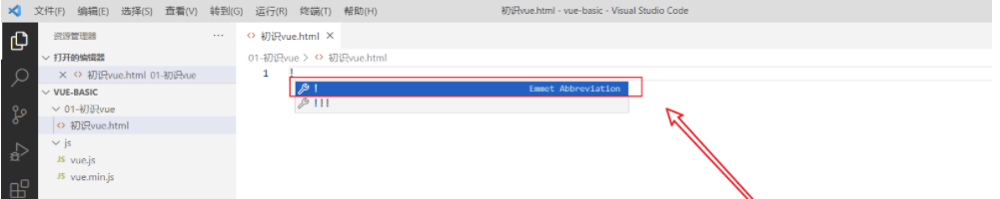

# 工具使用

## vscode 快速生成html模板代码

**创建一个html文件, 在右侧编辑区输入  ！ 然后回车**



会自动生成模版


输入 vueinit 回车即可

# Vue2

Vue (读音 /vjuː/，类似于 view) 是一套用于构建用户界面的渐进式框架。与其它大型框架不同的是，Vue 被设计为可以自底向上逐层应用。Vue 的核心库只关注视图层，不仅易于上手，还便于与第三方库或既有项目整合。另一方面，当与现代化的工具链以及各种支持类库结合使用时，Vue 也完全能够为复杂的单页应用提供驱动。

## 模板语法

+ 容器和vue实例是一对一关系
+ 真实开发中只有一个Vue实例，并且会配合着组件一起使用

### 插值语法

1. 功能: 用于解析标签体内容, 不能在标签属性中使用
2. 语法: {{xxx}} ，xxx 会作为js 表达式解析, 直接读取到data中的所有属性

```vue
<div id="app">
  {{ message }}
</div>
```

### 指令语法

1. 功能：用于解析标签（包括：标签属性、标签体内容、绑定事件.....）
2.  语法：xxx 会作为js 表达式解析, 直接读取到data中的所有属性

```vue
<a v-bind:href="school.url.toUpperCase()" x="hello">点我去{{school.name}}学习1</a>
<a :href="school.url" x="hello">点我去{{school.name}}学习2</a>
```

注意：Vue中有很多的指令，且形式都是：v-????

### 综合代码

```html
<!DOCTYPE html>
<html>
	<head>
		<meta charset="UTF-8" />
		<title>模板语法</title>
		<!-- 引入Vue -->
		<script type="text/javascript" src="../js/vue.js"></script>
	</head>
	<body>
		<!-- 准备好一个容器-->
		<div id="root">
			<h1>插值语法</h1>
			<h3>你好，{{name}}</h3>
			<hr/>
			<h1>指令语法</h1>
			<a v-bind:href="school.url.toUpperCase()" x="hello">点我去{{school.name}}学习1</a>
			<a :href="school.url" x="hello">点我去{{school.name}}学习2</a>
		</div>
	</body>

	<script type="text/javascript">
		Vue.config.productionTip = false //阻止 vue 在启动时生成生产提示。
		// 创建vue实例
		new Vue({
			el:'#root',  //值通常为css选择器字符串。
			data:{ //data中用于存储数据，数据供el所指定的容器去使用。
				name:'jack',
				school:{
					name:'尚硅谷',
					url:'http://www.atguigu.com',
				}
			}
		})

	</script>
</html>
```

运行结果


## 数据绑定

### 单向数据绑定(:)

1. 语法：
   + v-bind:value ="xxx" 
   + :value="xxx"   (推荐)
2. 特点：数据只能从data 流向页面

#### class绑定

> 动态绑定 class，只需要在 class 前加入 `v-bind` 即可，即 `v-bind:class` 简写为 `:class`。

##### 对象语法

一般写法：

```html
<div :class="{ active: isActive }"></div>
```

可以与普通 class 属性共存：

```html
<div class="static"
     :class="{ active: isActive, 'text-danger': hasError }">
</div>
```

```javascript
data: {
  isActive: true,
  hasError: false
}
```

结果渲染为：

```html
<div class="static active"></div>
```

① 绑定的数据对象不必内联定义在模板里：

```html
<div :class="classObject"></div>
```

```javascript
data: {
  classObject: {
    active: true,
    'text-danger': false
  }
}
```

② 可以绑定一个返回对象的计算属性:

```html
<div v-bind:class="classObject"></div>
```

```javascript
data: {
  isActive: true,
  error: null
},
computed: {
  classObject: function () {
    return {
      active: this.isActive && !this.error,
      'text-danger': this.error && this.error.type === 'fatal'
    }
  }
}
```

##### 数组语法

一般写法：

```html
<div v-bind:class="[activeClass, errorClass]"></div>
```

```javascript
data: {
  activeClass: 'active',
  errorClass: 'text-danger'
}
```

渲染为：

```html
<div class="active text-danger"></div>
```

①  如果想根据条件切换列表中的 class，可以用三元表达式：

```html
<div v-bind:class="[isActive ? activeClass : '', errorClass]"></div>
```

②  当有多个条件 class 时这样写有些繁琐。所以在数组语法中也可以嵌套使用对象语法：

```html
<div v-bind:class="[{ active: isActive }, errorClass]"></div>
```

#### style绑定

> 动态绑定 style，只需要在 style 前加入 `v-bind` 即可，即 `v-bind:style` 简写为 `:style`。

##### 对象语法

一般写法：

```html
<div v-bind:style="{ color: activeColor, fontSize: fontSize + 'px' }"></div>
```

```javascript
data: {
  activeColor: 'red',
  fontSize: 30
}
```

①  直接绑定到一个样式对象通常更好：

```html
<div v-bind:style="styleObject"></div>
```

```javascript
data: {
  styleObject: {
    color: 'red',
    fontSize: '13px'
  }
}
```

同样的，对象语法常常结合返回对象的计算属性使用。

##### 数组语法

一般写法：

```html
<div v-bind:style="[baseStyles, overridingStyles]"></div>
```

##### 自动添加前缀

当 `v-bind:style` 使用需要添加[浏览器引擎前缀](https://developer.mozilla.org/zh-CN/docs/Glossary/Vendor_Prefix)的 CSS 属性时，如 `transform`，Vue.js 会自动侦测并添加相应的前缀。

##### 多重值

从 Vue 2.3.0 起可以为 `style` 绑定中的属性提供一个包含多个值的数组，常用于提供多个带前缀的值，例如：

```html
<div :style="{ display: ['-webkit-box', '-ms-flexbox', 'flex'] }"></div>
```

这样写只会渲染数组中最后一个被浏览器支持的值。在本例中，如果浏览器支持不带浏览器前缀的 flexbox，那么就只会渲染 `display: flex`。

### 双向数据绑定(v-model)

1. 语法：
   + v-mode:value="xxx" 
   + v-model="xxx"   (推荐)
2. 特点：数据不仅能从data 流向页面，还能从页面流向data

3. v-model的三个修饰符：
   + lazy：失去焦点再收集数据
   + number：输入字符串转为有效的数字
   + trim：输入首尾空格过滤
4. 收集表单数据：
   + 若：<input type="text"/>，则v-model收集的是value值，用户输入的就是value值。 ------ 不设置默认value值。
   + 若：<input type="radio"/>，则v-model收集的是value值，且要给标签配置value值  ------ 设置默认value值。
   + 若：<input type="checkbox"/>
     + 没有配置input的value属性
       + v-model收集的就是布尔值（勾选 or 未勾选，是布尔值）
     + 配置input的value属性:
       + (1)v-model的初始值是非数组，那么收集的就是布尔值（勾选 or 未勾选，是布尔值）
       + (2)v-model的初始值是数组，那么收集的的就是value 

#### 综合代码

```html
<!DOCTYPE html>
<html>
	<head>
		<meta charset="UTF-8" />
		<title>收集表单数据</title>
		<script type="text/javascript" src="../js/vue.js"></script>
	</head>
	<body>
		<!-- 准备好一个容器-->
		<div id="root">
			// 表单
			<form @submit.prevent="demo">    //表单提交调用demo()
				// 属性绑定
				账号：<input type="text" v-model.trim="userInfo.account"> <br/><br/>
				密码：<input type="password" v-model="userInfo.password"> <br/><br/>
				年龄：<input type="number" v-model.number="userInfo.age"> <br/><br/>
				性别：
				男<input type="radio" name="sex" v-model="userInfo.sex" value="male">
				女<input type="radio" name="sex" v-model="userInfo.sex" value="female"> <br/><br/>
				爱好：
				学习<input type="checkbox" v-model="userInfo.hobby" value="study">
				打游戏<input type="checkbox" v-model="userInfo.hobby" value="game">
				吃饭<input type="checkbox" v-model="userInfo.hobby" value="eat">
				<br/><br/>
				所属校区
				<select v-model="userInfo.city">
					<option value="">请选择校区</option>
					<option value="beijing">北京</option>
					<option value="shanghai">上海</option>
					<option value="shenzhen">深圳</option>
					<option value="wuhan">武汉</option>
				</select>
				<br/><br/>
				其他信息：
				<textarea v-model.lazy="userInfo.other"></textarea> <br/><br/>
				<input type="checkbox" v-model="userInfo.agree">阅读并接受<a href="http://www.atguigu.com">《用户协议》</a>  //checkbox不用设置默认值
				<button>提交</button>
			</form>
		</div>
	</body>

	<script type="text/javascript">
		Vue.config.productionTip = false

		new Vue({
			el:'#root',
			data:{
				userInfo:{
					account:'',
					password:'',
					age:18,
					sex:'female',
					hobby:[],         //多选框 必须用数组
					city:'beijing',
					other:'',
					agree:''
				}
			},
			methods: {
				demo(){
					console.log(JSON.stringify(this.userInfo))   // JavaScript 对象或值转换为 JSON 字符串
				}
			}
		})
	</script>
</html>
```

运行结果


