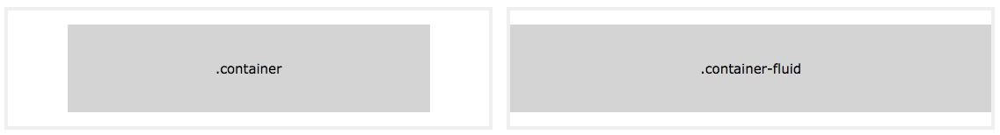
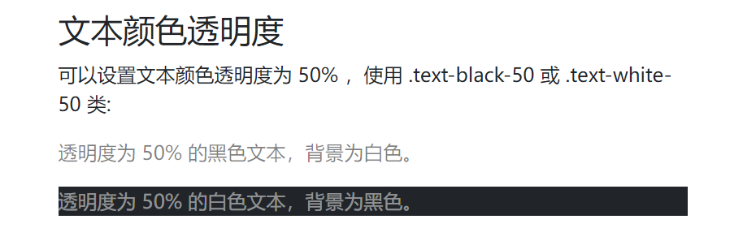
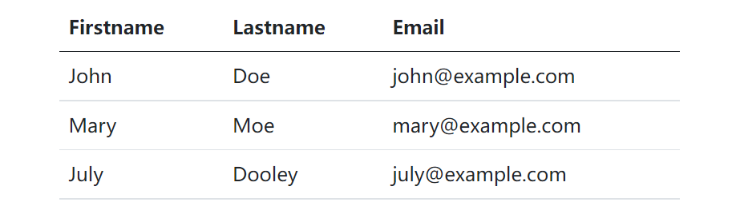

# 介绍

Bootstrap 是全球最受欢迎的前端组件库，用于开发响应式布局、移动设备优先的 WEB 项目。Bootstrap5 目前是 Bootstrap 的最新版本，是一套用于 HTML、CSS 和 JS 开发的开源工具集。它支持 Sass 变量和 mixins、响应式网格系统、大量的预建组件和强大的 JavaScript 插件。

# 安装与使用

使用 CDN

```html
<!-- 新 Bootstrap5 核心 CSS 文件 -->
<link rel="stylesheet" href="https://cdn.staticfile.org/twitter-bootstrap/5.1.1/css/bootstrap.min.css">

<!--  popper.min.js 用于弹窗、提示、下拉菜单 -->
<script src="https://cdn.staticfile.org/popper.js/2.9.3/umd/popper.min.js"></script>

<!-- 最新的 Bootstrap5 核心 JavaScript 文件 -->
<script src="https://cdn.staticfile.org/twitter-bootstrap/5.1.1/js/bootstrap.min.js"></script>
```

下载

[官网下载](https://getbootstrap.com/)

```html
<!DOCTYPE html>
<html lang="en">
<head>
    <meta charset="UTF-8">
    <meta name="viewport" content="width=device-width, initial-scale=1.0">
    <title>Document</title>
    <!-- bootstrap.min.css -->
    <link rel="stylesheet" href="/css/bootstrap.min.css">
</head>
<body>
    <script src="/js/bootstrap.bundle.min.js"></script>
</body>
</html>
```

# 创建第一个页面

### 添加 HTML5 doctype

Bootstrap 要求使用 HTML5 文件类型，所以需要添加 HTML5 doctype 声明。设置编码

```html
<!DOCTYPE html>
<html lang="en">
<head>
    <meta charset="UTF-8">
    <meta name="viewport" content="width=device-width, initial-scale=1.0">
    <title>Document</title>
    <!-- bootstrap.min.css -->
    <link rel="stylesheet" href="/css/bootstrap.min.css">
</head>
<body>
    <!-- xxxxx -->
    
    <script src="/js/bootstrap.bundle.min.js"></script>
</body>
</html>
```

### 移动设备优先

为了让 Bootstrap 开发的网站对移动设备友好，确保适当的绘制和触屏缩放，需要在网页的 head 之中添加 viewport meta 标签，如下所示：

```html
<meta name="viewport" content="width=device-width, initial-scale=1">
```

`width=device-width` 表示宽度是设备屏幕的宽度。

`initial-scale=1` 表示初始的缩放比例。

# 容器

## 容器类

==Bootstrap 需要一个容器元素来包裹网站的内容==

使用下面两个容器类：

- .container 类用于固定宽度并支持响应式布局的容器。
- .container-fluid 类用于 100% 宽度，占据全部视图的容器



```html
<!DOCTYPE html>
<html lang="en">
<head>
    <meta charset="UTF-8">
    <meta name="viewport" content="width=device-width, initial-scale=1.0">
    <title>Document</title>
    <!-- bootstrap.min.css -->
    <link rel="stylesheet" href="/css/bootstrap.min.css">
</head>
<body>
    <div class="container">
        <h1>这个容器container</h1>
    </div>
    <div class="container-fluid">
        <h1>这个容器container-fluid</h1>
    </div>
    <script src="/js/bootstrap.bundle.min.js"></script>
</body>
</html>
```


## 两个 Bootstrap5 页面

例子

```html
<!DOCTYPE html>
<html>
<head>
  <title>Bootstrap5 实例</title>
  <meta charset="utf-8">
  <meta name="viewport" content="width=device-width, initial-scale=1">
  <link href="https://cdn.staticfile.org/twitter-bootstrap/5.1.1/css/bootstrap.min.css" rel="stylesheet">
  <script src="https://cdn.staticfile.org/twitter-bootstrap/5.1.1/js/bootstrap.bundle.min.js"></script>
</head>
<body>

<div class="container">
  <h1>我的第一个 Bootstrap 页面</h1>
  <p>这是一些文本。</p> 
</div>

</body>
</html>
```


例子

```html
<!DOCTYPE html>
<html>
<head>
  <title>Bootstrap5 实例</title>
  <meta charset="utf-8">
  <meta name="viewport" content="width=device-width, initial-scale=1">
  <link href="https://cdn.staticfile.org/twitter-bootstrap/5.1.1/css/bootstrap.min.css" rel="stylesheet">
  <script src="https://cdn.staticfile.org/twitter-bootstrap/5.1.1/js/bootstrap.bundle.min.js"></script>
</head>
<body>

<div class="container-fluid">
  <h1>我的第一个 Bootstrap 页面</h1>
  <p>使用了 .container-fluid，100% 宽度，占据全部视口（viewport）的容器。</p> 
</div>

</body>
</html>
```


## 固定宽度

**.container** 类用于创建固定宽度的响应式页面。

**注意**：宽度（max-width）会**根据屏幕宽度**同比例放大或缩小。

| ---       | 超级小屏幕<576px | 小屏幕>=576px | 中等屏幕>=768px | 大屏幕>=992px | 特大屏幕>=1200px | 超级大屏幕>=1400px |
| --------- | ---------------- | ------------- | --------------- | ------------- | ---------------- | ------------------ |
| max-width | 100%             | 540px         | 720px           | 960px         | 1140px           | 1320px             |

## 100% 宽度

**.container-fluid** 类用于创建一个全屏幕尺寸的容器，容器始终跨越整个屏幕宽度（width 始终为 100%）

## 容器内边距

默认情况下，容器都有填充左右内边距，顶部和底部没有填充内边距。 Bootstrap 提供了一些间距类用于填充边距。 比如 **.pt-5** 就是用于填充顶部内边距：

```html
<div class="container pt-5">

</div>
```

## 容器的边框和颜色

Bootstrap 也提供了一些边框（border）和颜色（bg-dark、bg-primary等）类用于设置容器的样式：

```html
<div class="container p-5 my-5 border"></div>

<div class="container p-5 my-5 bg-dark text-white"></div>

<div class="container p-5 my-5 bg-primary text-white"></div>
```

## 响应式容器

可以使用 **.container-sm|md|lg|xl** 类来创建响应式容器。

容器的 max-width 属性值会根据屏幕的大小来改变。

| Class            | 超小屏幕 <576px | 小屏幕 ≥576px | 中等屏幕 ≥768px | 大屏幕 ≥992px | 特大屏幕 ≥1200px | 超级大屏幕 ≥1400px |
| :--------------- | :-------------- | :------------ | :-------------- | :------------ | :--------------- | :----------------- |
| `.container-sm`  | 100%            | 540px         | 720px           | 960px         | 1140px           | 1320px             |
| `.container-md`  | 100%            | 100%          | 720px           | 960px         | 1140px           | 1320px             |
| `.container-lg`  | 100%            | 100%          | 100%            | 960px         | 1140px           | 1320px             |
| `.container-xl`  | 100%            | 100%          | 100%            | 100%          | 1140px           | 1320px             |
| `.container-xxl` | 100%            | 100%          | 100%            | 100%          | 100%             | 1320px             |


# 网格系统

Bootstrap 提供了一套响应式、移动设备优先的流式网格系统，随着屏幕或视口（viewport）尺寸的增加，系统会自动分为最多 12 列。

我们也可以根据自己的需要，定义列数：


Bootstrap 5 的网格系统是响应式的，列会根据屏幕大小自动重新排列。确保每一行中列的总和等于或小于 12。

## 网格类

Bootstrap 5 网格系统有以下 6 个类:

- .col- 针对所有设备。
- .col-sm- 平板 - 屏幕宽度等于或大于 576px。当屏幕宽度小于576时元素会换行
- .col-md- 桌面显示器 - 屏幕宽度等于或大于 768px。
- .col-lg- 大桌面显示器 - 屏幕宽度等于或大于 992px。
- .col-xl- 特大桌面显示器 - 屏幕宽度等于或大于 1200px。
- .col-xxl- 超大桌面显示器 - 屏幕宽度等于或大于 1400px。

## 网格系统规则

Bootstrap5 网格系统规则:

- 网格每一行需要放在设置了 `.container` (固定宽度) 或 `.container-fluid` (全屏宽度) 类的容器中，这样就可以自动设置一些外边距与内边距。
- 使用行来创建水平的列组。
- 内容需要放置在列中，并且只有列可以是行的直接子节点。
- 预定义的类如 **.row** 和 **.col-sm-4** 可用于快速制作网格布局。
- 列通过填充创建列内容之间的间隙。 这个间隙是通过 **.rows** 类上的负边距设置第一行和最后一列的偏移。
- **网格列是通过跨越指定的 12 个列来创建**。 例如，设置三个相等的列，需要使用三个 **.col-sm-4** 来设置。
- Bootstrap 5 和 Bootstrap 4 使用 flexbox（弹性盒子） 而不是浮动。 Flexbox 的一大优势是，没有指定宽度的网格列将自动设置为**等宽与等高列** 。

下表总结了 Bootstrap 网格系统如何在不同设备上工作的：


我们将上述的类组合使用，从而创建更灵活的页面布局。

**提示：**每个类都是按比例放大的，所以如果你想设置 sm 和 md 具有相同的宽度，你只需要指定 sm 即可。

## Bootstrap 5 网格的基本结构

以下代码为 Bootstrap 5 网格的基本结构:

```html
<!-- 第一个例子：控制列的宽度及在不同的设备上如何显示 -->
<div class="row">
  <div class="col-*-*"></div>
</div>
<div class="row">
  <div class="col-*-*"></div>
  <div class="col-*-*"></div>
  <div class="col-*-*"></div>
</div>

<!-- 第二个例子：或让 Bootstrap 者自动处理布局 -->
<div class="row">
  <div class="col"></div>
  <div class="col"></div>
  <div class="col"></div>
</div>
```

第一个例子：创建一行(


)。然后， 添加需要的列(**.col-\*-\***类中设置)。 第一个星号 (*) 表示响应的设备: sm, md, lg 或 xl, 第二个星号 (*) 表示一个数字, 同一行的数字相加为 12。


第二个例子: 不在每个 **col** 上添加数字，让 bootstrap 自动处理布局，同一行的每个列宽度相等： 两个 **"col"** ，每个就为 50% 的宽度。三个 **"col"**每个就为 33.33% 的宽度，四个 **"col"**每个就为 25% 的宽度，以此类推。同样，你可以使用 **.col-sm|md|lg|xl** 来设置列的响应规则。

## 等宽响应式列

要进行栅格系统操作，首先就要创建栅格系统的容器。
“container”和“row”共同组成栅格容器，“row”代表的就是一行。
创建栅格容器后,设置名为col-md-的div,当尾数为1时,表示每个div的宽度占1/12,所以每行最多可以放置12个子div。
如果超过12个，则会在下一行显示。

```html
<!-- 创建最多 12 列的响应式行 -->
<div class="container">
    <div class="row">
        <div class="col-md-1">1</div>
        <div class="col-md-1">2</div>
        <div class="col-md-1">3</div>
        <div class="col-md-1">4</div>
        <div class="col-md-1">5</div>
        <div class="col-md-1">6</div>
        <div class="col-md-1">7</div>
        <div class="col-md-1">8</div>
        <div class="col-md-1">9</div>
        <div class="col-md-1">10</div>
        <div class="col-md-1">11</div>
        <div class="col-md-1">12</div>
    </div>
</div>
```


以下实例演示了如何在平板及更大屏幕上创建等宽度的响应式列。 **在移动设备上，即屏幕宽度小于 576px 时，四个列将会上下堆叠排版**:

```html
<div class="row">
    <div class="col-sm-3">1</div>
    <div class="col-sm-3">2</div>
    <div class="col-sm-3">3</div>
</div>
```

## 不等宽响应式列

```html
<div class="row">
    <div class="col-md-4">1</div>
    <div class="col-md-4">2</div>
    <div class="col-md-4">3</div>
</div>
```


以下实例演示了在平板及更大屏幕上创建不等宽度的响应式列。 **在移动设备上，即屏幕宽度小于 576px 时，两个列将会上下堆叠排版**:

```html
<div class="row">
  <div class="col-sm-4">.col-sm-4</div>
  <div class="col-sm-8">.col-sm-8</div>
</div>
```

## 设置某一列宽度

如果只设置一列的宽度，其他列会自动均分剩下的宽度。 以下实例将列宽度为 25%、50%、25%：

```html
<div class="row">
  <div class="col">col</div>
  <div class="col-6">col-6</div>
  <div class="col">col</div>
</div>
```

## 嵌套列

以下实例创建两列布局，其中一列内嵌套着另外两列：

```html
<div class="row">
  <div class="col-8">
    .col-8
    <div class="row">
      <div class="col-6">.col-6</div>
      <div class="col-6">.col-6</div>
    </div>
  </div>
  <div class="col-4">.col-4</div>
</div>
```

例子

```html
    <div class="row">
        <!-- 长度就是col-md-9的宽度-->
        <div class="col-md-9" style="background-color: red;">
            <div class="row">
                <div class="col-md-6">1</div>
                <div class="col-md-6">2</div>
            </div>
            <div class="row">
                <div class="col-md-3" style="background-color: aqua;">3</div>
                <div class="col-md-6" style="background-color: black;">4</div>
            </div>
        </div>
    </div>
```


## 偏移列

偏移列通过 **offset-\*-\*** 类来设置。

+ 第一个星号( * )可以是 **sm、md、lg、xl**，表示屏幕设备类型
+ 第二个星号(* )可以是 **1** 到 **11** 的数字。

为了在大屏幕显示器上使用偏移，请使用 **.offset-md-\*** 类。这些类会把一个列的左外边距（margin）增加 ***\**列，其中\*\**** 范围是从 **1** 到 **11**。

例如：.offset-md-4 是把.col-md-4 往右移了四列格

```html
    <div class="row">
        <div class="row">
            <div class="col-md-4" style="background-color:aqua;">.col-md-4</div>
            <!--偏移4格-->
            <div class="col-md-4 offset-md-4" style="background-color:aqua;">.col-md-4 .offset-md-4</div>  
        </div>
        <div class="row">
            <div class="col-md-3 offset-md-3">.col-md-3 .offset-md-3</div>
            <div class="col-md-3 offset-md-3">.col-md-3 .offset-md-3</div>
        </div>.
        <div class="row">
            <div class="col-md-6 offset-md-3" style="background-color:red;">.col-md-6 .offset-md-3</div>
        </div>
    </div>
```


## 网格列排序

通过类（.order）来控制内容的可视顺序。这些类是响应式的，因此可以配合网格类使用。 如（.order-md-1 .order-md-3）**排序规则:   order-first > 数字 > 默认排序**

例子

```html
   <div class="row">   
        <div class="col-md-9 order-2">
            <h5>这是最新的文章列表</h5>
            <ul>
                <li>文章标题一 作者 日期</li>
                <li>文章标题二 作者-日期</li>
                <li>文章标题二 作者 日期</li>
            </ul>
        </div>
        <div class="col-md-3 order-1">
            <h5>导航栏</h5>
            <ul>
                <li>首页</li>
                <li>视频直播</li>
                <li>视频回放</li>
            </ul>
        </div>
    </div>
```


例子 排序规则:   order-first > 数字 > 默认排序

```html
    <div class="row">
        <div class="col-md-4">1</div>
        <div class="col-md-4 order-first">order-first2</div>
        <div class="col-md-4 order-last">order-last3</div>
        <div class="col-md-4 order-1">order-1(4)</div>
        <div class="col-md-4 order-2">order-2(5)</div>
        <div class="col-md-4">6</div>
        <div class="col-md-4">7</div>
        <div class="col-md-4">8</div>
    </div>
```


## 防止堆叠显示

### 平板和桌面端

以下实例演示了在桌面设备的显示器上两个列的宽度各占 50%，如果在平板端则左边的宽度为 25%，右边的宽度为 75%, 在移动手机等小型设备上会堆叠显示。

```html
<div class="container-fluid">
  <div class="row">
    <div class="col-sm-3 col-md-6">
      <p>RUNOOB</p>
    </div>
    <div class="col-sm-9 col-md-6">
      <p>菜鸟教程</p>
    </div>
  </div>
</div>
```

### 平板、桌面、大桌面显示器、超大桌面显示器

以下实例在平板、桌面、大桌面显示器、超大桌面显示器的宽度比例为分别为：25%/75%、50%/50%、33.33%/66.67%、16.67/83.33%, 在移动手机等小型设备上会堆叠显示。

```html
<div class="row">
    <div class="col-sm-3 col-md-6 col-lg-4 col-xl-2 p-3 bg-primary text-white">.col</div>
    <div class="col-sm-9 col-md-6 col-lg-8 col-xl-10 p-3 bg-dark text-white">.col</div>
</div>
```

# 文字排版

## Bootstrap5 默认设置

Bootstrap 5 默认的 **font-size** 为 16px, **line-height** 为 1.5。

默认的 **font-family** 为 "Helvetica Neue", Helvetica, Arial, sans-serif。

此外，所有的 **`<p>`** 元素 **margin-top: 0** 、 **margin-bottom: 1rem** (16px)。

## `<h1> - <h6>`

Bootstrap 中定义了所有的 HTML 标题（h1 到 h6）的样式。请看下面的实例：

```html
<div class="container">
  <h1>h1 Bootstrap 标题</h1>
  <h2>h2 Bootstrap 标题</h2>
  <h3>h3 Bootstrap 标题</h3>
  <h4>h4 Bootstrap 标题</h4>
  <h5>h5 Bootstrap 标题</h5>
  <h6>h6 Bootstrap 标题</h6>
</div>
```

结果：


也可以使用`.h1` 到 `.h6` 类来设置元素的样式：

```html
<div class="container">
  <p class="h1">h1 Bootstrap 标题</p>
  <p class="h2">h2 Bootstrap 标题</p>
  <p class="h3">h3 Bootstrap 标题</p>
  <p class="h4">h4 Bootstrap 标题 </p>
  <p class="h5">h5 Bootstrap 标题</p>
  <p class="h6">h6 Bootstrap 标题</p>
</div>
```


## Display 标题类

Bootstrap 还提供了四个 Display 类来控制标题的样式: .display-1, .display-2, .display-3, .display-4。

```html
<div class="container">
  <h1>Display 标题</h1>
  <p>Display 标题可以输出更大更粗的字体样式。</p>
  <h1 class="display-1">Display 1</h1>
  <h1 class="display-2">Display 2</h1>
  <h1 class="display-3">Display 3</h1>
  <h1 class="display-4">Display 4</h1>
</div>
```


**使用类突出显示段落**

还可以通过在段落上添加类.lead 来突出段落。

```html
<p>这是Boostrap5中正常样式的段落。</p>
<p class="lead">这是Bootstrap5中突出显示的段落。</p>
```

## `<small>`

在 Bootstrap 5 中 HTML **`<small>`** 元素用于创建字号更小的颜色更浅的文本(相对于父元素的85%):

```html
<div class="container">
  <h1>更小文本标题</h1>
  <p>small 元素用于字号更小的颜色更浅的文本:</p>
  <h1>h1 标题 <small>副标题</small></h1>
  <h2>h2 标题 <small>副标题</small></h2>
  <h3>h3 标题 <small>副标题</small></h3>
  <h4>h4 标题 <small>副标题</small></h4>
  <h5>h5 标题 <small>副标题</small></h5>
  <h6>h6 标题 <small>副标题</small></h6>
</div>
```


## `<mark>`

Bootstrap 5 定义 **`<mark>`** 标签及 **.mark** 类为黄色背景及有一定的内边距:

```html
<div class="container">
  <h1>高亮文本</h1>    
  <p>使用 mark 元素来 <mark>高亮</mark> 文本。</p>
</div>
```


## `<abbr>`

Bootstrap 5 定义 HTML **`<abbr>`** 元素的样式为显示在文本底部的一条虚线边框:

```html
<div class="container">
  <h1>Abbreviations</h1>
  <p>The abbr element is used to mark up an abbreviation or acronym:</p>
  <p>The <abbr title="World Health Organization">WHO</abbr> was founded in 1948.</p>
</div>
```


## `<blockquote>`

对于引用的内容可以在 **`<blockquote>`** 上添加 **.blockquote** 类 :

```html
<div class="container">
  <h1>Blockquotes</h1>
  <p>The blockquote element is used to present content from another source:</p>
  <blockquote class="blockquote">
    <p>For 50 years, WWF has been protecting the future of nature. The world's leading conservation organization, WWF works in 100 countries and is supported by 1.2 million members in the United States and close to 5 million globally.</p>
    <footer class="blockquote-footer">From WWF's website</footer>
  </blockquote>
</div>
```


## `<dl>`

Bootstrap 5 定义 HTML **`<dl>`** 元素的样式如下:

```html
<div class="container">
    <h1>Description Lists</h1>
    <p>The dl element indicates a description list:</p>
    <dl>
      <dt>Coffee</dt>
      <dd>- black hot drink</dd>
      <dt>Milk</dt>
      <dd>- white cold drink</dd>
    </dl>
</div>
```


## `<code>`

Bootstrap 5 定义 HTML **`<code>`** 元素的样式如下:

```html
<div class="container">
  <h1>代码片段</h1>
  <p>可以将一些代码元素放到 code 元素里面:</p>
  <p>以下 HTML 元素: <code>span</code>, <code>section</code>, 和 <code>div</code> 用于定义部分文档内容。</p>
</div>
```


## `<kbd>`

Bootstrap 5 定义 HTML **`<kbd>`** 元素的样式如下:

```html
<div class="container">
  <h1>Keyboard Inputs</h1>
  <p>To indicate input that is typically entered via the keyboard, use the kbd element:</p>
  <p>Use <kbd>ctrl + p</kbd> to open the Print dialog box.</p>
</div>
```


## `<pre>`

Bootstrap 5 定义 HTML **`<pre>`** 元素的样式如下:

```html
<div class="container">
<h1>Multiple Code Lines</h1>
<p>For multiple lines of code, use the pre element:</p>
<pre>
Text in a pre element
is displayed in a fixed-width
font, and it preserves
both      spaces and
line breaks.
</pre>
</div>
```


## 文本对齐

可以使用文本对齐类轻松地将文本左对齐、右对齐和居中对齐。

```html
<p class="text-start">这个段落左边对齐</p>
<p class="text-center">这个段落居中对齐</p>
<p class="text-end">这个段落右边对齐</p>
```

还可以使用响应式文本对齐类根据屏幕大小对齐文本

```html
<p class="text-sm-center">文本将在屏幕宽度等于或大于 576px视口及以上居中对齐。</p>
<p class="text-md-center">文本将在屏幕宽度等于或大于768px视口及以上居中对齐</p>
<p class="text-1g-center">文本将在屏幕宽度等于或大于992px视口及以上居中对齐。</p>
<p class="text-x1-center">文本将在屏幕宽度等于或大于1200px视口及以上居中对齐。</p>
```


## 文本转换

可以将文本转换为小写、大写、设定单词首字母大写

.text-lowercase 设定文本小写
text-uppercase 设定文本大写
text-capitalize 设定单词首字母大写

```html
<p class="text-lowercase">bootstrap</p>
<p class="text-uppercase">bootstrap</p>
<p class="text-capitalize">bootstrap</p>
```


## 截断长文本

对于较长的文本，可以使用类.text-truncate用省略号截断文本。 在一行中显示一段文本但没有足够的可用空间时，它特别有用。

```html
    <div class="row">
        <div class="col-sm-2 text-truncate">
            这是一个很长很长很长非常长的段落
        </div>
    </div>
```


## 文本换行和溢出

通过类名(.text-wrap )可以设置文字在超过盒子宽度时自动换行

通过类名（.text-nowrap)可以阻止文字的换行，此时文字会溢出盒子

```html
<div class="row">
    <div class="col-sm-2 text-nowrap">
    	这是一个很长很长很长非常长的段落
    </div>
</div>
```

```html
overflow-auto    
overflow-hidden		一大堆文字，溢出部分隐藏
overflow-visible  这个是默认，一大堆文字，溢出部分就默认直接溢出了
overflow-scroll   一大堆文字，溢出部分就加上滚动条
```

## 文本的大小

BootStrap5默认字体初始大小为16px
在BootStrap5中将文本大小分为了六类,分别对应标题的h1-h6
添加类名.fs- * 或添加类名h* (*号为1-6的数值)

```html
<p class="fs-1">这是一个段落fs-1</p>
<p class="fs-2">这是一个段落fs-2</p>
<p class="fs-3">这是一个段落fs-3</p>
<p class="fs-4">这是一个段落fs-4</p>
<p class="fs-5">这是一个段落fs-5</p>
<p class="fs-6">这是一个段落fs-6</p>
```


## 字体粗细及斜体

在BootStrap5中将字体的粗细分为了5类.fw-bolder(bolder) .fw-bold(700) .fw-normal(400) .fw-light(300) .fw-lighter(lighter)

斜体 则是通过类名(.fst-italic)来控制而通过类名(.fst-normal)也可以取消斜体

```html
<p class="fw-bold">粗体文字</p>
<p class="fw-bolder">粗体文本(相对于父元素)</p>
<p class="fw-normal">正常的文本</p>
<p class="fw-light">细体文本</p>
<p class="fw-lighter">细体文本(相对于父元素) </p>
<p class="fst-italic">斜体</p>
<i class="fst-normal">取消斜体</i>
```

##  行高(行距)

BootStrap5默认字体初始行高为1.5

在BootStrap5中将行高分为了4种.Ih-1(1rem) .Ih-sm(1.25rem) .Ih-base(1.5rem) .Ih-Ig(2rem)

```html
<p class="1h-1">这是一个很长很长很长的段落</p>
<p class="lh-sm">这是一个很长很长很长的段落1.25</p>
<p class="lh-base">这是一个很长很长很长的段落</p>
<p class="1h-lg">这是一个很长很长很长的段落2rem</p>
```


## 更多排版类

下表提供了 Bootstrap5 更多排版类的实例：

| 类名                 | 描述                                                         |
| :------------------- | :----------------------------------------------------------- |
| **.lead**            | 让段落更突出                                                 |
| **.small**           | 指定更小文本 (为父元素的 85% )                               |
| **.text-start**      | 左对齐                                                       |
| **.text-center**     | 居中                                                         |
| **.text-end**        | 右对齐                                                       |
| **.text-justify**    | 设定文本对齐,段落中超出屏幕部分文字自动换行                  |
| **.text-nowrap**     | 段落中超出屏幕部分不换行                                     |
| **.text-lowercase**  | 设定文本小写                                                 |
| **.text-uppercase**  | 设定文本大写                                                 |
| **.text-capitalize** | 设定单词首字母大写                                           |
| **.initialism**      | 显示在 `<abbr>` 元素中的文本以小号字体展示，且可以将小写字母转换为大写字母 |
| **.list-unstyled**   | 移除默认的列表样式，列表项中左对齐 ( `<ul>` 和 `<ol>` 中)。 这个类仅适用于直接子列表项 (如果需要移除嵌套的列表项，你需要在嵌套的列表中使用该样式) |
| **.list-inline**     | 将所有列表项放置同一行                                       |

本作品采用 知识共享署名-非商业性使用-相同方式共享 4.0 国际许可协议 进行许可

# 颜色

## 文本颜色

Bootstrap 5 提供了一些有代表意义的颜色类：**.text-muted**, **.text-primary**, **.text-success**, **.text-info**, **.text-warning**, **.text-danger**, **.text-secondary**, **.text-white**, **.text-dark**, **.text-body** (默认颜色，为黑色) 和 **.text-light**:

```html
<div class="container">
  <h2>代表指定意义的文本颜色</h2>
  <p class="text-muted">柔和的文本。</p>
  <p class="text-primary">重要的文本。</p>
  <p class="text-success">执行成功的文本。</p>
  <p class="text-info">代表一些提示信息的文本。</p>
  <p class="text-warning">警告文本。</p>
  <p class="text-danger">危险操作文本。</p>
  <p class="text-secondary">副标题。</p>
  <p class="text-dark">深灰色文字。</p>
  <p class="text-body">默认颜色，为黑色。</p>
  <p class="text-light">浅灰色文本（白色背景上看不清楚）。</p>
  <p class="text-white">白色文本（白色背景上看不清楚）。</p>
</div>
```


可以设置文本颜色透明度为 50% ，使用 **.text-black-50** 或 **.text-white-50** 类:

```html
<p class="text-black-50">透明度为 50% 的黑色文本，背景为白色。</p>
<p class="text-white-50 bg-dark">透明度为 50% 的白色文本，背景为黑色。</p>
```



**在链接中使用**

```html
<div class="container">
  <h2>文本颜色</h2>
  <p>鼠标移动到链接。</p>
  <a href="#" class="text-muted">柔和的链接。</a>
  <a href="#" class="text-primary">主要链接。</a>
  <a href="#" class="text-success">成功链接。</a>
  <a href="#" class="text-info">信息文本链接。</a>
  <a href="#" class="text-warning">警告链接。</a>
  <a href="#" class="text-danger">危险链接。</a>
  <a href="#" class="text-secondary">副标题链接。</a>
  <a href="#" class="text-dark">深灰色链接。</a>
  <a href="#" class="text-light">浅灰色链接。</a>
</div>
```


## 背景颜色

提供背景颜色的类有: **.bg-primary**, **.bg-success**, **.bg-info**, **.bg-warning**, **.bg-danger**, **.bg-secondary**, **.bg-dark** 和 **.bg-light**。

注意背景颜色不会设置文本的颜色，在一些实例中你需要与 **.text-\*** 类一起使用。

```html
<div class="container">
  <h2>背景颜色</h2>
  <p class="bg-primary text-white">重要的背景颜色。</p>
  <p class="bg-success text-white">执行成功背景颜色。</p>
  <p class="bg-info text-white">信息提示背景颜色。</p>
  <p class="bg-warning text-white">警告背景颜色</p>
  <p class="bg-danger text-white">危险背景颜色。</p>
  <p class="bg-secondary text-white">副标题背景颜色。</p>
  <p class="bg-dark text-white">深灰背景颜色。</p>
  <p class="bg-light text-dark">浅灰背景颜色。</p>
</div>
```


## 边框颜色

```html
<span class="border border-primary"></span>
<span class="border border-secondary"></span>
<span class="border border-success"></span>
<span class="border border-danger"></span>
<span class="border border-warning"></span>
<span class="border border-info"></span>
<span class="border border-light"></span>
<span class="border border-dark"></span>
<span class="border border-white"></span>
```


# 表格

## Bootstrap5 基础表格

Bootstrap5 通过 **.table** 类来设置基础表格的样式，实例如下:

```html
<table class="table">
    <thead>
      <tr>
        <th>Firstname</th>
        <th>Lastname</th>
        <th>Email</th>
      </tr>
    </thead>
    <tbody>
      <tr>
        <td>John</td>
        <td>Doe</td>
        <td>john@example.com</td>
      </tr>
      <tr>
        <td>Mary</td>
        <td>Moe</td>
        <td>mary@example.com</td>
      </tr>
      <tr>
        <td>July</td>
        <td>Dooley</td>
        <td>july@example.com</td>
      </tr>
    </tbody>
</table>
```



## 条纹表格

通过添加 **.table-striped** 类可以在 **`<tbody>`** 内的行上看到条纹。

```HTML
<table class="table table-striped">
    <thead>
      <tr>
        <th>Firstname</th>
        <th>Lastname</th>
        <th>Email</th>
      </tr>
    </thead>
    <tbody>
      <tr>
        <td>John</td>
        <td>Doe</td>
        <td>john@example.com</td>
      </tr>
      <tr>
        <td>Mary</td>
        <td>Moe</td>
        <td>mary@example.com</td>
      </tr>
      <tr>
        <td>July</td>
        <td>Dooley</td>
        <td>july@example.com</td>
      </tr>
    </tbody>
</table>
```


## 带边框表格

**.table-bordered** 类可以为表格添加边框

```html
<table class="table table-bordered">
    <thead>
      <tr>
        <th>Firstname</th>
        <th>Lastname</th>
        <th>Email</th>
      </tr>
    </thead>
    <tbody>
      <tr>
        <td>John</td>
        <td>Doe</td>
        <td>john@example.com</td>
      </tr>
      <tr>
        <td>Mary</td>
        <td>Moe</td>
        <td>mary@example.com</td>
      </tr>
      <tr>
        <td>July</td>
        <td>Dooley</td>
        <td>july@example.com</td>
      </tr>
    </tbody>
</table>
```


## 鼠标悬停状态表格

**.table-hover** 类可以为表格的每一行添加鼠标悬停效果（灰色背景）：

```html
<table class="table table-hover">
    <thead>
      <tr>
        <th>Firstname</th>
        <th>Lastname</th>
        <th>Email</th>
      </tr>
    </thead>
    <tbody>
      <tr>
        <td>John</td>
        <td>Doe</td>
        <td>john@example.com</td>
      </tr>
      <tr>
        <td>Mary</td>
        <td>Moe</td>
        <td>mary@example.com</td>
      </tr>
      <tr>
        <td>July</td>
        <td>Dooley</td>
        <td>july@example.com</td>
      </tr>
    </tbody>
</table>
```


## 黑色背景表格

**.table-dark** 类可以为表格添加黑色背景：

```html
<table class="table table-dark">
    <thead>
      <tr>
        <th>Firstname</th>
        <th>Lastname</th>
        <th>Email</th>
      </tr>
    </thead>
    <tbody>
      <tr>
        <td>John</td>
        <td>Doe</td>
        <td>john@example.com</td>
      </tr>
      <tr>
        <td>Mary</td>
        <td>Moe</td>
        <td>mary@example.com</td>
      </tr>
      <tr>
        <td>July</td>
        <td>Dooley</td>
        <td>july@example.com</td>
      </tr>
    </tbody>
</table>
```


## 黑色条纹表格

联合使用 **.table-dark** 和 **.table-striped** 类可以创建黑色的条纹表格：

```html
<table class="table table-dark table-striped">
    <thead>
      <tr>
        <th>Firstname</th>
        <th>Lastname</th>
        <th>Email</th>
      </tr>
    </thead>
    <tbody>
      <tr>
        <td>John</td>
        <td>Doe</td>
        <td>john@example.com</td>
      </tr>
      <tr>
        <td>Mary</td>
        <td>Moe</td>
        <td>mary@example.com</td>
      </tr>
      <tr>
        <td>July</td>
        <td>Dooley</td>
        <td>july@example.com</td>
      </tr>
    </tbody>
</table>
```


## 鼠标悬停效果 - 黑色背景表格

联合使用 **.table-dark** 和 **.table-hover** 类可以设置黑色背景表格的鼠标悬停效果：

```html
<table class="table table-dark table-hover">
    <thead>
      <tr>
        <th>Firstname</th>
        <th>Lastname</th>
        <th>Email</th>
      </tr>
    </thead>
    <tbody>
      <tr>
        <td>John</td>
        <td>Doe</td>
        <td>john@example.com</td>
      </tr>
      <tr>
        <td>Mary</td>
        <td>Moe</td>
        <td>mary@example.com</td>
      </tr>
      <tr>
        <td>July</td>
        <td>Dooley</td>
        <td>july@example.com</td>
      </tr>
    </tbody>
</table>
```


## 无边框表格

**.table-borderless** 类可以设置一个无边框的表格：

```html
<table class="table table-borderless">
    <thead>
        <tr>
            <th>Firstname</th>
            <th>Lastname</th>
            <th>Email</th>
        </tr>
    </thead>
    <tbody>
        <tr>
            <td>John</td>
            <td>Doe</td>
            <td>john@example.com</td>
        </tr>
        <tr>
            <td>Mary</td>
            <td>Moe</td>
            <td>mary@example.com</td>
        </tr>
        <tr>
            <td>July</td>
            <td>Dooley</td>
            <td>july@example.com</td>
        </tr>
    </tbody>
</table>
```


## 指定意义的颜色类

通过指定意义的颜色类可以为表格的行或者单元格设置颜色：

```html
<table class="table">
    <thead>
      <tr>
        <th>Firstname</th>
        <th>Lastname</th>
        <th>Email</th>
      </tr>
    </thead>
    <tbody>
      <tr>
        <td>Default</td>
        <td>Defaultson</td>
        <td>def@somemail.com</td>
      </tr>      
      <tr class="table-primary">
        <td>Primary</td>
        <td>Joe</td>
        <td>joe@example.com</td>
      </tr>
      <tr class="table-success">
        <td>Success</td>
        <td>Doe</td>
        <td>john@example.com</td>
      </tr>
      <tr class="table-danger">
        <td>Danger</td>
        <td>Moe</td>
        <td>mary@example.com</td>
      </tr>
      <tr class="table-info">
        <td>Info</td>
        <td>Dooley</td>
        <td>july@example.com</td>
      </tr>
      <tr class="table-warning">
        <td>Warning</td>
        <td>Refs</td>
        <td>bo@example.com</td>
      </tr>
      <tr class="table-active">
        <td>Active</td>
        <td>Activeson</td>
        <td>act@example.com</td>
      </tr>
      <tr class="table-secondary">
        <td>Secondary</td>
        <td>Secondson</td>
        <td>sec@example.com</td>
      </tr>
      <tr class="table-light">
        <td>Light</td>
        <td>Angie</td>
        <td>angie@example.com</td>
      </tr>
      <tr class="table-dark text-dark">
        <td>Dark</td>
        <td>Bo</td>
        <td>bo@example.com</td>
      </tr>
    </tbody>
</table>
```


下表列出了表格颜色类的说明:

| 类名                 | 描述                             |
| :------------------- | :------------------------------- |
| **.table-primary**   | 蓝色: 指定这是一个重要的操作     |
| **.table-success**   | 绿色: 指定这是一个允许执行的操作 |
| **.table-danger**    | 红色: 指定这是可以危险的操作     |
| **.table-info**      | 浅蓝色: 表示内容已变更           |
| **.table-warning**   | 橘色: 表示需要注意的操作         |
| **.table-active**    | 灰色: 用于鼠标悬停效果           |
| **.table-secondary** | 灰色: 表示内容不怎么重要         |
| **.table-light**     | 浅灰色，可以是表格行的背景       |
| **.table-dark**      | 深灰色，可以是表格行的背景       |

## 表头颜色

我们也可以设置表头的颜色，例如 **.table-dark** 类用于给表头添加黑色背景， **.table-light** 类用于给表头添加灰色背景:

```html
<!--表格1 -->
<table class="table">
    <thead class="table-dark">
      <tr>
        <th>Firstname</th>
        <th>Lastname</th>
        <th>Email</th>
      </tr>
    </thead>
    <tbody>
      <tr>
        <td>John</td>
        <td>Doe</td>
        <td>john@example.com</td>
      </tr>
      <tr>
        <td>Mary</td>
        <td>Moe</td>
        <td>mary@example.com</td>
      </tr>
      <tr>
        <td>July</td>
        <td>Dooley</td>
        <td>july@example.com</td>
      </tr>
    </tbody>
  </table>

<!--表格2 -->
  <table class="table">
    <thead class="table-light">
      <tr>
        <th>Firstname</th>
        <th>Lastname</th>
        <th>Email</th>
      </tr>
    </thead>
    <tbody>
      <tr>
        <td>John</td>
        <td>Doe</td>
        <td>john@example.com</td>
      </tr>
      <tr>
        <td>Mary</td>
        <td>Moe</td>
        <td>mary@example.com</td>
      </tr>
      <tr>
        <td>July</td>
        <td>Dooley</td>
        <td>july@example.com</td>
      </tr>
    </tbody>
</table>
```


## 较小的表格

**.table-sm** 类用于通过减少内边距来设置较小的表格:

```html
<table class="table table-bordered table-sm">
    <thead>
      <tr>
        <th>Firstname</th>
        <th>Lastname</th>
        <th>Email</th>
      </tr>
    </thead>
    <tbody>
      <tr>
        <td>John</td>
        <td>Doe</td>
        <td>john@example.com</td>
      </tr>
      <tr>
        <td>Mary</td>
        <td>Moe</td>
        <td>mary@example.com</td>
      </tr>
      <tr>
        <td>July</td>
        <td>Dooley</td>
        <td>july@example.com</td>
      </tr>
    </tbody>
</table>
```


## 响应式表格

**.table-responsive** 类用于创建响应式表格：在屏幕宽度小于 992px 时会创建水平滚动条，如果可视区域宽度大于 992px 则显示不同效果（没有滚动条）:

```html
<div class="table-responsive">
<table class="table">
    <thead>
      <tr>
        <th>#</th>
        <th>Firstname</th>
        <th>Lastname</th>
        <th>Age</th>
        <th>City</th>
        <th>Country</th>
        <th>Sex</th>
        <th>Example</th>
        <th>Example</th>
        <th>Example</th>
        <th>Example</th>
      </tr>
    </thead>
    <tbody>
      <tr>
        <td>1</td>
        <td>Anna</td>
        <td>Pitt</td>
        <td>35</td>
        <td>New York</td>
        <td>USA</td>
        <td>Female</td>
        <td>Yes</td>
        <td>Yes</td>
        <td>Yes</td>
        <td>Yes</td>
      </tr>
    </tbody>
</table>
</div>
```


通过以下类设定在指定屏幕宽度下显示滚动条：

| 类名                      | 屏幕宽度 |
| :------------------------ | :------- |
| **.table-responsive-sm**  | < 576px  |
| **.table-responsive-md**  | < 768px  |
| **.table-responsive-lg**  | < 992px  |
| **.table-responsive-xl**  | < 1200px |
| **.table-responsive-xxl** | < 1400px |


# 图像形状

## 圆角形状

**.rounded** 类可以让图片显示圆角效果：

```html

```


## 椭圆图片

**.rounded-circle** 类可以设置椭圆形图片:

```html

```


## 缩略图

**.img-thumbnail** 类用于设置图片缩略图(图片有边框):

```html

```


##  对齐图像

使用 **.float-start** 类来设置图片左对齐，使用 **.float-end** 类设置图片右对齐:

```html
 

```


## 图片居中

使用 **.mx-auto (margin:auto)** 和 .**d-block (display:block)** 类来设置图片居中对齐：

```html

```


## 响应式图片

图像有各种各样的尺寸，我们需要根据屏幕的大小自动适应。

我们可以通过在 **``** 标签中添加 **.img-fluid** 类来设置响应式图片。

**.img-fluid** 类设置了 **max-width: 100%;** 、**height: auto;** :

```html

```

## Bootstrap5 信息提示框

Bootstrap 5 可以很容易实现信息提示框。


提示框可以使用 **.alert** 类, 后面加上 **.alert-success**, **.alert-info**, **.alert-warning**, **.alert-danger**, **.alert-primary**, **.alert-secondary**, **.alert-light** 或 **.alert-dark** 类来实现:

```html
<div class="alert alert-success">
  <strong>成功!</strong> 指定操作成功提示信息。
</div>
```


### 提示框添加链接

提示框中在链接的标签上添加 **alert-link** 类来设置匹配提示框颜色的链接：

```html
<div class="alert alert-success">
  <strong>成功!</strong> 你应该认真阅读 <a href="#" class="alert-link">这条信息</a>。
</div>
```


### 关闭提示框

我们可以在提示框中的 div 中添加 **.alert-dismissible** 类，然后在关闭按钮的链接上添加 **class="btn-close"** 和 **data-dismiss="alert"** 类来设置提示框的关闭操作。

```html
<div class="alert alert-success alert-dismissible">
  <button type="button" class="btn-close" data-bs-dismiss="alert"></button>
  <strong>成功!</strong> 指定操作成功提示信息。
</div>
```


### 提示框动画

**.fade** 和 **.show** 类用于设置提示框在关闭时的淡出和淡入效果：

```html
<div class="alert alert-danger alert-dismissible fade show">
```


# 按钮与按钮组

## Bootstrap5 按钮

Bootstrap 5 提供了不同样式的按钮。

```html
<button type="button" class="btn">基本按钮</button>
<button type="button" class="btn btn-primary">主要按钮</button>
<button type="button" class="btn btn-secondary">次要按钮</button>
<button type="button" class="btn btn-success">成功</button>
<button type="button" class="btn btn-info">信息</button>
<button type="button" class="btn btn-warning">警告</button>
<button type="button" class="btn btn-danger">危险</button>
<button type="button" class="btn btn-dark">黑色</button>
<button type="button" class="btn btn-light">浅色</button>
<button type="button" class="btn btn-link">链接</button>
```


按钮类可用于 **`<a>`**, **`<button>`**, 或 **`<input>`** 元素上:

```html
<a href="#" class="btn btn-info" role="button">链接按钮</a>
<button type="button" class="btn btn-info">按钮</button>
<input type="button" class="btn btn-info" value="输入框按钮">
<input type="submit" class="btn btn-info" value="提交按钮">
<input type="reset" class="btn btn-info" value="重置按钮">
```


### 按钮设置边框

Bootstrap 5 也可以设置按钮多边框，鼠标移动到按钮上添加突出到效果：

```html
<button type="button" class="btn btn-outline-primary">主要按钮</button>
<button type="button" class="btn btn-outline-secondary">次要按钮</button>
<button type="button" class="btn btn-outline-success">成功</button>
<button type="button" class="btn btn-outline-info">信息</button>
<button type="button" class="btn btn-outline-warning">警告</button>
<button type="button" class="btn btn-outline-danger">危险</button>
<button type="button" class="btn btn-outline-dark">黑色</button>
<button type="button" class="btn btn-outline-light text-dark">浅色</button>
```


### 不同大小的按钮

Bootstrap 5 可以设置按钮的大小，使用 **.btn-lg** 类设置大按钮，使用 **.btn-sm** 类设置小按钮：

```html
<button type="button" class="btn btn-primary btn-lg">大号按钮</button>
<button type="button" class="btn btn-primary">默认按钮</button>
<button type="button" class="btn btn-primary btn-sm">小号按钮</button>
```


### 块级按钮

通过添加 **.btn-block** 类可以设置块级按钮，**.d-grid** 类设置在父级元素中：

```html
<div class="d-grid">
    <button type="button" class="btn btn-primary btn-block">按钮 1</button>
</div>
```


如果有多个块级按钮，你可以使用用 **.gap-\*** 类来设置：

```html
<div class="d-grid gap-3">
  <button type="button" class="btn btn-primary btn-block">100% 宽度的按钮</button>
  <button type="button" class="btn btn-primary btn-block">100% 宽度的按钮</button>
  <button type="button" class="btn btn-primary btn-block">100% 宽度的按钮</button>
</div>
```


### 激活和禁用按钮

按钮可设置为激活或者禁止点击的状态。

**.active** 类可以设置按钮是可用的， **disabled** 属性可以设置按钮是不可点击的。 注意 `<a>` 元素不支持 disabled 属性，你可以通过添加 **.disabled** 类来禁止链接的点击。

```html
<button type="button" class="btn btn-primary active">点击后的按钮</button>
<button type="button" class="btn btn-primary" disabled>禁止点击的按钮</button>
<a href="#" class="btn btn-primary disabled">禁止点击的链接</a>
```


### 加载按钮

可以设置一个正在加载的按钮。

```html
<button class="btn btn-primary">
  <span class="spinner-border spinner-border-sm"></span>
</button>

<button class="btn btn-primary">
  <span class="spinner-border spinner-border-sm"></span>
  Loading..
</button>

<button class="btn btn-primary" disabled>
  <span class="spinner-border spinner-border-sm"></span>
  Loading..
</button>

<button class="btn btn-primary" disabled>
  <span class="spinner-grow spinner-grow-sm"></span>
  Loading..
</button>
```


## Bootstrap5 按钮组

Bootstrap 5 中允许我们将按钮放在同一行上。

可以在 **`<div>`** 元素上添加 **.btn-group** 类来创建按钮组。

```html
<div class="btn-group">
  <button type="button" class="btn btn-primary">Apple</button>
  <button type="button" class="btn btn-primary">Samsung</button>
  <button type="button" class="btn btn-primary">Sony</button>
</div>
```


**提示:** 我们可以使用 **.btn-group-lg|sm|xs** 类来设置按钮组的大小。

```html
<div class="btn-group btn-group-lg">
  <button type="button" class="btn btn-primary">Apple</button>
  <button type="button" class="btn btn-primary">Samsung</button>
  <button type="button" class="btn btn-primary">Sony</button>
</div>
```


### 垂直按钮组

可以使用 **.btn-group-vertical** 类来创建垂直的按钮组：

```html
<div class="btn-group-vertical">
  <button type="button" class="btn btn-primary">Apple</button>
  <button type="button" class="btn btn-primary">Samsung</button>
  <button type="button" class="btn btn-primary">Sony</button>
</div>
```


### 内嵌按钮组及下拉菜单

我们可以在按钮组内设置下拉菜单：

```html
<div class="btn-group">
  <button type="button" class="btn btn-primary">Apple</button>
  <button type="button" class="btn btn-primary">Samsung</button>
  <div class="btn-group">
      <!--下拉菜单-->
    <button type="button" class="btn btn-primary dropdown-toggle" data-bs-toggle="dropdown">
       Sony
    </button>
     <!--菜单 -->
    <div class="dropdown-menu">
      <a class="dropdown-item" href="#">Tablet</a>
      <a class="dropdown-item" href="#">Smartphone</a>
    </div>
  </div>
</div>
```


### 垂直按钮组及下拉菜单

```html
<div class="btn-group-vertical">
    <button type="button" class="btn btn-primary">Apple</button>
    <button type="button" class="btn btn-primary">Samsung</button>
    <div class="btn-group">
        <!--下拉菜单-->
        <button type="button" class="btn btn-primary dropdown-toggle" data-bs-toggle="dropdown">
            Sony
        </button>
        <ul class="dropdown-menu">
            <li><a class="dropdown-item" href="#">Tablet</a></li>
            <li><a class="dropdown-item" href="#">Smartphone</a></li>
        </ul>
    </div>
</div>
```


### 多个按钮组

按钮组可以一个个并列显示在同一行上：

```html
<div class="btn-group">
  <button type="button" class="btn btn-primary">Apple</button>
  <button type="button" class="btn btn-primary">Samsung</button>
  <button type="button" class="btn btn-primary">Sony</button>
</div>

<div class="btn-group">
  <button type="button" class="btn btn-primary">BMW</button>
  <button type="button" class="btn btn-primary">Mercedes</button>
  <button type="button" class="btn btn-primary">Volvo</button>
</div>
```


# 列表组

## 基本使用

大部分基础列表组都是无序的。

要创建列表组，可以在 **`<ul>`** 元素上添加 **.list-group** 类, 在 **`<li>`** 元素上添加 **.list-group-item** 类:

```html
<ul class="list-group">
  <li class="list-group-item">第一项</li>
  <li class="list-group-item">第二项</li>
  <li class="list-group-item">第三项</li>
</ul>
```


```html
<ul class="list-unstyled">
<li class="list-group-item">HTML</li>
<li class="list-group-item">CSS</li>
<li class="list-group-item">Bootstrap</li>
</ul>
```


## 激活状态的列表项

通过添加 **.active** 类来设置激活状态的列表项

```html
<ul class="list-group">
  <li class="list-group-item active">激活列表项</li>
  <li class="list-group-item">第二项</li>
  <li class="list-group-item">第三项</li>
</ul>
```


## 禁用的列表项

**.disabled** 类用于设置禁用的列表项:

```html
<ul class="list-group">
  <li class="list-group-item disabled">禁用项</li>
  <li class="list-group-item">第二项</li>
  <li class="list-group-item">第三项</li>
</ul>
```


## 链接列表项

要创建一个链接的列表项，可以将 **`<ul>`** 替换为 **`<div>`** ， **`<a>`** 替换 **`<li>`**。

如果你想鼠标悬停显示灰色背景就添加**.list-group-item-action** 类:

```html
<div class="list-group">
  <a href="#" class="list-group-item list-group-item-action">第一项</a>
  <a href="#" class="list-group-item list-group-item-action">第二项</a>
  <a href="#" class="list-group-item list-group-item-action">第三项</a>
</div>
```


## 移除列表边框

使用 **.list-group-flush** 类来删除列表的边框和圆角：

```html
<ul class="list-group list-group-flush">
  <li class="list-group-item">第一项</li>
  <li class="list-group-item">第二项</li>
  <li class="list-group-item">第三项</li>
  <li class="list-group-item">第四项</li>
</ul>
```


## 水平列表组

我们可以将 **.list-group-horizontal** 类添加到 **.list-group** 类后面来创建水平列表组：

```html
<ul class="list-group list-group-horizontal">
  <li class="list-group-item">第一项</li>
  <li class="list-group-item">第二项</li>
  <li class="list-group-item">第三项</li>
  <li class="list-group-item">第四项</li>
</ul>
```


## 创建编号列表组

可以通过简单地在.list-group 元素上添加类.list-group-numbered 来创建带有元素编号的列表组。

```html
<ol class="list-group list-group-numbered">
    <li class="list-group-item">第一项</li>
    <li class="list-group-item">第二项</li>
    <li class="list-group-item">第三项</li>
    <li class="list-group-item">第四项</li>
</ol>
```


## 带徽章的列表组

带徽章的列表组其实就是将bootstrap框架中的徽章组件和基础列表组件结合在一起的一个效果，只需在.list-
group-item的基础上追加徽章组件"badge"。

```html
    <ul class="list-group">
        <li class="list-group-item">
        	<small class="bg-primary badge">12</small>
        	第一项
        </li>
        <li class="list-group-item">第二项</li>
        <li class="list-group-item">第三项</li>
        <li class="list-group-item">第四项</li>
    </ul>
```


## 多种颜色列表项

列表项目的颜色可以通过以下列来设置： 

**.list-group-item-success**, **list-group-item-secondary**, **list-group-item-info**, **list-group-item-warning**, **.list-group-item-danger**, **list-group-item-dark** 和 **list-group-item-light**:

```html
<ul class="list-group">
  <li class="list-group-item list-group-item-success">成功列表项</li>
  <li class="list-group-item list-group-item-secondary">次要列表项</li>
  <li class="list-group-item list-group-item-info">信息列表项</li>
  <li class="list-group-item list-group-item-warning">警告列表项</li>
  <li class="list-group-item list-group-item-danger">危险列表项</li>
  <li class="list-group-item list-group-item-primary">主要列表项</li>
  <li class="list-group-item list-group-item-dark">深灰色列表项</li>
  <li class="list-group-item list-group-item-light">浅色列表项</li>
</ul>
```


## 彩色链接列表项

```html
<div class="list-group">
    <a href="#" class="list-group-item list-group-item-action">激活列表项</a>
    <a href="#" class="list-group-item list-group-item-success">成功列表项</a>
    <a href="#" class="list-group-item list-group-item-secondary">次要列表项</a>
    <a href="#" class="list-group-item list-group-item-info">信息列表项</a>
    <a href="#" class="list-group-item list-group-item-warning">警告列表项</a>
    <a href="#" class="list-group-item list-group-item-danger">危险列表项</a>
    <a href="#" class="list-group-item list-group-item-primary">主要列表项</a>
    <a href="#" class="list-group-item list-group-item-dark">深灰色列表项</a>
    <a href="#" class="list-group-item list-group-item-light">浅色列表项</a>
</div>
```


补充: 延伸链接

```html
 正常是要点击卡片里的超链接，给a标签加了stretched-link，变成延伸链接，就可以点击整个卡片任何地方跳转了
 有时候需要加position: relative，比如给div.card-body加，确保延伸边界，在这个区域内点击有效

 <div class="card" style="width: 18rem;">
    
    <div class="card-body">
      <h5 class="card-title">卡片标题</h5>
      <p class="card-text">一些文本内容</p>
      <a href="#" class="btn btn-primary stretched-link">超链接</a>
    </div>
  </div>
```

## 向列表组添加自定义内容

bootstrap框架在链接列表组的基础上增加了两个样式：

+ list-group-item-heading:  用来定义列表项部样式
+ list-group-item-text:   用来定义列表项主要内容

这两个样式最大的作用就是用来帮组开发者可以自定义列表项里的内容

```html
    <div class="list-group">
        <a href="#" class="list-group-item active">
            <h4 class="list-group-heading">网站服务</h4>
        </a>
        <a href="#" class="list-group-item">
            <h4 class="list-group-heading">标题—</h4>
            <p class="list-group-item-text">这里面是内容-</p>
        </a>
        <a href="#" class="list-group-item">
            <h4 class="list-group-heading active">标题二</h4>
            <p class="list-group-item-text">这里面是内容二</p>
        </a>
    </div>
```


# 徽章

徽章（Badges）主要用于突出显示新的或未读的项。如需使用徽章，只需要将 **.badge** 类加上带有指定意义的颜色类 (如 **.bg-secondary**) 添加到 **`<span>`** 元素上即可。 徽章可以根据父元素的大小的变化而变化:

```html
<h1>测试标题 <span class="badge bg-secondary">New</span></h1>
<h2>测试标题 <span class="badge bg-secondary">New</span></h2>
<h3>测试标题 <span class="badge bg-secondary">New</span></h3>
<h4>测试标题 <span class="badge bg-secondary">New</span></h4>
<h5>测试标题 <span class="badge bg-secondary">New</span></h5>
<h6>测试标题 <span class="badge bg-secondary">New</span></h6>
```


## 各种颜色类型的徽章

```html
<span class="badge bg-primary">主要</span>
<span class="badge bg-secondary">次要</span>
<span class="badge bg-success">成功</span>
<span class="badge bg-danger">危险</span>
<span class="badge bg-warning">警告</span>
<span class="badge bg-info">信息</span>
<span class="badge bg-light">浅色</span>
<span class="badge bg-dark">深色</span>
```


## 药丸形状徽章

使用 **.rounded-pill** 类来设置药丸形状徽章:

```html
<span class="badge rounded-pill bg-default">默认</span>
<span class="badge rounded-pill bg-primary">主要</span>
<span class="badge rounded-pill bg-success">成功</span>
<span class="badge rounded-pill bg-info">信息</span>
<span class="badge rounded-pill bg-warning">警告</span>
<span class="badge rounded-pill bg-danger">危险</span>
```


## 徽章插入到元素内

```html
<button type="button" class="btn btn-primary">Messages 
    <span class="badge bg-light">4</span>
</button>
```


# 进度条

进度条可以显示用户任务的完成过程。

工作原理：

+ 使用.progress作为最外层元素,用于指示进度条(progress bar)的最大值。
+ 我们在内部使用 .progress-bar来指示到目前为止的进度。
+ .progress-bar 需要通过内联样式、工具类或自定义 CSS 属性来设置其宽度。

创建一个基本的进度条的步骤如下：

- 添加一个带有 **.progress** 类的 `<div>`。
- 接着，在上面的 `<div>` 内，添加一个带有 class **.progress-bar** 的空的 `<div>`。
- 添加一个带有百分比表示的宽度的 style 属性，例如 **style="width:70%"** 表示进度条在 **70%** 的位置。

```html
<!--style="width:70%" 表示进度条在 70% 的位置-->
<div class="progress">
  <div class="progress-bar" style="width:70%"></div>
</div>
```


## 进度条高度

进度条高度默认为 16px。可以使用 CSS 的 `height` 属性来修改他：

```html
注意，必须为进度容器和进度条设置相同的高度：
<!-- 2px 高度进度条-->
<div class="progress" style="height: 2px;">
	<div class="progress-bar" style="width: 50%;"></div>
</div>

<!-- 20px 高度进度条 -->
<div class="progress" style="height: 20px;">
	<div class="progress-bar" style="width: 50%;"></div>
</div>
```


## 进度条标签

可以在进度条内添加文本，如进度的百分比：

```html
<div class="progress">
  <div class="progress-bar" style="width:70%">70%</div>
</div>
```


## 不同颜色的进度条

默认情况下进度条为蓝色，Bootstrap5 还提供了以下颜色的进度条：

```html
<div class="progress">
  <div class="progress-bar bg-success" style="width:40%"></div>
</div>

<div class="progress">
  <div class="progress-bar bg-info" style="width:50%"></div>
</div>

<div class="progress">
  <div class="progress-bar bg-warning" style="width:60%"></div>
</div>

<div class="progress">
  <div class="progress-bar bg-danger" style="width:70%"></div>
</div>
```


## 条纹的进度条

可以使用 `.progress-bar-striped` 类来设置条纹进度条：

```html
    <div class="progress" style="height: 30px">
        <div class="progress-bar progress-bar-striped" style="width: 60%">60%</div>
    </div>
    <br>
    <div class="progress" style="height: 30px">
        <div class="progress-bar progress-bar-striped bg-warning" style="width: 60%">60%</div>
    </div>
    <br>
    <div class="progress" style="height: 30px">
        <div class="progress-bar progress-bar-striped bg-danger" style="width: 60%">60%</div>
    </div>
```


## 动画进度条

使用 `.progress-bar-animated` 类可以为进度条添加动画：

```html
<div class="progress-bar progress-bar-striped progress-bar-animated" style="width: 40%"></div>
```


## 混合色彩进度条

进度条可以设置多种颜色：

```html
<div class="progress">
  <div class="progress-bar bg-success" style="width:40%">
   安全线
  </div>
  <div class="progress-bar bg-warning" style="width:10%">
    警告线
  </div>
  <div class="progress-bar bg-danger" style="width:20%">
    危险线
  </div>
</div>
```


# 加载效果

要创建加载中效果可以使用 **.spinner-border** 类:

```html
<div class="spinner-border"></div>
```


可以使用文本颜色类设置不同的颜色：

```html
<div class="spinner-border text-muted"></div>
<div class="spinner-border text-primary"></div>
<div class="spinner-border text-success"></div>
<div class="spinner-border text-info"></div>
<div class="spinner-border text-warning"></div>
<div class="spinner-border text-danger"></div>
<div class="spinner-border text-secondary"></div>
<div class="spinner-border text-dark"></div>
<div class="spinner-border text-light"></div>
```


## 闪烁的加载效果

使用 .spinner-grow 类来设置闪烁的加载效果:

```html
<div class="spinner-grow text-muted"></div>
<div class="spinner-grow text-primary"></div>
<div class="spinner-grow text-success"></div>
<div class="spinner-grow text-info"></div>
<div class="spinner-grow text-warning"></div>
<div class="spinner-grow text-danger"></div>
<div class="spinner-grow text-secondary"></div>
<div class="spinner-grow text-dark"></div>
<div class="spinner-grow text-light"></div>
```


## 设置加载效果大小

使用.spinner-border-sm 或 .spinner-grow-sm 类来创建加载效果的大小:

```html
<div class="spinner-border spinner-border-sm"></div>
<div class="spinner-grow spinner-grow-sm"></div>
```


## 加载按钮

我们也可以设置一个正在加载的按钮。

```html
<button class="btn btn-primary">
  <span class="spinner-border spinner-border-sm"></span>
</button>

<button class="btn btn-primary">
  <span class="spinner-border spinner-border-sm"></span> <!--加载效果-->
  Loading..
</button>

<button class="btn btn-primary" disabled>
  <span class="spinner-border spinner-border-sm"></span>
  Loading..
</button>

<button class="btn btn-primary" disabled>
  <span class="spinner-grow spinner-grow-sm"></span>
  Loading..
</button>
```


# 小工具:crossed_swords:

Bootstrap 5 提供了很多有用的类来帮组我们快速实现效果，不需要重复写一些 CSS 代码。

## 背景颜色

设置不同元素的背景颜色时，需要通过 **.text-\*** 类来设置匹配的文本颜色：


```html
<div class="p-3 mb-2 bg-primary text-white">.bg-primary</div>
<div class="p-3 mb-2 bg-secondary text-white">.bg-secondary</div>
<div class="p-3 mb-2 bg-success text-white">.bg-success</div>
<div class="p-3 mb-2 bg-danger text-white">.bg-danger</div>
<div class="p-3 mb-2 bg-warning text-dark">.bg-warning</div>
<div class="p-3 mb-2 bg-info text-dark">.bg-info</div>
<div class="p-3 mb-2 bg-light text-dark">.bg-light</div>
<div class="p-3 mb-2 bg-dark text-white">.bg-dark</div>
<div class="p-3 mb-2 bg-body text-dark">.bg-body</div>
<div class="p-3 mb-2 bg-white text-dark">.bg-white</div>
<div class="p-3 mb-2 bg-transparent text-dark">.bg-transparent</div>
```


**.bg-gradient** 类可以设置背景颜色渐变的效果：

```html
<div class="p-3 mb-2 bg-primary bg-gradient text-white">.bg-primary</div>
<div class="p-3 mb-2 bg-secondary bg-gradient text-white">.bg-secondary</div>
<div class="p-3 mb-2 bg-success bg-gradient text-white">.bg-success</div>
<div class="p-3 mb-2 bg-danger bg-gradient text-white">.bg-danger</div>
<div class="p-3 mb-2 bg-warning bg-gradient text-dark">.bg-warning</div>
<div class="p-3 mb-2 bg-info bg-gradient text-dark">.bg-info</div>
<div class="p-3 mb-2 bg-light bg-gradient text-dark">.bg-light</div>
<div class="p-3 mb-2 bg-dark bg-gradient text-white">.bg-dark</div>
<div class="p-3 mb-2 bg-body bg-gradient text-dark">.bg-body</div>
<div class="p-3 mb-2 bg-white bg-gradient text-dark">.bg-white</div>
<div class="p-3 mb-2 bg-transparent bg-gradient text-dark">.bg-transparent</div>
```


## 边框

我们可以使用 **border** 相关类根据需要显示边框：


```html
<span class="border"></span>/diV> 边框

<span class="border border-0"></span>          无边框, 边框宽度
<span class="border border-top-0"></span>      顶部无边框
<span class="border border-right-0"></span>    右侧无边框
<span class="border border-bottom-0"></span>   底部无边框
<span class="border border-left-0"></span>     左侧无边框
<br>

<span class="border-top"></span>     顶部边框
<span class="border-end"></span>     右侧边框
<span class="border-bottom"></span>  底部边框
<span class="border-start"></span>   左侧边框
```


**边框宽度:**

```html
<span class="border border-1"></span>
<span class="border border-2"></span>
<span class="border border-3"></span>
<span class="border border-4"></span>
<span class="border border-5"></span>
```


**边框颜色：**

```html
<span class="border border-primary"></span>
<span class="border border-secondary"></span>
<span class="border border-success"></span>
<span class="border border-danger"></span>
<span class="border border-warning"></span>
<span class="border border-info"></span>
<span class="border border-light"></span>
<span class="border border-dark"></span>
<span class="border border-white"></span>
```


**rounded** 相关类用于设置圆角：


```html


```


**rounded-0** 到 **rounded-3** 类用于设置圆角的大小：

```html


```


## 浮动与清除浮动

元素向右浮动使用 .float-end 类，向左浮动使用 .float-start 类， .clearfix 类用于清除浮动:

```html
<div class="clearfix">
  <span class="float-start">Float left</span>
  <span class="float-end">Float right</span>
</div>
```


也可以根据屏幕尺寸来设置浮动效果(.float-*-left|right -* 表示 sm (>=576px), md (>=768px), lg (>=992px), xl (>=1200px) or xxl (>=1400px)):

```html
<div class="float-sm-end">小屏幕向右浮动</div><br>
<div class="float-md-end">中等屏幕向右浮动</div><br>
<div class="float-lg-end">大屏幕向右浮动</div><br>
<div class="float-xl-end">超大屏幕向右浮动</div><br>
<div class="float-xxl-end">特大屏幕向右浮动</div><br>
<div class="float-none">没有浮动</div>
```


## 盒子居中

使用 **.mx-auto** 类来设置元素居中对齐 (添加 margin-left 和 margin-right 为 auto):

```html
<div class="mx-auto bg-warning" style="width:150px">盒子居中</div>
```


## 盒子宽度与高度

宽度使用 **w-\* (.w-25, .w-50, .w-75, .w-100, .mw-auto, .mw-100)** 类来设置。

```html
<div class="w-25 bg-warning">宽度为 25%</div>
<div class="w-50 bg-warning">宽度为 50%</div>
<div class="w-75 bg-warning">宽度为 75%</div>
<div class="w-100 bg-warning">宽度为 100%</div>
<div class="w-auto bg-warning">自动设置宽度</div>
<div class="mw-100 bg-warning">最大宽度为 100%</div>
```


高度使用 **h-\* (.h-25, .h-50, .h-75, .h-100, .mh-auto, .mh-100)** 类来设置。

```html
<div style="height:200px;background-color:#ddd">
    <div class="h-25 d-inline-block p-2 bg-warning">高度为 25%</div>
    <div class="h-50 d-inline-block p-2 bg-warning">高度为 50%</div>
    <div class="h-75 d-inline-block p-2 bg-warning">高度为 75%</div>
    <div class="h-100 d-inline-block p-2 bg-warning">高度为 100%</div>
    <div class="h-auto d-inline-block p-2 bg-warning">自动设置高度</div>
    <div class="mh-100 d-inline-block p-2 bg-warning" style="height:500px">最大高度为 100%</div>
</div>
```


**总结**

```hmtl
宽度百分比
w-25
w-50
w-75
w-100

高度百分比，一般不设置高度，没有意义
h-25
h-50
h-75
h-100

mw-100   就是max-width: 100%
mh-100   就是max-height: 100%

vw-100   相对于视口宽度的100%
vh-100	 相对于视口高度的100%
```

## 盒子模型间距


1. margin：外边距(与其他盒子的间距)
2. padding：内边距(和边框的间距)
3. border：边框

间距设置语法如下:

```
{property}{sides}-{size} 
```

**property** 代表属性，包含：

- `m` - 用来设置 `margin`
- `p` - 用来设置 `padding`

**sides** 主要指方向：

- `t` - 用来设置 `margin-top` 或 `padding-top`
- `b` - 用来设置 `margin-bottom` 或 `padding-bottom`
- `l` - 用来设置 `margin-left` 或 `padding-left`
- `r` - 用来设置 `margin-right` 或 `padding-right`
- `x` - 用来设置 `*-left` 和 `*-right`
- `y` - 用来设置 `*-top` 和 `*-bottom`
- blank - 用来设置元素在四个方向的 `margin` 或 `padding`

**size** 指的是边距的大小：

- `0` - 设置 `margin` 或 `padding` 为 `0`
- `1` - 设置 `margin` 或 `padding` 为 `$spacer * .25`
- `2` - 设置 `margin` 或 `padding` 为 `$spacer * .5`
- `3` - 设置 `margin` 或 `padding` 为 `$spacer`
- `4` - 设置`margin` 或 `padding` 为 `$spacer * 1.5`
- `5` - 设置 `margin` 或 `padding` 为 `$spacer * 3`
- `auto` - 设置 `margin` 为 auto

总结

```html
ms=外左  me=外右 mt=外上 mb=外下  

mx-auto  水平居中
ms-auto	 元素居右
me-auto	 元素居左

值 例如 ms-1
0 - 0px
1 - 4px
2 - 8px
3 - 16px
4 - 24px
5 - 48px
```

例子

```html
    <div class="box w-25 bg-info mb-3">这个盒子</div>
    <div class="box2 w-25 bg-danger">另一个盒子</div>
```


例子看下部分边距的源码设置：

```css
.mt-0 {
  margin-top: 0 !important;
}

.ml-1 {
  margin-left: ($spacer * .25) !important;
}

.px-2 {
  padding-left: ($spacer * .5) !important;
  padding-right: ($spacer * .5) !important;
}

.p-3 {
  padding: $spacer !important;
}
<div class="mx-auto" style="width: 200px;">
  元素设置居中
</div>

<form >
    <div class="form-row">
        <div class="form-group">

        <label for="text" class="mt-2">设置 margin-top：</label>
        <input type="text" class="form-control" id="text" placeholder="email"> 

        <label for="color" class="mt-2">颜色：</label>
        <input type="color" id="color" class="form-control" style="width: 60px;padding: 4px;" autocomplete="off" value="#656565">
        </div>
    </div>
</form>
```


## 阴影

可以使用 shadow-类为元素添加阴影

.shadow             为元素添加阴影。
.shadow-sm       为元素添加一个小阴影。
.shadow-1g        为元素添加更大的阴影。
.shadow-none    从元素中移除阴影。

```html
<div class="p-4 mb-4 border border-danger shadow">这是一个盒子</div>
```


## 展示

```html
d-none
d-inline
d-inline-block
d-block
```


#  Flex（弹性）布局

==Bootstrap5 通过 flex 类来控制页面的布局。==

## 弹性盒子(flexbox)

Bootstrap 3 与 Bootstrap 4/5 最大的区别就是 Bootstrap 4/5 使用弹性盒子来布局，而不是使用浮动来布局。

*注意：IE9 及其以下版本不支持弹性盒子，所以如果你需要兼容 IE8-9，请使用* [Bootstrap 3](https://www.runoob.com/bootstrap/bootstrap-tutorial.html)*。*

以下实例使用 **d-flex** 类创建一个弹性盒子容器，并设置三个弹性子元素：

```html
<div class="d-flex p-3 bg-secondary text-white">
  <div class="p-2 bg-info">Flex item 1</div>
  <div class="p-2 bg-warning">Flex item 2</div>
  <div class="p-2 bg-primary">Flex item 3</div>
</div>
```


## 水平方向

**.flex-row** 可以设置弹性子**元素水平显示**，这是默认的。

使用 **.flex-row-reverse** 类用于设置右对齐显示，即与 **.flex-row** 方向相反。

```html
<!--.flex-row** 类用于设置左对齐显示-->
<div class="d-flex flex-row bg-secondary">
  <div class="p-2 bg-info">Flex item 1</div>
  <div class="p-2 bg-warning">Flex item 2</div>
  <div class="p-2 bg-primary">Flex item 3</div>
</div>

<!--使用.flex-row-reverse 类用于设置右对齐显示-->
<div class="d-flex flex-row-reverse bg-secondary">
  <div class="p-2 bg-info">Flex item 1</div>
  <div class="p-2 bg-warning">Flex item 2</div>
  <div class="p-2 bg-primary">Flex item 3</div>
</div>
```


## 垂直方向

**.flex-column** 类用于设置弹性子元素垂直方向显示, **.flex-column-reverse** 用于翻转子元素：

```html
<div class="d-flex flex-column">
  <div class="p-2 bg-info">Flex item 1</div>
  <div class="p-2 bg-warning">Flex item 2</div>
  <div class="p-2 bg-primary">Flex item 3</div>
</div>

<div class="d-flex flex-column-reverse">
  <div class="p-2 bg-info">Flex item 1</div>
  <div class="p-2 bg-warning">Flex item 2</div>
  <div class="p-2 bg-primary">Flex item 3</div>
</div>
```


## 换行

```html
    <!--fiex-wrap 换行，第一行在下方 -->
    <div class="d-flex bg-primary flex-wrap mt-3">
        <div class="bg-danger" style="width: 200px">弹性盒子1</div>
        <div class="bg-warning" style="width: 200px">弹性盒子2</div>
        <div class="bg-info" style="width: 200px">弹性盒子3</div>
        <div class="bg-danger" style="width: 200px">弹性盒子4</div>
        <div class="bg-warning" style="width: 200px">弹性盒子5</div>
        <div class="bg-info" style="width: 200px">弹性盒子6</div>
        <div class="bg-danger" style="width: 200px">弹性盒子7</div>
        <div class="bg-warning" style="width: 200px">弹性盒子8</div>
        <div class="bg-info" style="width: 200px">弹性盒子9</div>
    </div>
```


```html
 <!--fiex-wrap-reverse 换行+翻转子元素，第一行在下方 -->
    <div class="d-flex bg-primary flex-wrap-reverse mt-3">
        <div class="bg-danger" style="width: 200px">弹性盒子1</div>
        <div class="bg-warning" style="width: 200px">弹性盒子2</div>
        <div class="bg-info" style="width: 200px">弹性盒子3</div>
        <div class="bg-danger" style="width: 200px">弹性盒子4</div>
        <div class="bg-warning" style="width: 200px">弹性盒子5</div>
        <div class="bg-info" style="width: 200px">弹性盒子6</div>
        <div class="bg-danger" style="width: 200px">弹性盒子7</div>
        <div class="bg-warning" style="width: 200px">弹性盒子8</div>
        <div class="bg-info" style="width: 200px">弹性盒子9</div>
    </div>
```


## 等宽

**.flex-fill** 类强制设置各个弹性子元素的宽度是一样的:

```html
<div class="d-flex">
  <div class="p-2 bg-info flex-fill">Flex item 1</div>
  <div class="p-2 bg-warning flex-fill">Flex item 2</div>
  <div class="p-2 bg-primary flex-fill">Flex item 3</div>
</div>
```


## 申展

**.flex-grow-1** 用于设置子元素使用剩下的空间。以下实例中前面两个子元素只设置了它们所需要的空间，最后一个获取剩余空间。 :

```html
<div class="d-flex">
  <div class="p-2 bg-info">Flex item 1</div>
  <div class="p-2 bg-warning">Flex item 2</div>
  <div class="p-2 bg-primary flex-grow-1">Flex item 3</div>
</div>
```


**提示:** 使用 **.flex-shrink-1** 用于设置子元素的收缩规则。

## 排序

**.order** 类可以设置弹性子元素的排序，从 **.order-1** 到 **.order-12**，数字越低权重越高( **.order-1** 排在 **.order-2** 之前) :

```html
<div class="d-flex bg-secondary">
  <div class="p-2 bg-info order-3">Flex item 1</div>
  <div class="p-2 bg-warning order-2">Flex item 2</div>
  <div class="p-2 bg-primary order-1">Flex item 3</div>
</div>
```


## 外边距

**.ms-auto** 类可以设置子元素右外边距为 **auto**，即 **margin-right: auto!important;**，**.me-auto** 类可以设置子元素左外边距为 **auto**，即 **margin-left: auto!important;**:

```html
<div class="d-flex mb-3 bg-secondary">
  <div class="p-2 ms-auto bg-info">Flex item 1</div>
  <div class="p-2 bg-warning">Flex item 2</div>
  <div class="p-2 bg-primary">Flex item 3</div>
</div>
<div class="d-flex mb-3 bg-secondary">
  <div class="p-2  bg-info">Flex item 1</div>
  <div class="p-2 bg-warning">Flex item 2</div>
  <div class="p-2 me-auto bg-primary">Flex item 3</div>
</div>
```


## 包裹

弹性容器中包裹子元素可以使用以下三个类： .flex-nowrap (默认), .flex-wrap 或 .flex-wrap-reverse。设置 flex 容器是单行或者多行。

```html
<div class="d-flex flex-wrap">..</div>

<div class="d-flex flex-wrap-reverse">..</div>

<div class="d-flex flex-nowrap">..</div>
```


## 多行对齐

==这里的对齐是针对父元素而言的==

我们可以使用 **.align-content-*** 来**控制在垂直方向上**如何去堆叠子元素，包含的值有：.align-content-start (默认), .align-content-end, .align-content-center, .align-content-between, .align-content-around 和 .align-content-stretch。

```html
    <div class="d-flex bg-primary flex-wrap align-content-center" style="width: 600px; height: 500px;">
        <div class="bg-danger" style="width: 200px">弹性盒子1</div>
        <div class="bg-warning" style="width: 200px">弹性盒子2</div>
        <div class="bg-info" style="width: 200px">弹性盒子3</div>
        <div class="bg-danger" style="width: 200px">弹性盒子4</div>
        <div class="bg-warning" style="width: 200px">弹性盒子5</div>
        <div class="bg-info" style="width: 200px">弹性盒子6</div>
        <div class="bg-danger" style="width: 200px">弹性盒子7</div>
        <div class="bg-warning" style="width: 200px">弹性盒子8</div>
        <div class="bg-info" style="width: 200px">弹性盒子9</div>
    </div>
```


```html
  <div class="d-flex bg-primary flex-wrap align-content-between" style="width: 600px; height: 500px;">
        <div class="bg-danger" style="width: 200px">弹性盒子1</div>
        <div class="bg-warning" style="width: 200px">弹性盒子2</div>
        <div class="bg-info" style="width: 200px">弹性盒子3</div>
        <div class="bg-danger" style="width: 200px">弹性盒子4</div>
        <div class="bg-warning" style="width: 200px">弹性盒子5</div>
        <div class="bg-info" style="width: 200px">弹性盒子6</div>
        <div class="bg-danger" style="width: 200px">弹性盒子7</div>
        <div class="bg-warning" style="width: 200px">弹性盒子8</div>
        <div class="bg-info" style="width: 200px">弹性盒子9</div>
    </div>
```


这些类在只有一行的弹性子元素中是无效的。

```html
<div class="d-flex flex-wrap align-content-start">..</div>

<div class="d-flex flex-wrap align-content-end">..</div>

<div class="d-flex flex-wrap align-content-center">..</div>

<div class="d-flex flex-wrap align-content-around">..</div>

<div class="d-flex flex-wrap align-content-stretch">..</div>
```


## 子元素对齐

==这里的对齐是针对父元素而言的==

如果要设置单行的子元素对齐可以使用 **.align-items-\*** 类来控制，包含的值有：**.align-items-start, .align-items-end, .align-items-center, .align-items-baseline, 和 .align-items-stretch (默认)**。

```html
    <!-- 默认值是：stretch 如果项目未设置高度，将占满整 个窗口的高度 -->
    <div class="d-flex bg-primary" style="height: 300px; width: 500px;">
        <div class="bg-danger">弹性盒子1</div>
        <div class="bg-warning">弹性盒子2</div>
        <div class="bg-info">弹性盒子3</div>
    </div>
    
    <div class="d-flex bg-primary mt-3 align-items-end justify-content-center" style="height: 300px; width: 500px;">
        <div class="bg-danger">弹性盒子1</div>
        <div class="bg-warning">弹性盒子2</div>
        <div class="bg-info">弹性盒子3</div>
    </div>
```


```html
<div class="d-flex align-items-start">..</div>

<div class="d-flex align-items-end">..</div>

<div class="d-flex align-items-center">..</div>

<div class="d-flex align-items-around">..</div>

<div class="d-flex align-items-stretch">..</div>
```


## 指定子元素对齐

==这里的对齐是针对父元素而言的==

如果要设置指定子元素对齐对齐可以使用 **.align-self-*** 类来控制，包含的值有：.align-self-start, .align-self-end, .align-self-center, .align-self-baseline, 和 .align-self-stretch (默认)。

```html
 <div class="d-sm-flex bg-primary" style="width: 400px; height: 400px;">
        <div class="bg-danger align-self-end">弹性盒子1</div>
        <div class="bg-warning align-self-center">弹性盒子2</div>
        <div class="bg-info">弹性盒子3</div>
 </div>
```


```html
<div class="d-flex bg-light" style="height:150px">
  <div class="p-2 border">Flex item 1</div>
  <div class="p-2 border align-self-start">Flex item 2</div>
  <div class="p-2 border">Flex item 3</div>
</div>
```


## 内容对齐

**.justify-content-\*** 类用于修改弹性子**水平方向**元素的排列方式，* 号允许的值有：**start (默认), end, center, between 或 around**:

```html
<div class="d-flex justify-content-start">...</div>
<div class="d-flex justify-content-end">...</div>
<div class="d-flex justify-content-center">...</div>
<div class="d-flex justify-content-between">...</div>
<div class="d-flex justify-content-around">...</div>
```


## 响应式 flex 类

我们可以根据不同的设备，设置 flex 类，从而实现页面响应式布局，以下表格中的 * 号可以的值有：sm, md, lg 或 xl, 对应的是小型设备、中型设备，大型设备，超大型设备。

| 类                           | 实例                                                   |
| :--------------------------- | :----------------------------------------------------- |
| 弹性容器                     |                                                        |
| `.d-*-flex`                  | 根据不同的屏幕设备创建弹性盒子容器                     |
| `.d-*-inline-flex`           | 根据不同的屏幕设备创建行内弹性盒子容器                 |
| 方向                         |                                                        |
| `.flex-*-row`                | 根据不同的屏幕设备在水平方向显示弹性子元素             |
| `.flex-*-row-reverse`        | 根据不同的屏幕设备在水平方向显示弹性子元素，且右对齐   |
| `.flex-*-column`             | 根据不同的屏幕设备在垂直方向显示弹性子元素             |
| `.flex-*-column-reverse`     | 根据不同的屏幕设备在垂直方向显示弹性子元素，且方向相反 |
| 内容对齐                     |                                                        |
| `.justify-content-*-start`   | 根据不同屏幕设备在开始位置显示弹性子元素 (左对齐)      |
| `.justify-content-*-end`     | 根据不同屏幕设备在尾部显示弹性子元素 (右对齐)          |
| `.justify-content-*-center`  | 根据不同屏幕设备在 flex 容器中居中显示子元素           |
| `.justify-content-*-between` | 根据不同屏幕设备使用 "between" 显示弹性子元素          |
| `.justify-content-*-around`  | 根据不同屏幕设备使用 "around" 显示弹性子元素           |
| 等宽                         |                                                        |
| `.flex-*-fill`               | 根据不同的屏幕设备强制等宽                             |
| 扩展                         |                                                        |
| `.flex-*-grow-0`             | 不同的屏幕设备不设置扩展                               |
| `.flex-*-grow-1`             | 不同的屏幕设备设置扩展                                 |
| 收缩                         |                                                        |
| `.flex-*-shrink-0`           | 不同的屏幕设备不设置收缩                               |
| `.flex-*-shrink-1`           | 不同的屏幕设备设置收缩                                 |
| 包裹                         |                                                        |
| `.flex-*-nowrap`             | 不同的屏幕设备不设置包裹元素                           |
| `.flex-*-wrap`               | 不同的屏幕设备设置包裹元素                             |
| `.flex-*-wrap-reverse`       | 不同的屏幕设备反转包裹元素                             |
| 内容排列                     |                                                        |
| `.align-content-*-start`     | 根据不同屏幕设备在起始位置堆叠元素                     |
| `.align-content-*-end`       | 根据不同屏幕设备在结束位置堆叠元素                     |
| `.align-content-*-center`    | 根据不同屏幕设备在中间位置堆叠元素                     |
| `.align-content-*-around`    | 根据不同屏幕设备，使用 "around" 堆叠元素               |
| `.align-content-*-stretch`   | 根据不同屏幕设备，通过伸展元素来堆叠                   |
| 排序                         |                                                        |
| `.order-*-*0-12*`            | 在小屏幕尺寸上修改排序                                 |
| 元素对齐                     |                                                        |
| `.align-items-*-start`       | 根据不同屏幕设备，让元素在头部显示在同一行。           |
| `.align-items-*-end`         | 根据不同屏幕设备，让元素在尾部显示在同一行。           |
| `.align-items-*-center`      | 根据不同屏幕设备，让元素在中间位置显示在同一行。       |
| `.align-items-*-baseline`    | 根据不同屏幕设备，让元素在基线上显示在同一行。         |
| `.align-items-*-stretch`     | 根据不同屏幕设备，让元素延展高度并显示在同一行。       |
| 单独一个子元素的对齐方式     |                                                        |
| `.align-self-*-start`        | 据不同屏幕设备，让单独一个子元素显示在头部。           |
| `.align-self-*-end`          | 据不同屏幕设备，让单独一个子元素显示在尾部             |
| `.align-self-*-center`       | 据不同屏幕设备，让单独一个子元素显示在居中位置         |
| `.align-self-*-baseline`     | 据不同屏幕设备，让单独一个子元素显示在基线位置         |
| `.align-self-*-stretch`      | 据不同屏幕设备，延展一个单独子元素                     |

## 案例

```html
<!DOCTYPE html>
<html lang="en">
<head>
    <meta charset="UTF-8">
    <meta name="viewport" content="width=device-width, initial-scale=1.0">
    <title>Document</title>
    <!-- bootstrap.min.css -->
    <link rel="stylesheet" href="/css/bootstrap.min.css">
    <style>
        .box {
            width: 100px;
            height: 100px;
        }

        .box span {
            width: 20px;
            height: 20px;
        }
    </style>
</head>
<body>
    <div class="container mt-3">
        <div class="d-flex">
            <!--数子1-->
            <div class="box border border-dark rounded-4 mx-3 shadow d-flex justify-content-center align-items-center">
                <span class="bg-dark rounded-circle"></span>
            </div>
            
            <!-- 数子2 -->
            <div class="box border border-dark rounded-4 mx-3 shadow d-flex flex-column justify-content-around align-items-center">
                <span class="bg-dark rounded-circle"></span>
                <span class="bg-dark rounded-circle"></span>
            </div> 

            <!-- 数子3  p-2设置内边距 d-flex使用flex布局 justify-content-between两端对齐-->
            <div class="box border border-dark rounded-4 mx-3 p-2 shadow d-flex justify-content-between">
                <span class="bg-dark rounded-circle"></span>
                <span class="bg-dark rounded-circle align-self-center"></span>
                <span class="bg-dark rounded-circle align-self-end"></span>
            </div>
            
            <!-- 数子4 -->
            <div class="box border border-dark rounded-4 mx-3 shadow d-flex ">
                <div class="box rounded-4 mx-3 d-flex flex-column justify-content-around align-items-center">
                    <span class="bg-dark rounded-circle"></span>
                    <span class="bg-dark rounded-circle"></span>
                </div> 
                <div class="box rounded-4 mx-3 d-flex flex-column justify-content-around align-items-center">
                    <span class="bg-dark rounded-circle"></span>
                    <span class="bg-dark rounded-circle"></span>
                </div> 
            </div> 
        </div>
    </div>
    <script src="/js/bootstrap.bundle.min.js"></script> 
</body>
</html>
```


# 字体图标

分页字体图标是在 Web 项目中使用的图标字体。

使用字体图标的好处是,可以通过应用CSS color属性来创建任何颜色的图标。此外,要更改图标的大小,只需
使用 CSS font-size 属性即可。

## 获取字体图标

进入官网[Bootstrap 图标库 · Bootstrap 官方开源图标（icon）库 (bootcss.com)](https://icons.bootcss.com/#usage)


**步骤 一：**在HTML文档的<head>部分包含下面的 Bootstrap CDN 链接。

```
<link rel="stylesheet" href="https://cdn.jsdelivr.net/npm/bootstrap-icons@1.10.0/font/bootstrap-icons.css">
```

**步骤 二:** 要将图标放置到网页中,使用语法`<i class="bi-*"></i>`其中*代表特定图标的类名。

```html
<i class="bi-archive-fill"></i>
```

## 基本使用

例子

```html
~<!DOCTYPE html>
<html lang="en">
<head>
    <meta charset="UTF-8">
    <meta name="viewport" content="width=device-width, initial-scale=1.0">
    <title>Document</title>
     <!-- bootstrap.min.css -->
     <link rel="stylesheet" href="/css/bootstrap.min.css">
     <!--bootstrap font icon -->
     <link rel="stylesheet" href="https://cdn.jsdelivr.net/npm/bootstrap-icons@1.10.0/font/bootstrap-icons.css">
</head>
<body>
    <!--改变大小,颜色都是按照字体的方式-->
    <i class="bi bi-vimeo fs-3 text-bg-info"></i>
    <script src="/js/bootstrap.bundle.min.js"></script> 
</body>
</html>
```


## 定制字体图标

```html
    <button type="button" class="btn btn-primary ">登录
        <i class="bi-person-fill" style="font-size: 30px; color:red"></i>
    </button>
```

 

# 下拉菜单

## 基本使用

下拉菜单是可切换的，是以列表格式显示链接的上下文菜单。==通过class="btn btn-primary dropdown-toggle" data-bs-toggle="dropdown"就能构成下拉==  class="dropdown-menu"构成菜单

```html
<div class="dropdown">
  <button type="button" class="btn btn-primary dropdown-toggle" data-bs-toggle="dropdown">
    下拉菜单按钮
  </button>
    <!--菜单-->
  <div class="dropdown-menu">
    <a class="dropdown-item" href="#">链接 1</a>
    <a class="dropdown-item" href="#">链接 2</a>
    <a class="dropdown-item" href="#">链接 3</a>
  </div>
</div>
```


## 下拉菜单中的分割线

**.dropdown-divider** 类用于在下拉菜单中创建一个水平的分割线：

```html
<li><hr class="dropdown-divider"></hr></li>
```


## 下拉菜单中的标题

**.dropdown-header** 类用于在下拉菜单中添加标题：

```html
<li><h5 class="dropdown-header">标题 1</h5></li>
```


## 下拉菜单中的可用项与禁用项

.active 类会让下拉菜单的选项高亮显示 (添加蓝色背景)。

如果要禁用下拉菜单的选项，可以使用**.disabled** 类。

```html
<a class="dropdown-item" href="#">常规项</a>
<a class="dropdown-item active" href="#">激活项</a>
<a class="dropdown-item disabled" href="#">禁用项</a>
```


## 下拉菜单的定位

如果我们想让下拉菜单右对齐，可以在元素上的 **.dropdown** 类后添加 **.dropend** 或 **.dropstart** 类。

**.dropend** 是右对齐， **.dropstart** 是左对齐。

```html
<!-- 右对齐 -->
<div class="dropdown dropend">
...
</div>

<!-- 左对齐 -->
<div class="dropdown dropstart">
...
</div>
```


## 下拉菜单弹出方向设置

下拉菜单弹出方向默认为向下，当然我们也可以设置不同的方向。

### 指定向右弹出的下拉菜单

如果你希望下拉菜单向右下方弹出，可以在 div 元素上添加 **.dropdown-menu-end** 类:

```html
<!-- 右下方拉菜单按钮 -->
<div class="dropdown dropdown-menu-end">
<button type="button" class="btn btn-primary dropdown-toggle" data-bs-toggle="dropdown">
  下拉菜单右下方弹出
  </button>
  <ul class="dropdown-menu">
    <li><a class="dropdown-item" href="#">链接 1</a></li>
    <li><a class="dropdown-item" href="#">链接 2</a></li>
    <li><a class="dropdown-item" href="#">链接 3</a></li>
  </ul>
</div>
```


### 指定向上弹出的上拉菜单

如果你希望上拉菜单向上弹出，可以在 div 元素上添加 **"dropup"** 类:

```html
<!-- 向上菜单 -->
<div class="dropup">
  <button type="button" class="btn btn-primary dropdown-toggle" data-bs-toggle="dropdown">
    下拉菜单
  </button>
  <ul class="dropdown-menu">
    <li><a class="dropdown-item" href="#">链接 1</a></li>
    <li><a class="dropdown-item" href="#">链接 2</a></li>
    <li><a class="dropdown-item" href="#">链接 3</a></li>
  </ul>
</div>
```


### 指定向左边弹出的下拉菜单

如果你希望下拉菜单向上弹出，可以在 div 元素上添加 **dropstart** 类:

```html
<!-- 左边的下拉菜单 -->
<div class="dropstart">
  添加一些内容，用于测试向左边弹出效果。<button type="button" class="btn btn-primary dropdown-toggle" data-bs-toggle="dropdown">
  下拉菜单
  </button>
  <ul class="dropdown-menu">
    <li><a class="dropdown-item" href="#">链接 1</a></li>
    <li><a class="dropdown-item" href="#">链接 2</a></li>
    <li><a class="dropdown-item" href="#">链接 3</a></li>
  </ul>
</div>
```


## 下拉菜单设置文本

**.dropdown-item-text** 类可以设置下拉菜单中的文本项：

```html
<ul class="dropdown-menu">
  <li><a class="dropdown-item" href="#">链接 1</a></li>
  <li><a class="dropdown-item" href="#">链接 2</a></li>
  <li><a class="dropdown-item" href="#">链接 3</a></li>
  <li><a class="dropdown-item-text" href="#">文本链接</a></li>
  <li><span class="dropdown-item-text">仅仅是文本</span></li>
</ul>
```


## 按钮组中设置下拉菜单

我们可以在按钮中添加下拉菜单：

```html
<div class="btn-group">
    <button type="button" class="btn btn-primary">Apple</button>
    <button type="button" class="btn btn-primary">Samsung</button>
    <div class="btn-group">
      <button type="button" class="btn btn-primary dropdown-toggle" data-bs-toggle="dropdown">Sony</button>
      <ul class="dropdown-menu">
        <li><a class="dropdown-item" href="#">Tablet</a></li>
        <li><a class="dropdown-item" href="#">Smartphone</a></li>
      </ul>
    </div>
</div>
```


垂直按钮组带下拉菜单：

```html
<div class="btn-group-vertical">
  <button type="button" class="btn btn-primary">Apple</button>
  <button type="button" class="btn btn-primary">Samsung</button>
  <div class="btn-group">
    <button type="button" class="btn btn-primary dropdown-toggle" data-bs-toggle="dropdown">Sony</button>
    <ul class="dropdown-menu">
      <li><a class="dropdown-item" href="#">Tablet</a></li>
      <li><a class="dropdown-item" href="#">Smartphone</a></li>
    </ul>
  </div>
</div>
```

##  综合代码

```html
 <div class="dropdown">
            <button class="btn btn-primary dropdown-toggle" data-bs-toggle="dropdown">下拉按钮</button>
            <ul class="dropdown-menu ">
                <li class="dropdown-header">下拉菜单标题</li>
                <li class="dropdown-item">链接 1</li>
                <li class="dropdown-item">链接 2</li>
                <li class="dropdown-item">链接 3</li>
                <li class="dropdown-divider"></li>
                <li class="dropdown-item">分离的链接</li>
                <li class="dropdown-item">分离的链接</li>
            </ul>
        </div>
```


```html
<ul class="nav">
    <li class="nav-item">
    	<a class="nav-link" href="#">首页</a>
    </li>
    <li class="nav-item">
    	<a class="nav-link" href="#">学习</a>
    </li>
    <li class="nav-item dropdown">
   		<a class="nav-link dropdown-toggle" href="#" data-bs-toggle="dropdown">前端</a>
    	<ul class="dropdown-menu">
              	<li class="dropdown-item">链接 1</li>
    			<li class="dropdown-item">链接 1</li>
    			<li class="dropdown-item">链接 1</li>
        </ul>
    </li>
    <li class="nav-item">
    <a class="nav-link disabled" href="#">禁用</a>
    </li>
</ul>
```


## 导航栏案例


# 导航

## 基本使用

如果你想创建一个简单的水平导航栏，可以在 **`<ul>`** 元素上添加 **.nav**类，在每个 **`<li>`** 选项上添加 **.nav-item** 类，在每个链接上添加 **.nav-link** 类:

```html
<ul class="nav">
  <li class="nav-item">
    <a class="nav-link" href="#">Link</a>
  </li>
  <li class="nav-item">
    <a class="nav-link" href="#">Link</a>
  </li>
  <li class="nav-item">
    <a class="nav-link" href="#">Link</a>
  </li>
  <li class="nav-item">
    <a class="nav-link disabled" href="#">Disabled</a>
  </li>
</ul>
```


## 导航对齐方式

**.justify-content-center** 类设置导航居中显示， **.justify-content-end** 类设置导航右对齐。

```html
<!-- 导航居中 -->
<ul class="nav justify-content-center">

<!-- 导航右对齐 -->
<ul class="nav justify-content-end">
```


## 垂直导航

**.flex-column** 类用于创建垂直导航：

```html
<ul class="nav flex-column">
```


## 选项卡nav-tabs

使用 **.nav-tabs** 类可以将导航转化为选项卡。然后对于选中的选项使用 .active 类来标记。

```html
    <ul class="nav nav-tabs">
        <li class="nav-item">
          <a class="nav-link active" href="#">Active</a>
        </li>
        <li class="nav-item">
          <a class="nav-link" href="#">Link</a>
        </li>
        <li class="nav-item">
          <a class="nav-link" href="#">Link</a>
        </li>
        <li class="nav-item">
          <a class="nav-link disabled" href="#">Disabled</a>
        </li>
    </ul>
```


例子

```html
<!DOCTYPE html>
<html lang="en">
<head>
    <meta charset="UTF-8">
    <meta name="viewport" content="width=device-width, initial-scale=1.0">
    <title>Document</title>
      <!-- bootstrap.min.css -->
      <link rel="stylesheet" href="/css/bootstrap.min.css">
      <!--bootstrap font icon -->
      <link rel="stylesheet" href="https://cdn.jsdelivr.net/npm/bootstrap-icons@1.10.0/font/bootstrap-icons.css">
</head>
<body>
    <ul class="nav nav-tabs mt-3">
        <li class="nav-item">
            <a href="#" class="nav-link active">
                <i class="bi bi-house-door-fill"></i> 首页
            </a>
        </li>
        <li class="nav-item">
            <a href="#" class="nav-link">
                <i class="bi bi-book-fill"></i>学习
            </a>
        </li>
        <li class="nav-item">
            <a href="#" class="nav-link">
                <i class="bi bi-tv"></i>前端
            </a>
        </li>
        <li class="nav-item">
            <a href="#" class="nav-link disabled">
                <i class="bi bi-x-circle"></i>禁用
            </a>
        </li>
    </ul>
    <script src="/js/bootstrap.bundle.min.js"></script> 
</body>
</html>
```


## 胶囊导航.nav-pills

**.nav-pills** 类可以将导航项设置成胶囊形状。

```html
<ul class="nav nav-pills">
  <li class="nav-item">
    <a class="nav-link active" href="#">Active</a>
  </li>
  <li class="nav-item">
    <a class="nav-link" href="#">Link</a>
  </li>
  <li class="nav-item">
    <a class="nav-link" href="#">Link</a>
  </li>
  <li class="nav-item">
    <a class="nav-link disabled" href="#">Disabled</a>
  </li>
</ul>
```


## 导航等宽

**.nav-justified** 类可以设置导航项齐行等宽显示。

```html
<ul class="nav nav-pills nav-justified">..</ul>
<ul class="nav nav-tabs nav-justified">..</ul>
```


## 胶囊下拉菜单

```html
<ul class="nav nav-pills">
  <li class="nav-item">
    <a class="nav-link active" href="#">Active</a>
  </li>
    <!--下拉菜单 -->
  <li class="nav-item dropdown">
    <a class="nav-link dropdown-toggle" data-bs-toggle="dropdown" href="#">Dropdown</a>
      <!--菜单 -->
      <div class="dropdown-menu">
      <a class="dropdown-item" href="#">Link 1</a>
      <a class="dropdown-item" href="#">Link 2</a>
      <a class="dropdown-item" href="#">Link 3</a>
    </div>
  </li>
  <li class="nav-item">
    <a class="nav-link" href="#">Link</a>
  </li>
  <li class="nav-item">
    <a class="nav-link disabled" href="#">Disabled</a>
  </li>
</ul>
```


## 选项卡下拉菜单

```html
<ul class="nav nav-tabs">
  <li class="nav-item">
    <a class="nav-link active" href="#">Active</a>
  </li>
  <li class="nav-item dropdown">
    <a class="nav-link dropdown-toggle" data-bs-toggle="dropdown" href="#">Dropdown</a>
    <div class="dropdown-menu">
      <a class="dropdown-item" href="#">Link 1</a>
      <a class="dropdown-item" href="#">Link 2</a>
      <a class="dropdown-item" href="#">Link 3</a>
    </div>
  </li>
  <li class="nav-item">
    <a class="nav-link" href="#">Link</a>
  </li>
  <li class="nav-item">
    <a class="nav-link disabled" href="#">Disabled</a>
  </li>
</ul>
```


## 动态选项卡

如果你要设置选项卡是动态可切换的，可以在每个链接上添加 **data-bs-toggle="tab"** 属性。 然后在每个选项对应的内容的上添加 **.tab-pane** 类，对应选项卡的内容的 **`<div>`** 标签使用 **.tab-content** 类 。

如果你希望有淡入效果可以在 **.tab-pane** 后添加 **.fade**类:

```html
<!-- Nav tabs -->
<ul class="nav nav-tabs">
  <li class="nav-item">
    <a class="nav-link active" data-bs-toggle="tab" href="#home">Home</a>
  </li>
  <li class="nav-item">
    <a class="nav-link" data-bs-toggle="tab" href="#menu1">Menu 1</a>
  </li>
  <li class="nav-item">
    <a class="nav-link" data-bs-toggle="tab" href="#menu2">Menu 2</a>
  </li>
</ul>

<!-- Tab panes -->
<div class="tab-content">
  <div class="tab-pane active container" id="home">...</div>
  <div class="tab-pane container" id="menu1">...</div>
  <div class="tab-pane container" id="menu2">...</div>
</div>
```


## 胶囊状动态选项卡

胶囊状动态选项卡只需要将以上实例的代码中 data-bs-toggle 属性设置为 **data-bs-toggle="pill"**:

```html
<!-- Nav pills -->
<ul class="nav nav-pills">
  <li class="nav-item">
    <a class="nav-link active" data-bs-toggle="pill" href="#home">Home</a>
  </li>
  <li class="nav-item">
    <a class="nav-link" data-bs-toggle="pill" href="#menu1">Menu 1</a>
  </li>
  <li class="nav-item">
    <a class="nav-link" data-bs-toggle="pill" href="#menu2">Menu 2</a>
  </li>
</ul>

<!-- Tab panes -->
<div class="tab-content">
  <div class="tab-pane active container" id="home">...</div>
  <div class="tab-pane container" id="menu1">...</div>
  <div class="tab-pane container" id="menu2">...</div>
</div>
```


# 导航栏 `<nav>`

导航栏一般放在页面的顶部。

我们可以使用 **.navbar** 类来创建一个标准的导航栏，后面紧跟: **.navbar-expand-xxl|xl|lg|md|sm** 类来创建响应式的导航栏 (大屏幕水平铺开，小屏幕垂直堆叠)。

导航栏上的选项可以使用 **`<ul>`** 元素并添加 **class="navbar-nav"** 类。 然后在 **`<li>`** 元素上添加 **.nav-item** 类， **`<a>`** 元素上使用 **.nav-link** 类:

```html
<!-- 小屏幕上水平导航栏会切换为垂直的 -->
<nav class="navbar navbar-expand-sm bg-light">

  <!-- Links -->
  <ul class="navbar-nav">
    <li class="nav-item">
      <a class="nav-link" href="#">Link 1</a>
    </li>
    <li class="nav-item">
      <a class="nav-link" href="#">Link 2</a>
    </li>
    <li class="nav-item">
      <a class="nav-link" href="#">Link 3</a>
    </li>
  </ul>

</nav>
```


## 垂直导航栏

通过删除 **.navbar-expand-xxl|xl|lg|md|sm** 类来创建垂直导航栏:

```html
<!-- 垂直导航栏 -->
<nav class="navbar bg-light">

  <!-- Links -->
  <ul class="navbar-nav">
    <li class="nav-item">
      <a class="nav-link" href="#">Link 1</a>
    </li>
    <li class="nav-item">
      <a class="nav-link" href="#">Link 2</a>
    </li>
    <li class="nav-item">
      <a class="nav-link" href="#">Link 3</a>
    </li>
  </ul>

</nav>
```


## 居中对齐的导航栏

通过添加 **.justify-content-center** 类来创建居中对齐的导航栏:

```html
<nav class="navbar navbar-expand-sm bg-light justify-content-center">
  ...
</nav>
```


## 不同颜色导航栏

可以使用以下类来创建不同颜色导航栏：**.bg-primary**, **.bg-success**, **.bg-info**, **.bg-warning**, **.bg-danger**, **.bg-secondary**, **.bg-dark** 和 **.bg-light**)。

**提示:** 对于暗色背景 **.navbar-dark** 需要设置文本颜色为浅色的，对于浅色背景 **.navbar-light** 需要设置文本颜色为深色的。

```html
<!-- 灰底黑字 -->
<nav class="navbar navbar-expand-sm bg-light navbar-light">
  <ul class="navbar-nav">
    <li class="nav-item active">
      <a class="nav-link" href="#">Active</a>
    </li>
    <li class="nav-item">
      <a class="nav-link" href="#">Link</a>
    </li>
    <li class="nav-item">
      <a class="nav-link" href="#">Link</a>
    </li>
    <li class="nav-item">
      <a class="nav-link disabled" href="#">Disabled</a>
    </li>
  </ul>
</nav>
```

```html
<!-- 黑底白字 -->
<nav class="navbar navbar-expand-sm bg-dark navbar-dark">
    ...
</nav>

<!-- 蓝底白字 -->
<nav class="navbar navbar-expand-sm bg-primary navbar-dark">\
    ...
</nav>
```


**激活和禁用状态**: 可以在 **`<a>`** 元素上添加 **.active** 类来高亮显示选中的选项。 **.disabled** 类用于设置该链接是不可点击的。

## 品牌/Logo

**.navbar-brand** 类用于高亮显示品牌/Logo:

```html
<nav class="navbar navbar-expand-sm bg-dark navbar-dark">
  <a class="navbar-brand" href="#">Logo</a>
  ...
</nav>
```


可以使用 **.navbar-brand** 类来设置图片自适应导航栏。

```html
<nav class="navbar navbar-expand-sm bg-dark navbar-dark">
   <a class="navbar-brand" href="#">
    
  </a>
  ...
</nav>
```


## 折叠导航栏

通常，小屏幕上我们都会折叠导航栏，通过点击来显示导航选项。

要创建折叠导航栏，可以在按钮上添加 **class="navbar-toggler", data-bs-toggle="collapse" 与 data-target="#\*thetarget\*"** 类。然后在设置了 **class="collapse navbar-collapse"** 类的 div 上包裹导航内容（链接）, div 元素上的 id 匹配按钮 **data-target** 的上指定的 id:

```html
<nav class="navbar navbar-expand-md bg-dark navbar-dark">
  <!-- Brand -->
  <a class="navbar-brand" href="#">Navbar</a>

  <!-- Toggler/collapsibe Button -->
  <button class="navbar-toggler" type="button" data-bs-toggle="collapse" data-bs-target="#collapsibleNavbar">
    <span class="navbar-toggler-icon"></span>
  </button>

  <!-- Navbar links -->
  <div class="collapse navbar-collapse" id="collapsibleNavbar">
    <ul class="navbar-nav">
      <li class="nav-item">
        <a class="nav-link" href="#">Link</a>
      </li>
      <li class="nav-item">
        <a class="nav-link" href="#">Link</a>
      </li>
      <li class="nav-item">
        <a class="nav-link" href="#">Link</a>
      </li> 
    </ul>
  </div> 
</nav>
```


## 导航栏使用下拉菜单

导航栏上可以设置下拉菜单：

```html
<nav class="navbar navbar-expand-sm bg-dark navbar-dark">
  <!-- Brand -->
  <a class="navbar-brand" href="#">Logo</a>

  <!-- Links -->
  <ul class="navbar-nav">
    <li class="nav-item">
      <a class="nav-link" href="#">Link 1</a>
    </li>
    <li class="nav-item">
      <a class="nav-link" href="#">Link 2</a>
    </li>

    <!-- Dropdown -->
    <li class="nav-item dropdown">
      <a class="nav-link dropdown-toggle" href="#" id="navbardrop" data-bs-toggle="dropdown">
        Dropdown link
      </a>
      <div class="dropdown-menu">
        <a class="dropdown-item" href="#">Link 1</a>
        <a class="dropdown-item" href="#">Link 2</a>
        <a class="dropdown-item" href="#">Link 3</a>
      </div>
    </li>
  </ul>
</nav>
```


## 导航栏的表单与按钮

导航栏的表单 **`<form>`** 元素使用 **class="form-inline"** 类来排版输入框与按钮：

```html
<nav class="navbar navbar-expand-sm bg-dark navbar-dark">
    <!--导航栏的表单 <form>元素使用 class="form-inline" 类 -->
  <form class="form-inline">
    <input class="form-control" type="text" placeholder="Search">
    <button class="btn btn-success" type="submit">Search</button>
  </form>
</nav>
```


你也可以使用其他的输入框类，如 **.input-group-addon** 类用于在输入框前添加小标签。

```html
<nav class="navbar navbar-expand-sm bg-dark navbar-dark">
  <form class="form-inline" action="/action_page.php">
    <div class="input-group">
      <div class="input-group-prepend">
        <span class="input-group-text">@</span>
      </div>
      <input type="text" class="form-control" placeholder="Username">
    </div>
  </form>
</nav>
```


```html
<form class="col-12 col-lg-auto mb-3 mb-lg-0 me-lg-3" role="search">
    <input type="search" class="form-control form-control-dark text-bg-dark" placeholder="Search..." aria-label="Search">
</form>
<div class="text-end">
    <button type="button" class="btn btn-outline-light me-2">搜索</button>
    <button type="button" class="btn btn-warning">Sign-up</button>
</div>
```


## 导航栏显示文本内容

使用 **.navbar-text** 类来设置导航栏上非链接文本，可以保证水平对齐，颜色与内边距一样。

```html
<nav class="navbar navbar-expand-sm bg-dark navbar-dark">

<!-- Links -->
  <ul class="navbar-nav">
    <li class="nav-item">
      <a class="nav-link" href="#">Link 1</a>
    </li>
    <li class="nav-item">
      <a class="nav-link" href="#">Link 2</a>
    </li>
  </ul>

  <!-- Navbar text-->
  <span class="navbar-text">
    Navbar text
  </span>

</nav>
```


## 固定位置导航栏

```html
<div class="fixed-top">...</div>  固定在顶部
<div class="fixed-bottom">...</div>  固定在底部
<div class="sticky-top">...</div>  黏着在顶部
<div class="sticky-bottom">...</div>  黏着在底部
```

==导航栏可以固定在头部或者底部==

我们使用 **.fixed-top** 类来实现导航栏的固定：

```html
<nav class="navbar navbar-expand-sm bg-dark navbar-dark fixed-top">
  ...
</nav>
```


**.fixed-bottom** 类用于设置导航栏固定在底部：

```html
<nav class="navbar navbar-expand-sm bg-dark navbar-dark fixed-bottom">
  ...
</nav>
```


**例子**

```html
<!DOCTYPE html>
<html lang="en">
<head>
    <meta charset="UTF-8">
    <meta name="viewport" content="width=device-width, initial-scale=1.0">
    <title>Document</title>
      <!-- bootstrap.min.css -->
      <link rel="stylesheet" href="/css/bootstrap.min.css">
      <!--bootstrap font icon -->
      <link rel="stylesheet" href="https://cdn.jsdelivr.net/npm/bootstrap-icons@1.10.0/font/bootstrap-icons.css">
    <style>
        /* 不会影响固定导航栏的位置 */
        body {
            padding-top: 70px;
        }
    </style>
    </head>
<body>
    <div class="container">
        <!-- 固定导航栏 顶部 -->
        <nav class="navbar navbar-expand-sm bg-dark navbar-dark fixed-top">
            <ul class="navbar-nav">
                <li class="nav-item active">
                  <a class="nav-link" href="#">Active</a>
                </li>
                <li class="nav-item">
                  <a class="nav-link" href="#">Link</a>
                </li>
                <li class="nav-item">
                  <a class="nav-link" href="#">Link</a>
                </li>
                <li class="nav-item">
                  <a class="nav-link disabled" href="#">Disabled</a>
                </li>
            </ul>
        </nav>
        <!-- 固定导航栏 底部 -->
        </nav>
            <nav class="navbar navbar-expand-sm bg-dark navbar-dark fixed-bottom">
            <div class="container-fluid">
            <a href="#" class="navbar-brand">固定在底部</a>
            </div>
        </nav>
    
        <!-- 导航栏 -->
        <ul class="nav nav-tabs mt-5">
            <li class="nav-item">
                <a href="#" class="nav-link active">
                    <i class="bi bi-house-door-fill"></i> 首页
                </a>
            </li>
            <li class="nav-item">
                <a href="#" class="nav-link">
                    <i class="bi bi-book-fill"></i>学习
                </a>
            </li>
            <li class="nav-item">
                <a href="#" class="nav-link">
                    <i class="bi bi-tv"></i>前端
                </a>
            </li>
            <li class="nav-item">
                <a href="#" class="nav-link disabled">
                    <i class="bi bi-x-circle"></i>禁用
                </a>
            </li>
        </ul>

        <br><br><br><br><br><br><br><br><br><br><br><br><br><br><br><br><br><br><br><br>
        <p>
            What was the motivation behind this project when we already have Electron and NW.js? How does this project differ from these platforms, how does it achieve something that is not possible/harder with Electron or NW.js?
            One of the motivations of this project is to demonstrate how browsers that are installed locally can be used with Node out of the box.
            Node v8 and Chrome v8 engines are decoupled in Carlo, providing a maintainable model with the ability to independently update underlying components. Carlo gives the user control over bundling and is more about productivity than branding.
            Q: Can a Node app using Carlo be packaged as a Desktop app?
            The pkg project can be used to package a Node app as a Desktop app. Carlo does not provide branding configurability such as application icons or customizable menus, instead, Carlo focuses on productivity and Web/Node interoperability. Check out the systeminfo example and call pkg package.json to see how it works.
            
            Q: What happens if the user does not have Chrome installed?
            Carlo prints an error message when Chrome can not be located.
            
            Q: What is the minimum Chrome version that Carlo supports?
            Chrome Stable channel, versions 70.* are supported.
        </p>

    </div>
    <script src="/js/bootstrap.bundle.min.js"></script> 
</body>
</html>
```


## 粘性导航栏

```html
<!DOCTYPE html>
<html lang="en">
<head>
    <meta charset="UTF-8">
    <meta name="viewport" content="width=device-width, initial-scale=1.0">
    <title>Document</title>
      <!-- bootstrap.min.css -->
      <link rel="stylesheet" href="/css/bootstrap.min.css">
      <!--bootstrap font icon -->
      <link rel="stylesheet" href="https://cdn.jsdelivr.net/npm/bootstrap-icons@1.10.0/font/bootstrap-icons.css">
    <style>
        /* 不会影响固定导航栏的位置 */
        body {
            padding-top: 70px;
        }
    </style>
    </head>
<body>
    <div class="container">
        <!-- p-5 盒子边距-->
        <div class="bg-warning p-5">
            <h1>Hello</h1>
        </div>
        <!-- sticky-top 粘性导航栏 顶部 -->
        <nav class="navbar navbar-expand-sm bg-dark navbar-dark sticky-top">
            <ul class="navbar-nav">
                <li class="nav-item active">
                  <a class="nav-link" href="#">Active</a>
                </li>
                <li class="nav-item">
                  <a class="nav-link" href="#">Link</a>
                </li>
                <li class="nav-item">
                  <a class="nav-link" href="#">Link</a>
                </li>
                <li class="nav-item">
                  <a class="nav-link disabled" href="#">Disabled</a>
                </li>
            </ul>
        </nav>
        <!-- 固定导航栏 底部 -->
        </nav>
            <nav class="navbar navbar-expand-sm bg-dark navbar-dark fixed-bottom">
            <div class="container-fluid">
            <a href="#" class="navbar-brand">固定在底部</a>
            </div>
        </nav>
    
        <!-- 导航栏 -->
        <ul class="nav nav-tabs mt-5">
            <li class="nav-item">
                <a href="#" class="nav-link active">
                    <i class="bi bi-house-door-fill"></i> 首页
                </a>
            </li>
            <li class="nav-item">
                <a href="#" class="nav-link">
                    <i class="bi bi-book-fill"></i>学习
                </a>
            </li>
            <li class="nav-item">
                <a href="#" class="nav-link">
                    <i class="bi bi-tv"></i>前端
                </a>
            </li>
            <li class="nav-item">
                <a href="#" class="nav-link disabled">
                    <i class="bi bi-x-circle"></i>禁用
                </a>
            </li>
        </ul>

        <br><br><br><br><br><br><br><br><br><br><br><br><br><br><br><br><br><br><br><br>
        <p>
            What was the motivation behind this project when we already have Electron and NW.js? How does this project differ from these platforms, how does it achieve something that is not possible/harder with Electron or NW.js?
            One of the motivations of this project is to demonstrate how browsers that are installed locally can be used with Node out of the box.
            Node v8 and Chrome v8 engines are decoupled in Carlo, providing a maintainable model with the ability to independently update underlying components. Carlo gives the user control over bundling and is more about productivity than branding.
            Q: Can a Node app using Carlo be packaged as a Desktop app?
            The pkg project can be used to package a Node app as a Desktop app. Carlo does not provide branding configurability such as application icons or customizable menus, instead, Carlo focuses on productivity and Web/Node interoperability. Check out the systeminfo example and call pkg package.json to see how it works.
            
            Q: What happens if the user does not have Chrome installed?
            Carlo prints an error message when Chrome can not be located.
            
            Q: What is the minimum Chrome version that Carlo supports?
            Chrome Stable channel, versions 70.* are supported.
        </p>

    </div>
    <script src="/js/bootstrap.bundle.min.js"></script> 
</body>
</html>
```


# 表单

Bootstrap 通过一些简单的 HTML 标签和扩展的类即可创建出不同样式的表单。

表单元素 **`<input>`**, **`<textarea>`**, 和 **`<select>`** elements 在使用 **.form-control** 类的情况下，宽度都是设置为 100%。

**Bootstrap5 表单布局**

- 堆叠表单 (全屏宽度)：垂直方向
- 水平表单
- 内联表单：水平方向

Bootstrap 提供了两种类型的表单布局:

## 堆叠表单

以下实例使用两个输入框，一个复选框，一个提交按钮来创建堆叠表单：

```html
<form>
  <!--都是用div包裹起来-->
  <div class="mb-3 mt-3">
    <label for="email" class="form-label">Email:</label>
    <input type="email" class="form-control" id="email" placeholder="Enter email" name="email">
  </div>
    <!--都是用div包裹起来-->
  <div class="mb-3">
    <label for="pwd" class="form-label">Password:</label>
    <input type="password" class="form-control" id="pwd" placeholder="Enter password" name="pswd">
  </div>
    <!-- -->
  <div class="form-check mb-3">
    <label class="form-check-label">
      <input class="form-check-input" type="checkbox" name="remember"> Remember me
    </label>
  </div>
  <button type="submit" class="btn btn-primary">Submit</button>
</form>
```


实例中我们使用 **.form-label** 类来确保标签元素有一定的内边距。

复选框（checkboxe）使用不同的标记。 它们使用 **.form-check** 包裹在容器元素周围。复选框和单选按钮使用 **.form-check-input**，它的标签可以使用 **.form-check-label** 类

## 内联表单

==使用 **.row** 和 **.col**：表单元素并排显示==

以下实例的两个输入框并排显示，创建内联表单：

```html
<form>
  <div class="row">
       <!-- class="col" 在一行显示-->
    <div class="col">
      <input type="text" class="form-control" placeholder="Enter email" name="email">
    </div>
    <div class="col">
      <input type="password" class="form-control" placeholder="Enter password" name="pswd">
    </div>
  </div>
</form>
```


## 向表单控件添加帮助文本

```html
<div class="row">
    <div class="col-auto">
    	<label for="" class="form-label">密码:</label>
    </div>
    <div class="col-auto">
    	<input type="text" class="form-control" placeholder="请输入用户名">
    </div>
    <!--帮助文本 -->
    <div class="col-auto">
    	<span class="form-text">必须8-20个字符长</span>
    </div>
</div>
```


## 文本框

使用 textarea 标签创建文本框提交表单，使用 **.form-control** 类渲染文本框 textareas 标签:

```html
<label for="comment">请输入评论：</label>
<textarea class="form-control" rows="5" id="comment" name="text"></textarea>
```


## 输入框大小

我们可以通过在 **.form-control** 输入框中使用 **.form-control-lg** 或 **.form-control-sm** 类来设置输入框的大小:

```html
<input type="text" class="form-control form-control-lg" placeholder="大号输入框">
<input type="text" class="form-control" placeholder="正常大小输入框">
<input type="text" class="form-control form-control-sm" placeholder="小号输入框">
```


## 禁用/只读表单

使用 **disabled/readonly** 属性设置输入框禁用/只读：

```html
<input type="text" class="form-control" placeholder="Normal input">
<input type="text" class="form-control" placeholder="Disabled input" disabled>
<input type="text" class="form-control" placeholder="Readonly input" readonly>
```


## 纯文本输入

使用 **.form-control-plaintext** 类可以删除输入框的边框：

```html
<input type="text" class="form-control-plaintext" placeholder="Plaintext input">
<input type="text" class="form-control" placeholder="Normal input">
```


## 取色器

使用 **.form-control-color** 类可以创建一个取色器：

```html
<input type="color" class="form-control form-control-color" value="#CCCCCC">
```


## 表单组

例子

```html
<div class="input-group">
    <input type="text" class="form-control" placeholder="请输入邮箱地址">
    <span class="input-group-text">@qq.com</span>
</div>

<!-- input-group-lg 加大-->
<div class="input-group input-group-lg">
    <input type="text" class="form-control" placeholder="请输入邮箱地址">
    <span class="input-group-text">@qq.com</span>
</div>
```


例子

```html
        <!-- 带按钮的输入组 -->
        <div class="input-group">
            <input type="text" class="form-control" placeholder="这是输入的内容">
            <button type="button" class="btn btn-success">确定</button>
        </div>
```


例子

```html
  <!-- 带下拉按钮的输入组 -->
        <div class="input-group">
            <button type="button" class="btn btn-primary dropdown-toggle" data-bs-toggle="dropdown">
            下拉按钮
            </button>
            <ul class="dropdown-menu">
                <li><a class="dropdown-item" href="#">链接 1</a></li>
                <li><a class="dropdown-item" href="#">链接 2</a></li>
                <li><a class="dropdown-item" href="#">链接 3</a></li>
            </ul>
            <input class="form-control" type="text" placeholder="这里是输入内容">
        </div>
```


# 选择菜单

下拉菜单可以是单选下拉菜单，也可以是多选的下拉菜单。

**单选下拉菜单：**

**多选下拉菜单：**


## 基本使用

在 Bootstrap5 中下拉菜单 **`<select>`** 元素可以使用 **.form-select** 类来渲染 :

```html
<select class="form-select">
  <option>1</option>
  <option>2</option>
  <option>3</option>
  <option>4</option>
</select>
```

下拉菜单通过 **.form-select-lg** 或 **.form-select-sm** 类来修改大小：

```html
<select class="form-select form-select-lg">
<select class="form-select">
<select class="form-select form-select-sm">
```


**disabled** 属性可以禁止下拉菜单被选择：

```html
<select class="form-select" disabled>
  <option>1</option>
  <option>2</option>
  <option>3</option>
  <option>4</option>
</select>
```


## 数据列表

Bootstrap 也可以通过 datalist 标签为 `<input>` 元素设置下拉菜单：

以下实例从列表中选择一个网站：

```html
<label for="browser" class="form-label">选择你喜欢的网站：</label>
<input class="form-control" list="sites" name="site" id="site">
<datalist id="sites">
  <option value="Google">
  <option value="Runoob">
  <option value="Taobao">
  <option value="Wiki">
  <option value="Zhihu">
</datalist>
```


# 复选框与单选框

本质就是input+lable

## 复选框

如果您希望用户从预设选项列表中选择任意数量的选项，可以使用复选框：

```html
<div class="form-check">
  <input class="form-check-input" type="checkbox" id="check1" name="option1" value="something" checked>
  <label class="form-check-label">Option 1</label>
</div>
```

在.form-check 容器内添加 .form-check-input 类来设置复选框的样式

+ 复选框通过使用 class="form-check" 来确保标签和复选框有适当边距 
+ .form-check-label 类添加到标签元素
+ checked 属性用于设置默认选中的选项


## 单选框

使用的类.form-check-input 和复选框是一样的, 希望用户从预设选项列表中选择一个选项，可以使用单选框：

```html
<div class="form-check">
  <input type="radio" class="form-check-input" id="radio1" name="optradio" value="option1" checked>Option 1
  <label class="form-check-label" for="radio1"></label>
</div>
<div class="form-check">
  <input type="radio" class="form-check-input" id="radio2" name="optradio" value="option2">Option 2
  <label class="form-check-label" for="radio2"></label>
</div>
<div class="form-check">
  <input type="radio" class="form-check-input" disabled>Option 3
  <label class="form-check-label"></label>
</div>
```


## 切换开关

如果你想把复选框变成一个可切换的开关，可以在 **.form-check** 容器内使用 **.form-switch** 类:

```html
<div class="form-check form-switch">
  <input class="form-check-input" type="checkbox" id="mySwitch" name="darkmode" value="yes" checked>
  <label class="form-check-label" for="mySwitch">Dark Mode</label>
</div>
```


# 滑块

本质就是input

要设置一个选择区间可以在 **input** 元素中添加 **type="range"** 并使用 **.form-range** 类：

选择区间：

```html
<label for="customRange" class="form-label">Custom range</label>
<input type="range" class="form-range" id="customRange">
```


## 步长

默认情况下，步长为 1，可以通过 step 属性来设置：

```html
<input type="range" class="form-range" step="10">
```


## 最大最小值

默认情况下，最小值为 0，最大值为 100，可以通过 min（最小） 或 max（最大） 属性来设置：

```html
<input type="range" class="form-range" min="0" max="4">
```


# 分页

## 基本使用

网页开发过程，如果碰到内容过多，一般都会做分页处理。

Bootstrap 5 可以很简单的实现分页效果。

要创建一个基本的分页可以在 **`<ul>`** 元素上添加 **.pagination** 类。然后在 **`<li>`** 元素上添加 **.page-item** 类，**`<li>`** 元素的 `<a>` 标签上添加 **.page-link** 类:

```html
<ul class="pagination">
  <li class="page-item"><a class="page-link" href="#">Previous</a></li>
  <li class="page-item"><a class="page-link" href="#">1</a></li>
  <li class="page-item"><a class="page-link" href="#">2</a></li>
  <li class="page-item"><a class="page-link" href="#">3</a></li>
  <li class="page-item"><a class="page-link" href="#">Next</a></li>
</ul>
```


## 当前页页码状态

当前页可以使用 **.active** 类来高亮显示：

```html
<ul class="pagination">
  <li class="page-item"><a class="page-link" href="#">Previous</a></li>
  <li class="page-item"><a class="page-link" href="#">1</a></li>
  <li class="page-item active"><a class="page-link" href="#">2</a></li>
  <li class="page-item"><a class="page-link" href="#">3</a></li>
  <li class="page-item"><a class="page-link" href="#">Next</a></li>
</ul>
```


## 不可点击的分页链接

**.disabled** 类可以设置分页链接不可点击:

```html
<ul class="pagination">
  <li class="page-item disabled"><a class="page-link" href="#">Previous</a></li>
  <li class="page-item"><a class="page-link" href="#">1</a></li>
  <li class="page-item"><a class="page-link" href="#">2</a></li>
  <li class="page-item"><a class="page-link" href="#">3</a></li>
  <li class="page-item"><a class="page-link" href="#">Next</a></li>
</ul>
```

## 分页显示大小

可以将分页条目设置为不同的大小。

**.pagination-lg** 类设置大字体的分页条目，**.pagination-sm** 类设置小字体的分页条目:

```html
<ul class="pagination pagination-lg">
  <li class="page-item"><a class="page-link" href="#">Previous</a></li>
  <li class="page-item"><a class="page-link" href="#">1</a></li>
  <li class="page-item"><a class="page-link" href="#">2</a></li>
  <li class="page-item"><a class="page-link" href="#">3</a></li>
  <li class="page-item"><a class="page-link" href="#">Next</a></li>
</ul>

<ul class="pagination pagination-sm">
  <li class="page-item"><a class="page-link" href="#">Previous</a></li>
  <li class="page-item"><a class="page-link" href="#">1</a></li>
  <li class="page-item"><a class="page-link" href="#">2</a></li>
  <li class="page-item"><a class="page-link" href="#">3</a></li>
  <li class="page-item"><a class="page-link" href="#">Next</a></li>
</ul>
```


## 分页的对齐方式

可以使用工具类来设置分页的对齐方式：

```html
<!-- 默认 (左对齐) -->
<ul class="pagination" style="margin:20px 0">
  <li class="page-item">...</li>
</ul>

<!-- 居中 -->
<ul class="pagination justify-content-center" style="margin:20px 0">
  <li class="page-item">...</li>
</ul>

<!-- 右对齐 -->
<ul class="pagination justify-content-end" style="margin:20px 0">
  <li class="page-item">...</li>
</ul>
```


## 面包屑导航

面包屑是一种导航,可在网站或应用程序中向用户指示当前页面的位置。面包屑导航可以极大地增强具有大量页
面或复杂导航层次结构的网站的可访问性。
面包屑导航通过 CSS 为各导航条目之间自动添加分隔符。Bootstrap5 创建静态面包屑布局，只需在有序列表上使
用.breadcrumb类

**.breadcrumb** 和 **.breadcrumb-item** 类用于设置面包屑导航：

```html
<nav>
    <ul class="breadcrumb">
      <li class="breadcrumb-item"><a href="#">Photos</a></li>
      <li class="breadcrumb-item"><a href="#">Summer 2017</a></li>
      <li class="breadcrumb-item"><a href="#">Italy</a></li>
      <li class="breadcrumb-item active">Rome</li>
    </ul>
</nav>
```


```html
默认的面包屑分隔符是/。然而,我们可以使用一些自定义CSS对其进行更改
.breadcrumb-item + .breadcrumb-item::before {
	content: ">";
}
```

# 卡片

## 简单的卡片

通过 Bootstrap5 的 **.card** 与 **.card-body** 类来创建一个简单的卡片，卡片可以包含头部、内容、底部以及各种颜色设置，实例如下:

```html
<div class="card">
  <div class="card-body">简单的卡片</div>
</div>
```


## 头部和底部

**.card-header**类用于创建卡片的头部样式， **.card-footer** 类用于创建卡片的底部样式：

```html
<div class="card">
  <div class="card-header">头部</div>
  <div class="card-body">内容</div> 
  <div class="card-footer">底部</div>
</div>
```


## 多种颜色卡片

Bootstrap 5 提供了多种卡片的背景颜色类： **.bg-primary**, **.bg-success**, **.bg-info**, **.bg-warning**, **.bg-danger**, **.bg-secondary**, **.bg-dark** 和 **.bg-light**。

```html
<div class="container">
  <h2>多种颜色卡片</h2>
  <div class="card">
    <div class="card-body">基础卡片</div>
  </div>
  <br>
  <div class="card bg-primary text-white">
    <div class="card-body">主要卡片</div>
  </div>
  <br>
  <div class="card bg-success text-white">
    <div class="card-body">成功卡片</div>
  </div>
  <br>
  <div class="card bg-info text-white">
    <div class="card-body">信息卡片</div>
  </div>
  <br>
  <div class="card bg-warning text-white">
    <div class="card-body">警告卡片</div>
  </div>
  <br>
  <div class="card bg-danger text-white">
    <div class="card-body">危险卡片</div>
  </div>
  <br>
  <div class="card bg-secondary text-white">
    <div class="card-body">次要卡片</div>
  </div>
  <br>
  <div class="card bg-dark text-white">
    <div class="card-body">黑色卡片</div>
  </div>
  <br>
  <div class="card bg-light text-dark">
    <div class="card-body">浅色卡片</div>
  </div>
</div>
```


## 标题、文本和链接

我们可以在头部元素上使用 **.card-title** 类来设置卡片的标题 。 **.card-body** 类用于设置卡片正文的内容。**.card-text** 类用于设置卡 **.card-body** 类中的 `<p>` 标签，如果说最后一行可以移除底部边距。 **.card-link** 类用于给链接设置颜色。

```html
<div class="card">
  <div class="card-body">
    <h4 class="card-title">Card title</h4>
    <p class="card-text">Some example text. Some example text.</p>
    <a href="#" class="card-link">Card link</a>
    <a href="#" class="card-link">Another link</a>
  </div>
</div>
```


## 图片卡片

我们可以给 **``** 添加 **.card-img-top**（图片在文字上方） 或 **.card-img-bottom**（图片在文字下方 来设置图片卡片：

```html
<div class="card" style="width:400px">
  
  <div class="card-body">
    <h4 class="card-title">John Doe</h4>
    <p class="card-text">Some example text.</p>
    <a href="#" class="btn btn-primary">See Profile</a>
  </div>
</div>
```


如果图片要设置为背景，可以使用 **.card-img-overlay** 类:

```html
<div class="card" style="width:500px">
  
  <div class="card-img-overlay">
    <h4 class="card-title">John Doe</h4>
    <p class="card-text">Some example text.</p>
    <a href="#" class="btn btn-primary">See Profile</a>
  </div>
</div>
```


# 折叠

## 基本使用

**.collapse** 类用于指定一个折叠元素 (实例中的 `<div>`); 点击按钮后会在隐藏与显示之间切换。

控制内容的隐藏与显示，需要在 `<a>` 或 `<button>` 元素上添加 **data-bs-toggle="collapse"** 属性。

 **data-target="#id"** 属性是对应折叠的内容 (`<div id="demo">`)。

例子

```html
<button data-bs-toggle="collapse" data-bs-target="#demo">折叠</button>
<div id="demo" class="collapse">
这里是一些测试的内容。。。
</div>
```


例子

`<a>` 元素上你可以使用 **href** 属性来代替 **data-bs-target** 属性:

```html
<a href="#demo" data-bs-toggle="collapse">折叠</a>
<div id="demo" class="collapse">
这里是一些测试的内容。。。
</div>
```


例子

默认情况下折叠的内容是隐藏的，你可以添加 **.show** 类让内容默认显示:

```html
<div id="demo" class="collapse show">
这里是一些测试的内容。。。
</div>
```


## 手风琴

**注意:** 使用 **data-bs-parent** 属性来确保所有的折叠元素在指定的父元素下，这样就能实现在一个折叠选项显示时其他选项就隐藏。

```html
<!--1.容器-->
<div id="accordion">
    <!--2.条目-->
    <div class="card">
        <!--条目内容-->
        <div class="card-header">
            <a class="btn" data-bs-toggle="collapse" href="#collapseOne">
            选项一
            </a>
        </div>
        <div id="collapseOne" class="collapse show" data-bs-parent="#accordion">
            <div class="card-body">
            #1 内容：菜鸟教程 -- 学的不仅是技术，更是梦想！！！
            </div>
        </div>
    </div>
    <div class="card">
        <div class="card-header">
            <a class="collapsed btn" data-bs-toggle="collapse" href="#collapseTwo">
            选项二
        </a>
        </div>
         <div id="collapseTwo" class="collapse" data-bs-parent="#accordion">
            <div class="card-body">
            #2 内容：菜鸟教程 -- 学的不仅是技术，更是梦想！！！
            </div>
        </div>
    </div>
    <div class="card">
        <div class="card-header">
            <a class="collapsed btn" data-bs-toggle="collapse" href="#collapseThree">
            选项三
            </a>
        </div>
        <div id="collapseThree" class="collapse" data-bs-parent="#accordion">
            <div class="card-body">
            #3 内容：菜鸟教程 -- 学的不仅是技术，更是梦想！！！
            </div>
        </div>
    </div>
</div>
```


# 响应式页面案例

```html
<!DOCTYPE html>
<html lang="en">
<head>
    <meta charset="UTF-8">
    <meta name="viewport" content="width=device-width, initial-scale=1.0">
    <title>Document</title>
    <link rel="stylesheet" href="/css/bootstrap.min.css">
     <!--bootstrap font icon -->
     <link rel="stylesheet" href="https://cdn.jsdelivr.net/npm/bootstrap-icons@1.10.0/font/bootstrap-icons.css">
     <style>
        body {
            padding-top: 50px;
        }
     </style>
</head>
<body>
<!-- 头部 -->
<header>
    <nav class="navbar navbar-expand-sm bg-dark navbar-dark">
        <div class="container">
            <a href="#" class="navbar-brand">Loge</a>
            <!-- 折叠 -->
            <button class="navbar-toggler" type="button" data-bs-toggle="collapse" data-bs-target="#collapsibleNavbar">
                <span class="navbar-toggler-icon"></span>
            </button>
            <div class="collapse navbar-collapse" id="collapsibleNavbar">
                <ul class="navbar-nav">
                    <li class="nav-item">
                    <a class="nav-link" href="#">首页</a>
                    </li>
                    <li class="nav-item">
                    <a class="nav-link" href="#">企业服务</a>
                    </li>
                    <li class="nav-item">
                    <a class="nav-link" href="#">产品服务</a>
                    </li>
                    <li class="nav-item">
                    <a class="nav-link" href="#">关于我们</a>
                    </li>
                </ul>
            </div>
            <form class="col-12 col-lg-auto mb-3 mb-lg-0 me-lg-3" role="search">
                <input type="search" class="form-control form-control-dark text-bg-dark" placeholder="Search..." aria-label="Search">
            </form>
            <div class="text-end">
                <button type="button" class="btn btn-outline-light me-2">搜索</button>
            </div>
        </div>
    </nav>
</header>

<!-- 第二部分 -->
<section>
    <div class="container">
        <div class="card bg-light my-3 p-2">
            <div class="row card-body">
                <div class="col-md-6">
                    <h2>The Fastest Way to Space</h2>
                    <p> Make your way to space in our rocket, elevator or transporter.</p>
                    <button type="button" class="btn btn-success">Take the Tour</button>
                    <button type="button" class="btn btn-primary">Book Tickets Now</button>
                </div>
                <div class="col-md-6  d-none  d-lg-block">
                    
                </div>
        </div>

        <div class="row text-xl-center">
            <!-- 当屏幕宽度小于576时元素使用col-sm-xx 的布局 // 第一个独占占一行其他两个并排 -->
            <div class="col-md-4 col-sm-10">
                <i class="bi bi-airplane-engines"></i>
                <h3>Book Today!</h3>
                <p>Even if you're traveling tomorrow, you can still
                    get tickets today. We have a number of
                    conveniently located ports around the globe
                    to service everyone.</p>
            </div>
            <div class="col-md-4 col-sm-6">
                <i class="bi bi-balloon-heart"></i>
                <h3>Go Anywhere</h3>
                <p>If you need to get to space today, why not try
                    out a transporter? Despite the claims, there
                    are have been no deaths in the last 6 weeks!</p>
            </div>
            <div class="col-md-4 col-sm-6">
                <i class="bi bi-bug"></i>
                <h3>RocketBus®</h3>
                <p> For cheapest fares, catch the next RocketBus®
                    to the stars. Cheaper on your wallet, and
                    easiest way to make friends.</p>
            </div>
        </div>
    </div>
</section>

<!-- 底部 -->
<footer class="bg-light fixed-bottom">
    <div class="container">
        <div class="row">
            <!-- 超小的时候 用col-6布局 其他时候用col-sm-3 布局-->
            <div class="col-sm-3 col-6">
                <h5>常见问题1</h5>
                <ul class="list-unstyled">
                    <li class="list-group-item">HTML</li>
                    <li class="list-group-item">CSS</li>
                    <li class="list-group-item">Bootstrap</li>
                  </ul>
            </div>
            <div class="col-sm-3 col-6">
                <h5>常见问题2</h5>
                <ul class="list-unstyled">
                    <li class="list-group-item">HTML</li>
                    <li class="list-group-item">CSS</li>
                    <li class="list-group-item">Bootstrap</li>
                  </ul>
            </div>
            <div class="col-sm-3 col-6">
                <h5>常见问题3</h5>
                <ul class="list-unstyled">
                    <li class="list-group-item">HTML</li>
                    <li class="list-group-item">CSS</li>
                    <li class="list-group-item">Bootstrap</li>
                  </ul>
            </div>
            <div class="col-sm-3 col-6">
                <h5>常见问题4</h5>
                <ul class="list-unstyled">
                    <li class="list-group-item">HTML</li>
                    <li class="list-group-item">CSS</li>
                    <li class="list-group-item">Bootstrap</li>
                  </ul>
            </div>
        </div>
    </div>
</footer>
    <script src="/js/bootstrap.bundle.min.js"></script> 
</body>
</html>
```


# 轮播

==轮播就是一个循环的幻灯片==

## 如何创建轮播

class=" d-none  d-block"  不够显示则隐藏

以下实例创建了一个简单的图片轮播效果 ：

```html
<!-- 轮播 -->
<div id="demo" class="carousel slide" data-bs-ride="carousel">

   <!-- 指示符 -->
  <div class="carousel-indicators">
    <button type="button" data-bs-target="#demo" data-bs-slide-to="0" class="active"></button>
    <button type="button" data-bs-target="#demo" data-bs-slide-to="1"></button>
    <button type="button" data-bs-target="#demo" data-bs-slide-to="2"></button>
  </div>

  <!-- 轮播图片 -->
  <div class="carousel-inner">
    <div class="carousel-item active">
      
    </div>
    <div class="carousel-item">
      
    </div>
    <div class="carousel-item">
      
    </div>
  </div>

  <!-- 左右切换按钮 -->
  <button class="carousel-control-prev" type="button" data-bs-target="#demo" data-bs-slide="prev">
    <span class="carousel-control-prev-icon"></span>
  </button>
  <button class="carousel-control-next" type="button" data-bs-target="#demo" data-bs-slide="next">
    <span class="carousel-control-next-icon"></span>
  </button>
</div>
```


## 轮播图片上添加描述

在每个 **`<div class="carousel-item">`** 内添加 **`<div class="carousel-caption">`** 来设置轮播图片的描述文本：:

```html
<div class="carousel-item">
  
  <div class="carousel-caption">
        <h3>第一张图片描述标题</h3>
        <p>第一张图片描述内容显示在这里！！！</p>
  </div>
</div>
```


### 以上实例中使用的类说明

| 类                            | 描述                                                         |
| :---------------------------- | :----------------------------------------------------------- |
| `.carousel`                   | 创建一个轮播                                                 |
| `.carousel-indicators`        | 为轮播添加一个指示符，就是轮播图底下的一个个小点，轮播的过程可以显示目前是第几张图。 |
| `.carousel-inner`             | 添加要切换的图片                                             |
| `.carousel-item`              | 指定每个图片的内容                                           |
| `.carousel-control-prev`      | 添加左侧的按钮，点击会返回上一张。                           |
| `.carousel-control-next`      | 添加右侧按钮，点击会切换到下一张。                           |
| `.carousel-control-prev-icon` | 与 .carousel-control-prev 一起使用，设置左侧的按钮           |
| `.carousel-control-next-icon` | 与 .carousel-control-next 一起使用，设置右侧的按钮           |
| `.slide`                      | 切换图片的过渡和动画效果，如果你不需要这样的效果，可以删除这个类。 |


# 模态框（Modal）

是覆盖在父窗体上的子窗体。通常，目的是显示来自一个单独的源的内容，可以在不离开父窗体的情况下有一些互动。子窗体可提供信息交互等。

## 如何创建模态框

以下实例创建了一个简单的模态框效果 ：

```html
<button type="button" class="btn btn-primary" data-bs-toggle="modal" data-bs-target="#myModal">
  打开模态框
</button>

<!-- 模态框 -->
<div class="modal" id="myModal">
  <div class="modal-dialog">
    <div class="modal-content">

      <!-- 模态框头部 -->
      <div class="modal-header">
        <h4 class="modal-title">模态框标题</h4>
        <button type="button" class="btn-close" data-bs-dismiss="modal"></button>
      </div>

      <!-- 模态框内容 -->
      <div class="modal-body">
        模态框内容..
      </div>

      <!-- 模态框底部 -->
      <div class="modal-footer">
        <button type="button" class="btn btn-danger" data-bs-dismiss="modal">关闭</button>
      </div>

    </div>
  </div>
</div>
```


## 添加动画

使用 .fade 类可以设置模态框弹出或关闭的效果:

```html
<!-- 添加动画效果 -->
<div class="modal fade"></div>

<!-- 不使用动画效果 -->
<div class="modal"></div>
```


## 模态框尺寸

我们可以通过添加 **.modal-sm** 类来创建一个小模态框，**.modal-lg** 类可以创建一个大模态框。

尺寸类放在 **`<div>`**元素的 **.modal-dialog** 类后 :

```html
<div class="modal-dialog modal-sm">
```


```html
<div class="modal-dialog modal-lg">
```


```html
<div class="modal-dialog modal-xl">
```


### 全屏幕显示

使用 **.modal-fullscreen** 类可以让模态框全屏幕显示:

```html
<div class="modal-dialog modal-fullscreen">
```


使用 **.modal-fullscreen-\*-\*** 类可以控制在什么尺寸下全屏幕显示:

| 类                           | 描述                      |
| :--------------------------- | :------------------------ |
| `.modal-fullscreen-sm-down`  | 576px 以下尺寸全屏幕显示  |
| `.modal-fullscreen-md-down`  | 768px 以下尺寸全屏幕显示  |
| `.modal-fullscreen-lg-down`  | 992px 以下尺寸全屏幕显示  |
| `.modal-fullscreen-xl-down`  | 1200px 以下尺寸全屏幕显示 |
| `.modal-fullscreen-xxl-down` | 1400px 以下尺寸全屏幕显示 |

## 模态框居中显示

使用 **.modal-dialog-centered** 类可以设置模态框水平和垂直方向都居中显示:

```html
<div class="modal-dialog modal-dialog-centered">
```


## 模态框滚动条

默认情况下模态框如果包含很多内容，页面会自动生成一个滚动，模态框随着页面的滚动而滚动:

```html
<div class="modal-dialog">
```


如果我们只想在模态框里头设置一个滚动条，可以使用 **.modal-dialog-scrollable** 类：

```html
<div class="modal-dialog modal-dialog-scrollable">
```


# 提示框

提示框是一个小小的弹窗，在鼠标移动到元素上显示，鼠标移到元素外就消失。

------

## 如何创建提示框

通过向元素添加 **data-bs-toggle="tooltip"** 来来创建提示框。

**title** 属性的内容为提示框显示的内容：

```html
<button type="button" class="btn btn-primary" data-bs-toggle="tooltip" title="我是提示内容!">鼠标移动到我这</button>
```

**注意:** 提示框要写在 JavaScript 的初始化代码里: 然后在指定的元素上调用 **tooltip()** 方法。

以下实例可以在文档的任何地方使用提示框：

```html
var tooltipTriggerList = [].slice.call(document.querySelectorAll('[data-bs-toggle="tooltip"]'))
var tooltipList = tooltipTriggerList.map(function (tooltipTriggerEl) {
  return new bootstrap.Tooltip(tooltipTriggerEl)
})
```


## 指定提示框的位置

默认情况下提示框显示在元素上方。

可以使用 **data-bs-placement** 属性来设定提示框显示的方向: top, bottom, left 或 right:

```html
<a href="#" data-bs-toggle="tooltip" data-bs-placement="top" title="我是提示内容!">鼠标移动到我这</a>
<a href="#" data-bs-toggle="tooltip" data-bs-placement="bottom" title="我是提示内容!">鼠标移动到我这</a>
<a href="#" data-bs-toggle="tooltip" data-bs-placement="left" title="我是提示内容!">鼠标移动到我这</a>
<a href="#" data-bs-toggle="tooltip" data-bs-placement="right" title="我是提示内容!">鼠标移动到我这</a>
```


# 弹出框

弹出框控件类似于提示框，它在鼠标点击到元素后显示，与提示框不同的是它可以显示更多的内容。

## 如何创建弹出框

通过向元素添加 **data-bs-toggle="popover"** 来来创建弹出框。

**title** 属性的内容为弹出框的标题，**data-bs-content** 属性显示了弹出框的文本内容：

```html
<button type="button" class="btn btn-primary" data-bs-toggle="popover" title="弹出框标题" data-bs-content="弹出框内容">多次点我</button>
```

**注意:** 弹出框要写在 JavaScript 的初始化代码里。

以下实例可以在文档的任何地方使用弹出框：

```js
var popoverTriggerList = [].slice.call(document.querySelectorAll('[data-bs-toggle="popover"]'))
var popoverList = popoverTriggerList.map(function (popoverTriggerEl) {
  return new bootstrap.Popover(popoverTriggerEl)
})
```


## 指定弹出框的位置

默认情况下弹出框显示在元素右侧。

可以使用 **data-bs-placement** 属性来设定弹出框显示的方向: top, bottom, left 或 right:

```html
<a href="#" title="标题" data-bs-toggle="popover" data-bs-placement="top" data-bs-content="我是内容部分">点我</a>
<a href="#" title="标题" data-bs-toggle="popover" data-bs-placement="bottom" data-bs-content="我是内容部分">点我</a>
<a href="#" title="标题" data-bs-toggle="popover" data-bs-placement="left" data-bs-content="我是内容部分">点我</a>
<a href="#" title="标题" data-bs-toggle="popover" data-bs-placement="right" data-bs-content="我是内容部分">点我</a>
```


## 关闭弹出框

默认情况下，弹出框在再次点击指定元素后就会关闭，你可以使用 **data-bs-trigger="focus"** 属性来设置在鼠标点击元素外部区域来关闭弹出框：

```html
<a href="#" title="取消弹出框" data-bs-toggle="popover" data-bs-trigger="focus" data-bs-content="点击文档的其他地方关闭我">点我</a>
```


**提示:**如果你想实现在鼠标移动到元素上显示，移除后消失的效果，可以使用 **data-bs-trigger** 属性，并设置值为 "hover":

```html
<a href="#" title="标题" data-bs-toggle="popover" data-bs-trigger="hover" data-bs-content="一些内容">鼠标移动到我这</a>
```


# 滚动监听(Scrollspy)

滚动监听（Scrollspy）插件，即自动更新导航插件，会根据滚动条的位置自动更新对应的导航目标。其基本的实现是随着您的滚动。


## 如何创建滚动监听

以下实例演示了如何创建滚动监听：

```html
<!-- 可滚动区域 -->
<body data-bs-spy="scroll" data-bs-target=".navbar" data-bs-offset="50">

<!-- 导航栏 - <a> 元素用于跳到指定滚动区域 -->
<nav class="navbar navbar-expand-sm bg-dark navbar-dark fixed-top">
...
  <ul class="navbar-nav">
    <li><a href="#section1">Section 1</a></li>
    ...
</nav>

<!-- Section 1 -->
<div id="section1">
  <h1>Section 1</h1>
  <p>Try to scroll this page and look at the navigation bar while scrolling!</p>
</div>
...

</body>
```


向您想要监听的元素（通常是 body）添加 **data-bs-spy="scroll"** 。

然后添加 **data-bs-target** 属性，它的值为导航栏的 id 或 class (**.navbar**)。这样就可以联系上可滚动区域。

注意可滚动项元素上的 id （**`<div id="section1">`**） 必须匹配导航栏上的链接选项 （**`<a href="#section1">`**)。

可选项**data-bs-offset** 属性用于计算滚动位置时，距离顶部的偏移像素。 默认为 10 px。

**设置相对定位:** *使用* **data-spy="scroll"** *的元素需要将其 CSS* **position** *属性设置为* **"relative"** *才能起作用。*

```html
<div class="row">
    <div class="col-4">
        <nav id="navbar-example3" class="navbar navbar-light bg-light flex-column align-items-stretch p-3">
            <a class="navbar-brand" href="#">Navbar</a>
            <nav class="nav nav-pills flex-column">
                <a class="nav-link" href="#item-1">Item 1</a>
                <nav class="nav nav-pills flex-column">
                    <a class="nav-link ms-3 my-1" href="#item-1-1">Item 1-1</a>
                    <a class="nav-link ms-3 my-1" href="#item-1-2">Item 1-2</a>
                </nav>
                <a class="nav-link" href="#item-2">Item 2</a>
                <a class="nav-link active" href="#item-3">Item 3</a>
                <nav class="nav nav-pills flex-column">
                    <a class="nav-link ms-3 my-1" href="#item-3-1">Item 3-1</a>
                    <a class="nav-link ms-3 my-1 active" href="#item-3-2">Item 3-2</a>
                </nav>
            </nav>
        </nav>
    </div>
    <div class="col-8">
        <div data-bs-spy="scroll" data-bs-target="#navbar-example3" data-bs-offset="0" class="scrollspy-example-2" tabindex="0">
            <h4 id="item-1">Item 1</h4>
            <p>...</p>
            <h5 id="item-1-1">Item 1-1</h5>
            <p>...</p>
            <h5 id="item-1-2">Item 1-2</h5>
            <p>...</p>
            <h4 id="item-2">Item 2</h4>
            <p>...</p>
            <h4 id="item-3">Item 3</h4>
            <p>...</p>
            <h5 id="item-3-1">Item 3-1</h5>
            <p>...</p>
            <h5 id="item-3-2">Item 3-2</h5>
            <p>...</p>
        </div>
    </div>
</div>
```


## 列表组形式：

```html
<div id="list-example" class="list-group">
  <a class="list-group-item list-group-item-action" href="#list-item-1">Item 1</a>
  <a class="list-group-item list-group-item-action" href="#list-item-2">Item 2</a>
  <a class="list-group-item list-group-item-action" href="#list-item-3">Item 3</a>
  <a class="list-group-item list-group-item-action" href="#list-item-4">Item 4</a>
</div>
<div data-bs-spy="scroll" data-bs-target="#list-example" data-bs-offset="0" class="scrollspy-example" tabindex="0">
  <h4 id="list-item-1">Item 1</h4>
  <p>...</p>
  <h4 id="list-item-2">Item 2</h4>
  <p>...</p>
  <h4 id="list-item-3">Item 3</h4>
  <p>...</p>
  <h4 id="list-item-4">Item 4</h4>
  <p>...</p>
</div>
```


# 侧边栏导航(Offcanvas)

Bootstrap5 侧边栏侧边栏类似于模态框，在移动端设备中比较常用。

## 创建滑动导航

我们可以通过 JavaScript 来设置是否在 `.offcanvas` 类后面添加 `.show` 类，从而控制侧边栏的显示与隐藏：

- `.offcanvas` 隐藏内容 (默认)
- `.offcanvas.show` 显示内容

可以使用 a 链接的 `href` 属性或者 button 元素使用 `data-bs-target` 属性来设置侧边栏。这两种情况都需要使用 `data-bs-toggle="offcanvas"`。

创建滑动导航实例如下：

```html
<a class="btn btn-primary" data-bs-toggle="offcanvas" href="#offcanvasExample" role="button" aria-controls="offcanvasExample">
  使用链接的 href 属性
</a>
<button class="btn btn-primary" type="button" data-bs-toggle="offcanvas" data-bs-target="#offcanvasExample" aria-controls="offcanvasExample">
  按钮中使用 data-bs-target
</button>

<div class="offcanvas offcanvas-start" tabindex="-1" id="offcanvasExample" aria-labelledby="offcanvasExampleLabel">
  <div class="offcanvas-header">
    <h5 class="offcanvas-title" id="offcanvasExampleLabel">侧边栏</h5>
    <button type="button" class="btn-close text-reset" data-bs-dismiss="offcanvas" aria-label="Close"></button>
  </div>
  <div class="offcanvas-body">
    <div>
      Some text as placeholder. In real life you can have the elements you have chosen. Like, text, images, lists, etc.
    </div>
    <div class="dropdown mt-3">
      <button class="btn btn-secondary dropdown-toggle" type="button" id="dropdownMenuButton" data-bs-toggle="dropdown">
        Dropdown button
      </button>
      <ul class="dropdown-menu" aria-labelledby="dropdownMenuButton">
        <li><a class="dropdown-item" href="#">Action</a></li>
        <li><a class="dropdown-item" href="#">Another action</a></li>
        <li><a class="dropdown-item" href="#">Something else here</a></li>
      </ul>
    </div>
  </div>
</div>
```


## 侧边栏的方向

可以通过以下四个类来控制侧边栏的方向：

- `.offcanvas-start` 显示在左侧，如上实例。
- `.offcanvas-end` 显示在右侧
- `.offcanvas-top` 显示在顶部
- `.offcanvas-bottom` 显示在底部

```html
<button class="btn btn-primary" type="button" data-bs-toggle="offcanvas" data-bs-target="#offcanvasTop" aria-controls="offcanvasTop">顶部导航栏</button>

<div class="offcanvas offcanvas-top" tabindex="-1" id="offcanvasTop" aria-labelledby="offcanvasTopLabel">
  <div class="offcanvas-header">
    <h5 id="offcanvasTopLabel">显示在顶部导航栏</h5>
    <button type="button" class="btn-close text-reset" data-bs-dismiss="offcanvas" aria-label="Close"></button>
  </div>
  <div class="offcanvas-body">
    ...
  </div>
</div>
```


```html
<button class="btn btn-primary" type="button" data-bs-toggle="offcanvas" data-bs-target="#offcanvasRight" aria-controls="offcanvasRight">右侧侧边栏</button>

<div class="offcanvas offcanvas-end" tabindex="-1" id="offcanvasRight" aria-labelledby="offcanvasRightLabel">
  <div class="offcanvas-header">
    <h5 id="offcanvasRightLabel">显示在右侧侧边栏</h5>
    <button type="button" class="btn-close text-reset" data-bs-dismiss="offcanvas" aria-label="Close"></button>
  </div>
  <div class="offcanvas-body">
    ...
  </div>
</div>
```


```html
<button class="btn btn-primary" type="button" data-bs-toggle="offcanvas" data-bs-target="#offcanvasBottom" aria-controls="offcanvasBottom">底部导航栏</button>

<div class="offcanvas offcanvas-bottom" tabindex="-1" id="offcanvasBottom" aria-labelledby="offcanvasBottomLabel">
  <div class="offcanvas-header">
    <h5 class="offcanvas-title" id="offcanvasBottomLabel">显示在底部导航栏</h5>
    <button type="button" class="btn-close text-reset" data-bs-dismiss="offcanvas" aria-label="Close"></button>
  </div>
  <div class="offcanvas-body small">
    ...
  </div>
</div>
```


## 设置背景及背景是否可滚动

我们可以在弹出侧边栏的时候设置 `<body>` 元素是否可以滚动，也可以设置是否显示一个背景画布。 使用 `data-bs-scroll` 属性来设置 `<body>` 元素是否可滚动，`data-bs-backdrop` 来切换是否显示背景画布。

```html
<button class="btn btn-primary" type="button" data-bs-toggle="offcanvas" data-bs-target="#offcanvasScrolling" aria-controls="offcanvasScrolling">body 元素可以滚动</button>
<button class="btn btn-primary" type="button" data-bs-toggle="offcanvas" data-bs-target="#offcanvasWithBackdrop" aria-controls="offcanvasWithBackdrop">显示画布(默认)</button>
<button class="btn btn-primary" type="button" data-bs-toggle="offcanvas" data-bs-target="#offcanvasWithBothOptions" aria-controls="offcanvasWithBothOptions">允许滚动及显示画布</button>

<div class="offcanvas offcanvas-start" data-bs-scroll="true" data-bs-backdrop="false" tabindex="-1" id="offcanvasScrolling" aria-labelledby="offcanvasScrollingLabel">
  <div class="offcanvas-header">
    <h5 class="offcanvas-title" id="offcanvasScrollingLabel">正文内容可以滚动</h5>
    <button type="button" class="btn-close text-reset" data-bs-dismiss="offcanvas" aria-label="Close"></button>
  </div>
  <div class="offcanvas-body">
    <p>滚动页面查看效果。</p>
  </div>
</div>
<div class="offcanvas offcanvas-start" tabindex="-1" id="offcanvasWithBackdrop" aria-labelledby="offcanvasWithBackdropLabel">
  <div class="offcanvas-header">
    <h5 class="offcanvas-title" id="offcanvasWithBackdropLabel">使用背景画布</h5>
    <button type="button" class="btn-close text-reset" data-bs-dismiss="offcanvas" aria-label="Close"></button>
  </div>
  <div class="offcanvas-body">
    <p>正文内容不可滚动</p>
  </div>
</div>
<div class="offcanvas offcanvas-start" data-bs-scroll="true" tabindex="-1" id="offcanvasWithBothOptions" aria-labelledby="offcanvasWithBothOptionsLabel">
  <div class="offcanvas-header">
    <h5 class="offcanvas-title" id="offcanvasWithBothOptionsLabel">使用背景画布，正文内容可滚动</h5>
    <button type="button" class="btn-close text-reset" data-bs-dismiss="offcanvas" aria-label="Close"></button>
  </div>
  <div class="offcanvas-body">
    <p>滚动页面查看效果。</p>
  </div>
</div>
```


## 侧边栏案例


# 关于details中summary的三角符号无法去除的问题解决方法

## 前置知识

HTML `<details>`元素可创建一个挂件，仅在被切换成展开状态时，它才会显示内含的信息。`<summary>` 元素可为该部件提供概要或者标签。

主要用于可展开信息的下拉栏。

例子：

```html
<details>
<summary>
这是显示的部分    
</summary>
这是隐藏的部分
</details>
```

效果展示


## 问题描述

现在若要去除文字前的黑色三角，网络上的解决方案为在 css 中添加

```css
details summary::-webkit-details-marker { display:none;}
```

但是添加后发现并无作用，黑色三角依然存在:


## 问题解决

经过查询[1](https://www.wantz.zone/notes/关于details中summary的三角符号无法去除的问题解决方法/#fn:1)，发现去除三角形更一般的方法为

```css
details summary { list-style:none;}
```

结果


之所以不使用则因为之前谷歌浏览器并不支持这种写法，因此需要**额外**使用伪类来辅助样式，现如今已支持。

## 引用

------

1. <details>：详细信息展现元素 ↩
   </details>


# Jumbotron 与信息提示框

## Bootstrap5 Jumbotron

Jumbotron（超大屏幕）会创建一个大的灰色背景框，里面可以设置一些特殊的内容和信息。

在 Bootstrap 3 中引入了一个 jumbotron 来创建一个大的背景框，用于显示一些重要的信息。

在 Bootstrap 5 中，已经不再支持 Jumbotron。但是，我们可以使用 `<div>` 元素添加一些辅助类与颜色类来达到相同的效果：

**提示:** Jumbotron 里头可以放一些 HTML标签，也可以是 Bootstrap 的元素。

```html
<div class="mt-4 p-5 bg-primary text-white rounded">
  <h1>菜鸟教程</h1> 
  <p>学的不仅是技术，更是梦想！！！</p> 
</div>
```


[Bootstrap5学习笔记-CSDN博客](https://blog.csdn.net/weixin_48778425/article/details/120866396)
