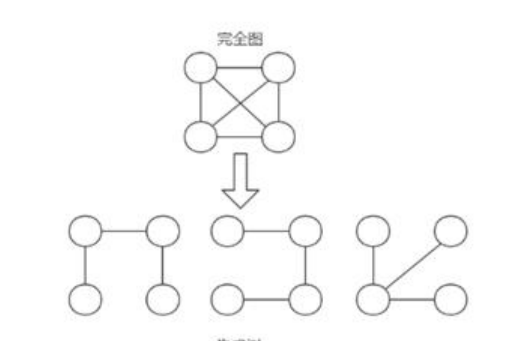

#### 普里姆算法

应用场景-修路问题

**看一个应用场景和问题：** 


**1)** **有胜利乡有** **7** **个村庄(A, B, C, D, E, F, G) ，现在需要修路把7个村庄连通** 

**2)** **各个村庄的距离用边线表示(权) ，比如 A– B 距离 5公里** 

**3)问：如何修路保证各个村庄都能连通，并且总的修建公路总里程最短?** 

**思路: 将 10 条边，连接即可，但是总的里程数不是最小**.

**正确的思路，就是尽可能的选择少的路线，并且每条路线最小，保证总里程数最少.**

---

#### 最小生成树

修路问题本质就是就是**最小生成树问题**， 先介绍一下最小生成树(Minimum Cost Spanning Tree)，简称MST。

**给定一个带权的无向连通图**,如何选取一棵生成树,使树上所有边上权的总和为最小,这叫最小生成树 

1) N 个顶点，一定有N-1条边

2) 包含全部顶点

3) N-1条边都在图中
4) 举例说明(如图:)
5) 求最小生成树的算法主要是普里姆算法和克鲁斯卡尔算法



---

#### 普里姆算法介绍

普利姆(Prim)算法求最小生成树，也就是在包含 n 个顶点的连通图中，找出只有(n-1)条边包含所有 n 个顶点的连通子图，也就是所谓的极小连通子图普利姆的算法如下: 

1	设 G=(V,E)是连通网，T=(U,D)是最小生成树，V,U 是顶点集合，E,D 是边的集合 

2	若从顶点 u 开始构造最小生成树，则从集合 V 中取出顶点 u 放入集合 U 中，标记顶点 v 的 visited[u]=1 

3	若集合 U 中顶点 ui 与集合 V-U 中的顶点 vj 之间存在边，则寻找这些边中权值最小的边，但不能构成回路，将顶点 vj 加入集合 U 中，将边（ui,vj）加入集合 D 中，标记 visited[vj]=1 

4	重复步骤②，直到 U 与 V 相等，即所有顶点都被标记为访问过，此时 D 中有 n-1 条边 

5	提示: 单独看步骤很难理解，我们通过代码来讲解，比较好理解. 

6	图解普利姆算法


#### 普里姆算法最佳实践(修路问题)


有胜利乡有 7 个村庄(A, B, C, D, E, F, G)，现在需要修路把 7 个村庄连通 

各个村庄的距离用边线表示(权) ，比如A – B 距离 5 公里 

问：如何修路保证各个村庄都能连通，并且总的修建公路总里程最短? 

分析+代码演示:

```java
package com.romanticlei.prim;

import java.util.Arrays;

public class PrimAlgorithm {

    public static void main(String[] args) {
        //测试看看图是否创建 ok
        char[] data = new char[]{'A', 'B', 'C', 'D', 'E', 'F', 'G'};
        int verxs = data.length;
        //邻接矩阵的关系使用二维数组表示,10000 这个大数，表示两个点不联通
        int[][] weight = new int[][]{
                {10000, 5, 7, 10000, 10000, 10000, 2},
                {5, 10000, 10000, 9, 10000, 10000, 3},
                {7, 10000, 10000, 10000, 8, 10000, 10000},
                {10000, 9, 10000, 10000, 10000, 4, 10000},
                {10000, 10000, 8, 10000, 10000, 5, 4},
                {10000, 10000, 10000, 4, 5, 10000, 6},
                {2, 3, 10000, 10000, 4, 6, 10000}};

        //创建 MGraph 对象
        MGraph graph = new MGraph(verxs);
        //创建一个 MinTree 对象
        MinTree minTree = new MinTree();
        minTree.createGraph(graph, verxs, data, weight);
        //输出
        minTree.showGraph(graph);
        // 测试普利姆算法
        minTree.prim(graph, 0);
    }
}

// 创建最小生成树 -> 村庄的图
class MinTree {

    /**
     * 创建最小生成树 -> 村庄的图
     *
     * @param graph  图对象
     * @param verxs  图对应的顶点个数
     * @param data   图的各个顶点的值
     * @param weight 图的邻接矩阵
     */
    public void createGraph(MGraph graph, int verxs, char[] data, int[][] weight) {
        int i, j;

        // 遍历顶点个数，开始赋值
        for (i = 0; i < verxs; i++) {
            graph.data[i] = data[i];

            // 赋值路径权值
            for (j = 0; j < verxs; j++) {
                graph.weight[i][j] = weight[i][j];
            }
        }
    }

    // 显示图的邻接矩阵
    public void showGraph(MGraph graph) {
        for (int[] link : graph.weight) {
            System.out.println(Arrays.toString(link));
        }
    }

    /**
     * 得到最小生成树
     *
     * @param graph
     * @param v
     */
    public void prim(MGraph graph, int v) {
        //visited[] 标记结点(顶点)是否被访问过
        // visited[] 默认元素的值都是 0, 表示没有访问过
        int visited[] = new int[graph.verxs];

        // 将当前结点标记为已访问
        visited[v] = 1;
        // 记录两个顶点的下标
        int h1 = -1;
        int h2 = -1;
        int minWeight = 10000; //将 minWeight 初始成一个大数，后面在遍历过程中，会被替换

        // 因为有 graph.verxs 个顶点，依据普利姆算法，会有 graph.verxs-1 边
        for (int k = 1; k < graph.verxs; k++) {

            // 这个是确定每一次生成的子图 ，和哪个结点的距离最近
            for (int i = 0; i < graph.verxs; i++) {
                for (int j = 0; j < graph.verxs; j++) {

                    // 当前结点没有被访问过就直接找下一个节点
                    if(visited[i] != 1) {
                        break;
                    }

                    if (visited[j] == 0 && graph.weight[i][j] < minWeight) {
                        minWeight = graph.weight[i][j];
                        h1 = i;
                        h2 = j;
                    }
                }
            }
            //找到一条边是最小
            System.out.println("边<" + graph.data[h1] + "," + graph.data[h2] + "> 权值:" + minWeight);
            //将当前这个结点标记为已经访问
            visited[h2] = 1;
            // minWeight 重新设置为最大值 10000
            minWeight = 10000;
        }
    }
}

class MGraph {
    int verxs;  // 表示图的节点个数
    char[] data;    // 存放节点数据
    int[][] weight; // 存放边，就是我们的邻接矩阵

    public MGraph(int verxs) {
        this.verxs = verxs;
        data = new char[verxs];
        weight = new int[verxs][verxs];
    }
}
```

