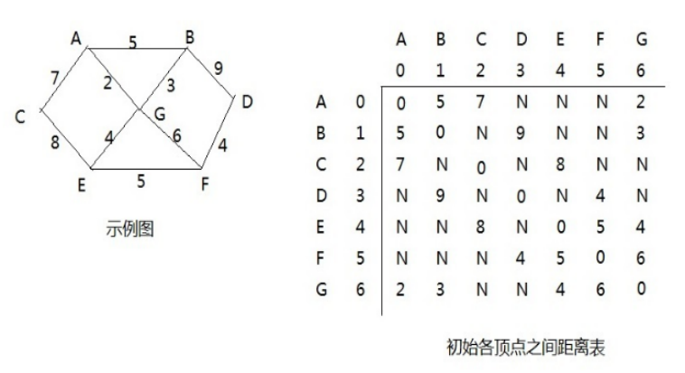
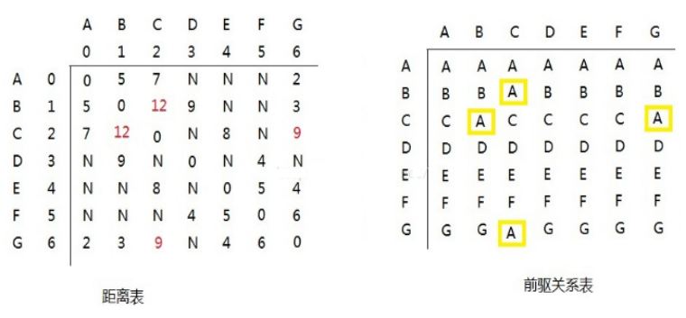
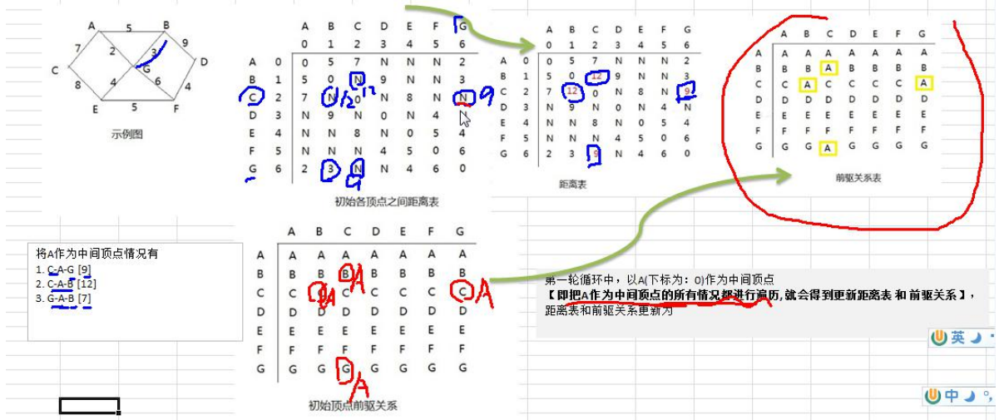

### 弗洛伊德算法

弗洛伊德(Floyd)算法介绍

1) 和 Dijkstra 算法一样，弗洛伊德(Floyd)算法也是一种用于寻找给定的加权图中顶点间最短路径的算法。该算法名称以创始人之一、1978 年图灵奖获得者、斯坦福大学计算机科学系教授罗伯特·弗洛伊德命名 

2) 弗洛伊德算法(Floyd)计算图中各个顶点之间的最短路径 

3) 迪杰斯特拉算法用于计算图中某一个顶点到其他顶点的最短路径。 

4) 弗洛伊德算法 VS 迪杰斯特拉算法：迪杰斯特拉算法通过选定的被访问顶点，求出从出发访问顶点到其他顶点的最短路径；弗洛伊德算法中每一个顶点都是出发访问点，所以需要将每一个顶点看做被访问顶点，求出从每一个顶点到其他顶点的最短路径。

#### 弗洛伊德(Floyd)算法图解分析

1) 设置顶点 vi 到顶点 vk 的最短路径已知为 Lik，顶点 vk 到 vj 的最短路径已知为 Lkj，顶点 vi 到 vj 的路径为 Lij，则 vi 到 vj 的最短路径为：min((Lik+Lkj),Lij)，vk 的取值为图中所有顶点，则可获得 vi 到 vj 的最短路径 

2) 至于 vi 到 vk 的最短路径 Lik 或者 vk 到 vj 的最短路径 Lkj，是以同样的方式获得

3) 弗洛伊德(Floyd)算法图解分析-举例说明




#### 弗洛伊德算法的步骤： 

第一轮循环中，以 A(下标为：0)作为中间顶点【即把 A 作为中间顶点的所有情况都进行遍历, 就会得到更新距离表 和 前驱关系】，距离表和前驱关系更新为：



分析如下： 

1) 以 A 顶点作为中间顶点是，B->A->C 的距离由 N->9，同理 C 到 B；C->A->G 的距离由 N->12，同理 G 到 C

2) 更换中间顶点，循环执行操作，直到所有顶点都作为中间顶点更新后，计算结束




#### 弗洛伊德(Floyd)算法最佳应用-最短路径


1) 胜利乡有 7 个村庄(A, B, C, D, E, F, G) 

2) 各个村庄的距离用边线表示(权) ，比如 A – B 距离 5 公里 

3) 问：如何计算出各村庄到 其它各村庄的最短距离? 

4) 代码实现

```java
package com.romanticlei.floyd;

import java.util.Arrays;

public class FloydAlgorithm {

    public static void main(String[] args) {
        // 测试看看图是否创建成功
        char[] vertex = { 'A', 'B', 'C', 'D', 'E', 'F', 'G' };
        //创建邻接矩阵
        int[][] matrix = new int[vertex.length][vertex.length];
        final int N = 65535;
        matrix[0] = new int[] { 0, 5, 7, N, N, N, 2 };
        matrix[1] = new int[] { 5, 0, N, 9, N, N, 3 };
        matrix[2] = new int[] { 7, N, 0, N, 8, N, N };
        matrix[3] = new int[] { N, 9, N, 0, N, 4, N };
        matrix[4] = new int[] { N, N, 8, N, 0, 5, 4 };
        matrix[5] = new int[] { N, N, N, 4, 5, 0, 6 };
        matrix[6] = new int[] { 2, 3, N, N, 4, 6, 0 };
        Graph graph = new Graph(vertex.length, matrix, vertex);

        graph.floyd();
        graph.show();
    }

}

// 创建图
class Graph {
    private char[] vertexs; // 存放顶点的数组
    private int[][] dis;    // 保存从各个顶点到其他顶点的距离
    private int[][] pre;    // 保存到达目标顶点的前驱结点

    /**
     *
     * @param length    创建数组的长度
     * @param matrix    邻接矩阵
     * @param vertexs   顶点数组
     */
    public Graph(int length, int[][] matrix, char[] vertexs) {
        this.vertexs = vertexs;
        this.dis = matrix;
        this.pre = new int[length][length];

        // 对 pre数组进行初始化，数组中存放的是前驱顶点的下标
        for (int i = 0; i < length; i++) {
            Arrays.fill(pre[i], i);
        }
    }

    public void show() {
        for (int k = 0; k < dis.length; k++) {
            // 先将 pre 数组输出一行
            for (int i = 0; i < dis.length; i++) {
                System.out.print(vertexs[pre[k][i]] + " ");
            }
            System.out.println();

            for (int i = 0; i < dis.length; i++) {
                System.out.print("(" + vertexs[k] + "到" + vertexs[i] + "的最短路径是" + dis[k][i] + ")");
            }
            System.out.printf("\n\n");
        }
    }

    public void floyd() {
        int len = 0; // 变量保存距离
        // 对中间顶点进行遍历，k就是中间顶点的下标[A, B, C, D, E, F, G]
        for (int k = 0; k < vertexs.length; k++) {
            // 从顶点 i 开始出发，[A, B, C, D, E, F, G]
            for (int i = 0; i < dis.length; i++) {
                // 到达顶点 j 结束 [A, B, C, D, E, F, G]
                for (int j = 0; j < dis.length; j++) {
                    // 起始顶点和中间顶点一样就没有意义
                    if (k == i) {
                        break;
                    }
                    len = dis[i][k] + dis[k][j];
                    if (len < dis[i][j]) {
                        // 更新距离
                        dis[i][j] = len;
                        // 更新前驱顶点
                        pre[i][j] = pre[k][j];
                    }
                }
            }
        }
    }
}
```

