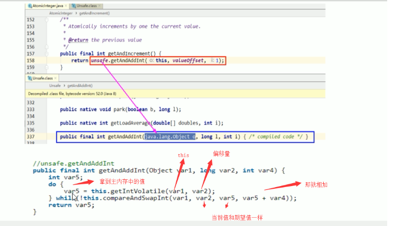

# Java锁之自旋锁

自旋锁：spinlock，是指尝试获取锁的线程不会立即阻塞，而是采用循环的方式去尝试获取锁，这样的好处是减少线程上下文切换的消耗，缺点是循环会消耗CPU

原来提到的比较并交换，底层使用的就是自旋，自旋就是多次尝试，多次访问，不会阻塞的状态就是自旋。



## 优缺点

优点：循环比较获取直到成功为止，没有类似于wait的阻塞

缺点：当不断自旋的线程越来越多的时候，会因为执行while循环不断的消耗CPU资源

## 手写自旋锁

通过CAS操作完成自旋锁，A线程先进来调用myLock方法自己持有锁5秒，B随后进来发现当前有线程持有锁，不是null，所以只能通过自旋等待，直到A释放锁后B随后抢到

```java

/**
 * 手写一个自旋锁
 *
 * 循环比较获取直到成功为止，没有类似于wait的阻塞
 *
 * 通过CAS操作完成自旋锁，A线程先进来调用myLock方法自己持有锁5秒，B随后进来发现当前有线程持有锁，不是null，所以只能通过自旋等待，直到A释放锁后B随后抢到
 */
public class SpinLockDemo {

    // 现在的泛型装的是Thread，原子引用线程
    AtomicReference<Thread>  atomicReference = new AtomicReference<>();

    public void myLock() {
        // 获取当前进来的线程
        Thread thread = Thread.currentThread();
        System.out.println(Thread.currentThread().getName() + "\t come in ");

        // 开始自旋，期望值是null，更新值是当前线程，如果是null，则更新为当前线程，否者自旋
        while(!atomicReference.compareAndSet(null, thread)) {

        }
    }

    /**
     * 解锁
     */
    public void myUnLock() {

        // 获取当前进来的线程
        Thread thread = Thread.currentThread();

        // 自己用完了后，把atomicReference变成null
        atomicReference.compareAndSet(thread, null);

        System.out.println(Thread.currentThread().getName() + "\t invoked myUnlock()");
    }

    public static void main(String[] args) {

        SpinLockDemo spinLockDemo = new SpinLockDemo();

        // 启动t1线程，开始操作
        new Thread(() -> {

            // 开始占有锁
            spinLockDemo.myLock();


            try {
                TimeUnit.SECONDS.sleep(5);
            } catch (InterruptedException e) {
                e.printStackTrace();
            }

            // 开始释放锁
            spinLockDemo.myUnLock();

        }, "t1").start();


        // 让main线程暂停1秒，使得t1线程，先执行
        try {
            TimeUnit.SECONDS.sleep(5);
        } catch (InterruptedException e) {
            e.printStackTrace();
        }

        // 1秒后，启动t2线程，开始占用这个锁
        new Thread(() -> {

            // 开始占有锁
            spinLockDemo.myLock();
            // 开始释放锁
            spinLockDemo.myUnLock();

        }, "t2").start();

    }
}
```

最后输出结果

```java
t1	 come in 
.....五秒后.....
t1	 invoked myUnlock()
t2	 come in 
t2	 invoked myUnlock()
```

首先输出的是 t1	 come in 

然后1秒后，t2线程启动，发现锁被t1占有，所有不断的执行 compareAndSet方法，来进行比较，直到t1释放锁后，也就是5秒后，t2成功获取到锁，然后释放