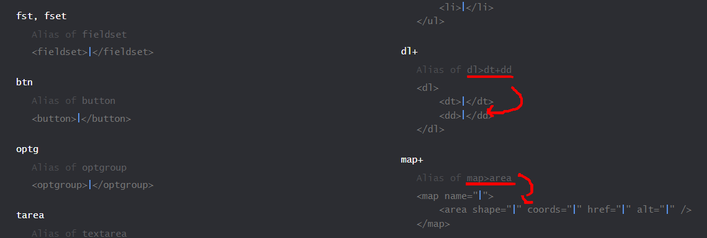

# 一、简介

- Emmet 的前身就是 Zen Coding。
- Emmet可以使用简化的标签生成复杂的html标签，提升编写 HTML/CSS 代码效率。
- Emmet是文本编辑器插件，几乎支持大多数常用的编辑器，vscode内置。
- 官网地址：https://www.emmet.io/
- 官方文档：[Cheat Sheet (emmet.io)](https://docs.emmet.io/cheat-sheet/)
- 源码地址：https://github.com/emmetio/emmet



# 二、操作方法

1. 文本编辑器安装Emmet插件
2. 输入Emmet标签
3. Tab触发插件工作
4. 插件翻译Emmet标签成html标签

缩写：#page>div.logo+ul#navigation>li*5>a{Item $}

```html
<div id="page">
    <div class="logo"></div>
    <ul id="navigation">
        <li><a href="">Item 1</a></li>
        <li><a href="">Item 2</a></li>
        <li><a href="">Item 3</a></li>
        <li><a href="">Item 4</a></li>
        <li><a href="">Item 5</a></li>
    </ul>
</div>
```

# 三、HTML缩写

## 1、标签缩写

#### （1）缩写：!

缩写：html:5 或者 !

```html
<!DOCTYPE html>
<html lang="en">
<head>
    <meta charset="UTF-8">
    <meta http-equiv="X-UA-Compatible" content="IE=edge">
    <meta name="viewport" content="width=device-width, initial-scale=1.0">
    <title>Document</title>
</head>
<body>
    
</body>
</html>
123456789101112
```

#### （2）元素名：element

缩写：div

```html
<div></div>
```

## 2、标签属性内容

#### （1）带`id`标签：#

缩写：div#main 或者 #main

```html
<div id="main"></div>
```

**缩写**：`form#search.wide`

```jsx
<form action="" id="search" class="wide"></form> 
```

#### （2）带`class`标签：.

缩写：div.main 或者 .main

```html
<div class="main"></div>
```

**缩写**：`p.class1.class2.class3`

```jsx
<p class="class1 class2 class3"></p> 
```

#### （3）带属性标签：[]

缩写：div[name=ly age=18]

```html
<div name="ly" age="18"></div>
```

**缩写**：`p[title="Hello world"]`

```xml
<p title="Hello world"></p> 
```

**缩写**：`td[rowspan=2 colspan=3 title]`

```xml
<td rowspan="2" colspan="3" title=""></td> 
```

**缩写**：`[a='value1' b="value2"]`

```xml
<div a="value1" b="value2"></div> 
```

#### （4）带文本标签：{}

缩写：div{文本内容}

```html
<div>文本内容</div>
```

**缩写**：`a{Click me}`

```xml
<a href="">Click me</a> 
```

**缩写**：`p>{Click }+a{here}+{ to continue}`

```xml
<p>Click <a href="">here</a> to continue</p> 
```

#### （5）数字编号：$

将`$`放置在元素的名称、属性的名称或属性的值内，以输出重复元素的数字编号

缩写：ul>li.item$*5

```html
<ul>
    <li class="item1"></li>
    <li class="item2"></li>
    <li class="item3"></li>
    <li class="item4"></li>
    <li class="item5"></li>
</ul>
```

还可以使用多个`$`实现缺位补零

缩写：ul>li.item$$$*5

```html
<ul>
    <li class="item001"></li>
    <li class="item002"></li>
    <li class="item003"></li>
    <li class="item004"></li>
    <li class="item005"></li>
</ul>
```

`@-`放在`$`后面表示递减

缩写：ul>li.item$@-*5

```html
<ul>
    <li class="item5"></li>
    <li class="item4"></li>
    <li class="item3"></li>
    <li class="item2"></li>
    <li class="item1"></li>
</ul>
```

`@N`放在`$`后面表示起始数字是N

缩写：ul>li.item$@3*5

```html
<ul>
    <li class="item3"></li>
    <li class="item4"></li>
    <li class="item5"></li>
    <li class="item6"></li>
    <li class="item7"></li>
</ul>
```

`@N`和`@-`合并使用效果就是递减到N

缩写：ul>li.item$@-3*5

```html
<ul>
    <li class="item7"></li>
    <li class="item6"></li>
    <li class="item5"></li>
    <li class="item4"></li>
    <li class="item3"></li>
</ul>
```

###（6）隐式标签

**缩写**：`.class`

```ruby
<div class></div> 
```

**缩写**：`em>.class`

```xml
<em><span class="class"></span></em> 
```

**缩写**：`ul>.class`

```xml
<ul> <li class="class"></li></ul> 
```

**缩写**：`table>.row>.col`

```xml
<table> <tr class="row"> <td class="col"></td> </tr> </table> 
```


### 3、嵌套运算符

#### （1）后代关系：>

缩写：div>ul>li

```html
<div>
    <ul>
        <li></li>
    </ul>
</div>
```

#### （2）兄弟关系：+ (平级)

缩写：div+p+span

```html
<div></div>
<p></p>
<span></span>
```

#### （3）上级元素, 父级兄弟关系：^

和最近的X>是兄弟关系

缩写：div>span^p

```html
<div><span></span></div>
<p></p>
```

**缩写**：`div+div>p>span+em^bq`

```xml
<div></div> 
<div> 
    <p>
        <span></span>
        <em></em>
    </p> 
    <blockquote></blockquote> 
</div> 
```

**缩写**：`div+div>p>span+em^^bq`

```xml
<div></div> 
<div>
    <p>
        <span></span>
        <em></em>
    </p> 
</div> 
<blockquote></blockquote> 
```

#### （4）重复多份：*

缩写：div*3

```html
<div></div>
<div></div>
<div></div>
```

#### （5）标签分组：()

当标签比较复杂的时候可以用()，()中的部分作为一个整体来看

缩写：div>(header>ul>li*2>a)+footer>p

```html
<div>
    <header>
        <ul>
            <li><a href=""></a></li>
            <li><a href=""></a></li>
        </ul>
    </header>
    <footer>
        <p></p>
    </footer>
</div>
```

**缩写**：`div>(header>ul>li*2>a)+footer>p`

```xml
<div>
   <header> <ul> <li><a href=""></a></li> <li><a href=""></a></li> </ul> </header> <footer> <p></p> </footer> </div> 
```

**缩写**：`(div>dl>(dt+dd)*3)+footer>p`

```xml
<div>
    <dl> <dt></dt> <dd></dd> <dt></dt> <dd></dd> <dt></dt> <dd></dd> </dl> </div> <footer> <p></p> </footer> 
```

### 4、缩写格式说明

当您熟悉 Emmet 的缩写语法后，您可能希望使用一些格式来使您的缩写更具可读性。例如，在元素和运算符之间使用空格，但它会让缩写失效，因为空格是Emmet 停止缩写解析的*停止符号。*

在标签中间任何位置写emmet也能正常解析成html标签，所以不需要换行和空格等

```html
<ul class="nav">
    <li>span.info</li>
    <li></li>
    <li></li>
    <li></li>
    <li></li>
</ul>
```

解析结果

```html
<ul class="nav">
    <li><span class="info"></span></li>
    <li></li>
    <li></li>
    <li></li>
    <li></li>
</ul>
```

### 5、常用默认属性

#### （1）缩写：a

```html
<a href=""></a>
```

#### （2）缩写：a:link

```html
<a href="http://"></a>
```

#### （3）缩写：a:mail

```html
<a href="mailto:"></a>
```

#### （4）缩写：link

```html
<link rel="stylesheet" href="">
```

#### （5）缩写：link:css

```html
<link rel="stylesheet" href="style.css">
```

#### （6）缩写：link:favicon

```html
<link rel="shortcut icon" type="image/x-icon" href="favicon.ico">
```

#### （7）缩写：meta:utf

```html
<meta http-equiv="Content-Type" content="text/html;charset=UTF-8">
```

#### （8）缩写：meta:vp

```html
<meta name="viewport" content="width=device-width, user-scalable=no, initial-scale=1.0, maximum-scale=1.0, minimum-scale=1.0">
```

#### （9）缩写：script:src

```html
<script src=""></script>
```

#### （10）缩写：img

```html

```

#### （11）缩写：form:post

```html
<form action="" method="post"></form>
```

#### （12）缩写：form:get

```html
<form action="" method="get"></form>
1
```

#### （13）缩写：input:h

```html
<input type="hidden" name="">
1
```

#### （14）缩写：input:t

```html
<input type="text" name="" id="">    
1
```

#### （15）缩写：input:p

```html
<input type="password" name="" id="">         
1
```

#### （16）缩写：input:c

```html
<input type="checkbox" name="" id="">     
1
```

#### （17）缩写：input:r

```html
<input type="radio" name="" id="">     
1
```

#### （18）缩写：input:f

```html
<input type="file" name="" id="">        
1
```

#### （19）缩写：input:s

```html
<input type="submit" value=""> 
1
```

#### （20）缩写：input:b

```html
<input type="button" value="">
1
```

#### （21）缩写：btn:r

```html
<button type="reset"></button>   
1
```

#### （22）缩写：btn:s

```html
<button type="submit"></button>
1
```

### 6、隐式标签

#### （1）简介

 即使有如此强大的缩写引擎，可以从简短的缩写扩展成大型 HTML 结构，编写标签名称还是可能会非常繁琐。

 在许多情况下，您可以省略标签名称，例如，`div.content`您可以简单地将其编写`.content`并扩展为`<div class="content"></div>`.

#### （2）原理

 当您展开缩写时，Emmet 会根据父上下文解析子元素，[自动补全](https://so.csdn.net/so/search?q=自动补全&spm=1001.2101.3001.7020)。

- `li`对于`ul`和`ol`
- `tr`对于`table`,和`tbody`_`thead``tfoot`
- `td`为了`tr`
- `option`对于`select`和`optgroup`

#### （3）左边和右边等价

| .wrap>.content               | div.wrap>div.content          |
| ---------------------------- | ----------------------------- |
| em>.info                     | em>span.info                  |
| ul>.item*3                   | ul>li.item*3                  |
| table>.row$*4>[colspan=2] \| | table>tr.row$*4>td[colspan=2] |

### 7、占位标记

 lorem表示占位标记，作用是随机生成一个文本。lorem1表示生成的文本包含一个单词，lorem2表示生成的文本包含两个单词，以此类推，loremN表示生成的文本包含N个单词。

缩写：div*4>lorem3

```html
<div>Lorem, ipsum dolor.</div>
<div>Soluta, aliquam veritatis?</div>
<div>Praesentium, fugiat vel.</div>
<div>Quos, omnis nihil.</div>
1234
```

## 四、CSS缩写

### 1、首字母缩写

- fl → float: left;
- fwb→font-weight: bold；
- df→display: flex；
- jcc→justify-content: center；
- aic→align-items: center；
- tac→text-align: center；
- m10→margin: 10px；

### 2、首字母不够，前两个字母

- poa→position: absolute；

### 3、多个属性值用`-`隔开

- m4-6 → margin: 4px 6px;
- p4-6-8 → padding: 4px 6px 8px;

### 4、提供带单位的值

- 当你用整数值展开一个缩写时，Emmet 会用一个`px`单位输出它，比如：`m10→margin: 10px;`
- 如果你用浮点值扩展一个缩写，它会输出一个`em`单位，比如：`m1.5→margin: 1.5em;`
- 可以明确提供单位名称，只需放在值后面即可，比如：`m1.5ex→margin: 1.5ex;`
- 明确定义单位，则无需再使用连字符分隔值，比如：`m10ex20em→margin: 10ex 20em;`

### 5、单位别名

- p → %
- e → em
- x → ex

```html
w100p → width: 100%
m10p30e5x → margin: 10% 30em 5ex
12
```

### 6、颜色值缩写

- \#1 → #111111
- \#e0 → #e0e0e0
- \#fc0 → #ffcc00

```html
c#3 → color: #333
bd5#0s → border: 5px #000 solid
12
```

### 7、无单位属性缩写

有些属性值是没有单位的，比如z-index，line-height，opacity，font-weight

```html
lh2→line-height: 2
fw400→font-weight: 400
12
```

### 8、!important缩写！

- !→!important

```html
p!→padding: !important
fl!→float: left !important
```