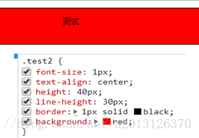
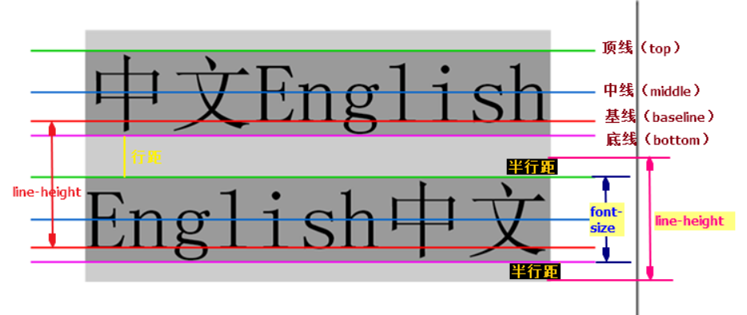
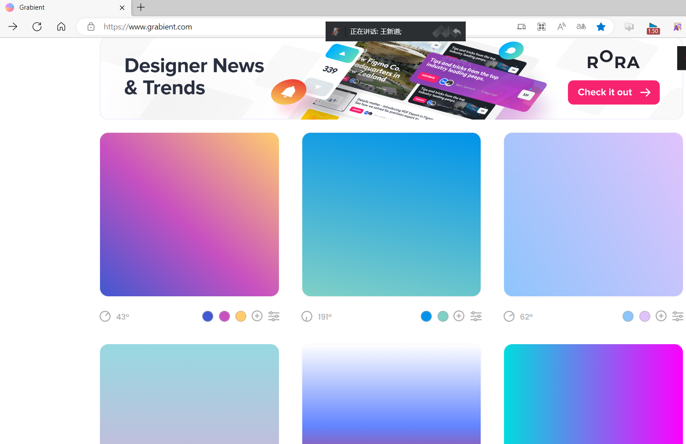
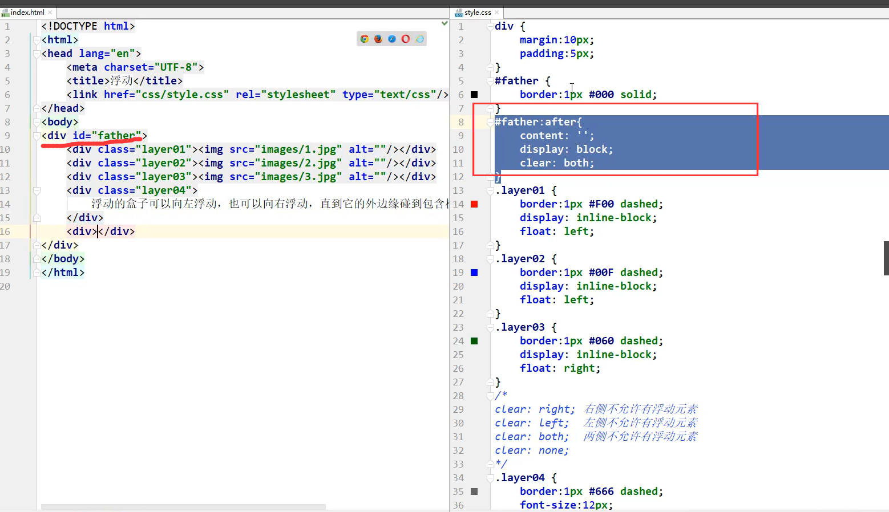
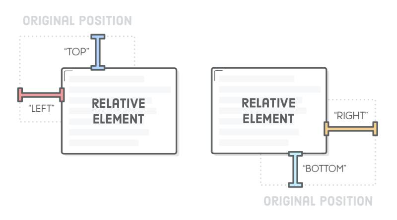
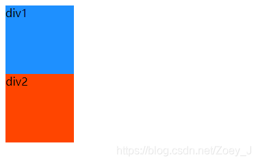

# 1、3种导入方式

```java
<!DOCTYPE html>
<html lang="en">
<head>
    <meta charset="UTF-8">
    <title>Title</title>

    <!--内部样式-->
    <style>
        h1{
            color: green;
        }
    </style>

    <!--外部样式-->
    <link rel="stylesheet" href="css/style.css" />
</head>
<body>

<!--优先级：就近原则-->
<!--行内样式：在标签元素中，编写一个style属性，编写样式即可-->
<h1 style="color: red">这是标签</h1>
</body>
</html>
```

拓展：外部样式两种方法

- 链接式
  html

```html
<!--外部样式-->
    <link rel="stylesheet" href="css/style.css" />
```

- 导入式
  @import是CSS2.1特有的！

```java
<!--导入式-->
    <style>
        @import url("css/style.css");
    </style>
```


# 2、基本选择器

## 2.1、基本选择器

1、标签选择器：选择一类标签 标签名{}

```html
<!DOCTYPE html>
<html lang="en">
<head>
    <meta charset="UTF-8">
    <title>Title</title>
    <style>
        h1{
            color: orange;
            background: blue;
            border-radius: 10px;
        }
    </style>
</head>
<body>
<h1>标签选择器</h1>
</body>
</html>
```

2、类选择器class：选择所有class一致的标签，跨标签，格式：.类名{}

```html
<!DOCTYPE html>
<html lang="en">
<head>
    <meta charset="UTF-8">
    <title>Title</title>

    <style>
        /*类选择器的格式 .class的名称{}
            好处：可以多个标签归类，是同一个class，可以复用
        */
        .demo1{
            color: blue;
        }
        .demo2{
            color: red;
        }
        .demo3{
            color: aqua;
        }
    </style>
</head>
<body>
<h1 class = "demo1">类选择器：demo1</h1>
<h1 class="demo2">类选择器：demo2</h1>
<h1 class="demo3">类选择器：demo3</h1>
</body>
</html>
```

3、id选择器：全局唯一，格式：#id名{}

```html
<!DOCTYPE html>
<html lang="en">
<head>
    <meta charset="UTF-8">
    <title>Title</title>
    <style>
        /*id选择器：id必须保证全局唯一
            #id名称{}
            不遵循就近原则，优先级是固定的
            id选择器 > 类选择器  >  标签选择器
        */
        #demo1{
            color: aqua;
        }
        .demo2{
            color: red;
        }
        #demo2{
            color: orange;
        }
        h1{
            color: blue;
        }
    </style>
</head>
<body>

<h1 id="demo1">id选择器：demo1</h1>
<h1 class="demo2" id = "demo2">id选择器：demo2</h1>
<h1 class="demo2">id选择器：demo3</h1>
<h1>id选择器：demo4</h1>
<h1>id选择器：demo5</h1>
</body>
</html>
```

优先级：id > class > 标签

## 2.2、层次选择器


1. 后代选择器：在某个元素的后面的所有

```html
/*后代选择器*/
<style>
body p{
	background:red;
}
</style>
```

2. 子选择器，一代元素

```html
/*子选择器*/
<style>
body>p{
	background:orange;
}
</style>
```

3. 相邻的兄弟选择器 同辈(和类选择器连用)

```html
/*相邻兄弟选择器：只有一个，相邻（向下）*/
<style>
    .active+p{
    	background: red
    }
</style>

<body>
	<p class="active">p1<p>
	<p>p2</p>
</body>
```

4. 通用选择器(和类选择器连用)

```html
<style>
/*通用兄弟选择器，当前选中元素的向下的所有兄弟元素*/
	.active~p{
		background:red;
	}
</style>
<body>
	<p class="active">p1<p>
	<p>p2</p>
</body>
```


## 2.3、结构伪类选择器

伪类

```html
<style>
        /*ul的第一个子元素*/
        ul li:first-child{
            background: aqua;
        }

        /*ul的最后一个子元素*/
        ul li:last-child{
            background: blue;
        }
    
        /*选中p1：定位到父元素，选择当前的第一个元素
            选择当前p元素 的父级元素，选中父级元素的第一个，并且是当前元素才生效！
        */
        p:nth-child(1){
            background: orange;
        }


        /*选中父元素下的，第2个p元素*/
        p:nth-of-type(2){
            background: red;
        }
    </style>
```

## 2.4、属性选择器（常用）

==id + class结合==

```html
<!DOCTYPE html>
<html lang="en">
<head>
    <meta charset="UTF-8">
    <title>Title</title>
    <style>
         .demo a{
            display: block;
            height: 50px;
            width: 50px;
            float:left;
            border-radius: 10px;
            background: blue;
            text-align: center;
            color: beige;
            text-decoration: none;
            margin-right: 5px;
            font: bold 20px/50px Arial;
        }
         /*属性名，属性名=属性值（正则）
         =表示绝对等于
         *=表示包含
         ^=表示以...开头
         $=表示以...结尾
         */
        /* 存在id属性的元素  a[]{}*/
        /* a[id]{
             background: red;
         }*/

         /*id=first的元素*/
       /* a[id=first]{
            background: aqua;
        }*/

        /*class中有links元素*/
       /* a[class="links item2 first2"]{
            background: orange;
        }*/
        /*a[class*="links"]{
            background: black ;
        }*/
        /*选中href中以http开头的元素*/
        a[href^="http"]{
            background: orange;
        }
    </style>

</head>
<body>
<p class="demo">
    <a href="http://www.baidu.com" class="links item first" id="first">1</a>
    <a href="/adad/faf" class="links item2 first2" >2</a>
    <a href="qwe123" class="links item3 first3" >3</a>
    <a href="eweqe" class="links item4 first4" >4</a>
    <a href="rrrrr" class="links item5 first5" >5</a>
    <a href="ttt" class="links item6 first6" >6</a>
    <a href="yyy" class="links item7 first7" >7</a>
</p>
</body>
</html>
```


# 3、美化网页元素

1. 有效的传递页面信息
2. 美化网页，页面漂亮才能吸引客户
3. 凸显页面的主题
4. 提高用户的体验

## 3.1、字体样式

span标签：重点要突出的字，使用span标签套起来

```text
CSS 使用 font-size 属性定义字体大小。
font-family：字体
font-size：字体大小
font-weight：字体粗细
```

  **字体大小**font-size

1. px（像素）大小是我们网页的最常用的单位

2. 谷歌浏览器默认的文字大小为16px

3. 不同浏览器可能默认显示的字号大小不一致，我们尽量给一个明确值大小，不要默认大小

4. 可以给 body 指定整个页面文字的大小

**字体粗细**font-weight


 **字体样式**font-family


例子

```java
<!DOCTYPE html>
<html lang="en">
<head>
    <meta charset="UTF-8">
    <title>Title</title>
    <style>
        body{
            font-family:楷体;
            color：red;
        }
        h1{
            font-size：50px;
        }
        .p1{
            font-weight：blod;
        }
    </style>
</head>
<body>
学习语言
<span id="title1">JAVA</span>
</body>
</html>
```


例子

```html
<!DOCTYPE html>
<html lang="en">
<head>
    <meta charset="UTF-8">
    <title>字体样式</title>
    
<!--    font->family : 字体
        font->size : 字体大小
       	font->weight : 字体粗细
       	color : 字体颜色
-->
    <style>
        body{
            font-family: 楷体;
            color: #2cce9f;
        }
        h1{
            font-size: 50px;
        }
        .p1{
            font-weight: bold;
        }
    </style>
</head>
<body>

<h1>故事介绍</h1>
<p class="p1">
    这个世界名为元泱境界，脉（本质为振动）是构成万物的基础。每隔333年，会有一个神秘而强大的异常生物重生，它就是魁拔！魁拔的每一次出现，都会给元泱境界带来巨大的灾难！即便是天界的神族，也在劫难逃。在天地两界各种力量的全力打击下，魁拔一次次被消灭，但又总是按333年的周期重新出现。魁拔纪元1664年，天神经过精确测算后，在魁拔苏醒前一刻对其进行毁灭性打击。但谁都没有想到，由于一个差错导致新一代魁拔成功地逃脱了致命一击。很快，天界魁拔司和地界神圣联盟均探测到了魁拔依然生还的迹象。因此，找到魁拔，彻底消灭魁拔，再一次成了各地热血勇士的终极目标。
</p>
<p>
    在偏远的兽国窝窝乡，蛮大人和蛮吉每天为取得象征成功和光荣的妖侠纹耀而刻苦修炼，却把他们生活的村庄搅得鸡犬不宁。村民们绞尽脑汁把他们赶走。一天，消灭魁拔的征兵令突然传到窝窝乡，村长趁机怂恿蛮大人和蛮吉从军参战。然而，在这个一切都凭纹耀说话的世界，仅凭蛮大人现有的一块冒牌纹耀，不要说参军，就连住店的资格都没有。受尽歧视的蛮吉和蛮大人决定，混上那艘即将启程去消灭魁拔的巨型战舰，直接挑战魁拔，用热血换取至高的荣誉。 [1]
</p>

</body>
</html>
```


**总结**


## 3.2、文本样式

### 文本对齐方式text-align:xxx

（1）height = line-height时   **//    相当于文字居中**

（2）height>line-height时    // **偏上**


（3）height<line-height时   // **偏下**


### 首行缩进text-indent:xxx

### 行高line-height:xxx



### 下划线text-decoration:xxx

```css
text-decoration:underline/*下划线*/
text-decoration:line-through/*中划线*/
text-decoration:overline/*上划线*/
text-decoration:none/*超链接去下划线*/
```

图片、文字水平对齐

```css
img,span{vetical-align:middle}
```

例子

```html
<!DOCTYPE html>
<html lang="en">
<head>
  <meta charset="UTF-8">
  <title>文本样式</title>
  <!--   颜色:
            单词
            RGB 0-F
            RGBA A: 0-1

        text-align : 排版, 居中
        text-indent : 2em; 段落首行缩进

        行高:
           和块的高度一致, 就可以上下居中   height  == line-height
  -->
  <style>
     h1{
       color: rgba(0, 255, 255, 0.9);
       text-align: center;
     }
     .p1{
       text-indent: 2em;
     }
     .p2{
       background: #2cce9f;
       height: 300px;
       line-height: 300px;
     }

  </style>
</head>
<body>

<h1>故事介绍</h1>
<p class="p1">
  这个世界名为元泱境界，脉（本质为振动）是构成万物的基础。每隔333年，会有一个神秘而强大的异常生物重生，它就是魁拔！魁拔的每一次出现，都会给元泱境界带来巨大的灾难！即便是天界的神族，也在劫难逃。在天地两界各种力量的全力打击下，魁拔一次次被消灭，但又总是按333年的周期重新出现。魁拔纪元1664年，天神经过精确测算后，在魁拔苏醒前一刻对其进行毁灭性打击。但谁都没有想到，由于一个差错导致新一代魁拔成功地逃脱了致命一击。很快，天界魁拔司和地界神圣联盟均探测到了魁拔依然生还的迹象。因此，找到魁拔，彻底消灭魁拔，再一次成了各地热血勇士的终极目标。
</p>
<p class="p2">
  在偏远的兽国窝窝乡，蛮大人和蛮吉每天为取得象征成功和光荣的妖侠纹耀而刻苦修炼，却把他们生活的村庄搅得鸡犬不宁。村民们绞尽脑汁把他们赶走。一天，消灭魁拔的征兵令突然传到窝窝乡，村长趁机怂恿蛮大人和蛮吉从军参战。然而，在这个一切都凭纹耀说话的世界，仅凭蛮大人现有的一块冒牌纹耀，不要说参军，就连住店的资格都没有。受尽歧视的蛮吉和蛮大人决定，混上那艘即将启程去消灭魁拔的巨型战舰，直接挑战魁拔，用热血换取至高的荣誉。 [1]
</p>

<p class="l1">123</p>
<p class="l2">123</p>
<p class="l3">123</p>
</body>
</html>
```


## 3.3、颜色

```css
color: rgba(0, 255, 255, 0.9);
```

**背景颜色:**

```css
background-color:aqua;
```

## 3.4、鼠标样式

**cursor** : 网页浏览时用户鼠标指针的样式或图形形状。

属性值：

```css
default：默认光标（通常是一个箭头）
auto：默认，浏览器设置的光标
crosshair：光标为十字线
pointer：光标为一只手
move：光标为某对象可移动
text：光标指示文本
wait：光标指示程序正在忙（通常是一只表或者一个沙漏）
```

## 3.4、阴影和超链接伪类

```css
<style>
	a{/*超链接有默认的颜色*/
		text-decoration:none;
		color:#000000;
	}
	a:hover{/*鼠标悬浮的状态*/
		color:orange;
	}
	a:active{/*鼠标按住未释放的状态*/
		color:green
	}
	a:visited{/*点击之后的状态*/
		color:red
	}
</style>
```

阴影：

```css
/*	第一个参数：表示水平偏移
	第二个参数：表示垂直偏移
	第三个参数：表示模糊半径
	第四个参数：表示颜色
*/
text-shadow:5px 5px 5px 颜色
```

例子

```html
<!DOCTYPE html>
<html lang="en">
<head>
    <meta charset="UTF-8">
    <title>Title</title>
    <style>
        /*默认的颜色*/
        a{
            text-decoration: none;
            color: #c1972c;
        }
        /*鼠标悬浮颜色*/
        a:hover{
            color: red;
        }
        /*鼠标按住未释放的状态*/
        /*a:active{*/
        /*    color: #2cce9f;*/
        /*}*/
        /*a:visited{*/
        /*    color: blue;*/
        /*}*/

        #price{
            /*阴影  阴影颜色 水平偏移 垂直偏移 阴影半径 */
            text-shadow: blue 10px 10px 1px;
        }
    </style>
</head>
    
<body>
<a href="#">
    
</a>
<p>
    <a href="">时间简史</a>
</p>
<p>
    <a href="">作者: 规矩</a>
</p>
<p id="price">
    $99
</p>

</body>
</html>
```


## 3.6、列表ul li

```css
/*list-style{
	none:去掉原点
	circle：空心圆
	decimal：数字
	square：正方形
}*/
ul li{
	height:30px;
	list-style:none;
	text-indent:1em;
}
a{
	text-decoration:none;
	font-size:14px;
	color:#000;
}
a:hover{
	color:orange;
	text-decoration:underline
}
/*放在div中，作为导航栏*/
<div id="nav"></div>
#nav{
	width:300px;
}
```


```html
<!DOCTYPE html>
<html>
<head lang="en">
  <meta charset="UTF-8">
  <title>列表样式</title>
  <link href="../css/style.css" rel="stylesheet" type="text/css"/>
</head>
    
<body>
<h2 class="title">全部商品分类</h2>
<ul>
  <li><a href="#">图书</a>&nbsp;&nbsp;<a href="#">音像</a>&nbsp;&nbsp;<a href="#">数字商品</a></li>
  <li><a href="#">家用电器</a>&nbsp;&nbsp;<a href="#">手机</a>&nbsp;&nbsp;<a href="#">数码</a></li>
  <li><a href="#">电脑</a>&nbsp;&nbsp;<a href="#">办公</a></li>
  <li><a href="#">家居</a>&nbsp;&nbsp;<a href="#">家装</a>&nbsp;&nbsp;<a href="#">厨具</a></li>
  <li><a href="#">服饰鞋帽</a>&nbsp;&nbsp;<a href="#">个护化妆</a></li>
  <li><a href="#">礼品箱包</a>&nbsp;&nbsp;<a href="#">钟表</a>&nbsp;&nbsp;<a href="#">珠宝</a></li>
  <li><a href="#">食品饮料</a>&nbsp;&nbsp;<a href="#">保健食品</a></li>
  <li><a href="#">彩票</a>&nbsp;&nbsp;<a href="#">旅行</a>&nbsp;&nbsp;<a href="#">充值</a>&nbsp;&nbsp;<a href="#">票务</a></li>
</ul>
</body>
</html>
```

```css
.title{
    font-size: 18px;
    font-weight: bold;
    text-indent: 1em;
    line-height: 30px;
    background: red;
}

ul li{
    height: 30px;
    list-style: none;
}

ul {
    background: antiquewhite;
}
a{
    text-decoration: none;
    font-size: 14px;
    font-weight: bold;
    color: #000;
}

a:hover{
    color: orange;
    text-decoration: underline;
}
```


## 3.7、背景

1. 背景颜色：background
2. 背景图片

```css
background-image:url("");/*默认是全部平铺的*/
background-repeat:repeat-x/*水平平铺*/
background-repeat:repeat-y/*垂直平铺*/
background-repeat:no-repeat/*不平铺*/
```

例子

```html
<!DOCTYPE html>
<html lang="en">
<head>
    <meta charset="UTF-8">
    <title>Title</title>
    <style>
        div {
            width: 1000px;
            height: 700px;
            /*边框*/
            border: 1px solid red;
            /*默认全部平铺*/
            background-image: url("../html/resources/image/a.png");
        }

        .div1{
            /*不平铺*/
            background-repeat: no-repeat;
        }
        .div2{
            /*垂直平铺*/
            background-repeat: repeat-y;
        }
    </style>
</head>
<body>

<div class="div1"></div>
<div class="div2"></div>
<div class="div3"></div>

</body>
</html>
```


## 3.8、渐变

网址：https://www.grablent.com



```html
<!DOCTYPE html>
<html lang="en">
<head>
    <meta charset="UTF-8">
    <title>Title</title>
  <style>
      body{
          background-color: #0093E9;
          background-image: linear-gradient(191deg, #0093E9 0%, #80D0C7 100%);
      }
  </style>
</head>
<body>

</body>
</html>
```


# 4、盒子模型

## 4.1 盒子模型


1. margin：外边距
2. padding：内边距
3. border：边框

## 4.2、边框

body总有一个默认的外边距 margin:0

常见操作：初始化

```css
margin:0;
padding:0;
text-decoration:none;
```

---------

border：粗细 样式 颜色

1. 边框的粗细
2. 边框的样式
3. 边框的颜色

```html
<!DOCTYPE html>
<html lang="en">
<head>
    <meta charset="UTF-8">
    <title>登录</title>

    <style>
        body{
            /*body总有一个默认的外边距  margin: 0; 下面是规范*/
            margin: 0;
            padding: 0;
            text-decoration: none;
        }

        #box{
            width: 300px;
            /*粗细 样式 颜色*/
            border: 1px solid red;
        }

        form{
            background: #2cce9f;
        }
        div>input{
            border: 3px solid black;
        }
        h2{
            margin-top: 0px;
            margin-bottom: 0px;
        }
    </style>

</head>
<body>

<div id="box">
  <h2>会员登陆</h2>
  <form action="#">
        <div>
            <span>用户名:</span>
            <input type="text" name="" >
        </div>
        <div>
            <span>密码:</span>
            <input type="text" name="" id="">
        </div>
        <div>
            <span>邮箱:</span>
            <input type="text" name="" id="">
        </div>
    </form>
</div>

</body>
</html>
```


## 4.3、外边距----妙用：居中

margin-left/right/top/bottom–>表示四边，可分别设置，也可以同时设置如下

```css
margin:0 0 0 0/*分别表示上、右、下、左；从上开始顺时针*/
/*例1：居中*/
margin:0 auto /*auto表示左右自动*/
/*例2：*/
margin:4px/*表示上、右、下、左都为4px*/
/*例3*/
margin:10px 20px 30px/*表示上为10px，左右为20px，下为30px*/
```

盒子的计算方式：
margin+border+padding+内容的大小

例子

浏览器的居中

```css
#box{
    width: 300px;
    /*粗细 样式 颜色*/
    border: 1px solid red;
    margin: 0 auto;
}
```

相对于盒子的居中

```css
h1{
    margin-top:0px;
    margin-bottom:5px;
    padding-bottom:0px;
    padding-left:20px;
}
```

-----------

```html
<!DOCTYPE html>
<html lang="en">
<head>
    <meta charset="UTF-8">
    <title>登录</title>

    <style>
        body{
            /*body总有一个默认的外边距  margin: 0; 下面是规范*/
            padding: 0;
            text-decoration: none;
            margin: 0;
        }
		/*浏览器的居中*/
        #box{
            width: 300px;
           /*粗细 样式 颜色*/
            border: 1px solid red;
            margin: 0 auto;
        }

        form{
            background: #2cce9f;
        }
        div>input{
            border: 3px solid black;
        }
        /*相对于盒子的居中*/
        h2{
            margin-top: 0px;
            margin-bottom: 0px;
        }
    </style>

</head>
<body>

<div id="box">
  <h2>会员登陆</h2>
  <form action="#">
        <div>
            <span>用户名:</span>
            <input type="text" name="" >
        </div>
        <div>
            <span>密码:</span>
            <input type="text" name="" id="">
        </div>
        <div>
            <span>邮箱:</span>
            <input type="text" name="" id="">
        </div>
    </form>
</div>

</body>
</html>
```


## 4.4、圆角边框----border-radius

border-radius有四个参数（顺时针），左上开始

圆圈：圆角=半径

```html
<!DOCTYPE html>
<html lang="en">
<head>
    <meta charset="UTF-8">
    <title>圆角边框</title>
  <style>
    /*左上 右上 右下 左下   顺时针
        圆圈
    */
    div{
        width: 50px;
        height: 50px;
        margin: 30px;
        border: 10px solid red;
        border-radius: 50px 0px 0px 0px;
    }

    img{
        border-radius: 25px;
    }

  </style>
</head>
<body>

<div>

</div>


</body>
</html>
```


## 4.5、盒子阴影

```
  div{
        width: 50px;
        height: 50px;
        margin: 30px;
        border: 10px solid red;
        border-radius: 50px 0px 0px 0px;
        /*盒子阴影*/
        box-shadow: 10px 10px 1px yellow;
    }
```


# 5、浮动

## 5.1标准文档流


块级元素：独占一行

```
h1~h6     P     div 列表....
```

行内元素：不独占一行    行类元素, 文字多少就占多少, 可以设置高度

```
span   a  img   strong....
```

**行内元素 可以被包含在 块级元素中，反之，则不可以~**

**a标签的行元素**


**变成块元素**


例子

```html
<!DOCTYPE html>
<html lang="en">
<head>
    <meta charset="UTF-8">
    <title>Title</title>

    <style>
        div{
            width: 100px;
            height: 100px;
            border: 1px solid red;
        }

        span{
            width: 100px;
            height: 100px;
            border: 1px solid red;
        }
    </style>


</head>
<body>

<div>
    div块元素
</div>

<span>
    行类元素, 文字多少就占多少
</span>

</body>
</html>
```


## 5.2、display（重要）

1. block：块元素
2. inline：行内元素
3. inline-block：是块元素，但是可以内联，在一行
3. none：消失

> 这也是一种实现行内元素排列的方式，但是我们很多情况用float

```html
<!DOCTYPE html>
<html lang="en">
<head>
    <meta charset="UTF-8">
    <title>Title</title>
    <!--block 块元素
        inline 行内元素
        inline-block 是块元素，但是可以内联 ，在一行
    -->
    <style>
        div{
            width: 100px;
            height: 100px;
            border: 1px solid red;
            display: inline-block;
        }
        span{
            width: 100px;
            height: 100px;
            border: 1px solid red;
            display: inline-block;  /*设置成块元素*/
        }
    </style>
</head>
<body>
<div>div块元素</div>
<span>span行内元素</span>
</body>
</html>
```


例子

```html
<!DOCTYPE html>
<html lang="en">
<head>
    <meta charset="UTF-8">
    <title>QQ会员</title>
    <link rel="stylesheet" href="css/style.css" />
    <style>
        *{
            padding:0;
            margin: 0;
        }
        a{
            text-decoration: none;
        }
        .nav-header{
            height: 90px;
            width: 100%;
            background: rgba(0,0,0,.6);
        }
        .head-contain{
            width: 1180px;
            height: 90px;
            margin: 0 auto;
            text-align: center;
        }
        .top-logo,.top-nav,.top-nav li,.top-right{
            height: 90px;
            display: inline-block;
            vertical-align: top;
        }
        .top-nav{
            margin: 0 48px;
        }
        .top-nav li{
            line-height: 90px;
            width: 90px;
        }
        .top-nav li a{
            display: block;
            text-align: center;
            font-size: 16px;
            color: #fff;
        }
        .top-nav li a:hover{
            color: blue;
        }

        .top-right a{
            display: inline-block;
            font-size: 16px;
            text-align: center;
            margin-top: 25px;
            border-radius: 35px;
        }
        .top-right a:first-of-type{
            width: 93px;
            height: 38px;
            line-height: 38px;
            color: #fad65c;
            border: 1px #fad65c solid;
        }
        .top-right a:first-of-type:hover{
            color: #986b0d;
            background: #fad65c;
        }
        .top-right a:last-of-type{
            width: 140px;
            height: 40px;
            font-weight: 700;
            line-height: 40px;
            background: #fad65c;
            color: #986b0d;
        }
        .top-right a:last-of-type:hover{
            background: #fddc6c;
        }
    </style>
</head>
<body>
<div class="wrap">
    <!--头部-->
    <header class="nav-header">
        <div class="head-contain">
            <a href="" class="top-logo"></a>
            <nav class="top-nav">
                <ul>
                    <li><a href="">功能特权</a> </li>
                    <li><a href="">游戏特权</a> </li>
                    <li><a href="">生活特权</a> </li>
                    <li><a href="">会员特权</a> </li>
                    <li><a href="">成长体系</a> </li>
                    <li><a href="">年费专区</a> </li>
                    <li><a href="">超级会员</a> </li>
                </ul>
            </nav>
            <div class="top-right">
                <a href="">登录</a>
                <a href="">开通超级会员</a>
            </div>
        </div>
    </header>
</div>
</body>
</html>
```


## 5.3、float：left/right左右浮动

clear：both


## 5.4、overflow及父级边框塌陷问题

clear：

```
right：右侧不允许有浮动元素
left：左侧不允许有浮动元素
both：两侧不允许有浮动元素
none：
```

解决塌陷问题方案：

方案一：增加父级元素的高度；

方案二：增加一个空的div标签，清除浮动

```html
<div class = "clear"></div>
<style>
	.clear{
		clear:both;
		margin:0;
		padding:0;
}
</style>
```

例子


效果

方案三：在父级元素中增加一个overflow：hidden

```css
overflow:hidden/*隐藏*/
overflow：scoll/*滚动*/
```

**方案四：父类添加一个伪类:after**

```css
#father:after{
	content:'';
	display:block;
	clear:both;
}
```

例子



小结：

1. 浮动元素增加空div----》简单、代码尽量避免空div
2. 设置父元素的高度-----》简单，元素假设没有了固定的高度，就会超出
3. overflow----》简单，下拉的一些场景避免使用
4. 父类添加一个伪类:after（推荐）----》写法稍微复杂，但是没有副作用，**推荐使用**

## 5.5、display与float对比

1. display：方向不可以控制
2. float：浮动起来的话会脱离标准文档流，所以要解决父级边框塌陷的问题。

# 6、定位

## 6.1、相对定位-relative

相对于原来的位置，进行指定的偏移，相对定位的话，它仍然在标准文档流中，原来的位置会被保留

**相关属性:**

```css
top:-20px;
left:20px;
bottom:-10px;
right:20px;
```



例子

```html
<!DOCTYPE html>
<html lang="en">
<head>
    <meta charset="UTF-8">
    <title>方块定位</title>

    <style>
        #box{
            width: 300px;
            height: 300px;
            border: 1px solid red;
            padding: 10px;
        }

        a{
            width: 100px;
            height: 100px;
            text-decoration: none;
            background-color: orange;
            line-height: 100px;
            text-align: center;
            color: #5cc718;
            display: block;
        }

        a:hover{
            background-color: #d42020;
        }

        .a2,.a4{
            position: relative;
            left: 200px;
            top: -100px;
        }

        .a5{
            position: relative;
            left: 100px;
            top: -300px;
        }


    </style>

</head>
<body>

<div id="box">
    <a class="a1" href="#">链接1</a>
    <a class="a2" href="#">链接2</a>
    <a class="a3" href="#">链接3</a>
    <a class="a4" href="#">链接4</a>
    <a class="a5" href="#">链接5</a>
</div>


</body>
</html>
```


## 6.2、绝对定位-absolute

定位：基于xxx定位，上下左右~
1、没有父级元素定位的前提下，相对于浏览器定位
2、假设父级元素存在定位，我们通常会相对于父级元素进行偏移
3、在父级元素范围内移动
总结：相对一父级或浏览器的位置，进行指定的偏移，绝对定位的话，它不在标准文档流中，原来的位置不会被保留

```html
<!DOCTYPE html>
<html lang="en">
<head>
    <meta charset="UTF-8">
    <title>Title</title>
    <style>
        div{
            margin: 10px;
            padding: 5px;
            font-size: 12px;
            line-height: 25px;
        }
        #father{
            border: 1px solid #666;
            padding: 0;
           /*相对定位*/
            position: relative;
        }
        #first{
            background-color: #a13d30;
            border: 1px dashed #b27530;

        }
        #second{
            background-color: green;
            border: 1px dashed #0ece4f;
            /*绝对定位*/
            position: absolute;
            right:30px;
            top:30px
        }
        #third{
            background-color: red;
            border: 1px dashed #ff1b87;
        }
    </style>
</head>
<body>
<div id = "father">
    <div id="first">第一个盒子</div>
    <div id="second">第二个盒子</div>
    <div id="third">第三个盒子</div>
</div>
</body>
</html>
```


## 6.3、固定定位-fixed

```html
<!DOCTYPE html>
<html lang="en">
<head>
    <meta charset="UTF-8">
    <title>Title</title>
    <style>
        body{
            height: 1000px;
        }
         div:nth-of-type(1){
             /*绝对定位：没有相对的父级元素，所以相对于浏览器*/
             width: 100px;
             height: 100px;
             background:red;
             position: absolute;
             right: 0;
             bottom: 0;
         }
        div:nth-of-type(2){
            width: 50px;
            height: 50px;
            background: yellow;
            /*固定定位-fixed*/
            position: fixed;
            right: 0;
            bottom: 0;
        }
    </style>
</head>
<body>

<div>div1</div>
<div>div2</div>
</body>
</html>
```


## 6.4、z-index


图层~
z-index：默认是0，最高无限~999

```html
<!DOCTYPE html>
<html lang="en">
<head>
    <meta charset="UTF-8">
    <title>Title</title>
    <link rel="stylesheet" href="css/style.css">
    <style>  
        #content{
            width: 380;
            padding: 0px;
            margin: 0px;
            overflow: hidden;
            font-size: 12px;
            line-height: 25px;
            border: 1px solid yellow;
        }
        ul,li{
            padding: 0px;
            margin: 0px;
            list-style: none;
        }
        /*父级元素相对定位*/
        #content ul{
            position: relative;
        }
        .tipText,.tipBg{
            position: absolute;
            width: 380px;
            height: 25px;
            top:216px
        }
        .tipText{
            color: white;
            z-index: 999;
        }
        .tipBg{
            background: orange;
            opacity: 0.5;/*背景透明度*/
            filter: alpha(opacity=50);
        }
    </style>
</head>
<body>
<div id="content">
    <ul>
        <li></li>
        <li class="tipText">学习微服务，找狂神</li>
        <li class="tipBg"></li>
        <li>时间：2099-01=01</li>
        <li>地点：月球一号基地</li>
    </ul>
</div>
</body>
</html>

```


# 7、动画及视野拓展

要在两个复选框之间设置间隔，您可以使用CSS来添加一些外边距或填充。这将在HTML中插入空白空间来创建间隔。

以下是示例代码，演示如何通过使用margin属性在两个复选框之间添加间隔：

```html
html复制代码<div class="form-check-inline">
    <input class="form-check-input" type="checkbox" id="inlineCheckbox1" value="option1" checked>
    <label class="form-check-label" for="inlineCheckbox1">用户</label>
</div>

<div class="spacer"></div> <!-- 添加间隔的占位符 -->
// 第二种
<div class="form-check-inline spacer"></div> <!-- 添加水平间隔的占位符 -->

<div class="form-check-inline">
    <input class="form-check-input" type="checkbox" id="inlineCheckbox2" value="option2">
    <label class="form-check-label" for="inlineCheckbox2">管理员</label>
</div>
css复制代码.spacer {
    margin-right: 10px; /* 设置右侧间隔 */
}
```

在上面的示例中，我们在两个复选框之间添加了一个名为"spacer"的元素。通过为该元素应用CSS样式，我们使用margin-right属性设置了右侧间隔为10像素。`<div>`

您可以根据需要调整间隔的大小和CSS样式。

## localStorage的使用

> localStorage.getItem(key):获取指定key本地存储的值
> localStorage.setItem(key,value)：将value存储到key字段

### 比如：

### 在A页面中先存储：

```
var imgs = obj_mainform.archivesId  //声明个变量存储下数据
localStorage.setItem('key',imgs);  //将变量imgs存储到name字段
```

### 在B页面中使用：

```
var naid = localStorage.getItem("key"); //获取指定key本地存储的值
```

> 以上就是localStorage.setItem()和localStorage.getItem()的使用方式

# display: flex

**以及flex-direction，justify-content，align-items**

+ 若给一个 **div 设置 display：[flex](https://so.csdn.net/so/search?q=flex&spm=1001.2101.3001.7020)；**这个div就可以成为flex容器**，在flex容器中用flex-direction，justify-content，align-items等属性对子div进行布局是十分方便的。

####  flex-direction

n. 方向，方位

###### .flex-direction: row; (默认)

div是块级元素，默认一个div独占一行，可以**通过在父级div**（必须是flex容器）中设置flex-direction: row;  让其在一行显示

```css
<style>
  #box-container {
    height: 500px;
    display: flex;
    flex-direction: row;         // 通过在父级div
  } 
  #box-1 {
    background-color: dodgerblue;
    width: 100px;
    height: 100px;
  }
  #box-2 {
    background-color: orangered;
    width: 100px;
    height: 100px;
  }
</style>
<div id="box-container">
  <div id="box-1">div1</div>
  <div id="box-2">div2</div>
</div>

```


​    **flex-direction: row-reverse;：**

```css
#box-container {
    height: 500px;
    display: flex;
    flex-direction: row-reverse;
    border: 1px solid black;
}
```


--------------


###### .flex-direction: column;

```css
#box-container {
    height: 500px;
    display: flex;
    flex-direction: column;
}
```



  **flex-direction: column-reverse;**

```css
#box-container {
   height: 500px;
   display: flex;
   flex-direction: column-reverse;
   border: 1px solid black;
}
123456
```


---------


####  justify-content

  v.  使（文本）对齐  

**justify-content的可选值包括：**

- flex-start：从 flex 容器的前端开始排列项目。对行来说是把项目都靠左放，对于列是把项目都靠顶部放。
- flex-end：从 flex 容器的后端开始排列项目。对行来说是把项目都靠右放，对于列是把项目都靠底部放。
- center：可以让 flex 子元素排列在 flex 容器中间。
- space-between：项目间保留一定间距地在主轴排列。第一个和最后一个项目会被挤到容器边沿。例如，在行中第一个项目会紧贴着容器左侧，最后一个项目会紧贴着容器右侧，然后其他项目均匀排布。
- space-around：与space-between相似，但头尾两个项目不会紧贴容器边缘，空间会均匀分布在所有项目两边

###### · justify-content: center;

justify-content: center;   **可让子元素居中显示**。

**相 对应的盒子大小而言**

```css
#box-container {
   height: 300px;
   display: flex;
   flex-direction: row;   //一行
   justify-content: center;    //居中
   border: 1px solid black;
}

<div id="box-container">
  <div id="box-1">div1</div>
  <div id="box-2">div2</div>
</div>
```


若justify-content: center;   flex-direction: column;  则为**上下居中**：

```css
#box-container {
   height: 300px;
    display: flex;
    flex-direction: column;  // 一列
    justify-content: center;   //居中
    border: 1px solid black;
}
1234567
```


---------------


###### · justify-content: flex-start; （默认）

 对行来说是把项目都靠左放，对于列是把项目都靠顶部放

默认值

```css
#box-container {
    height: 300px;
    display: flex;
    flex-direction: row;
    justify-content: flex-start;   //
    border: 1px solid black;
}
1234567
```


-------------

###### · justify-content: flex-end;   尾部

**从父元素尾部开始排列**

```css
#box-container {
    height: 300px;
    display: flex;
    flex-direction: row;
    justify-content: flex-end;
    border: 1px solid black;
}
1234567
```


flex-direction: column;时的效果类似只不过从横向排列改为纵向排列。

###### · justify-content: space-between;

子元素**均匀排列**，**紧贴父元素头尾两端。**

```css
#box-container {
    height: 300px;
    display: flex;
    flex-direction: row;
    justify-content: space-between;   // 
    border: 1px solid black;
}
1234567
```

加入一个颜色为green的div3（其余属性和div1，div2完全一样），效果更明显：


###### · justify-content: space-around;

子元素**完全均匀排列**，**不紧贴父元素头尾两端。**

```css
#box-container {
    height: 300px;
    display: flex;
    flex-direction: row;
    justify-content: space-around;
    border: 1px solid black;
}
1234567
```


####  align-items

align-items的可选值包括：

- flex-start：从 flex 容器的前端开始排列项目。对行来说是把项目都靠顶部放，对于列是把项目都靠左放。

- flex-end：从 flex 容器的后端开始排列项目。对行来说是把项目都靠底部放，对于列是把项目都靠右放。

- center：把项目的位置调整到中间。对于行，垂直居中（项目上下方空间相等）。对于列，水平居中（项目左右方空间相等）。

- stretch：拉伸项目，填满 flex 容器。例如，排成行的项目从容器顶部拉伸到底部.

- baseline：基线对齐地排列。基线是字体相关的概念，可以认为字体坐落在基线上。

  

###### · align-items: flex-start;（默认）

align n. 对齐

前端开始排列项目。对行来说是把项目都靠顶部放，对于列是把项目都靠左放。


```css
#box-container {
    height: 300px;
    display: flex;
    flex-direction: row;
    align-items: flex-start;     // 对齐
    border: 1px solid black;
}
1234567
```


---------------

###### · align-items: flex-end;   底部

容器的后端开始排列项目。**对行来说是把项目都靠底部放**，对于列是把项目都靠右放。

```css
#box-container {
    height: 300px;
    display: flex;
    flex-direction: row;
    align-items: flex-end;    //
    border: 1px solid black;
}
1234567
```


-----

###### · align-items: center;

**把项目的位置调整到中间。**

```css
#box-container {
    height: 300px;
    display: flex;
    flex-direction: row;
    align-items: center;         //中间
    border: 1px solid black;
}
1234567
```


----------

###### · align-items: stretch;

v. 拉长

拉伸项目，填满 flex 容器。例如，排成行的项目**从容器顶部拉伸到底部.**

```css
#box-container {
    height: 300px;
    display: flex;
    flex-direction: row;
    align-items: stretch;             //
    border: 1px solid black;
}
#box-1 {
    background-color: dodgerblue;
    /*width: 100px;*/
    /*height: 100px;*/
}
#box-2 {
    background-color: orangered;
    /*width: 100px;*/
    /*height: 100px;*/
}
#box-3 {
    background-color: green;
    width: 100px;
    height: 100px;
}
```

取消div1和div2的宽高设置，在没有设置大小的情况下，align-items: stretch;时子元素铺满父元素：


-------------

###### · align-items: baseline;

基线对齐地排列。基线是字体相关的概念，可以认为字体坐落在基线上。

```css
#box-container {
    height: 300px;
    display: flex;
    flex-direction: row;
    align-items: baseline;     //
    border: 1px solid black;
}
1234567
```


用以上属性可以很容易的对子级div进行布局，例如让子级div上下左右居中：

```css
<style>
    #box-container {
        height: 300px;
        display: flex;
        flex-direction: row;
        justify-content: center;
        align-items: center;
        border: 1px solid black;
    }
    #box-1 {
        background-color: dodgerblue;
        width: 100px;
        height: 100px;
    }
</style>

<div id="box-container">
	<div id="box-1">div1</div>
</div>
```


虽然这个很好实现布局，但还是要根据实际情况运用。
