# 基本结构


# 基本信息


```html
<!DOCTYPE html PUBLIC "-//W3C//DTD XHTML 1.0 Transitional//EN" "http://www.w3.org/TR/xhtml1/DTD/xhtml1-transitional.dtd">
<html xmlns="http://www.w3.org/1999/xhtml">
```


**效果:**


# 网页基本标签


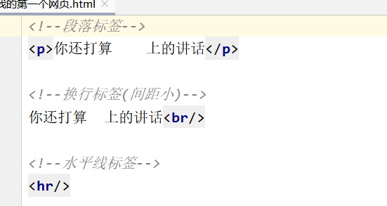


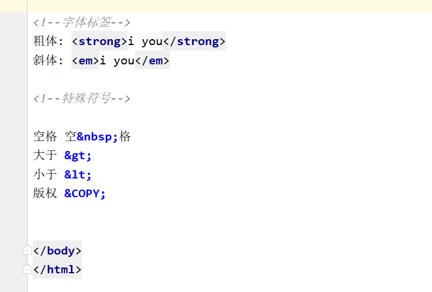


效果:


```c++
<!DOCTYPE html>
<html lang="en">
<head>
    <meta charset="UTF-8">
    <title>基本标签学习</title>
</head>
<body>

<!--标题标签-->
<h1>一级标签</h1>
<h2>二级标签</h2>
<h3>三级标签</h3>
<h4>四级标签</h4>

<!--段落标签
    优先占满网页的一行,不保留格式
-->  
<p>你还打算    上的讲话</p>

<!--换行标签(间距小)-->
你还打算  上的讲话<br/>

<!--水平线标签-->
<hr/>

<!--字体标签-->
粗体: <strong>i you</strong>
斜体: <em>i you</em>

<!--特殊符号-->

空格 空&nbsp;格
大于 &gt;
小于 &lt;
版权 &COPY;


</body>
</html>
```


**p标签内部文本不会保留格式:    但是</p>默认换行   因为是一段**


------------


## 行元素块元素


---------------------

# 图像标签


--------

例如:


\

效果


代码

```c++
<!DOCTYPE html>
<html lang="en">
<head>
    <meta charset="UTF-8">
    <title>基本标签学习</title>
</head>
<body>


</body>
</html>
```


# 链接标签

==href  H瑞 符  n.超链接==

```html
下面的代码创建了一个超级链接，当用户点击以后不会发生任何事。
<a href="javascript:void(0)">单击此处什么也不会发生</a>
也就是说，要执行某些处理，但不整体刷新页面的情况下，可以使用void(0)。
但需要对页面进行刷新时，就不能用void(0)了。
什么情况下用void(0)比较多呢，无刷新，当然是Ajax了，看一下Ajax的web页面，一般会看到很多的void(0)。
```


```html
<!DOCTYPE html>
<html lang="en">
<head>
    <meta charset="UTF-8">
    <title>链接标签</title>
</head>
<body>

<a name="top">顶部</a>

<!--1. 页面间链接
    格式:  <a href="链接目标/">链接文本名称</a>
    只能取打开另一个页面,不会精确到某个位置
-->
<a href="1.我的第一个网页.html" >点击跳转到我的页面</a>
<!--在浏览器的新标签页打开  // target="_blank" 表示在 新标签页打开-->
<a href="https://www.baidu.com" target="_blank">点击跳转到百度页面</a>
<!--可以放图标(img标签),该图标也可以链接到网页-->
<a href="https://www.digitalocean.com/community">The text you want to link
    
</a>


<!--2锚链接
    1. 需要一个标记   使用<name ”标记“> 去做标记  //<a name="top">顶部</a>
    2. 跳转标记 “#标记” 
    3. 可以在页面间跳转到另一个页面的相应位置,  --比如目录
-->
<a href="#top">回到顶部</a>


<!--3.功能性标签
    邮箱链接 : ”mailto:邮箱账号“
-->
<a href="mailto:1665834268@qq.com">点击来联系我</a>


</body>
</html>
```

效果：


使用邮箱链接 : mailto:的效果：


--------------------


#  列表

**<!--有序列表     <!--无序列表     <!--定义列表**

```html
<!DOCTYPE html>
<html lang="en">
<head>
    <meta charset="UTF-8">
    <title>列表</title>
</head>
<body>
<!--有序列表 有1234
    应用: 问答
-->
<ol>
    <li>java</li>
    <li>c++</li>
    <li>python</li>
    <li>取</li>
</ol>

<hr/>
    
<!--无序列表
    应用: 导航, 侧边栏
-->
<ul>
    <li>java</li>
    <li>c++</li>
    <li>python</li>
    <li>取</li>
</ul>

<!--定义列表
    dl: 标签
    dt: 列表名称
    dd: 列表内容
    应用: 网站底部
-->
<dl>
    <dt>学科</dt>
    <dd>java</dd>
    <dd>c++</dd>
    <dd>python</dd>
    <dd>取</dd>

    <dt>位置</dt>
    <dd>java</dd>
    <dd>c++</dd>
    <dd>python</dd>
    <dd>取</dd>
</dl>

</body>
</html>
```


定义列表最终应用:

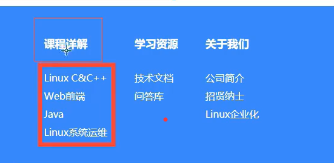

-------


# 表格

**table border=”1px“**   表格粗细
**tr表示行**
**td 表示列**

----------

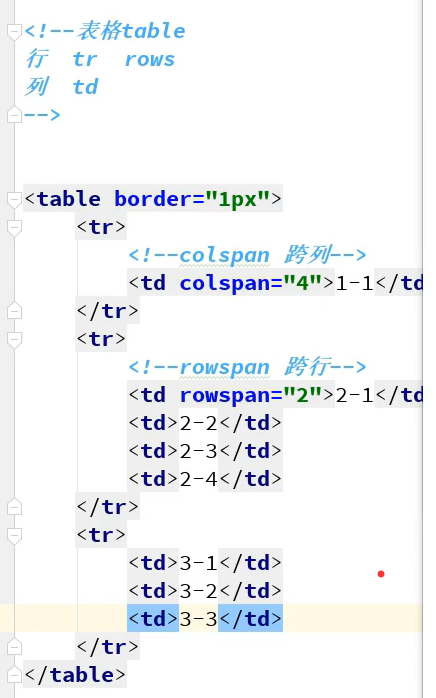


[jQuery创建表格_孤独斗士的博客-CSDN博客_jquery创建表格](https://blog.csdn.net/gulanga5/article/details/107217550)


```js
	const myTable = document.createElement("table");
    myTable.id = "myTable";
    myTable.className = "puzzle";
    document.body.appendChild(myTable);

    var counter = 0;
    for (let i = 0; i < type; i++) {
        const row = document.createElement("tr");
        for (j = 0; j < type; j++) {
            const cell = document.createElement("td");
            cell.id = counter;
            cell.addEventListener("click", clickHandler);   // 增加一个监听事件   clickHandler函数
            row.appendChild(cell);
            counter++;
        }
        myTable.appendChild(row);
    }
```


```js
 		var $table = $("<table id='Table' class='puzzle'></table>");
       // 创建几行几列的表格
        var id_index = 0;
        for (let i = 0; i < type; i++) {
             var $tr = $("<tr></tr>");
             for (j = 0; j < type; j++) {
                 var $cel = $("<td class='cell' id></td>");
                 // 每一个元素都有自己的id 动态设置属性值
                 $cel.attr("id", id_index);
                 //列 创建到 行
                $tr.append($cel);
                 // 绑定事件   ----------错的
                 $('body').on('click',function () {
                     // body 是嵌套在 stble 中的，/                     
                     clickHandler()
                });
                 id_index++;
             }
             $table.append($tr);
         }         
		$("body").append($table);
```


```html
<div class="GameInterface" id="sudoku">
    <div class="sudokuSection" id="sudokuSection0">
        <div class="sudokuSquare" id="square_0_0"><span></span><span></span></div><div class="sudokuSquare" id="square_0_1"><span></span><span></span></div><div class="sudokuSquare" id="square_0_2"><span></span><span></span></div><div class="sudokuSquare" id="square_1_0"><span></span><span></span></div><div class="sudokuSquare" id="square_1_1"><span></span><span></span></div><div class="sudokuSquare" id="square_1_2"><span></span><span></span></div><div class="sudokuSquare" id="square_2_0"><span></span><span></span></div><div class="sudokuSquare" id="square_2_1"><span></span><span></span></div><div class="sudokuSquare" id="square_2_2"><span></span><span></span></div> </div>
    <div class="sudokuSection" id="sudokuSection1">
        <div class="sudokuSquare" id="square_0_3"><span></span><span></span></div><div class="sudokuSquare" id="square_0_4"><span></span><span></span></div><div class="sudokuSquare" id="square_0_5"><span></span><span></span></div><div class="sudokuSquare" id="square_1_3"><span></span><span></span></div><div class="sudokuSquare" id="square_1_4"><span></span><span></span></div><div class="sudokuSquare" id="square_1_5"><span></span><span></span></div><div class="sudokuSquare" id="square_2_3"><span></span><span></span></div><div class="sudokuSquare" id="square_2_4"><span></span><span></span></div><div class="sudokuSquare" id="square_2_5"><span></span><span></span></div> </div>
    <div class="sudokuSection" id="sudokuSection2">
        <div class="sudokuSquare" id="square_0_6"><span></span><span></span></div><div class="sudokuSquare" id="square_0_7"><span></span><span></span></div><div class="sudokuSquare" id="square_0_8"><span></span><span></span></div><div class="sudokuSquare" id="square_1_6"><span></span><span></span></div><div class="sudokuSquare" id="square_1_7"><span></span><span></span></div><div class="sudokuSquare" id="square_1_8"><span></span><span></span></div><div class="sudokuSquare" id="square_2_6"><span></span><span></span></div><div class="sudokuSquare" id="square_2_7"><span></span><span></span></div><div class="sudokuSquare" id="square_2_8"><span></span><span></span></div> </div>
    <div class="sudokuSection" id="sudokuSection3">
        <div class="sudokuSquare" id="square_3_0"><span></span><span></span></div><div class="sudokuSquare" id="square_3_1"><span></span><span></span></div><div class="sudokuSquare" id="square_3_2"><span></span><span></span></div><div class="sudokuSquare" id="square_4_0"><span></span><span></span></div><div class="sudokuSquare" id="square_4_1"><span></span><span></span></div><div class="sudokuSquare" id="square_4_2"><span></span><span></span></div><div class="sudokuSquare" id="square_5_0"><span></span><span></span></div><div class="sudokuSquare" id="square_5_1"><span></span><span></span></div><div class="sudokuSquare" id="square_5_2"><span></span><span></span></div> </div>
    <div class="sudokuSection" id="sudokuSection4">
        <div class="sudokuSquare" id="square_3_3"><span></span><span></span></div><div class="sudokuSquare" id="square_3_4"><span></span><span></span></div><div class="sudokuSquare" id="square_3_5"><span></span><span></span></div><div class="sudokuSquare" id="square_4_3"><span></span><span></span></div><div class="sudokuSquare" id="square_4_4"><span></span><span></span></div><div class="sudokuSquare" id="square_4_5"><span></span><span></span></div><div class="sudokuSquare" id="square_5_3"><span></span><span></span></div><div class="sudokuSquare" id="square_5_4"><span></span><span></span></div><div class="sudokuSquare" id="square_5_5"><span></span><span></span></div> </div>
    <div class="sudokuSection" id="sudokuSection5">
        <div class="sudokuSquare" id="square_3_6"><span></span><span></span></div><div class="sudokuSquare" id="square_3_7"><span></span><span></span></div><div class="sudokuSquare" id="square_3_8"><span></span><span></span></div><div class="sudokuSquare" id="square_4_6"><span></span><span></span></div><div class="sudokuSquare" id="square_4_7"><span></span><span></span></div><div class="sudokuSquare" id="square_4_8"><span></span><span></span></div><div class="sudokuSquare" id="square_5_6"><span></span><span></span></div><div class="sudokuSquare" id="square_5_7"><span></span><span></span></div><div class="sudokuSquare" id="square_5_8"><span></span><span></span></div> </div>
    <div class="sudokuSection" id="sudokuSection6">
        <div class="sudokuSquare" id="square_6_0"><span></span><span></span></div><div class="sudokuSquare" id="square_6_1"><span></span><span></span></div><div class="sudokuSquare" id="square_6_2"><span></span><span></span></div><div class="sudokuSquare" id="square_7_0"><span></span><span></span></div><div class="sudokuSquare" id="square_7_1"><span></span><span></span></div><div class="sudokuSquare" id="square_7_2"><span></span><span></span></div><div class="sudokuSquare" id="square_8_0"><span></span><span></span></div><div class="sudokuSquare" id="square_8_1"><span></span><span></span></div><div class="sudokuSquare" id="square_8_2"><span></span><span></span></div> </div>
    <div class="sudokuSection" id="sudokuSection7">
        <div class="sudokuSquare" id="square_6_3"><span></span><span></span></div><div class="sudokuSquare" id="square_6_4"><span></span><span></span></div><div class="sudokuSquare" id="square_6_5"><span></span><span></span></div><div class="sudokuSquare" id="square_7_3"><span></span><span></span></div><div class="sudokuSquare" id="square_7_4"><span></span><span></span></div><div class="sudokuSquare" id="square_7_5"><span></span><span></span></div><div class="sudokuSquare" id="square_8_3"><span></span><span></span></div><div class="sudokuSquare" id="square_8_4"><span></span><span></span></div><div class="sudokuSquare" id="square_8_5"><span></span><span></span></div> </div>
    <div class="sudokuSection" id="sudokuSection8">
        <div class="sudokuSquare" id="square_6_6"><span></span><span></span></div><div class="sudokuSquare" id="square_6_7"><span></span><span></span></div><div class="sudokuSquare" id="square_6_8"><span></span><span></span></div><div class="sudokuSquare" id="square_7_6"><span></span><span></span></div><div class="sudokuSquare" id="square_7_7"><span></span><span></span></div><div class="sudokuSquare" id="square_7_8"><span></span><span></span></div><div class="sudokuSquare" id="square_8_6"><span></span><span></span></div><div class="sudokuSquare" id="square_8_7"><span></span><span></span></div><div class="sudokuSquare" id="square_8_8"><span></span><span></span></div> </div>

</div>
```


--------------


# 媒体


**video  视频**

**audio  音频（啊丢）**


```c++
<!--视频-->
<video src=".MP4" controls=”controls“></video>   // controls 允许用户控制音频
    
<<!--背景音乐-->
<audio src="music/Michael Evenson-Notes in the Sky.mp3" id="aud" autoplay="autoplay"  controls="controls" loop="loop" preload="auto"</audio>
<!--背景音乐-->

```


# 页面结构分析


A.png)


# 表单

**form  表单**

```
<form action="#" method="get">
```


---


```c++
<!DOCTYPE html>
<html lang="en" xmlns="http://www.w3.org/1999/html" xmlns="http://www.w3.org/1999/html">
<head>
    <meta charset="UTF-8">
    <title>表单</title>
</head>
<body>

<!--表单
    action :表单提交的位置，可以是网站，也可以是一个请求处理地址
    method : post,get提交方式
        get方式提交：我们可以在url中看到我们提交的信息，不安全，高效
        post：比较安全，传输大文件.
-->
<form action="#" method="get">
    <!--placeholder 提示信息-->
    <p>名字: <input type="text" name="username" placeholder="请输入用户名"></p>
    <p>密码: <input type="password" name="password" id="password"></p>
    
    <!--单选框-->
    <p>性别：
        <input type="radio" name="sex" value="male" checked/>男
        <!--checked默认选中-->
        <input type="radio" name="sex" value="falme">女
    </p>
    
    <!--多选框-->
    </p>爱好：
        <input type="checkbox" name="habby" value="shopping">购物
        <input type="checkbox" name="habby"  value="game">游戏
        <input type="checkbox" name="habby" value="study">学习
        <input type="checkbox" name="habby" value="study">敲代码
    </p>

    <!--文件域-->
    <p>上传文件:
        <input type="file" name="files" id="files">
    </p>

<!--    隐藏域：<input type="hidden" name="hidden" value="aaaa"><br>-->
    取色器：<input type="color" name="color" id="color"><br>
<!--    生日：<input type="date" name="date" id="date"><br>-->
    生日：<input type="datetime-local" name="birthday" id="birthday"><br/>
    
    <!--pattern 写正则表达式 网上搜  https://www.jb51.net/tools/regexsc.htm -->
    邮箱：<input type="email" name="email" id="email" pattern="/^([a-z0-9_\.-]+)@([\da-z\.-]+)\.([a-z\.]{2,6})$/
/^[a-z\d]+(\.[a-z\d]+)*@([\da-z](-[\da-z])?)+(\.{1,2}[a-z]+)+$/或\w+([-+.]\w+)*@\w+([-.]\w+)*\.\w+([-.]\w+)*"><br/>
    年龄：<input type="number" name="age" id="age" min="1" max="150"><br>

    <!--滑块-->
    <p>音量:
        <input type="range" name="video">
    </p>

    <!--搜索框--> <!--+ 增加鼠标可用性
        点击文本会自动跳转到id的位置
    -->
    <p>
        <label for="search">搜索:</label>  <！---使用label增加鼠标可用性-->
        <input type="search" name="search" id="search">
    </p>

    <!--下拉框-->
    <p>省份：
        <select name="provinces" id="provinces">
        <option value="">请选择</option>
        <option value="1">北京</option>
        <option value="2">上海</option>
        <option value="3">西安</option>
        </select>
    </p>
    <!--文本域  text area-->
    </p>自我描述:<br>
        <textarea name="des" id="des" cols="30" rows="10" placeholder="文本内容"></textarea>
    </p>
        
    <!--按钮
               input type= "button"普通按钮
               input type= "image" 图像按钮
               input type= "submit"提交按钮
               input type="reset" 重置
           <p>按钮:
               <input type="button" name="btn1" value="Mtk K"><input type="image" src=". ./resources/ image/1.jpg"></p>
           <p>
           <input type="reset" value="清空表单"></p>
       -->
                   
    <p>按钮:
        <input type="submit" value="提交">
        <input type="reset" value="清空表单">
        <input type="image" src="./img/regbtn.jpg" alt="提交图片">
    </p>

</form>

</body>
</html>
```


**增加鼠标可读性**

```html
					
<!--表单项标签-->
<form action="#" method="get">
    <label for="username">
    用户名：    </label>
            <input type="text" name="username" id="username" placeholder="请输入用户名"><br>
    
    <label for="password">        
    密码：    
    </label>
            <input type="password" name="password" id="password"><br>
    性别：     <input type="radio" name="gender"  value="male" checked>男
            <input type="radio" name="gender" value="falme">女<br>
    爱好：     <input type="checkbox" name="habby" value="shopping">购物
            <input type="checkbox" name="habby"  value="game">游戏
            <input type="checkbox" name="habby" value="study">学习<br>
    上传图片：<input type="file" name="myimg" id="myimg"><br>
    隐藏域：<input type="hidden" name="hidden" value="aaaa"><br>
    取色器：<input type="color" name="color" id="color"><br>
    生日：<input type="date" name="date" id="date"><br>
    生日：<input type="datetime-local" name="birthday" id="birthday"><br>
    邮箱：<input type="email" name="email" id="email"><br>
    年龄：<input type="number" name="age" id="age"><br>
    省份：<select name="provinces" id="provinces">
            <option value="">请选择</option>
            <option value="1">北京</option>
            <option value="2">上海</option>
            <option value="3">西安</option>
        </select><br>
    自我描述：<br><textarea name="des" id="des" cols="30" rows="10"></textarea><br>
    <input type="submit" value="提交">
    <input type="button" value="按钮提交">
    <input type="image" src="./img/regbtn.jpg" alt="提交图片">
</form>
<!--表单项标签-->
```


# iframe

**HTML 内联框架元素 (`<iframe>`)** 表示嵌套的[browsing context](https://developer.mozilla.org/zh-CN/docs/Glossary/Browsing_context)。它能够将另一个 HTML 页面嵌入到当前页面中。

-------------


# ----css----

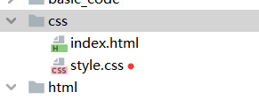

 index.html

```
<!DOCTYPE html>
<html lang="en">
<head>
    <meta charset="UTF-8">
    <title>Title</title>
    <!--规范通过<style>可以编写css的代码
    语法:
    选择器{
        声明1;
        声明2;
    }
    -->
    <link rel="stylesheet" type="text/css" href="style.css">

</head>
<body>
<h1>第一</h1>
</body>
</html>
```

style.css

```
h1{
    color: red;
}
```

#  导入css的方法

```html
<link rel="stylesheet" href="style.css">   // stylesheet固定的
```


# 选择器

## 基本选择器


```html
<!DOCTYPE html>
<html lang="en">
<head>
    <meta charset="UTF-8">
    <title>Title</title>
    <!--规范通过<style>可以编写css的代码
    语法:
    选择器{
        声明1;
        声明2;
    }
    -->
    <link rel="stylesheet" href="style.css">

</head>
<body>

<!--类选择器-->
<!--
    类选择器可以,多标签归类. 可以复用
-->
<h1 class="head1">第一</h1>
<h1 class="head2">第一</h1>
<p class="head1">第一</p>

<!--标签选择器-->
<p class="head1">dsfahdhs 啊的苏格兰和</p>

<!--id选择器-->
<!--id必须全局唯一
     不遵循就近原则
-->
<h1 id="id1">第一</h1>

</body>
</html>
```


CSS

```HTML
/*类选择器*/
.head1{
    color: #d42020;
    background: aquamarine;
}
.head2{
    color: #5cc718;
    background: #c1972c;
}
/*标签选择器*/
p{
    font-size: 10px;
}

/*id选择器*/
#id1{
    color:red;
}
```

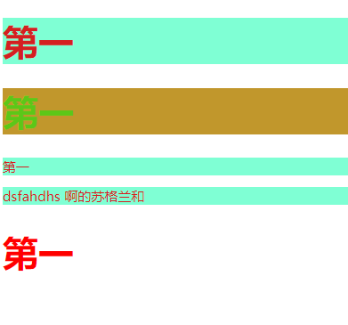

**优先级  id>class>标签**


## 层次选择器

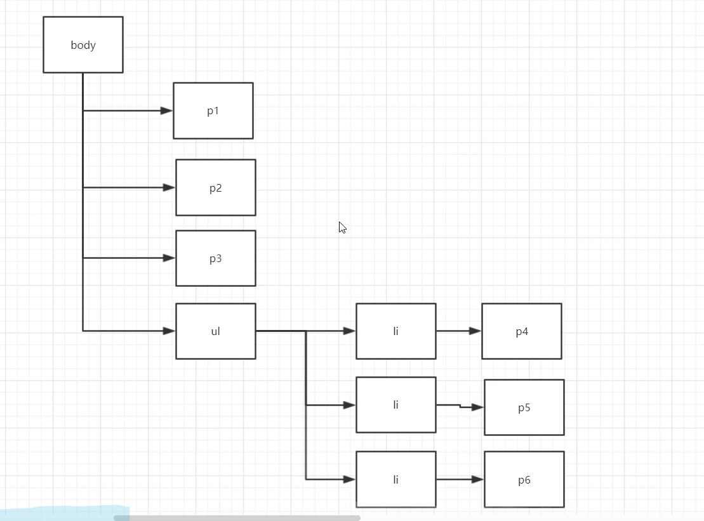


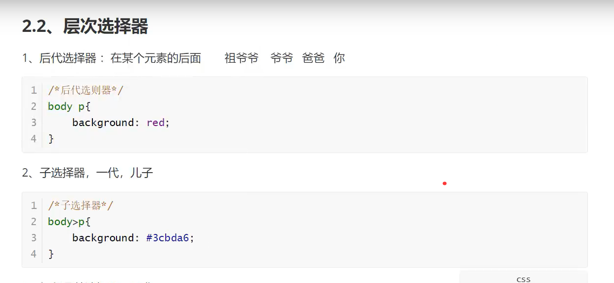


## 结构伪类选择器

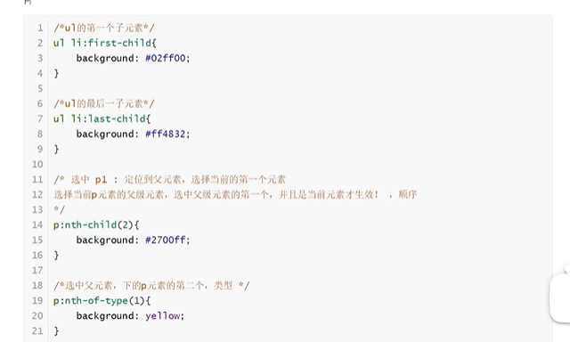


## 属性选择器(常用)

**class + id 连用**

 


-----------


#  美化网页元素


## 1修改字体


```html
<!DOCTYPE html>
<html lang="en">
<head>
    <meta charset="UTF-8">
    <title>字体样式</title>
    
<!--    font->family : 字体
        font->size : 字体大小
       	font->weight : 字体粗细
       	color : 字体颜色
-->
    <style>
        body{
            font-family: 楷体;
            color: #2cce9f;
        }
        h1{
            font-size: 50px;
        }
        .p1{
            font-weight: bold;
        }
    </style>
</head>
<body>

<h1>故事介绍</h1>
<p class="p1">
    这个世界名为元泱境界，脉（本质为振动）是构成万物的基础。每隔333年，会有一个神秘而强大的异常生物重生，它就是魁拔！魁拔的每一次出现，都会给元泱境界带来巨大的灾难！即便是天界的神族，也在劫难逃。在天地两界各种力量的全力打击下，魁拔一次次被消灭，但又总是按333年的周期重新出现。魁拔纪元1664年，天神经过精确测算后，在魁拔苏醒前一刻对其进行毁灭性打击。但谁都没有想到，由于一个差错导致新一代魁拔成功地逃脱了致命一击。很快，天界魁拔司和地界神圣联盟均探测到了魁拔依然生还的迹象。因此，找到魁拔，彻底消灭魁拔，再一次成了各地热血勇士的终极目标。
</p>
<p>
    在偏远的兽国窝窝乡，蛮大人和蛮吉每天为取得象征成功和光荣的妖侠纹耀而刻苦修炼，却把他们生活的村庄搅得鸡犬不宁。村民们绞尽脑汁把他们赶走。一天，消灭魁拔的征兵令突然传到窝窝乡，村长趁机怂恿蛮大人和蛮吉从军参战。然而，在这个一切都凭纹耀说话的世界，仅凭蛮大人现有的一块冒牌纹耀，不要说参军，就连住店的资格都没有。受尽歧视的蛮吉和蛮大人决定，混上那艘即将启程去消灭魁拔的巨型战舰，直接挑战魁拔，用热血换取至高的荣誉。 [1]
</p>

</body>
</html>
```


## 2文本样式


### height和heiget-line


- **height：表示 行高**
- **line-height：表示  每行文字所占的高度** 


（1）height = line-height时   **//    相当于文字居中**
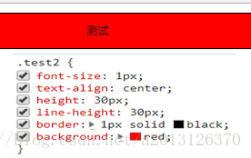
（2）height>line-height时    // **偏上**


（3）height<line-height时   // **偏下**


-------


```html
<!DOCTYPE html>
<html lang="en">
<head>
  <meta charset="UTF-8">
  <title>文本样式</title>
  <!--   颜色:
            单词
            RGB 0-F
            RGBA A: 0-1

        text-align : 排版, 居中
        text-indent : 2em; 段落首行缩进

        行高:
           和块的高度一致, 就可以上下居中   height  == line-height
  -->
  <style>
     h1{
       color: rgba(0, 255, 255, 0.9);
       text-align: center;
     }
     .p1{
       text-indent: 2em;
     }
     .p2{
       background: #2cce9f;
       height: 300px;
       line-height: 300px;
     }

  </style>
</head>
<body>

<h1>故事介绍</h1>
<p class="p1">
  这个世界名为元泱境界，脉（本质为振动）是构成万物的基础。每隔333年，会有一个神秘而强大的异常生物重生，它就是魁拔！魁拔的每一次出现，都会给元泱境界带来巨大的灾难！即便是天界的神族，也在劫难逃。在天地两界各种力量的全力打击下，魁拔一次次被消灭，但又总是按333年的周期重新出现。魁拔纪元1664年，天神经过精确测算后，在魁拔苏醒前一刻对其进行毁灭性打击。但谁都没有想到，由于一个差错导致新一代魁拔成功地逃脱了致命一击。很快，天界魁拔司和地界神圣联盟均探测到了魁拔依然生还的迹象。因此，找到魁拔，彻底消灭魁拔，再一次成了各地热血勇士的终极目标。
</p>
<p class="p2">
  在偏远的兽国窝窝乡，蛮大人和蛮吉每天为取得象征成功和光荣的妖侠纹耀而刻苦修炼，却把他们生活的村庄搅得鸡犬不宁。村民们绞尽脑汁把他们赶走。一天，消灭魁拔的征兵令突然传到窝窝乡，村长趁机怂恿蛮大人和蛮吉从军参战。然而，在这个一切都凭纹耀说话的世界，仅凭蛮大人现有的一块冒牌纹耀，不要说参军，就连住店的资格都没有。受尽歧视的蛮吉和蛮大人决定，混上那艘即将启程去消灭魁拔的巨型战舰，直接挑战魁拔，用热血换取至高的荣誉。 [1]
</p>

<p class="l1">123</p>
<p class="l2">123</p>
<p class="l3">123</p>
</body>
</html>
```


**text-decoration 下划线**


---------

###  

##  鼠标样式

**cursor** : 网页浏览时用户鼠标指针的样式或图形形状。
属性值：

```css
default：默认光标（通常是一个箭头）
auto：默认，浏览器设置的光标
crosshair：光标为十字线
pointer：光标为一只手
move：光标为某对象可移动
text：光标指示文本
wait：光标指示程序正在忙（通常是一只表或者一个沙漏）
```


## display: flex

**以及flex-direction，justify-content，align-items**

+ 若给一个 **div 设置 display：[flex](https://so.csdn.net/so/search?q=flex&spm=1001.2101.3001.7020)；**这个div就可以成为flex容器**，在flex容器中用flex-direction，justify-content，align-items等属性对子div进行布局是十分方便的。


####  flex-direction

n. 方向，方位

###### .flex-direction: row; (默认)

div是块级元素，默认一个div独占一行，可以**通过在父级div**（必须是flex容器）中设置flex-direction: row;  让其在一行显示

```css
<style>
  #box-container {
    height: 500px;
    display: flex;
    flex-direction: row;         // 通过在父级div
  } 
  #box-1 {
    background-color: dodgerblue;
    width: 100px;
    height: 100px;
  }
  #box-2 {
    background-color: orangered;
    width: 100px;
    height: 100px;
  }
</style>
<div id="box-container">
  <div id="box-1">div1</div>
  <div id="box-2">div2</div>
</div>

```


​    **flex-direction: row-reverse;：**

```css
#box-container {
    height: 500px;
    display: flex;
    flex-direction: row-reverse;
    border: 1px solid black;
}
```


--------------


###### .flex-direction: column;

```css
#box-container {
    height: 500px;
    display: flex;
    flex-direction: column;
}
```


  **flex-direction: column-reverse;**

```css
#box-container {
   height: 500px;
   display: flex;
   flex-direction: column-reverse;
   border: 1px solid black;
}
123456
```


---------


####  justify-content

  v.  使（文本）对齐  

**justify-content的可选值包括：**

- flex-start：从 flex 容器的前端开始排列项目。对行来说是把项目都靠左放，对于列是把项目都靠顶部放。
- flex-end：从 flex 容器的后端开始排列项目。对行来说是把项目都靠右放，对于列是把项目都靠底部放。
- center：可以让 flex 子元素排列在 flex 容器中间。
- space-between：项目间保留一定间距地在主轴排列。第一个和最后一个项目会被挤到容器边沿。例如，在行中第一个项目会紧贴着容器左侧，最后一个项目会紧贴着容器右侧，然后其他项目均匀排布。
- space-around：与space-between相似，但头尾两个项目不会紧贴容器边缘，空间会均匀分布在所有项目两边

###### · justify-content: center;

justify-content: center;   **可让子元素居中显示**。

**相 对应的盒子大小而言**

```css
#box-container {
   height: 300px;
   display: flex;
   flex-direction: row;   //一行
   justify-content: center;    //居中
   border: 1px solid black;
}

<div id="box-container">
  <div id="box-1">div1</div>
  <div id="box-2">div2</div>
</div>
```


若justify-content: center;   flex-direction: column;  则为**上下居中**：

```css
#box-container {
   height: 300px;
    display: flex;
    flex-direction: column;  // 一列
    justify-content: center;   //居中
    border: 1px solid black;
}
1234567
```

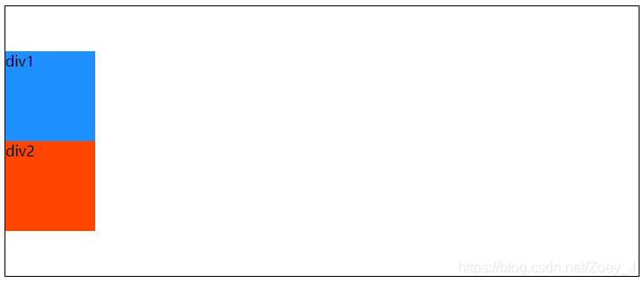

---------------


###### · justify-content: flex-start; （默认）

 对行来说是把项目都靠左放，对于列是把项目都靠顶部放

默认值

```css
#box-container {
    height: 300px;
    display: flex;
    flex-direction: row;
    justify-content: flex-start;   //
    border: 1px solid black;
}
1234567
```


-------------

###### · justify-content: flex-end;   尾部

**从父元素尾部开始排列**

```css
#box-container {
    height: 300px;
    display: flex;
    flex-direction: row;
    justify-content: flex-end;
    border: 1px solid black;
}
1234567
```


flex-direction: column;时的效果类似只不过从横向排列改为纵向排列。

###### · justify-content: space-between;

子元素**均匀排列**，**紧贴父元素头尾两端。**

```css
#box-container {
    height: 300px;
    display: flex;
    flex-direction: row;
    justify-content: space-between;   // 
    border: 1px solid black;
}
1234567
```

加入一个颜色为green的div3（其余属性和div1，div2完全一样），效果更明显：


###### · justify-content: space-around;

子元素**完全均匀排列**，**不紧贴父元素头尾两端。**

```css
#box-container {
    height: 300px;
    display: flex;
    flex-direction: row;
    justify-content: space-around;
    border: 1px solid black;
}
1234567
```


####  align-items

align-items的可选值包括：

- flex-start：从 flex 容器的前端开始排列项目。对行来说是把项目都靠顶部放，对于列是把项目都靠左放。

- flex-end：从 flex 容器的后端开始排列项目。对行来说是把项目都靠底部放，对于列是把项目都靠右放。

- center：把项目的位置调整到中间。对于行，垂直居中（项目上下方空间相等）。对于列，水平居中（项目左右方空间相等）。

- stretch：拉伸项目，填满 flex 容器。例如，排成行的项目从容器顶部拉伸到底部.

- baseline：基线对齐地排列。基线是字体相关的概念，可以认为字体坐落在基线上。

  

###### · align-items: flex-start;（默认）

align n. 对齐

前端开始排列项目。对行来说是把项目都靠顶部放，对于列是把项目都靠左放。


```css
#box-container {
    height: 300px;
    display: flex;
    flex-direction: row;
    align-items: flex-start;     // 对齐
    border: 1px solid black;
}
1234567
```


---------------

###### · align-items: flex-end;   底部

容器的后端开始排列项目。**对行来说是把项目都靠底部放**，对于列是把项目都靠右放。

```css
#box-container {
    height: 300px;
    display: flex;
    flex-direction: row;
    align-items: flex-end;    //
    border: 1px solid black;
}
1234567
```

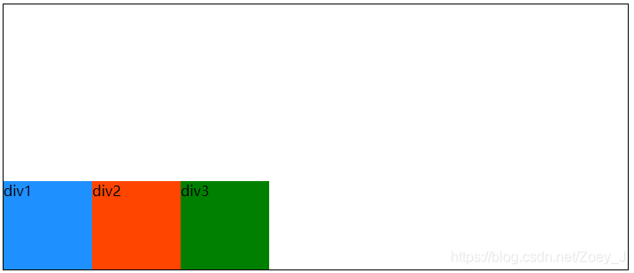

-----

###### · align-items: center;

**把项目的位置调整到中间。**

```css
#box-container {
    height: 300px;
    display: flex;
    flex-direction: row;
    align-items: center;         //中间
    border: 1px solid black;
}
1234567
```


----------

###### · align-items: stretch;

v. 拉长

拉伸项目，填满 flex 容器。例如，排成行的项目**从容器顶部拉伸到底部.**

```css
#box-container {
    height: 300px;
    display: flex;
    flex-direction: row;
    align-items: stretch;             //
    border: 1px solid black;
}
#box-1 {
    background-color: dodgerblue;
    /*width: 100px;*/
    /*height: 100px;*/
}
#box-2 {
    background-color: orangered;
    /*width: 100px;*/
    /*height: 100px;*/
}
#box-3 {
    background-color: green;
    width: 100px;
    height: 100px;
}
```

取消div1和div2的宽高设置，在没有设置大小的情况下，align-items: stretch;时子元素铺满父元素：
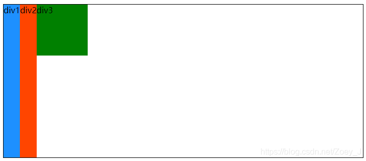

-------------

###### · align-items: baseline;

基线对齐地排列。基线是字体相关的概念，可以认为字体坐落在基线上。

```css
#box-container {
    height: 300px;
    display: flex;
    flex-direction: row;
    align-items: baseline;     //
    border: 1px solid black;
}
1234567
```


用以上属性可以很容易的对子级div进行布局，例如让子级div上下左右居中：

```css
<style>
    #box-container {
        height: 300px;
        display: flex;
        flex-direction: row;
        justify-content: center;
        align-items: center;
        border: 1px solid black;
    }
    #box-1 {
        background-color: dodgerblue;
        width: 100px;
        height: 100px;
    }
</style>

<div id="box-container">
	<div id="box-1">div1</div>
</div>
12345678910111213141516171819
```


虽然这个很好实现布局，但还是要根据实际情况运用。


## 3超链接伪类


```html
<!DOCTYPE html>
<html lang="en">
<head>
    <meta charset="UTF-8">
    <title>Title</title>
    <style>
        /*默认的颜色*/
        a{
            text-decoration: none;
            color: #c1972c;
        }
        /*鼠标悬浮颜色*/
        a:hover{
            color: red;
        }
        /*鼠标按住未释放的状态*/
        /*a:active{*/
        /*    color: #2cce9f;*/
        /*}*/
        /*a:visited{*/
        /*    color: blue;*/
        /*}*/

        #price{
            /*阴影  阴影颜色 水平偏移 垂直偏移 阴影半径 */
            text-shadow: blue 10px 10px 1px;
        }
    </style>
</head>
<body>
<a href="#">
    
</a>
<p>
    <a href="">时间简史</a>
</p>
<p>
    <a href="">作者: 规矩</a>
</p>
<p id="price">
    $99
</p>

</body>
</html>
```


### 图片操作


--------


### 鼠标悬浮颜色

```css
#gameOptions a:hover{
    color:#317082;
    text-decoration:underline;
}
```


## 4列表样式练习

```html
<!DOCTYPE html>
<html>
<head lang="en">
  <meta charset="UTF-8">
  <title>列表样式</title>
  <link href="../css/style.css" rel="stylesheet" type="text/css"/>
</head>
<body>
<h2 class="title">全部商品分类</h2>
<ul>
  <li><a href="#">图书</a>&nbsp;&nbsp;<a href="#">音像</a>&nbsp;&nbsp;<a href="#">数字商品</a></li>
  <li><a href="#">家用电器</a>&nbsp;&nbsp;<a href="#">手机</a>&nbsp;&nbsp;<a href="#">数码</a></li>
  <li><a href="#">电脑</a>&nbsp;&nbsp;<a href="#">办公</a></li>
  <li><a href="#">家居</a>&nbsp;&nbsp;<a href="#">家装</a>&nbsp;&nbsp;<a href="#">厨具</a></li>
  <li><a href="#">服饰鞋帽</a>&nbsp;&nbsp;<a href="#">个护化妆</a></li>
  <li><a href="#">礼品箱包</a>&nbsp;&nbsp;<a href="#">钟表</a>&nbsp;&nbsp;<a href="#">珠宝</a></li>
  <li><a href="#">食品饮料</a>&nbsp;&nbsp;<a href="#">保健食品</a></li>
  <li><a href="#">彩票</a>&nbsp;&nbsp;<a href="#">旅行</a>&nbsp;&nbsp;<a href="#">充值</a>&nbsp;&nbsp;<a href="#">票务</a></li>
</ul>
</body>
</html>
```


```html
.title{
    font-size: 18px;
    font-weight: bold;
    text-indent: 1em;
    line-height: 30px;
    background: red;
}

ul li{
    height: 30px;
    list-style: none;
}

ul {
    background: antiquewhite;
}
a{
    text-decoration: none;
    font-size: 14px;
    font-weight: bold;
    color: #000;
}

a:hover{
    color: orange;
    text-decoration: underline;
}


```


###  去除列表序号

```css
#gameOptions li{
    list-style:none;
}
```


改进:


```html
<!DOCTYPE html>
<html>
<head lang="en">
  <meta charset="UTF-8">
  <title>列表样式</title>
  <link href="../css/style.css" rel="stylesheet" type="text/css"/>
</head>
<body>
<div id="nav>   <!--新加的-->
  <h2 class="title">全部商品分类</h2>
  <ul>
    <li><a href="#">图书</a>&nbsp;&nbsp;<a href="#">音像</a>&nbsp;&nbsp;<a href="#">数字商品</a></li>
    <li><a href="#">家用电器</a>&nbsp;&nbsp;<a href="#">手机</a>&nbsp;&nbsp;<a href="#">数码</a></li>
    <li><a href="#">电脑</a>&nbsp;&nbsp;<a href="#">办公</a></li>
    <li><a href="#">家居</a>&nbsp;&nbsp;<a href="#">家装</a>&nbsp;&nbsp;<a href="#">厨具</a></li>
    <li><a href="#">服饰鞋帽</a>&nbsp;&nbsp;<a href="#">个护化妆</a></li>
    <li><a href="#">礼品箱包</a>&nbsp;&nbsp;<a href="#">钟表</a>&nbsp;&nbsp;<a href="#">珠宝</a></li>
    <li><a href="#">食品饮料</a>&nbsp;&nbsp;<a href="#">保健食品</a></li>
    <li><a href="#">彩票</a>&nbsp;&nbsp;<a href="#">旅行</a>&nbsp;&nbsp;<a href="#">充值</a>&nbsp;&nbsp;<a href="#">票务</a></li>
  </ul>
</div>

</body>
</html>
```


```css
.title{
    font-size: 18px;
    font-weight: bold;
    text-indent: 1em;
    line-height: 30px;
    background: red;
}

#nav{
    width: 300px;   // 一般结合浏览器调整
}

ul li{
    height: 30px;
    list-style: none;
}

ul {
    background: antiquewhite;
}
a{
    text-decoration: none;
    font-size: 14px;
    font-weight: bold;
    color: #000;
}

a:hover{
    color: orange;
    text-decoration: underline;
}


```

**调整合适位置**


**效果:**


## 5.背景图像应用及渐变

### 背景图像

```c++
<!DOCTYPE html>
<html lang="en">
<head>
    <meta charset="UTF-8">
    <title>Title</title>
    <style>
        div {
            width: 1000px;
            height: 700px;
            /*边框*/
            border: 1px solid red;
            /*默认全部平铺*/
            background-image: url("../html/resources/image/a.png");
        }

        .div1{
            /*不平铺*/
            background-repeat: no-repeat;
        }
        .div2{
            /*垂直平铺*/
            background-repeat: repeat-y;
        }
    </style>
</head>
<body>

<div class="div1"></div>
<div class="div2"></div>
<div class="div3"></div>

</body>
</html>
```


### 渐变

```html

<!DOCTYPE html>
<html lang="en">
<head>
    <meta charset="UTF-8">
    <title>Title</title>
  <style>
      body{
          background-color: #0093E9;
          background-image: linear-gradient(191deg, #0093E9 0%, #80D0C7 100%);
      }
  </style>
</head>
<body>

</body>
</html>
```


网站

[Grabient](https://www.grabient.com/)


## 6盒子模型和边框

### 盒子模型


**margin外边距**

**padding 内边距**

**boeder 边框**


### 边框


```html
<!DOCTYPE html>
<html lang="en">
<head>
    <meta charset="UTF-8">
    <title>登录</title>

    <style>
        body{
            /*body总有一个默认的外边距  margin: 0; 下面是规范*/
            margin: 0;
            padding: 0;
            text-decoration: none;
        }

        #box{
            width: 300px;
            /*粗细 样式 颜色*/
            border: 1px solid red;
        }

        form{
            background: #2cce9f;
        }
        div>input{
            border: 3px solid black;
        }
        h2{
            margin-top: 0px;
            margin-bottom: 0px;
        }


    </style>

</head>
<body>

<div id="box">
  <h2>会员登陆</h2>
  <form action="#">
        <div>
            <span>用户名:</span>
            <input type="text" name="" >
        </div>
        <div>
            <span>密码:</span>
            <input type="text" name="" id="">
        </div>
        <div>
            <span>邮箱:</span>
            <input type="text" name="" id="">
        </div>
    </form>
</div>

</body>
</html>
```


## 内外边距


### **妙用居中元素**

  + 前提有块元素

浏览器的居中

```css
        #box{
            width: 300px;
            /*粗细 样式 颜色*/
            border: 1px solid red;
            margin: 0 auto;
        }
```

相对于盒子的居中

```css
h1{
    margin-top:0px;
    margin-bottom:5px;
    padding-bottom:0px;
    padding-left:20px;
}
```

-----------

```html
<!DOCTYPE html>
<html lang="en">
<head>
    <meta charset="UTF-8">
    <title>登录</title>

    <style>
        body{
            /*body总有一个默认的外边距  margin: 0; 下面是规范*/
            padding: 0;
            text-decoration: none;
            margin: 0;
        }

        #box{
            width: 300px;
            /*粗细 样式 颜色*/
            border: 1px solid red;
            margin: 0 auto;
        }

        form{
            background: #2cce9f;
        }
        div>input{
            border: 3px solid black;
        }
        h2{
            margin-top: 0px;
            margin-bottom: 0px;
        }


    </style>

</head>
<body>

<div id="box">
  <h2>会员登陆</h2>
  <form action="#">
        <div>
            <span>用户名:</span>
            <input type="text" name="" >
        </div>
        <div>
            <span>密码:</span>
            <input type="text" name="" id="">
        </div>
        <div>
            <span>邮箱:</span>
            <input type="text" name="" id="">
        </div>
    </form>
</div>

</body>
</html>
```


居中


### 盒子的计算方式:

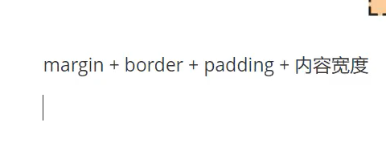


## 圆角边框


```html
<!DOCTYPE html>
<html lang="en">
<head>
    <meta charset="UTF-8">
    <title>圆角边框</title>
  <style>
    /*左上 右上 右下 左下   顺时针
        圆圈
    */
    div{
        width: 50px;
        height: 50px;
        margin: 30px;
        border: 10px solid red;
        border-radius: 50px 0px 0px 0px;
    }

    img{
        border-radius: 25px;
    }

  </style>
</head>
<body>

<div>

</div>


</body>
</html>
```


## 盒子阴影


```
  div{
        width: 50px;
        height: 50px;
        margin: 30px;
        border: 10px solid red;
        border-radius: 50px 0px 0px 0px;
        /*盒子阴影*/
        box-shadow: 10px 10px 1px yellow;
    }
```


## display和浮动

  

> 前言 

**标准文本流**

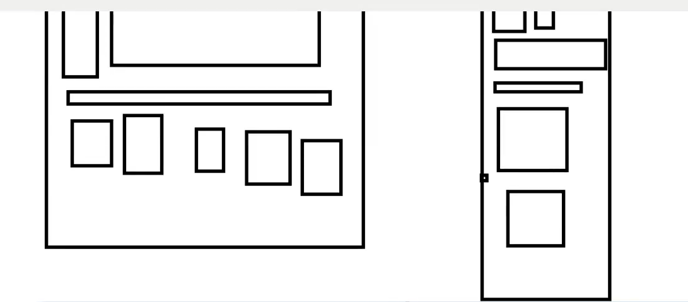

-------


### 块元素和行元素


块级元素：独占一行

```
h1~h6     P     div 列表...
```

行内元素：不独占一行

```
1   span   a  img     strong....
```

**行内元素 可以被包含在 块级元素中，反之，则不可以~**


**例子:**


**a标签的行元素**

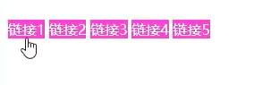

**变成块元素**


---


如 :

```
<!DOCTYPE html>
<html lang="en">
<head>
    <meta charset="UTF-8">
    <title>Title</title>

    <style>
        div{
            width: 100px;
            height: 100px;
            border: 1px solid red;
        }

        span{
            width: 100px;
            height: 100px;
            border: 1px solid red;
        }
    </style>


</head>
<body>

<div>
    div块元素
</div>

<span>
    行类元素, 文字多少就占多少
</span>

</body>
</html>
```


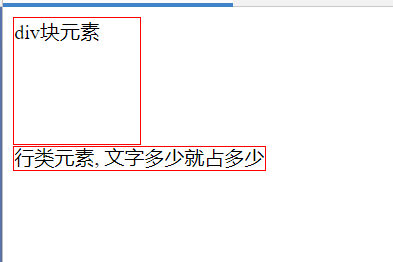

----------------


**h1~h6     P     div 列表.的块元素使用标签独占一行**

 **行类元素, 文字多少就占多少, 可以设置高度**


### display

---------

**使用display**

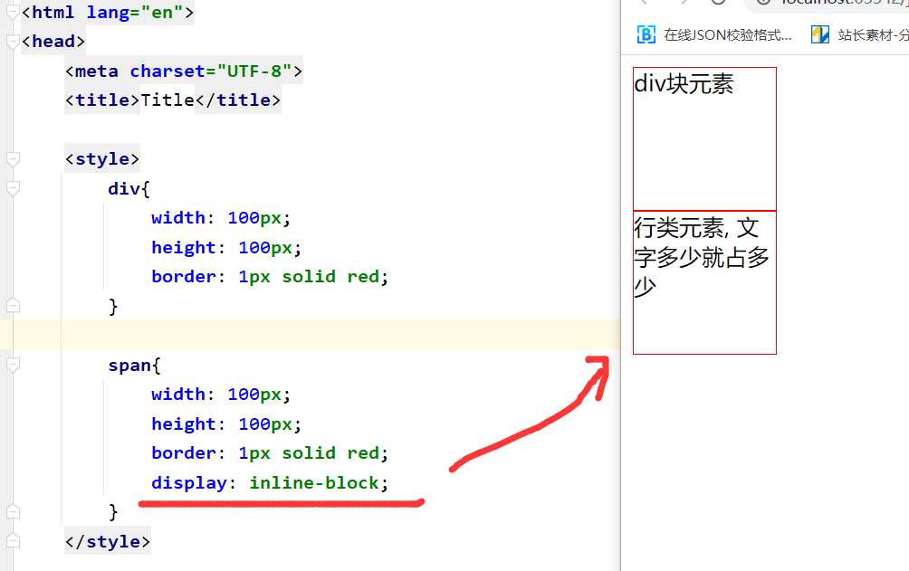


### float


### 对比


--------


## 父级边框塌陷问题

clear

```
clear: right;右侧不允许有浮动元素
clear: left;左侧不允许有浮动元素
clear: both;两侧不允许有浮动元素
clear: none;
```


解决方案

### 1.增加父级高度

```
#father{
	border : lpx #000 solod
	height : 800px
}
```


### 2.增加一个空的div标签

**标准解法:**


效果


### 3.overflow

下拉的场景不能用,,   还有很多副作用

```
在父级元素中增加一个  overflow: hidden
```


### 4.添加一个伪类 (最好的)

相当于自动添加2

```css
#father : after{
	content: '';
	display: block;
	clear: both;
}
```


------------


## 定位的使用


### 相对定位


```html
<!DOCTYPE html>
<html lang="en">
<head>
    <meta charset="UTF-8">
    <title>定位</title>
    <style>
        div {
            margin: 10px;
            padding: 5px;
            font-size: 12px;
            line-height: 25px;
        }
        #first{
            background-color: #d42020;
            border: 1px solid #666;
            /*相对定位  相对于原来的位置     上下左右*/
            position: relative;
            /*向上*/
            top: -20px;
            /*向下*/
            bottom: -10px;
            /*向右*/
            left: 20px;
            /*向左*/
            right: 30px;

        }

        #second{
            background-color: #5cc718;
            border: 1px solid #7f0606;
        }

        #third{
            background-color: #0093E9;
            border: 1px solid #11cd96;
        }

    </style>
</head>
<body>

<div id="father">
    <div id="first">
        第一个盒子
    </div>
    <div id="second" >
        第二个盒子
    </div>
    <div id="third">
        第三个盒子
    </div>
</div>

</body>
</html>
```


### 方块定位例题


```html
<!DOCTYPE html>
<html lang="en">
<head>
    <meta charset="UTF-8">
    <title>方块定位</title>

    <style>
        #box{
            width: 300px;
            height: 300px;
            border: 1px solid red;
            padding: 10px;
        }

        a{
            width: 100px;
            height: 100px;
            text-decoration: none;
            background-color: orange;
            line-height: 100px;
            text-align: center;
            color: #5cc718;
            display: block;
        }

        a:hover{
            background-color: #d42020;
        }

        .a2,.a4{
            position: relative;
            left: 200px;
            top: -100px;
        }

        .a5{
            position: relative;
            left: 100px;
            top: -300px;
        }


    </style>

</head>
<body>

<div id="box">
    <a class="a1" href="#">链接1</a>
    <a class="a2" href="#">链接2</a>
    <a class="a3" href="#">链接3</a>
    <a class="a4" href="#">链接4</a>
    <a class="a5" href="#">链接5</a>
</div>


</body>
</html>
```


### 绝对定位

```
position: absolute;
```


### 固定定位

**页面移动也不变**


```html
<!DOCTYPE html>
<html lang="en">
<head>
    <meta charset="UTF-8">
    <title>固定定位</title>

    <style>
      div:nth-of-type(1){
          /*绝对定位*/
        width: 100px;
        height: 100px;
        background-color: red;
        position: absolute;
        right: 0;
        bottom: 0;
      }

      /*相对定位*/
      div:nth-of-type(2){
          width: 50px;
          height: 50px;
          background-color: orange;
          position: fixed;
          right: 0;
          bottom: 0;
      }
    </style>

</head>
<body>

<div>div1</div>
<div>div2</div>
</body>
</html>
```


### z-index及透明度


```

```


## 动画


网站


要在两个复选框之间设置间隔，您可以使用CSS来添加一些外边距或填充。这将在HTML中插入空白空间来创建间隔。

以下是示例代码，演示如何通过使用margin属性在两个复选框之间添加间隔：

```html
html复制代码<div class="form-check-inline">
    <input class="form-check-input" type="checkbox" id="inlineCheckbox1" value="option1" checked>
    <label class="form-check-label" for="inlineCheckbox1">用户</label>
</div>

<div class="spacer"></div> <!-- 添加间隔的占位符 -->
// 第二种
<div class="form-check-inline spacer"></div> <!-- 添加水平间隔的占位符 -->

<div class="form-check-inline">
    <input class="form-check-input" type="checkbox" id="inlineCheckbox2" value="option2">
    <label class="form-check-label" for="inlineCheckbox2">管理员</label>
</div>
css复制代码.spacer {
    margin-right: 10px; /* 设置右侧间隔 */
}
```

在上面的示例中，我们在两个复选框之间添加了一个名为"spacer"的元素。通过为该元素应用CSS样式，我们使用margin-right属性设置了右侧间隔为10像素。`<div>`

您可以根据需要调整间隔的大小和CSS样式。


## localStorage的使用

> localStorage.getItem(key):获取指定key本地存储的值
> localStorage.setItem(key,value)：将value存储到key字段

### 比如：

### 在A页面中先存储：

```
var imgs = obj_mainform.archivesId  //声明个变量存储下数据
localStorage.setItem('key',imgs);  //将变量imgs存储到name字段
```

### 在B页面中使用：

```
var naid = localStorage.getItem("key"); //获取指定key本地存储的值
```

> 以上就是localStorage.setItem()和localStorage.getItem()的使用方式


# javaScript


## 1.引用


**方式:**


## 2.基本语法


**元素  js  断点 抓包  应用**


## 3.数据类型

### number


---------

### 字符串


------------------

### bool


--------

###  逻辑运算


---------------

### 比较运算符


--------------


**注意: 返回值的jqury对象时别用===**


### 浮点数

-------------


### null

-------------


### 数组


### 对象


---------------


## 严格检查模式

加上 **use strict**     // 严格模式


##  4.字符串详解


 

-------


----------


------


-------------------


------------------


-------------------


>

```javascript
parseInt    

parseInt(String s): 返回用十进制参数表示的整数值。

parseInt(int i): 使用指定基数的字符串参数表示的整数 (基数可以是 10, 2, 8, 或 16 等进制数) 。
```


## 5.数组


## 对象


**6是真正的  5还会去父类找**


## 6.流程控制


**for in 取出来的是索引**

**for of 取出值**


## 7. map和set


## 8.iterator


## 9. 函数

### 1定义函数---jqury的创建函数也是这样


```javascript
<script>
    function f(x) {
        if (x < 0){
        return -x;
        }else{
        return x;
        }
    }
</script>
```


了解：


----------


**其余的变成了rest数组**


### 2.变量的作用域

#### 全局作用域域


**规范**

**规范**


#### 局部作用域


#### **常量const**


## 10.方法

###  定义对象方法


## 11.内部对象


#### 标准对象


#### Date

**new 出来**


### 随机数

[Math.floor( Math.random() )生成随机整数_ma_meng的博客-CSDN博客_math.random生成随机整数](https://blog.csdn.net/guokaigdg/article/details/88564860)

**Math.floor( Math.random() )生成随机整数**

```
Math.random() 返回值是一个大于等于0，且小于1的随机数

Math.random()*N 返回值是一个大于等于0，且小于N的随机数
```

<font color = red >最终公式如下：</font>

```java
Random rand = new Random();
int randNumber = MIN + rand.nextInt(MAX - MIN + 1);
```


## 12.json


### JSON的两种结构

**JSON有两种表示结构，对象和数组。**


**js和json区别：**


1. 对象结构以  **”{”**  大括号开始，以  **”}”**  大括号结束。中间部分由0或多个以  **”，”**  分隔的”key(关键字)/value(值)”对构成，关键字和值之间以”：”分隔，语法结构如代码。

```
{
    key1:value1,
    key2:value2,
    ...
}
```

其中关键字是字符串，而值可以是字符串，数值，true,false,null,对象或数组


2. 数组结构以 ”[” 开始，”]” 结束。中间由0或多个以  ”，” 分隔的值列表组成，语法结构如代码。

[](javascript:void(0);)

```
[
    {
        key1:value1,
        key2:value2 
    },
    {
         key3:value3,
         key4:value4   
    }
]
```

[](javascript:void(0);)


### 认识JSON字符串

之前我一直有个困惑，分不清普通字符串，json字符串和json对象的区别。经过一番研究终于给弄明白了。比如在js中。

字符串：这个很好解释，指使用“”双引号或’’单引号包括的字符。例如：var comStr = 'this is string';
json字符串：指的是符合json格式要求的js字符串。例如：var jsonStr = "{StudentID:'100',Name:'tmac',Hometown:'usa'}";
json对象：指符合json格式要求的js对象。例如：var jsonObj = { StudentID: "100", Name: "tmac", Hometown: "usa" };


### 在JS中如何使用JSON

JSON是JS的一个子集，所以可以在JS中轻松地读，写JSON。读和写JSON都有两种方法，分别是利用”.”操作符和“[key]”的方式。
我们首先定义一个JSON对象，代码如下。

[](javascript:void(0);)

```
var obj = {
            1: "value1",
            "2": "value2",
            count: 3,
            person: [ //数组结构JSON对象，可以嵌套使用
                        {
                            id: 1,
                            name: "张三"
                        },
                        {
                            id: 2,
                            name: "李四"
                        }
                   ],
            object: { //对象结构JSON对象
                id: 1,
                msg: "对象里的对象"    
            }
        };
```

[](javascript:void(0);)

1，从JSON中读数据

[](javascript:void(0);)

```
function ReadJSON() {
            alert(obj.1); //会报语法错误，可以用alert(obj["1"]);说明数字最好不要做关键字
            alert(obj.2); //同上

            alert(obj.person[0].name); //或者alert(obj.person[0]["name"])
            alert(obj.object.msg); //或者alert(obj.object["msg"])
        }
```

[](javascript:void(0);)

2，向JSON中写数据

比如要往JSON中增加一条数据，代码如下：

```
function Add() { 
            //往JSON对象中增加了一条记录
            obj.sex= "男" //或者obj["sex"]="男"
        }
```

增加数据后的JSON对象如图：

[](https://images0.cnblogs.com/blog/311549/201306/08225647-1f3c6b7829074c529ee3365315ccc6b0.jpg)

3，修改JSON中的数据

我们现在要修改JSON中count的值，代码如下：

```
function Update() {
            obj.count = 10; //或obj["count"]=10
        }
```

修改后的JSON如图。

[](https://images0.cnblogs.com/blog/311549/201306/08225654-7373ca8222ad4b999701ce3f988d5d68.jpg)

4，删除JSON中的数据

我们现在实现从JSON中删除count这条数据，代码如下：

```
function Delete() {
            delete obj.count;
        }
```

删除后的JSON如图

[](https://images0.cnblogs.com/blog/311549/201306/08225700-1fc21b4018054d0b8d23477a035eb15f.jpg)

可以看到count已经从JSON对象中被删除了。

5，遍历JSON对象

可以使用for…in…循环来遍历JSON对象中的数据，比如我们要遍历输出obj对象的值，代码如下：

```
function Traversal() {
            for (var c in obj) {
                console.log(c + ":", obj[c]);
            }
        }
```

程序输出结果为：

[](https://images0.cnblogs.com/blog/311549/201306/08225705-188a9dd782ca4f42934fcba606e2b162.jpg)


### 在.NET中如何使用JSON

说到在.net中使用JSON，就不得不提到JSON.NET，它是一个非常著名的在.net中处理JSON的工具，我们最常用的是下面两个功能。

**1，通过序列化将.net对象转换为JSON字符串**

在web开发过程中，我们经常需要将从数据库中查询到的数据(一般为一个集合，列表或数组等)转换为JSON格式字符串传回客户端，这就需要进行序列化，这里用到的是JsonConvert对象的SerializeObject方法。其语法格式为：JsonConvert.SerializeObject(object)，代码中的”object”就是要序列化的.net对象，序列化后返回的是json字符串。

比如，现在我们有一个TStudent的学生表，表中的字段和已有数据如图所示

[](https://images0.cnblogs.com/blog/311549/201306/10165638-39a0521daa1a49b5b94ee8b764699ce4.jpg)[](https://images0.cnblogs.com/blog/311549/201306/10165646-be2e8e7ef4454ba0a12befa763b90b16.jpg)

从表中我们可以看到一共有五条数据，现在我们要从数据库中取出这些数据，然后利用JSON.NET的JsonConvert对象序列化它们为json字符串，并显示在页面上。C#代码如下

[](javascript:void(0);)

```
protected void Page_Load(object sender, EventArgs e)
        {
            using (L2SDBDataContext db = new L2SDBDataContext())
            {
                List<Student> studentList = new List<Student>();
                var query = from s in db.TStudents
                            select new { 
                                StudentID=s.StudentID,
                                Name=s.Name,
                                Hometown=s.Hometown,
                                Gender=s.Gender,
                                Brithday=s.Birthday,
                                ClassID=s.ClassID,
                                Weight=s.Weight,
                                Height=s.Height,
                                Desc=s.Desc
                            };
                foreach (var item in query)
                {
                    Student student = new Student { StudentID=item.StudentID,Name=item.Name,Hometown=item.Hometown,Gender=item.Gender,Brithday=item.Brithday,ClassID=item.ClassID,Weight=item.Weight,Height=item.Height,Desc=item.Desc};
                    studentList.Add(student);
                }
                lbMsg.InnerText = JsonConvert.SerializeObject(studentList);
            }
        }
```

[](javascript:void(0);)

输出结果

[](https://images0.cnblogs.com/blog/311549/201306/10165700-09eab47cea0d4d61a62e93d63937a40c.jpg)

从图中我们可以看到，数据库中的5条记录全部取出来并转化为json字符串了。

 

**2，使用LINQ to JSON定制JSON数据**

使用JsonConvert对象的SerializeObject只是简单地将一个list或集合转换为json字符串。但是，有的时候我们的前端框架比如ExtJs对服务端返回的数据格式是有一定要求的，比如下面的数据格式，这时就需要用到JSON.NET的LINQ to JSON，LINQ to JSON的作用就是根据需要的格式来定制json数据。

比如经常用在分页的json格式如代码：

[](javascript:void(0);)

```
{ 
    "total": 5, //记录总数
    "rows":[
        //json格式的数据列表
    ]
}
```

[](javascript:void(0);)

使用LINQ to JSON前，需要引用Newtonsoft.Json的dll和using Newtonsoft.Json.Linq的命名空间。LINQ to JSON主要使用到JObject, JArray, JProperty和JValue这四个对象，JObject用来生成一个JSON对象，简单来说就是生成”{}”，JArray用来生成一个JSON数组，也就是”[]”，JProperty用来生成一个JSON数据，格式为key/value的值，而JValue则直接生成一个JSON值。下面我们就用LINQ to JSON返回上面分页格式的数据。代码如下：

[](javascript:void(0);)

```
protected void Page_Load(object sender, EventArgs e)
        {
            using (L2SDBDataContext db = new L2SDBDataContext())
            {
                //从数据库中取出数据并放到列表list中
                List<Student> studentList = new List<Student>();
                var query = from s in db.TStudents
                            select new
                            {
                                StudentID = s.StudentID,
                                Name = s.Name,
                                Hometown = s.Hometown,
                                Gender = s.Gender,
                                Brithday = s.Birthday,
                                ClassID = s.ClassID,
                                Weight = s.Weight,
                                Height = s.Height,
                                Desc = s.Desc
                            };
                foreach (var item in query)
                {
                    Student student = new Student { StudentID = item.StudentID, Name = item.Name, Hometown = item.Hometown, Gender = item.Gender, Brithday = item.Brithday, ClassID = item.ClassID, Weight = item.Weight, Height = item.Height, Desc = item.Desc };
                    studentList.Add(student);
                }

                //基于创建的list使用LINQ to JSON创建期望格式的JSON数据
                lbMsg.InnerText = new JObject(
                        new JProperty("total",studentList.Count),
                        new JProperty("rows",
                                new JArray(
                                        //使用LINQ to JSON可直接在select语句中生成JSON数据对象，无须其它转换过程
                                        from p in studentList
                                        select new JObject(
                                                new JProperty("studentID",p.StudentID),
                                                new JProperty("name",p.Name),
                                                new JProperty("homeTown",p.Hometown)
                                            )
                                    )
                            )
                    ).ToString();
            }
        }
```

[](javascript:void(0);)

输出结果为：

[](https://images0.cnblogs.com/blog/311549/201306/10165716-effccc4be3054f5ab8ad12692ad7e613.jpg)

 

**3，处理客户端提交的JSON数据**

客户端提交过来的数据一般都是json字符串，有了更好地进行操作（面向对象的方式），所以我们一般都会想办法将json字符串转换为json对象。例如客户端提交了以下数组格式json字符串。

```
[
    {StudentID:"100",Name:"aaa",Hometown:"china"},
    {StudentID:"101",Name:"bbb",Hometown:"us"},
    {StudentID:"102",Name:"ccc",Hometown:"england"}
]
```

在服务端就可以使用JObject或JArray的Parse方法轻松地将json字符串转换为json对象，然后通过对象的方式提取数据。下面是服务端代码。

[](javascript:void(0);)

```
protected void Page_Load(object sender, EventArgs e)
        {
            string inputJsonString = @"
                [
                    {StudentID:'100',Name:'aaa',Hometown:'china'},
                    {StudentID:'101',Name:'bbb',Hometown:'us'},
                    {StudentID:'102',Name:'ccc',Hometown:'england'}
                ]";
            JArray jsonObj = JArray.Parse(inputJsonString);
            string message = @"<table border='1'>
                    <tr><td width='80'>StudentID</td><td width='100'>Name</td><td width='100'>Hometown</td></tr>";
            string tpl = "<tr><td>{0}</td><td>{1}</td><td>{2}</td></tr>";
            foreach (JObject jObject in jsonObj)
            {
                message += String.Format(tpl, jObject["StudentID"], jObject["Name"],jObject["Hometown"]);
            }
            message += "</table>";
            lbMsg.InnerHtml = message;
        }
```

[](javascript:void(0);)

输出结果：

[](https://images0.cnblogs.com/blog/311549/201306/10165723-b51ce912fc4a436195a738d0dad0d324.jpg)

**当然，服务端除了使用LINQ to JSON来转换json字符串外，也可以使用JsonConvert的DeserializeObject方法。**如下面代码实现上面同样的功能。

```
List<Student> studentList = JsonConvert.DeserializeObject<List<Student>>(inputJsonString);//注意这里必须为List<Student>类型,因为客户端提交的是一个数组json
            foreach (Student student in studentList)
            {
                message += String.Format(tpl, student.StudentID, student.Name,student.Hometown);
            }
```


### 总结

在客户端，读写json对象可以使用”.”操作符或”["key”]”，json字符串转换为json对象使用eval()函数。
在服务端，由.net对象转换json字符串优先使用JsonConvert对象的SerializeObject方法，定制输出json字符串使用LINQ to JSON。由json字符串转换为.net对象优先使用JsonConvert对象的DeserializeObject方法，然后也可以使用LINQ to JSON。


## 13Ajax


## 14class继承


------------

 原型链


---------


## 15操作BOM对象（重要）


### 基础

----------------


### 操作


### **获取节点**


### **更新节点**


### 删除节点


----------


### 插入节点

#### **1.操作已有的节点**


效果：


、


## **创建新标签并实现插入**


#### **3.在节点之后插入**


-------


###  操作表单


#### 1.获取信息


---------


#### 2.提交表单验证及MD5加密算法

 **MD5加密算法**

<script src="https://cdn.bootcss.com/blueimp-md5/2.10.0/js/md5.min.js"></script>


## 16. JQuery

n. [框架](javascript:;)

**cnd引入：**

<script src="https://apps.bdimg.com/libs/jquery/2.1.4/jquery.min.js"></script>

-----------


### selector  选择器


### action（）行为


#### ready(fn)

```jqury
$(function($) {
  // 你可以在这里继续使用$作为别名...
});
```


```c++
$(function()){   // 当页面元素加载完毕后 

    //#Button1 id选择
   $('#Button1').click(function(){

            $('#textbox1').val()==''?alert('textbox1不能为空'):alert('我被点击了');    

        });

})
```


-----------


### jqury--Dom操作


#### 一、使用jQuery创建元素

**格式   : var $h1=$(“<h1></h1>”);**

---------

##### 1、创建元素

```javascript
$(function(){
var $h1=$(“<h1></h1>”);
$(“body”).append($h1);
})
```

#####  2、创建文本

```javascript
$(function(){
var $h1=$(“<h1>DOM文档对象模型</h1>”);
$(“body”).append($h1);
})
```

##### 3、创建属性

```javascript
$(function(){
var $h1=$(“<h1 title='一级标题'  class='red'  id='id'>DOM文档对象模型</h1>”);
$(“body”).append($h1);
})
```


#### 二、使用jQuery插入元素

##### 1. 在节点内部插入内容-------后插

***\*（1）、append()方法在被选元素的结尾（仍然在内部）插入指定内容\****

  提示：append() 和 appendTo() 方法执行的任务相同。不同之处在于：内容的位置和选择器。

​    语法：$(selector).append(content)

  content必需。规定要插入的内容（可包含 HTML 标签）。

```html
<html>
<head>
<script type="text/javascript" src="/jquery/jquery.js"></script>
<script type="text/javascript">
    
$(document).ready(function(){
  $("button").click(function(){
    $("p").append(" <b>Hello world!</b>");    // 向 p 元素的结尾添加内容
  });
});
    
</script>
</head>
<body>
<p>This is a paragraph.</p>
<p>This is another paragraph.</p>
<button>在每个 p 元素的结尾添加内容</button>
</body>
</html>
```


 使用函数来附加内容，使用函数在指定元素的结尾插入内容。

​    语法：$(selector).append(function(index,html))

 function(index,html) 必需。规定返回待插入内容的函数。

 index - 可选。接收选择器的 index 位置。

 html - 可选。接收选择器的当前 HTML。


```html
<html>
<head>
<script type="text/javascript" src="/jquery/jquery.js"></script>
<script type="text/javascript">
    
$(document).ready(function(){
  $("button").click(function(){
      
    $("p").append(function(n){
      return "<b>This p element has index " + n + "</b>";
    });
      
  });
});
    
</script>
</head>
<body>
<h1>This is a heading</h1>
<p>This is a paragraph.</p>
<p>This is another paragraph.</p>
<button>在每个 p 元素的结尾添加内容</button>
</body>
</html>
```


----------


##### 2. 在节点内部插入内容-------前插

*\*（3）、prepend() 方法在被选元素的开头（仍位于内部）插入指定内容\****

 提示：prepend() 和 prependTo() 方法作用相同。差异在于语法：内容和选择器的位置，以及 prependTo() 无法使用函数来插入内容。

​    语法：$(selector).prepend(content)

 content必需。规定要插入的内容（可包含 HTML 标签）。


```html
<html>
<head>
<script type="text/javascript" src="/jquery/jquery.js"></script>
<script type="text/javascript">
$(document).ready(function(){
  $("button").click(function(){
    $("p").prepend("<b>Hello world!</b> ");
  });
});
</script>
</head>
<body>
<p>This is a paragraph.</p>
<p>This is another paragraph.</p>
<button>在每个 p 元素的开头插入内容</button>
</body>
</html>
```


 使用函数来附加内容，使用函数在被选元素的开头插入指定的内容。

​    语法：$(selector).prepend(function(index,html))

 function(index,html) 必需。规定返回待插入内容的函数。

 index - 可选。接受选择器的 index 位置。

 html - 可选。接受选择器的当前 HTML。


```html
<html>
<head>
<script type="text/javascript" src="/jquery/jquery.js"></script>
<script type="text/javascript">
$(document).ready(function(){
  $("button").click(function(){
    $("p").prepend(function(n){
      return "<b>这个 p 元素的 index 是：" + n + "</b> ";
    });
  });
});
</script>
</head>
<body>
<h1>这是一个标题</h1>
<p>这是一个段落。</p>
<p>这是另一个段落。</p>
<button>在每个 p 元素的开头插入内容</button>
</body>
</html>
```


-----------------


##### 3. 在节点外部插入内容-------后插

***\*（1）、after() 方法在被选元素后插入指定的内容\****

  方法将查找节点，然后把新建的元素添加到节点后面做为节点的兄弟节点。

​    语法：$(selector).after(content)

  content必需。规定要插入的内容（可包含 HTML 标签）。

```html
<html>
<head>
<script type="text/javascript" src="/jquery/jquery.js"></script>
<script type="text/javascript">
$(document).ready(function(){
  $("button").click(function(){
      
    $("p").after("<p>Hello world!</p>");   
    
      
  });
});
</script>
</head>
<body>
<p>This is a paragraph.</p>
<button>在每个 p 元素后插入内容</button>
</body>
</html>
```


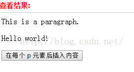


 使用函数来插入内容，使用函数在被选元素之后插入指定的内容。

​    语法：$(selector).after(function(index))

 function(index) 必需。规定返回待插入内容的函数。

 index - 可选。接收选择器的 index 位置。


```html
<html>
<head>
<script type="text/javascript" src="/jquery/jquery.js"></script>
<script type="text/javascript">
$(document).ready(function(){
  $("button").click(function(){
    $("p").after(function(n){
      return "<p>The p element above has index " + n + "</p>";
    });
  });
});
</script>
</head>
<body>
<h1>This is a heading</h1>
<p>This is a paragraph.</p>
<p>This is another paragraph.</p>
<button>在每个 p 元素后插入内容</button>
</body>
</html>
```


-----------


##### 4. 在节点外部插入内容-------前插

***\*（2）、before() 方法在被选元素前插入指定的内容\****

​    语法：$(selector).before(content)

  content 必需。规定要插入的内容（可包含 HTML 标签）。

```
before()方法在每一个匹配的元素之前插入，做为匹配元素的前一个兄弟节点。方法如下:$(target).before(element);例：

$("p").before("<span>下面是个段落</span>");

before方法查找每个元素p，将新建的span元素插入到元素p之前做为p的前一个兄弟节点。
```


（3）**、insertAfter()把匹配的元素插入到另一个指定的元素集合的后面**

 注释：如果该方法用于已有元素，这些元素会被从当前位置移走，然后被添加到被选元素之后。

​    语法：$(content).insertAfter(selector)

 content必需。规定要插入的内容。可能的值：选择器表达式、HTML 标记

 selector必需。规定在何处插入被选元素。

```
insertAfter()方法将新建的元素插入到查找到的目标元素后，做为目标元素的兄弟节点。方法如下：$(element).insertAfter(target);例:

$("<p>insertAfter操作</p>").insertAfter("span");

方法将新建的p元素添加到查找到目标元素span后面，做为目标元素后面的第一个兄弟节点。
```


------------


```c++
`attr()`方法修改属性值**attr(name,value) 

 //设置属性的值
```

```javascript
用600毫秒的时间将段落缓慢的切换显示状态

$("p").toggle("slow");
```

```c++
获取文本框中的值
    
$("input").val();
```

[jQuery 创建和插入元素_A_山水子农的博客-CSDN博客_jquery创建元素](https://blog.csdn.net/qq_27626333/article/details/51927022)


###  绑定事件

[jQuery.on() 函数详解_思想永无止境的博客-CSDN博客_jq on](https://blog.csdn.net/u012643122/article/details/93378318)

**jquery使用on绑定事件到动态生成的元素上时,不能对动态生成的对象操作,需要从其父节点追溯到本身。**


### **jquery $(this)怎么用**

this通常是一个Html 元素，例如(textbox)，textbox有text属性。可以在textbox的事件里面引用this获取元素

$(this)通常是一个JQuery对象 ，可以调用jquery的方法和属性值，例如click(), keyup()。

```
$(function () {
    $('button').click(function () {
       $(this)表示当前对象，这里指的是button
       //alert(this);//this 表示原生的DOM
   }) 
});
```

$(this).attr(key); 获取节点属性名的值，相当于getAttribute(key)方法

$(this).attr(key, value); 设置节点属性的值，相当于setAttribute(key,value)方法

$(this).val();获取某个元素节点的value值，相当于$(this).attr(“value”);

$(this).val(value);设置某个元素节点的value值，相当于$(this).attr(“value”,value);

示例：

```
$("Idtextbox").hover(
    function() {
        $(this).attr('title', 'Test');
    },
    function() {
        $(this).attr('title', 'OK');
    }
);
```

使用JQuery的好处是它包裝了各种浏览器版本对DOM对象的操作，因此统一使用$(this)而不再用this应该是比较不错的选择。


### **jquery写if语句**

第一种写法(我平时都是这样写)：

```
if($num=="1"){

        alert(1);

}else{

        alert(0);    

};
```


# JS location.reload()

```
location.reload();//刷新当前页面
 
//加参数 true/false
location.reload(false);//判断页面有没修改，有的话就从服务器下载页面，没有就直接从缓存里拿（会响应性能！！）
location.reload(true);//无论文档的最后修改日期是什么，它都会绕过缓存，直接从服务器上重新下载该文档
```


# JavaScript中confirm()方法的使用介绍

confirm() 方法用于显示一个带有指定消息和 OK 及取消按钮的对话框、

