# 时间管理工具——PERT图

# 概念

PERT（Program Evaluation and Review Technique）即计划评估和审查技术，它用网络图来表达项目中各项活动的进度和它们之间的相互关系，并在此基础上进行网络分析和时间估计，用于协调整个计划的完成。

它适合用于子任务很多，关系复杂的项目（区别于甘特图）。

# 形式

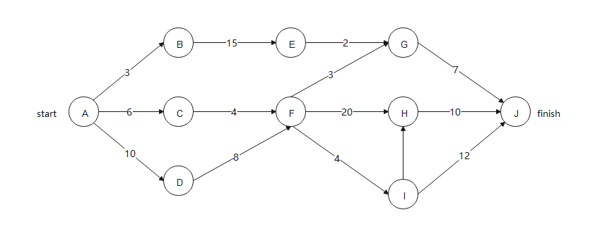

形式一

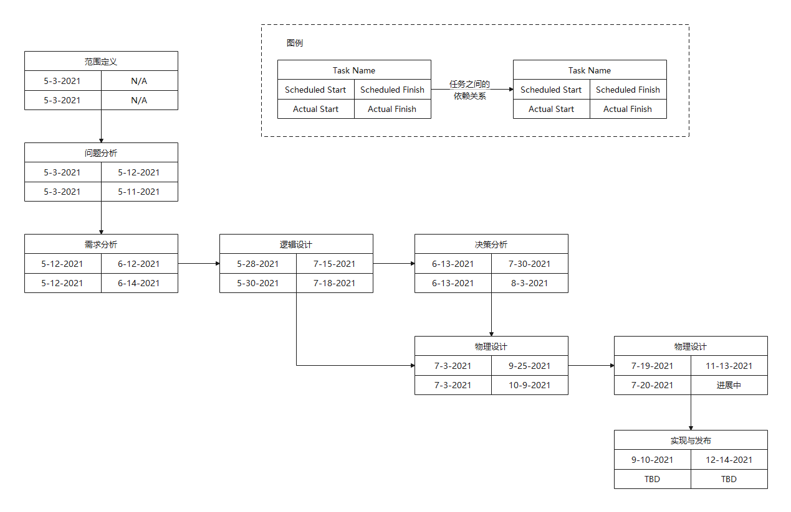

形式二

# 结构

这里使用上图形式的PERT图进行讲解

其中左侧的圆形表示事务，左侧表示名称，右上表示最早开始时间，右下表示最晚完成时间，连接线上的数字表示上一事务需要的时间。

# 使用

1. 从左至右进行填写，图中的 A 的右上角我们填上0。

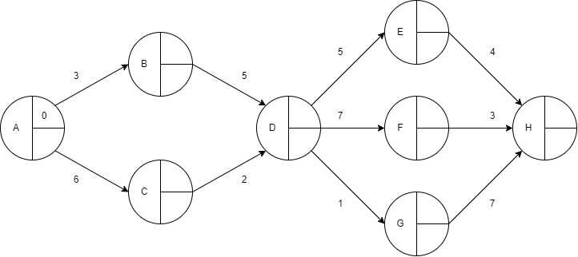

1. 关注从 A 至 B 的这一条路线，发现路线上的数为3，表明从 A 到达事务 B 需要的时间为3。因此事务 B 的右上角填上3，表示**事务 B 最早必须经过时间为3后才能开始**。

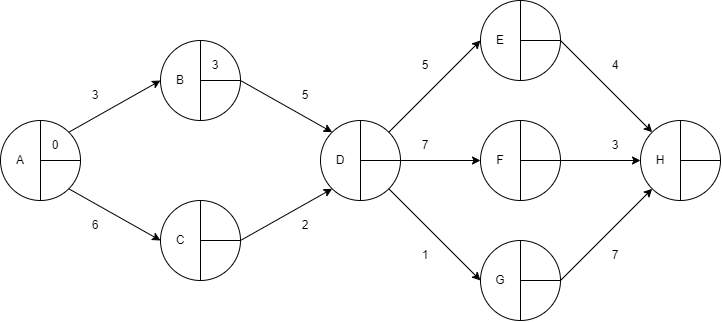

1. 同理将事务 C 的右上角填上6，表示事务 C 最早必须经过6个时间单位后才能开始。

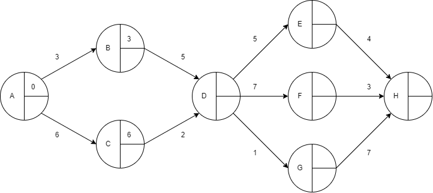

1. 在填写事务 D 时，由于我们要求的是**必须在前一个事务完成之后才能开始**，因此从 B 到 D 需要的时间为 3+5=8 ，从 C 到 D 需要的时间为 6+2=8 。取最大的那个数，即8。

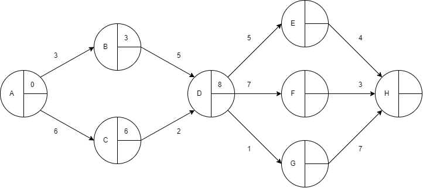

1. 按照上述步骤填写所有事务的右上角，如下图。

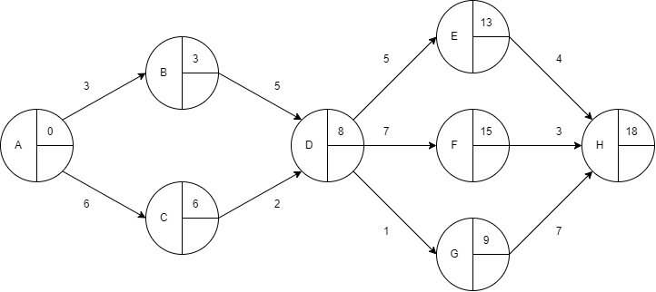

1. 从右至左填写每个事务的最晚完成时间，首先将最后一个事务（即事务 H）的右下角设置为18。

1. 从 H 到 E 需要的时间为4， 因此E的右下角（即最晚完成时间）设置为 18-4=14，F， G同理。

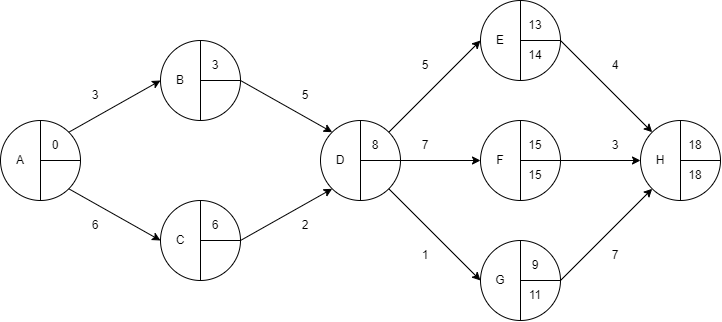

1. 在考虑D时我们要取 14-5, 15-7, 11-1 之中小的那个，因为我们要保证**之后的事务能够准时完成**。例如，这里应该填8，但是如果我们填9， 那么从事务 D 到事务 F 的这条路线就会出现无法在最迟完成时间之前完成，导致最后 H 无法完成。

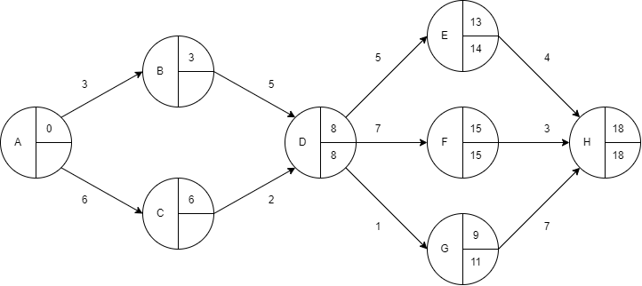

1. 同理填入剩余空格。

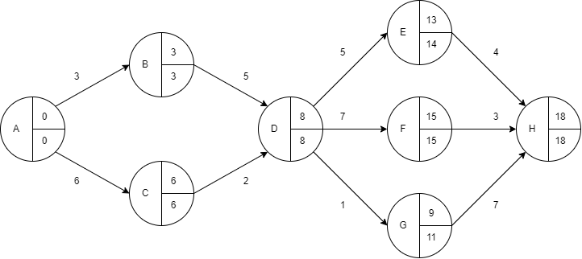

1. 在图中我们能看见一些事务的最早开始时间和最迟结束时间相同，这表明这些事件对整体任务的影响较大，需要重点执行。这些事务之间的连线称为关键路线。

   *也就是说，必须保证关键路线能顺利完成。在日常执行过程中，会出现将其它不重要的事务的资源优先提供给关键路线上的事务的情况*

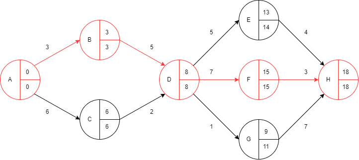

# 总结

使用 PERT 图能很好地进行时间上的分配，对复杂地项目安排有很好地操作能力。当然，这只是 PERT 图的其中一种表现形式，同时也是很简单的一种形式，我们也要根据项目的实际情况，选择适合的形式。

**PERT图的重点是找到关键路线**