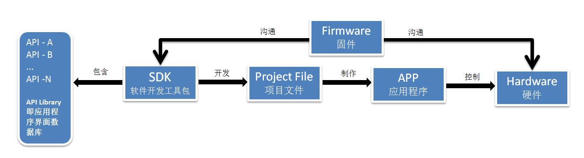

# 概念

**1、API是什么**

API全称 Application Programming Interface，**[应用程序接口](https://www.zhihu.com/search?q=应用程序接口&search_source=Entity&hybrid_search_source=Entity&hybrid_search_extra={"sourceType"%3A"answer"%2C"sourceId"%3A796137064})**。

一般是指一些预先定义的[函数](https://www.zhihu.com/search?q=函数&search_source=Entity&hybrid_search_source=Entity&hybrid_search_extra={"sourceType"%3A"answer"%2C"sourceId"%3A796137064})，目的是提供应用程序与开发人员基于某软件或硬件得以访问一组例程的能力，而又无需访问源码，或理解内部[工作机制](https://www.zhihu.com/search?q=工作机制&search_source=Entity&hybrid_search_source=Entity&hybrid_search_extra={"sourceType"%3A"answer"%2C"sourceId"%3A796137064})的细节。通俗来讲**API就是可以轻松实现和其他软件的交互。**

**2、SDK是什么**

SDK全称software development kit，**[软件开发工具包](https://www.zhihu.com/search?q=软件开发工具包&search_source=Entity&hybrid_search_source=Entity&hybrid_search_extra={"sourceType"%3A"answer"%2C"sourceId"%3A796137064})**。

一般都是一些[软件工程师](https://www.zhihu.com/search?q=软件工程师&search_source=Entity&hybrid_search_source=Entity&hybrid_search_extra={"sourceType"%3A"answer"%2C"sourceId"%3A796137064})为特定的[软件包](https://www.zhihu.com/search?q=软件包&search_source=Entity&hybrid_search_source=Entity&hybrid_search_extra={"sourceType"%3A"answer"%2C"sourceId"%3A796137064})、[软件框架](https://www.zhihu.com/search?q=软件框架&search_source=Entity&hybrid_search_source=Entity&hybrid_search_extra={"sourceType"%3A"answer"%2C"sourceId"%3A796137064})、硬件平台、[操作系统](https://www.zhihu.com/search?q=操作系统&search_source=Entity&hybrid_search_source=Entity&hybrid_search_extra={"sourceType"%3A"answer"%2C"sourceId"%3A796137064})等建立应用软件时的开发工具的集合。通俗来讲**就是第三方服务商提供的实现产品软件某项功能的工具包。**

假设你要做一款WiFi[可视门铃](https://www.zhihu.com/search?q=可视门铃&search_source=Entity&hybrid_search_source=Entity&hybrid_search_extra={"sourceType"%3A"answer"%2C"sourceId"%3A107637032})，APP功能有：

\1. 视频对讲

\2. APP开锁

\3. 访客截图

\4. [移动侦测](https://www.zhihu.com/search?q=移动侦测&search_source=Entity&hybrid_search_source=Entity&hybrid_search_extra={"sourceType"%3A"answer"%2C"sourceId"%3A107637032})

\5. 触发警报

\6. [人脸识别](https://www.zhihu.com/search?q=人脸识别&search_source=Entity&hybrid_search_source=Entity&hybrid_search_extra={"sourceType"%3A"answer"%2C"sourceId"%3A107637032})

首先，要做1-6的API, 组成了SDK, 然后根据SDK开发Project File项目文件，制作APP, 门铃上写入Firmware固件(Firmware是门铃的软件，是SDK和门铃沟通的桥梁）。

如下图：

后来，你想升级门铃，加入新功能 7. [虹膜识别](https://www.zhihu.com/search?q=虹膜识别&search_source=Entity&hybrid_search_source=Entity&hybrid_search_extra={"sourceType"%3A"answer"%2C"sourceId"%3A107637032})，做API-7, 组成新的SDK, 生成新的Firmware, 更新到门铃。

# 开发SDK

[开发一个简单易用的SDK的详细步骤（超详细，超适用）_sdk开发-CSDN博客](https://blog.csdn.net/weixin_54040016/article/details/129137173)

# 上传自己的jar包到maven中央仓库

[如何上传自己的jar包到maven中央仓库（2021最新版）_上传jar到maven仓库_Java鱼仔的博客-CSDN博客](https://blog.csdn.net/qq_41973594/article/details/119791466)

