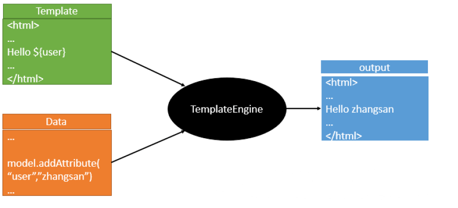

# Thymeleaf模板引擎(页面)

由于 **SpringBoot** 使用了**嵌入式 Servlet 容器**。所以 **JSP** 默认是**不能使用**的

如果需要**服务端页面渲染**，优先考虑使用 模板引擎。

两种模式:

1. `前后分离模式`： `@RestController `响应JSON数据

2. `前后不分离模式`：@Controller + Thymeleaf模板引擎

==模板引擎页面默认放在 src/main/resources/templates==

**SpringBoot** 包含以下模板引擎的自动配置

- FreeMarker
- Groovy
- **Thymeleaf**    https://www.thymeleaf.org/ 
- Mustache

# Thymeleaf 简介

- 1、Thymeleaf 是 Web 和独立环境的现代服务器端 Java 模板引擎，能够处理HTML，XML，JavaScript，CSS 甚至纯文本。
- 2、Thymeleaf 的主要目标是提供一种优雅和高度可维护的创建模板的方式。为了实现这一点，它建立在自然模板的概念上，将其逻辑注入到模板文件中，不会影响模板被用作设计原型。这改善了设计的沟通，弥补了设计和开 发团队之间的差距。
- 3、Thymeleaf 也从一开始就设计了Web标准 - 特别是 HTML5 - 允许您创建完全验证的模板，Spring Boot 官方推荐使用 thymeleaf 而不是 JSP。
- 4、Thymeleaf 官网：https://www.thymeleaf.org/
- 5、Thymeleaf 在 Github 的主页：https://github.com/thymeleaf/thymeleaf
- 6、Spring Boot 中使用 Thymeleaf 模板引擎时非常简单，因为 Spring Boot 已经提供了默认的配置，比如解析的文件前缀，文件后缀，文件编码，缓存等等，程序员需要的只是写 html 中的内容即可。

## [模板引擎](https://github.com/andanyoung/springnotes/blob/master/notes/Thymeleaf/1.Thymeleaf模板引擎简介与入门.md#模板引擎)

1）市面上主流的 Java 模板引擎有：JSP、Velocity、Freemarker、Thymeleaf

2）JSP本质也是模板引擎，Spring Boot 官方推荐使用 “Thymeleaf”模板引擎

3）模板引擎原理图如下，模板引擎的作用都是将模板(页面)和数据进行整合然后输出显示，区别在于不同的模板使用不同的语法，如 JSP 的 JSTL 表达式，以及 JSP 自己的表达式和语法，同理 Thymeleaf 也有自己的语法 



## Thymeleaf整合

### 依赖

#### 方法1: idea创建项目时导入


#### 方法2: Maven

```xml
<dependency>
    <groupId>org.springframework.boot</groupId>
    <artifactId>spring-boot-starter-thymeleaf</artifactId>
</dependency>
```

### 配置

 application.properties文件

```properties
#thymelea模板配置
spring.thymeleaf.prefix=classpath:/templates/
spring.thymeleaf.suffix=.html
spring.thymeleaf.mode=HTML5
spring.thymeleaf.encoding=UTF-8
#热部署文件，页面不产生缓存，及时更新
#开发期间关闭，上线以后开启
spring.thymeleaf.cache=false
```

### HTML中添加

```html
<!DOCTYPE html>
<html xmlns:th="http://www.thymeleaf.org">
```

## 基本使用

**UserController.java**

```java
@Controller
@RequestMapping("/user")
public class UserController {
    @Resource
    private UserService userService;

    @RequestMapping("/all")
    public String all(Model model) {
        model.addAttribute("users", userService.findAll());
        return "all";
    }
}
```

**在 resources/templates 目录下新建 all.html 文件**

```html
<!DOCTYPE html>
<html lang="zh" xmlns:th="http://www.thymeleaf.org">
<head>
    <meta http-equiv="content-type" content="text/html;charset=utf-8">
    <title>Thymeleaf</title>
</head>
<body>
    <table>
        <tr>
            <td>用户名</td>
            <td>密码</td>
        </tr>
        <tr th:each="user:${users}">
            <td th:text="${user.name}"></td>
            <td th:text="${user.password}"></td>
        </tr>
    </table>
</body>
</html>
```

在浏览器地址栏里输入 `http://localhost:8080/user/all` 访问接口


## Thymeleaf基础语法

### 1. 核心用法

`th:xxx`**：动态渲染指定的 html 标签属性值、或者th指令（遍历、判断等）**

- `th:text`：标签体内文本值渲染
- `th:utext`：不会转义，显示为html原本的样子。
- `th:属性`：标签指定属性渲染
- `th:attr`：标签任意属性渲染
- `th:if   th:each  ...`：其他th指令

`表达式`**：用来动态取值**

- `${}`**：变量取值；使用model共享给页面的值都直接用${}**
- `@{}`**：url路径；**
- `#{}`：国际化消息
- `~{}`：片段引用
- `*{}`：变量选择：需要配合th:object绑定对象

例子:

```xml
<!DOCTYPE html>
<html lang="en" xmlns:th="http://www.thymeleaf.org">
<head>
    <meta charset="UTF-8">
    <title>Title</title>
</head>
<body>
<h1>你好：<span th:text="${msg}"></span></h1>

<hr/>
th:text： 替换标签体的内容； 会转义
th:utext: 替换标签体的内容; 不会转义html标签，真正显示为html该有的样式
<h1 th:text="${msg}">哈哈</h1>
<h1 th:utext="${msg}">呵呵</h1>
<hr/>
<hr/>
th: 任意html属性； 动态替换任意属性的值

<br/>
th:attr：任意属性指定

<br/>
th：其他指令


<br/>
2.jpg  @{} 专门用来取各种路径


3. 使用工具类
转大写
<h1 th:text="${#strings.toUpperCase(name)}"></h1>
<h1 th:text="${'前缀：'+name+'后缀'}"></h1>
拼串
<h1 th:text="|前缀哈哈 ${name} 后缀呵呵|"></h1>
</body>
</html>
```

```java
package com.atguigu.web.controller;

import com.atguigu.web.bean.Person;
import com.atguigu.web.service.AService;
import jakarta.servlet.http.HttpServletRequest;
import lombok.extern.slf4j.Slf4j;
import org.springframework.beans.factory.annotation.Autowired;
import org.springframework.stereotype.Controller;
import org.springframework.ui.Model;
import org.springframework.web.bind.annotation.ExceptionHandler;
import org.springframework.web.bind.annotation.GetMapping;
import org.springframework.web.bind.annotation.RequestParam;
import org.springframework.web.bind.annotation.ResponseBody;

import java.util.Arrays;
import java.util.List;


/**
 * @author lfy
 * @Description
 * @create 2023-04-13 16:37
 */
@Controller //适配 服务端渲染   前后不分离模式开始
public class WelcomeController {

    @Autowired
    AService aService;

    /**
     * 利用模板引擎跳转到指定页面
     * @return
     */
    @GetMapping("/well")
    public String hello(@RequestParam("name") String name,
                        Model model, HttpServletRequest request){
				// 页面发送一个参数name,比如localhost:9000/well?name=李四


        //把需要给页面共享的数据放到model中
        String text = "<span style='color:red'>"+name+"</span>";
        model.addAttribute("msg",text);


        model.addAttribute("name",name);

        aService.a();

        //路径是动态的
        model.addAttribute("imgUrl","/4.jpg");
        //数据库查出的样式
        model.addAttribute("style","width: 400px");

        model.addAttribute("show",false);

        //模板的逻辑视图名
        //物理视图 =  前缀 + 逻辑视图名 + 后缀
        //真实地址 = classpath:/templates/welcome.html
        return "welcome";
    }
}

```

**系统工具&内置对象：**[**详细文档**](https://www.thymeleaf.org/doc/tutorials/3.1/usingthymeleaf.html#appendix-a-expression-basic-objects)

- `param`：请求参数对象
- `session`：session对象
- `application`：application对象
- `#execInfo`：模板执行信息
- `#messages`：国际化消息
- `#uris`：uri/url工具
- `#conversions`：类型转换工具
- `#dates`：日期工具，是`java.util.Date`对象的工具类
- `#calendars`：类似#dates，只不过是`java.util.Calendar`对象的工具类
- `#temporals`： JDK8+ `**java.time**` API 工具类
- `#numbers`：数字操作工具
- `#strings`：字符串操作
- `#objects`：对象操作
- `#bools`：bool操作
- `#arrays`：array工具
- `#lists`：list工具
- `#sets`：set工具
- `#maps`：map工具
- `#aggregates`：集合聚合工具（sum、avg）
- `#ids`：id生成工具

### 2. 语法示例

**表达式：**

- 变量取值：${...}
- url 取值：@{...}
- 国际化消息：#{...}
- 变量选择：*{...}
- 片段引用: ~{...}

**常见：**

- 文本： 'one text'，'another one!',...
- 数字： 0,34,3.0,12.3,...
- 布尔：true、false
- null: null
- 变量名： one,sometext,main...

**文本操作：**

- 拼串： +

- 文本替换：| The name is ${name} |

  ```xml
  拼串
  <h1 th:text="|前缀哈哈 ${name} 后缀呵呵|"></h1>
  ```

  

**布尔操作：**

- 二进制运算： and,or
- 取反：!,not

**比较运算：**

- 比较：>，<，<=，>=（gt，lt，ge,le）
- 等值运算：==,!=（eq，ne）

**条件运算：**

- if-then： (if)?(then)
- if-then-else: (if)?(then):(else)
- default: (value)?:(defaultValue)

**特殊语法：**

- 无操作：_

**所有以上都可以嵌套组合**

```plain
'User is of type ' + (${user.isAdmin()} ? 'Administrator' : (${user.type} ?: 'Unknown'))
```

### 3. 属性设置

1. th:href="@{/product/list}"
2. th:attr="class=${active}"
3. th:attr="src=@{/images/gtvglogo.png},title=${logo},alt=#{logo}"  //批量设置属性
4. th:checked="${user.active}"

```html
<p th:text="${content}">原内容</p>
<a th:href="${url}">登录</a>

```

### 4. 遍历

语法：  `th:each="元素名,迭代状态 : ${集合}"`

```html
<tr th:each="prod : ${prods}">
  <td th:text="${prod.name}">Onions</td>
  <td th:text="${prod.price}">2.41</td>
  <td th:text="${prod.inStock}? #{true} : #{false}">yes</td>
</tr>

// 加上迭代状态
<tr th:each="prod,iterStat : ${prods}" th:class="${iterStat.odd}? 'odd'">
  <td th:text="${prod.name}">Onions</td>
  <td th:text="${prod.price}">2.41</td>
  <td th:text="${prod.inStock}? #{true} : #{false}">yes</td>
</tr>
```

iterStat 有以下属性：

- index：当前遍历元素的索引，从0开始
- count：当前遍历元素的索引，从1开始
- size：需要遍历元素的总数量
- current：当前正在遍历的元素对象
- even/odd：是否偶数/奇数行
- first：是否第一个元素
- last：是否最后一个元素

```java
th:each属性用于迭代循环，语法：th:each="obj,iterStat:${objList}"
迭代对象可以是Java.util.List,java.util.Map,数组等;
iterStat 称作状态变量，属性有：
    index:当前迭代对象的index（从0开始计算）
    count: 当前迭代对象的index(从1开始计算)
    size:被迭代对象的大小
    current:当前迭代变量
    even/odd:布尔值，当前循环是否是偶数/奇数（从0开始计算）
    first:布尔值，当前循环是否是第一个
    last:布尔值，当前循环是否是最后一个
```

```html
<ol>  
       <li>List循环：  
            <table border="1">  
              <tr>  
                <th>用户名</th>  
                <th>邮箱</th>  
                <th>管理员</th>  
                <th>状态变量：index</th>  
                <th>状态变量：count</th>  
                <th>状态变量：size</th>  
                <th>状态变量：current.userName</th>  
                <th>状态变量：even</th>  
                <th>状态变量：odd</th>  
                <th>状态变量：first</th>  
                <th>状态变量：last</th>  
              </tr>  
              <tr  th:each="user,userStat : ${list}">  
                <td th:text="${user.userName}">Onions</td>  
                <td th:text="${user.email}">test@test.com.cn</td>  
                <td th:text="${user.isAdmin}">yes</td>  
                 <th th:text="${userStat.index}">状态变量：index</th>  
                <th th:text="${userStat.count}">状态变量：count</th>  
                <th th:text="${userStat.size}">状态变量：size</th>  
                <th th:text="${userStat.current.userName}">状态变量：current</th>  
                <th th:text="${userStat.even}">状态变量：even****</th>  
                <th th:text="${userStat.odd}">状态变量：odd</th>  
                <th th:text="${userStat.first}">状态变量：first</th>  
                <th th:text="${userStat.last}">状态变量：last</th>  
				<a th:href="@{/kickout(username=${user.username})}">下线</a>
              </tr>  
            </table>  
        </li>  
        <li>Map循环：  
            <div th:each="mapS:${map}">  
            <div th:text="${mapS}"></div>  
            </div>  
        </li>  
        <li>数组循环：  
            <div th:each="arrayS:${arrays}">  
            <div th:text="${arrayS}"></div>  
            </div>  
        </li>  
        </ol>
```

### 5. 判断

#### th:if

```html
<a
  href="comments.html"
  th:href="@{/product/comments(prodId=${prod.id})}"
  th:if="${not #lists.isEmpty(prod.comments)}"
  >view</a
```

#### th:switch

```html
<div th:switch="${user.role}">
  <p th:case="'admin'">User is an administrator</p>
  <p th:case="#{roles.manager}">User is a manager</p>
  <p th:case="*">User is some other thing</p>
</div>
```


### 6. 属性优先级

- 片段
- 遍历
- 判断

```html
<ul>
  <li th:each="item : ${items}" th:text="${item.description}">Item description here...</li>
</ul>
```

| Order | Feature          | Attributes                           |
| ----- | ---------------- | ------------------------------------ |
| 1     | 片段包含         | th:insert th:replace                 |
| 2     | 遍历             | th:each                              |
| 3     | 判断             | th:if th:unless th:switch th:case    |
| 4     | 定义本地变量     | th:object th:with                    |
| 5     | 通用方式属性修改 | th:attr th:attrprepend th:attrappend |
| 6     | 指定属性修改     | th:value th:href th:src ...          |
| 7     | 文本值           | th:text th:utext                     |
| 8     | 片段指定         | th:fragment                          |
| 9     | 片段移除         | th:remove                            |

### 7. 行内写法

```
[[...]] or [(...)]
<p>Hello, [[${session.user.name}]]!</p>
```

### 8. 变量选择

```html
<div th:object="${session.user}">
  <p>Name: <span th:text="*{firstName}">Sebastian</span>.</p>
  <p>Surname: <span th:text="*{lastName}">Pepper</span>.</p>
  <p>Nationality: <span th:text="*{nationality}">Saturn</span>.</p>
</div>
```

等同于

```html
<div>
  <p>Name: <span th:text="${session.user.firstName}">Sebastian</span>.</p>
  <p>Surname: <span th:text="${session.user.lastName}">Pepper</span>.</p>
  <p>Nationality: <span th:text="${session.user.nationality}">Saturn</span>.</p>
</div
```

### 9. 模板布局

- 定义模板： `th:fragment`
- 引用模板：`~{templatename::selector}`
- 插入模板：`th:insert`、`th:replace`

```html
<footer th:fragment="copy">&copy; 2011 The Good Thymes Virtual Grocery</footer>

<body>
  <div th:insert="~{footer :: copy}"></div>
  <div th:replace="~{footer :: copy}"></div>
</body>
<body>
  结果：
  <body>
    <div>
      <footer>&copy; 2011 The Good Thymes Virtual Grocery</footer>
    </div>

    <footer>&copy; 2011 The Good Thymes Virtual Grocery</footer>
  </body>
</body>
```


