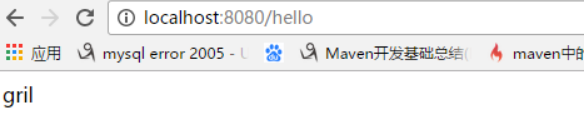
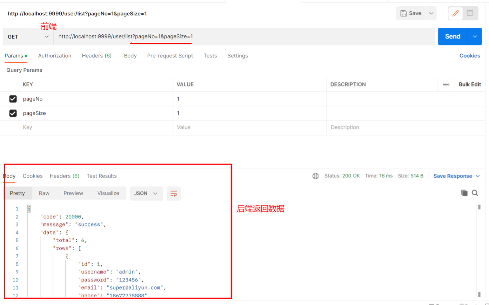
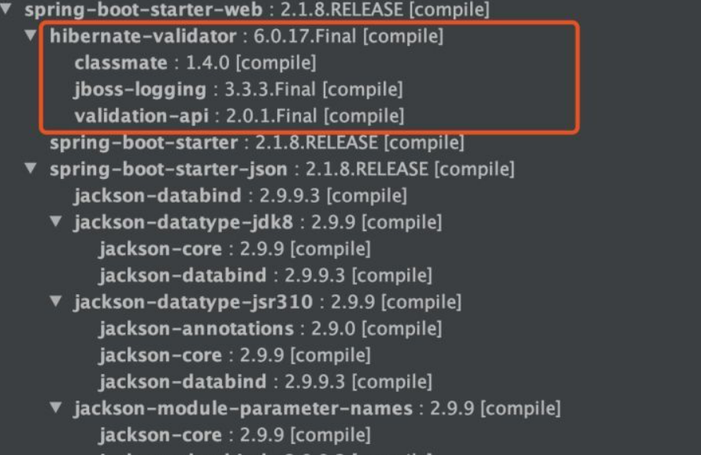
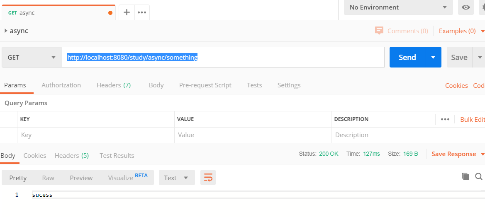

# SpringBoot常用注解

## 1、 @SpringBootApplication

一般不会主动去使用它。这个注解是 Spring Boot 项目的基石，创建 SpringBoot 项目之后会默认在主类加上。

```java
@SpringBootApplication
public class SpringSecurityJwtGuideApplication {
      public static void main(java.lang.String[] args) {
        SpringApplication.run(SpringSecurityJwtGuideApplication.class, args);
    }
}
```

可以把 @SpringBootApplication看作是 @Configuration、@EnableAutoConfiguration、@ComponentScan 注解的集合。根据 SpringBoot 官网，这三个注解的作用分别是：

+ @EnableAutoConfiguration：启用 SpringBoot 的自动配置机制；
+ @ComponentScan： 扫描被@Component、@Service、@Controller注解修饰的 bean，注解默认会扫描该类所在的包下所有的类；
+ @Configuration：允许在 Spring 上下文中注册额外的 bean 或导入其他配置类

| 注解                   | 备注     |
| ---------------------- | -------- |
| @SpringBootApplication | 入口函数 |

| 注解            | 备注                                                         |
| --------------- | ------------------------------------------------------------ |
| @Controller     | 1.Controller +RequestMapping+GetMapping、<br/>2.引人freemarker<<br/>#   配置thymeleaf场景<br/>#   spring.thymeleaf<br/>spring.thymeleaf.prefix=classpath:templates/  <br/>spring.thymeleaf.suffix=.html<br/>#开发期间关闭，上线以后开启<br/>spring.thymeleaf.cache=falsebr/><br/>4、在application.properties中配置freemarker相关的信息<br/>5、返回的是页面<br/>6.  ==接收前端数据== |
| @RestController | 1. 返回的是输出结果,返回对象，如json ，是==提供前端获取数据==、提交数据<br/>2. 结合 @RequestMapping、@GetMapping、@PostMapping...... |
| @ResponseBody   | 一般在@Controller中使用: @ResponseBody+@Controller = @RestController,   后端发送java对象 ==记忆: 返回对象== |

@Controller            返回: 视图页面 

@Controller + @ResponseBody   返回:  json/xml/类对象数据(不推荐)

@RestController     返回:  json/xml/类数据

```java
@Controller
public class HelloController {
    
    @GetMapping(value="/hello")
    @ResponseBody
    public String say(){//返回json 数据  
        return "gril";
    }
    
    @GetMapping(value="/hello1")
    public String say1(){//返回视图
        return "sys/index1";
    }
}
```

```java
@Controller
@ResponseBody
public class HelloController {
   // 都返回json数据到页面
    @GetMapping(value="/hello")
    public String say(){
        return "gril";
    }
    @GetMapping(value="/hello1")
    public String say1(){
        return "sys/index1"; //返回视图
    }
}
```

上面的两种方法等价于下面的方式

```java
@Controller
@RestController 
public class HelloController {
   // 都返回json数据到页面
    @GetMapping(value="/hello")
    public String say(){
        return "gril";
    }
    @GetMapping(value="/hello1")
    public String say1(){
        return "sys/index1"; //返回视图
    }
}
```

RequestMapping

```java
@RestController  
@RequestMapping("/action")
public class UserActionController {

	@GetMapping("/show")  // url: xxxx/action/show
	public User show(){
		return userService.show();
	}

}
```

| 注解           | 备注                                                         |
| -------------- | ------------------------------------------------------------ |
| @GetMapping    | 前端显示数据,  请求从服务器获取特定资源                      |
| @PostMapping   | 在服务器上创建一个新的资源                                   |
| @PutMapping    | 后端接受数据,  更新服务器上的资源                            |
| @DeleteMapping | 从服务器删除特定的资源                                       |
| @PatchMapping  | 更新服务器上的资源,  一般实际项目中,PUT 不够用了之后才用 PATCH 请求去更新数据。 |
| @CrossOrigin   | 跨域                                                         |

| 注解          | 备注                                                         |
| ------------- | ------------------------------------------------------------ |
| @RequestParam | 动态参数(RequestParam  带?)                                  |
| @PathVariable | 动态参数 (PathVariable 不带?)                                |
| @RequestBody  | 传递对象,  比如: 前端发送json封装的对象给后端，后端使用java对象来接收(传递对象)反之也可以用它 |

| 注解                 | 备注                                                         |
| -------------------- | ------------------------------------------------------------ |
| @Service             | bean注册, ==一般加在service目录里面的类上==                  |
| @Controller          | 控制层组件, controller目录里面的类上                         |
| @Repository          | 数据层组件, dao目录里面的类上                                |
| @Component           | bean注册, 和 Service 没有啥区别,  Component是比较通用的东西  |
| @Autowired           | //@Resource =@Autowired+@Qualifie<br>//自动加载类, 理解就是不用new<br/>//如果接口实现只有一个，那么用@Autowired就可以了，也不需要指定名字.<br/>//如果接口有多个实现,那么用@Resource，并指定name<br/>//或者使用@Autowired+@Qualifier+Qualifier的value值. |
| @Configuration+@Bean | bean注册(人为) —> 用于配置类                                 |
| @Values              | 从配置文件中取参数                                           |

**@RestController和@Controller的区别**

- @RestController加在类上面的注解，使得类里面的每个方法都将json/xml返回数据加返回到前台页面中。

```java
@RestController
public class HelloController {
 
    @GetMapping(value="/hello")
    public String say(){
        return "gril";
    }
}
```



- @Controller加在类上面的注解，使得类里面的每个方法都返回一个视图页面。

```java
@Controller
public class HelloController {
 
    @GetMapping(value="/hello")
    public String say(){
        return "gril";
    }
}
```

- @Controller和@ResponseBody（加在方法/类上面）一起使用，和@RestController的作用相同。

```java
@Controller
public class HelloController {
    
    @GetMapping(value="/hello")
    @ResponseBody
    public String say(){//返回json 数据  
        return "gril";
    }
    @GetMapping(value="/hello1")
    public String say1(){//返回视图
        return "sys/index1";
    }
}

```

```java
@Controller
@ResponseBody
public class HelloController {
   // 都返回json数据到页面
    @GetMapping(value="/hello")
    public String say(){
        return "gril";
    }
    @GetMapping(value="/hello1")
    public String say1(){
        return "sys/index1";
    }
}
```

## 2、Spring Bean 相关

| 注解                 | 备注                                                         |
| -------------------- | ------------------------------------------------------------ |
| @Service("?")        | bean注册, ==一般加在service目录里面的类上==                  |
| @Component("?")      | bean注册,  和 Service 没有啥区别,  Component是比较通用的东西 |
| @Autowired           | ①自动加载类(个人理解就是不用new)      ②或者使用@Autowired+@Qualifier |
| @Resource(name="?")  | ①如果该接口有多个实现,    用@Resource，并指定name <br>②@AutoWired只适合spring框架，而@Resource扩展性更好 |
| @Configuration+@Bean | bean注册(人为) —> 用于配置类   // bean下是注入的对象         |
| @Values              | 从配置文件中取参数                                           |
| @Repository("?")     | 用于将 DAO 层 (spring应用)                                   |

注: "?"可选

### 2.1  @Autowired

自动导入对象到类中（自动装配），被注入的类同样要被 Spring 容器管理，比如：Service 类注入到 Controller 类中。

```java

@Service
public class UserService {
  ......
}

@RestController
@RequestMapping("/users")
public class UserController {
   @Autowired
   private UserService userService;
   ......
}
```

在Spring框架中，@Service注解用于标识一个类为服务层组件，表示该类提供业务逻辑的处理。当使用@Service注解标注一个类时，Spring会自动将该类实例化并将其作为一个Bean进行管理。

然而，即使使用了@Service注解标注了一个类，我们仍然需要使用@Autowired注解来进行依赖注入，以便在其他类中使用该服务。这是因为@Autowired注解告诉Spring容器在需要该服务的地方自动注入对应的实例。

简而言之，@Service注解用于标识一个类为服务层组件，让Spring容器实例化并管理该类的实例。而@Autowired注解用于在其他类中自动注入对应的服务实例，以便使用该服务的功能。

### 2.2  @Component, @Repository, @Service, @Controller

我们一般使用 @Autowired 注解让 Spring 容器帮我们自动装配 bean。要想把类标识成可用于 @Autowired 注解自动装配的 bean 的类，可以采用以下注解实现：

●@Component ：通用的注解，可标注任意类为 Spring 组件。如果一个 Bean 不知道属于哪个层，可以使用@Component 注解标注；

●@Repository : 对应持久层即 Dao 层，主要用于数据库相关操作；

●@Service : 对应服务层，主要涉及一些复杂的逻辑，需要用到 Dao 层；

●@Controller : 对应 Spring MVC 控制层，主要用于接受用户请求并调用 Service 层返回数据给前端页面。

### 2.3  @RestController

@RestController注解是@Controller和@ResponseBody的合集，表示这是个控制器 bean，并且是将函数的返回值直接填入 HTTP 响应体中，是 REST 风格的控制器。

现在都是前后端分离，说实话我已经很久没有用过@Controller。如果你的项目太老了的话，就当我没说。


单独使用 @Controller 不加 @ResponseBody的话一般使用在要返回一个视图的情况，这种情况属于比较传统的 Spring MVC 的应用，对应于前后端不分离的情况。@Controller+@ResponseBody 返回 JSON 或 XML 形式数据

### 2.4  @Scope

设置注解的作用域

| 参数      | 说明                                                         |
| --------- | ------------------------------------------------------------ |
| singleton | 单实例的(`单例`)(默认)   ----全局有且仅有一个实例            |
| prototype | 多实例的(`多例`)                ---- 每次获取Bean的时候会有一个新的实例 |
| reqeust   | 同一次请求 ----request：每一次HTTP请求都会产生一个新的bean，同时该bean仅在当前`HTTP request`内有效 |
| session   | 同一个会话级别 ---- session：每一次HTTP请求都会产生一个新的bean，同时该bean仅在当前`HTTP session`内有效 |

**例子1**

在UserServiceImpl中添加@Scope注解：

```java
@Service("userService")
@Scope("prototype")
public class UserServiceImpl implements UserService{ }
```

在测试类中测试多例：

```java
ApplicationContext context = new  ClassPathXmlApplicationContext("spring.xml");
UserService service1 = (UserService)context.getBean("userService");
UserService service2 = (UserService)context.getBean("userService");
System.out.println(service1==service2);      //false
```

**例子2**

```cpp
public class Person {
    private String name;
    private Integer age;

    public Person() {
    }

    public Person(String name, Integer age) {
        this.name = name;
        this.age = age;
    }
}
```

```java
@Configuration
public class ProtoTypeConfig {

    @Scope("singleton")
    @Bean
    public Person person() {
        return new Person("李四", 55);
    }
```

测试代码

```java
@Test
public void test4() {
    ApplicationContext ctx = new AnnotationConfigApplicationContext(ProtoTypeConfig.class);
    Person person1 = ctx.getBean(Person.class);
    Person person2 = ctx.getBean(Person.class);
    System.out.println("person1 HashCode  " + person1.hashCode());
    System.out.println("person2 HashCode  " + person2.hashCode());
    System.out.println(person1 == person2);  // true
}
```

### 2.5  @Configuration

一般用来声明配置类，可以使用 @Component注解替代，不过使用Configuration注解声明配置类更加语义化。

```java
@Configuration
public class AppConfig {
    @Bean
    public TransferService transferService() {
        return new TransferServiceImpl();
    }
}
```

### 2.6  @Bean

[总结](./@Bean注解.md)

## 3、处理常见的 HTTP 请求类型

| 注解            | 说明         |
| --------------- | ------------ |
| @RequestMapping | url统一前缀  |
| @GetMapping     | 前端显示数据 |
| @PutMapping     | 后端接受数据 |
| @DeleteMapping  | 删除数据     |

5 种常见的请求类型:

- **GET** ：请求从服务器获取特定资源。举个例子：`GET /users`（获取所有学生）
- **POST** ：在服务器上创建一个新的资源。举个例子：`POST /users`（创建学生）
- **PUT** ：更新服务器上的资源（客户端提供更新后的整个资源）。举个例子：`PUT /users/12`（更新编号为 12 的学生）
- **DELETE** ：从服务器删除特定的资源。举个例子：`DELETE /users/12`（删除编号为 12 的学生）
- **PATCH** ：更新服务器上的资源（客户端提供更改的属性，可以看做作是部分更新），使用的比较少

### 3.1 GET 请求

@GetMapping("users") 等价于@RequestMapping(value="/users",method=RequestMethod.GET)

```java
@GetMapping("/users")
public ResponseEntity<List<User>> getAllUsers() {
 return userRepository.findAll();
}
```

### 3.2 POST 请求

@PostMapping("users") 等价于@RequestMapping(value="/users",method=RequestMethod.POST)

```java
@PostMapping("/users")
public ResponseEntity<User> createUser(@Valid @RequestBody UserCreateRequest userCreateRequest) {
 return userRespository.save(user);
}
```

### 3.3 PUT 请求

@PutMapping("/users/{userId}") 等价于@RequestMapping(value="/users/{userId}",method=RequestMethod.PUT)

```java
@PutMapping("/users/{userId}")
public ResponseEntity<User> updateUser(@PathVariable(value = "userId") Long userId,
  @Valid @RequestBody UserUpdateRequest userUpdateRequest) {
  ......
}
```

### 3.4 DELETE 请求

@DeleteMapping("/users/{userId}")等价于@RequestMapping(value="/users/{userId}",method=RequestMethod.DELETE)

```java
@DeleteMapping("/users/{userId}")
public ResponseEntity deleteUser(@PathVariable(value = "userId") Long userId){
  ......
}
```

### 3.5 PATCH 请求

一般实际项目中，我们都是 PUT 不够用了之后才用 PATCH 请求去更新数据。

```java
@PatchMapping("/profile")
  public ResponseEntity updateStudent(@RequestBody StudentUpdateRequest studentUpdateRequest) {
        studentRepository.updateDetail(studentUpdateRequest);
        return ResponseEntity.ok().build();
    }
```

## 4、前端传值

| 注解          | 说明                                                         |
| ------------- | ------------------------------------------------------------ |
| @RequestParam | 动态参数(RequestParam  带?)                                  |
| @PathVariable | 动态参数 (PathVariable 不带?)                                |
| @RequestBody  | 传递对象,  比如: 前端发送json封装的对象给后端，后端使用java对象来接收(传递对象)反之也可以用它 |

### 4.1 @PathVariable("xxx")

PathVariable 不带?  

例子 http://localhost:8090/paramage=/参数1/test/参数2

```java
//
@GetMapping("/{id}/test/{name}")
public Result<XUser> getUserById(@PathVariable("id") Integer id) {
   .....
}
```

例子2：

```java
@GetMapping("/klasses/{klassId}/teachers")
public List<Teacher> getKlassRelatedTeachers(
         @PathVariable("klassId") Long klassId,
         @RequestParam(value = "type", required = false) String type ) {
...
}
```

如果前端请求的 url 是：/klasses/123456/teachers?type=web

那么后端服务获取到的数据就是：klassId=123456,  type=web

### 4.2 @RequestParam("xxx")

RequestParam  带?  可以设置默认值, 不传值

例子 http://localhost:8090/param?age=参数?name=参数

```java
@GetMapping("/param")
public String hello(@RequestParam(value = "age",   defaultValue = "0") int age,      @RequestParam(value = "name", required = false, defaultValue = "") String name) {
    //required 表示可以不传值
    ....
}
```

#### 前端接口

```js
getUserList (searchModel){}
    return request ({
        url: "/user/list",
        method: "get",
        params:{
            pageNo: searchModel.pageNo,
            pageSize: searchModel.pageSize,
            username: searchModel.username,
            phone: searchModel.phone,
        },
	});
}
```

调用


```vue
getUserList () {
    userApi.getUserList(this.searchModel).then((response) => {
        this.userList = response.data.rows;
        this.total = response.data.total;
	});
}
```

==注意:  searchModel为前端参数,   response为后端服务器返回的结果==

后端响应结果:


#### 后端接口

```java
@GetMapping("/user/list")
public Result<?> getUserListPage(@RequestParam(value = "username", required = false) String username,
                                 @RequestParam(value = "phone", required = false) String phone,
                                 @RequestParam("pageNo") Long pageNo,
                                 @RequestParam("pageSize") Long pageSize) {
    LambdaQueryWrapper<XUser> wrapper = new LambdaQueryWrapper();
    //等价wrapper.eq(username != null, XUser::getUsername, username);
    wrapper.eq(StringUtils.hasLength(username), XUser::getUsername, username);
    wrapper.eq(phone != null, XUser::getPhone, phone);
    wrapper.orderByDesc(XUser::getId);
    // 分页
    Page<XUser> page = new Page<>(pageNo, pageSize);
    xUserService.page(page, wrapper);

    Map<String, Object> data = new HashMap<>();
    data.put("total", page.getTotal());   //page.getTotal()得添加配置,具体见官网
    data.put("rows", page.getRecords());  //结果集

    return Result.success(data);
    /**data数据:
		 * {
		 *     "code": 20000,
		 *     "message": "success",
		 *     "data": {
		 *         "total": 6,
		 *         "rows": [
		 *             {
		 *                 "id": 1,
		 *                 "username": "admin",
		 *                 "password": "123456",
		 *                 "email": "super@aliyun.com",
		 *                 "phone": "18677778888",
		 *                 "status": 1,
		 *                 "avatar": "https://wpimg.wallstcn.com/f778738c-e4f8-4870-b634-56703b4acafe.gif",
		 *                 "deleted": 0
		 *             }
		 *         ]
		 *     }
		 * }
		 * **/
}
```

测试效果



### 4.3 @RequestBody

用于读取 Request 请求（可能是 POST,PUT,DELETE,GET 请求）的 body 部分并且Content-Type 为 application/json 格式的数据，接收到数据之后会自动将数据绑定到 Java 对象上去。系统会使用HttpMessageConverter或者自定义的HttpMessageConverter将请求的 body 中的 json 字符串转换为 java 对象。

<font color=red>@RequestBody主要用来接收前端传递给后端的json字符串中的数据的(请求体中的数据的)，所以只能发送POST请求。[@RequestBody只能和@PostMapping使用]</font>

```java
	@PostMapping("/user/login")
    @ResponseBody //返回响应数据
	public Result<Map<String, Object>> login(@RequestBody XUser user) {
		// 登录操作
		Map<String, Object> data = xUserService.login(user);
		if (data != null)
			return Result.success(data);
		return Result.fail(20000, "用户密码错误");
	}
```

#### 前端接口

```js
export function login(data) {
  return request({
    url: '/user/login',
    method: 'post',
    data
  })
}
```

#### 后端接口

controller

```java
@PostMapping("/login")
public Result<Map<String,Object>> login(@RequestBody User user){
    Map<String,Object> data = userService.login(user);
    if(data != null){
        return Result.success(data);
    }
    return Result.fail(20002,"用户名或密码错误");
}
```

service

```java
@Override	
public Map<String, Object> login(XUser user) {
    //根据用户名和密码查询
    LambdaQueryWrapper<XUser> wrapper = new LambdaQueryWrapper<>();
    wrapper.eq(XUser::getUsername,user.getUsername());
    wrapper.eq(XUser::getPassword,user.getPassword());
    XUser loginUser = this.baseMapper.selectOne(wrapper);
    //结果不为空,则生成token,并将用户信息存入redis
    if(loginUser != null) {
        // 暂时用UUID，终极方案是jwt
        String key = "user:" + UUID.randomUUID();
        // 存入redis
        loginUser.setPassword(null); //密码不存
        redisTemplate.opsForValue().set(key,loginUser,30, TimeUnit.MINUTES);
        // 返回数据
        Map<String, Object> data = new HashMap<>();
        data.put("token", key);
        return data;
    }
    return null;
}
```

测试效果


## 5、读取配置信息

将一些常用的配置信息比如阿里云 oss、发送短信、微信认证的相关配置信息等等放到配置文件中。

我们的数据源application.yml内容如下：：

```yml
wuhan2020: 2020年初武汉爆发了新型冠状病毒，疫情严重，但是，我相信一切都会过去！武汉加油！中国加油！
my-profile:
  name: Guide哥
  email: koushuangbwcx@163.com
library:
  location: 湖北武汉加油中国加油
  books:
    - name: 天才基本法
      description: 二十二岁的林朝夕在父亲确诊阿尔茨海默病这天，得知自己暗恋多年的校园男神裴之即将出国深造的消息——对方考取的学校，恰是父亲当年为她放弃的那所。
    - name: 时间的秩序
      description: 为什么我们记得过去，而非未来？时间“流逝”意味着什么？是我们存在于时间之内，还是时间存在于我们之中？卡洛·罗韦利用诗意的文字，邀请我们思考这一亘古难题——时间的本质。
    - name: 了不起的我
      description: 如何养成一个新习惯？如何让心智变得更成熟？如何拥有高质量的关系？ 如何走出人生的艰难时刻？
```

### 5.1  @value(常用)

使用 @Value("${property}") 读取比较简单的配置信息：

properties文件

```properties
robot.name=小红
```

使用

```java
@Value("${robot.name}")
private String naem;    // name ={robot.name}
```

### 5.2  @ConfigurationProperties(常用)

通过@ConfigurationProperties读取配置信息并与 bean 绑定。

```java
@Component
@ConfigurationProperties(prefix = "library")
class LibraryProperties {
    @NotEmpty
    private String location;
    private List<Book> books;
    @Setter
    @Getter
    @ToString
    static class Book {
        String name;
        String description;
    }
  省略getter/setter
  ......
}
```

你可以像使用普通的 Spring bean 一样，将其注入到类中使用。

### 5.3  PropertySource（不常用）

@PropertySource读取指定 properties 文件

```java
@Component
@PropertySource("classpath:website.properties")
class WebSite {
    @Value("${url}")
    private String url;
  省略getter/setter
  ......
}
```

## 6、参数校验

数据的校验的重要性就不用说了，即使在前端对数据进行校验的情况下，我们还是要对传入后端的数据再进行一遍校验，避免用户绕过浏览器直接通过一些 HTTP 工具直接向后端请求一些违法数据。

JSR(Java Specification Requests） 是一套 JavaBean 参数校验的标准，它定义了很多常用的校验注解，我们可以直接将这些注解加在我们 JavaBean 的属性上面，这样就可以在需要校验的时候进行校验了，非常方便！

校验的时候我们实际用的是 Hibernate Validator 框架。Hibernate Validator 是 Hibernate 团队最初的数据校验框架，Hibernate Validator 4.x 是 Bean Validation 1.0（JSR 303）的参考实现，Hibernate Validator 5.x 是 Bean Validation 1.1（JSR 349）的参考实现，目前最新版的 Hibernate Validator 6.x 是 Bean Validation 2.0（JSR 380）的参考实现。

SpringBoot 项目的 spring-boot-starter-web 依赖中已经有 hibernate-validator 包，不需要引用相关依赖。如下图所示（通过 idea 插件—Maven Helper 生成）：




非 SpringBoot 项目需要自行引入相关依赖包，这里不多做讲解

需要注意的是： 所有的注解，推荐使用 JSR 注解，即javax.validation.constraints，而不是org.hibernate.validator.constraints

### 6.1   常用的字段验证的注解

- `@NotEmpty` 被注释的字符串的不能为 null 也不能为空
- `@NotBlank` 被注释的字符串非 null，并且必须包含一个非空白字符
- `@Null` 被注释的元素必须为 null
- `@NotNull` 被注释的元素必须不为 null
- `@AssertTrue` 被注释的元素必须为 true
- `@AssertFalse` 被注释的元素必须为 false
- `@Pattern(regex=,flag=)`被注释的元素必须符合指定的正则表达式
- `@Email` 被注释的元素必须是 Email 格式
- `@Min(value)`被注释的元素必须是一个数字，其值必须大于等于指定的最小值
- `@Max(value)`被注释的元素必须是一个数字，其值必须小于等于指定的最大值
- `@DecimalMin(value)`被注释的元素必须是一个数字，其值必须大于等于指定的最小值
- `@DecimalMax(value)` 被注释的元素必须是一个数字，其值必须小于等于指定的最大值
- `@Size(max=, min=)`被注释的元素的大小必须在指定的范围内
- `@Digits (integer, fraction)`被注释的元素必须是一个数字，其值必须在可接受的范围内
- `@Past`被注释的元素必须是一个过去的日期
- `@Future` 被注释的元素必须是一个将来的日期

### 6.2. 验证请求体

```java
@Data
@AllArgsConstructor
@NoArgsConstructor
@Validated
public class Person {
    @NotNull(message = "classId 不能为空")  // 表示classId必须不会空
    private String classId;
    @Size(max = 33)
    @NotNull(message = "name 不能为空")
    private String name;
    @Pattern(regexp = "((^Man$|^Woman$|^UGM$))", message = "sex 值不在可选范围")
    @NotNull(message = "sex 不能为空")
    private String sex;
    @Email(message = "email 格式不正确")
    @NotNull(message = "email 不能为空")
    private String email;
}
```

我们在需要验证的参数上加上了`@Valid`注解，如果验证失败，它将抛出`MethodArgumentNotValidException`

```java
@RestController
@RequestMapping("/api")
public class PersonController {
    @PostMapping("/person")
    public ResponseEntity<Person> getPerson(@RequestBody @Valid Person person) {
        return ResponseEntity.ok().body(person);
    }
}
```

### 6.3. 验证请求参数(常用)

@Validated 告诉 Spring 去校验方法参数

```java
@RestController
@RequestMapping("/api")
@Validated
public class PersonController {
    @GetMapping("/person/{id}")
    public ResponseEntity<Integer> getPersonByID(@Valid @PathVariable("id") @Max(value = 5,message = "超过 id 的范围了") Integer id) {
        return ResponseEntity.ok().body(id);
    }
}
```

### 7、全局处理 Controller 层异常

Spring 项目必备的全局处理 Controller 层异常

相关注解：

1. `@ControllerAdvice` :注解定义全局异常处理类
2. `@ExceptionHandler` :注解声明异常处理方法

如果方法参数不对的话就会抛出MethodArgumentNotValidException，来处理这个异常。

```java
@ControllerAdvice
@ResponseBody
public class GlobalExceptionHandler {
    /**
     * 请求参数异常处理
     */
    @ExceptionHandler(MethodArgumentNotValidException.class)
    public ResponseEntity<?> handleMethodArgumentNotValidException(MethodArgumentNotValidException ex, HttpServletRequest request) {
       ......
    }
}
```

## 8、 数据库相关

使用插件后不用考虑

### 8.1. 创建表

@Entity声明一个类对应一个数据库实体。

@Table 设置表明

```java
@Entity
@Table(name = "role")
public class Role {
    @Id
    @GeneratedValue(strategy = GenerationType.IDENTITY)
    private Long id;
    private String name;
    private String description;
    省略getter/setter......
}
```

### 8.2. 创建主键

@Id ：声明一个字段为主键。

使用@Id声明之后，我们还需要定义主键的生成策略。我们可以使用 @GeneratedValue 指定主键生成策略。

1.通过 @GeneratedValue直接使用 JPA 内置提供的四种主键生成策略来指定主键生成策略。

```
@Id
@GeneratedValue(strategy = GenerationType.IDENTITY)
private Long id;
```

JPA 使用枚举定义了 4 中常见的主键生成策略，如下：

枚举替代常量的一种用法

```java
public enum GenerationType {
    /**
     * 使用一个特定的数据库表格来保存主键
     * 持久化引擎通过关系数据库的一张特定的表格来生成主键,
     */
    TABLE,
    /**
     *在某些数据库中,不支持主键自增长,比如Oracle、PostgreSQL其提供了一种叫做"序列(sequence)"的机制生成主键
     */
    SEQUENCE,
    /**
     * 主键自增长
     */
    IDENTITY,
    /**
     *把主键生成策略交给持久化引擎(persistence engine),
     *持久化引擎会根据数据库在以上三种主键生成 策略中选择其中一种
     */
    AUTO
}
```

@GeneratedValue注解默认使用的策略是GenerationType.AUTO

```
public @interface GeneratedValue {
    GenerationType strategy() default AUTO;
    String generator() default "";
}
```

一般使用 MySQL 数据库的话，使用GenerationType.IDENTITY策略比较普遍一点（分布式系统的话需要另外考虑使用分布式 ID）。

2.通过 @GenericGenerator声明一个主键策略，然后 @GeneratedValue使用这个策略

```java
@Id
@GeneratedValue(generator = "IdentityIdGenerator")
@GenericGenerator(name = "IdentityIdGenerator", strategy = "identity")
private Long id;
```

等价于：

```java
@Id
@GeneratedValue(strategy = GenerationType.IDENTITY)
private Long id;
```

jpa 提供的主键生成策略有如下几种：

```
public class DefaultIdentifierGeneratorFactory
  implements MutableIdentifierGeneratorFactory, Serializable, ServiceRegistryAwareService {
 @SuppressWarnings("deprecation")
 public DefaultIdentifierGeneratorFactory() {
  register( "uuid2", UUIDGenerator.class );
  register( "guid", GUIDGenerator.class );   // can be done with UUIDGenerator + strategy
  register( "uuid", UUIDHexGenerator.class );   // "deprecated" for new use
  register( "uuid.hex", UUIDHexGenerator.class );  // uuid.hex is deprecated
  register( "assigned", Assigned.class );
  register( "identity", IdentityGenerator.class );
  register( "select", SelectGenerator.class );
  register( "sequence", SequenceStyleGenerator.class );
  register( "seqhilo", SequenceHiLoGenerator.class );
  register( "increment", IncrementGenerator.class );
  register( "foreign", ForeignGenerator.class );
  register( "sequence-identity", SequenceIdentityGenerator.class );
  register( "enhanced-sequence", SequenceStyleGenerator.class );
  register( "enhanced-table", TableGenerator.class );
 }
 public void register(String strategy, Class generatorClass) {
  LOG.debugf( "Registering IdentifierGenerator strategy [%s] -> [%s]", strategy, generatorClass.getName() );
  final Class previous = generatorStrategyToClassNameMap.put( strategy, generatorClass );
  if ( previous != null ) {
   LOG.debugf( "    - overriding [%s]", previous.getName() );
  }
 }
}
```


### 8.3. 设置字段类型

@Column 声明字段。

示例：

设置属性 userName 对应的数据库字段名为 user_name，长度为 32，非空

```
@Column(name = "user_name", nullable = false, length=32)
private String userName;
```

设置字段类型并且加默认值，这个还是挺常用的。

```
Column(columnDefinition = "tinyint(1) default 1")
private Boolean enabled;
```


### 8.4. 指定不持久化特定字段

@Transient ：声明不需要与数据库映射的字段，在保存的时候不需要保存进数据库 。

如果我们想让secrect 这个字段不被持久化，可以使用 @Transient关键字声明。

```
Entity(name="USER")
public class User {
    ......
    @Transient
    private String secrect; // not persistent because of @Transient
}
```

除了 @Transient关键字声明， 还可以采用下面几种方法：

```
static String secrect; // not persistent because of static
final String secrect = “Satish”; // not persistent because of final
transient String secrect; // not persistent because of transient
```

一般使用注解的方式比较多。

### 8.5. 声明大字段

@Lob:声明某个字段为大字段。

```
@Lob
private String content;
```

更详细的声明：

```java
@Lob
//指定 Lob 类型数据的获取策略， FetchType.EAGER 表示非延迟 加载，而 FetchType. LAZY 表示延迟加载 ；
@Basic(fetch = FetchType.EAGER)
//columnDefinition 属性指定数据表对应的 Lob 字段类型
@Column(name = "content", columnDefinition = "LONGTEXT NOT NULL")
private String content;
```


### 8.6. 创建枚举类型的字段

可以使用枚举类型的字段，不过枚举字段要用@Enumerated注解修饰。

```java
public enum Gender {
    MALE("男性"),
    FEMALE("女性");
    private String value;
    Gender(String str){
        value=str;
    }
}
@Entity
@Table(name = "role")
public class Role {
    @Id
    @GeneratedValue(strategy = GenerationType.IDENTITY)
    private Long id;
    private String name;
    private String description;
    @Enumerated(EnumType.STRING)
    private Gender gender;
    省略getter/setter......
}
```

数据库里面对应存储的是 MAIL/FEMAIL。

### 8.7. 增加审计功能

只要继承了 AbstractAuditBase的类都会默认加上下面四个字段。

```java
@Data
@AllArgsConstructor
@NoArgsConstructor
@MappedSuperclass
@EntityListeners(value = AuditingEntityListener.class)
public abstract class AbstractAuditBase {
    @CreatedDate
    @Column(updatable = false)
    @JsonIgnore
    private Instant createdAt;
    @LastModifiedDate
    @JsonIgnore
    private Instant updatedAt;
    @CreatedBy
    @Column(updatable = false)
    @JsonIgnore
    private String createdBy;
    @LastModifiedBy
    @JsonIgnore
    private String updatedBy;
}
```

我们对应的审计功能对应地配置类可能是下面这样的（Spring Security 项目）:

```java
@Configuration
@EnableJpaAuditing
public class AuditSecurityConfiguration {
    @Bean
    AuditorAware<String> auditorAware() {
        return () -> Optional.ofNullable(SecurityContextHolder.getContext())
                .map(SecurityContext::getAuthentication)
                .filter(Authentication::isAuthenticated)
                .map(Authentication::getName);
    }
}
```

简单介绍一下上面设计到的一些注解：

1@CreatedDate: 表示该字段为创建时间时间字段，在这个实体被 insert 的时候，会设置值

2@CreatedBy :表示该字段为创建人，在这个实体被 insert 的时候，会设置值 @LastModifiedDate、@LastModifiedBy同理。

@EnableJpaAuditing：开启 JPA 审计功能。

### 8.8. 删除/修改数据

@Modifying 注解提示 JPA 该操作是修改操作,注意还要配合@Transactional注解使用。

```
@Repository
public interface UserRepository extends JpaRepository<User, Integer> {
    @Modifying
    @Transactional(rollbackFor = Exception.class)
    void deleteByUserName(String userName);
}
```

### 8.9. 关联关系

- `@OneToOne` 声明一对一关系
- `@OneToMany` 声明一对多关系
- `@ManyToOne`声明多对一关系
- `MangToMang`声明多对多关系

## 9、事务 @Transactional

在要开启事务的方法上使用@Transactional注解即可!

```
@Transactional(rollbackFor = Exception.class)
public void save() {
  ......
}
```

我们知道 Exception 分为运行时异常 RuntimeException 和非运行时异常。在@Transactional注解中如果不配置rollbackFor属性,那么事物只会在遇到RuntimeException的时候才会回滚,加上rollbackFor=Exception.class,可以让事物在遇到非运行时异常时也回滚。

@Transactional 注解一般用在可以作用在类或者方法上。

●作用于类：当把@Transactional 注解放在类上时，表示所有该类的public 方法都配置相同的事务属性信息。

●作用于方法：当类配置了@Transactional，方法也配置了@Transactional，方法的事务会覆盖类的事务配置信息。

## 10、Json 数据处理

###  10.1. 过滤 json 数据

@JsonIgnoreProperties 作用在类上用于过滤掉特定字段不返回或者不解析。

```java
//生成json时将userRoles属性过滤
@JsonIgnoreProperties({"userRoles"})
public class User {
    private String userName;
    private String fullName;
    private String password;
    @JsonIgnore
    private List<UserRole> userRoles = new ArrayList<>();
}
```

@JsonIgnore一般用于类的属性上，作用和上面的@JsonIgnoreProperties 一样。

```java
public class User {
    private String userName;
    private String fullName;
    private String password;
   //生成json时将userRoles属性过滤
    @JsonIgnore
    private List<UserRole> userRoles = new ArrayList<>();
}
```

### 10.2. 格式化 json 数据

@JsonFormat一般用来格式化 json 数据。：

比如：

```java
@JsonFormat(shape=JsonFormat.Shape.STRING, pattern="yyyy-MM-dd'T'HH:mm:ss.SSS'Z'", timezone="GMT")
private Date date;
```


### 10.3. 扁平化对象

```java
@Getter
@Setter
@ToString
public class Account {
    @JsonUnwrapped
    private Location location;
    @JsonUnwrapped
    private PersonInfo personInfo;
  @Getter
  @Setter
  @ToString
  public static class Location {
     private String provinceName;
     private String countyName;
  }
  @Getter
  @Setter
  @ToString
  public static class PersonInfo {
    private String userName;
    private String fullName;
  }
}
```

未扁平化之前：

```java
{
    "location": {
        "provinceName":"湖北",
        "countyName":"武汉"
    },
    "personInfo": {
        "userName": "coder1234",
        "fullName": "shaungkou"
    }
}
```

使用@JsonUnwrapped 扁平对象之后：

```java
@Getter
@Setter
@ToString
public class Account {
    @JsonUnwrapped
    private Location location;
    @JsonUnwrapped
    private PersonInfo personInfo;
    ......
}
{
  "provinceName":"湖北",
  "countyName":"武汉",
  "userName": "coder1234",
  "fullName": "shaungkou"
}
```


## 11、测试相关

@ActiveProfiles一般作用于测试类上， 用于声明生效的 Spring 配置文件。

```java
@SpringBootTest(webEnvironment = RANDOM_PORT)
@ActiveProfiles("test")
@Slf4j
public abstract class TestBase {
  ......
}
```

@Test声明一个方法为测试方法

@Transactional被声明的测试方法的数据会回滚，避免污染测试数据。

@WithMockUser Spring Security 提供的，用来模拟一个真实用户，并且可以赋予权限。

```java
@Test
@Transactional
@WithMockUser(username = "user-id-18163138155", authorities = "ROLE_TEACHER")
void should_import_student_success() throws Exception {
    ......
    }
```


## 12、高级特性

### 12.1 @Schedule

@Schedule注解是Spring实现定时任务的一种方式，相比Java起周期性线程池实现定时任务，这种纯注解的方式更简洁。

#### 12.1.1 使用方法

- 在springboot启动类加上注解：`**@EnableScheduling**`；
- 新建一个定时任务类，需要添加`**@Component**`或者`**@Service**`注解；
- 在任务类中添加具体的定时任务方法，方法上用`**@Schedule**`注解修饰，注解里有两个重要参数：

- - **fixedRate**：指定两次任务执行的时间间隔(**毫秒**)，前一个任务开始与下一个任务开始的间隔，需要注意：如果任务执行的时间大于间隔，会导致阻塞，因为@Schedule默认是单线程的；
  - **fixedDelay**：指定两次任务执行的时间间隔(毫秒)，前一个任务结束与下一个任务开始的间隔。

- 一个定时任务类中可以有多个定时任务方法，一个项目里必然可以有多个定时任务类。

举例：

springBoot启动类：

```java
@EnableScheduling
@SpringBootApplication
@EnableAsync
public class StudyApplication {

    public static void main(String[] args) {
        SpringApplication.run(StudyApplication.class, args);
    }

}
```

定时任务类：

```java
@Component
public class ScheduleTaskDelay {

    @Scheduled(fixedRate = 3000)
    @Scheduled(fixedRate = 3000)
    @Async
    public void task()
    {
        System.out.println(Thread.currentThread().getName() + " start time is: " + new Date());
        System.out.println(Thread.currentThread().getName() + " is processing...");
        try {
            Thread.sleep(6000);
        } catch (InterruptedException e) {
            e.printStackTrace();
        }
        System.out.println(Thread.currentThread().getName() + " schedule task is finished");
        System.out.println(Thread.currentThread().getName() + " end time is: " + new Date());
    }
}
```

注意：

- 定时任务具体的执行情况可以通过@Schedule里的参数设置，比如fixedRate、fixedDelay和corn表达式；
- Schedule默认是单线程执行，如果需要异步模式，可以加上@Async注解。

#### 12.1.2 cron表达式

cron表达式是一个字符串，作为@Schedule注解里的参数，用来制定粒度更为详细的定时任务，一个corn表达式是一个由六至七个字段组成由空格分隔的字符串，其中6个字段是必须的，而剩下的一个是可选的，corn表达式的位从左至右依次为：

| 字段名        | 允许的值         | 允许的特殊字符  |
| ------------- | ---------------- | --------------- |
| 秒            | 0-59             | , - * /         |
| 分            | 0-59             | , - * /         |
| 小时          | 0-23             | , - * /         |
| 日            | 1-31             | , - * ? / L W C |
| 月            | 1-12 or JAN-DEC  | , - * /         |
| 周几          | 1-7 or SUN-SAT   | , - * ? / L C # |
| 年 (可选字段) | empty, 1970-2099 | , - * /         |

说明：

●'*' 字符可以用于所有字段，在“分”字段中设为"*"表示"每一分钟"的含义；

●'?' 字符可以用在“日”和“周几”字段. 它用来指定 '不明确的值'. 这在你需要指定这两个字段中的某一个值而不是另外一个的时候会被用到。在后面的例子中可以看到其含义；

●'-' 字符被用来指定一个值的范围，比如在“小时”字段中设为"10-12"表示"10点到12点"；

●',' 字符指定数个值。比如在“周几”字段中设为"MON,WED,FRI"表示"the days Monday, Wednesday, and Friday"；

●'/' 字符用来指定一个值的的增加幅度. 比如在“秒”字段中设置为"0/15"表示"第0, 15, 30, 和 45秒"。而 "5/15"则表示"第5, 20, 35, 和 50". 在'/'前加"*"字符相当于指定从0秒开始. 每个字段都有一系列可以开始或结束的数值。对于“秒”和“分”字段来说，其数值范围为0到59，对于“小时”字段来说其为0到23, 对于“日”字段来说为0到31, 而对于“月”字段来说为1到12。"/"字段仅仅只是帮助你在允许的数值范围内从开始"第n"的值。 因此 对于“月”字段来说"7/6"只是表示7月被开启而不是“每六个月”, 请注意其中微妙的差别；

●'L'字符可用在“日”和“周几”这两个字段。它是"last"的缩写, 但是在这两个字段中有不同的含义。例如,“日”字段中的"L"表示"一个月中的最后一天" —— 对于一月就是31号对于二月来说就是28号（非闰年）。而在“周几”字段中, 它简单的表示"7" or "SAT"，但是如果在“周几”字段中使用时跟在某个数字之后, 它表示"该月最后一个星期×" —— 比如"6L"表示"该月最后一个周五"。当使用'L'选项时,指定确定的列表或者范围非常重要，否则你会被结果搞糊涂的；

●'W' 可用于“日”字段。用来指定历给定日期最近的工作日(周一到周五) 。比如你将“日”字段设为"15W"，意为: "离该月15号最近的工作日"。因此如果15号为周六，触发器会在14号即周五调用。如果15号为周日, 触发器会在16号也就是周一触发。如果15号为周二,那么当天就会触发。然而如果你将“日”字段设为"1W", 而一号又是周六, 触发器会于下周一也就是当月的3号触发,因为它不会越过当月的值的范围边界。'W'字符只能用于“日”字段的值为单独的一天而不是一系列值的时候；

●'L'和'W'可以组合用于“日”字段表示为'LW'，意为"该月最后一个工作日"；

●'#' 字符可用于“周几”字段。该字符表示“该月第几个周×”，比如"6#3"表示该月第三个周五( 6表示周五而"#3"该月第三个)。再比如: "2#1" = 表示该月第一个周一而 "4#5" = 该月第五个周三。注意如果你指定"#5"该月没有第五个“周×”，该月是不会触发的；

●'C' 字符可用于“日”和“周几”字段，它是"calendar"的缩写。 它表示为基于相关的日历所计算出的值（如果有的话）。如果没有关联的日历, 那它等同于包含全部日历。“日”字段值为"5C"表示"日历中的第一天或者5号以后"，“周几”字段值为"1C"则表示"日历中的第一天或者周日以后"；

●对于“月份”字段和“周几”字段来说合法的字符都不是大小写敏感的。

常用的corn表达式举例：

| 含义                                                         | corn表达式                 |
| ------------------------------------------------------------ | -------------------------- |
| 每天中午十二点触发                                           | "0 0 12 * * ?"             |
| 每天早上10：15触发                                           | "0 15 10 ? * *"            |
| 每天早上10：15触发                                           | "0 15 10 * * ?"            |
| 每天早上10：15触发                                           | "0 15 10 * * ? *"          |
| 2005年的每天早上10：15触发                                   | "0 15 10 * * ? 2005"       |
| 每天从下午2点开始到2点59分每分钟一次触发                     | "0 * 14 * * ?"             |
| 每天从下午2点开始到2：55分结束每5分钟一次触发                | "0 0/5 14 * * ?"           |
| 每天的下午2点至2：55和6点至6点55分两个时间段内每5分钟一次触发 | "0 0/5 14,18 * * ?"        |
| 每天14:00至14:05每分钟一次触发                               | "0 0-5 14 * * ?"           |
| 三月的每周三的14：10和14：44触发                             | "0 10,44 14 ? 3 WED"       |
| 每个周一、周二、周三、周四、周五的10：15触发                 | "0 15 10 ? * MON-FRI"      |
| 每月15号的10：15触发                                         | "0 15 10 15 * ?"           |
| 每月的最后一天的10：15触发                                   | "0 15 10 L * ?"            |
| 每月最后一个周五的10：15触发                                 | "0 15 10 ? * 6L"           |
| 每月最后一个周五的10：15触发                                 | "0 15 10 ? * 6L"           |
| 2002年至2005年的每月最后一个周五的10：15触发                 | "0 15 10 ? * 6L 2002-2005" |
| 每月的第三个周五的10：15触发                                 | "0 15 10 ? * 6#3"          |

具体用到了再查，更多关于corn表达式的见参考链接。

#### 12.1.3 使用注意点

由于@Schedule注解默认是单线程，这会给我们实际使用时带来一些“坑”，比如我用@Scheduled(fixedRate = 3000)建立了一个定时任务的方法，但是这个方法的实现，执行定时任务的时间大于fixedRate的值，结果就不是我们期望的每隔3秒都会执行一次任务，因为未执行的任务会被阻塞，因此需要异步地执行周期性任务。


将@Schedule注解的周期性任务异步化有两种方案：

- 使用@Async注解实现异步任务，这种方式比较简单，在定时任务的方法上加上@Async注解，注意启动类要加上@EnableAsync才会生效；
- 通过SchedulingConfigurer类手动设置定时任务的线程池大小，不使用@Async注解，如下：

```java
@Configuration
public class AppConfig implements SchedulingConfigurer {
    @Bean
    public Executor taskExecutor() {
    	//指定定时任务线程数量，可根据需求自行调节
        return Executors.newScheduledThreadPool(3);
    }

    @Override
    public void configureTasks(ScheduledTaskRegistrar scheduledTaskRegistrar) {
        scheduledTaskRegistrar.setScheduler(taskExecutor());
    }
}
```

两种方案各有优缺点：

| 比较 | 方案一                         | 方案二               |
| ---- | ------------------------------ | -------------------- |
| 优点 | 注解方式使用简单，代码量少     | 配置灵活，线程数可控 |
| 缺点 | 线程数不可控，可能存在资源浪费 | 需要增加编码         |

### 12.2 @Async

上面介绍@Schedule注解的时候提到了@Async注解，这个注解就是SpringBoot提供异步功能的方案。使用时需要在springBoot启动类上添加@EnableAsync注解，在需要异步的方法上添加@Async注解，搭配CompletableFuture可以获得异步任务的执行结果。

举例：

controller：

```java
package com.springboot.study.async.controller;

import com.springboot.study.async.service.impl.AsyncServiceImpl;
import org.springframework.beans.factory.annotation.Autowired;
import org.springframework.web.bind.annotation.GetMapping;
import org.springframework.web.bind.annotation.RequestMapping;
import org.springframework.web.bind.annotation.RestController;


@RestController
@RequestMapping("/study")
public class AsyncController {
    @Autowired
    private AsyncServiceImpl asyncService;

    @GetMapping("/async/something")
    public String asyncMethod() {
        asyncService.exampleMethod("Jerry");
        asyncService.exampleMethod("Tom");
        asyncService.exampleMethod("Cissie");
        asyncService.exampleMethod("Jack");
        return "sucess";
    }
}
```

service：

```java
package com.springboot.study.async.service.impl;

import lombok.extern.slf4j.Slf4j;
import org.springframework.scheduling.annotation.Async;
import org.springframework.stereotype.Service;

@Slf4j
@Service
public class AsyncServiceImpl {
    @Async
    public String exampleMethod(String msg)
    {
        log.info(Thread.currentThread().getName() + " 正在打印：{}", msg);
        try {
            Thread.sleep(2000);
        } catch (InterruptedException e) {
            e.printStackTrace();
        }
        return msg;
    }
}
```

用postman发请求：http://localhost:8080/study/async/something



结果：

```plain
22:01:14.740 [pool-1-thread-4] INFO  com.springboot.study.async.service.impl.AsyncServiceImpl - pool-1-thread-4 正在打印：Jack
22:01:14.740 [pool-1-thread-1] INFO  com.springboot.study.async.service.impl.AsyncServiceImpl - pool-1-thread-1 正在打印：Jerry
22:01:14.740 [pool-1-thread-3] INFO  com.springboot.study.async.service.impl.AsyncServiceImpl - pool-1-thread-3 正在打印：Cissie
22:01:14.740 [pool-1-thread-2] INFO  com.springboot.study.async.service.impl.AsyncServiceImpl - pool-1-thread-2 正在打印：Tom
```

从打印结果看，调用service里的exampleMethod方法已经是不同的线程再调用，实现了异步的效果。

如果想让指定的线程池执行异步任务，可以在`@Async`直接指定线程池名称：`@Async`("线程池名称或者前缀")，详细的方法见参考链接。


从打印结果看，调用service里的exampleMethod方法已经是不同的线程再调用，实现了异步的效果。

如果想让指定的线程池执行异步任务，可以在@Async直接指定线程池名称：@Async("线程池名称或者前缀")，详细的方法见参考链接。

`**@Async**`**注解会在以下几个场景失效**，也就是说明明使用了`@Async`注解，但就没有走多线程：

- 异步方法使用static关键词修饰；
- 异步类不是一个Spring容器的bean（一般使用注解`@Component`和`@Service`，并且能被Spring扫描到）；
- SpringBoot应用中没有添加`@EnableAsync`注解；
- 在同一个类中，一个方法调用另外一个有@Async注解的方法，注解不会生效。原因是@Async注解的方法，是在代理类中执行的。

需要注意的是： 异步方法使用注解@Async的返回值只能为void或者Future及其子类，当返回结果为其他类型时，方法还是会异步执行，但是返回值都是null。

### 12.3 @EventListener

@EventListener是Springboot通过注解实现监听的一种方式，再介绍使用方法前， 先说一下监听机制：


监听机制用到了设计模式里的“观察者模式”，监听者ABC在监听一个事件，当事件发布者发布事件后，正在监听该事件的ABC会触发对应的处理逻辑。监听机制可以抽象出来三个模块：

- 被监听的事件；
- 事件发布；
- 监听者及监听者监听到事件后对应的处理逻辑。

当系统对并发要求比较高，或者出于更高层次的设计时，可以用消息队列来实现这种监听机制，但也会同时引入消息队列对应的复杂性问题。


这里以网上购物时下订单及支付订单为例说明监听机制及介绍@EventListener如何使用。网上选好商品时确定下单，然而实际如何支付这个订单，是用微信还是支付宝，是当场付钱还是半小时后付钱，说明如何支付订单是个复杂的逻辑，且下单和支付订单是两个应该解耦的逻辑，此时就可以使用监听机制（实际项目里应使用消息队列来实现监听机制），支付服务监听订单服务的下单事件，一旦监听到有下单任务，就触发支付服务执行支付业务。

举例：

订单服务类（对应事件发布者）

```
import lombok.extern.slf4j.Slf4j;
import org.springframework.context.ApplicationContext;
import org.springframework.stereotype.Service;

@Slf4j
@Service
public class OrderServiceImpl {

    /**
     * 这里传入ApplicationContext实例有点奇怪，实际项目中肯定不会传这个，
     * 传这个的目的是调用applicationContext.publishEvent方法触发监听的事件
     * @param applicationContext
     */
    public void createOrder(ApplicationContext applicationContext)
    {
        // 前面是创建订单的逻辑，后面是下单成功后的逻辑
        log.info(Thread.currentThread().getName() + " 下单成功");

        // 触发支付业务
        applicationContext.publishEvent(new OrderSuccessEvent(this, "下单成功"));

        log.info(Thread.currentThread().getName() + " 下单任务结束");
    }
}
```

被监听/发布的事件：

```
package com.springboot.study.enentListener;

import org.springframework.context.ApplicationEvent;

public class OrderSuccessEvent extends ApplicationEvent {
    private String msg;

    public OrderSuccessEvent(Object source, String msg)
    {
        super(source);
        this.msg = msg;
    }

    public String getMsg() {
        return msg;
    }

    public void setMsg(String msg) {
        this.msg = msg;
    }
}
```

支付服务类（对应监听者及监听者监听到事件后对应的处理逻辑）：

```
package com.springboot.study.enentListener;

import lombok.extern.slf4j.Slf4j;
import org.springframework.context.event.EventListener;
import org.springframework.scheduling.annotation.Async;
import org.springframework.stereotype.Service;

@Slf4j
@Service
public class PaymentImpl {

    @Async("doSomethingExecutor")
    @EventListener
    public void eventListener(OrderSuccessEvent orderSuccessEvent)
    {
        log.info(Thread.currentThread().getName() + " 开始支付业务");
        // 这里写具体支付业务逻辑
        log.info(Thread.currentThread().getName() + " 支付业务结束");
    }
}
```

注意：

●用publishEvent方法触发监听事件的发布，不一定用applicationContext调用；

●监听事件要继承ApplicationEvent类；

●监听方法用@EventListener注解修饰，且入参为监听事件类。