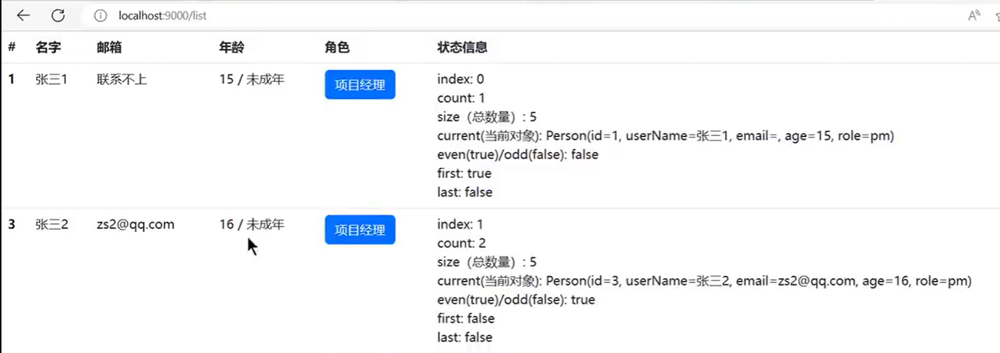
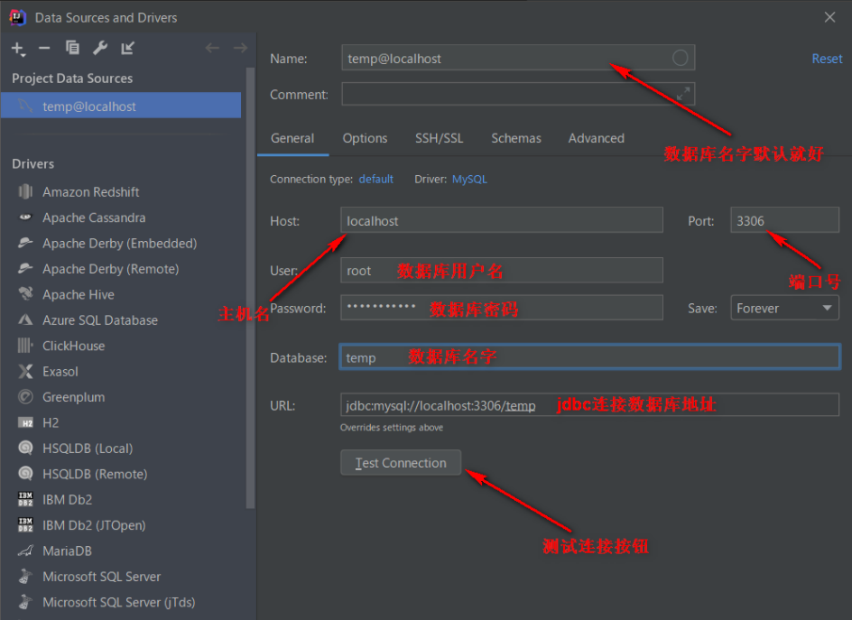
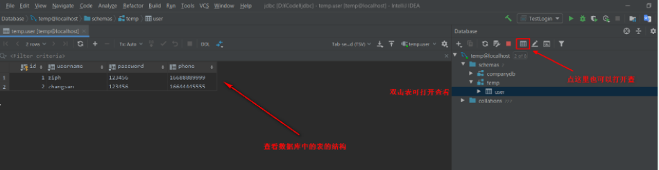
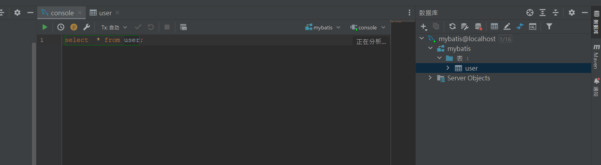

项目结构


**注意:  可能会写一个mapper包  里面写数据库操作的接口, 然后在生成Mapper接口的xml文件写sql语句**


Spring Boot中html、js、Css、图片等应该放在什么位置:

+ 

+ `注意`：这里是不要在路径中写出 [static](https://so.csdn.net/so/search?q=static&spm=1001.2101.3001.7020) 文件夹的

+ 

  ```
  由于我在template 文件夹下放置了 html 文件，所以这里的路径就是
  先用 ..  返回上一级--> 再直接Css 文件夹---> 具体的.css文件
  ```

  


# SpringBoot3-快速入门

[(79条消息) java: 错误: 无效的源发行版:17_无效的源发行版17_G666666_的博客-CSDN博客](https://blog.csdn.net/G666666_/article/details/128127980)

## 1. 环境要求

| 环境&工具          | 版本（or later） |
| ------------------ | :--------------: |
| SpringBoot         |      3.0.5+      |
| IDEA               |    2021.2.1+     |
| Java               |       17+        |
| Maven              |       3.5+       |
| Tomcat             |      10.0+       |
| Servlet            |       5.0+       |
| GraalVM Community  |      22.3+       |
| Native Build Tools |     0.9.19+      |

## 2. SpringBoot是什么

SpringBoot 帮我们简单、快速地创建一个独立的、生产级别的 **Spring 应用（说明：SpringBoot底层是Spring）**

大多数 SpringBoot 应用只需要编写少量配置即可快速整合 Spring 平台以及第三方技术

**特性：**

- 快速创建独立 Spring 应用

- - SSM：导包、写配置、启动运行

- 直接嵌入Tomcat、Jetty or Undertow（无需部署 war 包）【Servlet容器】

- - linux  java tomcat mysql： war 放到 tomcat 的 webapps下
  - jar： java环境；  java -jar

- **重点**：提供可选的starter，简化应用**整合**

- - **场景启动器**（starter）：web、json、邮件、oss（对象存储）、异步、定时任务、缓存...
  - 导包一堆，控制好版本。
  - 为每一种场景准备了一个依赖； **web-starter。mybatis-starter**

- **重点：**按需自动配置 Spring 以及 第三方库

- - 如果这些场景我要使用（生效）。这个场景的所有配置都会自动配置好。
  - **约定大于配置**：每个场景都有很多默认配置。
  - 自定义：配置文件中修改几项就可以

- 提供生产级特性：如 监控指标、健康检查、外部化配置等

- - 监控指标、健康检查（k8s）、外部化配置

- 无代码生成、**无xml**

<font color= red> 总结：简化开发，简化配置，简化整合，简化部署，简化监控，简化运维。</font>

##  3. 快速体验

场景：浏览器发送**/hello**请求，返回"**Hello,Spring Boot 3!**"

### 1. 创建项目

**Spring Initializr 自动创建向导**

一键自动创建好整个项目结构


**maven 项目(pom.xml文件)**

```xml
<!--    所有springboot项目都必须继承自 spring-boot-starter-parent -->
    <parent>
        <groupId>org.springframework.boot</groupId>
        <artifactId>spring-boot-starter-parent</artifactId>
        <version>3.0.5</version>
    </parent>
```

### 2. 导入场景

maven 项目(pom.xml文件)

==场景启动器==

```xml
    <dependencies>
<!--        web开发的场景启动器 -->
        <dependency>
            <groupId>org.springframework.boot</groupId>
            <artifactId>spring-boot-starter-web</artifactId>
        </dependency>
    </dependencies>
```

导入相关的场景，拥有相关的功能。

默认支持的所有场景：https://docs.spring.io/spring-boot/docs/current/reference/html/using.html#using.build-systems.starters

- 官方提供的场景：命名为：`spring-boot-starter-*`
- 第三方提供场景：命名为：`*-spring-boot-starter`

场景一导入，万物皆就绪

**补充(了解):**

#### 1. 依赖管理机制

思考：

1、为什么导入`starter-web`所有相关依赖都导入进来？

- 开发什么场景，导入什么**场景启动器。**
- **maven依赖传递原则。A-B-C： A就拥有B和C**
- 导入 场景启动器。 场景启动器 自动把这个场景的所有核心依赖全部导入进来

2、为什么版本号都不用写？

- 每个boot项目都有一个父项目`spring-boot-starter-parent`
- parent的父项目是`spring-boot-dependencies`
- 父项目 **版本仲裁中心**，把所有常见的jar的依赖版本都声明好了。
- 比如：`mysql-connector-j`

3、自定义版本号

- 利用maven的就近原则

- - 直接在当前项目`properties`标签中声明父项目用的版本属性的key
  - 直接在**导入依赖的时候声明版本**

4、**第三方的jar包**

- boot父项目没有管理的需要自行声明好,需要声明版本号

- ```xml
  <!-- https://mvnrepository.com/artifact/com.alibaba/druid -->
  <dependency>
      <groupId>com.alibaba</groupId>
      <artifactId>druid</artifactId>
      <version>1.2.16</version>
  </dependency>
  ```

### 3. 主程序

```java
@SpringBootApplication //这是一个SpringBoot应用
public class Boot302DemoApplication {

    public static void main(String[] args) {
        SpringApplication.run(MainApplication.class,args);
    }
}
```

### 4. 业务

```java
@RestController
public class HelloController {

    @GetMapping("/hello")  //浏览器发送hello请求
    public String hello(){

        return "Hello,Spring Boot 3!";
    }

}
```

### 5. 测试

默认启动访问： localhost:8080

### 6. 打包

```xml
<!--    SpringBoot应用打包插件-->
    <build>
        <plugins>
            <plugin>
                <groupId>org.springframework.boot</groupId>
                <artifactId>spring-boot-maven-plugin</artifactId>
            </plugin>
        </plugins>
    </build>
```

`mvn clean package`   把项目打成可执行的jar包(放在target目录中)

`java -jar demo.jar` 启动项目

修改配置（外部放一个application.properties文件）、监控、健康检查

## 4. 自动配置机制

**默认的包扫描规则**

- `@SpringBootApplication` 标注的类就是主程序类

- **SpringBoot只会扫描主程序所在的包及其下面的子包，自动的component-scan功能**

- 自定义扫描路径

  + 方法1:   @SpringBootApplication(scanBasePackages = "com.atguigu")

  - 方法2:    @ComponentScan("com.atguigu") 直接指定扫描的路径

**按需加载自动配置**

- - 导入场景`spring-boot-starter-web`
  - 场景启动器除了会导入相关功能依赖，导入一个`spring-boot-starter`，是所有`starter`的`starter`，基础核心starter
  - `spring-boot-starter`导入了一个包 `spring-boot-autoconfigure`。包里面都是各种场景的`AutoConfiguration`**自动配置类**
  - 虽然全场景的自动配置都在 `spring-boot-autoconfigure`这个包，但是不是全都开启的。

- - - 导入哪个场景就开启哪个自动配置

总结： 导入场景启动器、触发 `spring-boot-autoconfigure`这个包的自动配置生效、容器中就会具有相关场景的功能

## 5. 显示网址

```java
@Slf4j
@SpringBootApplication
public class DemoApplication {

	public static void main(String[] args) throws UnknownHostException {

		ConfigurableApplicationContext application = SpringApplication.run(DemoApplication.class, args);
		Environment env = application.getEnvironment();
		String ip = InetAddress.getLocalHost().getHostAddress();
		String port = env.getProperty("server.port");
		String path = env.getProperty("server.servlet.context-path");
		if (StringUtils.isEmpty(path)) {
			path = "";
		}
		log.info("\n----------------------------------------------------------\n\t" +
				"Application  is running! Access URLs:\n\t" +
				"Local访问网址: \t\thttp://localhost:" + port + path + "\n\t" +
				"External访问网址: \thttp://" + ip + ":" + port + path + "\n\t" +
				"----------------------------------------------------------");
		String jvmName = ManagementFactory.getRuntimeMXBean().getName();
		log.info("当前项目进程号：" + jvmName.split("@")[0]);
	}
}

```


# 注解

| 注解                   | 备注                                                         |
| ---------------------- | ------------------------------------------------------------ |
| @SpringBootApplication | 入口函数                                                     |
| @Controller            | 1.Controller +RequestMapping+GetMapping、<br/>2.引人freemarker<<br/>#   配置thymeleaf场景<br/>#   spring.thymeleaf<br/>spring.thymeleaf.prefix=classpath:templates/  <br/>spring.thymeleaf.suffix=.html<br/>#开发期间关闭，上线以后开启<br/>spring.thymeleaf.cache=falsebr/><br/>4、在application.properties中配置freemarker相关的信息<br/>5、返回的是页面<br/>6.  ==接收前端数据== |
| @RestController        | 1. 返回的是输出结果,返回对象，如json ，是==提供前端获取数据==、提交数据<br/>2. 结合 @RequestMapping、@GetMapping、@PostMapping...... |
| @RequestMapping        | 放在类上面                                                   |
| @RequestParam          | 动态参数(RequestParam  带?)                                  |
| @PathVariable          | 动态参数 (PathVariable 不带?)                                |
| @GetMapping            | 前端显示数据                                                 |
| @PutMapping            | 后端接受数据                                                 |
| @DeleteMapping         | 删除数据                                                     |

| 注解          | 备注                                                         |
| ------------- | ------------------------------------------------------------ |
| @ResponseBody | 一般在@Controller中使用: @ResponseBody+@Controller = @RestController |
| @RequestBody  | 前端发送json封装的对象给后端，后端使用java对象来接收(传递对象) |
| @CrossOrigin  | 跨域                                                         |

| 注解                 | 备注                                                         |
| -------------------- | ------------------------------------------------------------ |
| @Service             | bean注册, ==一般加在service目录里面的类上==                  |
| @Component           | bean注册, 和 Service 没有啥区别,  Component是比较通用的东西  |
| @Autowired           | //@Resource =@Autowired+@Qualifie<br> //自动加载类, 理解就是不用new<br/>//如果接口实现只有一个，那么用@Autowired就可以了，也不需要指定名字.<br/>//如果接口有多个实现,那么用@Resource，并指定name<br/>//或者使用@Autowired+@Qualifier+Qualifier的value值. |
| @Configuration+@Bean | bean注册(人为)                                               |
| @Values              | 从配置文件中取参数                                           |

其他注解:  controller --->servicer-->DAo(Mapper)【底层框架】SSM框架----->mapper. . .. . @select、@insertJPA ---

==详情见demo代码==

**@Controller:**

```java
@Slf4j
@Controller
public class ParamController {


	/**
	 * 动态参数(RequestParam  带?) + 带数据返回页面(方法2)
	 */
	@GetMapping("/param")
	public String hello(@RequestParam(value = "age",   defaultValue = "0") int age,         //required 表示可以不传值
						@RequestParam(value = "name", required = false, defaultValue = "") String name,  //访问: http://localhost:8090/data2?age=参数?name=参数
						Model model){

		//把需要给页面共享的数据放到model中
		String text = "<span style='color:red'>"+name+"</span>";
		model.addAttribute("msg",text);
		model.addAttribute("age",18);

		return "view";
	}

	/**
	 * 动态参数 (PathVariable 不带?)   ps:看路径匹配章节
	 */
	@GetMapping("/a*/b?/{p1:[a-f]+}/**")
	public String hello(HttpServletRequest request, @PathVariable("p1") String path
			, Model model) {

		model.addAttribute("msg",path);
		return "view";
	}

	/**
	 * 在@Controller中希望返回json格式
	 * @return
	 */
	@GetMapping("/ReBody")
	@ResponseBody
	public User getUser(){
		User user = new User(1000, "张四", "男" , 12);
		//log. info("使用@GetMapping + @ResponseBody");
		return user;
	}
}

```

**@RestController:**

```java
@Slf4j
@RestController   // 返回对象
@RequestMapping("/action")
public class UserActionController {


	/*
	* @Autowired   //自动加载类
	* private UserService userService;  //报错UserService接口里有多个实现类
	*/
	@Autowired
	@Qualifier("adminServiceImpl")    //首字母小写
	private UserService userService;

	/* @Resource   和 Autowired 没有啥区别,  @Resource可以指定UserServiceImpl类
	* @Resource(name = "AdminServiceImpl")
	* private UserService userService;  // ok
	*/
	@Resource(name = "UserServiceImpl")
	private UserService userService1;  // ok


	@GetMapping("/show")
	public User show(){
		return userService.show();
	}

	@GetMapping("/{id}")
	public User get(@PathVariable("id") int id){
		return userService.get(id);
	}


	/*
	 * 新增数据
	 * 假设前端发送数据  前端发过来的数据用RequestBody修饰
	 */
	@PostMapping
	public User addUser(@RequestBody User user){
		return user;
	}


	@Value("${robot.name}")
	private String naem;    // name ={robot.name}


}

```

**@Configuration+@Bean  :**  

```java
package com.example.demo.confiq;

import com.example.demo.service.UserService;
import com.example.demo.service.impl.AdminServiceImpl;
import com.example.demo.service.impl.UserServiceImpl;
import org.springframework.context.annotation.Bean;
import org.springframework.context.annotation.Configuration;
import org.springframework.http.CacheControl;
import org.springframework.http.converter.HttpMessageConverter;
import org.springframework.web.servlet.config.annotation.InterceptorRegistry;
import org.springframework.web.servlet.config.annotation.ResourceHandlerRegistry;
import org.springframework.web.servlet.config.annotation.WebMvcConfigurer;

import java.util.List;
import java.util.concurrent.TimeUnit;

//@EnableWebMvc //禁用boot的默认配置
@Configuration //这是一个配置类,给容器中放一个 WebMvcConfigurer 组件，就能自定义底层
public class MyConfig  /*implements WebMvcConfigurer*/ {
	@Bean
	public WebMvcConfigurer webMvcConfigurer() {
		return new WebMvcConfigurer() {
			@Override //配置静态资源
			public void addResourceHandlers(ResourceHandlerRegistry registry) {
				registry.addResourceHandler("/static/**")
						.addResourceLocations("classpath:/a/", "classpath:/b/")
						.setCacheControl(CacheControl.maxAge(1180, TimeUnit.SECONDS));
			}

			@Override //配置拦截器
			public void addInterceptors(InterceptorRegistry registry) {

			}
		};
	}


	/*
	* 人为加注解
	* */
	@Bean("adminServiceImpl")
	public UserService AdminServiceImpl(){
		return  new AdminServiceImpl();
	}

	@Bean
	public UserService UserServiceImpl (){
		return  new UserServiceImpl();
	}
}


```


## 01-组件注册

### @Configuration 和  @Bean

@Configuration：声明这个类是一个配置类，加入ioc容器中。

@Bean：注册组件。默认的beanId是函数名，可以用value属性进行指定。

```java
@Configuration
public class MyConfig {

    @Bean
    public Person person() {
        return new Person("ZhangSan", 10);
    }
}
```

加载配置类：

```java
AnnotationConfigApplicationContext applicationContext = new AnnotationConfigApplicationContext(MyConfig.class);

Person person = applicationContext.getBean(Person.class);
System.out.println(person);

String[] names = applicationContext.getBeanNamesForType(Person.class);
Arrays.asList(names).forEach(System.out::println);
```

### @ComponentScan 和 @ComponentScans

包扫描，扫描包下面的`@Controller`、`@Service`等组件类

[@ComponentScan ]() 

-  value 

要扫描的包，等同于`basePackages`

-  basePackages 

同`value`

-  includeFilters 

指定只包含的组件

属性值是一个`@Filter`数组

-  excludeFilters 

指定排除的组件。

属性值是一个`@Filter`数组

示例:

扫描`com.study`包下的组件，排除`@Controller`、`@Service`注解的类

```java
@Configuration
@ComponentScan(value = "com.study", 
               excludeFilters = {@ComponentScan.Filter(type = FilterType.ANNOTATION, classes = {Controller.class, Service.class})
})
public class MyConfig {

    @Bean
    public Person person() {
        return new Person("ZhangSan", 10);
    }
}
```

示例2：

扫描`com.study`包下的组件, 只包含`@Controller`、`@Service`注解的类。（需要先禁用默认的过滤规则`useDefaultFilters=false`，因为默认的过滤规则是全部扫描）

```java
@Configuration
@ComponentScan(value = "com.study",
        useDefaultFilters = false,
        includeFilters = {@ComponentScan.Filter(type = FilterType.ANNOTATION, classes = {Controller.class, Service.class})
})
public class MyConfig {

    @Bean
    public Person person() {
        return new Person("ZhangSan", 10);
    }
}
```

### @ComponentScan.Filter 

==配置包扫描的过滤规则==

```
@Filter
```

-  type 

要排除的方式:`FilterType`。

- Annotation：按照注解

- Assignable_type：按照给定的类

- AspectJ：使用AspectJ表达式

- Regex：使用正则表达式

- Custom：使用自定义规则，该规则必须是`TypeFilter`的实现类

-  value 

要排除的类型，同`classes`

-  classes 

同`value`

-  pattern 

正则表达式


自定义`TypeFilter`规则：

+ MetadataReader：读取到的当前正在扫描的类的信息
+ MetadataReaderFactory：可以获取到其他任何类的信息

```java
public class MyTypeFilter implements TypeFilter {

    @Override
    public boolean match(MetadataReader metadataReader, MetadataReaderFactory metadataReaderFactory) throws IOException {
        // 获取当前正在扫描类的注解信息
        AnnotationMetadata annotationMetadata = metadataReader.getAnnotationMetadata();
        // 获取当前正在扫描的类的类信息
        ClassMetadata classMetadata = metadataReader.getClassMetadata();
        // 获取当前的资源信息
        metadataReader.getResource();

        String className = classMetadata.getClassName();

        return "com.study.book.dao.BookDao".equals(className);
    }
}
```

配置：

```java
@Configuration
@ComponentScan(value = "com.study",
        useDefaultFilters = false,
        includeFilters = {
                @ComponentScan.Filter(type = FilterType.CUSTOM, classes = {MyTypeFilter.class})
        })
public class MyConfig {
    // ...
}
```

### @Scope

调整作用域。

+  value 

取值：

- ConfigurableBeanFactory.SCOPE_SINGLETON ： "singleton"，单实例（默认值），ioc容器启动就会调用方法创建对象到ioc容器中。

- ConfigurableBeanFactory.SCOPE_PROTOTYPE ： "prototype"，多实例，ioc容器启动时并不会调用方法创建对象，每次获取时才会调用方法创建对象。

- WebApplicationContext.SCOPE_REQUEST："request"，同一个请求创建一个实例

- WebApplicationContext.SCOPE_SESSION："session"，同一个session创建一个实例


-  scopeName 

同'value'

 


例如：

```java
@Bean
@Scope
public Person person() {
    return new Person("ZhangSan", 10);
}
```

### [@Lazy ]()

针对单实例的Bean。

单实例Bean默认在容器启动时创建对象。懒加载在第一次使用Bean时才创建对象并初始化。

例如：

```java
@Bean
@Lazy
public Person person() {
    System.out.println("方法调用了。");
    return new Person("ZhangSan", 10);
}
```


[01-组件注册 (yuque.com)](https://www.yuque.com/tmfl/spring/raspye#91320b51)

## 1. 常用注解

1、@SpringBootApplication

这是 Spring Boot 最最最核心的注解，用在 Spring Boot 主类上，标识这是一个 Spring Boot 应用，用来开启 Spring Boot 的各项能力。

其实这个注解就是 @SpringBootConfiguration、@EnableAutoConfiguration、@ComponentScan 这三个注解的组合，也可以用这三个注解来代替 @SpringBootApplication 注解。

2、@EnableAutoConfiguration

允许 Spring Boot 自动配置注解，开启这个注解之后，Spring Boot 就能根据当前类路径下的包或者类来配置 Spring Bean。

如：当前类路径下有 Mybatis 这个 JAR 包，MybatisAutoConfiguration 注解就能根据相关参数来配置 Mybatis 的各个 Spring Bean。

3、@[Configuration](https://so.csdn.net/so/search?q=Configuration&spm=1001.2101.3001.7020)

这是 Spring 3.0 添加的一个注解，用来代替 applicationContext.xml 配置文件，所有这个配置文件里面能做到的事情都可以通过这个注解所在类来进行注册。

4、@SpringBootConfiguration

这个注解就是 @Configuration 注解的变体，只是用来修饰是 Spring Boot 配置而已，或者可利于 Spring Boot 后续的扩展。

5、@ComponentScan

这是 Spring 3.1 添加的一个注解，用来代替配置文件中的 [component](https://so.csdn.net/so/search?q=component&spm=1001.2101.3001.7020)-scan 配置，开启组件扫描，即自动扫描包路径下的 @Component 注解进行注册 bean 实例到 context 中。

6、@Conditional

这是 Spring 4.0 添加的新注解，用来标识一个 Spring Bean 或者 Configuration 配置文件，当满足指定的条件才开启配置。

7、@ConditionalOnBean

组合 @Conditional 注解，当容器中有指定的 Bean 才开启配置。

8、@ConditionalOnMissingBean

组合 @Conditional 注解，和 @ConditionalOnBean 注解相反，当容器中没有指定的 Bean 才开启配置。

9、@ConditionalOnClass

组合 @Conditional 注解，当容器中有指定的 Class 才开启配置。

10、@ConditionalOnMissingClass

组合 @Conditional 注解，和 @ConditionalOnMissingClass 注解相反，当容器中没有指定的 Class 才开启配置。

11、@ConditionalOnWebApplication

组合 @Conditional 注解，当前项目类型是 WEB 项目才开启配置。

12、@ConditionalOnNotWebApplication

组合 @Conditional 注解，和 @ConditionalOnWebApplication 注解相反，当前项目类型不是 WEB 项目才开启配置。

13、@ConditionalOnProperty

组合 @Conditional 注解，当指定的属性有指定的值时才开启配置。

14、@ConditionalOnExpression

组合 @Conditional 注解，当 SpEL 表达式为 true 时才开启配置。

15、@ConditionalOnJava

组合 @Conditional 注解，当运行的 Java JVM 在指定的版本范围时才开启配置。

16、@ConditionalOnResource

组合 @Conditional 注解，当类路径下有指定的资源才开启配置。

17、@ConditionalOnJndi

组合 @Conditional 注解，当指定的 JNDI 存在时才开启配置。

18、@ConditionalOnCloudPlatform

组合 @Conditional 注解，当指定的云平台激活时才开启配置。

19、@ConditionalOnSingleCandidate

组合 @Conditional 注解，当指定的 class 在容器中只有一个 Bean，或者同时有多个但为首选时才开启配置。

20、@ConfigurationProperties

用来加载额外的配置（如 .properties 文件），可用在 @Configuration 注解类，或者 @Bean 注解方法上面。

关于这个注解的用法可以参考《
Spring Boot读取配置的几种方式》这篇文章。

21、@EnableConfigurationProperties

一般要配合 @ConfigurationProperties 注解使用，用来开启对 @ConfigurationProperties 注解配置 Bean 的支持。

22、@AutoConfigureAfter

用在自动配置类上面，表示该自动配置类需要在另外指定的自动配置类配置完之后。

如 Mybatis 的自动配置类，需要在数据源自动配置类之后。

@AutoConfigureAfter(DataSourceAutoConfiguration.class)
public class MybatisAutoConfiguration {
23、@AutoConfigureBefore

这个和 @AutoConfigureAfter 注解使用相反，表示该自动配置类需要在另外指定的自动配置类配置之前。

24、@Import

这是 Spring 3.0 添加的新注解，用来导入一个或者多个 @Configuration 注解修饰的类，这在 Spring Boot 里面应用很多。

25、@ImportResource

这是 Spring 3.0 添加的新注解，用来导入一个或者多个 Spring 配置文件，这对 Spring Boot 兼容老项目非常有用，因为有些配置无法通过 Java Config 的形式来配置就只能用这个注解来导入。

SpringBoot摒弃XML配置方式，改为**全注解驱动**

### 1. 组件注册

demo3

```
@Configuration**、**@SpringBootConfiguration**

**@Bean**、**@Scope**

**@Controller、 @Service、@Repository、@Component**

**@Import**

@ComponentScan
```

**步骤：**

**1、@Configuration 编写一个配置类**

**2、在配置类中，自定义方法给容器中注册组件。配合@Bean**

**3、或使用@Import 导入第三方的组件**

```
package com.atguigu.boot.config;

//import com.alibaba.druid.FastsqlException;
import com.alibaba.druid.FastsqlException;
import com.atguigu.boot.bean.Pig;
import com.atguigu.boot.bean.Sheep;
import com.atguigu.boot.bean.User;
import org.springframework.boot.SpringBootConfiguration;
import org.springframework.boot.context.properties.ConfigurationProperties;
import org.springframework.boot.context.properties.EnableConfigurationProperties;
import org.springframework.context.annotation.*;

//@Import(FastsqlException.class) //给容器中放指定类型的组件，组件的名字默认是全类名

/**
 * 1、开启Sheep组件的属性绑定
 * 2、默认会把这个组件自己放到容器中
 */
@EnableConfigurationProperties(Sheep.class) //导入第三方写好的组件进行属性绑定
//SpringBoot默认只扫描自己主程序所在的包。如果导入第三方包，即使组件上标注了 @Component、@ConfigurationProperties 注解，也没用。因为组件都扫描不进来
@SpringBootConfiguration //这是一个配置类，替代以前的配置文件。配置类本身也是容器中的组件
//@Configuration
public class AppConfig {


    @Bean
    @ConfigurationProperties(prefix = "pig")
    public Pig pig(){
        return new Pig(); //我们自己new新pig
    }
    /**
     * 1、组件默认是单实例的
     * @return
     */
    @Scope("prototype")
    @Bean("userHaha") //替代以前的Bean标签。 组件在容器中的名字默认是方法名，可以直接修改注解的值
    public User user01(){
        var user = new User();
        user.setId(1L);
        user.setName("张三");
        return user;
    }

//    @Bean
//    public FastsqlException fastsqlException(){
//
//        return new FastsqlException();
//    }

}
```


### 2. 条件注解

如果注解指定的**条件成立**，则触发指定行为

***@ConditionalOnXxx***

**@ConditionalOnClass：如果类路径中存在这个类，则触发指定行为**

**@ConditionalOnMissingClass：如果类路径中不存在这个类，则触发指定行为**

**@ConditionalOnBean：如果容器中存在这个Bean（组件），则触发指定行为**

**@ConditionalOnMissingBean：如果容器中不存在这个Bean（组件），则触发指定行为**

场景：

- 如果存在`FastsqlException`这个类，给容器中放一个`Cat`组件，名cat01，
- 否则，就给容器中放一个`Dog`组件，名dog01
- 如果系统中有`dog01`这个组件，就给容器中放一个 User组件，名zhangsan 
- 否则，就放一个User，名叫lisi

```

```


**@ConditionalOnBean（value=组件类型，name=组件名字）：判断容器中是否有这个类型的组件，并且名字是指定的值**

@ConditionalOnRepositoryType (org.springframework.boot.autoconfigure.data)
@ConditionalOnDefaultWebSecurity (org.springframework.boot.autoconfigure.security)
@ConditionalOnSingleCandidate (org.springframework.boot.autoconfigure.condition)
@ConditionalOnWebApplication (org.springframework.boot.autoconfigure.condition)
@ConditionalOnWarDeployment (org.springframework.boot.autoconfigure.condition)
@ConditionalOnJndi (org.springframework.boot.autoconfigure.condition)
@ConditionalOnResource (org.springframework.boot.autoconfigure.condition)
@ConditionalOnExpression (org.springframework.boot.autoconfigure.condition)
**@ConditionalOnClass** (org.springframework.boot.autoconfigure.condition)
@ConditionalOnEnabledResourceChain (org.springframework.boot.autoconfigure.web)
**@ConditionalOnMissingClass** (org.springframework.boot.autoconfigure.condition)
@ConditionalOnNotWebApplication (org.springframework.boot.autoconfigure.condition)
@ConditionalOnProperty (org.springframework.boot.autoconfigure.condition)
@ConditionalOnCloudPlatform (org.springframework.boot.autoconfigure.condition)
**@ConditionalOnBean** (org.springframework.boot.autoconfigure.condition)
**@ConditionalOnMissingBean** (org.springframework.boot.autoconfigure.condition)
@ConditionalOnMissingFilterBean (org.springframework.boot.autoconfigure.web.servlet)
@Profile (org.springframework.context.annotation)
@ConditionalOnInitializedRestarter (org.springframework.boot.devtools.restart)
@ConditionalOnGraphQlSchema (org.springframework.boot.autoconfigure.graphql)
@ConditionalOnJava (org.springframework.boot.autoconfigure.condition)

### 3. 属性绑定

**@ConfigurationProperties： 声明组件的属性和配置文件哪些前缀开始项进行绑定**

**@EnableConfigurationProperties：快速注册注解：**

- **场景：**SpringBoot默认只扫描自己主程序所在的包。如果**导入第三方包**，即使组件上标注了 @Component、@ConfigurationProperties 注解，也没用。因为组件都扫描不进来，此时使用这个注解就可以快速进行属性绑定并把组件注册进容器

将容器中任意**组件（Bean）的属性值**和**配置文件**的配置项的值**进行绑定**

- **1、给容器中注册组件（@Component、或者@Bean）**
- **2、使用@ConfigurationProperties 声明组件和配置文件的哪些配置项进行绑定**


更多注解参照：[Spring注解驱动开发](https://www.bilibili.com/video/BV1gW411W7wy)【1-26集】

# YAML配置文件

**痛点**：SpringBoot 集中化管理配置，`application.properties`

**问题**：配置多以后难阅读和修改，**层级结构辨识度不高**


YAML 是 "YAML Ain't a Markup Language"（YAML 不是一种标记语言）。在开发的这种语言时，YAML 的意思其实是："Yet Another Markup Language"（是另一种标记语言）。

- 设计目标，就是**方便人类读写**
- **层次分明**，更适合做配置文件
- 使用`.yaml`或 `.yml`作为文件后缀

## 1. 基本语法

- **大小写敏感**
- 使用**缩进表示层级关系，k: v，使用空格分割k,v(相当于等于)**
- 缩进时不允许使用Tab键，只允许**使用空格**。换行
- 缩进的空格数目不重要，只要**相同层级**的元素**左侧对齐**即可
- **# 表示注释**，从这个字符一直到行尾，都会被解析器忽略。


支持的写法：

- **对象**：**键值对**的集合，如：映射（map）/ 哈希（hash） / 字典（dictionary）
- **数组**：一组按次序排列的值，如：序列（sequence） / 列表（list）
- **纯量**：单个的、不可再分的值，如：字符串、数字、bool、日期

示例. 

~~~java
@Component
@ConfigurationProperties(prefix = "person") //和配置文件person前缀的所有配置进行绑定
@Data //自动生成JavaBean属性的getter/setter
public class Person {
    private String name;
    private Integer age;
    private Date birthDay;
    private Boolean like;
    private Child child; //嵌套对象
    private List<Dog> dogs; //数组（里面是对象）
    private Map<String,Cat> cats; //表示Map
}

@Data
public class Dog {
    private String name;
    private Integer age;
}

@Data
public class Child {
    private String name;
    private Integer age;
    private Date birthDay;
    private List<String> text; //数组
}

@Data
public class Cat {
    private String name;
    private Integer age;
}
~~~

**properties表示法**

```Properties
person.name=张三
person.age=18
person.birthDay=2010/10/12 12:12:12
person.like=true
person.child.name=李四
person.child.age=12
person.child.birthDay=2018/10/12
person.child.text[0]=abc
person.child.text[1]=def
person.dogs[0].name=小黑
person.dogs[0].age=3
person.dogs[1].name=小白
person.dogs[1].age=2
person.cats.c1.name=小蓝
person.cats.c1.age=3
person.cats.c2.name=小灰
person.cats.c2.age=2
```

**yaml表示法**

```yaml
person:
  name: 张三
  age: 18
  birth-day: 2010/10/10 12:12:12
  like: true
  child:
    name: 李四
    age: 20
    birthDay: 2018/10/10
    text: ["abc","def"]
  dogs:
    - name: 小黑
      age: 3
    - name: 小白
      age: 2
  cats:
    c1:
      name: 小蓝
      age: 3
    c2: {name: 小绿,age: 2} #对象也可用{}表示
```

## 3. 细节

- birthDay 推荐写为 birth-day
- **文本**：

- - **单引号**不会转义【\n 则为普通字符串显示】
  - **双引号**会转义【\n会显示为**换行符**】

- **大文本**

- - `|`开头，大文本写在下层，**保留文本格式**，**换行符正确显示**
  - `>`开头，大文本写在下层，折叠换行符,变成空格

- **多文档合并**

- - 使用`---`可以==把多个yaml文档合并在一个文档中==，每个文档区依然认为内容独立

## 4. 小技巧：lombok

简化JavaBean 开发。自动生成构造器、getter/setter、自动生成Builder模式等

```java
<dependency>
    <groupId>org.projectlombok</groupId>
    <artifactId>lombok</artifactId>
    <scope>compile</scope>
</dependency>
```

使用

```java
@Data //自动生成JavaBean属性的getter/setter
@NoArgsConstructor //自动生成无参构造器
@AllArgsConstructor //自动生成全参构造器
```

#  日志配置


规范：项目开发不要编写`System.out.println()`，应该用**日志**记录信息


## 1.  简介

1. Spring使用commons-logging作为内部日志，但底层日志实现是开放的。可对接其他日志框架。

1. 1. spring5及以后 commons-logging被spring直接自己写了。

1. 支持 jul，log4j2,logback。SpringBoot 提供了默认的控制台输出配置，也可以配置输出为文件。
2. logback是默认使用的。
3. 虽然**日志框架很多**，但是我们不用担心，使用 SpringBoot 的**默认配置就能工作的很好**。


**SpringBoot怎么把日志默认配置好的**

1、每个`starter`场景，都会导入一个核心场景`spring-boot-starter`

2、核心场景引入了日志的所用功能`spring-boot-starter-logging`

3、默认使用了`logback + slf4j` 组合作为默认底层日志

4、`日志是系统一启动就要用`，`xxxAutoConfiguration`是系统启动好了以后放好的组件，后来用的。

5、日志是利用**监听器机制**配置好的。`ApplicationListener`。

6、日志所有的配置都可以通过修改配置文件实现。以`logging`开始的所有配置。

## 2. 日志格式

```shell
2023-03-31T13:56:17.511+08:00  INFO 4944 --- [           main] o.apache.catalina.core.StandardService   : Starting service [Tomcat]
2023-03-31T13:56:17.511+08:00  INFO 4944 --- [           main] o.apache.catalina.core.StandardEngine    : Starting Servlet engine: [Apache Tomcat/10.1.7]
```

默认输出格式：

- 时间和日期：毫秒级精度
- 日志级别：ERROR, WARN, INFO, DEBUG, or TRACE.
- 进程 ID
- ---： 消息分割符
- 线程名： 使用[]包含
- Logger 名： 通常是产生日志的**类名**
- 消息： 日志记录的内容

注意： logback 没有FATAL级别，对应的是ERROR

默认值：参照：`spring-boot`包`additional-spring-configuration-metadata.json`文件

默认输出格式值：`%clr(%d{${LOG_DATEFORMAT_PATTERN:-yyyy-MM-dd'T'HH:mm:ss.SSSXXX}}){faint} %clr(${LOG_LEVEL_PATTERN:-%5p}) %clr(${PID:- }){magenta} %clr(---){faint} %clr([%15.15t]){faint} %clr(%-40.40logger{39}){cyan} %clr(:){faint} %m%n${LOG_EXCEPTION_CONVERSION_WORD:-%wEx}`

```
可修改为：`'%d{yyyy-MM-dd HH:mm:ss.SSS} %-5level [%thread] %logger{15} ===> %msg%n'`
```


## 3. 记录日志

```java
Logger logger = LoggerFactory.getLogger(getClass());

或者使用Lombok的@Slf4j注解
```

```java
@Slf4j
@RestController
public class HelloController {
//    Logger logger = LoggerFactory.getLogger(getClass());

    @GetMapping("/h/**")
    public String hello(String a,String b){

        for (int i = 0; i < 1000; i++) {
            log.trace("trace 日志.....");
            log.debug("debug 日志.....");
            //SpringBoot底层默认的日志级别 info
            log.info("info 日志..... 参数a:{} b:{}",a,b);
            log.warn("warn 日志...");
            log.error("error 日志...");
        }
        return "hello";
    }
}
```

## 4. 日志级别

- 由低到高：`ALL,TRACE, DEBUG, INFO, WARN, ERROR,FATAL,OFF`；

- - **只会打印指定级别及以上级别的日志**
  - ALL：打印所有日志
  - TRACE：追踪框架详细流程日志，一般不使用
  - DEBUG：开发调试细节日志
  - INFO：关键、感兴趣信息日志
  - WARN：警告但不是错误的信息日志，比如：版本过时
  - ERROR：业务错误日志，比如出现各种异常
  - FATAL：致命错误日志，比如jvm系统崩溃
  - OFF：关闭所有日志记录

- 不指定级别的所有类，都使用root指定的级别作为默认级别
- SpringBoot日志**默认级别是** **INFO**

1. 在application.properties/yaml中配置logging.level.<logger-name>=<level>指定日志级别

   

2. level可取值范围：`TRACE, DEBUG, INFO, WARN, ERROR, FATAL, or OFF`，定义在 `LogLevel`类中

3. root 的logger-name叫root，可以配置logging.level.root=warn，代表所有未指定日志级别都使用 root 的 warn 级别


## 5. 日志分组

比较有用的技巧是：

将相关的logger分组在一起，统一配置。SpringBoot 也支持。比如：Tomcat 相关的日志统一设置

在application.properties/yaml中配置:

 #把这些包org.apache.catalina,org.apache.coyote,org.apache.tomca分成tomcat组:

```java
logging.group.tomcat=org.apache.catalina,org.apache.coyote,org.apache.tomcat 
logging.level.tomcat=trace
```

SpringBoot 预定义两个组

| Name | Loggers                                                      |
| ---- | ------------------------------------------------------------ |
| web  | org.springframework.core.codec, org.springframework.http, org.springframework.web, org.springframework.boot.actuate.endpoint.web, org.springframework.boot.web.servlet.ServletContextInitializerBeans |
| sql  | org.springframework.jdbc.core, org.hibernate.SQL, org.jooq.tools.LoggerListener |

## 6. 文件输出

SpringBoot 默认只把日志写在控制台，如果想额外记录到文件，可以在application.properties中添加logging.file.name or logging.file.path配置项。

| logging.file.name | logging.file.path | 示例     | 效果                             |
| ----------------- | ----------------- | -------- | -------------------------------- |
| 未指定            | 未指定            |          | 仅控制台输出                     |
| **指定**          | 未指定            | my.log   | 写入指定文件。可以加路径         |
| 未指定            | **指定**          | /var/log | 写入指定目录，文件名为spring.log |
| **指定**          | **指定**          |          | 以logging.file.name为准          |


## 7. 文件归档与滚动切割

归档：每天的日志单独存到一个文档中。

切割：每个文件10MB，超过大小切割成另外一个文件。

1. 每天的日志应该独立分割出来存档。如果使用logback（SpringBoot 默认整合），可以通过application.properties/yaml文件指定日志滚动规则。
2. 如果是其他日志系统，需要自行配置（添加log4j2.xml或log4j2-spring.xml）
3. 支持的滚动规则设置如下

| 配置项                                               | 描述                                                         |
| ---------------------------------------------------- | ------------------------------------------------------------ |
| logging.logback.rollingpolicy.file-name-pattern      | 日志存档的文件名格式（默认值：${LOG_FILE}.%d{yyyy-MM-dd}.%i.gz） |
| logging.logback.rollingpolicy.clean-history-on-start | 应用启动时是否清除以前存档（默认值：false）                  |
| logging.logback.rollingpolicy.max-file-size          | 存档前，每个日志文件的最大大小（默认值：10MB）               |
| logging.logback.rollingpolicy.total-size-cap         | 日志文件被删除之前，可以容纳的最大大小（默认值：0B）。设置1GB则磁盘存储超过 1GB 日志后就会删除旧日志文件 |
| logging.logback.rollingpolicy.max-history            | 日志文件保存的最大天数(默认值：7).                           |

```
#\u5F52\u6863\u3001\u5207\u5272
#logging.logback.rollingpolicy.file-name-pattern=${LOG_FILE}.%d{yyyy-MM-dd}.%i.gz
#logging.logback.rollingpolicy.max-file-size=1MB
```

## 8. 自定义配置

通**常我们配置 application.properties 就够了。当然也可以自定义。比如：**

| 日志系统                | 自定义                                                       |
| ----------------------- | ------------------------------------------------------------ |
| Logback                 | logback-spring.xml, logback-spring.groovy, logback.xml, or logback.groovy |
| Log4j2                  | log4j2-spring.xml or log4j2.xml                              |
| JDK (Java Util Logging) | logging.properties                                           |

如果可能，我们建议您在日志配置中使用`-spring` 变量（例如，`logback-spring.xml` 而不是 `logback.xml`）。如果您使用标准配置文件，spring 无法完全控制日志初始化。

最佳实战：自己要写配置，配置文件名加上 `xx-spring.xml`

```java
<?xml version="1.0" encoding="UTF-8"?>

<!-- 配置文件修改时重新加载，默认true -->
<configuration scan="true">

    <!--定义日志文件的存储地址 勿在 LogBack 的配置中使用相对路径-->
    <property name="CATALINA_BASE" value="logs"></property>

    <!-- 控制台输出 -->
    <appender name="CONSOLE" class="ch.qos.logback.core.ConsoleAppender">
        <encoder charset="UTF-8">
            <!-- 输出日志记录格式 -->
            <pattern>%d{yyyy-MM-dd HH:mm:ss.SSS} ==哈哈== [%thread] %-5level ==哈哈== %logger{36} - %msg%n</pattern>
        </encoder>
    </appender>

    <!-- 第一个文件输出,每天产生一个文件 -->
    <appender name="FILE1" class="ch.qos.logback.core.rolling.RollingFileAppender">
        <rollingPolicy class="ch.qos.logback.core.rolling.TimeBasedRollingPolicy">
            <!-- 输出文件路径+文件名 -->
            <fileNamePattern>${CATALINA_BASE}/aa.%d{yyyyMMdd}.log</fileNamePattern>
            <!-- 保存30天的日志 -->
            <maxHistory>30</maxHistory>
        </rollingPolicy>
        <encoder charset="UTF-8">
            <!-- 输出日志记录格式 -->
            <pattern>%d{yyyy-MM-dd HH:mm:ss.SSS} [%thread] %-5level %logger{36} - %msg%n</pattern>
        </encoder>
    </appender>

    <!-- 第二个文件输出,每天产生一个文件 -->
    <appender name="FILE2" class="ch.qos.logback.core.rolling.RollingFileAppender">
        <file>${CATALINA_BASE}/bb.log</file>
        <rollingPolicy class="ch.qos.logback.core.rolling.TimeBasedRollingPolicy">
            <fileNamePattern>${CATALINA_BASE}/bb.%d{yyyyMMdd}.log</fileNamePattern>
            <maxHistory>30</maxHistory>
        </rollingPolicy>
        <encoder charset="UTF-8">
            <pattern>%d{yyyy-MM-dd HH:mm:ss.SSS} [%thread] %-5level %logger{36} - %msg%n</pattern>
        </encoder>
    </appender>

    <appender name="CUSTOM" class="ch.qos.logback.core.rolling.RollingFileAppender">
        <file>${CATALINA_BASE}/custom.log</file>
        <rollingPolicy class="ch.qos.logback.core.rolling.TimeBasedRollingPolicy">
            <!-- daily rollover -->
            <fileNamePattern>${CATALINA_BASE}/custom.%d{yyyy-MM-dd}.log</fileNamePattern>
            <!-- keep 30 days' worth of history -->
            <maxHistory>30</maxHistory>
        </rollingPolicy>
        <encoder charset="UTF-8">
            <pattern>%d{yyyy-MM-dd HH:mm:ss.SSS} [%thread] %-5level %logger{36} - %msg%n</pattern>
        </encoder>
    </appender>

    <!-- 设置日志输出级别 -->
    <root level="ERROR">
        <appender-ref ref="CONSOLE" />
    </root>
    <logger name="file1" level="DEBUG">
        <appender-ref ref="FILE1" />
    </logger>
    <logger name="file1" level="INFO">
        <appender-ref ref="FILE2" />
    </logger>
    <!-- 自定义logger -->
    <logger name="custom" level="INFO">
        <appender-ref ref="CUSTOM" />
    </logger>
</configuration>
```

## 9. 切换日志组合

```xml
<dependency>
    <groupId>org.springframework.boot</groupId>
    <artifactId>spring-boot-starter-web</artifactId>
</dependency>
//spring-boot-starter-web中的spring-boot-starter有一个默认的日志场景
<dependency>
    <groupId>org.springframework.boot</groupId>
    <artifactId>spring-boot-starter</artifactId>
    <exclusions>  //排除
        <exclusion>
            <groupId>org.springframework.boot</groupId>
            <artifactId>spring-boot-starter-logging</artifactId>
        </exclusion>
    </exclusions>
</dependency>
<dependency>
    <groupId>org.springframework.boot</groupId>
    <artifactId>spring-boot-starter-log4j2</artifactId>
</dependency>
```

1. **业务中使用slf4j-api记录日志。不要再 sout 了**
2. 导入任何第三方框架，先排除它的日志包，因为Boot底层控制好了日志

1. 修改 `application.properties` 配置文件，就可以调整日志的所有行为。(如果不够，可以编写日志框架自己的配置文件放在类路径下就行，比如`logback-spring.xml`，`log4j2-spring.xml`)
2. 如需对接**专业日志系统**，也只需要把 logback 记录的**日志**灌倒 **kafka**之类的中间件，这和SpringBoot没关系，都是日志框架自己的配置，**修改配置文件即可**

**再加上自定义配置**

```xml
<?xml version="1.0" encoding="UTF-8"?>
<!--日志级别以及优先级排序: OFF > FATAL > ERROR > WARN > INFO > DEBUG > TRACE > ALL -->
<!--Configuration后面的status，这个用于设置log4j2自身内部的信息输出，可以不设置，当设置成trace时，你会看到log4j2内部各种详细输出-->
<!--monitorInterval：Log4j能够自动检测修改配置 文件和重新配置本身，设置间隔秒数-->
<configuration status="WARN" monitorInterval="30">
    <!--先定义所有的appender-->
    <appenders>
        <!--这个输出控制台的配置-->
        <console name="Console" target="SYSTEM_OUT">
            <!--输出日志的格式-->
            <PatternLayout pattern="[%d{HH:mm:ss:SSS}] [%p] ====- %l - %m%n"/>
        </console>
        <!--文件会打印出所有信息，这个log每次运行程序会自动清空，由append属性决定，这个也挺有用的，适合临时测试用-->
        <File name="log" fileName="log/test.log" append="false">
            <PatternLayout pattern="%d{HH:mm:ss.SSS} %-5level %class{36} %L %M - %msg%xEx%n"/>
        </File>
        <!-- 这个会打印出所有的info及以下级别的信息，每次大小超过size，则这size大小的日志会自动存入按年份-月份建立的文件夹下面并进行压缩，作为存档-->
        <RollingFile name="RollingFileInfo" fileName="${sys:user.home}/logs/info.log"
                     filePattern="${sys:user.home}/logs/$${date:yyyy-MM}/info-%d{yyyy-MM-dd}-%i.log">
            <!--控制台只输出level及以上级别的信息（onMatch），其他的直接拒绝（onMismatch）-->
            <ThresholdFilter level="info" onMatch="ACCEPT" onMismatch="DENY"/>
            <PatternLayout pattern="[%d{HH:mm:ss:SSS}] [%p] - %l - %m%n"/>
            <Policies>
                <TimeBasedTriggeringPolicy/>
                <SizeBasedTriggeringPolicy size="100 MB"/>
            </Policies>
        </RollingFile>
        <RollingFile name="RollingFileWarn" fileName="${sys:user.home}/logs/warn.log"
                     filePattern="${sys:user.home}/logs/$${date:yyyy-MM}/warn-%d{yyyy-MM-dd}-%i.log">
            <ThresholdFilter level="warn" onMatch="ACCEPT" onMismatch="DENY"/>
            <PatternLayout pattern="[%d{HH:mm:ss:SSS}] [%p] - %l - %m%n"/>
            <Policies>
                <TimeBasedTriggeringPolicy/>
                <SizeBasedTriggeringPolicy size="100 MB"/>
            </Policies>
            <!-- DefaultRolloverStrategy属性如不设置，则默认为最多同一文件夹下7个文件，这里设置了20 -->
            <DefaultRolloverStrategy max="20"/>
        </RollingFile>
        <RollingFile name="RollingFileError" fileName="${sys:user.home}/logs/error.log"
                     filePattern="${sys:user.home}/logs/$${date:yyyy-MM}/error-%d{yyyy-MM-dd}-%i.log">
            <ThresholdFilter level="error" onMatch="ACCEPT" onMismatch="DENY"/>
            <PatternLayout pattern="[%d{HH:mm:ss:SSS}] [%p] - %l - %m%n"/>
            <Policies>
                <TimeBasedTriggeringPolicy/>
                <SizeBasedTriggeringPolicy size="100 MB"/>
            </Policies>
        </RollingFile>
    </appenders>
    <!--然后定义logger，只有定义了logger并引入的appender，appender才会生效-->
    <loggers>
        <!--过滤掉spring和mybatis的一些无用的DEBUG信息-->
        <logger name="org.springframework" level="INFO"></logger>
        <logger name="org.mybatis" level="INFO"></logger>
        <root level="all">
            <appender-ref ref="Console"/>
            <appender-ref ref="RollingFileInfo"/>
            <appender-ref ref="RollingFileWarn"/>
            <appender-ref ref="RollingFileError"/>
        </root>
    </loggers>
</configuration>
```


# 0. WebMvcAutoConfiguration原理

## 1. 生效条件

```java
@AutoConfiguration(after = { DispatcherServletAutoConfiguration.class, TaskExecutionAutoConfiguration.class,
		ValidationAutoConfiguration.class }) //在这些自动配置之后
@ConditionalOnWebApplication(type = Type.SERVLET) //如果是web应用就生效，类型SERVLET、REACTIVE 响应式web
@ConditionalOnClass({ Servlet.class, DispatcherServlet.class, WebMvcConfigurer.class })
@ConditionalOnMissingBean(WebMvcConfigurationSupport.class) //容器中没有这个Bean，才生效。默认就是没有
@AutoConfigureOrder(Ordered.HIGHEST_PRECEDENCE + 10)//优先级
@ImportRuntimeHints(WebResourcesRuntimeHints.class)
public class WebMvcAutoConfiguration { 
}
```


## 2. 效果

1. 放了两个Filter：

1. 1.  `HiddenHttpMethodFilter`；页面表单提交Rest请求（GET、POST、PUT、DELETE）
   2. `FormContentFilter`： 表单内容Filter，GET（数据放URL后面）、POST（数据放请求体）请求可以携带数据，PUT、DELETE 的请求体数据会被忽略

1. 给容器中放了`WebMvcConfigurer`组件；给SpringMVC添加各种定制功能

1. 1. 所有的功能最终会和配置文件进行绑定
   2. WebMvcProperties： `spring.mvc`配置文件
   3. WebProperties： `spring.web`配置文件

```java
	@Configuration(proxyBeanMethods = false)
	@Import(EnableWebMvcConfiguration.class) //额外导入了其他配置
	@EnableConfigurationProperties({ WebMvcProperties.class, WebProperties.class })
	@Order(0)
	public static class WebMvcAutoConfigurationAdapter implements WebMvcConfigurer, ServletContextAware{
        
    }
```


## 3. WebMvcConfigurer接口

提供了配置SpringMVC底层的所有组件入口


##  4. addResourceHandlers源码

**静态资源规则**

```java
@Override
public void addResourceHandlers(ResourceHandlerRegistry registry) {
    if (!this.resourceProperties.isAddMappings()) {
        logger.debug("Default resource handling disabled");
        return;
    }
    //1、
    addResourceHandler(registry, this.mvcProperties.getWebjarsPathPattern(),
            "classpath:/META-INF/resources/webjars/");
    addResourceHandler(registry, this.mvcProperties.getStaticPathPattern(), (registration) -> {
        registration.addResourceLocations(this.resourceProperties.getStaticLocations());
        if (this.servletContext != null) {
            ServletContextResource resource = new ServletContextResource(this.servletContext, SERVLET_LOCATION);
            registration.addResourceLocations(resource);
        }
    });
}
```

1. 规则一：访问： `/webjars/**`路径就去 `classpath:/META-INF/resources/webjars/`下找资源.

1. 1. maven 导入依赖

1. 规则二：访问： `/**`路径就去 `静态资源默认的四个位置找资源`

1. 1. `classpath:/META-INF/resources/`
   2. `classpath:/resources/`
   3. `classpath:/static/`
   4. `classpath:/public/`

1. 规则三：**静态资源默认都有缓存规则的设置**

1. 1. 所有缓存的设置，直接通过**配置文件**： `spring.web`
   2. cachePeriod： 缓存周期； 多久不用找服务器要新的。 默认没有，以s为单位
   3. cacheControl： **HTTP缓存**控制；[https://developer.mozilla.org/zh-CN/docs/Web/HTTP/Caching](https://developer.mozilla.org/zh-CN/docs/Web/HTTP/Caching#概览)
   4. **useLastModified**：是否使用最后一次修改。配合HTTP Cache规则

如果浏览器访问了一个静态资源 `index.js`，如果服务这个资源没有发生变化，下次访问的时候就可以直接让浏览器用自己缓存中的东西，而不用给服务器发请求。

```java
registration.setCachePeriod(getSeconds(this.resourceProperties.getCache().getPeriod()));
registration.setCacheControl(this.resourceProperties.getCache().getCachecontrol().toHttpCacheControl());
registration.setUseLastModified(this.resourceProperties.getCache().isUseLastModified());
```


## 5. EnableWebMvcConfiguration 源码

```java
//SpringBoot 给容器中放 WebMvcConfigurationSupport 组件。
//我们如果自己放了 WebMvcConfigurationSupport 组件，Boot的WebMvcAutoConfiguration都会失效。
@Configuration(proxyBeanMethods = false)
@EnableConfigurationProperties(WebProperties.class)
public static class EnableWebMvcConfiguration extends DelegatingWebMvcConfiguration implements ResourceLoaderAware 
{

    
}
```

1. `HandlerMapping`： 根据请求路径 ` /a` 找那个handler能处理请求

1. 1. `WelcomePageHandlerMapping`： 

1. 1. 1. 访问 `/**`路径下的所有请求，都在以前四个静态资源路径下找，欢迎页也一样
      2. 找`index.html`只要静态资源的位置有一个 `index.html`页面，项目启动默认访问 


## 6. 为什么容器中放一个`WebMvcConfigurer`就能配置底层行为

1. WebMvcAutoConfiguration 是一个自动配置类，它里面有一个 `EnableWebMvcConfiguration`
2. `EnableWebMvcConfiguration`继承与 `DelegatingWebMvcConfiguration`，这两个都生效
3. `DelegatingWebMvcConfiguration`利用 DI 把容器中 所有 `WebMvcConfigurer `注入进来
4. 别人调用 ``DelegatingWebMvcConfiguration`` 的方法配置底层规则，而它调用所有 `WebMvcConfigurer`的配置底层方法。


## 7. WebMvcConfigurationSupport

提供了很多的默认设置。

判断系统中是否有相应的类：如果有，就加入相应的`HttpMessageConverter`

```java
jackson2Present = ClassUtils.isPresent("com.fasterxml.jackson.databind.ObjectMapper", classLoader) &&
				ClassUtils.isPresent("com.fasterxml.jackson.core.JsonGenerator", classLoader);
jackson2XmlPresent = ClassUtils.isPresent("com.fasterxml.jackson.dataformat.xml.XmlMapper", classLoader);
jackson2SmilePresent = ClassUtils.isPresent("com.fasterxml.jackson.dataformat.smile.SmileFactory", classLoader);
```


# 1. Web场景

## 1. 自动配置

1、整合web场景

```xml
        <dependency>
            <groupId>org.springframework.boot</groupId>
            <artifactId>spring-boot-starter-web</artifactId>
        </dependency>
```

2、引入了 `autoconfigure`功能

3、`@EnableAutoConfiguration`注解使用`@Import(AutoConfigurationImportSelector.class)`批量导入组件

4、加载 `META-INF/spring/org.springframework.boot.autoconfigure.AutoConfiguration.imports` 文件中配置的所有组件

5、所有自动配置类如下

```plain
org.springframework.boot.autoconfigure.web.client.RestTemplateAutoConfiguration
org.springframework.boot.autoconfigure.web.embedded.EmbeddedWebServerFactoryCustomizerAutoConfiguration
====以下是响应式web场景和现在的没关系======
org.springframework.boot.autoconfigure.web.reactive.HttpHandlerAutoConfiguration
org.springframework.boot.autoconfigure.web.reactive.ReactiveMultipartAutoConfiguration
org.springframework.boot.autoconfigure.web.reactive.ReactiveWebServerFactoryAutoConfiguration
org.springframework.boot.autoconfigure.web.reactive.WebFluxAutoConfiguration
org.springframework.boot.autoconfigure.web.reactive.WebSessionIdResolverAutoConfiguration
org.springframework.boot.autoconfigure.web.reactive.error.ErrorWebFluxAutoConfiguration
org.springframework.boot.autoconfigure.web.reactive.function.client.ClientHttpConnectorAutoConfiguration
org.springframework.boot.autoconfigure.web.reactive.function.client.WebClientAutoConfiguration
================以上没关系=================
org.springframework.boot.autoconfigure.web.servlet.DispatcherServletAutoConfiguration
org.springframework.boot.autoconfigure.web.servlet.ServletWebServerFactoryAutoConfiguration
org.springframework.boot.autoconfigure.web.servlet.error.ErrorMvcAutoConfiguration
org.springframework.boot.autoconfigure.web.servlet.HttpEncodingAutoConfiguration
org.springframework.boot.autoconfigure.web.servlet.MultipartAutoConfiguration
org.springframework.boot.autoconfigure.web.servlet.WebMvcAutoConfiguration
```


6、绑定了配置文件的一堆配置项

- 1、SpringMVC的所有配置 `spring.mvc`
- 2、Web场景通用配置 `spring.web`
- 3、文件上传配置 `spring.servlet.multipart`
- 4、服务器的配置 `server`: 比如：编码方式


## 2. 默认效果

默认配置：

1. 包含了 ContentNegotiatingViewResolver 和 BeanNameViewResolver 组件，**方便视图解析**
2. **默认的静态资源处理机制**： 静态资源放在 static 文件夹下即可直接访问
3. **自动注册**了 **Converter**,GenericConverter,**Formatter**组件，适配常见**数据类型转换**和**格式化需求**
4. **支持** **HttpMessageConverters**，可以**方便返回**json等**数据类型**
5. **注册** MessageCodesResolver，方便**国际化**及错误消息处理
6. **支持 静态** index.html
7. **自动使用**ConfigurableWebBindingInitializer，实现消息处理、数据绑定、类型转化、数据校验等功能

**重要：**

- *如果想保持* ***boot mvc 的默认配置****，并且自定义更多的 mvc 配置，如：****interceptors\****,* ***formatters\****,* ***view controllers\*** *等。可以使用**@Configuration**注解添加一个* *WebMvcConfigurer* *类型的配置类，并不要标注* *@EnableWebMvc*
- *如果想保持 boot mvc 的默认配置，但要自定义核心组件实例，比如：**RequestMappingHandlerMapping**,* *RequestMappingHandlerAdapter**, 或**ExceptionHandlerExceptionResolver**，给容器中放一个* *WebMvcRegistrations* *组件即可*
- *如果想全面接管 Spring MVC，**@Configuration* *标注一个配置类，并加上* *@EnableWebMvc**注解，实现* *WebMvcConfigurer* *接口*

# 2. 静态资源

## 1. 默认规则

### 1. 静态资源映射

静态资源映射规则在 WebMvcAutoConfiguration 中进行了定义：

1. /webjars/** 的所有路径 资源都在 classpath:/META-INF/resources/webjars/
2. /** 的所有路径 资源都在 classpath:/META-INF/resources/、classpath:/resources/、classpath:/static/、classpath:/public/
3. 所有静态资源都定义了缓存规则。【浏览器访问过一次，就会缓存一段时间】，但此功能参数无默认值
1. 1. period： 缓存间隔。 默认 0S；
   2. cacheControl：缓存控制。 默认无；
   3. useLastModified：是否使用lastModified头。 默认 false；

### 2. 静态资源缓存

1. 所有静态资源都定义了缓存规则。【浏览器访问过一次，就会缓存一段时间】，但此功能参数无默认值

1. 1. period： 缓存间隔。 默认 0S；
   2. cacheControl：缓存控制。 默认无；
   3. useLastModified：是否使用lastModified头。 默认 false；

### 3. 欢迎页

欢迎页规则在 WebMvcAutoConfiguration 中进行了定义：

+ 在**静态资源**目录下找 index.html
+ 没有就在 templates下找index模板页

###  4. Favicon

网页图标:  在静态资源目录下找 favicon.ico

### 5. 缓存实验

```Properties
server.port=9000

#1、spring.web：
# 1.配置国际化的区域信息
# 2.静态资源策略(开启、处理链、缓存)

#开启静态资源映射规则
spring.web.resources.add-mappings=true

#设置缓存
#spring.web.resources.cache.period=3600
##缓存详细合并项控制，覆盖period配置：
## 浏览器第一次请求服务器，服务器告诉浏览器此资源缓存7200秒，7200秒以内的所有此资源访问不用发给服务器请求，7200秒以后发请求给服务器
spring.web.resources.cache.cachecontrol.max-age=7200
#使用资源 last-modified 时间，来对比服务器和浏览器的资源是否相同没有变化。相同返回 304
spring.web.resources.cache.use-last-modified=true
```

## 2. 自定义静态资源规则

自定义静态资源路径、自定义缓存规则

###  配置方式

`spring.mvc`： 静态资源访问前缀路径

`spring.web`：

- 静态资源目录
- 静态资源缓存策略

```Properties
#1、spring.web：
# 1.配置国际化的区域信息
# 2.静态资源策略(开启、处理链、缓存)

#开启静态资源映射规则
spring.web.resources.add-mappings=true

#设置缓存
spring.web.resources.cache.period=3600
##缓存详细合并项控制，覆盖period配置：
## 浏览器第一次请求服务器，服务器告诉浏览器此资源缓存7200秒，7200秒以内的所有此资源访问不用发给服务器请求，7200秒以后发请求给服务器
spring.web.resources.cache.cachecontrol.max-age=7200
## 共享缓存
spring.web.resources.cache.cachecontrol.cache-public=true
#使用资源 last-modified 时间，来对比服务器和浏览器的资源是否相同没有变化。相同返回 304
spring.web.resources.cache.use-last-modified=true

#自定义静态资源文件夹位置
spring.web.resources.static-locations=classpath:/a/,classpath:/b/,classpath:/static/

#2、 spring.mvc
## 2.1. 自定义webjars路径前缀
spring.mvc.webjars-path-pattern=/wj/**
## 2.2. 静态资源访问路径前缀
spring.mvc.static-path-pattern=/static/**
```

### 代码方式

- 容器中只要有一个 WebMvcConfigurer 组件。配置的底层行为都会生效
- @EnableWebMvc //禁用boot的默认配置

```java
@Configuration //这是一个配置类
public class MyConfig implements WebMvcConfigurer {


    @Override
    public void addResourceHandlers(ResourceHandlerRegistry registry) {
        //保留以前规则
        //自己写新的规则。
        registry.addResourceHandler("/static/**")
                .addResourceLocations("classpath:/a/","classpath:/b/")
                .setCacheControl(CacheControl.maxAge(1180, TimeUnit.SECONDS));
    }
}
```


```Java
@Configuration //这是一个配置类,给容器中放一个 WebMvcConfigurer 组件，就能自定义底层
public class MyConfig  /*implements WebMvcConfigurer*/ {


    @Bean
    public WebMvcConfigurer webMvcConfigurer(){
        return new WebMvcConfigurer() {
            @Override
            public void addResourceHandlers(ResourceHandlerRegistry registry) {
                registry.addResourceHandler("/static/**")
                        .addResourceLocations("classpath:/a/", "classpath:/b/")
                        .setCacheControl(CacheControl.maxAge(1180, TimeUnit.SECONDS));
            }
        };
    }

}
```


# 3. 路径匹配

**Spring5.3** 之后加入了更多的请求路径匹配的实现策略；

以前只支持 AntPathMatcher 策略, 现在提供了 **PathPatternParser** 策略。并且可以让我们指定到底使用那种策略。

## 1. Ant风格路径用法

Ant 风格的路径模式语法具有以下规则：

- *：表示**任意数量**的字符。
- ?：表示任意**一个字符**。
- ** ：表示**任意数量的目录**。
- {}：表示一个命名的模式**占位符**。
- []：表示**字符集合**，例如[a-z]表示小写字母。

例如：

- *.html 匹配任意名称，扩展名为.html的文件。
- /folder1/*/*.java 匹配在folder1目录下的任意两级目录下的.java文件。
- /folder2/**/*.jsp 匹配在folder2目录下任意目录深度的.jsp文件。
- /{type}/{id}.html 匹配任意文件名为{id}.html，在任意命名的{type}目录下的文件。

注意：Ant 风格的路径模式语法中的特殊字符需要转义，如：

- 要匹配文件路径中的星号，则需要转义为\\*。
- 要匹配文件路径中的问号，则需要转义为\\?。

## 2. 模式切换

AntPathMatcher 与 PathPatternParser

+ PathPatternParser 在 jmh 基准测试下，有 6~8 倍吞吐量提升，降低 30%~40%空间分配率
+ PathPatternParser 兼容 AntPathMatcher语法，并支持更多类型的路径模式
+ PathPatternParser =="**" 多段匹配的支持仅允许在模式末尾使用==

```java
    @GetMapping("/a*/b?/{p1:[a-f]+}")
    public String hello(HttpServletRequest request, 
                        @PathVariable("p1") String path) {

        log.info("路径变量p1： {}", path);
        //获取请求路径
        String uri = request.getRequestURI();
        return uri;
    }
```


## 3. 总结

+ 使用默认的路径匹配规则(PathPatternParser规则)

+ 如果路径中间需要有 **，替换成ant风格路径

  ```Properties
  # 改变路径匹配策略：
  # ant_path_matcher 老版策略；
  # path_pattern_parser 新版策略；
  spring.mvc.pathmatch.matching-strategy=ant_path_matcher
  ```

  

# 4. 内容协商

**一套系统适配多端数据返回**


## 1.  多端内容适配

### 1. 默认规则

1. **SpringBoot 多端内容适配**。

1. 1. **基于请求头内容协商**：（默认开启）

1. 1. 1. 客户端向服务端发送请求，携带HTTP标准的**Accept请求头**。

1. 1. 1. 1. **Accept**: `application/json`、`text/xml`、`text/yaml`
         2. 服务端根据客户端**请求头期望的数据类型**进行**动态返回**

      2. 

1. 1. **基于请求参数内容协商**：（需要开启）

1. 1. 1. 发送请求 GET /projects/spring-boot?format=json 
      2. 匹配到 @GetMapping("/projects/spring-boot") 
      3. 根据**参数协商**，优先返回 json 类型数据【**需要开启参数匹配设置**】
      4. 发送请求 GET /projects/spring-boot?format=xml,优先返回 xml 类型数据

### 2. 效果演示

请求同一个接口，可以返回json和xml不同格式数据

```java
    /**
     * 1、默认支持把对象写为json。因为默认web场景导入了jackson处理json的包;jackson-core
     * 2、jackson也支持把数据写为xml。导入xml相关依赖
     * @return
     */
    @GetMapping("/person")
    public Person person(/*@RequestBody Person person*/){
        Person person = new Person();
        person.setId(1L);
        person.setUserName("张三");
        person.setEmail("aaa@qq.com");
        person.setAge(18);
        return person;
    }
```

1. 引入支持写出xml内容依赖

```xml
<dependency>
    <groupId>com.fasterxml.jackson.dataformat</groupId>
    <artifactId>jackson-dataformat-xml</artifactId>
</dependency>
```

2. 标注注解

```java
@JacksonXmlRootElement  // 可以写出为xml文档
@Data
public class Person {
    private Long id;
    private String userName;
    private String email;
    private Integer age;
}
```

3. 开启基于请求参数的内容协商

```properties
# 开启基于请求参数的内容协商功能。 默认参数名：format。 默认此功能不开启
spring.mvc.contentnegotiation.favor-parameter=true
# 指定内容协商时使用的参数名。默认是 format
spring.mvc.contentnegotiation.parameter-name=type
```

4. 效果


### 3. 配置协商规则与支持类型

1.修改**内容协商方式**

```properties
#使用参数进行内容协商
spring.mvc.contentnegotiation.favor-parameter=true  
#自定义参数名，默认为format
spring.mvc.contentnegotiation.parameter-name=myparam 
```

2.大多数 MediaType 都是开箱即用的。也可以**自定义内容类型，如：**

```properties
spring.mvc.contentnegotiation.media-types.yaml=text/yaml
```

## 2. 自定义内容返回

### 1. 增加yaml返回支持

导入依赖

```xml
<dependency>
    <groupId>com.fasterxml.jackson.dataformat</groupId>
    <artifactId>jackson-dataformat-yaml</artifactId>
</dependency>
```

把对象写出成YAML

```java
    public static void main(String[] args) throws JsonProcessingException {
        Person person = new Person();
        person.setId(1L);
        person.setUserName("张三");
        person.setEmail("aaa@qq.com");
        person.setAge(18);

        
        //把对象写出成YAML
        YAMLFactory factory = new YAMLFactory().disable(YAMLGenerator.Feature.WRITE_DOC_START_MARKER);
        ObjectMapper mapper = new ObjectMapper(factory);

        String s = mapper.writeValueAsString(person);
        System.out.println(s);
    }
```

编写配置

```properties
#新增一种媒体类型
spring.mvc.contentnegotiation.media-types.yaml=text/yaml
```

增加`HttpMessageConverter`组件，专门负责把对象写出为yaml格式

```java
    @Bean
    public WebMvcConfigurer webMvcConfigurer(){
        return new WebMvcConfigurer() {
            @Override //配置一个能把对象转为yaml的messageConverter
            public void configureMessageConverters(List<HttpMessageConverter<?>> converters) {
                converters.add(new MyYamlHttpMessageConverter());
            }
        };
    }
```

### 3. 写HttpMessageConverter

```java
public class MyYamlHttpMessageConverter extends AbstractHttpMessageConverter<Object> {

    private ObjectMapper objectMapper = null; //把对象转成yaml

    public MyYamlHttpMessageConverter(){
        //告诉SpringBoot这个MessageConverter支持哪种媒体类型  //媒体类型
        //spring.mvc.contentnegotiation.media-types.yaml=text/yaml
        super(new MediaType("text", "yaml", Charset.forName("UTF-8")));
        
        YAMLFactory factory = new YAMLFactory()
                .disable(YAMLGenerator.Feature.WRITE_DOC_START_MARKER);
        this.objectMapper = new ObjectMapper(factory);
    }

    @Override
    protected boolean supports(Class<?> clazz) {
        //只要是对象类型，不是基本类型
        return true;
    }spring.mvc.contentnegotiation.media-types.yaml=text/yaml

    @Override  //@RequestBody
    protected Object readInternal(Class<?> clazz, HttpInputMessage inputMessage) throws IOException, HttpMessageNotReadableException {
        return null;
    }

    @Override //@ResponseBody 把对象怎么写出去
    protected void writeInternal(Object methodReturnValue, HttpOutputMessage outputMessage) throws IOException, HttpMessageNotWritableException {

        //try-with写法，自动关流
        try(OutputStream os = outputMessage.getBody()){
            this.objectMapper.writeValue(os,methodReturnValue);
        }

    }
}
```


## 3. 内容协商原理

`HttpMessageConverter`

- `HttpMessageConverter` 怎么工作？合适工作？
- 定制 `HttpMessageConverter`  来实现多端内容协商
- 编写`WebMvcConfigurer`提供的`configureMessageConverters`底层，修改底层的`MessageConverter`

1. `@ResponseBody`由`HttpMessageConverter`处理

标注了`@ResponseBody`的返回值 将会由支持它的 `HttpMessageConverter`写给浏览器

1. 如果controller方法的返回值标注了 `@ResponseBody `注解

1. 1. 请求进来先来到`DispatcherServlet`的`doDispatch()`进行处理
   2. 找到一个 `HandlerAdapter `适配器。利用适配器执行目标方法
   3. `RequestMappingHandlerAdapter`来执行，调用`invokeHandlerMethod（）`来执行目标方法
   4. 目标方法执行之前，准备好两个东西

1. 1. 1. `HandlerMethodArgumentResolver`：参数解析器，确定目标方法每个参数值
      2. `HandlerMethodReturnValueHandler`：返回值处理器，确定目标方法的返回值改怎么处理

1. 1. `RequestMappingHandlerAdapter` 里面的`invokeAndHandle()`真正执行目标方法
   2. 目标方法执行完成，会返回**返回值对象**
   3. **找到一个合适的返回值处理器** `HandlerMethodReturnValueHandler`
   4. 最终找到 `RequestResponseBodyMethodProcessor`能处理 标注了 `@ResponseBody`注解的方法
   5. `RequestResponseBodyMethodProcessor` 调用`writeWithMessageConverters `,利用`MessageConverter`把返回值写出去

上面解释：`@ResponseBody`由`HttpMessageConverter`处理

2`HttpMessageConverter` 会**先进行内容协商**

1. 1. 遍历所有的`MessageConverter`看谁支持这种**内容类型的数据**
   2. 默认`MessageConverter`有以下
   3. 
   4. 最终因为要`json`所以`MappingJackson2HttpMessageConverter`支持写出json
   5. jackson用`ObjectMapper`把对象写出去


2. `WebMvcAutoConfiguration`提供几种默认`HttpMessageConverters`

- `EnableWebMvcConfiguration`通过 `addDefaultHttpMessageConverters`添加了默认的`MessageConverter`；如下：

- - `ByteArrayHttpMessageConverter`： 支持字节数据读写
  - `StringHttpMessageConverter`： 支持字符串读写
  - `ResourceHttpMessageConverter`：支持资源读写
  - `ResourceRegionHttpMessageConverter`: 支持分区资源写出
  - `AllEncompassingFormHttpMessageConverter`：支持表单xml/json读写
  - `MappingJackson2HttpMessageConverter`： 支持请求响应体Json读写

默认8个：


系统提供默认的MessageConverter 功能有限，仅用于json或者普通返回数据。额外增加新的内容协商功能，必须增加新的`HttpMessageConverter`


# 5. 模板引擎(页面)

- 由于 **SpringBoot** 使用了**嵌入式 Servlet 容器**。所以 **JSP** 默认是**不能使用**的。

- 如果需要**服务端页面渲染**，优先考虑使用 模板引擎。

- 两种模式

  1、`前后分离模式`： `@RestController `响应JSON数据

  2、`前后不分离模式`：@Controller + Thymeleaf模板引擎


模板引擎页面默认放在 src/main/resources/templates

**SpringBoot** 包含以下模板引擎的自动配置

- FreeMarker
- Groovy
- **Thymeleaf**
- Mustache

**Thymeleaf官网**：https://www.thymeleaf.org/ 

```html
<!DOCTYPE html>
<html xmlns:th="http://www.thymeleaf.org">
<head>
	<title>Good Thymes Virtual Grocery</title>
	<meta http-equiv="Content-Type" content="text/html; charset=UTF-8" />
	<link rel="stylesheet" type="text/css" media="all" th:href="@{/css/gtvg.css}" />
</head>
<body>
	<p th:text="#{home.welcome}">Welcome to our grocery store!</p>
</body
</html>
```

## 1. Thymeleaf整合

```xml
<dependency>
    <groupId>org.springframework.boot</groupId>
    <artifactId>spring-boot-starter-thymeleaf</artifactId>
</dependency>
```

ps:  刷新meavn

自动配置原理

1. 开启了 org.springframework.boot.autoconfigure.thymeleaf.ThymeleafAutoConfiguration 自动配置
2. 属性绑定在 ThymeleafProperties 中，对应配置文件 spring.thymeleaf 内容
3. 所有的模板页面默认在 `classpath:/templates`文件夹下
4. 默认效果
1. 1. **所有的模板页面在 `classpath:/templates/`下面找**
   2. 找后缀名为`.html`的页面

```properties
# 配置thymeleaf场景
#spring.thymeleaf
spring.thymeleaf.prefix=classpath:/templates/
spring.thymeleaf.suffix=.html
#开发期间关闭，上线以后开启
spring.thymeleaf.cache=false
#spring.thymeleaf.check-template=false
```


## 2. 基础语法

在HTML中添加xmlns:th="http://www.thymeleaf.org" 

```html
<!DOCTYPE html>
<html xmlns:th="http://www.thymeleaf.org">
```

<!DOCTYPE html>
<html xmlns:th="http://www.thymeleaf.org">

### 1. 核心用法

`**th:xxx**`**：动态渲染指定的 html 标签属性值、或者th指令（遍历、判断等）**

- `th:text`：标签体内文本值渲染

- - `th:utext`：不会转义，显示为html原本的样子。

- `th:属性`：标签指定属性渲染
- `th:attr`：标签任意属性渲染
- `th:if``th:each``...`：其他th指令
- 例如：

```html
<p th:text="${content}">原内容</p>
<a th:href="${url}">登录</a>

```

`表达式`**：用来动态取值**

- `${}`**：变量取值；使用model共享给页面的值都直接用${}**
- `@{}`**：url路径；**
- `#{}`：国际化消息
- `~{}`：片段引用
- `*{}`：变量选择：需要配合th:object绑定对象


例子:

```xml
<!DOCTYPE html>
<html lang="en" xmlns:th="http://www.thymeleaf.org">
<head>
    <meta charset="UTF-8">
    <title>Title</title>
</head>
<body>
<h1>你好：<span th:text="${msg}"></span></h1>

<hr/>
th:text： 替换标签体的内容； 会转义
th:utext: 替换标签体的内容; 不会转义html标签，真正显示为html该有的样式
<h1 th:text="${msg}">哈哈</h1>
<h1 th:utext="${msg}">呵呵</h1>
<hr/>
<hr/>
th: 任意html属性； 动态替换任意属性的值

<br/>
th:attr：任意属性指定

<br/>
th：其他指令


<br/>
2.jpg  @{} 专门用来取各种路径


3. 使用工具类
转大写
<h1 th:text="${#strings.toUpperCase(name)}"></h1>
<h1 th:text="${'前缀：'+name+'后缀'}"></h1>
拼串
<h1 th:text="|前缀哈哈 ${name} 后缀呵呵|"></h1>
</body>
</html>
```


```java
package com.atguigu.web.controller;

import com.atguigu.web.bean.Person;
import com.atguigu.web.service.AService;
import jakarta.servlet.http.HttpServletRequest;
import lombok.extern.slf4j.Slf4j;
import org.springframework.beans.factory.annotation.Autowired;
import org.springframework.stereotype.Controller;
import org.springframework.ui.Model;
import org.springframework.web.bind.annotation.ExceptionHandler;
import org.springframework.web.bind.annotation.GetMapping;
import org.springframework.web.bind.annotation.RequestParam;
import org.springframework.web.bind.annotation.ResponseBody;

import java.util.Arrays;
import java.util.List;


/**
 * @author lfy
 * @Description
 * @create 2023-04-13 16:37
 */
@Controller //适配 服务端渲染   前后不分离模式开始
public class WelcomeController {

    @Autowired
    AService aService;

    /**
     * 利用模板引擎跳转到指定页面
     * @return
     */
    @GetMapping("/well")
    public String hello(@RequestParam("name") String name,
                        Model model, HttpServletRequest request){
				// 页面发送一个参数name,比如localhost:9000/well?name=李四


        //把需要给页面共享的数据放到model中
        String text = "<span style='color:red'>"+name+"</span>";
        model.addAttribute("msg",text);


        model.addAttribute("name",name);

        aService.a();

        //路径是动态的
        model.addAttribute("imgUrl","/4.jpg");
        //数据库查出的样式
        model.addAttribute("style","width: 400px");

        model.addAttribute("show",false);

        //模板的逻辑视图名
        //物理视图 =  前缀 + 逻辑视图名 + 后缀
        //真实地址 = classpath:/templates/welcome.html
        return "welcome";
    }
}

```

**系统工具&内置对象：**[**详细文档**](https://www.thymeleaf.org/doc/tutorials/3.1/usingthymeleaf.html#appendix-a-expression-basic-objects)

- `param`：请求参数对象
- `session`：session对象
- `application`：application对象
- `#execInfo`：模板执行信息
- `#messages`：国际化消息
- `#uris`：uri/url工具
- `#conversions`：类型转换工具
- `#dates`：日期工具，是`java.util.Date`对象的工具类
- `#calendars`：类似#dates，只不过是`java.util.Calendar`对象的工具类
- `#temporals`： JDK8+ `**java.time**` API 工具类
- `#numbers`：数字操作工具
- `#strings`：字符串操作
- `#objects`：对象操作
- `#bools`：bool操作
- `#arrays`：array工具
- `#lists`：list工具
- `#sets`：set工具
- `#maps`：map工具
- `#aggregates`：集合聚合工具（sum、avg）
- `#ids`：id生成工具

### 2. 语法示例

**表达式：**

- 变量取值：${...}
- url 取值：@{...}
- 国际化消息：#{...}
- 变量选择：*{...}
- 片段引用: ~{...}

**常见：**

- 文本： 'one text'，'another one!',...
- 数字： 0,34,3.0,12.3,...
- 布尔：true、false
- null: null
- 变量名： one,sometext,main...

**文本操作：**

- 拼串： +

- 文本替换：| The name is ${name} |

  ```xml
  拼串
  <h1 th:text="|前缀哈哈 ${name} 后缀呵呵|"></h1>
  ```

  

**布尔操作：**

- 二进制运算： and,or
- 取反：!,not

**比较运算：**

- 比较：>，<，<=，>=（gt，lt，ge,le）
- 等值运算：==,!=（eq，ne）

**条件运算：**

- if-then： (if)?(then)
- if-then-else: (if)?(then):(else)
- default: (value)?:(defaultValue)

**特殊语法：**

- 无操作：_

**所有以上都可以嵌套组合**

```plain
'User is of type ' + (${user.isAdmin()} ? 'Administrator' : (${user.type} ?: 'Unknown'))
```


## 3. 属性设置

1. th:href="@{/product/list}"
2. th:attr="class=${active}"
3. th:attr="src=@{/images/gtvglogo.png},title=${logo},alt=#{logo}"  //批量设置属性
4. th:checked="${user.active}"

```html
<p th:text="${content}">原内容</p>
<a th:href="${url}">登录</a>

```

## 4. 遍历

语法：  `th:each="元素名,迭代状态 : ${集合}"`

```html
<tr th:each="prod : ${prods}">
  <td th:text="${prod.name}">Onions</td>
  <td th:text="${prod.price}">2.41</td>
  <td th:text="${prod.inStock}? #{true} : #{false}">yes</td>
</tr>

// 加上迭代状态
<tr th:each="prod,iterStat : ${prods}" th:class="${iterStat.odd}? 'odd'">
  <td th:text="${prod.name}">Onions</td>
  <td th:text="${prod.price}">2.41</td>
  <td th:text="${prod.inStock}? #{true} : #{false}">yes</td>
</tr>
```

iterStat 有以下属性：

- index：当前遍历元素的索引，从0开始
- count：当前遍历元素的索引，从1开始
- size：需要遍历元素的总数量
- current：当前正在遍历的元素对象
- even/odd：是否偶数/奇数行
- first：是否第一个元素
- last：是否最后一个元素


## 5. 判断

### th:if

```html
<a
  href="comments.html"
  th:href="@{/product/comments(prodId=${prod.id})}"
  th:if="${not #lists.isEmpty(prod.comments)}"
  >view</a
```


### th:switch

```html
<div th:switch="${user.role}">
  <p th:case="'admin'">User is an administrator</p>
  <p th:case="#{roles.manager}">User is a manager</p>
  <p th:case="*">User is some other thing</p>
</div>
```




## 6. 属性优先级

- 片段
- 遍历
- 判断

```html
<ul>
  <li th:each="item : ${items}" th:text="${item.description}">Item description here...</li>
</ul>
```

| Order | Feature          | Attributes                           |
| ----- | ---------------- | ------------------------------------ |
| 1     | 片段包含         | th:insert th:replace                 |
| 2     | 遍历             | th:each                              |
| 3     | 判断             | th:if th:unless th:switch th:case    |
| 4     | 定义本地变量     | th:object th:with                    |
| 5     | 通用方式属性修改 | th:attr th:attrprepend th:attrappend |
| 6     | 指定属性修改     | th:value th:href th:src ...          |
| 7     | 文本值           | th:text th:utext                     |
| 8     | 片段指定         | th:fragment                          |
| 9     | 片段移除         | th:remove                            |

## 7. 行内写法

```
[[...]] or [(...)]
<p>Hello, [[${session.user.name}]]!</p>
```


## 8. 变量选择

```html
<div th:object="${session.user}">
  <p>Name: <span th:text="*{firstName}">Sebastian</span>.</p>
  <p>Surname: <span th:text="*{lastName}">Pepper</span>.</p>
  <p>Nationality: <span th:text="*{nationality}">Saturn</span>.</p>
</div>
```

等同于

```html
<div>
  <p>Name: <span th:text="${session.user.firstName}">Sebastian</span>.</p>
  <p>Surname: <span th:text="${session.user.lastName}">Pepper</span>.</p>
  <p>Nationality: <span th:text="${session.user.nationality}">Saturn</span>.</p>
</div
```


## 9. 模板布局

- 定义模板： `th:fragment`
- 引用模板：`~{templatename::selector}`
- 插入模板：`th:insert`、`th:replace`

```html
<footer th:fragment="copy">&copy; 2011 The Good Thymes Virtual Grocery</footer>

<body>
  <div th:insert="~{footer :: copy}"></div>
  <div th:replace="~{footer :: copy}"></div>
</body>
<body>
  结果：
  <body>
    <div>
      <footer>&copy; 2011 The Good Thymes Virtual Grocery</footer>
    </div>

    <footer>&copy; 2011 The Good Thymes Virtual Grocery</footer>
  </body>
</body>
```


## 10. devtools工具

```xml
      <dependency>
        <groupId>org.springframework.boot</groupId>
        <artifactId>spring-boot-devtools</artifactId>
      </dependency>
```

修改页面后；`ctrl+F9`刷新效果, 不用重复启动代码；

**注意: java代码的修改，如果`devtools`热启动了，可能会引起一些bug，难以排查**

# 6. 国际化

国际化的自动配置参照`MessageSourceAutoConfiguration`


**实现步骤**：

1. Spring Boot 在类路径根下查找messages资源绑定文件。文件名为：messages.properties
2. 多语言可以定义多个消息文件，命名为`messages_区域代码.properties`。如：

1. 1. `messages.properties`：默认
   2. `messages_zh_CN.properties`：中文环境
   3. `messages_en_US.properties`：英语环境

2. ```
   
   ```

在**程序中**可以==自动注入== `MessageSource`组件，获取国际化的配置项值

1. 在**页面中**可以使用表达式 ` #{}`获取国际化的配置项值

```java
    @Autowired  //国际化取消息用的组件
    MessageSource messageSource;
    @GetMapping("/haha")
    public String haha(HttpServletRequest request){

        Locale locale = request.getLocale();
        //利用代码的方式获取国际化配置文件中指定的配置项的值
        String login = messageSource.getMessage("login", null, locale);
        return login;
    }
```

# 7. 错误处理

## 1. 默认机制

**错误处理的自动配置**都在`ErrorMvcAutoConfiguration`中，两大核心机制：

- \1. SpringBoot 会**自适应****处理错误**，**响应页面**或**JSON数据**
- \2. **SpringMVC的错误处理机制**依然保留，**MVC处理不了**，才会**交给boot进行处理**


**发生错误以后，转发给/error.xml**，SpringBoot在底层写好一个 BasicErrorController的组件，专门处理这个请求

```java
	@RequestMapping(produces = MediaType.TEXT_HTML_VALUE) //返回HTML
	public ModelAndView errorHtml(HttpServletRequest request, HttpServletResponse response) {
		HttpStatus status = getStatus(request);
		Map<String, Object> model = Collections
			.unmodifiableMap(getErrorAttributes(request, getErrorAttributeOptions(request, MediaType.TEXT_HTML)));
		response.setStatus(status.value());
		ModelAndView modelAndView = resolveErrorView(request, response, status, model);
		return (modelAndView != null) ? modelAndView : new ModelAndView("error", model);
	}

	@RequestMapping  //返回 ResponseEntity, JSON
	public ResponseEntity<Map<String, Object>> error(HttpServletRequest request) {
		HttpStatus status = getStatus(request);
		if (status == HttpStatus.NO_CONTENT) {
			return new ResponseEntity<>(status);
		}
		Map<String, Object> body = getErrorAttributes(request, getErrorAttributeOptions(request, MediaType.ALL));
		return new ResponseEntity<>(body, status);
	}
```

- 错误页面是这么解析到的

```java
//1、解析错误的自定义视图地址
ModelAndView modelAndView = resolveErrorView(request, response, status, model);
//2、如果解析不到错误页面的地址，默认的错误页就是 error
return (modelAndView != null) ? modelAndView : new ModelAndView("error", model);
```


容器中专门有一个错误视图解析器

```java
@Bean
@ConditionalOnBean(DispatcherServlet.class)
@ConditionalOnMissingBean(ErrorViewResolver.class)
DefaultErrorViewResolver conventionErrorViewResolver() {
    return new DefaultErrorViewResolver(this.applicationContext, this.resources);
}
```

SpringBoot解析自定义错误页的默认规则

```java
	@Override
	public ModelAndView resolveErrorView(HttpServletRequest request, HttpStatus status, Map<String, Object> model) {
		ModelAndView modelAndView = resolve(String.valueOf(status.value()), model);
		if (modelAndView == null && SERIES_VIEWS.containsKey(status.series())) {
			modelAndView = resolve(SERIES_VIEWS.get(status.series()), model);
		}
		return modelAndView;
	}

	private ModelAndView resolve(String viewName, Map<String, Object> model) {
		String errorViewName = "error/" + viewName;
		TemplateAvailabilityProvider provider = this.templateAvailabilityProviders.getProvider(errorViewName,
				this.applicationContext);
		if (provider != null) {
			return new ModelAndView(errorViewName, model);
		}
		return resolveResource(errorViewName, model);
	}

	private ModelAndView resolveResource(String viewName, Map<String, Object> model) {
		for (String location : this.resources.getStaticLocations()) {
			try {
				Resource resource = this.applicationContext.getResource(location);
				resource = resource.createRelative(viewName + ".html");
				if (resource.exists()) {
					return new ModelAndView(new HtmlResourceView(resource), model);
				}
			}
			catch (Exception ex) {
			}
		}
		return null;
	}
```

容器中有一个默认的名为 error 的 view； 提供了默认白页功能

```java
@Bean(name = "error")
@ConditionalOnMissingBean(name = "error")
public View defaultErrorView() {
    return this.defaultErrorView;
}
```

封装了JSON格式的错误信息

```java
	@Bean
	@ConditionalOnMissingBean(value = ErrorAttributes.class, search = SearchStrategy.CURRENT)
	public DefaultErrorAttributes errorAttributes() {
		return new DefaultErrorAttributes();
	}
```


规则：

1. **解析一个错误页**

1. 1. 如果发生了500、404、503、403 这些错误

1. 1. 1. 如果有**模板引擎**，默认在 `classpath:/templates/error/精确码.html`
      2. 如果没有模板引擎，在静态资源文件夹下找  `精确码.html`

1. 1. 如果匹配不到`精确码.html`这些精确的错误页，就去找`5xx.html`，`4xx.html`**模糊匹配**

1. 1. 1. 如果有模板引擎，默认在 `classpath:/templates/error/5xx.html`
      2. 如果没有模板引擎，在静态资源文件夹下找  `5xx.html`

2. 如果模板引擎路径`templates`下有 `error.html`页面，就直接渲染


## 2. 自定义错误响应

### 1. 自定义json响应

使用@ControllerAdvice + @ExceptionHandler 进行统一异常处理

### 2. 自定义页面响应

根据boot的错误页面规则，自定义页面模板

## 3. 应用

- **前后分离**

- - 后台发生的所有错误，`@ControllerAdvice + @ExceptionHandler`进行统一异常处理。

    ```java
    package com.atguigu.web.handler;
    
    @ControllerAdvice //这个类是集中处理所有 @Controller 发生的错误
    public class GlobalExceptionHandler {
        /**
         * GlobalExceptionHandler 全局错误类
         * 1、@ExceptionHandler 标识一个方法处理错误，默认只能处理这个类发生的指定错误
         * 2、@ControllerAdvice 统一处理所有错误
         * @param e
         * @return
         */
        @ResponseBody //对象写出为json
        @ExceptionHandler(Exception.class)
        public String handleException(Exception e){
    
            return "Ohho~~~统一处理，原因："+e.getMessage();
        }
    }
    ```

- **前后不分离**(服务端页面渲染)

- - **不可预知的一些，HTTP码表示的服务器或客户端错误**

- - - 给`classpath:/templates/error/`下面，放常用精确的错误码页面。`500.html`，`404.html`
    - 给`classpath:/templates/error/`下面，放通用模糊匹配的错误码页面。 `5xx.html`(服务端错误)，`4xx.html`(客户端错误)

- - **发生业务错误**

- - - **核心业务**，每一种错误，都应该代码控制，**跳转到自己定制的错误页**。
    - **通用业务**，`classpath:/templates/error.html`页面，**显示错误信息**。


页面，JSON，可用的Model数据如下


```
取出错误信息例子:
错误堆栈：[[${trace}]]
```


# 8. 嵌入式容器(服务器)

**Servlet容器**：管理、运行**Servlet组件**（Servlet、Filter、Listener）的环境，一般指**服务器**

## 1. 自动配置原理

- SpringBoot 默认嵌入Tomcat作为Servlet容器。
- **自动配置类**是`ServletWebServerFactoryAutoConfiguration`，`EmbeddedWebServerFactoryCustomizerAutoConfiguration`
- 自动配置类开始分析功能。`xxxxAutoConfiguration`

```java
@AutoConfiguration
@AutoConfigureOrder(Ordered.HIGHEST_PRECEDENCE)
@ConditionalOnClass(ServletRequest.class)
@ConditionalOnWebApplication(type = Type.SERVLET)
@EnableConfigurationProperties(ServerProperties.class)
@Import({ ServletWebServerFactoryAutoConfiguration.BeanPostProcessorsRegistrar.class,
		ServletWebServerFactoryConfiguration.EmbeddedTomcat.class,
		ServletWebServerFactoryConfiguration.EmbeddedJetty.class,
		ServletWebServerFactoryConfiguration.EmbeddedUndertow.class })
public class ServletWebServerFactoryAutoConfiguration {
    
}
```

1. `ServletWebServerFactoryAutoConfiguration` 自动配置了嵌入式容器场景
2. 绑定了`ServerProperties`配置类，所有和服务器有关的配置 `server`
3. `ServletWebServerFactoryAutoConfiguration` 导入了 嵌入式的三大服务器 `Tomcat`、`Jetty`、`Undertow`

1. 1. 导入 `Tomcat`、`Jetty`、`Undertow` 都有条件注解。系统中有这个类才行（也就是导了包）
   2. 默认  `Tomcat`配置生效。给容器中放 TomcatServletWebServerFactory
   3. 都给容器中 `ServletWebServerFactory`放了一个 **web服务器工厂（造web服务器的）**
   4. **web服务器工厂 都有一个功能，**`getWebServer`获取web服务器
   5. TomcatServletWebServerFactory 创建了 tomcat。

1. ServletWebServerFactory 什么时候会创建 webServer出来。
2. `ServletWebServerApplicationContext`ioc容器，启动的时候会调用创建web服务器
3. Spring**容器刷新（启动）**的时候，会预留一个时机，刷新子容器。`onRefresh()`
4. refresh() 容器刷新 十二大步的刷新子容器会调用 `onRefresh()`；

```java
	@Override
	protected void onRefresh() {
		super.onRefresh();
		try {
			createWebServer();
		}
		catch (Throwable ex) {
			throw new ApplicationContextException("Unable to start web server", ex);
		}
	}
```

总结:  **Web场景的Spring容器启动，在onRefresh的时候，会调用创建web服务器的方法。**

Web服务器的创建是通过WebServerFactory搞定的。容器中又会根据导了什么包条件注解，启动相关的 服务器配置，默认`EmbeddedTomcat`会给容器中放一个 `TomcatServletWebServerFactory`，导致项目启动，自动创建出Tomcat。

## 2. 自定义


**切换服务器:** (其实没啥用,还是得用响应式编程)

```properties
<properties>
    <servlet-api.version>3.1.0</servlet-api.version>
</properties>
<dependency>
    <groupId>org.springframework.boot</groupId>
    <artifactId>spring-boot-starter-web</artifactId>
    <exclusions>
        <!-- Exclude the Tomcat dependency -->
        <exclusion>
            <groupId>org.springframework.boot</groupId>
            <artifactId>spring-boot-starter-tomcat</artifactId>
        </exclusion>
    </exclusions>
</dependency>
<!-- Use Jetty instead -->
<dependency>
    <groupId>org.springframework.boot</groupId>
    <artifactId>spring-boot-starter-jetty</artifactId>
</dependency>
```

## 3. 应用

- 修改`server`下的相关配置就可以修改**服务器参数**
- 通过给容器中放一个`ServletWebServerFactory`，来禁用掉SpringBoot默认放的服务器工厂，实现自定义嵌入**任意服务器**。


# 9. 全面接管SpringMVC(全手动模式)

- 全手动模式

- - `@EnableWebMvc` : 禁用默认配置
  - `WebMvcConfigurer`组件：定义MVC的底层行为

- SpringBoot 默认配置好了 SpringMVC 的所有常用特性。

- 如果我们需要全面接管SpringMVC的所有配置并**禁用默认配置**，仅需要编写一个`WebMvcConfigurer`配置类，并标注 `@EnableWebMvc` 即可

  ```java
  package com.atguigu.web.config;
  
  //全面接管SpringMVC
  @EnableWebMvc  //禁用mvc的默认功能
  @Configuration
  public class WebConfig implements WebMvcConfigurer {
  
  }
  ```

**WebMvcAutoConfiguration 到底自动配置了哪些规则**

SpringMVC自动配置场景给我们配置了如下所有**默认行为**

1. `WebMvcAutoConfiguration`web场景的自动配置类

1. 1. 支持RESTful的filter：HiddenHttpMethodFilter
   2. 支持非POST请求，请求体携带数据：FormContentFilter
   3. 导入`EnableWebMvcConfiguration`：

1. 1. 1. `RequestMappingHandlerAdapter`
      2. `WelcomePageHandlerMapping`： **欢迎页功能**支持（模板引擎目录、静态资源目录放index.html），项目访问/ 就默认展示这个页面.
      3. `RequestMappingHandlerMapping`：找每个请求由谁处理的映射关系
      4. `ExceptionHandlerExceptionResolver`：默认的异常解析器 
      5. `LocaleResolver`：国际化解析器
      6. `ThemeResolver`：主题解析器
      7. `FlashMapManager`：临时数据共享
      8. `FormattingConversionService`： 数据格式化 、类型转化
      9. `Validator`： 数据校验`JSR303`提供的数据校验功能
      10. `WebBindingInitializer`：请求参数的封装与绑定
      11. `ContentNegotiationManager`：内容协商管理器

1. 1. `WebMvcAutoConfigurationAdapter**`配置生效，它是一个`WebMvcConfigurer`，定义mvc底层组件

1. 1. 1. 定义好 `WebMvcConfigurer` **底层组件默认功能；所有功能详见列表**
      2. 视图解析器：`InternalResourceViewResolver`
      3. 视图解析器：`BeanNameViewResolver`,**视图名（controller方法的返回值字符串）**就是组件名
      4. 内容协商解析器：`ContentNegotiatingViewResolver`
      5. 请求上下文过滤器：`RequestContextFilter`: 任意位置直接获取当前请求
      6. 静态资源链规则
      7. `ProblemDetailsExceptionHandler`：错误详情

1. 1. 1. 1. SpringMVC内部场景异常被它捕获：

1. 1. 定义了MVC默认的底层行为: `WebMvcConfigurer`

##  @EnableWebMvc 禁用默认行为

1. `@EnableWebMvc`给容器中导入 `DelegatingWebMvcConfiguration`组件，

​        他是 `WebMvcConfigurationSupport`

1. `WebMvcAutoConfiguration`有一个核心的条件注解, `@ConditionalOnMissingBean(WebMvcConfigurationSupport.class)`，容器中没有`WebMvcConfigurationSupport`，`WebMvcAutoConfiguration`才生效.
2. @EnableWebMvc 导入 `WebMvcConfigurationSupport` 导致 `WebMvcAutoConfiguration` 失效。导致禁用了默认行为

- @EnableWebMVC 禁用了 Mvc的自动配置
- WebMvcConfigurer 定义SpringMVC底层组件的功能类

##  WebMvcConfigurer 功能

定义扩展SpringMVC底层功能

| 提供方法                           | 核心参数                              | 功能                                                         | 默认                                                         |
| ---------------------------------- | ------------------------------------- | ------------------------------------------------------------ | ------------------------------------------------------------ |
| addFormatters                      | FormatterRegistry                     | **格式化器**：支持属性上@NumberFormat和@DatetimeFormat的数据类型转换 | GenericConversionService                                     |
| getValidator                       | 无                                    | **数据校验**：校验 Controller 上使用@Valid标注的参数合法性。需要导入starter-validator | 无                                                           |
| addInterceptors                    | InterceptorRegistry                   | **拦截器**：拦截收到的所有请求                               | 无                                                           |
| configureContentNegotiation        | ContentNegotiationConfigurer          | **内容协商**：支持多种数据格式返回。需要配合支持这种类型的HttpMessageConverter | 支持 json                                                    |
| configureMessageConverters         | List<HttpMessageConverter<?>>         | **消息转换器**：标注@ResponseBody的返回值会利用MessageConverter直接写出去 | 8 个，支持byte，string,multipart,resource，json              |
| addViewControllers                 | ViewControllerRegistry                | **视图映射**：直接将请求路径与物理视图映射。用于无 java 业务逻辑的直接视图页渲染 | 无 <mvc:view-controller>                                     |
| configureViewResolvers             | ViewResolverRegistry                  | **视图解析器**：逻辑视图转为物理视图                         | ViewResolverComposite                                        |
| addResourceHandlers                | ResourceHandlerRegistry               | **静态资源处理**：静态资源路径映射、缓存控制                 | ResourceHandlerRegistry                                      |
| configureDefaultServletHandling    | DefaultServletHandlerConfigurer       | **默认 Servlet**：可以覆盖 Tomcat 的DefaultServlet。让DispatcherServlet拦截/ | 无                                                           |
| configurePathMatch                 | PathMatchConfigurer                   | **路径匹配**：自定义 URL 路径匹配。可以自动为所有路径加上指定前缀，比如 /api | 无                                                           |
| configureAsyncSupport              | AsyncSupportConfigurer                | **异步支持**：                                               | TaskExecutionAutoConfiguration                               |
| addCorsMappings                    | CorsRegistry                          | **跨域**：                                                   | 无                                                           |
| addArgumentResolvers               | List<HandlerMethodArgumentResolver>   | **参数解析器**：                                             | mvc 默认提供                                                 |
| addReturnValueHandlers             | List<HandlerMethodReturnValueHandler> | **返回值解析器**：                                           | mvc 默认提供                                                 |
| configureHandlerExceptionResolvers | List<HandlerExceptionResolver>        | **异常处理器**：                                             | 默认 3 个 ExceptionHandlerExceptionResolver ResponseStatusExceptionResolver DefaultHandlerExceptionResolver |
| getMessageCodesResolver            | 无                                    | **消息码解析器**：国际化使用                                 | 无                                                           |


## 三种方式

| 方式         | 用法                                                         | 效果                         |                                                           |
| ------------ | ------------------------------------------------------------ | ---------------------------- | --------------------------------------------------------- |
| **全自动**   | 直接编写控制器逻辑                                           |                              | 全部使用**自动配置默认效果**                              |
| **手自一体** | `@Configuration` +   配置`WebMvcConfigurer`+ *配置 WebMvcRegistrations* | **不要标注** `@EnableWebMvc` | **保留自动配置效果** **手动设置部分功能** 定义MVC底层组件 |
| **全手动**   | `@Configuration` +   配置`WebMvcConfigurer`                  | **标注** `@EnableWebMvc`     | **禁用自动配置效果** **全手动设置**                       |

总结：

**给容器中写一个配置类**`@Configuration`**实现** `WebMvcConfigurer`**但是不要标注** `@EnableWebMvc`**注解，实现手自一体的效果。**


# Web新特性

RFC 7807: https://www.rfc-editor.org/rfc/rfc7807

**错误信息**返回新格式

原理

```java
@Configuration(proxyBeanMethods = false)
//配置过一个属性 spring.mvc.problemdetails.enabled=true
@ConditionalOnProperty(prefix = "spring.mvc.problemdetails", name = "enabled", havingValue = "true")
static class ProblemDetailsErrorHandlingConfiguration {

    @Bean
    @ConditionalOnMissingBean(ResponseEntityExceptionHandler.class)
    ProblemDetailsExceptionHandler problemDetailsExceptionHandler() {
        return new ProblemDetailsExceptionHandler();
    }
}
```

1. `ProblemDetailsExceptionHandler `是一个 `@ControllerAdvice`集中处理系统异常

2. 处理以下异常。如果系统出现以下异常，会被SpringBoot支持以 `RFC 7807`规范方式返回错误数据

   ```
   	@ExceptionHandler({
   			HttpRequestMethodNotSupportedException.class, //请求方式不支持
   			HttpMediaTypeNotSupportedException.class,
   			HttpMediaTypeNotAcceptableException.class,
   			MissingPathVariableException.class,
   			MissingServletRequestParameterException.class,
   			MissingServletRequestPartException.class,
   			ServletRequestBindingException.class,
   			MethodArgumentNotValidException.class,
   			NoHandlerFoundException.class,
   			AsyncRequestTimeoutException.class,
   			ErrorResponseException.class,
   			ConversionNotSupportedException.class,
   			TypeMismatchException.class,
   			HttpMessageNotReadableException.class,
   			HttpMessageNotWritableException.class,
   			BindException.class
   		})
   ```

   效果：

   **默认响应错误的json。状态码 405**

   ```json
   {
       "timestamp": "2023-04-18T11:13:05.515+00:00",
       "status": 405,
       "error": "Method Not Allowed",
       "trace": "org.springframework.web.HttpRequestMethodNotSupportedException: Request method 'POST' is not supported\r\n\tat org.springframework.web.servlet.mvc.method.RequestMappingInfoHandlerMapping.handleNoMatch(Ra.core.StandardWrapperValve.invoke(StandardWrapperValve.java:166)\r\n\tat org.apache.catalina.core.StandardContextValve.invoke(StandardContextValve.java:90)\r\n\tat org
       "message": "Method 'POST' is not supported.",
       "path": "/list"
   }
   ```

   **开启ProblemDetails返回, 使用新的MediaType**

   `Content-Type: application/problem+json`+ 额外扩展返回

   

   ```json
   {
       "type": "about:blank",
       "title": "Method Not Allowed",
       "status": 405,
       "detail": "Method 'POST' is not supported.",
       "instance": "/list"
   }
   ```

   使用:

   ```
   //配置过一个属性 spring.mvc.problemdetails.enabled=true
   ```

   

## 2. 函数式Web

   

`SpringMVC 5.2` 以后 允许我们使用**函数式**的方式，**定义Web的请求处理流程**。

函数式接口

Web请求处理的方式：

1. `@Controller + @RequestMapping`：**耦合式** （**路由**、**业务**耦合）
2. **函数式Web**：分离式（路由、业务分离）

### 1. 场景

场景：User RESTful - CRUD

- GET /user/1  获取1号用户
- GET /users   获取所有用户
- POST /user  **请求体**携带JSON，新增一个用户
- PUT /user/1 **请求体**携带JSON，修改1号用户
- DELETE /user/1 **删除**1号用户 

### 2. 核心类

- **RouterFunction**
- **RequestPredicate**
- **ServerRequest**
- **ServerResponse**

### 3. 示例

```
import org.springframework.context.annotation.Bean;
import org.springframework.context.annotation.Configuration;
import org.springframework.http.MediaType;
import org.springframework.web.servlet.function.RequestPredicate;
import org.springframework.web.servlet.function.RouterFunction;
import org.springframework.web.servlet.function.ServerResponse;

import static org.springframework.web.servlet.function.RequestPredicates.accept;
import static org.springframework.web.servlet.function.RouterFunctions.route;

@Configuration(proxyBeanMethods = false)
public class MyRoutingConfiguration {

    private static final RequestPredicate ACCEPT_JSON = accept(MediaType.APPLICATION_JSON);

    @Bean
    public RouterFunction<ServerResponse> routerFunction(MyUserHandler userHandler) {
        return route()
                .GET("/{user}", ACCEPT_JSON, userHandler::getUser)
                .GET("/{user}/customers", ACCEPT_JSON, userHandler::getUserCustomers)
                .DELETE("/{user}", ACCEPT_JSON, userHandler::deleteUser)
                .build();
    }

}


```


```
import org.springframework.stereotype.Component;
import org.springframework.web.servlet.function.ServerRequest;
import org.springframework.web.servlet.function.ServerResponse;

@Component
public class MyUserHandler {

    public ServerResponse getUser(ServerRequest request) {
        ...
        return ServerResponse.ok().build();
    }

    public ServerResponse getUserCustomers(ServerRequest request) {
        ...
        return ServerResponse.ok().build();
    }

    public ServerResponse deleteUser(ServerRequest request) {
        ...
        return ServerResponse.ok().build();
    }

}
```


# 3、SpringBoot3-数据访问

## 整合SSM场景

SpringBoot 整合 Spring、SpringMVC、MyBatis 进行数据访问场景开发

### 1. 创建SSM整合项目

```xml
<!-- https://mvnrepository.com/artifact/org.mybatis.spring.boot/mybatis-spring-boot-starter -->
<dependency>
    <groupId>org.mybatis.spring.boot</groupId>
    <artifactId>mybatis-spring-boot-starter</artifactId>
    <version>3.0.1</version>
</dependency>
<dependency>
    <groupId>mysql</groupId>
    <artifactId>mysql-connector-java</artifactId>
    <scope>runtime</scope>
</dependency>
```


### 2. 配置数据源

application.properties

```properties
spring.datasource.url=jdbc:mysql://192.168.200.100:3306/demo
spring.datasource.driver-class-name=com.mysql.cj.jdbc.Driver
spring.datasource.username=root
spring.datasource.password=123456
spring.datasource.type=com.zaxxer.hikari.HikariDataSource
```

安装MyBatisX 插件，帮我们生成Mapper接口的xml文件即可

### 3. 配置MyBatis

```properties
#指定mapper映射文件位置
mybatis.mapper-locations=classpath:/mapper/*.xml
#参数项调整,打开驼峰命名规则
mybatis.configuration.map-underscore-to-camel-case=true
```

**1,2总结:**

```properties
# 1、先配置数据源信息
spring.datasource.driver-class-name=com.mysql.cj.jdbc.Driver
spring.datasource.type=com.zaxxer.hikari.HikariDataSource
spring.datasource.url=jdbc:mysql://localhost:3306/test
spring.datasource.username=root
spring.datasource.password=123456


# 2、配置整合MyBatis
mybatis.mapper-locations=classpath:/mapper/*.xml
# 打开驼峰命名规则
mybatis.configuration.map-underscore-to-camel-case=true
```

## 使用

+ 配置文件

  ```properties
  # 1、先配置数据源信息
  spring.datasource.driver-class-name=com.mysql.cj.jdbc.Driver
  spring.datasource.type=com.zaxxer.hikari.HikariDataSource
  spring.datasource.url=jdbc:mysql://localhost:3306/test
  spring.datasource.username=root
  spring.datasource.password=123456
  
  
  # 2、配置整合MyBatis
  mybatis.mapper-locations=classpath:/mapper/*.xml
  # 打开驼峰命名规则
  mybatis.configuration.map-underscore-to-camel-case=true
  ```

+ **入口函数**

  ```java
  package com.atguigu.boot3.ssm;
  
  import com.atguigu.boot3.starter.robot.annotation.EnableRobot;
  import org.mybatis.spring.annotation.MapperScan;
  import org.springframework.boot.SpringApplication;
  import org.springframework.boot.autoconfigure.SpringBootApplication;
  
  /**
   * 1、@MapperScan【批量扫描注解】； 告诉MyBatis，扫描哪个包下面的所有接口
   * 2、使用mybatis.mapper-locations，告诉MyBatis，每个接口的xml文件都在哪里
   * 3、MyBatis自动关联绑定。
   */
  @EnableRobot
  @MapperScan(basePackages = "com.atguigu.boot3.ssm.mapper")   //添加扫描
  @SpringBootApplication
  public class Boot305SsmApplication {
  
      public static void main(String[] args) {
          SpringApplication.run(Boot305SsmApplication.class, args);
      }
  
  }
  ```

- **编写entity**

  <font  color = red>entity包：数据库表的实体对象</font>

  ```java
  package com.atguigu.boot3.ssm.entity;
  
  import lombok.Data;
  
  @Data  // 自动生成 get put ....
  @NoArgsConstructor //自动生成无参构造器
  @AllArgsConstructor //自动生成全参构造器
  public class TUser {  // 和数据库的字段对应起来
      private Long id;
      private String loginName;
      private String nickName;
      private String passwd;
  }
  ```

- **编写Mapper**

  + 方法一:  使用MapperXML

    使用`mybatisx`插件，快速生成MapperXML

    

    ```java
    package com.atguigu.boot3.ssm.mapper;
    
    import com.atguigu.boot3.ssm.bean.TUser;
    import org.apache.ibatis.annotations.Param;
    
    @Mapper
    public interface UserMapper {
    
        /**
         * 1、每个方法都在Mapper文件中有一个sql标签对应。
         * 2、所有参数都应该用@Param进行签名，以后使用指定的名字在SQL中取值
         */
        TUser getUserById(@Param("id") Long id);
    }
    ```

    ```xml
    <?xml version="1.0" encoding="UTF-8" ?>
    <!DOCTYPE mapper PUBLIC "-//mybatis.org//DTD Mapper 3.0//EN" "http://mybatis.org/dtd/mybatis-3-mapper.dtd" >
    <mapper namespace="com.atguigu.boot3.ssm.mapper.UserMapper">
        <!--    接口的全类名和namespace的值是一一对应的
                select id,login_name loginName,nick_name nickName,passwd from t_user where id=#{id}
        -->
    
        <select id="getUserById" resultType="com.atguigu.boot3.ssm.bean.TUser">
            select *
            from t_user
            where id = #{id}
        </select>
    </mapper>
    ```

  + 方法二:  使用注解

    ```java
    package com.qingge.springboot.mapper;
    import com.qingge.springboot.entity.User;
    import org.apache.ibatis.annotations.Mapper;
    import org.apache.ibatis.annotations.Select;
    import java.util.List;
    
    @Mapper
    public interface UserMapper{
        @Select("SELECT fron sys_user")  //
        List<User>findALl();
        
        int insert();
    }
    ```

- 测试代码

  ```java
  package com.atguigu.boot3.ssm.controller;
  
  import com.atguigu.boot3.ssm.bean.TUser;
  import com.atguigu.boot3.ssm.mapper.UserMapper;
  import org.springframework.beans.factory.annotation.Autowired;
  import org.springframework.web.bind.annotation.GetMapping;
  import org.springframework.web.bind.annotation.PathVariable;
  import org.springframework.web.bind.annotation.RestController;
  
  
  @RestController
  public class UserController {
  
      @Autowired
      UserMapper userMapper; //
  
  
      /**
       * 返回User的json数据
       * @param id
       * @return
       */
      @GetMapping("/user/{id}")
      public TUser getUser(@PathVariable("id") Long id){  //前端的动态值传给id
          TUser user = userMapper.getUserById(id);
          return user;
      }
  }
  ```

## IDEA中使用自带的数据库

> 首先打开IDEA页面
> 

> 添加MySQL数据库
>
> 

> 配置
> 

> 选择自己用的数据库
>
> 

> 查看数据库中的表结构
> 

> 查看表的SQL语句
>
> 

> 新建查询，执行SQL语句
> 

### MyBatisX 插件


设置项目基本路径、包路径、[编码格式](https://so.csdn.net/so/search?q=编码格式&spm=1001.2101.3001.7020)，实体类包名称、实体类名

配置生成mapper文件，service文件的位置


ptions选项作用大致如下：

- comment：可能和生成java doc comments有关，没有效果。
- toString/hashCode/equals：是否生成相应的方法，建议勾选(和Lombok选择一个)。
- Lombok：勾选后实体类自动添加Lombok的@Data注解，建议勾选（要先安装Lombok插件）
- Actual Column：勾选后，生成的实体类属性名和表中字段名大小写会保持一致。例如，表中有字段Name，勾选该选项后生成的属性名也为Name，未勾选则为name，建议根据实际需要勾选。
- Actual Column Annotation：是否对所有属性名都加上注解标明对应字段，例如@TableName，建议勾选。
- JSR310:Data API：是否使用新标准的时间日期API，包括 Instant、Clock、LocalDateTime、DateTimeFormatter、ZonedDateTime 以及替换 Calendar 的 Chronology 等类。建议勾选（新标准的时间日期API比老版本友好多了，强烈建议使用新版时间日期API）

### 快速生成

不需要写返回值，只需要写方法名就能够快速生成CRUD


输入insertSelective之后立即点击“**Alt+Enter**”即可mapper文件中自动生成sql


### 代码

**IService的使用：**

IService的使用需要另外两个接口的配合：`baseMapper`和`ServiceImpl`

第一步：实现basemapper接口

```java
public interface AdminMapper extends BaseMapper<Admin> {
}
```

第二步：编写service类

```java
public interface AdminService extends IService<Admin> {
}
```

第三步：编写serviceImpl，ServiceImpl里面是各种的方法实现，好奇的可以点进源码看下，两个泛型需要注意的，第一个是继承basemapper的(AdminMapper)，第二个是实体类(Admin)。

```java
public class AdminServiceImpl extends ServiceImpl<AdminMapper,Admin> 
    						  implements AdminService {}

public class ServiceImpl<M extends BaseMapper<T>, T> implements IService<T> {...}
```

第四步：愉快的使用啦，可以参考[IService接口解释](https://gitee.com/baomidou/mybatis-plus/blob/3.0/mybatis-plus-extension/src/main/java/com/baomidou/mybatisplus/extension/service/IService.java)或者[Mybatis-plus官网](https://mp.baomidou.com/guide/crud-interface.html#service-crud-接口)的方法解释来调用。

```java
	@Autowired
    AdminService adminService;

	void test11(){
		// adminService中有很多方法
        Admin admin = adminService.getById(13);
    }
```

## 自动配置原理

**SSM整合总结：**

1. **导入** `mybatis-spring-boot-starter`
2. 配置**数据源**信息
3. 配置mybatis的`**mapper接口扫描**`与`**xml映射文件扫描**`
4. 编写bean，mapper，生成xml，编写sql 进行crud。**事务等操作依然和Spring中用法一样**
5. 效果：

1. 1. 所有sql写在xml中
   2. 所有`mybatis配置`写在`application.properties`下面


- `jdbc场景的自动配置`： 

- - `mybatis-spring-boot-starter`导入 `spring-boot-starter-jdbc`，jdbc是操作数据库的场景
  - `Jdbc`场景的几个自动配置

- - - org.springframework.boot.autoconfigure.jdbc.**DataSourceAutoConfiguration**

- - - - **数据源的自动配置**
      - 所有和数据源有关的配置都绑定在`DataSourceProperties`
      - 默认使用 `HikariDataSource`

- - - org.springframework.boot.autoconfigure.jdbc.**JdbcTemplateAutoConfiguration**

- - - - 给容器中放了`JdbcTemplate`操作数据库

- - - org.springframework.boot.autoconfigure.jdbc.**JndiDataSourceAutoConfiguration**
    - org.springframework.boot.autoconfigure.jdbc.**XADataSourceAutoConfiguration**

- - - - **基于XA二阶提交协议的分布式事务数据源**

- - - org.springframework.boot.autoconfigure.jdbc.**DataSourceTransactionManagerAutoConfiguration**

- - - - **支持事务**

- - **具有的底层能力：数据源、**`JdbcTemplate`、**事务**


- `MyBatisAutoConfiguration`：配置了MyBatis的整合流程

- - `mybatis-spring-boot-starter`导入 `mybatis-spring-boot-autoconfigure（mybatis的自动配置包）`，
  - 默认加载两个自动配置类：

- - - org.mybatis.spring.boot.autoconfigure.MybatisLanguageDriverAutoConfiguration
    - org.mybatis.spring.boot.autoconfigure.**MybatisAutoConfiguration**

- - - - **必须在数据源配置好之后才配置**
      - 给容器中`SqlSessionFactory`组件。创建和数据库的一次会话
      - 给容器中`SqlSessionTemplate`组件。操作数据库

- - **MyBatis的所有配置绑定在**`MybatisProperties`
  - 每个**Mapper接口**的**代理对象**是怎么创建放到容器中。详见**@MapperScan**原理：

- - - 利用`@Import(MapperScannerRegistrar.class)`批量给容器中注册组件。解析指定的包路径里面的每一个类，为每一个Mapper接口类，创建Bean定义信息，注册到容器中。


如何分析哪个场景导入以后，开启了哪些自动配置类。

找：`classpath:/META-INF/spring/org.springframework.boot.autoconfigure.AutoConfiguration.imports`文件中配置的所有值，就是要开启的自动配置类，但是每个类可能有条件注解，基于条件注解判断哪个自动配置类生效了。


##  快速定位生效的配置

```plain
#开启调试模式，详细打印开启了哪些自动配置
debug=true
# Positive（生效的自动配置）  Negative（不生效的自动配置）
```


## 扩展：整合其他数据源

### 1. Druid 数据源

暂不支持 `SpringBoot3`

- 导入`druid-starter`
- 写配置
- 分析自动配置了哪些东西，怎么用

Druid官网：https://github.com/alibaba/druid


## 8. 按例


