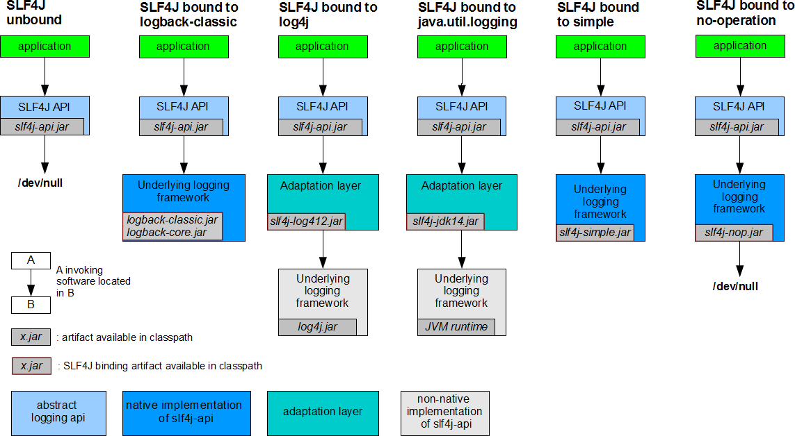
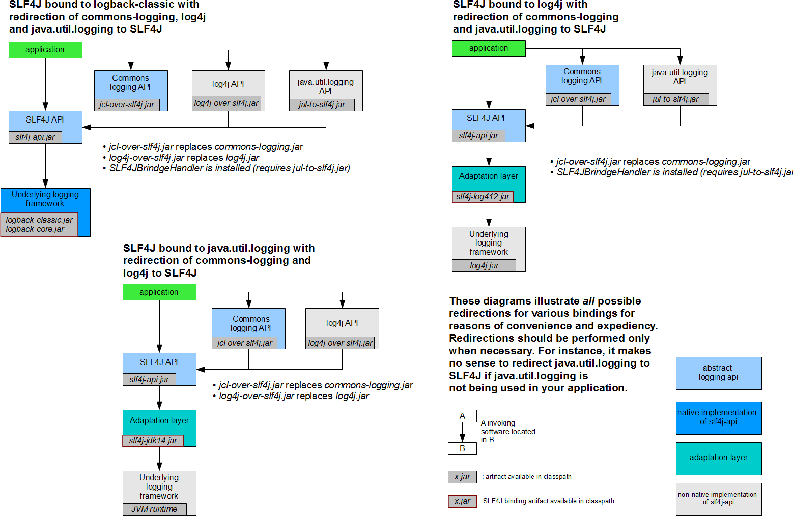
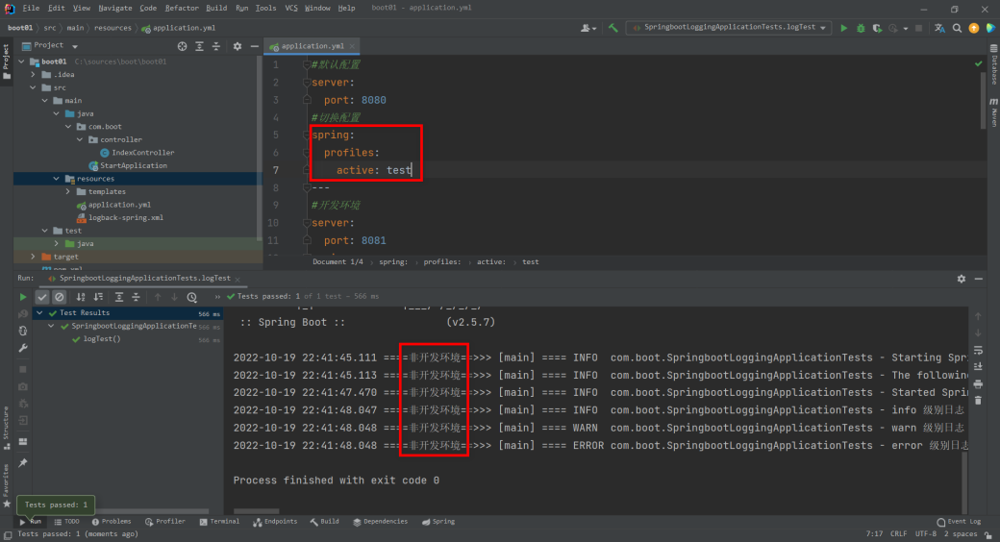

# 日志介绍

在项目开发中，日志十分的重要，不管是记录运行情况还是定位线上问题，都离不开对日志的分析。

在 Java 领域里存在着多种日志框架，如 JCL、SLF4J、Jboss-logging、jUL、log4j、log4j2、logback 等等

## 日志框架的选择

市面上常见的日志框架可以被分为两类：日志门面（日志抽象层）和日志实现，如下表。

| 日志分类 | 描述                                                         | 举例                                                         |
| -------- | ------------------------------------------------------------ | ------------------------------------------------------------ |
| 日志门面 | 为 Java 日志访问提供一套标准和规范的 API 框架，其主要意义在于提供接口。 | JCL（Jakarta Commons Logging）、SLF4j（Simple Logging Facade for Java）、jboss-logging |
| 日志实现 | 日志门面的具体的实现                                         | Log4j、JUL（java.util.logging）、Log4j2、Logback             |

通常情况下，日志由一个日志门面与一个日志实现组合搭建而成，Spring Boot 选用 SLF4J + Logback 的组合来搭建日志系统。

+ SLF4J 是目前市面上最流行的日志门面，使用 Slf4j 可以很灵活的使用占位符进行参数占位，简化代码，拥有更好的可读性。

+ Logback 是 Slf4j 的原生实现框架，它与 Log4j 出自一个人之手，但拥有比 log4j 更多的优点、特性和更做强的性能，现在基本都用来代替 log4j 成为主流。

## SLF4J 的使用

在项目开发中，记录日志时不应该直接调用日志实现层的方法，而应该调用日志门面（日志抽象层）的方法。

在使用 SLF4J 记录日志时，我们需要在应用中导入 SLF4J 及日志实现，并在记录日志时调用 SLF4J 的方法，例如：

```java
import org.slf4j.Logger;
import org.slf4j.LoggerFactory;

public class HelloWorld {
    public static void main(String[] args) {
        Logger logger = LoggerFactory.getLogger(HelloWorld.class);
       //调用 sl4j 的 info() 方法，而非调用 logback 的方法
        logger.info("Hello World");
    }
}
```

SLF4J 作为一款优秀的日志门面或者日志抽象层，它可以与各种日志实现框架组合使用，以达到记录日志的目的，如下图（参考自 SLF4J 官方）。




从 SLF4J 官方给出的方案可以看出：

- Logback 作为 Slf4j 的原生实现框架，当应用使用 SLF4J+Logback 的组合记录日志时，只需要引入 SLF4J 和 Logback 的 Jar 包即可；
- Log4j 虽然与 Logback  出自同一个人之手，但是 Log4j 出现要早于 SLF4J，因而 Log4j 没有直接实现 SLF4J，当应用使用 SLF4J+Log4j 的组合记录日志时，不但需要引入 SLF4J 和 Log4j 的 Jar 包，还必须引入它们之间的适配层（Adaptation layer）slf4j-log4j12.jar，该适配层可谓“上有老下有小”，它既要实现 SLF4J 的方法，还有调用 Log4j 的方法，以达到承上启下的作用；
- 当应用使用 SLF4J+JUL 记录日志时，与 SLF4J+Log4j 一样，不但需要引入 SLF4J 和 JUL 的对应的 Jar 包，还要引入适配层 slf4j-jdk14.jar。

这里我们需要注意一点，每一个日志的实现框架都有自己的配置文件。使用 slf4j 记录日志时，配置文件应该使用日志实现框架（例如 logback、log4j 和 JUL 等等）自己本身的配置文件。

## 统一日志框架（通用）

通常一个完整的应用下会依赖于多种不同的框架，而且它们记录日志使用的日志框架也不尽相同，例如，Spring Boot（slf4j+logback），Spring（commons-logging）、Hibernate（jboss-logging）等等。那么如何统一日志框架的使用呢？

对此，SLF4J 官方也给出了相应的解决方案，如下图。




从上图中可以看出，统一日志框架一共需要以下 3 步 ：

1. 排除应用中的原来的日志框架；
2. 引入替换包替换被排除的日志框架；
3. 导入 SLF4J 实现。

SLF4J 官方给出的统一日志框架的方案是“狸猫换太子”，即使用一个替换包来替换原来的日志框架，例如 log4j-over-slf4j 替换 Log4j（Commons Logging API）、jul-to-slf4j.jar 替换 JUL（java.util.logging API）等等。

替换包内包含被替换的日志框架中的所有类，这样就可以保证应用不会报错，但替换包内部实际使用的是 SLF4J API，以达到统一日主框架的目的。

## 统一日志框架（Spring Boot）

在使用 Spring Boot 时，同样可能用到其他的框架，例如 Mybatis、Spring MVC、 Hibernate 等等，这些框架的底层都有自己的日志框架，此时我们也需要对日志框架进行统一。

我们知道，统一日志框架的使用一共分为 3 步，Soring Boot 作为一款优秀的开箱即用的框架，已经为用户完成了其中 2 步：引入替换包和导入 SLF4J 实现。

Spring Boot 的核心启动器 spring-boot-starter 引入了 spring-boot-starter-logging，使用 IDEA 查看其依赖关系，如下图。


从图 3 可知，spring-boot-starter-logging 的 Maven 依赖不但引入了 logback-classic （包含了日志框架 SLF4J 的实现），还引入了 log4j-to-slf4j（log4j 的替换包），jul-to-slf4j （JUL 的替换包），即 Spring Boot 已经为我们完成了统一日志框架的 3 个步骤中的 2 步。

SpringBoot 底层使用 slf4j+logback 的方式记录日志，当我们引入了依赖了其他日志框架的第三方框架（例如 Hibernate）时，只需要把这个框架所依赖的日志框架排除，即可实现日志框架的统一，示例代码如下

```xml
<dependency>
    <groupId>org.apache.activemq</groupId>
    <artifactId>activemq-console</artifactId>
    <version>${activemq.version}</version>
    <exclusions>
        <exclusion>
            <groupId>commons-logging</groupId>
            <artifactId>commons-logging</artifactId>
        </exclusion>
    </exclusions>
</dependency>
```

# SpringBoot 日志配置

**Spring Boot 默认使用 SLF4J+Logback 记录日志**，并提供了默认配置，即使我们不进行任何额外配，也可以使用 SLF4J+Logback 进行日志输出。 常见的日志配置包括日志级别、日志的输入出格式等内容。

## 简单日志配置

创建springboot3项目时选择lombok


在 application.properties 中，修改 Spring Boot 日志的默认配置

```properties
#日志级别
logging.level.com.boot=trace
#使用相对路径的方式设置日志输出的位置（项目根目录目录\my-log\mylog\spring.log）
#logging.file.path=my-log/myLog
#绝对路径方式将日志文件输出到 【项目所在磁盘根目录\springboot\logging\my\spring.log】
logging.file.path=/spring-boot/logging
#控制台日志输出格式
logging.pattern.console=%d{yyyy-MM-dd hh:mm:ss} [%thread] %-5level %logger{50} - %msg%n
#日志文件输出格式
logging.pattern.file=%d{yyyy-MM-dd} === [%thread] === %-5level === %logger{50} === - %msg%n
```

控制台日志


本地日志文件 spring.log


## 详细说明

### 日志级别

日志的输出都是分级别的，当一条日志信息的级别大于或等于配置文件的级别时，就对这条日志进行记录。 常见的日志级别如下（优先级依次升高）。

| 日志级别 | 说明                                                        |
| -------- | ----------------------------------------------------------- |
| trace    | 追踪，指明程序运行轨迹。                                    |
| debug    | 调试，实际应用中一般将其作为最低级别，而 trace 则很少使用。 |
| info     | 输出重要的信息，使用较多。                                  |
| warn     | 警告，使用较多。                                            |
| error    | 错误信息，使用较多。                                        |

### 输出格式

我们可以通过以下常用日志参数对日志的输出格式进行修改，如下表。 

| 输出格式                     | 说明                                                         |
| ---------------------------- | ------------------------------------------------------------ |
| %d{yyyy-MM-dd HH:mm:ss, SSS} | 日志生产时间,输出到毫秒的时间                                |
| %-5level                     | 输出日志级别，-5 表示左对齐并且固定输出 5 个字符，如果不足在右边补 0 |
| %logger 或 %c                | logger 的名称                                                |
| %thread  或 %t               | 输出当前线程名称                                             |
| %p                           | 日志输出格式                                                 |
| %message 或 %msg 或 %m       | 日志内容，即 logger.info("message")                          |
| %n                           | 换行符                                                       |
| %class 或 %C                 | 输出 Java 类名                                               |
| %file 或 %F                  | 输出文件名                                                   |
| %L                           | 输出错误行号                                                 |
| %method 或 %M                | 输出方法名                                                   |
| %l                           | 输出语句所在的行数, 包括类名、方法名、文件名、行数           |
| hostName                     | 本地机器名                                                   |
| hostAddress                  | 本地 ip 地址                                                 |

#### 示例 1

使用Logger logger = LoggerFactory.getLogger(getClass());

```xml
<dependency>
    <groupId>org.springframework.boot</groupId>
    <artifactId>spring-boot-starter-test</artifactId>
</dependency>
```

\1. 在 Spring Boot 中编写 Java 测试类，代码如下。

```java
package com.boot;

import org.junit.jupiter.api.Test;
import org.slf4j.Logger;
import org.slf4j.LoggerFactory;
import org.springframework.boot.test.context.SpringBootTest;

@SpringBootTest
public class SpringbootLoggingApplicationTests {
    
    //
    Logger logger = LoggerFactory.getLogger(getClass());
    /**
     * 测试日志输出
     * SLF4J 日志级别从小到大trace>debug>info>warn>error
     */
    @Test
    public void logTest() {
        //日志级别 由低到高
        logger.trace("trace 级别日志");
        logger.debug("debug 级别日志");
        logger.info("info 级别日志");
        logger.warn("warn 级别日志");
        logger.error("error 级别日志");
    }
}
```

\2. 执行该测试，控制台输出如下图。


通过控制台输出结果可知，Spring Boot 日志默认级别为 info，日志输出内容默认包含以下元素：

- 时间日期
- 日志级别
- 进程 ID
- 分隔符：---
- 线程名：方括号括起来（可能会截断控制台输出）
- Logger 名称
- 日志内容

#### 示例2

使用Lombok的@Slf4j注解

```java
@Slf4j   //
@RestController
public class HelloController {

    @GetMapping("/h/**")
    public String hello(String a,String b){

        for (int i = 0; i < 1000; i++) {
            log.trace("trace 日志.....");
            log.debug("debug 日志.....");
            //SpringBoot底层默认的日志级别 info
            log.info("info 日志..... 参数a:{} b:{}",a,b);
            log.warn("warn 日志...");
            log.error("error 日志...");
        }
        return "hello";
    }
}
```

### 日志格式

```shell
2023-03-31T13:56:17.511+08:00  INFO 4944 --- [           main] o.apache.catalina.core.StandardService   : Starting service [Tomcat]
2023-03-31T13:56:17.511+08:00  INFO 4944 --- [           main] o.apache.catalina.core.StandardEngine    : Starting Servlet engine: [Apache Tomcat/10.1.7]
```

默认输出格式：

- 时间和日期：毫秒级精度
- 日志级别：ERROR, WARN, INFO, DEBUG, or TRACE.
- 进程 ID
- ---： 消息分割符
- 线程名： 使用[]包含
- Logger 名： 通常是产生日志的**类名**
- 消息： 日志记录的内容

注意： logback 没有FATAL级别，对应的是ERROR

```properties
logging.pattern.console=%d{yyyy-MM-dd HH:mm:ss} %-5level [%thread] %logger{15} ===> %msg%n
logging.pattern.dateformat=yyyy-MM-dd HH:mm:ss.SSS
#2023-03-31 13:59:58 INFO  [main] o.s.b.w.e.t.TomcatWebServer ===> Tomcat initialized with port(s): 8080 (http)
```


### 日志级别

SpringBoot日志**默认级别是** **INFO**

在application.properties/yaml中配置logging.level.<logger-name>=<level>指定日志级别

```properties
#默认所有日志没有精确指定级别就使用root的默认级别
logging.level.root=info

#精确调整某个包下的日志级别
logging.level.com.atguigu.logging.controller=info
```

### 日志分组

技巧：

+ 将相关的logger分组在一起，统一配置。SpringBoot 也支持。比如：Tomcat 相关的日志统一设置在application.properties/yaml中配置:

+ 把这些包org.apache.catalina,org.apache.coyote,org.apache.tomca分成tomcat组:

  ```properties
  logging.group.tomcat=org.apache.catalina,org.apache.coyote,org.apache.tomcat 
  logging.level.tomcat=trace
  
  logging.group.abc=com.lfj.logging.controller,com.lfj.logging.service,com.aaa,com.bbb
  logging.level.abc=debug
  logging.level.sql=debug
  ```

SpringBoot 预定义两个组

| Name | Loggers                                                      |
| ---- | ------------------------------------------------------------ |
| web  | org.springframework.core.codec, org.springframework.http, org.springframework.web, org.springframework.boot.actuate.endpoint.web, org.springframework.boot.web.servlet.ServletContextInitializerBeans |
| sql  | org.springframework.jdbc.core, org.hibernate.SQL, org.jooq.tools.LoggerListener |

### 文件输出

SpringBoot 默认只把日志写在控制台，如果想额外记录到文件，可以在application.properties中添logging.file.name or logging.file.path配置项

| logging.file.name | logging.file.path | 示例     | 效果                             |
| ----------------- | ----------------- | -------- | -------------------------------- |
| 未指定            | 未指定            |          | 仅控制台输出                     |
| **指定**          | 未指定            | my.log   | 写入指定文件。可以加路径         |
| 未指定            | **指定**          | /var/log | 写入指定目录，文件名为spring.log |
| **指定**          | **指定**          |          | 以logging.file.name为准          |

#日志文件输出到 【项目所在磁盘根目录\xxxx】

```properties
#指定日志文件的路径，日志文件默认名叫 spring.log
#logging.file.path=D: 
#指定日志文件的名: flename 和 path的配置同时存在只看filename
#1、只写名字，就生成到当前项目同位置的demo.log
#2、写名字+路径:生成到指定位置的指定文件

logging.file.name=my.log
```

### 文件归档与滚动切割

归档：每天的日志单独存到一个文档中。

切割：每个文件10MB，超过大小切割成另外一个文件。

1. 每天的日志应该独立分割出来存档。如果使用logback（SpringBoot 默认整合），可以通过application.properties/yaml文件指定日志滚动规则。
2. 如果是其他日志系统，需要自行配置（添加log4j2.xml或log4j2-spring.xml）
3. 支持的滚动规则设置如下

| 配置项                                               | 描述                                                         |
| ---------------------------------------------------- | ------------------------------------------------------------ |
| logging.logback.rollingpolicy.file-name-pattern      | 日志存档的文件名格式（默认值：${LOG_FILE}.%d{yyyy-MM-dd}.%i.gz） |
| logging.logback.rollingpolicy.clean-history-on-start | 应用启动时是否清除以前存档（默认值：false）                  |
| logging.logback.rollingpolicy.max-file-size          | 存档前，每个日志文件的最大大小（默认值：10MB）               |
| logging.logback.rollingpolicy.total-size-cap         | 日志文件被删除之前，可以容纳的最大大小（默认值：0B）。设置1GB则磁盘存储超过 1GB 日志后就会删除旧日志文件 |
| logging.logback.rollingpolicy.max-history            | 日志文件保存的最大天数(默认值：7).                           |

```properties
#logging.logback.rollingpolicy.file-name-pattern=${LOG_FILE}.%d{yyyy-MM-dd}.%i.gz
#logging.logback.rollingpolicy.max-file-size=1MB
```

## 自定义日志配置

**通常我们配置 application.properties 就够了。当然也可以自定义**

在 Spring Boot 的配置文件 application.porperties/yml 中，可以对日志的一些默认配置进行修改，但这种方式只能修改个别的日志配置，想要修改更多的配置或者使用更高级的功能，则需要通过日志实现框架自己的配置文件进行配置。

Spring 官方提供了各个日志实现框架所需的配置文件，用户只要将指定的配置文件放置到项目的类路径下即可。

| 日志框架                | 配置文件                                                     |
| ----------------------- | ------------------------------------------------------------ |
| Logback                 | logback-spring.xml、logback-spring.groovy、logback.xml、logback.groovy |
| Log4j2                  | log4j2-spring.xml、log4j2.xml                                |
| JUL (Java Util Logging) | logging.properties                                           |

从上表可以看出，日志框架的配置文件基本上被分为 2 类：

- 普通日志配置文件，即不带 srping 标识的配置文件，例如 logback.xml；
- 带有 spring 表示的日志配置文件，例如 logback-spring.xml。

这两种日志配置文件在使用时大不相同，下面我们就对它们分别进行介绍。

### 普通日志配置文件

我们将 logback.xml、log4j2.xml 等不带 spring 标识的普通日志配置文件，放在项目的类路径下后，这些配置文件会跳过 Spring Boot，直接被日志框架加载。通过这些配置文件，我们就可以达到自定义日志配置的目的。

#### 示例

\1. 将 logback.xml 加入到 Spring Boot 项目的类路径下（resources 目录下），该配置文件配置内容如下。

```xml
<?xml version="1.0" encoding="UTF-8"?>
<!--
scan：当此属性设置为true时，配置文件如果发生改变，将会被重新加载，默认值为true。
scanPeriod：设置监测配置文件是否有修改的时间间隔，如果没有给出时间单位，默认单位是毫秒当scan为true时，此属性生效。默认的时间间隔为1分钟。
debug：当此属性设置为true时，将打印出logback内部日志信息，实时查看logback运行状态。默认值为false。
-->
<configuration scan="false" scanPeriod="60 seconds" debug="false">
    <!-- 定义日志的根目录 -->
    <property name="LOG_HOME" value="c:/logs"/>
    <!-- 定义日志文件名称 -->
    <property name="appName" value="dushibao-spring-boot-logging"></property>
    <!-- ch.qos.logback.core.ConsoleAppender 表示控制台输出 -->
    <appender name="stdout" class="ch.qos.logback.core.ConsoleAppender">
        <!--
        日志输出格式：
   %d表示日期时间，
   %thread表示线程名，
   %-5level：级别从左显示5个字符宽度
   %logger{50} 表示logger名字最长50个字符，否则按照句点分割。
   %msg：日志消息，
   %n是换行符
        -->
        <layout class="ch.qos.logback.classic.PatternLayout">
            <pattern>%d{yyyy-MM-dd HH:mm:ss} [%thread]**************** %-5level %logger{50} - %msg%n</pattern>
        </layout>
    </appender>
    <!-- 滚动记录文件，先将日志记录到指定文件，当符合某个条件时，将日志记录到其他文件 -->
    <appender name="appLogAppender" class="ch.qos.logback.core.rolling.RollingFileAppender">
        <!-- 指定日志文件的名称 -->
        <file>${LOG_HOME}/${appName}.log</file>
        <!--
        当发生滚动时，决定 RollingFileAppender 的行为，涉及文件移动和重命名
        TimeBasedRollingPolicy： 最常用的滚动策略，它根据时间来制定滚动策略，既负责滚动也负责出发滚动。
        -->
        <rollingPolicy class="ch.qos.logback.core.rolling.TimeBasedRollingPolicy">
            <!--
            滚动时产生的文件的存放位置及文件名称 %d{yyyy-MM-dd}：按天进行日志滚动
            %i：当文件大小超过maxFileSize时，按照i进行文件滚动
            -->
            <fileNamePattern>${LOG_HOME}/${appName}-%d{yyyy-MM-dd}-%i.log</fileNamePattern>
            <!--
            可选节点，控制保留的归档文件的最大数量，超出数量就删除旧文件。假设设置每天滚动，
            且maxHistory是365，则只保存最近365天的文件，删除之前的旧文件。注意，删除旧文件是，
            那些为了归档而创建的目录也会被删除。
            -->
            <MaxHistory>365</MaxHistory>
            <!--
            当日志文件超过maxFileSize指定的大小是，根据上面提到的%i进行日志文件滚动 注意此处配置SizeBasedTriggeringPolicy是无法实现按文件大小进行滚动的，必须配置timeBasedFileNamingAndTriggeringPolicy
            -->
            <timeBasedFileNamingAndTriggeringPolicy class="ch.qos.logback.core.rolling.SizeAndTimeBasedFNATP">
                <maxFileSize>100MB</maxFileSize>
            </timeBasedFileNamingAndTriggeringPolicy>
        </rollingPolicy>
        <!-- 日志输出格式： -->
        <layout class="ch.qos.logback.classic.PatternLayout">
            <pattern>%d{yyyy-MM-dd HH:mm:ss} [ %thread ] ------------------ [ %-5level ] [ %logger{50} : %line ] -
                %msg%n
            </pattern>
        </layout>
    </appender>
    <!--
  logger主要用于存放日志对象，也可以定义日志类型、级别
  name：表示匹配的logger类型前缀，也就是包的前半部分
  level：要记录的日志级别，包括 TRACE < DEBUG < INFO < WARN < ERROR
  additivity：作用在于children-logger是否使用 rootLogger配置的appender进行输出，
  false：表示只用当前logger的appender-ref，true：
  表示当前logger的appender-ref和rootLogger的appender-ref都有效
    -->
    <!-- hibernate logger -->
    <logger name="com.dushibao" level="debug"/>
    <!-- Spring framework logger -->
    <logger name="org.springframework" level="debug" additivity="false"></logger>
    <!--
    root与logger是父子关系，没有特别定义则默认为root，任何一个类只会和一个logger对应，
    要么是定义的logger，要么是root，判断的关键在于找到这个logger，然后判断这个logger的appender和level。
    -->
    <root level="info">
        <appender-ref ref="stdout"/>
        <appender-ref ref="appLogAppender"/>
    </root>
</configuration> 
```


\2. 启动该项目并启动测试程序，结果如下。


### 带有 spring 标识的日志配置文件

Spring Boot 推荐用户使用 logback-spring.xml、log4j2-spring.xml 等这种带有 spring 标识的配置文件。这种配置文件被放在项目类路径后，不会直接被日志框架加载，而是由 Spring Boot 对它们进行解析，这样就可以使用 Spring Boot 的高级功能 Profile，实现在不同的环境中使用不同的日志配置。

#### 示例1

\1. 将 logback.xml 文件名修改为 logback-spring.xml，并将配置文件中日志输出格式的配置修改为使用 Profile 功能的配置。

\2. 配置内容修改前，日志输出格式配置如下。 

```java
<configuration scan="false" scanPeriod="60 seconds" debug="false">
    ......
    <appender name="stdout" class="ch.qos.logback.core.ConsoleAppender">
        <layout class="ch.qos.logback.classic.PatternLayout">
            <pattern>%d{yyyy-MM-dd HH:mm:ss} [%thread]**************** %-5level %logger{50} - %msg%n</pattern>
        </layout>
    </appender>
    ......
</configuration> 
```

\3. 修改 logback-spring.xml 的配置内容，通过 Profile 功能实现在不同的环境中使用不同的日志输出格式，配置如下。

```java
<configuration scan="false" scanPeriod="60 seconds" debug="false">
    ......
    <appender name="stdout" class="ch.qos.logback.core.ConsoleAppender">
        <layout class="ch.qos.logback.classic.PatternLayout">
            <!--开发环境 日志输出格式-->
            <springProfile name="dev">
                <pattern>%d{yyyy-MM-dd HH:mm:ss.SSS} --开发环境--> [%thread] ---> %-5level %logger{50} - %msg%n</pattern>
            </springProfile>
            <!--非开发环境 日志输出格式-->
            <springProfile name="!dev">
                <pattern>%d{yyyy-MM-dd HH:mm:ss.SSS} ====非开发环境==>>> [%thread] ==== %-5level %logger{50} - %msg%n</pattern>
            </springProfile>
        </layout>
    </appender>
    ......
</configuration> 
```

\4. 在 Spring Boot 项目的 application.yml 中，激活开发环境（dev）的 Profile，配置内容如下。

```java
#默认配置
server:
  port: 8080
#切换配置
spring:
  profiles:
    active: dev
---
#开发环境
server:
  port: 8081
spring:
  config:
    activate:
      on-profile: dev
---
#测试环境
server:
  port: 8082
spring:
  config:
    activate:
      on-profile: test
---
#生产环境
server:
  port: 8083
spring:
  config:
    activate:
      on-profile: prod
```

\5. 启动 Spring Boot 并执行测试代码，控制台输出如下。


\6. 修改 appplication.yml 中的配置，激活测试环境（test）的 Profile，配置如下。

```java
#默认配置
server:
  port: 8080
#切换配置
spring:
  profiles:
    active: test
---
#开发环境
server:
  port: 8081
spring:
  config:
    activate:
      on-profile: dev
---
#测试环境
server:
  port: 8082
spring:
  config:
    activate:
      on-profile: test
---
#生产环境
server:
  port: 8083
spring:
  config:
    activate:
      on-profile: prod
```

\7. 重启 Spring Boot 并执行测试代码，控制台输出如下。



#### 示例2

##### logback日志框架

Spring Boot 默认使用 SLF4J+Logback 记录日志

**创建logback-spring.xml配置文件**

```xml
<?xml version="1.0" encoding="UTF-8"?>

<!-- 配置文件修改时重新加载，默认true -->
<configuration scan="true">

    <!--定义日志文件的存储地址 勿在 LogBack 的配置中使用相对路径-->
    <property name="CATALINA_BASE" value="logs"></property>

    <!-- 控制台输出 -->
    <appender name="CONSOLE" class="ch.qos.logback.core.ConsoleAppender">
        <encoder charset="UTF-8">
            <!-- 输出日志记录格式 -->
            <pattern>%d{yyyy-MM-dd HH:mm:ss.SSS} ==== [%thread] %-5level ==== %logger{36} - %msg%n</pattern>
        </encoder>
    </appender>

     <!-- 文件输出 -->
    <!-- 第一个文件输出,每天产生一个文件 -->
    <appender name="FILE1" class="ch.qos.logback.core.rolling.RollingFileAppender">
        <rollingPolicy class="ch.qos.logback.core.rolling.TimeBasedRollingPolicy">
            <!-- 输出文件路径+文件名 -->
            <fileNamePattern>${CATALINA_BASE}/aa.%d{yyyyMMdd}.log</fileNamePattern>
            <!-- 保存30天的日志 -->
            <maxHistory>30</maxHistory>
        </rollingPolicy>
        <encoder charset="UTF-8">
            <!-- 输出日志记录格式 -->
            <pattern>%d{yyyy-MM-dd HH:mm:ss.SSS} [%thread] %-5level %logger{36} - %msg%n</pattern>
        </encoder>
    </appender>

    <!-- 第二个文件输出,每天产生一个文件 -->
    <appender name="FILE2" class="ch.qos.logback.core.rolling.RollingFileAppender">
        <file>${CATALINA_BASE}/bb.log</file>
        <rollingPolicy class="ch.qos.logback.core.rolling.TimeBasedRollingPolicy">
            <fileNamePattern>${CATALINA_BASE}/bb.%d{yyyyMMdd}.log</fileNamePattern>
            <maxHistory>30</maxHistory>
        </rollingPolicy>
        <encoder charset="UTF-8">
            <pattern>%d{yyyy-MM-dd HH:mm:ss.SSS} [%thread] %-5level %logger{36} - %msg%n</pattern>
        </encoder>
    </appender>

    <appender name="CUSTOM" class="ch.qos.logback.core.rolling.RollingFileAppender">
        <file>${CATALINA_BASE}/custom.log</file>
        <rollingPolicy class="ch.qos.logback.core.rolling.TimeBasedRollingPolicy">
            <!-- daily rollover -->
            <fileNamePattern>${CATALINA_BASE}/custom.%d{yyyy-MM-dd}.log</fileNamePattern>
            <!-- keep 30 days' worth of history -->
            <maxHistory>30</maxHistory>
        </rollingPolicy>
        <encoder charset="UTF-8">
            <pattern>%d{yyyy-MM-dd HH:mm:ss.SSS} [%thread] %-5level %logger{36} - %msg%n</pattern>
        </encoder>
    </appender>

    <!-- 设置日志输出级别 -->
    <root level="ERROR">
        <appender-ref ref="CONSOLE" />
    </root>
    <logger name="file1" level="DEBUG">
        <appender-ref ref="FILE1" />
    </logger>
    <logger name="file1" level="INFO">
        <appender-ref ref="FILE2" />
    </logger>
    <!-- 自定义logger -->
    <logger name="custom" level="INFO">
        <appender-ref ref="CUSTOM" />
    </logger>
</configuration>
```

##### Log4j2日志框架

**修改依赖**

```xml
<dependency>
    <groupId>org.springframework.boot</groupId>
    <artifactId>spring-boot-starter-web</artifactId>
</dependency>
<!--    spring-boot-starter有一个默认的日志场景  -->
<dependency>
    <groupId>org.springframework.boot</groupId>
    <artifactId>spring-boot-starter</artifactId>
    <exclusions>  <!--  排除默认spring-boot-starter-logging -->
        <exclusion>
            <groupId>org.springframework.boot</groupId>
            <artifactId>spring-boot-starter-logging</artifactId>
        </exclusion>
    </exclusions>
</dependency>
<!--     1、第三方框架， jul，排除掉这个框架的默认日志   -->


<!--        切换日志系统 -->
<dependency>
    <groupId>org.springframework.boot</groupId>
    <artifactId>spring-boot-starter-log4j2</artifactId>
</dependency>
```

**创建log4j2-spring.xml配置文件**

```xml
<?xml version="1.0" encoding="UTF-8"?>
<!--日志级别以及优先级排序: OFF > FATAL > ERROR > WARN > INFO > DEBUG > TRACE > ALL -->
<!--Configuration后面的status，这个用于设置log4j2自身内部的信息输出，可以不设置，当设置成trace时，你会看到log4j2内部各种详细输出-->
<!--monitorInterval：Log4j能够自动检测修改配置 文件和重新配置本身，设置间隔秒数-->
<configuration status="WARN" monitorInterval="30">
    <!--先定义所有的appender-->
    <appenders>
        <!--这个输出控制台的配置-->
        <console name="Console" target="SYSTEM_OUT">
            <!--输出日志的格式-->
            <PatternLayout pattern="[%d{HH:mm:ss:SSS}] [%p] ====- %l - %m%n"/>
        </console>
        
        <!--文件会打印出所有信息，这个log每次运行程序会自动清空，由append属性决定，这个也挺有用的，适合临时测试用-->
        <File name="log" fileName="log/test.log" append="false">
            <PatternLayout pattern="%d{HH:mm:ss.SSS} %-5level %class{36} %L %M - %msg%xEx%n"/>
        </File>
        <!-- 这个会打印出所有的info及以下级别的信息，每次大小超过size，则这size大小的日志会自动存入按年份-月份建立的文件夹下面并进行压缩，作为存档-->
        <RollingFile name="RollingFileInfo" fileName="${sys:user.home}/logs/info.log"
                     filePattern="${sys:user.home}/logs/$${date:yyyy-MM}/info-%d{yyyy-MM-dd}-%i.log">
            <!--控制台只输出level及以上级别的信息（onMatch），其他的直接拒绝（onMismatch）-->
            <ThresholdFilter level="info" onMatch="ACCEPT" onMismatch="DENY"/>
            <PatternLayout pattern="[%d{HH:mm:ss:SSS}] [%p] - %l - %m%n"/>
            <Policies>
                <TimeBasedTriggeringPolicy/>
                <SizeBasedTriggeringPolicy size="100 MB"/>
            </Policies>
        </RollingFile>
        <RollingFile name="RollingFileWarn" fileName="${sys:user.home}/logs/warn.log"
                     filePattern="${sys:user.home}/logs/$${date:yyyy-MM}/warn-%d{yyyy-MM-dd}-%i.log">
            <ThresholdFilter level="warn" onMatch="ACCEPT" onMismatch="DENY"/>
            <PatternLayout pattern="[%d{HH:mm:ss:SSS}] [%p] - %l - %m%n"/>
            <Policies>
                <TimeBasedTriggeringPolicy/>
                <SizeBasedTriggeringPolicy size="100 MB"/>
            </Policies>
            <!-- DefaultRolloverStrategy属性如不设置，则默认为最多同一文件夹下7个文件，这里设置了20 -->
            <DefaultRolloverStrategy max="20"/>
        </RollingFile>
        <RollingFile name="RollingFileError" fileName="${sys:user.home}/logs/error.log"
                     filePattern="${sys:user.home}/logs/$${date:yyyy-MM}/error-%d{yyyy-MM-dd}-%i.log">
            <ThresholdFilter level="error" onMatch="ACCEPT" onMismatch="DENY"/>
            <PatternLayout pattern="[%d{HH:mm:ss:SSS}] [%p] - %l - %m%n"/>
            <Policies>
                <TimeBasedTriggeringPolicy/>
                <SizeBasedTriggeringPolicy size="100 MB"/>
            </Policies>
        </RollingFile>
    </appenders>
    <!--然后定义logger，只有定义了logger并引入的appender，appender才会生效-->
    <loggers>
        <!--过滤掉spring和mybatis的一些无用的DEBUG信息-->
        <logger name="org.springframework" level="INFO"></logger>
        <logger name="org.mybatis" level="INFO"></logger>
        <root level="all">
            <appender-ref ref="Console"/>
            <appender-ref ref="RollingFileInfo"/>
            <appender-ref ref="RollingFileWarn"/>
            <appender-ref ref="RollingFileError"/>
        </root>
    </loggers>
</configuration>
```

总结:

1. **业务中使用slf4j-api记录日志。不要再 sout 了**
2. **导入任何第三方框架，先排除它的日志包，因为Boot底层控制好了日志**
3. 修改 `application.properties` 配置文件，就可以调整日志的所有行为。(如果不够，可以编写日志框架自己的配置文件放在类路径下就行，比如`logback-spring.xml`，`log4j2-spring.xml`)
4. 如需对接**专业日志系统**，也只需要把 logback 记录的**日志**灌倒 **kafka**之类的中间件，这和SpringBoot没关系，都是日志框架自己的配置，**修改配置文件即可**

