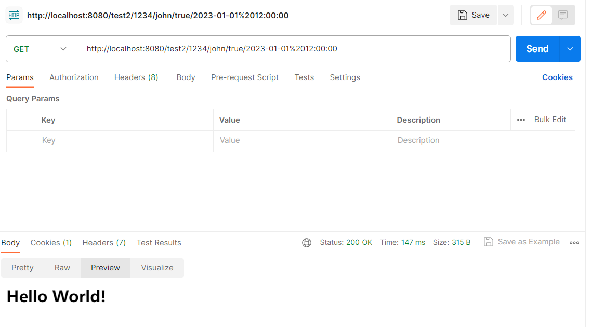
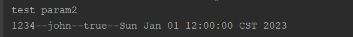
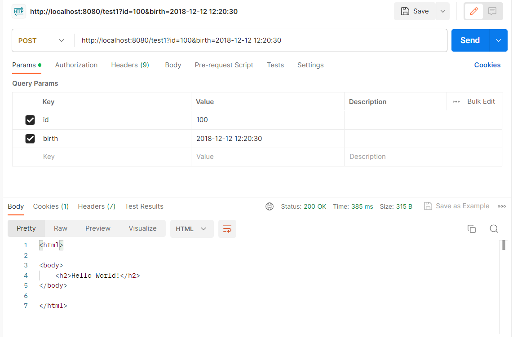
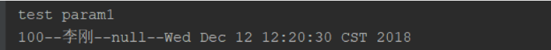
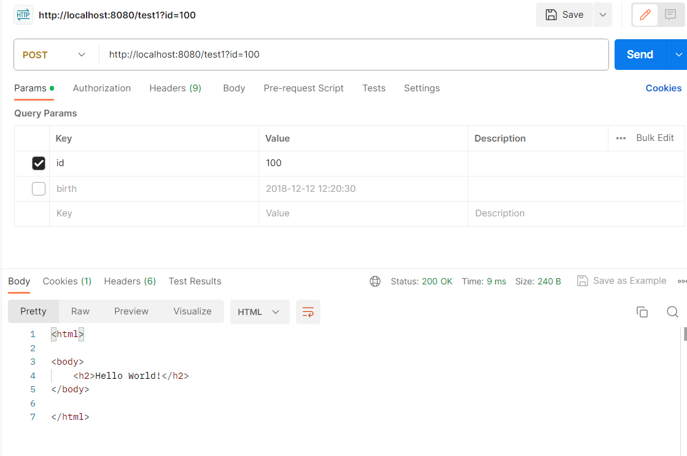
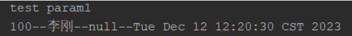
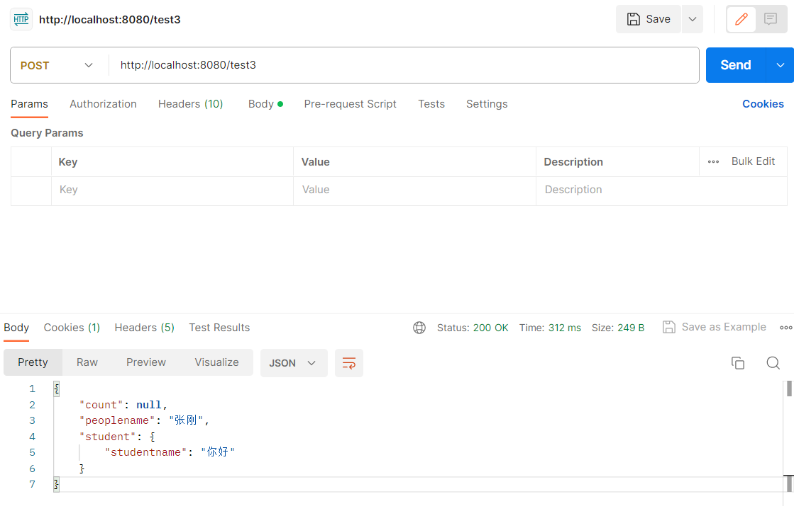

## 一、GET请求

### 发送get请求将参数通过 ？拼接在url后面

#### 前端接口

方式1

```js
$.ajax({
        url: "/order/userPage?page="+page+"&pageSize="+pageSize,    //请求的url地址  
        cache: "false",   //设置为false将不会从浏览器中加载请求信息
        async: "true",    //true所有请求均为异步请求
        dataType: "json", //请求返回数据的格式
        type:"get",      //请求方式
}
```

方式2

```js
async initData(){
 
   paging: {
      page: 1,
      pageSize: 5
   }
   const res = await orderPagingApi(this.paging) 
}
 
function orderPagingApi(data) {
    return $axios({
        'url': '/order/userPage',
        'method': 'get',
        //请求参数
        params: {...data}
    })
```

方式3

```js
 async initData(){
   paging: {
      page: 1,
      pageSize: 5
   }
   const res = await orderPagingApi(this.paging) 
}
 
function orderPagingApi(data) {
    return $axios({
        'url': '/order/userPage',
        'method': 'get',
        'data': data
    })
```

#### 后端接收参数

  请求的url地址:  /order/userPage?page=1&pageSize=100

```java
@GetMapping("/order/userPage")
@ResponseBody
public R<Page> userPage(Integer page,Integer pageSize){}
```

或者(推荐)

```java
@GetMapping("/order/userPage")
@ResponseBody
public R<Page> userPage(@RequestParam（"page"）Integer page,@RequestParam（"pageSize"）Integer pageSize){}
```

### 将参数拼接在url中，后台通过占位符接收参数  /{id}

#### 前端接口

```js
async initData(){
    const res = await addressFindOneApi(params.id)
}
 
function addressFindOneApi(id) {
  return $axios({
    'url': `/addressBook/${id}`,
    'method': 'get',
  })
}
```

####  后端接收参数

```java
@GetMapping("/addressBook/{id}")
@ResponseBody
public R<AddressBook> backList(@PathVariable("id")Long id){}
```

## 二、POST请求

1.前端使用例子：

```js
axios.post('/api/login', {
  username: 'admin',
  password: '123456'
 })
 .then(response => {
  console.log(response.data);
 })
 .catch(error => {
  console.log(error);
 });
```

2.后端使用例子：

```java
@RequestMapping(value = "/login", method = RequestMethod.POST)
@ResponseBody
public Map<String, Object> login(@RequestBody Map<String, Object> params) {
  String username = (String) params.get("username");
  String password = (String) params.get("password");
  // 验证用户名和密码
  // ...
  Map<String, Object> result = new HashMap<>();
  result.put("code", 200);
  result.put("msg", "登录成功");
  return result;
}
```

### 通过post提交方式将form表单中的数据序列化后传递到后台

#### 前端接口

```js
async initData(){
    const res =await formAjax();
}
 
function formAjax() {
       $.ajax({
       url: "/login", 
       type: "post", 
       data: $("#form").serialize(),  // 对id为form的表单数据进行序列化并传递到后台
}
```

#### 后端接收参数

form表单的数据必须User实体类的数据相对应

```java
@RequestMapping("/login")
public String login(User user) {}
```

### 通过post提交方式将form表单的类型是 json

#### 前端接口

```js
async initData(){
    const res =await formAjax();
}
 
function formAjax() {
       $.ajax({
       url: "/login", 
       type: "post",     
       contentType: 'application/json',
}
```

#### 后端接收参数

form表单的数据必须User实体类的数据相对应

```java
@RequestMapping("/login") 
public String login(@RequestBody User user) {}
```

## 三、PUT请求

1.前端使用例子：

```js
axios.put('/api/updateUserInfo', {
  id: 123,
  name: '张三',
  age: 18
 })
 .then(response => {
  console.log(response.data);
 })
 .catch(error => {
  console.log(error);
 });
```

2.后端使用例子：

```java
@RequestMapping(value = "/updateUserInfo", method = RequestMethod.PUT)
@ResponseBody
public Map<String, Object> updateUserInfo(@RequestBody User user) {
  // 更新用户信息
  Map<String, Object> result = new HashMap<>();
  result.put("code", 200);
  result.put("msg", "更新成功");
  return result;
}
```

## 四、DELETE请求

1.前端使用例子：

```js
axios.delete('/api/deleteUser?id=123')
 .then(response => {
  console.log(response.data);
 })
 .catch(error => {
  console.log(error);
 });
```

2.后端使用例子：

```java
@RequestMapping(value = "/deleteUser", method = RequestMethod.DELETE)
@ResponseBody
public Map<String, Object> deleteUser(@RequestParam("id") String id) {
  // 删除用户信息
  // ...
  Map<String, Object> result = new HashMap<>();
  result.put("code", 200);
  result.put("msg", "删除成功");
  return result;
}
```

## 前端 json 传参,后端@RequestBody 接参

JSON对象：

```json
{
    "name" : "Lily",
    "age" : 32
}
```

js对象：

```js
{
    name : 'Lily' ,       
    age : 32
}
```

例子

```js
async initData(){
   paging: {
      page: 1,
      pageSize: 5
   }
   const res = await orderPagingApi(this.paging) 
}
 
function orderPagingApi(data) {
    return $axios({
        'url': '/order/userPage',
        'method': 'post',
         data: JSON.stringify(data),
    })
```

**后台接收参数**

```java
@GetMapping("/order/userPage")
@ResponseBody
public R<Page> userPage(@RequesBody Map<Integer,Integer> map){
      Integer page = map.get("page"); 
      Integer pageSize = map.get("pageSize");   
 
}
```

或者

需要PageInfo类中有属性与其相对应

```java
@GetMapping("/order/userPage")
@ResponseBody
public R<Page> userPage(@RequesBody PageInfo pageInfo){
     Integer page = pageInfo.getPage();
     Integer pageSize = pageInfo.getPageSize();
}
```

## 前端参 {params: params} ,后端@RequestParams("xxx") 接参

```javascript
//前端发送数据
this.$axios
       .delete("login/deleteUserInfo", 
          { 
    		params: {
               userId: this.id
          	} 
        })
       .then(
         this.$message({
         type: "success",
         message: "删除用户信息成功",
      }))
       .catch(
        this.$message({
        type: "false",
        message: "删除用户信息失败",
      })
  )
```

**后端接收数据**

```java
@DeleteMapping("deleteUserInfo")
    public R deleteUserInfo(@RequestParam("userId" , required = false, defaultValue = "") String userId){
        int result=userInfoService.deleteUserInfoById(userId);
        if(result>0){
            return R.ok();
        }
        return R.error();
    }
```

## 前端{data : param} 传参，后端@RequestBody 接参

```javascript
//前端
deleteMessage() {
    axios.delete('login/deleteUserInfo', 
    { 
        data : 
        {
            userId: this.id
        }}).then((response) => {
    });
}
```

**后端接收数据**

```java
@DeleteMapping("deleteUserInfo")
public R deleteUserInfo(@RequestBody String userId){
        int result=userInfoService.deleteUserInfoById(userId);
        if(result>0){
            return R.ok();
        }
        return R.error();
    }
```

## SpringMVC、SpringBoot接收参数的几种方式

> SpringMVC和SpringBoot接收参数的方式是一样一样的。

### 一、传非json参数

***下面代码是get、post请求都支持，但是把参数放到路径上，一半这种情况下都用get请求。***

**涉及到的注解：**

- @[RequestParam](https://so.csdn.net/so/search?q=RequestParam&spm=1001.2101.3001.7020)主要用于在SpringMVC后台控制层获取参数，它有三个常用参数：defaultValue = “0”, required = false, value = “xxx”；defaultValue 表示设置默认值，required 表示该参数是否必传，value 值表示接受的传入的参数的key。
- @[PathVariable](https://so.csdn.net/so/search?q=PathVariable&spm=1001.2101.3001.7020)用于将请求URL中的模板变量映射到功能处理方法的参数上，即取出uri模板中的变量作为参数。

```java
	/**
	 * PathVariable(value = "参数名", required = 默认值)  注:没有defaultValue
	 * http://localhost:8080/test2/1234/john/true/2023-01-01 12:00:00
	 * param: id name gender birth
	 * get post都可以, body传参一般都用get
	 **/
	@RequestMapping("/test2/{id}/{name}/{gender}/{birth}")    //PathVariable顾名思义需要固定url路径
	public String testParam2(@PathVariable("id") Integer id,
							 @PathVariable(value = "name") String name,
							 @PathVariable(value = "gender", required = false) Boolean gender,
							 @DateTimeFormat(pattern="yyyy-MM-dd HH:mm:ss")
							 @PathVariable(value = "birth",  required = false) Date birth){
		//为空时指定默认值
		if (birth == null) {
			birth = new Date("2023-12-12 12:20:30");
		}
		System.out.println("test param2");
		System.out.println(id + "--" + name+ "--" + gender+ "--" + birth);
		return "index";
	}
```





----

```java
	/**
	* http://localhost:8989/xxx/../test1?id=1&name=zzz&gender=false&birth=2018-12-12 12:20:30
	 * param: id name gender birth
	 * get post都可以, body传参一般都用get
	 **/
	@RequestMapping("/test1")
	public String testParam1(@RequestParam("id") Integer id,
							 @RequestParam(value = "name", required = false, defaultValue = "李刚") String name,
							 @RequestParam(value = "gender", required = false) Boolean gender,
							 @DateTimeFormat(pattern="yyyy-MM-dd HH:mm:ss")
								 @RequestParam(value = "birth", defaultValue = "2023-12-12 12:20:30") Date birth){
		System.out.println("test param1");
		System.out.println(id + "--" + name+ "--" + gender+ "--" + birth);
		return "index";
	}
```









### 二、传json参数

***1、单个实体接收参数***

```javascript
    /**
     * http://localhost/toUser/add6
     * body: {"username":"张刚","password":"123456"}
     * get post都可以
     *
     * @param user
     * @return
     */
    @RequestMapping(value = "/add6")
    public void add6(@RequestBody User user) {
        log.info("打印参数:{}--{}", user.getUserName(), user.getPassword());
    }
```

***2、实体嵌套实体接收参数***

注解：

+ @RequestBody：该注解会把接收到的参数转为json格式

实体

```java
@Data
public class People {
    private Integer count;
    private String peoplename;
    private Student student;
}
```

```java
@Data
public class Student {
    private String studentname;
}
```

```javascript
	/**
	 * http://localhost:8080/test3
	 * body: {"peoplename":"张刚","student":{"studentname":"你好"}}
	 * get post都可以, body传参一般都用post
	 * @param
	 */
	@RequestMapping("/test3")
	@ResponseBody
	public People testParam3(@RequestBody People people) {
		System.out.println("打印参数:" + people.getPeoplename() + people.getStudent().getStudentname());
		return people;
	}
```



```
打印参数:张刚你好
```

***3、实体嵌套List接收参数***

实体

```java
@Data
@ToString
public class People {
    private Integer count;
    private String peoplename;
    private List<Student> student;
}
```

```java
@Data
@ToString
public class Student {
    private String studentname;
}
```

```javascript
    /**
     * http://localhost:8080/add8
     * body: {"peoplename":"张刚","student":[{"studentname":"你好"},{"studentname":"很好"}]}
     * get post都可以, body传参一般都用post
     * @param
     */
    @RequestMapping(value = "/add8")
    public void add8(@RequestBody People people) {
        List<Student> student = people.getStudent();
        student.stream().forEach(System.out::println);
        log.info("打印参数:{}--{}", people.getPeoplename());
    }
```

***4、Map接收参数***

```javascript
  /**
     * http://localhost:80/add9
     * body: {"peoplename":"张刚","student":[{"studentname":"你好"},{"studentname":"很好"}]}
     * get post都可以, body传参一般都用post
     *
     * @param
     */
    @RequestMapping(value = "/add9")
    public void add7(@RequestBody Map<String, Object> map) {
        log.info(map.get("peoplename").toString());
        List<Map<String, Object>> studentMapList = (List<Map<String, Object>>) map.get("student");
        studentMapList.stream().forEach(System.out::println);
    }
```

### 三、 综合代码[总结]

代码见  [请求参数.zip](请求参数.zip) 使用的是springMVC框架

```java
package cn.lfj.controller;

import cn.lfj.entity.People;
import org.springframework.format.annotation.DateTimeFormat;
import org.springframework.stereotype.Controller;
import org.springframework.web.bind.annotation.*;

import java.util.Date;

/**
 * @Author: LFJ
 * @Date: 2023-10-17 17:20
 */

@Controller
public class FrontParameter {

	/**
	 * RequestParam(value = "参数名", required = false(表示该值非必须), defaultValue = "默认值")
	* http://localhost:8989/test1?id=1&name=zzz&gender=false&birth=2018-12-12 12:20:30
	 * param: id name gender birth
	 * get post都可以, body传参一般都用get
	 **/
	@RequestMapping("/test1")
	public String testParam1(@RequestParam("id") Integer id,
							 @RequestParam(value = "name", required = false, defaultValue = "李刚") String name,
							 @RequestParam(value = "gender", required = false) Boolean gender,
							 @DateTimeFormat(pattern="yyyy-MM-dd HH:mm:ss")
								 @RequestParam(value = "birth", defaultValue = "2023-12-12 12:20:30") Date birth){
		System.out.println("test param1");
		System.out.println(id + "--" + name+ "--" + gender+ "--" + birth);
		return "index";
	}


	/**
	 * PathVariable(value = "参数名", required = 默认值)  注:没有defaultValue
	 * http://localhost:8080/test2/1234/john/true/2023-01-01 12:00:00
	 * param: id name gender birth
	 * get post都可以, body传参一般都用get
	 **/
	@RequestMapping("/test2/{id}/{name}/{gender}/{birth}")    //PathVariable顾名思义需要固定url路径
	public String testParam2(@PathVariable("id") Integer id,
							 @PathVariable(value = "name") String name,
							 @PathVariable(value = "gender", required = false) Boolean gender,
							 @DateTimeFormat(pattern="yyyy-MM-dd HH:mm:ss")
							 @PathVariable(value = "birth",  required = false) Date birth){
		//为空时指定默认值
		if (birth == null) {
			birth = new Date("2023-12-12 12:20:30");
		}
		System.out.println("test param2");
		System.out.println(id + "--" + name+ "--" + gender+ "--" + birth);
		return "index";
	}


	/**
	 * http://localhost:8080/test3
	 * body: {"peoplename":"张刚","student":{"studentname":"你好"}}
	 * get post都可以, body传参一般都用post
	 * @param
	 */
	@RequestMapping("/test3")
	@ResponseBody
	public People testParam3(@RequestBody People people) {
		System.out.println("打印参数:" + people.getPeoplename() + people.getStudent().getStudentname());
		return people;
	}

}
```

