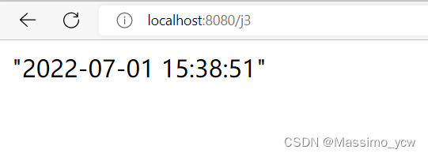
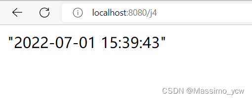

# 引言

Jackson和FastJSON都是Java的序列化/反序列化库，用于在Java对象和JSON数据之间进行互相转换。

`@ResponseBody`注解用于指示方法返回的对象会被自动转换为JSON格式的数据。

`@RequestBody`注解用于指示方法接受的JSON格式数据会被自动转换为对象。

# JackSon和FastJSON差异对比

 **fastjson**

fastjson 由阿里团队开发，是目前最快的Java 实现的 json 库。 fastjson 的 API 非常简洁，并且支持一定程度的定制（例如，注解@JSONField、枚举Feature等定制序列化）。被人诟病的，可能是 fastjson 的 bug 比较多。

**jackson2**

jackson 由 fasterxml 组织开发，相比 fastjson，有着更强大的功能、更高的稳定性、更好的扩展性、更丰富的定制支持。

使用 jackson 需要注意，ObjectMapper对象是线程安全的，可以重复使用。

+ Spring 默认使用的 json 解析工具就是 jackson

+ SpringBoot默认的JSON解析方案

  ```
  所有的 JSON 生成都离不开相关的 HttpMessageConverter。
  SpringMVC 自动配置了 Jackson 和 Gson 的 HttpMessageConverter，Spring Boot中又对此做了自动化配置，下面是两者对应源码的路径：
  org.springframework.boot.autoconfigure.http.JacksonHttpMessageConvertersConfiguration
  org.springframework.boot.autoconfigure.http.GsonHttpMessageConvertersConfiguration
  所以，如果用户使用 jackson 和 gson 的话，没有其他额外配置，则只需要添加依赖即可。
  简单来说直接使用
     `@ResponseBody`注解用于指示方法返回的对象会被自动转换为JSON格式的数据。
     `@RequestBody`注解用于指示方法接受的JSON格式数据会被自动转换为对象。
  ```

# Jackson

```xml
<!-- https://mvnrepository.com/artifact/com.fasterxml.jackson.core/jackson-databind -->
<dependency>
    <groupId>com.fasterxml.jackson.core</groupId>
    <artifactId>jackson-databind</artifactId>
    <version>2.13.3</version>
</dependency>
```


## SpringMVC中使用

###  集合测试

```java
@RequestMapping("/j2")
    @ResponseBody
    public String json2() throws JsonProcessingException {
        ObjectMapper mapper = new ObjectMapper();
        List<User> userList = new ArrayList<User>();

        User user1 = new User("Massimo1", 20, "男");
        User user2 = new User("Massimo2", 20, "男");
        User user3 = new User("Massimo3", 20, "男");
        User user4 = new User("Massimo4", 20, "男");

        userList.add(user1);
        userList.add(user2);
        userList.add(user3);
        userList.add(user4);

        String str = mapper.writeValueAsString(userList);
        return str;
    }
12345678910111213141516171819
```

***效果：***


### 时间测试一

```java
 @RequestMapping("/j3")
    @ResponseBody
    public String json3() throws JsonProcessingException {
        ObjectMapper mapper = new ObjectMapper();
        Date date = new Date();
        //自定义日期的格式
        SimpleDateFormat sdf = new SimpleDateFormat("yyyy-MM-dd HH:mm:ss");
        //ObjectMapper,时间解析后的默认格式为：Timestamp，时间戳
        return mapper.writeValueAsString(sdf.format(date));
    }
```

***效果：***


### 时间测试二

```java
@RequestMapping("/j4")
    @ResponseBody
    public String json4() throws JsonProcessingException {
        ObjectMapper mapper = new ObjectMapper();
        //不使用时间戳的方式
        mapper.configure(SerializationFeature.WRITE_DATES_AS_TIMESTAMPS,false);
        //自定义日期的格式
        SimpleDateFormat sdf = new SimpleDateFormat("yyyy-MM-dd HH:mm:ss");
        mapper.setDateFormat(sdf);
        Date date = new Date();
        //ObjectMapper,时间解析后的默认格式为：Timestamp，时间戳
        return mapper.writeValueAsString(date);
    }
```

***效果：***


### 封装工具类

```java
package com.massimo.utils;

import com.fasterxml.jackson.core.JsonProcessingException;
import com.fasterxml.jackson.databind.ObjectMapper;
import com.fasterxml.jackson.databind.SerializationFeature;

import java.text.SimpleDateFormat;

public class JsonUtils {
    
    public static String getJson(Object object){
        return getJson(object,"yyyy-MM-dd HH:mm:ss");
    }
    
    public static String getJson(Object object,String dateFormat){
        ObjectMapper mapper = new ObjectMapper();
        mapper.configure(SerializationFeature.WRITE_DATES_AS_TIMESTAMPS,false);
        SimpleDateFormat sdf = new SimpleDateFormat(dateFormat);
        mapper.setDateFormat(sdf);

        try {
            return mapper.writeValueAsString(object);
        } catch (JsonProcessingException e) {
            e.printStackTrace();
        }
        return null;
    }
}
```

# fastjson2

[fastjson2 介绍及使用](https://blog.csdn.net/qq_33697094/article/details/128114939)

## 一、导入fastjson2依赖

```xml
<dependency>
    <groupId>com.alibaba.fastjson2</groupId>
    <artifactId>fastjson2</artifactId>
    <version>2.0.26</version>
</dependency>
```

```java
// 从redis查询token
Object obj = redisTemplate.opsForValue().get(token);  //  <!-- redis -->

// 反序列化 json对象反序列化成user对象
XUser user = JSON.parseObject(JSON.toJSONString(obj), XUser.class);
```

## 二、json对象与json数组的创建

### json对象创建

```java
        JSONObject info = new JSONObject();
        info.put("name", "张三");
        info.put("age", "18");
        info.put("地理", "70");
        info.put("英语", "60");
```

### json数组创建

```java
		JSONObject info1 = new JSONObject();
        info1.put("name", "张三");
        info1.put("age", "18");
        JSONObject info2 = new JSONObject();
        info2.put("name", "李四");
        info2.put("age", "19");

        //把上面创建的两个json对象加入到json数组里
        JSONArray array = new JSONArray();
        array.add(info1);
        array.add(info2);

        JSONArray array = new JSONArray();
        array.add("1班");
        array.add("2班");
        array.add("3班");
```

## 三、json对象取值与json数组遍历取值

### json对象取值

```java
        JSONArray array = new JSONArray();
        array.add("1班");
        array.add("2班");
        array.add("3班");
        JSONObject school = new JSONObject();
        school.put("schoolName", "第一中学");
        school.put("teacher", "刘梅");

        JSONObject info = new JSONObject();
        info.put("name", "张三");
        info.put("age", "18");
        info.put("gradle",array);
        info.put("schoolInfo",school);

        //从info中取值
        System.out.println(info.getString("name")); //张三
        System.out.println(info.getIntValue("age"));//18
        System.out.println(info.getJSONArray("gradle"));//["1班","2班","3班"]
        System.out.println(info.getJSONObject("schoolInfo"));//{"schoolName":"第一中学","teacher":"刘梅"}
12345678910111213141516171819
```

### json数组遍历取值

```java
        JSONObject info1 = new JSONObject();
        info1.put("name", "张三");
        info1.put("age", "18");
        JSONObject info2 = new JSONObject();
        info2.put("name", "李四");
        info2.put("age", "19");

        JSONArray array = new JSONArray();
        array.add(info1);
        array.add(info2);
        //遍历获取json数组中对象的值
        for (int i = 0; i < array.size(); i++) {
            JSONObject json = array.getJSONObject(i);
            System.out.println(json.getString("name"));
            System.out.println(json.getString("age"));
        }
```

## 四、json对象与字符串的转换

### json对象与字符串的转换

```java
		JSONObject info = new JSONObject();
        info.put("name", "张三");
        info.put("age", "18");
        info.put("地理", "70");
        info.put("英语", "60");

        //JSON对象转字符串
        String str = JSON.toJSONString(info);
        //JSON字符串转JSON对象
        JSONObject json = JSONObject.parseObject(str);
12345678910
```

### json字符串的字节数组转json对象

```java
        String str = "{\"name\":\"张三\",\"age\":\"18\",\"地理\":\"70\",\"英语\":\"60\"}";

        byte[] bytes = str.getBytes();
        JSONObject data = JSON.parseObject(bytes);

12345
```

## 五、json数组与字符串的转换

```java
        String text = "[\"张三\",\"李四\",\"王五\"]";
        //json字符串转json数组
        JSONArray data = JSON.parseArray(text);
        //json数组转json字符串
        String str = JSONArray.toJSONString(data);
12345
```

## 六、json字符串转java对象的转换

Student类如下：

```java
@Data
public class Student {
    public String name;
    public int age;
}
```

### json字符串转java对象的转换

```java
Student student = new Student("张三", 18);

//Student对象转JSON字符串
String studentStr = JSON.toJSONString(student);
//JSON字符串转Student对象
Student data = JSON.parseObject(studentStr, Student.class);
```

### java对象转byte数组转换

```java
Student student = new Student("张三", 18);

//Student对象转字节数组
byte[] text = JSON.toJSONBytes(student);
//字节数组转Student对象
Student data = JSON.parseObject(text, Student.class);
```

## 七、json字符串与Map转换

### json字符串转Map

```java
        String str="{\n" +
                "\"gradle\":\"高一\",\n" +
                "\"number\":\"2\",\n" +
                "\"people\":[{\"name\":\"张三\",\"age\":\"15\",\"phone\":\"123456\"},\n" +
                "         {\"name\":\"李四\",\"age\":\"16\",\"phone\":\"78945\"}]\n" +
                "}";

        //json字符串转Map
        Map<String, Object> map = JSONObject.parseObject(str, new TypeReference<Map<String, Object>>() {});
        System.out.println(map.get("gradle").toString());
        System.out.println(map.get("number").toString());
        System.out.println(map.get("people").toString());

12345678910111213
```

### Map转json字符串

(注意：如果直接使用JSON.toJSONString(map)转换，因为"测试1"的值为null，转换的结果就会是 {“测试2”:“hello”})

```java
		Map<String,String> map=new HashMap<>();
        map.put("测试1",null);
        map.put("测试2","hello");

		//{"测试2":"hello","测试1":null}
        String str = JSON.toJSONString(map, JSONWriter.Feature.WriteMapNullValue);

1234567
```

如果你使用的是老的fastjson1,可以像下面这样转换：

```java
		Map<String,String> map=new HashMap<>();
		map.put("测试1",null);
		map.put("测试2","hello");
		String str = JSON.toJSONString(map, SerializerFeature.WriteMapNullValue) ;
1234
```

## 八、json数组转List

```java
        String str="{\n" +
                "\"gradle\":\"高一\",\n" +
                "\"number\":\"2\",\n" +
                "\"people\":[{\"name\":\"张三\",\"age\":\"15\",\"phone\":\"123456\"},\n" +
                "         {\"name\":\"李四\",\"age\":\"16\",\"phone\":\"78945\"}]\n" +
                "}";

        JSONObject strJson = JSONObject.parseObject(str);
        //获取people数组
        JSONArray people = strJson.getJSONArray("people");
        //json数组转List
        List<Map> list = people.toJavaList(Map.class);

12345678910111213
```

如果你使用的是老的fastjson1,可以像下面这样转换：

```java
        String str="{\n" +
                "\"gradle\":\"高一\",\n" +
                "\"number\":\"2\",\n" +
                "\"people\":[{\"name\":\"张三\",\"age\":\"15\",\"phone\":\"123456\"},\n" +
                "         {\"name\":\"李四\",\"age\":\"16\",\"phone\":\"78945\"}]\n" +
                "}";

        JSONObject strJson=JSONObject.parseObject(str);//字符串转json对象
        String people = String.valueOf(strJson.getJSONArray("people"));
        List<Map<String,String>> list = (List<Map<String,String>>) JSONArray.parse(people);
12345678910
```

## 九、json[字符串格式化](https://so.csdn.net/so/search?q=字符串格式化&spm=1001.2101.3001.7020)

有时候我们想把 json 字符串格式化输出，也就是该缩进的缩进该换行的换行，让它更美观的输出，可以像下面这样：

```java
        String str = "[{\"isSendPhone\":\"true\",\"id\":\"22258352\",\"phoneMessgge\":\"为避免影响您的正常使用请及时续费，若已续费请忽略此信息。\",\"readsendtime\":\"9\",\"countdown\":\"7\",\"count\":\"5\",\"serviceName\":\"流程助手\",\"startdate\":\"2022-02-09 00:00:00.0\",\"insertTime\":\"2023-02-02 07:00:38.0\",\"enddate\":\"2023-02-08 23:59:59.0\",\"emailMessage\":\"为避免影响您的正常使用请及时续费，若已续费请忽略此信息。\",\"phone\":\"\",\"companyname\":\"顾问有限责任公司\",\"serviceId\":\"21\",\"isSendeMail\":\"true\",\"email\":\"\"},{\"isSendPhone\":\"true\",\"eid\":\"7682130\",\"phoneMessgge\":\"为避免影响您的正常使用请及时续费，若已续费请忽略此信息。\",\"readsendtime\":\"9\",\"countdown\":\"15\",\"count\":\"50\",\"serviceName\":\"经理人自助服务\",\"startdate\":\"2022-02-17 00:00:00.0\",\"insertTime\":\"2023-02-02 07:00:38.0\",\"enddate\":\"2023-02-16 23:59:59.0\",\"emailMessage\":\"为避免影响您的正常使用请及时续费，若已续费请忽略此信息。\",\"phone\":\"\",\"companyname\":\"生物科技股份有限公司\",\"serviceId\":\"2\",\"isSendeMail\":\"true\",\"email\":\"\"}]";
        
        str =  str.trim();
        String formatStr = null;
        if (str.startsWith("[")) {
            JSONArray data = JSON.parseArray(str);
            formatStr = JSONArray.toJSONString(data, JSONWriter.Feature.PrettyFormat, JSONWriter.Feature.WriteMapNullValue, JSONWriter.Feature.WriteNullListAsEmpty);
        } else {
            JSONObject strJson = JSONObject.parseObject(str);
            formatStr = JSON.toJSONString(strJson, JSONWriter.Feature.PrettyFormat, JSONWriter.Feature.WriteMapNullValue, JSONWriter.Feature.WriteNullListAsEmpty);
        }
        System.out.println(formatStr);
```

输出结果：

```java
[
	{
		"isSendPhone":"true",
		"id":"22258352",
		"phoneMessgge":"为避免影响您的正常使用请及时续费，若已续费请忽略此信息。",
		"readsendtime":"9",
		"countdown":"7",
		"count":"5",
		"serviceName":"流程助手",
		"startdate":"2022-02-09 00:00:00.0",
		"insertTime":"2023-02-02 07:00:38.0",
		"enddate":"2023-02-08 23:59:59.0",
		"emailMessage":"为避免影响您的正常使用请及时续费，若已续费请忽略此信息。",
		"phone":"",
		"companyname":"XX顾问有限责任公司",
		"serviceId":"21",
		"isSendeMail":"true",
		"email":""
	},
	{
		"isSendPhone":"true",
		"eid":"7682130",
		"phoneMessgge":"为避免影响您的正常使用请及时续费，若已续费请忽略此信息。",
		"readsendtime":"9",
		"countdown":"15",
		"count":"50",
		"serviceName":"经理人自助服务",
		"startdate":"2022-02-17 00:00:00.0",
		"insertTime":"2023-02-02 07:00:38.0",
		"enddate":"2023-02-16 23:59:59.0",
		"emailMessage":"为避免影响您的正常使用请及时续费，若已续费请忽略此信息。",
		"phone":"",
		"companyname":"XX科技股份有限公司",
		"serviceId":"2",
		"isSendeMail":"true",
		"email":""
	}
]
```

