# 一、引言

## 1.1 原生web开发中存在哪些问题？

-  传统Web开发存在硬编码所造成的过度程序耦合（例如：Service中作为属性Dao对象）。 
-  部分Java EE API较为复杂，使用效率低（例如：JDBC开发步骤）。 
-  侵入性强，移植性差（例如：DAO实现的更换，从Connection到SqlSession）。 

# 二、spring介绍

## 2.1 访问与下载

官方网站：https://spring.io/

下载地址：http://repo.spring.io/release/org/springframework/spring/

## 2.2 Spring架构组成

Spring 总共大约有 20 个模块，由 1300 多个不同的文件构成。而这些组件被分别整合在6 个模块中：

1. 核心容器（Core Container）
2. AOP（Aspect Oriented Programming）
3. 设备支持（Instrmentation）
4. 数据访问及集成（Data Access/Integeration）
5. Web报文发送（Messaging）
6. Test测试

**Spring两大核心 : **

+ DI：依赖注入（Dependency Injection）
+ AOP：面向对象面编程（Aspect Oriented Programming）

**依赖:**

| **GroupId**         | **ArtifactId**           | **说明**                                       |
| ------------------- | ------------------------ | ---------------------------------------------- |
| org.springframework | spring-beans             | Beans 支持，包含 Groovy                        |
| org.springframework | spring-aop               | 基于代理的AOP支持                              |
| org.springframework | spring-aspects           | 基于AspectJ 的切面                             |
| org.springframework | spring-context           | 应用上下文运行时，包括调度和远程抽象           |
| org.springframework | spring-context-support   | 支持将常见的第三方类库集成到 Spring 应用上下文 |
| org.springframework | spring-core              | 其他模块所依赖的核心模块                       |
| org.springframework | spring-expression        | Spring 表达式语言，SpEL                        |
| org.springframework | spring-instrument        | JVM 引导的仪表（监测器）代理                   |
| org.springframework | spring-instrument-tomcat | Tomcat 的仪表（监测器）代理                    |
| org.springframework | spring-jdbc              | 支持包括数据源设置和 JDBC 访问支持             |
| org.springframework | spring-jms               | 支持包括发送/接收JMS消息的助手类               |
| org.springframework | spring-messaging         | 对消息架构和协议的支持                         |
| org.springframework | spring-orm               | 对象/关系映射，包括对 JPA 和 Hibernate 的支持  |
| org.springframework | spring-oxm               | 对象/XML 映射（Object/XML Mapping，OXM）       |
| org.springframework | spring-test              | 单元测试和集成测试支持组件                     |
| org.springframework | spring-tx                | 事务基础组件，包括对 DAO 的支持及 JCA 的集成   |
| org.springframework | spring-web               | web支持包，包括客户端及web远程调用             |
| org.springframework | spring-webmvc            | REST web 服务及 web 应用的 MVC 实现            |
| org.springframework | spring-webmvc-portlet    | 用于 Portlet 环境的MVC实现                     |
| org.springframework | spring-websocket         | WebSocket 和 SockJS 实现，包括对 STOMP 的支持  |
| org.springframework | spring-jcl               | Jakarta Commons Logging 日志系统               |

# 三、构建Maven项目

## 3.1 创建一个 普通的 Maven 项目（无需使用模板）

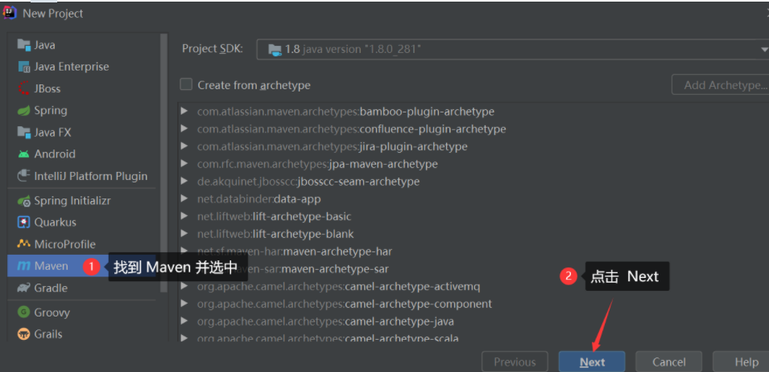

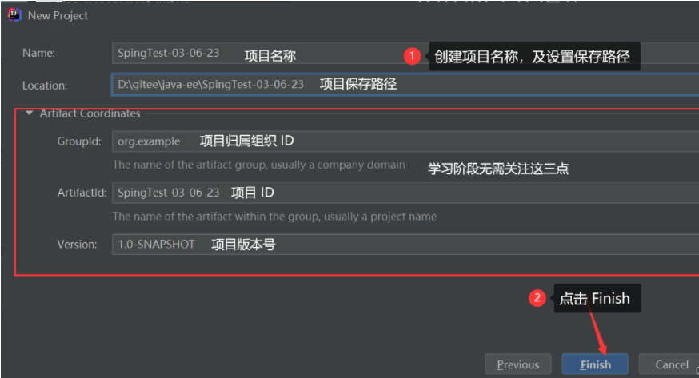

## 3.2 Spring依赖

```xml
    <dependencies>
        <!--Spring框架的核心容器-->
        <dependency>
            <groupId>org.springframework</groupId>
            <artifactId>spring-context</artifactId>
            <version>5.2.3.RELEASE</version>
        </dependency>
    </dependencies>
```

| Spring常用功能的Jar包依赖关系                                |
| ------------------------------------------------------------ |
| 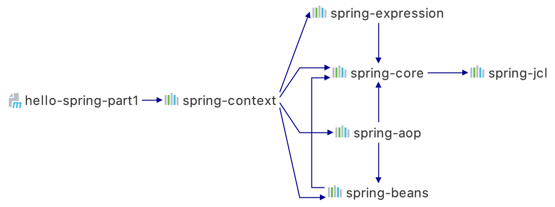 |

注意：**Jar包彼此存在依赖，只需引入最外层Jar即可由Maven自动将相关依赖Jar引入到项目中。**

# 四、 IOC与DI

DI：依赖注入（Dependency Injection）：依赖其他容器（比如spring）来创建和维护所需要的组件，并将其注入到应用程序中。

IOC：控制反转（Inversion of Control）：它是一种控制权的转移。即组件与组件之间的依赖由主动变为被动。也就是说：应用程序本身不再负责组件的创建、维护等，而是将控制权移交出去。从这一点来说，几乎所有的框架都是IOC框架。

IOC只是将组件控制权移交出去，但并没有说明组件如何获取。而DI明确说明：组件依赖Spring容器获取。 所以可以这样说：**DI是IOC思想的一种具体实现。**

 ApplicationContext是Spring IoC容器实现的代表，**它负责实例化，配置和组装Bean**。容器通过读取配置元数据获取有关实例化、配置和组装哪些对象的说明 。配置元数据可以使用XML、Java注解或Java代码来呈现。它允许你处理应用程序的对象与其他对象之间的互相依赖关系。

<font color=red>**在 Java 中一个普通的实例化的对象也被称之为 Bean 对象，在框架这一块我们遇到的对象就是以 Bean 对象称呼**</font>


# 五、IOC（Inversion of Control ）控制反转

## 5.1 项目中强耦合问题

```java
public class UserDAOImpl implements UserDAO{....}
```

```java
public class UserServiceImpl implements UserService {
    // !!!强耦合了UserDAOImpl!!!,使得UserServiceImpl变得不稳健!!
    private UserDAO userDAO= new UserDAOImpl();
    @Override
    public User queryUser() {
        return userDAO.queryUser();
    }
    ....
}
```

## 5.2 解决方案

```java
// 不引用任何一个具体的组件(实现类)，在需要其他组件的位置预留存取值入口(set/get)
public class UserServiceImpl implements UserService {
    // !!!不再耦合任何DAO实现!!!,消除不稳健因素!!
    private UserDAO userDAO；
    // 为userDAO定义set/get,允许userDAO属性接收spring赋值
    //Getters And Setters
    @Override
    public User queryUser() {
        return userDAO.queryUser();
    }
    ....
}
```

```xml
<bean id="userDAO" class="com.qf.spring.part1.injection.UserDaoImpl"></bean>
<!-- UserServiceImpl组件 -->
<bean id="userService" class="com.qf.spring.part1.injection.UserServiceImpl">
    <!-- 由spring为userDAO属性赋值，值为id="userDAO"的bean -->
    <property name="userDAO" ref="userDAO"/>  //ref 制定的是对象
</bean>
```

此时，如果需要更换其他UserDAO实现类，则UserServiceImpl不用任何改动！ 则此时的UserServiceImpl组件变得更加稳健！

# 六、DI（依赖注入）

依赖注入（Dependency Injection）是一种设计模式，也是Spring框架的核心概念之一。其作用是去除组件之间的依赖关系，实现解耦合。 也就是说：所谓依赖注入，是指工程中需要的组件无须自己创建，而是依赖于外部环境注入。

Spring实现依赖注入有三种方式：注解方式（官方推荐方式）、xml配置文件方式、javaConfig方式。

## 6.1 添加Spring依赖

pom.xm文件添加依赖

```xml
    <dependencies>
        <!--Spring框架-->
        <dependency>
            <groupId>org.springframework</groupId>
            <artifactId>spring-context</artifactId>
            <version>5.2.3.RELEASE</version>
        </dependency>
        <!-- 单元测试 -->
        <dependency>
            <groupId>org.springframework</groupId>
            <artifactId>spring-test</artifactId>
            <version>5.2.3.RELEASE</version>
        </dependency>
        <!-- 单元测试 -->
        <dependency>
            <groupId>junit</groupId>
            <artifactId>junit</artifactId>
            <version>4.13.2</version>
            <scope>test</scope>
        </dependency>
    </dependencies>
```

## 6.2 xml方式

下面使用 Spring 来重构dao层组件与service层组件。 也就是说：由Spring创建dao层组件和service层组件，并使用Spring将dao层组件注入给service层组件。

### 6.2.1 创建dao接口与实现类

**UserDao.java**

```java
package com.neusoft.dao;
import com.neusoft.po.User;
public interface UserDao {
    public User getUser();
}
```

**UserDaoImpl.java**

```java
package com.neusoft.dao.impl;
import com.neusoft.dao.UserDao;
import com.neusoft.po.User;
public class UserDaoImpl implements UserDao{
    @Override
    public User getUser() {
        return new User(1,"test","111");
    }
}
```

### 6.2.2 创建service接口与实现类

**UserService.java**

```java
package com.neusoft.service;
import com.neusoft.po.User;
public interface UserService {
    public User getUser();
}
```

**UserServiceImpl.java**

```java
package com.neusoft.service.impl;
import com.neusoft.dao.UserDao;
import com.neusoft.po.User;
import com.neusoft.service.UserService;
public class UserServiceImpl implements UserService{
    private UserDao userDao;
    @Override
    public User getUser() {
        return userDao.getUser();
    }
    public UserDao getUserDao() {
        return userDao;
    }
    public void setUserDao(UserDao userDao) {
        this.userDao = userDao;
    }
}
```

### 6.2.3 创建Spring配置文件

在类路径下创建spring.xml配置文件：

```xml
<?xml version="1.0" encoding="UTF-8"?>
<beans
  xmlns="http://www.springframework.org/schema/beans"
  xmlns:context="http://www.springframework.org/schema/context"
  xmlns:aop="http://www.springframework.org/schema/aop"
  xmlns:xsi="http://www.w3.org/2001/XMLSchema-instance"
  xsi:schemaLocation="http://www.springframework.org/schema/beans 
  http://www.springframework.org/schema/beans/spring-beans.xsd
  http://www.springframework.org/schema/context 
  http://www.springframework.org/schema/context/spring-context.xsd
  http://www.springframework.org/schema/aop 
  http://www.springframework.org/schema/aop/spring-aop-4.1.xsd">
  
   <!--类注册-->
  <bean id="userDao" class="com.neusoft.dao.impl.UserDaoImpl"></bean>
  <bean id="userService" class="com.neusoft.service.impl.UserServiceImpl">
    <property name="userDao" ref="userDao"/>
  </bean>
  
</beans>
```

1. Spring配置文件就相当于一个容器。此容器中负责创建对象，并实现对象与对象之间的装配。
2. java中每一个类都是一个bean。所以上面的bean标签，就是在容器中创建一个java对象。
3. bean标签中的class属性，就是类名； id属性，就是对象名。
4. property标签，是给bean的属性注入其它对象。name属性，就是对象属性名； ref属性，就是给属性注入的对象。（如果想要注入基本数据类型，那么使用value属性）
5. 给bean的属性注入其它对象，默认使用 get/set 方法注入。也可以使用其它方式注入：构造方法注入、P命名空间注入等。

### 6.2.4  测试

```java
package com.neusoft;
import org.springframework.context.ApplicationContext;
import org.springframework.context.support.ClassPathXmlApplicationContext;
import com.neusoft.po.User;
import com.neusoft.service.UserService;
public class MySpringTest {
    public static void main(String[] args) {
        //读取Spring配置文件,获取Spring容器
        ApplicationContext context = new  ClassPathXmlApplicationContext("spring.xml");
        //通过Spring容器的getBean方法获得对象
        UserService service = (UserService)context.getBean("userService");
        User user = service.getUser();
        System.out.println(user);
    }
}
```

### 6.2.5 Set注入

创建对象时，Spring工厂会通过Set方法为对象的属性赋值。

#### 6.2.5.1 定义目标Bean类型

```java
public class User {
    private Integer id;
    private String password;
    private String sex;
    private Integer age;
    private Date bornDate;
    private String[] hobbys;
    private Set<String> phones;
    private List<String> names;
    private Map<String,String> countries;
    private Properties files;
    //Getters And Setters
}
```

#### 6.2.5.2 属性赋值

##### 6.2.5.2.1 基本类型

```xml
<bean id="u1" class="com.lfj.dao.User">
    <!--base field-->
    <property name="id" value="1001" />
    <property name="password" value="123456" />
    <property name="sex" value="male" />
    <property name="age" value="20" />
    <property name="bornDate" value="1990/1/1" />
    <!--注意格式"/"-->
</bean>
```

##### 6.2.5.2.2 容器类型

```xml
<bean id="u1" class="com.lfj.dao.User">	
	<!--Array-->
    <property name="hobbys">
        <array>
            <value>Run</value>
            <value>Swim</value>
            <value>Climb</value>
        </array>
    </property>

    <!--Set-->
    <property name="phones">
        <set>
            <value>13777777777</value>
            <value>13888888888</value>
            <value>13999999999</value>
        </set>
    </property>

    <!--List-->
    <property name="names">
        <list>
            <value>tom</value>
            <value>jack</value>
            <value>marry</value>
        </list>
    </property>

    <!--Map-->
    <property name="countries">
        <map>
            <entry key="CN" value="China" />
            <entry key="US" value="America" />
            <entry key="KR" value="Korea" />
        </map>
    </property>
    
    <!--Properties-->
    <property name="files">
        <props>
            <prop key="first">One</prop>
            <prop key="second">Two</prop>
            <prop key="third">Three</prop>
        </props>
    </property>
</bean>
```

##### 6.2.5.2.3 自定义类型

例子1

applicationContext.xml

```xml
<!--次要bean，被作为属性-->
<bean id="addr" class="com.lfj.dao.Address">
    <property name="position" value="北京市海淀区" />
    <property name="zipCode" value="100001" />
</bean>

<!--主要bean，操作的主体-->
<bean id="u2" class="com.lfj.dao.User">
    <property name="address" ref="addr" /><!--address属性引用addr对象-->
</bean>
```

使用

```java
// 初始化spring容器，加载applicationContext.xml配置
ApplicationContext applicationContext = new
    ClassPathXmlApplicationContext("applicationContext.xml");
// 通过容器，获取JdbcTemplate的实例
U2 u2 =
    (U2) applicationContext.getBean("u2");

//或者
U2 u2 = applicationContext.getBean("u2", U2.class);
```

例子2

```xml
<!--次要bean，被作为属性-->
<bean id="userDao" class="com.lfj.dao.impl.UserDaoImpl" />

<!--主要bean，操作的主体-->
<bean id="userService" class="com.lfj.service.UserServiceImpl">
    <property name="ud" ref="userDao" /><!--ud属性引用userDao对象-->
</bean>
```

##### 6.2.5.2.4  自动注入

不用在配置中 指定为哪个属性赋值，及赋什么值.

由spring自动根据某个 "原则" ，在工厂中查找一个bean，为属性注入属性值

原则：

1. 根据类型注入
2. 根据属性名注入

```java
public class UserServiceImpl implements UserService {
    private UserDAO userDAO；
    //Getters And Setters
    ....
}
```

```xml
<bean id="userDao" class="com.qf.spring.part1.injection.UserDaoImpl" />
<!-- 为UserServiceImpl中的属性基于类型自动注入值 -->
<bean id="userService" class="com.qf.spring.part1.injection.UserServiceImpl" autowire="byType"></bean>
```

```xml
<bean id="userDao" class="com.qf.spring.part1.injection.UserDaoImpl" />
<!-- 为UserServiceImpl中的属性基于类型自动注入值 -->
<bean id="userService" class="com.qf.spring.part1.injection.UserServiceImpl" autowire="byName"></bean>
```

综合代码

```xml
<?xml version="1.0" encoding="UTF-8"?>
<beans xmlns="http://www.springframework.org/schema/beans"
       xmlns:xsi="http://www.w3.org/2001/XMLSchema-instance"
       xsi:schemaLocation="http://www.springframework.org/schema/beans http://www.springframework.org/schema/beans/spring-beans.xsd">
    <bean id="mySpring" class="com.qf.MySpring" autowire="byType" >
<!--        <property name="mySpringDao" ref="mySpringDao"></property>-->

    </bean>
    <bean id="mySpringDao" class="com.qf.MySpringDao">
    </bean>

    <!--采用的set注入依赖-->
    <bean id="user" class="com.qf.entity.User">
        <property name="id" value="1"/>
        <property name="password" value="123456"/>
        <property name="sex" value="女"/>
        <property name="age" value="30"/>
        <property name="bornDate" value="2021/10/18 16:39:40"/>
        <property name="hobbys">
            <array>
                <value>洗脚</value>
                <value>按摩</value>
                <value>洗澡</value>
            </array>
        </property>
        <property name="phones">
            <set>
                <value>1234567</value>
                <value>87654321</value>
                <value>023-444444</value>
            </set>
        </property>

        <property name="names">
            <list>
                <value>张三</value>
                <value>李四</value>
                <value>王麻子</value>
            </list>
        </property>

        <property name="countries">
            <map>
                <entry key="zh" value="中国"></entry>
                <entry key="us" value="美国"></entry>
                <entry key="jp" value="日本"></entry>
            </map>
        </property>

        <property name="files">
            <props>
                <prop key="java">spring</prop>
                <prop key="php">phpadmin</prop>
            </props>
        </property>

        <property name="mySpringDao" ref="mySpringDao"></property>

    </bean>

    <!--采用的构造器注入依赖-->
    <bean id="sud" class="com.qf.entity.Student">
        <constructor-arg name="id" value="12"/>
        <constructor-arg name="age" value="20"/>
        <constructor-arg name="name" value="苍老师"/>
        <constructor-arg name="sex" value="女"></constructor-arg>
    </bean>
</beans>
```

### 6.2.6 Spring 获取并使用 Bean 对象

#### 6.2.6.1 创建 Spring 上下文对象

Spring的上下文是指Spring容器中存储Bean对象的**数据结构**，也可以理解为Spring容器中的环境。

**目前 Spring 上下文对象可以使用 ApplicationContext 接口来获取：**

> Spring框架中的ApplicationContext是一个[IoC容器](https://so.csdn.net/so/search?q=IoC容器&spm=1001.2101.3001.7020)，负责管理应用程序中的Bean对象，它是一个配置文件，提供了Bean对象所需的配置信息，同时也是Bean对象的容器。通过ApplicationContext，开发人员可以将Bean对象存储在容器中，并在其他组件中使用这些Bean对象。

```java
//1. 获取 Spring 上下文对象，创建的时候需要配置 Spring 的配置文件
ApplicationContext context = new ClassPathXmlApplicationContext("spring-test.xml");
```

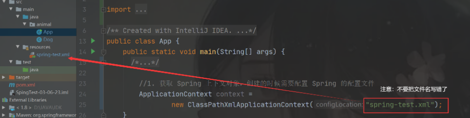

------

#### 6.2.6.2 获取指定的 Bean 对象

**getBean() 方法的使用**

getBean() 方法有很多种重载的方法，我们也可以使用其他的方法来获取 Bean 对象。

**方法1. 根据 bean 对象的 id （标志）来获取 **

```java
//1. 获取 Spring 上下文对象，创建的时候需要配置 Spring 的配置文件
ApplicationContext context = new ClassPathXmlApplicationContext("spring-test.xml");

//2. 从 Spring 上下文中取出某个 bean 对象
Dog dog = (Dog)context.getBean("dog"); // dog是我们给 Dog 类的实例取得的标志（名字）
```

使用 bean对象的 id 来获取，Spring 上下文对象—— context 的返回值是 Object, 所以需要进行强制类型转换。 

**注意事项：**

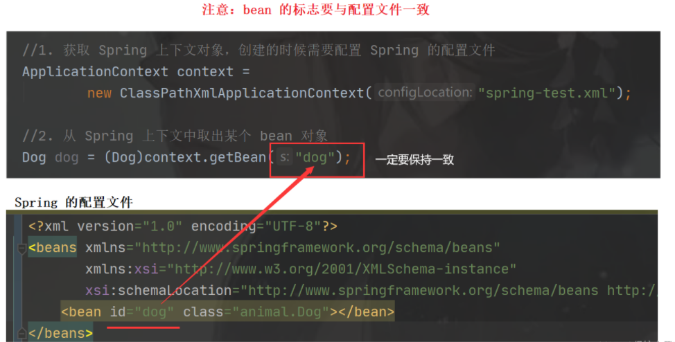

**否则会抛出：NoSuchBeanDefinitionException 异常**

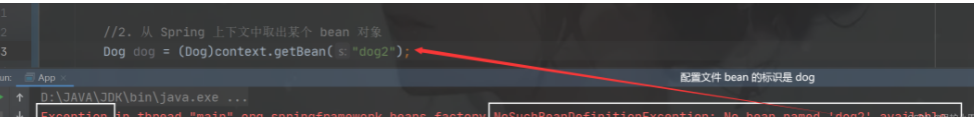

**方法2. 根据类型来获取 Bean** 

```java
Dog dog = context.getBean(Dog.class);
```

因为我们直接使用 bean 对象的类型来获取，所以我们无需手动强制类型转换，在获取的时候会自动强转。

**方法3. 根据** **bean 对象的 id （标志）+ 类型 获取 bean**   <font color=red>(推荐)</font>

```java
 Dog dog = context.getBean("dog", Dog.class);
```

------

**4.3 使用 Bean 对象**

==其实 Bean 对像就是普通的实例化的对象，Bean 对象只是一个名字。==所以Bean 对象的使用跟我们传统对象的使用并无差异：

```java
public class App {
    public static void main(String[] args) {
        //1. 获取 Spring 上下文对象，创建的时候需要配置 Spring 的配置文件
        ApplicationContext context =
                new ClassPathXmlApplicationContext("spring-test.xml");
 
        //2. 使用类型从 Spring 容器中获取 bean 对象
        Dog dog = context.getBean("dog",Dog.class);
 
        //3. bean 对象的使用
        dog.setName("哈巴狗");
        dog.setAge(3);
        dog.setSex("公");
        dog.setColor("白色");
        dog.cry();
        System.out.println(dog.toString());  
    }
}
```

```
animal.Dog{我叫做:'哈巴狗'，我今年:3岁，我的性别是:公，我是'白色'的}
```

## 6.3.注解方式(推荐)

注解（Annotation），也叫元数据。它是一种代码级别的说明，是jdk1.5之后引入的一个特性。

注解的作用：

1. 编写文档：通过代码里标识的元数据生成文档。
2. 代码分析：通过代码里标识的元数据对代码进行分析。
3. 编译检查：通过代码里标识的元数据让编译器能够实现基本的编译检查。

```java
//@Override就是一个编译检查注解
@Override
public int saveBusiness(String businessName) {}
```

注解基本语法：@注解名称(属性=属性值)

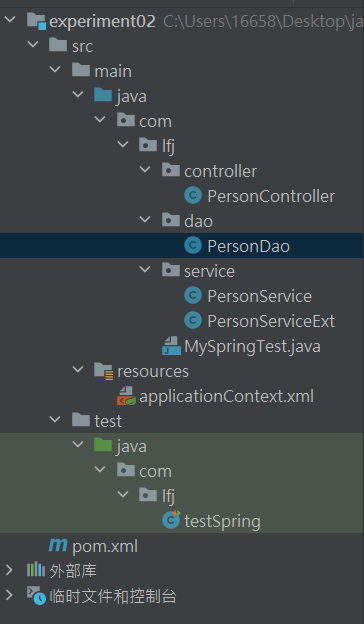

### 6.3.1 修改dao实现类

```java
package com.lfj.dao;

/**
 * @Author: LFJ
 * @Date: 2023-10-08 17:14
 */

public interface PersonDao {
	void getPerson();
}
```

```java
package com.lfj.dao.impl;

import com.lfj.dao.PersonDao;
import org.springframework.context.annotation.Scope;
import org.springframework.stereotype.Repository;

/**
 * @Author: LFJ
 * @Date: 2023-10-08 22:00
 */

@Repository()
@Scope(value = "prototype")
public class PersonDaoImpl implements PersonDao {
	public void getPerson() {
		System.out.println("PersonDao:getPerson");
	}
}
```

### 6.3.2 修改Service实现类

```java
package com.lfj.service;

/**
 * @Author: LFJ
 * @Date: 2023-10-08 17:08
 */

public interface PersonService {
	void getPerson();
}

```

```java
package com.lfj.service.impl;

import com.lfj.dao.PersonDao;
import com.lfj.service.PersonService;
import org.springframework.beans.factory.annotation.Autowired;
import org.springframework.stereotype.Service;

/**
 * @Author: LFJ
 * @Date: 2023-10-08 22:10
 */

@Service("PersonServiceImpl")
//或者 @Component("PersonServiceImpl")
public class PersonServiceImpl implements PersonService {

	@Autowired
	private PersonDao personDao;

	public void getPerson() {
		System.out.println("PersonServiceImpl......");
		personDao.getPerson();
	}
}
```

```java
package com.lfj.service.impl;

import com.lfj.dao.PersonDao;
import com.lfj.service.PersonService;
import org.springframework.beans.factory.annotation.Autowired;
import org.springframework.stereotype.Service;

/**
 * @Author: LFJ
 * @Date: 2023-10-08 21:14
 */

//Service报错
@Service("PersonServiceExt")
//或者 @Component("PersonServiceExt")
public class PersonServiceExt implements PersonService {

	@Autowired
	private PersonDao personDao;

	public void getPerson() {
		System.out.println("PersonServiceExt......");
		personDao.getPerson();
	}
}
```

### 6.3.3 controller类

```java
package com.lfj.controller;

import com.lfj.dao.PersonDao;
import com.lfj.service.PersonService;
import org.springframework.beans.factory.annotation.Autowired;
import org.springframework.beans.factory.annotation.Qualifier;

import javax.annotation.Resource;

/**
 * @Author: LFJ
 * @Date: 2023-10-08 17:07
 */
public class PersonController {

	@Qualifier("personService")  //指定使用哪个类，来为以下的属性进行注入(父类 xxx = new 子类)
	@Autowired
	private PersonService personService;

	//@AutoWired只适合spring框架，而@Resource扩展性更好
	@Qualifier("PersonServiceExt")
	@Resource
	private PersonService personServiceExt2;

	public PersonController() {
		System.out.println("创建对象");
	}

	public void getPerson() {
		personService.getPerson();
	}

	public void getPerson2() {
		personServiceExt2.getPerson();
	}

	/**
	 * 当方法上有@AutoWired注解时：
	 * 1、此方法在bean创建的时候会自动调用
	 * 2、这个方法的每一个参数都会自动注入值
	 *
	 * @param personDao
	 */
	@Autowired
	public void test(PersonDao personDao) {
		System.out.println("此方法被调用:" + personDao);
	}

	/**
	 * @param personService
	 * @Qualifier注解也可以作用在属性上，用来被当作id去匹配容器中的对象，如果没有此注解，那么直接按照类型进行匹配
	 */
	@Autowired
	public void test2(@Qualifier("personServiceExt") PersonService personService) {
		System.out.println("此方法被调用：" + personService);
	}
}

```

### 6.3.4 修改Spring配置文件

resources下创建配置文件,  命名无限制，约定俗成命名有：spring-context.xml、applicationContext.xml、beans.xml

applicationContext.xml

```xml
<?xml version="1.0" encoding="UTF-8"?>
<beans xmlns:xsi="http://www.w3.org/2001/XMLSchema-instance"
       xmlns:context="http://www.springframework.org/schema/context"
       xmlns="http://www.springframework.org/schema/beans"
       xsi:schemaLocation="http://www.springframework.org/schema/beans
       http://www.springframework.org/schema/beans/spring-beans.xsd
        http://www.springframework.org/schema/context
        http://www.springframework.org/schema/context/spring-context.xsd">
    <!--添加-->
    <context:component-scan base-package="com.lfj"></context:component-scan>
    <!--指定只扫描哪些组件，默认情况下是全部扫描的-->
    <!--<context:include-filter type="assignable" expression="com.lfj.service.PersonService"/>-->
</beans>
```

context:component-scan标签中的base-package属性，设置需要扫描的包。 会到指定包（包括指定包下的所有子包）中扫描类、方法、属性上面是否有注解。（如有多个，可使用逗号分隔）

### 6.3.5 测试类

```java
package com.lfj;

import com.lfj.service.PersonService;
import org.junit.Test;
import org.junit.runner.RunWith;
import org.springframework.beans.factory.annotation.Autowired;
import org.springframework.beans.factory.annotation.Qualifier;
import org.springframework.test.context.ContextConfiguration;
import org.springframework.test.context.junit4.SpringJUnit4ClassRunner;

/**
 * @Author: LFJ
 * @Date: 2023-10-08 21:29
 */

@RunWith(SpringJUnit4ClassRunner.class)
@ContextConfiguration(locations = "classpath:applicationContext.xml")
public class testSpring {

	@Qualifier("PersonServiceExt")
	@Autowired
	PersonService personService1;

	@Qualifier("PersonServiceImpl")
	@Autowired
	PersonService personService2;

	@Test
	public void test1() {
		personService1.getPerson();
	}

	@Test
	public void test2() {
		personService2.getPerson();
	}
}
```

```
PersonServiceExt......
PersonDao:getPerson

PersonServiceImpl......
PersonDao:getPerson
```

具体代码见:   [注解方式代码.zip](code\注解方式代码.zip) 

## 6.4.javaConfig方式

==@Configuration+@Bean  bean注册(人为) —> 用于配置类==

javaConfig，是在 Spring 3.0 开始从一个独立的项目并入到 Spring 中的。javaConfig 可以看成一个用于完成 Bean 装配的 Spring 配置文件，即 Spring 容器，只不过该容器不是 XML文件，而是由程序员使用 java 自己编写的 java 类。

一个类中只要标注了@Configuration注解，这个类就可以为spring容器提供Bean定义的信息了，或者说这个类就成为一个spring容器了。

标注了@Configuration和标注了@Component的类一样是一个Bean，可以被Spring的 context:component-scan 标签扫描到。类中的每个标注了@Bean的方法都相当于提供了一个Bean的定义信息。

### 6.4.1 配置类

```java
@Configuration    // 就相当于创建了一个xml 文件 <beans></beans> //表示里面的Bean彼此有依赖关系
@ComponentScan("cn.tulingxueyuan")   //<context:component-scan base-package="cn.tulingxueyuan" >
@PropertySource("classpath:db.properties")
public class MainConfiration  {


    @Value("${mysql.username}")
    private String name;
    @Value("${mysql.password}")
    private String password;
    @Value("${mysql.url}")
    private String url;
    @Value("${mysql.driverClassName}")
    private String driverName;


    // <bean class="com.alibaba.druid.pool.DruidDataSource" id="dataSource"></bean>
    // 可以干预Bean实例化过程！
    @Bean()
    public DruidDataSource dataSource(){
        DruidDataSource dataSource=new DruidDataSource();
        dataSource.setName(name);
        dataSource.setPassword(password);
        dataSource.setUrl(url);
        dataSource.setDriverClassName(driverName);
        return dataSource;

    }

    //接受生命周期回调
    //init-method="initByConfig" destroy-method="destroyByConfig"
    @Bean(initMethod = "initByConfig",destroyMethod = "destroyByConfig")
    public User userconf(){

        return  new User();
    }
    
    //自定义Bean的名字
    @Bean(name = "myThing")
    //多个别名：@Bean(name = { "dataSource", "subsystemA-dataSource", "subsystemB-dataSource" })
    public Thing thing() {
        return new Thing();
    }
    
    //指定 Bean 的作用域
    @Bean
    @Scope("prototype")
    public Encryptor encryptor() {
        // ...
    }
    
}

//@Import 注解允许从另一个配置类加载@Bean定义
@Configuration
@Import(ConfigA.class)
public class ConfigB {

    @Bean
    public B b() {
        return new B();
    }
}

@Configuration
public class ConfigA {

    @Bean
    public A a() {
        return new A();
    }
}

@Configuration
public class AppConfig {
    @Bean
    public UserDao userDao() {
        return new UserDaoImpl();
    }
    @Bean
    public UserService userService() {
        //这里不能声明接口类型
        UserServiceImpl userService = new UserServiceImpl();
        //配置依赖关系（需要set方法）
        userService.setUserDao(userDao());
        return userService;
    }
}
```

### 6.4.2 测试

```java
@Test
public void test01(){
    ApplicationContext ioc=new AnnotationConfigApplicationContext(MainConfiration.class);
    UserController bean = ioc.getBean(UserController.class);
    bean.getUser();
}
```

# 十、Bean细节

## 10.1 控制简单对象的单例、多例模式（new）

配置< bean scope="singleton | prototype" />

```xml
<!--
	singleton（默认）：每次调用工厂，得到的都是同一个对象。
	prototype：每次调用工厂，都会创建新的对象。
-->
<bean id="mc" class="com.qf.zcg.spring.day1.t1.basic.MyClass" scope="singleton" /> 
```

- 注意：需要根据场景决定对象的单例、多例模式。
- 可以共用：Service、DAO、SqlSessionFactory（或者是所有的工厂）。
- 不可共用：Connection、SqlSession、ShoppingCart。

优缺点：

单例模式：对象的创建，只需要创建一次，节约我们内存空间，速度飞快，线程不安全。（volidate） （即时加载）

多例模式：线程安全，每次使用对象的时候才创建，速度慢，内存消耗大（延迟加载）

## 10.2 FactoryBean创建复杂对象【重点】

作用：让Spring可以创建复杂对象、或者无法直接通过反射创建的对象。

| FactoryBean解决复杂对象创建                                  |
| ------------------------------------------------------------ |
| 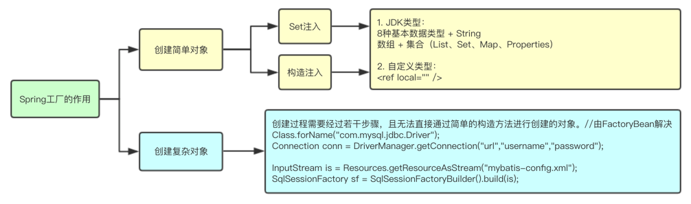 |

### 10.2.1 实现FactoryBean接口

| 接口方法描述                                                 |
| ------------------------------------------------------------ |
| 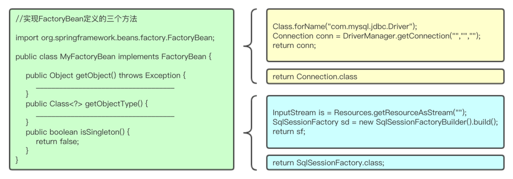 |

- 注意：isSingleton方法的返回值，需根据所创建对象的特点决定返回true/false。
- 例如：Connection 不应该被多个用户共享，返回false。
- 例如：SqlSessionFactory 重量级资源，不该过多创建，返回true。

### 10.2.2 配置spring-context.xml

| 配置与获取方式                                               |
| ------------------------------------------------------------ |
| 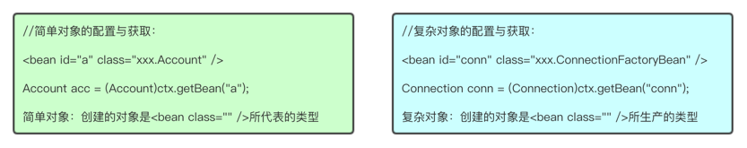 |

### 10.2.3 特例

| 获取FactoryBean接口的实现类对象，而非getObject()所生产的对象。 |
| :----------------------------------------------------------- |
| 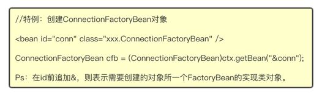 |

# 十一、 整合Jdbc

代码见:  [jdbc整合.zip](code\jdbc整合.zip) 

依赖

```xml
		<!-- spring-jdbc -->
        <dependency>
            <groupId>org.springframework</groupId>
            <artifactId>spring-jdbc</artifactId>
            <version>5.2.3.RELEASE</version>
        </dependency>
        
        <!--MySql驱动依赖-->
        <dependency>
            <groupId>mysql</groupId>
            <artifactId>mysql-connector-java</artifactId>
            <version>5.1.47</version>
        </dependency>
```

## 11.1 Spring配置文件

```xml
<?xml version="1.0" encoding="UTF-8"?>
<beans xmlns:xsi="http://www.w3.org/2001/XMLSchema-instance"
       xmlns:context="http://www.springframework.org/schema/context"
       xmlns="http://www.springframework.org/schema/beans"
       xsi:schemaLocation="http://www.springframework.org/schema/beans
       http://www.springframework.org/schema/beans/spring-beans.xsd
        http://www.springframework.org/schema/context
        http://www.springframework.org/schema/context/spring-context.xsd">
    <context:component-scan base-package="com.lfj"></context:component-scan>

    <!-- 1配置数据源 -->
    <bean id="dataSource" class="org.springframework.jdbc.datasource.DriverManagerDataSource">
        <!--数据库驱动 -->
        <property name="driverClassName" value="com.mysql.jdbc.Driver"/>
        <!--连接数据库的url -->
        <property name="url" value="jdbc:mysql://localhost/experiment02_spring"/>
        <!--连接数据库的用户名 -->
        <property name="username" value="root"/>
        <!--连接数据库的密码 -->
        <property name="password" value="741106"/>
    </bean>
    <!-- 2配置JDBC模板 -->
    <bean id="jdbcTemplate"
          class="org.springframework.jdbc.core.JdbcTemplate">
        <!-- 默认必须使用数据源 -->
        <property name="dataSource" ref="dataSource"/>
    </bean>

    <!--3.定义id为accountDao的Bean-->
    <bean id="accountDao" class="com.lfj.dao.impl.AccountDaoImpl">
        <!--属性赋值-->
        <!-- 将jdbcTemplate注入到accountDao实例中 -->
        <property name="jdbcTemplate" ref="jdbcTemplate"/>
    </bean>

</beans>
```

## 11.2 实体类

```java
package com.lfj.entity;

/**
 * @Author: LFJ
 * @Date: 2023-10-09 11:56
 */

public class Account {
	private Integer id;        // 账户id
	private String username;    // 用户名
	private Double balance;    // 账户余额
	
	public Integer getId() {
		return id;
	}

	public void setId(Integer id) {
		this.id = id;
	}

	public String getUsername() {
		return username;
	}

	public void setUsername(String username) {
		this.username = username;
	}

	public Double getBalance() {
		return balance;
	}

	public void setBalance(Double balance) {
		this.balance = balance;
	}

	@Override
	public String toString() {
		return "Account{" +
				"id=" + id +
				", username='" + username + '\'' +
				", balance=" + balance +
				'}';
	}
}
```

## 11.3 doa层

接口

```java
package com.lfj.dao;

import com.lfj.entity.Account;

import java.util.List;

/**
 * @Author: LFJ
 * @Date: 2023-10-09 11:58
 */
public interface AccountDao {
	// 添加
	int addAccount(Account account);

	// 更新
	int updateAccount(Account account);

	// 删除
	int deleteAccount(int id);

	// 通过id查询 
	Account findAccountById(int id);

	// 查询所有账户
	List<Account> findAllAccount();
}
```

实现

```java
package com.lfj.dao.impl;

import com.lfj.dao.AccountDao;
import com.lfj.entity.Account;
import org.springframework.jdbc.core.BeanPropertyRowMapper;
import org.springframework.jdbc.core.JdbcTemplate;
import org.springframework.jdbc.core.RowMapper;

import java.util.List;

/**
 * @Author: LFJ
 * @Date: 2023-10-09 11:58
 */

public class AccountDaoImpl implements AccountDao {
	// 定义JdbcTemplate属性及其setter方法
	private JdbcTemplate jdbcTemplate;   // 通过xml注入


	public void setJdbcTemplate(JdbcTemplate jdbcTemplate) {
		this.jdbcTemplate = jdbcTemplate;
	}

	// 添加账户
	@Override
	public int addAccount(Account account) {
		// 定义SQL
		String sql = "insert into account(username,balance) value(?,?)";
		// 定义数组来存放SQL语句中的参数
		Object[] obj = new Object[]{
				account.getUsername(),
				account.getBalance()
		};
		// 执行添加操作，返回的是受SQL语句影响的记录条数
		int num = this.jdbcTemplate.update(sql, obj);
		return num;
	}

	// 更新账户
	@Override
	public int updateAccount(Account account) {
		// 定义SQL
		String sql = "update account set username=?,balance=? where id = ?";
		// 定义数组来存放SQL语句中的参数
		Object[] params = new Object[]{
				account.getUsername(),
				account.getBalance(),
				account.getId()
		};
		// 执行更新操作，返回的是受SQL语句影响的记录条数
		int num = this.jdbcTemplate.update(sql, params);
		return num;
	}

	// 删除账户
	@Override
	public int deleteAccount(int id) {
		// 定义SQL
		String sql = "delete  from account where id = ? ";
		// 执行删除操作，返回的是受SQL语句影响的记录条数
		int num = this.jdbcTemplate.update(sql, id);
		return num;
	}

	// 通过id查询账户数据信息
	public Account findAccountById(int id) {
		//定义SQL语句
		String sql = "select * from account where id = ?";
		// 创建一个新的BeanPropertyRowMapper对象
		RowMapper<Account> rowMapper = new BeanPropertyRowMapper<Account>(Account.class);
		// 将id绑定到SQL语句中， 并通过RowMapper返回一个Object类型的 单行记录
		return this.jdbcTemplate.queryForObject(sql, rowMapper, id);
	}

	// 查询所有账户信息
	public List<Account> findAllAccount() {
		//定义SQL语句
		String sql = "select * from account";
		// 创建一个新的BeanPropertyRowMapper对象
		RowMapper<Account> rowMapper = new BeanPropertyRowMapper<Account>(Account.class);
		//执行静态的SQL查询，并通过RowMapper返回结果
		return this.jdbcTemplate.query(sql, rowMapper);
	}
}

```

## 11.4 测试

```java
package com.lfj.test1;

import org.junit.Test;
import org.junit.runner.RunWith;
import org.springframework.context.ApplicationContext;
import org.springframework.context.support.ClassPathXmlApplicationContext;
import org.springframework.jdbc.core.JdbcTemplate;
import org.springframework.test.context.ContextConfiguration;
import org.springframework.test.context.junit4.SpringJUnit4ClassRunner;

/**
 * @Author: LFJ
 * @Date: 2023-10-09 11:50
 */

@RunWith(SpringJUnit4ClassRunner.class)
@ContextConfiguration(locations = "classpath:applicationContext.xml")
public class TestJdbcTemplate {

	/**
	 * 调用execute()方法建表
	 */
	@Test
	public void testJdbcTemplate() {

		// 初始化spring容器，加载applicationContext.xml配置
		ApplicationContext applicationContext = new
				ClassPathXmlApplicationContext("applicationContext.xml");
		// 通过容器，获取JdbcTemplate的实例
		JdbcTemplate jdTemplate =
				(JdbcTemplate) applicationContext.getBean("jdbcTemplate");
		// 使用execute()方法执行SQL语句，创建用户账户管理表account
		jdTemplate.execute("create table account(" +
				"id int primary key auto_increment," +
				"username varchar(50)," +
				"balance double)");
		System.out.println("账户表account创建成功！");
	}
    
    @Test
	public void testAddAccount() {
		//1. 获取 Spring 上下文对象，创建的时候需要配置 Spring 的配置文件
		ApplicationContext applicationContext = new
				ClassPathXmlApplicationContext("applicationContext.xml");
		//2. 获取指定的 Bean 对象
		AccountDao accountDao =
				applicationContext.getBean("accountDao", AccountDao.class);
		// 创建Account对象，并向Account对象中添加数据
		Account account = new Account();
		account.setUsername("tom");
		account.setBalance(1000.00);
		// 执行addAccount()方法，并获取返回结果
		int num = accountDao.addAccount(account);
		if (num > 0) {
			System.out.println("成功插入了" + num + "条数据！");
		} else {
			System.out.println("插入操作执行失败！");
		}
	}
    
    @Test
	public void testDeleteAccount() {
		//1. 获取 Spring 上下文对象，创建的时候需要配置 Spring 的配置文件
		ApplicationContext applicationContext = new
				ClassPathXmlApplicationContext("applicationContext.xml");
		//2. 获取指定的 Bean 对象
		AccountDao accountDao =
				applicationContext.getBean("accountDao", AccountDao.class);
		// 执行deleteAccount()方法，并获取返回结果
		int num = accountDao.deleteAccount(1);
		if (num > 0) {
			System.out.println("成功删除了" + num + "条数据！");
		} else {
			System.out.println("删除操作执行失败！");
		}
	}
    
    @Test
	public void testUpdateAccount() {
		//1. 获取 Spring 上下文对象，创建的时候需要配置 Spring 的配置文件
		ApplicationContext applicationContext = new
				ClassPathXmlApplicationContext("applicationContext.xml");
		//2. 获取指定的 Bean 对象
		AccountDao accountDao =
				applicationContext.getBean("accountDao", AccountDao.class);
		// 创建Account对象，并向Account对象中添加数据
		Account account = new Account();
		account.setId(1);
		account.setUsername("tom");
		account.setBalance(2000.00);
		// 执行updateAccount()方法，并获取返回结果
		int num = accountDao.updateAccount(account);
		if (num > 0) {
			System.out.println("成功修改了" + num + "条数据！");
		} else {
			System.out.println("修改操作执行失败！");
		}
	}
    
    
    @Test
	public void findAccountByIdTest() {
		// 加载配置文件
		ApplicationContext applicationContext = new
				ClassPathXmlApplicationContext("applicationContext.xml");
		// 获取AccountDao实例
		AccountDao accountDao =
				(AccountDao) applicationContext.getBean("accountDao");
		// 执行findAccountById()方法
		Account account = accountDao.findAccountById(2);
		System.out.println(account);
	}
    
    @Test
	public void findAllAccountTest() {
		// 加载配置文件
		ApplicationContext applicationContext = new
				ClassPathXmlApplicationContext("applicationContext.xml");
		// 获取AccountDao实例
		AccountDao accountDao =
				(AccountDao) applicationContext.getBean("accountDao");
		// 执行findAllAccount()方法,获取Account对象的集合
		List<Account> account = accountDao.findAllAccount();
		// 循环输出集合中的对象
		for (Account act : account) {
			System.out.println(act);
		}
	}
}
```


# 十二、Spring工厂特性

------

## 12.1 饿汉式创建优势

工厂创建之后，会将Spring配置文件中的所有对象都创建完成（饿汉式）。

提高程序运行效率。避免多次IO，减少对象创建时间。（概念接近连接池，一次性创建好，使用时直接获取）

## 12.2 生命周期方法

-  自定义初始化方法：添加“init-method”属性，Spring则会在创建对象之后，调用此方法。 
-  自定义销毁方法：添加“destroy-method”属性，Spring则会在销毁对象之前，调用此方法。 
-  销毁：工厂的close()方法被调用之后，Spring会毁掉所有已创建的单例对象。 
-  分类：Singleton对象由Spring容器销毁、Prototype对象由JVM销毁。 

## 12.3 生命周期注解

初始化注解、销毁注解

```java
import javax.annotation.PostConstruct;
import javax.annotation.PreDestroy;

@PostConstruct //初始化 
public void init(){
    System.out.println("init method executed");
}

@PreDestroy //销毁
public void destroy(){
    System.out.println("destroy method executed");
}
```

## 12.4 生命周期阶段（面试重点）

**单例bean：**singleton

随工厂启动创建 ==》  构造方法  ==》 set方法(注入值)  ==》 init(初始化)  ==》 构建完成 ==》随工厂关闭销毁

**多例bean：**prototype

被使用时创建 ==》  构造方法  ==》 set方法(注入值)  ==》 init(初始化)  ==》 构建完成 ==》JVM垃圾回收销毁

作业:升级我们 单车app 和 东郊app 把mybatis拉入spring管理 只能用 factorybean


# 十三、代理设计模式

------

## 13.1 概念

将核心功能与辅助功能（事务、日志、性能监控代码）分离，达到核心业务功能更纯粹、辅助业务功能可复用。

| 功能分离                                                     |
| ------------------------------------------------------------ |
| 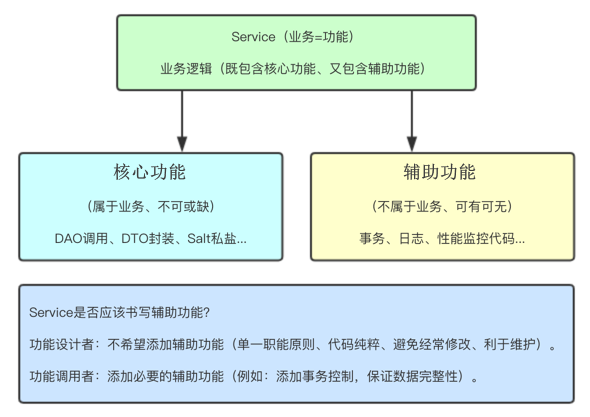 |

## 13.2 静态代理设计模式

通过代理类的对象，为原始类的对象（目标类的对象）添加辅助功能，更容易更换代理实现类、利于维护。

| 静态代理                                                     |
| ------------------------------------------------------------ |
| 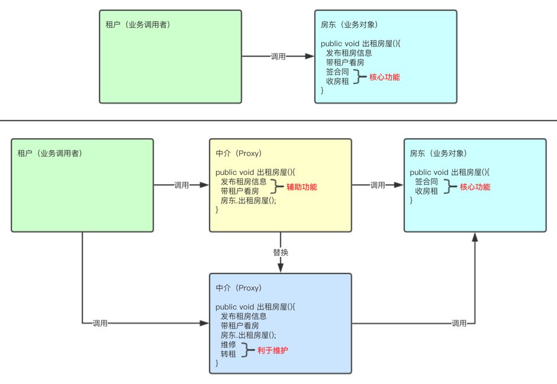 |

- 代理类 = 实现原始类相同接口 + 添加辅助功能 + 调用原始类的业务方法。
- 静态代理的问题 

- - 代理类数量过多，不利于项目的管理。
  - 多个代理类的辅助功能代码冗余，修改时，维护性差。

## 13.3 动态代理设计模式 (jdk cglab)

动态创建代理类的对象，为原始类的对象添加辅助功能。

### 13.3.1 JDK动态代理实现（基于接口）

```java
 final Car car = new CarFactory();// 目标
        //匿名内部类
        //额外功能
        InvocationHandler  invocationHandler = new InvocationHandler() {
            @Override
            public Object invoke(Object proxy, Method method, Object[] args) throws Throwable {
                System.out.println("送车模");
                Object invoke = method.invoke(car, args);//用反射执行类里面方法，方法的参数
                System.out.println("送保养");
                return invoke;
            }
        };

        Car obj = (Car)Proxy.newProxyInstance(DynamicProxy.class.getClassLoader(), new Class[]{Car.class}, invocationHandler);
        System.out.println(obj.car());
```

### 13.3.2 CGlib动态代理实现（基于继承）

```java
final OrderService os = new OrderServiceImpl();
Enhancer cnh = new Enhancer();//1.创建字节码曾强对象
enh.setSuperclass(os.getClass());//2.设置父类（等价于实现原始类接口）
enh.setCallback(new InvocationHandler(){//3.设置回调函数（额外功能代码）
    @Override
    public Object invoke(Object proxy , Method method, Object[] args) throws Throwable{
        System.out.println("start...");
        Object ret = method.invoke(os,args);
        System.out.println("end...");
        return ret;
    }
});
OrderService proxy = (OrderService)enh.create();//4.创建动态代理类
proxy,createOrder();
```

# 十四、AOP（面向切面）

## 3.1 概要

AOP：全称是 Aspect Oriented Programming 即：面向切面编程。

简单的说它就是把我们程序重复的代码抽取出来，在需要执行的时候，使用动态代理的技术，在不修改源码的基础上，对我们的已有方法进行增强。

即当需要扩展功能时，传统方式采用纵向继承方式实现。但这种方式有很多缺点。 比如：父类方法名称改变时，子类也要修改。给多个方法扩展功能时，子类也需要修改。 因此，spring的AOP，实际上是采用横向抽取机制，取代传统的纵向继承体系。

实现AOP示意图：

```xml
1. 目标类 原始类
	指的是 业务（Service）类（核心功能 --> 业务运算 DAO调用）
2. 目标方法，原始方法
	目标类(原始类)中的方法 就是目标方法(原始方法)
3. 额外功能（附加功能）
```

静态代理

+ Service接口 提供方法
+ ServiceImpl类 实现接口的方法- 核心功能
+ ServiceProxy类 实现接口的方法- 再加上额外功能，同时调用 ServiceImpl类 的对应方法

缺点

+ 不方便管理，每一个Service都需要一个Proxy类
+ 不方便管理，额外功能修改起来可能会改很多的地方

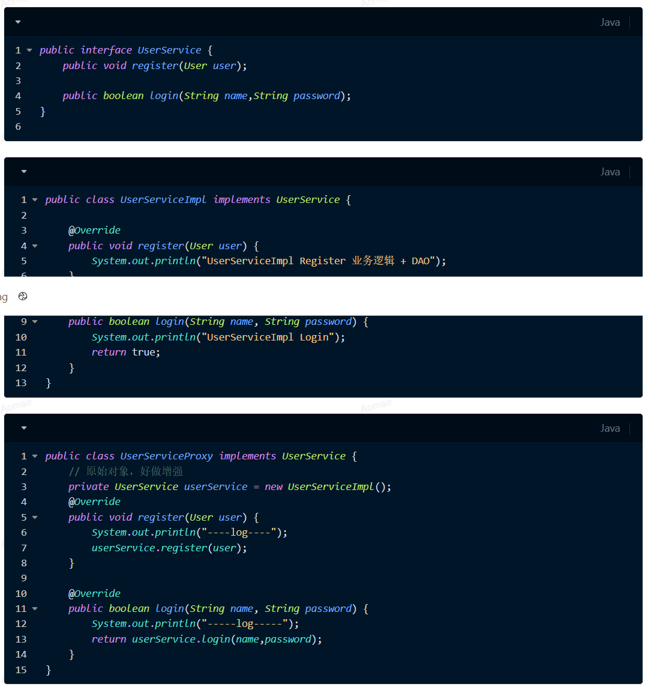

## 3.2 使用注解方式实现AOP

下面例子功能为：在运行业务方法前，输出一段日志。

### 3.2.1 添加aspectj依赖

Aspectj是一个基于java的、面向切面的AOP框架。Spring2.0之后增加了对Aspectj切点表达式的支持。而实际开发中一般都使用Aspectj方式来实现AOP。所以还要导入Aspectj相关jar包。

```xml
<dependency>
  <groupId>org.aspectj</groupId>
  <artifactId>aspectjweaver</artifactId>
  <version>1.8.7</version>
</dependency>
```

### 3.2.2 抽取方面代码封装通知对象

在实际开发中，除了业务逻辑这个主要功能之外，还需要处理许多辅助功能。 比如：日志、异常处理、事务、输入验证、安全等等，我们将这些代码称为：**方面代码**。而方面代码，就是我们要抽取出来的。

下面抽取日志方面代码：

```java
package com.neusoft.advice;
import org.aspectj.lang.JoinPoint;
import org.aspectj.lang.annotation.Aspect;
import org.aspectj.lang.annotation.Before;
import org.springframework.stereotype.Component;
@Component
@Aspect     //@Aspect定义此类为方面代码，即是一个通知。
public class MyAdvice {
    @Before("execution(* com.neusoft.service.impl.*.*(..))")
    public void beforeMethod(JoinPoint joinpoint){
        System.out.println("【前置通知日志】" + joinpoint.toString());
    }
}
```

1. @Aspect注解：定义此类为方面代码，即是一个通知。
2. @Before注解：定义一个前置通知。即在目标方法执行前切入此注解标注的方法。
3. execution() 是一个Aspect表达式，语法为：execution(返回值类型 包名.类名.方法名 (参数) 异常)

```java
/*
* 例如：execution(* com.neusoft.service.impl.*.*(..))
* 第一个 *：所有的返回值类型
* 第二个 *：所有的类
* 第三个 *：所有的方法
* 第四个 .. ：所有的参数
*/
```

### 3.2.3 修改Spring配置文件

```xml
<?xml version="1.0" encoding="UTF-8"?>
<beans
  xmlns="http://www.springframework.org/schema/beans"
  xmlns:context="http://www.springframework.org/schema/context"
  xmlns:aop="http://www.springframework.org/schema/aop"
  xmlns:xsi="http://www.w3.org/2001/XMLSchema-instance"
  xsi:schemaLocation="http://www.springframework.org/schema/beans 
  http://www.springframework.org/schema/beans/spring-beans.xsd
  http://www.springframework.org/schema/context 
  http://www.springframework.org/schema/context/spring-context.xsd
  http://www.springframework.org/schema/aop 
  http://www.springframework.org/schema/aop/spring-aop-4.1.xsd">
  <!--开启注解扫描，设置需要扫描的包  -->
  <context:component-scan base-package="com.neusoft"/>
  <!-- 声明自动为spring容器中那些配置@Aspect切面的bean创建代理，织入切面。 -->
  <aop:aspectj-autoproxy/>
</beans>
```

aop:aspectj-autoproxy标签：声明自动为spring容器中那些配置@Aspect切面的bean创建代理，织入切面。

### 3.2.4 测试

```java
public static void main(String[] args) {
    //读取Spring配置文件,获取Spring容器
    ApplicationContext context = new  ClassPathXmlApplicationContext("spring.xml");
    //通过Spring容器的getBean方法获得对象
    UserService service = (UserService)context.getBean("userService");
    User user = service.getUser();
    System.out.println(user);
}
```

## 3.3 五种通知类型

方面代码一般也称为通知：定义一个“切面”要实现的功能。通知有五种：

1. 前置通知：在某连接点（JoinPoint 就是要织入的业务方法）之前执行的通知。
2. 后置通知：当某连接点退出时执行的通知（不论是正常结束还是发生异常）。
3. 返回通知：（最终通知）在这里可以得到业务方法的返回值。但在发生异常时无法得到返回值。
4. 环绕通知：包围一个连接点的通知，也就是在业务方法执行前和执行后执行的通知。
5. 异常通知：在业务方法发生异常时执行的通知。

```java
package com.neusoft.advice;
import org.aspectj.lang.JoinPoint;
import org.aspectj.lang.ProceedingJoinPoint;
import org.aspectj.lang.annotation.After;
import org.aspectj.lang.annotation.AfterReturning;
import org.aspectj.lang.annotation.AfterThrowing;
import org.aspectj.lang.annotation.Around;
import org.aspectj.lang.annotation.Aspect;
import org.aspectj.lang.annotation.Before;
import org.aspectj.lang.annotation.Pointcut;
import org.springframework.stereotype.Component;
@Component
@Aspect
public class MyAdvice {
    //定义通用Aspect表达式，下面通知方法就可以引用此方法的规则了
    @Pointcut("execution(* com.neusoft.service.impl.*.*(..))")
    private void anyMethod(){}
    @Before("anyMethod()")
    public void beforeMethod(JoinPoint joinpoint){
        System.out.println("【前置通知日志】" + joinpoint.toString());
    }
    @After("anyMethod()")
    public void afterMethod(JoinPoint joinpoint){
        System.out.println("后置通知日志" + joinpoint.toString());
    }
    @AfterReturning(pointcut="anyMethod()",returning="result")
    public void afterReturnning(JoinPoint joinpoint,Object result){
        System.out.println("返回通知日志" + joinpoint.toString());
    }
    @AfterThrowing(pointcut="anyMethod()",throwing="ex")
    public void afterThrowing(JoinPoint joinpoint,Exception ex){
        System.out.println("异常通知日志" + joinpoint.toString());
    }
    @Around("anyMethod()")
    public Object aroundMethod(ProceedingJoinPoint pjp) {
        Object obj = null;
        try{
            System.out.println("环绕通知日志" + pjp.toString());
            obj = pjp.proceed();
        }catch(Throwable e){
            e.printStackTrace();
        }
        return obj;
    }
}
```

注意：

1. 如果配置了环绕通知，那么业务方法的执行将在环绕通知中的obj = pjp.proceed();这段代码时开始执行。此时要注意：如果环绕通知方法不写返回值，或者obj = pjp.proceed()这段代码如果不取得返回值，那么返回通知也不能取得返回值。
2. 有了环绕通知，异常通知也将失去作用。
3. 实际上，如果要配置环绕通知，那么其他通知就失去意义了。因为在环绕通知中，也可以在方法执行前、执行后做方面代码，包括获取返回值、做异常处理等。

## 3.4 Spring动态代理的两种形式

### 3.4.1 两种动态代理

动态代理是一种常用的设计模式，广泛应用于框架中，Spring框架的AOP特性就是应用动态代理实现的。

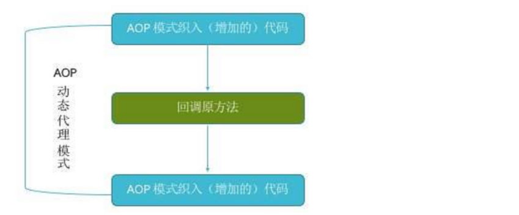

实现动态代理有两种形式：

1. jdk动态代理：根据目标类接口获取代理类实现规则，生成代理对象。这个代理对象，也是目标类接口的一个实现类。
2. cglib动态代理：根据目标类本身获取代理类实现规则，生成代理对象。这个代理对象，也是目标类的一个子类。 （如果目标类为final，则不能使用CGLib实现动态代理）

SpringAOP可以自动在jdk动态代理和CGLib动态代理之间进行切换，规则如下：

1. 如果目标对象实现了接口，采用jdk动态代理实现aop。
2. 如果目标对象没有实现接口，采用CGLib动态代理实现aop。
3. 如果目标对象实现了接口，但仍然想要使用CGLIB实现aop，可以手动进行配置。

我们通过获取执行代码所耗费的时间，来实际测试两种动态代理方式的性能对比。

1. jdk动态代理测试：

```java
public static void main(String[] args) {
    ApplicationContext context = new  ClassPathXmlApplicationContext("spring.xml");
    long begin = System.currentTimeMillis();
    //使用接口
    UserService service = (UserService)context.getBean("userService");
    User user = service.getUser();
    long end = System.currentTimeMillis();
    System.out.println("执行时间："+(end-begin));
}
```

1. cglib动态代理测试：

```java
public static void main(String[] args) {
    ApplicationContext context = new  ClassPathXmlApplicationContext("spring.xml");
    long begin = System.currentTimeMillis();
    //不使用接口
    UserServiceImpl service = (UserServiceImpl)context.getBean("userService");
    User user = service.getUser();
    long end = System.currentTimeMillis();
    System.out.println("执行时间："+(end-begin));
}
```

注意：

1. dao层不能再实现接口。
2. service层不能再实现接口。

## 14.1 概念

AOP（Aspect Oriented Programming），即面向切面编程，利用一种称为"横切"的技术，剖开封装的对象内部，并将那些影响了多个类的公共行为封装到一个可重用模块，并将其命名为"Aspect"，即切面。所谓"切面"，简单说就是那些与业务无关，却为业务模块所共同调用的逻辑或责任封装起来，便于减少系统的重复代码，降低模块之间的耦合度，并有利于未来的可操作性和可维护性。

## 14.2 AOP开发术语

-  连接点(Joinpoint)：连接点是程序类中客观存在的方法，可被Spring拦截并切入内容。 （需要解决问题的方法）
-  切入点(Pointcut)：被Spring切入连接点。(我们需要切入规则定义) 
-  通知、增强(Advice)：可以为切入点添加额外功能，分为：前置通知、后置通知、异常通知、环绕通知等。（新增或者删除、修改功能） 
-  目标对象(Target)：代理的目标对象 （需要处理的类）
-  引介(Introduction)：一种特殊的增强，可在运行期为类动态添加Field和Method。（自己封装的方法） 
-  织入(Weaving)：把通知应用到具体的类，进而创建新的代理类的过程。（编写 我们的额外功能方法过程） 
-  代理(Proxy)：被AOP织入通知后，产生的结果类。（动态生产的代理类） 
-  切面(Aspect)：由切点和通知组成，将横切逻辑织入切面所指定的连接点中。 

## 14.3 作用

Spring的AOP编程即是通过动态代理类为原始类的方法添加辅助功能。

## 14.4 环境搭建

引入AOP相关依赖

```xml
<dependency>
    <groupId>org.springframework</groupId>
    <artifactId>spring-aspects</artifactId>
    <version>5.1.6.RELEASE</version>
</dependency>
```

spring-context.xml引入AOP命名空间

```plain
xmlns:aop="http://www.springframework.org/schema/aop"

http://www.springframework.org/schema/aop
http://www.springframework.org/schema/aop/spring-aop.xsd
```

```xml
<?xml version="1.0" encoding="UTF-8"?>
<beans xmlns="http://www.springframework.org/schema/beans"
       xmlns:context="http://www.springframework.org/schema/context"
       xmlns:aop="http://www.springframework.org/schema/aop"
       xmlns:xsi="http://www.w3.org/2001/XMLSchema-instance"
       xsi:schemaLocation="
       http://www.springframework.org/schema/beans
       http://www.springframework.org/schema/beans/spring-beans.xsd
       http://www.springframework.org/schema/aop
       http://www.springframework.org/schema/aop/spring-aop.xsd
       ">
</beans>
```

## 14.5 开发流程

定义原始类

```java
package com.qf.aaron.aop.basic;

public interface UserService {
    public void save();
}
```

```java
package com.qf.aaron.aop.basic;

public class UserServiceImpl implements UserService {
    public void save() {
        System.out.println("save method executed...");
    }
}
```

定义通知类（添加额外功能）

```java
package com.qf.aaron.aop.basic;
import org.springframework.aop.MethodBeforeAdvice;
import java.lang.reflect.Method;

public class MyAdvice implements MethodBeforeAdvice { //实现前置通知接口
    public void before(Method method, Object[] args, Object target) throws Throwable {
        System.out.println("before advice executed...");
    }
}
```

定义bean标签

```xml
<!--原始对象-->
<bean id="us" class="com.qf.aaron.aop.basic.UserServiceImpl" />

<!--辅助对象-->
<bean id="myAdvice" class="com.qf.aaron.aop.basic.MyAdvice" />
```

定义切入点（PointCut）

形成切面（Aspect）

```xml
<aop:config>
    <!--切点-->
    <aop:pointcut id="myPointCut" expression="execution(* save())" />
</aop:config>
```

```xml
<aop:config>
    <!--组装切面 -->
    <aop:advisor advice-ref="myAdvice" pointcut-ref="myPointCut" />
</aop:config>
```

## 14.6 AOP小结

-  通过AOP提供的编码流程，更便利的定制切面，更方便的定制了动态代理。 
-  进而彻底解决了辅助功能冗余的问题； 
-  业务类中职责单一性得到更好保障； 
-  辅助功能也有很好的复用性。 

## 14.7 通知类【可选】

定义通知类，达到通知效果

```java
前置通知：MethodBeforeAdvice

后置通知：AfterAdvice

后置通知：AfterReturningAdvice //有异常不执行，方法会因异常而结束，无返回值

异常通知：ThrowsAdvice  异常通知需要我的自己编写一个方法
    //异常通知
    public void afterThrowing(Method method, Object[] args, Object target, Exception ex) {
        System.out.println("异常消息");
    }

环绕通知：MethodInterceptor
    
    @Override
    public Object invoke(MethodInvocation methodInvocation) throws Throwable {
        System.out.println("加入前列消息");
        methodInvocation.getMethod().invoke(new UserService(),null);
        System.out.println("加入后列消息");
        return null;
    }
```

注：AfterAdvice  其下有两个子接口：AfterReturningAdvice 和 ThrowsAdvice

AfterReturningAdvice  没有出现异常的时候正常打印通知，如果出现异常，通知失效。

ThrowsAdvice 只有发生异常的时候才生效，正常代码通知失效。

如果我们实现 ThrowsAdvice 里面，必须写连名字都一样afterThrowing方法

```java
public class AopProxyAfter implements AfterReturningAdvice {
    private Logger logger = Logger.getLogger(AopProxy.class);
    @Override
    public void afterReturning(Object o, Method method, Object[] objects, Object o1) throws Throwable {
        logger.debug("this is after advice");
    }
}

//注：异常通知没有方法，需要我们自己编写一个方法
public class AopThrowsAdvice implements ThrowsAdvice {
    private Logger logger = Logger.getLogger(AopProxy.class);
    //异常通知
    public void afterThrowing(Method method, Object[] args, Object target, Exception ex) {
        logger.debug("this is exception advice");
    }
}
<!--目标对象-->
<bean id="userService" class="com.qf.service.UserService" />

<bean id="userDao" class="com.qf.dao.UserDao" />
<!--辅助对象-->
<bean id="aopProxy" class="com.qf.config.AopProxy" />

<bean id="aopProxyAfter" class="com.qf.config.AopProxyAfter" />

<bean id="aopThrowsAdvice" class="com.qf.config.AopThrowsAdvice" />

<aop:config>
  <!--id=随便取名，保持唯一就可以，expression-方法exuction  配置就是规则 -->
  <aop:pointcut id="myPointCut" expression="execution(* save())" />
  
  <!--组装我的切面，切点和额外功能  就成为我的 切面-->
  <aop:advisor advice-ref="aopThrowsAdvice" pointcut-ref="myPointCut" />
  
  <aop:advisor advice-ref="aopProxyAfter" pointcut-ref="myPointCut" />
    </aop:config>
```

## 14.8 通配切入点

根据表达式通配切入点  作业1

execution(* save())

public   void  add(参数)-- 修饰符  返回值 方法名 参数

```xml
<!--匹配参数-->
<aop:pointcut id="myPointCut" expression="execution(* *(com.qf.aaron.aop.basic.User))" />
<!--匹配方法名（无参）-->
<aop:pointcut id="myPointCut" expression="execution(* save())" />
<!--匹配方法名（任意参数）-->
<aop:pointcut id="myPointCut" expression="execution(* save(..))" />
<!--匹配返回值类型-->
<aop:pointcut id="myPointCut" expression="execution(com.qf.aaron.aop.basic.User *(..))" />
<!--匹配类名-->
<aop:pointcut id="myPointCut" expression="execution(* com.qf.aaron.aop.basic.UserServiceImpl.*(..))" />
<!--匹配包名-->
<aop:pointcut id="myPointCut" expression="execution(* com.qf.aaron.aop.basic.*.*(..))" />
<!--匹配包名、以及子包名-->
<aop:pointcut id="myPointCut" expression="execution(* com.qf.aaron.aop..*.*(..))" />
```

## 14.9 JDK和CGLIB选择

-  spring底层，包含了jdk代理和cglib代理两种动态代理生成机制 
-  基本规则是：目标业务类如果有接口则用JDK代理，没有接口则用CGLib代理 

```java
class DefaultAopProxyFactory{
    // 该方法中明确定义了 JDK代理和CGLib代理的选取规则
    // 基本规则是：目标业务类如果有接口则用JDK代理，没有接口则用CGLib代理
    public AopProxy createAopProxy(){...}
}
```

## 14.10 后处理器

-  spring中定义了很多后处理器； 
-  每个bean在创建完成之前 ，都会有一个后处理过程，即再加工，对bean做出相关改变和调整； 
-  spring-AOP中，就有一个专门的后处理器，负责通过原始业务组件(Service),再加工得到一个代理组件。 

| 常用后处理器                                                 |
| ------------------------------------------------------------ |
| 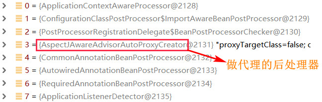 |

### 14.10.1 后处理器定义

```java
/**
 * 定义bean后处理器
 * 作用：在bean的创建之后，进行再加工
 */
public class MyBeanPostProcessor implements BeanPostProcessor{

    /**
     * 在bean的init方法之前执行
     * @param bean  原始的bean对象
     * @param beanName
     * @return
     * @throws BeansException
     */
    public Object postProcessBeforeInitialization(Object bean, String beanName) throws BeansException {
        System.out.println("后处理器 在init之前执行~~~"+bean.getClass());
        return bean;
    }
	/**
     * 在bean的init方法之后执行
     * @param bean  postProcessBeforeInitialization返回的bean
     * @param beanName
     * @return
     * @throws BeansException
     */
    @Override
    public Object postProcessAfterInitialization(Object bean, String beanName) throws BeansException {
        System.out.println("后处理器 在init之后执行~~~"+bean.getClass());
        return bean;// 此处的返回是 getBean() 最终的返回值
    }
}
```

### 14.10.2 配置后处理器

```xml
<!-- 配置后处理器,将对工厂中所有的bean声明周期进行干预 -->
<bean class="com.qianfeng.beanpostprocessor.MyBeanPostProcessor"></bean>
```

### 14.10.3 bean生命周期

构造 》 注入属性 满足依赖 》 后处理器前置过程  》 初始化  》后处理器后置过程 》 返回 》 销毁

### 14.10.4 动态代理源码(了解)

```java
// AbstractAutoProxyCreator是 AspectJAwareAdvisorAutoProxyCreator的父类
// 该后处理器类中的 wrapIfNecessary方法即动态代理生成过程
AbstractAutoProxyCreator#postProcessAfterInitialization(Object bean, String beanName){
    if (!this.earlyProxyReferences.contains(cacheKey)) {
        // 开始动态定制代理
        return wrapIfNecessary(bean, beanName, cacheKey);
   	}
}
```

# 十五、Spring + MyBatis

------

## 15.1 配置数据源

[spring配置 数据源datasource和连接池 的7种方式](https://blog.csdn.net/qq_36838191/article/details/91450908)

将数据源配置到项目中

### 15.1.1 引入jdbc.properties配置文件

```properties
#jdbc.properties
jdbc.driverClass=com.mysql.jdbc.Driver
jdbc.url=jdbc:mysql://localhost:3306/mydb?useUnicode=true&characterEncoding=UTF-8
jdbc.username=root
jdbc.password=123456
```

### 15.1.2 整合Spring配置文件和properties配置文件

```xml
<!--spring-context.xml-->
<?xml version="1.0" encoding="UTF-8"?>
<beans xmlns="http://www.springframework.org/schema/beans"
       xmlns:context="http://www.springframework.org/schema/context"
       xmlns:xsi="http://www.w3.org/2001/XMLSchema-instance"
       xsi:schemaLocation="
       http://www.springframework.org/schema/beans
       http://www.springframework.org/schema/beans/spring-beans.xsd
       http://www.springframework.org/schema/context
       http://www.springframework.org/schema/context/spring-context.xsd
       ">

    <!--配置文件参数化（参数占位符）-->
	<context:property-placeholder location="classpath:jdbc.properties" />
    
    <!--与PooledDataSource集成（二选一）-->
    <bean id="dataSource" class="org.apache.ibatis.datasource.pooled.PooledDataSource">
        <property name="driver" value="${driverClass}"/>
        <property name="url" value="${url}"/>
        <property name="username" value="${username}"/>
        <property name="password" value="${password}"/>
    </bean>

    <!--与DruidDataSource集成（二选一）-->
    <bean id="dataSource" class="com.alibaba.druid.pool.DruidDataSource" init-method="init" destroy-method="close">
        <!--基本配置-->
        <property name="driverClassName" value="${jdbc.driverClass}"/>
        <property name="url" value="${jdbc.url}"/>
        <property name="username" value="${jdbc.username}"/>
        <property name="password" value="${jdbc.password}"/>
    </bean>
</bean>
```

### 15.1.3 Druid连接池可选参数

```xml
<bean id="dataSource" class="com.alibaba.druid.pool.DruidDataSource" init-method="init" destroy-method="close">
    <!--基本配置-->
    <property name="driverClassName" value="${jdbc.driverClass}"/>
    <property name="url" value="${jdbc.url}"/>
    <property name="username" value="${jdbc.username}"/>
    <property name="password" value="${jdbc.password}"/>

    <!-- 配置初始化大小、最小、最大 -->
    <property name="initialSize" value="${jdbc.init}"/>
    <property name="minIdle" value="${jdbc.minIdle}"/>
    <property name="maxActive" value="${jdbc.maxActive}"/>

    <!-- 配置获取连接等待超时的时间 -->
    <property name="maxWait" value="60000"/>

    <!-- 配置间隔多久才进行一次检测，检测需要关闭的空闲连接，单位是毫秒 -->
    <property name="timeBetweenEvictionRunsMillis" value="60000"/>

    <!-- 配置一个连接在池中最小生存的时间，单位是毫秒 -->
    <property name="minEvictableIdleTimeMillis" value="300000"/>
</bean>
```

### 15.1.4 Druid监控中心

```xml
<!--web.xml-->
<servlet>
    <servlet-name>DruidStatView</servlet-name>
    <servlet-class>com.alibaba.druid.support.http.StatViewServlet</servlet-class>
</servlet>
<servlet-mapping>
    <servlet-name>DruidStatView</servlet-name>
    <url-pattern>/druid/*</url-pattern>
</servlet-mapping>
```

### 15.1.5 测试监控中心

配置tomcat，并访问protocol://ip:port/project/druid/index.html

http://localhost:83/spring/druid/api.html

## 15.2 整合MyBatis

将 SqlSessionFactory、DAO、Service 配置到项目中

### 15.2.1 导入依赖

```xml
  <dependencies>
    <!-- Spring常用依赖 -->
    <dependency>
      <groupId>org.springframework</groupId>
      <artifactId>spring-context</artifactId>
      <version>5.1.6.RELEASE</version>
    </dependency>

    <dependency>
      <groupId>org.springframework</groupId>
      <artifactId>spring-aspects</artifactId>
      <version>5.1.6.RELEASE</version>
    </dependency>

    <!-- spring-jdbc -->
    <dependency>
      <groupId>org.springframework</groupId>
      <artifactId>spring-jdbc</artifactId>
      <version>5.1.6.RELEASE</version>
    </dependency>

    <!-- spring+mybatis集成依赖 -->
    <dependency>
      <groupId>org.mybatis</groupId>
      <artifactId>mybatis-spring</artifactId>
      <version>1.3.1</version>
    </dependency>

    <dependency>
      <groupId>junit</groupId>
      <artifactId>junit</artifactId>
      <version>4.13</version>
      <scope>test</scope>
    </dependency>

    <!--MyBatis核心依赖-->
    <dependency>
      <groupId>org.mybatis</groupId>
      <artifactId>mybatis</artifactId>
      <version>3.4.6</version>
    </dependency>

    <!--MySql驱动依赖-->
    <dependency>
      <groupId>mysql</groupId>
      <artifactId>mysql-connector-java</artifactId>
      <version>5.1.47</version>
    </dependency>

    <dependency>
      <groupId>log4j</groupId>
      <artifactId>log4j</artifactId>
      <version>1.2.17</version>
    </dependency>

    <dependency>
      <groupId>org.projectlombok</groupId>
      <artifactId>lombok</artifactId>
      <version>1.18.24</version>
    </dependency>

    <dependency>
      <groupId>com.alibaba</groupId>
      <artifactId>fastjson</artifactId>
      <version>1.2.75</version>
    </dependency>

    <dependency>
      <groupId>com.alibaba</groupId>
      <artifactId>druid</artifactId>
      <version>1.1.16</version>
    </dependency>
  </dependencies>
```

### 15.2.2 配置SqlSessionFactory

```xml
<!-- 工厂bean：生成SqlSessionFactory -->
<bean id="sqlSessionFactory" class="org.mybatis.spring.SqlSessionFactoryBean">
    <!-- 注入连接池 -->
    <property name="dataSource" ref="dataSource"></property>
    <!-- 注入dao-mapper文件信息 ,如果映射文件和dao接口 同包且同名，则此配置可省略-->
    <property name="mapperLocations">
        <list>
            <value>classpath:com/qf/spring/dao/*.xml</value>
        </list>
    </property>
    <!-- 为 dao-mapper文件中的实体 定义缺省包路径 
		如：<select id="queryAll" resultType="User"> 中 User类可以不定义包
    -->
    <property name="typeAliasesPackage" value="com.qf.entity"></property>
</bean>
```

### 15.2.3 配置MapperScannerConfigurer

管理DAO实现类的创建，并创建DAO对象，存入工厂管理

-  扫描所有DAO接口,去构建DAO实现 
-  将DAO实现存入工厂管理 
-  DAO实现对象在工厂中的id是：“首字母小写的-接口的类名”，
   例如：UserDAO==>userDAO , OrderDAO==>orderDAO 

```xml
<!-- mapperScannerConfigurer -->
<bean id="mapperScannerConfigurer9" class="org.mybatis.spring.mapper.MapperScannerConfigurer">
   	<!-- dao接口所在的包  如果有多个包，可以用逗号或分号分隔 
  		<property name="basePackage" value="com.a.dao,com.b.dao"></property>
   	-->
    <property name="basePackage" value="com.qf.spring.dao"></property>
    <!-- 如果工厂中只有一个SqlSessionFactory的bean，此配置可省略 -->
    <property name="sqlSessionFactoryBeanName" value="sqlSessionFactory"></property>
</bean>
```

### 15.2.4 配置Service

```xml
<bean id="userService" class="com.qf.spring.service.UserServiceImpl">
    <!-- 注意ref中的值是对应DAO接口的首字母小写的接口名 -->
	<property name="userDAO" ref="userDAO"></property>
</bean>
```

# 十六、事务

>  一切相关关系操作，串联成一个，要么都成功 要都失败

## 16.1 配置

DataSourceTransactionManager

事务管理器，其中持有DataSource，可以控制事务功能（commit,rollback等）。

```xml
<!-- 1. 引入一个事务管理器，其中依赖DataSource,借以获得连接，进而控制事务逻辑 -->
<bean id="tx" class="org.springframework.jdbc.datasource.DataSourceTransactionManager">
    <property name="dataSource" ref="dataSource"></property>
</bean>
```

注意：DataSourceTransactionManager 和 SqlSessionFactoryBean 要注入同一个DataSource的Bean，否则事务控制失败!!!

## 16.2 配置事务通知

基于事务管理器，进一步定制，生成一个额外功能：Advice。

此Advice可以切入任何需要事务的方法，通过事务管理器为方法控制事务。

```xml
<tx:advice id="txManager" transaction-manager="tx">
	<tx:attributes>
        <!--<tx:method name="insertUser" rollback-for="Exception" isolation="DEFAULT"    
              	propagation="REQUIRED" read-only="false"/>-->
        <!-- 以User结尾的方法，切入此方法时，采用对应事务实行-->
        <tx:method name="*User" rollback-for="Exception"/>
        <!-- 以query开头的方法，切入此方法时，采用对应事务实行 -->
        <tx:method name="query*" propagation="SUPPORTS"/>
        <!-- 剩余所有方法 -->
        <tx:method name="*"/>
    </tx:attributes>
</tx:advice>
```

## 16.3 事务属性

### 16.3.1 隔离级别

## 16.3.1.1 概念

`isolation`  隔离级别

| 名称            | 描述                                                         |
| --------------- | ------------------------------------------------------------ |
| default         | (默认值）（采用数据库的默认的设置) （建议）  交给jdbc        |
| read-uncommited | 读未提交  （会发生脏读 ） （查询）                           |
| read-commited   | 读提交 （Oracle数据库默认的隔离级别）（不可重复读）（update） |
| repeatable-read | 可重复读	（MySQL数据库默认的隔离级别）（删除或者增加） 幻读 （delete 和 insert） |
| serialized-read | 序列化读                                                     |

隔离级别由低到高为：read-uncommited < read-commited < repeatable-read < serialized-read

## 16.3.1.2 特性

-  安全性：级别越高，多事务并发时，越安全。因为共享的数据越来越少，事务间彼此干扰减少。 
-  并发性：级别越高，多事务并发时，并发越差。因为共享的数据越来越少，事务间阻塞情况增多。 

## 16.3.1.3 并发问题

事务并发时的安全问题

| 问题       | 描述                                                         |
| ---------- | ------------------------------------------------------------ |
| 脏读       | 一个事务读取到另一个事务还未提交的数据。大于等于 read-commited 可防止 |
| 不可重复读 | 一个事务内多次读取一行数据的相同内容，其结果不一致。大于等于 repeatable-read 可防止 |
| 幻读       | 一个事务内多次读取一张表中的相同内容，其结果不一致。serialized-read 可防止 |

### 16.3.2 传播行为

`propagation`传播行为

当涉及到事务嵌套（Service调用Service）时，可以设置：

-  SUPPORTS = 不存在外部事务，则不开启新事务；存在外部事务，则合并到外部事务中。（适合查询） 
-  REQUIRED = 不存在外部事务，则开启新事务；存在外部事务，则合并到外部事务中。 (默认值)（适合增删改） 

### 16.3.3 读写性

`readonly` 读写性

-  true：只读，可提高查询效率。(适合查询) 
-  false：可读可写。 (默认值)（适合增删改） 

### 16.3.4 事务超时

`timeout`事务超时时间

当前事务所需操作的数据被其他事务占用，则等待。

- 100：自定义等待时间100（秒）。
- -1：由数据库指定等待时间，默认值。（建议）

### 16.3.5 事务回滚

`rollback-for`  回滚属性

-  如果事务中抛出 RuntimeException,则自动回滚 
-  如果事务中抛出 CheckException(非运行时异常 Exception)，不会自动回滚，而是默认提交事务 
-  处理方案 : 将CheckException转换成RuntimException上抛，或 设置 rollback-for="Exception" 

## 16.4 编织

将事务管理的Advice 切入需要事务的业务方法中

```xml
<aop:config>
	<aop:pointcut expression="execution(* com.qf.spring.service.UserServiceImpl.*(..))" id="pc"/>
    <!-- 组织切面 -->
    <aop:advisor advice-ref="txManager" pointcut-ref="pc"/>
</aop:config>
```

# 十七、注解开发

------

## 17.1 声明bean

用于替换自建类型组件的 <bean...>标签；可以更快速的声明bean

-  [@Service ]()  业务类专用 
   [@Repository ]()  dao实现类专用 
   [@Controller ]()  web层专用  
-  [@Component ]()  通用  
-  [@Scope ]()  用户控制bean的创建模式  

```java
// @Service说明 此类是一个业务类，需要将此类纳入工厂  等价替换掉 <bean class="xxx.UserServiceImpl">
// @Service默认beanId == 首字母小写的类名"userServiceImpl"
// @Service("userService") 自定义beanId为"userService"
@Service //声明bean，且id="userServiceImpl"
@Scope("singleton") //声明创建模式，默认为单例模式 ；@Scope("prototype")即可设置为多例模式
public class UserServiceImpl implements UserService {
 	...   
}
```

## 17.2 注入(DI)

用于完成bean中属性值的注入

- [@Autowired ]()  基于类型自动注入 
- [@Resource ]()   基于名称自动注入 
- @Qualifier("userDAO") 限定要自动注入的bean的id，一般和@Autowired联用
- [@Value ]() 注入简单类型数据 (jdk8种+String) 

```java
@Service
public class UserServiceImpl implements UserService {
    
    @Autowired //注入类型为UserDAO的bean
    @Qualifier("userDAO2") //如果有多个类型为UserDAO的bean，可以用此注解从中挑选一个
    private UserDAO userDAO;
}
```


```java
@Service
public class UserServiceImpl implements UserService {
    
	@Resource("userDAO3") //注入id=“userDAO3”的bean
    private UserDAO userDAO;
    /*
    @Resource //注入id=“userDAO”的bean
    private UserDAO userDAO;
    */
}
```


```java
public class XX{
    @Value("100") //注入数字
    private Integer id;
    @Value("shine") //注入String
	private String name;
}
```

## 17.3 事务控制

用于控制事务切入

-  [@Transactional ]()  
-  工厂配置中的 <tx:advice.... 和 <aop:config... 可以省略 !! 

```java
//类中的每个方法都切入事务(有自己的事务控制的方法除外)
@Transactional(isolation=Isolation.READ_COMMITTED,propagation=Propagation.REQUIRED,readOnly=false,rollbackFor=Exception.class,timeout = -1)
public class UserServiceImpl implements UserService {
	...
    //该方法自己的事务控制，仅对此方法有效
	@Transactional(propagation=Propagation.SUPPORTS)
	public List<User> queryAll() {
		return userDao.queryAll();
	}
	public void save(User user){
		userDao.save(user);
	}
}
```

## 17.4 注解所需配置

```xml
<!-- 告知spring，哪些包中 有被注解的类、方法、属性 -->
<!-- <context:component-scan base-package="com.qf.a,com.xx.b"></context:component-scan> -->
<context:component-scan base-package="com.qf"></context:component-scan>
	
<!-- 告知spring，@Transactional在定制事务时，基于txManager=DataSourceTransactionManager -->
<tx:annotation-driven transaction-manager="txManager"/>
```

## 17.5 AOP开发

### 17.5.1 注解使用

```java
import org.aspectj.lang.JoinPoint;
import org.aspectj.lang.ProceedingJoinPoint;
import org.aspectj.lang.annotation.AfterThrowing;
import org.aspectj.lang.annotation.Aspect;
import org.aspectj.lang.annotation.Pointcut;
import org.springframework.stereotype.Component;

@Aspect // 声明此类是一个切面类：会包含切入点(pointcut)和通知(advice)
@Component //声明组件，进入工厂
public class MyAspect {
    // 定义切入点
    @Pointcut("execution(* com.qf.spring.service.UserServiceImpl.*(..))")
    public void pc(){}
    
    @Before("pc()") // 前置通知
    public void mybefore(JoinPoint a) {
        System.out.println("target:"+a.getTarget());
        System.out.println("args:"+a.getArgs());
        System.out.println("method's name:"+a.getSignature().getName());
        System.out.println("before~~~~");
    }

    @AfterReturning(value="pc()",returning="ret") // 后置通知
    public void myAfterReturning(JoinPoint a,Object ret){
        System.out.println("after~~~~:"+ret);
    }
    
    @Around("pc()") // 环绕通知
    public Object myInterceptor(ProceedingJoinPoint p) throws Throwable {
        System.out.println("interceptor1~~~~");
        Object ret = p.proceed();
        System.out.println("interceptor2~~~~");
        return ret;
    }
    
    @AfterThrowing(value="pc()",throwing="ex") // 异常通知
    public void myThrows(JoinPoint jp,Exception ex){
        System.out.println("throws");
        System.out.println("===="+ex.getMessage());
    }
}
```

### 17.5.2 配置

```xml
<!-- 添加如下配置,启用aop注解 -->
<aop:aspectj-autoproxy></aop:aspectj-autoproxy>
```

# 十八、集成JUnit

------

## 18.1 导入依赖

```xml
<dependency>
    <groupId>org.springframework</groupId>
    <artifactId>spring-test</artifactId>
    <version>4.3.6.RELEASE</version>
</dependency>
<dependency>
    <groupId>junit</groupId>
    <artifactId>junit</artifactId>
    <version>4.12</version>
</dependency>
```

## 18.2 编码

可以免去工厂的创建过程；

 可以直接将要测试的组件注入到测试类。

```java
@RunWith(SpringJUnit4ClassRunner.class) //由SpringJUnit4ClassRunner启动测试
@ContextConfiguration("classpath:applicationContext.xml") //spring的配置文件位置
public class SpringTest{//当前测试类也会被纳入工厂中，所以其中属性可以注入

    @Autowired // 注入要测试的组件
    @Qualifier("userDAO")
    private UserDAO userDAO;

    @Test
    public void test(){
        // 测试使用userDAO
        userDAO.queryUser();
        ....
    }
}
```

十九、log4j配置

1、导入我们依赖包

```xml
<!-- https://mvnrepository.com/artifact/log4j/log4j -->
    <dependency>
      <groupId>log4j</groupId>
      <artifactId>log4j</artifactId>
      <version>1.2.17</version>
    </dependency>
```

2、编写log4j.properties配置文件

```properties
#设置日志输入级别（debug< info< WARN< error ）#
log4j.rootLogger = debug,stdout,D,E,I
#输出信息到控制抬 #
log4j.appender.stdout = org.apache.log4j.ConsoleAppender #这是告诉我日志往哪里输出
log4j.appender.stdout.Target = System.out
log4j.appender.stdout.layout = org.apache.log4j.PatternLayout
log4j.appender.stdout.layout.ConversionPattern = [%-5p] %d{yyyy-MM-dd HH:mm:ss,SSS} method:%l%n%m%n


#输出DEBUG 级别以上的日志到=E://logs/error.log #
log4j.appender.D = org.apache.log4j.DailyRollingFileAppender
log4j.appender.D.File = E://logs/debug.log
log4j.appender.D.Append = true
log4j.appender.D.Encoding=UTF8
log4j.appender.D.Threshold = DEBUG
log4j.appender.D.layout = org.apache.log4j.PatternLayout
log4j.appender.D.layout.ConversionPattern = %-d{yyyy-MM-dd HH:mm:ss}  - [ %p ]  %l %c %t - %m %n 


#输出ERROR 级别以上的日志到=E://logs/error.log #
log4j.appender.E = org.apache.log4j.DailyRollingFileAppender
log4j.appender.E.File =E://logs/error.log
log4j.appender.E.Append = true
log4j.appender.E.Encoding=UTF8
log4j.appender.E.Threshold = ERROR
log4j.appender.E.layout = org.apache.log4j.PatternLayout
log4j.appender.E.layout.ConversionPattern = %-d{yyyy-MM-dd HH:mm:ss}  - [ %p ]  %l %c %t - %m %n


#输出ERROR 级别以上的日志到=E://logs/error.log #
log4j.appender.E = org.apache.log4j.DailyRollingFileAppender
log4j.appender.E.File =E://logs/info.log
log4j.appender.E.Append = true
log4j.appender.E.Encoding=UTF8
log4j.appender.E.Threshold = INFO
log4j.appender.E.layout = org.apache.log4j.PatternLayout
log4j.appender.E.layout.ConversionPattern = %-d{yyyy-MM-dd HH:mm:ss}  - [ %p ]  %l %c %t - %m %n
```

# 十九、  创建 Spring 项目

##  一、Spring 的概念

**Spring : 包含众多工具方法的 IoC 容器。**

**Spring 的核心 ：IoC （控制反转）， DI (依赖注入)。**

**loC （Inversion of Control）**翻译成中文就是 “控制反转” 的意思，**控制反转一种编程设计思想**，将程序的控制流程从传统的主动调用方式转变为被动接收方式（一个类的内部不再实例另一个类，而是告诉程序这个类需要那个类作为参数采用运行），从而实现对象和对象之间的解耦和依赖管理。

**DI （Dependency Injection 的缩写——“依赖注入”）**“[依赖注入](https://so.csdn.net/so/search?q=依赖注入&spm=1001.2101.3001.7020)” **指的就是由 IoC 容器在运行期间（程序运行期间），动态地将某种依赖关系注入到对象之中。**传统的做法是由程序主动去找他所依赖的对象然后进行实例化，而DI则是由容器主动地将依赖关系注入到对象中。这样做的好处是对象之间解耦。
既然 Spring 是一个 loC 容器，那么它就具备两个最基本的功能：

- 将对象存储到容器（Spring）中
- 从容器（Spring）中将对象取出来

**在 Java 中一个普通的实例化的对象也被称之为 Bean 对象，在框架这一块我们遇到的对象就是以 Bean 对象称呼。**

## 二、创建 Spring 项目

我们在了解 Spring 是啥之后，接下来结合 IDEA (集成开发环境) 演示如何创建一个 Spring 项目。

### 2.1 创建一个 普通的 Maven 项目（无需使用模板）


------

### 2.2 添加 Spring 框架支持

> Spring 是一个开源的 Java 框架，由 Rod Johnson 在 2002 年创建。Spring 提供了许多简化 Java 开发的功能，因此它在 Java 开发社区中得到了广泛的应用和认可。Spring 是第三方的资源（框架）是由大佬对已有的功能进行封装拓展，使得程序猿更容易地编写功能，并不属于 JDK 官方 , 所以我们要想使用 Spring 就需要下载第三方依赖。

**只需要在项目中地 pom.xml 文档中添加 Spring 框架地支持, xml 配置如**

```XML
<dependencies>
        <!-- Spring常用依赖 -->
        <dependency>
            <groupId>org.springframework</groupId>
            <artifactId>spring-context</artifactId>
            <version>5.2.3.RELEASE</version>
        </dependency>
        <!--提供了Bean的定义和管理的核心功能-->
        <dependency>
            <groupId>org.springframework</groupId>
            <artifactId>spring-beans</artifactId>
            <version>5.2.3.RELEASE</version>
        </dependency>
</dependencies>
```

------

### 2.3 添加一个启动类

最后在创建好的项目 Java 文件夹下创建一个启动类，包含 main 方法即可：

```java
public class App {
    public static void main(String[] args) {
 
    }
}
```

------

## 三、将对象存储到 Spring

要想存储 Bean 对象（类实例化后的对象）需要有 2 步操作：

- 创建一个 bean 对象 —— 需要一个类
- 将 bean 对象 注册到 Spring 中 【使用 Spring 配置文件进行注册】

### 3.1 创建 Bean 对象

所谓 Bean 对象就是 Java 中的一个普通的对象。

```java
public class Dog {
    // 狗的属性
    private String name;
    private int age;
    private String sex;
    private String color;
 
 
    // 狗的行为
    public void cry() {
        System.out.println(this.name + "汪汪~");
    }
 
    /**
     * 小狗的做我介绍
     * @return
     */
    @Override
    public String toString() {
        return "Dog{" +
                "我叫做：'" + name + '\'' +
                ", 我今年：" + age +
                "岁, 我的性别是：" + sex +
                ", 我是'" + color + '\'' + "的" +
                '}';
    }
 
    public String getName() {
        return name;
    }
 
    public void setName(String name) {
        this.name = name;
    }
 
    public int getAge() {
        return age;
    }
 
    public void setAge(int age) {
        this.age = age;
    }
 
    public String getSex() {
        return sex;
    }
 
    public void setSex(String sex) {
        this.sex = sex;
    }
 
    public String getColor() {
        return color;
    }
 
    public void setColor(String color) {
        this.color = color;
    }
}
```

 常规的做法

```java
public class App {
    public static void main(String[] args) {
        Dog dog = new Dog();
        dog.setName("哈巴狗");
        dog.setAge(3);
        dog.setSex("公");
        dog.setColor("白色");
        dog.cry();
        System.out.println(dog.toString());
    }
}
```

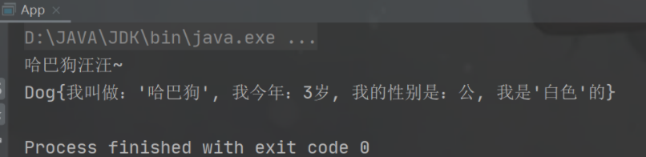

------

### 3.3 将 Bean 对象注册到 Spring

这里介绍一种古老的注册方法——【使用 Spring 配置文件进行注册】

在创建好的项目中添加 Spring 的配置文件 **spring-test.xml** , 将该文件放到 **resources 的根目录**下：

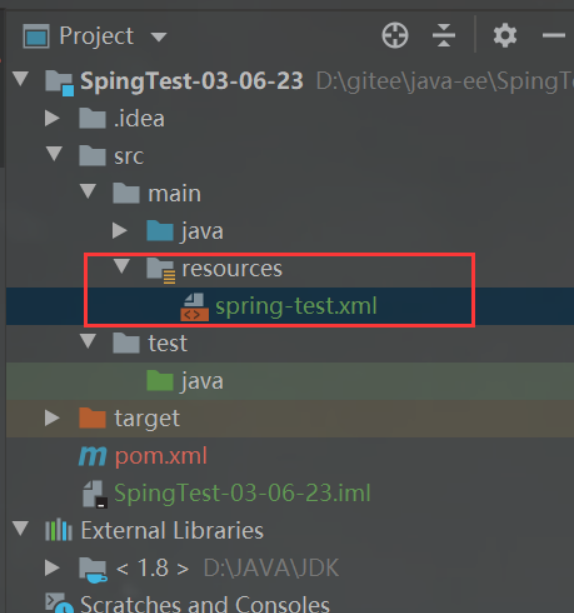

这个配置文件 **spring-test.xml** 文件名**可以任意的名称但是必须保证文件后缀为（ .xml ）**，这里的文件名在后续的取 Bean 对象中会使用到。

该文件为 Spring 的配置文件，格式也是固定的

```XML
<?xml version="1.0" encoding="UTF-8"?>
<beans xmlns="http://www.springframework.org/schema/beans"
xmlns:xsi="http://www.w3.org/2001/XMLSchema-instance"
xsi:schemaLocation="http://www.springframework.org/schema/beans http://www.springframework.org/schema/beans/spring-beans.xsd">
</beans>
```

接下来，实现如何将 我们自定义的对象（Dog）注册到 Spring 中就可以了，具体的操作在 <beans> 标签中添加的。

```XML
<beans xmlns="http://www.springframework.org/schema/beans"
    <bean id="dog" class="Dog"></bean>
</beans>
```

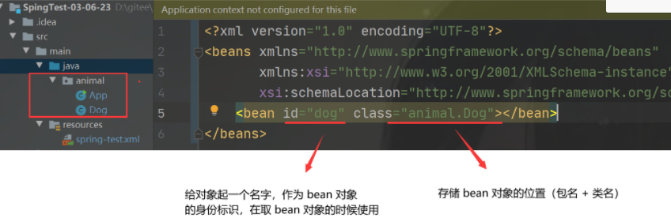

如果需要将多个 bean 对象注册到 Spring 中，重复以上操作即可。**注意：需要给每个 bean 对象取别名（标识）。**


------

## 四、从 Spring 获取并使用 Bean 对象

### 4.1 创建 Spring 上下文对象

Spring的上下文是指Spring容器中存储Bean对象的**数据结构**，也可以理解为Spring容器中的环境。

**目前 Spring 上下文对象可以使用 ApplicationContext 接口来获取：**

> Spring框架中的ApplicationContext是一个[IoC容器](https://so.csdn.net/so/search?q=IoC容器&spm=1001.2101.3001.7020)，负责管理应用程序中的Bean对象，它是一个配置文件，提供了Bean对象所需的配置信息，同时也是Bean对象的容器。通过ApplicationContext，开发人员可以将Bean对象存储在容器中，并在其他组件中使用这些Bean对象。

```java
//1. 获取 Spring 上下文对象，创建的时候需要配置 Spring 的配置文件
ApplicationContext context = new ClassPathXmlApplicationContext("spring-test.xml");
```

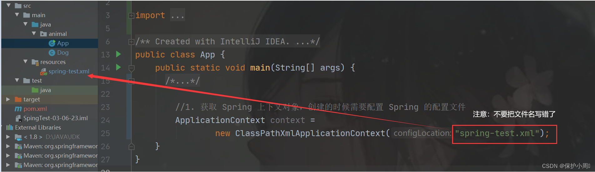

------

### 4.2 获取指定的 Bean 对象

上一步我们获取了 Spring 的上下文对象，context 这个对象就是用来管理 Bean 对象的，如果我们需要获取某个具体的 Bean 对象，需要在上下文对象的基础上调用 **getBean() 方法**

**getBean()方法是从Spring容器中获取Bean实例的核心方法。**

**当前给大家介绍的功能是读取Bean 对象：**

**通过Bean ID或Bean名称从 Spring 容器中获取指定的Bean定义，如果没有找到，则抛出异常。**

```java
//1. 获取 Spring 上下文对象，创建的时候需要配置 Spring 的配置文件
ApplicationContext context = new ClassPathXmlApplicationContext("spring-test.xml");
        
//2. 从 Spring 上下文中取出某个 bean 对象
Dog dog = (Dog)context.getBean("dog");// dog是我们给 Dog 类的实例取得的标志（名字）
```

**注意事项：**


**否则会抛出：NoSuchBeanDefinitionException 异常**


------

#### 4.2.1 getBean() 方法的使用

getBean() 方法有很多种重载的方法，我们也可以使用其他的方法来获取 Bean 对象。

**1. 根据 bean 对象的 id （标志）来获取 【上文已经讲过】**

```java
// dog是我们给 Dog 类的实例取得的标志（名字）

Dog dog = (Dog)context.getBean("dog");
```

使用 bean对象的 id 来获取，Spring 上下文对象—— context 的返回值是 Object, 所以需要进行强制类型转换。 

**2. 根据类型来获取 Bean** 

```java
Dog dog = context.getBean(Dog.class);
```

因为我们直接使用 bean 对象的类型来获取，所以我们无需手动强制类型转换，在获取的时候会自动强转。

**3. 根据** **bean 对象的 id （标志）+ 类型 获取 bean**

```java
 Dog dog = context.getBean("dog",Dog.class);
```

**第一种方法的第二种方法的区别在于：**

当一个类被重复的注册到 spring-test.xml 的配置文件中时，只能使用根据 ID (名称) 来获取。

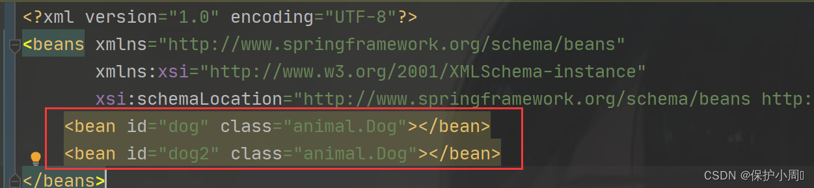

此时 Spring 容器中存储了 两个 Dog 类的实例（bean 对象）。

**我们使用类型来获取 bean 对象并使用时的表现：**

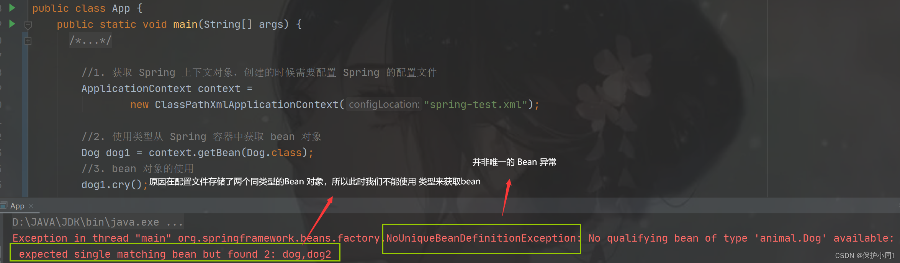

所以我们当同类型的对象被注册到 Spring 中多次时就会导致程序报错，此时我们应当使用 bean 对象的 ID (名称) 来获取。但是这种方式的缺陷在于 我们需要手动的进行强制类型转换（返回类型是 Object）

所以我们推荐的写法是使用第三种方法 ：**根据** **bean 对象的 id （标志）+ 类型 获取 bean 对象。**

------

**4.3 使用 Bean 对象**

上文也说到其实 Bean 对像就是普通的实例化的对象，Bean 对象只是一个名字罢了。所以Bean 对象的使用跟我们传统对象的使用并无差异：

```java
public class App {
    public static void main(String[] args) {
        //1. 获取 Spring 上下文对象，创建的时候需要配置 Spring 的配置文件
        ApplicationContext context =
                new ClassPathXmlApplicationContext("spring-test.xml");
 
        //2. 使用类型从 Spring 容器中获取 bean 对象
        Dog dog = context.getBean("dog",Dog.class);
 
        //3. bean 对象的使用
        dog.setName("哈巴狗");
        dog.setAge(3);
        dog.setSex("公");
        dog.setColor("白色");
        dog.cry();
        System.out.println(dog.toString());  
    }
}
```

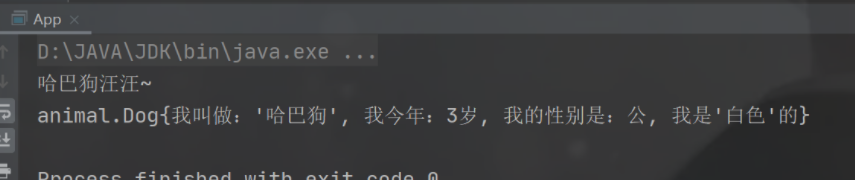


# 二十、spring单元测试

**依赖**

```xml
    <dependencies>
        <!--Spring框架的核心容器-->
        <dependency>
            <groupId>org.springframework</groupId>
            <artifactId>spring-context</artifactId>
            <version>5.2.3.RELEASE</version>
        </dependency>
        <!--Spring提供了Bean的定义和管理的核心功能-->
        <dependency>
            <groupId>org.springframework</groupId>
            <artifactId>spring-beans</artifactId>
            <version>5.2.3.RELEASE</version>
        </dependency>

        <!-- 单元测试 -->
        <dependency>
            <groupId>org.springframework</groupId>
            <artifactId>spring-test</artifactId>
            <version>5.2.3.RELEASE</version>
        </dependency>
        <!-- 单元测试 -->
        <dependency>
            <groupId>junit</groupId>
            <artifactId>junit</artifactId>
            <version>4.13.2</version>
            <scope>test</scope>
        </dependency>
    </dependencies>
```

**测试类**	

```java
@RunWith(SpringJUnit4ClassRunner.class)
@ContextConfiguration(locations = "classpath:applicationContext.xml")
public class testSpring {

	//.....
}
```

==其他和springboot单元测试一样==
