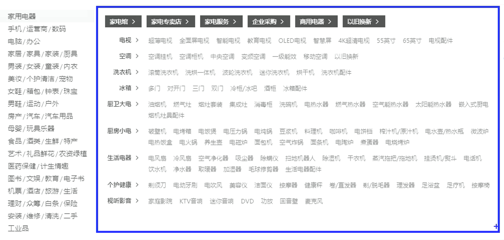
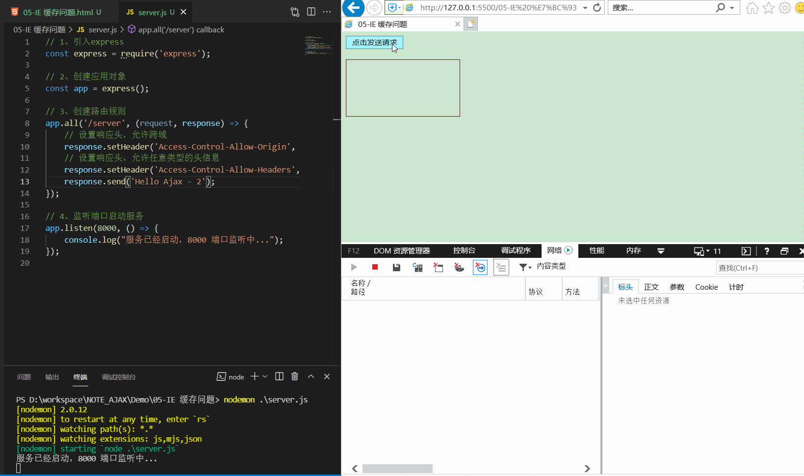
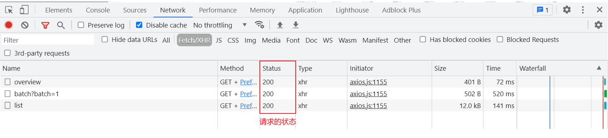
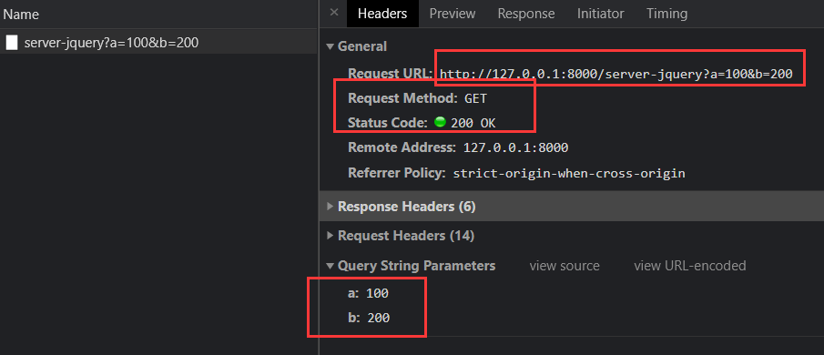
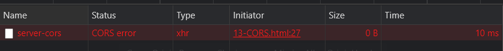

# AJAX 简介

## 概要

`AJAX`全称为`Asynchronous JavaScript And XML`，就是异步的 JS 和 XML

+ 通过`AJAX`可以在浏览器中向服务器发送异步请求，最大的优势：  **无刷新获取数据** 

+ `AJAX`不是新的编程语言，而是一种将现有的标准组合在一起使用的新方式 

**对服务器上的数据，进行查询、新增、修改、删除等操作，都需要URL**

- URL的构成

  + 对于一个项目来说，一般情况下 协议、主机地址、端口号都是不会变

  - 协议、主机地址、端口号组成的这一部分叫做根路径。
  - 注意标点符号
  - 这个网址是由后端程序员提供的，作为前端人员就是拿来使用。


## 应用场景

**场景1：关键字检索**


**场景2：注册用户名重名检测**


**场景3：菜单详情内容**


**场景4：二级三级菜单分类**



**场景5：加载更多**


**好处：** 懒加载，按需加载，提高资源利用率，加快页面整体加载速度，提升用户体验

# Ajax的作用


# 环境配置

## 安装 Node.js


- 官网地址：https://nodejs.org/en/

- cmd 键入命令`node -v`，出现版本号信息说明安装成功

```shell
node -v
```

## 使用 express


- 官网地址：https://www.expressjs.com.cn/

- **npm（node package manager）**：`Node.js`的包管理器，用于`node`插件管理（包括安装、卸载、管理依赖等）

**打开终端，键入命令**

```shell
# 初始化
npm init --yes
# 安装express框架
npm i express
```

**创建 js 文件，编写代码**

```javascript
// 1、引入express
// const express = require('express');
import express from 'express';

// 2、创建应用对象
const app = express();

// 3、创建路由规则
// request 请求报文的封装
// response 响应报文的封装
app.get('/', (request, response) => {
    // 设置响应
    response.send('Hello Express');
});

// 4、监听端口启动服务
app.listen(8000, () => {
    console.log("服务已经启动，8000 端口监听中...");
});
```

再次打开终端，键入命令 `node js文件名`

```shell
node 01-express基本使用.js
```

出现`服务已经启动，8000 端口监听中...`字样，说明启动成功

我们打开浏览器，访问`http://127.0.0.1:8000/`，出现`Hello Express`字样，验证 OK


## nodemon 自动重启工具安装

官网地址：https://www.npmjs.com/package/nodemon

- 安装命令：`npm install -g nodemon`

- 启动命令：`nodemon xxx.js`替代`node xxx.js`

优点：修改服务端代码不用每次手动`shutdown`重启，而是每次在我们修改完代码后自动重启


## IE缓存问题

------

使用`nodemon`启动项目后，对响应体内容进行修改

在 Chrome 中表现正常，二次请求都是`200`


在 IE 中表现异常，这是因为 IE 默认走了缓存，我们可以看到第二次网络请求状态码为`304`


怎么解决 IE 浏览器缓存的问题呢？

处理很简单，只需将代码添加一个时间戳参数

因为时间戳几乎是时刻变化的，这样每次请求参数都会不一样，浏览器就会将其当成不同的请求

```javascript
xhr.open('GET', 'http://127.0.0.1:8000/server-ie?t' + Date.now());
```

再来看下 IE 中的效果



# Network - 网络面板（重点）

**专门用于排查网络请求错误的**

- 面板介绍


- 隐藏时间轴（可选）


- 禁用浏览器缓存（可选）


- 模拟网速（**看看就行，不要乱调**）

- - No throttling  -- 不限速
  - Fast 3G  -- 模拟快速3G网络
  - Slow 3G – 模拟慢速3G网络


- 显示请求方式（建议）


- 查看请求状态码（目前了解）

- - 200 表示成功
  - pending 表示等待（可能网络不好或者断网了）
  - 4xx 和 5xx 都表示不同程度的错误
  - Failed 表示失败



- **查看提交的数据（非常重要）**


- **查看响应结果（非常重要）**


# AJAX使用

## 准备

### 前端

新建 HTML

```html
...
<style>
    #result {
        width: 200px;
        height: 100px;
        border: 1px solid #90b;
    }
</style>
...
<button>点击发送请求</button>
<div id="result"></div>
```

### 服务器(后端)

对路由规则稍作修改

下述代码相对于后端springboot的@getMapping("/server")

```javascript
// uel: http://127.0.0.1:8000/server
app.get('/server', (request, response) => {
    // 设置响应头，设置允许跨域
    response.setHeader('Access-Control-Allow-Origin', '*');
    // 设置响应体
    response.send('Hello Express');
});
```

按照上述步骤启动express后，浏览器访问`http://127.0.0.1:8000/server`，能够正常访问，并且响应头中出现我们设置的头部信息即可


## AJAX 发送 GET 请求

```js
const result = document.getElementById('result');
// 按钮绑定事件
const button = document.getElementsByTagName('button')[0];
button.onclick = function () {
    // 1、创建对象
    const xhr = new XMLHttpRequest();
    // 2、初始化
    xhr.open('GET', 'http://127.0.0.1:8000/server');
    // 3、发送
    xhr.send();
    // 4、事件绑定，处理服务器端返回的结果
    xhr.onreadystatechange = function () {
        // 服务端返回所有结果
        if (this.readyState === 4) {
            // 2xx 成功
            if (this.status >= 200 && this.status < 300) {
                // 状态码、状态字符串
                console.log(this.status); // 200
                console.log(this.statusText); // OK
                // 4.1 响应头
                console.log(this.getAllResponseHeaders()); // content-length: 13  content-type: text/html; charset=utf-8
                // 4.2 响应体
                console.log(this.response); // Hello Express
                // 将响应体内容设置为文本
                result.innerHTML = this.response;
            }
        }
    };
}
```

**效果**


GET 设置请求行

```js
xhr.open('GET', 'http://127.0.0.1:8000/server?a=100&b=200&c=300');
```

##  AJAX 发送 POST 请求

```js
const result = document.getElementById('result');
result.addEventListener('mouseover', function () {
    const xhr = new XMLHttpRequest();
    xhr.open('POST', 'http://127.0.0.1:8000/server');
    xhr.setRequestHeader("Content-Type","application/x-www-form-urlencoded");
    xhr.send();
    xhr.onreadystatechange = function () {
        if (this.readyState === 4 && this.status >= 200 && this.status < 300) {
            result.innerHTML = this.response;
        }
    };
});
```

创建`POST`请求的路由规则

```js
app.post('/server', (request, response) => {
    // 设置响应头，设置允许跨域
    response.setHeader('Access-Control-Allow-Origin', '*');
    // 设置响应体
    response.send('Hello Express');
});
```

重新运行`node server.js`命令，并访问浏览器，能够正常获取数据


POST 设置请求体

可以设置任意类型、任意格式的数据，只要服务器端有与之对应的处理方式即可

从语法上来说，请求体格式非常灵活；但实际使用场景中，一般会按照特定格式书写（如 JSON）

```js
xhr.send('a=100&b=200&c=300');
```

## AJAX 设置请求头信息

### 预定义的请求头

在初始化之后、发送请求之前，可以设置请求头信息

```javascript
xhr.setRequestHeader('Content-Type','application/x-www-form-urlencoded');
```


### 自定义的请求头

除了可以设置上述预定义的请求头信息，也可以设置自定义的请求头信息

```javascript
xhr.setRequestHeader('name', 'atguigu');
```

查看头信息已经有了


但是，这时候会有报错，这是因为浏览器的安全机制


我们需要在`server.js`中添加一行响应头的设置

```javascript
response.setHeader('Access-Control-Allow-Headers', '*');
```

但是仅仅如此，依然不行。我们注意到还有一个`OPTIONS`请求方法，它会对请求头进行校验，检测头信息可用不可用要知道，我们在`server.js`中并没有创建过`OPTIONS`相关的路由规则，所以是接收不到`OPTIONS`请求的

我们可以用将`post`方法改为`all`，它可以接收任意类型的请求（GET/POST/PUT/DELETE/PATCH/OPTIONS...）

```javascript
app.all('/server', (request, response) => {
    // 设置响应头，允许跨域
    response.setHeader('Access-Control-Allow-Origin', '*');
    // 设置响应头，允许任意类型的头信息
    response.setHeader('Access-Control-Allow-Headers', '*');
    // 设置响应体
    response.send('Hello Express');
});
```

重启`server.js`服务，查看网络控制台，状态已经正常了


## 服务器端响应 JSON 数据

修改`server.js`中`send`方法中的内容，需要注意的是该方法只能接收字符串和`buffer`，所以对其需要做转换

```js
const data = {
    name:'Hello Ajax'
}

let str = JSON.stringify(data);
response.send(str);
```

前端js代码

```js
const result = document.getElementById('result');
window.onkeydown = function () {
    const xhr = new XMLHttpRequest();
    xhr.open('POST', 'http://127.0.0.1:8000/server-json');
    xhr.send();
    xhr.onreadystatechange = function () {
        if (this.readyState === 4 && this.status >= 200 && this.status < 300) {
            console.log(this.response);
            result.innerHTML = this.response;
        }
    };
}
```


### 手动转换数据

因为我们服务端返回的是`json`字符串内容，所以`response`的内容类型也是字符串

这个时候使用`JSON`工具方法，可以将`json`字符串转换为`json`对象

```js
let response = this.response;
console.log(typeof response); // string
data = JSON.parse(response);
result.innerHTML = data.name;
```


### 自动转换数据

```javascript
// 设置响应体类型
xhr.responseType = 'json';
```

这样在获取结果就是`json`对象了，不用进行手动转换即可使用

```javascript
let response = this.response;
console.log(typeof response); // object
result.innerHTML = response.name;
```


## 请求超时与网络异常

### 请求超时

修改`server.js`，设置延时发送响应报文

```javascript
setTimeout(() =>{
    response.send('Hello Ajax');
}, 2000);
```

**效果**


我们这里为模拟超时而设置的延时时间较短，但是一般情况下，请求时间如果过长的话必须要进行处理

如果请求超时，则应该给出相应的超时提醒，一方面可以减少网络带宽资源的占用，一方面也可以提升用户体验

**那么要怎么设置超时的相关信息呢？**

- 超时时间：`timeout`

- 超时回调：`ontimeout`

```javascript
// 设置超时时间
xhr.timeout = 1000;
// 设置超时回调
xhr.ontimeout = () => {
    alert('请求超时！');
};
```

**效果**


可以看到，当请求时间超过我们设置的`timeout`时长后，就会调用超时回调函数，并且还能看到网络请求状态变成了`(canceled)`

### 网络异常

当然除了服务器响应时间较长导致`请求超时`之外，还有可能因为我们的网速或者其他网络问题导致请求失败

我们可以添加一个`onerror`回调函数，对此类问题进行处理

```javascript
// 设置网络异常回调
xhr.onerror = () => {
    alert("网络异常");
};
```

我们将 Chrome 的网络控制台状态切换为`offline`，模拟断网环境下的请求


可以看到，这里提示了`网络异常`，也就是走了`onerror`的回调函数，且状态变成了`(failed) net::ERR_INTERNET_DISCONNECTED`

## 手动取消请求

- `abort()`方法：手动取消请求

```javascript
const btns = document.getElementsByTagName('button');
const btn1 = btns[0];
const btn2 = btns[1];

let xhr = null;
btn1.addEventListener('click', () => {
    xhr = new XMLHttpRequest();
    xhr.open('GET', 'http://127.0.0.1:8000/server-timeout');
    xhr.send();
});
btn2.addEventListener('click', () => {
    xhr.abort();
});
```

**效果**


##  请求重复发送

如果服务器响应相对比较慢，而用户因为得不到响应而频繁地点击按钮。那么，浏览器短时间内会向服务器发起大量重复的请求，服务器就要对这些请求进行频繁的处理，服务器端的压力就会非常的大

**那么有什么办法可以解决请求重复发送的问题呢？**

思路：发送一个请求之前，查询之前是否有正在进行处理的相同请求，如果有，则取消之前的相同请求，发送一个新的请求。这样保证同一个请求同一时间内只会有一个，这样服务器的压力就会小一些

```javascript
const btns = document.getElementsByTagName('button');
let xhr = null;
// 标识是否正在发送 AJAX 请求
let isSending = false;
btns[0].addEventListener('click', () => {
    // 若上一个请求尚未完成，则手动取消请求
    if (isSending) {
        xhr.abort();
    }
    xhr = new XMLHttpRequest();
    xhr.open('GET', 'http://127.0.0.1:8000/servertimeout');
    xhr.send();
    xhr.onreadystatechange = () => {
        // 请求响应完毕后，修改变量标识  xhr.readyState === 4 表示请求响应完毕
        if (xhr.readyState === 4) {
            isSending = true;
        }
    };
});
```

**效果**


可以看出，如果频繁的点击按钮，发起同一个请求，则每次发起一个新的请求之前，都会取消上一个请求的发送

# jQuery方式 发送 AJAX 请求

+ jQuery 脚本  

```html
<script src="https://cdn.bootcdn.net/ajax/libs/jquery/3.6.0/jquery.min.js"></script>
```

-  bootstrp 脚本  

```html
<link href="https://cdn.bootcdn.net/ajax/libs/twitter-bootstrap/5.0.2/css/bootstrap.css" rel="stylesheet">
```

## GET 请求

```javascript
$.get(url,[data],[callback],[type])
```

- `url`：请求的 URL 地址

- `data`：请求携带的参数

- `callback`：载入成功时回调函数

- `type`：设置返回内容格式，xml，html，script，ison，text，_default

```javascript
btns.eq(0).click(() => {
    $.get('http://127.0.0.1:8000/server-jquery', { a: 100, b: 200 }, (data) => {
        console.log(typeof data, data); // object {name: "Hello jquery"}
    }, 'json');
});
```



## POST请求

```plain
$.post(url,[data],[callback],[type])
```

- `url`：请求的 URL 地址

- `data`：请求携带的参数

- `callback`：载入成功时回调函数

- `type`：设置返回内容格式，xml，html，script，ison，text，_default

```javascript
btns.eq(1).click(() => {
    $.post('http://127.0.0.1:8000/server-jquery', { a: 100, b: 200 }, (data) => {
        console.log(typeof data, data); // string {name: "Hello jquery"}
    });
});
```


## 通用方法

**例子1**

```javascript
$.ajax({
    // 请求地址
    url: 'http://127.0.0.1:8000/server-jquery',
    // 请求参数
    data: { a: 100, b: 200 },
    // 请求类型
    type: 'GET',
    // 响应体类型
    dataType: 'json',
    // 成功回调
    success: data => {
        console.log(typeof data, data); // string {name: "Hello jquery"}  开启dataType后：object {name: "Hello jquery"}
    },
    // 超时时间
    timeout: 1000,
    // 失败的回调
    error: () => {
        alert('出错了');
    },
    // 头信息
    headers: {
        c: 300,
        d: 400
    }
});
```

**error 回调**


**error 网络状态**


**头信息**


**例子2**

```html
<!DOCTYPE html>
<html lang="en">
<head>
    <meta charset="UTF-8">
    <meta name="viewport" content="width=device-width, initial-scale=1.0">
    <meta http-equiv="X-UA-Compatible" content="ie=edge">
    <title>Document</title>
    <script src="https://cdn.bootcss.com/jquery/3.4.1/jquery.js"></script>
    
</head>
<body>
    <script>
        $.ajax({
            url:"https://douban.uieee.com/v2/movie/top250",
            data:{
                start:0,
                count:20
            },
            dataType:"jsonp",
            success:data=>{
                console.log(data)
            }
        })
    </script>
</body>
</html>
```

## 通用模版(推荐)

```js
$.ajax({
    url: '', //请求地址
    type: '', //请求方式，GET/POST/PUT/DELETE等
    data: { //请求数据，可以是对象也可以是查询字符串
        key1: value1,
        key2: value2
    },
    headers: {
        // 头信息
    },
    dataType: '', //服务器响应数据类型，JSON/TEXT/HTML等
    success: data => {
        // 请求成功后执行的方法 // 成功回调
    },
    timeout: 1000, // 超时时间
    error: () => {
        //请求失败后执行的方法 // 失败的回调
    },
    beforeSend: () => {
        //请求之前执行的方法
    },
    complete: () => {
        //请求之后（无论成功失败）执行的方法
    }
});

```


# axios方式 发送 AJAX 请求

axios 官网：https://www.npmjs.com/package/axios

下载: [axios.js](axios.js)

## GET 请求

- `axios#get(url[,config])`

- 函数返回结果是一个`promise`对象，用`then`回调处理

```javascript
axios.defaults.baseURL = 'http://127.0.0.1:8000/';
axios.get('server-axios', {
    // 请求参数
    params: {
        a: 100,
        b: 200
    },
    // 请求头
    headers: {
        c: 300,
        d: 400
    }
}).then(value => {
    console.log(value);
});
```

**请求参数、头信息**


## PST 请求

- `axios#post(url[,data[,config]])`

```javascript
axios.post('server-axios', {
    // 请求体
    e: 500,
    f: 600
	}, {
    // 请求参数
    params: {
        a: 100,
        b: 200
    },
    // 请求头
    headers: {
        c: 300,
        d: 400
    }
}).then(value => {
    console.log(value);
});
```

**头信息**


**请求参数、请求体**


## 通用方法(推荐)

- `axios(url[, config])`

```javascript
axios({
    method: 'POST',
    url: 'server-axios',
    // 请求参数
    params: {
        a: 100,
        b: 200
    },
    // 请求头
    headers: {
        c: 300,
        d: 400
    },
    // 请求体
    data: {
        e: 500,
        f: 600
    },
    // 响应体类型
    dataType: 'json'
}).then(response => {
    console.log(response.status); // 200
    console.log(response.statusText); // OK
    console.log(response.headers); // {content-length: "22", content-type: "text/html; charset=utf-8"}
    console.log(typeof response.data, response.data); // object {name: "Hello axios"}
});
```

#### 语法练习：带条件的GET请求

带条件的查询，另一个说法是 带查询参数

在请求的配置项中，加 `params`配置即可。

```js
// axios({ /* 请求的配置 */ }).then(result => {})
axios({
  // method: 'GET', // method不写，默认表示发送的就是GET请求
  url: 'http://www.itcbc.com:3006/api/getbooks',
  // 通过 params 来指定查询条件，或查询参数
  params: {
    id: 2,
    bookname: '红楼梦'
  }
}).then(({ data }) => {
  console.log(data)
})
```

#### 语法练习：POST请求

提交的bookname、author、publisher 单词不能写错，值要求是2~10个字符

```html
<button>添加一本书</button>
<script src="./axios.js"></script>
<script>
  // 发送POST请求，目的是提交数据给服务器，让服务器那边添加这条数据// 点击按钮的时候，在发送请求
  document.querySelector('button').addEventListener('click', function () {
    // axios({ /* 请求的配置 */ }).then(result => {})
    axios({
      method: 'POST',
      url: 'http://www.itcbc.com:3006/api/addbook',
      // 指定提交的数据
      data: {
        bookname: '史记', // bookname固定写法，不能改；值要求2~10个字符
        author: '司马迁',
        publisher: '北京出版社'
      }
    }).then(({ data }) => {
      console.log(data)
    })
  })
</script>
```

### 用 params & data

- 接口文档写的是”**查询参数**”或者”**Query参数**”或者”**请求参数**”，则使用 **params**
- 接口文档写的是”**请求体**”或者 ”**body参数**”，则使用 **data**

 **前端参 {params: params} ,  后端@RequestParams("xxx") 接参**

 **前端 {data : param} 传参，后端@RequestBody 接参**

## 案例

### 接口及接口文档

发送请求的时候，用什么地址？请求方式是什么？该提交哪些参数？这个请求是干什么的？

- 接口就是请求的那个地址，大家称它为 数据接口，简称接口
- **接口是后端设计的**, 后端需要出具一个接口的使用说明书，也就是接口文档
- 前端，要会看接口文档，会根据接口文档发送请求

**本案例使用的现成后端接口文档**：https://docs.apipost.cn/preview/f62dc0b91dc8d8ea/c31d9a50dccf65e3

### 案例-添加图书

【1】修改添加按钮

- 加入 id
- 去掉两个自定义属性

```html
<button id="add-btn" class="btn btn-success btn-sm">添加</button>
```

【2】点击添加，显示模态框

```javascript
const myModal = new bootstrap.Modal(document.querySelector('#addModal'))
document.querySelector('#add-btn').addEventListener('click', function () {
  myModal.show() // 让模态框显示
})
```

【3】点击模态框中的确认按钮，完成添加

```javascript
// 点击模态框中的确认按钮，完成添加
document.querySelector('#addBtn').addEventListener('click', function () {
  // 最终目标，就是把输入框的值，提供给接口
  const bookname = document.querySelector('#addForm [name=bookname]').value
  const author = document.querySelector('#addForm [name=author]').value
  const publisher = document.querySelector('#addForm [name=publisher]').value
  // console.log(bookname, author, publisher)
  axios({
    method: 'POST',
    url: 'http://www.itcbc.com:3006/api/addbook',
    data: {
      bookname: bookname,
      author: author,
      publisher: publisher,
      appkey: 'laotang110022'
    }
  }).then(({ data: res }) => {
    // console.log(res)
    // 添加成功
    myModal.hide() // 关闭模态框
    document.querySelector('#addForm').reset() // 重置表单
    renderBooks() // 重新获取全部图书，重新渲染
  })
})
```

#### 加入appkey区分数据

**获取图书**的时候，通过 params 添加 appkey参数，因为接口文档写的是查询参数：

```diff
axios({
  method: 'GET', // method 指定请求方式; GET不区分大小写，建议大写
  url: 'http://www.itcbc.com:3006/api/getbooks',
+  params: {
+    appkey: 'laot33ang'
+  }
})
```

**添加图书**的时候：在data中加appkey，因为接口文档写的是请求体：

```diff
axios({
  method: 'POST',
  url: 'http://www.itcbc.com:3006/api/addbook',
+  data: { bookname, author, publisher, appkey: 'laot33ang' }
})
```

**重点**：

- **自己用自己的 appkey，这样就表示使用自己的私有数据了**
- **无论是什么操作，比如获取数据、添加数据，删除数据，修改数据，appkey的值必须相同**

### 案例-删除图书

删除需要使用id，所以在循环遍历的时候，给每个 删除 按钮，添加好自定义属性，用于存储当前这条数据的id，代码如下：

```javascript
const arr = res.data.map(item => {
  return `<tr>
            <th scope="row">${item.id}</th>
            <td>${item.bookname}</td>
            <td>${item.author}</td>
            <td>${item.publisher}</td>
            <td>
              <button data-id="${item.id}" type="button" class="btn btn-link btn-sm btn-delete">删除</button>
              <button type="button" class="btn btn-link btn-sm btn-update">编辑</button>
            </td>
          </tr>`
})
```

JS代码如下：

```javascript
// ------------------------------------ 3. 删除功能 ----------------------------------
// 1. 使用事件委托的方式，为删除添加单击事件
document.querySelector('tbody').addEventListener('click', function (e) {
  // console.log(e.target.classList.contains('btn-delete'))
  // 判断，点击的目标元素，是否包含 btn-delete 这个类名（如果包含，说明点击的是删除）
  if (e.target.classList.contains('btn-delete')) {
    // 2. 点击的时候，获取到当前这条数据的id（循环遍历的时候，给每个删除添加 data-id 属性；点击删除的时候获取这个属性值）
    let id = e.target.dataset.id
    // console.log(id)
    // 3. 发送请求，删除数据
    axios({
      method: 'DELETE',
      url: 'http://www.itcbc.com:3006/api/delbook',
      params: {
        id: id,
        appkey: 'laotang0099'
      }
    }).then(({ data: res }) => {
      // console.log(res)
      renderBooks() // 调用renderBooks() 重新获取最新的数据，重新渲染到页面中
    })
  }
})
```

### 案例-修改图书

## 点击编辑显示模态框

在删除的基础之上，再加一个判断即可。

```javascript
// 编辑的模态框
let editModal = new bootstrap.Modal(document.getElementById('editModal'))

document.querySelector('tbody').addEventListener('click', function (e) {

  // 判断点击的是否是删除
  if (e.target.classList.contains('btn-delete')) {
    // 删除的代码，略.........
  }

  // 判断点击的是否是编辑
  if (e.target.classList.contains('btn-update')) {
    // console.log('点击的是编辑')
    // 点击的是编辑 --> 显示模态框
    editModal.show()
  }

}
```


## 数据回填

所有的修改，都需要数据回填。

数据回填，也叫做数据回显。就是把修改的这条数据放回到 输入框 中。

具体做法：循环遍历的时候，用 编辑 按钮的 data-xxx 属性，将数据存储起来：

```diff
<button 
  data-id="${item.id}" 
  data-bookname="${item.bookname}" 
  data-author="${item.author}" 
  data-publisher="${item.publisher}" 
  type="button" 
  class="btn btn-link btn-sm btn-update"
>编辑</button>
```

点击编辑的时候，获取这些data-xxx属性值，设置给输入框即可：

```javascript
// 判断，点击的是否是编辑
if (e.target.classList.contains('btn-update')) {
  // console.log('点击的是编辑')
  // 获取4个 data-xxx 属性值
  let shuju = e.target.dataset // e.target 表示点击的编辑按钮； dataset 可以获取元素所有的 data-xxx 属性值
  // console.log(shuju)
  // 当前这本书的数据已经得到了，下面设置输入框的默认值
  document.querySelector('#editModal [name=bookname]').value = shuju.bookname
  document.querySelector('#editModal [name=author]').value = shuju.author
  document.querySelector('#editModal [name=publisher]').value = shuju.publisher
  document.querySelector('#editModal [name=id]').value = shuju.id
  // 点击的是编辑 --> 显示模态框
  editModal.show()
}
```

## 点击确认完成修改

```js
// --------------------------- 点击 编辑模态框中的 确认，完成修改 -----------------------
document.querySelector('#editBtn').addEventListener('click', function () {
  // 获取输入框的值
  let id = document.querySelector('#editModal [name=id]').value
  let bookname = document.querySelector('#editModal [name=bookname]').value
  let author = document.querySelector('#editModal [name=author]').value
  let publisher = document.querySelector('#editModal [name=publisher]').value
  // 发送ajax请求，提交数据即可
  axios({
    method: 'PUT',
    url: 'http://www.itcbc.com:3006/api/updatebook',
    data: { id, bookname, author, publisher, appkey: 'laotang0099' }
  }).then(result => {
    console.log(result.data)
    // 关闭弹框
    editModal.hide()
    // 调用 renderBooks() 重新渲染数据
    renderBooks()
  })
})
```


##  fetch 函数 发送 AJAX 请求

```javascript
fetch('http://127.0.0.1:8000/server-fetch?a=100&b=100', {
    // 请求方法
    method: 'POST',
    // 请求头
    headers: {
        c: 300,
        d: 400
    },
    // 请求体
    body: 'e=500&f=600'
}).then(response => {
    console.log(response);
});
```

**请求参数、头信息**


**请求体信息**


**控制台信息**


如果我们只想要响应体内容，可以修改`then`回调

```javascript
...
.then(response => {
    return response.text();
}).then(response => {
    console.log(typeof response, response); // string {"name":"Hello fetch"}
});
```

如果明确响应体内容为 json 字符串，可以按如下修改，将会返回一个 object 对象

```javascript
...
.then(response => {
    return response.json();
}).then(response => {
    console.log(typeof response, response); // object {"name":"Hello fetch"}
});
```


#  AJAX跨域问题

详情见 [跨域问题解决](C:\Users\16658\Documents\GitHub\java_note\note\spring boot3\跨域问题解决.md)

## 同源策略

同源策略（Same-Origin Policy）最早由 Netscape 公司提出，是浏览器的一种安全策略

同源：协议、域名、端口号必须完全相同，**违背同源策略就是跨域**

**server.js 代码**

```javascript
const express = require('express');
const app = express();

app.get('/home', (request, response) => {
    // 响应一个页面
    response.sendFile(__dirname + '/11-同源策略.html');
});
app.get('/data', (request, response) => {
    response.send('用户数据');
});

app.listen(9000, () => {
    console.log("服务已经启动，9000 端口监听中...");
});
```

**js 代码**

```javascript
const xhr = new XMLHttpRequest();
// 这里因为是满足同源策略的，所以url可以简写
xhr.open('GET', '/data');
xhr.send();
xhr.onreadystatechange = function () {
    if (xhr.readyState === 4 && xhr.status >= 200 && xhr.status < 300) {
        console.log(xhr.response);// 用户数据
    }
};
```

## JSONP方法

### 1）JSONP是什么

JSONP （JSON with Padding），是一个非官方的跨域解决方案，纯粹凭借程序员的聪明才智开发出来，只支持 get 请求

### 2）JSONP怎么工作的？

在网页有一些标签天生具有跨域能力，比如：`img` `link` `iframe` `script`

比如我们之前引入过，并没有报错，可以使用

```html
<script src="https://cdn.bootcdn.net/ajax/libs/jquery/3.6.0/jquery.min.js"></script>
<script src="https://cdn.bootcdn.net/ajax/libs/axios/0.21.1/axios.min.js"></script>
```

**JSONP 就是利用 script 标签的跨域能力来发送请求的**

我们在 HTML 里加入以下内容

```html
<div id="result"></div>
<script>
    function handle(data) {
        const result = document.getElementById('result');
        result.innerHTML = data.name;
    }
</script>
<script src="./js/app.js"></script>
```

**app.js 代码**

```javascript
const data = {
    name: 'JSONP'
};
handle(data);
```

我们使用`live-server`服务启动项目后，可以获取到`app.js`对应的 HTTP 地址


我们替换下`app.js`的 src 地址

```html
<script src="http://127.0.0.1:5500/12-JSONP/js/app.js"></script>
```

我们是不是可以将这个`script`脚本的 src 地址看成是服务端的方法地址？

不就是跟之前引入的`jQuery`和`axios`的 src 地址类似么，既然如此我们当然可以在服务端编写一个路由规则

```javascript
app.all('/server-jsonp', (request, response) => {
    response.send('hello jsonp'); 
});
```

控制台报错

```shell
Uncaught SyntaxError: Unexpected identifier
```

但是查看下网络响应体信息，实际上是获取到的


因为`script`标签需要的是一个 JS 脚本代码，而现在获取到的却是一串字符，是无法进行解析的

所以我们需要修改服务端响应内容

```javascript
const data = {
    name: 'JSONP'
};
let str = JSON.stringify(data);
// end 方法不会有特殊响应头
// 为了方便拼接，用模板字符串
response.end(`handle(${str})`); // 返回结果是一个函数调用
```

这次内容正常呈现，查看控制台没有报错信息，而且请求内容是我们编写的一串 JS 代码


### 3）JSONP的使用

**HTML 代码**

```html
用户名：<input type="text" id="username">
<p></p>
<script>
    //声明handle函数
    function handle(data) {
        var input = document.querySelector('input');
        input.style.border = "solid 1px #f00";
        //修改p标签的提示文本
        var p = document.querySelector('p');
        p.innerHTML = data.msg;
    }
</script>
<script>
    const input = document.querySelector('input');
    input.onblur = () => {
        let username = this.username;
        //JSONP方法
        // 1、创建一个 script 标签
        var script = document.createElement('script');
        // 2、设置 src 属性
        script.src = 'http://127.0.0.1:8000/check-username';
        // 3、将 script 插入文档中
        document.body.appendChild(script);
    };
</script>
```

**服务端代码**

```javascript
//  app.all  --> 相当于@requestMapping("/check-username")
app.all('/check-username', (request, response) => {
    const data = {
        exist: 1,
        msg:'用户名已存在'
    };
    let str = JSON.stringify(data);
    response.end(`handle(${str})`); 
});
```

**效果**


### 4）jQuery 发送 JSONP 请求

```javascript
$.getJSON(url,[data],[fn])
```

- **url**：发送请求地址

- **data**：待发送 key/value 参数

- **callback**：载入成功时回调函数

**HTML 代码**

```html
<button>点击发送请求</button><br><br>
<div id="result"></div>
<script src="https://cdn.bootcdn.net/ajax/libs/jquery/3.6.0/jquery.min.js"></script>
<script>
    $('button').eq(0).click(() => {
        //
        $.getJSON('http://127.0.0.1:8000/server-jsonp-jquery?callback=?', data => {
            $('#result').html(data.msg);
        });
    });
</script>
```

**服务端代码**

```javascript
app.all('/server-jsonp-jquery', (request, response) => {
    const data = {
        exist: 1,
        msg:'用户名已存在'
    };
    let str = JSON.stringify(data);
    response.end(`(${str})`);
});
```

此时并没有任何输出，但是请求参数中自动生成了一个`callback`的参数


因为我们现在是通过`live-server`服务的5500端口访问的`nodemon`服务的8000端口，也就是说现在是跨域访问

所以需要返回一个 JS 脚本代码，但是我们就需要一个字符串作为返回结果啊，怎么办呢？

按照`jsonp`原生代码思路，我们是一定要返回一个 JS 脚本代码的

那么`callback`参数就排上用场了，我们需要改造下服务端代码

```javascript
// 接收callback参数
var cb = request.query.callback;
response.end(`${cb}(${str})`);
```

**效果**


我们可以看到响应体内容已经自动获取了`callback`参数和服务端返回结果

## CORS

官网地址：https://developer.mozilla.org/zh-CN/docs/Web/HTTP/CORS

### 1）CORS是什么？

CORS（Cross-Origin Resource Sharing），跨域资源共享。CORS 是官方的跨域解决方案，它的特点是不需要在客户端做任何特殊的操作，完全在服务器中进行处理，支持 get 和 post 请求。跨域资源共享标准新增了一组 HTTP 首部字段，允许服务器声明哪些源站通过浏览器有权限访问哪些资源

### 2）CORS怎么工作的？

CORS 是通过设置一个响应头来告诉浏览器，该请求允许跨域，浏览器收到该响应以后就会对响应放行

### 3）CORS的使用

**HTML 代码**

```html
<button>点击发送请求</button><br><br>
<div id="result"></div>
<script>
    const btn = document.getElementsByTagName('button')[0];
    const result = document.querySelector('#result');
    btn.addEventListener('click', function () {
        //
        const xhr = new XMLHttpRequest();
        xhr.open('GET', 'http://127.0.0.1:8000/server-cors');
        xhr.send();
        xhr.onreadystatechange = function () {
            if (this.readyState === 4 && this.status >= 200 && this.status < 300) {
                result.innerHTML = this.response;
            }
        };
    });
</script>
```

**服务端代码**

```javascript
app.all('/server-cors', (request, response) => {
    response.send('Hello cors');
});
```

**效果**




我们要想进行跨域请求，必须在服务端返回结果时设置允许跨域的响应头

```javascript
app.all('/server-cors', (request, response) => {
    // 设置响应头，允许跨域
    response.setHeader('Access-Control-Allow-Origin', '*');
    //response.setHeader('Access-Control-Allow-Origin', 'http://127.0.0.1:8000'); 指定
    response.send('Hello cors');
});
```

**HTTP 响应首部字段:**

| HTTP 响应首部字段                  | 作用                                      |
| ---------------------------------- | ----------------------------------------- |
| `Access-Control-Allow-Origin`      | 指定了允许访问该资源的外域 URI            |
| `Access-Control-Expose-Headers`    | 让服务器把允许浏览器访问的头放入白名单    |
| `Access-Control-Max-Age`           | 指定了 preflight 请求的结果能够被缓存多久 |
| `Access-Control-Allow-Credentials` | 是否允许浏览器读取 response 的内容        |
| `Access-Control-Allow-Methods`     | 指明了实际请求所允许使用的 HTTP 方法      |
| `Access-Control-Allow-Headers`     | 指明了实际请求中允许携带的首部字段        |

一般这么使用，允许跨域、带有自定义头部信息、任意方法

```js
response.setHeader("Access-Control-Allow-Origin", "*"); 
response.setHeader("Access-Control-Allow-Headers", "*"); 
response.setHeader("Access-Control-A1low-Method", "*");
```


