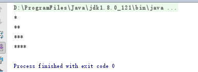
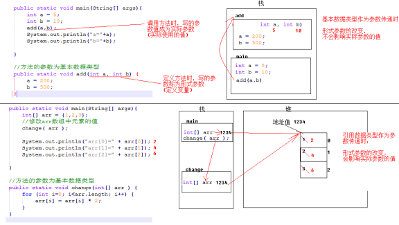
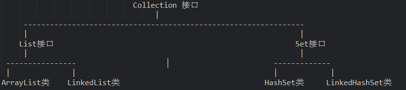

[Java基础学习笔记一 Java介绍](http://www.cnblogs.com/ginb/p/7103589.html)

[Java基础学习笔记二 Java基础语法之变量、数据类型](http://www.cnblogs.com/ginb/p/7103664.html)

[Java基础学习笔记三 Java基础语法之流程控制语句、循环](http://www.cnblogs.com/ginb/p/7105719.html)

[Java基础学习笔记四 Java基础语法之数组、方法](http://www.cnblogs.com/ginb/p/7106177.html)

[Java基础学习笔记五 Java基础语法之类和ArrayList](http://www.cnblogs.com/ginb/p/7123912.html)

[Java基础学习笔记六 Java基础语法之面向对象](http://www.cnblogs.com/ginb/p/7124041.html)

[Java基础学习笔记七 Java基础语法之继承和抽象类](http://www.cnblogs.com/ginb/p/7128615.html)

[Java基础学习笔记八 Java基础语法之接口](http://www.cnblogs.com/ginb/p/7128649.html)

[Java基础学习笔记九 Java基础语法之this和super](http://www.cnblogs.com/ginb/p/7158908.html)

[Java基础学习笔记十 Java基础语法之final、static、匿名对象、内部类](http://www.cnblogs.com/ginb/p/7159889.html)

[Java基础学习笔记十一 Eclipse开发工具](http://www.cnblogs.com/ginb/p/7160502.html)

[Java基础学习笔记](http://www.cnblogs.com/ginb/p/7161107.html)[十二](http://www.cnblogs.com/ginb/p/7161107.html)[ 类、抽象类、接口作为方法参数和返回值以及常用API](http://www.cnblogs.com/ginb/p/7161107.html)

[Java基础学习笔记十三 常用API之正则表达式、Date、DateFormat、Calendar](http://www.cnblogs.com/ginb/p/7162095.html)

[Java基础学习笔记十四 常用API之基本类型包装类](http://www.cnblogs.com/ginb/p/7163380.html)

[Java基础学习笔记十五 集合、迭代器、泛型](http://www.cnblogs.com/ginb/p/7168787.html)

[Java基础学习笔记十六 集合框架（二）](http://www.cnblogs.com/ginb/p/7170157.html )[之](http://www.cnblogs.com/ginb/p/7171829.html)[L](http://www.cnblogs.com/ginb/p/7171829.html)[ist与Set](http://www.cnblogs.com/ginb/p/7171829.html)

[Java基础学习笔记十七 集合框架（三）之Map](http://www.cnblogs.com/ginb/p/7171829.html)

[Java基础学习笔记十八 异常处理](http://www.cnblogs.com/ginb/p/7187564.html)

[Java基础学习笔记十九 文件操作](http://www.cnblogs.com/ginb/p/7197683.html)

[java基础学习笔记十九 IO流](https://www.cnblogs.com/ginb/p/9371754.html)

[Java基础学习笔记二十 IO流](http://www.cnblogs.com/ginb/p/7207076.html)

[Java基础学习笔记二十一 多线程](http://www.cnblogs.com/ginb/p/7209539.html)

[Java基础学习笔记二十二 网络编程](http://www.cnblogs.com/ginb/p/7213812.html)

[Java基础学习笔记二十三 Java核心语法之反射](http://www.cnblogs.com/ginb/p/7118078.html)

[Java基础学习笔记二十四  MySQL安装图解](http://www.cnblogs.com/ginb/p/7210490.html )

[Java基础学习笔记二十五  MySQL](http://www.cnblogs.com/ginb/p/7106962.html )

[Java基础学习笔记二十六 JDBC](http://www.cnblogs.com/ginb/p/7210528.html )

[Java基础学习笔记二十七 DBUtils和连接池](http://www.cnblogs.com/ginb/p/7211455.html )

[Java基础学习笔记二十八 管家婆综合项目](http://www.cnblogs.com/ginb/p/7216800.html )


# 基础语法之变量、数据类型

## 注释

单行注释

```java
//这是一条单行注释 
public int i;
```

多行注释

```java
/* 这是
* 一段注释，
* 它跨越了多个行
*/ 
public void f() {}
}
```

文档注释 

```java
/** The first Thinking in Java example program.
* Lists system information on current machine.
* @author Bruce Eckel
* @author http://www.BruceEckel.com
* @version 1.0
*/
```

对于单行和多行注释，被注释的文字，不会被JVM解释执行；对于文档注释，可以被JDK提供的工具javadoc 所解析，生成一套以网页文件形式体现的该程序的说明文档；单行注释可以嵌套使用，多行注释不能嵌套使用。

## 关键字

是被Java语言赋予特殊含义，具有专门用途的单词，比如class，int，double均为Java已经预设好的;

**组成关键字的字母全部小写** ,注意String不是关键字;Java 所有的组成部分都需要名字。类名。变量名以及方法名都被称为标识符

**goto与const是Java中的保留字，即没有赋予特殊含义却仍被Java占用的单词;**

## **标识符**

就是给类,接口,方法,变量等起名字时使用的字符序列,组成规则只能包含下面的内容,不能有其它内容:

-  英文大小写字母
- 数字字符
-  $和_

### 注意事项

- 数字不能开头
- 不可以使用关键字
- 严格区分大小写，不限制长度
- 起名时，尽量见名知意

### 标识符中常见的命名规则

- 包名：多单词组成时所有字母均小写，使用.连接.比如：aaa.bbb.ccc
- 类名&接口名：大驼峰式。比如：AaaBbbCcc
- 变量名&方法名：小驼峰式。比如：aaaBbbCcc
- 常量名：多单词组成是所有字母均大写，使用_连接。比如：AAA_BBB_CCC

## 数据类型

为什么有数据类型？

Java是强类型语言，对于每一种数据都定义了明确的具体数据类型，变量必须要有明确的类型，什么类型的变量装载什么类型的数据。

### 基本数据类型

基本数据类型是Java语言中内置的类型，分别是整数类型、小数类型、字符类型、布尔类型。

这四类基本类型是最简单、最基础的类型。

- 整数(byte、short、int、long)，默认的整数类型是int类型，long类型需添加"L"后缀。
- 小数(float、double)、字符类型(char)，默认的浮点类型是double类型。在Java中所有没有后缀以及使用“D”后缀（小写也可以，但建议使用大写）的小数都是double类型；float类型常量必须添加“F”后缀
- 字符类型（char）
- 布尔类型(boolean)

```JAVA
//整数
int num1 = 10;
byte num2 = 20;
short num3  = 30;
long num4  = 30L;   //Long类型要在数字后面加个L
    
//小数：浮点数
float num5 = 50.1F; //LfLoat类型要在数字后面加个
double num6 = 3.141592653589793238462643;
    
//字符
char name ='国';
        
//布尔值:	是非
boolean flag = true;
boolean flag2 = faLse;												
```

### 引用数据类型

引用数据类型是强大的数据类型，它是基于基本数据类型创建的。JavaSE中提供了一个超级类库，类库中包含了近万种引用数据类型。**比如：数组、类、接口**。

```java
//字符串,String不是关键字，类
String namea = "指针";
```

**引用数据类型的使用**

与定义基本数据类型变量不同，引用数据类型的变量定义及赋值有一个相对固定的步骤或格式。

```java
数据类型  变量名 =  new 数据类型();
```

每种引用数据类型都有其功能，我们可以调用该类型实例使用其功能。

```java
变量名.方法名();
```

## 常量

常量就是不变的数据量, 在程序执行的过程中其值不可以发生改变

### 常量分类

**整数类型**

- 十进制表示方式：正常数字，如 13、25等
- 二进制表示方式：以0b(0B)开头，如0b1011 、0B1001
- 十六进制表示方式：以0x(0X)开头，数字以0-9及A-F组成  如0x23A2、0xa、0x10
- 八进制表示方式：以0开头，如01、07、0721

**小数类型**，如1.0、-3.15、3.168等  (最好完全用同一种类型比较)

**布尔类型**， true、false

**字符类型**，字符必须使用’’ 包裹，并且其中只能且仅能包含一个字符。如'a'，'A', '0', '家'

**字符串类型**，一种引用类型，字符串必须使用""包裹，其中可以包含0~N个字符。如"我爱Java"，"0123"，""，"null"

#### **在程序中输出Java中的常量**

```java
public class Main {
    public static void main(String[] args) {
        //输出整数 十进制
        System.out.println(50);//50
        //输出整数，二进制, 数字开头0B
        System.out.println(0B11);//3
        //输出整数，八进制，数字开头0
        System.out.println(051);//41
        //输出整数，十六进制，数组开头0X  0-9 A-F
        System.out.println(0XE);//14
        //输出浮点数据
        System.out.println(5.0);//5.0
        //输出布尔数据，只有2个值，true，false 关键字
        System.out.println(true);//true
        System.out.println(false);//false
        //输出字符常量，单引号包裹，只能写1个字符
        System.out.println('a');//a
        //输出字符串常量，双引号包裹，可以写0-n个字符
        System.out.println("HelloWorld");//HelloWorld
    }
}
```

## 变量

变量是内存中装载数据的小盒子，你只能用它来存数据和取数据。

### 定义变量

```java
数据类型  变量名  =  数据值；
int  a   =  100;
```

变量使用时有作用域的限制。

```java
public static void main(String[] args) {
    int x = 20;
    {
        int y = 20;
    }
    System.out.println(x);//读取x变量中的值，再打印
    System.out.println(y);//读取y变量中的值失败，失败原因，找不到y变量，因为超出了y变量作用范围，所以不能使用y变量
}
```

变量不可以重复定义。

```java
public static void main(String[] args){
      int x = 10;
      double x = 5.5;//编译失败，变量重复定义
}
```

### 数据类型转换

不同类型的变量可以在一起运算，但要先进行类型转换再运算。

- 范围小的数据类型值（如byte），可以直接转换为范围大的数据类型值（如int）；
- 范围大的数据类型值（如int），不可以直接转换为范围小的数据类型值（如byte）

**数据范围从小到大依次列出：byte -> short -> int -> long -> float -> double**

两种方式的数据类型转换

```
强制转换(类型)变量名   高-低
自动转换             低--高
```

自动类型转换：表示范围小的数据类型转换成范围大的数据类型。格式：

```c++
范围大的数据类型 变量 = 范围小的数据类型值；
比如：double d = 1000; 
```

强制类型转换：表示范围大的数据类型转换成范围小的数据类型

```c++
范围小的数据类型  变量 = (范围小的数据类型) 范围大的数据类型值;
比如：int  i = (int)6.718;   //i的值为6
```

### 变量作用域

记忆:  **==类变量(static), 局部变量( 必须初始化值)—->直接用    实例变量—>new出来==** 

```c++
public class Variable {
    static int a11Clicks = 9:   //类变量(static)
    String str = "hello world"；  //实例变量
        
    public void method() {
        int i =0；              //局部变量
    }
}
```

**使用方式:**

```java
public class variable {

    // N01. 类变量: 加了static
    static double salary = 2000;


    //N02. 实例变量：从属于对象；如果不自行初始化，这个类型的默认值 0 0.0(相当于全局变量)(默认公有 c++默认私有)//布尔值：默认是false //除了基本类型，其余的默认值都是null；
    String name;
    int age;

    //main方法
    public static void main(String[] args) {

        //N02. 局部变量 // 必须初始化值
        int i = 10;
        System.out.println(i);;

        //N02. 实例变量使用(需要new出对象) //变量类型 变量名字 = new variable()；
        variable var = new variable();
        System.out.println(var.age);
        System.out.println(var.name);

        //类变量 static (直接用)
        System.out.println(salary);
    }
    
    public void add(){
        
	}
}
```

## 运算符

### 算数运算符

加号（ +）、减号和负号（ -）、乘号（ *）、除号（ /）、取模（%）、自增（++）、自减（--）以及等号（ =）的用法与其他所有编程语言都是类似的 。

++,--运算符后置时，先使用变量a原有值参与运算操作，运算操作完成后，变量a的值自增1或者自减1。

l ++，--运算符前置时，先将变量a的值自增1或者自减1，然后使用更新后的新值参与运算操作。

### 赋值运算符

赋值（=）、加后赋值（+=）、减后赋值（-=）、乘后赋值（*=）、整除后赋值（/=）取模后赋值（%=）的用法与其他所有编程语言都是类似的 。

### 关系运算符

等于（==）  不等于（!=） 小于（<） 大于（>）  小于等于（<=） 大于等于（>=）的用法与其他所有编程语言都是类似的 。

### **逻辑运算符**

与（&&）、或（||）、非（!）的用法与其他所有编程语言都是类似的 。

短路：当使用与或者或时，只要能判断出结果则后边的部分就不再判断。

### **三元运算符**

(条件表达式)？表达式1：表达式2；

```
int n = (3>2 && 4>6) ? 100 : 200;
//逻辑运算后的结果为false，运算结果为表达式2的值200,然后将结果200赋值给了变量n
```

# 基础语法之流程控制语句、循环

## 输入输出

### 输入

Scanner类可以完成用户键盘录入，获取到录入的数据。

```java
导包： import   java.util.Scanner; 
```

```java
创建对象实例：Scanner sc = new Scanner(System.in); 
```

调用方法：

```java
int  i = sc.nextInt(); //用来接收控制台录入的数字
String s = sc.next();  //用来接收控制台录入的字符串, 接受下一个
```

**读取整数,小数:**

```c++
import java.util.Scanner;
public class ScannerDemo01 {
    public static void main(String[] args) {
        //创建Scanner引用类型的变量
        Scanner sc = new Scanner(System.in);
        //获取数字
        System.out.println("请输入一个数字");
        int n = sc.nextInt();
        System.out.println("n的值为" + n);
        //获取字符串
        String str = sc.next();
        System.out.println("str的值为" + str);
    }
}
```

运行结果

```
请输入一个数字
10
的值为10
yyb
st的值为yyb
```

**单个输入:**

```java
scanner.next()
```

```java
import java.util.Scanner;
public class Demoe1
public static void main(String[]args)
{
    //创建一个扫描器对象，用于接收键盘数据
    Scannerscanner new Scanner(System.in);
    System,out.printIn("使用next方式接收：")；
    /1判断用户有没有输入字符申
    if (scanner.hasNext()){
    /使用next方式接收
    String str scanner.next();
    System.out.print1n("输出的内容为："+str);
    scanner.close();
}
```

**整行输入:**

```java
scanner.nextLine()
```

```java
import java.util.Scanner;
public class Demoe3
public static void main(String[]args){
    //从键盘接收数据
    Scanner scanner new Scanner(System.in);
    System.out.printin("请输入数据：")；
    IString str-scanner.nextLine();
    System.out.println("输出的内容为："+str);
    scanner.close();
}
```

### 输出

```java
System.out.println(sum);         // 换行
System.out.print(sum);           // 不换行
System.out.printf("%d", sum);    // 格式化
```

%12d： “d” 表示decima Integer, 即十进制整数。12表示输出的最小空间为12。如果输出的数没有占满12位，输出会自动用空格占满前方。这也被称为“right-justified in a field of length 12”。 如果输出的是大于12位，所有的位都会被printf。

%12.1f：“f”表示double 类型。"1"表示小数点后保留几位. "12" 表示被输出的最小character数。如果输出的数没有占满12位，输出会自动用空格占满前方。

%15.5e： “e”表示指数（用于表示very big values），“15”同上， "5" 表示转化后的数小数点后保留5位。

%1.[5g](https://so.csdn.net/so/search?q=5g&spm=1001.2101.3001.7020)： “g”表示指数（用于表示very small values）， “1”同上， "5" 表示转化后的数小数点后保留5位。

```java
# 代码
double amount = 2.111;
System.out.printf( "%1.2f", amount );
 
#输出
2.11
 
#代码
int amount = 2;
System.out.printf( "%12d", amount );
 
#输出 (前面有11位空格）
           2
 
# 代码
double amount = 1.11;
System.out.printf( "%12.1f", amount);
 
#输出(前面有9位空格）
         1.1
 
#代码
double amount = 0.000000011;
System.out.printf( "%1.5g", amount );
 
#输出（小数点后保留5位）
1.10000e-08
 
#代码
double amount = 1100000000;
System.out.printf( "%1.5e", amount );
 
#输出（小数点后保留5位）
1.10000e+09
```

## 流程控制语句

### 选择结构if

if…else if…else语句用于对多个条件进行判断，进行多种不同的处理。if…else if…else语句具体语法格式如下：

```java
if (判断条件1) {
　　执行语句1
} else if (判断条件2) {
　　执行语句2
}
...
else if (判断条件n) {
　　执行语句n
} else {
　　执行语句n+1
}
```

### switch语句

格式如下：

```java
switch(整数选择因子或者字符串或者枚举) {
　　case 整数值 1 : 语句; break;
　　case 整数值 2 : 语句; break;
　　case 整数值 3 : 语句; break;
　　case 整数值 4 : 语句; break;
　　case 整数值 5 : 语句; break;
　　//..
　　default:语句;
}
```

java Switch语法 中能使用 String。switch 能将整数选择因子的结果与每个整数值比较。若发现相符的，就执行对应的语句（简单或复合语句）。若没有发现相符的，就执行default 语句。

### switch语句接受的数据类型

switch语句中的表达式的数据类型,是有要求的

- JDK1.0 - 1.4 数据类型接受 byte short int char
- JDK1.5 数据类型接受 byte short int char enum(枚举)
- JDK1.7 数据类型接受 byte short int char enum(枚举), String

在使用switch语句的过程中，如果多个case条件后面的执行语句是一样的，则该执行语句只需书写一次即可，这是一种简写的方式。

如下所示。SwitchDemo02.java

```
public class SwitchDemo02 {
    public static void main(String[] args) {
        int week = 2;
        switch (week) {
            case 1:
            case 2:
            case 3:
            case 4:
            case 5:
                // 当 week 满足值 1、2、3、4、5 中任意一个时，处理方式相同
                System.out.println("今天是工作日");
                break;
            case 6:
            case 7:
                // 当 week 满足值 6、7 中任意一个时，处理方式相同
                System.out.println("今天是休息日");
                break;
        }
    }
}
```


上述代码中，当变量week值为1、2、3、4、5中任意一个值时，处理方式相同，都会打印“今天是工作日”。同理，当变量week值为6、7中任意一个值时，打印“今天是休息日”。

## 循环语句

### while语句

while循环语句和选择结构if语句有些相似，都是根据条件判断来决定是否执行大括号内的执行语句。区别在于，while语句会反复地进行条件判断，只要条件成立，{}内的执行语句就会执行，直到条件不成立，while循环结束。while循环语句的语法结构如下：

```
while(循环条件){
    执行语句
    ………
}
```

### **循环语句for**

for循环语句是最常用的循环语句，一般用在循环次数已知的情况下。for循环语句的语法格式如下：

```
for（初始化表达式; 循环条件; 操作表达式）{

    执行语句
    ………
}

21.for --> 自动补全
```

在上面的语法结构中，for关键字后面()中包括了三部分内容：初始化表达式、循环条件和操作表达式，它们之间用“;”分隔，{}中的执行语句为循环体。

接下来分别用①表示初始化表达式、②表示循环条件、③表示操作表达式、④表示循环体，通过序号来具体分析for循环的执行流程。

### do…while语句

do…while循环语句和while循环语句功能类似，其语法结构如下：

```
do {

    执行语句
    ………
} while(循环条件);
```

在上面的语法结构中，关键字do后面{}中的执行语句是循环体。do…while循环语句将循环条件放在了循环体的后面。这也就意味着，循环体会无条件执行一次，然后再根据循环条件来决定是否继续执行。

 **无限循环**

最简单无限循环格式：

```
while(true){}

或

for(;;){}
```

无限循环存在的原因是并不知道循环多少次，而是根据某些条件，来控制循环。

 **循环嵌套**

嵌套循环是指在一个循环语句的循环体中再定义一个循环语句的语法结构。while、do…while、for循环语句都可以进行嵌套，并且它们之间也可以互相嵌套，如最常见的在for循环中嵌套for循环，格式如下：

```
for(初始化表达式; 循环条件; 操作表达式) {
    ………
    for(初始化表达式; 循环条件; 操作表达式) {
        执行语句
        ………
     }
    ………
}
```

## 跳转语句（break、continue）

跳转语句用于实现循环执行过程中程序流程的跳转，在Java中的跳转语句有break语句和continue语句。接下来分别进行详细地讲解。

### **break语句**

在switch条件语句和循环语句中都可以使用break语句。当它出现在switch条件语句中时，作用是终止某个case并跳出switch结构。当它出现在循环语句中，作用是跳出循环语句，执行后面的代码。

接下来通过下面一段代码，实现将当变量x的值为3时，使用break语句跳出循环，代码如下所示。BreakDemo.java

```
public class BreakDemo {
    public static void main(String[] args) {
        int x = 1; // 定义变量x，初始值为1
        while (x <= 4) { // 循环条件
            System.out.println("x = " + x); // 条件成立，打印x的值
            if (x == 3) {
                break;
            }
            x++; // x进行自增
        }
    }
}
```

```
在上述带代码中，通过while循环打印x的值，当x的值为3时使用break语句跳出循环。因此打印结果中并没有出现“x=4”。
```

### **标记**

当break语句出现在嵌套循环中的内层循环时，它只能跳出内层循环，如果想使用break语句跳出外层循环则需要对外层循环添加标记。接下来将ForForDemo.java稍作修改，控制程序只打印4行“*”，如下所示。BreakDemo02.java

```
public class BreakDemo02 {
    public static void main(String[] args) {
        int i, j; // 定义两个循环变量
        AA: for (i = 1; i <= 9; i++) { // 外层循环
            for (j = 1; j <= i; j++) { // 内层循环
                if (i > 4) { // 判断i的值是否大于4
                    break AA; // 跳出外层循环
                }
                System.out.print("*"); // 打印*
            }
            System.out.print("\n"); // 换行
        }
    }
}
```



BreakDemo02.java与ForForDemo.java实现原理类似，只是在外层for循环前面增加了标记“AA”。当i>4时，使用break AA;语句跳出外层循环。因此程序只打印了4行“*”。

### **continue语句**

continue语句用在循环语句中，它的作用是终止本次循环，执行下一次循环。接下来通过一个练习对1~100之内的奇数求和，ContinueDemo.java

```
public class ContinueDemo {
    public static void main(String[] args) {
        int sum = 0; // 定义变量sum，用于记住和
        for (int i = 1; i <= 100; i++) {
            if (i % 2 == 0) { // i是一个偶数，不累加
                continue; // 结束本次循环
            }
            sum += i; // 实现sum和i的累加
        }
        System.out.println("sum = " + sum);
    }
}
//sum = 2500
```

上述代码中，使用for循环让变量i的值在1~100之间循环，在循环过程中，当i的值为偶数时，将执行continue语句结束本次循环，进入下一次循环。当i的值为奇数时，sum和i进行累加，最终得到1~100之间所有奇数的和，打印“sum = 2500”。

# 基础语法之数组、方法

## 数组

### 一维数组(new)

**静态初始化:**

```java
类型[] 数组名 = {元素，元素，元素，……};
```

```java
int[] a = {1, 2, 3};
```

**动态初始化(推荐):**

```java
类型[] 数组名 = new 类型[]{元素，元素，……};
```

```java
int[] a = new int[3];
a[0] = 1;
a[1] = 2;
a[2] = 3;
```

例子

```java
class Solution {
    public int[] twoSum(int[] nums, int target) {
        for (int i = 0; i < nums.length; ++i){
            for (int j = i + 1; j < nums.length; ++j){
                if (nums[i] == target - nums[j])
                {
                    return new int[] {i, j};
                }
            }
        }
        return new int[0];
    }
}
```


### 二维数组(new)

**初始化:**

```java
类型[][] 数组名 = new 类型[n][]{元素，元素，……};
```

**二维数组的创建**

**静态初始化**

**(1)定义的同时赋值**

```java
int [][]arr={{1,2,3},{4,5,6},{7,8,9}};  ////c++可以省略行,java可以省略列
```

```java
public class AiMing {
    public static void main(String[] args) {
        int arr[][]={{1,2,3},{4,5,6},{7,8,9}};
        for(int i=0;i<arr.length;i++)
        {
            for(int j=0;j<arr[i].length;j++)
            {
                System.out.print(arr[i][j]+" ");
            }
            System.out.println();
        }
    }
}
```

运行结果如下: 

```cobol
1 2 3 
4 5 6 
7 8 9
```

**动态初始化**

**(2)先声明，后创建数组对象**

```java
int [][] arr;
arr=new int[3][3];
```

```java
public class AiMing {
    public static void main(String[] args) {
        int arr[][];//声明二维数组
        arr=new int [3][3];//创建数组对象
        for(int i=0;i<arr.length;i++)
        {
            for(int j=0;j<arr[i].length;j++)
            {
                System.out.print(arr[i][j]+" ");
            }
            System.out.println();
        }
    }
}
```

运行结果如下:

```cobol
0 0 0 
0 0 0 
0 0 0 
```

**(3)在声明的同时创建数组对象**

```java
int [][] arr =new int [3][3];   //c++不能动态申请行时同时申请列
```

```java
public class AiMing {
    public static void main(String[] args) {
        int [][] arr =new int [3][3];
        for(int i=0;i<arr.length;i++)
        {
            for(int j=0;j<arr[i].length;j++)
            {
                System.out.print(arr[i][j]+" ");
            }
            System.out.println();
        }
    }
}
```

运行结果如下:

```cobol
0 0 0 
0 0 0 
0 0 0 
```

### Java中 length 和 length()的区别

<font color=red>arr.length针对的是数组，而str.length()针对的是针对的字符串</font>

**数组(str.length)** 的特点有：长度固定，类型固定。因此数组的长度就可以被视为是一种数组的属性

输入：

```java
int arr[] = new int[3];
int arr1[] = {1,2,3,3,4,5}; 
System.out.println(arr.length);
System.out.println(arr1.length);
1234
```

输出：

```java
3
6
12
```

**字符串(str.length())** : string 的内部机制是一个 char 数组，而 char 数组有自己的长度属性，所以 string 就没必要再去设置一个属性（多余的操作）

输入：

```java
string str = "what a pity world!";
System.out.println(str,length（）);
```

输出：

```java
17
```

**JVM内存划分**

 JVM对自己的内存划分为5个区域

- 寄存器:内存和CUP之间
- 本地方法栈: JVM调用了系统中的功能
- 方法和数据共享: 运行时期class文件进入的地方
- 方法栈:所有的方法运行的时候进入内存
- 堆:存储的是容器和对象

 **数组的内存**

int[] x; // 声明一个int[]类型的变量
x = new int[100]; // 创建一个长度为100的数组
接下来，通过两张内存图来详细地说明数组在创建过程中内存的分配情况。
第一行代码 int[] x; 声明了一个变量x，该变量的类型为int[]，即一个int类型的数组。变量x会占用一块内存单元，它没有被分配初始值
第二行代码 x = new int[100]; 创建了一个数组，将数组的地址赋值给变量x。在程序运行期间可以使用变量x来引用数组，这时内存中的状态会发生变化


 **数组中常见的异常**

数组操作中,常见的两个异常
数组的索引越界异常
空指针异常

**二维数组内存图**

举例:int[][] arr = new int[3][4];
外层数组长在内存开辟连续的3个大的内存空间,每一个内存空间都对应的有地址值
每一个大内存空间里又开辟连续的四个小的内存空间.

 

## 方法(类方法)

### **方法的语法格式**

在Java中，声明一个方法的具体语法格式如下：

```java
修饰符 返回值类型 方法名(参数类型 参数名1,参数类型 参数名2,．．．．．．){ 
    执行语句
    ……… 
    return 返回值;
}
```

- 修饰符：方法的修饰符比较多，有对访问权限进行限定的，有静态修饰符static，还有最终修饰符final等，这些修饰符在后面的学习过程中会逐步介绍
- 返回值类型：用于限定方法返回值的数据类型
- 参数类型：用于限定调用方法时传入参数的数据类型
- 参数名：是一个变量，用于接收调用方法时传入的数据
- return关键字：用于结束方法以及返回方法指定类型的值
- 返回值：被return语句返回的值，该值会返回给调用者

**方法使用的注意事项**

- 方法不调用，自己不执行
- 方法中不能定义方法， 但是，方法中可以调用方法
- 方法定义的位置在类中，其他方法的外面
- 方法中的“参数类型 参数名1，参数类型 参数名2”被称作参数列表，它用于描述方法在被调用时需要接收的参数，如果方法不需要接收任何参数，则参数列表为空，即()内不写任何内容。
- 如果方法没有明确的返回值类型，使用'空'类型， void表示
- void只能在方法返回值类型位置使用，不能作为普通的数据类型使用
- 如果方法返回值类型为void类型，可以省略 return ;

### 方法的调用

```java
public class Student{
    
    // 静态方法
	public static void say1(){
		System.out.println("学生说话了")；
	}
        
    // 非静态方法
    public void say2(){
		System.out.println("学生说话了")；
	}
    
    // 非类方法中
    public static void main(String[] args){
		say1();  // 静态方法直接调用
        
        // 非静态方法调用
        Student student = new Student;
        student.say2();
    }
}


Person person = getPerson(); // 假设getPerson()是返回Person类实例的函数

    
在这种情况下，getPerson()函数应该返回一个有效的Person对象，然后你可以将它赋值给person变量，无需使用new关键字创建新的对象。

请确保getPerson()函数确实返回了一个有效的Person对象，否则可能会导致空指针异常。
```

ps:	几乎和类变量一样

静态方法 和 非静态方法, 两者区别:

+ **静态方法和类一起加载,  非静态方法在类实例化之后才存在**
+ **静态方式可以直接用,非静态必须new出对象来**

###  方法的重载

Java允许在一个类中定义多个名称相同的方法，但是参数的类型或个数必须不同，这就是方法的重载。

比如，下面的三个方法互为重载关系

```java
public static int add(int x,int y) {逻辑} //两个整数加法

public static int add(int x,int y,int z) {逻辑} //三个整数加法

public static int add(double x,double y) {逻辑} //两个小数加法
```

接下来演示方法重载的方式如下所示。

```java
public class MethodDemo03 {
    public static void main(String[] args) {
        // 下面是针对求和方法的调用
        int sum1 = add(1, 2);
        int sum2 = add(1, 2, 3);
        double sum3 = add(1.2, 2.3);
        // 下面的代码是打印求和的结果
        System.out.println("sum1=" + sum1);
        System.out.println("sum2=" + sum2);
        System.out.println("sum3=" + sum3);
    }

    // 下面的方法实现了两个整数相加
    public static int add(int x, int y) {
        return x + y;
    }
    // 下面的方法实现了三个整数相加
    public static int add(int x, int y, int z) {
        return x + y + z;
    }
    // 下面的方法实现了两个小数相加
    public static double add(double x, double y) {
        return x + y;
    }
}
```


**重载的注意事项**

重载方法参数必须不同：

- 参数个数不同，如method(int x)与method(int x,int y)不同
- 参数类型不同，如method(int x)与method(double x)不同
- 参数顺序不同，如method(int x,double y)与method(double x,int y)不同

重载只与方法名与参数类型相关，与返回值无关。如void method(int x)与int method(int y)不是方法重载，不能同时存在

重载与具体的变量标识符无关。如method(int x)与method(int y)不是方法重载，不能同时存在

  **参数传递**

定义方法时，参数列表中的变量，我们称为形式参数

调用方法时，传入给方法的数值，我们称为实际参数

#### 参数传递图解与结论

 

通过上面的两段程序可以得出如下结论：

- 当调用方法时，如果传入的数值为基本数据类型（包含String类型），形式参数的改变对实际参数不影响
- 当调用方法时，如果传入的数值为引用数据类型（String类型除外），形式参数的改变对实际参数有影响

#### 命令行传参

```java
public class CommandLine
public static void main(String args[]){
    for(int i=0;i<args.length;i++){
    	System.out.println("args["i+"]"args[i]);
    }
}
```

#### 可变参数

```java
package com.kuang.method;
public class Demo04
public static void main(String args[]){
    //调用可变参数的方法
    printMax(...numbers:34,3,3,2,56.5);
    printMax(new double[]{1,2,3});
    
    public static void printMax(double...numbers){  //可变参数
        if (numbers.length ==0){
            System.out.println("No argument passed);
            return;
        }
        
        double result numbers[];
        //排序
        for (int i 1;i numbers.length;i++){
            if (numbers[i]result)
            	result numbers[i];
        }
        System.out.println("The max value is "result);
	}
}
```

# 面向对象

## improt

###  import关键字引入Java类库中的类

1. import 语句的作用是：当某个类中想要引入不在同一个包中的某个类时，就需要通过 import 语句进行引入；

2. 因为用户编写的类是不与Java类库中的类同属于一个包中的，所以用户需要引入类库中的某个类时，就需要通过import语句进行引入；

3. 通过 import 语句可以引入Java类库中的类和接口；

**当需要引入Java类库中的某个类时，如下演示：**

```java
import java.util.Date ;
```

**当需要引入Java类库中一个包中的全部类时，如下演示：**

```java
import java.util.*;
```

方式1: 	**使用 java.util 包中的 Date 类来显示本地时间，就需要通过 import 语句进行引入；**

```java
package Chapter_Four;
import java.util.Date;
public class Import_Test {
 
	public static void main(String[] args) {
		//创建Date对象
		Date dt = new Date();                     // 核心
        //通过对象调用方法，显示时间
		System.out.println("当前时间为："+dt.toString());
	}
}
```

方式2:   **要是不用 import 语句引入包中的类，也可以直接通过 包名+类名 进行引入**

```java
package Chapter_Four;
public class Import_Test {
 
	public static void main(String[] args) {
		//创建Date对象
		java.util.Date dt = new java.util.Date();      // 核心
        //通过对象调用方法，显示时间                 
		System.out.println("当前时间为："+dt.toString());
	}
}
```

#### **import 引入用户自定义包中的类**

//**编写用于功能设计的类：**

```java
package Chapter_Three.tests;  // 该类自己所属包

public class tests {
     //设计三角形面积计算的功能
	double sidex,sidey,sidez;
	public double getArea(){
		double size = (sidex+sidey+sidez)/2.0 ;
		double area = Math.sqrt(size*(size-sidex)*(size-sidey)*(size-sidez));
		return area;
	}
	public void setArea(double x,double y,double z){
		sidex = x;
		sidey = y ;
		sidez = z ;
	}
}
```

//**编写用于实现功能的类：**

```java
package Chapter_Four.testMain;     // 该类自己所属包

import Chapter_Three.tests.tests;  // 引入用户自定义包中的类   // 核心

public class testMain {
	public static void main(String[] args) {
		
        //调用实现功能的类
		tests ct = new tests();
		ct.setArea(11,11,11);
        System.out.println("三角形的面积为："+ct.getArea());
	}
 
}
```

**代码输出：**

**三角形的面积为：52.39453692895854**

**需要注意的是，三角形两边之和要大于第三条边，否则程序输出：NaN
需要注意的是，三角形两边之和要大于第三条边，否则程序输出：NaN**

## 对象的创建

+ **通过new的方式创建对象** 
+ **通过反射操作类**

```java
class User{
	public  int age;
	private  String name;

	User(){
		age = 0;
		name = "L";
	}
}

// 测试类的创建
public static void main(String[] args)
{
     // 方式1:
    User u = new User();
    // 方式2:
    Class<?> c3 = User.class;  // 具体见注解
}
```

## 构造器(就c++中的构造函数)

```java
构造器：
1.和类名相同
2.没有返回值
    
作用：
1.new本质在调用构造方法
2.初始化对象的值
    
注意点：
1.定义有参构造之后，如果想使用无参构造，显示的定义一个无参的构造
Alt Insert
```

## this关键字

以在成员变量名前面加上this，来区别成员变量和局部变量。

```c++
class Person {
    private int age;
    private String name;

    public void speak() {
        this ( ) ;     //调用无参的构造方法
        this.name = "小强";
        this.age = 18;
        System.out.println("name=" + this.name + ",age=" + this.age);
    }
}
class PersonDemo {
    public static void main(String[] args) {
        Person p = new Person();
        p.speak();
    }
}
```

**创建对象内存分析**


## super关键字

子父类中构造方法的调用
在创建子类对象时，父类的构造方法会先执行，因为子类中所有构造方法的第一行有默认的隐式super();语句。
格式：

```java
//调用本类中的构造方法
this(实参列表);
//调用父类中的空参数构造方法
super();
//调用父类中的有参数构造方法
super(实参列表);
```

为什么子类对象创建都要访问父类中的构造方法？因为子类继承了父类的内容，所以创建对象时，必须要先看父类是如何对其内容进行初始化的，看如下程序：

```java
public class Test {
    public static void main(String[] args) {
        new Zi();
    }

}
class Fu{
    int num ;
    Fu(){
        System.out.println("Fu构造方法"+num);
        num = 4;
    }
}
class Zi extends Fu{
    Zi(){
    //super(); 调用父类空参数构造方法
        System.out.println("Zi构造方法"+num);
    }
}
//　　执行结果：
//　　Fu构造方法0
//　　Zi构造方法4
```

###  **封装(属性私有化)**

**访问权限表**

| 位置             | private | 默认   | protected | public |
| ---------------- | ------- | ------ | --------- | ------ |
| 同一个类         | 可以    | 可以   | 可以      | 可以   |
| 同一个包的类     | 不可以  | 可以   | 可以      | 可以   |
| 不同包的子类     | 不可以  | 不可以 | 可以      | 可以   |
| 不同包的不是子类 | 不可以  | 不可以 | 不可以    | 可以   |

```c++
class Person {
    // 类属性(这里是私有的)
    private int age;
    private String name;

    public void show() {
        System.out.println("age=" + age + ",name" + name);
    }
}
```

一般对成员属性的访问动作：赋值(设置 set)，取值(获取 get)，因此对私有的变量访问的方式可以提供对应的 setXxx或者getXxx的方法。

```c++
class Person {
    // 私有成员变量
    private int age;
    private String name;

    // 对外提供设置成员变量的方法
    public void setAge(int a) {
// 由于是设置成员变量的值，这里可以加入数据的验证
        if (a < 0 || a > 130) {
            System.out.println(a + "不符合年龄的数据范围");
            return;
        }
        age = a;
    }

    // 对外提供访问成员变量的方法
    public void getAge() {
        return age;
    }
}
```

## 继承**extends**

+ **[extends]()关键字**

```java
/*
* 定义员工类Employee
*/
public class Employee {
    String name; // 定义name属性
    // 定义员工的工作方法
    public void work() {
        System.out.println("尽心尽力地工作");
    }
}
```

```java
/*
* 定义研发部员工类Developer 继承 员工类Employee
*/
class Developer extends Employee {
    // 定义一个打印name的方法
    public void printName() {
        System.out.println("name=" + name);
    }
}
```

```java
/*
* 定义测试类
*/
public class Example01 {
    public static void main(String[] args) {
        Developer d = new Developer(); // 创建一个研发部员工类对象
        d.name = "小明"; // 为该员工类的name属性进行赋值
        d.printName(); // 调用该员工的printName()方法
        d.work(); // 调用Developer类继承来的work()方法
    }
}
```

注意 :

+ 在Java中，类只支持单继承，不允许多继承，也就是说一个类只能有一个直接父类，

  ```java
  class A{} 
  class B{}
  class C extends A,B{} // C类不可以同时继承A类和B类
  ```

### 方法的重写

==相当于c++的虚函数==

当子类需要父类的功能，而功能主体子类有自己特有内容时，可以重写父类中的方法

+  在子类中，访问父类中的成员方法格式： super.父类中的成员方法(); 
+  为什么需要重写:
   + 父类的功能，子类不一定需要，或者不一定满足
     A1t + Insert；override;

**不能重写的**

1. static方法，属子类， 它不属于实例
2. finaL常量;
3. private方法;

```java
//手机类
class Phone{
    public void sendMessage(){
        System.out.println("发短信");
    }
    public void call(){
        System.out.println("打电话");
    }
    public void showNum(){
        System.out.println("来电显示号码");
    }
}

//智能手机类
class NewPhone extends Phone{

    //覆盖父类的来电显示号码功能，并增加自己的显示姓名和图片功能
    public void showNum(){             
        super.showNum();  //调用父类已经存在的功能使用super
		//增加自己特有显示姓名和图片功能
        System.out.println("显示来电姓名");
        System.out.println("显示头像");
    }
}
```

###  子父类中出现同名成员变量时

当子父类中出现了同名成员变量时，在子类中若要访问父类中的成员变量，必须使用关键字super来完成。super用来表示当前对象中包含的父类对象空间的引用。

+  在子类中，访问父类中的成员变量格式： super.父类中的成员变量 

```java
class Fu
{
    //Fu中的成员变量。
    int num = 5;
}
class Zi extends Fu
{
    //Zi中的成员变量
    int num = 6;
    void show()
    {
//子父类中出现了同名的成员变量时
//在子类中需要访问父类中非私有成员变量时，需要使用super关键字
//访问父类中的num
        System.out.println("Fu num="+super.num);
//访问子类中的num2
        System.out.println("Zi num2="+this.num);
    }
}
class Demo5
{
    public static void main(String[] args)
    {
        Zi z = new Zi(); //创建子类对象
        z.show(); //调用子类中的show方法
    }
}
```


## 多态

### 多态的定义与使用格式

**相当于c++的父类指针可以指向子类指针**

多态的定义格式：就是父类的引用变量指向子类对象

```java
父类类型 变量名 = new 子类类型();
变量名.方法名();
```

普通类多态定义的格式

```java
父类 变量名 = new 子类();
如：  
class Fu {}
class Zi extends Fu {}

//类的多态使用
Fu f = new Zi();
```

抽象类多态定义的格式

```c
抽象类 变量名 = new 抽象类子类();
```

比如：

```
abstract class Fu {
    public abstract void method();
}
class Zi extends Fu {
    public void method(){
        System.out.println("重写父类抽象方法");
    }
}
//类的多态使用
Fu fu= new Zi();
```

接口多态定义的格式

```c
接口 变量名 = new 接口实现类();
```

比如：

```
interface Fu {
    public abstract void method();
}
class Zi implements Fu {
    public void method(){
        System.out.println("重写接口抽象方法");
    }
}
//接口的多态使用
Fu fu = new Zi();
```

###  注意事项

同一个父类的方法会被不同的子类重写。在调用方法时，调用的为各个子类重写后的方法。

```
Person p1 = new Student();
Person p2 = new Teacher();
p1.work(); //p1会调用Student类中重写的work方法
p2.work(); //p2会调用Teacher类中重写的work方法
```

当变量名指向不同的子类对象时，由于每个子类重写父类方法的内容不同，所以会调用不同的方法。

### 多态-成员的特点

多态出现后会导致子父类中的成员变量有微弱的变化。看如下代码

```
class Fu {
    int num = 4;
}
class Zi extends Fu {
    int num = 5;
}
class Demo {
    public static void main(String[] args) {
        Fu f = new Zi();
        System.out.println(f.num);//4
        Zi z = new Zi();
        System.out.println(z.num);//5
    }
}
```

**多态成员变量**

当子父类中出现同名的成员变量时，多态调用该变量时：
编译时期：参考的是引用型变量所属的类中是否有被调用的成员变量。没有，编译失败。
运行时期：也是调用引用型变量所属的类中的成员变量。
简单记：编译和运行都参考等号的左边。编译运行看左边。

多态出现后会导致子父类中的成员方法有微弱的变化。看如下代码

```
class Fu {
    int num = 4;
    void show()    {
        System.out.println("Fu show num");
    }
}
class Zi extends Fu {
    int num = 5;
    void show()    {
        System.out.println("Zi show num");
    }
}
class Demo {
    public static void main(String[] args) {
        Fu f = new Zi();
        f.show();
    }
}
```

**多态成员方法**

编译时期：参考引用变量所属的类，如果没有类中没有调用的方法，编译失败。
运行时期：参考引用变量所指的对象所属的类，并运行对象所属类中的成员方法。
简而言之：编译看左边，运行看右边。

### instanceof关键字

我们可以通过instanceof关键字来判断某个对象是否属于某种数据类型。如学生的对象属于学生类，学生的对象也属于人类。
使用格式：

```
boolean b = 对象 instanceof 数据类型;
```

如

```
Person p1 = new Student(); // 前提条件，学生类已经继承了人类
boolean flag = p1 instanceof Student; //flag结果为true
boolean flag2 = p2 instanceof Teacher; //flag结果为false
```

### 多态-转型

多态的转型分为向上转型与向下转型两种：

1. 把子类转换为父类，向上转型:  自动

2. 把父类转换为子类，向下转型：强制转换

向上转型：当有子类对象赋值给一个父类引用时，便是向上转型，多态本身就是向上转型的过程。
使用格式：父类类型 变量名 = new 子类类型(); 如：Person p = new Student();
向下转型：一个已经向上转型的子类对象可以使用强制类型转换的格式，将父类引用转为子类引用，这个过程是向下转型。如果是直接创建父类对象，是无法向下转型的！
使用格式：子类类型 变量名 = (子类类型) 父类类型的变量; 如:Student stu = (Student) p; 

**多态的好处与弊端**

当父类的引用指向子类对象时，就发生了向上转型，即把子类类型对象转成了父类类型。向上转型的好处是隐藏了子类类型，提高了代码的扩展性。
但向上转型也有弊端，只能使用父类共性的内容，而无法使用子类特有功能，功能有限制。看如下代码

```
//描述动物类，并抽取共性eat方法
abstract class Animal {
    abstract void eat();
}

// 描述狗类，继承动物类，重写eat方法，增加lookHome方法
class Dog extends Animal {
    void eat() {
        System.out.println("啃骨头");
    }

    void lookHome() {
        System.out.println("看家");
    }
}

// 描述猫类，继承动物类，重写eat方法，增加catchMouse方法
class Cat extends Animal {
    void eat() {
        System.out.println("吃鱼");
    }

    void catchMouse() {
        System.out.println("抓老鼠");
    }
}

public class Test {
    public static void main(String[] args) {
        Animal a = new Dog(); //多态形式，创建一个狗对象
        a.eat(); // 调用对象中的方法，会执行狗类中的eat方法
// a.lookHome();//使用Dog类特有的方法，需要向下转型，不能直接使用

// 为了使用狗类的lookHome方法，需要向下转型
// 向下转型过程中，可能会发生类型转换的错误，即ClassCastException异常
// 那么，在转之前需要做健壮性判断 
        if( !a instanceof Dog){ // 判断当前对象是否是Dog类型
            System.out.println("类型不匹配，不能转换");
            return;
        }
        Dog d = (Dog) a; //向下转型
        d.lookHome();//调用狗类的lookHome方法
    }
}
```

+ **对象能执行哪里方法，主要看对象左边的类型:** 


## 接口

对比:

+ 普通类：只有具体实现

+ 抽象类: 具体实现和规范(抽象方法)都有
+ 接口：只有规范！自己无法写方法~专业的约束

**[interface]()   接口 **  (有点像c++里的头文件)   和 [implements]() 结合使用 

一切事物均有功能，即一切事物均有接口。

作用:

1. 约束

2. 定义一些方法，让不同的人实现～10

3. public abstract
4. public static fina]
5. 接口不能被实例化,  接口中没有构造方法
6. implements可以实现多个接口(相当于解决了java继承只能单继承)
7. 必须要重写接口中的方法~

### 接口的定义

```java
public interface 接口名 {
    抽象方法1;
    抽象方法2;
    抽象方法3;
    数据(默认为常量);
}
```

### 类实现接口

```java
class 类 implements 接口名 {
    重写接口中方法
} 
```

### 接口的多实现

```java
interface Fu1
{
    void show1();
}
interface Fu2
{
    void show2();
}
class Zi implements Fu1,Fu2// 多实现。同时实现多个接口。
{
    public void show1(){}
    public void show2(){}
}
```

多个接口之间也可以使用extends进行继承。

```java
interface Fu1{
    void show();
}
interface Fu2{
    void show1();
}
interface Fu3{
    void show2();
}
interface Zi extends Fu1,Fu2,Fu3{
    void show3();
}
```

### 类继承类同时实现接口

```java
class Fu {
    public void show(){}
}
interface Inter {
    pulbic abstract void show1();
}
class Zi extends Fu implements Inter {
    public void show1() {
    }
}
```

例子

```java
package four;
 
//定义一个接口
interface Animals4{
	int ID=1;//定义全局变量
 
	//定义抽象方法
	void breathe();
 
	//定义一个默认方法
	default void getType(String type) {
		System.out.println("该动物属于："+type);
	}
 
	//定义一个静态方法
	static int getID() {
		return Animals4.ID;
	}
}
 
//实现接口
class Cat2 implements Animals4{
	//实现breathe()方法
	public void breathe() {
		System.out.println("猫在呼吸。");
	}
}
 
//定义测试类
public class Test04_Interface {
 
	@SuppressWarnings("static-access")
	public static void main(String[] args) {
		System.out.println(Animals4.ID);//接口名调用类方法
		Cat2 cat=new Cat2();//实例化Cat类
		System.out.println(cat.ID);//获取接口中的全局变量
		cat.breathe();//调用cat对象中的breathe()方法
		cat.getType("猫科");//通过接口实现类Cat的实例化对象，接口默认方法
	}
}
 
```


### 接口和抽象的区别

```java
interface 缉毒{
    public abstract void 缉毒();
}
//定义犬科的这个提醒的共性功能
abstract class 犬科{
    public abstract void 吃饭();
    public abstract void 吼叫();
}
// 缉毒犬属于犬科一种，让其继承犬科，获取的犬科的特性，

//由于缉毒犬具有缉毒功能，那么它只要实现缉毒接口即可，这样即保证缉毒犬具备犬科的特性，也拥有了缉毒的功能
class 缉毒犬 extends 犬科 implements 缉毒{

    public void 缉毒() {
    }
    void 吃饭() {
    }
    void 吼叫() {
    }
}
class 缉毒猪 implements 缉毒{
    public void 缉毒() {
    }
}
```

相同点:

- 都位于继承的顶端,用于被其他类实现或继承;
- 都不能直接实例化对象;
- 都包含抽象方法,其子类都必须覆写这些抽象方法;

区别:

- 抽象类为部分方法提供实现,避免子类重复实现这些方法,提高代码重用性;接口只能包含抽象方法;
- 一个类只能继承一个直接父类(可能是抽象类),却可以实现多个接口;(接口弥补了Java的单继承)
- 抽象类是这个事物中应该具备的内容, 继承体系是一种 is..a关系
- 接口是这个事物中的额外内容,继承体系是一种 like..a关系

二者的选用:
优先选用接口,尽量少用抽象类;

例子:


### 类与类，类与接口，接口与接口之间的关系

类与类之间：继承关系，单继承，可以是多层继承
类与接口之间: 实现关系，单实现，也可以多实现
接口与接口之间：继承关系，单继承，也可以是多继承
Java中的类可以继承一个父类的同时，实现多个接口

# final、static、匿名对象、内部类

## final关键字

final是个修饰符，它可以用来修饰类，类的成员，以及局部变量。

### final的特点

final修饰类不可以被继承，但是可以继承其他类。

```java
class Yy {}
final class Fu extends Yy{} //可以继承Yy类
class Zi extends Fu{} //不能继承Fu类
//final修饰的方法不可以被覆盖,但父类中没有被final修饰方法，子类覆盖后可以加final。
```

```java
class Fu {
    // final修饰的方法，不可以被覆盖，但可以继承使用
    public final void method1(){}
    public void method2(){}
}
class Zi extends Fu {
    //重写method2方法
    public final void method2(){}
}
```

```java
final修饰的变量称为常量，这些变量只能赋值一次。
 final int i = 20;
 i = 30; //赋值报错，final修饰的变量只能赋值一次
引用类型的变量值为对象地址值，地址值不能更改，但是地址内的对象属性值可以修改。
final Person p = new Person();
Person p2 = new Person();
p = p2; //final修饰的变量p，所记录的地址值不能改变
p.name = "小明";//可以更改p对象中name属性值
//p不能为别的对象，而p对象中的name或age属性值可更改。
//修饰成员变量，需要在创建对象前赋值，否则报错。(当没有显式赋值时，多个构造方法的均需要为其赋值。)
```

```java
class Demo {
    //直接赋值
    final int m = 100;

    //final修饰的成员变量，需要在创建对象前赋值，否则报错。
    final int n;
    public Demo(){
    //可以在创建对象时所调用的构造方法中，为变量n赋值
        n = 2016;
    }
}
```

## static关键字

被static修饰的成员变量属于类，不属于这个类的某个对象。

核心:   共享,初始化一次

注意:  

1. ==静态内容是优先于对象存在，只能访问静态，不能使用this/super。静态修饰的内容存于静态区。==

2. ==同一个类中，静态成员只能访问静态成员。==

```java
class Demo {
    //静态成员变量
    public static int num = 100;
    //静态方法
    public static void method(){
        System.out.println("静态方法");
    }
}
class Test {
    public static void main(String[] args) {
        System.out.println(Demo.num);
        Demo.method();
    }
}
```

**其它:**

1. **静态代码块**

   ```java
   public class Person {
   //2：赋初值
   {
   System.out.println("匿名代码块")
   }
       
   //1：只执行一次
   static {
   System.out .println("静态代码块")
   }
       
   //3
   public Person(）{
   System.out .println("构造方法")
   }
   ```


2. **静态导入包**


## 抽象类

**[abstract](javascript:;)   标识符**(c++里没有这个)

**注意: 抽象类abstract不能直接实例化, 只能指向子类**

```java
package com.oop.demo08;
//abstract抽象类：类extends:  单继承  (接口可以多继承》
public abstract class Action{

    //约束有人帮我们实现
	//abstract，抽象方法，只有方法名字，没有方法的实现！
	public abstract void doSomething();
	//1.不能new这个抽象类，只能靠子类去实现它：约束！
	//2.抽象类中可以写普通的方法
	//3.抽象方法必须在抽象类中
	//抽象的抽象：约束入
}
```

## 匿名对象

匿名对象是指创建对象时，只有创建对象的语句，却没有把对象地址值赋值给某个变量。

```java
public class Person{
    public void eat(){
        System.out.println();
    }
}

//创建一个普通对象
Person p = new Person();
//创建一个匿名对象
new Person();
```

匿名对象的特点：

创建匿名对象直接使用，没有变量名。

```
new Person().eat() //eat方法被一个没有名字的Person对象调用了。
```

匿名对象在没有指定其引用变量时，只能使用一次。

```
new Person().eat(); 创建一个匿名对象，调用eat方法
new Person().eat(); 想再次调用eat方法，重新创建了一个匿名对象
```

匿名对象可以作为方法接收的参数、方法返回值使用

```java
class Demo {
    public static Person getPerson(){
//普通方式
//Person p = new Person(); 
//return p;

//匿名对象作为方法返回值
        return new Person();
    }
    public static void method(Person p){}
}
class Test {
    public static void main(String[] args) {
//调用getPerson方法，得到一个Person对象
    Person person = Demo.getPerson();
//调用method方法
    Demo.method(person);
//匿名对象作为方法接收的参数
    Demo.method(new Person());
    }
}
```

## 内部类

### 内部类的分类

定义格式：

```java
class 外部类 {
    修饰符 class 内部类 {
    //其他代码
    }
}
```

访问方式： 外部类名.内部类名 变量名 = new 外部类名().new 内部类名();

```java
class Body {//外部类，身体
    private boolean life = true; //生命状态

    public class Heart { //内部类，心脏
        public void jump() {
            System.out.println("心脏噗通噗通的跳")
            System.out.println("生命状态" + life); //访问外部类成员变量
        }
    }
}

//访问内部类
public static void main(String[] args) {
//创建内部类对象
   Body.Heart bh = new Body().new Heart();
//调用内部类中的方法
   bh.jump();
}
```

### 匿名内部类(实际)

定义的匿名内部类有两个含义：

- 临时定义某一指定类型的子类
- 定义后即刻创建刚刚定义的这个子类的对象

定义匿名内部类的作用与格式
作用：匿名内部类是创建某个类型子类对象的快捷方式。
格式：

```java
new 父类或接口(){
    //进行方法重写
};
```

例子

```java
//已经存在的父类：
public abstract class Person{
    public abstract void eat();
}
	//定义并创建该父类的子类对象，并用多态的方式赋值给父类引用变量
	Person p = new Person(){
  		 public void eat() {
            System.out.println(“我吃了”);
       	}
	};

//调用eat方法
p.eat();
```

使用匿名对象的方式，将定义子类与创建子类对象两个步骤由一个格式一次完成。虽然是两个步骤，但是两个步骤是连在一起完成的。

匿名内部类如果不定义变量引用，则也是匿名对象。代码如下：

```java
new Person(){
public void eat() {
        System.out.println(“我吃了”);
    }
}.eat();
```

#### 1.一般情况的内部类

```java
class A {//外部类
    class B{// 内部类
    }
}
```

**public类可以没有，但是如果有的话，public修饰的类名必须与源文件名保持一致；并有且仅有一个**

```java
package com.oop.demo10;
import javax.sound.midi.Soundbank;

public class Outer{
    private int id=10;
    public void out(){
    	System.out.println("这是外部类的方法");
    }
    
    //内部类
    public class Inner{
        public void in(){
        	System.out.println("这是内部类的方法");
        }
        //可以获得外部类的私有属性、
        public void getID(){
        	System.out.println(id);
        }
    }
}
```

**调用 : **

```java
import com.oop.demo10.Outer;
public class Application{}
public static void main(String[]args){
        Outerouter new Outer();
        //通过这个外部类米实例化内部类
        Outer.Inner inner outer.new Inner();
        inner.getID();
	}
}
```

#### 2. 局部内部类

**在一个类的方法里面:**

```java
public class Outer{
    //局部内部类
    public void method(){
        class Inner{
            public void in(){
            }
        }
    }
}
```

#### 3. 没有名字的初始化类

**可以简单的使用方法**

```java
package com.oop.demo10;
public class Test
public static void main(String[]args){
    //没有名字初始化类，不用讲实例保存到变量中
    new Apple().eat();
    UserService userService new UserService(){
        @Override
        public void hello(){
            
        }
    }
};
    
class Apple{
    public void eat(){
        System.out.println("1");
    }
}
    
interface UserService{
	void hello();
}
```

## 总结

1、final：关键字，最终的意思

- final修饰的类：最终的类，不能被继承
- final修饰的变量： 相当于是一个常量, 在编译生产.class文件后，该变量变为常量值
- final修饰的方法： 最终的方法，子类不能重写，可以继承过来使用

2、static : 关键字， 静态的意思

- 可以用来修饰类中的成员(成员变量，成员方法)
- 也可以用来修饰成员内部类

特点：

- 被静态所修饰的成员，会被所有的对象所共享
- 被静态所修饰的成员，可以通过类名直接调用，方便

```
Person.country = "中国";
Person.method();
```

注意事项：

- 静态的成员，随着类的加载而加载，优先于对象存在
- 在静态方法中，没有this关键字
- 静态方法中，只能调用静态的成员(静态成员变量，静态成员方法

3、匿名对象：一个没有名字的对象
特点：

- 创建匿名对象直接使用，没有变量名
- 匿名对象在没有指定其引用变量时，只能使用一次
- 匿名对象可以作为方法接收的参数、方法返回值使用

4、内部类：在一个类中，定义了一个新类，这个新的类就是内部类

```
class A {//外部类
    class B{// 内部类
    }
}
```

特点： 内部类可以直接访问外部类的成员，包含私有的成员

5、包的声明与访问
类中包的声明格式： package 包名.包名.包名…;
带有包的类，创建对象格式：包名.类名 变量名 = new包名.类名();
6、导包的格式：import 包名.类名;

7、权限修饰符

- public : 公共的
- protected: 受保护的
- private : 私有的
- public protected 默认的 private

8、代码块：

- 局部代码块：定义在方法中的，用来限制变量的作用范围
- 构造代码块：定义在类中方法外，用来给对象中的成员初始化赋值
- 静态代码块：定义在类中方法外，用来给类的静态成员初始化赋值

# 常用API

## 随机数类Random

<font color = red >最终公式如下：</font>

```java
Random rand = new Random();
int randNumber = MIN + rand.nextInt(MAX - MIN + 1);
```

----

`java.util.Random`类来产生一个随机数发生器，也是最常用的一种，构造函数有两个，`Random()`和`Random(long seed)`。

- 第一个就是以当前时间为默认种子
- 第二个是以指定的种子值进行。

种子就是产生随机数的第一次使用值，随机是通过一个函数，将这个种子的值转化为随机数空间中的某一个点上，并且产生的随机数均匀的散布在空间中。以后产生的随机数都与前一个随机数有关。

```java
public static void main(String[] args) {
    Random rand = new Random();
    for (int i = 0; i < 10; i++) {
        System.out.println(rand.nextInt(100) + 1);
    }
}
```

**获得指定位随机数**

随机两位整数

```java
rand.nextInt(90) + 10; 
```

生成随机三位数的代码为：

```java
rand.nextInt(900) + 100;
```

**获取指定范围随机数**

生成区间 [64,128] 中随机值的代码为：

```java
rand.nextInt(65)+ 64;
```

<font color = red >最终公式如下：</font>

```java
Random rand = new Random();
int randNumber = MIN + rand.nextInt(MAX - MIN + 1);
```

randNumber 属于`[MIN, MAX]`

```java
public void test1() {
    Random rand = new Random();
    int MAX = 100, MIN = 1;
    for (int i = 0; i < 10; i++) {
        System.out.print(rand.nextInt(MAX - MIN + 1) + MIN + " ");
    }
}
//62 100 76 96 80 66 67 10 55 16 
```

## String类

```java
//方法1: 
String s = "hello word";  //(推荐)
//方法2:
String s = new String("hello word");
```

+ 方法1如果已经存在，将直接返回该对象的引用；如果不存在，将创建一个新的字符串对象并存储在字符串常量池中。

+ 方法2论字符串常量池中是否已经存在相同内容的字符串对象，这种方式都会创建一个新的字符串对象，并将其存储在堆内存中。

### 常用方法

1、**indexOf**(“字符”)：查询指定的字符串是否存在，返回的是字符串的位置，不存在返回-1；

2、**CharAt(值)**：拿到指定位置的字符；

3、**trim()**：去除字符串两端的空格；

4、**split()**：分割字符串，返回分割后的字符串数组;

5、**length()**：返回字符串的长度；


### 拼接方法

1. 使用"+"运算符：可以使用"+"运算符将多个字符串拼接在一起

```java
String str1 = "Hello";
String str2 = "World";
String result = str1 + " " + str2; // 拼接结果为 "Hello World"
```

2. 使用StringBuilder或StringBuffer类：StringBuilder和StringBuffer类是可变的字符串类，提供了append()方法用于拼接字符串==(推荐)==

```cobol
StringBuilder sb = new StringBuilder();
sb.append("Hello");
sb.append(" ");
sb.append("World");
String result = sb.toString(); // 拼接结果为 "Hello World"
```

## 正则表达式

正则表达式（英语：Regular Expression，在代码中常简写为regex）。正则表达式是一个字符串，使用单个字符串来描述、用来定义匹配规则，匹配一系列符合某个句法规则的字符串。在开发中，正则表达式通常被用来检索、替换那些符合某个规则的文本。

### 正则表达式的匹配规则

参照帮助文档，在Pattern类中有正则表达式的的规则定义，正则表达式中明确区分大小写字母。我们来学习语法规则。

正则表达式的语法规则：

```
字符：x
含义：代表的是字符x
例如：匹配规则为 "a"，那么需要匹配的字符串内容就是 ”a”
字符：\\
含义：代表的是反斜线字符'\'
例如：匹配规则为"\\" ，那么需要匹配的字符串内容就是 ”\”
字符：\t
含义：制表符
例如：匹配规则为"\t" ，那么对应的效果就是产生一个制表符的空间
字符：\n
含义：换行符
例如：匹配规则为"\n"，那么对应的效果就是换行,光标在原有位置的下一行
字符：\r
含义：回车符
例如：匹配规则为"\r" ，那么对应的效果就是回车后的效果,光标来到下一行行首
字符类：[abc]
含义：代表的是字符a、b 或 c
例如：匹配规则为"[abc]" ，那么需要匹配的内容就是字符a，或者字符b，或字符c的一个
字符类：[^abc]
含义：代表的是除了 a、b 或 c以外的任何字符
例如：匹配规则为"[^abc]"，那么需要匹配的内容就是不是字符a，或者不是字符b，或不是字符c的任意一个字符
字符类：[a-zA-Z]
含义：代表的是a 到 z 或 A 到 Z，两头的字母包括在内
例如：匹配规则为"[a-zA-Z]"，那么需要匹配的是一个大写或者小写字母
字符类：[0-9]
含义：代表的是 0到9数字，两头的数字包括在内
例如：匹配规则为"[0-9]"，那么需要匹配的是一个数字
字符类：[a-zA-Z_0-9]
含义：代表的字母或者数字或者下划线(即单词字符)
例如：匹配规则为" [a-zA-Z_0-9] "，那么需要匹配的是一个字母或者是一个数字或一个下滑线
预定义字符类：.
含义：代表的是任何字符
例如：匹配规则为" . "，那么需要匹配的是一个任意字符。如果，就想使用 . 的话，使用匹配规则"\\."来实现
预定义字符类：\d
含义：代表的是 0到9数字，两头的数字包括在内，相当于[0-9]
例如：匹配规则为"\d "，那么需要匹配的是一个数字
预定义字符类：\w
含义：代表的字母或者数字或者下划线(即单词字符)，相当于[a-zA-Z_0-9]
例如：匹配规则为"\w "，，那么需要匹配的是一个字母或者是一个数字或一个下滑线
边界匹配器：^
含义：代表的是行的开头
例如：匹配规则为^[abc][0-9]$ ，那么需要匹配的内容从[abc]这个位置开始, 相当于左双引号
边界匹配器：$
含义：代表的是行的结尾
例如：匹配规则为^[abc][0-9]$ ，那么需要匹配的内容以[0-9]这个结束, 相当于右双引号
边界匹配器：\b
含义：代表的是单词边界
例如：匹配规则为"\b[abc]\b" ，那么代表的是字母a或b或c的左右两边需要的是非单词字符([a-zA-Z_0-9])
数量词：X?
含义：代表的是X出现一次或一次也没有
例如：匹配规则为"a?"，那么需要匹配的内容是一个字符a，或者一个a都没有
数量词：X*
含义：代表的是X出现零次或多次
例如：匹配规则为"a*" ，那么需要匹配的内容是多个字符a，或者一个a都没有
数量词：X+
含义：代表的是X出现一次或多次
例如：匹配规则为"a+"，那么需要匹配的内容是多个字符a，或者一个a
数量词：X{n}
含义：代表的是X出现恰好 n 次
例如：匹配规则为"a{5}"，那么需要匹配的内容是5个字符a
数量词：X{n,}
含义：代表的是X出现至少 n 次
例如：匹配规则为"a{5, }"，那么需要匹配的内容是最少有5个字符a
数量词：X{n,m}
含义：代表的是X出现至少 n 次，但是不超过 m 次
例如：匹配规则为"a{5,8}"，那么需要匹配的内容是有5个字符a 到 8个字符a之间
```

### 正则表达式规则匹配练习

请写出满足如下匹配规则的字符串:

规则："[0-9]{6,12}"

该规则需要匹配的内容是：长度为6位到12位的数字。如：使用数据"123456789"进行匹配结果为true；使用数据"12345"进行匹配结果为false。

 

规则："1[34578][0-9]{9}"

该规则需要匹配的内容是：11位的手机号码，第1位为1，第2位为3、4、5、7、8中的一个，后面9位为0到9之间的任意数字。

如：使用数据"12345678901"进行匹配结果为false；使用数据"13312345678"进行匹配结果为true。

 

规则："a*b"

该规则需要匹配的内容是：在多个a或零个a后面有个b；b必须为最后一个字符。

如：使用数据"aaaaab"进行匹配结果为true；使用数据"abc"进行匹配结果为false。

### 字符串类中涉及正则表达式的常用方法

public boolean matches(String regex) //判断字符串是否匹配给定的规则

举例：校验qq号码.

1: 要求必须是5-15位数字

2: 0不能开头

代码演示：

```
String qq = "604154942";
String regex = "[1-9][0-9]{4,14}";
boolean flag2 = qq.matches(regex);
```

举例：校验手机号码

1：要求为11位数字

2：第1位为1，第2位为3、4、5、7、8中的一个，后面9位为0到9之间的任意数字。

代码演示：

```
String phone = "18800022116";
String regex = "1[34578][0-9]{9}";
boolean flag = phone.matches(regex);
```

public String[] split(String regex) //根据给定正则表达式的匹配规则，拆分此字符串

举例：分割出字符串中的的数字

[](javascript:void(0);)

```
代码演示：String s = "18-22-40-65";
String regex = "-";
String[] result = s.split(regex);

代码演示：
String s = "18 22 40 65";
String regex = " ";
String[] result = s.split(regex);
```

[](javascript:void(0);)

public String replaceAll(String regex,String replacement)//将符合规则的字符串内容，全部替换为新字符串

举例：把文字中的数字替换成*

代码演示：

```
String s = "Hello12345World6789012";
String regex = "[0-9]";
String result = s.replaceAll(regex, "*");
```

### 正则表达式练习

匹配正确的数字，匹配规则：

匹配正整数：”\\d+”

匹配正小数：”\\d+\\.\\d+”  

匹配负整数：”-\\d+”

匹配负小数：”-\\d+\\.\\d+”

匹配保留两位小数的正数：”\\d+\\.\\d{2}”

匹配保留1-3位小数的正数：”\\d+\\.\\d{1,3}”

匹配合法的邮箱，匹配规则：

”[a-zA-Z_0-9]+@[a-zA-Z_0-9]+(\\.[a-zA-Z_0-9]+)+”

”\\w+@\\w+(\\.\\w+)+”

获取IP地址(192.168.1.100)中的每段数字，匹配规则：

　　”\\.”

## Date

类 Date 表示特定的瞬间，精确到毫秒。

继续查阅Date类的描述，发现Date拥有多个构造函数，只是部分已经过时，但是其中有未过时的构造函数可以把毫秒值转成日期对象。

```
//创建日期对象，把当前的毫秒值转成日期对象
Date date = new Date(1607616000000L);
System.out.println(date);
//打印结果：Fri Dec 11 00:00:00 CST 2020
```

可是将毫秒值转成日期后，输出的格式不利于我们阅读，继续查阅API，Date中有getYear、getMouth等方法，可以他们已经过时，继续往下查阅，看到了toString方法。

点开toString()方法查阅，原来上面打印的date对象就是默认调用了这个toString方法，并且在这个方法下面还有让我们参见toLocaleString方法，点进去，这个方法又过时了，从 JDK 1.1 开始，由 DateFormat.format(Date date) 取代。既然这个方法被DateFormat.format(Date date) 取代，那么就要去查阅DateFormat类。

### Date类常用方法

把日期对象转换成对应的时间毫秒值

```
  Date date = new Date();
  l=date.getTime();
  System.out.println(l);
```

毫秒的0点,时间原点; 公元1970年1月1日,午夜0:00:00 英国格林威治  毫秒值就是0

System.currentTimeMillis() 返回值long类型参数，用于获取当前日期的毫秒值 ，必须依赖毫秒值

## DateFormat

DateFormat 是日期/时间格式化子类的抽象类，它以与语言无关的方式格式化并解析日期或时间。日期/时间格式化子类（如 SimpleDateFormat类）允许进行格式化（也就是日期 -> 文本）、解析（文本-> 日期）和标准化。

我们通过这个类可以帮我们完成日期和文本之间的转换。

继续阅读API，DateFormat 可帮助进行格式化并解析任何语言环境的日期。对于月、星期，甚至日历格式（阴历和阳历），其代码可完全与语言环境的约定无关。

### 日期格式

要格式化一个当前语言环境下的日期也就是日期 -> 文本），要通过下面的方法来完成。DateFormat是抽象类，我们需要使用其子类SimpleDateFormat来创建对象。

构造方法


DateFormat类方法

 

代码演示：

```
//创建日期格式化对象,在获取格式化对象时可以指定风格
DateFormat df= new SimpleDateFormat("yyyy-MM-dd");//对日期进行格式化
Date date = new Date(1607616000000L);
String str_time = df.format(date);
System.out.println(str_time);//2020年12月11日
```

DateFormat类的作用：即可以将一个Date对象转换为一个符合指定格式的字符串，也可以将一个符合指定格式的字符串转为一个Date对象。

指定格式的具体规则我们可参照SimpleDateFormat类的说明，这里做简单介绍，规则是在一个字符串中，会将以下字母替换成对应时间组成部分，剩余内容原样输出：

- 当出现y时，会将y替换成年
- 当出现M时，会将M替换成月
- 当出现d时，会将d替换成日
- 当出现H时，会将H替换成时
- 当出现m时，会将m替换成分
- 当出现s时，会将s替换成秒

### DateFormat类常用方法

format方法，用来将Date对象转换成String

parse方法，用来将String转换成Date（转换时，该String要符合指定格式，否则不能转换）。

代码演示：

练习一：把Date对象转换成String

```
Date date = new Date(1607616000000L);//Fri Dec 11 00:00:00 CST 2020
DateFormat df = new SimpleDateFormat(“yyyy年MM月dd日”);
String str = df.format(date);
//str中的内容为2020年12月11日
```

练习二：把String转换成Date对象

```
String str = ”2020年12月11日”;
DateFormat df = new SimpleDateFormat(“yyyy年MM月dd日”);
Date date = df.parse( str );
//Date对象中的内容为Fri Dec 11 00:00:00 CST 2020
```

## Calendar

Calendar是日历类，在Date后出现，替换掉了许多Date的方法。该类将所有可能用到的时间信息封装为静态成员变量，方便获取。

Calendar为抽象类，由于语言敏感性，Calendar类在创建对象时并非直接创建，而是通过静态方法创建，将语言敏感内容处理好，再返回子类对象，如下：

### Calendar类静态方法

Calendar c = Calendar.getInstance();  //返回当前时间

### Calendar类常用方法

public static Calendar getInstance() //获取日期对象

public int get(int field)//获取时间字段值，字段参见帮助文档

YEAR 年

MONTH 月，从0开始算起，最大11；0代表1月，11代表12月。

DATE 天

HOUR 时

MINUTE分

SECOND秒

代码演示：

```
Calendar c = Calendar.getInstance();
int year = c.get(Calendar.YEAR);
```

public void add(int field,int amount)//指定字段增加某值

代码演示：

```
Calendar c = Calendar.getInstance();
//修改当前时间为3天后
c.add(Calendar.DATE, 3);
//修改当前时间为5小时后
c.add(Calendar.HOUR, 5);
```

public final void set(int field,int value)//设置指定字段的值

代码演示：

```
Calendar c = Calendar.getInstance();
//设置时间为2020年5月20日
c.set(Calendar.YEAR, 2020);
c.set(Calendar.MONTH, 4);
c.set(Calendar.DATE, 20);
```

public final Date getTime()//获取该日历对象转成的日期对象

代码演示：

```
Calendar c = Calendar.getInstance();
Date d = c.getTime();
```

注意事项

- 西方星期的开始为周日，中国为周一。
- 在Calendar类中，月份的表示是以0-11代表1-12月。
- 日期是有大小关系的，时间靠后，时间越大。

### 日期相关类练习

求出自己已经出生多少天

代码实现：

[](javascript:void(0);)

```
public static void main(String[] args) {
    Calendar my = Calendar.getInstance();
    //设置出生年月日 1995-05-10
    my.set(Calendar.YEAR, 1995);
    my.set(Calendar.MONTH, 4);
    my.set(Calendar.DATE, 10);
    //计算天数
    long day =(System.currentTimeMillis()-my.getTimeInMillis())/(24*60*60*1000L);
    System.out.println(day);
}
```

# 基本类型包装类

Java中有8种基本的数据类型，可是这些数据是基本数据，想对其进行复杂操作，变的很难。怎么办呢？
在实际程序使用中，程序界面上用户输入的数据都是以字符串类型进行存储的。而程序开发中，我们需要把字符串数据，根据需求转换成指定的基本数据类型，如年龄需要转换成int类型，考试成绩需要转换成double类型等。那么，想实现字符串与基本数据之间转换怎么办呢？
Java中提供了相应的对象来解决该问题，基本数据类型对象包装类：java将基本数据类型值封装成了对象。封装成对象有什么好处？可以提供更多的操作基本数值的功能。8种基本类型对应的包装类如下：


其中需要注意int对应的是Integer，char对应的Character，其他6个都是基本类型首字母大写即可。

**基本数据类型对象包装类特点：用于在基本数据和字符串之间进行转换。**

## 将字符串转成基本类型

###   Integer.parseXxx()

parseXXX(String s);其中XXX表示基本类型，参数为可以转成基本类型的字符串，如果字符串无法转成基本类型，将会发生数字转换的问题 NumberFormatException

```java
String str = "123.5";                                
double d1 = Double.parseDouble(str);  
System.out.println(d1);   //123.5   

String str2 = "你好";                                  
// str2 取出字符串的第几位字符，注意，字符串的每个字符编号从0开始                 
char c = str2.charAt(0);                             
System.out.println(c);      // 你  
```

```java
parseByte(String s) : 将 s 转换成 byte 
parseByte(String s, int radix) : 以 radix 为基底 将 s 转换为 byte
parseDouble(String s) : 将 s 转换成 double 
parseFloat(String s) : 将 s 转换成 float 
parseInt(String s) : 将 s 转换成 int 
parseLong(String s) :将 s 转换成 long
```

## 将基本数值转成字符串

### Integer.toString()

```java
int a = 16;

String s1 = Integer.toString(a);  //方法1  推荐
String s3 = a + "";               //方法3  推荐
String s2 = String.valueOf(a);    //方法2
```

## 基本类型和对象转换

==使用int类型与Integer对象区别:  integer用在集合中使用==

## 基本数值---->包装对象


```
Integer i = new Integer(4);//使用构造函数函数
Integer ii = new Integer("4");//构造函数中可以传递一个数字字符串

Integer iii = Integer.valueOf(4);//使用包装类中的valueOf方法
Integer iiii = Integer.valueOf("4");//使用包装类中的valueOf方法
```

## 包装对象---->基本数值


```
int num = i.intValue();
```

### 自动装箱拆箱

在需要的情况下，基本类型与包装类型可以通用。有些时候我们必须使用引用数据类型时，可以传入基本数据类型。
比如：
基本类型可以使用运算符直接进行计算，但是引用类型不可以。而基本类型包装类作为引用类型的一种却可以计算，原因在于，Java”偷偷地”自动地进行了对象向基本数据类型的转换。
相对应的，引用数据类型变量的值必须是new出来的内存空间地址值，而我们可以将一个基本类型的值赋值给一个基本类型包装类的引用。原因同样在于Java又”偷偷地”自动地进行了基本数据类型向对象的转换。
自动拆箱：对象转成基本数值
自动装箱：基本数值转成对象

```
Integer i = 4;//自动装箱。相当于Integer i = Integer.valueOf(4);
i = i + 5;//等号右边：将i对象转成基本数值(自动拆箱) i.intValue() + 5; 加法运算完成后，再次装箱，把基本数值转成对象。
```

自动装箱(byte常量池)细节

当数值在byte范围之内时，进行自动装箱，不会新创建对象空间而是使用已有的空间。

[](javascript:void(0);)

```
Integer a = new Integer(3);
Integer b = new Integer(3);
System.out.println(a==b);//false
System.out.println(a.equals(b));//true

System.out.println("---------------------");
Integer x = 127;
Integer y = 127;
//在jdk1.5自动装箱时，如果数值在byte范围之内，不会新创建对象空间而是使用原来已有的空间。
System.out.println(x==y); //true
System.out.println(x.equals(y)); //true
```

[](javascript:void(0);)

## System类

在API中System类介绍的比较简单，我们给出定义，System中代表程序所在系统，提供了对应的一些系统属性信息，和系统操作。
System类不能手动创建对象，因为构造方法被private修饰，阻止外界创建对象。System类中的都是static方法，类名访问即可。在JDK中，有许多这样的类。
常用方法

currentTimeMillis() 获取当前系统时间与1970年01月01日00:00点之间的毫秒差值

exit(int status) 用来结束正在运行的Java程序。参数传入一个数字即可。通常传入0记为正常状态，其他为异常状态

gc() 用来运行JVM中的垃圾回收器，完成内存中垃圾的清除。

getProperty(String key) 用来获取指定键(字符串名称)中所记录的系统属性信息


arraycopy方法，用来实现将源数组部分元素复制到目标数组的指定位置

### System类的方法练

验证for循环打印数字1-9999所需要使用的时间（毫秒）

```
public static void main(String[] args) {
        long start = System.currentTimeMillis();
        for (int i=0; i<10000; i++) {
            System.out.println(i);
        }
        long end = System.currentTimeMillis();
        System.out.println("共耗时毫秒：" + (end-start) );
    }
```

练习二：将src数组中前3个元素，复制到dest数组的前3个位置上

复制元素前：src数组元素[1,2,3,4,5]，dest数组元素[6,7,8,9,10]
复制元素后：src数组元素[1,2,3,4,5]，dest数组元素[1,2,3,9,10]

```
 public static void main(String[] args) {
        int[] src = new int[]{1,2,3,4,5};
        int[] dest = new int[]{6,7,8,9,10};
        System.arraycopy( src, 0, dest, 0, 3);
        //代码运行后：两个数组中的元素发生了变化

        //src数组元素[1,2,3,4,5]
        //dest数组元素[1,2,3,9,10]
    }
```

练习三：循环生成100-999之间的的三位数并进行打印该数，当该数能被10整除时，结束运行的程序

```
 public static void main(String[] args){
        Random random = new Random();
        while(true){
            int number = random.nextInt(900)+100; //0-899 + 100
            if (nmumber % 10 == 0) {
                System.exit(0);
            }
        }
    }
```

## Math类

Math 类是包含用于执行基本数学运算的方法的数学工具类，如初等指数、对数、平方根和三角函数。
类似这样的工具类[工具类，代表能够完成一系列功能的类，在使用它们时，不用创建对象，该类中方法为静态方法]，其所有方法均为静态方法，并且一般不会创建对象。如System类

常用方法

abs方法,结果都为正数

```
double d1 = Math.abs(-5); // d1的值为5
double d2 = Math.abs(5); // d2的值为5
```

ceil方法，结果为比参数值大的最小整数的double值

```
double d1 = Math.ceil(3.3); //d1的值为 4.0
double d2 = Math.ceil(-3.3); //d2的值为 -3.0double d3 = Math.ceil(5.1); // d3的值为 6.0
```

floor方法，结果为比参数值小的最大整数的double值

```
double d1 = Math.floor(3.3); //d1的值为3.0
double d2 = Math.floor(-3.3); //d2的值为-4.0
double d3 = Math.floor(5.1); //d3的值为 5.0
```

max方法，返回两个参数值中较大的值

```
double d1 = Math.max(3.3, 5.5); //d1的值为5.5
double d2 = Math.max(-3.3, -5.5); //d2的值为-3.3
```

min方法，返回两个参数值中较小的值

```
double d1 = Math.min(3.3, 5.5); //d1的值为3.3
double d2 = Math.max(-3.3, -5.5); //d2的值为-5.5
```

pow方法，返回第一个参数的第二个参数次幂的值

```
double d1 = Math.pow(2.0, 3.0); //d1的值为 8.0
double d2 = Math.pow(3.0, 3.0); //d2的值为27.0
```

round方法，返回参数值四舍五入的结果

```
double d1 = Math.round(5.5); //d1的值为6.0
double d2 = Math.round(5.4); //d2的值为5.0
```

random方法，产生一个大于等于0.0且小于1.0的double小数

```
double d1 = Math.random();
```

## Arrays类

此类包含用来操作数组（比如排序和搜索）的各种方法。需要注意，如果指定数组引用为 null，则访问此类中的方法都会抛出空指针异常NullPointerException。

### 常用方法

sort方法，用来对指定数组中的元素进行排序（元素值从小到大进行排序）

```
//源arr数组元素{1,5,9,3,7}, 进行排序后arr数组元素为{1,3,5,7,9}
int[] arr = {1,5,9,3,7};
Arrays.sort( arr );
```

toString方法，用来返回指定数组元素内容的字符串形式

```
int[] arr = {1,5,9,3,7};
String str = Arrays.toString(arr); // str的值为[1, 3, 5, 7, 9]
```

binarySearch方法，在指定数组中，查找给定元素值出现的位置。若没有查询到，返回位置为-1。要求该数组必须是个有序的数组。

```
int[] arr = {1,3,4,5,6};
int index = Arrays.binarySearch(arr, 4); //index的值为2
int index2= Arrasy.binarySearch(arr, 2); //index2的值为-1
```

### Arrays类的方法练习

练习一：定义一个方法，接收一个数组，数组中存储10个学生考试分数，该方法要求返回考试分数最低的后三名考试分数。

[](javascript:void(0);)

```
  public static int[] method(double[] arr){
        Arrays.sort(arr); //进行数组元素排序（元素值从小到大进行排序）
        int[] result = new int[3]; //存储后三名考试分数
        System.arraycopy(arr, 0, result, 0, 3);//把arr数组前3个元素复制到result数组中
        return result;
    }
```

[](javascript:void(0);)

## 大数据运算

### BigInteger

java中long型为最大整数类型,对于超过long型的数据如何去表示呢.在Java的世界中,超过long型的整数已经不能被称为整数了,它们被封装成BigInteger对象.在BigInteger类中,实现四则运算都是方法来实现,并不是采用运算符.
BigInteger类的构造方法:

构造方法中,采用字符串的形式给出整数
四则运算代码：

[](javascript:void(0);)

```
  public static void main(String[] args) {
//大数据封装为BigInteger对象
        BigInteger big1 = new BigInteger("12345678909876543210");
        BigInteger big2 = new BigInteger("98765432101234567890");
//add实现加法运算
        BigInteger bigAdd = big1.add(big2);
//subtract实现减法运算
        BigInteger bigSub = big1.subtract(big2);
//multiply实现乘法运算
        BigInteger bigMul = big1.multiply(big2);
//divide实现除法运算
        BigInteger bigDiv = big2.divide(big1);
    }
```

[](javascript:void(0);)

### BigDecimal

在程序中执行下列代码,会出现什么问题?

```
System.out.println(0.09 + 0.01);
System.out.println(1.0 - 0.32);
System.out.println(1.015 * 100);
System.out.println(1.301 / 100);
```

double和float类型在运算中很容易丢失精度,造成数据的不准确性,Java提供我们BigDecimal类可以实现浮点数据的高精度运算

构造方法如下:

建议浮点数据以字符串形式给出,因为参数结果是可以预知的
实现加法减法乘法代码如下:

[](javascript:void(0);)

```
 public static void main(String[] args) {
//大数据封装为BigDecimal对象
        BigDecimal big1 = new BigDecimal("0.09");
        BigDecimal big2 = new BigDecimal("0.01");
//add实现加法运算
        BigDecimal bigAdd = big1.add(big2);

        BigDecimal big3 = new BigDecimal("1.0");
        BigDecimal big4 = new BigDecimal("0.32");
//subtract实现减法运算
        BigDecimal bigSub = big3.subtract(big4);

        BigDecimal big5 = new BigDecimal("1.105");
        BigDecimal big6 = new BigDecimal("100");
//multiply实现乘法运算
        BigDecimal bigMul = big5.multiply(big6);
    }
```

# 异常

异常继承体系总结：

- Throwable: 它是所有错误与异常的超类（祖宗类）
- Error 错误
- Exception 编译期异常,进行编译JAVA程序时出现的问题
- RuntimeException 运行期异常, JAVA程序运行过程中出现的问题

异常与错误的区别

异常：指程序在编译、运行期间发生了某种异常(XxxException)，我们可以对异常进行具体的处理。若不处理异常，程序将会结束运行。

##  捕获抛出异常

快捷键  ctrl alt t

**代码块的捕获异常**

**catch  *v.*接住；抓住，**

```java
try{

    可能出现异常的代码

} catch(异常类名  对象名){

    异常处理代码

} finally {

    异常操作中一定要执行的代码

}
```


自动填写代码


### throw 和throws 的区别是什么

**throw   *v.*投，掷，抛**
定义在方法中，后边跟的是异常对象
同时只能抛出一个异常对象

throws
定义在方法的声明上，后边跟的是异常的类型
后边同时可以跟多个数据类型

```java
public static void main(String[]args){
    try{
    	new Test().test(1,0);
    catch (ArithmeticException e){
    	e.printstackTrace();
    }
}
//假设这方法中，处理不了这个异常。方法上抛出异常
public void test(int a,int b)throws ArithmeticException{
    if (b==0){//throw throws
    	throw new ArithmeticException();//主动的抛出异常，一般在方法中使用
    }
}
```

### finally 返回路径

finally ：在正常情况下，肯定执行的代码，在try中return，在finally中修改。每次碰到return就会在返回路径中临时存储这个被返回的值，无论方法内有任何的改变，返回路径中的这个值一致不变。

```java
public class Demo {
    public static void main(String[] args) {
        Test t = new Test();
        int method = t.method();
        System.out.println(method);
    }
}

class Test {
    public int method() {
        int i = 0;
        try {
            System.out.println(1 / 0);
            return i;
        } catch (Exception e) {
            e.printStackTrace();
        } finally {
            i = 200;
            System.out.println("我一定会运行");
        }
        return i;
    }
    //返回路径：每次碰到return就会在返回路径中临时存储这个被返回的值，无论方法内有任何的改变，返回路径中的这个值一致不变。
}

//我一定会运行
//200
//java.lang.ArithmeticException: / by zero
//at inter.Test.method(Demo.java:15)
//at inter.Demo.main(Demo.java:6)
//
//Process finished with exit code 0
```

##  自定义异常类

格式：

```java
Class 异常名 extends Exception{ //或继承RuntimeException
    public 异常名(){
    }

    public 异常名(String s){
   　　 super(s);
    }
}
```

自定义异常继承Exception

```java
class MyException extends Exception{
/*
为什么要定义构造函数，因为看到Java中的异常描述类中有提供对异常对象的初始化方法。
*/
public MyException(){
    super();
}
public MyException(String message) {
    super(message);// 如果自定义异常需要异常信息，可以通过调用父类的带有字符串参数的构造函数即可。

    }
}
```

Person类

```java
class Person{
    private String name;
    private int age;
    Person(String name,int age) throws MyException {
//加入逻辑判断。
        if(age<0 || age>200) {
            throw new MyException(age+",年龄数值非法");
        }
        this.name = name;
        this.age = age;
    }
//定义Person对象对应的字符串表现形式。覆盖Object中的toString方法。
    public String toString() {
        return "Person[name="+name+",age="+age+"]";
    }
}
```

测试类

```java
class ExceptionDemo{
    public static void main(String[] args) {
        try {
            Person p = new Person("xiaoming",0);
            System.out.println(p);
        }
        catch (MyException ex){
            System.out.println("年龄异常啦");
        }
        System.out.println("over");
    }
}
```

构造函数到底抛出这个NoAgeException是继承Exception呢？还是继承RuntimeException呢？

继承Exception，必须要throws声明，一声明就告知调用者进行捕获，一旦问题处理了调用者的程序会继续执行。

继承RuntimeExcpetion,不需要throws声明的，这时调用是不需要编写捕获代码的，因为调用根本就不知道有问题。一旦发生NoAgeException，调用者程序会停掉，并有jvm将信息显示到屏幕，让调用者看到问题，修正代码。

例子2

```java
//自定义的异常类
public class MyException extends Exception{
    //传递数字◇18；
    private int detail;
    public MyException(int a){
    	this.detail a;
    }

    //toString:异常的打印信息
    @Override
    public String toString(){
        return "MyException{"+
        "detail="+detail}";
    }
}
```

测试类

```java
//可能会存在异常的方法

static void test(int a)throws MyException{
    System.out.println("传递的参数为："+a);
    
        if(a>10){
            throw new MyException(a);//抛出
        }

        System.out.println("OK");
    }

    public static void main(String[]args){
        try{
            test(11);
        }catch (MyException e){
            System.out.println("MyException=>"+e);
        }
    }
```


# 集合、迭代器、泛型

当需要往容器（例如List）里面存放整数时，无法直接存放int，因为List里面放的都是对象，所以在这种情况下只能使用Integer

## Collection

集合是java中提供的一种容器，可以用来存储多个数据。

- 数组的长度是固定的。集合的长度是可变的。
- 集合中存储的元素必须是引用类型数据

### 集合继承关系图

ArrayList的继承关系:

查看ArrayList类发现它继承了抽象类AbstractList同时实现接口List，而List接口又继承了Collection接口。Collection接口为最顶层集合接口了。
源代码：

```
interface List extends Collection {
}
public class ArrayList extends AbstractList implements List{
}
```

集合继承体系：

这说明我们在使用ArrayList类时，该类已经把所有抽象方法进行了重写。那么，实现Collection接口的所有子类都会进行方法重写。

- Collecton接口常用的子接口有：List接口、Set接口
- List接口常用的子类有：ArrayList类、LinkedList类
- Set接口常用的子类有：HashSet类、LinkedHashSet类



## Collection

集合Collection的方法，是集合中所有实现类必须拥有的方法

Object[] toArray() 集合中的元素,转成一个数组中的元素, 集合转成数组

```
      /*  Collection接口方法
       *  Object[] toArray() 集合中的元素,转成一个数组中的元素, 集合转成数组
       *  返回是一个存储对象的数组, 数组存储的数据类型是Object
       */
      private static void function_2() {
        Collection<String> coll = new ArrayList<String>();
        coll.add("abc");
        coll.add("itcast");
        coll.add("itheima");
        coll.add("money");
        coll.add("123");
        
        Object[] objs = coll.toArray();
        for(int i = 0 ; i < objs.length ; i++){
          System.out.println(objs[i]);
        }
      }
```

三种长度表现形式：

- 数组.length 属性 返回值 int
- 字符串.length() 方法,返回值int
- 集合.size()方法, 返回值int

 boolean contains(Object o) 判断对象是否存在于集合中,对象存在返回true

```
      /*
       * Collection接口方法
       * boolean contains(Object o) 判断对象是否存在于集合中,对象存在返回true
       * 方法参数是Object类型
       */
      private static void function_1() {
        Collection<String> coll = new ArrayList<String>();
        coll.add("abc");
        coll.add("itcast");
        coll.add("itheima");
        coll.add("money");
        coll.add("123");
        
        boolean b = coll.contains("itcast");
        System.out.println(b);
      }
```

void clear() 清空集合中的所有元素

```
      /*
       * Collection接口的方法
       * void clear() 清空集合中的所有元素
       * 集合容器本身依然存在
       */
      public static void function(){
        //接口多态的方式调用
        Collection<String> coll = new ArrayList<String>();
        coll.add("abc");
        coll.add("bcd");
        System.out.println(coll);
        
        coll.clear();
        
        System.out.println(coll);
        
      }
```

[](javascript:void(0);)

boolean remove(Object o)移除集合中指定的元素

[](javascript:void(0);)

```
 /*
     * Collection接口方法
     * boolean remove(Object o)移除集合中指定的元素
     */
    private static void function_3(){
      Collection<String> coll = new ArrayList<String>();
      coll.add("abc");
      coll.add("money");
      coll.add("itcast");
      coll.add("itheima");
      coll.add("money");
      coll.add("123");  
      System.out.println(coll);
      
      boolean b = coll.remove("money");
      System.out.println(b);
      System.out.println(coll);
    }
```

[](javascript:void(0);)

## 迭代器

java中提供了很多个集合，它们在存储元素时，采用的存储方式不同，我们要取出这些集合中的元素，可通过一种通用的获取方式来完成。

Collection集合元素的通用获取方式：在取元素之前先要判断集合中有没有元素，如果有，就把这个元素取出来，继续在判断，如果还有就再取出来。一直把集合中的所有元素全部取出。这种取出方式专业术语称为迭代。

每种集合的底层的数据结构不同,例如ArrayList是数组,LinkedList底层是链表,但是无论使用哪种集合,我们都会判断是否有元素，以及取出里面的元素的动作,那么Java为我们提供一个迭代器定义了统一的判断元素和取元素的方法。

###  迭代器的实现原理

 集合中的迭代器:获取集合中元素方式

```
接口 Iterator : 两个抽象方法
```

- boolean hasNext() 判断集合中还有没有可以被取出的元素,如果有返回true
- next() 取出集合中的下一个元素

### 增强for循环遍历数组

```java
  /*
      *  JDK1.5新特性,增强for循环
      *  JDK1.5版本后,出现新的接口 java.lang.Iterable
      *    Collection开是继承Iterable
      *    Iterable作用,实现增强for循环
      *    
      *    格式:
      *      for( 数据类型  变量名 : 数组或者集合 ){
      *         sop(变量);
      *      }
      */
     public static void function_1(){
        //for对于对象数组遍历的时候,能否调用对象的方法呢
        String[] str = {"abc","itcast","cn"};
        for(String s : str){
          System.out.println(s.length());
        }
      }
```

```java
/*
       *  实现for循环,遍历数组
       *  好处: 代码少了,方便对容器遍历
       *  弊端: 没有索引,不能操作容器里面的元素
       */
      public static void function(){
        int[] arr = {3,1,9,0};
        for(int i : arr){
          System.out.println(i+1);
        }
        System.out.println(arr[0]);
      }
```

### 增强for循环遍历集合

```java
        /*
         *  增强for循环遍历集合
         *  存储自定义Person类型
         */
        public static void function_2(){
          ArrayList<Person> array = new ArrayList<Person>();
          array.add(new Person("a",20));
          array.add(new Person("b",10));
          for(Person p : array){
            System.out.println(p);// System.out.println(p.toString());
          }
        }
```


# 集合


## 1.集合和数组的区别


## 2.Collection集合的方法


Object[] toArray() 集合中的元素,转成一个数组中的元素, 集合转成数组

```c++
/*  Collection接口方法
       *  Object[] toArray() 集合中的元素,转成一个数组中的元素, 集合转成数组
       *  返回是一个存储对象的数组, 数组存储的数据类型是Object
       */
      private static void function_2() {
        Collection<String> coll = new ArrayList<String>();
        coll.add("abc");
        coll.add("itcast");
        coll.add("itheima");
        coll.add("money");
        coll.add("123");
        
        Object[] objs = coll.toArray();
        for(int i = 0 ; i < objs.length ; i++){
          System.out.println(objs[i]);
        }
      }
```

boolean contains(Object o) 判断对象是否存在于集合中,对象存在返回true

```java
/*
       * Collection接口方法
       * boolean contains(Object o) 判断对象是否存在于集合中,对象存在返回true
       * 方法参数是Object类型
       */
      private static void function_1() {
        Collection<String> coll = new ArrayList<String>();
        coll.add("abc");
        coll.add("itcast");
        coll.add("itheima");
        coll.add("money");
        coll.add("123");
        
        boolean b = coll.contains("itcast");
        System.out.println(b);
      }
```

void clear() 清空集合中的所有元素

```java
/*
       * Collection接口的方法
       * void clear() 清空集合中的所有元素
       * 集合容器本身依然存在
       */
      public static void function(){
        //接口多态的方式调用
        Collection<String> coll = new ArrayList<String>();
        coll.add("abc");
        coll.add("bcd");
        System.out.println(coll);
        
        coll.clear();
        
        System.out.println(coll);
        
      }
```

boolean remove(Object o)移除集合中指定的元素

```java
/*
     * Collection接口方法
     * boolean remove(Object o)移除集合中指定的元素
     */
    private static void function_3(){
      Collection<String> coll = new ArrayList<String>();
      coll.add("abc");
      coll.add("money");
      coll.add("itcast");
      coll.add("itheima");
      coll.add("money");
      coll.add("123");  
      System.out.println(coll);
      
      boolean b = coll.remove("money");
      System.out.println(b);
      System.out.println(coll);
    }
```


### List

**（1）ArrayList**：底层数据结构是数组，查询快，增删慢，线程不安全，效率高，可以存储重复元素
**（2）LinkedList** 底层数据结构是链表，查询慢，增删快，线程不安全，效率高，可以存储重复元素
**（3）Vector**:底层数据结构是数组，查询快，增删慢，线程安全，效率低，可以存储重复元素

### **一、List集合的创建与初始化**

在使用[List集合](https://so.csdn.net/so/search?q=List集合&spm=1001.2101.3001.7020)之前，我们需要先创建一个List对象并进行初始化。下面是几种创建List对象的方式：

```java
// 使用ArrayList类创建List对象
List<String> list1 = new ArrayList<>();
 
// 使用LinkedList类创建List对象
List<String> list2 = new LinkedList<>();
 
// 创建不可变List对象
List<String> list3 = Arrays.asList("a", "b", "c");
 
// 使用Collections类创建只读List对象
List<String> list4 = Collections.unmodifiableList(Arrays.asList("a", "b", "c"));
```

> 在上面的代码中，我们使用了ArrayList和LinkedList两个类来创建可变的List对象，它们分别代表基于数组和链表的List实现。**另外，我们还可以使用Arrays.asList()方法和Collections.unmodifiableList()方法创建不可变的List对象，其中，前者返回一个基于数组的List对象，后者返回一个只读的List对象。**

**List接口的特有方法(带索引的方法)**

1、增加元素方法

- **add(Object e)：向集合末尾处，添加指定的元素**
- **addAll()方法：**将指定集合中的所有元素添加到List的末尾；
- **ListIterator的add()方法：**将指定元素插入到ListIterator当前位置。
- add(int index, Object e) 向集合指定索引处，添加指定的元素，原有元素依次后移

```java
// 使用add()方法添加元素
list1.add("a");
list1.add("b");
 
// 使用addAll()方法添加元素
List<String> subList = Arrays.asList("c", "d");
list1.addAll(subList);
 
// 使用ListIterator的add()方法添加元素
ListIterator<String> listIterator = list1.listIterator();
while (listIterator.hasNext()) {
    String s = listIterator.next();
    if (s.equals("b")) {
        listIterator.add("e");
    }
}
```

```java
/*
* add(int index, E)
* 将元素插入到列表的指定索引上
* 带有索引的操作,防止越界问题
* java.lang.IndexOutOfBoundsException
* ArrayIndexOutOfBoundsException
* StringIndexOutOfBoundsException
*/
public static void function(){
        List<String> list = new ArrayList<String>();
        list.add("abc1");
        list.add("abc2");
        list.add("abc3");
        list.add("abc4");
        System.out.println(list);

        list.add(1,"itcast");
        System.out.println(list);
}
```

2、删除元素

- remove(Object e)：将指定元素对象，从集合中删除，返回值为被删除的元素
- remove(int index)：将指定索引处的元素，从集合中删除，返回值为被删除的元素
- **removeAll()方法：**删除List中包含在指定集合中的所有元素；
- **retainAll()方法：**仅保留List中包含在指定集合中的元素；
- **ListIterator的remove()方法**：删除ListIterator上一次调用next()或previous()方法返回的元素。

```java
// 使用remove()方法删除元素
list1.remove("a");
 
// 使用removeAll()方法删除元素
List<String> subList = Arrays.asList("b", "c");
list1.removeAll(subList);
 
// 使用retainAll()方法删除元素
List<String> subList2 = Arrays.asList("d", "e");
list1.retainAll(subList2);
 
// 使用ListIterator的remove()方法删除元素
ListIterator<String> listIterator = list1.listIterator();
while (listIterator.hasNext()) {
    String s = listIterator.next();
    if (s.equals("d")) {
        listIterator.remove();
    }
}
```

```java
/*
* E remove(int index)
* 移除指定索引上的元素
* 返回被删除之前的元素
*/
public static void function_1(){
        List<Double> list = new ArrayList<Double>();
        list.add(1.1);
        list.add(1.2);
        list.add(1.3);
        list.add(1.4);

        Double d = list.remove(0);
        System.out.println(d);
        System.out.println(list);
}
```

3、替换元素方法

+ set(int index, Object e)：将指定索引处的元素，替换成指定的元素，返回值为替换前的元素

```java
/*
* E set(int index, E)
* 修改指定索引上的元素
* 返回被修改之前的元素
*/
public static void function_2(){
        List<Integer> list = new ArrayList<Integer>();
        list.add(1);
        list.add(2);
        list.add(3);
        list.add(4);

        Integer i = list.set(0, 5);
        System.out.println(i);
        System.out.println(list);
}
```

查询元素方法

+ get(int index)：获取指定索引处的元素，并返回该元素

```java
// 使用get()方法获取元素
String s = list1.get(0);
 
// 使用indexOf()方法查找元素
int index = list1.indexOf("a");
```

#### ArrayList集合的自身特点

底层采用的是数组结构

```java
ArrayList al = new ArrayList(); //创建了一个长度为0的Object类型数组
al.add("abc"); //底层会创建一个长度为10的Object数组 Object[] obj=new Object[10]
//obj[0]="abc"
//如果添加的元素的超过10个,底层会开辟一个1.5*10的长度的新数组
//把原数组中的元素拷贝到新数组,再把最后一个元素添加到新数组中
//原数组:a b c d e f g h k l
//添加m:a b c d e f g h k l m null null null null
```

#### LinkedList集合的自身特点

底层采用链表结构,每次查询都要从链头或链尾找起,查询相对数组较慢，但是删除直接修改元素记录的地址值即可,不要大量移动元素
LinkedList的索引决定是从链头开始找还是从链尾开始找，如果该元素小于元素长度一半,从链头开始找起,如果大于元素长度的一半,则从链尾找起

LinkedList特有方法:获取,添加,删除

```java
/*
* LinkedList 链表集合的特有功能
* 自身特点: 链表底层实现,查询慢,增删快
* 
* 子类的特有功能,不能多态调用
*/
public class LinkedListDemo {
    public static void main(String[] args) {
        function_3();
    }
    /*
    * E removeFirst() 移除并返回链表的开头
    * E removeLast() 移除并返回链表的结尾
    */
    public static void function_3(){
        LinkedList<String> link = new LinkedList<String>();
        link.add("1");
        link.add("2");
        link.add("3");
        link.add("4");

        String first = link.removeFirst();
        String last = link.removeLast();
        System.out.println(first);
        System.out.println(last);

        System.out.println(link);
    }

    /*
    * E getFirst() 获取链表的开头
    * E getLast() 获取链表的结尾
    */
    public static void function_2(){
        LinkedList<String> link = new LinkedList<String>();
        link.add("1");
        link.add("2");
        link.add("3");
        link.add("4");

        if(!link.isEmpty()){
            String first = link.getFirst();
            String last = link.getLast();
            System.out.println(first);
            System.out.println(last);
        }
    }

    public static void function_1(){
        LinkedList<String> link = new LinkedList<String>();
        link.addLast("a");
        link.addLast("b");
        link.addLast("c");
        link.addLast("d");

        link.addFirst("1");
        link.addFirst("2");
        link.addFirst("3");
        System.out.println(link);
    }

    /*
    * addFirst(E) 添加到链表的开头
    * addLast(E) 添加到链表的结尾
    */
    public static void function(){
        LinkedList<String> link = new LinkedList<String>();

        link.addLast("heima");

        link.add("abc");
        link.add("bcd");

        link.addFirst("itcast");
        System.out.println(link);
    }
}
```

#### Vector集合的自身特点

Vector集合数据存储的结构是数组结构，为JDK中最早提供的集合,它是线程同步的。

Vector中提供了一个独特的取出方式，就是枚举Enumeration，它其实就是早期的迭代器。

此接口Enumeration的功能与 Iterator 接口的功能是类似的。
Vector集合已被ArrayList替代。枚举Enumeration已被迭代器Iterator替代。


### Set

**(1)HashSet**底层数据结构采用哈希表实现，元素无序且唯一，线程不安全，效率高，可以存储null元素，元素的唯一性是靠所存储元素类型是否重写hashCode()和equals()方法来保证的，如果没有重写这两个方法，则无法保证元素的唯一性。

**(2)LinkedHashSet**底层数据结构采用链表和哈希表共同实现，链表保证了元素的顺序与存储顺序一致，哈希表保证了元素的唯一性。线程不安全，效率高。

**(3)TreeSet**底层数据结构采用二叉树来实现，元素唯一且已经排好序；唯一性同样需要重写hashCode和equals()方法，二叉树结构保证了元素的有序性。根据构造方法不同，分为自然排序（无参构造）和比较器排序（有参构造），自然排序要求元素必须实现Compareable接口，并重写里面的compareTo()方法，元素通过比较返回的int值来判断排序序列，返回0说明两个对象相同，不需要存储；比较器排需要在TreeSet初始化是时候传入一个实现Comparator接口的比较器对象，或者采用匿名内部类的方式new一个Comparator对象，重写里面的compare()方法；


1.使用size()方法

使用List的size()方法可以获取集合中元素的个数，如果元素个数为0，则说明集合为空。

示例代码：

if (list.size() == 0) {

  //集合为空

}

2.使用isEmpty()方法

List的isEmpty()方法可以直接判断集合是否为空，如果为空则返回true，否则返回false。

示例代码：

if (list.isEmpty()) {

  //集合为空

}

**Set接口的特点**

+ 它是个不包含重复元素的集合。
+ Set集合取出元素的方式可以采用：迭代器、增强for。
+ Set集合有多个子类，其中的HashSet、LinkedHashSet这两个集合。 

```java
/*
* Set接口,特点不重复元素,没索引
* 
* Set接口的实现类,HashSet (哈希表)
* 特点: 无序集合,存储和取出的顺序不同,没有索引,不存储重复元素
* 代码的编写上,和ArrayList完全一致
*/
public class HashSetDemo {
    public static void main(String[] args) {
        Set<String> set = new HashSet<String>();
        set.add("cn");
        set.add("heima");
        set.add("java");
        set.add("java");
        set.add("itcast");

        Iterator<String> it = set.iterator();
        while(it.hasNext()){
            System.out.println(it.next());
        }
        System.out.println("==============");

        for(String s : set){
            System.out.println(s);
        }
    }
}
```

#### HashSet集合

无序

```java
public static void main(String[] args) {
    HashSet<String> set = new HashSet<String>();
    set.add(new String("abc"));
    set.add(new String("abc"));
    set.add(new String("bbc"));
    set.add(new String("bbc"));
    System.out.println(set);
}
```

#### LinkedHashSet集合

LinkedHashSet 基于链表的哈希表实现，继承自HashSet。

LinkedHashSet 自身特性：

- 具有顺序,存储和取出的顺序相同的；
- 线程不安全的集合,运行速度块

```java
public class LinkedHashSetDemo {
    public static void main(String[] args) {
        LinkedHashSet<Integer> link = new LinkedHashSet<Integer>();
        link.add(123);
        link.add(44);
        link.add(33);
        link.add(33);
        link.add(66);
        link.add(11);
        System.out.println(link);
    }
}
```

#### TreeSet

TreeSet含Comparator构造器

```java
package com.SetExercise;

import org.junit.Test;

import java.util.Comparator;
import java.util.TreeSet;

/**
 * @author wty
 * @date 2022/10/10 10:20
 */

public class TreeSetExercise {
    @Test
    @SuppressWarnings({"all"})
    public void getTreeSet() {
        // 当使用无参构造器创建TreeSet的时候是无序的
        TreeSet treeSet = new TreeSet();
        // 添加数据
        treeSet.add("Derrick");
        treeSet.add("Rose");
        treeSet.add("Jam");
        treeSet.add("Timmy");
        treeSet.add("Tom");

        System.out.println(treeSet);


        System.out.println("---字符串按照首字母顺序比较---");
        // 添加的元素按照字符串大小来排序
        // 可以传入一个比较器(匿名内部类)，并指定规则
        TreeSet treeSet1 = new TreeSet(new Comparator() {
            @Override
            public int compare(Object o, Object t1) {
                return ((String) o).compareTo((String) t1);
            }
        });
        treeSet1.add("Derrick");
        treeSet1.add("Rose");
        treeSet1.add("Jam");
        treeSet1.add("Timmy");
        treeSet1.add("Tom");

        System.out.println(treeSet1);
        // 源码解读
        /**
         *     public TreeMap(Comparator<? super K> var1) {
         *         this.comparator = var1; 把new Comparator() 给到TreeMap的comparator属性
         *     }
         */

        System.out.println("---字符串长度大小比较---");
        TreeSet treeSet2 = new TreeSet(new Comparator() {
            @Override
            public int compare(Object o, Object t1) {
                String str_a = (String) o;
                String str_t1 = (String) t1;
                int a = ((String) o).length();
                int b = ((String) t1).length();
                int result = a - b;
                return result = result == 0 ? str_a.compareTo(str_t1) : result;
            }
        });
        treeSet2.add("Derrick");
        treeSet2.add("Amy");
        treeSet2.add("Rose");
        treeSet2.add("Jam"); // 相同长度加不进去
        treeSet2.add("Timmy");
        treeSet2.add("Tom");// 相同长度加不进去


        System.out.println(treeSet2);


    }
}
```

#### hashCode和equals的面试题

两个对象 Person p1 p2，如果两个对象的哈希值相同 p1.hashCode()==p2.hashCode()，两个对象的equals一定返回true吗？ 即p1.equals(p2) 一定是true吗？

正确答案:不一定

如果两个对象的equals方法返回true,p1.equals(p2)==true，两个对象的哈希值一定相同吗？

正确答案: 一定

Java对于eqauls方法和hashCode方法是这样规定的：   

- 1.如果两个对象相同，那么它们的hashCode值一定要相同；
- 2.如果两个对象的hashCode相同，它们并不一定相同（这里说的对象相同指的是用eqauls方法比较）。如不按要求去做了，会发现相同的对象可以出现在Set集合中，同时，增加新元素的效率会大大下降。
- 3.equals()相等的两个对象，hashcode()一定相等；equals()不相等的两个对象，却并不能证明他们的hashcode()不相等。换句话说，equals()方法不相等的两个对象，hashcode()有可能相等（我的理解是由于哈希码在生成的时候产生冲突造成的）。反过来，hashcode()不等，一定能推出equals()也不等；hashcode()相等，equals()可能相等，也可能不等。

### 遍历Collection集合的方式

１．普通的for循环【必须要有索引，可以修改元素】

- 注意set集合是无序的不能使用普通for循环遍历，只能使用增强for或者迭代器遍历

```java
import java.util.*;

public class test{
    public static void main(String[] args) {
        ArrayList<String> list = new ArrayList<String>();
        list.add("Hello");
        list.add("Java");
        list.add("World");
        list.add("轩成笔记");
        
        // 使用for循环遍历List
        for (int i = 0; i < list.size(); i++){
            String s = (String) list.get(i);
            System.out.println(s);
        }
    }
}
```

２．迭代器遍历【任何集合都可以遍历，只能获取元素】

- 只要是Collection集合都适合
- 它是Java集合的顶层接口（不包括map系列的集合，Map接口是map系列集合的顶层接口）

\1. Object next()：返回迭代器刚越过的元素的引用，返回值是Object，需要强制转换成自己需要的类型。

\2. boolean hasNext()：判断容器内是否还有可供访问的元素。

\3. void remove()：删除迭代器刚越过的元素。

- 所以除了map系列的集合，我么都能通过迭代器来对集合中的元素进行遍历。
- 注意：我们可以在源码中追溯到集合的顶层接口，比如Collection接口，可以看到它继承的是类Iterable

```java
import java.util.*;

public class test{
    public static void main(String[] args) {
        Collection<String> c = new ArrayList<String>();
        c.add("Hello");
        c.add("Java");
        c.add("World");
        c.add("轩成笔记");
        
        //获取迭代器对象
        Iterator<String> it = c.iterator();
        //hasNext()判断是否有下一个元素，如果有就用next()获取
        while(it.hasNext()){
            //获取下一个元素
            String s = it.next();
            System.out.println(s);
        }
    }
}
```

３．高级for循环【就是迭代器的简化方式】

```java
import java.util.*;

public class test{
    public static void main(String[] args) {
        Collection<String> c = new HashSet<String>();
        c.add("Hello");
        c.add("Java");
        c.add("World");
        c.add("轩成笔记");
        
        //高级for遍历集合
        for (String s : c){
            System.out.println(s);
        }

        int[] arr = {1, 2, 3, 4, 5};
        
        //高级for遍历数组
        for (int a : arr){
            System.out.println(a);
        }
    }
}
```

### Collections集合工具类

Collections是集合工具类，用来对集合进行操作。部分方法如下

```java
public static <T> void sort(List<T> list) // 集合元素排序
//排序前元素list集合元素 [33,11,77,55]
Collections.sort( list );
//排序后元素list集合元素 [11,33,55,77]
public static void shuffle(List<?> list) // 集合元素存储位置打乱
//list集合元素 [11,33,55,77]
Collections.shuffle( list );
//使用shuffle方法后，集合中的元素为[77,33,11,55]，每次执行该方法，集合中存储的元素位置都会随机打乱
```

 **排序操作**

(1)reverse(List):反转List中元素的顺序
(2)shuffle(List):对List集合元素进行随机排序
(3)sort(List)：根据元素的自然顺序对指定List集合元素按升序排序
(4)sort(List,Comparator):根据指定的Comparator产生的顺序对List集合进行排序
(5)swap(List,int,int):将指定list集合中的i处元素和j处元素进行交换

 **查找和替换**

(1)Object max(Collection):根据元素的自然顺序，返回给定集合中的最大元素
(2)Object max(Collection, Comparator):根据Compartor指定的顺序，返回给定集合中的最大元素
(3)Object min(Collection)
(4)Object min(Collection, Object)
(5)int frequency(Collection， Object):返回指定集合中指定元素的出现次数
(6)void copy(List dest, List src):将src中的内容复制到dest中
(7)boolean replaceAll(List list, Object oldVal, Object newVal):使用新值替换List对象的所有旧值

```java
package com.CollectionsUse;

import org.junit.Test;

import java.util.ArrayList;
import java.util.Collections;
import java.util.Comparator;
import java.util.HashMap;

/**
 * @author wty
 * @date 2022/10/10 14:57
 */
public class CollectionsUse {
    @Test
    public void getUse() {
        HashMap hashMap = new HashMap();
        hashMap.put("Jack", "Rose");
        hashMap.put("no.1", "Tony");
        hashMap.put("no.2", "Jancy");
        hashMap.put("This", "is my destney");

        /**
         * (1)reverse(List):反转List中元素的顺序
         * (2)shuffle(List):对List集合元素进行随机排序
         * (3)sort(List)：根据元素的自然顺序对指定List集合元素按升序排序
         * (4)sort(List,Comparator):根据指定的Comparator产生的顺序对List集合进行排序
         * (5)swap(List,int,int):将指定list集合中的i处元素和j处元素进行交换
         */
        System.out.println(hashMap);


        ArrayList arrayList = new ArrayList();
        arrayList.add("Derrick");
        arrayList.add("Rose");
        arrayList.add("no.1");
        arrayList.add("2");
        arrayList.add("周润发");
        arrayList.add("周杰伦");
        arrayList.add("洪辰");
        System.out.println("----正常-----");
        System.out.println(arrayList);

        Collections.reverse(arrayList); // (1)reverse(List):反转List中元素的顺序
        System.out.println("----倒叙----");
        System.out.println(arrayList);

        System.out.println("----随机顺序----");
        Collections.shuffle(arrayList); // (2)shuffle(List):对List集合元素进行随机排序
        System.out.println(arrayList);


        System.out.println("----再次随机顺序----");
        Collections.shuffle(arrayList);
        System.out.println(arrayList);

        System.out.println("----自然排序----"); // 根据元素的自然顺序对指定List集合元素按升序排序
        Collections.sort(arrayList);
        System.out.println(arrayList);


        // sort(List,Comparator):根据指定的Comparator产生的顺序对List集合进行排序
        System.out.println("----自然排序Comparator：按照字符串长度大小排序----");
        Collections.sort(arrayList, new Comparator() {

            @Override
            public int compare(Object o1, Object o2) {

                if (o1 instanceof String && o2 instanceof String) {

                    String str_o1 = (String) o1;
                    String str_o2 = (String) o2;

                    int a = str_o1.length();
                    int b = str_o2.length();

                    int result = a == b ? str_o1.compareTo(str_o2) : a - b;
                    return result;
                } else {
                    return 0;
                }
            }
        });
        System.out.println(arrayList);

        // (5)swap(List,int,int):将指定list集合中的i处元素和j处元素进行交换
        System.out.println("----交换第一个和第三个元素----");
        Collections.swap(arrayList, 0, 2);
        System.out.println(arrayList);


    }
}

```

```java
@Test
    public void getUseCollections() {

        /**
         * (1)reverse(List):反转List中元素的顺序
         * (2)shuffle(List):对List集合元素进行随机排序
         * (3)sort(List)：根据元素的自然顺序对指定List集合元素按升序排序
         * (4)sort(List,Comparator):根据指定的Comparator产生的顺序对List集合进行排序
         * (5)swap(List,int,int):将指定list集合中的i处元素和j处元素进行交换
         */


        ArrayList arrayList = new ArrayList();
        arrayList.add("Derrick");
        arrayList.add("Rose");
        arrayList.add("no.1");
        arrayList.add("2");
        arrayList.add("周润发");
        arrayList.add("周杰伦");
        arrayList.add("洪辰");
        arrayList.add("Rose");
        System.out.println("----正常-----");
        System.out.println(arrayList);

        /**
         * (1)Object max(Collection):根据元素的自然顺序，返回给定集合中的最大元素
         * (2)Object max(Collection, Comparator):根据Compartor指定的顺序，返回给定集合中的最大元素
         * (3)Object min(Collection)
         * (4)Object min(Collection, Object)
         * (5)int frequency(Collection， Object):返回指定集合中指定元素的出现次数
         * (6)void copy(List dest, List src):将src中的内容复制到dest中
         * (7)boolean replaceAll(List list, Object oldVal, Object newVal):使用新值替换List对象的所有旧值
         */

        // (1)Object max(Collection):根据元素的自然顺序，返回给定集合中的最大元素
        System.out.println("Object max(Collection):根据元素的自然顺序，返回给定集合中的最大元素");
        System.out.println(Collections.max(arrayList));

        // Object max(Collection, Comparator):根据Compartor指定的顺序，返回给定集合中的最大元素
        System.out.println("Object max(Collection, Comparator):根据Compartor指定的顺序，返回给定集合中的最大元素  ");
        System.out.println(Collections.max(arrayList, new Comparator() {
            @Override
            public int compare(Object o1, Object o2) {

                if (o1 instanceof String && o2 instanceof String) {

                    String str_o1 = (String) o1;
                    String str_o2 = (String) o2;

                    int a = str_o1.length();
                    int b = str_o2.length();

                    int result = a == b ? str_o1.compareTo(str_o2) : a - b;
                    return result;
                } else {
                    return 0;
                }
            }
        }));


        // (3)Object min(Collection):根据元素的自然顺序，返回给定集合中的最小元素
        System.out.println("Object min(Collection):根据元素的自然顺序，返回给定集合中的最小元素");
        System.out.println(Collections.min(arrayList));


        // Object max(Collection, Comparator):根据Compartor指定的顺序，返回给定集合中的最大元素
        System.out.println("Object min(Collection, Comparator):根据Compartor指定的顺序，返回给定集合中的最小元素  ");
        System.out.println(Collections.min(arrayList, new Comparator() {
            @Override
            public int compare(Object o1, Object o2) {

                if (o1 instanceof String && o2 instanceof String) {

                    String str_o1 = (String) o1;
                    String str_o2 = (String) o2;

                    int a = str_o1.length();
                    int b = str_o2.length();

                    int result = a == b ? str_o1.compareTo(str_o2) : a - b;
                    return result;
                } else {
                    return 0;
                }
            }
        }));

        // int frequency(Collection， Object):返回指定集合中指定元素的出现次数
        System.out.println("int frequency(Collection， Object):返回指定集合中指定元素的出现次数 ");
        System.out.println(Collections.frequency(arrayList, "Rose"));


        // void copy(List dest, List src):将src中的内容复制到dest中
        // 拷贝要注意 ，拷贝后的集合dest的元素个数要>=被拷贝集合arrayList
        // 一般情况在初始化dest指定大小和arrayList相同
        //ArrayList dest = new ArrayList(); // java.lang.IndexOutOfBoundsException
        ArrayList dest = new ArrayList();
        for (int i = 0; i < arrayList.size(); i++) {
            dest.add(i);
        }
        dest.add("Copy");
        dest.add("Paste");
        Collections.copy(dest, arrayList);
        System.out.println("dest集合元素:");
        System.out.println(dest);

        ArrayList arrayList1 = new ArrayList(10); // 指的是容量(达到后下次扩容成当前的1.5倍)
        System.out.println("arrayList1.size(): " + arrayList1.size());

        //boolean replaceAll(List list, Object oldVal, Object newVal):使用新值替换List对象的所有旧值
        System.out.println("boolean replaceAll(List list, Object oldVal, Object newVal):使用新值替换List对象的所有旧值  ");
        Collections.replaceAll(dest, "周润发", "金喜善"); // 如果有周润发就替换成金喜善
        System.out.println(dest);

    }

```

## map

### Map接口中常用集合概述

通过查看Map接口描述，看到Map有多个子类，这里我们主要讲解常用的HashMap集合、LinkedHashMap集合。

- HashMap<K,V>：存储数据采用的哈希表结构，元素的存取顺序不能保证一致。由于要保证键的唯一、不重复，需要重写键的hashCode()方法、equals()方法。
- LinkedHashMap<K,V>：HashMap下有个子类LinkedHashMap，存储数据采用的哈希表结构+链表结构。通过链表结构可以保证元素的存取顺序一致；通过哈希表结构可以保证的键的唯一、不重复，需要重写键的hashCode()方法、equals()方法。

注意：Map接口中的集合都有两个泛型变量<K,V>,在使用时，要为两个泛型变量赋予数据类型。两个泛型变量<K,V>的数据类型可以相同，也可以不同。

### Map接口中的常用方法

+ put方法：将指定的键与值对应起来，并添加到集合中，方法返回值为键所对应的值。
  + 使用put方法时，若指定的键(key)在集合中没有，则没有这个键对应的值，返回null，并把指定的键值添加到集合中；
  + 使用put方法时，若指定的键(key)在集合中存在，则返回值为集合中键对应的值（该值为替换前的值），并把指定键所对应的值，替换成指定的新值。

+ get方法：获取指定键(key)所对应的值(value)

+ remove方法：根据指定的键(key)删除元素，返回被删除元素的值(value)。

```java
public class MapDemo {
    public static void main(String[] args) {
//创建Map对象
        Map<String, String> map = new HashMap<String,String>();
//给map中添加元素
        map.put("星期一", "Monday");
        map.put("星期日", "Sunday");
        System.out.println(map); // {星期日=Sunday, 星期一=Monday}
//当给Map中添加元素，会返回key对应的原来的value值，若key没有对应的值，返回null
        System.out.println(map.put("星期一", "Mon")); // Monday
        System.out.println(map); // {星期日=Sunday, 星期一=Mon}
//根据指定的key获取对应的value
        String en = map.get("星期日");
        System.out.println(en); // Sunday
//根据key删除元素,会返回key对应的value值
        String value = map.remove("星期日");
        System.out.println(value); // Sunday
        System.out.println(map); // {星期一=Mon}
    }
}
```

例子

```c++
class Solution {
    public int romanToInt(String s) {
        Map<Character, Integer> map = new HashMap<>();
        map.put('I', 1);
        map.put('V', 5);
        map.put('X', 10);
        map.put('L', 50);
        map.put('C', 100);
        map.put('D', 500);
        map.put('M', 1000);
        
        int ans = 0;
        int n = s.length();
        for (int i = 0; i < n; ++i) {
            int value = map.get(s.charAt(i));
            if (i < n - 1 && value < map.get(s.charAt(i + 1))) {
                ans -= value;
            } else {
                ans += value;
            }
        }
        return ans;
    }
}

```


### **map的两种遍历方式KeySet、entrySet**

**1. Map集合的第一 种遍历方式:通过键找值的方式  (推荐)**

```java
public class MapDemo {
    public static void main(String[] args) {
		//创建Map对象
        Map<String, String> map = new HashMap<String,String>();
		//给map中添加元素
        map.put("邓超", "孙俪");
        map.put("李晨", "范冰冰");
        map.put("刘德华", "柳岩");
        
		//获取Map中的所有key
        Set<String> keySet = map.keySet();
		//遍历存放所有key的Set集合
        Iterator<String> it =keySet.iterator();
        while(it.hasNext()){
			//得到每一个key
            String key = it.next();
			//通过key获取对应的value
            String value = map.get(key);
            System.out.println(key+"="+value);
        }
    }
}
```

**2.Map集合的第二种遍历方式: 使用Entry 对象遍历**

```java
public class MapDemo {
    public static void main(String[] args) {
		//创建Map对象
        Map<String, String> map = new HashMap<String,String>();
		//给map中添加元素
        map.put("邓超", "孙俪");
        map.put("李晨", "范冰冰");
        map.put("刘德华", "柳岩");
        
		//获取Map中的所有key与value的对应关系
        Set<Map.Entry<String,String>> entrySet = map.entrySet();
		//遍历Set集合
        Iterator<Map.Entry<String,String>> it =entrySet.iterator();
        while(it.hasNext()){
			//得到每一对对应关系
            Map.Entry<String,String> entry = it.next();
			//通过每一对对应关系获取对应的key
            String key = entry.getKey();
			//通过每一对对应关系获取对应的value
            String value = entry.getValue();
            System.out.println(key+"="+value);
        }
    }
}
```

### TreeMap

```java
package com.Map;

import org.junit.Test;

import java.util.Comparator;
import java.util.TreeMap;

/**
 * @author wty
 * @date 2022/10/10 12:33
 */
public class TreeMapExercise {
    @Test
    public void getTreeMap() {
        // 无参数，无序取出
        TreeMap treeMap = new TreeMap();
        treeMap.put("1", "Jack");
        treeMap.put("no2", "Tom");
        treeMap.put("李小璐", "PGONE");
        treeMap.put("smith", "史密斯");

        System.out.println(treeMap);

        // 按照key字符串首字母倒叙排序
        TreeMap treeMap2 = new TreeMap(new Comparator() {
            @Override
            public int compare(Object o1, Object o2) {
                return ((String) o2).compareTo((String) o1);
            }
        });
        System.out.println("按照key字符串首字母倒叙排序");
        treeMap2.put("1", "Jack");
        treeMap2.put("no2", "Tom");
        treeMap2.put("李小璐", "PGONE");
        treeMap2.put("smith", "史密斯");
        treeMap2.put("alice", "漫游记");
        System.out.println(treeMap2);

        // 按照key字符串长度排序，相同长度按首字母倒叙排序
        TreeMap treeMap3 = new TreeMap(new Comparator() {
            @Override
            public int compare(Object o1, Object o2) {
                String str_o1 = (String) o1;
                String str_o2 = (String) o2;

                int a = str_o1.length();
                int b = str_o2.length();

                int result = a == b ? str_o1.compareTo(str_o2) : a - b;

                return result;
            }
        });
        System.out.println("按照key字符串长度排序，相同长度按首字母顺叙排序");
        treeMap3.put("1", "Jack");
        treeMap3.put("no2", "Tom");
        treeMap3.put("李小璐", "PGONE");
        treeMap3.put("smith", "史密斯");
        treeMap3.put("alice", "漫游记");
        treeMap3.put("tonny", "理发师");
        System.out.println(treeMap3);
    }
}
```

# 文件操作

## File类

File类是File文件和目录路径名的抽象表示形式。即，Java中把文件或者目录（文件夹）都封装成File对象。

### File类的构造函数

```java
package inter;
import java.io.File;
public class Demo {
    public static void main(String[] args) {
        //File构造函数演示
        String pathName = "e:\\java_code\\hello.java";
        File f1 = new File(pathName);//将Test22文件封装成File对象。注意；可以封装不存在文件或者文件夹，变成对象。
        System.out.println(f1);
        
        File f2 = new File("e:\\java_code","hello.java");
        System.out.println(f2);
        
        //将parent封装成file对象。
        File dir = new File("e:\\java_code");
        File f3 = new File(dir,"hello.java");
        System.out.println(f3);
    }
}
//e:\java_code\hello.java
// e:\java_code\hello.java
// e:\java_code\hello.java
```

### File类的获取

创建完了File对象之后，那么File类中都有如下常用方法，可以获取文件相关信息

```java
package inter;
import java.io.File;
public class Demo {
    public static void main(String[] args) {
        //创建文件对象
        File file = new File("Demo.java");
        //获取文件的绝对路径，即全路径
        String absPath = file.getAbsolutePath();
        //File中封装的路径是什么获取到的就是什么。
        String path = file.getPath();
        //获取文件名称
        String filename = file.getName();
        //获取文件大小
        long size = file.length();
        System.out.println("absPath="+absPath);
        System.out.println("path="+path);
        System.out.println("filename="+filename);
        System.out.println("size="+size);
    }

}
//absPath=F:\编程语言\Java\Project\Projects\typeInfo\Demo.java
//path=Demo.java
//filename=Demo.java
//size=0
```

### 文件和文件夹的创建删除等

```java
package inter;

import java.io.File;
import java.io.IOException;

public class Demo {
    public static void main(String[] args) throws IOException {
// 对文件或者文件加进行操作。
        File file = new File("f:\\file.txt");
// 创建文件，如果文件不存在，创建 true 如果文件存在，则不创建 false。 如果路径错误，IOException。
        boolean b1 = file.createNewFile();
        System.out.println("b1=" + b1);
        
//-----------删除文件操作-------注意：不去回收站。慎用------
        boolean b2 = file.delete();
        System.out.println("b2=" + b2);
        
//-----------需要判断文件是否存在------------
        boolean b3 = file.exists();
        System.out.println("b3=" + b3);
        
//-----------对目录操作 创建，删除，判断------------
        File dir = new File("f:\\abc");
//mkdir()创建单个目录。
        boolean b4 = dir.mkdir();
        System.out.println("b4=" + b4);
        File dir1 = new File("f:\\abcd\\ef\\gh");
        
//dir.mkdirs();创建多级目录
        boolean b5 = dir1.mkdirs();
        System.out.println("b5=" + b5);

//删除目录时，如果目录中有内容，无法直接删除。
        boolean b6 = dir.delete();
//只有将目录中的内容都删除后，保证该目录为空。这时这个目录才可以删除。
        System.out.println("b6=" + b6);
//-----------判断文件，目录------------
        File f = new File("f:\\javahaha");// 要判断是否是文件还是目录，必须先判断存在。
// f.mkdir();//f.createNewFile();
        System.out.println(f.isFile());
        System.out.println(f.isDirectory());
    }
}

//b1=true
//b2=true
//b3=false
//b4=true
//b5=true
//b6=true
//false
//false
```

### listFiles()方法介绍

何获取一个目录中的所有文件或者目录中的文件夹

```java
package inter;
import java.io.File;
public class Demo {
    public static void main(String[] args) {
        File dir = new File("F:\\源码学习");
        
//获取的是目录下的当前的文件以及文件夹的名称。
        String[] names = dir.list();
        for(String name : names){
            System.out.println(name);
        }
        
//获取目录下当前文件以及文件对象，只要拿到了文件对象，那么就可以获取其中想要的信息
        File[] files = dir.listFiles();
        for(File file : files){
            System.out.println(file);
        }
    }
}
//ace-master.zip
//nfine-NFine-master
//nfine-NFine-master.zip
//SugarSite-master
//SugarSite-master.zip
//TaskManager-master
//TaskManager-master.zip
//WebDemo.rar
//websocket聊天室
//定时框架demo源码
//行动日志
//路过秋天的开源项目
//F:\源码学习\ace-master.zip
```

注意：在获取指定目录下的文件或者文件夹时必须满足下面两个条件

- 1、指定的目录必须是存在的，
- 2、指定的必须是目录。否则容易引发返回数组为null，出现NullPointerException

### 文件过滤器

通过listFiles()方法，我们可以获取到一个目录下的所有文件和文件夹，但能不能对其进行过滤呢？比如我们只想要一个目录下的指定扩展名的文件，或者包含某些关键字的文件夹呢？我们是可以先把一个目录下的所有文件和文件夹获取到，并遍历当前获取到所有内容，遍历过程中在进行筛选，但是这个动作有点麻烦，Java给我们提供相应的功能来解决这个问题。查阅File类的API，在查阅时发现File类中重载的listFiles方法，并且接受指定的过滤器。

测试类

```
import java.io.File;
import java.io.FilenameFilter;

public class Test {
    public static void main(String[] args) {
//获取扩展名为.java所有文件
//创建File对象
        File file = new File("F:\\源码学习");
//获取指定扩展名的文件,由于要对所有文件进行扩展名筛选，因此调用方法需要传递过滤器
        File[] files = file.listFiles(new MyFileFilter());
//遍历获取到的所有符合条件的文件
        for (File f : files) {
            System.out.println(f);
        }
    }
}
class MyFileFilter implements FilenameFilter {
    public boolean accept(File dir, String name) {
        return name.endsWith(".zip");
    }
}
//F:\源码学习\ace-master.zip
//F:\源码学习\nfine-NFine-master.zip
//F:\源码学习\SugarSite-master.zip
//F:\源码学习\TaskManager-master.zip
```

### 自定类继承FilenameFilter过滤器接口

在查阅API时，我们发现，在listFiles(FileFilter filter) 也可以接受一个FileFilter过滤器，它和我们讲的FilenameFilter有啥区别呢？

- FilenameFilter过滤器中的accept方法接受两个参数，一个当前文件或文件夹所在的路径，一个是当前文件或文件夹对象的名称。
- FileFilter 过滤器中的accept方法接受一个参数，这个参数就当前文件或文件夹对象

当我们需要过滤文件名称时就可以使用FilenameFilter这个过滤器，当我们想对当前文件或文件夹进行过滤，就可以使用FileFilter ，比如需要当前目录下的所有文件夹，就可以使用FileFilter 过滤器。

测试类

```
import java.io.File;
import java.io.FileFilter;

public class Test {
    public static void main(String[] args) {
//获取扩展名为.java所有文件
//创建File对象
        File file = new File("F:\\源码学习");
//获取指定目录下的文件夹
        File[] files = file.listFiles(new FileFileterByDir());
//遍历获取到的所有符合条件的文件
        for (File f : files) {
           System.out.println(f);
        }
    }
}
//自定义类继承FileFilter过滤器接口
//文件过滤器
class FileFileterByDir implements FileFilter {
    public boolean accept(File pathname) {
        return pathname.isDirectory();
    }
}

//F:\源码学习\nfine-NFine-master
//F:\源码学习\SugarSite-master
//F:\源码学习\TaskManager-master
//F:\源码学习\websocket聊天室
//F:\源码学习\定时框架demo源码
//F:\源码学习\行动日志
//F:\源码学习\路过秋天的开源项目
```

## 递归

递归，指在当前方法内调用自己的这种现象。递归分为两种，直接递归和间接递归。直接递归称为方法自身调用自己。间接递归可以A方法调用B方法，B方法调用C方法，C方法调用A方法。

递归的代码演示，计算1-n之间的和，使用递归完成

```
public class DiGuiDemo {
    public static void main(String[] args) {
//计算1~num的和，使用递归完成
        int n = 5;
        int sum = getSum(n);
        System.out.println(sum);
    }
    public static int getSum(int n) {
        if(n == 1){
            return 1;
        }
        return n + getSum(n-1);
    }
}
```

注意：递归一定要有条件限定，保证递归能够停止下来，否则会发生栈内存溢出。在递归中虽然有限定条件，但是递归次数不能太多。否则也会发生栈内存溢出。


### 递归打印所有子目录中的文件路径

编写一个方法用来打印指定目录中的文件路径，并进行方法的调用。要求：若指定的目录有子目录，那么把子目录中的文件路径也打印出来。

```java
import java.io.File;

public class Test {
    public static void main(String[] args) {
        File file = new File("F:\\源码学习\\nfine-NFine-master\\NFine");
        getFileAll(file);
    }
//获取指定目录以及子目录中的所有的文件
    public static void getFileAll(File file) {
        File[] files = file.listFiles();
//遍历当前目录下的所有文件和文件夹
        for (File f : files) {
//判断当前遍历到的是否为目录
            if(f.isDirectory()){
//是目录，继续获取这个目录下的所有文件和文件夹
                getFileAll(f);
            }else{
//不是目录，说明当前f就是文件，那么就打印出来
                System.out.println(f);
            }
        }
    }
}
```

## 字符编码表

我们知道计算机底层数据存储的都是二进制数据，而我们生活中的各种各样的数据，如何才能和计算机中存储的二进制数据对应起来呢？这时老美他们就把每一个字符和一个整数对应起来，就形成了一张编码表，老美他们的编码表就是ASCII表。其中就是各种英文字符对应的编码。

编码表：其实就是生活中字符和计算机二进制的对应关系表。

1、ascii： 一个字节中的7位就可以表示。对应的字节都是正数。0-xxxxxxx

2、iso-8859-1:拉丁码表 latin，用了一个字节用的8位。1-xxxxxxx 负数。

3、GB2312:简体中文码表。包含6000-7000中文和符号。用两个字节表示。两个字节第一个字节是负数,第二个字节可能是正数

- GBK:目前最常用的中文码表，2万的中文和符号。用两个字节表示，其中的一部分文字，第一个字节开头是1，第二字节开头是0
- GB18030：最新的中文码表，目前还没有正式使用。

4、unicode：国际标准码表:无论是什么文字，都用两个字节存储。

- Java中的char类型用的就是这个码表。char c = 'a';占两个字节。
- Java中的字符串是按照系统默认码表来解析的。简体中文版 字符串默认的码表是GBK。

5、UTF-8:基于unicode，一个字节就可以存储数据，不要用两个字节存储，而且这个码表更加的标准化，在每一个字节头加入了编码信息(后期到api中查找)。

能识别中文的码表：GBK、UTF-8；正因为识别中文码表不唯一，涉及到了编码解码问题。对于我们开发而言；常见的编码 GBK UTF-8 ISO-8859-1

文字--->(数字) ：编码。 “abc”.getBytes() byte[]

(数字)--->文字 : 解码。 byte[] b={97,98,99} ；new String(b)

# IO流

## java中流的体系结构

IO流主要是用来处理设备之间的数据传输。

流按操作的数据可分为字符流和字节流。字节流用于处理二进制文件，比如音频、视频等；字符流用于处理带有中文字符的文件，比如文本文件。

流按照数据的流向可分为输入流和输出流。输入输出是相对于内存来说的，输入就是把某个地方（比如磁盘）的数据读到内存中，输出就是把数据从内存中写到某个地方（比如磁盘）。

 

## 字节流

### `FileInputStream`

用于读取诸如图像数据之类的原始字节流，文件不存在会创建。

构造函数如下：

```java
FileInputStream(File file)  通过打开一个到实际文件的连接来创建一个 FileInputStream，该文件通过文件系统中的 File 对象 file 指定。
FileInputStream(FileDescriptor fdObj)  通过使用文件描述符 fdObj 创建一个 FileInputStream，该文件描述符表示到文件系统中某个实际文件的现有连接。
FileInputStream(String name)  通过打开一个到实际文件的连接来创建一个 FileInputStream，该文件通过文件系统中的路径名 name 指定。
```

读取的方法如下，read方法从此输入流中读取数据字节。如果没有输入可用，则此方法将阻塞。如果因为已经到达文件末尾而没有更多的数据，则返回 `-1`。

```java
 int    read()  从此输入流中读取一个数据字节。
 int    read(byte[] b)  从此输入流中将最多 b.length 个字节的数据读入一个 byte 数组中。
 int    read(byte[] b, int off, int len)  从此输入流中将最多 len 个字节的数据读入一个 byte 数组中。
```

举个例子：

```java
String filePath =  "D:\\Learning\\doc\\test1.txt";
//读取test文件内容
FileInputStream fis=new FileInputStream(filePath);//方式一：一个字节一个字节的读取
int ch=0;
while ((ch=fis.read())!=-1) {
   System.out.print((char)ch);
}

//方式二：批量读取到缓冲区，推荐使用方式
int len=0;
byte[] buffer=new byte[1024];
while ((len=fis.read(buffer))!=-1){
    System.out.print(new String(buffer,0,len));
}

//方式三：一次性读取，不建议使用，如果文件过大，那么数组会非常大，可能内存不够，创建数组也会非常耗时
//fis.available()获取文件的字节数
byte[] buf = new byte[fis.available()];
fis.read(buf);
System.out.println(new String(buf));
fis.close();
```

下面代码演示了如何拷贝文件：

```java
//需求：把vedio拷贝到vedio1
String sourceFilePath = "D:\\Learning\\doc\\vedio.avi";
String destFilePath = "D:\\Learning\\doc\\vedio1.avi";
//创建读取文件对象
FileInputStream fis=new FileInputStream(sourceFilePath);
//创建写入文件对象
FileOutputStream fos=new FileOutputStream(destFilePath);
//创建1M的缓冲区
byte[] buffer =new byte[1024*1024*1];
//每次读取的长度,可能最后一次的读取长度并没有buffer.length那么多
int len=0;
while ((len=fis.read(buffer))!=-1){
    fos.write(buffer,0,len);
}
fos.close();
fis.close();
```

当然，如果是很小的文件，也可以直接向下面这样，但对于大文件，禁止使用：

```java
//需求：把vedio拷贝到vedio1
        String sourceFilePath = "D:\\Learning\\doc\\vedio.avi";
        String destFilePath = "D:\\Learning\\doc\\vedio1.avi";
        //创建读取文件对象
        FileInputStream fis=new FileInputStream(sourceFilePath);
        //创建写入文件对象
        FileOutputStream fos=new FileOutputStream(destFilePath);
        byte[] buf = new byte[fis.available()];
        fis.read(buf);
        fos.write(buf);

        fos.close();
        fis.close();
```

上面我们手动创建了缓冲区用来提高字节读写效率，java也提供了同样的功能，即BufferInputStream，BufferOutputStream。

### `FileOutputStream`

`常用来向文件中写入数据的流是FileOutputStream` ，主要用于写入诸如图像数据之类的原始字节的流。

构造函数如下：

```java
FileOutputStream(File file) 创建一个向指定 File 对象表示的文件中写入数据的文件输出流。
FileOutputStream(File file, boolean append)  创建一个向指定 File 对象表示的文件中写入数据的文件输出流。
FileOutputStream(FileDescriptor fdObj)  创建一个向指定文件描述符处写入数据的输出文件流，该文件描述符表示一个到文件系统中的某个实际文件的现有连接。
FileOutputStream(String name)  创建一个向具有指定名称的文件中写入数据的输出文件流。
FileOutputStream(String name, boolean append)  创建一个向具有指定 name 的文件中写入数据的输出文件流。
```

写入的方法有3个，具体如下：

```java
 void    write(byte[] b)  将 b.length 个字节从指定 byte 数组写入此文件输出流中。
 void    write(byte[] b, int off, int len)  将指定 byte 数组中从偏移量 off 开始的 len 个字节写入此文件输出流。
 void    write(int b) 将指定字节写入此文件输出流。
```

举个例子：

```java
 String filePath =  "D:\\Learning\\doc\\test.txt";
// 向test.txt文件中写入数据
 FileOutputStream fos = new FileOutputStream(filePath);
 fos.write("学习IO流".getBytes());
 fos.close();
```

综合代码

```java
public class IoTest {
	public static void main(String[] args) throws IOException {
		String filepath = "test.txt";
		//读
		FileInputStream fileInputStream = new FileInputStream(filepath);
		int len = 0;
		byte[] buffer = new byte[1024];
		while ((len = fileInputStream.read(buffer)) != -1) {
			System.out.println(new String(buffer, 0, len));
		}
		fileInputStream.close();

		//写
		FileOutputStream fileOutputStream = new FileOutputStream(filepath);
		fileOutputStream.write("学习IO流".getBytes());
		fileOutputStream.close();
	}
}
```

### BufferedInputStream

BufferedInputStream 为另一个输入流添加一些功能，即缓冲输入以及支持 mark 和 reset 方法的能力。在创建 BufferedInputStream 时，会创建一个内部缓冲区数组。

构造函数如下：

```java
BufferedInputStream(InputStream in) 创建一个 BufferedInputStream 并保存其参数，即输入流 in，以便将来使用。
BufferedInputStream(InputStream in, int size) 创建具有指定缓冲区大小的 BufferedInputStream 并保存其参数，即输入流 in，以便将来使用。
```

读取方法如下：

```java
 int    read()  参见 InputStream 的 read 方法的常规协定。
 int    read(byte[] b, int off, int len)  从此字节输入流中给定偏移量处开始将各字节读取到指定的 byte 数组中。
```

### BufferOutputStream

该类实现缓冲的输出流。通过设置这种输出流，应用程序就可以将各个字节写入底层输出流中，而不必针对每次字节写入调用底层系统。

构造方法如下：

```java
BufferedOutputStream(OutputStream out)  创建一个新的缓冲输出流，以将数据写入指定的底层输出流。
BufferedOutputStream(OutputStream out, int size)  创建一个新的缓冲输出流，以将具有指定缓冲区大小的数据写入指定的底层输出流。
```

write方法如下：

```java
 void    write(byte[] b, int off, int len)  将指定 byte 数组中从偏移量 off 开始的 len 个字节写入此缓冲的输出流。
 void    write(int b)  将指定的字节写入此缓冲的输出流。
```

基本使用

```java
//需求：把vedio拷贝到vedio1
String sourceFilePath = "D:\\Learning\\doc\\vedio.avi";
String destFilePath = "D:\\Learning\\doc\\vedio1.avi";
//创建读取文件对象
FileInputStream fis=new FileInputStream(sourceFilePath);
//创建写入文件对象
FileOutputStream fos=new FileOutputStream(destFilePath);
BufferedInputStream bis=new BufferedInputStream(fis);
BufferedOutputStream bos=new BufferedOutputStream(fos);

int len =0;
while ((len=bis.read())!=-1){
    bos.write(len);
}
//缓冲流是在普通流的基础上多了一个缓冲区  ,   
// 当读或写的数据达到一定量,再自动往文件里进行读写,如果没有装满缓冲区文件就已经读(写)完毕 ,   
// 那么这个时候已经读写到缓冲区的数据需要手动使其朝目标文件进行读写.
//所以使用缓冲流一定要调用flush方法
bos.flush();
bis.close();
bos.close();
```

**使用缓冲区**

```java
package java_code;

import java.io.*;

/**
 * @Author: LFJ
 * @Date: 2023-09-05 12:03
 */
public class BufferTest {

	public static final int BUFFER_SIZE = 1024 * 1024 * 1;

	/**
	 * 方式一：不加缓冲区的情况
	 *
	 * @throws IOException
	 */
	public static void test1() throws IOException {
		//需求：把vedio拷贝到vedio1
		String sourceFilePath = "E:\\desktop.zip";
		String destFilePath = "E:\\desktop1.zip";
		//创建读取文件对象
		FileInputStream fis = new FileInputStream(sourceFilePath);
		//创建写入文件对象
		FileOutputStream fos = new FileOutputStream(destFilePath);
		BufferedInputStream bis = new BufferedInputStream(fis);
		BufferedOutputStream bos = new BufferedOutputStream(fos);

		long start = System.currentTimeMillis();
		int len = 0;
		while ((len = bis.read()) != -1) {
			bos.write(len);
		}
		long end = System.currentTimeMillis();
		System.out.println(end - start);//21365
		//缓冲流是在普通流的基础上多了一个缓冲区  ,
		// 当读或写的数据达到一定量,再自动往文件里进行读写,如果没有装满缓冲区文件就已经读(写)完毕 ,
		// 那么这个时候已经读写到缓冲区的数据需要手动使其朝目标文件进行读写.
		//所以使用缓冲流一定要调用flush方法
		bos.flush();
		bis.close();
		bos.close();
	}

	/**
	 * 方式二：加缓冲区的情况   (推荐)
	 * @throws IOException
	 */
	public static void test2() throws IOException {
		//需求：把vedio拷贝到vedio1
		String sourceFilePath = "E:\\desktop.zip";
		String destFilePath = "E:\\desktop2.zip";
		//创建读取文件对象
		FileInputStream fis = new FileInputStream(sourceFilePath);
		//创建写入文件对象
		FileOutputStream fos = new FileOutputStream(destFilePath);
		BufferedInputStream bis = new BufferedInputStream(fis);
		BufferedOutputStream bos = new BufferedOutputStream(fos);

		long start = System.currentTimeMillis();
		// 缓冲区
		byte[] buffer = new byte[BUFFER_SIZE];
		int len = 0;
		while ((len = bis.read(buffer)) != -1) {
			bos.write(buffer, 0, len);
		}
		long end = System.currentTimeMillis();
		System.out.println(end - start);//975
		bos.flush();
		bis.close();
		bos.close();
	}

	/**
	 * 方式3：构造函数加入缓冲大小的情况
	 * @throws IOException
	 */
	public static void test3() throws IOException {
		// 需求：把vedio拷贝到vedio1
		String sourceFilePath = "E:\\desktop.zip";
		String destFilePath = "E:\\desktop3.zip";
		//创建读取文件对象
		FileInputStream fis = new FileInputStream(sourceFilePath);
		//创建写入文件对象
		FileOutputStream fos = new FileOutputStream(destFilePath);
		BufferedInputStream bis = new BufferedInputStream(fis, BUFFER_SIZE);   //构造函数加入缓冲大小的情况
		BufferedOutputStream bos = new BufferedOutputStream(fos, BUFFER_SIZE);

		long start = System.currentTimeMillis();
		int len = 0;
		while ((len = bis.read()) != -1) {
			bos.write(len);
		}
		long end = System.currentTimeMillis();
		System.out.println(end - start);//3036
		bos.flush();
		bis.close();
		bos.close();
	}

	public static void main(String[]args) throws IOException {
		//测试拷贝一个大小为200M时的性能问题
		test1();
		test2();
		test3();
	}
}

```

由此可见，手动加缓冲区的效率最高。

**IO流的正确异常处理方式：**

```java
String filePath = "D:\\Learning\\doc\\test.txt";

FileOutputStream fos= null;
try {
    fos = new FileOutputStream(filePath);
    fos.write("123456".getBytes());
} catch (FileNotFoundException e) {
    e.printStackTrace();
} catch (IOException e) {
    e.printStackTrace();
}finally {　　　　　　　
    if(fos!=null){　 
        try {
            //一定要记得关闭流，否则文件可能一直被占用而无法操作
            fos.close();
        } catch (IOException e) {
            e.printStackTrace();
        }　　　　　　}
}
```

## 字符流[处理中文]

### FileWriter

FileWriter 用于写入字符流。用来写入字符文件的便捷类。使用平台（操作系统）默认字符编码。比如Windows简体中文版操作系统使用的编码为gbk。

构造函数如下：

```java
FileWriter(File file)  根据给定的 File 对象构造一个 FileWriter 对象。
FileWriter(File file, boolean append)  根据给定的 File 对象构造一个 FileWriter 对象。
FileWriter(FileDescriptor fd)  构造与某个文件描述符相关联的 FileWriter 对象。
FileWriter(String fileName)  根据给定的文件名构造一个 FileWriter 对象。
FileWriter(String fileName, boolean append)  根据给定的文件名以及指示是否附加写入数据的 boolean 值来构造 FileWriter 对象。
```

写入方法如下：

```JAVA
 void    write(char[] cbuf)  写入字符数组。
 void    write(int c)   写入单个字符。
 void    write(String str)  写入字符串。
 void    write(char[] cbuf, int off, int len)  写入字符数组的某一部分。
 void    write(String str, int off, int len)  写入字符串的某一部分。
```

举个例子：

```JAVA
String filePath = "D:\\Learning\\doc\\test.txt";
FileWriter fw= null;
try {
    fw = new FileWriter(filePath);
    fw.write("学习IO流");
} catch (IOException e) {
    e.printStackTrace();
}finally {
    try {
        //字符流如果不关闭，写入不会成功，因为字符流关闭之前会先刷新一下
        //也可以手动刷新　　　　　　　　　 //忘了判断null
        fw.flush();
        fw.close();
    } catch (IOException e) {
        e.printStackTrace();
    }
}
```

### FileReader

`FileReader` 用于读取字符流。用来读取字符文件的便捷类。

构造方法如下：

```JAVA
FileReader(File file)  在给定从中读取数据的 File 的情况下创建一个新 FileReader。
FileReader(FileDescriptor fd)  在给定从中读取数据的 FileDescriptor 的情况下创建一个新 FileReader。
FileReader(String fileName)   在给定从中读取数据的文件名的情况下创建一个新 FileReader。
```

读取方法如下：

```JAVA
 int    read()  读取单个字符。
 int    read(char[] cbuf)  将字符读入数组。
 int    read(char[] cbuf, int off, int len)  将字符读入数组的某一部分。
 int    read(CharBuffer target)  试图将字符读入指定的字符缓冲区。
```

举个例子：

```JAVA
String filePath = "D:\\Learning\\doc\\test.txt";
FileReader fr = null;
try {
    fr = new FileReader(filePath);
    //方式一：一次读取一个字符（2个字节）
    //            int ch = 0;
    //            while ((ch = fr.read()) != -1) {　　　　　　　　　　 //此处如果不转为字符串，会查找Unicode，而字符串也是使用的平台默认编码，所以需要转成字符串才不会乱码
    //                System.out.print((char) ch + "");
    //            }

    //方式二：批量读取字符到缓冲区
    char[] buffer =new char[1024];
    int  len = 0;
    while ((len = fr.read(buffer)) != -1) {
        System.out.print(new String(buffer,0,len));
    }
} catch (IOException e) {
    e.printStackTrace();
} finally {
    try {
        if (fr != null) {
            fr.close();
        }
    } catch (IOException e) {
        e.printStackTrace();
    }
}
```

下面代码演示了如何复制文本文件：


```JAVA
//复制文本文件
String sourceFilePath = "D:\\Learning\\doc\\test.txt";
String destFilePath = "D:\\Learning\\doc\\test1.txt";
FileReader fr = null;
FileWriter fw=null;
try {
    fr = new FileReader(sourceFilePath);
    fw=new FileWriter(destFilePath);
    char[] buffer =new char[1024];
    int  len = 0;
    while ((len = fr.read(buffer)) != -1) {
        fw.write(buffer,0,len);
    }
} catch (IOException e) {
    e.printStackTrace();
} finally {
    try {
        if (fr != null) {
            fr.close();
        }
        if (fw != null) {
            fw.close();
        }
    } catch (IOException e) {
        e.printStackTrace();
    }
}
```

手动创建了缓冲区用来提高字符读写效率，java也提供了同样的功能，即BufferReader，BufferWriter。

### BufferReader

从字符输入流中读取文本，缓冲各个字符，从而实现字符、数组和行的高效读取。可以指定缓冲区的大小，或者可使用默认的大小。大多数情况下，默认值就足够大了。

构造函数如下：

```java
BufferedReader(Reader in)  创建一个使用默认大小输入缓冲区的缓冲字符输入流。
BufferedReader(Reader in, int sz)  创建一个使用指定大小输入缓冲区的缓冲字符输入流。
```

reader方法如下：

```java
 int    read()  读取单个字符。
 int    read(char[] cbuf, int off, int len)  将字符读入数组的某一部分。
 String    readLine()  读取一个文本行。
```

### BufferWriter

将文本写入字符输出流，缓冲各个字符，从而提供单个字符、数组和字符串的高效写入。可以指定缓冲区的大小，或者接受默认的大小。在大多数情况下，默认值就足够大了。

构造方法如下：

```java
BufferedWriter(Writer out)  创建一个使用默认大小输出缓冲区的缓冲字符输出流。
BufferedWriter(Writer out, int sz)  创建一个使用给定大小输出缓冲区的新缓冲字符输出流。
```

writer方法如下：

```java
 void    newLine()  写入一个行分隔符。
 void    write(char[] cbuf, int off, int len)  写入字符数组的某一部分。
 void    write(int c)  写入单个字符。
 void    write(String s, int off, int len)  写入字符串的某一部分。
```

接下来看看如何使用：


```java
//复制文本文件
String sourceFilePath = "D:\\Learning\\doc\\git简单操作.txt";
String destFilePath = "D:\\Learning\\doc\\test1.txt";
BufferedReader br = null;
BufferedWriter bw = null;
try {
    FileReader fr = new FileReader(sourceFilePath);
    FileWriter fw = new FileWriter(destFilePath);
    br = new BufferedReader(fr);
    bw = new BufferedWriter(fw);
    String line = null;//一行一行的读取和写入
    while ((line = br.readLine()) != null) {
        bw.write(line);
        bw.newLine();
    }
    //使用缓冲对象一定要flush
    bw.flush();
} catch (IOException e) {
    e.printStackTrace();
} finally {
    try {
        if (br != null) {
            br.close();
        }
        if (bw != null) {
            bw.close();
        }
    } catch (IOException e) {
        e.printStackTrace();
    }
}
```


### LineNumberReader

跟踪行号的缓冲字符输入流。此类定义了方法 setLineNumber(int) 和 getLineNumber()，它们可分别用于设置和获取当前行号。

默认情况下，行编号从 0 开始。该行号随数据读取在每个行结束符处递增，并且可以通过调用 setLineNumber(int) 更改行号。

但要注意的是，setLineNumber(int) 不会实际更改流中的当前位置；它只更改将由 getLineNumber() 返回的值。

下面看看简单的使用方式：


```java
String sourceFilePath = "D:\\Learning\\doc\\git简单操作.txt";
FileReader fr = null;
LineNumberReader lnr =null;
try {
    fr = new FileReader(sourceFilePath);
    lnr = new LineNumberReader(fr);
    String line = null;
    lnr.setLineNumber(100);//设置起始行号为100
    while((line=lnr.readLine())!=null){
        System.out.println(lnr.getLineNumber()+":"+line);
    }
} catch (FileNotFoundException e) {
    e.printStackTrace();
} catch (IOException e) {
    e.printStackTrace();
}finally {
    if(lnr!=null){
        try {
            lnr.close();
        } catch (IOException e) {
            e.printStackTrace();
        }
    }
}
```


## 转换流

###  InputStreamReader

字节流通向字符流的桥梁：它使用指定的 charset 读取字节并将其解码为字符。它使用的字符集可以由名称指定或显式给定，或者可以接受平台默认的字符集。

为了达到最高效率，可要考虑在 BufferedReader 内包装 InputStreamReader。例如：

```
BufferedReader in= new BufferedReader(new InputStreamReader(System.in));
```

构造方法如下：

```
InputStreamReader(InputStream in)  创建一个使用默认字符集的 InputStreamReader。
InputStreamReader(InputStream in, Charset cs)  创建使用给定字符集的 InputStreamReader。
InputStreamReader(InputStream in, CharsetDecoder dec)  创建使用给定字符集解码器的 InputStreamReader。
InputStreamReader(InputStream in, String charsetName)  创建使用指定字符集的 InputStreamReader。
```

读取方法如下：

```
int    read() 读取单个字符。
int    read(char[] cbuf, int offset, int length)  将字符读入数组中的某一部分。
```

举个例子，比如获取键盘输入的内容，并打印在控制台上，要求不能用Scanner对象：


```
        //需求：把键盘输入的内容打印在控制台
        InputStreamReader isr = new InputStreamReader(System.in);
        //方式一：直接读取
//        int ch = 0;
//        while ((ch=isr.read())!=-1){
//            System.out.print((char) ch+"");
//        }

        //方式二：读到缓冲区
        int len = 0;
        char [] buffer =new char[1024];
        while ((len=isr.read(buffer))!=-1){
            System.out.print(new String(buffer,0,len));
        }

        //方式三：使用缓冲流提供的便捷方法
        BufferedReader br =new BufferedReader(isr) ;
        String line=null;
        while((line=br.readLine())!=null){
            System.out.print(line);
        }
    }
```


### OutputStreamWriter

是字符流通向字节流的桥梁：可使用指定的 charset 将要写入流中的字符编码成字节。它使用的字符集可以由名称指定或显式给定，否则将接受平台默认的字符集。
为了获得最高效率，可考虑将 OutputStreamWriter 包装到 BufferedWriter 中，以避免频繁调用转换器。例如：

```
Writer out = new BufferedWriter(new OutputStreamWriter(System.out));
```

构造方法如下：

```
OutputStreamWriter(OutputStream out)  创建使用默认字符编码的 OutputStreamWriter。
OutputStreamWriter(OutputStream out, Charset cs)  创建使用给定字符集的 OutputStreamWriter。
OutputStreamWriter(OutputStream out, CharsetEncoder enc)  创建使用给定字符集编码器的 OutputStreamWriter。
OutputStreamWriter(OutputStream out, String charsetName)  创建使用指定字符集的 OutputStreamWriter。
```

写入方法如下：

```
 void    write(char[] cbuf, int off, int len)  写入字符数组的某一部分。
 void    write(int c)  写入单个字符。
 void    write(String str, int off, int len)  写入字符串的某一部分。
```

举个例子，比如把文本文件的内容打印在控制台上，要求不能用print方法：


```
        OutputStreamWriter osw=new OutputStreamWriter(System.out);
        String line="学习IO流";
        //方式一：直接写入
//        osw.write(line);
//        osw.close();
        //方式二：使用缓冲流高效写入
        BufferedWriter bw=new BufferedWriter(osw);
        bw.write(line);
        bw.close();
```


再来个例子，将键盘录入的数据写入到一个文件中：


```
 　　　　String filePath="E:\\test.txt";
        //需求：将键盘录入的数据写入到一个文件中。
        BufferedReader bufr = new BufferedReader(new InputStreamReader(System.in));
        BufferedWriter bufw = new BufferedWriter(new OutputStreamWriter(new FileOutputStream(filePath)));
        String line = null;
        while((line=bufr.readLine())!=null){
            if(":wq".equals(line))
                break;
            bufw.write(line.toUpperCase());
            bufw.newLine();
            bufw.flush();
        }
```


上面的例子举得有点牵强，正在的用处在于上面这两个对象可以手动指定编码，比如读取文本文件，必须指定utf-8来编码。用FileReader是做不到的。

```
InputStreamReader isr = new InputStreamReader(new FileInputStream("E:\\test.txt"),"utf-8");
```

## Properties类

Properties类表示了一个持久的属性集。Properties可保存在流中或从流中加载。属性列表中每个键及其对应值都是一个字符串。

特点：

- Hashtable的子类，map集合中的方法都可以用。
- 该集合没有泛型。键值都是字符串。
- 它是一个可以持久化的属性集。键值可以存储到集合中，也可以存储到持久化的设备(硬盘、U盘、光盘)上。键值的来源也可以是持久化的设备。
- 有和流技术相结合的方法。

```java
load(InputStream)  把指定流所对应的文件中的数据，读取出来，保存到Propertie集合中
load(Reader)  
store(OutputStream,commonts)把集合中的数据，保存到指定的流所对应的文件中，参数commonts代表对描述信息
stroe(Writer,comments);
```

**基础使用：**

```java
package io;

import java.util.Properties;
import java.util.Set;
/*
 *
 * Properties集合，它是唯一一个能与IO流交互的集合
 *
 * 需求：向Properties集合中添加元素，并遍历
 *
 * 方法：
 * public Object setProperty(String key, String value)调用 Hashtable 的方法 put。
 * public Set<String> stringPropertyNames()返回此属性列表中的键集，
 * public String getProperty(String key)用指定的键在此属性列表中搜索属性
 */
public class PropertiesDemo01 {
    public static void main(String[] args) {
        //创建集合对象
        Properties prop = new Properties();
        //添加元素到集合
        //prop.put(key, value);
        prop.setProperty("周迅", "张学友");
        prop.setProperty("李小璐", "贾乃亮");
        prop.setProperty("杨幂", "刘恺威");

        //System.out.println(prop);//测试的使用
        //遍历集合
        Set<String> keys = prop.stringPropertyNames();
        for (String key : keys) {
            //通过键 找值
            //prop.get(key)
            String value = prop.getProperty(key);
            System.out.println(key+"==" +value);
        }
    }
}
```

### 将集合中内容存储到文件

```java
package io;

import java.io.FileWriter;
import java.io.IOException;
import java.util.Properties;

//需求：使用Properties集合，完成把集合内容存储到IO流所对应文件中的操作
//分析：
//1，创建Properties集合
//2，添加元素到集合
//3，创建流
//4，把集合中的数据存储到流所对应的文件中
//stroe(Writer,comments)
//store(OutputStream,commonts)
//把集合中的数据，保存到指定的流所对应的文件中，参数commonts代表对描述信息
//5，关闭流
//
//代码演示：
public class PropertiesDemo02 {
    public static void main(String[] args) throws IOException {
        //1，创建Properties集合
        Properties prop = new Properties();
        //2，添加元素到集合
        prop.setProperty("周迅", "张学友");
        prop.setProperty("李小璐", "贾乃亮");
        prop.setProperty("杨幂", "刘恺威");

        //3，创建流
        FileWriter out = new FileWriter("prop.properties");
        //4，把集合中的数据存储到流所对应的文件中
        prop.store(out, "save data");
        //5，关闭流
        out.close();
    }
}
```

```
#save data
#Tue Sep 05 12:33:15 CST 2023
李小璐=贾乃亮
杨幂=刘恺威
周迅=张学友
```

### 读取文件中的数据，并保存到集合

```java
package io;

import java.io.FileInputStream;
import java.io.IOException;
import java.util.Properties;

//需求：从属性集文件prop.properties 中取出数据，保存到集合中
//        分析：
//        1，创建集合
//        2，创建流对象
//        3,把流所对应文件中的数据 读取到集合中
//        load(InputStream)  把指定流所对应的文件中的数据，读取出来，保存到Propertie集合中
//        load(Reader)
//        4,关闭流
//        5,显示集合中的数据
// 
public class PropertiesDemo03 {
    public static void main(String[] args) throws IOException {
        //1，创建集合
        Properties prop = new Properties();
        //2，创建流对象
        FileInputStream in = new FileInputStream("prop.properties");
//FileReader in = new FileReader("prop.properties");
        //3,把流所对应文件中的数据 读取到集合中
        prop.load(in);
        //4,关闭流
        in.close();
        //5,显示集合中的数据
        System.out.println(prop);

    }
}
```

```
{李小璐=贾乃亮, 杨幂=刘恺威, 周迅=张学友}
```

注意：使用字符流FileReader就可以完成文件中的中文读取操作了。

## 序列化流与反序列化流 

用于从流中读取对象的操作流 ObjectInputStream 称为 反序列化流；

用于向流中写入对象的操作流 ObjectOutputStream 称为 序列化流

==特点：用于操作对象。可以将对象写入到文件中，也可以从文件中读取对象。==

### 对象序列化流ObjectOutputStream

ObjectOutputStream 将 Java 对象的基本数据类型和图形写入 OutputStream。可以使用 ObjectInputStream 读取（重构）对象。通过在流中使用文件可以实现对象的持久存储。

<font color = red>注: 只能将支持 java.io.Serializable 接口的对象写入流中</font>

```java
package io;

import java.io.FileOutputStream;
import java.io.IOException;
import java.io.ObjectOutputStream;

public class ObjectStreamDemo {
    
    public static void writeObj() throws IOException {
        //1,明确存储对象的文件。
        FileOutputStream fos = new FileOutputStream("obj.object");
        //2，给操作文件对象加入写入对象功能。
        ObjectOutputStream oos = new ObjectOutputStream(fos);
        //3，调用了写入对象的方法。
        oos.writeObject(new Person("wangcai",20));
        //关闭资源。
        oos.close();
    }
    
    public static void main(String[] args) throws IOException, ClassNotFoundException {
        /*
         * 将一个对象存储到持久化(硬盘)的设备上。
         */
        writeObj();//对象的序列化。
    }
}
```

Person类

```java
package io;

import java.io.Serializable;

//  接口 Serializable标记为序列化接口
public class Person implements Serializable {
    private String name;
    private int age;
    public Person() {
        super();
    }
    public Person(String name, int age) {
        super();
        this.name = name;
        this.age = age;
    }

    public String getName() {
        return name;
    }
    public void setName(String name) {
        this.name = name;
    }
    public int getAge() {
        return age;
    }
    public void setAge(int age) {
        this.age = age;
    }
    @Override
    public String toString() {
        return "Person [name=" + name + ", age=" + age + "]";
    }
}
```

### 对象反序列化流ObjectInputStream

 ObjectInputStream 对以前使用 ObjectOutputStream 写入的基本数据和对象进行反序列化。支持 java.io.Serializable接口的对象才能从流读取。

```java
package io;

import java.io.FileInputStream;
import java.io.IOException;
import java.io.ObjectInputStream;

public class ObjectStreamDemo1 {
     public static void readObj() throws IOException, ClassNotFoundException {
        //1,定义流对象关联存储了对象文件。
        FileInputStream fis = new FileInputStream("obj.object");
        //2,建立用于读取对象的功能对象。
        ObjectInputStream ois = new ObjectInputStream(fis);
        Person obj = (Person)ois.readObject();
        System.out.println(obj.toString());
    }
    
    public static void main(String[] args) throws IOException, ClassNotFoundException {
        readObj();//对象的反序列化。
    }
}
```

```java
Person [name=wangcai, age=20]
```

### 序列化接口

当一个对象要能被序列化，这个对象所属的类必须实现Serializable接口。否则会发生异常NotSerializableException异常。
同时当反序列化对象时，如果对象所属的class文件在序列化之后进行的修改，那么进行反序列化也会发生异常InvalidClassException。发生这个异常的原因如下：

- 该类的序列版本号与从流中读取的类描述符的版本号不匹配
- 该类包含未知数据类型
- 该类没有可访问的无参数构造方法

Serializable标记接口。该接口给需要序列化的类，提供了一个序列版本号。serialVersionUID. 该版本号的目的在于验证序列化的对象和对应类是否版本匹配。

代码修改如下，修改后再次写入对象，读取对象测试。 

```java
public class Person implements Serializable {
    //给类显示声明一个序列版本号。
    private static final long serialVersionUID = 1L;
    private String name;
    private int age;
    public Person() {
        super();
        
    }
    public Person(String name, int age) {
        super();
        this.name = name;
        this.age = age;
    }

    public String getName() {
        return name;
    }
    public void setName(String name) {
        this.name = name;
    }
    public int getAge() {
        return age;
    }
    public void setAge(int age) {
        this.age = age;
    }
    @Override
    public String toString() {
        return "Person [name=" + name + ", age=" + age + "]";
    }
}
```

### 瞬态关键字transient

当一个类的对象需要被序列化时，某些属性不需要被序列化，这时不需要序列化的属性可以使用关键字transient修饰。

**只要被transient修饰了，序列化时这个属性就不会被序列化了。**

**同时静态修饰也不会被序列化，**因为序列化是把对象数据进行持久化存储，而静态的属于类加载时的数据，不会被序列化。

```java
public class Person implements Serializable {
    /*
     * 给类显示声明一个序列版本号。
     */
    private static final long serialVersionUID = 1L;  // 静态
    private static String name;
    private transient int age;  /*瞬态*/
    
    public Person() {
        super();
        
    }
    
    public Person(String name, int age) {
        super();
        this.name = name;
        this.age = age;
    }

    public String getName() {
        return name;
    }
    public void setName(String name) {
        this.name = name;
    }
    public int getAge() {
        return age;
    }
    public void setAge(int age) {
        this.age = age;
    }

    @Override
    public String toString() {
        return "Person [name=" + name + ", age=" + age + "]";
    }
}
```

## 打印流

打印流添加输出数据的功能，使它们能够方便地打印各种数据值表示形式.

打印流根据流的分类：

- 字节打印流 PrintStream
- 字符打印流 PrintWriter

方法：

- void print(String str): 输出任意类型的数据，
- void println(String str): 输出任意类型的数据，自动写入换行操作

**基本使用**

```java
package io;

import java.io.IOException;
import java.io.PrintWriter;

/*
* 需求：把指定的数据，写入到printFile.txt文件中
*
* 分析：
*     1，创建流
*     2，写数据
*     3，关闭流
*/
public class PrintWriterDemo {
    public static void main(String[] args) throws IOException {
        //创建流
        //PrintWriter out = new PrintWriter(new FileWriter("printFile.txt"));
        PrintWriter out = new PrintWriter("printFile.txt");
        //2，写数据
        for (int i=0; i<5; i++) {
            out.println("helloWorld");
        }
        //3,关闭流
        out.close();
    }
}
```

### 打印流完成数据自动刷新

可以通过构造方法，完成文件数据的自动刷新功能  println()其实等价于于： bw.write();   bw.newLine();      bw.flush();

构造方法：开启文件自动刷新写入功能

- public PrintWriter(OutputStream out, boolean autoFlush)
- public PrintWriter(Writer out, boolean autoFlush)

```java
package io;

import java.io.FileWriter;
import java.io.IOException;
import java.io.PrintWriter;

/*
 * 分析：
 *     1，创建流
 *     2，写数据
 */
public class PrintWriterDemo2 {
    public static void main(String[] args) throws IOException {
        //创建流
        PrintWriter out = new PrintWriter(new FileWriter("printFile.txt"), true);
        //2，写数据
        for (int i=0; i<5; i++) {
            out.println("helloWorld");
        }
        //3,关闭流
        out.close();
    }
}
```


## commons-IO

1、导入classpath

- 加入classpath的第三方jar包内的class文件才能在项目中使用
- 创建lib文件夹
- 将commons-io.jar拷贝到lib文件夹
- 导入jar包

2、FilenameUtils
这个工具类是用来处理文件名（译者注：包含文件路径）的，他可以轻松解决不同操作系统文件名称规范不同的问题
常用方法：

- getExtension(String path)：获取文件的扩展名；
- getName()：获取文件名；
- isExtension(String fileName,String ext)：判断fileName是否是ext后缀名；

3、FileUtils
提供文件操作（移动文件，读取文件，检查文件是否存在等等）的方法。
常用方法：

- readFileToString(File file)：读取文件内容，并返回一个String；
- writeStringToFile(File file，String content)：将内容content写入到file中；
- copyDirectoryToDirectory(File srcDir,File destDir);文件夹复制
- copyFile(File srcFile,File destFile);文件夹复制

代码演示：

```java
package io;

import org.apache.commons.io.FileUtils;

import java.io.*;

/*
 * 完成文件的复制
 */
public class CommonsIODemo01 {
    public static void main(String[] args) throws IOException {
        //method1("D:\\test.avi", "D:\\copy.avi");
        //通过Commons-IO完成了文件复制的功能
        FileUtils.copyFile(new File("D:\\test.avi"), new File("D:\\copy.avi"));

        //通过Commons-IO完成了文件夹复制的功能
        //D:\java 复制到 C:\\abc文件夹下
        FileUtils.copyDirectoryToDirectory(new File("D:\\java"), new File("C:\\abc"));
    }
}
```

# 多线程

## IDEAThread类

该如何创建线程呢？通过API中搜索，查到Thread类。通过阅读Thread类中的描述。Thread是程序中的执行线程。Java 虚拟机允许应用程序并发地运行多个执行线程。


构造方法

 

常用方法


继续阅读，发现创建新执行线程有两种方法。

- 一种方法是将类声明为 Thread 的子类。该子类应重写 Thread 类的 run 方法。创建对象，开启线程。run方法相当于其他线程的main方法。
- 另一种方法是声明一个实现 Runnable 接口的类。该类然后实现 run 方法。然后创建Runnable的子类对象，传入到某个线程的构造方法中，开启线程。

## 创建线程方式一继承Thread类

创建线程的步骤：

- 1 定义一个类继承Thread。
- 2 重写run方法。
- 3 创建子类对象，就是创建线程对象。
- 4 调用start方法，开启线程并让线程执行，同时还会告诉jvm去调用run方法。


```
package thread;//测试类
public class Demo01 {
    public static void main(String[] args) {
//创建自定义线程对象
        MyThread mt = new MyThread("新的线程！");
//开启新线程
        mt.start();
//在主方法中执行for循环
        for (int i = 0; i < 10; i++) {
            System.out.println("main线程！"+i);
        }
    }
}
//线程类
 class MyThread extends Thread {
    //定义指定线程名称的构造方法
    public MyThread(String name) {
//调用父类的String参数的构造方法，指定线程的名称
        super(name);
    }
    /**
     * 重写run方法，完成该线程执行的逻辑
     */
    @Override
    public void run() {
        for (int i = 0; i < 10; i++) {
            System.out.println(getName()+"：正在执行！"+i);
        }
    }
}
```


线程对象调用 run方法和调用start方法区别？线程对象调用run方法不开启线程。仅是对象调用方法。线程对象调用start开启线程，并让jvm调用run方法在开启的线程中执行。

### 继承Thread类原理

我们为什么要继承Thread类，并调用其的start方法才能开启线程呢？
继承Thread类：因为Thread类用来描述线程，具备线程应该有功能。那为什么不直接创建Thread类的对象呢？如下代码：

```
Thread t1 = new Thread();
t1.start();//这样做没有错，但是该start调用的是Thread类中的run方法，而这个run方法没有做什么事情，更重要的是这个run方法中并没有定义我们需要让线程执行的代码。
```

创建线程的目的是什么？

是为了建立程序单独的执行路径，让多部分代码实现同时执行。也就是说线程创建并执行需要给定线程要执行的任务。

对于之前所讲的主线程，它的任务定义在main函数中。自定义线程需要执行的任务都定义在run方法中。

Thread类run方法中的任务并不是我们所需要的，只有重写这个run方法。既然Thread类已经定义了线程任务的编写位置（run方法），那么只要在编写位置（run方法）中定义任务代码即可。所以进行了重写run方法动作。

多线程的内存图解
多线程执行时，到底在内存中是如何运行的呢？以上个程序为例，进行图解说明：


多线程执行时，在栈内存中，其实每一个执行线程都有一片自己所属的栈内存空间。进行方法的压栈和弹栈。当执行线程的任务结束了，线程自动在栈内存中释放了。但是当所有的执行线程都结束了，那么进程就结束了。

### 获取线程名称

开启的线程都会有自己的独立运行栈内存，那么这些运行的线程的名字是什么呢？该如何获取呢？既然是线程的名字，按照面向对象的特点，是哪个对象的属性和谁的功能，那么我们就去找那个对象就可以了。查阅Thread类的API文档发现有个方法是获取当前正在运行的线程对象。还有个方法是获取当前线程对象的名称。既然找到了，我们就可以试试。

- Thread.currentThread()获取当前线程对象
- Thread.currentThread().getName();获取当前线程对象的名称


```
class MyThread extends Thread { //继承Thread
    MyThread(String name){
        super(name);
    }
    //复写其中的run方法
    public void run(){
        for (int i=1;i<=20 ;i++ ){
            System.out.println(Thread.currentThread().getName()+",i="+i);
        }
    }
}
public class ThreadDemo {
    public static void main(String[] args) {
//创建两个线程任务
        MyThread d = new MyThread("d");
        MyThread d2 = new MyThread("d2");
        d.run();//没有开启新线程, 在主线程调用run方法
        d2.start();//开启一个新线程，新线程调用run方法
    }
}
```


通过结果观察，原来主线程的名称：main；自定义的线程：Thread-1，线程多个时，数字顺延。如Thread-1......

进行多线程编程时，不要忘记了Java程序运行是从主线程开始，main方法就是主线程的线程执行内容。

## 创建线程方式—实现Runnable接口

创建线程的另一种方法是声明实现 Runnable 接口的类。该类然后实现 run 方法。然后创建Runnable的子类对象，传入到某个线程的构造方法中，开启线程。
为何要实现Runnable接口，Runable是啥玩意呢？继续API搜索。
查看Runnable接口说明文档：Runnable接口用来指定每个线程要执行的任务。包含了一个 run 的无参数抽象方法，需要由接口实现类重写该方法。


接口中的方法


Thread类构造方法


创建线程的步骤。

- 1、定义类实现Runnable接口。
- 2、覆盖接口中的run方法。。
- 3、创建Thread类的对象
- 4、将Runnable接口的子类对象作为参数传递给Thread类的构造函数。
- 5、调用Thread类的start方法开启线程。

代码演示：


```
package thread;

public class Demo03 {
    public static void main(String[] args) {
//创建线程执行目标类对象
        Runnable runn = new MyRunnable();
//将Runnable接口的子类对象作为参数传递给Thread类的构造函数
        Thread thread = new Thread(runn);
        Thread thread2 = new Thread(runn);
//开启线程
        thread.start();
        thread2.start();
        for (int i = 0; i < 10; i++) {
            System.out.println("main线程：正在执行！"+i);
        }
    }
}
//自定义线程执行任务类
 class MyRunnable implements Runnable{
    //定义线程要执行的run方法逻辑
    @Override
    public void run() {
        for (int i = 0; i < 10; i++) {
            System.out.println("我的线程：正在执行！"+i);
        }
    }
}
```


### 实现Runnable的原理

为什么需要定一个类去实现Runnable接口呢？继承Thread类和实现Runnable接口有啥区别呢？

实现Runnable接口，避免了继承Thread类的单继承局限性。覆盖Runnable接口中的run方法，将线程任务代码定义到run方法中。

创建Thread类的对象，只有创建Thread类的对象才可以创建线程。线程任务已被封装到Runnable接口的run方法中，而这个run方法所属于Runnable接口的子类对象，所以将这个子类对象作为参数传递给Thread的构造函数，这样，线程对象创建时就可以明确要运行的线程的任务。

### 实现Runnable的好处

第二种方式实现Runnable接口避免了单继承的局限性，所以较为常用。实现Runnable接口的方式，更加的符合面向对象，线程分为两部分，一部分线程对象，一部分线程任务。继承Thread类，线程对象和线程任务耦合在一起。一旦创建Thread类的子类对象，既是线程对象，又有线程任务。实现runnable接口，将线程任务单独分离出来封装成对象，类型就是Runnable接口类型。Runnable接口对线程对象和线程任务进行解耦。

### 线程的匿名内部类使用

使用线程的内匿名内部类方式，可以方便的实现每个线程执行不同的线程任务操作。
方式1：创建线程对象时，直接重写Thread类中的run方法


```
package thread;

public class Demo04 {
    public  static  void  main(String[]args){
        new Thread() {
            public void run() {
                for (int x = 0; x < 40; x++) {
                    System.out.println(Thread.currentThread().getName()+ "...X...." + x);
                }
            }
        }.start();
    }
}
```


方式2：使用匿名内部类的方式实现Runnable接口，重新Runnable接口中的run方法


```
      Runnable r = new Runnable() {
            public void run() {
                for (int x = 0; x < 40; x++) {
                    System.out.println(Thread.currentThread().getName()
                            + "...Y...." + x);
                }
            }
        };
        new Thread(r).start();
```


## 线程池

线程池，其实就是一个容纳多个线程的容器，其中的线程可以反复使用，省去了频繁创建线程对象的操作，无需反复创建线程而消耗过多资源。

我们详细的解释一下为什么要使用线程池？

在java中，如果每个请求到达就创建一个新线程，开销是相当大的。在实际使用中，创建和销毁线程花费的时间和消耗的系统资源都相当大，甚至可能要比在处理实际的用户请求的时间和资源要多的多。除了创建和销毁线程的开销之外，活动的线程也需要消耗系统资源。如果在一个jvm里创建太多的线程，可能会使系统由于过度消耗内存或“切换过度”而导致系统资源不足。为了防止资源不足，需要采取一些办法来限制任何给定时刻处理的请求数目，尽可能减少创建和销毁线程的次数，特别是一些资源耗费比较大的线程的创建和销毁，尽量利用已有对象来进行服务。

线程池主要用来解决线程生命周期开销问题和资源不足问题。通过对多个任务重复使用线程，线程创建的开销就被分摊到了多个任务上了，而且由于在请求到达时线程已经存在，所以消除了线程创建所带来的延迟。这样，就可以立即为请求服务，使用应用程序响应更快。另外，通过适当的调整线程中的线程数目可以防止出现资源不足的情况。

### 使用线程池方式--Runnable接口

通常，线程池都是通过线程池工厂创建，再调用线程池中的方法获取线程，再通过线程去执行任务方法。
Executors：线程池创建工厂类

```
public static ExecutorService newFixedThreadPool(int nThreads)：返回线程池对象
```

ExecutorService：线程池类

```
Future<?> submit(Runnable task)：获取线程池中的某一个线程对象，并执行
Future接口：用来记录线程任务执行完毕后产生的结果。线程池创建与使用
```

使用线程池中线程对象的步骤：

- 创建线程池对象
- 创建Runnable接口子类对象
- 提交Runnable接口子类对象
- 关闭线程池

代码演示：


```
package thread;

import java.util.concurrent.ExecutorService;
import java.util.concurrent.Executors;

public class ThreadPoolDemo {
    public static void main(String[] args) {
//创建线程池对象
        ExecutorService service = Executors.newFixedThreadPool(2);//包含2个线程对象
//创建Runnable实例对象
        MyRunnable r = new MyRunnable();

//自己创建线程对象的方式
//Thread t = new Thread(r);
//t.start(); ---> 调用MyRunnable中的run()

//从线程池中获取线程对象,然后调用MyRunnable中的run()
        service.submit(r);
//再获取个线程对象，调用MyRunnable中的run()
        service.submit(r);
        service.submit(r);
//注意：submit方法调用结束后，程序并不终止，是因为线程池控制了线程的关闭。将使用完的线程又归还到了线程池中

//关闭线程池
//service.shutdown();
    }
}

//Runnable接口实现类
class MyRunnable implements Runnable {
    @Override
    public void run() {
        System.out.println("我要一个教练");

        try {
            Thread.sleep(2000);
        } catch (InterruptedException e) {
            e.printStackTrace();
        }
        System.out.println("教练来了： " + Thread.currentThread().getName());
        System.out.println("教我游泳,交完后，教练回到了游泳池");
    }
}
```


### 使用线程池方式—Callable接口

Callable接口：与Runnable接口功能相似，用来指定线程的任务。其中的call()方法，用来返回线程任务执行完毕后的结果，call方法可抛出异常。

ExecutorService：线程池类

```
<T> Future<T> submit(Callable<T> task)：获取线程池中的某一个线程对象，并执行线程中的call()方法
```

Future接口：用来记录线程任务执行完毕后产生的结果。线程池创建与使用

- 使用线程池中线程对象的步骤：
- 创建线程池对象
- 创建Callable接口子类对象
- 提交Callable接口子类对象
- 关闭线程池

代码演示：


```
package thread;

import java.util.concurrent.Callable;
import java.util.concurrent.ExecutorService;
import java.util.concurrent.Executors;

public class ThreadPoolDemo02 {
    public static void main(String[] args) {
//创建线程池对象
        ExecutorService service = Executors.newFixedThreadPool(2);//包含2个线程对象
//创建Callable对象
        MyCallable c = new MyCallable();

//从线程池中获取线程对象,然后调用MyRunnable中的run()
        service.submit(c);

//再获取个教练
        service.submit(c);
        service.submit(c);
//注意：submit方法调用结束后，程序并不终止，是因为线程池控制了线程的关闭。将使用完的线程又归还到了线程池中

//关闭线程池
//service.shutdown();
    }
}
//Callable接口实现类,call方法可抛出异常、返回线程任务执行完毕后的结果
 class MyCallable implements Callable {
    @Override
    public Object call() throws Exception {
        System.out.println("我要一个教练:call");
        Thread.sleep(2000);
        System.out.println("教练来了： " +Thread.currentThread().getName());
        System.out.println("教我游泳,交完后,教练回到了游泳池");
        return null;
    }
}
```


### 线程池练习：返回两个数相加的结果

要求：通过线程池中的线程对象，使用Callable接口完成两个数求和操作

- Future接口：用来记录线程任务执行完毕后产生的结果。线程池创建与使用
- V get() 获取Future对象中封装的数据结果

代码演示：


```
package thread;

import java.util.concurrent.*;

public class ThreadPoolDemo04 {
    public static void main(String[] args) throws InterruptedException, ExecutionException {
//创建线程池对象
        ExecutorService threadPool = Executors.newFixedThreadPool(2);

//创建一个Callable接口子类对象
//MyCallable c = new MyCallable();
        MyCallable c = new MyCallable(100, 200);
        MyCallable c2 = new MyCallable(10, 20);

//获取线程池中的线程，调用Callable接口子类对象中的call()方法, 完成求和操作
//<Integer> Future<Integer> submit(Callable<Integer> task)
// Future 结果对象
        Future<Integer> result = threadPool.submit(c);
//此 Future 的 get 方法所返回的结果类型
        Integer sum = result.get();
        System.out.println("sum=" + sum);

//再演示
        result = threadPool.submit(c2);
        sum = result.get();
        System.out.println("sum=" + sum);
//关闭线程池(可以不关闭)

    }
}

//Callable接口实现类
class MyCallable implements Callable<Integer> {
    //成员变量
    int x = 5;
    int y = 3;

    //构造方法
    public MyCallable() {
    }

    public MyCallable(int x, int y) {
        this.x = x;
        this.y = y;
    }

    @Override
    public Integer call() throws Exception {
        return x + y;
    }
}
```


## 线程安全

如果有多个线程在同时运行，而这些线程可能会同时运行这段代码。程序每次运行结果和单线程运行的结果是一样的，而且其他的变量的值也和预期的是一样的，就是线程安全的。

我们通过一个案例，演示线程的安全问题：

电影院要卖票，我们模拟电影院的卖票过程。假设要播放的电影是 “功夫熊猫3”，本次电影的座位共100个(本场电影只能卖100张票)。

我们来模拟电影院的售票窗口，实现多个窗口同时卖 “功夫熊猫3”这场电影票(多个窗口一起卖这100张票)

需要窗口，采用线程对象来模拟；需要票，Runnable接口子类来模拟


```
package thread;

//测试类
public class ThreadDemo05 {
    public static void main(String[] args) {
        //创建票对象
        Ticket ticket = new Ticket();
        //创建3个窗口
        Thread t1  = new Thread(ticket, "窗口1");
        Thread t2  = new Thread(ticket, "窗口2");
        Thread t3  = new Thread(ticket, "窗口3");
        t1.start();
        t2.start();
        t3.start();
    }
}
//模拟票
 class Ticket implements Runnable {
    //共100票
    int ticket = 100;
    @Override
    public void run() {
        //模拟卖票
        while(true){
            if (ticket > 0) {
                //模拟选坐的操作
                try {
                    Thread.sleep(1);
                } catch (InterruptedException e) {
                    e.printStackTrace();
                }
                System.out.println(Thread.currentThread().getName() + "正在卖票:" + ticket--);
            }
        }
    }
}
```


运行结果发现：上面程序出现了问题

- 票出现了重复的票
- 错误的票 0、-1

其实，线程安全问题都是由全局变量及静态变量引起的。若每个线程中对全局变量、静态变量只有读操作，而无写操作，一般来说，这个全局变量是线程安全的；若有多个线程同时执行写操作，一般都需要考虑线程同步，否则的话就可能影响线程安全。

## 线程同步（线程安全处理Synchronized）

java中提供了线程同步机制，它能够解决上述的线程安全问题。

线程同步的方式有两种：

- 方式1：同步代码块
- 方式2：同步方法

### 同步代码块

同步代码块: 在代码块声明上 加上synchronized

```
synchronized (锁对象) {
    可能会产生线程安全问题的代码
}
```

同步代码块中的锁对象可以是任意的对象；但多个线程时，要使用同一个锁对象才能够保证线程安全。

使用同步代码块，对电影院卖票案例中Ticket类进行如下代码修改：


```
package thread;

//测试类
public class ThreadDemo05 {
    public static void main(String[] args) {
        //创建票对象
        Ticket ticket = new Ticket();
        //创建3个窗口
        Thread t1  = new Thread(ticket, "窗口1");
        Thread t2  = new Thread(ticket, "窗口2");
        Thread t3  = new Thread(ticket, "窗口3");
        t1.start();
        t2.start();
        t3.start();
    }
}
//模拟票
 class Ticket implements Runnable {
    //共100票
    int ticket = 100;
    //定义锁对象
    Object lock = new Object();
    @Override
    public void run() {
        //模拟卖票
        while(true){
            //同步代码块
            synchronized (lock){
                if (ticket > 0) {
                    //模拟电影选坐的操作
                    try {
                        Thread.sleep(10);
                    } catch (InterruptedException e) {
                        e.printStackTrace();
                    }
                    System.out.println(Thread.currentThread().getName() + "正在卖票:" + ticket--);
                }
            }
        }
    }
}
```


当使用了同步代码块后，上述的线程的安全问题，解决了。

### 同步方法

同步方法：在方法声明上加上synchronized

```
public synchronized void method(){
       可能会产生线程安全问题的代码
}
```

同步方法中的锁对象是 this

使用同步方法，对电影院卖票案例中Ticket类进行如下代码修改：


```
package thread;

//测试类
public class ThreadDemo05 {
    public static void main(String[] args) {
        //创建票对象
        Ticket ticket = new Ticket();
        //创建3个窗口
        Thread t1  = new Thread(ticket, "窗口1");
        Thread t2  = new Thread(ticket, "窗口2");
        Thread t3  = new Thread(ticket, "窗口3");
        t1.start();
        t2.start();
        t3.start();
    }
}
//模拟票
 class Ticket implements Runnable {
    //共100票
    int ticket = 100;
    //定义锁对象
    Object lock = new Object();
    @Override
    public void run() {
        //模拟卖票
        while(true){
            //同步方法
            method();
        }
    }
//同步方法,锁对象this
    public synchronized void method(){
        if (ticket > 0) {
            //模拟选坐的操作
            try {
                Thread.sleep(10);
            } catch (InterruptedException e) {
                e.printStackTrace();
            }
            System.out.println(Thread.currentThread().getName() + "正在卖票:" + ticket--);
        }
    }
}
```


### 静态同步方法: 在方法声明上加上static synchronized

```
public static synchronized void method(){
    可能会产生线程安全问题的代码
}
```

静态同步方法中的锁对象是 类名.class

## 死锁

同步锁使用的弊端：当线程任务中出现了多个同步(多个锁)时，如果同步中嵌套了其他的同步。这时容易引发一种现象：程序出现无限等待，这种现象我们称为死锁。这种情况能避免就避免掉。

```
synchronzied(A锁){
    synchronized(B锁){
    }
}
```

我们进行下死锁情况的代码演示：

```java
package thread;

import java.util.Random;

//定义锁对象类
 class MyLock {
    public static final Object lockA = new Object();
    public static final Object lockB = new Object();
}
//线程任务类
 class ThreadTask implements Runnable {
    int x = new Random().nextInt(1);//0,1
    //指定线程要执行的任务代码
    @Override
    public void run() {
        while(true){
            if (x%2 ==0) {
                //情况一
                synchronized (MyLock.lockA) {
                    System.out.println("if-LockA");
                    synchronized (MyLock.lockB) {
                        System.out.println("if-LockB");
                        System.out.println("if大口吃肉");
                    }
                }
            } else {
                //情况二
                synchronized (MyLock.lockB) {
                    System.out.println("else-LockB");
                    synchronized (MyLock.lockA) {
                        System.out.println("else-LockA");
                        System.out.println("else大口吃肉");
                    }
                }
            }
            x++;
        }
    }
}

//测试类
public class ThreadDemo06 {
    public static void main(String[] args) {
        //创建线程任务类对象
        ThreadTask task = new ThreadTask();
        //创建两个线程
        Thread t1 = new Thread(task);
        Thread t2 = new Thread(task);
        //启动线程
        t1.start();
        t2.start();
    }
}
```

### Lock接口

查阅API，查阅Lock接口描述，Lock 实现提供了比使用 synchronized 方法和语句可获得的更广泛的锁定操作。

Lock接口中的常用方法


Lock提供了一个更加面对对象的锁，在该锁中提供了更多的操作锁的功能。

我们使用Lock接口，以及其中的lock()方法和unlock()方法替代同步，对电影院卖票案例中Ticket类进行如下代码修改：

```
 class Ticket implements Runnable {
    //共100票
    int ticket = 100;
//创建Lock锁对象
    Lock ck = new ReentrantLock();
    @Override
    public void run() {
//模拟卖票
        while (true) {
//synchronized (lock){
            ck.lock();
            if (ticket > 0) {
//模拟选坐的操作
                try {
                    Thread.sleep(10);
                } catch (InterruptedException e) {
                    e.printStackTrace();
                }
                System.out.println(Thread.currentThread().getName() + "正在卖票:" + ticket--);
            }
            ck.unlock();
//}
        }
    }
}
```

### 等待唤醒机制

在开始讲解等待唤醒机制之前，有必要搞清一个概念——线程之间的通信：多个线程在处理同一个资源，但是处理的动作（线程的任务）却不相同。通过一定的手段使各个线程能有效的利用资源。而这种手段即—— 等待唤醒机制。

等待唤醒机制所涉及到的方法：

- wait（） :等待，将正在执行的线程释放其执行资格 和 执行权，并存储到线程池中。
- notify（）：唤醒，唤醒线程池中被wait（）的线程，一次唤醒一个，而且是任意的。
- notifyAll（）： 唤醒全部：可以将线程池中的所有wait() 线程都唤醒。

其实，所谓唤醒的意思就是让 线程池中的线程具备执行资格。必须注意的是，这些方法都是在 同步中才有效。同时这些方法在使用时必须标明所属锁，这样才可以明确出这些方法操作的到底是哪个锁上的线程。

仔细查看JavaAPI之后，发现这些方法 并不定义在 Thread中，也没定义在Runnable接口中，却被定义在了Object类中，为什么这些操作线程的方法定义在Object类中？

因为这些方法在使用时，必须要标明所属的锁，而锁又可以是任意对象。能被任意对象调用的方法一定定义在Object类中。

 

接下里，我们先从一个简单的示例入手:

 

如上图说示，输入线程向Resource中输入name ,sex , 输出线程从资源中输出，先要完成的任务是：

- 1.当input发现Resource中没有数据时，开始输入，输入完成后，叫output来输出。如果发现有数据，就wait();
- 2.当output发现Resource中没有数据时，就wait() ；当发现有数据时，就输出，然后，叫醒input来输入数据。

 下面代码，模拟等待唤醒机制的实现：

```
package thread;

//模拟资源类
class Resource {
    private String name;
    private String sex;
    private boolean flag = false;

    public synchronized void set(String name, String sex) {
        if (flag)
            try {
                wait();
            } catch (InterruptedException e) {
                e.printStackTrace();
            }
// 设置成员变量
        this.name = name;
        this.sex = sex;
// 设置之后，Resource中有值，将标记该为 true ,
        flag = true;
// 唤醒output
        this.notify();
    }

    public synchronized void out() {
        if (!flag)
            try {
                wait();
            } catch (InterruptedException e) {
                e.printStackTrace();
            }
// 输出线程将数据输出
        System.out.println("姓名: " + name + "，性别: " + sex);
// 改变标记，以便输入线程输入数据
        flag = false;
// 唤醒input，进行数据输入
        this.notify();
    }
}


//输入线程任务类
class Input implements Runnable {
    private Resource r;

    public Input(Resource r) {
        this.r = r;
    }

    @Override
    public void run() {
        int count = 0;
        while (true) {
            if (count == 0) {
                r.set("小明", "男生");
            } else {
                r.set("小花", "女生");
            }
// 在两个数据之间进行切换
            count = (count + 1) % 2;
        }
    }
}


//输出线程任务类
class Output implements Runnable {
    private Resource r;

    public Output(Resource r) {
        this.r = r;
    }

    @Override
    public void run() {
        while (true) {
            r.out();
        }
    }
}

//测试类
public class ThreadDemo07 {
    public static void main(String[] args) {
// 资源对象
        Resource r = new Resource();
// 任务对象
        Input in = new Input(r);
        Output out = new Output(r);
// 线程对象
        Thread t1 = new Thread(in);
        Thread t2 = new Thread(out);
// 开启线程
        t1.start();
        t2.start();
    }
}
```

# 常用快捷

[(22条消息) IDEA快捷new对象、for循环、判空、if条件判断等快捷输入，自动补全_idea new对象快捷键快速补齐_茂桑的博客-CSDN博客](https://blog.csdn.net/dayuiicghaid/article/details/125086421?spm=1001.2101.3001.6650.3&utm_medium=distribute.pc_relevant.none-task-blog-2~default~CTRLIST~Rate-3-125086421-blog-121455307.pc_relevant_multi_platform_whitelistv3&depth_1-utm_source=distribute.pc_relevant.none-task-blog-2~default~CTRLIST~Rate-3-125086421-blog-121455307.pc_relevant_multi_platform_whitelistv3&utm_relevant_index=5)

```java
//new对象
new User().var
-->
User user = new User();

//for循环
直接把一个list对象.for，按回车，就会自动生成for循环体，但是是object类型的
array.for
--->
for(Object : arrayList）{
}
    
//fori带索引的循环
fori
--->
for (int i = 0; i < ;i++){
    
}
    
//一个对象.null，按回车就可以自动生成判空代码
user.null
--->
if (user == null){
    
}
    
// 方法返回
//一个boolean类型的值.if，就进行自动生成if判断代码
boolean ok = true;
ok.if
--->
if (ok){
    
}
    
//要把一个变量返回时，直接把变量.return，就直接生成返回代码了：
public int test1(){
    int i = 0;
    i.return
---->
    return i;
} 
```

**alt + ins 快捷键**

(1)当光标定位在代码，它可以用来生成构造函数、setter和getter，或者重写父类的方法。


(2)当光标定位到文件夹的时候，可以用来创建package、interface、class之类


**快捷键  ctrl alt t**


