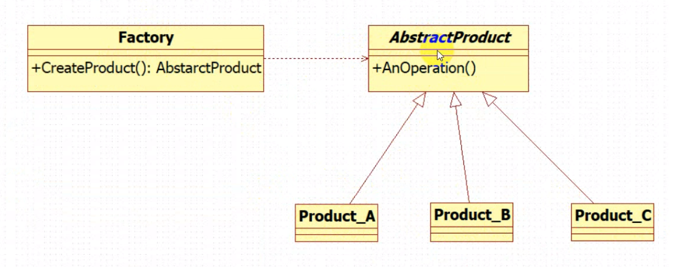
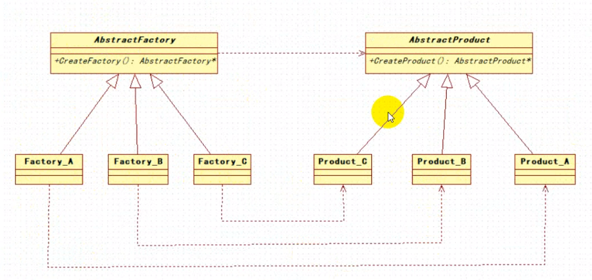

# 一、设计模式的原则

总原则：开闭原则（Open Close Principle）

开闭原则就是说对扩展开放，对修改关闭。在程序需要进行拓展的时候，不能去修改原有的代码，而是要扩展原有代码，实现一个热插拔的效果。

- **单一职责原则**：（针对类如何定义）
- **接口隔离原则**：（针对接口如何定义）
- **里氏替换原则**：（如何使用继承，一般是父类实现的方法，子类不要轻易覆盖）
- **依赖倒置原则**：（方法的参数，返回值要使用抽象或者接口，不要使用实现类）
- **迪米特法则**：（最少入职原则）A--> B --> C 不要出现A直接调用C的情况（不要和陌生人说话）
- **合成复用原则**：（能使用组合关系，不要使用继承关系）A{B} A extend B

## 单一职责：每个类或每个方法每个框架只做一件事

通过单一职责，可以提高代码的重用性，通过单一职责的方法得到的数据我们不再有耦合，拿来可以做的事也不再局限。

**正例：**

```java
   //==============只负责根据路径加载文件
	public  String loadFile(String path) throws IOException {
        Reader in = new FileReader(path);
        BufferedReader br = new BufferedReader(in);
        String line = null;
        StringBuilder sb = new StringBuilder("");
        while ((line = br.readLine()) != null) {
            sb.append(line);
            sb.append("");
        }
        br.close();
        return sb.toString();
    }
	//=========只负责字符串根据正则分割
    public  int Textlength(String sb, String regex){
        String [] words = sb.split(regex);
        return  words.length;
    }

    public static void main(String[] args) throws IOException {
        String str = loadFile("F:\\1.txt");
        String regex ="[^a-zA-Z]+";
        System.out.println(Textlength(str,regex));
    }
```

**反例：**

```java
public static void main(String[] args) {
    try {
        //=========================负责加载路径下的文件
        Reader in = new FileReader("F:\\1.txt");
        BufferedReader br = new BufferedReader(in);
        String line = null;
        StringBuilder sb = new StringBuilder("");
        while ((line =br.readLine())!=null){
            sb.append(line);
            sb.append("");
        }
        //==========================负责根据正则分割字符串
        String [] words = sb.toString().split("[^a-zA-Z]+");
        System.out.println(words.length);
        br.close();
    } catch (IOException e) {
        e.printStackTrace();
    }
```

## 开闭原则：对扩展开放（新功能），对修改关闭（旧功能）

 开闭原则应该遵循应用场景去考虑，如果源代码就是你自己写的，而且需求是稳定的，那么，直接修改源代码也是一个简单的做法，但当源代码是别人的代码或架构是，就要去符合开闭原则，防止破坏结构的完整性！

+ 对扩展开放,对更改封闭
+ 类模块可扩展，但不可修改

```java
@Data
class Car {
    private String band;
    private String color;
    private float price;
}

public static void main(String[] args) {
    Car car = new Car();
    car.setBand("bm");
    car.setColor("red");
    car.setPrice(13.3f);
    System.out.println(car.toString());
}
```

例如汽车的价格现在需要打折（打8折），这时，我们在Car的源代码中修改，就违反了开闭原则

**反例**：直接修改了源代码

```java
public void setPrice(float price) {
    this.price = (price*0.08f);
}
```

**正例：**

```java
//进行扩展  
class DiscountCar extends Car{
    @Override
    public void setPrice(float price) {
        super.setPrice(price*0.08f);
    }
}

public static void main(String[] args) {
    //===使用向上转型时，方法的调用只和new的对象有关
    Car car = new DiscountCar();
    car.setBand("bm");
    car.setColor("red");
    car.setPrice(130000f);
    System.out.println(car.toString());
}
```

## 里氏替换原则：任何能用父类对象的地方，都能透明的使用子类替换

里氏替换原则中，子类对父类的方法尽量不要重写和重载。因为父类代表了定义好的结构，通过这个规范的接口与外界交互，子类不应该随便破坏它。

**反例**：

```java
//父类
class Counter  {
    public int add(int i,int j) {
        return i+j;
    }
}

// 子类
class soonCounter extends Counter{
    @Override
    public int add(int i, int j) {
        return i-j;
    }
}

public static void main(String[] args) {
    Counter c = new Counter();
    System.out.println(c.add(100,200));
    //结果300
    Counter c = new soonCounter();
    System.out.println(c.add(100,200));
    //结果-100
}
```

## 依赖倒置原则：上层不能依赖于下层，它们都应该依赖于抽象

+ 高层(稳定)不依赖低层(变化),两者依赖抽象(稳定)
+ 抽象(稳定)不依赖细节(变化),细节依赖抽象(稳定)。


**反例**：人喂养动物

```java
static class Person{
    public void feed(Dog dog){
        dog.eat();
    }
}

static class Dog{
    public void eat() {
        System.out.println("狗啃骨头");
    }
}

public static void main(String[] args) {
    Person p = new Person();
    Dog d = new Dog();
    p.feed(d);
}
```

 在上面的代码中，人要喂狗，依赖于有一条狗，人作为上层依赖于下层，坏处是，当变化来临时，比如，人又养了一只猫，那么上层人这个类当中，就必须在添加喂猫的方法，每当下层变动时，上层也会跟着变动，而我们希望下层变动时，上层不会跟着改变

**正例**：他们都应该依赖于抽象

```java
    interface Animal{
        void eat();
    }
    static class Person{
        public void feed(Animal animal){
            animal.eat();
        }
    }
    static class Dog implements Animal{
        public void eat() {
            System.out.println("狗啃骨头");
        }
    }
    public static void main(String[] args) {
        Person p = new Person();
        Dog d = new Dog();
        p.feed(d);
    }
```

 依赖倒转原则就是指：**代码要依赖于抽象的类，而不要依赖于具体的类；**要针对接口或抽象类编程，而不是针对具体类编程。通过面向接口编程，抽象不应该依赖于细节，细节应该依赖于抽象。

## 接口隔离原则：设计接口时，接口的抽象应该是有意义的

这个原则的意思是：每个接口中不存在子类用不到却必须实现的方法，如果不然，就要将接口拆分。这时使用多的接口，就比使用单个接口要好。设计接口时，接口都应该是有意义的

**反例**：动物接口中定义的方法并不是被所有动物需要的

```java
interface  Animal{
    void eat();
    void fly();
    void swim();
}

class Bird implements Animal{
    @Override
    public void eat() {
        System.out.println("吃");
    }
    @Override
    public void fly() {
        System.out.println("飞");
    }
    //======鸟不会游泳，并不需要实现
    @Override
    public void swim() {
        System.out.println("游泳");
    }
}
```

 **正例**：接口抽象出有意义的层级，供需要的类去实现

```java
interface  Flyable{
    void fly();
}
interface  Swimable{
    void swim();
}
interface  Eatable{
    void eat();
}

// 使用多接口
class Bird implements Flyable,Eatable{
    .....
}

class Dog implements Swimable,Eatable{
    .....
}
```

## 迪米特法则：（最少知道原则）：封装，只和朋友通信

就是说：一个类对自己依赖的类知道的越少越好。也就是说无论被依赖的类多么复杂，都应该将逻辑封装在方法的内部，通过public方法提供给外部。这样当被依赖的类变化时，才能最小的影响该类。

最少知道原则的另一个表达方式是：只与直接的朋友通信。类之间只要有耦合关系，就叫朋友关系。耦合分为依赖、关联、聚合、组合等。我们称出现为成员变量、方法参数、对象本身、集合中的泛型、方法返回值中的类为直接朋友。局部变量、临时变量则不是直接的朋友。我们要求陌生的类不要作为局部变量出现在类中。

+ 对象应当对其他对象尽可能少的了解
+ 各个模块之间相互调用时, 通常会提供一个统一的接口来实现
+ 封装细节，提供接口

**反例：**关闭电脑的流程

```java
class Computers{
    public  void  closeFile(){
        System.out.println("关闭文件");
    }
    public  void  closeScreen(){
        System.out.println("关闭屏幕");
    }
    public  void  powerOff(){
        System.out.println("断电");
    }
}
class Person{
    private Computers computers;
    public void offComputers(){
        // 方法的细节太多
        computers.closeFile();
        computers.closeScreen();
        computers.powerOff();
    }
}
```

当用户关闭电脑时，需要调用计算机的各个方法，但是这些方法的细节太多了，会出现用户流程出错，遗漏调用等等，对于用户来言，他只需要知道关机按钮就够了

**正例：**封装细节，提供接口

```java
class Computers{
    public  void  closeFile(){
        System.out.println("关闭文件");
    }
    public  void  closeScreen(){
        System.out.println("关闭屏幕");
    }
    public  void  powerOff(){
        System.out.println("断电");
    }
    
    //关机
    public void offComputers(){
        closeFile();
        closeScreen();
        powerOff();
    }
}
class Person{
    private Computers computers;
    public void offComputers(){
        computers.offComputers();
    }
}
```


## 合成复用原则：复用别人代码时，应该使用组合

原则是尽量首先使用合成/聚合的方式，而不是使用继承。

+ 类的继承通常是"白箱复用",对象组合通常是"黑箱复用”
+ 继承在一定程序破坏封装性,子类和父类耦合度高
+ 组合: 直接在类中new出来使用

方式一：B类依赖到A类


方式二：A 类聚合到B类


方式三：A组合到B类中


**反例**：继承hashset，重写父类add方法，每次add元素时count+1；

```java
class Counter extends HashSet {
    private int count =0;
    
    //重写父类add方法，每次add元素时count+1；
    public boolean add(int i) {
        count++;
        return super.add(i);
    }
    
    public int getCount(){
        return count;
    }
}

public static void main(String[] args) {
    Counter c = new Counter();
    c.add(1);
    c.add(2);
    c.add(3);
    System.out.println(c.getCount());
}
```

这样写会出现在hashset方法中，不只是add可以添加元素的问题，还有其他方式可以添加，如果是其他方式添加的，count就不会累加，这样是有问题的

**正例：组合优于继承**

```java
static class Counter  {
    
    HashSet hashSet = new HashSet();  // 组合优于继承
    
    private int count =0;
    public boolean add(int i) {
        count++;
        return hashSet.add(i);
    }
    public boolean addAll(Collection c) {
        count=count+c.size();
        return hashSet.addAll(c);
    }
    public int getCount(){
        return count;
    }
}

public static void main(String[] args) {
    Counter c = new Counter();
    c.add(1);
    c.add(2);
    c.add(3);
    System.out.println(c.getCount());
}
```

这样来写，类中的add和addAll方法跟HashSet中的add和addAll方法的不在有关系，也能解决这个问题

# 二、设计模式

只简绍常用的

## 1. 单例模式：只有一个对象的实例

==保证整个系统中一个类只有一个对象的实例，实现这种功能的方式就叫单例模式==

**懒汉式**

```java
// 饿汉式单例
public class SingleTon {
 
    // 3. 提供静态方法
    public static SingleTon getInstance(){
      if(m_singleton == null){
     	m_singleton = new LazySingleton();
      }
      return m_singleton;
    }
    
    // 1. 构造函数私有化
    private SingleTon(){
    }
    
    // 2. 提供静态指针
    private static SingleTon m_singleton = null;
    
    public void testPrint() {
      System.out.println("Hello!");
   }
    
    // 测试
    public static void main(String[] args) {
        Singleton obj = SingleTon.getInstance();
        obj.testPrint();
    }
}
```

**DCL懒汉式单例模式：**

```java
// 懒汉式单例  线程安全的情况下
public class LazyMan {
    
    private LazyMan() {
        System.out.println(Thread.currentThread().getName() + "ok");
    }

    private  volatile static LazyMan lazyMan; // volatile 为了避免指令重排

    // 双重检测锁模式的懒汉式单例
    public static LazyMan getInstance() {
        if (lazyMan == null) {
            synchronized (LazyMan.class) {
                if (lazyMan == null) {
                    lazyMan = new LazyMan();// 不是一个原子性操作
                    /*
                    1、分配内存空间
                    2、执行构造方法，初始化对象
                    3、把这个对象指向这个空间
                    */
                }
            }
        }
        return lazyMan;
    }

    // 单线程下确实单例ok,但是多线程并发
    public static void main(String[] args) {
        for (int i = 0; i < 10; i++) {
            new Thread(() -> {
                LazyMan.getInstance();
            }).start();
        }
    }
}
```

**优点**：解决了线程不安全问题

**缺点：**效率太低了，每个线程在想获得类的实例时候，执行getInstance()方法都要进行 同步。而其实这个方法只执行一次实例化代码就够了，后面的想获得该类实例， 直接return就行了。方法进行同步效率太低

**反射 可以破环这种单例**

```java
// 懒汉式单例
// 道高一尺，魔高一丈
public class LazyMan {

    private static  boolean qinjiang = false;

    private LazyMan() {
        if(qinjiang == false){
            qinjiang=true;
        }else{
            throw new RuntimeException("不要试图使用反射破坏异常");
        }
//        synchronized (LazyMan.class){
//            if (lazyMan!=null){
//                throw new RuntimeException("不要试图使用反射破坏异常");
//            }
//        }
//        System.out.println(Thread.currentThread().getName() + "ok");
    }

    private  volatile static LazyMan lazyMan; // volatile 为了避免指令重排多线程的情况下防止线程相互影响的

    // 双重检测锁模式的懒汉式单例  DCL 懒汉式
    public static LazyMan getInstance() {
        if (lazyMan == null) {
            synchronized (LazyMan.class) {
                if (lazyMan == null) {
                    lazyMan = new LazyMan();// 不是一个原子性操作
                    /*
                    1、分配内存空间
                    2、执行构造方法，初始化对象
                    3、把这个对象指向这个空间

                    123
                    132 A
                        B // 此时B线程进来会认为lazyman不为null
                          // 直接返回 此时lazyman 还没有完成构造
                          // 为了避免指令重排
                       */
                }
            }
        }

        return lazyMan;
    }

    // 单线程下确实单例ok,但是多线程并发
    public static void main(String[] args) throws Exception {
        // 反射 可以破环这种单例
//        LazyMan instance = LazyMan.getInstance();
        Field qinjiang = LazyMan.class.getDeclaredField("qinjiang");
        qinjiang.setAccessible(true);


        Constructor<LazyMan> declaredConstructor =LazyMan.class.getDeclaredConstructor(null);
        declaredConstructor.setAccessible(true);//无视私有构造器
        LazyMan  instance=declaredConstructor.newInstance();

        qinjiang.set(instance,false);

        LazyMan instance2=declaredConstructor.newInstance();

        System.out.println(instance);
        System.out.println(instance2);
    }
}
```

**静态内部类**

```java
// 静态内部类实现单例模式 不安全
public class Holder {
    private Holder(){

    }

    public static Holder getInstance(){
        return InnerClass.HOLDER;
    }

    public static class InnerClass{
        private static final Holder HOLDER = new Holder();
    }
}
```

单例不安全，因为有反射

优缺点：

\1) 这种方式采用了类装载的机制来保证初始化实例时只有一个线程。 

\2) 静态内部类方式在Singleton类被装载时并不会立即实例化，而是在需要实例化时，调用getInstance方法，才会装载SingletonInstance类，从而完成Singleton的 实例化。 

\3) **类的静态属性只会在第一次加载类的时候初始化**，所以在这里，**JVM帮助我们保证了线程的安全性**，在类进行初始化时，别的线程是无法进入的。 

\4) 优点：避免了**线程不安全**，利用静态内部类特点实现延迟加载，效率高 

\5) 结论：**推荐使用**

**枚举**

```java
// enum 本身也是一个 class 类
public enum  EnumSingle {

    INSTANCE;

    public EnumSingle getInstance(){
        return INSTANCE;
    }
}

class Test{
    public static void main(String[] args) throws NoSuchMethodException, IllegalAccessException, InvocationTargetException, InstantiationException {
        EnumSingle instance1 = EnumSingle.INSTANCE;
        //Constructor<EnumSingle> declaredConstructor=EnumSingle.class.getDeclaredConstructor(null);
        // 枚举没有无参构造，只有有参构造
        Constructor<EnumSingle> declaredConstructor=EnumSingle.class.getDeclaredConstructor(String.class,int.class);
        declaredConstructor.setAccessible(true);
        EnumSingle instance2 = declaredConstructor.newInstance();

        // java.lang.NoSuchMethodException: com.kuang.single.EnumSingle.<init> 没有空参的构造方法
        // java.lang.IllegalArgumentException: Cannot reflectively create enum objects  反射不能破坏枚举的单例
        System.out.println(instance1);
        System.out.println(instance2);
    }
}
```

枚举没有无参构造，只有有参构造

优缺点：

\1) 这借助JDK1.5中添加的枚举来实现单例模式。不仅能避免多线程同步问题，而且还能防止反序列化重新创建新的对象。 

\2) 这种方式是Effective Java作者Josh Bloch 提倡的方式 

\3) 结论：推荐使用

**饿汉式**

```java
// 饿汉式单例
public class Hungry {

    // 可能会浪费空间 
    private byte[] data1 = new byte[1024*1024];
    private byte[] data2 = new byte[1024*1024];
    private byte[] data3 = new byte[1024*1024];
    private byte[] data4 = new byte[1024*1024];

    // 1. 构造函数私有化
    private Hungry(){
    }
    
    // 2. 提供静态指针
    private final static Hungry m_hungry = new Hungry();

    // 3. 提供静态方法
    public static Hungry getInstance(){
        return m_hungry;
    }
}
```

**优点**：这种写法比较简单，就是在类装载的时候就完成实例化。避免了线程同步问题。

**缺点**：在类装载的时候就完成实例化，没有达到Lazy Loading的效果。**如果从始至终从未使用过这个实例，则会造成内存的浪费**

## 2.  工厂模式：提供了一种创建对象的最佳方式

**实现了创建者和调用者的分离**

工厂模式属于创建型模式，大致可以分为三类:

+ 简单工厂模式：用来生产同一等级结构中的任意产品（对于增加新的产品，需要扩展已有代码）
+ 工厂方法模式：用来生产同一等级结构中的固定产品（支持增加任意产品）
+ 抽象工厂模式：围绕一个超级工厂创建其他工厂。该超级工厂又称为其他工厂的工厂。

#### 简单工厂模式

用来生产同一等级结构中的任意产品（对于增加新的产品，需要扩展已有代码的内部实现, 比如需要写新增产品的具体产品类并且修改工厂类）

**简单工厂实现步骤: **

1. 提供一个抽象产品类(接口):  简单工厂模式所创建的所有对象的父类,**它负责描述所有实例所共有的公共接口**
2. 提供一个或多个具体产品类:  简单工厂模式所创建的具体实例对象
3. 提供一个工厂类:  负责实现创建所有实例的内部逻辑。可被外界直接调用，**创建所需的产品对象**



正例：创建产品接口，具体产品实现，工厂类负责生产，使用时找到工厂类拿到对应产品

```java
class Test {
    //抽象产品类
    interface Food {
        void eat();
    }
    
    //具体产品类
    static class Bun implements Food {
        @Override
        public void eat() {
            System.out.println("包子");
        }
    }
    static class SteameDread implements Food {
        @Override
        public void eat() {
            System.out.println("馒头");
        }
    }
    
    //工厂类
    static class FoodFactory {
        
        // 方法一： 不满足开闭原则
        // 得到产品, 创建所需的产品对象
        public Food getFood(int n) {
            switch (n) {
                case 1:
                    return new Bun();
                    break;
                case 2:
                    return new SteameDread();
                    break;
            }
            return null;
        }
        
        // 方法二：
        public static Food getBun(){
            return new Bun();
        }
        public static Food getSteameDread(){
            return new SteameDread();
        }
        
    }
    
    public static void main(String[] args) {
        FoodFactory foodFactory = new FoodFactory();
        // 方式1
        foodFactory.getFood(1).eat();
        
        // 方式2
        foodFactory.getBun.eat(); 
    }
}
```

#### 工厂模式

用来生产同一等级结构中的固定产品（支持增加任意产品, 写新增产品的具体产品类和具体工厂即可）

**工厂模式实现步骤**

1. 提供一个抽象产品类:  所有产品的父类
2. 提供一个或多个产品类: 工厂方法模式所创建的具体实例对象
3. 提供一个或多个抽象工厂类:   所有具体工厂类的父类
4. 提供与产品对应的工厂类:  负责实例化产品对象



正例：为了进行扩展，不违反开闭原则

```java
class Test {
    // 抽象产品类/接口
    interface AbstractFood {
        void eat();
    }
    
    //具体产品类
    static class Bun implements AbstractFood {
        @Override
        public void eat() {
            System.out.println("包子");
        }
    }
    static class SteameDread implements AbstractFood {
        @Override
        public void eat() {
            System.out.println("馒头");
        }
    }
    
    // 抽象工厂类
    static interface AbstractFoodFactory{
        AbstractFood getFood();
    }
    
    //具体工厂
    static class BunFactory implements AbstractFoodFactory{

        @Override
        public AbstractFood getFood() {
            return new Bun();
        }
    }
    static class SteameDreadFactory implements AbstractFoodFactory{

        @Override
        public AbstractFood getFood() {
            return new SteameDread();
        }
    }
    
    public static void main(String[] args) {
		AbstractFoodFactory factor = new BunFactory();
        AbstractFood fod = factor.getFood();
        fod.eat();  //包子
        
        factor = new SteameDreadFactory();
        fod = factor.getFood();
        fod.eat();  //馒头
        
        //
        AbstractFood fod = new BunFactory().getFood();
          fod.eat();  //包子
    }
}
```

**优点:**

+ 需求改变时改动最小
+ 具体的创建实例过程与客户端分离

**缺点:**

+ 新增功能时，工程量稍大

#### 抽象工厂模式

变化来了，工厂模式固然很好用，但我们现在要求不光可以生产食物，还可以生产饮料，这时，按照工厂模式我们就不得不去创建抽象的饮料工厂，造成新增类别产品就要新增接口工厂的问题。

正例：为了解决这个问题，我们直接将工厂抽象出来，工厂可以生产不同的产品

```java
class Test {
    interface Food {
        void eat();
    }
    interface Drink {
        void drink();
    }
    static class Bun implements Food {
        @Override
        public void eat() {
            System.out.println("包子");
        }
    }
    static class SteameDread implements Food {
        @Override
        public void eat() {
            System.out.println("馒头");
        }
    }
    static class CoCo implements Drink {
        @Override
        public void drink() {
            System.out.println("奶茶");
        }
    }
    static class Tea implements Drink {
        @Override
        public void drink() {
            System.out.println("茶");
        }
    }
    static interface Factory{
        Food getFood();
        Drink getDrink();
    }
    static class BunFactoryAndCoCo implements Factory{

        @Override
        public Food getFood() {
            return new Bun();
        }

        @Override
        public Drink getDrink() {
            return new CoCo();
        }
    }
    static class SteameDreadAndTeaFactory implements Factory{

        @Override
        public Food getFood() {
            return new SteameDread();
        }

        @Override
        public Drink getDrink() {
            return new Tea();
        }
    }
    static class Business {
        public void test(Factory factory){
            Food food = factory.getFood();
            food.eat();
            Drink drink =factory.getDrink();
            drink.drink();
        }
    }
    public static void main(String[] args) {
        Business business = new  Business();
        business.test(new SteameDreadFactory());
        //business.test(new BunFactory());
    }
```

抽象工厂中，我们把原本的接口工厂，抽象化，使其可以生产多个产品，具体的产品工厂去实现这个工厂，重写他的方法返回需要的产品，业务中，我们只需要依赖抽象工厂，返回抽象工厂的具体实现就可以，这样，调用是我们就只需要调用业务的方法，传入我们需要的具体产品工厂就可以了。


## 原型模式

#### 模式介绍


- 原型模式(Prototype模式)是指：用原型实例指定创建对象的种类，并且通过拷贝这些原型，创建新的对象
- 原型模式是一种创建型设计模式，允许一个对象再创建另外一个可定制的对象，无需知道如何创建的细节
- 工作原理是：通过将一个原型对象传给那个要发动创建的对象，这个要发动创建的对象通过请求原型对象拷贝它们自己来实施创建，即 对象.clone()


在有些系统中，存在大量相同或相似对象的创建问题，如果用传统的构造函数来创建对象，会比较复杂且耗时耗资源，用原型模式生成对象就很高效，就像孙悟空拔下猴毛轻轻一吹就变出很多孙悟空一样简单。

**原型模式的定义和特点**

原型（Prototype）模式的定义如下：用一个已经创建的实例作为原型，通过复制该原型对象来创建一个和原型相同或相似的新对象。在这里，原型实例指定了要创建的对象的种类。用这种方式创建对象非常高效，根本无须知道对象创建的细节。例如，Windows 操作系统的安装通常较耗时，如果复制就快了很多。在生活中复制的例子非常多，这里不一一列举了。

**优点：**

- [Java](http://c.biancheng.net/java/) 自带的原型模式基于内存二进制流的复制，在性能上比直接 new 一个对象更加优良。
- 可以使用深克隆方式保存对象的状态，使用原型模式将对象复制一份，并将其状态保存起来，简化了创建对象的过程，以便在需要的时候使用（例如恢复到历史某一状态），可辅助实现撤销操作。

**原型模式的缺点：**

- 需要为每一个类都配置一个 clone 方法
- clone 方法位于类的内部，当对已有类进行改造的时候，需要修改代码，违背了开闭原则。
- 当实现深克隆时，需要编写较为复杂的代码，而且当对象之间存在多重嵌套引用时，为了实现深克隆，每一层对象对应的类都必须支持深克隆，实现起来会比较麻烦。因此，深克隆、浅克隆需要运用得当。

**原型模式结构和实现**

由于 Java 提供了对象的 clone() 方法，所以用 Java 实现原型模式很简单。

#### 3.3.2、 模式的结构

原型模式包含以下主要角色。

1. 抽象原型类：规定了具体原型对象必须实现的接口。
2. 具体原型类：实现抽象原型类的 clone() 方法，它是可被复制的对象。
3. 访问类：使用具体原型类中的 clone() 方法来复制新的对象。


 

#### 3.3.3、模式的实现

原型模式的克隆分为浅克隆和深克隆。

- 浅克隆：创建一个新对象，新对象的属性和原来对象完全相同，对于非基本类型属性，**仍指向原有属性所指向的的**
- 深克隆：创建一个新对象，属性中引用的其他对象也会被克隆，**不再指向原有对象地址。**

Java 中的 Object 类提供了浅克隆的 clone() 方法，具体原型类只要实现 Cloneable 接口就可实现对象的浅克隆，这里的 Cloneable 接口就是抽象原型类。其代码如下：

```java
//具体原型类
class Realizetype implements Cloneable {
    Realizetype() {
        System.out.println("具体原型创建成功！");
    }

    public Object clone() throws CloneNotSupportedException {
        System.out.println("具体原型复制成功！");
        return (Realizetype) super.clone();
    }
}

//原型模式的测试类
public class PrototypeTest {
    public static void main(String[] args) throws CloneNotSupportedException {
        Realizetype obj1 = new Realizetype();
        Realizetype obj2 = (Realizetype) obj1.clone();
        System.out.println("obj1==obj2?" + (obj1 == obj2));
    }
}
```

实例：

```java
public class Sheep implements Cloneable{
    private String name;
    private int age;
    private String color;
    public Sheep(String name, int age, String color) {
        super();
        this.name = name;
        this.age = age;
        this.color = color;
    }
    public String getName() {
        return name;
    }
    public void setName(String name) {
        this.name = name;
    }
    public int getAge() {
        return age;
    }
    public void setAge(int age) {
        this.age = age;
    }
    public String getColor() {
        return color;
    }
    public void setColor(String color) {
        this.color = color;
    }
    @Override
    public String toString() {
        return "Sheep [name=" + name + ", age=" + age + ", color=" + color + "]";
    }
    @Override
    protected Object clone() throws CloneNotSupportedException {
        return super.clone();
    }
}
```

传统方法（不适用原型模式）

```java
public static void main(String[] args) {
        Sheep sheep = new Sheep("tom", 1, "白色");

        Sheep sheep2 = new Sheep(sheep.getName(), sheep.getAge(), sheep.getColor());

        System.out.println(sheep.hashCode());// 1735600054

        System.out.println(sheep2.hashCode());// 21685669
}
```

原型模式

```java
public static void main(String[] args) throws CloneNotSupportedException {
        Sheep sheep = new Sheep("tom", 1, "白色");
        Sheep cloneSheep = (Sheep) sheep.clone();
      	System.out.println(sheep.hashCode());// 1735600054
        System.out.println(cloneSheep.hashCode());// 21685669
    }
```

通过上述两种方式的对比，我们发现不管使用哪种方式，拷贝的方式都是**深拷贝**，那对于对象中的属性对象是什么拷贝呢？向 Sheep类中加入一个对象属性
 

```java
	private String name;
    private int age;
    private String color;
    public Sheep friend; //是对象, 克隆是会如何处理
	.............
 public static void main(String[] args) throws CloneNotSupportedException {
        Sheep sheep = new Sheep("tom", 1, "白色");
        sheep.friend = new Sheep("jerry", 2, "黑色");
        Sheep cloneSheep = (Sheep) sheep.clone();
        // 哈希值：1735600054 sheep.friend 21685669
     System.out.println(sheep.hashCode()+" sheep.friend"+" "+sheep.friend.hashCode());
         // 哈希值：2133927002 cloneSheep.friend 21685669
     System.out.println(cloneSheep.hashCode()+" cloneSheep.friend"+" "+cloneSheep.friend.hashCode());
    }
```

经测试，我们发现，对于类中属性对象，采用的是**浅拷贝**方式，那有什么方法能让他实现深拷贝呢？有下面两种方法

1. 通过重写clone()方法实现
2. 通过序列化实现

**一、通过重写****clone()****方法实现深拷贝**

1. 修改上述 Sheep类的克隆方法

```java
	@Override
    protected Sheep clone() throws CloneNotSupportedException {
        Sheep sheep = null;
        // 先克隆Sheep对象
        sheep = (Sheep) super.clone();
        // 再克隆Sheep中的friend对象
        sheep.friend =  friend.getclone();
        return sheep;
    }
	// 为对象中的对象即friend提供克隆方法
    protected Sheep getclone() throws CloneNotSupportedException {
        return (Sheep) super.clone();
    }
  public static void main(String[] args) throws CloneNotSupportedException {
        Sheep sheep = new Sheep("tom", 1, "白色");
        sheep.friend = new Sheep("jerry", 2, "黑色");
        Sheep cloneSheep = (Sheep) sheep.clone();
        // 1735600054 sheep.friend 21685669
      System.out.println(sheep.hashCode()+" sheep.friend"+" "+sheep.friend.hashCode());
      // 2133927002 cloneSheep.friend 1836019240
      System.out.println(cloneSheep.hashCode()+" cloneSheep.friend"+" "+cloneSheep.friend.hashCode());
    }
```

#### 3.3.4、深拷贝

深拷贝通过多种方法实现

方式一： 通过clone方法实现深拷贝

```java
public class DeepProtoType implements Serializable, Cloneable {
    
    public String name;
    public DeepCloneableTarget deepCloneableTarget;
    
    public DeepProtoType() {
        super();
    }
    
    // 深拷贝  方式1  使用clone方法
    
    @Override
    protected Object clone() throws CloneNotSupportedException {
        Object deep = null;
        // 这里完成基本数据类型和String的克隆
        deep = super.clone();
        // 对引用类型进行单独处理
        DeepProtoType deepProtoType = (DeepProtoType) deep;
        deepProtoType.deepCloneableTarget = (DeepCloneableTarget) deepCloneableTarget.clone();
        
        return deepProtoType;
    }
}
```

方式二： 通过序列化来实现深拷贝

```java
public class DeepProtoType implements Serializable, Cloneable {

    public String name;
    public DeepCloneableTarget deepCloneableTarget;

    public DeepProtoType() {
        super();
    }

    // 方式二  利用对象的 序列化来实现  推荐使用
    public Object deepClone(){
        // 创建流对象
        ByteArrayOutputStream bos = null;
        ObjectOutputStream oos = null;
        ByteArrayInputStream bis = null;
        ObjectInputStream ois = null;
        DeepProtoType deepProtoType = null;
        try {
            // 序列化
            bos = new ByteArrayOutputStream();
            oos = new ObjectOutputStream(bos);
            oos.writeObject(this); // 对当前的对象以对象流的方式输出

            // 反序列化
            bis = new ByteArrayInputStream(bos.toByteArray());
            ois = new ObjectInputStream(bis);
            deepProtoType = (DeepProtoType) ois.readObject();
        } catch (Exception e) {
            e.printStackTrace();
        }finally {
            try {
                bos.close();
                oos.close();
                bis.close();
                ois.close();
            } catch (IOException e) {
                e.printStackTrace();
            }
        }
        return deepProtoType;
    }
}
```

#### 3.3.5、在Spring框架的使用

\1) Spring中原型bean的创建，就是原型模式的应用 

\2) 代码分析+Debug源码

这里的scope是指定创建bean的方法  默认是单例模式，这里指定的是原型模式prototype

## 3.  建造者模式:构建与它的表示分离

**建造者模式实现步骤: **

1. 提供一个或多个具体产品类:  具体的创建产品的各个部分
2. 提供抽象建造者类:  为创建产品各个部分，统一抽象接口
3. 提供一个或多个具体建造者类:  具体实现抽象建造者各个部件的接口
4. 提供一个指挥类:    负责安排和调度复杂对象的各个建造过程


**具体产品类**

```java
package com.kuang.builder;

//产品，房子
@Data
public class Product {
    private String builderA;
    private String builderB;
    private String builderC;
    private String builderD;
}
```

**抽象建筑者类**

```java
package com.kuang.builder;

//抽象的建造者：方法
public abstract class AbatractBuilder {

    abstract void builderA();//地基
    abstract void builderB();//钢筋工程
    abstract void builderC();//铺电线
    abstract void builderD();//粉刷

    //完工：得到产品
    abstract Product getProduct();
}
```

**具体建筑者类**--> 具体的完成(指挥建造抽象类, 建造产品)

```java
package com.kuang.builder;

//具体的建造者：工人
public class Worker extends AbatractBuilder {

    private Product product;

    public Worker() {
        product = new Product();    // 具体产品类
    }

    @Override
    void builderA() {
        product.setBuilderA("地基");
        System.out.println("地基");
    }

    @Override
    void builderB() {
        product.setBuilderB("钢筋工程");
        System.out.println("钢筋工程");
    }

    @Override
    void builderC() {
        product.setBuilderC("铺电线");
        System.out.println("铺电线");
    }

    @Override
    void builderD() {
        product.setBuilderD("粉刷");
        System.out.println("粉刷");
    }

    @Override
    Product getProduct() {
        return product;
    }
}
```

**指挥类**

```java
package com.kuang.builder;

//指挥：核心，负责指挥构建一个工程，工程如何构建，由它决定
public class Director {

    //指挥工人按照顺序建房子
    public Product build(AbatractBuilder abatractBuilder){
        abatractBuilder.builderA();
        abatractBuilder.builderB();
        abatractBuilder.builderC();
        abatractBuilder.builderD();
        return abatractBuilder.getProduct();
    }
}
```

测试

```java
package com.kuang.builder;

public class Test {
    public static void main(String[] args) {
        
        // 
        AbatractBuilder pb = new Worker();
        //指挥
        Director director = new Director();
        Product build = director.build(pb);  //产品
    }
}
```

##### 建造者模式的意图和适用场景（拓展）

建造者模式唯一区别于工厂模式的是针对复杂对象的创建。也就是说，如果创建简单对象，通常都是使用工厂模式进行创建，而如果创建复杂对象，就可以考虑使用建造者模式。

当需要创建的产品具备复杂创建过程时，可以抽取出共性创建过程，然后交由具体实现类自定义创建流程，使得同样的创建行为可以生产出不同的产品，分离了创建与表示，使创建产品的灵活性大大增加。

建造者模式主要适用于以下应用场景：

- 相同的方法，不同的执行顺序，产生不同的结果。
- 多个部件或零件，都可以装配到一个对象中，但是产生的结果又不相同。
- 产品类非常复杂，或者产品类中不同的调用顺序产生不同的作用。
- 初始化一个对象特别复杂，参数多，而且很多参数都具有默认值。


例子

在了解之前，先假设有一个问题，我们需要创建一个学生对象，属性有name,number,class,sex,age,school等属性，如果每一个属性都可以为空，也就是说我们可以只用一个name,也可以用一个school,name,或者一个class,number，或者其他任意的赋值来创建一个学生对象，这时该怎么构造？
难道我们写6个1个输入的构造函数，15个2个输入的构造函数.......吗？这个时候就需要用到Builder模式了。给个例子，大家肯定一看就懂：

```java
public class Builder {

    static class Student{
        String name = null ;
        int number = -1 ;
        String sex = null ;
        int age = -1 ;
        String school = null ;
        
　　　　 //构建器，利用构建器作为参数来构建Student对象
        static class StudentBuilder{
            String name = null ;
            int number = -1 ;
            String sex = null ;
            int age = -1 ;
            String school = null ;
            public StudentBuilder setName(String name) {
                this.name = name;
                return  this ;
            }

            public StudentBuilder setNumber(int number) {
                this.number = number;
                return  this ;
            }

            public StudentBuilder setSex(String sex) {
                this.sex = sex;
                return  this ;
            }

            public StudentBuilder setAge(int age) {
                this.age = age;
                return  this ;
            }

            public StudentBuilder setSchool(String school) {
                this.school = school;
                return  this ;
            }
            public Student build() {
                return new Student(this);
            }
        }

        public Student(StudentBuilder builder){
            this.age = builder.age;
            this.name = builder.name;
            this.number = builder.number;
            this.school = builder.school ;
            this.sex = builder.sex ;
        }
    }

    public static void main( String[] args ){
        Student a = new Student.StudentBuilder().setAge(13).setName("LiHua").build();
        Student b = new Student.StudentBuilder().setSchool("sc").setSex("Male").setName("ZhangSan").build();
    }
}
```

**例子**

比如：比如麦当劳的套餐，服务员（具体建造者）可以随意搭配任意几种产品（零件）组成一款套餐（产
品) ,然后出售给客户。比第一种方式少了指挥者,主要是因为第二种方式把指挥者交给用户来操作,使得
产品的创建更加简单灵活。

Product

```java
package com.kuang.builder.demo02;

//产品：套餐
@Data
public class Product {

    private String BuildA ="汉堡";
    private String BuildB ="可乐";
    private String BuildC ="薯条";
    private String BuildD ="甜点";
}
```

Builder

```java
package com.kuang.builder.demo02;

//建造者
public abstract class Builder {
    abstract Builder BuildA(String msg);//"汉堡";
    abstract Builder BuildB(String msg);//"可乐";
    abstract Builder BuildC(String msg);//"薯条";
    abstract Builder BuildD(String msg);//"甜点";

    abstract Product getProduct();
}
```

Worker

```java
package com.kuang.builder.demo02;

public class Worker extends Builder {

    private Product product;

    public Worker() {
        product = new Product();
    }

    @Override
    Builder BuildA(String msg) {
        product.setBuildA(msg);
        return this;
    }

    @Override
    Builder BuildB(String msg) {
        product.setBuildB(msg);
        return this;
    }

    @Override
    Builder BuildC(String msg) {
        product.setBuildC(msg);
        return this;
    }

    @Override
    Builder BuildD(String msg) {
        product.setBuildD(msg);
        return this;
    }

    @Override
    Product getProduct() {
        return product;
    }
}
```

```java
package com.kuang.builder.demo02;

public class Test {
    public static void main(String[] args) {
        //服务员
        Worker worker = new Worker();
        //可以按默认走，也可以自由组合
        Product product = worker.BuildA("全家桶").BuildB("雪碧").getProduct();

        System.out.println(product.toString());
    }
}
```

```txt
Product{BuildA='全家桶', BuildB='雪碧', BuildC='薯条', BuildD='甜点'}
```

## 建造者模式和工厂模式的区别

- 建造者模式更加注重方法的调用顺序，工厂模式注重创建对象。
- 创建对象的力度不同，建造者模式创建复杂的对象，由各种复杂的部件组成，工厂模式创建出来的对象都一样
- 关注重点不一样，工厂模式只需要把对象创建出来就可以了，而建造者模式不仅要创建出对象，还要知道对象由哪些部件组成。
- 建造者模式根据建造过程中的顺序不一样，最终对象部件组成也不一样。
- 工厂模式:  get
- 建造模式:  set
- 类中用需要的类都是用的抽象类   , 产品就是用来做产品的事,  工厂类get产品和建筑者类set产品
- 用抽象类的好处可以写很多个具体类, new不同的具体类就能同不同的具体类
- 有具体的抽象类用的时候都是用抽象类

## 4. 适配器模式：根据已有接口，生成想要的接口

适配器模式（Adapter）包含以下主要角色:

1. 目标（Target）接口：当前系统业务所期待的接口，它可以是抽象类或接口。
2. 适配者（Adaptee）类：它是被访问和适配的现存组件库中的组件接口。(需要适配的)
3. 适配器（Adapter）类：它是一个转换器，通过继承或引用适配者的对象，把适配者接口转换成目标接口，让客户按目标接口的格式访问适配者。


### 类适配器模式

**模版**

```java
package adapter;

//目标接口
interface Target
{
    public void request();
}

//适配者类
class Adaptee
{
    public void specificRequest()
    {       
        System.out.println("适配者中的业务代码被调用！");
    }
}

//类适配器类  
class ClassAdapter extends Adaptee implements Target  // 这里直接继承了适配器(多继承的方式)
{
    public void request()
    {
        specificRequest();  //适配者方法
    }
}

//客户端代码
public class ClassAdapterTest
{
    public static void main(String[] args)
    {
        System.out.println("类适配器模式测试：");
        Target target = new ClassAdapter();
        target.request();
    }
}
```

**例子:  电压转接**

```java
// 目标接口: 当前系统业务所期待的接口
public interface IVoltage5V {
    // 输出5伏
    public int output5V();
}

// 适配器类(需要适配的)
public class Voltage220V {
    public int output220V(){
        int src = 220;
        System.out.println("电压："+src+"伏");
        return src;
    }
}

// 类适配器类
public class VoltageAdapter extends Voltage220V implements IVoltage5V{  //多继承的方式
    @Override
    public int output5V() {
        // 获取到220v的电压
        int src = output220V();
        int dstV = src / 44; // 转成5伏
        return dstV;
    }
}


public class Phone {
    // 充电的方法
    public void charging(IVoltage5V iVoltage5V){
        if (iVoltage5V.output5V() == 5){
            System.out.println("电压为5伏，可以充电！！");
        }else if (iVoltage5V.output5V() > 5){
            System.out.println("电压过高，不能充电！！");
        }
    }
}

public class Client {

    public static void main(String[] args) {
        System.out.println("=====类适配器模式=====");
        Phone phone = new Phone();
        // 只需要一个适配器
        phone.charging(new VoltageAdapter());
    }
}
```

### 对象适配器模式

```java
package adapter;

//目标接口：发动机
interface Motor
{
    public void drive();
}

//适配者1：电能发动机
class ElectricMotor
{
    public void electricDrive()
    {
        System.out.println("电能发动机驱动汽车！");
    }
}

//适配者2：光能发动机
class OpticalMotor
{
    public void opticalDrive()
    {
        System.out.println("光能发动机驱动汽车！");
    }
}

//电能适配器
class ElectricAdapter implements Motor
{
    private ElectricMotor emotor;  //  适配者1对象
    public ElectricAdapter()
    {
        emotor=new ElectricMotor();
    }
    public void drive()
    {
        emotor.electricDrive();
    }
}

//光能适配器
class OpticalAdapter implements Motor
{
    private OpticalMotor omotor; //  适配者2对象
    public OpticalAdapter()
    {
        omotor=new OpticalMotor();
    }
    public void drive()
    {
        omotor.opticalDrive();
    }
}

//客户端代码
public class MotorAdapterTest
{
    public static void main(String[] args)
    {
        System.out.println("适配器模式测试：");
        Motor motor=(Motor)ReadXML.getObject();
        motor.drive();
    }
}
```

### 适配器在框架SpringMVC使用

**1) SpringMvc中的HandlerAdapter, 就使用了适配器模式** 

\2) SpringMVC处理请求的流程回顾 

\3) 使用HandlerAdapter 的原因分析: 

可以看到处理器的类型不同，有**多重实现方式，那么调用方式就不是确定**的，如果需要直接调用Controller方法，需要调用的时候就得不断是使用if else来进行判断是哪一种子类然后执行。那么如果后面要扩展Controller，就得修改原来的代码，这样违背了OCP原则。


Spring定义了一个适配接口，使得每一种Controller有一种对应的适配器实现类 

• 适配器代替controller执行相应的方法 

• 扩展Controller 时，只需要增加一个适配器类就完成了SpringMVC的扩展了, 

## 5. 装饰器模式：允许向一个现有的对象添加新的功能,同时又不改变其结构

装饰者模式在Java中的典型应用就是IO流。装饰者模式又名包装(Wrapper)模式。装饰者模式以对客户端透明的方式扩展对象的功能，**是继承关系的一个替代方案**。装饰模式就是把要添加的附加功能分别放在单独的类中，并让这个类包含它要装饰的对象，当需要执行时，客户端就可以有选择地、按顺序地使用装饰功能包装对象。

装饰者模式以对客户透明的方式动态地给一个对象附加上更多的责任。换言之，客户端并不会觉得对象在装饰前和装饰后有什么不同。装饰者模式可以在不使用创造更多子类的情况下，将对象的功能加以扩展。

**工厂模式实现步骤**

1. 抽象组件类
2. 具体组件类
3. 抽象装饰器类
4. 具体装饰类

### 装饰器模式

**齐天大圣的例子**

孙悟空有七十二般变化，他的每一种变化都给他带来一种附加的本领。他变成鱼儿时，就可以到水里游泳；他变成鸟儿时，就可以在天上飞行。

本例中，Component的角色便由鼎鼎大名的齐天大圣扮演；ConcreteComponent的角色属于大圣的本尊，就是猢狲本人；Decorator的角色由大圣的七十二变扮演。而ConcreteDecorator的角色便是鱼儿、鸟儿等七十二般变化。


```java
// 1.抽象原型类
interface TheGreatestSage {
    public void move();
}

// 2.具体原型类
class Monkey implements TheGreatestSage {

    @Override
    public void move() {
        //代码
        System.out.println("Monkey Move");
    }
}

// 3.抽象装饰器类
abstract class abstractChange implements TheGreatestSage {
    protected TheGreatestSage sage; //抽象原型类
    @Override
    public abstract void move();        

}

//4. 具体装饰
//角色“鱼儿”
class Fish extends abstractChange {

    public Fish(TheGreatestSage sage) {
        this.sage = sage;
    }

    @Override
    public void move() {
        // 代码
        System.out.println("Fish Move");
    }
}

//角色“鱼儿”
class Bird extends abstractChange {

    public Bird(TheGreatestSage sage) {
        this.sage = sage;
    }

    @Override
    public void move() {
        // 代码
        System.out.println("Bird Move");
    }
}

class Test {
    public static void main(String[] args) {
        TheGreatestSage sage = new Monkey(); 
        // 第一种写法  单层装饰
        TheGreatestSage bird = new Bird(sage);
        bird.move();
        
        TheGreatestSage fish = new Fish(bird);
        fish.move();
    }
}
```

```txt
Bird Move
Fish Move
```

```java
public class Test {
    
	// 1.抽象原型类
    public interface TheGreatestSage {
        public void move();
    }
    
    // 2.具体原型类
    public class Monkey implements TheGreatestSage {

        @Override
        public void move() {
            //代码
            System.out.println("Monkey Move");
        }
	}
    
    // 3.装饰器类
    public class Change implements TheGreatestSage {
   	 	private TheGreatestSage sage; //抽象原型类
    
        public Change(TheGreatestSage sage){
            this.sage = sage;
        }
        
        @Override
        public void move() {
            // 代码
            sage.move();
        }
    }
    
    //4. 具体装饰
    //角色“鱼儿”
    public class Fish extends Change {
    
        public Fish(TheGreatestSage sage) {
            super(sage);
        }

        @Override
        public void move() {
            // 代码
            System.out.println("Fish Move");
        }
    }
    
   	//4. 具体装饰
    //角色“鱼儿”
    public class Bird extends Change {
    
        public Fish(TheGreatestSage sage) {
            super(sage);
        }

        @Override
        public void move() {
            // 代码
            System.out.println("Bird Move");
        }
    }
    

    public static void main(String[] args) {
        TheGreatestSage sage = new Monkey(); 
        // 第一种写法  单层装饰
        TheGreatestSage bird = new Bird(sage);
        bird.move();
        
        TheGreatestSage fish = new Fish(bird);
        fish.move();
    }
}
```

```
Bird Move
Fish Move
```


下面一个订单问题

```java
// 构建者
public abstract class Drink {

    private String des; // 描述
    private float price = 0.0f;

    public String getDes() {
        return des;
    }

    public void setDes(String des) {
        this.des = des;
    }

    public float getPrice() {
        return price;
    }

    public void setPrice(float price) {
        this.price = price;
    }

    // 计算费用的抽象方法
    public abstract float cost();
}

// 具体实现类
public class Coffee extends Drink{
    @Override
    public float cost() {
        return super.getPrice();
    }
}

public class Espresso extends Coffee{
    public Espresso() {
        setDes("意大利咖啡");
        setPrice(10.0f);
    }
}

public class LongBlack extends Coffee{
    public LongBlack() {
        setDes("LongBlack");
        setPrice(5.0f);
    }
}

public class ShortBlack extends Coffee{
    public ShortBlack() {
        setDes("ShortBlack");
        setPrice(6.0f);
    }
}


// 定义修饰类
package cn.wen.decorator;

public class Decorator extends Drink{

    private Drink obj;

    public Decorator(Drink obj) { // 组合
        this.obj = obj;
    }

    @Override
    public float cost() {
        // getPrice 自己的价格 
        return super.getPrice() + obj.cost();
    }

    @Override
    public String getDes() {
        // 被装饰者的信息
        return super.getDes() + " "+super.getPrice() + "&&" +obj.getDes();
    }
}
//具体饮品

public class Chocolate extends Decorator{

    public Chocolate(Drink obj) {
        super(obj);
        setDes("巧克力");
        setPrice(3.0f); // 调味品的价格
    }

}

public class Milk extends Decorator{

    public Milk(Drink obj) {
        super(obj);
        setDes("牛奶");
        setPrice(4.0f); // 调味品的价格
    }

}

public class Soy extends Decorator{

    public Soy(Drink obj) {
        super(obj);
        setDes("豆浆");
        setPrice(1.5f); // 调味品的价格
    }

}


public class DecoratorTest {
    @Test
    public void testAll(){
        System.out.println("=======执行下面测试======");
        // 单点一杯意大利咖啡
        Drink coffee = new Espresso();
        System.out.println("当前饮品的描述为：" + coffee.getDesc() + ";价格为:" + coffee.cost());

        // 单点一杯意大利咖啡 + 一份牛奶
        coffee = new Milk(coffee);
        System.out.println("当前饮品的描述为：" + coffee.getDesc() + ";价格为:" + coffee.cost());

        // 单点一杯意大利咖啡 + 一份牛奶 + 一份巧克力
        coffee = new Chocolate(coffee);
        System.out.println("当前饮品的描述为：" + coffee.getDesc() + ";价格为:" + coffee.cost());

        // 单点一杯意大利咖啡 + 一份牛奶 + 一份巧克力 + 一份巧克力
        coffee = new Chocolate(coffee);
        System.out.println("当前饮品的描述为：" + coffee.getDesc() + ";价格为:" + coffee.cost());

    }
}
```

#### 4.7.4、装饰者模式的简化

大多数情况下，装饰者模式的实现都要比上面给出的示意性例子要简单。

如果只有一个ConcreteComponent类，那么可以考虑去掉抽象的Component类（接口），把Decorator作为一个ConcreteComponent子类。如下图所示：


如果只有一个ConcreteDecorator类，那么就没有必要建立一个单独的Decorator类，而可以把Decorator和ConcreteDecorator的责任合并成一个类。甚至在只有两个ConcreteDecorator类的情况下，都可以这样做。如下图所示：


用孙悟空的例子来说，必须永远把孙悟空的所有变化都当成孙悟空来对待，而如果把老孙变成的鱼儿当成鱼儿，而不是老孙，那就被老孙骗了，而这时不应当发生的。下面的做法是对的：

```java
TheGreatestSage sage = new Monkey();
TheGreatestSage bird = new Bird(sage);
```

#### 4.7.5、优缺点

**优点**：

1）装饰模式与继承关系的目的都是要扩展对象的功能，但是装饰模式可以提供比继承更多的灵活性。装饰模式允许系统动态决定“贴上”一个需要的“装饰”，或者除掉一个不需要的“装饰”。继承关系则不同，继承关系是静态的，它在系统运行前就决定了。

（2）通过使用不同的具体装饰类以及这些装饰类的排列组合，设计师可以创造出很多不同行为的组合。

**缺点**：

由于使用装饰模式，可以比使用继承关系需要较少数目的类。使用较少的类，当然使设计比较易于进行。但是，在另一方面，使用装饰模式会产生比使用继承关系更多的对象。更多的对象会使得查错变得困难，特别是这些对象看上去都很相像。

### 装饰者在Java IO流中的应用

装饰者模式在Java语言中的最著名的应用莫过于Java I/O标准库的设计了。

由于Java I/O库需要很多性能的各种组合，如果这些性能都是用继承的方法实现的，那么每一种组合都需要一个类，这样就会造成大量性能重复的类出现。而如果采用装饰者模式，那么类的数目就会大大减少，性能的重复也可以减至最少。因此装饰者模式是Java I/O库的基本模式。

Java I/O库的对象结构图如下，由于Java I/O的对象众多，因此只画出InputStream的部分。


根据上图可以看出：

- 抽象构件(Component)角色：由InputStream扮演。这是一个抽象类，为各种子类型提供统一的接口。
- 具体构件(ConcreteComponent)角色：由ByteArrayInputStream、FileInputStream、PipedInputStream、StringBufferInputStream等类扮演。它们实现了抽象构件角色所规定的接口。
- 抽象装饰(Decorator)角色：由FilterInputStream扮演。它实现了InputStream所规定的接口。
- 具体装饰(ConcreteDecorator)角色：由几个类扮演，分别是BufferedInputStream、DataInputStream以及两个不常用到的类LineNumberInputStream、PushbackInputStream。


## 8. 代理模式：为其他对象提供一种代理以控制对这个对象的访问

#### 代理模式的概念

在有些情况下，一个客户不能或者不想直接访问另一个对象，这时需要找一个中介帮忙完成某项任务，这个中介就是代理对象。例如，购买火车票不一定要去火车站买，可以通过 12306 网站或者去火车票代售点买。又如找女朋友、找保姆、找工作等都可以通过找中介完成。

在软件设计中，使用代理模式的例子也很多，例如，要访问的远程对象比较大（如视频或大图像等），其下载要花很多时间。还有因为安全原因需要屏蔽客户端直接访问真实对象，如某单位的内部数据库等。

代理模式的主要优点有：

- 代理模式在客户端与目标对象之间起到一个中介作用和保护目标对象的作用；
- 代理对象可以扩展目标对象的功能；
- 代理模式能将客户端与目标对象分离，在一定程度上降低了系统的耦合度，增加了程序的可扩展性


其主要缺点是：

- 代理模式会造成系统设计中类的数量增加
- 在客户端和目标对象之间增加一个代理对象，会造成请求处理速度变慢；
- 增加了系统的复杂度；

**代理模式的结构：**

1. 抽象主题（Subject）类：通过接口或抽象类声明真实主题和代理对象实现的业务方法。
2. 真实主题（Real Subject）类：实现了抽象主题中的具体业务，是代理对象所代表的真实对象，是最终要引用的对象。
3. 代理（Proxy）类：提供了与真实主题相同的接口，其内部含有对真实主题的引用，它可以访问、控制或扩展真实主题的功能。


 

为什么要学习代理模式？

因为这是SpringAOP的底层！！！！！

代理模式的分类：

- 静态代理
- 动态代理


### 9.1、静态代理

角色分析：

- 抽象角色：一般使用接口或者抽象类来解决
- 真实角色：被代理的角色
- 代理角色：代理真角色，代理真实角色后，会做一些附属操作
- 客户：访问代理的人


代理模式的优点：

- 可以使角色的操作更加纯粹！不用去关注！
- 公共也就交给代理角色！实现业务分工！
- 公共业务发生扩展的时候，更加集中管理！

缺点：

- 一个真实角色需要产生一个代理角色；代码量会翻倍~开发效率低下。

静态代理的实例：

```java
package proxy;

public class ProxyTest {
    public static void main(String[] args) {
        Proxy proxy = new Proxy();
        proxy.Request();
    }
}

//抽象主题
interface Subject {
    void Request();
}

//真实主题
class RealSubject implements Subject {
    public void Request() {
        System.out.println("访问真实主题方法...");
    }
}

//代理
class Proxy implements Subject {
    private Subject realSubject;
    
    public void Request() {
        if (realSubject == null) {
            realSubject = new RealSubject();
        }
        preRequest();
        realSubject.Request();
        postRequest();
    }
    
    public void preRequest() {
        System.out.println("访问真实主题之前的预处理。");
    }
    
    public void postRequest() {
        System.out.println("访问真实主题之后的后续处理。");
    }
}
```

```txt
访问真实主题之前的预处理。
访问真实主题方法...
访问真实主题之后的后续处理。
```


#### 1、典型的实现用户业务CURD

1）、创建一个抽象角色，比如咋们平时做的用户业务，抽象起来就是增删改查

```java
//抽象角色：增删改查业务
public interface UserService {
    void add();
    void delete();
    void update();
    void query();
}
```

2）、我们需要一个真实对象来完成这些增删改查操作

```java
//真实对象，完成增删改查操作的人
public class UserServiceImpl implements UserService {
 
    public void add() {
        System.out.println("增加了一个用户");
    }
 
    public void delete() {
        System.out.println("删除了一个用户");
    }
 
    public void update() {
        System.out.println("更新了一个用户");
    }
 
    public void query() {
        System.out.println("查询了一个用户");
    }
}
```

3）、需求来了，现在我们需要增加一个日志功能，怎么实现！

- 思路1 ：在实现类上增加代码 【麻烦！】
- 思路2：使用代理来做，能够不改变原来的业务情况下，实现此功能就是最好的了！

4）、设置一个代理类来处理日志！代理角色

```java
//代理角色，在这里面增加日志的实现
public class UserServiceProxy implements UserService {
    
    private UserServiceImpl userService;
 
    public void setUserService(UserServiceImpl userService) {
        this.userService = userService;
    }
 
    public void add() {
        log("add");
        userService.add();
    }
 
    public void delete() {
        log("delete");
        userService.delete();
    }
 
    public void update() {
        log("update");
        userService.update();
    }
 
    public void query() {
        log("query");
        userService.query();
    }
 
    public void log(String msg){
        System.out.println("执行了"+msg+"方法");
    }
 
}
```

测试类

```java
public class Client {
    public static void main(String[] args) {
        //真实业务
        UserServiceImpl userService = new UserServiceImpl();
        //代理类
        UserServiceProxy proxy = new UserServiceProxy();
        //使用代理类实现日志功能！
        proxy.setUserService(userService);
 
        proxy.add();
    }
}
```

但是静态代理会产生代码冗余，添加一个对象就要实现一个类的实现。


```java
//抽象主题
interface UserService {
    void add();
    void delete();
    void update();
    void query();
}

//真实主题
class UserServiceImpl implements UserService {
 
    public void add() {
        System.out.println("增加了一个用户");
    }
 
    public void delete() {
        System.out.println("删除了一个用户");
    }
 
    public void update() {
        System.out.println("更新了一个用户");
    }
 
    public void query() {
        System.out.println("查询了一个用户");
    }
}

//代理角色，在这里面增加日志的实现
class UserServiceProxy implements UserService {
    
    private UserService userService;
 
    public void setUserService(UserService userService) {
        this.userService = userService;
    }
 
    public void add() {
        log("add");
        userService.add();
    }
 
    public void delete() {
        log("delete");
        userService.delete();
    }
 
    public void update() {
        log("update");
        userService.update();
    }
 
    public void query() {
        log("query");
        userService.query();
    }
 
    public void log(String msg){
        System.out.println("执行了"+msg+"方法");
    }
 
}

//测试
class Client {
    public static void main(String[] args) {
        //真实业务
        UserServiceImpl userService = new UserServiceImpl();
        //代理类
        UserServiceProxy proxy = new UserServiceProxy();
        //使用代理类实现日志功能！
        proxy.setUserService(userService);
 
        proxy.add();
    }
}
```

### 9.2、动态代理

 动态代理：在内存中写入的字节码，直接被类加载器使用

- 动态代理和静态代理角色一样
- 动态代理的代理类是动态生成的，不是我们直接写好的！
- 动态代理分为两大类：基于接口的动态代理，基于类的动态代理

- - 基于接口----JDK代理
  - 基于类：cglib
  - Java字节码实现：javasist


需要了解两个类：Proxy代理类，InvocationHandler接口调用处理程序（里面会使用invoke方法）


动态代理也叫 JDK 代理或接口代理，有以下特点：

- 代理对象不需要实现接口
- 代理对象的生成是利用 JDK 的 API 动态的在内存中构建代理对象
- 能在代码运行时动态地改变某个对象的代理，并且能为代理对象动态地增加方法、增加行为


一般情况下，动态代理的底层不用我们亲自去实现，可以使用线程提供的 API 。例如，在 Java 生态中，目前普遍使用的是 JDK 自带的代理和 GGLib 提供的类库。

注意该方法在 Proxy 类中是静态方法，且接收的三个参数说明依次为：

- ClassLoader loader：指定当前目标对象使用类加载器，获取加载器的方法是固定的
- Class<?>[] interfaces：目标对象实现的接口的类型，使用泛型方式确认类型
- InvocationHandler h：事件处理，执行目标对象的方法时，会触发事件处理器的方法，把当前执行目标对象的方法作为参数传入

```java
Object invoke(Object proxy, 方法 method, Object[] args)；
//参数
//proxy - 调用该方法的代理实例
//method -所述方法对应于调用代理实例上的接口方法的实例。方法对象的声明类将是该方法声明的接口，它可以是代理类继承该方法的代理接口的超级接口。
//args -包含的方法调用传递代理实例的参数值的对象的阵列，或null如果接口方法没有参数。原始类型的参数包含在适当的原始包装器类的实例中，例如java.lang.Integer或java.lang.Boolean 。
```

动态代理的实现


```java
//生成代理类
public Object getProxy(){
    return Proxy.newProxyInstance(this.getClass().getClassLoader(),
                                  rent.getClass().getInterfaces(),this);
}
```

#### 1、典型出租房屋动态代理

Rent . java 即抽象角色

```java
//抽象角色：租房
public interface Rent {
    public void rent();
}
```

Host . java 即真实角色  只有真实角色才需要实现接口

```java
//真实角色: 房东，房东要出租房子
public class Host implements Rent{
    public void rent() {
        System.out.println("房屋出租");
    }
}
```

ProxyInvocationHandler. java 即代理角色

```java
public class ProxyInvocationHandler implements InvocationHandler {
    
    private Rent rent;
 
    public void setRent(Rent rent) {
        this.rent = rent;
    }
 
    //生成代理类，重点是第二个参数，获取要代理的抽象角色！之前都是一个角色，现在可以代理一类角色
    public Object getProxy(){
        return Proxy.newProxyInstance(this.getClass().getClassLoader(),
                rent.getClass().getInterfaces(),this);
    }
 
    // proxy : 代理类 method : 代理类的调用处理程序的方法对象.
    // 处理代理实例上的方法调用并返回结果
    @Override
    public Object invoke(Object proxy, Method method, Object[] args) throws Throwable {
        seeHouse();
        //核心：本质利用反射实现！
        Object result = method.invoke(rent, args);
        fare();
        return result;
    }
 
    //看房
    public void seeHouse(){
        System.out.println("带房客看房");
    }
    //收中介费
    public void fare(){
        System.out.println("收中介费");
    }
 
}
```

Client . java

```java
//租客
public class Client {
 
    public static void main(String[] args) {
        //真实角色
        Host host = new Host();
        //代理实例的调用处理程序
        ProxyInvocationHandler pih = new ProxyInvocationHandler();
        pih.setRent(host); //将真实角色放置进去！
        Rent proxy = (Rent)pih.getProxy(); //动态生成对应的代理类！
        proxy.rent();
    }
 
}
```

#### 2、我们还可以实现一下CURD操作

我们也可以编写一个通用的动态代理实现的类！所有的代理对象设置为Object即可！

代理类

```java
public class ProxyInvocationHandler implements InvocationHandler {
    
    private Object target;
 
    public void setTarget(Object target) {
        this.target = target;
    }
 
    //生成代理类
    public Object getProxy(){
        return Proxy.newProxyInstance(this.getClass().getClassLoader(),
                target.getClass().getInterfaces(),this);
    }
 
    // proxy : 代理类
    // method : 代理类的调用处理程序的方法对象.
    public Object invoke(Object proxy, Method method, Object[] args) throws Throwable {
        log(method.getName());
        Object result = method.invoke(target, args);
        return result;
    }
 
    public void log(String methodName){
        System.out.println("执行了"+methodName+"方法");
    }
 
}
```

测试类

```java
public class Test {
    public static void main(String[] args) {
        //真实对象
        UserServiceImpl userService = new UserServiceImpl();
        //代理对象的调用处理程序
        ProxyInvocationHandler pih = new ProxyInvocationHandler();
        pih.setTarget(userService); //设置要代理的对象
        UserService proxy = (UserService)pih.getProxy(); //动态生成代理类！
        proxy.delete();
    }
}
```

动态代理应用于AOP切面编程，为了避免对大量的源代码更改，所以增加一个切面编程，可以横切插入数据就上面的invoke方法中在Object result = method.invoke(target, args); 上下行可以进行添加操作，实现对原先的代码进行添加等等，广泛用于log的打印。

#### 3、采用动态代理基本上只要是人（IPerson）就可以提供找老师服务。

顶层接口

```java
public interface IPerson {
    void findTeacher(); //找老师
}
```

创建辅导班代理类（辅导班相当于一个中介 将老师和学生连接起来）

```java
public class JdkFuDao implements InvocationHandler {
    
    private IPerson target;

    public IPerson getInstance(IPerson target) {
        this.target = target;
        Class<?> clazz = target.getClass();
        return (IPerson) Proxy.newProxyInstance(clazz.getClassLoader(), clazz.getInterfaces(), this);
    }

    @Override
    public Object invoke(Object proxy, Method method, Object[] args) throws Throwable {
        before();
        Object result = method.invoke(this.target, args);
        after();
        return result;
    }

    private void after() {
        System.out.println("双方同意，开始辅导");
    }

    private void before() {
        System.out.println("这里是C语言中文网辅导班，已经收集到您的需求，开始挑选老师");
    }
}
```

创建一个人的类  目标对象一定要实现接口

```java
public class ZhaoLiu implements IPerson {
    @Override
    public void findTeacher() {
        System.out.println("符合赵六的要求");
    }

    public void buyInsure() {

    }
}
```

测试类

```java
public class Test {
    public static void main(String[] args) {
        JdkFuDao jdkFuDao = new JdkFuDao();

        IPerson zhaoliu = jdkFuDao.getInstance(new ZhaoLiu());
        zhaoliu.findTeacher();
    }
}
```

### 9.3、静态代理和动态代理区别

**静态代理和动态代理主要有以下几点区别：**

- 静态代理只能通过手动完成代理操作，如果被代理类增加了新的方法，则代理类需要同步增加，违背开闭原则。
- 动态代理采用在运行时动态生成代码的方式，取消了对被代理类的扩展限制，遵循开闭原则。
- 若动态代理要对目标类的增强逻辑进行扩展，结合策略模式，只需要新增策略类便可完成，无需修改代理类的代码。

## 桥接模式

#### 3.6.1、桥接模式的概述


Bridge在现实生活中，某些类具有两个或多个维度的变化，如图形既可按形状分，又可按颜色分。如何设计类似于 Photoshop 这样的软件，能画不同形状和不同颜色的图形呢？如果用继承方式，m 种形状和 n 种颜色的图形就有 m×n 种，不但对应的子类很多，而且扩展困难。

当然，这样的例子还有很多，如不同颜色和字体的文字、不同品牌和功率的汽车、不同性别和职业的男女、支持不同平台和不同文件格式的媒体播放器等。如果用桥接模式就能很好地解决这些问题。


#### 3.6.2、桥接模式的优缺点


优点和缺点

桥接（Bridge）模式的定义如下：将抽象与实现分离，使它们可以独立变化。它是用**组合关系**代替继承关系来实现，从而降低了抽象和实现这两个可变维度的耦合度。

通过上面的讲解，我们能很好的感觉到桥接模式遵循了**里氏替换原则和依赖倒置原则**，最终实现了开闭原则，对修改关闭，对扩展开放。这里将桥接模式的优缺点总结如下。

桥接（Bridge）模式的优点是：

- 抽象与实现分离，扩展能力强
- 符合开闭原则
- 符合合成复用原则
- 其实现细节对客户透明


缺点是：由于聚合关系建立在抽象层，要求开发者针对抽象化进行设计与编程，能正确地识别出系统中两个独立变化的维度，这增加了系统的理解与设计难度。


#### 3.6.4、桥接模式的结构

桥接（Bridge）模式包含以下主要角色。

1. 抽象化（Abstraction）角色：定义抽象类，并包含一个对实现化对象的引用。
2. 扩展抽象化（Refined Abstraction）角色：是抽象化角色的子类，实现父类中的业务方法，并通过组合关系调用实现化角色中的业务方法。
3. 实现化（Implementor）角色：定义实现化角色的接口，供扩展抽象化角色调用。
4. 具体实现化（Concrete Implementor）角色：给出实现化角色接口的具体实现。


#### 3.6.5、代码实现

```java
package bridge;
/**
桥接模式就是对其进行分类
下面我如果一个电子产品来分析：
1、实现存在电脑、手表等分为：台式、笔记本、手表；作为一个Abstraction抽象类（电子产品大类）
    而RefinedAbstraction扩展抽象类就是电子产品里的分类电脑、手表等去继承；
2、而实现类就是对这里电子产品进行品牌分类  一样的道理；一个实现类  Implementor品牌接口
    而Concrete Implementor具体实现化对象就是各种品牌；
    
3、扩展抽象类里组合一个品牌实现类；只需要将电子抽象实现类和接口实现类组合就是一个目标对象；
**/
public class BridgeTest {
    public static void main(String[] args) {
        Implementor imple = new ConcreteImplementorA();
        Abstraction abs = new RefinedAbstraction(imple);
        abs.Operation();
    }
}

//实现化角色 
interface Implementor {
    public void OperationImpl();
}

//具体实现化角色
class ConcreteImplementorA implements Implementor {
    public void OperationImpl() {
        System.out.println("具体实现化(Concrete Implementor)角色被访问");
    }
}

//抽象化角色
// 相当于电脑对象
abstract class Abstraction {
    // 该对象为品牌类
    protected Implementor imple;

    // 品牌类的实例化
    protected Abstraction(Implementor imple) {
        this.imple = imple;
    }
    
    public abstract void Operation();
}

//扩展抽象化角色 具体电脑实现类（电脑类别）
class RefinedAbstraction extends Abstraction {
    
    protected RefinedAbstraction(Implementor imple) {
        super(imple);
    }

    public void Operation() {
        System.out.println("扩展抽象化(Refined Abstraction)角色被访问");
        imple.OperationImpl();
    }
}
```

实现桥接模式解决手机问题


```java
/**
 * 接口类 
 */
public interface Brand {
    void open();
    void close();
    void call();
}

public class Vivo implements Brand {
    @Override
    public void open() {
        System.out.println("Vivo手机开机");
    }

    @Override
    public void close() {
        System.out.println("Vivo手机关机");
    }

    @Override
    public void call() {
        System.out.println("Vivo手机打电话");
    }
}
public class XiaoMi implements Brand {
    @Override
    public void open() {
        System.out.println("小米手机开机");
    }

    @Override
    public void close() {
        System.out.println("小米手机关机");
    }

    @Override
    public void call() {
        System.out.println("小米手机打电话");
    }
}
/**
 * 抽象类  组合
 */
public abstract class Phone {

    // 组合品牌
    private Brand brand;

    public Phone(Brand brand) {
        this.brand = brand;
    }

    protected void open(){
        this.brand.open();
    }

    protected void close(){
        this.brand.close();
    }

    protected void call(){
        this.brand.call();
    }
}

/**
 * 抽象类继承  具体继承类
 */
public class FoldedPhone extends Phone{

    public FoldedPhone(Brand brand) {
        super(brand);
    }

    public void open(){
        super.open();
        System.out.println("折叠样式手机开机");
    }
    public void close(){
        super.close();
        System.out.println("折叠样式手机关机");
    }
    public void call(){
        super.call();
        System.out.println("折叠样式手机打电话");
    }

}
```

实例

【例1】用桥接（Bridge）模式模拟女士皮包的选购。

分析：女士皮包有很多种，可以按用途分、按皮质分、按品牌分、按颜色分、按大小分等，存在**多个维度的变化，**所以采用桥接模式来实现女士皮包的选购比较合适。

本实例按用途分可选钱包（Wallet）和挎包（HandBag），按颜色分可选黄色（Yellow）和红色（Red）。可以按两个维度定义为颜色类和包类。

颜色类（Color）是一个**维度**，定义为**实现化角色**，它有两个**具体实现化角色：黄色和红色**，通过 getColor() 方法可以选择颜色；**包类（Bag）是另一个维度**，定义为**抽象化角色**，它有两个扩展抽象化角色：**挎包和钱包**，它包含了颜色类对象，通过 getName() 方法可以选择相关颜色的挎包和钱包。

客户类通过 ReadXML 类从 XML 配置文件中获取包信息，并把选到的产品通过窗体显示出现，图 2 所示是其结构图。


```java
package bridge;

import org.w3c.dom.NodeList;

import javax.swing.*;
import javax.xml.parsers.DocumentBuilder;
import javax.xml.parsers.DocumentBuilderFactory;
import java.awt.*;

public class BagManage {
    public static void main(String[] args) {
        Color color;
        Bag bag;
        color = (Color) ReadXML.getObject("color");
        bag = (Bag) ReadXML.getObject("bag");
        bag.setColor(color);
        String name = bag.getName();
        show(name);
    }

    public static void show(String name) {
        JFrame jf = new JFrame("桥接模式测试");
        Container contentPane = jf.getContentPane();
        JPanel p = new JPanel();
        JLabel l = new JLabel(new ImageIcon("src/bridge/" + name + ".jpg"));
        p.setLayout(new GridLayout(1, 1));
        p.setBorder(BorderFactory.createTitledBorder("女士皮包"));
        p.add(l);
        contentPane.add(p, BorderLayout.CENTER);
        jf.pack();
        jf.setVisible(true);
        jf.setDefaultCloseOperation(JFrame.EXIT_ON_CLOSE);
    }
}

//实现化角色：颜色
interface Color {
    String getColor();
}

//具体实现化角色：黄色
class Yellow implements Color {
    public String getColor() {
        return "yellow";
    }
}

//具体实现化角色：红色
class Red implements Color {
    public String getColor() {
        return "red";
    }
}

//抽象化角色：包
abstract class Bag {
    protected Color color;

    public void setColor(Color color) {
        this.color = color;
    }

    public abstract String getName();
}

//扩展抽象化角色：挎包
class HandBag extends Bag {
    public String getName() {
        return color.getColor() + "HandBag";
    }
}

//扩展抽象化角色：钱包
class Wallet extends Bag {
    public String getName() {
        return color.getColor() + "Wallet";
    }
}
package bridge;
        import javax.xml.parsers.*;
        import org.w3c.dom.*;
        import java.io.*;

class ReadXML {
    public static Object getObject(String args) {
        try {
            DocumentBuilderFactory dFactory = DocumentBuilderFactory.newInstance();
            DocumentBuilder builder = dFactory.newDocumentBuilder();
            Document doc;
            doc = builder.parse(new File("src/bridge/config.xml"));
            NodeList nl = doc.getElementsByTagName("className");
            Node classNode = null;
            if (args.equals("color")) {
                classNode = nl.item(0).getFirstChild();
            } else if (args.equals("bag")) {
                classNode = nl.item(1).getFirstChild();
            }
            String cName = "bridge." + classNode.getNodeValue();
            Class<?> c = Class.forName(cName);
            Object obj = c.newInstance();
            return obj;
        } catch (Exception e) {
            e.printStackTrace();
            return null;
        }
    }
}
```

#### 3.6.6、应用场景

当一个类内部具备两种或多种变化维度时，使用桥接模式可以解耦这些变化的维度，使高层代码架构稳定。

桥接模式通常适用于以下场景。

1. 当一个类存在两个独立变化的维度，且这两个维度都需要进行扩展时。
2. 当一个系统不希望使用继承或因为多层次继承导致系统类的个数急剧增加时。
3. 当一个系统需要在构件的抽象化角色和具体化角色之间增加更多的灵活性时。


桥接模式的一个常见使用场景就是替换继承。我们知道，继承拥有很多优点，比如，抽象、封装、多态等，父类封装共性，子类实现特性。继承可以很好的实现代码复用（封装）的功能，但这也是继承的一大缺点。

因为父类拥有的方法，子类也会继承得到，无论子类需不需要，这说明继承具备强侵入性（父类代码侵入子类），同时会导致子类臃肿。因此，在设计模式中，有一个原则为优先使用组合/聚合，而不是继承。

- JDBC驱动程序 
- 银行转账系统 

- - 转账分类: 网上转账，柜台转账，AMT转账 
  - 转账用户类型：普通用户，银卡用户，金卡用户.. 

- 消息管理 

- - 消息类型：即时消息，延时消息 
  - 消息分类：手机短信，邮件消息，QQ消息

在软件开发中，有时桥接（Bridge）模式可与适配器模式联合使用。当桥接（Bridge）模式的实现化角色的接口与现有类的接口不一致时，可以在二者中间定义一个适配器将二者连接起来，其具体结构图如图 5 所示。


总结：适配器模式和桥接模式的区别

共同点：

桥接和适配器都是让两个东西配合工作

不同点：

出发点不同。
         1）适配器：改变已有的两个接口，让他们相容。
         2）桥接模式：分离抽象化和实现，使两者的接口可以不同，目的是分离。

​        所以说，如果你拿到两个已有模块，想让他们同时工作，那么你使用的适配器。
​        如果你还什么都没有，但是想分开实现，那么桥接是一个选择。

​        桥接是先有桥，才有两端的东西
​        适配是先有两边的东西，才有适配器

​        桥接是在桥好了之后，两边的东西还可以变化。

​       例如游戏手柄，就象个桥，它把你的任何操作转化成指令。
​     （虽然，你可以任何操作组合，但是你的操作脱不开山下左右，a,b，选择 ，确定）
​      JRE本身就是一个就是一个很好的桥，先写好在linux上执行的Jre，再写好可以在windows下执行的JRE，
​      这样无论什么样的Java程序，只要配和相应的Jre就能在Linux或者Windows上运行.
​      两个Jre并没有限定你写什么样的程序，但要求你必须用Java来写。


适配器是**先**定义了新接口，**然后**才与旧接口进行**适配**，即先接口后关系。
桥接模式是**先**定义了一个**桥**（即两个接口之间的关系），**然后**通过每个接口的多个实现的不同组合达到其灵活性的目的，即先关系后组合。


#### 3.6.7、桥接模式在JDBC的源码

桥接模式在JDBC的源码剖析 

\1) Jdbc 的 Driver接口，如果从桥接模式来看，Driver就是一个接口，下面可以有MySQL的Driver，Oracle的Driver，这些就可以当做实现接口类 

\2) 代码分析+Debug源码


#### 3.6.8、注意问题

\1) 实现了抽象和实现部分的分离，从而极大的提供了系统的灵活性，让抽象部分和实现部分独立开来，这有助于系统进行分层设计，从而产生更好的结构化系统。 

\2) 对于系统的高层部分，只需要知道抽象部分和实现部分的接口就可以了，其它的部分由具体业务来完成。 

\3) 桥接模式替代多层继承方案，可以减少子类的个数，降低系统的管理和维护成本。 

\4) 桥接模式的引入增加了系统的理解和设计难度，由于聚合关联关系建立在抽象层，要求开发者针对抽象进行设计和编程 

\5) 桥接模式要求正确识别出系统中两个独立变化的维度，因此其使用范围有一定的局限性，即需要有这样的应用场景

## 外观模式

#### 4.9.1、外观模式的概述

外观模式（Facade），在现实生活中，常常存在办事较复杂的例子，如办房产证或注册一家公司，有时要同多个部门联系，这时要是有一个综合部门能解决一切手续问题就好了。
软件设计也是这样，当一个系统的功能越来越强，子系统会越来越多，客户对系统的访问也变得越来越复杂。这时如果系统内部发生改变，客户端也要跟着改变，这违背了“开闭原则”，也违背了“迪米特法则”，所以有必要为多个子系统提供一个统一的接口，从而降低系统的耦合度，这就是外观模式的目标。
图 1 给出了客户去当地房产局办理房产证过户要遇到的相关部门。


外观（Facade）模式又叫作门面模式，是一种通过为多个复杂的子系统提供一个一致的接口，而使这些子系统更加容易被访问的模式。该模式对外有一个统一接口，外部应用程序不用关心内部子系统的具体细节，这样会大大降低应用程序的复杂度，提高了程序的可维护性。

在日常编码工作中，我们都在有意无意的大量使用外观模式。只要是高层模块需要调度多个子系统（2个以上的类对象），我们都会自觉地创建一个新的类封装这些子系统，提供精简的接口，让高层模块可以更加容易地间接调用这些子系统的功能。尤其是现阶段各种第三方SDK、开源类库，很大概率都会使用外观模式。

外观（Facade）模式是“**迪米特法则**”的典型应用，它有以下主要优点。

1. 降低了**子系统与客户端之间的耦合度**，使得子系统的变化不会影响调用它的客户类。
2. 对客户屏蔽了子系统组件，减少了客户处理的对象数目，并使得子系统使用起来更加容易。
3. 降低了大型软件系统中的编译依赖性，简化了系统在不同平台之间的移植过程，因为编译一个子系统不会影响其他的子系统，也不会影响外观对象。


外观（Facade）模式的主要**缺点**如下。

1. 不能很好地**限制客户使用子系统类**，很容易带来未知风险。
2. 增加新的子系统可能需要修改外观类或客户端的源代码，违背了“开闭原则”。


#### 4.9.2、外观模式的结构

外观（Facade）模式的结构比较简单，主要是定义了一个高层接口。它包含了对各个子系统的引用，客户端可以通过它访问各个子系统的功能。现在来分析其基本结构和实现方法。

##### 1、模式的结构

外观（Facade）模式包含以下主要角色。

1. 外观（Facade）角色：为多个子系统对外提供一个共同的接口。
2. 子系统（Sub System）角色：实现系统的部分功能，客户可以通过外观角色访问它。
3. 客户（Client）角色：通过一个外观角色访问各个子系统的功能。


其结构图如图 2 所示。
 

##### 2、模式的实现

外观模式的实现代码如下：

```java
package facade;

public class FacadePattern {
    public static void main(String[] args) {
        Facade f = new Facade();
        f.method();
    }
}

//外观角色
class Facade {
    private SubSystem01 obj1 = new SubSystem01();
    private SubSystem02 obj2 = new SubSystem02();
    private SubSystem03 obj3 = new SubSystem03();

    public void method() {
        obj1.method1();
        obj2.method2();
        obj3.method3();
    }
}

//子系统角色
class SubSystem01 {
    public void method1() {
        System.out.println("子系统01的method1()被调用！");
    }
}

//子系统角色
class SubSystem02 {
    public void method2() {
        System.out.println("子系统02的method2()被调用！");
    }
}

//子系统角色
class SubSystem03 {
    public void method3() {
        System.out.println("子系统03的method3()被调用！");
    }
}
```

程序运行结果如下：

```java
子系统01的method1()被调用！
子系统02的method2()被调用！
子系统03的method3()被调用！
```

#### 4.9.3、外观模式实例

组建一个家庭影院： 

DVD播放器、投影仪、自动屏幕、环绕立体声、爆米花机,要求完成使用家庭影院的 

功能，其过程为： 

- 直接用遥控器：统筹各设备开关 
- 开爆米花机 
- 放下屏幕 
- 开投影仪 
- 开音响 
- 开DVD，选dvd 
- 去拿爆米花 
- 调暗灯光 
- 播放 
- 观影结束后，关闭各种设备


传统方式解决影院管理问题分析

1. 在ClientTest 的main方法中，创建各个子系统的对象，并直接去调用子系统(对象)相关方法，会造成调用过程混乱，没有清晰的过程 
2. 不利于在ClientTest 中，去维护对子系统的操作 
3. 解决思路：定义一个高层接口，给子系统中的一组接口提供一个**一致的界面(比如在高层接口提供四个方法 ready, play, pause, end )**，用来访问子系统中的一群接口。
4. **也就是说** 就是通过定义一个一致的接口(界面类)，用以屏蔽内部子系统的细节，使得调用端只需跟这个接口发生调用，而无需关心这个子系统的内部细节 => 外观模式。


基本介绍

1. 外观模式（Facade），也叫“过程模式：外观模式为子系统中的一组接口提供一个一致的界面，此模式定义了一个高层接口，这个接口使得这一子系统更加容易使用 。
2. 外观模式通过定义一个一致的接口，用以屏蔽内部子系统的细节，使得调用端只需跟这个接口发生调用，而无需关心这个子系统的内部细节


```java
package cn.wen.facade;

// 外观类
public class HomeTheaterFacade {

    // 定义各个子系统的对象
    private TheaterLight theaterLight;
    private Popcorn popcorn;
    private Stereo stereo;
    private Projector projector;
    private Screen screen;
    private DVDPlayer dvdPlayer;

    public HomeTheaterFacade() {
        this.theaterLight = TheaterLight.getInstance();
        this.popcorn = Popcorn.getInstance();
        this.stereo = Stereo.getInstance();
        this.projector = Projector.getInstance();
        this.screen = Screen.getInstance();
        this.dvdPlayer = DVDPlayer.getInstance();
    }

    // 操作分成4步
    public void read(){
        popcorn.on();
        popcorn.pop();
        screen.down();
        projector.on();
        stereo.on();
        dvdPlayer.on();
        theaterLight.dim();
    }

    // 播放
    public void play(){
        dvdPlayer.play();
    }

    // 暂停
    public void pause(){
        dvdPlayer.pause();
    }

    // 关闭
    public void end(){
        popcorn.off();
        theaterLight.bright();
        screen.up();
        projector.off();
        stereo.off();
        dvdPlayer.off();
    }

    public static void main(String[] args) {

    }
}


// 子类 实现自己的功能  通过饿汉式创建实例
package cn.wen.facade;

public class DVDPlayer {

    // 使用单例模式， 饿汉式
    private static DVDPlayer instance = new DVDPlayer();

    public static DVDPlayer getInstance(){
        return instance;
    }

    public void on(){
        System.out.println(" DVD on ");
    }

    public void off(){
        System.out.println(" DVD off ");
    }

    public void play(){
        System.out.println(" DVD is playing");
    }

    // 暂停
    public void pause(){
        System.out.println(" DVD pause");
    }
}

package cn.wen.facade;

public class Popcorn {
    // 使用单例模式， 饿汉式
    private static Popcorn instance = new Popcorn();

    public static Popcorn getInstance(){
        return instance;
    }

    public void on(){
        System.out.println(" Popcorn on ");
    }

    public void off(){
        System.out.println(" Popcorn off ");
    }

    public void pop(){
        System.out.println(" Popcorn is poping");
    }
}

package cn.wen.facade;

public class Projector {
    // 使用单例模式， 饿汉式
    private static Projector instance = new Projector();

    public static Projector getInstance(){
        return instance;
    }

    public void on(){
        System.out.println(" Projector on ");
    }

    public void off(){
        System.out.println(" Projector off ");
    }

    public void focus(){
        System.out.println(" Projector is focusing");
    }
}

package cn.wen.facade;

public class Screen {
    // 使用单例模式， 饿汉式
    private static Screen instance = new Screen();

    public static Screen getInstance(){
        return instance;
    }

    public void up(){
        System.out.println(" Screen on ");
    }

    public void down(){
        System.out.println(" Screen down ");
    }


}

package cn.wen.facade;

public class Stereo {
    // 使用单例模式， 饿汉式
    private static Stereo instance = new Stereo();

    public static Stereo getInstance(){
        return instance;
    }

    public void on(){
        System.out.println(" Stereo on ");
    }

    public void off(){
        System.out.println(" Stereo off ");
    }

    public void up(){
        System.out.println(" Stereo is up");
    }
}

package cn.wen.facade;

public class TheaterLight {
    // 使用单例模式， 饿汉式
    private static TheaterLight instance = new TheaterLight();

    public static TheaterLight getInstance(){
        return instance;
    }

    public void on(){
        System.out.println(" TheaterLight on ");
    }

    public void off(){
        System.out.println(" TheaterLight off ");
    }

    public void bright(){
        System.out.println(" TheaterLight is bright");
    }

    public void dim(){
        System.out.println("TheaterLight is dim");
    }
}

package cn.wen.facade;

public class Client {
    public static void main(String[] args) {
        HomeTheaterFacade homeTheaterFacade = new HomeTheaterFacade();
        homeTheaterFacade.read();
        homeTheaterFacade.play();
        homeTheaterFacade.pause();
        homeTheaterFacade.end();
    }
}
```

#### 4.9.4、外观模式应用场景

通常在以下情况下可以考虑使用外观模式。

1. 对分层结构系统构建时，使用外观模式定义子系统中每层的入口点可以简化子系统之间的依赖关系。
2. 当一个复杂系统的子系统很多时，外观模式可以为系统设计一个简单的接口供外界访问。
3. 当客户端与多个子系统之间存在很大的联系时，引入外观模式可将它们分离，从而提高子系统的独立性和可移植性。


#### 4.9.5、外观模式的应用

外观模式在MyBatis框架应用的源码分析 

\1) MyBatis 中的Configuration 去创建MetaObject 对象使用到外观模式 

\2) 代码分析+Debug源码+示意图


#### 4.9.6、外观模式的注意

外观模式的注意事项和细节 

1. 外观模式对外屏蔽了子系统的细节，因此外观模式降低了客户端对子系统使用的复杂性 
2. 外观模式对客户端与子系统的耦合关系，让子系统内部的模块更易维护和扩展 
3. 通过合理的使用外观模式，可以帮我们更好的划分访问的层次 
4. 当系统需要进行分层设计时，可以考虑使用Facade模式 
5. 在维护一个遗留的大型系统时，可能这个系统已经变得非常难以维护和扩展，此时可以考虑为新系统开发一个Facade类，来提供遗留系统的比较清晰简单的接口，让新系统与Facade类交互，提高复用性 
6. 不能过多的或者不合理的使用外观模式，使用外观模式好，还是直接调用模块好。要以让系统有层次，利于维护为目的。


## 享元模式

#### 4.10.1、享元模式的概念

享元（Flyweight）模式的定义：运用共享技术来有效地支持大量细粒度对象的复用。它通过共享已经存在的对象来大幅度减少需要创建的对象数量、避免大量相似类的开销，从而提高系统资源的利用率。

享元模式的主要优点是：相同对象只要保存一份，这**降低了系统中对象的数量**，从而降**低了系统中细粒度**对象给内存带来的压力。

其主要缺点是：

1. 为了使对象可以共享，需要将一些不能共享的状态外部化，这将增加程序的复杂性。
2. 读取享元模式的外部状态会使得运行时间稍微变长。


#### 4.10.2、享元模式的结构

享元模式的定义提出了两个要求，**细粒度和共享对象**。因为要求细粒度，所以不可避免地会使对象数量多且性质相近，此时我们就将这些对象的信息分为两个部分：**内部状态和外部状态**。

- 内部状态指对象共享出来的信息，存储在享元信息内部，并且不回随环境的改变而改变；
- 外部状态指对象得以依赖的一个标记，随环境的改变而改变，不可共享。


比如，连接池中的**连接对象**，保存在连接对象中的用户名、密码、连接URL等信息，在创建对象的时候就**设置好了，不会随环境的改变而改变，这些为内部状态**。而当每个连接要被回收利用时，我们需要将它标记为可用状态，这些为外部状态。

\1) 享元模式（Flyweight Pattern） 也叫 蝇量模式: 运用共享技术有效地支持大量细粒度的对象 

\2) 常用于系统底层开发，解决系统的性能问题。像**数据库连接池**，里面都是创建好的连接对象，在这些连接对象中有我们需要的则直接拿来用，避免重新创建，如果没有我们需要的，则创建一个 

\3) 享元模式能够解决**重复对象的内存浪费的问题**，当系统中有大量相似对象，需要缓冲池时。不需总是创建新对象，可以从缓冲池里拿。这样可以降低系统内存，同时提高效率 

\4) 享元模式**经典的应用场景**就是池技术了，String常量池、数据库连接池、缓冲池等等都是享元模式的应用，享元模式是池技术的重要实现方式


享元模式的本质是**缓存共享对象，降低内存消耗**。

##### 1、模式结构

享元模式的主要角色有如下。

1. 抽象享元角色（Flyweight）：是所有的具体享元类的基类，为具体享元规范需要实现的公共接口，非享元的外部状态以参数的形式通过方法传入。
2. 具体享元（Concrete Flyweight）角色：实现抽象享元角色中所规定的接口。
3. 非享元（Unsharable Flyweight)角色：是不可以共享的外部状态，它以参数的形式注入具体享元的相关方法中。
4. 享元工厂（Flyweight Factory）角色：负责创建和管理享元角色。当客户对象请求一个享元对象时，享元工厂检査系统中是否存在符合要求的享元对象，如果存在则提供给客户；如果不存在的话，则创建一个新的享元对象。


图 1 是享元模式的结构图，其中：

- UnsharedConcreteFlyweight 是非享元角色，里面包含了非共享的外部状态信息 info；
- Flyweight 是抽象享元角色，里面包含了享元方法 operation(UnsharedConcreteFlyweight state)，非享元的外部状态以参数的形式通过该方法传入；
- ConcreteFlyweight 是具体享元角色，包含了关键字 key，它实现了抽象享元接口；
- FlyweightFactory 是享元工厂角色，它是关键字 key 来管理具体享元；
- 客户角色通过享元工厂获取具体享元，并访问具体享元的相关方法。


比如围棋、五子棋、跳棋，它们都有大量的棋子对象，围棋和五子棋只有黑白两色，跳棋颜色多一 点，所以棋子颜色就是棋子的内部状态；而各个棋子之间的差别就是位置的不同，当我们落子后，落子颜色是定的，但位置是变化的，所以棋子坐标就是棋子的外部状态 

\1) 享元模式提出了两个要求：细粒度和共享对象。这里就涉及到内部状态和外部状态了，即将对象的信息分为两个部分：**内部状态**和**外部状态** 

**2) 内部状态**指**对象共享出来的信息**，**存储在享元对象内部且**不会随环境的改变而改变 

**3) 外部状态**指对象得以**依赖的一个标记**，是随环境改变而改变的、**不可共享的状态**。 

\4) 举个例子：围棋理论上有361个空位可以放棋子，每盘棋都有可能有两三百个棋子对象产生，因为内存空间有限，一台服务器很难支持更多的玩家玩围棋游戏，如果用享元模式来处理棋子，那么棋子对象就可以减少到只有两个实例，这样就很好的解决了对象的开销问题

##### 2、模式的实现

享元模式的实现代码如下：

```java
public class FlyweightPattern {
    public static void main(String[] args) {
        FlyweightFactory factory = new FlyweightFactory();
        Flyweight f01 = factory.getFlyweight("a");
        Flyweight f02 = factory.getFlyweight("a");
        Flyweight f03 = factory.getFlyweight("a");
        Flyweight f11 = factory.getFlyweight("b");
        Flyweight f12 = factory.getFlyweight("b");
        f01.operation(new UnsharedConcreteFlyweight("第1次调用a。"));
        f02.operation(new UnsharedConcreteFlyweight("第2次调用a。"));
        f03.operation(new UnsharedConcreteFlyweight("第3次调用a。"));
        f11.operation(new UnsharedConcreteFlyweight("第1次调用b。"));
        f12.operation(new UnsharedConcreteFlyweight("第2次调用b。"));
    }
}

//非享元角色
class UnsharedConcreteFlyweight {
    private String info;

    UnsharedConcreteFlyweight(String info) {
        this.info = info;
    }

    public String getInfo() {
        return info;
    }

    public void setInfo(String info) {
        this.info = info;
    }
}

//抽象享元角色
interface Flyweight {
    public void operation(UnsharedConcreteFlyweight state);
}

//具体享元角色
class ConcreteFlyweight implements Flyweight {
    private String key;

    ConcreteFlyweight(String key) {
        this.key = key;
        System.out.println("具体享元" + key + "被创建！");
    }

    public void operation(UnsharedConcreteFlyweight outState) {
        System.out.print("具体享元" + key + "被调用，");
        System.out.println("非享元信息是:" + outState.getInfo());
    }
}

//享元工厂角色
class FlyweightFactory {
    private HashMap<String, Flyweight> flyweights = new HashMap<String, Flyweight>();

    public Flyweight getFlyweight(String key) {
        Flyweight flyweight = (Flyweight) flyweights.get(key);
        if (flyweight != null) {
            System.out.println("具体享元" + key + "已经存在，被成功获取！");
        } else {
            flyweight = new ConcreteFlyweight(key);
            flyweights.put(key, flyweight);
        }
        return flyweight;
    }
}
```

程序运行结果如下：

```java
具体享元a被创建！
具体享元a已经存在，被成功获取！
具体享元a已经存在，被成功获取！
具体享元b被创建！
具体享元b已经存在，被成功获取！
具体享元a被调用，非享元信息是:第1次调用a。
具体享元a被调用，非享元信息是:第2次调用a。
具体享元a被调用，非享元信息是:第3次调用a。
具体享元b被调用，非享元信息是:第1次调用b。
具体享元b被调用，非享元信息是:第2次调用b。
```

#### 4.10.3、享元模式的实例

小型的外包项目，给客户A做一个产品展示网站，客户A的朋友感觉效果不错，也希望做这样的产品展示网站，但是要求都有些不同： 

\1) 有客户要求以新闻的形式发布 

\2) 有客户人要求以博客的形式发布 

\3) 有客户希望以微信公众号的形式发布


```java
// 抽象方法
package cn.wen.flyweight;

public abstract class WebSite {

    public abstract void use(User user); // 抽象方法

}

// 具体实现什么类型网站的实现类
package cn.wen.flyweight;

// 具体的网站
public class ConcreteWebSite extends WebSite{

    private String type = "";// 网站发布的形式类型

    public ConcreteWebSite(String type) {
        this.type = type;
    }

    @Override
    public void use(User user) {
        System.out.println("网站的发布形式："+type+" 在使用中.... 使用者为："+user.getName());
    }
}

// 登录用户
package cn.wen.flyweight;

public class User {
    public User(String name) {
        this.name = name;
    }

    private String name;

    public String getName() {
        return name;
    }

    public void setName(String name) {
        this.name = name;
    }
}

// 网站工厂类
package cn.wen.flyweight;

import java.util.HashMap;

// 网站工厂类  根据需要返回一个网站
public class WebSiteFactory {

    // 集合，充当池的作用
    private HashMap<String, ConcreteWebSite> pool = new HashMap<>();

    // 根据网站的类型，返回一个网站  如果没有就创建一个网站 存放到网站池中 返回
    public WebSite getWebSiteCategory(String type){
        if (!pool.containsKey(type)){
            // 创建一个网站  放到池中
            pool.put(type, new ConcreteWebSite(type));
        }
        return pool.get(type);
    }

    // 获取文章分类的总数（多少个类型的网站类型）
    public int getWebSiteCount(){
        return pool.size();
    }

}

// 用户
package cn.wen.flyweight;

public class Client {


    public static void main(String[] args) {

        // 创建一个工厂
        WebSiteFactory factory = new WebSiteFactory();

        // 客户需要一个新闻形式的网站
        WebSite webSite1 = factory.getWebSiteCategory("新闻");

        webSite1.use(new User("丫丫"));

//        // 客户需要一个博客形式的网站
//        WebSite webSite2 = factory.getWebSiteCategory("博客");
//
//        webSite2.use();
//
//        // 客户需要一个博客形式的网站
//        WebSite webSite3 = factory.getWebSiteCategory("博客");
//
//        webSite3.use();
//
//        // 客户需要一个博客形式的网站
//        WebSite webSite4 = factory.getWebSiteCategory("博客");
//
//        webSite4.use();
//
//        System.out.println();
    }
}
```

#### 4.10.4、享元模式的应用

```java
package cn.wen.flyweight;

public class FlyWeight {

    public static void main(String[] args) {

        /**
         * 1、如果Integer.valueOf(x) x 在 -128~127之间，就是使用享元模式返回（缓存，相当于缓存池中取），
         * 如果不在范围内就是new一个Integer对象。
         * 2、在valueOf方法中，先判断值是否在IntegerCache中  如果不在就创建新的Integer(new) ，
         * 否则就直接在缓存池中返回一个对象
         * 3、valueOf方法使用到了享元模式
         * 4、如果使用valueOf方法就会得到一个Integer实例范围在-128~127，执行速度会比new一个对象更快
         *
         */
        Integer x = Integer.valueOf(127); // 得到x实例，类型Integer
        Integer y = new Integer(127); // 得到y实例，类型Integer
        Integer z = Integer.valueOf(127);
        Integer w = new Integer(127);

        System.out.println(x.equals(y)); // 大小 true
        System.out.println(x == y); // false
        System.out.println(x == z); // true
        System.out.println(w == z); // false
        System.out.println(w == y); // false

        Integer x1 = Integer.valueOf(200);
        Integer x2 = Integer.valueOf(200);

        System.out.println(x1 == x2); // false
    }
}
```


#### 4.10.5、享元模式的应用场景

当系统中多处需要同一组信息时，可以把这些信息封装到一个对象中，然后对该对象进行缓存，这样，一个对象就可以提供给多出需要使用的地方，避免大量同一对象的多次创建，降低大量内存空间的消耗。

享元模式其实是工厂方法模式的一个改进机制，享元模式同样要求创建一个或一组对象，并且就是通过工厂方法模式生成对象的，只不过享元模式为工厂方法模式增加了缓存这一功能。

前面分析了享元模式的结构与特点，下面分析它适用的应用场景。享元模式是通过减少内存中对象的数量来节省内存空间的，所以以下几种情形适合采用享元模式。

1. 系统中存在大量相同或相似的对象，这些对象耗费大量的内存资源。
2. 大部分的对象可以按照内部状态进行分组，且可将不同部分外部化，这样每一个组只需保存一个内部状态。
3. 由于享元模式需要额外维护一个保存享元的数据结构，所以应当在有足够多的享元实例时才值得使用享元模式。

#### 4.10.6、享元模式的细节

享元模式的注意事项和细节 

\1) 在享元模式这样理解，“享”就表示共享，“元”表示对象 

\2) 系统中有大量对象，这些对象消耗大量内存，并且对象的状态大部分可以外部化时，我们就可以考虑选用享元模式 

\3) 用唯一标识码判断，如果在内存中有，则返回这个唯一标识码所标识的对象，用HashMap/HashTable存储 

\4) 享元模式大大减少了对象的创建，降低了程序内存的占用，提高效率 

\5) 享元模式提高了系统的复杂度。需要分离出内部状态和外部状态，而外部状态具有固化特性，不应该随着内部状态的改变而改变，这是我们**使用享元模式需要注意的地方**. 

\6) 使用享元模式时，注意划分内部状态和外部状态，并且需要有一个工厂类加以控制。 

\7) 享元模式经典的应用场景是需要缓冲池的场景，比如 String常量池、数据库连接池


## 组合模式

#### 4.8.1、组合模式的概述

**组合模式（Composite）**，将对象组合成树形结构以表示“部分-整体”的层次结构，用户对单个对象和组合对象的使用具有一致性。

所以当我们的案例是树形结构或者是部分-整体的关系时，就可以考虑使用组合模式。

组合模式有两种不同的实现，分别为透明模式和安全模式，下面将详细说明一下两种实现的区别。

先说明一下UML图中各角色的职责。Component是对象声明接口，在适当情况下，实现所有类共有接口的默认行为；Leaf是叶子节点对象，其没有子节点；Composite是树枝节点对象，用来存储部件，组合树枝节点和叶子节点形成一个树形结构。

下面这两种方式我们共用同一套客户端，先将客户端代码放上。

```java
public class Client {

    public static void main(String[] args) {
        //创建根节点及其子节点
        Composite root = new Composite("root");
        root.add(new Leaf("Leaf A"));
        root.add(new Leaf("Leaf B"));

        //创建第二层节点及其子节点
        Composite branch = new Composite("Composite X");
        branch.add(new Leaf("Leaf XA"));
        branch.add(new Leaf("Leaf XB"));
        root.add(branch);
        
        //创建第三层节点及其子节点
        Composite branch2 = new Composite("Composite XY");
        branch2.add(new Leaf("Leaf XYA"));
        branch2.add(new Leaf("Leaf XYB"));
        branch.add(branch2);
        
        //创建第二层节点
        root.add(new Leaf("Leaf C"));

        //创建第二层节点并删除
        Leaf leaf = new Leaf("Leaf D");
        root.add(leaf);
        root.remove(leaf);
        //打印
        root.display(1);
    }
}
```

#### 4.8.2、组合模式透明模式

透明模式是把组合使用的方法放到抽象类中，不管叶子对象还是树枝对象都有相同的结构，这样做的好处就是叶子节点和树枝节点对于外界没有区别，它们具备完全一致的行为接口。但因为Leaf类本身不具备add()、remove()方法的功能，所以实现它是没有意义的。UML结构图如下：


##### 1、 Component

```java
public abstract class Component {

    protected String name;

    public Component(String name) {
        this.name = name;
    }

    //增加一个叶子构件或树枝构件
    public abstract void add(Component component);

    //删除一个叶子构件或树枝构件
    public abstract void remove(Component component);

    //获取分支下的所有叶子构件和树枝构件
    public abstract void display(int depth);

}
```

##### 2.、Composite

```java
public class Composite extends Component {

    public Composite(String name) {
        super(name);
    }

    //构建容器
    private ArrayList<Component> componentArrayList = new ArrayList<Component>();

    @Override
    public void add(Component component) {
        this.componentArrayList.add(component);
    }

    @Override
    public void remove(Component component) {
        this.componentArrayList.remove(component);
    }

    @Override
    public void display(int depth) {
        //输出树形结构
        for(int i=0; i<depth; i++) {
            System.out.print('-');
        }
        System.out.println(name);

        //下级遍历
        for (Component component : componentArrayList) {
            component.display(depth + 1);
        }
    }
}
```

##### 3、 Leaf

```java
public class Leaf extends Component {

    public Leaf(String name) {
        super(name);
    }

    @Override
    public void add(Component component) {
        //空实现，抛出“不支持请求”异常
        throw new UnsupportedOperationException();
    }

    @Override
    public void remove(Component component) {
        //空实现，抛出“不支持请求”异常
        throw new UnsupportedOperationException();
    }

    @Override
    public void display(int depth) {
        //输出树形结构的叶子节点
        for(int i=0; i<depth; i++) {
            System.out.print('-');
        }
        System.out.println(name);
    }

}
```


#### 4.8.3、组合模式之安全模式

安全模式是把**树枝节点**和**树叶节点彻底分开**，树枝节点单独拥有用来组合的方法，这种方法比较安全。但由于不够透明，所以树叶节点和树枝节点将不具有相同的接口，客户端的调用需要做相应的判断，带来了不便。UML结构图如下：


##### 1. Component

这里相比透明模式就少了add()和romove()抽象方法的声明。

```java
public abstract class Component {

    protected String name;

    public Component(String name) {
        this.name = name;
    }

    //获取分支下的所有叶子构件和树枝构件
    public abstract void display(int depth);

}
```

##### 2. Composite

这里add()和remove()方法的实现就**从继承变为了自己实现**。

```java
public class Composite extends Component {

    public Composite(String name) {
        super(name);
    }

    //构建容器
    private ArrayList<Component> componentArrayList = new ArrayList<Component>();

    //增加一个叶子构件或树枝构件
    public void add(Component component) {
        this.componentArrayList.add(component);
    }

    //删除一个叶子构件或树枝构件
    public void remove(Component component) {
        this.componentArrayList.remove(component);
    }

    @Override
    public void display(int depth) {
        //输出树形结构
        for(int i=0; i<depth; i++) {
            System.out.print('-');
        }
        System.out.println(name);

        //下级遍历
        for (Component component : componentArrayList) {
            component.display(depth + 1);
        }
    }
}
```

##### 3. Leaf

叶子节点中没**有了空实现，比较安全**。

```java
public class Leaf extends Component {

    public Leaf(String name) {
        super(name);
    }

    @Override
    public void display(int depth) {
        //输出树形结构的叶子节点
        for(int i=0; i<depth; i++) {
            System.out.print('-');
        }
        System.out.println(name);
    }

}
```


由此可看出两个方法是相同的**运行结果**，区别在于内部实现不同，一种是叶节点与树枝节点具备一致的行为接口但有空实现的**透明模式**，另一种是树枝节点单独拥有用来组合的方法但调用不便的安全模式。

为什么说它调用不便呢，因为我们如果通过**递归遍历树**时，这时需要判断当前节点是叶子节点还是树枝节点，客户端就需要相应的判断。


#### 4.8.4、组合模式的应用

\1. 何时使用

- 想表达“部分-整体”层次结构（树形结构）时
- 希望用户忽略组合对象与单个对象的不同，用户将统一的使用组合结构中的所有对象

\2. 方法

- 树枝和叶子实现统一接口，树枝内部组合该接口

\3. 优点

- 高层模块调用简单。一棵树形机构中的**所有节点都是Component**，局部和整体对调用者来说没有任何区别，高层模块不必关心自己处理的是单个对象还是整个组合结构。
- **节点自由增加**

\4. 缺点

- 使用组合模式时，其叶子和树枝的声明都是**实现类，而不是接口，违反了依赖倒转原则**

\5. 使用场景

- 维护和展示部分-整体关系的场景（如树形菜单、文件和文件夹管理）
- 从一个整体中能够独立出部分模块或功能的场景

\6. 应用实例

- Swing中，Button、Checkbox等组件都是树叶，而Container容器是树枝
- 文本编辑时，可以单个字编辑，也可以整段编辑，还可以全文编辑
- 文件复制时，可以一个一个文件复制，也可以整个文件夹复制


#### 4.8.5、组合模式的实现

面我们以公司的层级结构为例，先看一下这个例子中该公司的层级结构（该例选自*大话设计模式——程杰著*）。


这种部分与整体的关系，我们就可以考虑使用组合模式，下面采用组合模式的透明模式对其实现，UML图如下：


##### 1、 具体公司类

此为树枝节点，实现添加、移除、显示和履行职责四种方法。

```java
public class ConcreteCompany extends Company {

    private List<Company> companyList = new ArrayList<Company>();

    public ConcreteCompany(String name) {
        super(name);
    }

    @Override
    public void add(Company company) {
        this.companyList.add(company);
    }

    @Override
    public void remove(Company company) {
        this.companyList.remove(company);
    }

    @Override
    public void display(int depth) {
        //输出树形结构
        for(int i=0; i<depth; i++) {
            System.out.print('-');
        }
        System.out.println(name);

        //下级遍历
        for (Company component : companyList) {
            component.display(depth + 1);
        }
    }

    @Override
    public void lineOfDuty() {
        //职责遍历
        for (Company company : companyList) {
            company.lineOfDuty();
        }
    }

}
```

##### 2.、人力资源部

叶子节点，add和remove方法空实现。

```java
public class HRDepartment extends Company {

    public HRDepartment(String name) {
        super(name);
    }

    @Override
    public void add(Company company) {

    }

    @Override
    public void remove(Company company) {

    }

    @Override
    public void display(int depth) {
        //输出树形结构的子节点
        for(int i=0; i<depth; i++) {
            System.out.print('-');
        }
        System.out.println(name);
    }

    @Override
    public void lineOfDuty() {
        System.out.println(name + " : 员工招聘培训管理");
    }

}
```

##### 3、财务部

叶子节点，add和remove方法空实现。

```java
public class FinanceDepartment extends Company {

    public FinanceDepartment(String name) {
        super(name);
    }

    @Override
    public void add(Company company) {

    }

    @Override
    public void remove(Company company) {

    }

    @Override
    public void display(int depth) {
        //输出树形结构的子节点
        for(int i=0; i<depth; i++) {
            System.out.print('-');
        }
        System.out.println(name);
    }

    @Override
    public void lineOfDuty() {
        System.out.println(name + " : 公司财务收支管理");
    }

}
```

##### 4、 Client客户端

```java
public class Client {

    public static void main(String[] args) {
        //总公司
        ConcreteCompany root = new ConcreteCompany("北京总公司");
        root.add(new HRDepartment("总公司人力资源部"));
        root.add(new FinanceDepartment("总公司财务部"));

        //分公司
        ConcreteCompany company = new ConcreteCompany("上海华东分公司");
        company.add(new HRDepartment("华东分公司人力资源部"));
        company.add(new FinanceDepartment("华东分公司财务部"));
        root.add(company);

        //办事处
        ConcreteCompany company1 = new ConcreteCompany("南京办事处");
        company1.add(new HRDepartment("南京办事处人力资源部"));
        company1.add(new FinanceDepartment("南京办事处财务部"));
        company.add(company1);

        ConcreteCompany company2 = new ConcreteCompany("杭州办事处");
        company2.add(new HRDepartment("杭州办事处人力资源部"));
        company2.add(new FinanceDepartment("杭州办事处财务部"));
        company.add(company2);

        System.out.println("结构图：");
        root.display(1);

        System.out.println("\n职责：");
        root.lineOfDuty();
    }

}
```


下面的学校的介绍

```java
package cn.wen.composite;

/**
 * 组织  校园 系 学院
 */
public abstract class OrganizationComponent {

    private String name; // 名字
    private String des; // 说明

    public String getName() {
        return name;
    }

    public void setName(String name) {
        this.name = name;
    }

    public String getDes() {
        return des;
    }

    public void setDes(String des) {
        this.des = des;
    }

    protected void add(OrganizationComponent organizationComponent){
        // 默认实现
        throw  new UnsupportedOperationException();
    }

    protected void remove(OrganizationComponent organizationComponent){
        // 默认实现
        throw  new UnsupportedOperationException();
    }

    public OrganizationComponent(String name, String des) {
        this.name = name;
        this.des = des;
    }

    // 方法print  抽象类
    protected abstract void print();
}

package cn.wen.composite;

import java.util.*;

/**
 * University 就是Composite 组合器 可以管理Collage
 */
public class University extends OrganizationComponent{

    List<OrganizationComponent> organizationComponents = new ArrayList<>();

    public University(String name, String des) {
        super(name, des);
    }

    // 重写add方法


    @Override
    protected void add(OrganizationComponent organizationComponent) {
        organizationComponents.add(organizationComponent);
    }

    @Override
    public String getName() {
        return super.getName();
    }

    @Override
    public String getDes() {
        return super.getDes();
    }

    @Override
    protected void remove(OrganizationComponent organizationComponent) {
        organizationComponents.remove(organizationComponent);
    }

    @Override
    protected void print() {
        System.out.println("================"+getName()+"====================");
        // 遍历
        for (OrganizationComponent organizationComponent : organizationComponents) {
            organizationComponent.print();
        }
    }
}

package cn.wen.composite;

import java.util.ArrayList;
import java.util.List;

/**
 * Collage 就是Composite 组合器 可以管理Collage
 */
public class Collage extends OrganizationComponent{

    // 存放的是Department  可以管理下一级的数据
    List<OrganizationComponent> organizationComponents = new ArrayList<>();

    public Collage(String name, String des) {
        super(name, des);
    }

    // 重写add方法


    @Override
    protected void add(OrganizationComponent organizationComponent) {
        // 实际业务中不一定完全相同
        organizationComponents.add(organizationComponent);
    }

    @Override
    public String getName() {
        return super.getName();
    }

    @Override
    public String getDes() {
        return super.getDes();
    }

    @Override
    protected void remove(OrganizationComponent organizationComponent) {
        organizationComponents.remove(organizationComponent);
    }

    @Override
    protected void print() {
        System.out.println("================"+getName()+"====================");
        // 遍历
        for (OrganizationComponent organizationComponent : organizationComponents) {
            organizationComponent.print();
        }
    }
}

package cn.wen.composite;

import java.util.ArrayList;
import java.util.List;

/**
 * Department 就是Composite 组合器 可以管理Collage
 */
public class Department extends OrganizationComponent{

    public Department(String name, String des) {
        super(name, des);
    }


    // 叶子节点不需要管理其他数据
    @Override
    public String getName() {
        return super.getName();
    }

    @Override
    public String getDes() {
        return super.getDes();
    }

    @Override
    protected void print() {
        System.out.println(getName());
    }
}

package cn.wen.composite;

public class Client {
    public static void main(String[] args) {
        // 从大道小插件对象
        OrganizationComponent university = new University("清华大学", "顶级大学");

        // 创建学院
        OrganizationComponent computerCollage = new Collage("计算机学院", "计算机学院");
        OrganizationComponent info = new Collage("信息工程学院", "信息工程学院");

        // 创建系
        computerCollage.add(new Department("软件工程","软件工程不错"));
        computerCollage.add(new Department("网络工程","网络工程不错"));
        computerCollage.add(new Department("计算机科学与技术","计算机科学与技术不错"));

        // 创建系
        computerCollage.add(new Department("通信工程","通信工程不好学"));
        computerCollage.add(new Department("信息工程","信息工程不错"));

        // 学院加入到学校
        university.add(computerCollage);
        university.add(info);

        university.print();
    }
}
```

组合模式这样就定义了包含人力资源部和财务部这些基本对象和分公司、办事处等组合对象的类层次结构。

基本对象可以被组合成更复杂的组合对象，而这个组合对象又可以被组合，这样不断地递归下去，客户代码中，任何用到基本对象的地方都可以使用组合对象了。

这里用了透明模式，用户不用关心到底是处理一个叶节点还是处理一个组合组件，也就用不着为定义组合而写一些选择判断语句了。简单点说就是组合模式可以让客户一致地使用组合结构和单个对象。

## 6.模板模式：基于抽象的封装

模版方法是一种行为设计模式，它在基类中定义了一个算法的框架，允许**子类可以不改变该算法结构的情况下重定义该算法的某些特定步骤**。

在面向对象程序设计过程中，程序员常常会遇到这种情况：设计一个系统时知道了算法所需的关键步骤，而且确定了这些步骤的执行顺序，但某些步骤的具体实现还未知，或者说某些步骤的实现与具体的环境相关。

例如，去银行办理业务一般要经过以下4个流程：取号、排队、办理具体业务、对银行工作人员进行评分等，其中取号、排队和对银行工作人员进行评分的业务对每个客户是一样的，可以在父类中实现，但是办理具体业务却因人而异，它可能是存款、取款或者转账等，可以延迟到子类中实现。

这样的例子在生活中还有很多，例如，一个人每天会起床、吃饭、做事、睡觉等，其中“做事”的内容每天可能不同。我们把这些规定了流程或格式的实例定义成模板，允许使用者根据自己的需求去更新它，例如，简历模板、论文模板、Word 中模板文件等。


将不会改变的地方变为模板，而会发生改变的部分代码变成抽象的，这样调用它的人负责实现，来实现它需要的效果

### 基本方法


```java
//抽象类
abstract class AbstractClass {
    //模板方法
    public void TemplateMethod() {
        SpecificMethod();
        abstractMethod1();
        abstractMethod2();
    }
    
    //具体方法(固定做的事)
    public void SpecificMethod() {
        System.out.println("抽象类中的具体方法被调用...");
    }
    
    //抽象方法1
    public abstract void abstractMethod1();
    
    //抽象方法2
    public abstract void abstractMethod2();
}

//具体子类
class ConcreteClass extends AbstractClass {
    public void abstractMethod1() {
        System.out.println("抽象方法1的实现被调用...");
    }
    
    public void abstractMethod2() {
        System.out.println("抽象方法2的实现被调用...");
    }
}

public class TemplateMethodPattern {
    public static void main(String[] args) {
        AbstractClass tm = new ConcreteClass();
        tm.TemplateMethod();
    }
}
```

### 钩子方法


```java
//含钩子方法的抽象类
abstract class HookAbstractClass {
    //模板方法
    public void TemplateMethod() {
        abstractMethod1();
        HookMethod1();
        if (HookMethod2()) {
            SpecificMethod();
        }
        abstractMethod2();
    }

    //具体方法
    public void SpecificMethod() {
        System.out.println("抽象类中的具体方法被调用...");
    }

    //钩子方法1
    public void HookMethod1() {
    }

    //钩子方法2
    public boolean HookMethod2() {
        return true;
    }

    //抽象方法1
    public abstract void abstractMethod1();

    //抽象方法2
    public abstract void abstractMethod2();
}

//含钩子方法的具体子类
class HookConcreteClass extends HookAbstractClass {
    public void abstractMethod1() {
        System.out.println("抽象方法1的实现被调用...");
    }

    public void abstractMethod2() {
        System.out.println("抽象方法2的实现被调用...");
    }

    public void HookMethod1() {
        System.out.println("钩子方法1被重写...");
    }

    public boolean HookMethod2() {
        return false;
    }
}

public class HookTemplateMethod {
    public static void main(String[] args) {
        HookAbstractClass tm = new HookConcreteClass();
        tm.TemplateMethod();
    }
}
```

### 模式的应用

【例1】用模板方法模式实现出国留学手续设计程序。

分析：出国留学手续一般经过以下流程：索取学校资料，提出入学申请，办理因私出国护照、出境卡和公证，申请签证，体检、订机票、准备行装，抵达目标学校等，其中有些业务对各个学校是一样的，但有些业务因学校不同而不同，所以比较适合用模板方法模式来实现。

在本实例中，我们先定义一个出国留学的抽象类 StudyAbroad，里面包含了一个模板方法 TemplateMethod()，该方法中包含了办理出国留学手续流程中的各个基本方法，其中有些方法的处理由于各国都一样，所以在抽象类中就可以实现，但有些方法的处理各国是不同的，必须在其具体子类（如美国留学类 StudyInAmerica）中实现。如果再增加一个国家，只要增加一个子类就可以了，图 2 所示是其结构图。


```java
public class StudyAbroadProcess {
    public static void main(String[] args) {
        StudyAbroad tm = new StudyInAmerica();
        tm.TemplateMethod();
    }
}

//抽象类: 出国留学
abstract class StudyAbroad {
    public void TemplateMethod() //模板方法
    {
        LookingForSchool(); //索取学校资料
        ApplyForEnrol();    //入学申请
        ApplyForPassport(); //办理因私出国护照、出境卡和公证
        ApplyForVisa();     //申请签证
        ReadyGoAbroad();    //体检、订机票、准备行装
        Arriving();         //抵达
    }
    
    public void ApplyForPassport() {
        System.out.println("三.办理因私出国护照、出境卡和公证：");
        System.out.println("  1）持录取通知书、本人户口簿或身份证向户口所在地公安机关申请办理因私出国护照和出境卡。");
        System.out.println("  2）办理出生公证书，学历、学位和成绩公证，经历证书，亲属关系公证，经济担保公证。");
    }
    
    public void ApplyForVisa() {
        System.out.println("四.申请签证：");
        System.out.println("  1）准备申请国外境签证所需的各种资料，包括个人学历、成绩单、工作经历的证明；个人及家庭收入、资金和财产证明；家庭成员的关系证明等；");
        System.out.println("  2）向拟留学国家驻华使(领)馆申请入境签证。申请时需按要求填写有关表格，递交必需的证明材料，缴纳签证。有的国家(比如美国、英国、加拿大等)在申请签证时会要求申请人前往使(领)馆进行面试。");
    }
    
    public void ReadyGoAbroad() {
        System.out.println("五.体检、订机票、准备行装：");
        System.out.println("  1）进行身体检查、免疫检查和接种传染病疫苗；");
        System.out.println("  2）确定机票时间、航班和转机地点。");
    }
    
    public abstract void LookingForSchool();//索取学校资料
    
    public abstract void ApplyForEnrol();   //入学申请
    
    public abstract void Arriving();        //抵达
}

//具体子类: 美国留学
class StudyInAmerica extends StudyAbroad {
    @Override
    public void LookingForSchool() {
        System.out.println("一.索取学校以下资料：");
        System.out.println("  1）对留学意向国家的政治、经济、文化背景和教育体制、学术水平进行较为全面的了解；");
        System.out.println("  2）全面了解和掌握国外学校的情况，包括历史、学费、学制、专业、师资配备、教学设施、学术地位、学生人数等；");
        System.out.println("  3）了解该学校的住宿、交通、医疗保险情况如何；");
        System.out.println("  4）该学校在中国是否有授权代理招生的留学中介公司？");
        System.out.println("  5）掌握留学签证情况；");
        System.out.println("  6）该国政府是否允许留学生合法打工？");
        System.out.println("  8）毕业之后可否移民？");
        System.out.println("  9）文凭是否受到我国认可？");
    }
    
    @Override
    public void ApplyForEnrol() {
        System.out.println("二.入学申请：");
        System.out.println("  1）填写报名表；");
        System.out.println("  2）将报名表、个人学历证明、最近的学习成绩单、推荐信、个人简历、托福或雅思语言考试成绩单等资料寄往所申请的学校；");
        System.out.println("  3）为了给签证办理留有充裕的时间，建议越早申请越好，一般提前1年就比较从容。");
    }
    
    @Override
    public void Arriving() {
        System.out.println("六.抵达目标学校：");
        System.out.println("  1）安排住宿；");
        System.out.println("  2）了解校园及周边环境。");
    }
}
```

```txt
一.索取学校以下资料：
  1）对留学意向国家的政治、经济、文化背景和教育体制、学术水平进行较为全面的了解；
  2）全面了解和掌握国外学校的情况，包括历史、学费、学制、专业、师资配备、教学设施、学术地位、学生人数等；
  3）了解该学校的住宿、交通、医疗保险情况如何；
  4）该学校在中国是否有授权代理招生的留学中介公司？
  5）掌握留学签证情况；
  6）该国政府是否允许留学生合法打工？
  8）毕业之后可否移民？
  9）文凭是否受到我国认可？
二.入学申请：
  1）填写报名表；
  2）将报名表、个人学历证明、最近的学习成绩单、推荐信、个人简历、托福或雅思语言考试成绩单等资料寄往所申请的学校；
  3）为了给签证办理留有充裕的时间，建议越早申请越好，一般提前1年就比较从容。
三.办理因私出国护照、出境卡和公证：
  1）持录取通知书、本人户口簿或身份证向户口所在地公安机关申请办理因私出国护照和出境卡。
  2）办理出生公证书，学历、学位和成绩公证，经历证书，亲属关系公证，经济担保公证。
四.申请签证：
  1）准备申请国外境签证所需的各种资料，包括个人学历、成绩单、工作经历的证明；个人及家庭收入、资金和财产证明；家庭成员的关系证明等；
  2）向拟留学国家驻华使(领)馆申请入境签证。申请时需按要求填写有关表格，递交必需的证明材料，缴纳签证。有的国家(比如美国、英国、加拿大等)在申请签证时会要求申请人前往使(领)馆进行面试。
五.体检、订机票、准备行装：
  1）进行身体检查、免疫检查和接种传染病疫苗；
  2）确定机票时间、航班和转机地点。
六.抵达目标学校：
  1）安排住宿；
  2）了解校园及周边环境。
```

应用2：

编写制作豆浆的程序，说明如下: 

\1) 制作豆浆的流程 选材--->添加配料--->浸泡--->放到豆浆机打碎 

\2) 通过添加不同的配料，可以制作出不同口味的豆浆 

\3) 选材、浸泡和放到豆浆机打碎这几个步骤对于制作每种口味的豆浆都是一样的 

\4) 请使用 **模板方法模式** 完成 (说明：因为模板方法模式，比较简单，**很容易就想到这个方案**，因此就直接使用，不再使用传统的方案来引出模板方法模式 )


编写制作豆浆的程序，说明如下: 

- 制作豆浆的流程 选材--->添加配料--->浸泡--->放到豆浆机打碎 
- 通过添加不同的配料，可以制作出不同口味的豆浆 
- 选材、浸泡和放到豆浆机打碎这几个步骤对于制作每种口味的豆浆都是一样的(红豆、花生豆浆。。。)


模板方法模式的钩子方法 

\1) 在模板方法模式的父类中，我们可以定义一个方法，它默认不做任何事，子类可以视情况要不要覆盖它，该方法称为“钩子”。 

\2) 还是用上面做豆浆的例子来讲解，比如，我们还希望制作纯豆浆，不添加任何的配料，请使用钩子方法对前面的模板方法进行改造

```java
package cn.wen.template;

// 抽象类  表示豆浆
public abstract class SoyaMilk {

    //模板方法，make 方法可以做成final
    final void make() {
        select();
        if (customerWantCondiments()){
            addCondiments();
        }
        soak();
        beat();
    }

    // 选材料
    public void select(){
        System.out.println("第一步：选择好新鲜的黄豆");
    }

    // 添加不同的配料  子类具体实现
    public abstract void addCondiments();

    // 黄豆和配料就跑
    public void soak(){
        System.out.println("第三步：黄豆和配料开始浸泡，需要3小时");
    }

    // 打碎
    public void beat(){
        System.out.println("第四步：黄豆和配料放到豆浆机打碎");
    }

    // 钩子方法，决定是否需要添加配料
    public boolean customerWantCondiments(){
        return true;
    }
}

package cn.wen.template;

public class PeanutSoyaMilk extends SoyaMilk{
    @Override
    public void addCondiments() {
        System.out.println("加入上好的花生");
    }
}

package cn.wen.template;

public class PureSoyaMilk extends SoyaMilk{

    @Override
    public void addCondiments() {
        // 空实现
    }

    // 不需要添加配料
    @Override
    public boolean customerWantCondiments() {
        return false;
    }
}

package cn.wen.template;

public class RedBeanSoyaMilk extends SoyaMilk{
    @Override
    public void addCondiments() {
        System.out.println("加入上好的红豆");
    }
}

package cn.wen.template;

public class Client {

    public static void main(String[] args) {
        // 制作红豆豆浆
        System.out.println("----制作红豆豆浆-----");
        SoyaMilk redBeanSoyaMilk = new RedBeanSoyaMilk();
        redBeanSoyaMilk.make();

        System.out.println("----制作红豆豆浆-----");
        SoyaMilk peanutSoyaMilk = new PeanutSoyaMilk();
        redBeanSoyaMilk.make();
    }
}
```

## 命令模式

### 11.1、命令模式的概念

在现实生活中，命令模式的例子也很多。比如看电视时，我们只需要轻轻一按遥控器就能完成频道的切换，这就是命令模式，将换台请求和换台处理完全解耦了。电视机遥控器（命令发送者）通过按钮（具体命令）来遥控电视机（命令接收者）。
再比如，我们去餐厅吃饭，菜单不是等到客人来了之后才定制的，而是已经预先配置好的。这样，客人来了就只需要点菜，而不是任由客人临时定制。餐厅提供的菜单就相当于把请求和处理进行了解耦，这就是命令模式的体现。


命令（Command）模式的定义如下：将一个请求封装为一个对象，使发出请求的责任和执行请求的责任分割开。这样两者之间通过命令对象进行沟通，这样方便将命令对象进行储存、传递、调用、增加与管理。

\1) 命令模式（Command Pattern）：在软件设计中，我们经常需要向某些对象发送请求，但是并不知道请求的接收者是谁，也不知道被请求的操作是哪个，我们只需在程序运行时指定具体的请求接收者即可，此时，可以使用命令模式来进行设计 

\2) 命名模式使得请求发送者与请求接收者消除彼此之间的耦合，让对象之间的调用关系更加灵活，实现解耦。 

\3) 在命名模式中，会将一个请求封装为一个对象，以便使用不同参数来表示不同的请求(即命名)，同时命令模式也支持可撤销的操作。 

\4) 通俗易懂的理解：将军发布命令，士兵去执行。其中有几个角色：将军（命令发布者）、士兵（命令的具体执行者）、命令(连接将军和士兵)。 

Invoker是调用者（将军），Receiver是被调用者（士兵）， 

MyCommand是命令，实现了Command接口，持有接收对象

### 11.2、命令模式的优缺点

命令模式的主要优点如下。

1. 通过引入中间件（抽象接口）降低系统的耦合度。
2. 扩展性良好，增加或删除命令非常方便。采用命令模式增加与删除命令不会影响其他类，且满足“开闭原则”。
3. 可以实现宏命令。命令模式可以与组合模式结合，将多个命令装配成一个组合命令，即宏命令。
4. 方便实现 Undo 和 Redo 操作。命令模式可以与后面介绍的备忘录模式结合，实现命令的撤销与恢复。
5. 可以在现有命令的基础上，增加额外功能。比如日志记录，结合装饰器模式会更加灵活。


其缺点是：

1. 可能产生大量具体的命令类。因为每一个具体操作都需要设计一个具体命令类，这会增加系统的复杂性。
2. 命令模式的结果其实就是接收方的执行结果，但是为了以命令的形式进行架构、解耦请求与实现，引入了额外类型结构（引入了请求方与抽象命令接口），增加了理解上的困难。不过这也是设计模式的通病，抽象必然会额外增加类的数量，代码抽离肯定比代码聚合更加难理解。


### 11.3、命令模式的结构和实现

可以将系统中的相关操作抽象成命令，使调用者与实现者相关分离，其结构如下。

#### 1、模式的结构

命令模式包含以下主要角色。

1. 抽象命令类（Command）角色：声明执行命令的接口，拥有执行命令的抽象方法 execute()。
2. 具体命令类（Concrete Command）角色：是抽象命令类的具体实现类，它拥有接收者对象，并通过调用接收者的功能来完成命令要执行的操作。
3. 实现者/接收者（Receiver）角色：执行命令功能的相关操作，是具体命令对象业务的真正实现者。
4. 调用者/请求者（Invoker）角色：是请求的发送者，它通常拥有很多的命令对象，并通过访问命令对象来执行相关请求，它不直接访问接收者。


其结构图如图 1 所示。


#### 2、模式的实现

```java
package command;

public class CommandPattern {
    public static void main(String[] args) {
        Command cmd = new ConcreteCommand();
        Invoker ir = new Invoker(cmd);
        System.out.println("客户访问调用者的call()方法...");
        ir.call();
    }
}

//调用者
class Invoker {
    private Command command;
    
    public Invoker(Command command) {
        this.command = command;
    }
    
    public void setCommand(Command command) {
        this.command = command;
    }
    
    public void call() {
        System.out.println("调用者执行命令command...");
        command.execute();
    }
}

//抽象命令
interface Command {
    public abstract void execute();
}

//具体命令
class ConcreteCommand implements Command {
    private Receiver receiver;
    
    ConcreteCommand() {
        receiver = new Receiver();
    }
    
    public void execute() {
        receiver.action();
    }
}

//接收者
class Receiver {
    public void action() {
        System.out.println("接收者的action()方法被调用...");
    }
}
```

\1) 我们买了一套智能家电，有照明灯、风扇、冰箱、洗衣机，我们只要在手机上安装app就可以控制对这些家电工作。 

\2) 这些智能家电来自不同的厂家，我们不想针对每一种家电都安装一个App，分别控制，我们希望只要一个app就可以控制全部智能家电。 

\3) 要实现一个app控制所有智能家电的需要，则每个智能家电厂家都要提供一个统一的接口给app调用，这时 就可以考虑使用命令模式。 

\4) 命令模式可将“动作的请求者”从“动作的执行者”对象中解耦出来. 

\5) 在我们的例子中，动作的请求者是手机app，动作的执行者是每个厂商的一个家电产品


```java
package cn.wen.command;

// 创建命令接口
public interface Command {

    // 执行动作（操作）
    public void execute();

    // 撤销动作（操作）
    public void undo();
}

package cn.wen.command;

/**
 * 没有任何命令 空操作  初始化每个按钮  当调用空命令是  对象什么都不做
 * 其实  这样是一种设计模式  可以省掉空判断
 */
public class NoCommand implements Command {
    @Override
    public void execute() {

    }

    @Override
    public void undo() {

    }
}


package cn.wen.command;

public class LightReceiver {

    public void on(){
        System.out.println("电灯打开了.....");
    }

    public void off(){
        System.out.println("电灯关闭了");
    }
}

package cn.wen.command;

public class LightOnCommand implements Command{

    // 聚合LightReceiver
    private LightReceiver light;

    public LightOnCommand(LightReceiver light) {
        this.light = light;
    }

    @Override
    public void execute() {
        // 调用接收者的方法
        light.on();
    }

    @Override
    public void undo() {
        // 调用接受者的方法
        light.off();
    }
}


package cn.wen.command;

public class LightOffCommand implements Command{

    // 聚合LightReceiver
    private LightReceiver light;

    public LightOffCommand(LightReceiver light) {
        this.light = light;
    }

    @Override
    public void execute() {
        // 调用接收者的方法
        light.off();
    }

    @Override
    public void undo() {
        // 调用接受者的方法
        light.on();
    }
}

package cn.wen.command;

public class RemoteController {

    // 开 按钮的命令
    Command[] onCommands;
    Command[] offCommands;

    // 执行撤销的命令
    Command undoCommand;

    // 构造器 完成按钮的初始化

    public RemoteController() {

        onCommands = new Command[5];
        offCommands = new Command[5];

        for (int i = 0; i < 5; i++) {
            onCommands[i] = new NoCommand();
            offCommands[i] = new NoCommand();
        }
    }

    // 给按钮设置需要的命令
    public void setCommand(int no, Command onCommand, Command offCommand){
        onCommands[no] = onCommand;
        offCommands[no] = offCommand;
    }

    // 按下开按钮
    public void onButtonWasPushed(int no){
        // 找到你按下的开的按钮
        onCommands[no].execute();
        // 记录这次的操作，用于撤销
        undoCommand = onCommands[no];
    }

    // 按下开按钮
    public void offButtonWasPushed(int no){
        // 找到你按下的开的按钮
        offCommands[no].execute();
        // 记录这次的操作，用于撤销
        undoCommand = offCommands[no];
    }

    // 按下开按钮
    public void undoButtonWasPushed(int no){
        undoCommand.undo();
    }

}

package cn.wen.command;

public class Client {

    public static void main(String[] args) {

        // 使用设计模式  完成通过遥控对电灯控制

        // 创建电灯的对象（接收者）
        LightReceiver lightReceiver = new LightReceiver();

        // 创建电灯相关的开关命令
        LightOnCommand lightOnCommand = new LightOnCommand(lightReceiver);
        LightOffCommand lightOffCommand = new LightOffCommand(lightReceiver);

        // 需要一个遥控器
        RemoteController remoteController = new RemoteController();

        // 遥控设置命令
        remoteController.setCommand(0, lightOnCommand, lightOffCommand);
        System.out.println("=========按下灯的开按钮========");
        remoteController.onButtonWasPushed(0);
    }
}
```

### 11.4、命令模式应用场景

当系统的某项操作具备命令语义，且命令实现不稳定（变化）时，可以通过命令模式解耦请求与实现。使用抽象命令接口使请求方的代码架构稳定，封装接收方具体命令的实现细节。接收方与抽象命令呈现弱耦合（内部方法无需一致），具备良好的扩展性。

命令模式通常适用于以下场景。

1. 请求调用者需要与请求接收者解耦时，命令模式可以使调用者和接收者不直接交互。
2. 系统随机请求命令或经常增加、删除命令时，命令模式可以方便地实现这些功能。
3. 当系统需要执行一组操作时，命令模式可以定义宏命令来实现该功能。
4. 当系统需要支持命令的撤销（Undo）操作和恢复（Redo）操作时，可以将命令对象存储起来，采用备忘录模式来实现。

### 11.5、命令模式的注意事项

1. 将发起请求的对象与执行请求的对象解耦。发起请求的对象是调用者，调用者只要调用命令对象的execute()方法就可以让接收者工作，而不必知道具体的接收者对象是谁、是如何实现的，命令对象会负责让接收者执行请求的动作，也就是说：”请求发起者”和“请求执行者”之间的解耦是通过命令对象实现的，命令对象起到了纽带桥梁的作用。 
2. 容易设计一个命令队列。只要把命令对象放到列队，就可以多线程的执行命令 
3. 容易实现对请求的撤销和重做 
4. 命令模式不足：可能导致某些系统有过多的具体命令类，增加了系统的复杂度，这点在在使用的时候要注意 
5. 空命令也是一种设计模式，它为我们省去了判空的操作。在上面的实例中，如果没有用空命令，我们每按下一个按键都要判空，这给我们编码带来一定的麻烦。 
6. 命令模式经典的应用场景：界面的一个按钮都是一条命令、模拟CMD（DOS命令）订单的撤销/恢复、触发-反馈机制

## 责任链模式

在现实生活中，一个事件需要经过多个对象处理是很常见的场景。例如，采购审批流程、请假流程等。公司员工请假，可批假的领导有部门负责人、副总经理、总经理等，但每个领导能批准的天数不同，员工必须根据需要请假的天数去找不同的领导签名，也就是说员工必须记住每个领导的姓名、电话和地址等信息，这无疑增加了难度。 在计算机软硬件中也有相关例子，如总线网中数据报传送，每台计算机根据目标地址是否同自己的地址相同来决定是否接收；还有异常处理中，处理程序根据异常的类型决定自己是否处理该异常；还有 Struts2 的拦截器、JSP 和 Servlet 的 Filter 等，所有这些，都可以考虑使用责任链模式来实现。

### 模式的定义和特点

责任链（Chain of Responsibility）模式的定义：为了避免请求发送者与多个请求处理者耦合在一起，于是将所有请求的处理者通过前一对象记住其下一个对象的引用而连成一条链；当有请求发生时，可将请求沿着这条链传递，直到有对象处理它为止。 注意：责任链模式也叫职责链模式。 在责任链模式中，客户只需要将请求发送到责任链上即可，无须关心请求的处理细节和请求的传递过程，请求会自动进行传递。所以责任链将请求的发送者和请求的处理者解耦了。 责任链模式是一种对象行为型模式，其主要优点如下。

1降低了对象之间的耦合度。该模式使得一个对象无须知道到底是哪一个对象处理其请求以及链的结构，发送者和接收者也无须拥有对方的明确信息。

2增强了系统的可扩展性。可以根据需要增加新的请求处理类，满足开闭原则。

3增强了给对象指派职责的灵活性。当工作流程发生变化，可以动态地改变链内的成员或者调动它们的次序，也可动态地新增或者删除责任。

4责任链简化了对象之间的连接。每个对象只需保持一个指向其后继者的引用，不需保持其他所有处理者的引用，这避免了使用众多的 if 或者 if···else 语句。

5责任分担。每个类只需要处理自己该处理的工作，不该处理的传递给下一个对象完成，明确各类的责任范围，符合类的单一职责原则。

其主要缺点如下。

1不能保证每个请求一定被处理。由于一个请求没有明确的接收者，所以不能保证它一定会被处理，该请求可能一直传到链的末端都得不到处理。

2对比较长的职责链，请求的处理可能涉及多个处理对象，系统性能将受到一定影响。

3职责链建立的合理性要靠客户端来保证，增加了客户端的复杂性，可能会由于职责链的错误设置而导致系统出错，如可能会造成循环调用。

责任链的定义和实现


通常情况下，可以通过数据链表来实现职责链模式的数据结构。

模式的结构


职责链模式主要包含以下角色。

1抽象处理者（Handler）角色：定义一个处理请求的接口，包含抽象处理方法和一个后继连接。

2具体处理者（Concrete Handler）角色：实现抽象处理者的处理方法，判断能否处理本次请求，如果可以处理请求则处理，否则将该请求转给它的后继者。

3客户类（Client）角色：创建处理链，并向链头的具体处理者对象提交请求，它不关心处理细节和请求的传递过程。

责任链模式的本质是解耦请求与处理，让请求在处理链中能进行传递与被处理；理解责任链模式应当理解其模式，而不是其具体实现。责任链模式的独到之处是将其节点处理者组合成了链式结构，并允许节点自身决定是否进行请求处理或转发，相当于让请求流动起来。 其结构图如图 1 所示。客户端可按图 2 所示设置责任链。


2、模式的实现


职责链模式的实现代码如下：


在上面代码中，我们把消息硬编码为 String 类型，而在真实业务中，消息是具备多样性的，可以是 int、String 或者自定义类型。因此，在上面代码的基础上，可以对消息类型进行抽象 Request，增强了消息的兼容性。

20.2、模式的应用实例


【例1】用责任链模式设计一个请假条审批模块。 分析：假如规定学生请假小于或等于 2 天，班主任可以批准；小于或等于 7 天，系主任可以批准；小于或等于 10 天，院长可以批准；其他情况不予批准；这个实例适合使用职责链模式实现。 首先，定义一个领导类（Leader），它是抽象处理者，包含了一个指向下一位领导的指针 next 和一个处理假条的抽象处理方法 handleRequest(int LeaveDays)；然后，定义班主任类（ClassAdviser）、系主任类（DepartmentHead）和院长类（Dean），它们是抽象处理者的子类，是具体处理者，必须根据自己的权力去实现父类的 handleRequest(int LeaveDays) 方法，如果无权处理就将假条交给下一位具体处理者，直到最后；客户类负责创建处理链，并将假条交给链头的具体处理者（班主任）。图 3 所示是其结构图。


程序运行结果如下：


假如增加一个教务处长类，可以批准学生请假 20 天，也非常简单，代码如下：

应用场景

前边已经讲述了关于责任链模式的结构与特点，下面介绍其应用场景，责任链模式通常在以下几种情况使用。

1多个对象可以处理一个请求，但具体由哪个对象处理该请求在运行时自动确定。

2可动态指定一组对象处理请求，或添加新的处理者。

3需要在不明确指定请求处理者的情况下，向多个处理者中的一个提交请求。

源码的应用

HandlerExecutionChain

其中我们可以看到，在springMVC中，DispatcherServlet这个核心类中使用到了HandlerExecutionChain这个类，他就是责任链模式实行的具体类。在DispatcherServlet的doDispatch这个方法中，我们可以看到它贯穿了整个请求dispatch的流程：

```java
protected void doDispatch(HttpServletRequest request, HttpServletResponse response) throws Exception {
        HttpServletRequest processedRequest = request;
        HandlerExecutionChain mappedHandler = null;
        boolean multipartRequestParsed = false;

        WebAsyncManager asyncManager = WebAsyncUtils.getAsyncManager(request);

        try {
            ModelAndView mv = null;
            Exception dispatchException = null;

            try {
                processedRequest = checkMultipart(request);
                multipartRequestParsed = (processedRequest != request);
                // 获取该请求的handler，每个handler实为HandlerExecutionChain，它为一个处理链，负责处理整个请求
                mappedHandler = getHandler(processedRequest);
                if (mappedHandler == null || mappedHandler.getHandler() == null) {
                    noHandlerFound(processedRequest, response);
                    return;
                }

                HandlerAdapter ha = getHandlerAdapter(mappedHandler.getHandler());

                String method = request.getMethod();
                boolean isGet = "GET".equals(method);
                if (isGet || "HEAD".equals(method)) {
                    long lastModified = ha.getLastModified(request, mappedHandler.getHandler());
                    if (logger.isDebugEnabled()) {
                        logger.debug("Last-Modified value for [" + getRequestUri(request) + "] is: " + lastModified);
                    }
                    if (new ServletWebRequest(request, response).checkNotModified(lastModified) && isGet) {
                        return;
                    }
                }
                // 责任链执行预处理方法，实则是将请求交给注册的请求拦截器执行
                if (!mappedHandler.applyPreHandle(processedRequest, response)) {
                    return;
                }
                // 实际的执行逻辑的部分，也就是你加了@RequestMapping注解的方法
                mv = ha.handle(processedRequest, response, mappedHandler.getHandler());

                if (asyncManager.isConcurrentHandlingStarted()) {
                    return;
                }
                applyDefaultViewName(processedRequest, mv);
                // 责任链执行后处理方法，实则是将请求交给注册的请求拦截器执行
                mappedHandler.applyPostHandle(processedRequest, response, mv);
            }
            catch (Exception ex) {
                dispatchException = ex;
            }
            catch (Throwable err) {
                dispatchException = new NestedServletException("Handler dispatch failed", err);
            }
            // 处理返回的结果，触发责任链上注册的拦截器的AfterCompletion方法，其中也用到了HandlerExecutionChain注册的handler来处理错误结果
            processDispatchResult(processedRequest, response, mappedHandler, mv, dispatchException);
        }
        catch (Exception ex) {
            // 触发责任链上注册的拦截器的AfterCompletion方法
            triggerAfterCompletion(processedRequest, response, mappedHandler, ex);
        }
        catch (Throwable err) {
            triggerAfterCompletion(processedRequest, response, mappedHandler,
                    new NestedServletException("Handler processing failed", err));
        }
        finally {
            if (asyncManager.isConcurrentHandlingStarted()) {
                if (mappedHandler != null) {
                    mappedHandler.applyAfterConcurrentHandlingStarted(processedRequest, response);
                }
            }
            else {
                if (multipartRequestParsed) {
                    cleanupMultipart(processedRequest);
                }
            }
        }
    }
```


## 7. 策略模式：一个类的行为可以在运行时更改

在现实生活中常常遇到实现某种目标存在多种策略可供选择的情况，例如，出行旅游可以乘坐飞机、乘坐火车、骑自行车或自己开私家车等，超市促销可以釆用打折、送商品、送积分等方法。

在软件开发中也常常遇到类似的情况，当实现某一个功能存在多种算法或者策略，我们可以根据环境或者条件的不同选择不同的算法或者策略来完成该功能，如数据排序策略有冒泡排序、选择排序、插入排序、二叉树排序等。

如果使用多重条件转移语句实现（即硬编码），不但使条件语句变得很复杂，而且增加、删除或更换算法要修改原代码，不易维护，违背开闭原则。如果采用策略模式就能很好解决该问题。

### 策略的概述

策略（Strategy）模式的定义：该模式定义了一系列算法，并将每个算法封装起来，使它们可以相互替换，且算法的变化不会影响使用算法的客户。策略模式属于对象行为模式，它通过对算法进行封装，把使用算法的责任和算法的实现分割开来，并委派给不同的对象对这些算法进行管理。

策略模式的主要优点如下。

1. 多重条件语句不易维护，而使用策略模式可以避免使用多重条件语句，如 if...else 语句、switch...case 语句。
2. 策略模式提供了一系列的**可供重用的算法族**，恰当使用继承可以把算法族的公共代码转移到父类里面，从而避免重复的代码。
3. 策略模式可以提**供相同行为的不同实现**，客户可以根据不同时间或空间要求选择不同的。
4. 策略模式提供了**对开闭原则的完美支持**，可以在不修改原代码的情况下，灵活增加新算法。
5. 策略模式把算法的使用放到环境类中，而算法的实现移到具体策略类中，实现了二者的分离。


其主要缺点如下。

1. 客户端必须理解所有策略算法的区别，以便适时选择恰当的算法类。
2. 策略模式造成很多的策略类，增加维护难度。

 策略模式的结构和实现 

策略模式是准备一组算法，并将这组算法封装到一系列的策略类里面，作为一个抽象策略类的子类。策略模式的重心不是如何实现算法，而是如何组织这些算法，从而让程序结构更加灵活，具有更好的维护性和扩展性，现在我们来分析其基本结构和实现方法。 

 1. 模式的结构 

策略模式的主要角色如下。

1抽象策略（Strategy）类：定义了一个公共接口，各种不同的算法以不同的方式实现这个接口，环境角色使用这个接口调用不同的算法，一般使用接口或抽象类实现。

2具体策略（Concrete Strategy）类：实现了抽象策略定义的接口，提供具体的算法实现。

3环境（Context）类：持有一个策略类的引用，最终给客户端调用。

其结构图如图 1 所示。


 2. 模式的实现 

策略模式的实现代码如下：

```java
//抽象策略类
interface Strategy {
    public void strategyMethod();    //策略方法
}

//具体策略类A
class ConcreteStrategyA implements Strategy {
    public void strategyMethod() {
        System.out.println("具体策略A的策略方法被访问！");
    }
}

//具体策略类B
class ConcreteStrategyB implements Strategy {
    public void strategyMethod() {
        System.out.println("具体策略B的策略方法被访问！");
    }
}

// 策略容器类(环境类)
class Context {
    private Strategy strategy;

    public Strategy getStrategy() {
        return strategy;
    }

    // 设置使用算法方式
    public void setStrategy(Strategy strategy) {
        this.strategy = strategy;
    }

    // 调用特定的算法
    public void strategyMethod() {
        strategy.strategyMethod();
    }
}

public class StrategyPattern {
    public static void main(String[] args) {
        Context c = new Context();
        Strategy s = new ConcreteStrategyA();
        c.setStrategy(s);
        c.strategyMethod();
        
        System.out.println("-----------------");
        s = new ConcreteStrategyB();
        c.setStrategy(s);
        c.strategyMethod();
    }
}
```

```
具体策略A的策略方法被访问！
-----------------
具体策略B的策略方法被访问！
```

### 策略模式的应用实例

【例1】策略模式在“大闸蟹”做菜中的应用。

分析：关于大闸蟹的做法有很多种，我们以清蒸大闸蟹和红烧大闸蟹两种方法为例，介绍策略模式的应用。

首先，定义一个大闸蟹加工的抽象策略类（CrabCooking），里面包含了一个做菜的抽象方法 CookingMethod()；然后，定义清蒸大闸蟹（SteamedCrabs）和红烧大闸蟹（BraisedCrabs）的具体策略类，它们实现了抽象策略类中的抽象方法；，所以将具体策略类定义成 JLabel 的子类；最后，定义一个厨房（Kitchen）环境类，它具有设置和选择做菜策略的方法；客户类通过厨房类获取做菜策略，并把做菜结果图在窗体中显示出来，图 2 所示是其结构图。


```java
import java.awt.*;
import java.awt.event.*;
import javax.swing.*;

public class CrabCookingStrategy implements ItemListener {
    private JFrame f;
    private JRadioButton qz, hs;
    private JPanel CenterJP, SouthJP;
    private Kitchen cf;    //厨房
    private CrabCooking qzx, hsx;    //大闸蟹加工者  

    CrabCookingStrategy() {
        f = new JFrame("策略模式在大闸蟹做菜中的应用");
        f.setBounds(100, 100, 500, 400);
        f.setVisible(true);
        f.setResizable(false);
        f.setDefaultCloseOperation(JFrame.EXIT_ON_CLOSE);
        SouthJP = new JPanel();
        CenterJP = new JPanel();
        f.add("South", SouthJP);
        f.add("Center", CenterJP);
        qz = new JRadioButton("清蒸大闸蟹");
        hs = new JRadioButton("红烧大闸蟹");
        qz.addItemListener(this);
        hs.addItemListener(this);
        ButtonGroup group = new ButtonGroup();
        group.add(qz);
        group.add(hs);
        SouthJP.add(qz);
        SouthJP.add(hs);
        //---------------------------------
        cf = new Kitchen();    //厨房
        qzx = new SteamedCrabs();    //清蒸大闸蟹类
        hsx = new BraisedCrabs();    //红烧大闸蟹类
    }

    public void itemStateChanged(ItemEvent e) {
        JRadioButton jc = (JRadioButton) e.getSource();
        if (jc == qz) {
            cf.setStrategy(qzx);
            cf.CookingMethod(); //清蒸
        } else if (jc == hs) {
            cf.setStrategy(hsx);
            cf.CookingMethod(); //红烧
        }
        CenterJP.removeAll();
        CenterJP.repaint();
        CenterJP.add((Component) cf.getStrategy());
        f.setVisible(true);
    }

    public static void main(String[] args) {
        new CrabCookingStrategy();
    }
}

//抽象策略类：大闸蟹加工类
interface CrabCooking {
    public void CookingMethod();    //做菜方法
}

//具体策略类：清蒸大闸蟹
class SteamedCrabs extends JLabel implements CrabCooking {
    private static final long serialVersionUID = 1L;

    public void CookingMethod() {
        this.setIcon(new ImageIcon("src/strategy/SteamedCrabs.jpg"));
        this.setHorizontalAlignment(CENTER);
    }
}

//具体策略类：红烧大闸蟹
class BraisedCrabs extends JLabel implements CrabCooking {
    private static final long serialVersionUID = 1L;

    public void CookingMethod() {
        this.setIcon(new ImageIcon("src/strategy/BraisedCrabs.jpg"));
        this.setHorizontalAlignment(CENTER);
    }
}

//环境类：厨房
class Kitchen {
    private CrabCooking strategy;    //抽象策略

    public void setStrategy(CrabCooking strategy) {
        this.strategy = strategy;
    }

    public CrabCooking getStrategy() {
        return strategy;
    }

    public void CookingMethod() {
        strategy.CookingMethod();    //做菜  
    }
}
```

### 19.4、策略模式的应用场景

策略模式在很多地方用到，如 Java SE 中的容器布局管理就是一个典型的实例，Java SE 中的每个容器都存在多种布局供用户选择。在程序设计中，通常在以下几种情况中使用策略模式较多。

1. 一个系统需要动态地在几种算法中选择一种时，可将**每个算法封装到策略类**中。
2. 一个类定义了多种行为，并且这些行为在这个类的操作中以多个条件语句的形式出现，可将每个条件分支移入它们各自的策略类中以代替这些条件语句。
3. 系统中各算法彼此完全独立，且要求对客户隐藏具体算法的实现细节时。
4. 系统要求使用算法的客户不应该知道其操作的数据时，可使用策略模式来隐藏与算法相关的数据结构。
5. 多个类只区别在表现行为不同，可以使用策略模式，在运行时动态选择具体要执行的行为。

### 源码实现

#### 1、JDK中使用策略模式

在JDK中，我们调用数组工具类Arrays的一个排序方法sort时，可以使用默认的排序规则（升序），也可以自定义指定排序的规则，也就是可以自定义实现升序排序还是降序排序，方法的源码如下：

```java
public static <T> void sort(T[] a, Comparator<? super T> c) {
    if (c == null) {
        sort(a);//若没有传入Comparator接口的实现类对象，也就是调用默认的排序方法
    } else {
        if (LegacyMergeSort.userRequested)
            legacyMergeSort(a, c);
        else
            TimSort.sort(a, 0, a.length, c, null, 0, 0);
    }
}
```

也就是说我们传递两个参数，一个是待排序的数组，另一个是Comparator接口的实现类对象，其中Comparator接口是一个函数式接口，接口里面定义了一个用于定义排序规则的抽象方法int compare(T o1, T o2);，由此可见，Comparator接口就是策略模式中的策略接口，它定义了一个排序算法，而具体的策略或者说具体的排序算法实现将由用户自定义实现。

1、不指定排序规则

```java
//Arrays的sort方法默认是进行升序排序
public static void main(String[] args) {
    int[] arr={10,11,9,-7,6,18,2};
    Arrays.sort(arr);
    System.out.println(Arrays.toString(arr));//[-7, 2, 6, 9, 10, 11, 18]
}
```

2、自定义

```java
public static void main(String[] args) {
    //使用匿名类的写法
    Comparator<Integer> c=new Comparator<Integer>() {
        @Override
        public int compare(Integer o1, Integer o2) {
            if(o1>o2){
                return -1;
            }else if(o1<o2){
                return 1;
            }else{
                return 0;
            }	
        }
    };
    Integer[] arr={10,11,9,-7,6,18,2};
    Arrays.sort(arr, c);
    System.out.println(Arrays.toString(arr));//[18, 11, 10, 9, 6, 2, -7]
}
```

#### 2、Spring源码使用策略模式


DispatcherServlet在进行转发前需要进行传说中的九大件的初始化，其中去初始化时除了 initMultipartResolver（上传文件）没有获取 Properties defaultStrategies;默认策略，其他的八大件都会使用到策略模式。先看一下 defaultStrategies为 java.util.Properties类型，定义如下：

```java
public class Properties extends Hashtable<Object, Object> {
    // ***
}
```

流程梳理：

1、当Web容器启动时，ServletWebServerApplicationContext 初始化会调用其refresh（）方法，则会调用 DispatcherServlet的onRefresh方法（Spring Ioc的流程可以参见：Spring Ioc和Mvc时序图）

2、onRefresh方法 - > initStrategies方法 -> 初始化九大件

3、初始化时则会调用getDefaultStrategy方法。如下：


```java
protected <T> T getDefaultStrategy(ApplicationContext context, Class<T> strategyInterface) {
        List<T> strategies = this.getDefaultStrategies(context, strategyInterface);
        if (strategies.size() != 1) {
            throw new BeanInitializationException("DispatcherServlet needs exactly 1 strategy for interface [" + strategyInterface.getName() + "]");
        } else {
            return strategies.get(0);
        }
    }
protected <T> List<T> getDefaultStrategies(ApplicationContext context, Class<T> strategyInterface) {
        String key = strategyInterface.getName();
        String value = defaultStrategies.getProperty(key);
        if (value == null) {
            return new LinkedList();
        } else {
            String[] classNames = StringUtils.commaDelimitedListToStringArray(value);
            List<T> strategies = new ArrayList(classNames.length);
            String[] var7 = classNames;
            int var8 = classNames.length;
 
            for(int var9 = 0; var9 < var8; ++var9) {
                String className = var7[var9];
 
                try {
                    Class<?> clazz = ClassUtils.forName(className, DispatcherServlet.class.getClassLoader());
                    Object strategy = this.createDefaultStrategy(context, clazz);
                    strategies.add(strategy);
                } catch (ClassNotFoundException var13) {
                    throw new BeanInitializationException("Could not find DispatcherServlet's default strategy class [" + className + "] for interface [" + key + "]", var13);
                } catch (LinkageError var14) {
                    throw new BeanInitializationException("Unresolvable class definition for DispatcherServlet's default strategy class [" + className + "] for interface [" + key + "]", var14);
                }
            }
 
            return strategies;
        }
    }
```

**5、**那么Properties的值在哪里添加进去的呢，DispatcherServlet 的static静态代码块中会看见，是用Spring的Resource将配置文件中的配置加载，设置到这个Map容器中的，如下：

```java
static {
        try {
            ClassPathResource resource = new ClassPathResource("DispatcherServlet.properties", DispatcherServlet.class);
            defaultStrategies = PropertiesLoaderUtils.loadProperties(resource);
        } catch (IOException var1) {
            throw new IllegalStateException("Could not load 'DispatcherServlet.properties': " + var1.getMessage());
        }
    }
```

**6、**在看看 **DispatcherServlet.properties** 配置就明白了，就是九大件没传时的默认值，其实也可以考虑用SPI机制实现（记得之前好像是不是有版本就是用SPI实现的）。

```java
# Default implementation classes for DispatcherServlet's strategy interfaces.
# Used as fallback when no matching beans are found in the DispatcherServlet context.
# Not meant to be customized by application developers.
org.springframework.web.servlet.LocaleResolver=org.springframework.web.servlet.i18n.AcceptHeaderLocaleResolver
org.springframework.web.servlet.ThemeResolver=org.springframework.web.servlet.theme.FixedThemeResolver
org.springframework.web.servlet.HandlerMapping=org.springframework.web.servlet.handler.BeanNameUrlHandlerMapping,\
	org.springframework.web.servlet.mvc.method.annotation.RequestMappingHandlerMapping
org.springframework.web.servlet.HandlerAdapter=org.springframework.web.servlet.mvc.HttpRequestHandlerAdapter,\
	org.springframework.web.servlet.mvc.SimpleControllerHandlerAdapter,\
	org.springframework.web.servlet.mvc.method.annotation.RequestMappingHandlerAdapter
org.springframework.web.servlet.HandlerExceptionResolver=org.springframework.web.servlet.mvc.method.annotation.ExceptionHandlerExceptionResolver,\
	org.springframework.web.servlet.mvc.annotation.ResponseStatusExceptionResolver,\
	org.springframework.web.servlet.mvc.support.DefaultHandlerExceptionResolver
org.springframework.web.servlet.RequestToViewNameTranslator=org.springframework.web.servlet.view.DefaultRequestToViewNameTranslator
org.springframework.web.servlet.ViewResolver=org.springframework.web.servlet.view.InternalResourceViewResolver
org.springframework.web.servlet.FlashMapManager=org.springframework.web.servlet.support.SessionFlashMapManager
```

小结： web容器启动，ServletWebServerApplicationContext 的refresh方法 间接调用到 DispatcherServlet的初始九大件方法， 其中八大件在没有自定义实现的情况下，调用默认的 配置。 而默认配置则是在 DispatcherServlet的静态代码块中，由Spring的ClassPathResource将配置文件DispatcherServlet.properties中的配置加载进一个 Map容器中。只待初始化九大件时，根据不同的九大件类型作为key，调用相应的实现。

## 10. 观察者模式：被观察者发生变化时，所有被观察者都会通知

### 观察者模式的概念

观察者（Observer）模式的定义：指多个对象间存在一对多的依赖关系，当一个对象的状态发生改变时，所有依赖于它的对象都得到通知并被自动更新。这种模式有时又称作**发布-订阅模式**、模型-视图模式，它是对象行为型模式。

观察者模式是一种对象行为型模式，其主要优点如下。

1. 降低了目标与观察者之间的耦合关系，两者之间是抽象耦合关系。符合依赖倒置原则。
2. 目标与观察者之间建立了一套触发机制。


它的主要缺点如下。

1. 目标与观察者之间的依赖关系并没有完全解除，而且有可能出现循环引用。
2. 当观察者对象很多时，通知的发布会花费很多时间，影响程序的效率。

**在许多设计中，经常涉及多个对象都对一个特殊对象中的数据变化感兴趣，而且这多个对象都希望跟踪那个特殊对象中的数据变化，也就是说当对象间存在一对多关系时，在这样的情况下就可以使用观察者模式。当一个对象被修改时，则会自动通知它的依赖对象。**

观察者模式是关于多个对象想知道一个对象中数据变化情况的一种成熟的模式。观察者模式中有一个称作“主题”的对象和若干个称作“观察者”的对象，“主题”和“观察者”间是一种一对多的依赖关系，当“主题”的状态发生变化时，所有“观察者”都得到通知。

**主要解决**：一个对象状态改变给其他对象通知的问题，而且要考虑到易用和低耦合，保证高度的协作。

### 14.2、观察者模式的结构


观察者模式的结构中包含四种角色：

（1）**主题（Subject）**：主题是一个接口，该接口规定了具体主题需要实现的方法，比如，添加、删除观察者以及通知观察者更新数据的方法。

（2）**观察者（Observer）**：观察者是一个接口，该接口规定了具体观察者用来更新数据的方法。

（3）**具体主题（ConcreteSubject）**：具体主题是实现主题接口类的一个实例，该实例包含有可以经常发生变化的数据。具体主题需使用一个集合，比如ArrayList，存放观察者的引用，以便数据变化时通知具体观察者。

（4）**具体观察者（ConcreteObserver）**：具体观察者是实现观察者接口类的一个实例。具体观察者包含有可以存放具体主题引用的主题接口变量，以便具体观察者让具体主题将自己的引用添加到具体主题的集合中，使自己成为它的观察者，或让这个具体主题将自己从具体主题的集合中删除，使自己不再是它的观察者。


### 14.3、观察者模式的实现

观察者模式的实现代码如下：

```java
package net.biancheng.c.observer;

import java.util.*;

//抽象目标
abstract class Subject {
    protected List<Observer> observers = new ArrayList<Observer>();

    //增加观察者方法
    public void add(Observer observer) {
        observers.add(observer);
    }

    //删除观察者方法
    public void remove(Observer observer) {
        observers.remove(observer);
    }

    public abstract void notifyObserver(); //通知观察者方法
}

//具体目标
class ConcreteSubject extends Subject {
    public void notifyObserver() {
        System.out.println("具体目标发生改变...");
        System.out.println("--------------");

        for (Object obs : observers) {
            ((Observer) obs).response();
        }

    }
}

//抽象观察者
interface Observer {
    void response(); //反应
}

//具体观察者1
class ConcreteObserver1 implements Observer {
    public void response() {
        System.out.println("具体观察者1作出反应！");
    }
}

//具体观察者1
class ConcreteObserver2 implements Observer {
    public void response() {
        System.out.println("具体观察者2作出反应！");
    }
}

public class ObserverPattern {
    public static void main(String[] args) {
        Subject subject = new ConcreteSubject();
        // 观察者
        Observer obs1 = new ConcreteObserver1();
        Observer obs2 = new ConcreteObserver2();
        subject.add(obs1);
        subject.add(obs2);
        subject.notifyObserver();
    }
}
```

```
具体目标发生改变...
--------------
具体观察者1作出反应！
具体观察者2作出反应！
```

【例1】利用观察者模式设计一个程序，分析“人民币汇率”的升值或贬值对进口公司进口产品成本或出口公司的出口产品收入以及公司利润率的影响。

分析：当“人民币汇率”升值时，进口公司的进口产品成本降低且利润率提升，出口公司的出口产品收入降低且利润率降低；当“人民币汇率”贬值时，进口公司的进口产品成本提升且利润率降低，出口公司的出口产品收入提升且利润率提升。

这里的汇率（Rate）类是抽象目标类，它包含了保存观察者（Company）的 List 和增加/删除观察者的方法，以及有关汇率改变的抽象方法 change(int number)；而人民币汇率（RMBrate）类是具体目标， 它实现了父类的 change(int number) 方法，即当人民币汇率发生改变时通过相关公司；公司（Company）类是抽象观察者，它定义了一个有关汇率反应的抽象方法 response(int number)；进口公司（ImportCompany）类和出口公司（ExportCompany）类是具体观察者类，它们实现了父类的 response(int number) 方法，即当它们接收到汇率发生改变的通知时作为相应的反应。图 2 所示是其结构图。


程序代码如下：

```java
package net.biancheng.c.observer;

import java.util.*;

public class RMBrateTest {
    public static void main(String[] args) {
        Rate rate = new RMBrate();
        Company watcher1 = new ImportCompany();
        Company watcher2 = new ExportCompany();
        rate.add(watcher1);
        rate.add(watcher2);
        rate.change(10);
        rate.change(-9);
    }
}

//抽象目标：汇率
abstract class Rate {
    protected List<Company> companys = new ArrayList<Company>();

    //增加观察者方法
    public void add(Company company) {
        companys.add(company);
    }

    //删除观察者方法
    public void remove(Company company) {
        companys.remove(company);
    }

    public abstract void change(int number);
}

//具体目标：人民币汇率
class RMBrate extends Rate {
    public void change(int number) {
        for (Company obs : companys) {
            ((Company) obs).response(number);
        }
    }
}

//抽象观察者：公司
interface Company {
    void response(int number);
}

//具体观察者1：进口公司
class ImportCompany implements Company {
    public void response(int number) {
        if (number > 0) {
            System.out.println("人民币汇率升值" + number + "个基点，降低了进口产品成本，提升了进口公司利润率。");
        } else if (number < 0) {
            System.out.println("人民币汇率贬值" + (-number) + "个基点，提升了进口产品成本，降低了进口公司利润率。");
        }
    }
}

//具体观察者2：出口公司
class ExportCompany implements Company {
    public void response(int number) {
        if (number > 0) {
            System.out.println("人民币汇率升值" + number + "个基点，降低了出口产品收入，降低了出口公司的销售利润率。");
        } else if (number < 0) {
            System.out.println("人民币汇率贬值" + (-number) + "个基点，提升了出口产品收入，提升了出口公司的销售利润率。");
        }
    }
}
人民币汇率升值10个基点，降低了进口产品成本，提升了进口公司利润率。
人民币汇率升值10个基点，降低了出口产品收入，降低了出口公司的销售利润率。
人民币汇率贬值9个基点，提升了进口产品成本，降低了进口公司利润率。
人民币汇率贬值9个基点，提升了出口产品收入，提升了出口公司的销售利润率。
```


观察者模式在软件幵发中用得最多的是窗体程序设计中的事件处理，窗体中的所有组件都是“事件源”，也就是目标对象，而事件处理程序类的对象是具体观察者对象。下面以一个学校铃声的事件处理程序为例，介绍 Windows 中的“事件处理模型”的工作原理。
 例2】利用观察者模式设计一个学校铃声的事件处理程序。

分析：在本实例中，学校的“铃”是事件源和目标，“老师”和“学生”是事件监听器和具体观察者，“铃声”是事件类。学生和老师来到学校的教学区，都会注意学校的铃，这叫事件绑定；当上课时间或下课时间到，会触发铃发声，这时会生成“铃声”事件；学生和老师听到铃声会开始上课或下课，这叫事件处理。这个实例非常适合用观察者模式实现，图 3 给出了学校铃声的事件模型。


 
现在用“观察者模式”来实现该事件处理模型。

首先，定义一个铃声事件（RingEvent）类，它记录了铃声的类型（上课铃声/下课铃声）。

再定义一个学校的铃（BellEventSource）类，它是事件源，是观察者目标类，该类里面包含了监听器容器 listener，可以绑定监听者（学生或老师），并且有产生铃声事件和通知所有监听者的方法。

然后，定义铃声事件监听者（BellEventListener）类，它是抽象观察者，它包含了铃声事件处理方法 heardBell(RingEvent e)。

最后，定义老师类（TeachEventListener）和学生类（StuEventListener），它们是事件监听器，是具体观察者，听到铃声会去上课或下课。图 4 给出了学校铃声事件处理程序的结构。


```java
package net.biancheng.c.observer;

import java.util.*;

public class BellEventTest {
    public static void main(String[] args) {
        BellEventSource bell = new BellEventSource();    //铃（事件源）
        bell.addPersonListener(new TeachEventListener()); //注册监听器（老师）
        bell.addPersonListener(new StuEventListener());    //注册监听器（学生）
        bell.ring(true);   //打上课铃声
        System.out.println("------------");
        bell.ring(false);  //打下课铃声
    }
}

//铃声事件类：用于封装事件源及一些与事件相关的参数
class RingEvent extends EventObject {
    private static final long serialVersionUID = 1L;
    private boolean sound;    //true表示上课铃声,false表示下课铃声

    public RingEvent(Object source, boolean sound) {
        super(source);
        this.sound = sound;
    }

    public void setSound(boolean sound) {
        this.sound = sound;
    }

    public boolean getSound() {
        return this.sound;
    }
}

//目标类：事件源，铃
class BellEventSource {
    private List<BellEventListener> listener; //监听器容器

    public BellEventSource() {
        listener = new ArrayList<BellEventListener>();
    }

    //给事件源绑定监听器
    public void addPersonListener(BellEventListener ren) {
        listener.add(ren);
    }

    //事件触发器：敲钟，当铃声sound的值发生变化时，触发事件。
    public void ring(boolean sound) {
        String type = sound ? "上课铃" : "下课铃";
        System.out.println(type + "响！");
        RingEvent event = new RingEvent(this, sound);
        notifies(event);    //通知注册在该事件源上的所有监听器
    }

    //当事件发生时,通知绑定在该事件源上的所有监听器做出反应（调用事件处理方法）
    protected void notifies(RingEvent e) {
        BellEventListener ren = null;
        Iterator<BellEventListener> iterator = listener.iterator();
        while (iterator.hasNext()) {
            ren = iterator.next();
            ren.heardBell(e);
        }
    }
}

//抽象观察者类：铃声事件监听器
interface BellEventListener extends EventListener {
    //事件处理方法，听到铃声
    public void heardBell(RingEvent e);
}

//具体观察者类：老师事件监听器
class TeachEventListener implements BellEventListener {
    public void heardBell(RingEvent e) {
        if (e.getSound()) {
            System.out.println("老师上课了...");
        } else {
            System.out.println("老师下课了...");
        }
    }
}

//具体观察者类：学生事件监听器
class StuEventListener implements BellEventListener {
    public void heardBell(RingEvent e) {
        if (e.getSound()) {
            System.out.println("同学们，上课了...");
        } else {
            System.out.println("同学们，下课了...");
        }
    }
}
上课铃响！
老师上课了...
同学们，上课了...
------------
下课铃响！
老师下课了...
同学们，下课了...
```

### 14.4、应用场景

在软件系统中，当系统一方行为依赖另一方行为的变动时，可使用观察者模式松耦合联动双方，使得一方的变动可以通知到感兴趣的另一方对象，从而让另一方对象对此做出响应。

通过前面的分析与应用实例可知观察者模式适合以下几种情形。

1. 对象间存在一对多关系，一个对象的状态发生改变会影响其他对象。
2. 当一个抽象模型有两个方面，其中一个方面依赖于另一方面时，可将这二者封装在独立的对象中以使它们可以各自独立地改变和复用。
3. 实现类似广播机制的功能，不需要知道具体收听者，只需分发广播，系统中感兴趣的对象会自动接收该广播。
4. 多层级嵌套使用，形成一种链式触发机制，使得事件具备跨域（跨越两种观察者类型）通知。


### 14.5、模式优缺点

观察者模式的效果有以下的优点：

1. 观察者模式在被观察者和观察者之间建立一个抽象的耦合。被观察者角色所知道的只是一个具体观察者列表，每一个具体观察者都符合一个抽象观察者的接口。被观察者并不认识任何一个具体观察者，它只知道它们都有一个共同的接口。由于被观察者和观察者没有紧密地耦合在一起，因此它们可以属于不同的抽象化层次。如果被观察者和观察者都被扔到一起，那么这个对象必然跨越抽象化和具体化层次。
2. 观察者模式支持广播通讯。被观察者会向所有的登记过的观察者发出通知，


观察者模式有下面的缺点：

1. 如果一个被观察者对象有很多的直接和间接的观察者的话，将所有的观察者都通知到会花费很多时间。
2. 如果在被观察者之间有循环依赖的话，被观察者会触发它们之间进行循环调用，导致系统崩溃。在使用观察者模式是要特别注意这一点。
3. 如果对观察者的通知是通过另外的线程进行异步投递的话，系统必须保证投递是以自恰的方式进行的。
4. 虽然观察者模式可以随时使观察者知道所观察的对象发生了变化，但是观察者模式没有相应的机制使观察者知道所观察的对象是怎么发生变化的。

### 14.6、观察者模式在Spring中的应用

观察者模式在Spring中的主要体现在事件监听，事件机制的实现需要三个部分,事件源,事件,事件监听器；
1 ApplicationEvent抽象类作为事件的父类，通过source获取事件源。

```java
public abstract class ApplicationEvent extends EventObject {
    private static final long serialVersionUID = 7099057708183571937L;
    private final long timestamp = System.currentTimeMillis();

    public ApplicationEvent(Object source) {
        super(source);
    }

    public final long getTimestamp() {
        return this.timestamp;
    }
}
```

2 ApplicationListener接口作为事件监听器，继承自EventListener

```java
@FunctionalInterface
public interface ApplicationListener<E extends ApplicationEvent> extends EventListener {
    void onApplicationEvent(E event);
}
```

3 ApplicationContext接口作为事件源，在这里可以将监听器注册进应用上下文中，也可以触发指定的事件。在ApplicationContext的父类ApplicationEventPublisher中有这样一个方法publishEvent，用以发布事件，具体的实现类在AbstractApplicationContext中。

```java
default void publishEvent(ApplicationEvent event) {
        this.publishEvent((Object)event);
    }

    void publishEvent(Object var1);
```

## 访问者模式

在现实生活中，有些集合对象存在多种不同的元素，且每种元素也存在多种不同的访问者和处理方式。例如，公园中存在多个景点，也存在多个游客，不同的游客对同一个景点的评价可能不同；医院医生开的处方单中包含多种药元素，査看它的划价员和药房工作人员对它的处理方式也不同，划价员根据处方单上面的药品名和数量进行划价，药房工作人员根据处方单的内容进行抓药。

这样的例子还有很多，例如，电影或电视剧中的人物角色，不同的观众对他们的评价也不同；还有顾客在商场购物时放在“购物车”中的商品，顾客主要关心所选商品的性价比，而收银员关心的是商品的价格和数量。

这些被处理的数据元素相对稳定而访问方式多种多样的数据结构，如果用“访问者模式”来处理比较方便。访问者模式能把处理方法从数据结构中分离出来，并可以根据需要增加新的处理方法，且不用修改原来的程序代码与数据结构，这提高了程序的扩展性和灵活性。


### 12.1、模式的定义和特点

访问者（Visitor）模式的定义：将作用于某种数据结构中的各元素的操作分离出来封装成独立的类，使其在不改变数据结构的前提下可以添加作用于这些元素的新的操作，为数据结构中的每个元素提供多种访问方式。它将对数据的操作与数据结构进行分离，是行为类模式中最复杂的一种模式。

访问者（Visitor）模式是一种**对象行为型模式**，其主要**优点**如下。

1. 扩展性好。能够在不修改对象结构中的元素的情况下，为对象结构中的元素添加新的功能。
2. 复用性好。可以通过访问者来定义整个对象结构通用的功能，从而提高系统的复用程度。
3. 灵活性好。访问者模式将数据结构与作用于结构上的操作解耦，使得操作集合可相对自由地演化而不影响系统的数据结构。
4. 符合单一职责原则。访问者模式把相关的行为封装在一起，构成一个访问者，使每一个访问者的功能都比较单一。


访问者（Visitor）模式的主要**缺点**如下。

1. 增加新的元素类很困难。在访问者模式中，每增加一个新的元素类，都要在每一个具体访问者类中增加相应的具体操作，这**违背了“开闭原则”**。
2. 破坏封装。访问者模式中具体元素对访问者公布细节，这破坏了对象的封装性。
3. 违反了依赖倒置原则。访问者模式依赖了具体类，而没有依赖抽象类。


### 12.2、模式的结构和实现

访问者（Visitor）模式实现的关键是如何将作用于元素的操作分离出来封装成独立的类，其基本结构与实现方法如下。

#### 1、 模式的结构

访问者模式包含以下主要角色。

1. 抽象访问者（**Visitor**）角色：定义一个访问具体元素的接口，为每个具体元素类对应一个访问操作 visit() ，该操作中的参数类型标识了被访问的具体元素。
2. 具体访问者（**ConcreteVisitor**）角色：实现抽象访问者角色中声明的各个访问操作，确定访问者访问一个元素时该做什么。
3. 抽象元素（**Element**）角色：声明一个包含**接受操作 accept() 的接口**，被接受的访问者对象作为 accept() 方法的参数。
4. 具体元素（**ConcreteElement**）角色：实现抽象元素角色提供的 accept() 操作，其方法体通常都是 visitor.visit(this) ，另外具体元素中可能还包含本身业务逻辑的相关操作。
5. 对象结构（Object Structure）角色：是一个包含元素角色的容器，提供让访问者对象遍历容器中的所有元素的方法，通常由 List、Set、Map 等聚合类实现。


其结构图如图 1 所示。


#### 2、模式的实现

访问者模式的实现代码如下：

```java
package net.biancheng.c.visitor;

import java.util.*;

public class VisitorPattern {
    public static void main(String[] args) {
        ObjectStructure os = new ObjectStructure();
        os.add(new ConcreteElementA());
        os.add(new ConcreteElementB());
        Visitor visitor = new ConcreteVisitorA();
        os.accept(visitor);
        System.out.println("------------------------");
        visitor = new ConcreteVisitorB();
        os.accept(visitor);
    }
}

//抽象访问者
interface Visitor {
    void visit(ConcreteElementA element);

    void visit(ConcreteElementB element);
}

//具体访问者A类
class ConcreteVisitorA implements Visitor {
    public void visit(ConcreteElementA element) {
        System.out.println("具体访问者A访问-->" + element.operationA());
    }

    public void visit(ConcreteElementB element) {
        System.out.println("具体访问者A访问-->" + element.operationB());
    }
}

//具体访问者B类
class ConcreteVisitorB implements Visitor {
    public void visit(ConcreteElementA element) {
        System.out.println("具体访问者B访问-->" + element.operationA());
    }

    public void visit(ConcreteElementB element) {
        System.out.println("具体访问者B访问-->" + element.operationB());
    }
}

//抽象元素类
interface Element {
    void accept(Visitor visitor);
}

//具体元素A类
class ConcreteElementA implements Element {
    public void accept(Visitor visitor) {
        visitor.visit(this);
    }

    public String operationA() {
        return "具体元素A的操作。";
    }
}

//具体元素B类
class ConcreteElementB implements Element {
    public void accept(Visitor visitor) {
        visitor.visit(this);
    }

    public String operationB() {
        return "具体元素B的操作。";
    }
}

//对象结构角色
class ObjectStructure {
    
    private List<Element> list = new ArrayList<Element>();

    public void accept(Visitor visitor) {
        Iterator<Element> i = list.iterator();
        while (i.hasNext()) {
            ((Element) i.next()).accept(visitor);
        }
    }

    public void add(Element element) {
        list.add(element);
    }

    public void remove(Element element) {
        list.remove(element);
    }
}
具体访问者A访问-->具体元素A的操作。
具体访问者A访问-->具体元素B的操作。
------------------------
具体访问者B访问-->具体元素A的操作。
具体访问者B访问-->具体元素B的操作。
```

### 12.3、应用实例

1、利用“访问者（Visitor）模式”模拟艺术公司与造币公司的功能。

分析：艺术公司利用“铜”可以设计出铜像，利用“纸”可以画出图画；造币公司利用“铜”可以印出铜币，利用“纸”可以印出纸币。对“铜”和“纸”这两种元素，两个公司的处理方法不同，所以该实例用访问者模式来实现比较适合。

首先，定义一个公司（Company）接口，它是抽象访问者，提供了两个根据纸（Paper）或铜（Cuprum）这两种元素创建作品的方法；再定义艺术公司（ArtCompany）类和造币公司（Mint）类，它们是具体访问者，实现了父接口的方法。

然后，定义一个材料（Material）接口，它是抽象元素，提供了 accept（Company visitor）方法来接受访问者（Company）对象访问；再定义纸（Paper）类和铜（Cuprum）类，它们是具体元素类，实现了父接口中的方法。

最后，定义一个材料集（SetMaterial）类，它是对象结构角色，拥有保存所有元素的容器 List，并提供让访问者对象遍历容器中的所有元素的 accept（Company visitor）方法；客户类设计成窗体程序，它提供材料集（SetMaterial）对象供访问者（Company）对象访问，实现了 ItemListener 接口，处理用户的事件请求。图 2 所示是其结构图。


```java
package net.biancheng.c.visitor;

import javax.swing.*;
import java.awt.event.ItemEvent;
import java.awt.event.ItemListener;
import java.util.ArrayList;
import java.util.Iterator;
import java.util.List;

public class VisitorProducer {
    public static void main(String[] args) {
        new MaterialWin();
    }
}

//窗体类
class MaterialWin extends JFrame implements ItemListener {
    private static final long serialVersionUID = 1L;
    JPanel CenterJP;
    SetMaterial os;    //材料集对象
    Company visitor1, visitor2;    //访问者对象
    String[] select;

    MaterialWin() {
        super("利用访问者模式设计艺术公司和造币公司");
        JRadioButton Art;
        JRadioButton mint;
        os = new SetMaterial();
        os.add(new Cuprum());
        os.add(new Paper());
        visitor1 = new ArtCompany();//艺术公司
        visitor2 = new Mint(); //造币公司
        this.setBounds(10, 10, 750, 350);
        this.setResizable(false);
        CenterJP = new JPanel();
        this.add("Center", CenterJP);
        JPanel SouthJP = new JPanel();
        JLabel yl = new JLabel("原材料有：铜和纸，请选择生产公司：");
        Art = new JRadioButton("艺术公司", true);
        mint = new JRadioButton("造币公司");
        Art.addItemListener(this);
        mint.addItemListener(this);
        ButtonGroup group = new ButtonGroup();
        group.add(Art);
        group.add(mint);
        SouthJP.add(yl);
        SouthJP.add(Art);
        SouthJP.add(mint);
        this.add("South", SouthJP);
        select = (os.accept(visitor1)).split(" ");    //获取产品名
        showPicture(select[0], select[1]);    //显示产品
    }

    //显示图片
    void showPicture(String Cuprum, String paper) {
        CenterJP.removeAll();    //清除面板内容
        CenterJP.repaint();    //刷新屏幕
        String FileName1 = "src/visitor/Picture/" + Cuprum + ".jpg";
        String FileName2 = "src/visitor/Picture/" + paper + ".jpg";
        JLabel lb = new JLabel(new ImageIcon(FileName1), JLabel.CENTER);
        JLabel rb = new JLabel(new ImageIcon(FileName2), JLabel.CENTER);
        CenterJP.add(lb);
        CenterJP.add(rb);
        this.setVisible(true);
        this.setDefaultCloseOperation(JFrame.EXIT_ON_CLOSE);
    }

    @Override
    public void itemStateChanged(ItemEvent arg0) {
        JRadioButton jc = (JRadioButton) arg0.getSource();
        if (jc.isSelected()) {
            if (jc.getText() == "造币公司") {
                select = (os.accept(visitor2)).split(" ");
            } else {
                select = (os.accept(visitor1)).split(" ");
            }
            showPicture(select[0], select[1]);    //显示选择的产品
        }
    }
}

//抽象访问者:公司
interface Company {
    String create(Paper element);

    String create(Cuprum element);
}

//具体访问者：艺术公司
class ArtCompany implements Company {
    public String create(Paper element) {
        return "讲学图";
    }

    public String create(Cuprum element) {
        return "朱熹铜像";
    }
}

//具体访问者：造币公司
class Mint implements Company {
    public String create(Paper element) {
        return "纸币";
    }

    public String create(Cuprum element) {
        return "铜币";
    }
}

//抽象元素：材料
interface Material {
    String accept(Company visitor);
}

//具体元素：纸
class Paper implements Material {
    public String accept(Company visitor) {
        return (visitor.create(this));
    }
}

//具体元素：铜
class Cuprum implements Material {
    public String accept(Company visitor) {
        return (visitor.create(this));
    }
}

//对象结构角色:材料集
class SetMaterial {
    
    private List<Material> list = new ArrayList<Material>();

    public String accept(Company visitor) {
        Iterator<Material> i = list.iterator();
        String tmp = "";
        while (i.hasNext()) {
            tmp += ((Material) i.next()).accept(visitor) + " ";
        }
        return tmp; //返回某公司的作品集
    }

    public void add(Material element) {
        list.add(element);
    }

    public void remove(Material element) {
        list.remove(element);
    }
}
```

### 12.4、模式的应用场景

当系统中存在类型数量稳定（固定）的一类数据结构时，可以使用访问者模式方便地实现对该类型所有数据结构的不同操作，而又不会对数据产生任何副作用（脏数据）。

简而言之，就是当对集合中的不同类型数据（类型数量稳定）进行多种操作时，使用访问者模式。

通常在以下情况可以考虑使用访问者（Visitor）模式。

1. 对象结构相对稳定，但其操作算法经常变化的程序。
2. 对象结构中的对象需要提供多种不同且不相关的操作，而且要避免让这些操作的变化影响对象的结构。
3. 对象结构包含很多类型的对象，希望对这些对象实施一些依赖于其具体类型的操作。


### 12.5、模式在源码的应用

#### 1、在JDK中应用 


Java 7 版本后，Files 类提供了 walkFileTree() 方法，该方法可以很容易的对目录下的所有文件进行遍历，需要 Path、FileVisitor 两个参数。其中，Path 是要遍历文件的路径，FileVisitor 则可以看成一个文件访问器。源码如下。

```java
package java.nio.file;
public final class Files {
    ...
    public static Path walkFileTree(Path start, FileVisitor<? super Path> visitor)
            throws IOException
    {
        return walkFileTree(start,
                            EnumSet.noneOf(FileVisitOption.class),
                            Integer.MAX_VALUE,
                            visitor);
    }
    ...
}
```

通过访问者去遍历文件树会比较方便，比如查找文件夹内符合某个条件的文件或者某一天内所创建的文件，这个类中都提供了相对应的方法。它的实现也非常简单，代码如下。

```java
public class SimpleFileVisitor<T> implements FileVisitor<T> {
   
    protected SimpleFileVisitor() {
    }

    @Override
    public FileVisitResult preVisitDirectory(T dir, BasicFileAttributes attrs)
        throws IOException
    {
        Objects.requireNonNull(dir);
        Objects.requireNonNull(attrs);
        return FileVisitResult.CONTINUE;
    }

    @Override
    public FileVisitResult visitFile(T file, BasicFileAttributes attrs)
        throws IOException
    {
        Objects.requireNonNull(file);
        Objects.requireNonNull(attrs);
        return FileVisitResult.CONTINUE;
    }

    @Override
    public FileVisitResult visitFileFailed(T file, IOException exc)
        throws IOException
    {
        Objects.requireNonNull(file);
        throw exc;
    }

    @Override
    public FileVisitResult postVisitDirectory(T dir, IOException exc)
        throws IOException
    {
        Objects.requireNonNull(dir);
        if (exc != null)
            throw exc;
        return FileVisitResult.CONTINUE;
    }
}
```

#### 2、模式在spring中的使用

在 Spring IoC 中，BeanDefinition 用来存储 Spring Bean 的定义信息，比如属性值、构造方法参数或者更具体的实现。Spring 解析完配置后，会生成 BeanDefinition 并且记录下来。下次 getBean 获取 Bean 时，会通过 BeanDefinition 来实例化具体的 Bean 对象。

BeanDefinition 是一个接口，即一个抽象的定义，实际使用的是其实现类，如 ChildBeanDefinition、RootBeanDefinition、GenericBeanDefinition 等。

Spring 中的 BeanDefinitionVisitor 类主要用于访问 BeanDefinition，解析属性或者构造方法里面的占位符，并把解析结果更新到 BeanDefinition 中。这里应用的就是访问者模式。抽象元素为 BeanDefinition，具体元素有 RootBeanDefinition、ChildBeanDefinition、GenericBeanDefinition 等。

因为没有对访问者进行扩展，所以这里只有一个具体访问者 BeanDefinitionVisitor，没有再抽出一层抽象访问者。

BeanDefinitionVisitor 类的源码如下。 

```java
public class BeanDefinitionVisitor {
    @Nullable
    private StringValueResolver valueResolver;

    public BeanDefinitionVisitor(StringValueResolver valueResolver) {
        Assert.notNull(valueResolver, "StringValueResolver must not be null");
        this.valueResolver = valueResolver;
    }

    protected BeanDefinitionVisitor() {
    }

    public void visitBeanDefinition(BeanDefinition beanDefinition) {
        visitParentName(beanDefinition);
        visitBeanClassName(beanDefinition);
        visitFactoryBeanName(beanDefinition);
        visitFactoryMethodName(beanDefinition);
        visitScope(beanDefinition);         
        if (beanDefinition.hasPropertyValues()) {
             visitPropertyValues(beanDefinition.getPropertyValues());
        }
        if (beanDefinition.hasConstructorArgumentValues()) {
            ConstructorArgumentValues cas = beanDefinition.getConstructorArgumentValues();
            visitIndexedArgumentValues(cas.getIndexedArgumentValues());
            visitGenericArgumentValues(cas.getGenericArgumentValues());
        }
    }
    protected void visitParentName(BeanDefinition beanDefinition) {
        String parentName = beanDefinition.getParentName();
        if (parentName != null) {
            String resolvedName = resolveStringValue(parentName);
            if (!parentName.equals(resolvedName)) {
                beanDefinition.setParentName(resolvedName);
            }
        }
    }
    ...
} 
```

以上没有使用双重分派模式，直接调用 visit 进行元素的访问。visitBeanDefinition() 方法分别实现了不同的 visit 来对相同的数据进行不同的处理。我们看到，在 visitBeanDefinition() 方法中，访问了其它数据，比如父类的名字、自己的类名、在 IoC 容器中的名称等各种信息。


## 中介者模式

### 15.1、中介者模式的概述

说道这你肯定想起了Spring, Spring的一个主要功能就是IOC，各层间、层内不同对象也是不需要事先注入绑定，而是将创建bean的事情全交给Spring处理，Spring负责各方的联系。在 MVC 框架中，控制器（C）就是模型（M）和视图（V）的中介者；


中介者模式是迪米特原则的经典体现：迪米特法则（Law of Demeter）又叫作最少知识原则（Least Knowledge Principle 简写LKP），它要求一个对象应该对其他对象保持最少的了解。如果两个类不必彼此直接通信，那么这两个类就不应当发生直接的相互作用。如果其中的一个类需要调用另一个类的某一个方法的话，可以通过第三者转发这个调用。 大大的降低了他们之间的耦合性。


中介者（Mediator）模式的定义：定义一个**中介对象来封装一系列对象之间的交互**，使原有对象之间的耦合松散，且可以独立地改变它们之间的交互。中介者模式又叫调停模式，它是迪米特法则的典型应用。

中介者模式是一种对象行为型模式，其主要优点如下。

1. 类之间各司其职，符合**迪米特法则**。
2. 降低了对象之间的耦合性，使得对象易于独立地被复用。
3. 将对象间的一对多关联转变为一对一的关联，提高系统的灵活性，使得系统易于维护和扩展。


其主要缺点是：中介者模式将原本多个对象直接的相互依赖变成了中介者和多个同事类的依赖关系。当同事类越多时，中介者就会越臃肿，变得复杂且难以维护。

### 15.2、中介者模式的结构

中介者模式实现的关键是找出“中介者”，下面对它的结构和实现进行分析。

中介者模式包含以下主要角色。

1. 抽象中介者（Mediator）角色：它是**中介者的接口**，提供了同事对象注册与转发同事对象信息的抽象方法。
2. 具体中介者（Concrete Mediator）角色：**实现中介者接口**，定义一个 List 来管理同事对象，**协调各个同事角色之间的交互关系**，因此它依赖于同事角色。
3. 抽象同事类（Colleague）角色：定义同事类的接口，保存中介者对象，提供同事对象交互的抽象方法，实现所有相互影响的同事类的公共功能。
4. 具体同事类（Concrete Colleague）角色：是抽象同事类的实现者，当需要与其他同事对象交互时，由中介者对象负责后续的交互。


中介者模式的结构图如图 1 所示。


```java
package net.biancheng.c.mediator;

import java.util.*;

public class MediatorPattern {
    public static void main(String[] args) {
        Mediator md = new ConcreteMediator();
        Colleague c1, c2;
        c1 = new ConcreteColleague1();
        c2 = new ConcreteColleague2();
        md.register(c1);
        md.register(c2);
        c1.send();
        System.out.println("-------------");
        c2.send();
    }
}

//抽象中介者
abstract class Mediator {
    
    public abstract void register(Colleague colleague);

    public abstract void relay(Colleague cl); //转发
}

//具体中介者
class ConcreteMediator extends Mediator {
    private List<Colleague> colleagues = new ArrayList<Colleague>();

    public void register(Colleague colleague) {
        if (!colleagues.contains(colleague)) {
            colleagues.add(colleague);
            colleague.setMedium(this);
        }
    }

    public void relay(Colleague cl) {
        for (Colleague ob : colleagues) {
            if (!ob.equals(cl)) {
                ((Colleague) ob).receive();
            }
        }
    }
}

//抽象同事类
abstract class Colleague {
    
    protected Mediator mediator;

    public void setMedium(Mediator mediator) {
        this.mediator = mediator;
    }

    public abstract void receive();

    public abstract void send();
}

//具体同事类
class ConcreteColleague1 extends Colleague {
    public void receive() {
        System.out.println("具体同事类1收到请求。");
    }

    public void send() {
        System.out.println("具体同事类1发出请求。");
        mediator.relay(this); //请中介者转发
    }
}

//具体同事类
class ConcreteColleague2 extends Colleague {
    public void receive() {
        System.out.println("具体同事类2收到请求。");
    }

    public void send() {
        System.out.println("具体同事类2发出请求。");
        mediator.relay(this); //请中介者转发
    }
}
具体同事类1发出请求。
具体同事类2收到请求。
-------------
具体同事类2发出请求。
具体同事类1收到请求。
```

### 15.3、应用实例


```java
package com.atguigu.mediator.smarthouse;
//同事抽象类
public abstract class Colleague {
	private Mediator mediator;
	public String name;
	public Colleague(Mediator mediator, String name) {
		this.mediator = mediator;
		this.name = name;
	}
	public Mediator GetMediator() {
		return this.mediator;
	}
	public abstract void SendMessage(int stateChange);
}
package com.atguigu.mediator.smarthouse;
//具体的同事类
public class Alarm extends Colleague {
	//构造器
	public Alarm(Mediator mediator, String name) {
		super(mediator, name);
		// TODO Auto-generated constructor stub
		//在创建 Alarm 同事对象时，将自己放入到 ConcreteMediator 对象中[集合]
		mediator.Register(name, this);
	}
	public void SendAlarm(int stateChange) {
		SendMessage(stateChange);
	}
	@Override
	public void SendMessage(int stateChange) {
		// TODO Auto-generated method stub
		//调用的中介者对象的 getMessage
		this.GetMediator().GetMessage(stateChange, this.name);
	}
}
package com.atguigu.mediator.smarthouse;
public class CoffeeMachine extends Colleague {
	public CoffeeMachine(Mediator mediator, String name) {
		super(mediator, name);
		// TODO Auto-generated constructor stub
		mediator.Register(name, this);
	}
	@Override
	public void SendMessage(int stateChange) {
		// TODO Auto-generated method stub
		this.GetMediator().GetMessage(stateChange, this.name);
	}
	public void StartCoffee() {
		System.out.println("It's time to startcoffee!");
	}
	public void FinishCoffee() {
		System.out.println("After 5 minutes!");
		System.out.println("Coffee is ok!");
		SendMessage(0);
	}
}
package com.atguigu.mediator.smarthouse;
public class Curtains extends Colleague {
	public Curtains(Mediator mediator, String name) {
		super(mediator, name);
		// TODO Auto-generated constructor stub
		mediator.Register(name, this);
	}
	@Override
	public void SendMessage(int stateChange) {
		// TODO Auto-generated method stub
		this.GetMediator().GetMessage(stateChange, this.name);
	}
	public void UpCurtains() {
		System.out.println("I am holding Up Curtains!");
	}
}
package com.atguigu.mediator.smarthouse;
public class TV extends Colleague {
	public TV(Mediator mediator, String name) {
		super(mediator, name);
		// TODO Auto-generated constructor stub
		mediator.Register(name, this);
	}
	@Override
	public void SendMessage(int stateChange) {
		// TODO Auto-generated method stub
		this.GetMediator().GetMessage(stateChange, this.name);
	}	
	public void StartTv() {
		// TODO Auto-generated method stub
		System.out.println("It's time to StartTv!");
	}
	public void StopTv() {
		// TODO Auto-generated method stub
		System.out.println("StopTv!");
	}
}
package com.atguigu.mediator.smarthouse;
public abstract class Mediator {
	//将给中介者对象，加入到集合中
	public abstract void Register(String colleagueName, Colleague colleague);
	//接收消息, 具体的同事对象发出
	public abstract void GetMessage(int stateChange, String colleagueName);
	public abstract void SendMessage();
}
package com.atguigu.mediator.smarthouse;
import java.util.HashMap;
//具体的中介者类
public class ConcreteMediator extends Mediator {
	//集合，放入所有的同事对象
	private HashMap<String, Colleague> colleagueMap;
	private HashMap<String, String> interMap;
	public ConcreteMediator() {
		colleagueMap = new HashMap<String, Colleague>();
		interMap = new HashMap<String, String>();
	}
	@Override
	public void Register(String colleagueName, Colleague colleague) {
		// TODO Auto-generated method stub
		colleagueMap.put(colleagueName, colleague);
		// TODO Auto-generated method stub
		if (colleague instanceof Alarm) {
			interMap.put("Alarm", colleagueName);
		} else if (colleague instanceof CoffeeMachine) {
			interMap.put("CoffeeMachine", colleagueName);
		} else if (colleague instanceof TV) {
			interMap.put("TV", colleagueName);
		} else if (colleague instanceof Curtains) {
			interMap.put("Curtains", colleagueName);
		}
	}
	//具体中介者的核心方法
	//1. 根据得到消息，完成对应任务
	//2. 中介者在这个方法，协调各个具体的同事对象，完成任务
	@Override
	public void GetMessage(int stateChange, String colleagueName) {
		// TODO Auto-generated method stub
		//处理闹钟发出的消息
		if (colleagueMap.get(colleagueName) instanceof Alarm) {
			if (stateChange == 0) {
				//
				((CoffeeMachine) (colleagueMap.get(interMap.get("CoffeeMachine")))).StartCoffee();
				((TV) (colleagueMap.get(interMap.get("TV")))).StartTv();
			} else if (stateChange == 1) {
				((TV) (colleagueMap.get(interMap.get("TV")))).StopTv();
			}
		} else if (colleagueMap.get(colleagueName) instanceof CoffeeMachine) {
			((Curtains) (colleagueMap.get(interMap.get("Curtains")))).UpCurtains();
		} else if (colleagueMap.get(colleagueName) instanceof TV) {
			//如果 TV 发现消息
		} else if (colleagueMap.get(colleagueName) instanceof Curtains) {
			//如果是以窗帘发出的消息，这里处理... 
		}
	}
	@Override
	public void SendMessage() {
		// TODO Auto-generated method stub
	}
}
package com.atguigu.mediator.smarthouse;
public class ClientTest {
	public static void main(String[] args) {
		//创建一个中介者对象
		Mediator mediator = new ConcreteMediator();
		//创建 Alarm 并且加入到 ConcreteMediator 对象的 HashMap
		Alarm alarm = new Alarm(mediator, "alarm");
		//创建了 CoffeeMachine 对象，并 且加入到 ConcreteMediator 对象的 HashMap
		CoffeeMachine coffeeMachine = new CoffeeMachine(mediator, "coffeeMachine");
		//创建 Curtains , 并 且加入到 ConcreteMediator 对象的 HashMap
		Curtains curtains = new Curtains(mediator, "curtains");
		TV tV = new TV(mediator, "TV");
		//让闹钟发出消息
		alarm.SendAlarm(0);
		coffeeMachine.FinishCoffee();
		alarm.SendAlarm(1);
	}
}
```

### 15.4、中介者模式的使用场景

中介者模式很容易实现呢，但是也容易误用，不要着急使用，先要思考你的设计是否合理。
当对象之间的交互变多时，为了防止一个类会涉及修改其他类的行为，可以使用中介者模式，将系统从网状结构变为以中介者为中心的星型结构。


## 备忘录模式

### 16.1、备忘录模式的概述

每个人都有犯错误的时候，都希望有种“后悔药”能弥补自己的过失，让自己重新开始，但现实是残酷的。在计算机应用中，客户同样会常常犯错误，能否提供“后悔药”给他们呢？当然是可以的，而且是有必要的。这个功能由“备忘录模式”来实现。

其实很多应用软件都提供了这项功能，如 Word、记事本、Photoshop、Eclipse 等软件在编辑时按 Ctrl+Z 组合键时能撤销当前操作，使文档恢复到之前的状态；还有在 IE 中的后退键、数据库事务管理中的回滚操作、玩游戏时的中间结果存档功能、数据库与操作系统的备份操作、棋类游戏中的悔棋功能等都属于这类。

备忘录模式能记录一个对象的内部状态，当用户后悔时能撤销当前操作，使数据恢复到它原先的状态。

备忘录（Memento）模式的定义：在不破坏封装性的前提下，捕获一个对象的内部状态，并在该对象之外保存这个状态，以便以后当需要时能将该对象恢复到原先保存的状态。该模式又叫快照模式。

备忘录模式是一种对象行为型模式，其主要优点如下。

- 提供了一种可以**恢复状态的机制**。当用户需要时能够比较方便地将数据恢复到某个历史的状态。
- 实现了内部状态的封装。除了创建它的发起人之外，其他对象都不能够访问这些状态信息。
- 简化了发起人类。发起人不需要管理和保存其内部状态的各个备份，所有状态信息都保存在备忘录中，并由管理者进行管理，这符合单一职责原则。


其主要缺点是：**资源消耗大**。如果要保存的内部状态信息过多或者特别频繁，将会占用比较大的内存资源。

### 16.2、模式的结构和实现

备忘录模式的核心是设计备忘录类以及用于管理备忘录的管理者类，现在我们来学习其结构与实现。

#### 1、 模式的结构

备忘录模式的主要角色如下。

1. 发起人（Originator）角色：记录当前时刻的内部状态信息，提供创建备忘录和恢复备忘录数据的功能，实现其他业务功能，它可以访问备忘录里的所有信息。
2. 备忘录（Memento）角色：负责存储发起人的内部状态，在需要的时候提供这些内部状态给发起人。
3. 管理者（Caretaker）角色：对备忘录进行管理，提供保存与获取备忘录的功能，但其不能对备忘录的内容进行访问与修改。


备忘录模式的结构图如图 1 所示。


#### 2、模式的实现

备忘录模式的实现代码如下：

```java
package net.biancheng.c.memento;

public class MementoPattern {
    public static void main(String[] args) {
        Originator or = new Originator();
        Caretaker cr = new Caretaker();
        or.setState("S0");
        System.out.println("初始状态:" + or.getState());
        cr.setMemento(or.createMemento()); //保存状态
        or.setState("S1");
        System.out.println("新的状态:" + or.getState());
        or.restoreMemento(cr.getMemento()); //恢复状态
        System.out.println("恢复状态:" + or.getState());
    }
}

//备忘录
class Memento {
    private String state;

    public Memento(String state) {
        this.state = state;
    }

    public void setState(String state) {
        this.state = state;
    }

    public String getState() {
        return state;
    }
}

//发起人
class Originator {
    private String state;

    public void setState(String state) {
        this.state = state;
    }

    public String getState() {
        return state;
    }

    public Memento createMemento() {
        return new Memento(state);
    }

    public void restoreMemento(Memento m) {
        this.setState(m.getState());
    }
}

//管理者
class Caretaker {
    
    private Memento memento;

    public void setMemento(Memento m) {
        memento = m;
    }

    public Memento getMemento() {
        return memento;
    }
}
初始状态:S0
新的状态:S1
恢复状态:S0
```

### 16.3、应用实例

#### 1、游戏进度存档

```java
public class GameRole {
	private int vit;//生命力
	private int atk;//攻击力
	private int def;//防御力
	
	//设置初始状态
	public void setInitState() {
		this.vit=100;
		this.atk=100;
		this.def=100;
	}
	
	//设置战后状态
	public void fight() {
		this.vit=0;
		this.atk=0;
		this.def=0;
	}
	
	//保存状态
	public RoleStateMemento saveState() {
		return new RoleStateMemento(vit,atk,def);
	}
 
	//恢复状态
	public void RecoverState(RoleStateMemento memento) {
		this.vit=memento.getVit();
		this.atk=memento.getAtk();
		this.def=memento.getDef();
	}
 
	
	//显示状态
	public void display() {
		System.out.println("vit=" + vit + ", atk=" + atk + ", def=" + def );
	}
	
}
//角色状态存储箱
public class RoleStateMemento {
	private int vit;//生命力
	private int atk;//攻击力
	private int def;//防御力
	
	public RoleStateMemento(int vit, int atk, int def) {
		super();
		this.vit = vit;
		this.atk = atk;
		this.def = def;
	}
	
	public int getVit() {
		return vit;
	}
 
	public void setVit(int vit) {
		this.vit = vit;
	}
 
	public int getAtk() {
		return atk;
	}
 
	public void setAtk(int atk) {
		this.atk = atk;
	}
 
	public int getDef() {
		return def;
	}
 
	public void setDef(int def) {
		this.def = def;
	}
	
}
//角色状态管理者
public class RoleStateCareTaker {
    
	private RoleStateMemento memento;
 
	public RoleStateMemento getMemento() {
		return memento;
	}
 
	public void setMemento(RoleStateMemento memento) {
		this.memento = memento;
	}
 
}
public class Main {
    // 这种只能保存上一个存档的记录
	public static void main(String[] args) {
		//大战前
		GameRole lxy=new GameRole();
		lxy.setInitState();
		lxy.display();
		
		//保存进度
		RoleStateCareTaker state1=new RoleStateCareTaker();
		state1.setMemento(lxy.saveState());
		
		//大战后
		lxy.fight();
		lxy.display();
		
		//恢复原状态
		lxy.RecoverState(state1.getMemento());
		lxy.display();
	}
 
}
```

### 16.4、备忘录模式的优缺点

**优点**

1. 当一个类里面的对象有几种状态，如果当前的状态是无效的，那么可以用暂存起来的备忘录将状态复原。
2. 实现了信息的封装，使得用户不需要关心状态的保存细节。

**缺点**

1. 如果要将一个对象的所有的状态记录，那么这个在备忘录上面对象的占用的资源会很昂贵。


### 16.4、备忘录模式应用场景


当你需要**创建对象状态快照来恢复其之前的状态时** ， 可以使用备忘录模式 。 备忘录模式允许你复制对象中的全部状态 （ 包括私有成员变量 ） ， 并将其独立于对象进行保存 。

当系统必须要保存一个对象在某一个时刻的状态，以方便需要的时候能恢复到先前的状态时，就可以使用备忘录模式。

领导找小巩建立一个会议纪要系统，需要保存相关信息，需要的时候可以查阅。


## 状态模式

在软件开发过程中，应用程序中的部分对象可能会根据不同的情况做出不同的行为，我们把这种对象称为有状态的对象，而把影响对象行为的一个或多个动态变化的属性称为状态。当有状态的对象与外部事件产生互动时，其内部状态就会发生改变，从而使其行为也发生改变。如人都有高兴和伤心的时候，不同的情绪有不同的行为，当然外界也会影响其情绪变化。

对这种有状态的对象编程，传统的解决方案是：将这些所有可能发生的情况全都考虑到，然后使用 if-else 或 switch-case 语句来做状态判断，再进行不同情况的处理。但是显然这种做法对复杂的状态判断存在天然弊端，条件判断语句会过于臃肿，可读性差，且不具备扩展性，维护难度也大。且增加新的状态时要添加新的 if-else 语句，这违背了“开闭原则”，不利于程序的扩展。

以上问题如果采用“状态模式”就能很好地得到解决。状态模式的解决思想是：当控制一个对象状态转换的条件表达式过于复杂时，把相关“判断逻辑”提取出来，用各个不同的类进行表示，系统处于哪种情况，直接使用相应的状态类对象进行处理，这样能把原来复杂的逻辑判断简单化，消除了 if-else、switch-case 等冗余语句，代码更有层次性，并且具备良好的扩展力。

### 18.1、状态模式的概述

状态（State）模式的定义：对有状态的对象，把复杂的“判断逻辑”提取到不同的状态对象中，允许状态对象在其内部状态发生改变时改变其行为。

状态模式是一种**对象行为型模式**，其主要优点如下。

1. **结构清晰，**状态模式将与特定状态相关的行为局部化到一个状态中，并且将不同状态的行为分割开来，满足“单一职责原则”。
2. **将状态转换显示化**，减少对象间的相互依赖。将不同的状态引入独立的对象中会使得状态转换变得更加明确，且减少对象间的相互依赖。
3. **状态类职责明确**，有利于程序的扩展。通过定义新的子类很容易地增加新的状态和转换。


状态模式的主要缺点如下。

1. 状态模式的使用必然会增加系统的类与对象的个数。
2. 状态模式的结构与实现都较为复杂，如果使用不当会导致程序结构和代码的混乱。
3. 状态模式对开闭原则的支持并不太好，对于可以切换状态的状态模式，增加新的状态类需要修改那些负责状态转换的源码，否则无法切换到新增状态，而且修改某个状态类的行为也需要修改对应类的源码。

### 18.2、状态模式的结构和实现

状态模式把受环境改变的对象行为包装在不同的状态对象里，其意图是让一个对象在其内部状态改变的时候，其行为也随之改变。现在我们来分析其基本结构和实现方法。

#### 1. 模式的结构

状态模式包含以下主要角色。

1. 环境类（Context）角色：也称为上下文，它定义了客户端需要的接口，内部维护一个当前状态，并负责具体状态的切换。
2. 抽象状态（State）角色：定义一个接口，用以封装环境对象中的特定状态所对应的行为，可以有一个或多个行为。
3. 具体状态（Concrete State）角色：实现抽象状态所对应的行为，并且在需要的情况下进行状态切换。


#### 2. 模式的实现

状态模式的实现代码如下：

```java
public class StatePatternClient {
    public static void main(String[] args) {
        Context context = new Context();    //创建环境      
        context.Handle();    //处理请求
        context.Handle();
        context.Handle();
        context.Handle();
    }
}

//环境类
class Context {
    
    private State state;

    //定义环境类的初始状态
    public Context() {
        this.state = new ConcreteStateA();
    }

    //设置新状态
    public void setState(State state) {
        this.state = state;
    }

    //读取状态
    public State getState() {
        return (state);
    }

    //对请求做处理
    public void Handle() {
        state.Handle(this);
    }
}

//抽象状态类
abstract class State {
    public abstract void Handle(Context context);
}

//具体状态A类
class ConcreteStateA extends State {
    public void Handle(Context context) {
        System.out.println("当前状态是 A.");
        context.setState(new ConcreteStateB());
    }
}

//具体状态B类
class ConcreteStateB extends State {
    public void Handle(Context context) {
        System.out.println("当前状态是 B.");
        context.setState(new ConcreteStateA());
    }
}
当前状态是 A.
当前状态是 B.
当前状态是 A.
当前状态是 B.
```

### 18.3、状态模式的应用实例

例1】用“状态模式”设计一个学生成绩的状态转换程序。
分析：本实例包含了“不及格”“中等”和“优秀” 3 种状态，当学生的分数小于 60 分时为“不及格”状态，当分数大于等于 60 分且小于 90 分时为“中等”状态，当分数大于等于 90 分时为“优秀”状态，我们用状态模式来实现这个程序。
首先，定义一个抽象状态类（AbstractState），其中包含了环境属性、状态名属性和当前分数属性，以及加减分方法 addScore(intx) 和检查当前状态的抽象方法 checkState()。
然后，定义“不及格”状态类 LowState、“中等”状态类 MiddleState 和“优秀”状态类 HighState，它们是具体状态类，实现 checkState() 方法，负责检査自己的状态，并根据情况转换。
最后，定义环境类（ScoreContext），其中包含了当前状态对象和加减分的方法 add(int score)，客户类通过该方法来改变成绩状态。图 2 所示是其结构图。


```java
public class ScoreStateTest {
    public static void main(String[] args) {
        ScoreContext account = new ScoreContext();
        System.out.println("学生成绩状态测试：");
        account.add(30);
        account.add(40);
        account.add(25);
        account.add(-15);
        account.add(-25);
    }
}

//环境类
class ScoreContext {
    
    private AbstractState state;

    ScoreContext() {
        state = new LowState(this);
    }

    public void setState(AbstractState state) {
        this.state = state;
    }

    public AbstractState getState() {
        return state;
    }

    public void add(int score) {
        state.addScore(score);
    }
}

//抽象状态类
abstract class AbstractState {
    
    protected ScoreContext hj;  //环境
    protected String stateName; //状态名
    protected int score; //分数

    public abstract void checkState(); //检查当前状态

    public void addScore(int x) {
        score += x;
        System.out.print("加上：" + x + "分，\t当前分数：" + score);
        checkState();
        System.out.println("分，\t当前状态：" + hj.getState().stateName);
    }
}

//具体状态类：不及格
class LowState extends AbstractState {
    public LowState(ScoreContext h) {
        hj = h;
        stateName = "不及格";
        score = 0;
    }

    public LowState(AbstractState state) {
        hj = state.hj;
        stateName = "不及格";
        score = state.score;
    }

    public void checkState() {
        if (score >= 90) {
            hj.setState(new HighState(this));
        } else if (score >= 60) {
            hj.setState(new MiddleState(this));
        }
    }
}

//具体状态类：中等
class MiddleState extends AbstractState {
    public MiddleState(AbstractState state) {
        hj = state.hj;
        stateName = "中等";
        score = state.score;
    }

    public void checkState() {
        if (score < 60) {
            hj.setState(new LowState(this));
        } else if (score >= 90) {
            hj.setState(new HighState(this));
        }
    }
}

//具体状态类：优秀
class HighState extends AbstractState {
    public HighState(AbstractState state) {
        hj = state.hj;
        stateName = "优秀";
        score = state.score;
    }

    public void checkState() {
        if (score < 60) {
            hj.setState(new LowState(this));
        } else if (score < 90) {
            hj.setState(new MiddleState(this));
        }
    }
}
学生成绩状态测试：
加上：30分，    当前分数：30分，    当前状态：不及格
加上：40分，    当前分数：70分，    当前状态：中等
加上：25分，    当前分数：95分，    当前状态：优秀
加上：-15分，    当前分数：80分，    当前状态：中等
加上：-25分，    当前分数：55分，    当前状态：不及格
```

【例2】用“状态模式”设计一个多线程的状态转换程序。

分析：多线程存在 5 种状态，分别为新建状态、就绪状态、运行状态、阻塞状态和死亡状态，各个状态当遇到相关方法调用或事件触发时会转换到其他状态，其状态转换规律如图 3 所示。
 

现在先定义一个抽象状态类（TheadState），然后为图 3 所示的每个状态设计一个具体状态类，它们是新建状态（New）、就绪状态（Runnable ）、运行状态（Running）、阻塞状态（Blocked）和死亡状态（Dead），每个状态中有触发它们转变状态的方法，环境类（ThreadContext）中先生成一个初始状态（New），并提供相关触发方法，图 4 所示是线程状态转换程序的结构图。


 

```java
public class ScoreStateTest {
    public static void main(String[] args) {
        ThreadContext context = new ThreadContext();
        context.start();
        context.getCPU();
        context.suspend();
        context.resume();
        context.getCPU();
        context.stop();
    }
}

//环境类
class ThreadContext {
    
    private ThreadState state;

    ThreadContext() {
        state = new New();
    }

    public void setState(ThreadState state) {
        this.state = state;
    }

    public ThreadState getState() {
        return state;
    }

    public void start() {
        ((New) state).start(this);
    }

    public void getCPU() {
        ((Runnable) state).getCPU(this);
    }

    public void suspend() {
        ((Running) state).suspend(this);
    }

    public void stop() {
        ((Running) state).stop(this);
    }

    public void resume() {
        ((Blocked) state).resume(this);
    }
}

//抽象状态类：线程状态
abstract class ThreadState {
    protected String stateName; //状态名
}

//具体状态类：新建状态
class New extends ThreadState {
    public New() {
        stateName = "新建状态";
        System.out.println("当前线程处于：新建状态.");
    }

    public void start(ThreadContext hj) {
        System.out.print("调用start()方法-->");
        if (stateName.equals("新建状态")) {
            hj.setState(new Runnable());
        } else {
            System.out.println("当前线程不是新建状态，不能调用start()方法.");
        }
    }
}

//具体状态类：就绪状态
class Runnable extends ThreadState {
    public Runnable() {
        stateName = "就绪状态";
        System.out.println("当前线程处于：就绪状态.");
    }

    public void getCPU(ThreadContext hj) {
        System.out.print("获得CPU时间-->");
        if (stateName.equals("就绪状态")) {
            hj.setState(new Running());
        } else {
            System.out.println("当前线程不是就绪状态，不能获取CPU.");
        }
    }
}

//具体状态类：运行状态
class Running extends ThreadState {
    public Running() {
        stateName = "运行状态";
        System.out.println("当前线程处于：运行状态.");
    }

    public void suspend(ThreadContext hj) {
        System.out.print("调用suspend()方法-->");
        if (stateName.equals("运行状态")) {
            hj.setState(new Blocked());
        } else {
            System.out.println("当前线程不是运行状态，不能调用suspend()方法.");
        }
    }

    public void stop(ThreadContext hj) {
        System.out.print("调用stop()方法-->");
        if (stateName.equals("运行状态")) {
            hj.setState(new Dead());
        } else {
            System.out.println("当前线程不是运行状态，不能调用stop()方法.");
        }
    }
}

//具体状态类：阻塞状态
class Blocked extends ThreadState {
    public Blocked() {
        stateName = "阻塞状态";
        System.out.println("当前线程处于：阻塞状态.");
    }

    public void resume(ThreadContext hj) {
        System.out.print("调用resume()方法-->");
        if (stateName.equals("阻塞状态")) {
            hj.setState(new Runnable());
        } else {
            System.out.println("当前线程不是阻塞状态，不能调用resume()方法.");
        }
    }
}

//具体状态类：死亡状态
class Dead extends ThreadState {
    public Dead() {
        stateName = "死亡状态";
        System.out.println("当前线程处于：死亡状态.");
    }
}
当前线程处于：新建状态.
调用start()方法-->当前线程处于：就绪状态.
获得CPU时间-->当前线程处于：运行状态.
调用suspend()方法-->当前线程处于：阻塞状态.
调用resume()方法-->当前线程处于：就绪状态.
获得CPU时间-->当前线程处于：运行状态.
调用stop()方法-->当前线程处于：死亡状态.
```

### 18.4、应用场景

通常在以下情况下可以考虑使用状态模式。

- 当一个对象的行为取决于它的状态，并且它必须在运行时根据状态改变它的行为时，就可以考虑使用状态模式。
- 一个操作中含有庞大的分支结构，并且这些分支决定于对象的状态时。

### 18.5、优缺点

**优点**

1. 将不同状态下的操作归于当前状态中，各个状态之间不会相互影响。
2. 如果添加状态或者减少状态，只需要新增或者减少对应状态下面的处理逻辑代码即可，容易扩展。

**缺点**

1. 增加了系统的类和对象的个数，使系统变得庞大。


## 解释器模式

在软件开发中，会遇到有些问题多次重复出现，而且有一定的相似性和规律性。如果将它们归纳成一种简单的语言，那么这些问题实例将是该语言的一些句子，这样就可以用“编译原理”中的解释器模式来实现了。
虽然使用解释器模式的实例不是很多，但对于满足以上特点，且对运行效率要求不是很高的应用实例，如果用解释器模式来实现，其效果是非常好的，本文将介绍其工作原理与使用方法。

### 17.1、解释器模式的概述

解释器（Interpreter）模式的定义：给分析对象定义一个语言，并定义该语言的文法表示，再设计一个解析器来解释语言中的句子。也就是说，用编译语言的方式来分析应用中的实例。这种模式实现了文法表达式处理的接口，该**接口解释一个特定的上下文**。
这里提到的文法和句子的概念同编译原理中的描述相同，“文法”指语言的语法规则，而“句子”是语言集中的元素。例如，汉语中的句子有很多，“我是中国人”是其中的一个句子，可以用一棵语法树来直观地描述语言中的句子。
解释器模式是一种类行为型模式，其主要优点如下。

1. **扩展性好**。由于在解释器模式中使用类来表示语言的文法规则，因此可以通过继承等机制来改变或扩展文法。
2. **容易实现**。在语法树中的每个表达式节点类都是相似的，所以实现其文法较为容易。


解释器模式的主要缺点如下。

1. 执行效率较低。解释器模式中通常使用大量的循环和递归调用，当要解释的句子较复杂时，其运行速度很慢，且代码的调试过程也比较麻烦。
2. 会引起类膨胀。解释器模式中的每条规则至少需要定义一个类，当包含的文法规则很多时，类的个数将急剧增加，导致系统难以管理与维护。
3. 可应用的场景比较少。在软件开发中，需要定义语言文法的应用实例非常少，所以这种模式很少被使用到。


### 17.2、模式的结构与实现

解释器模式常用于对简单语言的编译或分析实例中，为了掌握好它的结构与实现，必须先了解编译原理中的“文法、句子、语法树”等相关概念。

- **文法**

文法是用于描述语言的语法结构的形式规则。没有规矩不成方圆，例如，有些人认为完美爱情的准则是“相互吸引、感情专一、任何一方都没有恋爱经历”，虽然最后一条准则较苛刻，但任何事情都要有规则，语言也一样，不管它是机器语言还是自然语言，都有它自己的文法规则。例如，中文中的“句子”的文法如下。

```java
〈句子〉::=〈主语〉〈谓语〉〈宾语〉
〈主语〉::=〈代词〉|〈名词〉
〈谓语〉::=〈动词〉
〈宾语〉::=〈代词〉|〈名词〉
〈代词〉你|我|他
〈名词〉7大学生I筱霞I英语
〈动词〉::=是|学习
```

注：这里的符号“::=”表示“定义为”的意思，用“〈”和“〉”括住的是非终结符，没有括住的是终结符。

- **句子**

句子是语言的基本单位，是语言集中的一个元素，它由终结符构成，能由“文法”推导出。例如，上述文法可以推出“我是大学生”，所以它是句子。

- **语法树**

语法树是句子结构的一种树型表示，它代表了句子的推导结果，它有利于理解句子语法结构的层次。图 1 所示是“我是大学生”的语法树。
 


 
有了以上基础知识，现在来介绍解释器模式的结构就简单了。解释器模式的结构与[组合模式](http://c.biancheng.net/view/1373.html)相似，不过其包含的组成元素比组合模式多，而且组合模式是对象结构型模式，而解释器模式是类行为型模式。

#### 1. 模式的结构

解释器模式包含以下主要角色。

1. 抽象表达式（Abstract Expression）角色：定义解释器的接口，约定解释器的解释操作，主要包含解释方法 interpret()。
2. 终结符表达式（Terminal Expression）角色：是抽象表达式的子类，用来实现文法中与终结符相关的操作，文法中的每一个终结符都有一个具体终结表达式与之相对应。
3. 非终结符表达式（Nonterminal Expression）角色：也是抽象表达式的子类，用来实现文法中与非终结符相关的操作，文法中的每条规则都对应于一个非终结符表达式。
4. 环境（Context）角色：通常包含各个解释器需要的数据或是公共的功能，一般用来传递被所有解释器共享的数据，后面的解释器可以从这里获取这些值。
5. 客户端（Client）：主要任务是将需要分析的句子或表达式转换成使用解释器对象描述的抽象语法树，然后调用解释器的解释方法，当然也可以通过环境角色间接访问解释器的解释方法。


解释器模式的结构图如图 2 所示。
 

#### 2. 模式的实现

解释器模式实现的关键是定义文法规则、设计终结符类与非终结符类、画出结构图，必要时构建语法树，其代码结构如下：

```java
package net.biancheng.c.interpreter;

//抽象表达式类
interface AbstractExpression {
    public void interpret(String info);    //解释方法
}

//终结符表达式类
class TerminalExpression implements AbstractExpression {
    public void interpret(String info) {
        //对终结符表达式的处理
    }
}

//非终结符表达式类
class NonterminalExpression implements AbstractExpression {
    private AbstractExpression exp1;
    private AbstractExpression exp2;

    public void interpret(String info) {
        //非对终结符表达式的处理
    }
}

//环境类
class Context {
    private AbstractExpression exp;

    public Context() {
        //数据初始化
    }

    public void operation(String info) {
        //调用相关表达式类的解释方法
    }
}
```

### 17.3、应用实例

【例1】用解释器模式设计一个“韶粵通”公交车卡的读卡器程序。

说明：假如“韶粵通”公交车读卡器可以判断乘客的身份，如果是“韶关”或者“广州”的“老人” “妇女”“儿童”就可以免费乘车，其他人员乘车一次扣 2 元。

分析：本实例用“解释器模式”设计比较适合，首先设计其文法规则如下。

```java
<expression> ::= <city>的<person>
<city> ::= 韶关|广州
<person> ::= 老人|妇女|儿童
```

然后，根据文法规则按以下步骤设计公交车卡的读卡器程序的类图。

- 定义一个抽象表达式（Expression）接口，它包含了解释方法 interpret(String info)。
- 定义一个终结符表达式（Terminal Expression）类，它用集合（Set）类来保存满足条件的城市或人，并实现抽象表达式接口中的解释方法 interpret(Stringinfo)，用来判断被分析的字符串是否是集合中的终结符。
- 定义一个非终结符表达式（AndExpressicm）类，它也是抽象表达式的子类，它包含满足条件的城市的终结符表达式对象和满足条件的人员的终结符表达式对象，并实现 interpret(String info) 方法，用来判断被分析的字符串是否是满足条件的城市中的满足条件的人员。
- 最后，定义一个环境（Context）类，它包含解释器需要的数据，完成对终结符表达式的初始化，并定义一个方法 freeRide(String info) 调用表达式对象的解释方法来对被分析的字符串进行解释。其结构图如图 3 所示。


```java
package net.biancheng.c.interpreter;

import java.util.*;

/*文法规则
  <expression> ::= <city>的<person>
  <city> ::= 韶关|广州
  <person> ::= 老人|妇女|儿童
*/
public class InterpreterPatternDemo {
    public static void main(String[] args) {
        Context bus = new Context();
        bus.freeRide("韶关的老人");
        bus.freeRide("韶关的年轻人");
        bus.freeRide("广州的妇女");
        bus.freeRide("广州的儿童");
        bus.freeRide("山东的儿童");
    }
}

//抽象表达式类
interface Expression {
    public boolean interpret(String info);
}

//终结符表达式类
/**
通常，终结符表达式比较简单，主要处理场景元素和数据的转换。
**/
class TerminalExpression implements Expression {
    
    private Set<String> set = new HashSet<String>();

    public TerminalExpression(String[] data) {
        for (int i = 0; i < data.length; i++) set.add(data[i]);
    }

    public boolean interpret(String info) {
        if (set.contains(info)) {
            return true;
        }
        return false;
    }
}

//非终结符表达式类
/**
　每个非终结符表达式都代表了一个文法规则，并且每个文法规则都只关心自己周边的文法规则的结果，
  因此这就产生了每个非终结符表达式调用自己周边的非终结符表达式，
  然后最终、最小的文法规则就是终结符表达式。
**/
class AndExpression implements Expression {
    private Expression city = null;
    private Expression person = null;

    public AndExpression(Expression city, Expression person) {
        this.city = city;
        this.person = person;
    }

    public boolean interpret(String info) {
        String s[] = info.split("的");
        return city.interpret(s[0]) && person.interpret(s[1]);
    }
}

//环境类
class Context {
    private String[] citys = {"韶关", "广州"};
    private String[] persons = {"老人", "妇女", "儿童"};
    private Expression cityPerson;

    public Context() {
        Expression city = new TerminalExpression(citys);
        Expression person = new TerminalExpression(persons);
        cityPerson = new AndExpression(city, person);
    }

    public void freeRide(String info) {
        boolean ok = cityPerson.interpret(info);
        if (ok) System.out.println("您是" + info + "，您本次乘车免费！");
        else System.out.println(info + "，您不是免费人员，本次乘车扣费2元！");
    }
}
您是韶关的老人，您本次乘车免费！
韶关的年轻人，您不是免费人员，本次乘车扣费2元！
您是广州的妇女，您本次乘车免费！
您是广州的儿童，您本次乘车免费！
山东的儿童，您不是免费人员，本次乘车扣费2元！
```

### 17.4、应用场景

- 可以将一个需要解释执行的语言中的句子表示为一个抽象语法树
- 一些重复出现的问题可以用一种简单的语言来表达
- 一个简单语法需要解释的场景


## 迭代器模式

### 13.1、迭代器模式概念

既然将遍历方法封装在聚合类中不可取，那么聚合类中不提供遍历方法，将遍历方法由用户自己实现是否可行呢？答案是同样不可取，因为这种方式会存在两个缺点：

1. 暴露了聚合类的内部表示，使其数据不安全；
2. 增加了客户的负担。


“迭代器模式”能较好地克服以上缺点，它在客户访问类与聚合类之间插入一个迭代器，这分离了聚合对象与其遍历行为，对客户也隐藏了其内部细节，且满足“单一职责原则”和“开闭原则”，如 Java 中的 **Collection、List、Set、Map 等都包含了迭代器。**

迭代器模式在生活中应用的比较广泛，比如：物流系统中的传送带，不管传送的是什么物品，都会被打包成一个个箱子，并且有一个统一的二维码。这样我们不需要关心箱子里是什么，在分发时只需要一个个检查发送的目的地即可。再比如，我们平时乘坐交通工具，都是统一刷卡或者刷脸进站，而不需要关心是男性还是女性、是残疾人还是正常人等信息。

迭代器（Iterator）模式的定义：提供一个对象来顺序访问聚合对象中的一系列数据，而不暴露聚合对象的内部表示。迭代器模式是一种对象行为型模式，其主要优点如下。

1. 访问一个聚合对象的内容而无须暴露它的内部表示。
2. 遍历任务交由迭代器完成，这简化了聚合类。
3. 它支持以不同方式遍历一个聚合，甚至可以自定义迭代器的子类以支持新的遍历。
4. 增加新的聚合类和迭代器类都很方便，无须修改原有代码。
5. 封装性良好，为遍历不同的聚合结构提供一个统一的接口。


其主要缺点是：增加了类的个数，这在一定程度上增加了系统的复杂性。

在日常开发中，我们几乎不会自己写迭代器。除非需要定制一个自己实现的数据结构对应的迭代器，否则，开源框架提供的 API 完全够用。


### 13.2、迭代器的结构

迭代器模式是通过将聚合对象的遍历行为分离出来，抽象成迭代器类来实现的，其目的是在不暴露聚合对象的内部结构的情况下，让外部代码透明地访问聚合的内部数据。现在我们来分析其基本结构与实现方法。

#### 1、模式的结构

迭代器模式主要包含以下角色。

1. 抽象聚合（Aggregate）角色：定义存储、添加、删除聚合对象以及创建迭代器对象的接口。
2. 具体聚合（ConcreteAggregate）角色：实现抽象聚合类，返回一个具体迭代器的实例。
3. 抽象迭代器（Iterator）角色：定义访问和遍历聚合元素的接口，通常包含 hasNext()、first()、next() 等方法。
4. 具体迭代器（Concretelterator）角色：实现抽象迭代器接口中所定义的方法，完成对聚合对象的遍历，记录遍历的当前位置。


其结构图如图 1 所示。


#### 2、模式的实现

迭代器模式的实现代码如下：

```java
package net.biancheng.c.iterator;

import java.util.*;

public class IteratorPattern {
    public static void main(String[] args) {
        Aggregate ag = new ConcreteAggregate();
        ag.add("中山大学");
        ag.add("华南理工");
        ag.add("韶关学院");
        System.out.print("聚合的内容有：");
        Iterator it = ag.getIterator();
        while (it.hasNext()) {
            Object ob = it.next();
            System.out.print(ob.toString() + "\t");
        }
        Object ob = it.first();
        System.out.println("\nFirst：" + ob.toString());
    }
}

//抽象聚合
interface Aggregate {
    public void add(Object obj);

    public void remove(Object obj);

    public Iterator getIterator();
}

//具体聚合
class ConcreteAggregate implements Aggregate {
    private List<Object> list = new ArrayList<Object>();

    public void add(Object obj) {
        list.add(obj);
    }

    public void remove(Object obj) {
        list.remove(obj);
    }

    public Iterator getIterator() {
        return (new ConcreteIterator(list));
    }
}

//抽象迭代器
interface Iterator {
    Object first();

    Object next();

    boolean hasNext();
}

//具体迭代器
class ConcreteIterator implements Iterator {
    private List<Object> list = null;
    private int index = -1;

    public ConcreteIterator(List<Object> list) {
        this.list = list;
    }

    public boolean hasNext() {
        if (index < list.size() - 1) {
            return true;
        } else {
            return false;
        }
    }

    public Object first() {
        index = 0;
        Object obj = list.get(index);
        ;
        return obj;
    }

    public Object next() {
        Object obj = null;
        if (this.hasNext()) {
            obj = list.get(++index);
        }
        return obj;
    }
}
```

程序运行结果如下：

```java
聚合的内容有：中山大学    华南理工    韶关学院   
First：中山大学
```

### 13.3、应用实例

```java
package com.atguigu.iterator;
//系
public class Department {
	private String name;
	private String desc;
	public Department(String name, String desc) {
		super();
		this.name = name;
		this.desc = desc;
	}
	public String getName() {
		return name;
	}
	public void setName(String name) {
		this.name = name;
	}
	public String getDesc() {
		return desc;
	}
	public void setDesc(String desc) {
		this.desc = desc;
	}
}
```

这里也可以实现通过使用自定义的Iterator迭代器的接口  实现几种简单的方法。

```java
package com.atguigu.iterator;
import java.util.Iterator;
public class ComputerCollegeIterator implements Iterator {
	//这里我们需要 Department 是以怎样的方式存放=>数组
	Department[] departments;
	int position = 0; //遍历的位置
	public ComputerCollegeIterator(Department[] departments) {
		this.departments = departments;
	}
	//判断是否还有下一个元素
	@Override
	public boolean hasNext() {
		// TODO Auto-generated method stub
		if(position >= departments.length || departments[position] == null) {
			return false;
		}else {
			return true;
		}
	}
	@Override
	public Object next() {
		// TODO Auto-generated method stub
		Department department = departments[position];
		position += 1;
		return department;
	}
	//删除的方法，默认空实现
	public void remove() {
	}
}
package com.atguigu.iterator;
import java.util.Iterator;
import java.util.List;
public class InfoColleageIterator implements Iterator {
	List<Department> departmentList; // 信息工程学院是以 List 方式存放系
	int index = -1;//索引
	public InfoColleageIterator(List<Department> departmentList) {
		this.departmentList = departmentList;
	}
	//判断 list 中还有没有下一个元素
	@Override
	public boolean hasNext() {
			// TODO Auto-generated method stub
		if(index >= departmentList.size() - 1) {
			//满足条件，说明没有下一个
			return false;
		} else {
			index += 1;
			return true;
		}
	}
	@Override
	public Object next() {
		//获取下一个
		// TODO Auto-generated method stub
		return departmentList.get(index);
	}
	//空实现 remove
	public void remove() {
	}
}
package com.atguigu.iterator;
import java.util.Iterator;
public interface College {
	public String getName();
	//增加系的方法
	public void addDepartment(String name, String desc);
	//返回一个迭代器,遍历
	public Iterator createIterator();
}
package com.atguigu.iterator;
import java.util.Iterator;
public class ComputerCollege implements College {
	Department[] departments;
	int numOfDepartment = 0 ;// 保存当前数组的对象个数
	public ComputerCollege() {
		departments = new Department[5];
		addDepartment("Java 专业", " Java 专业 ");
		addDepartment("PHP 专业", " PHP 专业 ");
		addDepartment("大数据专业", " 大数据专业 ");
	}
	@Override
	public String getName() {
		// TODO Auto-generated method stub
		return "计算机学院";
	}
	@Override
	public void addDepartment(String name, String desc) {
		// TODO Auto-generated method stub
		Department department = new Department(name, desc);
		departments[numOfDepartment] = department;
		numOfDepartment += 1;
	}
	@Override
	public Iterator createIterator() {
		// TODO Auto-generated method stub
		return new ComputerCollegeIterator(departments);
	}
}
package com.atguigu.iterator;
import java.util.ArrayList;
import java.util.Iterator;
import java.util.List;
public class InfoCollege implements College {
	List<Department> departmentList;
	public InfoCollege() {
		departmentList = new ArrayList<Department>();
		addDepartment("信息安全专业", " 信息安全专业 ");
		addDepartment("网络安全专业", " 网络安全专业 ");
		addDepartment("服务器安全专业", " 服务器安全专业 ");
		}
	@Override
	public String getName() {
		// TODO Auto-generated method stub
		return "信息工程学院";
	}
	@Override
	public void addDepartment(String name, String desc) {
		// TODO Auto-generated method stub
		Department department = new Department(name, desc);
		departmentList.add(department);
	}
	@Override
	public Iterator createIterator() {
		// TODO Auto-generated method stub
		return new InfoColleageIterator(departmentList);
	}
}
package com.atguigu.iterator;
import java.util.Iterator;
import java.util.List;
public class OutPutImpl {
	//学院集合
	List<College> collegeList;
	public OutPutImpl(List<College> collegeList) {
		this.collegeList = collegeList;
	}
	//遍历所有学院,然后调用 printDepartment 输出各个学院的系
	public void printCollege() {
		//从 collegeList 取出所有学院, Java 中的 List 已经实现 Iterator
		Iterator<College> iterator = collegeList.iterator();
		while(iterator.hasNext()) {
			//取出一个学院
			College college = iterator.next();
			System.out.println("=== "+college.getName() +"=====" );
			printDepartment(college.createIterator()); //得到对应迭代器
		}
	}
	//输出 学院输出 系
	public void printDepartment(Iterator iterator) {
		while(iterator.hasNext()) {
			Department d = (Department)iterator.next();
			System.out.println(d.getName());
		}
	}
}
package com.atguigu.iterator;
import java.util.ArrayList;
import java.util.List;
public class Client {
	public static void main(String[] args) {
		// TODO Auto-generated method stub
		//创建学院
		List<College> collegeList = new ArrayList<College>();
		ComputerCollege computerCollege = new ComputerCollege();
		InfoCollege infoCollege = new InfoCollege();
		collegeList.add(computerCollege);
		collegeList.add(infoCollege);
		OutPutImpl outPutImpl = new OutPutImpl(collegeList);
		outPutImpl.printCollege();
	}
}
```

### 13.4、应用场景

迭代器模式是与集合共生共死的，一般来说，我们只要实现一个集合，就需要同时提供这个集合的迭代器，就像java中的Collection，List、Set、Map等，这些集合都有自己的迭代器。假如我们要实现一个这样的新的容器，当然也需要引入迭代器模式，给我们的容器实现一个迭代器。

但是，由于容器与迭代器的关系太密切了，所以大多数语言在实现容器的时候都给提供了迭代器，并且这些语言提供的容器和迭代器在绝大多数情况下就可以满足我们的需要，所以现在需要我们自己去实践迭代器模式的场景还是比较少见的，我们只需要使用语言中已有的容器和迭代器就可以了。


### 13.5、迭代器模式的优缺点

**优点**

①简化了遍历方式，对于对象集合的遍历，还是比较麻烦的，对于数组或者有序列表，我们尚可以通过游标来取得，但用户需要在对集合了解很清楚的前提下，自行遍历对象，但是对于hash表来说，用户遍历起来就比较麻烦了。而引入了迭代器方法后，用户用起来就简单的多了。

②可以提供多种遍历方式，比如说对有序列表，我们可以根据需要提供正序遍历，倒序遍历两种迭代器，用户用起来只需要得到我们实现好的迭代器，就可以方便的对集合进行遍历了。

③封装性良好，用户只需要得到迭代器就可以遍历，而对于遍历算法则不用去关心。

**缺点**

对于比较简单的遍历（像数组或者有序列表），使用迭代器方式遍历较为繁琐，大家可能都有感觉，像ArrayList，我们宁可愿意使用for循环和get方法来遍历集合。


### 迭代器在应用场景

1、迭代器模式在JDK中的Iterator迭代器使用到了。

2、迭代器模式在Mybatis的使用。