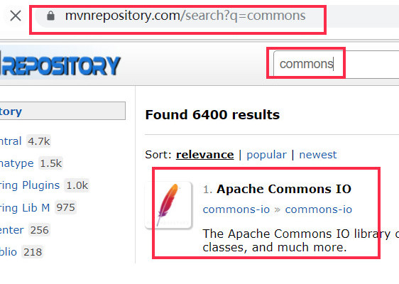
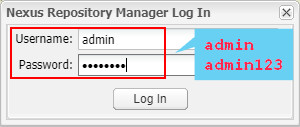

### 一、引言

------

#### 1.1 项目管理问题


项目中jar包资源越来越多，jar包的管理越来越沉重。


##### 1.1.1 繁琐


1、要为每个项目手动导入所需的jar，需要搜集全部jar

 

2、jar 导入的时候会发生版本冲突

 

3、新的项目需要用到以前的jar  需要重新取搜索；


##### 1.1.2 复杂


项目中的jar如果需要版本升级，就需要再重新搜集jar


##### 1.1.3 冗余


相同的jar在不同的项目中保存了多份


#### 1.2 项目管理方案


java项目需要一个统一的便捷的管理工具：Maven


### 二、介绍

------

Maven这个单词来自于意第绪语（犹太语），意为知识的积累.

 

Maven是一个基于项目对象模型（POM）的概念的纯java开发的开源的项目管理工具。主要用来管理java项目，进行依赖管理(jar包依赖管理)和项目构建(项目编译、打包、测试、部署)。此外还能分模块开发，提高开发效率。


### 三、Maven安装

------

#### 3.1 下载Maven


下载Maven


https://maven.apache.org/download.cgi


https://archive.apache.org/dist/maven/maven-3/3.5.4/binaries/

| http://us.mirrors.quenda.co/apache/maven/maven-3/3.5.4/binaries/ |
| ------------------------------------------------------------ |
|  |


#### 3.2 Maven安装


##### 3.2.1 解压


注意： 解压文件尽量不要放在含有中文或者特殊字符的目录下。

 

解压后，有如下目录：


```markdown
`bin:含有mvn运行的脚本`
`boot:含有plexus-classworlds类加载器框架,Maven 使用该框架加载自己的类库。`
`conf:含有settings.xml配置文件`
`lib:含有Maven运行时所需要的java类库`
```


##### 3.2.2 环境变量


maven依赖java环境，所以要确保java环境已配置好 （maven-3.3+ 需要jdk7+）

 

maven本身有2个环境变量要配置：


```markdown
`MAVEN_HOME = maven的安装目录`
`PATH = maven的安装目录下的bin目录`
```


配置步骤：


1、找到“此电脑”--右键-“属性”


2、


3、


##### 3.2.3 测试


查看maven版本信息


```plain
mvn -v
```


### 四、Maven配置

------

#### 4.1 本地仓库


maven的conf目录中有 settings.xml ，是maven的配置文件，做如下配置：


```xml
<settings xmlns="http://maven.apache.org/SETTINGS/1.0.0"
          xmlns:xsi="http://www.w3.org/2001/XMLSchema-instance"
          xsi:schemaLocation="http://maven.apache.org/SETTINGS/1.0.0 			  	http://maven.apache.org/xsd/settings-1.0.0.xsd">
  <!-- localRepository
   | The path to the local repository maven will use to store artifacts.
   |
   | Default: ${user.home}/.m2/repository
  <localRepository>/path/to/local/repo</localRepository>
  -->
  <!-- 选择一个磁盘目录，作为本地仓库 -->
  <localRepository>D:\Program Files\maven\myrepository</localRepository>
```


#### 4.2 JDK配置


在  标签中 增加 一个  标签，限定maven项目默认的jdk版本.

 

内容如下：


```xml
<profiles>
    <!-- 在已有的profiles标签中添加profile标签 -->
	<profile>    
        <id>myjdk</id>    
        <activation>    
            <activeByDefault>true</activeByDefault>    
            <jdk>1.8</jdk>    
        </activation>    
        <properties>    
            <maven.compiler.source>1.8</maven.compiler.source>    
            <maven.compiler.target>1.8</maven.compiler.target>
            <maven.compiler.compilerVersion>1.8</maven.compiler.compilerVersion> 
        </properties>    
    </profile>
</profiles>
<!-- 让增加的 profile生效 -->
<activeProfiles>
    <activeProfile>myjdk</activeProfile>
</activeProfiles>
```


### 五、仓库

------

#### 5.1 概念


 

-  存储依赖的地方，体现形式就是本地的一个目录。 
-  仓库中不仅存放依赖，而且管理着每个依赖的唯一标识(坐标)，Java项目凭坐标获取依赖。 

 


#### 5.2 仓库分类


仓库分类如下：

| 仓库分类                                                     |
| ------------------------------------------------------------ |
|  |


当需要依赖时，会从仓库中取查找，优先顺序为：

 

本地仓库  >  私服(如果配置了的话) >  公共仓库(如果配置了的话) > 中央仓库


#### 5.3 本地仓库


即在settings.xml 中配置的目录。

 

使用过了的依赖都会自动存储在本地仓库中，后续可以复用。


#### 5.4 远程仓库


##### 5.4.1 中央仓库


 

-  Maven 中央仓库是由 Maven 社区提供的仓库，不用任何配置，maven中内置了中央仓库的地址。
  其中包含了绝大多数流行的开源Java构件。 
-  https://mvnrepository.com/ 可以搜索需要的依赖的相关信息（仓库搜索服务）
  http://repo.maven.apache.org/maven2/  中央仓库地址 

 


##### 5.4.2 公共仓库【`重点`】


 

-  除中央仓库之外，还有其他远程仓库。
  比如aliyun仓库（http://maven.aliyun.com/nexus/content/groups/public/） 
-  中央仓库在国外，下载依赖速度过慢，所以都会配置一个国内的公共仓库替代中央仓库。 

 


```xml
<!--setting.xml中添加如下配置-->
<mirrors>
	<mirror>
        <id>aliyun</id>  
        <!-- 中心仓库的 mirror(镜像) -->
        <mirrorOf>central</mirrorOf>    
        <name>Nexus aliyun</name>
        <!-- aliyun仓库地址 以后所有要指向中心仓库的请求，都会指向aliyun仓库-->
        <url>http://maven.aliyun.com/nexus/content/groups/public</url>  
    </mirror>
  
  	<mirror>
		<id>aliyunmaven</id>
		<mirrorOf>*</mirrorOf>
		<name>阿里云公共仓库</name>
		<url>https://maven.aliyun.com/repository/public</url>
	</mirror>
  
</mirrors>
```


##### 5.4.3 私服【了解】


公司范围内共享的仓库，不对外开放。

 

可以通过 Nexus来创建、管理一个私服。


### 六、Idea-Maven

------

#### 6.1 在Idea中关联Maven


在idea中关联本地安装的maven，后续就可以通过idea使用maven，管理项目啦。

 


| 在全局设置中，关联Maven                                      |
| ------------------------------------------------------------ |
|  |


#### 6.2 创建Maven项目


##### 6.2.1 新建项目


新建项目，要选择 Maven 选项

 


| 如下选项                                                     |
| ------------------------------------------------------------ |
|   |


##### 6.2.2 指定项目名


| 设置项目名                                                   |
| ------------------------------------------------------------ |
|    |


##### 6.2.3 项目位置

| 项目位置如下                                                 |
| ------------------------------------------------------------ |
|  |


##### 6.2.4 项目结构


不正常


 

-  src/main/java 存放源代码，建包，放项目中代码(service,dao,User,....) 
-  src/main/resources 书写配置文件，项目中的配置文件(jdbc.properties) 
-  src/test/java 书写测试代码，项目中测试案例代码 
-  src/test/resources 书写测试案例相关配置文件 
-  目根/pom.xml (project object model) maven项目核心文件，其中定义项目构建方式，声明依赖等 
-  注意：项目中的建包，建类，执行，都和普通项目无差异 

 

| 项目结构如下：                                               |
| ------------------------------------------------------------ |
|  |


##### 6.2.5 项目类型


根据项目类型，在pom.xml中做出对应配置，添加配置：war/jar


```xml
<project xmlns="http://maven.apache.org/POM/4.0.0"
         xmlns:xsi="http://www.w3.org/2001/XMLSchema-instance"
         xsi:schemaLocation="http://maven.apache.org/POM/4.0.0 http://maven.apache.org/xsd/maven-4.0.0.xsd">
    <modelVersion>4.0.0</modelVersion>
    <groupId>com.qf</groupId>
    <artifactId>test01</artifactId>
    <version>1.0-SNAPSHOT</version>
    <!-- 打包方式，如果是java项目则用 jar，
         如果是web项目则用war -->
    <!--<packaging>war</packaging>-->
    <packaging>jar</packaging>
</project>
```


#### 6.3 导入依赖jar


建好项目后，需要导入需要的jar，要通过坐标

 

-  每个构件都有自己的坐标 = groupId + artifactId + version = 项目标识 + 项目名 + 版本号 
-  在maven项目中只需要配置坐标，maven便会自动加载对应依赖。删除坐标则会移除依赖 

 


##### 6.3.1 查找依赖


依赖查找服务：https://mvnrepository.com/ ，获得依赖的坐标，在maven项目中导入。

| 查找依赖坐标                                                 |
| ------------------------------------------------------------ |
|  |
|  |


##### 6.3.2 导入依赖


在项目的pom文件中，增加依赖

| 在项目的pom.xml文件添加依赖                                  |
| ------------------------------------------------------------ |
|  |


##### 6.3.3 同步依赖


引入坐标后，同步依赖，确认导入。

| 窗口右下角弹窗，刷新依赖，使新加的配置被maven加载            |
| ------------------------------------------------------------ |
|  |


\####6.4 创建web项目


##### 6.4.1 打包方式


pom.xml中设置 war

| web项目打包方式为：war                                       |
| ------------------------------------------------------------ |
|  |


##### 6.4.2 web依赖


导入 JSP 和 Servlet 和 JSTL依赖，使项目具有web编译环境


```xml
<?xml version="1.0" encoding="UTF-8"?>
<project ...>
    ...
    <packaging>war</packaging>

	<!-- 导入JSP 和 Servlet 和 JSTL 依赖 -->
    <dependencies>
        <dependency>
            <!-- jstl 支持 -->
            <groupId>javax.servlet</groupId>
            <artifactId>jstl</artifactId>
            <version>1.2</version>
        </dependency>
        <dependency>
            <!-- servlet编译环境 -->
            <groupId>javax.servlet</groupId>
            <artifactId>javax.servlet-api</artifactId>
            <version>3.1.0</version>
            <scope>provided</scope>
        </dependency>
        <dependency>
            <!-- jsp编译环境 -->
            <groupId>javax.servlet</groupId>
            <artifactId>jsp-api</artifactId>
            <version>2.0</version>
            <scope>provided</scope>
        </dependency>
    </dependencies>
</project>
```


##### 6.4.3 webapp目录


按照maven规范，新建web项目特有目录

| 新建如下目录和文件                                           |
| ------------------------------------------------------------ |
|  |


```xml
<?xml version="1.0" encoding="UTF-8"?><web-app xmlns="http://xmlns.jcp.org/xml/ns/javaee"         xmlns:xsi="http://www.w3.org/2001/XMLSchema-instance"         xsi:schemaLocation="http://xmlns.jcp.org/xml/ns/javaee http://xmlns.jcp.org/xml/ns/javaee/web-app_4_0.xsd"         version="4.0">	<!-- 这是一个空白的web.xml文件模板 --></web-app>
```


##### 6.4.4 定义Servlet和Jsp

| 照常定义即可                                                 |
| ------------------------------------------------------------ |
|  |


#### 6.5 部署web项目


##### 6.5.1 新增Tomcat

| 新增Tomcat                                                   |
| ------------------------------------------------------------ |
|  |
|  |
|  |


##### 6.5.2 部署web项目

| 部署web项目                                                  |
| ------------------------------------------------------------ |
|  |
|  |
|  |


##### 6.5.3 启动Tomcat

| 启动Tomcat                                                   |
| ------------------------------------------------------------ |
|  |
|  |


#### 6.6 依赖生命周期


##### 6.6.1 概念


Jar包生效的时间段，即Jar的生命周期


##### 6.6.2 使用方式


项目中导入的依赖可以做生命周期的管理


```xml
<dependency>    <groupId>commons-io</groupId>    <artifactId>commons-io</artifactId>    <version>2.6</version>    <!-- 生命周期 -->    <scope>compile</scope></dependency><dependency>    <!-- servlet编译环境 -->    <groupId>javax.servlet</groupId>    <artifactId>javax.servlet-api</artifactId>    <version>3.1.0</version>    <!-- 生命周期 -->    <scope>provided</scope></dependency><dependency>    <groupId>junit</groupId>    <artifactId>junit</artifactId>    <version>4.12</version>    <!-- 生命周期 -->    <scope>test</scope></dependency>
```


##### 6.6.3 生命周期详解

| 标识     | 周期                                                         |
| -------- | ------------------------------------------------------------ |
| compile  | 缺省值，适用于所有阶段（测试运行，编译，运行，打包）         |
| provided | 类似compile，期望JDK、容器或使用者会提供这个依赖。如servlet-api.jar；适用于（测试运行，编译）阶段 |
| runtime  | 只在运行时使用，如 mysql的驱动jar，适用于（运行，测试运行）阶段 |
| test     | 只在测试时使用，适用于（编译，测试运行）阶段，如 junit.jar   |
| system   | Maven不会在仓库中查找对应依赖，在本地磁盘目录中查找；适用于（编译，测试运行，运行）阶段 |


### 七、Maven指令

------

#### 7.1 命令行


通过Idea打开 cmd，然后执行Maven指令

| 打开 cmd，并定位到项目目录                                   |
| ------------------------------------------------------------ |
|  |

| 执行maven指令                                                |
| ------------------------------------------------------------ |
|  |


#### 7.2 Maven面板


Idea中有Maven面板，其中可以快速执行Maven指令

| maven面板                                                    |
| ------------------------------------------------------------ |
|  |


### 八、私服

------

#### 8.1 概念


 

-  私服是架设在局域网的一种特殊的远程仓库，目的是代理远程仓库及部署第三方构件。 
-  有了私服之后，当 Maven 需要下载依赖时，直接请求私服，私服上存在则下载到本地仓库；否则，私服请求外部的远程仓库，将构件下载到私服，再提供给本地仓库下载。 
-  私服可以解决在企业做开发时每次需要的jar包都要在中心仓库下载,且每次下载完只能被自己使用,不能被其他开发人员使用 
-  所谓私服就是一个服务器,但是不是本地层面的,是公司层面的,公司中所有的开发人员都在使用同一个私服 

 


#### 8.2 架构

| 无私服                                                       | 有私服                                                       |
| ------------------------------------------------------------ | ------------------------------------------------------------ |
|  |  |


我们可以使用专门的 Maven 仓库管理软件来搭建私服，比如：[Apache Archiva](http://archiva.apache.org/index.cgi)，[Artifactory](http://www.jfrog.com/home/v_artifactory_opensource_overview/)，[Sonatype Nexus](http://www.sonatype.org/nexus/)。这里我们使用 Sonatype Nexus


#### 8.3 Nexus安装【了解】


##### 8.3.1 下载


 

- 官网：https://blog.sonatype.com/
- 下载地址：https://help.sonatype.com/repomanager2/download/download-archives---repository-manager-oss

 


##### 8.3.2 安装


下载nexus-2.x-bundle.zip,解压即可

| nexus安装目录                                                |
| ------------------------------------------------------------ |
|  |


#### 8.4 启动【了解】


 

- 解压后在bin目录中执行： 

- - nexus install  在系统中安装nexus服务
  - nexus uninstall 卸载nexus服务
  - nexus start   启动服务
  - nexus stop   停止服务

 


#### 8.5 Nexus登录【了解】


访问私服：http://localhost:8081/nexus/

| 登录Nexus才可以使用Nexus管理功能                             |
| ------------------------------------------------------------ |
|  |


#### 8.6 仓库列表【了解】

| 仓库类型 | 描述                                                         |
| -------- | ------------------------------------------------------------ |
| group    | 包含多个仓库，通过group库的地址可以从包含的多个仓库中查找构件 |
| hosted   | 私服 服务器本地的仓库，其中存储诸多构件                      |
| proxy    | 代理仓库，其会关联一个远程仓库, 比如中央仓库，aliyun仓库，向该仓库查找构件时，如果没有会从其关联的仓库中下载 |

| 仓库名    | 描述                                                         |
| --------- | ------------------------------------------------------------ |
| Releases  | 存放项目的稳定发布版本，一个模块做完后如果需要共享给他人，可以上传到私服的该库 |
| Snapshots | 对应不稳定的发布版本                                         |
| 3rd party | 存放中央仓库没有的 ，如ojdbc.jar，可以上传到私服的该库中     |

| 仓库列表                                                     |
| ------------------------------------------------------------ |
|  |


#### 8.7 Maven配置私服 【`重点`】


在maven中配置私服，使得maven可以从私服上获取构件


##### 8.7.1 仓库组


而此时就有问题，私服中有很多仓库，每个仓库都有自己的url，则项目中配置哪个仓库呢 ?

 

私服中有一个仓库组，组中包含多个仓库，可以指定仓库组的url，即可从多个仓库中获取构件

| 仓库组    注意：proxy的仓库排序在最后                        |
| ------------------------------------------------------------ |
|  |


##### 8.7.2 Maven关联私服


配置settings.xml，设置私服地址、认证等信息


```xml
<servers>
	<server> 
		<id>nexus-public</id> <!-- nexus的认证id -->
		<username>admin</username> <!--nexus中的用户名密码-->
		<password>admin123</password> 
	</server>
</servers>
<profiles>
	<profile> 
        <id>nexus</id> 
        <repositories> 
            <repository> 
                <id>nexus-public</id> <!--nexus认证id 【此处的repository的id要和 <server>的id保持一致】-->
                <!--name随便-->
                <name>Nexus Release Snapshot Repository</name> 
                <!--地址是nexus中仓库组对应的地址-->
                <url>http://localhost:8081/nexus/content/groups/public/</url>
                <releases><enabled>true</enabled></releases> 
                <snapshots><enabled>true</enabled></snapshots> 
            </repository>
        </repositories> 
        <pluginRepositories> <!--插件仓库地址，各节点的含义和上面是一样的-->
            <pluginRepository> 
                <id>nexus-public</id> <!--nexus认证id 【此处的repository的id要和 <server>的id保持一致】-->
                <!--地址是nexus中仓库组对应的地址-->
                <url>http://localhost:8081/nexus/content/groups/public/</url>
                <releases><enabled>true</enabled></releases> 
                <snapshots><enabled>true</enabled></snapshots> 
            </pluginRepository> 
        </pluginRepositories> 
    </profile>
</profiles>
<activeProfiles>
    <activeProfile>yourjdk</activeProfile>
    <!-- 使私服配置生效 -->
    <activeProfile>nexus</activeProfile>
</activeProfiles>
```


至此，Maven项目中需要依赖时，Maven会从私服中下载


#### 8.8 Maven项目部署到私服


 

-  执行 ：mvn deploy  即可将项目部署到私服对应的仓库中，此时项目中的打包方式多为jar 
-  但需要提前在项目的pom.xml中配置部署私服仓库位置，如下： 

 


```xml
 ...
	<dependencies>
		.....
	</dependencies>
	
	<!-- 在项目的pom.xml中 配置私服的仓库地址，可以将项目打jar包部署到私服 -->
	<distributionManagement>
        <repository>
            <id>nexus-public</id> <!-- nexus认证id -->
            <url>http://localhost:8081/nexus/content/repositories/releases</url>
        </repository>
        <snapshotRepository>
            <id>nexus-public</id> <!-- nexus认证id -->
            <url>http://localhost:8081/nexus/content/repositories/snapshots</url>
        </snapshotRepository>
	</distributionManagement>
</project>
```


注意：如上的 repository的 id 依然是要和settings.xml中配置的server中的id 一致，才能通过私服的认证


# Maven 和 Gradle

## Maven

### Maven 的两个经典作用

#### 一.   依赖管理 也就是管理jar包

Maven 的一个核心特性就是依赖管理。

当涉及到多模块的项目（包含成百个模块或者子项目），管理依赖就变成一项困难的任务。这时用Maven 可以对处理这种情形的高度控制。

在传统的 WEB 项目中，我们必须将工程所依赖的 jar 包复制到工程中，导致了工程的变得很大。比如

idea常见普通Maven项目目录：
                   

**maven工程中不直接将 jar包导入到工程中，而是通过在 pom.xml** **文件中添加所需jar包的坐标**。

到仓库中找到 jar 包不会影响程序性能：
maven 中也有索引的概念，通过建立索引，可以大大提高加载 jar 包的速度，使得我们认为 jar 包基本跟放在本地的工程文件中再读取出来的速度是一样的。**Maven中仓库分为三类：**

​                                           


+ **本地仓库：**存放在本地服务器中，当运行项目的时候，maven会自动根据配置文件查找本地仓库，再从本地仓库中调用jar包使用。

+ **远程仓库**
  当本地仓库中没有项目所需要的jar包时，那么maven会继续查找远程仓库，一般远程仓库指的是公司搭建的私有服务器，也叫私服；
  当jar包在私服中查找到之后，maven会将jar包下载到本地仓库中，下次使用的时候就不用再去找远程仓库。
  **中央仓库：**
  当远程仓库获取不到jar包时，就需要到中央仓库去查找，并下载在远程仓库中，本地仓库再从远程仓库中下载回来使用。

#### 二. 一键构建

**Maven 规范化构建流程如下：**

​           

### Maven坐标

Maven通过坐标对jar包进行唯一标识。坐标通过3个元素进行定义，groupId、artifactId、version。

1. groupId：组织标识，一般为域名倒置。
2. artifactId：项目名或模块名，是当前项目中的唯一标识。
3. version：当前项目版本。

### Spring Boot应用 打包与部署

#### 打包

> 打包工具使用的是Maven

首先需要在pom.xml文件build节点增加如下配置：

```xml
<build>
    <plugins>
        <plugin>
            <groupId>org.apache.maven.plugins</groupId>
            <artifactId>maven-compiler-plugin</artifactId>
            <configuration>
                <source>1.8</source>
                <target>1.8</target>
                <encoding>UTF-8</encoding>
            </configuration>
        </plugin>
        <!--打包-->
        <plugin>
            <groupId>org.springframework.boot</groupId>
            <artifactId>spring-boot-maven-plugin</artifactId>
        </plugin>
    </plugins>
</build>
```

另外，需要确认pom.xml文件的package节点配置：

```
<!--打成 jar 包,一般为默认-->
<packaging>jar</packaging>
<!--打成 war 包-->
<packaging>war</packaging>
```

在项目的根目录下，打开命令行工具，并执行以下命令：

```
mvn clean package
```


使用Maven构建工具编译和打包应用程序。打包完成后，会在`target`目录下找到一个名为`<项目名>.jar`的JAR文件。


测试

本地运行测试cmd 到控制台，通过 java 命令运行 jar 包

```
java -jar springbootAPP.jar
```

#### 部署

有多种方式可以部署Spring Boot应用程序，包括将其部署到独立的[服务器](https://so.csdn.net/so/search?q=服务器&spm=1001.2101.3001.7020)、容器化平台（如Docker）或云平台（如AWS、Azure等）。下面将介绍其中的一种简单的部署方式。

- 将JAR文件上传到服务器： 将打包好的JAR文件上传到目标服务器，可以使用FTP、SCP或其他文件传输工具。

- 运行应用程序： 在服务器上打开命令行工具，并导航到JAR文件所在的目录。然后执行以下命令来运行应用程序：

  ```
  java -jar <项目名>.jar
  ```

  这将启动Spring Boot应用程序。

- 配置应用程序： 默认情况下，Spring Boot应用程序将在8080端口上监听HTTP请求。

## groupid和artifactid

在创建 POM 之前，首先要确定工程组（groupId），及其名称（artifactId）和版本，在仓库中这些属性是项目的唯一标识。
这两个属性，可以理解成地球上的经纬度，maven仓库，就是相应的地球。

1、groupId一般分为多个段，可以定义成两段或者三段

```java
两段：域 + 组织
groupId:  org.alibaba
groupId:  org.sky
 
三段：域 + 组织 + 项目名
groupId:  org.alibaba.taobao
groupId:  org.sky.taobao
 
第一段：域
常见的有：cn(china)，org(非营利组织)，com(商业组织)
第二段：组织
如果你的公司是阿里巴巴，就是alibaba。如果是个人的小项目，随便定义，比如说，就是sky
第三段：项目名
你创建项目时，肯定是有名字的。这里，就写你项目的名字，taobao
```

2、artifactid呢，一段两段都可以

```java
（1）一段怎么讲？就写子项目名（比如说 taobao 项目下有两个子项目 tianmao 和 xianyu ）
artifactid：tianmao
artifactid： xianyu 
 
（2）两段怎么说？
artifactid： tianmao.dev  和  artifactid： tianmao.prod
artifactid： xianyu.dev  和   artifactid： xianyu.prod
 
项目还能继续细分，比如开发环境的项目dev，生产环境的项目prod
第一段：子项目名
第二段：开发环境dev，还是，生产环境prod
```


## Gradle

如果你经常使用Maven，可能会发现Maven有一些地方用的让人不太舒服：

+ Maven的配置文件是XML格式的，假如你的项目依赖的包比较多，那么XML文件就会变得非常非常长；

+ XML文件不太灵活，假如你需要在构建过程中添加一些自定义逻辑，搞起来非常麻烦；

+ Maven非常的稳定，但是相对的就是对新版java支持不足，哪怕就是为了编译java11，也需要更新内置的Maven插件；

如果你对Maven的这些缺点也有所感触，尝试gradle构建工具，这是一个全新的java构建工具，解决了Maven的一些痛点。

[Gradle使用教程 - 知乎 (zhihu.com)](https://zhuanlan.zhihu.com/p/440595132)

[gradle使用教程，一篇就够 - 简书 (jianshu.com)]()


# pom.xml 文件

## 一、什么是POM

`Project Object Model`，项目对象模型。通过xml可扩展标记语言（EXtensible Markup Language）格式保存的pom.xml文件。作用类似ant的build.xml文件，功能更强大。该文件用于管理：源代码、配置文件、开发者的信息和角色、问题追踪系统、组织信息、项目授权、项目的url、项目的依赖关系等等。一个完整的pom.xml文件，放置在项目的根目录下。

## properties

在properties标签内可以把版本号作为变量进行声明，方便maven依赖标签用${变量名}的形式动态获取版本号。这样做的优点是当版本号发生改变时，仅仅需要更新properties标签中的变量值就行了，不用煞费心思更新所有依赖的版本号。例如，定义如下两个变量：

```xml
<properties>
    <java.version>13</java.version>
    <lombok.version>1.18.10</lombok.version>
</properties>
```

   则在Maven的pom.xml中导入lombok依赖的时候，使用如下格式即可定义依赖的版本号：

```xml
<dependency>
    <groupId>org.projectlombok</groupId>
    <artifactId>lombok</artifactId>
    <optional>true</optional>
    <version>${lombok.version}</version>
</dependency>
```


1. 构建一个普通的Maven项目，删掉里面的src目录，作为父项目.  这个空的工程就是Maven主工程；

1. maven自动生成

   父工程中pom.xml会有：

   ```xml
        <modules>
            <module>servlet-01</module>
        </modules>
   ```

   子项目pom.xml中会有：

   ```xml
        <parent>
            <groupId>org.example</groupId>
            <artifactId>javaweb-servlet</artifactId>
            <version>1.0-SNAPSHOT</version>
        </parent>
   ```

3. 父项目中的jar包，子项目可以直接使用。反之，不可。

   


### 2、maven的基本信息

```xml
<project xmlns="http://maven.apache.org/POM/4.0.0" 
  xmlns:xsi="http://www.w3.org/2001/XMLSchema-instance"
  xsi:schemaLocation="http://maven.apache.org/POM/4.0.0
                      http://maven.apache.org/maven-v4_0_0.xsd">
    <modelVersion>4.0.0</modelVersion>
    <groupId>com.funtl</groupId>
    <artifactId>itoken-dependencies</artifactId>
    <version>1.0.0</version>
    <packaging>war</packaging>
    <name>itoken dependencies</name>
    <url>www.funtl.com</url>
</project>
```

| 字段           | 说明                                                         |
| -------------- | ------------------------------------------------------------ |
| `modelVersion` | 声明项目描述符遵循哪一个POM模型版本。模型本身的版本很少改变，虽然如此，但它仍然是必不可少的， 这是为了当Maven引入了新的特性或者其他模型变更的时候，确保稳定性。 |
| `groupId`      | 公司或者组织的唯一标志，并且配置时生成的路径也是由此生成， 如com.winner.trade，maven会将该项目打成的jar包放本地路径：/com/winner/trade |
| `artifactId`   | 本项目的唯一ID，一个groupId下面可能多个项目，就是靠artifactId来区分的 |
| `version`      | 本项目目前所处的版本号                                       |
| `packaging`    | 打包类型，可取值：pom , jar , maven-plugin , ejb , war , ear , rar , par等等 |
| `name`         | 项目的名称, Maven产生的文档用，可省略                        |
| `url`          | 项目主页的URL, Maven产生的文档用 ，可省略                    |

等等还好好多属性，具体参见博客末尾的 `完整版pom.xml`；
其中groupId，artifactId，version，packaging这四项组成了项目的唯一坐标。一般情况下，前面三项就足矣。

### 3、POM之间的关系

主要用于POM文件的复用和依赖。

#### a）依赖关系：依赖关系列表

该元素描述了项目相关的所有依赖。 这些依赖组成了项目构建过程中的一个个环节。它们自动从项目定义的仓库中下载。

```xml
 <dependencies>
    <!--单元测试依赖--> 
    <dependency>
      <groupId>junit</groupId>
      <artifactId>junit</artifactId>
      <version>4.0</version>
      <scope>test</scope>
      <optional>true</optional>
      <!--排除项目中的依赖冲突时使用，不依赖该项目-->  
      <exclusions>
      	<exclusion>  
          <groupId>xxx</groupId>
          <artifactId>xxx</artifactId>
        </exclusion>
      </exclusions>
    </dependency>
    …
  </dependencies>
```

| 字段         | 说明                                                         |
| ------------ | ------------------------------------------------------------ |
| `groupId`    | 依赖项的组织名                                               |
| `artifactId` | 依赖项的子项目名                                             |
| `version`    | 依赖项的版本                                                 |
| `type`       | 依赖类型一般省略，默认类型是jar，其他还有jar，war，ejb-client和test-jar |
| `scope`      | 依赖项的适用范围 ，包括compile，provided，runtime，test，system，exclusions [^1] |
| `optional`   | 可选依赖，如果你在项目B中把C依赖声明为可选，你就需要在依赖于B的项目（例如项目A）中显式的引用对C的依赖。 |
| `exclusions` | 排除项目中的依赖冲突时使用，不依赖该项目                     |

[^1]scope 依赖项的适用范围

- compile，缺省值，适用于所有阶段，会随着项目一起发布。
- provided，类似compile，期望JDK、容器或使用者会提供这个依赖。如servlet.jar。
- runtime，只在运行时使用，如JDBC驱动，适用运行和测试阶段。
- test，只在测试时使用，用于编译和运行测试代码。不会随项目发布。
- system，类似provided，需要显式提供包含依赖的jar，Maven不会在Repository中查找它。
- optional: 当项目自身被依赖时，标注依赖是否传递。用于连续依赖时使用

我们知道，maven的依赖关系是有传递性的。如：A–>B，B–>C。但有时候，项目A可能不是必需依赖C，因此需要在项目A中排除对C的依赖。在maven的依赖管理中，有两种方式可以对依赖关系进行，分别是`可选依赖（Optional Dependencies）`以及`依赖排除（Dependency Exclusions）`。

##### 可选依赖 Optional Dependencies

当一个项目A依赖另一个项目B时，项目A可能用到了项目B很少一部分功能，此时就可以在A中配置对B的可选依赖。举例来说，项目B类似hibernate，它支持对mysql、oracle等各种数据库的支持，但是在引用这个项目时，我们可能只用到其对mysql的支持，此时就可以在A项目中配置对项目B的可选依赖。

```
配置可选依赖的原因：1、节约磁盘、内存等空间；2、避免license许可问题；3、避免类路径问题，等等。
```

示例：

```xml
<project>
  ...
  <dependencies>
    <!-- declare the dependency to be set as optional -->
    <dependency>
      <groupId>sample.ProjectB</groupId>
      <artifactId>Project-B</artifactId>
      <version>1.0</version>
      <scope>compile</scope>
      <optional>true</optional> <!-- value will be true or false only -->
    </dependency>
  </dependencies>
</project>
12345678910111213
```

假设以上配置是项目A的配置，即：Project-A <-- Project-B。在编译项目A时，是可以正常通过的。

如果有一个新的项目C依赖A，即：Project-C <-- Project-A `<-- Project-B`。此时项目C就不会依赖项目B了。
如果项目C用到了涉及项目B的功能，那么就需要在pom.xml中重新配置对项目B的依赖。

##### 依赖排除 Dependency Exclusions

###### 第一种情况

当一个项目A依赖项目B，而项目B同时依赖项目C，如果项目A中因为各种原因不想引用项目C，在配置项目B的依赖时，可以排除对C的依赖。

示例（假设配置的是A的pom.xml，依赖关系为：A<–B<–C）：

```XML
<project>
  ...
  <dependencies>
    <dependency>
      <groupId>sample.ProjectB</groupId>
      <artifactId>Project-B</artifactId>
      <version>1.0</version>
      <scope>compile</scope>
      <exclusions>
        <exclusion>  <!-- declare the exclusion here -->
          <groupId>sample.ProjectC</groupId>
          <artifactId>Project-C</artifactId>
        </exclusion>
      </exclusions> 
    </dependency>
  </dependencies>
</project>
```

当然，对于多重依赖，配置也很简单，参考如下示例：

Project-A
-> Project-B
-> Project-D
-> Project-E <! – This dependency should be excluded -->
-> Project-F
-> Project C
A对于E相当于有多重依赖，我们在排除对E的依赖时，只需要在配置B的依赖中进行即可：

```XML
<project>
  <modelVersion>4.0.0</modelVersion>
  <groupId>sample.ProjectA</groupId>
  <artifactId>Project-A</artifactId>
  <version>1.0-SNAPSHOT</version>
  <packaging>jar</packaging>
  ...
  <dependencies>
    <dependency>
      <groupId>sample.ProjectB</groupId>
      <artifactId>Project-B</artifactId>
      <version>1.0-SNAPSHOT</version>
      <exclusions>
        <exclusion>
          <groupId>sample.ProjectE</groupId> <!-- Exclude Project-E from Project-B -->
          <artifactId>Project-E</artifactId>
        </exclusion>
      </exclusions>
    </dependency>
  </dependencies>
</project>
123456789101112131415161718192021
```

###### 第二种情况

如果我们的项目有两个依赖项：A & B，而且A和B同时依赖了C，但不是同一个版本。那么我们怎么办呢？

###### 1 添加检查插件

```xml
<reporting>
	<plugins>
		<plugin>
			<groupId>org.apache.maven.plugins</groupId>
			<artifactId>maven-project-info-reports-plugin</artifactId>
		</plugin>
	</plugins>
</reporting>
12345678
```

然后运行：mvn project-info-reports:dependencies，来查看依赖项报告。

###### 2 去除依赖项

```xml
<dependency>
      <groupId>org.apache.struts</groupId>
      <artifactId>struts2-core</artifactId>
      <version>${struts.version}</version>
      <exclusions>
          <exclusion>
              <groupId>org.freemarker</groupId>
              <artifactId>freemarker</artifactId>
          </exclusion>
      </exclusions>
</dependency>
1234567891011
```

#### b）继承关系：继承其他pom.xml配置的机制。

在我们已经聚合的项目中，有很多重复的配置，有相同的groupId和version，有相同的spring-core, spring-beans, spring-context和juit依赖，造成大量的浪费也会引发问题，所以如何使用继承机制来统一配置这些重复的信息，做到”一处声明，处处使用“呢？

思路：创建POM的父子结构，在父POM中声明一些配置供子POM继承、

##### 父 pom.xml

```xml
<project>
  [...]
  <dependencies>
    <dependency>
      <groupId>junit</groupId>
      <artifactId>junit</artifactId>
      <version>4.4</version>
      <scope>test</scope>
    </dependency>
  </dependencies>
  [...]
</project>
```

##### 子 pom.xml

```xml
[...]
<parent>
  <groupId>com.devzuz.mvnbook.proficio</groupId>
  <artifactId>proficio</artifactId>
  <version>1.0-SNAPSHOT</version>
  <relativePath>../ParentProject/pom.xml</relativePath>   
</parent>
[...]
```

`relativePath`默认为…/pom.xml，如果路径不一样需要手动指定

#### c）聚合关系：用于将多个maven项目聚合为一个大的项目。

我们想要一次构建两个项目，而不是到两个模块的目录下分别执行mvn命令 – Maven的聚合就是为该需求服务的。

为了能够使用一条命令就能构建account-email和account-persist两个模块，需要创建一个额外的名为account-aggregator的模块，然后通过该模块构建整个项目的所有模块。

account-aggregator也有它自己的POM文件，内容如下：

```xml
<project xmlns="http://maven.apache.org/POM/4.0.0"
        xmlns:xsi="http://www.w3.org/2001/XMLSchema-instance"
        xsi:schemaLocation="http://maven.apache.org/POM/4.0.0
        http://maven.apache.org.maven-v4_0_0.xsd">
    <modelVersion>4.0.0</modelVersion>
    <groupId>com.park.mvnDemo.account</groupId>
    <artifactId>account-aggregator</artifactId>
    <version>1.0.0-SNAPSHOT</version>
    <packaging>pom</packaging>
    <name>Account Aggregator</name>
    <modules>
        <module>account-email</module>
        <module>account-persist<module>
    </modules>
</project>
123456789101112131415
```

> 在上面的xml文件中，packaging的方式为pom。对于聚合模块来说， **其打包方式必须为pom**，否则无法构建！

`modules`: 这里是实现聚合的最核心的配置，可以声明任意数量的module元素来实现元素的聚合；
其中，每个module的值为当前聚合POM的相对路径;
如：
当前的聚合POM位于`D:\m2\code\account-aggregator\`
另有一个项目A位于`D:\m2\code\account-aggregator\`account-email\
一个项目B位于`D:\m2\code\-aggregatoraccount\`account-persist\
与上面聚合pom内的的module值相对应。也可写成/account-email
为了方便用户构建项目，通常将聚合模块放在项目目录的最顶层，其他模块则作为聚合模块的子目录存在。
当然，你也可以手动指定路径

### 4、 Maven的六类属性

#### 1) maven内置属性

主要有两个常用内置属性：

| 属性         | 说明                                |
| ------------ | ----------------------------------- |
| `${basedir}` | 项目的根目录(包含pom.xml文件的目录) |
| `${version}` | 项目版本                            |

#### 2) POM属性

用户可以使用该属性引用POM文件中对应元素的值，常用的POM属性包括：

| 属性                                   | 说明                                                         |
| -------------------------------------- | ------------------------------------------------------------ |
| `${project.build.sourceDirectory}`     | 项目的主源码目录，默认为 src/main/java                       |
| `${project.build.testSourceDirectory}` | 项目的测试源码目录，默认为 src/test/java                     |
| `${project.build.directory}`           | 项目构件输出目录，默认为 target/                             |
| `${project.outputDirectory}`           | 项目主代码编译输出目录，默认为 target/classes/               |
| `${project.testOutputDirectory}`       | 项目测试代码编译输出目录，默认为 target/test-classes/        |
| `${project.groupId}`                   | 项目的 groupId                                               |
| `${project.artifactId}`                | 项目的 artifactId                                            |
| `${project.version}`                   | 项目的 version，与${version}等价                             |
| `${project.build.fianlName}`           | 项目打包输出文件的名称，默认为"`${project.artifactId}` - `${project.version}`" |

#### 3) 自定义属性

用户可以在POM的元素下自定义Maven属性

```xml
 <!--配置依赖版本-->
 <properties>
     <!-- Environment Settings -->
     <java.version>1.8</java.version>
     <project.build.sourceEncoding>UTF-8</project.build.sourceEncoding>
     <project.reporting.outputEncoding>UTF-8</project.reporting.outputEncoding>

     <!-- Spring cloud Settings   -->
     <spring-cloud.version>Finchley.RELEASE</spring-cloud.version>
     <spring-boot-admin.version>2.0.1</spring-boot-admin.version>
     <zipkin.version>2.10.1</zipkin.version>
 </properties>
```

然后在pom文件中通过${zipkin.version}来使用他们

##### dependencies 和 dependencyManagement 标签

在通常情况下，由于我们的模块很多，我们需要一个itoken-denpendencies的项目来管理子项目的公共的依赖。

为了项目的正确运行，必须让所有的子项目使用依赖项的统一版本，必须确保应用的各个项目的依赖项和版本一致，才能保证测试的和发布的是相同的结果。

在我们项目顶层的POM文件中，我们会看到`dependencyManagement`元素。通过它元素来管理jar包的版本，让子项目中引用一个依赖而不用显示的列出版本号。

结合maven的自定义属性，我们来看看项目中的具体应用：

###### itoken-denpendencies 中的 pom.xml

在父项目中用`dependencyManagement`声明依赖的版本，需要

```xml
<dependencyManagement>
	<dependencies>
	    <!--spring cloud-->
	    <dependency>
	        <groupId>org.springframework.cloud</groupId>
	        <artifactId>spring-cloud-dependencies</artifactId>
	        <version>${spring-cloud.version}</version>
	        <type>pom</type>
	        <scope>import</scope>
	    </dependency>
	    <!--zipkin-->
	    <dependency>
	        <groupId>io.zipkin.java</groupId>
	        <artifactId>zipkin</artifactId>
	        <version>${zipkin.version}</version>
	    </dependency>
	    [...]
	<dependencies>
</dependencyManagement>            
12345678910111213141516171819
```

###### itoken-zipkin 中的 pom.xml

在子项目中，Maven会沿着父子层次向上走，直到找到一个拥有dependencyManagement元素的项目，然后它就会使用在这个dependencyManagement元素中指定的版本号。

```xml
<dependencies>
    <!--spring cloud-->
    <dependency>
        <groupId>org.springframework.cloud</groupId>
        <artifactId>spring-cloud-dependencies</artifactId>
    </dependency>
    <!--zipkin-->
    <dependency>
        <groupId>io.zipkin.java</groupId>
        <artifactId>zipkin</artifactId>
    </dependency>
    [...]
<dependencies>
12345678910111213
```

###### 需要注意的是：

`dependencyManagement`里只是声明依赖，并不实现引入。如果不在子项目中声明依赖，是不会从父项目中继承下来的；只有在子项目中写了该依赖项，并且没有指定具体版本，才会从父项目中继承该项，并且version和scope都读取自父pom。

```
如果子项目中指定了版本号，那么会使用子项目中指定的jar版本。
```

#### 4) Settings属性

用户使用`${settings.}`开头的属性可以引用 maven settings.xml 文件中XML元素的值

| 属性                       | 说明                                                         |
| -------------------------- | ------------------------------------------------------------ |
| `settings.localRepository` | 自定义本地库路径，默认在 ${user.home}/.m2中；                |
| `settings.interactiveMode` | 交互模式，Maven是否应该尝试与用户输入交互，默认是true，如果不是false。 |
| `settings.offline`         | 是否每次编译都去查找远程中心库， 如果此构建系统应以离线模式运行，则为true，默认为false。由于网络设置或安全原因，此元素对于构建无法连接到远程存储库的服务器非常有用。 |
| `settings.pluginGroups`    | 插件组，例如org.mortbay.jetty；                              |

#### 5) Java系统属性

所有Java系统属性都可以使用Maven属性引用，这里列举一些常用的java系统属性

| 属性                            | 说明                              |
| ------------------------------- | --------------------------------- |
| `java.version`                  | Java 运行时环境版本               |
| `java.vendor Java`              | 运行时环境供应商                  |
| `java.vendor.url`               | Java 供应商的 URL                 |
| `java.home`                     | Java 安装目录                     |
| `java.vm.specification.version` | Java 虚拟机规范版本               |
| `java.vm.specification.vendor`  | Java 虚拟机规范供应商             |
| `java.vm.specification.name`    | Java 虚拟机规范名称               |
| `java.vm.version`               | Java 虚拟机实现版本               |
| `java.vm.vendor`                | Java 虚拟机实现供应商             |
| `java.vm.name`                  | Java 虚拟机实现名称               |
| `java.specification.version`    | Java 运行时环境规范版本           |
| `java.specification.vendor`     | Java 运行时环境规范供应商         |
| `java.specification.name`       | Java 运行时环境规范名称           |
| `java.class.version`            | Java 类格式版本号                 |
| `java.class.path`               | Java 类路径                       |
| `java.library.path`             | 加载库时搜索的路径列表            |
| `java.io.tmpdir`                | 默认的临时文件路径                |
| `java.compiler`                 | 要使用的 JIT 编译器的名称         |
| `java.ext.dirs`                 | 一个或多个扩展目录的路径          |
| `os.name`                       | 操作系统的名称                    |
| `os.arch`                       | 操作系统的架构                    |
| `os.version`                    | 操作系统的版本                    |
| `file.separator`                | 文件分隔符（在 UNIX 系统中是“/”） |
| `path.separator`                | 路径分隔符（在 UNIX 系统中是“:”） |
| `line.separator`                | 行分隔符（在 UNIX 系统中是“/n”）  |
| `user.name`                     | 用户的账户名称                    |
| `user.home`                     | 用户的主目录                      |
| `user.dir`                      | 用户的当前工作目录                |

#### 6) 环境变量属性

所有环境变量都可以使用以env.开头的Maven属性引用
`${env.JAVA_HOME}`表示JAVA_HOME环境变量的值;

### 5、构建设置

```xml
<project xmlns="http://maven.apache.org/POM/4.0.0"
  xmlns:xsi="http://www.w3.org/2001/XMLSchema-instance"
  xsi:schemaLocation="http://maven.apache.org/POM/4.0.0
                      http://maven.apache.org/maven-v4_0_0.xsd">
  …
  <!– "Project Build" contains more elements than just the BaseBuild set –>
  <build>…</build>
  <profiles>
    <profile>
      <!– "Profile Build" contains a subset of "Project Build"s elements –>
      <build>…</build>
    </profile>
  </profiles>
</project>
1234567891011121314
```

build中的主要标签：Resources和Plugins。

#### Resources：资源文件管理

用于引用或排除资源文件

```xml
<resources>
	<resource>
		<targetPath>META-INF/plexus</targetPath>
		<filtering>false</filtering>
		<directory>${basedir}/src/main/plexus</directory>
		<includes>
		  <include>configuration.xml</include>
		</includes>
		<excludes>
		  <exclude>**/*.properties</exclude>
		</excludes>
	</resource>
</resources>
12345678910111213
```

| 属性       | 说明                                                         |
| ---------- | ------------------------------------------------------------ |
| targetPath | 资源的打包路径，该路径相对target/classes目录                 |
| filtering  | 主要用来替换项目中的资源文件（* .xml、* . properties）当中的$ {…}属性值如$ {db.url} 如果filtering=tru 在resources目录中存在资源文件并且 配置了db.url=aaa的话， 在项目编译的时候，就会自动的把pom文件中的${db.url}替换为aaa |
| directory  | 描述存放资源的目录，该路径相对POM路径                        |
| includes   | 包含的模式列表，例如**/*.xml                                 |
| excludes   | 排除的模式列表，例如**/*.xml                                 |

#### Plugins：设置构建的插件

**为什么我们需要插件？**
1.需要某个特殊的 jar包，但是有不能直接通过maven依赖获取，或者说在其他环境的maven仓库内不存在，那么如何将我们所需要的jar包打入我们的生产jar包中。
2.某个jar包内部包含的文件是我们所需要的，或者是我们希望将它提取出来放入指定的位置 ，那么除了复制粘贴，如何通过maven插件实现呢。

##### plugins 和 pluginmanagement

maven 通过 `plugins` 和 `pluginmanagement` 来管理插件，类似 `dependencies` 和 `dependencyment`
但需要注意的是，`plugins` 和 `pluginmanagement` 隶属于 `build` 标签下，而不是最外层的 `project`

###### 在父项目中声明插件和版本信息

同样pluginmanagement也不会直接引入插件

```xml
<pluginManagement>
    <plugins>
        <plugin>
            <groupId>org.apache.maven.plugins</groupId>
            <artifactId>maven-source-plugin</artifactId>
            <version>2.1</version>
            <configuration>
                <attach>true</attach>
            </configuration>
            <executions>
                <execution>
                    <phase>compile</phase>
                    <goals>
                        <goal>jar</goal>
                    </goals>
                </execution>
            </executions>
        </plugin>
    </plugins>
</pluginManagement>
1234567891011121314151617181920
```

###### 在子项目中引入插件

同样，子项目继承父项目的plugin设置，并可以自由定义

```xml
<plugins>
    <plugin>
        <groupId>org.apache.maven.plugins</groupId>
        <artifactId>maven-source-plugin</artifactId>
    </plugin>
</plugins>
123456
```

### 6、maven仓库配置

**什么是Maven仓库?**
Maven仓库就是放置所有JAR文件（WAR，ZIP，POM等等）的地方，所有Maven项目可以从同一个Maven仓库中获取自己所需要的依赖JAR，这节省了磁盘资源。此外，由于Maven仓库中所有的JAR都有其自己的坐标，该坐标告诉Maven它的组ID，构件ID，版本，打包方式等等，因此Maven项目可以方便的进行依赖版本管理。你也不在需要提交JAR文件到SCM仓库中，你可以建立一个组织层次的Maven仓库，供所有成员使用。
**简言之，Maven仓库能帮助我们管理构件（主要是JAR）。**

**maven寻找仓库的顺序大致可以理解为：**

- 1，在本地仓库中寻找，如果没有则进入下一步。
- 2，在全局应用的私服仓库中寻找，如果没有则进入下一步。
- 3，在项目自身的私服仓库中寻找，如果没有则进入下一步。
- 4，在中央仓库中寻找，如果没有则终止寻找。

补充：
1，如果在找寻的过程中，如果发现该仓库有镜像设置，则用镜像的地址代替。
2，如果仓库的id设置成“`central`”，则该配置会覆盖maven默认的中央仓库配置。

#### 本地仓库

Maven缺省的本地仓库地址为`${user.home}/.m2/repository` 。也就是说，一个用户会对应的拥有一个本地仓库。
你也可以自定义本地仓库的位置，修改`${user.home}/.m2/settings.xml` ：

```xml
  <!-- localRepository
   | The path to the local repository maven will use to store artifacts.
   |
   | Default: ${user.home}/.m2/repository-->
  <localRepository>D:/.m2/repository</localRepository>
12345
```

还可以在运行时指定本地仓库位置：

```
mvn clean install -Dmaven.repo.local=/home/juven/myrepo/
1
```

#### 中央仓库

3.xxx版本之后，在： maven安装目录下的：`/lib/maven-model-builder-${version}.jar`中
打开该文件，能找到`超级POM`：`\org\apache\maven\model\pom-4.0.0.xml`，它是所有Maven POM的父POM，所有Maven项目继承该配置，你可以在这个POM中发现如下配置：

```xml
  <repositories>
    <repository>
      <id>central</id>
      <name>Central Repository</name>
      <url>https://repo.maven.apache.org/maven2</url>
      <layout>default</layout>
      <snapshots>
        <enabled>false</enabled>
      </snapshots>
    </repository>
  </repositories>
1234567891011
```

中央仓库的id为central，远程url地址为http://repo.maven.apache.org/maven2，它关闭了snapshot 快照版本构件下载的支持。

#### 在POM中配置远程仓库

前面我们看到超级POM配置了ID为central的远程仓库，我们可以在POM中配置其它的远程仓库。这样做的原因有很多，比如你有一个局域网的远程仓库，使用该仓库能大大提高下载速度，继而提高构建速度，也有可能你依赖的一个jar在central中找不到，它只存在于某个特定的公共仓库，这样你也不得不添加那个远程仓库的配置。
这里我配置一个远程仓库指向中央仓库的中国镜像：

```xml
<project>
...
  <repositories>
    <repository>
      <id>maven-net-cn</id>
      <name>Maven China Mirror</name>
      <url>http://maven.net.cn/content/groups/public/</url>
      <releases>
        <enabled>true</enabled>
      </releases>
      <snapshots>
        <enabled>false</enabled>
      </snapshots>
    </repository>
  </repositories>
  <pluginRepositories>
    <pluginRepository>
      <id>maven-net-cn</id>
      <name>Maven China Mirror</name>
      <url>http://maven.net.cn/content/groups/public/</url>
      <releases>
        <enabled>true</enabled>
      </releases>
      <snapshots>
        <enabled>false</enabled>
      </snapshots>    
    </pluginRepository>
  </pluginRepositories>
...
</project>
123456789101112131415161718192021222324252627282930
```

我们先看一下的配置，你可以在它下面添加多个 ，每个都有它唯一的ID，一个描述性的name，以及最重要的，远程仓库的url。
此外，

```
<releases><enabled>true</enabled></releases>   告诉Maven可以从这个仓库下载releases版本的构件

<snapshots><enabled>false</enabled></snapshots>告诉Maven不要从这个仓库下载snapshot版本的构件。
123
```

禁止从公共仓库下载snapshot构件是推荐的做法，因为这些构件不稳定，且不受你控制，你应该避免使用。当然，如果你想使用局域网内组织内部的仓库，你可以激活snapshot的支持。


[pom.xml文件中的parent标签 - CHENSISI - 博客园 (cnblogs.com)](https://www.cnblogs.com/chensisi/p/13343602.html)


## 6. dependencies与dependencyManagement搭配使用

- **dependencies**即使在子项目中不写该依赖项，那么子项目仍然会从父项目中继承该依赖项（全部继承）
- **dependencyManagement**里只是声明依赖，并不实现引入，因此子项目需要显示的声明需要用的依赖。如果不在子项目中声明依赖，是不会从父项目中继承下来的；只有在子项目中写了该依赖项，并且没有指定具体版本，才会从父项目中继承该项，并且version和scope都读取自父pom;另外如果子项目中指定了版本号，那么会使用子项目中指定的jar版本。