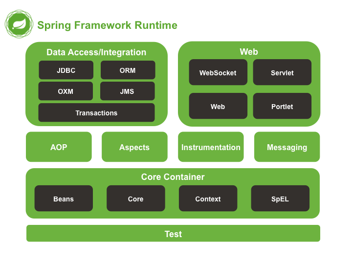
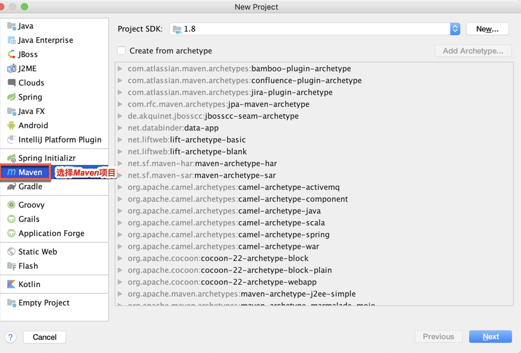
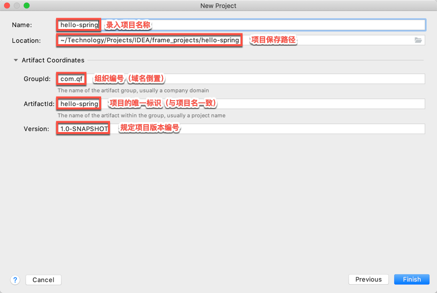
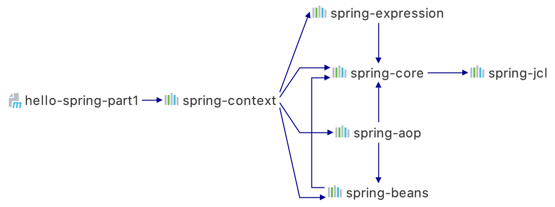
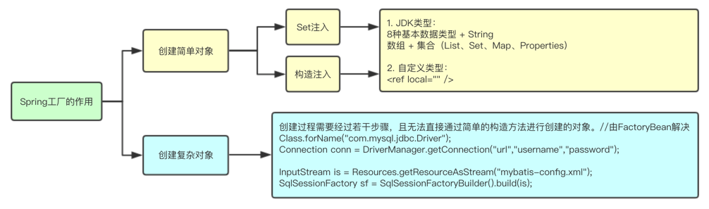
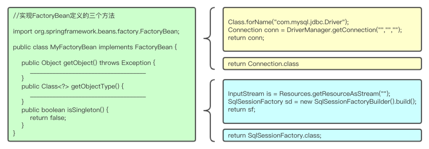
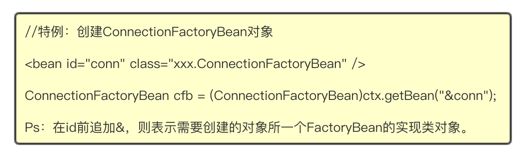
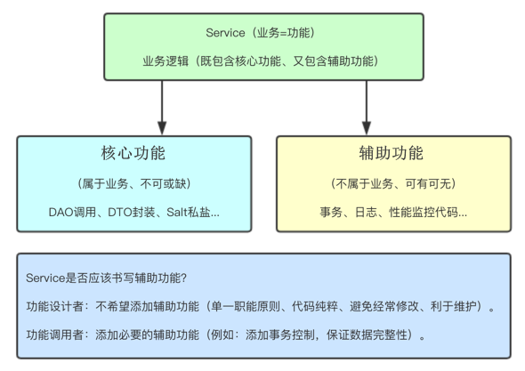
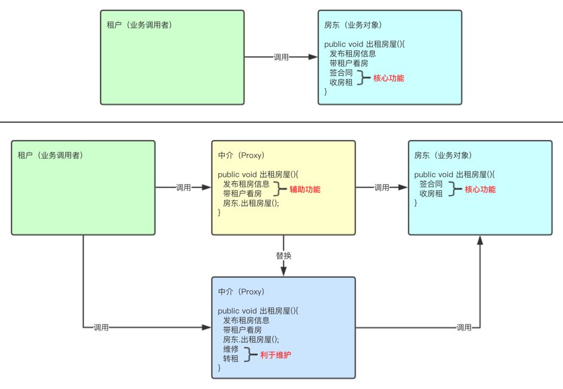
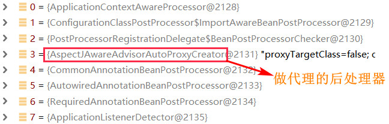

# 一、引言

------

## 1.1 原生web开发中存在哪些问题？

-  传统Web开发存在硬编码所造成的过度程序耦合（例如：Service中作为属性Dao对象）。 
-  部分Java EE API较为复杂，使用效率低（例如：JDBC开发步骤）。 
-  侵入性强，移植性差（例如：DAO实现的更换，从Connection到SqlSession）。 

# 二、Spring框架

------

## 2.1 概念

-  Spring是一个项目管理框架，同时也是一套Java EE解决方案。 
-  Spring是众多优秀设计模式的组合（工厂、单例、代理、适配器、包装器、观察者、模板、策略）。 
-  Spring并未替代现有框架产品，而是将众多框架进行有机整合，简化企业级开发，俗称"胶水框架"。 

## 2.2 访问与下载

官方网站：https://spring.io/

下载地址：http://repo.spring.io/release/org/springframework/spring/


# 三、Spring架构组成

------

Spring架构由诸多模块组成，可分类为\

- 核心技术：依赖注入，事件，资源，i18n，验证，数据绑定，类型转换，SpEL，AOP。
- 测试：模拟对象，TestContext框架，Spring MVC测试，WebTestClient。
- 数据访问：事务，DAO支持，JDBC，ORM，封送XML。
- Spring MVC和 Spring WebFlux Web框架。
- 集成：远程处理，JMS，JCA，JMX，电子邮件，任务，调度，缓存。
- 语言：Kotlin，Groovy，动态语言。

| Spring架构组成                                               |
| ------------------------------------------------------------ |
|  |

| **GroupId**         | **ArtifactId**           | **说明**                                       |
| ------------------- | ------------------------ | ---------------------------------------------- |
| org.springframework | spring-beans             | Beans 支持，包含 Groovy                        |
| org.springframework | spring-aop               | 基于代理的AOP支持                              |
| org.springframework | spring-aspects           | 基于AspectJ 的切面                             |
| org.springframework | spring-context           | 应用上下文运行时，包括调度和远程抽象           |
| org.springframework | spring-context-support   | 支持将常见的第三方类库集成到 Spring 应用上下文 |
| org.springframework | spring-core              | 其他模块所依赖的核心模块                       |
| org.springframework | spring-expression        | Spring 表达式语言，SpEL                        |
| org.springframework | spring-instrument        | JVM 引导的仪表（监测器）代理                   |
| org.springframework | spring-instrument-tomcat | Tomcat 的仪表（监测器）代理                    |
| org.springframework | spring-jdbc              | 支持包括数据源设置和 JDBC 访问支持             |
| org.springframework | spring-jms               | 支持包括发送/接收JMS消息的助手类               |
| org.springframework | spring-messaging         | 对消息架构和协议的支持                         |
| org.springframework | spring-orm               | 对象/关系映射，包括对 JPA 和 Hibernate 的支持  |
| org.springframework | spring-oxm               | 对象/XML 映射（Object/XML Mapping，OXM）       |
| org.springframework | spring-test              | 单元测试和集成测试支持组件                     |
| org.springframework | spring-tx                | 事务基础组件，包括对 DAO 的支持及 JCA 的集成   |
| org.springframework | spring-web               | web支持包，包括客户端及web远程调用             |
| org.springframework | spring-webmvc            | REST web 服务及 web 应用的 MVC 实现            |
| org.springframework | spring-webmvc-portlet    | 用于 Portlet 环境的MVC实现                     |
| org.springframework | spring-websocket         | WebSocket 和 SockJS 实现，包括对 STOMP 的支持  |
| org.springframework | spring-jcl               | Jakarta Commons Logging 日志系统               |

# 四、自定义工厂

------

## 4.1 配置文件

```plain
userDAO=com.qf.dao.UserDAOImpl
userService=com.qf.service.UserServiceImpl
```

作业：1、编写一个spring容器

​    2、阐述为什么使用spring

​    3、阐述什么三层架构，以及优缺点

​    4、spring框架里面技术。使用场景（举例说）

​    5、什么是ioc，并且举例

## 4.2 工厂类

```java
/**
 * 自定义工厂
 */
public class MyFactory {
    private Properties properties = new Properties();
    public MyFactory(){}
    public MyFactory(String config) throws IOException {
        // 加载配置文件
        properties.load(MyFactory.class.getResourceAsStream(config));
    }
    // 获取对象
    public Object getBean(String beanName) throws ClassNotFoundException, IllegalAccessException, InstantiationException {
        // 获得类路径
        String classPath = properties.getProperty(beanName);
        if(classPath!=null){
            Class claz = null;
            // 反射：加载类对象
            claz = Class.forName(classPath);
            // 反射：获得对象
            return claz.newInstance();
        }
        return null;
    }
}
```


# 五、构建Maven项目

------

## 5.1 新建项目

| 使用IDEA打开已创建的文件夹目录                               |
| ------------------------------------------------------------ |
|  |


## 5.2 选择Maven目录

| 选择创建常规的Maven项目                                      |
| ------------------------------------------------------------ |
|  |


## 5.3 GAV坐标

| GAV坐标                                                      |
| ------------------------------------------------------------ |
|  |


# 六、Spring环境搭建

------

## 6.1 pom.xml中引入Spring常用依赖

```xml
<?xml version="1.0" encoding="UTF-8"?>
<project xmlns="http://maven.apache.org/POM/4.0.0"
         xmlns:xsi="http://www.w3.org/2001/XMLSchema-instance"
         xsi:schemaLocation=
         "http://maven.apache.org/POM/4.0.0 
          http://maven.apache.org/xsd/maven-4.0.0.xsd">
  
    <modelVersion>4.0.0</modelVersion>

    <groupId>com.qf</groupId>
    <artifactId>hello-spring</artifactId>
    <version>1.0-SNAPSHOT</version>

    <dependencies>
        <!-- Spring常用依赖 -->
        <dependency>
            <groupId>org.springframework</groupId>
            <artifactId>spring-context</artifactId>
            <version>5.1.6.RELEASE</version>
        </dependency>
    </dependencies>
</project>
```


## 6.2 创建Spring配置文件

resources下创建配置文件,  命名无限制，约定俗成命名有：spring-context.xml、applicationContext.xml、beans.xml

```xml
<?xml version="1.0" encoding="UTF-8"?>
<beans xmlns="http://www.springframework.org/schema/beans"
       xmlns:xsi="http://www.w3.org/2001/XMLSchema-instance"
       xsi:schemaLocation="http://www.springframework.org/schema/beans http://www.springframework.org/schema/beans/spring-beans.xsd">
   
</beans>
```


# 七、Spring工厂编码

------

定义目标Bean类型

```java
public class MyClass{
    public void show(){
        System.out.println("HelloWorld");
    }
}
```

spring-context.xml中的< beans >内部配置bean标签

```xml
<!-- 配置实例（id:“唯一标识”  class="需要被创建的目标对象全限定名"） -->
<bean id="mc" class="com.qf.spring.part1.factory.MyClass" />
```

调用Spring工厂API（ApplicationContext接口）

```java
public class TestFactory{
    /**
     * 程序中的对象都交由Spring的ApplicationContext工厂进行创建。
     */
    public static void main(String[] args){
        //1. 读取配置文件中所需创建的bean对象，并获得工厂对象
        ApplicationContext ctx = new ClassPathXmlApplicationContext("spring-context.xml");
        //2. 通过id获取bean对象
		MyClass mc = (MyClass) ctx.getBean("mc");
        //3. 使用对象
		mc.show();
    }
}
```


# 八、依赖与配置文件详解

------

Spring框架包含多个模块，每个模块各司其职，可结合需求引入相关依赖Jar包实现功能。


## 8.1 Spring依赖关系

| Spring常用功能的Jar包依赖关系                                |
| ------------------------------------------------------------ |
|  |


- 注意：Jar包彼此存在依赖，只需引入最外层Jar即可由Maven自动将相关依赖Jar引入到项目中。


## 8.2 schema


配置文件中的顶级标签中包含了语义化标签的相关信息

 

- xmlns：语义化标签所在的命名空间。
- xmlns:xsi：XMLSchema-instance 标签遵循Schema标签标准。
- xsi:schemaLocation：xsd文件位置，用以描述标签语义、属性、取值范围等。


# 九、IoC（Inversion of Control ）控制反转【`重点`】

------

**Inverse Of Controll：控制反转**

 

**反转了依赖关系的满足方式，由之前的自己创建依赖对象，变为由工厂推送。(变主动为被动，即反转)**

 

**解决了具有依赖关系的组件之间的强耦合，使得项目形态更加稳健**


## 9.1 项目中强耦合问题


```java
public class UserDAOImpl implements UserDAO{....}
```


```java
public class UserServiceImpl implements UserService {
    // !!!强耦合了UserDAOImpl!!!,使得UserServiceImpl变得不稳健!!
    private UserDAO userDAO= new UserDAOImpl();
    @Override
    public User queryUser() {
        return userDAO.queryUser();
    }
    ....
}
```


## 9.2 解决方案


```java
// 不引用任何一个具体的组件(实现类)，在需要其他组件的位置预留存取值入口(set/get)
public class UserServiceImpl implements UserService {
    // !!!不再耦合任何DAO实现!!!,消除不稳健因素!!
    private UserDAO userDAO；
    // 为userDAO定义set/get,允许userDAO属性接收spring赋值
    //Getters And Setters
    @Override
    public User queryUser() {
        return userDAO.queryUser();
    }
    ....
}
```


```xml
<bean id="userDAO" class="com.qf.spring.part1.injection.UserDaoImpl"></bean>
<!-- UserServiceImpl组件 -->
<bean id="userService" class="com.qf.spring.part1.injection.UserServiceImpl">
    <!-- 由spring为userDAO属性赋值，值为id="userDAO"的bean -->
    <property name="userDAO" ref="userDAO"/>  ref 制定的是对象
</bean>
```


此时，如果需要更换其他UserDAO实现类，则UserServiceImpl不用任何改动！

 

则此时的UserServiceImpl组件变得更加稳健！


# 十、DI（Dependency Injection）依赖注入【`重点`】

------

## 10.1 概念


在Spring创建对象的同时，为其属性赋值，称之为依赖注入。


## 10.2 Set注入


创建对象时，Spring工厂会通过Set方法为对象的属性赋值。


### 10.2.1 定义目标Bean类型


```java
public class User {
    private Integer id;
    private String password;
    private String sex;
    private Integer age;
    private Date bornDate;
    private String[] hobbys;
    private Set<String> phones;
    private List<String> names;
    private Map<String,String> countries;
    private Properties files;
    //Getters And Setters
}
```


### 10.2.2 基本类型 + 字符串类型 + 日期类型


```xml
<bean id="u1" class="com.qf.spring.part1.injection.User">
    <!--base field-->
    <property name="id" value="1001" />
    <property name="password" value="123456" />
    <property name="sex" value="male" />
    <property name="age" value="20" />
    <property name="bornDate" value="1990/1/1" /><!--注意格式"/"-->
</bean>
```


### 10.2.3 容器类型


```xml
<bean id="u1" class="com.qf.spring.part1.injection.User">	
	<!--Array-->
    <property name="hobbys">
        <array>
            <value>Run</value>
            <value>Swim</value>
            <value>Climb</value>
        </array>
    </property>

    <!--Set-->
    <property name="phones">
        <set>
            <value>13777777777</value>
            <value>13888888888</value>
            <value>13999999999</value>
        </set>
    </property>

    <!--List-->
    <property name="names">
        <list>
            <value>tom</value>
            <value>jack</value>
            <value>marry</value>
        </list>
    </property>

    <!--Map-->
    <property name="countries">
        <map>
            <entry key="CN" value="China" />
            <entry key="US" value="America" />
            <entry key="KR" value="Korea" />
        </map>
    </property>
    
    <!--Properties-->
    <property name="files">
        <props>
            <prop key="first">One</prop>
            <prop key="second">Two</prop>
            <prop key="third">Three</prop>
        </props>
    </property>
</bean>
```


### 10.2.4 自建类型


```xml
<!--次要bean，被作为属性-->
<bean id="addr" class="com.qf.spring.part1.injection.Address">
    <property name="position" value="北京市海淀区" />
    <property name="zipCode" value="100001" />
</bean>

<!--主要bean，操作的主体-->
<bean id="u2" class="com.qf.spring.part1.injection.User">
    <property name="address" ref="addr" /><!--address属性引用addr对象-->
</bean>
```


```xml
<!--次要bean，被作为属性-->
<bean id="userDao" class="com.qf.spring.part1.injection.UserDaoImpl" />

<!--主要bean，操作的主体-->
<bean id="userService" class="com.qf.spring.part1.injection.UserServiceImpl">
    <property name="ud" ref="userDao" /><!--ud属性引用userDao对象-->
</bean>
```


## 10.3 构造注入【了解】


创建对象时，Spring工厂会通过构造方法为对象的属性赋值。


### 10.3.1 定义目标Bean类型


```java
public class Student {
    private Integer id;
    private String name;
    private String sex;
    private Integer age;
  
    //Constructors
  	public Student(Integer id , String name , String sex , Integer age){
      	this.id = id;
    	this.name = name;
  	    this.sex = sex;
	    this.age = age;
    }
}
```


### 10.3.2 注入


```xml
<!--构造注入-->
<bean id="u3" class="com.qf.zcg.spring.day1.t2.ioc.Student">
    <constructor-arg name="id" value="1234" /> <!-- 除标签名称有变化，其他均和Set注入一致 -->
    <constructor-arg name="name" value="tom" />
    <constructor-arg name="age" value="20" />
    <constructor-arg name="sex" value="male" />
</bean>
```


## 10.4 自动注入【重点】


不用在配置中 指定为哪个属性赋值，及赋什么值.

 

由spring自动根据某个 "原则" ，在工厂中查找一个bean，为属性注入属性值

原则：1 根据类型注入

​     2 根据属性名注入


```java
public class UserServiceImpl implements UserService {
    private UserDAO userDAO；
    //Getters And Setters
    ....
}
```


```xml
<bean id="userDao" class="com.qf.spring.part1.injection.UserDaoImpl" />
<!-- 为UserServiceImpl中的属性基于类型自动注入值 -->
<bean id="userService" class="com.qf.spring.part1.injection.UserServiceImpl" autowire="byType"></bean>
```


```xml
<bean id="userDao" class="com.qf.spring.part1.injection.UserDaoImpl" />
<!-- 为UserServiceImpl中的属性基于类型自动注入值 -->
<bean id="userService" class="com.qf.spring.part1.injection.UserServiceImpl" autowire="byName"></bean>
```


```xml
<?xml version="1.0" encoding="UTF-8"?>
<beans xmlns="http://www.springframework.org/schema/beans"
       xmlns:xsi="http://www.w3.org/2001/XMLSchema-instance"
       xsi:schemaLocation="http://www.springframework.org/schema/beans http://www.springframework.org/schema/beans/spring-beans.xsd">
    <bean id="mySpring" class="com.qf.MySpring" autowire="byType" >
<!--        <property name="mySpringDao" ref="mySpringDao"></property>-->

    </bean>
    <bean id="mySpringDao" class="com.qf.MySpringDao">
    </bean>

    <!--我们自己 采用的set注入依赖-->
    <bean id="user" class="com.qf.entity.User">
        <property name="id" value="1"/>
        <property name="password" value="123456"/>
        <property name="sex" value="女"/>
        <property name="age" value="30"/>
        <property name="bornDate" value="2021/10/18 16:39:40"/>
        <property name="hobbys">
            <array>
                <value>洗脚</value>
                <value>按摩</value>
                <value>洗澡</value>
            </array>
        </property>
        <property name="phones">
            <set>
                <value>1234567</value>
                <value>87654321</value>
                <value>023-444444</value>
            </set>
        </property>

        <property name="names">
            <list>
                <value>张三</value>
                <value>李四</value>
                <value>王麻子</value>
            </list>
        </property>

        <property name="countries">
            <map>
                <entry key="zh" value="中国"></entry>
                <entry key="us" value="美国"></entry>
                <entry key="jp" value="日本"></entry>
            </map>
        </property>

        <property name="files">
            <props>
                <prop key="java">spring</prop>
                <prop key="php">phpadmin</prop>
            </props>
        </property>

        <property name="mySpringDao" ref="mySpringDao"></property>

    </bean>

    <!--苍老师 采用的构造器注入依赖-->
    <bean id="sud" class="com.qf.entity.Student">
        <constructor-arg name="id" value="12"/>
        <constructor-arg name="age" value="20"/>
        <constructor-arg name="name" value="苍老师"/>
        <constructor-arg name="sex" value="女"></constructor-arg>
    </bean>


</beans>
```


**小结作业：**

**1、阐述spring框架使用的原因？以及解决的项目问题？**

**2、讲解什么是IOC，用JAVA 基础代码实现原理，并且用spring实现代码逻辑，把单例模式加入到工厂里面去（getBean）（不做）**

**3、阐述xml bean标签 作用和各个属性的使用.**

**4、使用set注入实现基本类型和对象类型的注入**

**5、使用构造方法采用代码注入对象**

**6、阐述Ioc和DI的关系。**

**7、自动注入的区别？**

**8、编写共享单车app（mybatis+spring+sevlet+ajax）需要掉百度地图**


# 十一、Bean细节

------

## 11.1 控·制简单对象的单例、多例模式（new）


配置< bean scope="singleton | prototype" />


```xml
<!--
	singleton（默认）：每次调用工厂，得到的都是同一个对象。
	prototype：每次调用工厂，都会创建新的对象。
-->
<bean id="mc" class="com.qf.zcg.spring.day1.t1.basic.MyClass" scope="singleton" /> 
```


- 注意：需要根据场景决定对象的单例、多例模式。
- 可以共用：Service、DAO、SqlSessionFactory（或者是所有的工厂）。
- 不可共用：Connection、SqlSession、ShoppingCart。


优缺点：

单例模式：对象的创建，只需要创建一次，节约我们内存空间，速度飞快，线程不安全。（volidate） （即时加载）


多例模式：线程安全，每次使用对象的时候才创建，速度慢，内存消耗大（延迟加载）


## 11.2 FactoryBean创建复杂对象【重点】


作用：让Spring可以创建复杂对象、或者无法直接通过反射创建的对象。

| FactoryBean解决复杂对象创建                                  |
| ------------------------------------------------------------ |
|  |


### 11.2.1 实现FactoryBean接口

| 接口方法描述                                                 |
| ------------------------------------------------------------ |
|  |


- 注意：isSingleton方法的返回值，需根据所创建对象的特点决定返回true/false。
- 例如：Connection 不应该被多个用户共享，返回false。
- 例如：SqlSessionFactory 重量级资源，不该过多创建，返回true。


### 11.2.2 配置spring-context.xml

| 配置与获取方式                                               |
| ------------------------------------------------------------ |
|  |


### 11.2.3 特例

| 获取FactoryBean接口的实现类对象，而非getObject()所生产的对象。 |
| ------------------------------------------------------------ |
|  |


# 十二、Spring工厂特性

------

## 12.1 饿汉式创建优势


工厂创建之后，会将Spring配置文件中的所有对象都创建完成（饿汉式）。

 

提高程序运行效率。避免多次IO，减少对象创建时间。（概念接近连接池，一次性创建好，使用时直接获取）


## 12.2 生命周期方法


 

-  自定义初始化方法：添加“init-method”属性，Spring则会在创建对象之后，调用此方法。 
-  自定义销毁方法：添加“destroy-method”属性，Spring则会在销毁对象之前，调用此方法。 
-  销毁：工厂的close()方法被调用之后，Spring会毁掉所有已创建的单例对象。 
-  分类：Singleton对象由Spring容器销毁、Prototype对象由JVM销毁。 

 


## 12.3 生命周期注解


初始化注解、销毁注解


```java
import javax.annotation.PostConstruct;
import javax.annotation.PreDestroy;

@PostConstruct //初始化 
public void init(){
    System.out.println("init method executed");
}

@PreDestroy //销毁
public void destroy(){
    System.out.println("destroy method executed");
}
```


## 12.4 生命周期阶段（面试重点）


**单例bean：**singleton

 

随工厂启动创建 ==》  构造方法  ==》 set方法(注入值)  ==》 init(初始化)  ==》 构建完成 ==》随工厂关闭销毁


**多例bean：**prototype

 

被使用时创建 ==》  构造方法  ==》 set方法(注入值)  ==》 init(初始化)  ==》 构建完成 ==》JVM垃圾回收销毁

作业:升级我们 单车app 和 东郊app 把mybatis拉入spring管理 只能用 factorybean


十三、代理设计模式

------

## 13.1 概念


将核心功能与辅助功能（事务、日志、性能监控代码）分离，达到核心业务功能更纯粹、辅助业务功能可复用。

| 功能分离                                                     |
| ------------------------------------------------------------ |
|  |


## 13.2 静态代理设计模式


通过代理类的对象，为原始类的对象（目标类的对象）添加辅助功能，更容易更换代理实现类、利于维护。

| 静态代理                                                     |
| ------------------------------------------------------------ |
|  |


- 代理类 = 实现原始类相同接口 + 添加辅助功能 + 调用原始类的业务方法。
- 静态代理的问题 

- - 代理类数量过多，不利于项目的管理。
  - 多个代理类的辅助功能代码冗余，修改时，维护性差。


作业：共享单车添加日志


## 13.3 动态代理设计模式 (jdk cglab)


动态创建代理类的对象，为原始类的对象添加辅助功能。


### 13.3.1 JDK动态代理实现（基于接口）


```java
 final Car car = new CarFactory();// 目标
        //匿名内部类
        //额外功能
        InvocationHandler  invocationHandler = new InvocationHandler() {
            @Override
            public Object invoke(Object proxy, Method method, Object[] args) throws Throwable {
                System.out.println("送车模");
                Object invoke = method.invoke(car, args);//用反射执行类里面方法，方法的参数
                System.out.println("送保养");
                return invoke;
            }
        };

        Car obj = (Car)Proxy.newProxyInstance(DynamicProxy.class.getClassLoader(), new Class[]{Car.class}, invocationHandler);
        System.out.println(obj.car());
```


### 13.3.2 CGlib动态代理实现（基于继承）


```java
final OrderService os = new OrderServiceImpl();
Enhancer cnh = new Enhancer();//1.创建字节码曾强对象
enh.setSuperclass(os.getClass());//2.设置父类（等价于实现原始类接口）
enh.setCallback(new InvocationHandler(){//3.设置回调函数（额外功能代码）
    @Override
    public Object invoke(Object proxy , Method method, Object[] args) throws Throwable{
        System.out.println("start...");
        Object ret = method.invoke(os,args);
        System.out.println("end...");
        return ret;
    }
});
OrderService proxy = (OrderService)enh.create();//4.创建动态代理类
proxy,createOrder();
```


# 十四、面向切面编程【`重点`】

------

## 14.1 概念


AOP（Aspect Oriented Programming），即面向切面编程，利用一种称为"横切"的技术，剖开封装的对象内部，并将那些影响了多个类的公共行为封装到一个可重用模块，并将其命名为"Aspect"，即切面。所谓"切面"，简单说就是那些与业务无关，却为业务模块所共同调用的逻辑或责任封装起来，便于减少系统的重复代码，降低模块之间的耦合度，并有利于未来的可操作性和可维护性。


## 14.2 AOP开发术语


 

-  连接点(Joinpoint)：连接点是程序类中客观存在的方法，可被Spring拦截并切入内容。 （需要解决问题的方法）
-  切入点(Pointcut)：被Spring切入连接点。(我们需要切入规则定义) 
-  通知、增强(Advice)：可以为切入点添加额外功能，分为：前置通知、后置通知、异常通知、环绕通知等。（新增或者删除、修改功能） 
-  目标对象(Target)：代理的目标对象 （需要处理的类）
-  引介(Introduction)：一种特殊的增强，可在运行期为类动态添加Field和Method。（自己封装的方法） 
-  织入(Weaving)：把通知应用到具体的类，进而创建新的代理类的过程。（编写 我们的额外功能方法过程） 
-  代理(Proxy)：被AOP织入通知后，产生的结果类。（动态生产的代理类） 
-  切面(Aspect)：由切点和通知组成，将横切逻辑织入切面所指定的连接点中。 

 


## 14.3 作用


Spring的AOP编程即是通过动态代理类为原始类的方法添加辅助功能。


## 14.4 环境搭建


引入AOP相关依赖


```xml
<dependency>
    <groupId>org.springframework</groupId>
    <artifactId>spring-aspects</artifactId>
    <version>5.1.6.RELEASE</version>
</dependency>
```


spring-context.xml引入AOP命名空间


```plain
xmlns:aop="http://www.springframework.org/schema/aop"

http://www.springframework.org/schema/aop
http://www.springframework.org/schema/aop/spring-aop.xsd
```


```xml
<?xml version="1.0" encoding="UTF-8"?>
<beans xmlns="http://www.springframework.org/schema/beans"
       xmlns:context="http://www.springframework.org/schema/context"
       xmlns:aop="http://www.springframework.org/schema/aop"
       xmlns:xsi="http://www.w3.org/2001/XMLSchema-instance"
       xsi:schemaLocation="
       http://www.springframework.org/schema/beans
       http://www.springframework.org/schema/beans/spring-beans.xsd
       http://www.springframework.org/schema/aop
       http://www.springframework.org/schema/aop/spring-aop.xsd
       ">
</beans>
```


## 14.5 开发流程


定义原始类


```java
package com.qf.aaron.aop.basic;

public interface UserService {
    public void save();
}
```


```java
package com.qf.aaron.aop.basic;

public class UserServiceImpl implements UserService {
    public void save() {
        System.out.println("save method executed...");
    }
}
```


定义通知类（添加额外功能）


```java
package com.qf.aaron.aop.basic;
import org.springframework.aop.MethodBeforeAdvice;
import java.lang.reflect.Method;

public class MyAdvice implements MethodBeforeAdvice { //实现前置通知接口
    public void before(Method method, Object[] args, Object target) throws Throwable {
        System.out.println("before advice executed...");
    }
}
```


定义bean标签


```xml
<!--原始对象-->
<bean id="us" class="com.qf.aaron.aop.basic.UserServiceImpl" />

<!--辅助对象-->
<bean id="myAdvice" class="com.qf.aaron.aop.basic.MyAdvice" />
```


定义切入点（PointCut）

 

形成切面（Aspect）


```xml
<aop:config>
    <!--切点-->
    <aop:pointcut id="myPointCut" expression="execution(* save())" />
</aop:config>
```


```xml
<aop:config>
    <!--组装切面 -->
    <aop:advisor advice-ref="myAdvice" pointcut-ref="myPointCut" />
</aop:config>
```


## 14.6 AOP小结


 

-  通过AOP提供的编码流程，更便利的定制切面，更方便的定制了动态代理。 
-  进而彻底解决了辅助功能冗余的问题； 
-  业务类中职责单一性得到更好保障； 
-  辅助功能也有很好的复用性。 

 


## 14.7 通知类【可选】


定义通知类，达到通知效果


```java
前置通知：MethodBeforeAdvice

后置通知：AfterAdvice

后置通知：AfterReturningAdvice //有异常不执行，方法会因异常而结束，无返回值

异常通知：ThrowsAdvice  异常通知需要我的自己编写一个方法
    //异常通知
    public void afterThrowing(Method method, Object[] args, Object target, Exception ex) {
        System.out.println("异常消息");
    }

环绕通知：MethodInterceptor
    
    @Override
    public Object invoke(MethodInvocation methodInvocation) throws Throwable {
        System.out.println("加入前列消息");
        methodInvocation.getMethod().invoke(new UserService(),null);
        System.out.println("加入后列消息");
        return null;
    }
```

注：AfterAdvice  其下有两个子接口：AfterReturningAdvice 和 ThrowsAdvice

AfterReturningAdvice  没有出现异常的时候正常打印通知，如果出现异常，通知失效。

ThrowsAdvice 只有发生异常的时候才生效，正常代码通知失效。

如果我们实现 ThrowsAdvice 里面，必须写连名字都一样afterThrowing方法


```java
public class AopProxyAfter implements AfterReturningAdvice {
    private Logger logger = Logger.getLogger(AopProxy.class);
    @Override
    public void afterReturning(Object o, Method method, Object[] objects, Object o1) throws Throwable {
        logger.debug("this is after advice");
    }
}

//注：异常通知没有方法，需要我们自己编写一个方法
public class AopThrowsAdvice implements ThrowsAdvice {
    private Logger logger = Logger.getLogger(AopProxy.class);
    //异常通知
    public void afterThrowing(Method method, Object[] args, Object target, Exception ex) {
        logger.debug("this is exception advice");
    }
}
<!--目标对象-->
<bean id="userService" class="com.qf.service.UserService" />

<bean id="userDao" class="com.qf.dao.UserDao" />
<!--辅助对象-->
<bean id="aopProxy" class="com.qf.config.AopProxy" />

<bean id="aopProxyAfter" class="com.qf.config.AopProxyAfter" />

<bean id="aopThrowsAdvice" class="com.qf.config.AopThrowsAdvice" />

<aop:config>
  <!--id=随便取名，保持唯一就可以，expression-方法exuction  配置就是规则 -->
  <aop:pointcut id="myPointCut" expression="execution(* save())" />
  
  <!--组装我的切面，切点和额外功能  就成为我的 切面-->
  <aop:advisor advice-ref="aopThrowsAdvice" pointcut-ref="myPointCut" />
  
  <aop:advisor advice-ref="aopProxyAfter" pointcut-ref="myPointCut" />
    </aop:config>
```

## 14.8 通配切入点


根据表达式通配切入点  作业1

execution(* save())


public   void  add(参数)-- 修饰符  返回值 方法名 参数


```xml
<!--匹配参数-->
<aop:pointcut id="myPointCut" expression="execution(* *(com.qf.aaron.aop.basic.User))" />
<!--匹配方法名（无参）-->
<aop:pointcut id="myPointCut" expression="execution(* save())" />
<!--匹配方法名（任意参数）-->
<aop:pointcut id="myPointCut" expression="execution(* save(..))" />
<!--匹配返回值类型-->
<aop:pointcut id="myPointCut" expression="execution(com.qf.aaron.aop.basic.User *(..))" />
<!--匹配类名-->
<aop:pointcut id="myPointCut" expression="execution(* com.qf.aaron.aop.basic.UserServiceImpl.*(..))" />
<!--匹配包名-->
<aop:pointcut id="myPointCut" expression="execution(* com.qf.aaron.aop.basic.*.*(..))" />
<!--匹配包名、以及子包名-->
<aop:pointcut id="myPointCut" expression="execution(* com.qf.aaron.aop..*.*(..))" />
```


## 14.9 JDK和CGLIB选择


 

-  spring底层，包含了jdk代理和cglib代理两种动态代理生成机制 
-  基本规则是：目标业务类如果有接口则用JDK代理，没有接口则用CGLib代理 

 


```java
class DefaultAopProxyFactory{
    // 该方法中明确定义了 JDK代理和CGLib代理的选取规则
    // 基本规则是：目标业务类如果有接口则用JDK代理，没有接口则用CGLib代理
    public AopProxy createAopProxy(){...}
}
```


## 14.10 后处理器


 

-  spring中定义了很多后处理器； 
-  每个bean在创建完成之前 ，都会有一个后处理过程，即再加工，对bean做出相关改变和调整； 
-  spring-AOP中，就有一个专门的后处理器，负责通过原始业务组件(Service),再加工得到一个代理组件。 

 

| 常用后处理器                                                 |
| ------------------------------------------------------------ |
|  |


### 14.10.1 后处理器定义


```java
/**
 * 定义bean后处理器
 * 作用：在bean的创建之后，进行再加工
 */
public class MyBeanPostProcessor implements BeanPostProcessor{

    /**
     * 在bean的init方法之前执行
     * @param bean  原始的bean对象
     * @param beanName
     * @return
     * @throws BeansException
     */
    public Object postProcessBeforeInitialization(Object bean, String beanName) throws BeansException {
        System.out.println("后处理器 在init之前执行~~~"+bean.getClass());
        return bean;
    }
	/**
     * 在bean的init方法之后执行
     * @param bean  postProcessBeforeInitialization返回的bean
     * @param beanName
     * @return
     * @throws BeansException
     */
    @Override
    public Object postProcessAfterInitialization(Object bean, String beanName) throws BeansException {
        System.out.println("后处理器 在init之后执行~~~"+bean.getClass());
        return bean;// 此处的返回是 getBean() 最终的返回值
    }
}
```


### 14.10.2 配置后处理器


```xml
<!-- 配置后处理器,将对工厂中所有的bean声明周期进行干预 -->
<bean class="com.qianfeng.beanpostprocessor.MyBeanPostProcessor"></bean>
```


### 14.10.3 bean生命周期


构造 》 注入属性 满足依赖 》 后处理器前置过程  》 初始化  》后处理器后置过程 》 返回 》 销毁


### 14.10.4 动态代理源码(了解)


```java
// AbstractAutoProxyCreator是 AspectJAwareAdvisorAutoProxyCreator的父类
// 该后处理器类中的 wrapIfNecessary方法即动态代理生成过程
AbstractAutoProxyCreator#postProcessAfterInitialization(Object bean, String beanName){
    if (!this.earlyProxyReferences.contains(cacheKey)) {
        // 开始动态定制代理
        return wrapIfNecessary(bean, beanName, cacheKey);
   	}
}
```

作业：1 编写静态代理、动态代理（jdk cglib），并且阐述代理（静态和动态异同）的优缺点与使用场景

2、阐述什么是aop，aop里面是术语 到底是什么意思？

3、用aop编写 动态日志输入 debug


# 十五、Spring + MyBatis【`重点`】

------

#15.1 配置数据源


将数据源配置到项目中


### 15.1.1 引入jdbc.properties配置文件


```properties
#jdbc.properties
jdbc.driverClass=com.mysql.jdbc.Driver
jdbc.url=jdbc:mysql://localhost:3306/mydb?useUnicode=true&characterEncoding=UTF-8
jdbc.username=root
jdbc.password=123456
```


### 15.1.2 整合Spring配置文件和properties配置文件


```xml
<!--spring-context.xml-->
<?xml version="1.0" encoding="UTF-8"?>
<beans xmlns="http://www.springframework.org/schema/beans"
       xmlns:context="http://www.springframework.org/schema/context"
       xmlns:xsi="http://www.w3.org/2001/XMLSchema-instance"
       xsi:schemaLocation="
       http://www.springframework.org/schema/beans
       http://www.springframework.org/schema/beans/spring-beans.xsd
       http://www.springframework.org/schema/context
       http://www.springframework.org/schema/context/spring-context.xsd
       ">

    <!--配置文件参数化（参数占位符）-->
	<context:property-placeholder location="classpath:jdbc.properties" />
    
    <!--与PooledDataSource集成（二选一）-->
    <bean id="dataSource" class="org.apache.ibatis.datasource.pooled.PooledDataSource">
        <property name="driver" value="${driverClass}"/>
        <property name="url" value="${url}"/>
        <property name="username" value="${username}"/>
        <property name="password" value="${password}"/>
    </bean>

    <!--与DruidDataSource集成（二选一）-->
    <bean id="dataSource" class="com.alibaba.druid.pool.DruidDataSource" init-method="init" destroy-method="close">
        <!--基本配置-->
        <property name="driverClassName" value="${jdbc.driverClass}"/>
        <property name="url" value="${jdbc.url}"/>
        <property name="username" value="${jdbc.username}"/>
        <property name="password" value="${jdbc.password}"/>
    </bean>
</bean>
```


### 15.1.3 Druid连接池可选参数


```xml
<bean id="dataSource" class="com.alibaba.druid.pool.DruidDataSource" init-method="init" destroy-method="close">
    <!--基本配置-->
    <property name="driverClassName" value="${jdbc.driverClass}"/>
    <property name="url" value="${jdbc.url}"/>
    <property name="username" value="${jdbc.username}"/>
    <property name="password" value="${jdbc.password}"/>

    <!-- 配置初始化大小、最小、最大 -->
    <property name="initialSize" value="${jdbc.init}"/>
    <property name="minIdle" value="${jdbc.minIdle}"/>
    <property name="maxActive" value="${jdbc.maxActive}"/>

    <!-- 配置获取连接等待超时的时间 -->
    <property name="maxWait" value="60000"/>

    <!-- 配置间隔多久才进行一次检测，检测需要关闭的空闲连接，单位是毫秒 -->
    <property name="timeBetweenEvictionRunsMillis" value="60000"/>

    <!-- 配置一个连接在池中最小生存的时间，单位是毫秒 -->
    <property name="minEvictableIdleTimeMillis" value="300000"/>
</bean>
```


### 15.1.4 Druid监控中心


```xml
<!--web.xml-->
<servlet>
    <servlet-name>DruidStatView</servlet-name>
    <servlet-class>com.alibaba.druid.support.http.StatViewServlet</servlet-class>
</servlet>
<servlet-mapping>
    <servlet-name>DruidStatView</servlet-name>
    <url-pattern>/druid/*</url-pattern>
</servlet-mapping>
```


### 15.1.5 测试监控中心


配置tomcat，并访问protocol://ip:port/project/druid/index.html


http://localhost:83/spring/druid/api.html


## 15.2 整合MyBatis


将 SqlSessionFactory、DAO、Service 配置到项目中


### 15.2.1 导入依赖


```xml
  <dependencies>
    <!-- Spring常用依赖 -->
    <dependency>
      <groupId>org.springframework</groupId>
      <artifactId>spring-context</artifactId>
      <version>5.1.6.RELEASE</version>
    </dependency>

    <dependency>
      <groupId>org.springframework</groupId>
      <artifactId>spring-aspects</artifactId>
      <version>5.1.6.RELEASE</version>
    </dependency>

    <!-- spring-jdbc -->
    <dependency>
      <groupId>org.springframework</groupId>
      <artifactId>spring-jdbc</artifactId>
      <version>5.1.6.RELEASE</version>
    </dependency>

    <!-- spring+mybatis集成依赖 -->
    <dependency>
      <groupId>org.mybatis</groupId>
      <artifactId>mybatis-spring</artifactId>
      <version>1.3.1</version>
    </dependency>

    <dependency>
      <groupId>junit</groupId>
      <artifactId>junit</artifactId>
      <version>4.13</version>
      <scope>test</scope>
    </dependency>

    <!--MyBatis核心依赖-->
    <dependency>
      <groupId>org.mybatis</groupId>
      <artifactId>mybatis</artifactId>
      <version>3.4.6</version>
    </dependency>

    <!--MySql驱动依赖-->
    <dependency>
      <groupId>mysql</groupId>
      <artifactId>mysql-connector-java</artifactId>
      <version>5.1.47</version>
    </dependency>

    <dependency>
      <groupId>log4j</groupId>
      <artifactId>log4j</artifactId>
      <version>1.2.17</version>
    </dependency>

    <dependency>
      <groupId>org.projectlombok</groupId>
      <artifactId>lombok</artifactId>
      <version>1.18.24</version>
    </dependency>

    <dependency>
      <groupId>com.alibaba</groupId>
      <artifactId>fastjson</artifactId>
      <version>1.2.75</version>
    </dependency>

    <dependency>
      <groupId>com.alibaba</groupId>
      <artifactId>druid</artifactId>
      <version>1.1.16</version>
    </dependency>
  </dependencies>
```


### 15.2.2 配置SqlSessionFactory


```xml
<!-- 工厂bean：生成SqlSessionFactory -->
<bean id="sqlSessionFactory" class="org.mybatis.spring.SqlSessionFactoryBean">
    <!-- 注入连接池 -->
    <property name="dataSource" ref="dataSource"></property>
    <!-- 注入dao-mapper文件信息 ,如果映射文件和dao接口 同包且同名，则此配置可省略-->
    <property name="mapperLocations">
        <list>
            <value>classpath:com/qf/spring/dao/*.xml</value>
        </list>
    </property>
    <!-- 为 dao-mapper文件中的实体 定义缺省包路径 
		如：<select id="queryAll" resultType="User"> 中 User类可以不定义包
    -->
    <property name="typeAliasesPackage" value="com.qf.entity"></property>
</bean>
```


### 15.2.3 配置MapperScannerConfigurer


管理DAO实现类的创建，并创建DAO对象，存入工厂管理

 

-  扫描所有DAO接口,去构建DAO实现 
-  将DAO实现存入工厂管理 
-  DAO实现对象在工厂中的id是：“首字母小写的-接口的类名”，
  例如：UserDAO==>userDAO , OrderDAO==>orderDAO 

 


```xml
<!-- mapperScannerConfigurer -->
<bean id="mapperScannerConfigurer9" class="org.mybatis.spring.mapper.MapperScannerConfigurer">
   	<!-- dao接口所在的包  如果有多个包，可以用逗号或分号分隔 
  		<property name="basePackage" value="com.a.dao,com.b.dao"></property>
   	-->
    <property name="basePackage" value="com.qf.spring.dao"></property>
    <!-- 如果工厂中只有一个SqlSessionFactory的bean，此配置可省略 -->
    <property name="sqlSessionFactoryBeanName" value="sqlSessionFactory"></property>
</bean>
```


### 15.2.4 配置Service


```xml
<bean id="userService" class="com.qf.spring.service.UserServiceImpl">
    <!-- 注意ref中的值是对应DAO接口的首字母小写的接口名 -->
	<property name="userDAO" ref="userDAO"></property>
</bean>
```


# 十六、事务【`重点`】一切相关关系操作，串联成一个，要么都成功 要都失败

------

## 16.1 配置DataSourceTransactionManager


事务管理器，其中持有DataSource，可以控制事务功能（commit,rollback等）。


```xml
<!-- 1. 引入一个事务管理器，其中依赖DataSource,借以获得连接，进而控制事务逻辑 -->
<bean id="tx" class="org.springframework.jdbc.datasource.DataSourceTransactionManager">
    <property name="dataSource" ref="dataSource"></property>
</bean>
```


注意：DataSourceTransactionManager 和 SqlSessionFactoryBean 要注入同一个DataSource的Bean，否则事务控制失败!!!


\##16.2 配置事务通知


基于事务管理器，进一步定制，生成一个额外功能：Advice。

 

此Advice可以切入任何需要事务的方法，通过事务管理器为方法控制事务。


```xml
<tx:advice id="txManager" transaction-manager="tx">
	<tx:attributes>
        <!--<tx:method name="insertUser" rollback-for="Exception" isolation="DEFAULT"    
              	propagation="REQUIRED" read-only="false"/>-->
        <!-- 以User结尾的方法，切入此方法时，采用对应事务实行-->
        <tx:method name="*User" rollback-for="Exception"/>
        <!-- 以query开头的方法，切入此方法时，采用对应事务实行 -->
        <tx:method name="query*" propagation="SUPPORTS"/>
        <!-- 剩余所有方法 -->
        <tx:method name="*"/>
    </tx:attributes>
</tx:advice>
```


## 16.3 事务属性


### 16.3.1 隔离级别


## 16.3.1.1 概念


`isolation`  隔离级别

| 名称            | 描述                                                         |
| --------------- | ------------------------------------------------------------ |
| default         | (默认值）（采用数据库的默认的设置) （建议）  交给jdbc        |
| read-uncommited | 读未提交  （会发生脏读 ） （查询）                           |
| read-commited   | 读提交 （Oracle数据库默认的隔离级别）（不可重复读）（update） |
| repeatable-read | 可重复读	（MySQL数据库默认的隔离级别）（删除或者增加） 幻读 （delete 和 insert） |
| serialized-read | 序列化读                                                     |


隔离级别由低到高为：read-uncommited < read-commited < repeatable-read < serialized-read


## 16.3.1.2 特性


 

-  安全性：级别越高，多事务并发时，越安全。因为共享的数据越来越少，事务间彼此干扰减少。 
-  并发性：级别越高，多事务并发时，并发越差。因为共享的数据越来越少，事务间阻塞情况增多。 

 


## 16.3.1.3 并发问题


事务并发时的安全问题

| 问题       | 描述                                                         |
| ---------- | ------------------------------------------------------------ |
| 脏读       | 一个事务读取到另一个事务还未提交的数据。大于等于 read-commited 可防止 |
| 不可重复读 | 一个事务内多次读取一行数据的相同内容，其结果不一致。大于等于 repeatable-read 可防止 |
| 幻读       | 一个事务内多次读取一张表中的相同内容，其结果不一致。serialized-read 可防止 |


### 16.3.2 传播行为


`propagation`传播行为


当涉及到事务嵌套（Service调用Service）时，可以设置：

 

-  SUPPORTS = 不存在外部事务，则不开启新事务；存在外部事务，则合并到外部事务中。（适合查询） 
-  REQUIRED = 不存在外部事务，则开启新事务；存在外部事务，则合并到外部事务中。 (默认值)（适合增删改） 

 


### 16.3.3 读写性


`readonly` 读写性


 

-  true：只读，可提高查询效率。(适合查询) 
-  false：可读可写。 (默认值)（适合增删改） 

 


### 16.3.4 事务超时


`timeout`事务超时时间


当前事务所需操作的数据被其他事务占用，则等待。

 

- 100：自定义等待时间100（秒）。
- -1：由数据库指定等待时间，默认值。（建议）

 


### 16.3.5 事务回滚


`rollback-for`  回滚属性


 

-  如果事务中抛出 RuntimeException,则自动回滚 
-  如果事务中抛出 CheckException(非运行时异常 Exception)，不会自动回滚，而是默认提交事务 
-  处理方案 : 将CheckException转换成RuntimException上抛，或 设置 rollback-for="Exception" 

 


## 16.4 编织


将事务管理的Advice 切入需要事务的业务方法中


```xml
<aop:config>
	<aop:pointcut expression="execution(* com.qf.spring.service.UserServiceImpl.*(..))" id="pc"/>
    <!-- 组织切面 -->
    <aop:advisor advice-ref="txManager" pointcut-ref="pc"/>
</aop:config>
```


# 十七、注解开发

------

## 17.1 声明bean


用于替换自建类型组件的 <bean...>标签；可以更快速的声明bean


 

-  [@Service ]()  业务类专用 
  [@Repository ]()  dao实现类专用 
  [@Controller ]()  web层专用  
-  [@Component ]()  通用  
-  [@Scope ]()  用户控制bean的创建模式  

 


```java
// @Service说明 此类是一个业务类，需要将此类纳入工厂  等价替换掉 <bean class="xxx.UserServiceImpl">
// @Service默认beanId == 首字母小写的类名"userServiceImpl"
// @Service("userService") 自定义beanId为"userService"
@Service //声明bean，且id="userServiceImpl"
@Scope("singleton") //声明创建模式，默认为单例模式 ；@Scope("prototype")即可设置为多例模式
public class UserServiceImpl implements UserService {
 	...   
}
```


## 17.2 注入(DI)


用于完成bean中属性值的注入


 

- [@Autowired ]()  基于类型自动注入 
- [@Resource ]()   基于名称自动注入 
- @Qualifier("userDAO") 限定要自动注入的bean的id，一般和@Autowired联用
- [@Value ]() 注入简单类型数据 (jdk8种+String) 

 


```java
@Service
public class UserServiceImpl implements UserService {
    
    @Autowired //注入类型为UserDAO的bean
    @Qualifier("userDAO2") //如果有多个类型为UserDAO的bean，可以用此注解从中挑选一个
    private UserDAO userDAO;
}
```


```java
@Service
public class UserServiceImpl implements UserService {
    
	@Resource("userDAO3") //注入id=“userDAO3”的bean
    private UserDAO userDAO;
    /*
    @Resource //注入id=“userDAO”的bean
    private UserDAO userDAO;
    */
}
```


```java
public class XX{
    @Value("100") //注入数字
    private Integer id;
    @Value("shine") //注入String
	private String name;
}
```


## 17.3 事务控制


用于控制事务切入

 

-  [@Transactional ]()  
-  工厂配置中的 <tx:advice.... 和 <aop:config... 可以省略 !! 

 


```java
//类中的每个方法都切入事务(有自己的事务控制的方法除外)
@Transactional(isolation=Isolation.READ_COMMITTED,propagation=Propagation.REQUIRED,readOnly=false,rollbackFor=Exception.class,timeout = -1)
public class UserServiceImpl implements UserService {
	...
    //该方法自己的事务控制，仅对此方法有效
	@Transactional(propagation=Propagation.SUPPORTS)
	public List<User> queryAll() {
		return userDao.queryAll();
	}
	public void save(User user){
		userDao.save(user);
	}
}
```


## 17.4 注解所需配置


```xml
<!-- 告知spring，哪些包中 有被注解的类、方法、属性 -->
<!-- <context:component-scan base-package="com.qf.a,com.xx.b"></context:component-scan> -->
<context:component-scan base-package="com.qf"></context:component-scan>
	
<!-- 告知spring，@Transactional在定制事务时，基于txManager=DataSourceTransactionManager -->
<tx:annotation-driven transaction-manager="txManager"/>
```


## 17.5 AOP开发


### 17.5.1 注解使用


```java
import org.aspectj.lang.JoinPoint;
import org.aspectj.lang.ProceedingJoinPoint;
import org.aspectj.lang.annotation.AfterThrowing;
import org.aspectj.lang.annotation.Aspect;
import org.aspectj.lang.annotation.Pointcut;
import org.springframework.stereotype.Component;

@Aspect // 声明此类是一个切面类：会包含切入点(pointcut)和通知(advice)
@Component //声明组件，进入工厂
public class MyAspect {
    // 定义切入点
    @Pointcut("execution(* com.qf.spring.service.UserServiceImpl.*(..))")
    public void pc(){}
    
    @Before("pc()") // 前置通知
    public void mybefore(JoinPoint a) {
        System.out.println("target:"+a.getTarget());
        System.out.println("args:"+a.getArgs());
        System.out.println("method's name:"+a.getSignature().getName());
        System.out.println("before~~~~");
    }

    @AfterReturning(value="pc()",returning="ret") // 后置通知
    public void myAfterReturning(JoinPoint a,Object ret){
        System.out.println("after~~~~:"+ret);
    }
    
    @Around("pc()") // 环绕通知
    public Object myInterceptor(ProceedingJoinPoint p) throws Throwable {
        System.out.println("interceptor1~~~~");
        Object ret = p.proceed();
        System.out.println("interceptor2~~~~");
        return ret;
    }
    
    @AfterThrowing(value="pc()",throwing="ex") // 异常通知
    public void myThrows(JoinPoint jp,Exception ex){
        System.out.println("throws");
        System.out.println("===="+ex.getMessage());
    }
}
```


### 17.5.2 配置


```xml
<!-- 添加如下配置,启用aop注解 -->
<aop:aspectj-autoproxy></aop:aspectj-autoproxy>
```


# 十八、集成JUnit

------

## 18.1 导入依赖


```xml
<dependency>
    <groupId>org.springframework</groupId>
    <artifactId>spring-test</artifactId>
    <version>4.3.6.RELEASE</version>
</dependency>
<dependency>
    <groupId>junit</groupId>
    <artifactId>junit</artifactId>
    <version>4.12</version>
</dependency>
```


## 18.2 编码


可以免去工厂的创建过程；

 

可以直接将要测试的组件注入到测试类。


```java
@RunWith(SpringJUnit4ClassRunner.class) //由SpringJUnit4ClassRunner启动测试
@ContextConfiguration("classpath:applicationContext.xml") //spring的配置文件位置
public class SpringTest{//当前测试类也会被纳入工厂中，所以其中属性可以注入

    @Autowired // 注入要测试的组件
    @Qualifier("userDAO")
    private UserDAO userDAO;

    @Test
    public void test(){
        // 测试使用userDAO
        userDAO.queryUser();
        ....
    }
}
```

十九、log4j配置

1、导入我们依赖包

```xml
<!-- https://mvnrepository.com/artifact/log4j/log4j -->
    <dependency>
      <groupId>log4j</groupId>
      <artifactId>log4j</artifactId>
      <version>1.2.17</version>
    </dependency>
```

2、编写log4j.properties配置文件

```properties
#设置日志输入级别（debug< info< WARN< error ）#
log4j.rootLogger = debug,stdout,D,E,I
#输出信息到控制抬 #
log4j.appender.stdout = org.apache.log4j.ConsoleAppender #这是告诉我日志往哪里输出
log4j.appender.stdout.Target = System.out
log4j.appender.stdout.layout = org.apache.log4j.PatternLayout
log4j.appender.stdout.layout.ConversionPattern = [%-5p] %d{yyyy-MM-dd HH:mm:ss,SSS} method:%l%n%m%n


#输出DEBUG 级别以上的日志到=E://logs/error.log #
log4j.appender.D = org.apache.log4j.DailyRollingFileAppender
log4j.appender.D.File = E://logs/debug.log
log4j.appender.D.Append = true
log4j.appender.D.Encoding=UTF8
log4j.appender.D.Threshold = DEBUG
log4j.appender.D.layout = org.apache.log4j.PatternLayout
log4j.appender.D.layout.ConversionPattern = %-d{yyyy-MM-dd HH:mm:ss}  - [ %p ]  %l %c %t - %m %n 


#输出ERROR 级别以上的日志到=E://logs/error.log #
log4j.appender.E = org.apache.log4j.DailyRollingFileAppender
log4j.appender.E.File =E://logs/error.log
log4j.appender.E.Append = true
log4j.appender.E.Encoding=UTF8
log4j.appender.E.Threshold = ERROR
log4j.appender.E.layout = org.apache.log4j.PatternLayout
log4j.appender.E.layout.ConversionPattern = %-d{yyyy-MM-dd HH:mm:ss}  - [ %p ]  %l %c %t - %m %n


#输出ERROR 级别以上的日志到=E://logs/error.log #
log4j.appender.E = org.apache.log4j.DailyRollingFileAppender
log4j.appender.E.File =E://logs/info.log
log4j.appender.E.Append = true
log4j.appender.E.Encoding=UTF8
log4j.appender.E.Threshold = INFO
log4j.appender.E.layout = org.apache.log4j.PatternLayout
log4j.appender.E.layout.ConversionPattern = %-d{yyyy-MM-dd HH:mm:ss}  - [ %p ]  %l %c %t - %m %n
```


