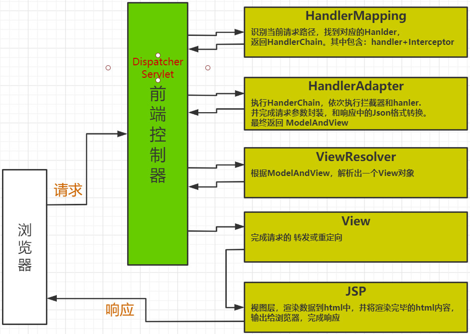

### 一、SpringMVC

------

#### 1.1 引言


**java开源框架，Spring Framework的一个独立模块。**

 

**MVC框架,在项目中开辟MVC层次架构**

 

**对控制器中的功能 包装 简化 扩展践行工厂模式，功能架构在工厂之上**


#### 1.2 MVC架构


##### 1.2.1 概念

| 名称       | 职责                                                         |
| ---------- | ------------------------------------------------------------ |
| Model      | 模型：即业务模型，负责完成业务中的数据通信处理，对应项目中的 service和dao |
| View       | 视图：渲染数据，生成页面。对应项目中的Jsp                    |
| Controller | 控制器：直接对接请求，控制MVC流程，调度模型，选择视图。对应项目中的Servlet |


##### 1.2.2 好处


 

-  MVC是现下软件开发中的最流行的代码结构形态; 
-  人们根据负责的不同逻辑，将项目中的代码分成 M V C 3个层次; 
-  层次内部职责单一，层次之间耦合度低; 
-  符合低耦合 高内聚的设计理念。也实际有利于项目的长期维护。 

 


### 二、开发流程

------

#### 2.1 导入依赖


```xml
<dependency>
    <groupId>org.springframework</groupId>
    <artifactId>spring-webmvc</artifactId>
    <version>5.1.6.RELEASE</version>
</dependency>
```


#### 2.2 配置核心(前端)控制器  struts2


https://struts.apache.org/getting-started/hello-world-using-struts2.html


作为一个MVC框架，首先要解决的是：如何能够收到请求！

 

所以MVC框架大都会设计一款前端控制器，选型在 Servlet 或 Filter两者之一,在框架最前沿率先工作，接收所有请求。

 

此控制器在接收到请求后，还会负责springMVC的核心的调度管理，所以既是前端又是核心。


```xml
<servlet>
    <servlet-name>mvc</servlet-name>
    <servlet-class>org.springframework.web.servlet.DispatcherServlet</servlet-class>
    <!-- 局部参数：声明配置文件位置 -->
    <init-param>
        <param-name>contextConfigLocation</param-name>
        <param-value>classpath:mvc.xml</param-value>
    </init-param>
    <!-- Servlet启动时刻：可选 -->
    <load-on-startup>1</load-on-startup>
</servlet>
<servlet-mapping>
    <servlet-name>mvc</servlet-name>
    <url-pattern>/</url-pattern>
</servlet-mapping>
```


#### 2.3 后端控制器


等价于之前定义的Servlet


```java
@Controller //声明这是一个控制器
@RequestMapping("/hello")  //访问路径 ，等价于url-pattern
public class HelloController {
	@RequestMapping("/test1")  //访问路径
	public String hello1(){
		System.out.println("hello world");
		return "index"; // 跳转:/index.jsp  
	}
	@RequestMapping("/test2") //访问路径
	public String hello2(){
		System.out.println("hello c9");
		return "views/users";//  跳转:/views/user.jsp
	}
}
```


#### 2.4 配置文件


默认名称：核心控制器名-servet.xml   默认位置：WEB-INF

 

随意名称：mvc.xml      随意位置：resources   但需要配置在核心控制器中


```xml
<beans 	xmlns="http://www.springframework.org/schema/beans"
		xmlns:context="http://www.springframework.org/schema/context"
		xmlns:mvc="http://www.springframework.org/schema/mvc" 
		xmlns:xsi="http://www.w3.org/2001/XMLSchema-instance" 
		xsi:schemaLocation="http://www.springframework.org/schema/beans
							http://www.springframework.org/schema/beans/spring-beans.xsd
							http://www.springframework.org/schema/context
							http://www.springframework.org/schema/context/spring-context.xsd
							http://www.springframework.org/schema/mvc
							http://www.springframework.org/schema/mvc/spring-mvc.xsd">

	<!-- 告知springmvc  哪些包中 存在 被注解的类 -->
	<context:component-scan base-package="com.qf.controller"></context:component-scan>
	<!-- 注册注解开发驱动 -->
	<mvc:annotation-driven></mvc:annotation-driven>
	<!-- 视图解析器
	     作用：1.捕获后端控制器的返回值="index"
	          2.解析： 在返回值的前后 拼接 ==> "/index.jsp"
	 -->
	<bean class="org.springframework.web.servlet.view.InternalResourceViewResolver">
		<!-- 前缀 -->
		<property name="prefix" value="/"></property>
		<!-- 后缀 -->
		<property name="suffix" value=".jsp"></property>
	</bean>
</beans>
```


#### 2.5 访问


```markdown
http://localhost：8989/hello/test1
http://localhost：8989/hello/test2
```


### 三、接收请求参数

------

#### 3.1 基本类型参数


请求参数和方法的形参 同名即可


springMVC默认可以识别的日期字符串格式为： YYYY/MM/dd HH:mm:ss
通过@DateTimeFormat可以修改默认日志格式


```java
// id  name gender
// http://localhost:8989/xxx/../test1?id=1&name=zzz&gender=false&birth=2018-12-12 12:20:30
@RequestMapping("/test1")
public String testParam1(Integer id,
                         String name,
                         Boolean gender,
                         @DateTimeFormat(pattern="yyyy-MM-dd HH:mm:ss")Date birth){
    System.out.println("test param1");
    return "index";
}
```


#### 3.2 实体收参【`重点`】


请求参数和实体的属性 同名即可


```java
public class User {
	private Integer id;
	private String name;
	@DateTimeFormat(pattern="yyyy-MM-dd")
	private Date birth;
	private Boolean gender;
	//set/get ...
}

//http://localhost:8989/.../test2?id=1&name=zzz&gender=false&birth=2018-12-12 12:20:30
@RequestMapping("/test2")
public String testParam2(User user){
    System.out.println("test param2");
    System.out.println("user:"+user);
    return "index";
}
```


#### 3.3 数组收参


简单类型的 数组


```html
<form action="${pageContext.request.contextPath}/param/test3">
    <input type="checkbox" name="hobby" value="fb"/>足球
    <input type="checkbox" name="hobby" value="bb"/>篮球
    <input type="checkbox" name="hobby" value="vb"/>排球
    <input type="submit" value="提交"/>
</form>
```


```java
//http://localhost:8989/.../test3?hobby=football&hobby=basketball
@RequestMapping("/test3")
public String testParam3(String[] hobby){
    for(String h:hobby){
        System.out.print(h+" ");
    }
    return "index";
}
```


#### 3.4 集合收参 【了解】分布式


```plain
<form action="${pageContext.request.contextPath}/param/test4" method="post">
    id:<input type="text" name="users[0].id"/>
    name:<input type="text" name="users[0].name"/>
    gender:<input type="text" name="users[0].gender"/>
<br/>
    id:<input type="text" name="users[1].id"/>
    name:<input type="text" name="users[2].name"/>
    gender:<input type="text" name="users[3].gender"/>
    <input type="submit" value="提交"/>
</form>
```


```java
public class UserList {
	//private User[] users;
	private List<User> users;
	//set/get..
}


// <input type="text" name="users[0].id"/>
// post请求：http://...?users[0].id=1&users[0].name=zhangsan&users[0].birth=2018-12-12&users[1].id=2&....
@RequestMapping("/test4")
public String testParam4(UserList userList){
    for(User user:userList.getUsers()){
        System.out.println(user);
    }
    return "index";
}
```


#### 3.5 路径参数


```java
// {id} 定义名为id的路径；【/hello/{id}】的匹配能力和【/hello/*】等价
// http://localhost:8989/.../hello/10   {id}匹配到10
@RequestMapping("/hello/{id}")
// @PathVariable将{id}路径匹配到值赋给id参数
// 路径名和参数名相同则@PathVariable("id")可简写为 @PathVariable
public String testParam5(@PathVariable("id") Integer id){
    System.out.println("id:"+id);            
    return "index";
}

// http://localhost:8989/.../hello/tom   {username}匹配到tom
@RequestMapping("/hello/{username}")
public String testParam6(@PathVariable("username") String name){//将{username}路径匹配到的值赋给name参数
    System.out.println("username:"+name);
    return "index";
}
```


#### 3.6 中文乱码


首先，页面中字符集统一


```plain
JSP : <%@page  pageEncoding="utf-8" %>
HTML : <meta charset="UTF-8">
```


其次，tomcat中字符集设置，对get请求中，中文参数乱码有效


```markdown
Tomcat配置：URIEncoding=utf-8
```


最后，设置此filter，对post请求中，中文参数乱码有效


```xml
<!-- 此过滤器会进行：request.setCharactorEncoding("utf-8"); -->
<filter>
    <filter-name>encoding</filter-name>
    <filter-class>org.springframework.web.filter.CharacterEncodingFilter</filter-class>
    <init-param>
        <param-name>encoding</param-name>
        <param-value>utf-8</param-value>
    </init-param>
</filter>
<filter-mapping>
    <filter-name>encoding</filter-name>
    <url-pattern>/*</url-pattern>
</filter-mapping>
```


响应乱码

```xml
<mvc:annotation-driven>
        <!--设置响应输出字符集-->
        <mvc:message-converters>
            <bean class="org.springframework.http.converter.StringHttpMessageConverter">
                <property name="supportedMediaTypes">
                    <list>
                        <value>text/html;charset=utf-8</value>
                    </list>
                </property>
            </bean>
        </mvc:message-converters>
    </mvc:annotation-driven>
```

### 四、跳转

------

#### 4.1 转发


```java
@RequestMapping("/forw")
class ForwardController{
    @RequestMapping("/test1")
    public String testForward(){
        System.out.println("test forward1");
        // 转发跳转 /views/users.jsp
        // return "views/users";//和下一行等价
        return "forward:/views/users.jsp";
    }
    @RequestMapping("/test2")
    public String testForward2(){
        System.out.println("test forward2");
        //转发到  /forw/test1
        //return "forward:test1";//相对路径(转发到本类中的test1)
        //转发到  /forw/test1
        return "forward:/forw/test1"; //绝对路径
    }
}
```


#### 4.2 重定向


```java
@RequestMapping("/redir")
class RedirectController{
    @RequestMapping("/test1")
    public String testRedirect1(){
        System.out.println("test redirect1");
        //重定向到 /redir/test1
        //return "redirect:test1"; //相对路径(转发到本类中的test1)
        return "redirect:/redir/test1";//绝对路径
    }
    @RequestMapping("/test2")
    public String testRedirect2(){
        System.out.println("test redirect2");
        //重定向到 /views/users.jsp
        return "redirect:/view/user.jsp";
    }
}
```


#### 4.3 跳转细节


 

-  在增删改之后，为了防止请求重复提交，重定向跳转 
-  在查询之后，可以做转发跳转 

 


### 五、响应

------

C得到数据后，跳转到V，并向V传递数据。进而V中可以渲染数据，让用户看到含有数据的页面

 

转发跳转：Request作用域

 

重定向跳转：Session作用域


#### 5.1 Request和Session


```plain
${requestScope.age}
${sessionScope.name}
```


```java
//形参中 即可获得 request 和 session对象
@RequestMapping("/test1")
public String testData(HttpSession session,HttpServletRequest req，Integer id){
    session.setAttribute("user",new User());
    req.setAttribute("age", 18);
    req.setAttribute("users",Arrays.asList(new User(),new User()));
    //return "test2";
    return "forward:/WEB-INF/test2.jsp";
}
```


#### 5.2 JSP中取值


建议：重点复习 EL  JSTL


```plain
//jsp中用EL表达式 取值即可
<fmt:formatDate value="${sessionScope.user.birth}" pattern="yyyy-MM-dd"/> <br/>
${sessionScope.user.birth} <br>
${requestScope.age}
```


#### 5.3 Model


```java
//model中的数据，会在V渲染之前，将数据复制一份给request
@RequestMapping("/test")
public String testData(Model model){
    model.addAttribute("name", "张三");
    return "index";
}

//jsp中用EL表达式 取值即可
${requestScope.name}
```


#### 5.4 ModelAndView


```java
//modelandview 可以集中管理 跳转和数据
@RequestMapping("/test")
public ModelAndView testData(){//返回值类型为ModelAndView
    //新建ModelAndView对象
    ModelAndView mv = new ModelAndView();
    // 设置视图名，即如何跳转
    mv.setViewName("forward:/index.jsp");
    // 增加数据
    mv.addObject("age",18);
    return mv;
}

//jsp中用EL表达式 取值即可
${requestScope.age}
```


#### 5.5 [@SessionAttributes ]() （了解）


 

-  @SessionAttributes({"gender","name"})  ：model中的 name和gender 会存入session中 
-  SessionStatus 移除session 

 


```java
@Controller
@SessionAttributes({"gender","name"}) // model中的 name和gender 会存入session中
public class UserController {

    @RequestMapping("/hello")
    public String hello(Model m){
        m.addAttribute("gender",true); // 会存入session
        mv.addObject("name","zhj"); // 会存入session
        return "index";
    }
    
    @RequestMapping("/hello2")
    public String hello(SessionStatus status){
        // 移除通过SessionAttributes存入的session
        status.setComplete();
        return "index";
    }
}
```


### 六、静态资源

------

#### 6.1 静态资源问题


静态资源：html，js文件，css文件，图片文件


静态文件没有url-pattern,所以默认是访问不到的，之所以可以访问，是因为，tomcat中有一个全局的servlet：org.apache.catalina.servlets.DefaultServlet，它的url-pattern是 "/",是全局默认的Servlet.  所以每个项目中不能匹配的静态资源的请求，有这个Servlet来处理即可。


但，在SpringMVC中DispatcherServlet也采用了 “/” 作为url-pattern, 则项目中不会再使用全局的Serlvet，则静态资源不能完成访问。


#### 6.2 解决方案1


DispathcerServlet采用其他的url-pattern

 

此时，所有访问handler的路径都要以 action结尾！！


```xml
<servlet>
  	<servlet-name>mvc9</servlet-name>
  	<servlet-class>org.springframework.web.servlet.DispatcherServlet</servlet-class>
</servlet>
<servlet-mapping>
    <servlet-name>mvc9</servlet-name>
    <url-pattern>*.action</url-pattern>
</servlet-mapping>
```


#### 6.3 解决方案2


DispathcerServlet的url-pattern依然采用 "/",但追加配置


```xml
<!-- 
  额外的增加一个handler，且其requestMapping:  "/**" 可以匹配所有请求，但是优先级最低
  所以如果其他所有的handler都匹配不上，请求会转向 "/**" ,恰好，这个handler就是处理静态资源的
  处理方式：将请求转会到tomcat中名为default的Servlet
  -->
<mvc:default-servlet-handler/>
```


#### 6.4 解决方案3


 

- mapping是访问路径，location是静态资源存放的路径
- 将/html/ **中 /**匹配到的内容，拼接到 /hhh/后
  http://..../html/a.html  访问 /hhh/a.html

 


```xml
<mvc:resources mapping="/html/**" location="/hhh/"/>
```


### 七、Json处理（了解）

------

#### 7.1 导入依赖


```xml
<!-- Jackson springMVC默认的Json解决方案选择是 Jackson，所以只需要导入jackson的jar，即可使用。-->
<dependency>
    <groupId>com.fasterxml.jackson.core</groupId>
    <artifactId>jackson-databind</artifactId>
    <version>2.9.8</version>
</dependency>
```


#### 7.2 使用[@ResponseBody ]() 


```java
@Controller
public class JsonController{    
	@RequestMapping("/test1")
    @ResponseBody //将handler的返回值，转换成json(jackson),并将json响应给客户端。
    public User hello1(){
        System.out.println("hello world");
        User user = new User();
        return user;
    }
    // @ResponseBody还可以用在handler的返回值上
    @RequestMapping("/test2")
    public @ResponseBody List<User> hello2(){
        System.out.println("hello world");
        List<User> users = Arrays.asList(new User(),new User());
        return users;
    }
    // 如果返回值已经是字符串，则不需要转json，直接将字符串响应给客户端 
    @RequestMapping(value="/test3",produces = "text/html;charset=utf-8") //produces 防止中文乱码
    @ResponseBody 
    public String hello2(){
        System.out.println("hello world");
        return "你好";
    }
}
```


#### 7.3 使用[@RestController ]() 


Controller类上加了@RestController注解，等价于在类中的每个方法上都加了[@ResponseBody ]() 


```java
@Controller
@RestController
public class JsonController{
    @RequestMapping("/test1")
    public User hello1(){
        System.out.println("hello world");
        User user = new User();
        return user;
    }
    //@ResponseBody还可以用在handler的返回值上
    @RequestMapping("/test2")
    public List<User> hello2(){
        System.out.println("hello world");
        List<User> users = Arrays.asList(new User(),new User());
        return users;
    }
}
```


#### 7.4 使用[@RequestBody ]() 


 

#### [**@RequestBody** ]() , 接收Json参数

 


##### 7.4.1 定义Handler


```java
class User{
    private Integer id;
    private String name;
    private Boolean gender;
    //set get
}
```


```java
@RequestMapping("/users")
public String addUser(@RequestBody User user){//@RequestBody将请求体中的json数据转换为java对象
    System.out.println("cap2");
    System.out.println("Post user :"+user);
    return "index";
}
```


注意 ：1、 采用@RequestBody 首先得设置 请求头content-type:application/json

2、你的参数必须是json格式


##### 7.4.2 Ajax发送json


```javascript
var xhr = new XMLHttpRequest();
xhr.open("post","${pageContext.request.contextPath}/users?"+new Date().getTime());
xhr.setRequestHeader("content-type","application/json");//设置请求头
xhr.send('{"id":1,"name":"shine","gender":"true"}');//传递json串
```


```javascript
//ajax
var user = {id:1,name:"shine"};
$.ajax({
    url:'${pageContext.request.contextPath}/json2/test4',
    type:'post',
    contentType:"application/json",//声明请求参数类型为 json
    data:JSON.stringify(user),// 转换js对象成json
    success:function(ret){
        console.log(ret);
    }
});
```


##### 7.4.3 @RequestParam  

1、支持三种请求方式：parms、from-data，x-www-form-urlencoded;


prams: url?username=admin&pwd=123456

from-data: username=admin,pwd=123456


x-www-form-urlencoded:{username:"admin",pwd:"123456"}


#### 7.5 Jackson常用注解 （了解）


##### 7.5.1 日期格式化


@JsonFormat(pattern="yyyy-MM-dd HH:mm:ss",timezone = "GMT+8")


```java
public class User{
	private Integer id;
	private String name;
	@JsonFormat(pattern="yyyy-MM-dd HH:mm:ss",timezone = "GMT+8")
	private Date birth;
    ....
    get/set
}
```


##### 7.5.2 属性名修改


@JsonProperty("new_name")


```java
public class User{
	@JsonProperty("new_id") //不再使用原属性名，而是 "new_id"
    private Integer id;
	private String name;
    ....
    get/set
}
输出的json：{“new_id”:xx,"name":"xx"}
```


##### 7.5.3 属性忽略


[@JsonIgnore ]() 


```java
public class User{
    private Integer id;
    @JsonIgnore // 生成json时，忽略此属性
	private String name;
    ....
    get/set
}
输出json时: {"id":xx}
```


##### 7.5.4 null和empty属性排除


Jackson 默认会输出null值的属性，如果不需要，可以排除。

 

@JsonInclude(JsonInclude.Include.NON_NULL) //null值 属性不输出
@JsonInclude(value= JsonInclude.Include.NON_EMPTY) // empty属性不输出( 空串，长度为0的集合，null值)


```java
public class User{
    private Integer id;
    @JsonInclude(JsonInclude.Include.NON_NULL) // 若"name==null" 忽略此属性
	private String name;
    @JsonInclude(value= JsonInclude.Include.NON_EMPTY)  // 若hobby长度为0或==null 忽略此属性
    private List<String> hobby;
    ....
    get/set
}
如果name=null,且 hobby长度为0，则输出json时：{"id":xx}
```


##### 7.5.5 自定义序列化


[@JsonSerialize(using ]() = MySerializer.class) // 使用MySerializer输出某属性 


```java
public class User {
    private Integer id;
    private String name;
    @JsonSerialize(using = MySerializer.class)
    private Double salary = 10000.126;//在输出此属性时，使用MySerializer输出
    ....
    get/set
}
则输出json时：{"id":xx,"name":"xxx","salary":10000.13}
```


```java
public class MySerializer extends JsonSerializer<Double> {

    // value即 Double salary的值
    @Override 
    public void serialize(Double value, JsonGenerator gen, SerializerProvider serializers) throws IOException {
        // 将Double salary的值 四舍五入
        String number = BigDecimal.valueOf(value).setScale(2, BigDecimal.ROUND_HALF_UP).toString();
        // 输出 四舍五入后的值
        gen.writeNumber(number);
    }
}
```


#### 7.6 FastJson


##### 7.6.1 导入依赖


```xml
<!-- FastJson -->
<dependency>
    <groupId>com.alibaba</groupId>
    <artifactId>fastjson</artifactId>
    <version>1.2.54</version>
</dependency>
```


##### 7.6.2 安装FastJson


```xml
<mvc:annotation-driven>
    <!-- 安装FastJson,转换器 -->
    <mvc:message-converters>
        <bean class="com.alibaba.fastjson.support.spring.FastJsonHttpMessageConverter">
            <!-- 声明转换类型:json -->
            <property name="supportedMediaTypes">
                <list>
                    <value>application/json</value>
                </list>
            </property>
        </bean>
    </mvc:message-converters>
</mvc:annotation-driven>
```


```javascript
// 获取子页面的iframe
var iframe = window['layui-layer-iframe' + index];
// 向子页面的全局函数child传参
iframe.child(data);

window.child = function (e){
            var data = e;
            console.log(e)
            $("#id").val(e.id);
            $("#name").val(e.name);
            $("#password").val(e.password)
        }
```


##### 7.6.3 使用


[@ResponseBody ]()  [@RequestBody ]() [@RestController ]() 使用方法不变 


##### 7.6.4 常用注解


 

- 日期格式化：@JSONField(format="yyyy/MM/dd")
- 属性名修改：@JSONField(name="birth"）
- 忽略属性：[@JSONField(serialize ]() = false) 
- 包含null值：[@JSONField(serialzeFeatures ]() = SerializerFeature.WriteMapNullValue)  默认会忽略所有null值,有此注解会输出null  

- - [@JSONField(serialzeFeatures ]() = SerializerFeature.WriteNullStringAsEmpty)  null的String输出为"" 

 

- 自定义序列化：[@JSONField(serializeUsing ]() = MySerializer2.class) 

 


```java
public class User implements Serializable{
	@JSONField(serialize = false)
    private Integer id;
    @JSONField(name="NAME",serialzeFeatures = SerializerFeature.WriteNullStringAsEmpty)
	private String name;
    @JSONField(serialzeFeatures = SerializerFeature.WriteMapNullValue) 
    private String city;
	@JSONField(format="yyyy/MM/dd")
	private Date birth;
    @JSONField(serializeUsing = MySerializer2.class)
    private Double salary;
	...
}
```


```java
public class MySerializer2 implements ObjectSerializer {
    @Override
    public void write(JSONSerializer serializer, Object object, Object fieldName, Type fieldType,
                      int features) throws IOException {
        Double value = (Double) object; // salary属性值
        String text = value + "元";// 在salary后拼接 “元”
        serializer.write(text); // 输出拼接后的内容
    }
}
```


```java
new User(1，null，null，new Date()，100.5);
// 如上对象，转换json：
{NAME:""，city:null，"birth":"2020/12/12"，"salary":"100.5元"}
```


### 八、异常解析器

------

#### 8.1 现有方案，分散处理


Controller中的每个Handler自己处理异常

 

此种处理方案，异常处理逻辑，分散在各个handler中，不利于集中管理


```java
public String xxx(){
    try{
    	...
    }catch(Exception1 e){
    	e.printStackTrace();
        return "redirect:/xx/error1";
    }catch(Exception2 e){
    	e.printStackTrace();
        return "redirect:/xx/error2";
    }
}
```


#### 8.2 异常解析器，统一处理（重点）


Controller中的每个Handler不再自己处理异常，而是直接throws所有异常。

 

定义一个“异常解析器” 集中捕获处理 所有异常

 

此种方案，在集中管理异常方面，更有优势！


```java
public class MyExResolver implements HandlerExceptionResolver{
	/**
	 * 异常解析器：主体逻辑
	 * 执行时刻：当handler中抛出异常时，会执行：捕获异常，并可以跳到错误页面
	 */
	@Override
	public ModelAndView resolveException(HttpServletRequest request,
			HttpServletResponse response, Object handler, Exception ex) {
		ex.printStackTrace();//打印异常栈
		//创建一个ModelAndView
		ModelAndView mv = new ModelAndView();
		//识别异常
		if (ex instanceof Exception1) {
			mv.setViewName("redirect:/xxx/error1");
		}else if(ex instanceof Exception2){
			mv.setViewName("redirect:/xxx/error2");
		}else{
			mv.setViewName("redirect:/xxx/error");
		}
		return mv;
	}
}
```


```xml
<!-- 声明异常解析器 -->	
<bean class="com.baizhi.exception.resolver.MyExResolver"></bean>
```


### 九、拦截器（非重点）

------

#### 9.1 作用


作用：抽取handler中的冗余功能


#### 9.2 定义拦截器


执行顺序： preHandle--postHandle--afterCompletion


```java
public class MyInter1 implements HandlerInterceptor{
	//主要逻辑：在handler之前执行：抽取handler中的冗余代码
	@Override
	public boolean preHandle(HttpServletRequest request,
			HttpServletResponse response, Object handler) throws Exception {
		System.out.println("pre~~~");
        /*
        response.sendRedirect("/springMVC_day2/index.jsp");//响应
        return false;//中断请求
        */
		return true;//放行，后续的拦截器或handler就会执行
	}
	//在handler之后执行:进一步的响应定制
	@Override
	public void postHandle(HttpServletRequest request,
			HttpServletResponse response, Object handler,
			ModelAndView modelAndView) throws Exception {
		System.out.println("post~~");
	}
	//在页面渲染完毕之后，执行：资源回收
	@Override
	public void afterCompletion(HttpServletRequest request,
			HttpServletResponse response, Object handler, Exception ex)
			throws Exception {
		System.out.println("after~~");
	}
}
```


#### 9.3 配置拦截路径


```xml
<mvc:interceptors>
    <mvc:interceptor>
        <mvc:mapping path="/inter/test1"/>
        <mvc:mapping path="/inter/test2"/>
        <mvc:mapping path="/inter/test*"/> <!-- test开头 -->
        <mvc:mapping path="/inter/**"/> <!-- /** 任意多级任意路径 -->
        <mvc:exclude-mapping path="/inter/a/**"/>   <!--不拦截此路径-->
        <bean class="com.baizhi.interceptor.MyInter1"></bean>   <!--拦截器类-->
    </mvc:interceptor>
</mvc:interceptors>
```


### 十、上传

------

#### 10.1 导入jar


```xml
<dependency>
    <groupId>commons-io</groupId>
    <artifactId>commons-io</artifactId>
    <version>2.4</version>
</dependency>

<dependency>
    <groupId>commons-fileupload</groupId>
    <artifactId>commons-fileupload</artifactId>
    <version>1.3.3</version>
    <exclusions>
        <exclusion>
            <groupId>javax.servlet</groupId>
            <artifactId>servlet-api</artifactId>
        </exclusion>
    </exclusions>
</dependency>
```


#### 10.2 表单


```html
<form action="${pageContext.request.contextPath }/upload/test1" method="post" 
      enctype="multipart/form-data">
  file: <input type="file" name="source"/> <br>
  <input type="submit" value="提交"/>
</form>
```


#### 10.3 上传解析器


```xml
<!-- 上传解析器 
	     id必须是：“multipartResolver”
 -->
<bean id="multipartResolver" 
      class="org.springframework.web.multipart.commons.CommonsMultipartResolver">
    <!-- 最大可上传的文件大小  单位：byte  超出后会抛出MaxUploadSizeExceededException异常，可以异常解析器捕获 -->
    <property name="maxUploadSize" value="1048576"></property>
</bean>
```


#### 10.4 Handler


```java
@RequestMapping("/test1")
public String hello1(String username,MultipartFile source,HttpSession session) { 
    //文件的原始名称    
    String filename = source.getOriginalFilename();    
    //定制全局唯一的命名    
    String unique = UUID.randomUUID().toString();    
    //获得文件的后缀    
    String ext = FilenameUtils.getExtension(filename);
    //abc.txt   txt    hello.html  html   
    //定制全局唯一的文件名    
    String uniqueFileName = unique+"."+ext;    
    System.out.println("唯一的文件名:"+uniqueFileName);    
    //文件的类型    String type = source.getContentType();    
    System.out.println("filename:"+filename+" type:"+type);    
    //获得 upload_file的磁盘路径 ==> 在webapp目录下创建一个目录"upload_file",且此目录初始不要为空，否则编译时被忽略    
    String real_path = session.getServletContext().getRealPath("/upload_file");    
    System.out.println("real_path:"+real_path);    
    //将上传的文件，存入磁盘路径中    
    //source.transferTo(new File("d:/xxxx/xxxx/xx.jpg"))    
    source.transferTo(new File(real_path+"\\"+uniqueFileName));    
    return "index";
}
```


### 十一、下载

------

#### 11.1 超链


```html
<a href="${pageContext.request.contextPath}/download/test1?name=Koala.jpg">下载</a>
```


#### 11.2 Handler


```java
@RequestMapping("/test1")
public void hello1(String name,HttpSession session,HttpServletResponse response){
    System.out.println("name:"+name);
    //获得要下载文件的绝对路径
    String path = session.getServletContext().getRealPath("/upload_file");
    //文件的完整路径
    String real_path = path+"\\"+name;
    
    //中文文件名的乱码解决
    String encode = URLEncoder.encode(fileName, "utf-8");

    //设置响应头  告知浏览器，要以附件的形式保存内容   filename=浏览器显示的下载文件名
    response.setHeader("content-disposition","attachment;filename="+name);

    //读取目标文件，写出给客户端
    IOUtils.copy(new FileInputStream(real_path), response.getOutputStream());

    //上一步，已经是响应了,所以此handler直接是void
}
```


### 十二、验证码

------

#### 12.1 作用


防止暴力攻击，前端安全保障


#### 12.2 导入jar


```xml
<!-- Kaptcha -->
<dependency>    
  <groupId>com.github.penggle</groupId>    
  <artifactId>kaptcha</artifactId>    
  <version>2.3.2</version>    
  <exclusions>        
    <exclusion>            
      <groupId>javax.servlet</groupId>            
      <artifactId>javax.servlet-api</artifactId>        
    </exclusion>    
  </exclusions>
</dependency>
```


#### 12.3 声明验证码组件


```xml
<servlet>
    <servlet-name>cap</servlet-name>
    <servlet-class>com.google.code.kaptcha.servlet.KaptchaServlet</servlet-class>
    <init-param>
      <param-name>kaptcha.border</param-name>
      <param-value>no</param-value>
    </init-param>
    <init-param>
      <param-name>kaptcha.textproducer.char.length</param-name>
      <param-value>4</param-value>
    </init-param>
    <init-param>
      <param-name>kaptcha.textproducer.char.string</param-name>
      <param-value>abcdefghijklmnopqrstuvwxyzABCDEFGHIJKLMNOPQRSTUVWXYZ0123456789</param-value>
    </init-param>
    <init-param>
      <param-name>kaptcha.background.clear.to</param-name>
      <param-value>211,229,237</param-value>
    </init-param>
    <init-param>
      <!-- session.setAttribute("captcha","验证码") -->
      <param-name>kaptcha.session.key</param-name>
      <param-value>captcha</param-value>
    </init-param>
  </servlet>
  <servlet-mapping>
    <servlet-name>cap</servlet-name>
    <url-pattern>/captcha</url-pattern>
  </servlet-mapping>
```


#### 12.4 Page


```html

<script>
    $(function(){
        $("#cap").click(function(){
            //刷新验证码
            path = $(this).attr("src")+"?"+new Date().getTime(); // f
            $(this).attr("src",path);
        });
    });
</script>
```


### 十三、REST（重要点）

------

#### 13.1 开发风格


是一种开发风格，遵从此风格开发软件，符合REST风格，则RESTFUL。


两个核心要求：

 

- 每个资源都有唯一的标识(URL)
- 不同的行为，使用对应的http-method

 

| 访问标识                                 | 资源              |
| ---------------------------------------- | ----------------- |
| http://localhost:8989/xxx/users          | 所有用户          |
| http://localhost:8989/xxx/users/1        | 用户1 pathvarbale |
| http://localhost:8989/xxx/users/1/orders | 用户1的所有订单   |

| 请求方式 | 标识                                     | 意图                        |
| -------- | ---------------------------------------- | --------------------------- |
| GET      | http://localhost:8989/xxx/users          | 查询所有用户                |
| POST     | http://localhost:8989/xxx/users          | 在所有用户中增加一个        |
| PUT      | http://localhost:8989/xxx/users          | 在所有用户中修改一个        |
| DELETE   | http://localhost:8989/xxx/users/1        | 删除用户1                   |
| GET      | http://localhost:8989/xxx/users/1        | 查询用户1                   |
| GET      | http://localhost:8989/xxx/users/1/orders | 查询用户1的所有订单         |
| POST     | http://localhost:8989/xxx/users/1/orders | 在用户1的所有订单中增加一个 |


#### 13.2 优点


 

- **输出json：

 


#### 13.3 使用


##### 13.3.1 定义Rest风格的 Controller


@RequestMapping(value="/users",method = RequestMethod.GET)

 

等价

 

@GetMapping("/users")


```java
@RestController
public class RestController {
    @GetMapping("/users")
    public List<User> queryAllUsers(){
        System.out.println("get");
        List<User> users = ....
        return users;
    }

    @PostMapping("/users")
    public String addUser(@RequestBody User user){
        System.out.println("Post user :"+user);
        return "{status:1}";
    }
    
    @PutMapping("/users")
    public String updateUser(@RequestBody User user){
        System.out.println("Put user" user:"+user);
        return "{status:1}";
    }

    @GetMapping("/users/{id}")
    public String queryOneUser(@PathVariable Integer id){//@PathVariable 接收路径中的值
        System.out.println("Get user id:"+id);
        return "{status:1}";
    }

    @DeleteMapping("/users/{id}")
    public String deleteOneUser(@PathVariable Integer id){//@PathVariable 接收路径中的值
        System.out.println("delete user id:"+id);
        return "{status:1}";
    }
}
```


##### 13.3.2 Ajax请求


```html
<script>    
	function putUser(){ // 发送更新请求 （增加请求发送方式也是如此）
        var xhr = new XMLHttpRequest();
    	//定义 put，delete,get,post方式 即可，不用定义_method
        xhr.open("put","${pageContext.request.contextPath}/rest04/users");
    	// 设置请求头
        xhr.setRequestHeader("content-type","application/json")；
        // 设置请求参数
        var user = {id:1，NAME:"shine"，city:"bj"，"birth":"2020/12/12"，"salary":100.5};
        xhr.send(JSON.stringify(user));
        xhr.onreadystatechange=function(){
            if(xhr.readyState==4 && xhr.status==200){
                var ret = xhr.responseText;
                // 解析json，并输出
                console.log(JSON.parse(ret));
            }
        }
    	/*$.ajax({
            url:'${pageContext.request.contextPath}/rest04/users',
            type:'put',
            contentType:"application/json",//声明请求参数类型为 json
            data:JSON.stringify(user),// 转换js对象成json
            success:function(ret){
                console.log(JSON.parse(ret));
            }
        });*/
    }

	function delUser(){  // 发送删除请求
        var xhr = new XMLHttpRequest();
        //定义 put，delete,get,post方式 即可，不用定义_method
        xhr.open("delete","${pageContext.request.contextPath}/rest04/users/1");
        xhr.send();
        xhr.onreadystatechange=function(){
            if(xhr.readyState==4 && xhr.status==200){
                var ret = xhr.responseText;
                console.log(JSON.parse(ret));
            }
        }
    }
</script>
```


### 十四、跨域请求

------

#### 14.1 域


域：协议+IP+端口

 

-  http://localhost:8989 
-  http://localhost:8080 
-  http://www.baidu.com:80 

 


#### 14.2 Ajax跨域问题


 

-  Ajax发送请求时，不允许跨域，以防用户信息泄露。 
-  当Ajax跨域请求时，响应会被浏览器拦截(同源策略)，并报错。即浏览器默认不允许ajax跨域得到响应内容。 
-  互相信任的域之间如果需要ajax访问，(比如前后端分离项目中，前端项目和后端项目之间)，则需要额外的设置才可正常请求。 

 


#### 14.3 解决方案


 

-  允许其他域访问 
-  在被访问方的Controller类上，添加注解 

 


```java
@CrossOrigin("http://localhost:8080") //允许此域发请求访问
public class SysUserController {
	....
}
```


 

-  携带对方cookie，使得session可用 
-  在访问方，ajax中添加属性：withCredentials: true 

 


```javascript
$.ajax({
     type: "POST",
     url: "http://localhost:8989/web/sys/login",
     ...,
     xhrFields: {
       // 跨域携带cookie
       withCredentials: true
     }
});
或
var xhr = new XMLHttpRequest();
// 跨域携带cookie
xhr.withCredentials=true;
```


### 十五、SpringMVC执行流程

------

|                                                              |
| ------------------------------------------------------------ |
|  |


### 十六、Spring整合

------

#### 16.1 整合思路


此时项目中有两个工厂

 

- DispatcherServlet 启动的springMVC工厂==负责生产C及springMVC自己的系统组件
- ContextLoaderListener 启动的spring工厂==负责生产其他所有组件
- springMVC的工厂会被设置为spring工厂的子工厂，可以随意获取spring工厂中的组件
- 整合过程，就是累加：代码+依赖+配置。然后将service注入给controller即可

 


#### 16.2 整合技巧

两个工厂不能有彼此侵入，即，生产的组件不能有重合。

```
<!-- 告知SpringMVC  哪些包中 存在 被注解的类
	use-default-filters=true 凡是被 @Controller @Service  @Repository注解的类，都会被扫描
	use-default-filters=false 默认不扫描包内的任何类, 只扫描include-filter中指定的类
	只扫描被@Controller注解的类
-->
<context:component-scan base-package="com.zhj" use-default-filters="false">
 	<context:include-filter type="annotation" expression="org.springframework.stereotype.Controller"/>
</context:component-scan>
```

```
<!-- 告知Spring
     唯独不扫描@Controller注解的类 -->
<context:component-scan base-package="com.zhj" use-default-filters="true">
	<context:exclude-filter type="annotation" expression="org.springframework.stereotype.Controller"/>
</context:component-scan>
```

