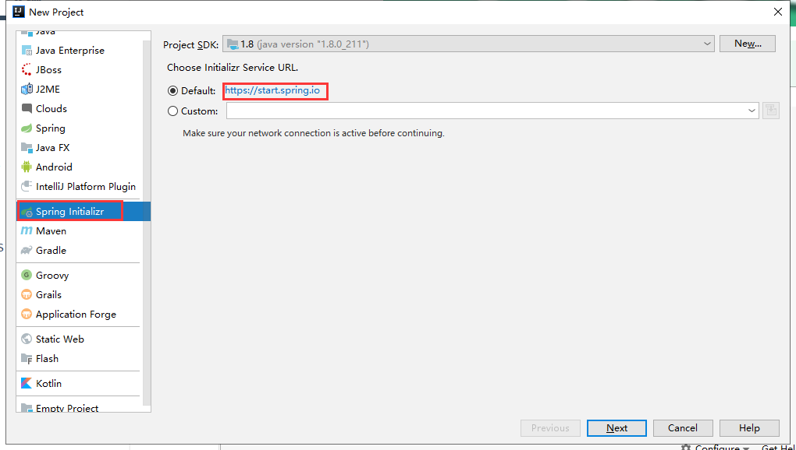

### 一、引言

------

#### 1.1 初始化配置


为了使用SSM框架去开发，准备SSM框架的模板配置。


#### 1.2 整合第三方框架


为了Spring整合第三方框架，单独的去编写xml文件。


#### 1.3 后期维护


后期SSM项目后期xml文件特别多，维护xml文件的成本是很高的


#### 1.4 部署工程


SSM工程部署也是很麻烦，依赖第三方的容器


#### 1.5 敏捷式开发


基于Java的SSM开发方式是很笨重，而现在的python，php，NodeJS的敏捷式开发已经盖过Java一头


### 二、SpringBoot介绍

------

SpringBoot是由Pivotal团队研发的，SpringBoot并不是一门新技术，只是将之前常用的Spring，SpringMVC，data-jpa等常用的框架封装到了一起，帮助你隐藏这些框架的整合细节，实现敏捷开发。

 

SpringBoot就是一个工具集，springboot生态。

| LOGO                                                         |
| ------------------------------------------------------------ |
|  |


SpringBoot特点：

 

- SpringBoot项目不需要模板化的配置。
- SpringBoot中整合第三方框架时，只需要导入相应的starter依赖包，就自动整合了。
- SpringBoot默认只有一个.properties的配置文件，不推荐使用xml，后期会采用.java的文件去编写配置信息。
- SpringBoot工程在部署时，采用的是jar包的方式，内部自动依赖Tomcat容器，提供了多环境的配置。
- 后期要学习的微服务框架SpringCloud需要建立在SpringBoot的基础上。

 


### 三、SpringBoot快速入门【`重点`】

------

#### 3.1 快速构建SpringBoot


##### 3.1.1 选择构建项目的类型

| 选择构建项目的类型                                           |
| ------------------------------------------------------------ |
|  |


##### 3.1.2 项目的描述

| 项目的描述                                                   |
| ------------------------------------------------------------ |
|  |


##### 3.1.3 指定SpringBoot版本和需要的依赖

| 指定SpringBoot版本和需要的依赖                               |
| ------------------------------------------------------------ |
|  |


##### 3.1.4 导入依赖


```xml
<parent>
        <artifactId>spring-boot-starter-parent</artifactId>
        <groupId>org.springframework.boot</groupId>
        <version>2.3.12.RELEASE</version>
    </parent>


<dependency>
    <groupId>org.springframework.boot</groupId>
    <artifactId>spring-boot-starter</artifactId>
</dependency>
<!-- 将上述内容修改为下面的效果 -->
<dependency>
    <groupId>org.springframework.boot</groupId>
    <artifactId>spring-boot-starter-web</artifactId>
</dependency>
```


##### 3.1.5 编写了Controller


```java
@RestController
public class TestController {

    @GetMapping("/test")
    public String test(){
        return "Hello SpringBoot!";
    }

}
```


##### 3.1.6 测试

| 效果                                                         |
| ------------------------------------------------------------ |
|  |


#### 3.2 SpringBoot的目录结构


##### 3.2.1 pom.xml文件


 

- 指定了一个父工程： 指定当前工程为SpringBoot，帮助我们声明了starter依赖的版本。
- 项目的元数据：包名，项目名，版本号。
- 指定了properties信息：指定了java的版本为1.8
- 导入依赖：默认情况导入spring-boot-starter，spring-boot-starter-test
- 插件：spring-boot-maven-plugin

 


##### 3.2.2 .gitignore文件


默认帮我们忽略了一些文件和目录，避免提交到Git仓库中


##### 3.2.3 src目录


```json
-src
  -main	  
    -java
      -包名
        启动类.java			# 需要将controller类，放在启动类的子包中或者同级包下
    -resources
      -static				  # 存放静态资源的
      -templates			   # 存储模板页面的
      application.properties	 # SpringBoot提供的唯一的配置文件
  -test   				      # 只是为了测试用的
```


#### 3.3 SpringBoot三种启动方式


##### 3.3.1 运行启动类的main方法


运行main方法即可


##### 3.3.2 maven命令


```shell
mvn spring-boot:run
```


##### 3.3.3 采用jar包的方式运行


将当前项目打包成一个jar文件，并通过java -jar jar文件


### 四、SpringBoot常用注解【`重点`】

------

#### 4.1 @Configuration和@Bean  


 

-  之前使用SSM去开发时，在xml文件中编写bean标签，但是SpringBoot不推荐使用xml文件。 
-  @Configuration注解相当于beans标签 
-  @Bean注解相当于bean标签 
-  id=“方法名 | 注解中的name属性（优先级更高）” 
-  class=“方法的返回结果” 

 


```java
@Configuration   // 代表当前类是一个配置类
public class UserConfig {
    
    
    @Bean(name = "user1")       // 构建一个实例，放到spring容器中
    public User user(){
        User user = new User();
        user.setId(1);
        user.setName("张三");
        return user;
    }
    
    /*
    <beans ....>            @Configuration
        <bean id="user1" class="com.qf.firstspringboot.entity.User" />
    </beans>
     */
}
```


```plain
@Autowired   bytype  @Qualifier(value = "user1")  另外取名

@Resource  byname
```


1、如果是当前对象没有发生冲突注入，采用@Autowired @Resource ；@Qualifier（备注：写与不写都可以） 随便那种都可以；

2、如果发生对象冲突：Autowired和Resource 就必须配合Qualifier 联合使用；


[@Service ]() 和 [@component ]() 用法一样 


```plain
@MapperScan("com.qf.demo.dao")  启动类
@MapperScan   扫描 我们的mybatis 接口   接口  

@Configuration @Bean 自定义一个创建注入容器

@controller @restcontroller 用在表示层

@service 用在逻辑层 业务层


@MapperScan @Mapper @Repostory 用在持久层

@Component 这个用其他地方（工具类...）
```


#### 4.2 @SpringBootApplication（重点）


@SpringBootApplication就是一个组合注解：

 

- @SpringBootConfiguration就是@Configuration注解，代表启动类就是一个配置类。
- @EnableAutoConfiguration帮你实现自动装配的，SpringBoot工程启动时，运行一个SpringFactoriesLoader的类，加载META-INF/spring.factories配置类（已经开启的），通过SpringFactoriesLoader中的load方法，以for循环的方式，一个一个加载。 

- - 好处：无需编写大量的整合配置信息，只需要按照SpringBoot提供好了约定去整合即可。
  - 坏处：如果说你导入了一个starter依赖，那么你就需要填写他必要的配置信息。
  - 手动关闭自动装配指定内容：[@SpringBootApplication(exclude ]() = QuartzAutoConfiguration.class) 

 

- @ComponentScan就相当于<context:component-scan basePackage=“包名” />，帮助扫描注解的。

 


### 五、SpringBoot常用配置【`重点`】

------

#### 5.1 SpringBoot的配置文件格式


SpringBoot的配置文件支持properties和yml，甚至他还支持json。

 

更推荐使用yml文件格式：

 

1.  yml文件，会根据换行和缩进帮助咱们管理配置文件所在位置 
2.  yml文件，相比properties更轻量级一些 

 

yml文件的劣势：

 

1.  严格遵循换行和缩进 
2.  在填写value时，一定要在: 后面跟上空格 

默认加载properties

 


#### 5.2 多环境配置（重点）


在application.yml文件中添加一个配置项：


```yaml
spring:
  profiles:
    active: 环境名
```


在resource目录下，创建多个application-环境名.yml文件即可

 

在部署工程时，通过 java -jar jar文件 --spring.profiles.active=环境


#### 5.3 引入外部配置文件信息（了解）


和传统的SSM方式一样，通过@Value的注解去获取properties/yml文件中的内容。

 

如果在yml文件中需要编写大量的自定义配置，并且具有统一的前缀时，采用如下方式


```java
// Java程序
@ConfigurationProperties(prefix = "aliyun")
@Component
@Data
public class AliyunProperties {

   private String xxxx;
    
   private ... ...;
}

// 配置文件
aliyun:
  xxxx: xxxxxxxxx
  ...
```


#### 5.4 热加载（了解）


##### 5.4.1 导入依赖


```xml
<dependency>
    <groupId>org.springframework.boot</groupId>
    <artifactId>spring-boot-devtools</artifactId>
    <optional>true</optional>
</dependency>
```


##### 5.4.2 settings配置

| 修改settings中的配置                                         |
| ------------------------------------------------------------ |
|  |


##### 5.4.3 重新构建工程

| build                                                        |
| ------------------------------------------------------------ |
|  |


补充 如果没有效果：请按：ctrl+shift+alt+/  选择：


如果:还是不行，请放弃


可以安装：Jrebel插件

### 六、SpringBoot整合Mybatis【`重点`】

------

#### 6.1 xml方式整合Mybatis


xml方式在编写复杂SQL时，更适合

1、导入我的需要依赖包

2、配置我们的application.yml

3、编写我们的实体类

4、编写我们的mapper接口, 在我们的接口头部需要加入一个@Mapper  或者启动类的上面在一个@MaperScan（包路径）

5、编写mapper.xml 或者 注解开发


##### 6.1.1 导入依赖。


```xml
<!--        mysql驱动-->
<dependency>
    <groupId>mysql</groupId>
    <artifactId>mysql-connector-java</artifactId>
</dependency>

<!--        druid连接-->
<dependency>
    <groupId>com.alibaba</groupId>
    <artifactId>druid-spring-boot-starter</artifactId>
    <version>1.1.10</version>
</dependency>

<!--        mybatis-->
<dependency>
    <groupId>org.mybatis.spring.boot</groupId>
    <artifactId>mybatis-spring-boot-starter</artifactId>
    <version>1.3.2</version>
</dependency>
```


##### 6.1.2 编写配置文件


```java
// 准备实体类
@Data
public class Air  implements Serializable {

	private Integer id;

	private Integer districtId;

	private java.util.Date monitorTime;

	private Integer pm10;

	private Integer pm25;

	private String monitoringStation;

	private java.util.Date lastModifyTime;

}
// ================================================
@Data
public class District  implements Serializable {

	private Integer id;

	private String name;

}
```


##### 6.1.3 准备Mybatis


```java
// 1. 接口
public interface AirMapper {

    List<Air> findAll();

}

// 2. 在启动类中添加直接，扫描Mapper接口所在的包
@MapperScan(basePackages = "com.qf.firstspringboot.mapper")

// 3. 准备映射文件
<?xml version="1.0" encoding="UTF-8" ?>
<!DOCTYPE mapper
        PUBLIC "-//mybatis.org//DTD Mapper 3.0//EN"
        "http://mybatis.org/dtd/mybatis-3-mapper.dtd">
<mapper namespace="com.qf.firstspringboot.mapper.AirMapper">

<!--    List<Air> findAll();-->
    <select id="findAll" resultType="Air">
        select * from air
    </select>

</mapper>


//4. yml文件
<!-- 添加yml文件配置信息 -->
# mybatis配置
mybatis:
  # 扫描映射文件
  mapper-locations: classpath:mapper/*.xml
  # 配置别名扫描的包
  type-aliases-package: com.qf.firstspringboot.entity
  configuration:
    # 开启驼峰映射配置
    map-underscore-to-camel-case: true
# 连接数据库的信息
spring:
  datasource:
    driver-class-name: com.mysql.cj.jdbc.Driver
    url: jdbc:mysql:///air?serverTimezone=UTC
    username: root
    password: root
    type: com.alibaba.druid.pool.DruidDataSource
```


##### 6.1.4 测试。


```java
class AirMapperTest extends FirstSpringbootApplicationTests {

    @Autowired
    private AirMapper airMapper;

    @Test
    void findAll() {
        List<Air> list = airMapper.findAll();
        for (Air air : list) {
            System.out.println(air);
        }
    }
}
```


#### 6.2 注解方式整合Mybatis（了解）


注解方式在编写配置简单，简单SQL推荐使用


##### 6.2.1 创建District的Mapper接口


```java
public interface DistrictMapper {
    
    List<District> findAll();
}
```


##### 6.2.2 添加Mybatis注解


针对增删改查：@Insert，@Delete，@Update，[@Select ]() 

 

还是需要在启动类中添加@MapperScan注解


```java
@Select("select * from district")
List<District> findAll();


@Select("select * from district where id = #{id}")
District findOneById(@Param("id") Integer id);
```


##### 6.2.3 添加配置


```yaml
// yml文件
logging:
  level:
    com.qf.firstspringboot.mapper: DEBUG
```


##### 6.2.4 测试，查看日志


```java
class DistrictMapperTest extends FirstSpringbootApplicationTests {

    @Autowired
    private DistrictMapper mapper;

    @Test
    void findAll() {
        List<District> list = mapper.findAll();
        for (District district : list) {
            System.out.println(district);
        }
    }

    @Test
    void findOneById() {
        District district = mapper.findOneById(5);
        System.out.println(district);
    }
}
```


#### 6.3 SpringBoot整合分页助手


##### 6.3.1 导入依赖


```xml
<!--        pageHelper依赖-->
<dependency>
    <groupId>com.github.pagehelper</groupId>
    <artifactId>pagehelper-spring-boot-starter</artifactId>
    <version>1.2.5</version>
</dependency>
```


##### 6.3.2 测试使用


```java
@Test
public void findByPage(){
    //1. 执行分页
    PageHelper.startPage(1,5);

    //2. 执行查询
    List<Air> list = airMapper.findAll();

    //3. 封装PageInfo对象
    PageInfo<Air> pageInfo = new PageInfo<>(list);

    //4. 输出
    for (Air air : pageInfo.getList()) {
        System.out.println(air);
    }
}
```


### 七、SpringBoot整合thymeleaf 

------

7.1 整合thymeleaf

```xml
<dependency>
  <groupId>org.springframework.boot</groupId>
  <artifactId>spring-boot-starter-thymeleaf</artifactId>
</dependency>
```

7.2 添加配置

```plain
spring:
  thymeleaf:
    enabled: true  #开启thymeleaf视图解析
    encoding: utf-8  #编码
    prefix: classpath:/templates/  #前缀 当然默认也是这个，可以不配置
    cache: false  #是否使用缓存
    mode: HTML  #严格的HTML语法模式
    suffix: .html  #后缀名
```


thymeleaf  语法：http://c.biancheng.net/spring_boot/thymeleaf-import.html


### 八、SpringBoot练习

------

页面查询客户信息从ES中查询

 

完成客户模块的增删改，并且同步到ES中。

| 练习业务图                                                   |
| ------------------------------------------------------------ |
|  |


### 九、事务和AOP


#### 1、声明式事务


//类中的每个方法都切入事务(有自己的事务控制的方法除外)
@Transactional(isolation=Isolation.READ_COMMITTED,propagation=Propagation.REQUIRED,readOnly=false,rollbackFor=Exception.class,timeout = -1)


#### 2、aop


```plain
<dependency>
    <groupId>org.springframework.boot</groupId>
    <artifactId>spring-boot-starter-aop</artifactId>
</dependency>
```


[@Aspect ]() // 声明此类是一个切面类：会包含切入点(pointcut)和通知(advice) 
[@Component ]() //声明组件，进入工厂 
public class MyAspect {
// 定义切入点
@Pointcut("execution( * com.qf.service.UserService.*())")
public void pc(){}


```java
@Before("pc()") // 前置通知
public void mybefore(JoinPoint a) {
    System.out.println("target:"+a.getTarget());
    System.out.println("args:"+a.getArgs());
    System.out.println("method's name:"+a.getSignature().getName());
    System.out.println("before~~~~");
}

@AfterReturning(value="pc()",returning="ret") // 后置通知
public void myAfterReturning(JoinPoint a,Object ret){
    System.out.println("after~~~~:"+ret);
}

@Around("pc()") // 环绕通知
public Object myInterceptor(ProceedingJoinPoint p) throws Throwable {
    System.out.println("interceptor1~~~~");
    Object ret = p.proceed();
    System.out.println("interceptor2~~~~");
    return ret;
}

@AfterThrowing(value="pc()",throwing="ex") // 异常通知
public void myThrows(JoinPoint jp,Exception ex){
    System.out.println("throws");
    System.out.println("===="+ex.getMessage());
}
```


}


### 十、mybatis  多表查询


#### //一对一查询


```java
@Select("select * from student where id = #{id}")
    @Results(id = "studentMap", value = {
            @Result(column = "id", property = "id", id = true),
            @Result(column= "name", property="name"),
            @Result(column = "clazz_id", property="clazz",one=@One(select = "cn.sunxyz.mapper.ClazzMapper.findById"))
    })
    Student findById(@Param("id")String id);
```


#### //多对多查询


```java
    @Select("select * from student where id = #{id}")
    @Results(id = "studentMap", value = {
            @Result(column = "id", property = "id", id = true),
            @Result(column= "name", property="name"),
            @Result(column = "clazz_id", property="clazz",many= @Many(select = "cn.sunxyz.mapper.ClazzMapper.findById"))
    })
    Student findById(@Param("id")String id);
```


#### 动态sql


```java
public String findAll(User user){
    return new SQL(){
        {
            SELECT("*");
            FROM("t_users");
            if(user.getId()>0){
                WHERE("id="+user.getId());
            }

            if(StringUtils.isNotBlank(user.getName())){
                WHERE("name="+user.getName());
            }
        }
    }.toString();
}


public String findByConditions(User user){
        String sql = "select * from t_users where 1=1 ";
        if(user.getId() > 0){
            sql+= " and id="+user.getId();
        }
        if(StringUtils.isNotBlank(user.getName())){
            sql+=" and name='"+user.getName()+"'";
        }

        return sql;
    }
```


### 十一 整合mybatisplus


```plain
<dependency>
    <groupId>com.baomidou</groupId>
    <artifactId>mybatis-plus-boot-starter</artifactId>
    <version>3.3.2</version>
</dependency>
```


```properties
mybatis-plus.configuration.map-underscore-to-camel-case=true
mybatis-plus.configuration.auto-mapping-behavior=full
mybatis-plus.configuration.mapper-locations=classpath*:mapper/*.xml
```


分页


[@Configuration ]()  //就相当spring beans 
public class MyBatiesPlusConfig implements MetaObjectHandler {


```java
@Bean  //就相当于bean
public PaginationInterceptor paginationInterceptor() {
    return new PaginationInterceptor();
}

@Override
public void updateFill(MetaObject metaObject) {

    this.setFieldValByName("updateTime", new Date(), metaObject);
}

@Override
public void insertFill(MetaObject metaObject) {
    this.setFieldValByName("createTime", new Date(), metaObject);
    this.setFieldValByName("updateTime", new Date(), metaObject);
}
```


全局异常处理


```java
@ControllerAdvice 
@ResponseBody 
public class GlobalExceptions {
    @ExceptionHandler
    public String otherExcepitom(Exception e){
        return Result.fail(ConstentUtil.FAIL_CODE,ConstentUtil.FAIL_MSG,e.getMessage());
    }
}
```


跨域处理


```
@Configuration  
public class CrossOriginConfig {
private CorsConfiguration builConfig(){
    CorsConfiguration corsConfiguration = new CorsConfiguration();
    corsConfiguration.addAllowedHeader("*");
    corsConfiguration.addAllowedMethod("*");
    corsConfiguration.addAllowedOriginPattern("*");
   // corsConfiguration.addAllowedOrigin("*");
    corsConfiguration.setAllowCredentials(true);
    return corsConfiguration;
}

@Bean
public CorsFilter corsFilter(){
    UrlBasedCorsConfigurationSource source = new UrlBasedCorsConfigurationSource();
    source.registerCorsConfiguration("/**",builConfig());
    return new CorsFilter(source);
}
}
```

