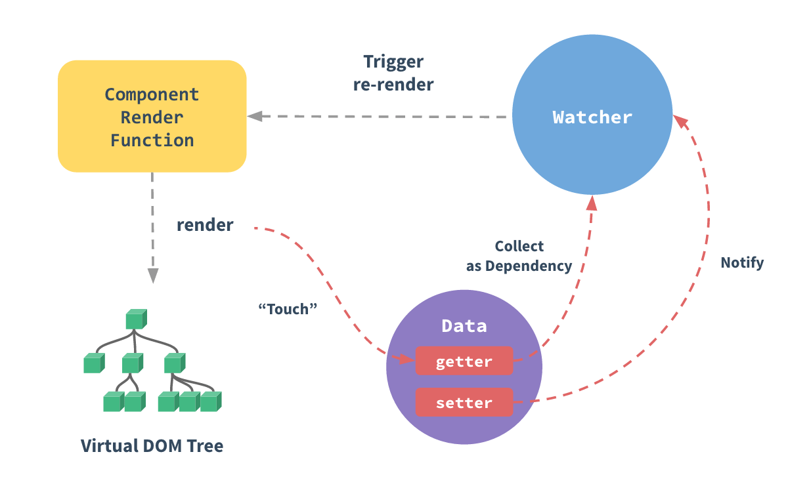

### 一、Vue简介

------

#### 1.1 简介


Vue (读音 /vjuː/，类似于 view) 是一套用于构建用户界面的渐进式的js框架，发布于 2014 年 2 月。与其它大型框架不同的是，Vue 被设计为可以自底向上逐层应用。Vue 的核心库只关注视图层，不仅易于上手，还便于与第三方库（如：vue-router，vue-resource，vuex）或既有项目整合。


#### 1.2 MVVM 模式的实现者——双向数据绑定模式  MVC


 

- Model：模型层，在这里表示 JavaScript 对象
- View：视图层，在这里表示 DOM（HTML 操作的元素）
- ViewModel：连接视图和数据的中间件，Vue.js 就是 MVVM 中的 ViewModel 层的实现者

 


在 MVVM 架构中，是不允许 数据 和 视图 直接通信的，只能通过 ViewModel 来通信，而 ViewModel 就是定义了一个Observer` 观察者

 

- ViewModel 能够观察到数据的变化，并对视图下对应的内容进行更新
- ViewModel 能够监听到视图的变化，并能够通知数据发生改变

 

至此，我们就明白了，Vue.js 就是一个 MVVM 的实现者，他的核心就是实现了 DOM 监听 与 数据绑定


#### 1.3 其它 MVVM 实现者  angularjs -- vue - reactjs


 

-  AngularJS
  简单介绍一下，AngularJS诞生于2009年，由Misko Hevery 等人创建，后为Google所收购。是一款优秀的前端JS框架，已经被用于Google的多款产品当中。AngularJS有着诸多特性，最为核心的是：MVVM、模块化、自动化双向数据绑定、语义化标签、依赖注入等等。 
-  ReactJS
  React引入了虚拟DOM（Virtual DOM）的机制：在浏览器端用Javascript实现了一套DOM API。基于React进行开发时所有的DOM构造都是通过虚拟DOM进行，每当数据变化时，React都会重新构建整个DOM树，然后React将当前整个DOM树和上一次的DOM树进行对比，得到DOM结构的区别，然后仅仅将需要变化的部分进行实际的浏览器DOM更新。 
-  微信小程序
  微信小程序的视图层和数据层就是通过MVVM进行绑定的。 

 


#### 1.4 为什么要使用 Vue.js


 

- 轻量级，体积小是一个重要指标。Vue.js 压缩后有只有 20多kb （Angular 压缩后 56kb+，React 压缩后 44kb+）
- 移动优先。更适合移动端，比如移动端的 Touch 事件
- 易上手，学习曲线平稳，文档齐全
- 吸取了 Angular（模块化）和 React（虚拟 DOM）的长处，并拥有自己独特的功能，如：计算属性
- 开源，社区活跃度高

 


#### 1.5 Vue.js 的两大核心要素


##### 1.5.1 数据驱动





当你把一个普通的 JavaScript 对象传给 Vue 实例的 data 选项，Vue 将遍历此对象所有的属性，并使用 Object.defineProperty 把这些属性全部转为 getter/setter。Object.defineProperty 是 ES5 中一个无法 shim 的特性，这也就是为什么 Vue 不支持 IE8 以及更低版本浏览器。

 

这些 getter/setter 对用户来说是不可见的，但是在内部它们让 Vue 追踪依赖，在属性被访问和修改时通知变化。这里需要注意的问题是浏览器控制台在打印数据对象时 getter/setter 的格式化并不同，所以你可能需要安装 vue-devtools 来获取更加友好的检查接口。

 

每个组件实例都有相应的 watcher 实例对象，它会在组件渲染的过程中把属性记录为依赖，之后当依赖项的 setter 被调用时，会通知 watcher 重新计算，从而致使它关联的组件得以更新。


##### 1.5.2 组件化


 

- 页面上每个独立的可交互的区域视为一个组件
- 每个组件对应一个工程目录，组件所需的各种资源在这个目录下就近维护
- 页面不过是组件的容器，组件可以嵌套自由组合（复用）形成完整的页面

 


### 二、Vue的初体验

------

#### 2.1在页面引入vue的js文件即可。


注意：cdn是一种加速策略，能够快速的提供js文件


```html
<script src="https://cdn.bootcss.com/vue/2.5.17-beta.0/vue.min.js"></script>
```


#### 2.2 在页面中绑定vue元素


```html
创建一个div，id是app
<div id="app"></div>
```


#### 2.3 创建vue对象，设计对象的内容


其中该vue对象，绑定了页面中id是app的那个div


```html
<script>
		new Vue({
			el:"#app",
			data:{
				title:"hello vue!",
                  args1:"hi!",
                 age:18,
                flag:true
			}
		});
</script>
```


```html
 #  el: element的简称，也就是Vue实例挂载的元素节点，值可以是 CSS 选择符，或实际 HTML 元素，或返回 HTML 元素的函数。
 #  data: 用于提供数据的对象，里面存放键值对数据。
```


#### 2.4 在页面的元素中使用插值表达式来使用vue对象中的内容


```html
<div id="app">
	{{ title }}  el表达式  可以属性值和方法结果
</div>
```


### 三、 插值表达式

------

插值表达式的作用是在View中获得Model中的内容

 

Model中的内容如下：


```javascript
new Vue({
		el:"#app",
		data:{
			title:"hello world!"
		},
		methods:{
			sayHello:function(){
				return "hello vue";
			}
		}
	});
```


#### 3.1 简单使用插值表达式获取数据


```html
<div id="app">
	{{title}}
</div>
```


此时，页面上将会显示"Hello world!"


#### 3.2 在插值表达式中获取数组中的内容


```html
<div id="app">
	{{[1,2,3,4][2]}}
</div>
```


此时，页面上会显示“3”，也就是数组中的第三个元素被获取。


#### 3.3 使用插值表达式获取对象中的属性


```html
<div id="app">
	{{ {"name":"xiaoyu","age":20}.age }}
</div>
```


此时，页面上会显示“20”，也就是对象中age属性的值。


#### 3.4 使用插值表达式调用Vue中的方法


```html
<div id="app">
		{{ sayHello()}}
</div>
```


此时，页面上会显示“hello vue”，也就是调用了vue对象中的sayHello方法，并展示了方法的返回值。


### 四、Vue对象总结

------

Vue.js通过加载js，实现对页面的快速渲染。vue封装的js该如何使用？ 就必须了解MVVM双向数据绑定模式。Vue将视图层和数据层分离，通过MVVM建立视图层和数据层的连接。其中，插值表达式是一种连接方式，可以通过插值表达式以多种方式，快速的从数据层获取数据并展示在视图层上。数据层Vue对象，也是由很多部分组成，比如之前介绍的el，data，methods等，以及之后要介绍的mount，computed等。


### 五、Vue的分支 v-if

------

#### 5.1 v-if


Vue中的分支语句v-if非常好理解，逻辑跟Java中的if-else相同。v-if语句块包含以下内容：

 

- v-if
- v-else
- v-else-if

 

接下来以一个简单例子即可理解：


```html
<html>
	<head>
		<meta charset="utf-8">
		<title></title>
	</head>
	<body>
		<div id="app">
			<p v-if="flag">
				今天天气很舒服！
			</p>
			<p v-else-if="rich">
				今天天气很燥热！晚上要去放松一下！
			</p>
			<p v-else="rich">
				晚上只能自嗨！
			</p>
		</div>
		
	</body>
	<script src="https://cdn.bootcss.com/vue/2.6.10/vue.js"></script>
	<script>
		
		new Vue({
			
			el:'#app',
			data:{
				flag:false,
				rich:false
			},
			methods:{
				
			}
		});
		
		
	</script>
</html>
```


从这个例子可以看出，vue对象中的data提供了分支的条件。根据条件，如果是true，则v-if的内容就会显示，反之不显示。


#### 5.2 v-show


v-if和v-show之间有着看似相同的效果，但优化上却有区别。先看下面这个例子：


```html
<html>
	<head>
		<meta charset="utf-8">
		<title></title>
	</head>
	<body>
		
			<p v-show="rich">
				有钱！
			</p>
			<p v-if="rich">
				有钱！
			</p>
			<button type="button" @click="rich=!rich">今晚彩票开奖</button>
		</div>
		
	</body>
	<script src="https://cdn.bootcss.com/vue/2.6.10/vue.js"></script>
	<script>
		
		new Vue({
			
			el:'#app',
			data:{
				flag:false,
				rich:false
			},
			methods:{
				
			}
		});
		
		
	</script>
</html>
```


通过点击“今晚彩票开奖”按钮，能切换rich的值，此时发现，v-if和v-show的显示状态都会来回切换。看起来是一样的，但通过查看控制台代码发现，v-show实际会将p标签的css样式的display属性设为none来达到隐藏的效果。


而v-if是直接在页面上添加和删除p标签来达到效果，因此v-show在反复切换的应用场景下，效率比v-if更高。


### 六、Vue的循环 v-for

------

Vue中的循环关键字并没有Java的那么多，只有v-for，但用法上有多种。接下来我们来逐一介绍。


#### 6.1 普通的for循环


我们需要定义数据源，然后通过v-for来遍历数据源，再使用差值表达式输出数据。


```html
<body>

<div id="app">

    <ul>
        <li v-for="a in args">{{a}}</li>
    </ul>

</div>
</body>

<script src="https://cdn.bootcss.com/vue/2.6.10/vue.js"></script>
<script>

    new Vue({
        el:'#app',
        data:{
            args:[1,2,3,4,5,6]
        }
    });

</script>
```


在这个例子中，数据源提供了一个数组。视图层通过v-for来循环输出多个li标签，非常简单。


#### 6.2 带着索引的for


```html
<body>

<div id="app">

    <ul>
        <li v-for=" (a,i)  in  args" :key='i'>{{i}}{{a}}</li>
    </ul>

</div>
</body>

<script src="https://cdn.bootcss.com/vue/2.6.10/vue.js"></script>
<script>

    new Vue({
        el:'#app',
        data:{
            args:[1,2,3,4,5,6]
        }
    });

</script>
```


此时的i就是每次循环的循环变量 ，从0开始一直到元素个数-1


#### 6.3 遍历一个对象中的信息： v、k、i （value  key  index）


```html
<body>

<div id="app">

    <ul>
        <li v-for="(v,k,i) in student">{{i+1}}--{{k}}--{{v}}</li>
    </ul>

</div>
</body>

<script src="https://cdn.bootcss.com/vue/2.6.10/vue.js"></script>
<script>

    new Vue({
    	el:'#app',
    	data:{
       	 	student:{
            	username:'小鱼',
				age:20,
				girl:'如花'
        	}
    	}
	});

</script>
```


v、k、i 这几个字符可以自己定义，分别表示每次循环内容的值、键、序号。

 

- v: 循环中每条数据的值  小鱼、20、如花
- k: 循环中每天数据的键  username、age、girl
- i: 循环的序号，从0开始

 

| 页面效果如下：                                               |
| ------------------------------------------------------------ |
|  |


#### 6.4 遍历一个对象数组：嵌套的for循环  二维表


```html
<body>

<div id="app">

    <ul>
        <li v-for=" student in students">
        	<span v-for="(v,k,i) in student">{{i+1}}--{{k}}--{{v}}</span>
    	</li>
    </ul>

</div>
</body>

<script src="https://cdn.bootcss.com/vue/2.6.10/vue.js"></script>
<script>

    new Vue({
    	el:'#app',
    	data:{
       	 	students:[
            	{
                	name:'xiaoming',
                	age:20
            	},
            	{
                	name:'xiaowang',
                	age:21
            	}
        	]
    	}
	});

</script>
```


可以清楚的看到，此时数据源是一个student数组，通过两层v-for循环，外层遍历数组中的每个student对象，内层v-for遍历每个对象的v、k、i。

 

页面效果如下：


### 七、Vue的属性绑定

------

Vue提供了多个关键字，能快速的将数据对象中的值绑定在视图层中。


#### 7.1 v-model


通过v-model将标签的value值与vue对象中的data属性值进行绑定。


```html
<html>
	<head>
		<meta charset="utf-8" />
		<title></title>
	</head>
	<body>
		<div id="app">
			<input type="text" v-model="title">
			{{title}}
		</div>
	</body>
	<script src="https://cdn.jsdelivr.net/npm/vue/dist/vue.js"></script>
	<script type="text/javascript">
		new Vue({
			el:'#app',
			data:{
				title:"hello vue"
			}
			
		})
	</script>
</html>
```


此时input标签中加入了“v-model='title'”，表示input的value值与vue对象中的title属性绑定，当在input输入框中输入内容会实时修改title的值。于是{{title}}插值表达式能实时输出input输入框内的值。

| 页面效果如下：                                               |
| ------------------------------------------------------------ |
|  |


#### 7.2 v-bind


我们知道插值表达式是不能写在html的标签的属性内的，那如果一定要用vue中的属性作为html标签的属性的内容，就可以通过v-bind进行属性绑定。


```html
<html>
	<head>
		<meta charset="utf-8" />
		<title></title>
	</head>
	<body>
		<div id="app">
			<a v-bind:href="link">点我</a>
		</div>
	</body>
	<script src="https://cdn.jsdelivr.net/npm/vue/dist/vue.js"></script>
	<script type="text/javascript">
		new Vue({
			el:'#app',
			data:{
				link:'http://www.baidu.com'
			}
		})
	</script>
</html>
```


这样，a标签内的href属性就可以使用vue对象中的属性值。

 

注意： v-bind也可以简写，使用冒号“:”来代替。


```html
<a v-bind:href='link'></a>  ==>  <a :href='link'>
```


### 八、Vue的事件绑定

------

关于事件，要把握好三个步骤：设参、传参和接参。


```html
<html>
	<head>
		<meta charset="utf-8" />
		<title></title>
	</head>
	<body>
		<div id="app">
			sum={{sum}}<br/>
			{{sum>10?'总数大于10':'总数不大于10'}}<br/>
			<button type="button" @click="increase(2)">增加</button>
		</div>
	</body>
	<script src="https://cdn.jsdelivr.net/npm/vue/dist/vue.js"></script>
	<script type="text/javascript">
		new Vue({
			el:'#app',
			data:{
				sum:0
			},
			methods:{
				increase:function(s){
					this.sum+=s
				}，

        btn:function (event){
               // var inputer = this.$refs.inputer;
               // this.file = inputer.file[0];
                //let files = document.getElementById("file").files

               this.file = event.target.files;

               let formData = new FormData();
               formData.append("file",this.file[0])

               var vm = this;

               $.ajax({
                   method:"post",
                   url:"/upload",
                   contentType:false,
                   data: formData,
                   cache: false, //上传文件无需缓存
                   processData: false, //用于对data参数进行序列化处理 这里必须false
                   success:function (res){
                      console.log(res)
                   }
               });

           }
			}
		})
	</script>
</html>
```


从这里例子中：


- 设参：


```html
<button type="button" @click="increase(2)">增加</button>
```


- 传参：


```javascript
increase:function(s)
```


- 接参：


```javascript
this.sum+=s
```


接下来我们来看一下VUE中如何进行事件绑定。


#### 8.1 v-on


通过配合具体的事件名，来绑定vue中定义的函数


```html
<html>
	<head>
		<meta charset="utf-8" />
		<title></title>
	</head>
	<body>
		<div id="app">
			<input type="text" v-on:click="changeMajor"  />
		</div>
	</body>
	<script src="https://cdn.jsdelivr.net/npm/vue/dist/vue.js"></script>
	<script type="text/javascript">
		new Vue({
    		el:'#app',
    		data:{
        		major:'java'
    		},
    		methods:{
        		sayHi:function(){
            		alert("HELLO VUE!");
        		},
        		changeMajor:function(){
            		console.log("change Title")
        		}
    		}
	</script>
</html>
```


此时，该按钮，在点击时将会调用Vue对象中定义的changeMajor方法。

 

注意： v-on也可以简写，使用"@"替代。


```html
<input type="text" @click="changeMajor"  />
```


#### 8.2 事件修饰符(了解)


可以使用Vue中定义好的事件修饰符，快速达到效果。查看以下例子：


```html
<html>
	<head>
		<meta charset="utf-8" />
		<title></title>
	</head>
	<body>
		<div id="app">
			<p @mousemove="mm">
				x:{{x}}
				y:{{y}}
				<span  @mousemove.stop>鼠标移动到此即停止</span>
			</p>
		</div>
	</body>
	<script src="https://cdn.jsdelivr.net/npm/vue/dist/vue.js"></script>
	<script type="text/javascript">
		new Vue({
			el:'#app',
			data:{
				x:0,
				y:0
			},
			methods:{
				mm:function(event){
					this.x = event.clientX;
					this.y = event.clientY;
				},
				stopm:function(event){
					event.stopPropagation();
				}	
			}
		})
	</script>
</html>
```


当鼠标经过P标签区域内时，区域内就会显示X和Y轴的坐标，如果经过P标签内的Span标签内时，此时会调用事件属性mousemove.stop预定的效果，鼠标移动的效果将会被取消，X和Y不再显示信息。


#### 8.3计算属性：computed（了解）


##### 8.3.1 什么是计算属性


计算属性的重点突出在 属性 两个字上（属性是名词），首先它是个 属性 其次这个属性有 计算 的能力（计算是动词），这里的 计算 就是个函数；简单点说，它就是一个能够将计算结果缓存起来的属性（将行为转化成了静态的属性），仅此而已；


##### 8.3.2 计算属性与方法的区别


```html
<!DOCTYPE html>
<html>
<head>
    <meta charset="UTF-8">
    <title>布局篇 计算属性</title>
    <script src="https://cdn.jsdelivr.net/npm/vue@2.5.21/dist/vue.js"></script>
</head>
<body>

<div id="vue">
    <p>调用当前时间的方法：{{currentTime1()}}</p>
    <p>当前时间的计算属性：{{currentTime2}}</p>
</div>

<script type="text/javascript">
    var vm = new Vue({
        el: '#vue',
        data: {
            message: 'Hello Vue'
        },
        methods: {
            currentTime1: function () {
                return Date.now();
            }
        },
        computed: {
            currentTime2: function () {
                this.message;
                return Date.now();
            }
        }
    });
</script>
</body>
</html>
```


说明

 

- methods：定义方法，调用方法使用 currentTime1()，需要带括号
- computed：定义计算属性，调用属性使用 currentTime2，不需要带括号；this.message 是为了能够让 currentTime2 观察到数据变化而变化

计算属性：定义的方式，跟我methods定一样的，使用的时候又是采用变量的形式

  计算属性和data区别在，计算属性定义的一个全局变量，data定义的时候局部变量

 

注意：methods 和 computed 里不能重名


##### 8.3.3 测试效果


仔细看图中说明，观察其中的差异


##### 8.3.4 结论


调用方法时，每次都需要进行计算，既然有计算过程则必定产生系统开销，那如果这个结果是不经常变化的呢？此时就可以考虑将这个结果缓存起来，采用计算属性可以很方便的做到这一点；计算属性的主要特性就是为了将不经常变化的计算结果进行缓存，以节约我们的系统开销


### 九、Vue的组件化（抽象）

------

#### 9.1 什么是“组件化”


Vue的组件化设计思想借鉴了Java的面向对象思想。Java认为万物皆对象，在Vue中，万物皆组件。

 

也就是说，在实际的vue项目中，以及使用了Vue框架的项目中，Vue的对象都会以组件的形式出现，能被反复使用。

 

要想实现组件化，需要在页面中注册组件：关于注册的方式有两种，分别是全局注册和本地注册。


##### 9.1.1 组件的全局注册


```html
<!DOCTYPE html>
<html lang="en">
<head>
    <meta charset="UTF-8">
    <title>vue组件的全局注册</title>
</head>
<body>

    <div id="app">

        <model1></model1>
        <model1></model1>
        <model1></model1>

    </div>
        <hr/>
    <div id="app1">

        <model1></model1>
        <model1></model1>
        <model1></model1>

    </div>


</body>

<script src="https://cdn.bootcss.com/vue/2.6.10/vue.js"></script>
<script>
	//通过Vue.component实现组件的全局注册，全局注册后的组件可以被重复使用。
    Vue.component("model1",{

        template:"<div><h1>{{title}}</h1><button type='button' @click='btnfn'>点我</button></div>",
        data:function(){
            return {
                title:"hello vue"
            }
        },
        methods:{
            btnfn:function(){
                alert("hello !!!");
            }
        }
    });

    new Vue({
        el:'#app'
    })
    new Vue({
        el:'#app1'
    })


</script>

</html>
```


##### 9.1.2 组件的本地注册


vue的全局注册，也就意味着在页面的任意一个被vue绑定过的div中，都可以使用全局注册了的vue组件。

 

但是，如果是对vue组件进行本地注册，那么在其他被vue绑定的div中，不能使用该组件。


```html
<!DOCTYPE html>
<html lang="en">
<head>
    <meta charset="UTF-8">
    <title>vue组件的本地(局部)注册</title>
</head>
<body>

    <div id="app">

        <model11></model11>
    </div>
	<hr/>
    <!--在这里使用组件model11会报错-->
    <div id="app1">
        <model11></model11>
    </div>


</body>

<script src="https://cdn.bootcss.com/vue/2.6.10/vue.js"></script>
<script>

    new Vue({
        el:'#app',
        components:{
            "model11":{

                template:"<div><h1>{{title}}</h1><button type='button' @click='btnfn'>点我</button></div>",
                data:function(){
                    return {
                        title:"hello vue"
                    }
                },
                methods:{
                    btnfn:function(){
                        alert("hello !!!");
                    }
                }
            }
        }
    })
    new Vue({
        el:'#app1'
    })

</script>
```


##### 9.1.3 小结


这是一个完整的Vue组件。该组件包含了三个部分：template（html视图层内容）、script（Model层）、style（CSS样式）。这样封装好的组件可以被复用，也可以作为其他组件的组成部分而被封装——Java的面向对象再次体现。

 

-  **特点1： template标签内，必须有且只能有一个根标签。** 
-  **特点2： componet中注册的组件中的data，必须是函数的形式。**
  如下： 

 


```html
data:function(){
return {
title:"hello vue"     
} 
}
```


#### 9.2 组件的生命周期


Vue中的组件也是有生命周期的。一个Vue组件会经历：初始化、创建、绑定、更新、销毁等阶段，不同的阶段，都会有相应的生命周期钩子函数被调用。


```html
<html>
	<head>
		<meta charset="UTF-8">
		<title>生命周期</title>
	</head>
	<body>
		<div id="app1">
			{{title}}
			<button type="button" @click="changeTitle">change title</button>
			<button type="button" @click="destroy">destroy</button>
		</div>
	</body>
	<script src="https://cdn.bootcss.com/vue/2.5.17-beta.0/vue.min.js"></script>
	<script>
		new Vue({
			el:"#app1",
			data:{
				title:"this is title"
			},
			methods:{
				changeTitle:function(){
					this.title= "new title";
				},
				destroy:function(){
					this.$destroy();
				}
			},
			beforeCreate(){
				console.log("beforeCreate")
			},
			created(){
				console.log("created")
			},
			beforeMount(){
				console.log("beforeMount")
			},
			mounted(){
				console.log("mounted")
			},
			beforeUpdate(){
				console.log("beforeUpdate")
			},
			updated(){
				console.log("updated")
			},
			beforeDestroy(){
				console.log("beforeDestory")
			},
			destroyed(){
				console.log("destory")
			}
		})
	</script>
</html>
```

| 组件的生命周期钩子                                           |
| ------------------------------------------------------------ |
|  |

作业：

采用ajax 编写我的登录和注册

### 十、使用Vue-Cli搭建Vue项目

------

#### 10.1 什么是vue-cli 等同于我的maven


cli: Command Line 命令行工具，vue-cli就是vue的命令行工具，也称之为脚手架，使用vue-cli提供的各种命令可以拉取、创建、运行我们需要使用到的框架，比如webpack、Element UI、Element Admin等等。那么要想使用vue-cli命令，需要先安装node.js。


#### 10.2 node.js的介绍及安装


##### node.js的介绍=等同于tomcat


node.js提供了前端程序的运行环境，可以把node.js理解成是运行前端程序的服务器。


##### node.js的安装


从官网下载安装即可：
http://nodejs.cn/download/

https://nodejs.org/zh-cn/

https://nodejs.org/en/download/releases/


**建议：不要安装到系统C盘**


完成后 配置环境变量：D:\install\nodejs\（自己的路径）

| 测试node.js是否安装成功： 在DOS窗口中输入“node -v” 查看版本，如果看到版本，就表示安装成功。 |
| ------------------------------------------------------------ |
|  |


#### 10.3 使用node.js安装vue-cli


使用如下命令安装vue-cli


```bash
npm install vue-cli -g
```


 

- npm： 使用node.js的命令
- install： 安装
- vue-cli： 要安装的vue-cli
- -g： 全局安装

 

| 当出现以下界面，表示正在安装：                               |
| ------------------------------------------------------------ |
|  |


如果使用npm官方镜像速度比较慢，可以使用淘宝镜像来安装：


```bash
npm install -g cnpm --registry=https://registry.npm.taobao.org  镜像
```


之后使用npm命令时就可以替换成cnpm


```bash
cnpm install vue-cli -g


cnpm install cnpm run dev
```


#### 10.4 使用vue-cli下载项目骨架搭建我们的项目


就像maven一样，vue为我们提供了一些官方项目骨架。使用vue list命令可以列出当前官方提供的骨架，可以使用这些骨架来快速搭建出项目。 受网速影响


```bash
vue list
```


#### 10.5 创建项目目录并打开


需要去我们的工作空间，去手动新建一个项目目录


```bash
mkdir e:/my-vue-projectcd e:/my-vue-project
```


#### 10.6 使用Webpack骨架快速创建项目


在my-vue-project目录中使用以下命令下载项目骨架


```bash
vue init webpack my-project1
```


 

- webpack: 骨架名称
- my-project1: 项目名称

 


| 过程中会出现如下界面，需要手动操作。                         |
| ------------------------------------------------------------ |
|  |

| 出现如下界面，表示安装成功。                                 |
| ------------------------------------------------------------ |
|  |


进入到my-project1文件夹内后，使用以下命令来运行项目。


```bash
npm run dev
```


| 访问http://localhost:8081，页面效果如下：                    |
| ------------------------------------------------------------ |
|  |

| 此时，项目目录及各目录介绍如下：                             |
| ------------------------------------------------------------ |
|  |


#### 10.7 webpack项目的几个常用命令


 

-  npm install 或者 cnpm install
  在运行和调试项目前，一般都需要先执行该命令，目的是安装项目运行所需要的环境。 
-  npm run dev 或者 cnpm run dev
  以调试的方式运行项目 
-  npm run build
  生成用于项目部署所需的最小资源，生成的内容存放在build文件夹内。 

 


### 十一、Vue组件间的参数传递

------

#### 11.1 idea中安装Vue插件


在idea中下载vue插件


在idea中配置，让idea能够操作.vue文件


​	


#### 11.2 在项目中创建子组件


创建子组件Content组件


```html
<template>
    <div>
      商品列表...
      {{MyTitle}}
      <button type="button" @click="btnfn('hello java')">点我</button>
    </div>
</template>

<script>
    export default {
        name: "Content.vue",
        props:{
          'MyTitle':{
            type:String,
            required:true,
            default:'XX'
          },
          'btnfn':{
            type:Function
          }
        }
    }
</script>

<style scoped>

</style>
```


#### 11.3 注册子组件


在main.js中注册子组件


```javascript
import Vue from 'vue'
import App from './App.vue'
//引入Content
import Content from './components/Content'


//全局注册组件
Vue.component('MyContent',Content);

new Vue({
  el: '#app',
  render: h => h(App)
})
```


#### 11.4 在App.vue中使用组件并传递参数


```html
<template>
  <div id="app">
		<MyContent :MyTitle="msg"  :btnfn="FCfn" ></MyContent>
  </div>
</template>

<script>
  import MHeader from './components/Header'
export default {
  name: 'app',
  data(){
    return {
      msg:'hello vue!!'
    }
  },
  components:{
    "MHeader":MHeader
  },
  methods:{
    FCfn:function(m){//hello java
      this.msg = m;
    }
  }

}
</script>
<style>

</style>
```


#### 11.5 父传子


通过子组件的props部分，来指明明接收的参数，父组件通过在标签中写明参数的键值对来传递参数。

 

​	props是表示一个组件的参数部分，那么props的写法有两种：

 

​		1）props:[参数列表]

 

​		比如： props:['MyProp1','MyProp2',...]

 

​		2）props:{参数名1:{type:String,required:true,default:'XX'},参数名2:{...}}


#### 11.6 子传父


子传父的过程十分复杂，下列图解中已经配上了详细的步骤。


### 十二、Vue-router 路由  

------

#### 12.1 安装路由模块


第一步：采用下面命令安装我们的router


```shell
npm install vue-router -s
```


第二步：在src 新建一个router文件夹，router文件里面创建一个index.js(这个是默认文件名字)


第三步：导入vue和router路径


import Vue from 'vue'
import router from './router'  //引入路由模块


第四步：配置我们自己的组件路由


​	a.导入我们的组件路径（绝对路径（@）和相对路径（../））


​			import MyRouter from '@/components/MyRouter'


​	b.配置我们的route，配置一个path和component


```javascript
routes: [
  {
    path:'/MyRouter',  //给一个组件设置路径
    component: MyRouter
  }
]
```


第五步：在App.vue 中写上我的 标签，把所有的路由表加入的App组件中


第六步：导入我们的路由; 在new Vue中注册我们的 路由


```javascript
import router from './router'

new Vue({
  el: '#app',
  router, //注册路由
  components: { App },
  template: '<App/>'
})
```


#### 12.2 引入路由模块并使用


在main.js中引入路由模块并使用


```javascript
import Vue from 'vue'
import App from './App'
import router from './router'  //引入路由模块

Vue.config.productionTip = false

/* eslint-disable no-new */
new Vue({
  el: '#app',
  router, //使用路由模块
  components: { App },
  template: '<App/>'
})
```


注意事项：

```java
解决“export ‘default‘ (imported as ‘VueRouter‘) was not found in ‘vue-router‘问题


npm i vue-router@3.1.3
    
```


#### 12.3 路由初体验


##### 12.3.1 创建App.vue


```html
<template>
  <div id="app">
    <ul class="nav nav-tabs">
      <li role="presentation" class="active"><router-link to="/Home">首页</router-link></li>
      <li role="presentation"><router-link to="/Product">商品列表</router-link></li>
    </ul>
    <router-view/>
  </div>
</template>

<script>
export default {
  name: 'App'
}
</script>
```


改变url，发现中的内容发生改变

 

- http://localhost:8080/#/	显示home
- http://localhost:8080/#/user   显示user

 

向router实例中添加mode属性：

 

- 值"hash": url带#  适用于调试模式
- 值"history"  url不带#

 


##### 12.3.2 创建Home.vue


```html
<template>
    <div>首页</div>
</template>

<script>
export default {
    name: "Home"
}
</script>

<style scoped>

</style>
```


##### 12.3.3 创建Product.vue


```html
<template>
    <div>商品列表 商品的id:{{id}}</div>
</template>

<script>
export default {
    name: "Product",
    data(){
      return{
        id:this.$route.params.id //接参
      }
    }
}
</script>

<style scoped>

</style>
```


##### 12.3.4 修改静态路由表


修改路由表src/router/index.js


```javascript
import Vue from 'vue'
import Router from 'vue-router'
import HelloWorld from '@/components/HelloWorld'
import Home from "../components/Home";
import Product from "../components/Product";

Vue.use(Router)

export default new Router({
  routes: [
    {
      path:'/Home',
      component: Home
    },
    {
      path:'/Product/:id', //设参
      component:Product
    }
  ]
})
```


#### 


#### 12.4 参数的传递


在路由表中设参


```javascript
export default new Router({
  routes: [
	...
    {
      path:'/Product/:id', //设参
      component:Product
    }
  ]
})
```


在App.vue中传参


```html
<template>
  <div id="app">
    <ul class="nav nav-tabs">
      ...
      <li role="presentation"><router-link to="/Product/1">商品列表</router-link></li>
      ...
    </ul>
    <router-view/>
  </div>
</template>
```


在Product.vue中接参


```javascript
<template>
    <div>商品列表 商品的id:{{id}}</div>
</template>

<script>
export default {
    name: "Product",
    data(){
      return{
        id:this.$route.params.id //接参
      }
    }
}
</script>

<style scoped>

</style>
```


#### 12.5 程序式路由的实现


使用进行路由跳转是有局限性的，可以通过this.$router.push('/Product/1'）的js方式实现路由跳转，更加灵活。


```html
<template>
  <div id="app">
    <ul class="nav nav-tabs">
      <li role="presentation" class="active"><router-link to="/Home">首页</router-link></li>
      <li role="presentation"><router-link to="/Product">商品列表</router-link></li>
      <button type="button" @click="btnfn">点我</button>
    </ul>
    <router-view/>
  </div>
</template>

<script>
export default {
  name: 'App',
  methods:{
    btnfn(){
      //代替router-link实现路由跳转
      this.$router.push("/Product/1");
    }
  }

}
</script>
```


### 十三、使用Axios发送请求

------

#### 13.1  什么是 Axios


Axios 是一个开源的可以用在浏览器端和 NodeJS 的异步通信框架，她的主要作用就是实现 AJAX 异步通信，其功能特点如下：


- 从浏览器中创建 XMLHttpRequests
- 从 node.js 创建 http 请求
- 支持 Promise API
- 拦截请求和响应
- 转换请求数据和响应数据
- 取消请求
- 自动转换 JSON 数据
- 客户端支持防御 XSRF（跨站请求伪造）


GitHub：https://github.com/axios/axios


#### 13.2 为什么要使用 Axios


由于 Vue.js 是一个 视图层框架 并且作者（尤雨溪）严格准守 SoC （关注度分离原则），所以 Vue.js 并不包含 AJAX 的通信功能，为了解决通信问题，作者单独开发了一个名为 vue-resource 的插件，不过在进入 2.0 版本以后停止了对该插件的维护并推荐了 Axios 框架


#### 13.3 Axios的使用


##### 13.3.1 安装vue axios


```bash
npm install --save axios vue-axios
```


##### 13.3.2 在main.js中引入


在项目中使用axios模块


```javascript
import Vue from 'vue'
import axios from 'axios'
import VueAxios from 'vue-axios'

Vue.use(VueAxios, axios)
```


##### 13.3.3 发送ajax请求


```javascript
<template>
  <div id="app">
    <div style="width:50%" class="container">
      <div>
        <h3>Regist</h3>
        <h5>Email</h5>
        <input type="text" class="form-control" v-model="mail" /><br />
        {{mail}}
        <h5>Password</h5>
        <input type="password" class="form-control" v-model="password" /><br />
        {{password}}
        <h5>Gender</h5>
        <input type="radio" name="gender" v-model="gender" value="female" />男
        <input type="radio" name="gender" v-model="gender" value="male" />女<br />
        <h5>Hobby</h5>
        <input type="checkbox" name="hobby" v-model="hobby" value="music">音乐
        <input type="checkbox" name="hobby" v-model="hobby" value="movie">电影
        <input type="checkbox" name="hobby" v-model="hobby" value="sport">运动
        <br/>
        <button type="button" class="btn btn-success" @click="registfn">注册</button>
      </div>
    </div>
  </div>
</template>

<script>
  import MHeader from './components/Header'
export default {
  name: 'app',
  data(){
    return {
      mail:'',
      password:'',
      gender:'',
      hobby:''
    }

  },
  methods:{
    registfn:function(){

      this.axios({
        method:'get',
        url:'http://localhost:8090/regist?mail='+this.mail+'&password='+this.password,

      }).then(function (response) {
        console.log(response.data)
      });
    }
  }
}
</script>
```


##### 13.3.4 服务端解决跨域问题


```xml
<mvc:cors>  
    <mvc:mapping path="/"
        allowed-origins="*"
        allowed-methods="POST, GET, OPTIONS, DELETE, PUT,PATCH"
        allowed-headers="Content-Type, Access-Control-Allow-Headers, Authorization, X-Requested-With"
        allow-credentials="true" />
</mvc:cors>
```


在spring-mvc.xml中加入上述这一段。其中，allowed-origins指的是允许的访问源的域名，"*"表示任何人都可以访问，也可以指明具体的域名


##### 13.3.5 解决axios无法传递data中的参数问题


原因：默认情况下发送axios时请求头中的内容类型为： （后端没有使用@RequestBody）


```xml
Content-Type:application/json;charset=UTF-8
```


而实际服务端需要的是：


```html
Content-Type:application/x-www-form-urlencoded
```


因此，使用axios的qs内置库中的方法进行内容类型的转换。


```javascript
import Qs from 'qs'

this.axios({
	method:'post',
	url:'http://localhost:8081/regist',
	transformRequest: [function (data) {
		return Qs.stringify(data)
	}],
	data:{
		email:this.email
	}
})
.then(function (response) {
	alert(response.data.message)
});
```


### 十四、Vue实战项目：Webpack登录验证后路由至列表页

------

| 对项目进行中的内容进行调整，结构如下：                       |
| ------------------------------------------------------------ |
|  |


各部分内容：


#### 14.1 router路由模块： index.js（路由配置表）


```javascript
import Vue from 'vue'
import Router from 'vue-router'

import Login from '../views/Login'
import Home from '../views/Home'


// 安装路由
Vue.use(Router);

// 配置路由
export default new Router({
  routes: [
    {
      // 路由路径
      path: '/Login',
      // 路由名称
      name: 'Login',
      // 跳转到组件
      component: Login
    },
    {
      path:'/Home',
      name:'Home',
      component:Home
    }
  ]
});
```


#### 14.2 使用Element-UI组件库


##### 14.2.1 安装


在项目文件夹内使用命令来安装element-ui模块


```html
npm i element-ui -S
```


##### 14.2.2 使用


在vue项目中引入element-ui并使用。在 main.js 中写入以下内容：


```javascript
import Vue from 'vue';
import ElementUI from 'element-ui'; //加入
import 'element-ui/lib/theme-chalk/index.css';//加入
import App from './App.vue';

Vue.use(ElementUI);//加入

new Vue({
  el: '#app',
  render: h => h(App)
});
```


##### 14.2.3 在Element-UI组件库中查找组件

| 在官方组件库中，根据需求找到组件，然后在项目中使用。         |
| ------------------------------------------------------------ |
|  |


#### 14.3 编写登录组件：Login.vue


```html
<template>
    <div class="login-box">
      <el-form ref="form" :model="form" :rules="rules" label-width="80px">
        <h3>欢迎登录</h3>
        <el-form-item label="用户名" prop="name">
          <el-input v-model="form.name" placeholder="请输入用户名"></el-input>
        </el-form-item>
        <el-form-item label="密码" prop="password">
          <el-input type="password" v-model="form.password" placeholder="请输入密码"></el-input>
        </el-form-item>
        <el-form-item>
          <el-button type="primary" @click="onSubmit('form')">登录</el-button>
        </el-form-item>
      </el-form>
    </div>
</template>

<script>
export default {
    name: "Login",
    data(){
      return{
        form:{
          name:'',
          password:''
        },
        rules:{
          name:[
            { required: true, message: '请输入用户名', trigger: 'blur' },
            { min: 6, max: 20, message: '长度在 6 到 20 个字符', trigger: 'blur' }
          ],
          password:[
            { required: true, message: '请输入密码', trigger: 'blur' },
            { min: 6, max: 20, message: '长度在 6 到 20 个字符', trigger: 'blur' }
          ]
        }
      }

    },
    methods:{
      onSubmit(formName){
        this.$refs[formName].validate((valid) => {
          var vm = this;
          if (valid) {
            // 发送axios请求
            this.axios({
              method:'post',
              url:'http://localhost:8090/login',
              data:{
                name:vm.form.name,
                password:vm.form.password
              }
            }).then(function(resp){
              // console.log(resp.data)
              if(resp.data.errno==0){

                //登录成功，要向vuex中存放user对象
                var user  = resp.data.data;
                vm.$store.dispatch('asyncUpdateUser', user);
                vm.$message({
                  message: '登录成功',
                  type: 'success'
                });
                setTimeout(function(){
                  vm.$router.push("/Home")
                },2000)
              }else{
                vm.$message.error('用户名或密码错误');
              }
            })

          } else {
            this.$message.error('用户名或密码格式错误');
            return false;
          }
        });
      }
    }
}
</script>

<style scoped>
  .login-box{
    width: 500px;
    height: 300px;
    border: 1px solid #DCDFE6;
    margin: 150px auto;
    padding: 20px 50px 20px 30px;
    border-radius: 20px;
    box-shadow: 0px 0px 20px #DCDFE6;
  }
</style>
```


输入的用户名和密码，通过Axios请求去后端做校验，若校验成功则路由至Home组件。

| 登录页面的展示效果：（Element UI）                           |
| ------------------------------------------------------------ |
|  |


#### 14.4 编写入口js：main.js


```javascript
import Vue from 'vue'
import App from './App'
import VueRouter from 'vue-router'
// 导入上面创建的路由配置表
import router from './router'

// 导入ElementUI模块
import ElementUI from 'element-ui';
import 'element-ui/lib/theme-chalk/index.css';
import axios from 'axios'
import VueAxios from 'vue-axios'

Vue.use(VueRouter);

// 使用ElementUI模块
Vue.use(ElementUI);
// 使用Axios （vue中实现ajax功能的组件）
Vue.use(VueAxios, axios)


Vue.config.productionTip = false

/* eslint-disable no-new */
new Vue({
  el: '#app',
  // 配置路由
  router,
  render: h => h(App)
})
```


### 十五、 Vuex的应用

------

#### 15.1 什么是Vuex


Vuex 是一个专为 Vue.js 应用程序开发的 状态管理模式。它采用集中式存储管理应用的所有组件的状态，并以相应的规则保证状态以一种可预测的方式发生变化。


#### 15.2 安装


在项目根目录执行如下命令来安装 Vuex

 

若失败，可使用cnpm


```bash
npm install vuex --save
```


修改 `main.js` 文件，导入 Vuex，关键代码如下：


```javascript
import Vuex from 'vuex'
Vue.use(Vuex);
```


#### 15.3 配置 vuex


##### 15.3.1 创建 Vuex 配置文件


在 src 目录下创建一个名为 store 的目录并新建一个名为 index.js 文件用来配置 Vuex，代码如下：


```javascript
import Vue from 'vue'
import Vuex from 'vuex'
Vue.use(Vuex);

// 全局 state 对象，用于保存所有组件的公共数据
const state = {
  // 定义一个 user 对象
  // 在组件中是通过 this.$store.state.user 来获取
  user: {
    name: ''
  }
};

// 实时监听 state 值的最新状态，注意这里的 getters 可以理解为计算属性
const getters = {
  // 在组件中是通过 this.$store.getters.getUser 来获取
  getUser(state) {
    return state.user;
  }
};

// 定义改变 state 初始值的方法，这里是唯一可以改变 state 的地方，缺点是只能同步执行
const mutations = {
  // 在组件中是通过 this.$store.commit('updateUser', user); 方法来调用 mutations
  updateUser(state, user) {
    state.user = user;
  }
};

// 定义触发 mutations 里函数的方法，可以异步执行 mutations 里的函数
const actions = {
  // 在组件中是通过 this.$store.dispatch('asyncUpdateUser', user); 来调用 actions
  asyncUpdateUser(context, user) {
    context.commit('updateUser', user);
  }
};

export default new Vuex.Store({
  state,
  getters,
  mutations,
  actions
});
```


修改 main.js 增加刚才配置的 store/index.js，关键代码如下：


```javascript
import Vue from 'vue'
import Vuex from 'vuex'
import store from './store'

Vue.use(Vuex);

new Vue({
  el: '#app',
  store
});
```


##### 15.3.2 解决浏览器刷新后 Vuex 数据消失问题


- 问题描述


Vuex 的状态存储是响应式的，当 Vue 组件从 store 中读取状态的时候，若 store 中的状态发生变化，那么相应的组件也会相应地得到高效更新。但是有一个问题就是：vuex 的存储的数据只是在页面的中，相当于我们定义的全局变量，刷新之后，里边的数据就会恢复到初始化状态。但是这个情况有时候并不是我们所希望的。


- 解决方案


监听页面是否刷新，如果页面刷新了，将 state 对象存入到 sessionStorage 中。页面打开之后，判断 sessionStorage 中是否存在 state 对象，如果存在，则说明页面是被刷新过的，将 sessionStorage 中存的数据取出来给 vuex 中的 state 赋值。如果不存在，说明是第一次打开，则取 vuex 中定义的 state 初始值。


- 修改代码


在 App.vue 中增加监听刷新事件


```javascript
  export default {
    name: 'App',
    mounted() {
      window.addEventListener('unload', this.saveState);
    },
    methods: {
      saveState() {
        sessionStorage.setItem('state', JSON.stringify(this.$store.state));
      }
    }
  }
```


修改 store/index.js 中的 state

```JavaScript
const state = sessionStorage.getItem('state') ? JSON.parse(sessionStorage.getItem('state')) : {
  user: {
    name: ''
  }
};
```

