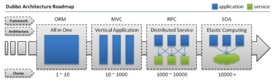
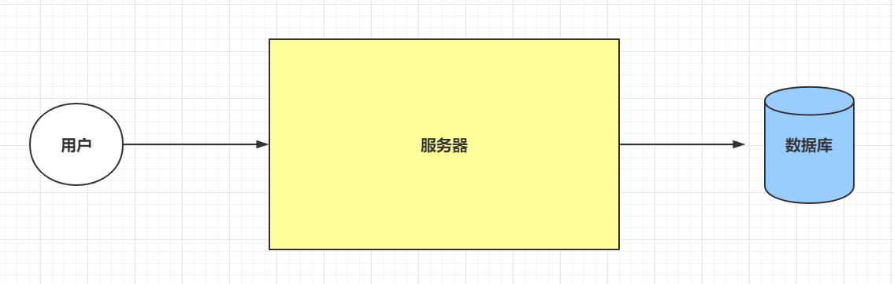
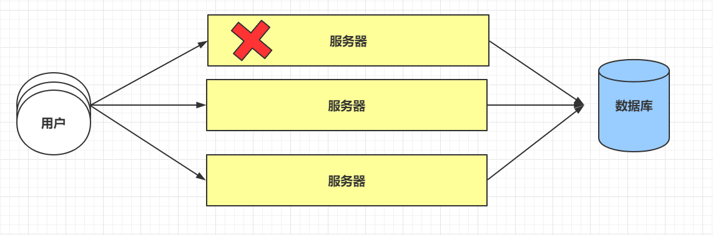
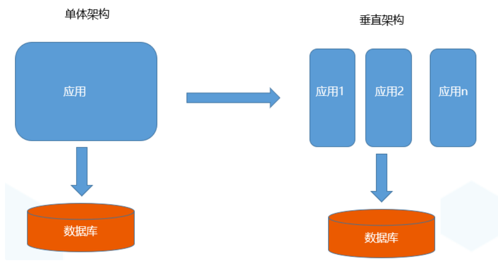
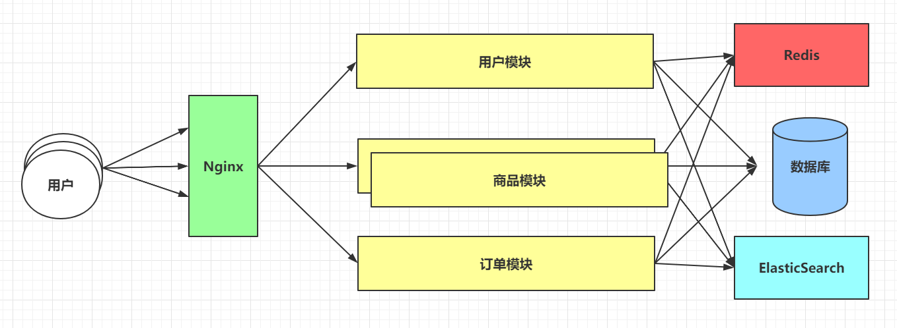
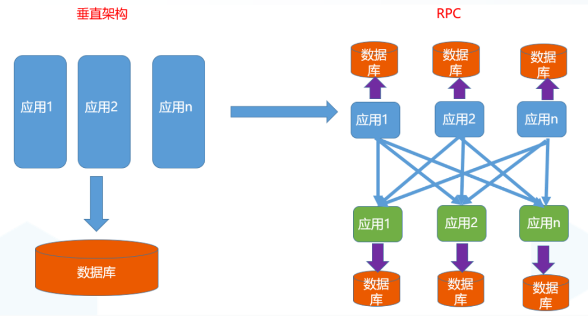
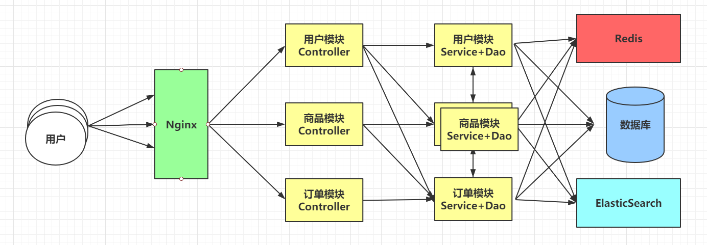
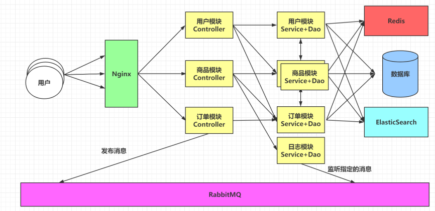
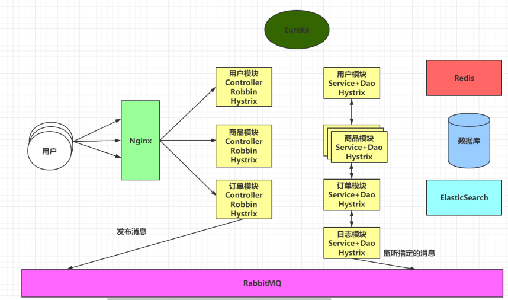
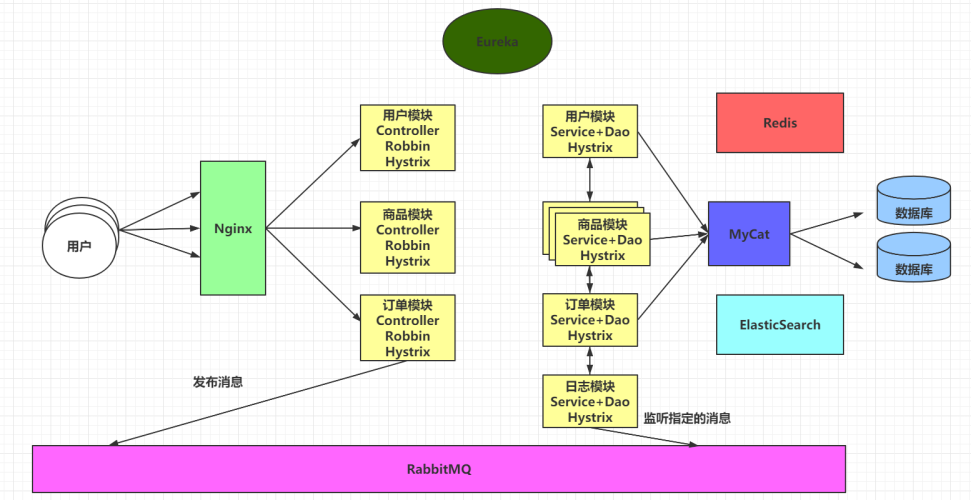

# 架构演进

https://dubbo.apache.org/zh/

https://dubbo.apache.org/zh/docsv2.7/user/preface/background/

随着互联网的发展，网站应用的规模不断扩大，常规的垂直应用架构已无法应对，分布式服务架构以及流动计算架构势在必行。

**单一应用架构**

当网站流量很小时，只需一个应用，将所有功能都部署在一起，以减少部署节点和成本。此时，用于简化增删改查工作量的数据访问框架(ORM)是关键。

**垂直应用架构**

当访问量逐渐增大，单一应用增加机器带来的加速度越来越小，提升效率的方法之一是将应用拆成互不相干的几个应用，以提升效率。此时，用于加速前端页面开发的Web框架(MVC)是关键。

**分布式服务架构**

当垂直应用越来越多，应用之间交互不可避免，将核心业务抽取出来，作为独立的服务，逐渐形成稳定的服务中心，使前端应用能更快速的响应多变的市场需求。此时，用于提高业务复用及整合的分布式服务框架(RPC)是关键。

**流动计算架构 服务器治理**

当服务越来越多，容量的评估，小服务资源的浪费等问题逐渐显现，此时需增加一个调度中心基于访问压力实时管理集群容量，提高集群利用率。此时，用于提高机器利用率的资源调度和治理中心(SOA)是关键。

# 单一应用架构

(ALL IN ONE)

在Web1.0阶段，由于带宽不足，这时的项目大多是内容少，用户量也不多，甚至有一些项目不需要对外开放，对安全性和稳定性的要求是不高的。

# 垂直应用架构

ALL IN ONE 所带来的问题

1. 维护
   + 出现bug 大家全部下线，更新完后全部一起上线
   + 更新功能 大家全部下线，更新完后全部一起上线

2. 版本升级问题
   + 多台服务器，每台服务器都要一起更新
   + 测试，整个系统都要测试一遍

3. 一颗老鼠屎 坏了一锅粥
   + 某个模块非常耗资源，就会导致整个项目瘫痪

项目包含了三个模块，用户模块，商品模块，订单模块。如果商品模块压过大，一般最直接有效的方式就是搭建集群。在单体架构的集群上去搭建，效果相对比较差。

随着项目的不断更新，项目中的功能越来越多，最严重可能会导致项目无法启动。

关于单体架构中，完美的体现了低内聚，高耦合，避开了开发的准则。

为了解决上述的各种问题，演进出了垂直架构。

把一个系统拆分成多个模块功能（称为：分布式），把一个模块进行水平扩展（称为负载均衡）

集群：分布式+负载均衡

# 分布式应用架构

随着项目的不断迭代，新老功能之间需要相互交互，服务器和服务器之间是需要通讯的。

项目一般是分为三层的，Controller，Service，Dao。 导致程序变慢的重灾区，一般是Service和Dao，在搭建集群时，确实针对三层都搭建集群，效果不是很好。

架构从垂直架构演变到了分布式架构。

分布式架构落地的技术，国内常用的方式有两种

+ Dubbo							RPC（通讯方式） 对象流交流  io 管道流 杂种 采用三方组件  zk

+ SpringCloud				HTTP（通讯方式）请求和响应（restful）

存在问题：

+ 原先：进程间的调用
+ 现状：不同进程（服务器）的调用

解决方案：

1. webservice

2. RPC 基于socket实现或者IP+端口

# 流动计算架构（SOA）

soa 是优化分布式架构的一套技术体系  服务器监控 治理

服务调用问题：需要维护请求地址，调用关系错中复杂、监控问题、服务器权重不一样

## 1.  服务之间的异步通讯

使用分布式架构之后，服务之间的通讯都是同步的。在一些不是核心业务的功能上，咱们希望可以实现异步通讯，以加快处理速度，可以更快的给用户响应。

==为了实现服务之间的异步通讯，需要使用RabbitMQ等消息队列中间件==

## 2. 服务之间通讯地址的维护

由于服务越来越多，每个服务的访问地址都是一样的：协议://地址:端口号/路径

由于模块繁多，并且模块搭建的集群数量增加，会导致其他模块需要维护各种ip地址等信息，导致项目的维护性极低，耦合性变高，并且实现负载均衡也变得很麻烦。

需要使用以下技术来解决当前问题:

+ Eureka注册中心帮助我们管理服务信息。
+ Robbin可以帮我们实现服务之间的负载均衡。

## 3. 服务降级

在上述的架构中，如果说订单模块出现了问题，只要是涉及到订单模块的功能，全部都无法使用，甚至可能会导致服务器提供的线程池耗尽。给用户友好的提示都是无法做到的。

为了解决上述的问题，使用Hystrix处理：

+ Hystrix提供了线程池隔离的方式，避免服务器线程池耗尽，在一个服务无法使用时，还提供断路器的方式来处理问题服务，从而执行降级方法，返回托底数据。

Ps：Eureka，Robbin，Hystrix都是SpringCloud技术栈中的组件。

## 4. 海量数据

海量数据会导致数据库无法存储全部的内容，即便数据库可以存储海量的数据，在查询数据时，数据库的响应时极其缓慢的，在用户高并发的情况下，数据库也时无法承受住的。

为了解决上述的问题，可以基于MyCat实现数据库的分库分表。

