#  一、引言

## 1.1 数据库压力过大

由于用户量增大，请求数量也随之增大，数据压力过大

## 1.2 数据不同步

多台服务器之间，数据不同步

## 1.3 传统锁失效

多台服务器之间的锁，已经不存在互斥性了。

# 二、Redis介绍

## 2.1 NoSQL介绍

- Redis就是一款NoSQL。
- NoSQL -> 非关系型数据库 -> Not Only SQL。
- Key-Value：Redis
- 文档型：ElasticSearch，Solr，Mongodb。 大数据  处理数据分析
- 面向列：Hbase，Cassandra图形化：Neo4j
- 除了关系型数据库都是非关系型数据库。mysql  oracle  sysbase db2 postgrel  sqlserver    sql操作
- NoSQL只是一种概念，泛指非关系型数据库，和关系型数据库做一个区分。

## 2.2 Redis介绍

+ Redis是key-value数据库（NoSQL一种),  mysql是关系数据库
+ Redis数据操作主要在内存, 而mysql主要存储在磁盘
+ Redis在某一些场景使用中要明显优于mysql, 比如计数器、排行榜等方面 

- 有一位意大利人，在开发一款LLOOGG的统计页面（大屏），因为MySQL的性能不好，自己研发了一款非关系型数据库，并命名为Redis。Salvatore。
- Redis（Remote Dictionary Server）即远程字典服务，Redis是由C语言去编写，Redis是一款基于Key-Value的NoSQL，而且Redis是基于内存存储数据的，Redis还提供了多种持久化机制，性能可以达到110000/s读取数据以及81000/s写入数据，Redis还提供了主从，哨兵以及集群的搭建方式，可以更方便的横向扩展以及垂直扩展。

## 2.3 主流功能与应用

### 2.3.1 分布式缓存


**与传统数据库关系(MySQL)**

+ Redis是key-value数据库(NoSQL一种)，MySQL是关系型数据库
+ Redis数据操作主要在内存，而MySQL主要存储在磁盘
+ Redis在某一些场景使用中要明显优于MySQL，比如计数器、排行榜等方面
+ Redis通常用于一些特定场景，需要与MySQL一起配合使用
+ 两者并不是相互替换和竞争的关系，而是共用和配合使用

### 2.3.2 内存存储和持久化（RDB和AOF）

Redis支持异步将内存中的数据写到硬盘上，同时不影响继续服务

### 2.3.3  高可用架构搭配

单机、主从、哨兵、集群

### 2.3.4 缓存穿透、击穿、雪崩

### 2.3.5 分布式锁

### 2.3.6 队列

Redis提供list和Set操作，这使得Redis能作为一个很好的消息队列平台来使用。我们常通过Redis的队列功能做购买限制。比如到了节假日或者推广期间，进行一些活动，对用户购买行为进行限制，限制今天只能购买几次商品或者一段时间内只能购买一次。也比较适合使用。

### 2.3.7 排行榜+点赞

在互联网应用中，有各种各样的排行榜，如电商网站的月度销量排行榜、社交APP的礼物排行榜、小程序的投票排行榜等等。Redis提供的zset数据类型能够快速实现这些复杂的排行榜。	比如小说网站对小说进行排名，根据排名，将排名靠前的小说推荐给用户。

## 2.4 总体功能概述


 **优势**

+ 性能极高-Redis读的速度是110000次/秒，写的速度是81000次/秒
+ Redis数据类型丰富，不仅仅支持简单的Key-Value类型的数据，同时还提供list，set，zset，hash等数据结构的存储
+ Redis支持数据的持久化，可以将内存中的数据保持在磁盘中，重启的时候可以再次加载进行使用
+ Redis支持数据的备份，即master-slave模式的数据备份

## 2.5 总结


# 三、Redis安装

**官网地址:** 

英文：https://redis.io/

中文：http://www.redis.cn/	https://www.redis.com.cn/documentation.html

安装包：https://redis.io/download/，选择redis7.0版本即可

Redis源码地址：https://github.com/redis/redis

Redis在线测试地址(不用下载也能玩)：https://try.redis.io/

Redis命令参考：http://doc.redisfans.com/

**Redis迭代演化和Redis7新特性浅谈:**


```xml
5.0版本是直接升级到6.0版本，对于这个激进的升级，Redis之父antirez表现得很有信心和兴奋，所以第一时间发文来阐述6.0的一些重大功能"Redis 6.0.0 GA is out!":
```

$\textcolor{red}{随后Redis再接再厉，直接王炸Redis7.0---2023年爆款}$

```xml
2022年4月27日Redis正式发布了7.0更新
(其实早在2022年1月31日，Redis已经预发布了7.0rc-1，近过社区的考验后，确认没有重大Bug才会正式发布)
```

Redis版本迭代推演介绍：

​	几个里程碑式的重要版本:如上图：redis历史版本回顾

​	命名规则：Redis从发布至今，已经有十余年的时光了，一直遵循着自己的命名规则:

1. 版本号第二位如果是奇数，则为非稳定版本，如2.7、2.9、3.1
2. $\textcolor{red}{版本号第二位如果是偶数，则为稳定版，如2.6、2.8、3.2}$
3. 当前奇数版本就是下一个稳定版本的开发版，如2.9版本就是3.0版本的开发版本
4. 我们可以通过redis.io官网来下载自己感兴趣的版本进行源码阅读
5. 历史发布版本的源码：https://download.redis.io/releases/

**总体概述**

大体和之前的redis版本保持一致和稳定，主要是自身底层性能和**资源利用率上的优化和提高**，如果生产上系统稳定，**不用着急升级到最新redis7版本**，如果从零开始新系统，直接上redis7.0-GA版。

|                                    |                                                              |
| ---------------------------------- | ------------------------------------------------------------ |
| 多AOF文件支持                      | 7.0 版本中一个比较大的变化就是 aof 文件由一个变成了多个，主要分为两种类型:基本文件(base files)、增量文件(incr files)，请注意这些文件名称是复数形式说明每一类文件不仅仅只有一个。在此之外还引入了一个清单文件(manifest) 用于跟踪文件以及文件的创建和应用顺序(恢复) |
| config命令增强                     | 对于Config Set 和Get命令，支持在一次调用过程中传递多个配置参数。例如，现在我们可以在执行一次Config Set命今中更改多个参数: config set maxmemory 10000001 maxmemory-clients 50% port 6399 |
| 限制客户端内存使用<Client-eviction | 一旦 Redis 连接较多，再加上每个连接的内存占用都比较大的时候， Redis总连接内存占用可能会达到maxmemory的上限，可以增加允许限制所有客户端的总内存使用量配置项，redis.config 中对应的配置项<br />//两种配置形式:指定内存大小、基于 maxmemory 的百分比。<br />maxmemory-client 1g<br />maxmemory-client 10% |
| listpack紧凑列表调整               | listpack 是用来替代 ziplist 的新数据结构，在 7.0 版本已经没有 ziplist 的配置了 (6.0版本仅部分数据类型作为过渡阶段在使用）listpack已经替换了ziplist类似hash-max-ziplist-entries 的配置 |
| 访问安全性增强ACLV2                | 在redis.conf配置文件中protected-mode默认为yes，只有当你希望你的客户端在没有授权的情况下可以连接到Redis server的时候可以将protect-mode设置为no |
| redis function                     | Redis函数，一种新的通过服务端脚本扩展Redis的方式，函数与数据本身一起存储。简言之，redis自己要去抢夺Lua脚本的饭碗 |
| RDB保存时间调整                    | 将持久化文件RDB的保存规则发生了改变，尤其是时间记录频度变化  |
| 命令新增和变动                     | Zset (有序集合)增加 ZMPOP、BZMPOP、ZINTERCARD 等命令<br />Set (集合)增加 SINTERCARD 命令<br />LIST(列表)增加 LMPOP、BLMPOP ，从提供的键名列表中的第一个非空列表键中弹出一个或多个元素。 |
| 性能资源利用率、安全等改进         | 自身底层部分优化改动，Redis核心在许多方面进行了重构和改进主动碎片整理V2:增强版主动碎片整理，配合Jemalloc版本更新，更快更智能，延时更低<br />HyperLogLog改进:在Redis5.0中，HyperLogLog算法得到改进，优化了计数统计时的内存使用效率，7更加优秀更好的内存统计报告<br />如果不是为了API向后兼容，我们将不再使用slave一词......（政治正确） |

## 3.1 安装Redis7

### window安装

一般不采用, 下载地址：https://github.com/zkteco-home/redis-windows

### linux安装

#### 安装

安装redis之前需要具备c++环境


**1.下载获取redis-7.0.0.tar.gz后将它放入的Linux目录/opt**


2./opt目录下解压redis，tar -zxvf redis-7.0.0.tar.gz

3.进入目录，cd redis-7.0.0

4.在redis-7.0.0目录下执行make命令


5.查看默认安装目录：/usr/local/bin，Linux下的/usr/local类似我们Windows系统的C:\Program Files，安装完成后，去/usr/local/bin下查看

```
redis-benchmark:性能测试工具，服务启动后运行该命令，看看自己电脑性能如何
redis-check-aof:修复有问题的AOF文件，RDB和AOF后续学习
redis-check-dump:修复有问题的dump.rdb文件
```

#### 配置


<font color=red>不改原版配置</font>


**修改配置**


#### 启动Redis

```shell
redis-server /myredis/redis.conf 
```


注意:   /myredis/redis.conf 是自己写的配置文件,一般不修改源配置文件

#### 使用redis-cli连接Redis

```
redis-cli -a 741106 -p 6379
```


注意:  

+ 741106表示密码
+  6379表示端口号, 默认就是6379

#### 关闭&退出

```shell
单实例关闭: redis-cli -a 密码 shutdown
多实例关闭(指定端口关闭):redis-cli -p 6379 shutdown
```

```
退出: quit
```

### Docke安装

####  安装

##### 1、Docker Hub中Redis稳定的版本

**Docker Hub官方网址：
https://hub.docker.com/**


##### 2、创建两个目录，挂载为容器的卷

conf为配置文件目录，data为数据目录

```shell
mkdir -p /mydata/redis/conf
mkdir -p /mydata/redis/data
```

##### 3、创建并运行容器

```shell
docker run --name redis -p 6379:6379 -v /mydata/redis/conf:/usr/local/etc/redis -v /mydata/redis/data:/data -d redis redis-server /usr/local/etc/redis/redis.conf
```

##### 4、运行 redis-cli 测试连接 redis-server

如图，说明Redis容器配置正确

```shell
docker exec -it 13c redis-cli
```


或者使用 Docker-Compose安装

```yaml
version: '3.1' 
services:
  redis:
    image: daocloud.io/library/redis:7.0.0
    restart: always
    container_name: redis
    environment:
      - TZ=Asia/Shanghai
    ports:
      - 6379:6379
```

### 使用redis-cli连接Redis

进去Redis容器的内部

docker exec -it 容器id bash

在容器内部，使用redis-cli连接


## 3.3 使用图形化界面连接Redis

下载地址：https://github.com/lework/RedisDesktopManager-Windows/releases/download/2019.5/redis-desktop-manager-2019.5.zip傻瓜式安装


##  3.4 卸载Redis步骤

**停止redis-server服务**


**删除/usr/local/bin目录下与redis相关的文件**

ls -l /usr/local/bin/redis-*

rm -rf /usr/local/bin/redis-*


# 四、Redis常用命令【重点】

## 4.1 Redis存储数据的结构

**这里说的数据类型是value的数据类型，key的类型都是字符串**


### 十大数据类型

#### 1.redis字符串（String）

String是redis最基本的数据类型，一个key对应一个value。

string类型是<font color='red'>二进制安全的</font>，意思是redis的string可以包含任何数据，比如jpg图片或者序列化的对象。

string类型是Redis最基本的数据类型，一个redis中字符串value**最多可以是512M**

#### 2.redis列表（List）

Redis列表是最简单的字符串列表，按照插入顺序排序。你可以添加一个元素到列表的$\textcolor{blue}{头部（左边）或者尾部（右边）}$，它的底层实际是个$\textcolor{red}{双端链表}$，最多可以包含2^32-1个元素（4294967295，每个列表超过40亿个元素）

#### 3.redis哈希表（Hash）

Redis Hash是一个string类型的field（字段）和value（值）的映射表，Hash特别适合用户存储对象。

Redis中每个Hash可以存储2^32-1个键值对（40多亿）

#### 4.redis集合（Set）

Redis的Set是string类型的$\textcolor{red}{无序集合}$。集合成员是唯一的，这就意味着集合中不能出现重复的数据，集合对象的编码可以是intset或者Hashtable。

Redis中Set集合是通过哈希表实现的，所以添加，删除，查找的复杂度都是O(1)。

集合中最大的成员数为2^32-1（4294967295，每个集合可存储40多亿个成员）

#### 5.redis有序集合（ZSet）

zset(sorted set：有序集合)

Redis zset和Set一样也是string类型元素的集合，且不允许重复的成员。

$\textcolor{red}{不同的是每个元素都会关联一个double类型的分数}$，redis正是通过分数来为集合中的成员进行从小到大的排序。

$\textcolor{red}{zset的成员是唯一的，但是分数（score）却可以重复。}$

$\textcolor{red}{zset集合是通过哈希表实现的，所以添加，删除，查找的复杂度都是O(1)。集合中最大的成员数是2^.32-1}$

#### 6.redis地理空间（GEO）

Redis GEO主要用于存储地理位置信息，并对存储的信息进行操作，包括：

添加地理位置的坐标。

获取地理位置的坐标。

计算两个位置之间的距离。

根据用户给定的经纬度坐标来获取指定范围内的地址位置集合。

#### 7.redis基数统计（HyperLogLog）

HyperLogLog是用来做$\textcolor{red}{基数统计}$的算法，HyperLogLog的优点是，在输入元素的数量或者体积非常非常大时，计算基数所需要的空间总是固定且是很小的。

在Redis里面，每个HyperLogLog键只需要花费12KB内存，就可以计算接近2^64个不同元素的基数。这和计算基数时，元素越多耗费内存就越多的集合形成鲜明对比。

但是，因为HyperLogLog只会根据输入元素来计算基数，而不会存储输入元素本身，所以HyperLogLog不能像集合那样，返回输入的各个元素。

#### 8.redis位图（bitmap）


由0和1状态表现的二进制位的bit数组

#### 9.redis位域（bitfield）

通过bitfield命令可以一次性操作多个$\textcolor{red}{比特位域(指的是连续的多个比特位)}$，它会执行一系列操作并返回一个响应数组，这个数组中的元素对应参数列表中的相应的执行结果。

说白了就是通过bitfield命令我们可以一次性对多个比特位域进行操作。

#### 10.redis流（Stream）

Redis Stream是Redis5.0版本新增加的数据结构。

Redis Stream主要用于消息队列（MQ，Message Queue），Redis本身就是一个Redis发布订阅（pub/sub）来实现消息队列的功能，但它有个缺点就是消息无法持久化，如果出现网络断开、Redis宕机等，消息就会被丢弃。

简单来说发布订阅（pub/sub）可以分发消息，但无法记录历史消息。

而Redis Stream提供了消息的持久化和主备复制功能，可以让任何客户端访问任何时刻的数据，并且能记住每一个客户端的访问位置，还能保证消息不丢失。

### 总结

<font color= red>redis常见数据类型操作命令</font>

官网英文： https://redis.io/commands/

中文：http://www.redis.cn/commands.html

<font color=blue>命令不区分大小写，而key是区分大小写的</font>

**常用的5种数据结构：**

- key-string：一个key对应一个值。最常用的，一般用于存储一个值。
- key-hash：一个key对应一个Map。存储一个对象数据的。
- key-list：一个key对应一个列表 数组。使用list结构实现栈和队列结构。  分布式锁   红锁
- key-set：一个key对应一个集合。无序集合  不重复。交集，差集和并集的操作。
- key-zset：一个key对应一个有序的集合。不重复  给一个分值。排行榜，积分存储等操作。

**另外三种数据结构：**

- HyperLogLog：计算近似值的。
- GEO：地理位置 x   y。
- BIT：一般存储的也是一个字符串，存储的是一个byte[]。

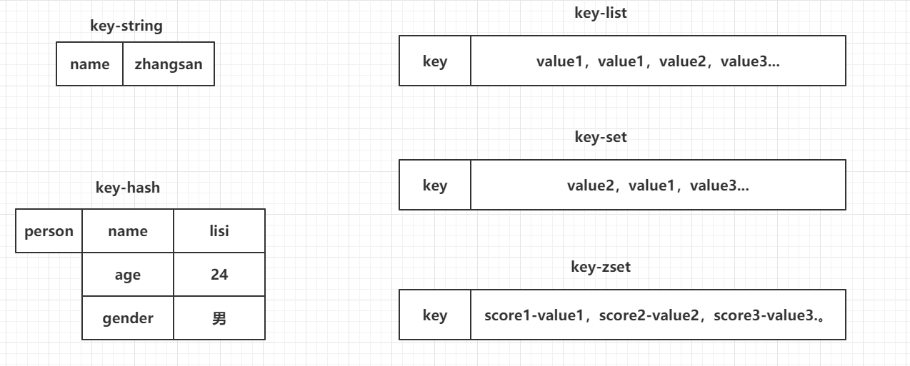

## 4.2 string常用命令

### 总结


```bash
#1.  添加值
set key value （*）

#2. 取值
get key （*）

#3. 批量操作
mset key value [key value...] （*）
mget key [key...] （*）

#4. 自增命令（自增1）
incr key   key必须是integer

#5. 自减命令（自减1）
decr key

#6. 自增或自减指定数量  key必须是integer
incrby key increment
decrby key increment

#7. 设置值的同时，指定生存时间（每次向Redis中添加数据时，尽量都设置上生存时间，秒）重点
setex key second value （**）

#8. 设置值，如果当前key不存在的话（如果这个key存在，什么事都不做，如果这个key不存在，和set命令一样）重点
setnx key value （**）

#9. 在key对应的value后，追加内容
append key value

#10. 查看value字符串的长度
strlen key
```

### 详细

#### 1.set key value


**返回值：**

设置成功则返回OK，返回nil为未执行Set命令，如不满足NX，XX条件等。

若使用GET参数，则返回该键原来的值，或在键不存在时nil。


如何获得设置指定的key过期的Unix时间，单位为秒

```java
System.out.println(Long.toString(System.currentTimeMillis()/1000L));
```


#### 2.同时设置/获取多个键值

mset/mget/msetnx

```shell
mset key value [key value...]
mget key [key ...]
msetnx key value [key value...]
```


#### 3.获取指定区间范围内的值

getrange/setrange


#### 4.数值增减

$\textcolor{red}{一定要是数据才能进行加减}$

递增数字：INCR key

增加指定的整数：INCRBY key increment

递减数值：DECR key

减少指定的整数：DECRBY key decrement

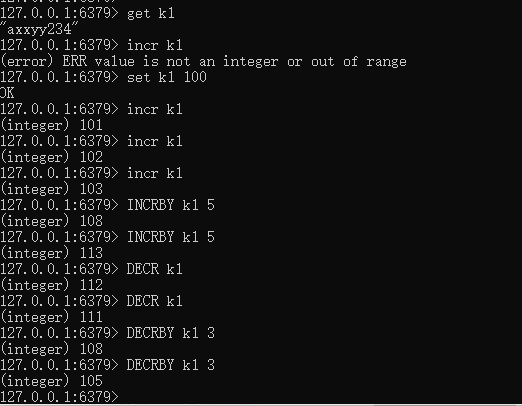

#### 5.获取字符串长度和内容追加

获取字符串长度：strlen key

字符串内容追加：append key value


#### 6.分布式锁

setnx key value

setex(set with expire) 键秒值/setnx(set if not exist)


#### 7.getset(先get再set)

getset：先get然后立即set


### 应用


## 4.3 hash常用命令

### 总结


```bash
#1. 存储数据
hset key field value    gg:{id:val,id:val}（*）

#2. 获取数据
hget key field （*）

#3. 批量操作
hmset key field value [field value ...] （*）
hmget key field [field ...] （*）

#4. 自增（指定自增的值）
hincrby key field increment

#5. 设置值（如果key-field不存在，那么就正常添加，如果存在，什么事都不做）
hsetnx key field value （*）

#6. 检查field是否存在
hexists key field 

#7. 删除key对应的field，可以删除多个
hdel key field [field ...] （*）

#8. 获取当前hash结构中的全部field和value
hgetall key （*）

#9. 获取当前hash结构中的全部field（*）
hkeys key

#10. 获取当前hash结构中的全部value（*）
hvals key

#11. 获取当前hash结构中field的数量（*）
hlen key
```

### 详情

KV模式不变，但V是一个键值对  Map<String, Map<Object, Object>>

#### 1.hset/hget/hmset/hmget/hgetall/hdel


#### 2.hlen

获取某个key内的全部数量


#### 3.hexists key 在key里面的某个值的key


#### 4.hkeys/hvals

hkeys key 查询出所有key对应的子key值

hvals key 查询出所有key对应的子key的value值


#### 5.hincrby/hincrbyfloat


#### 6.hsetnx

不存在赋值，存在了无效


### 应用


## 4.4 list常用命令

### 总结


```bash
#1. 存储数据（从左侧插入数据，从右侧插入数据）
lpush key value [value ...] （*）
rpush key value [value ...] （*）

#2. 存储数据（） 像数组的左边或者右边添加值
lpushx key value （*）
rpushx key value （*）

#3. 修改数据（在存储数据时，指定好你的索引位置,覆盖之前索引位置的数据，index超出整个列表的长度，也会失败）
lset key index value （*）

#4. 弹栈方式获取数据（左侧弹出数据，从右侧弹出数据） 删除
lpop key（*）
rpop key（*）

#5. 获取指定索引范围的数据（start从0开始，stop输入-1，代表最后一个，-2代表倒数第二个）
lrange key start stop（*）

#6. 获取指定索引位置的数据  -1  到取值 arr[3]
lindex key index  跟正整数就从左向右取 跟负数就是从右向左取  （*） get(i)

#7. 获取整个列表的长度 arr.length
llen key （*）

#8. 删除列表中的数据（他是删除当前列表中的count个value值，count > 0从左侧向右侧删除，count < 0从右侧向左侧删除，count == 0删除列表中全部的value）
lrem key count value（*）

#9. 保留列表中的数据（保留你指定索引范围内的数据，超过整个索引范围被移除掉）
ltrim key start stop

#10. 将一个列表中最后的一个数据，插入到另外一个列表的头部位置
rpoplpush list1 list2
```

### 详细

**单key多value**

简单说明：$\textcolor{red}{一个双端链表的结构}$，容量是2的32次方减1个元素大概40多亿，主要功能有push/pop等，一般用在栈、队列、消息队列等场景。left、right都可以插入添加；

如果键不存在，创建新的链表；

如果键已存在，新增内容；

如果值全移除，对应的键也就消失了

$\textcolor{green}{它的底层实际上就是个双向链表，对两端的作性能很高，通过索引下标的操作中间的节点性能会较差}$


####  1.lpush/rpush/lrange

 注：**没有rrange**只能用lrange从头开始

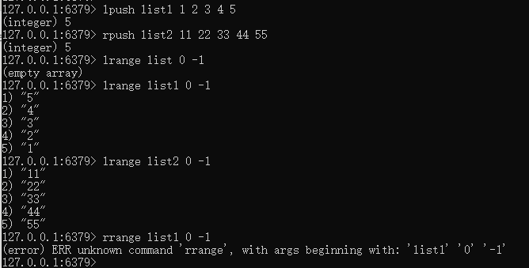

#### 2.lpop/rpop


#### 3.lindex，按照索引下标获得元素（从上到下）


#### 4.llen

==获取List列表中元素的个数==

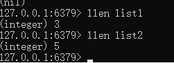

#### 5.lrem key 数量N 给定值v1

==删除N个值等于v1的元素==

从left往right删除2个值等于v1的元素，返回的值为实际删除的数量

LREM list3 0 值，表示删除全部给定的值，$\textcolor{red}{零个就是全部值}$


#### 6.ltrim key 开始index 结束index

==截取指定范围的值后在赋值给key==


#### 7.rpoplpush 源列表  目的列表

==移除列表的最后一个元素，并将该元素添加到另一个列表并返回==


#### 8.lset key index value

==让指定数组集合的小标位置值替换成新值==

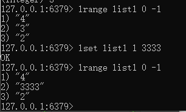

#### 9.linsert key before/after

==已有值前/后插入的新值==


### 应用


## 4.5 set常用命令   无序不重复集合

### 总结


```bash
#1. 存储数据
sadd key member [member ...]

#2. 获取数据（获取全部数据）
smembers key

#3. 随机获取一个数据（获取的同时，移除数据，count默认为1，代表弹出数据的数量）
spop key [count]  取出随机的值，并移除

#4. 交集（取多个set集合交集）
sinter set1 set2 ...

#5. 并集（获取全部集合中的数据）
sunion set1 set2 ...

#6. 差集（获取多个集合中不一样的数据）  数据放在前面的为数据基点（筛选样板）
sdiff set1 set2 ...

# 7. 删除数据
srem key member [member ...]

# 8. 查看当前的set集合中是否包含这个值
sismember key member
```

### 详细

单值多value，且无重复,  自动去重

#### 1.SADD key member [member ...]

添加元素，可以多次向同一个key中设置不同值，不会覆盖之前的值


#### 2.SMEMBERS key

遍历集合中的所有元素


#### 3.SISMEMBER key member

判断元素是否在集合中


#### 4.SREM key member [member ...]

删除元素

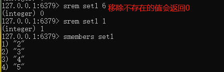

#### 5.scard

获取集合里面的元素个数


#### 6.SRANDMEMBER key [数字]

从集合中随机$\textcolor{red}{展现设置的数字个数}$元素，元素不删除

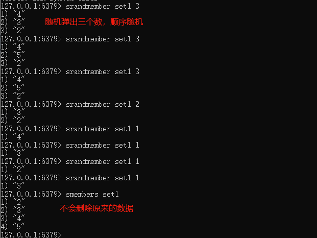

#### 7.SPOP key [数字]

从集合中==随机==$\textcolor{red}{弹出}$一个元素，出一个删除一个


#### 8. smove key1 key2

将key1里已存在的某个值赋给key2, 并删除 key1的那个值


#### 9.集合运算-集合的差集运算A-B

属于A但是不属于B的元素构成的集合

SDIFF key [key ...]，可以计算多个元素的差集


#### 10.集合运算-集合的并集运算A∪B

属于A或者属于B的元素构成的集合

SUNION key [key ...]


#### 11.集合运算-集合的交集运算A∩B

属于A同时也属于B的共同拥有的元素构成的集合

#####  SINTER key [key ...]

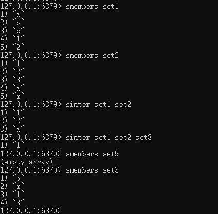


#####  SINTERCARD numkeys key 【key ...】【LIMIT limit】

注意: 

+  numkeys 的具体值由输入的key个数决定

+ SINTERCARD 为redis7新命令，它不返回结果集，而是返回结果的基数。返回由所有给定集合的交集产生的集合的基数(事物个数的数)


### 应用


## 4.6 zset的常用命令

### 总结


```bash
#1. 添加数据(score必须是数值（可重复）。member不允许重复的。)
zadd key score member [score member ...]

#2. 修改member的分数（如果member是存在于key中的，正常增加分数，如果memeber不存在，这个命令就相当于zadd）
zincrby key increment member

#3. 查看指定的member的分数
zscore key member

#4. 获取zset中数据的数量 获取数组长度
zcard key

#5. 根据score的范围查询member数量  包含边界值  sql 语句里面between
zcount key min max

#6. 删除zset中的成员
zrem key member [member...]

#7. 根据分数从小到大排序，获取指定范围内（index 下标）的数据（withscores如果添加这个参数，那么会返回member对应的分数）
zrange key start stop [withscores]

#8. 根据分数从大到小排序，获取指定范围内（index 下标）的数据（withscores如果添加这个参数，那么会返回member对应的分数） 降序排序
zrevrange key start stop [withscores]

#9. 根据分数的返回去获取member(withscores代表同时返回score，添加limit，就和MySQL中一样，如果不希望等于min或者max的值被查询出来可以采用 ‘(分数’ 相当于 < 但是不等于的方式，最大值和最小值使用+inf和-inf来标识)
zrangebyscore key min max [withscores] [limit offset count]
```


### 详细

在set基础上，每个val值前加一个score分数值。之前set是k1 v1 v2 v3，现在zset是 k1 score1 v1 score2 v2

#### 1.ZADD key score member [score member ...]

添加元素


#### 2.ZRANGE key start stop [WITHSCORES]

**按照元素分数从小到大的顺序**返回索引从start到stop之间的所有元素


#### 3.zrevrange key start stop [WITHSCORES]

**按照元素分数从大到小的顺序**返回索引从start到stop之间的所有元素


#### 4.ZRANGEBYSCORE key min max 【WITHSCORES】【LIMIT offset count】

获取指定分数范围的元素，可以在min和max前面加个(，表示不包含

limit作用是返回限制，limit开始下标步，一共多少步


#### 5.ZSCORE key member

获取元素的分数


#### 6.ZCARD key

获取集合中元素的数量


#### 7. zrem key member [member ...]

某个score对应的value值，作用是删除元素


#### 8.ZINCRBY key increment member

增加某个元素的分数


#### 9.ZCOUNT key min max

获得指定分数内的元素个数

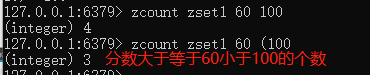

#### 10.ZMPOP numkeys key [key ...] MIN|MAX [COUNT count]

从键名列表中的**第一个非空排序集中弹出最大/小一个或多个元素**


#### 11.zrank key member [withscore]

作用是通过子value获得**下标值**


#### 12.zrevrank key member [withscore]

作用是通过子value逆序获得**下标值**


### 应用


## 4.7 key常用命令(*****)

### 总结

```bash
#1. 查看Redis中的全部的key（pattern：* ，xxx*，*xxx） 这里采用通配符
keys pattern

#2. 查看某一个key是否存在（1 - key存在，0 - key不存在） 数组
exists key [key ...]  

#3. 删除key
del key [key ...]

#4. 设置key的生存时间，单位为秒，单位为毫秒,设置还能活多久
expire key second
pexpire key milliseconds

#5. 设置key的生存时间，单位为秒，单位为毫秒,设置能活到什么时间点
https://developer.aliyun.com/skills/timestamp.html
expireat key timestamp
pexpireat key milliseconds  最多能活多久 不代表能活到那么久 也不代表不能活那么久

#6. 查看key的剩余生存时间,单位为秒，单位为毫秒（-2 - 当前key不存在，-1 - 当前key没有设置生存时间，具体剩余的生存时间）
ttl key
pttl key

#7. 移除key的生存时间（1 - 移除成功，0 - key不存在生存时间，key不存在）
persist key

#8. 选择操作的库 Redis默认拥有16个数据库，初始默认使用0号库
select 0~15

#9. 移动key到另外一个库中
move key db
```

### 详细

#### 1.keys *

查看当前库所有的key


#### 2.exists key

判断某个key是否存在


#### 3.type key

查看你的key是什么类型

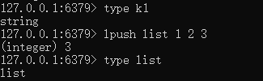

#### 4.del key

删除指定的key数据


#### 5. unlink key

非阻塞删除，仅仅将keys从keyspace元数据中删除，真正的删除会在后续异步中操作。

del key 是原子的删除，只有删除成功了才会返回删除结果，如果是删除大key用del会将后面的操作都阻塞，而unlink key 不会阻塞，它会在后台异步删除数据。

#### 6.ttl key

查看还有多少秒过期，-1表示永不过期，-2表示已过期

#### 7.expire key 秒钟

为给定的key设置过期时间

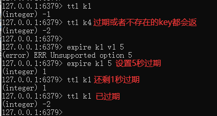

#### 8.move key dbindex[0-15]

将当前数据库的key移动到给定的数据库DB当中


#### 9.select dbindex

Redis默认拥有16个数据库，初始默认使用0号库，切换数据库【0-15】，默认为0

#### 10.dbsize

查看当前数据库key的数量

#### 11.flushdb

清空当前库

#### 12.flushall

通杀全部库


## 4.8 库的常用命令

```bash
#1. 清空当前所在的数据库
flushdb             (~) 了解

#2. 清空全部数据库
flushall            (~) 了解

#3. 查看当前数据库中有多少个key
dbsize

#4. 查看最后一次操作的时间
lastsave

#5. 实时监控Redis服务接收到的命令
monitor
```

## 4.9 帮助命令

help @类型

```
help @string
help @list
help @hash
help @hyperloglog
```

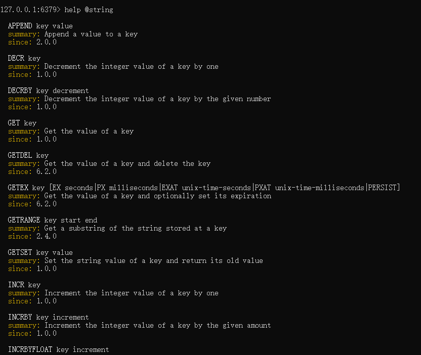


## 4.10 位图(bitmap)常用命令

由0和1状态表现的二进制位的bit数组

### 介绍


说明：$\textcolor{red}{用String类型作为底层数据结构实现的一种统计二值状态的数据类型}$

$\textcolor{red}{位图本质是数组}$，它是基于String数据类型的按位的操作。该数组由多个二进制位组成，每个二进制位都对应一个偏移量（我们称之为一个索引）。

Bitmap支持的最大位数是2^32位，它可以极大的节约存储空间，使用512M内存就可以存储多达42.9亿的字节信息(2^32=4294967296)

### 应用

**用于状态统计，Y、N类似AtomicBoolean:**

1. 用户是否登陆过Y、N，比如软件的每日签到功能
2. 电影、广告是否被点击播放过
3. 钉钉打卡上下班，签到统计\

### 基本命令


#### 1.setbit key offset value

setbit 键偏移位 只能零或者1

**Bitmap的偏移量从零开始计算的**


#### 2.getbit key offset

获取键偏移位的值


#### 3.strlen key

统计字节数占用多少


不是字符串长度而是占据几个字节，超过8位后自己按照8位一组**一byte**再扩容

#### 4.bitcount key [start end [byte|bit]]

全部键里面包含有1的有多少个


#### 5.bitop operation(AND|OR|XOR|NOT) destkey key [key ...]

对不同的二进制存储数据进行位运算（AND、OR、NOT、

案例：连续2天都签到的用户数量

假如某个网站或者系统，它的用户有1000W，我们可以使用redis的HASH结构和bitmap结构做个用户id和位置的映射

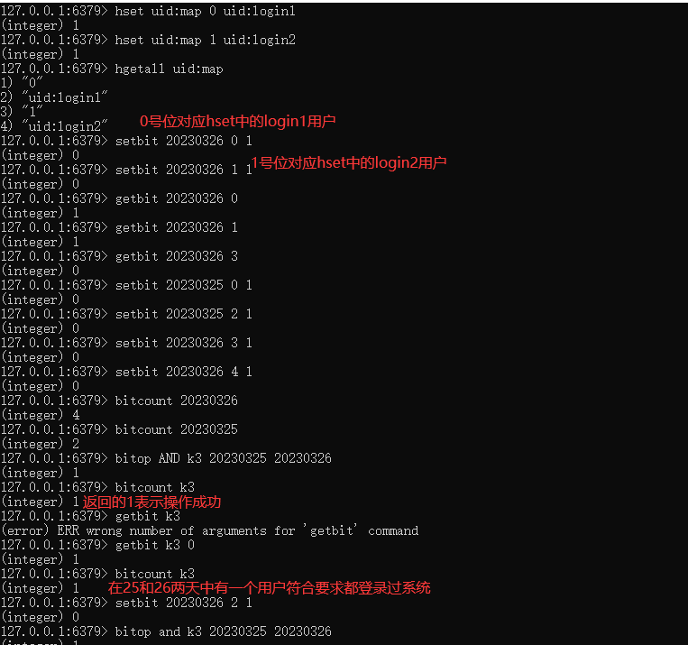


## 4.11 基数统计(HyperLogLog)常用命令

### 介绍

> 去重脱水后的真实数据

去重复统计功能的基数估计算法-就是HyperLogLog

```tex
Redis在2.8.9版本添加了HyperLogLog 结构。
Redis HyperLogLog是用来做基数统计的算法，HyperLogLog 的优点是，在输入元素的数量或者体积非常非常大时，计算基数所需的空间总是固定的、并且是很小的。
在Redis里面，每个 HyperLogLog键只需要花费12KB内存，就可以计算接近2^64个不同元素的基数。这和计算基数时，元素越多耗费
内存就越多的集合形成鲜明对比。
但是，因为HyperLogLog只会根据输入元素来计算基数，而不会储存输入元素本身，所以HyperLogLog不能像集合那样，返回输入的各个元素。
```

**基数**：是一种数据集，去重复后的真实个数

```tex
(全集)={2,4,6,8,77,39,4,8,10}
去掉重复的内容
基数={2,4,6,8,77,39,10} = 7
```

基数统计：用于统计一个集合中不重复的元素个数，就是对集合去重复后剩余元素的计算。

### 应用

用户搜索网站关键词的数量

统计用户每天搜索不同词条个数

统计某个网站的UV、统计某个文章的UV

UV:  Unique Visitor，独立访客，一般理解为客户端IP，**需要去重考虑**

### 基本命令


## 4.12 地理空间(GEO)常用命令

### 介绍

移动互联网时代LBS应用越来越多，交友软件中附近的小姐姐、外卖软件中附近的美食店铺、高德地图附近的核酸检查点等等，那这种附近各种形形色色的XXX地址位置选择是实现:

+ 地球上的地理位置是使用二维的经纬度表示，经度范围(-180,180]，纬度范围(-90，90]，只要我们确定一个点的经纬度就可以取得他在地球的位置。
+ 例如滴滴打车，最直观的操作就是实时记录更新各个车的位置，然后当我们要找车时，在数据库中查找距离我们(坐标x0,y0)附近r公里范围内部的车辆

使用如下SQL即可:

```sql
select taxi from position where x0-r< X < x0 + r and y0-r< y < y0+r
```

SQL带来的问题:

1. 查询性能问题，如果并发高，数据量大这种查询是要搞垮数据库的
2. 这个查询的是一个矩形访问，而不是以我为中心r公里为半径的圆形访问。
3. 精准度的问题，我们知道地球不是平面坐标系，而是一个圆球，这种矩形计算在长距离计算时会有很大误差

### 原理


redis在3.2版本以后增加了地址位置的处理

### 基本命令

#### 1.GEOADD key longitude latitude member [longitude latitude member]

多个经度(longitude)、纬度(latitude)、位置名称(member)添加到指定的key中

出现中文乱码使用如下命令：

```shell
redis-cli --raw
```

**geo类型实际上是zset，可以使用zset相关的命令对其进行遍历**

```shell
GEOADD city 116.403963 39.915119 "天安门" 116.403414 39.924091 "故宫" 116.024067 40.362639 "长城"
```


#### 2.GEOPOS key member [member]

从键里面返回所有指定名称(member )元素的位置（经度和纬度），不存在返回nil

```shell
GEOPOS city 天安门 故宫 长城
```


#### 3.GEODIST key member1 member2 [M|KM|FT|MI]

返回两个给定位置之间的距离

```
m-米
km-千米
ft-英寸
mi-英里
```


#### 4.GEORADIUS key longitude latitude radius M|KM|FT|MI \[WITHCOORD] \[WITHDIST] \[WITHHASH] [COUNT count [ANY]

以给定的经纬度为中心，返回与中心的距离不超过给定最大距离的所有元素位置

```
WITHDIST: 在返回位置元素的同时， 将位置元素与中心之间的距离也一并返回。 距离的单位和用户给定的范围单位保持一致。
WITHCOORD: 将位置元素的经度和维度也一并返回。
WITHHASH:以 52 位有符号整数的形式， 返回位置元素经过原始 geohash 编码的有序集合分值。 这个选项主要用于底层应用或者调试，实际中的作用并不大
COUNT 限定返回的记录数。
```


#### 5.GEORADIUSBYMEMBER

跟GEORADIUS类似


#### 6.GEOHASH

返回一个或多个位置元素的GEOhash表示

geohash 算法生成的base32编码值，3维变2维变1维


## 4.13 流(Stream)常用命令

### 介绍

>  Stream流就是Redis版的MQ消息中间件+阻塞队列

Redis5.0 之前的痛点，Redis消息队列的2种方案：

1. List实现消息队列，List实现方式其实就是点对点的模式

   

2. Pub/Sub


Redis5.0版本新增了一个更强大的数据结构---Stream

### 应用

实现消息队列，它支持消息的持久化、支持自动生成全局唯一ID、支持ack确认消息的模式、支持消费组模式等，让消息队列更加的稳定和可靠

### 底层结构和原理说明


$\textcolor{blue}{一个消息链表，将所有加入的消息都串起来，每个消息都有一个唯一的ID和对应的内容}$


### 基本命令理论简介

##### 队列相关指令


##### 消费组相关指令


XINFO GROUPS    打印消费组的详细信息

XINFO STREAM     打印stream的详细信息

##### 四个特殊符号

| 符号     | 说明                                                         |
| -------- | ------------------------------------------------------------ |
| - +      | 最小和最大可能出现的Id                                       |
| $    | $ | 表示只消费新的消息，当前流中最大的Id，可用于将要到来的信息   |
| >        | 用于XREADGROUP命令，表示迄今还没有发送给组中使用者的信息，会更新消费者组的最后Id |
| *        | 用于XADD命令，让系统自动生成Id                               |

$\textcolor{red}{基本命令代码实操}$

Redis流实例演示

### 队列相关命令

#### 1.XADD

添加消息到队列末尾，消息ID必须要比上一个ID大，默认用星号表示自动生成ID；

*用于XADD命令中，让系统自动生成ID；

XADD用于向Stream队列中添加消息，如果指定的Stream队列不存在，则该命令执行时会新建一个Stream队列


生成的消息ID，有两部分组成，毫秒时间戳-该毫秒内产生的第一条消息

*表示服务器自动生成MessageID(类似MySQL里面主键auto_increment)，后面顺序跟着一堆业务key/value

| 信息条目指的是序列号，在相同的毫秒下序列号从0开始递增，序列号是64位长度，理论上在同一毫秒内生成的数据量无法到达这个级别，因此不用担心序列号会不够用。milisecondsTime指的是Redis节点服务器的本地时间，如果存在当前的毫秒时间截比以前已经存在的数据的时间戳小的话(本地时间钟后跳)，那么系统将会采用以前相同的毫秒创建新的ID，也即redis 在增加信息条目时会检查当前 id 与上一条目的 id，自动纠正错误的情况，一定要保证后面的 id 比前面大，.个流中信息条目的ID必须是单调增的，这是流的基础。 |
| ------------------------------------------------------------ |
| 客户端显示传入规则:<br />Redis对于ID有强制要求，格式必须是**时间戳-自增Id**这样的方式，且后续ID不能小于前一个ID |
| Stream的消息内容，也就是图中的Messaget它的结构类似Hash结构，以kev-value的形式存在 |

#### 2.XRANGE key start end [COUNT count]

用于获取消息列表（可以指定范围），忽略删除的消息

```
start 表示开始值，-代表最小值
end 表示结束值，+代表最大值
count 表示最多获取多少个值
```


#### 3.XREVRANGE key end start [COUNT count]

根据ID降序输出


#### 4.XDEL key id [id ...]


#### 5.XLEN key


#### 6.XTRIM key MAXLEN|MINID

用于对Stream的长度进行截取，如超长会进行截取

```
MAXLEN 允许的最大长度，对流进行修剪限制长度
MINID 允许的最小id，从某个id值开始比该id值小的将会被抛弃
```

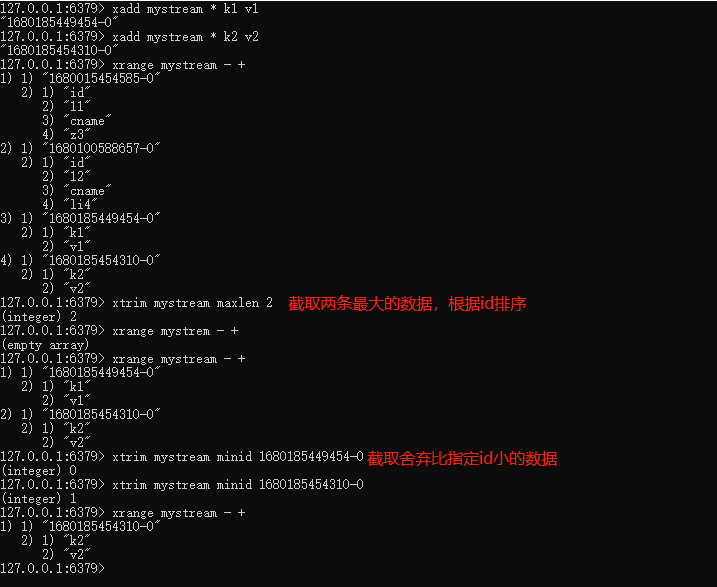

#### 7.XREAD \[COUNT count] [BLOCK milliseconds] STREAMS key [key ...] id [id ...]

**用于获取消息(阻塞/非阻塞)**

只会返回大于指定ID的消息，COUNT最多读取多少条消息；BLOCK是否以阻塞的方式读取消息，默认不阻塞，如果milliseconds设置为0，表示永远阻塞, 可以读取多个key

**非阻塞**

- $表特殊ID，表示以当前Stream已经存储的最大的ID作为最后一个ID，当前Stream中不存在大于当前最大ID的消息，因此此时返回nil

- 0-0代表从最小的ID开始获取Stream中的消息，当不指定count，将会返回Stream中的所有消息，注意也可以使用0 (00/000也都是可以的)

  ****

**阻塞**


$\textcolor{red}{总结（类似Java里面的阻塞队列）}$

Stream的基础方法，使用XADD存入消息和XREAD循环阻塞读取消息的方式可以实现简易版的消息队列

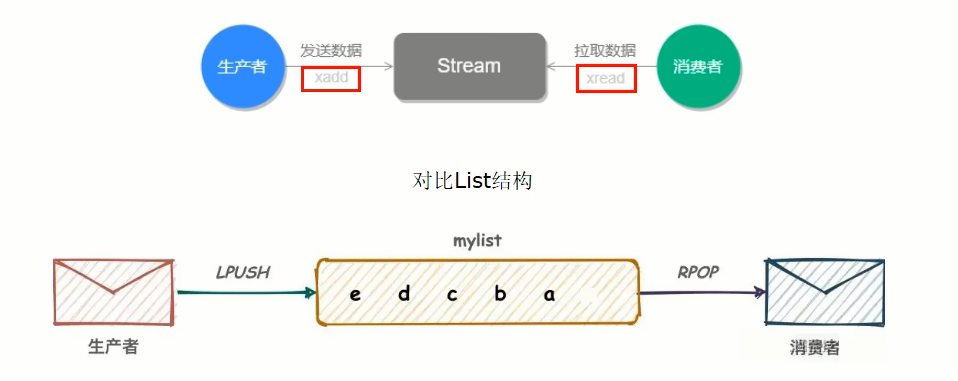


---

### 消费组相关指令

#### 1.XGROUP CREATE key group id|$

用于创建消费组

```shell
xgroup create mystream group $     #$表示从Stream尾部开始消费
xgroup create mystream groupB 0    #0表示从Stream头部开始消费
```

创建消费组的时候必须指定ID，ID为0表示从头开始消费，为$表示只消费新消息


#### 2.XREADGROUP GROUP group  \[COUNT count] [BLOCK milliseconds] STREAMS key id

">"，表示从第一条尚未被消费的消息开始读取

例子


消费组groupA内的消费者consumer1从mystream消息队列中读取所有消息

但是，**不同消费组**的消费者可以消费同一条消息

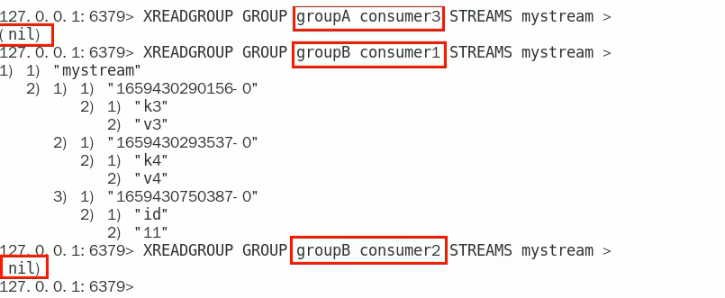

$\textcolor{red}{消费组的目的:}$

让组内的多个消费者共同分担读取消息，所以，我们通常会让每个消费者读取部分消息，从而实现消息读取负载在多个消费者间是均衡分部的


##### 重点问题

基于 Stream 实现的消息队列，如何保证消费者在发生故障或宕机再次重启后，仍然可以读取未处理完的消息?

Streams 会自动使用内部队列(也称为 PENDING List)留存消费组里每个消费者读取的消息保底措施，直到消费者使用 XACK命令通知 Streams"消息已经处理完成”。
消费确认增加了消息的可靠性，一般在业务处理完成之后，需要执行 XACK 命令确认消息已经被消费完成

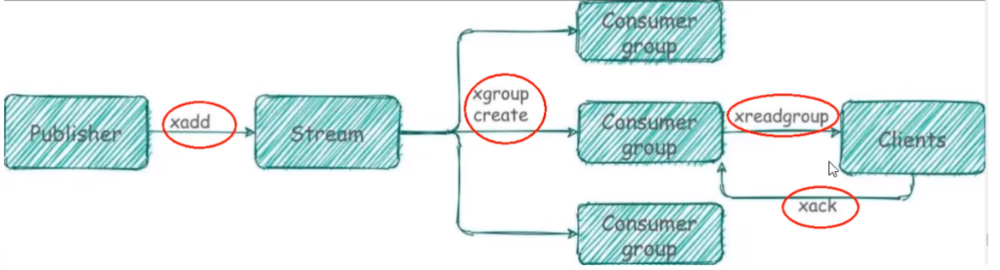

#### 3.XPENDING

**查询每个消费组内所有消费组$\textcolor{red}{[已读取、但尚未确认]}$的消息**

例子1


例子2


查看某个消费组具体读取了那些数据


#### 4.XACK key group id [id...]

向消息队列确认消息处理已完成


#### 5. XINFO 用于打印Stream\Consumer\Group的详细信息


## 4.14  位域(bitfield)常用命令

### 介绍

将一个redis字符串看作是**一个由二进制位组成的数组**并能对变长位宽和任意没有字节对齐的指定整型位域进行寻址和修改


### 应用

位域修改、溢出控制


### 基本命令

Ascii码表：https://ascii.org.cn

#### 1.BITFIELD key [GET type offset]


#### 2.BITFIELD key set type offstet value


#### 3.BITFIELD key [INCRBY type offset increment]


如果偏移量后面的值发生溢出（大于127），redis对此也有对应的溢出控制，默认情况下，INCRBY使用WRAP参数

#### 4.溢出控制 OVERFLOW [WRAP|SAT|FAIL]

WRAP:使用回绕(wrap around)方法处理有符号整数和无符号整数溢出情况


SAT:使用饱和计算(saturation arithmetic)方法处理溢出，下溢计算的结果为最小的整数值，而上溢计算的结果为最大的整数值


fail:命令将拒绝执行那些会导致上溢或者下溢情况出现的计算，并向用户返回空值表示计算未被执行


# 五、Java连接Redis【重点】

------

## 5.1 Jedis连接Redis

### 5.1.1 创建Maven工程

idea创建

### 5.1.2 导入需要的依赖


```xml
<dependencies>
    <!--    1、 Jedis-->
    <dependency>
        <groupId>redis.clients</groupId>
        <artifactId>jedis</artifactId>
        <version>2.9.0</version>
    </dependency>
    <!--    2、 Junit测试-->
    <dependency>
        <groupId>junit</groupId>
        <artifactId>junit</artifactId>
        <version>4.12</version>
    </dependency>
    <!--    3、 Lombok-->
    <dependency>
        <groupId>org.projectlombok</groupId>
        <artifactId>lombok</artifactId>
        <version>1.16.20</version>
    </dependency>
</dependencies>
```

### 5.1.3 测试

```java
public class Demo1 {

    @Test
    public void set(){
        //1. 连接Redis
        Jedis jedis = new Jedis("192.168.199.109",6379);
        //2. 操作Redis - 因为Redis的命令是什么，Jedis的方法就是什么
        jedis.set("name","李四");
        //3. 释放资源
        jedis.close();
    }

    @Test
    public void get(){
        //1. 连接Redis
        Jedis jedis = new Jedis("192.168.199.109",6379);
        //2. 操作Redis - 因为Redis的命令是什么，Jedis的方法就是什么
        String value = jedis.get("name");
        System.out.println(value);
        //3. 释放资源
        jedis.close();
    }
}
```

## 5.2 Jedis存储一个对象到Redis以byte[]的形式

### 5.2.1 准备一个User实体类

```java
@Data
@NoArgsConstructor
@AllArgsConstructor
public class User implements Serializable {

    private Integer id;

    private String name;

    private Date birthday;

}
```

### 5.2.2 导入spring-context依赖

```xml
<!-- 4. 导入spring-context -->
<dependency>
    <groupId>org.springframework</groupId>
    <artifactId>spring-context</artifactId>
    <version>4.3.18.RELEASE</version>
</dependency>
```

### 5.2.3 创建Demo测试类，编写内容

```java
public class Demo2 {

    // 存储对象 - 以byte[]形式存储在Redis中
    @Test
    public void setByteArray(){
        //1. 连接Redis服务
        Jedis jedis = new Jedis("192.168.199.109",6379);
        //------------------------------------------------
        //2.1 准备key(String)-value(User)
        String key = "user";
        User value = new User(1,"张三",new Date());
        //2.2 将key和value转换为byte[]
        byte[] byteKey = SerializationUtils.serialize(key);
        byte[] byteValue = SerializationUtils.serialize(value);
        //2.3 将key和value存储到Redis
        jedis.set(byteKey,byteValue);
        //------------------------------------------------
        //3. 释放资源
        jedis.close();
    }

    // 获取对象 - 以byte[]形式在Redis中获取
    @Test
    public void getByteArray(){
        //1. 连接Redis服务
        Jedis jedis = new Jedis("192.168.199.109",6379);
        //------------------------------------------------
        //2.1 准备key
        String key = "user";
        //2.2 将key转换为byte[]
        byte[] byteKey = SerializationUtils.serialize(key);
        //2.3 jedis去Redis中获取value
        byte[] value = jedis.get(byteKey);
        //2.4 将value反序列化为User对象
        User user = (User) SerializationUtils.deserialize(value);
        //2.5 输出
        System.out.println("user:" + user);
        //------------------------------------------------
        //3. 释放资源
        jedis.close();
    }

}
```

## 5.3 Jedis存储一个对象到Redis以String的形式

### 5.3.1 导入依赖

```xml
<!-- 导入fastJSON -->
<dependency>
    <groupId>com.alibaba</groupId>
    <artifactId>fastjson</artifactId>
    <version>1.2.47</version>
</dependency>
```

### 5.3.2 测试

```java
public class Demo3 {

    // 存储对象 - 以String形式存储
    @Test
    public void setString(){
        //1. 连接Redis
        Jedis jedis = new Jedis("192.168.199.109",6379);
        //2.1 准备key(String)-value(User)
        String stringKey = "stringUser";
        User value = new User(2,"李四",new Date());
        //2.2 使用fastJSON将value转化为json字符串
        String stringValue = JSON.toJSONString(value);
        //2.3 存储到Redis中
        jedis.set(stringKey,stringValue);
        //3. 释放资源
        jedis.close();
    }


    // 获取对象 - 以String形式获取
    @Test
    public void getString(){
        //1. 连接Redis
        Jedis jedis = new Jedis("192.168.199.109",6379);

        //2.1 准备一个key
        String key = "stringUser";
        //2.2 去Redis中查询value
        String value = jedis.get(key);
        //2.3 将value反序列化为User
        User user = JSON.parseObject(value, User.class);
        //2.4 输出
        System.out.println("user:" + user);

        //3. 释放资源
        jedis.close();
    }
}
```

## 5.4 Jedis连接池的操作

```java
@Test
public void pool2(){
    //1. 创建连接池配置信息
    GenericObjectPoolConfig poolConfig = new GenericObjectPoolConfig();
    poolConfig.setMaxTotal(100);  // 连接池中最大的活跃数
    poolConfig.setMaxIdle(10);   // 最大空闲数
    poolConfig.setMinIdle(5);   // 最小空闲数
    poolConfig.setMaxWaitMillis(3000);  // 当连接池空了之后,多久没获取到Jedis对象,就超时

    //2. 创建连接池
    JedisPool pool = new JedisPool(poolConfig,"192.168.199.109",6379);

    //3. 通过连接池获取jedis对象
    Jedis jedis = pool.getResource();
	
    //4. 操作	
    String value = jedis.get("stringUser");
    System.out.println("user:" + value);

    //5. 释放资源
    jedis.close();
}
```

## 5.5 Redis的管道操作

因为在操作Redis的时候，执行一个命令需要先发送请求到Redis服务器，这个过程需要经历网络的延迟，Redis还需要给客户端一个响应。

如果我需要一次性执行很多个命令，上述的方式效率很低，可以通过Redis的管道，先将命令放到客户端的一个Pipeline中，之后一次性的将全部命令都发送到Redis服务，Redis服务一次性的将全部的返回结果响应给客户端。


```java
//  Redis管道的操作
@Test
public void pipeline(){
    //1. 创建连接池
    JedisPool pool = new JedisPool("192.168.199.109",6379);
    long l = System.currentTimeMillis();

    /*//2. 获取一个连接对象
    Jedis jedis = pool.getResource();

    //3. 执行incr - 100000次
    for (int i = 0; i < 100000; i++) {
        jedis.incr("pp");
    }

    //4. 释放资源
    jedis.close();*/

    //================================
    //2. 获取一个连接对象
    Jedis jedis = pool.getResource();
    //3. 创建管道
    Pipeline pipelined = jedis.pipelined();
    //3. 执行incr - 100000次放到管道中
    for (int i = 0; i < 100000; i++) {
        pipelined.incr("qq");
    }
    //4. 执行命令
    pipelined.syncAndReturnAll();
    //5. 释放资源
    jedis.close();

    System.out.println(System.currentTimeMillis() - l);
}
```

# 六、Redis其他配置及集群【重点】

修改yml文件，以方便后期修改Redis配置信息

```yaml
version: '3.1'
services:
  redis:
    image: daocloud.io/library/redis:5.0.7
    restart: always
    container_name: redis
    environment:
      - TZ=Asia/Shanghai
    ports:
      - 6379:6379
    volumes:
      - ./conf/:/usr/local/redis/
    command: ["redis-server","/usr/local/redis/redis.conf"]
```

## 6.1 Redis的AUTH 


方式一：通过修改Redis的配置文件，实现Redis的密码校验

\# redis.conf
requirepass 密码


三种客户端的连接方式

- redis-cli：在输入正常命令之前，先输入auth 密码即可。（auth  +密码）
- 图形化界面：在连接Redis的信息中添加上验证的密码。
- Jedis客户端：

- - jedis.auth(password);

- 使用JedisPool的方式

// 使用当前有参构造设置密码

```yaml
public JedisPool(final GenericObjectPoolConfig poolConfig, final String host, int port,int timeout, final String password)
```


## 6.2 Redis的事务（了解）  redis是没有事务（*）

Redis的事务：一次性事务操作，该成功的成功，该失败的失败。（一套命令集合，正确命令该成功成功，不正确命令不成功）

先开启事务，执行一些列的命令，但是命令不会立即执行，会被放在一个队列中，如果你执行事务，那么这个队列中的命令全部执行，如果取消了事务，一个队列中的命令全部作废。

- 开启事务：multi
- 输入要执行的命令：被放入到一个队列中
- 执行事务：exec
- 取消事务：discard

Redis的事务向发挥功能，需要配置watch监听机制

在开启事务之前，先通过watch命令去监听一个或多个key，在开启事务之后，如果有其他客户端修改了我监听的key，事务会自动取消。

如果执行了事务，或者取消了事务，watch监听自动消除，一般不需要手动执行unwatch。


## 6.3 Redis持久化机制（*****）

### 6.3.1 RDB

RDB是Redis默认的持久化机制

- RDB持久化文件，速度比较快，而且存储的是一个二进制的文件，传输起来很方便。
- RDB持久化的时机：save 900 1：在900秒内，有1个key改变了，就执行RDB持久化。save 300 10：在300秒内，有10个key改变了，就执行RDB持久化。save 60 10000：在60秒内，有10000个key改变了，就执行RDB持久化。
- RDB无法保证数据的绝对安全。
- dbfilename dump.rdb  （如果采用docker安装redis，持久化的时候我们的文件保存在我们的docker容器里面）
- rdbcompression yes  开启rdb持久化机制

```bash
save 900 1
save 300 10
save 60 10000
```

配置完成生成的文件路径容器的/data目录下面


优点：

持久化数据快，存储方便，数据安全（二进制）

缺点是

持久化策略可能会存在数据丢失，不能保证我们的数据安全

### 6.3.2 AOF

AOF持久化机制默认是关闭的，Redis官方推荐同时开启RDB和AOF持久化，更安全，避免数据丢失。

- AOF持久化的速度，相对RDB较慢的，存储的是一个文本文件，到了后期文件会比较大，传输困难。
- AOF持久化时机。appendfsync always：每执行一个写操作，立即持久化到AOF文件中，性能比较低。appendfsync everysec：每秒执行一次持久化。appendfsync no：会根据你的操作系统不同，环境的不同，在一定时间内执行一次持久化。
- AOF相对RDB更安全，推荐同时开启AOF和RDB。

```bash
appendonly yes
appendfilename redis.aof
appendfsync everysec

# appendfsync always
# appendfsync no
```


### 6.3.3 注意事项

同时开启RDB和AOF的注意事项：

如果同时开启了AOF和RDB持久化，那么在Redis宕机重启之后，需要加载一个持久化文件，优先选择AOF文件。

如果先开启了RDB，再次开启AOF，如果RDB执行了持久化，那么RDB文件中的内容会被AOF覆盖掉。


## 6.4 Redis的主从架构


1、解决我们的日常一个单机故障，而衍生出来 主从架构

2、高并发所有请求都会发送我们单台redis，如果我redis承受就会宕机或者阻塞

3、组从：主机一般来说的我们master（读写都可以），slave（只读）


指定yml文件

```yaml
  version: "3.1"
  services:
    redis1:
      image: daocloud.io/library/redis:5.0.7
      restart: always
      container_name: redis1
      environment:
        - TZ=Asia/Shanghai
      ports:
        - 8001:6379
      volumes:
        - ./conf/redis1.conf:/usr/local/redis/redis.conf
      command: ["redis-server","/usr/local/redis/redis.conf"]
    redis2:
      image: daocloud.io/library/redis:5.0.7
      restart: always
      container_name: redis2
      environment:
        - TZ=Asia/Shanghai
      ports:
        - 8002:6379
      volumes:
        - ./conf/redis2.conf:/usr/local/redis/redis.conf
      links:
        - redis1:master
      command: ["redis-server","/usr/local/redis/redis.conf"]
    redis3:
      image: daocloud.io/library/redis:5.0.7
      restart: always
      container_name: redis3
      environment:
        - TZ=Asia/Shanghai
      ports:
        - 8003:6379
      volumes:
        - ./conf/redis3.conf:/usr/local/redis/redis.conf
      links:
        - redis1:master
      command: ["redis-server","/usr/local/redis/redis.conf"]
# redis2和redis3从节点配置
replicaof master 6379
```

命令：通过 info replication 查看当前redis信息


## 6.5 哨兵（*****）

哨兵可以帮助我们解决主从架构中的单点故障问题


修改了以下docker-compose.yml，为了可以在容器内部使用哨兵的配置

```yaml
version: "3.1"
services:
  redis1:
    image: daocloud.io/library/redis:5.0.7
    restart: always
    container_name: redis1
    environment:
      - TZ=Asia/Shanghai
    ports:
      - 8001:6379
    volumes:
      - ./conf/redis1.conf:/usr/local/redis/redis.conf
      - ./conf/sentinel1.conf:/data/sentinel.conf        # 添加的内容
    command: ["redis-server","/usr/local/redis/redis.conf"]
  redis2:
    image: daocloud.io/library/redis:5.0.7
    restart: always
    container_name: redis2
    environment:
      - TZ=Asia/Shanghai
    ports:
      - 8002:6379
    volumes:
      - ./conf/redis2.conf:/usr/local/redis/redis.conf
      - ./conf/sentinel2.conf:/data/sentinel.conf        # 添加的内容
    links:
      - redis1:master
    command: ["redis-server","/usr/local/redis/redis.conf"]
  redis3:
    image: daocloud.io/library/redis:5.0.7
    restart: always
    container_name: redis3
    environment:
      - TZ=Asia/Shanghai
    ports:
      - 8003:6379
    volumes:
      - ./conf/redis3.conf:/usr/local/redis/redis.conf
      - ./conf/sentinel3.conf:/data/sentinel.conf        # 添加的内容 
    links:
      - redis1:master
    command: ["redis-server","/usr/local/redis/redis.conf"]
```

准备哨兵的配置文件，并且在容器内部手动启动哨兵即可

```yaml
# 哨兵需要后台启动
daemonize yes
# 指定Master节点的ip和端口（主）
sentinel monitor master localhost 6379 2
# 指定Master节点的ip和端口（从）
sentinel monitor master master 6379 2
# 哨兵每隔多久监听一次redis架构
sentinel down-after-milliseconds master 10000
```

在Redis容器内部启动sentinel即可

```yaml
redis-sentinel sentinel.conf
```

## 6.6 Redis的集群


Redis集群在保证主从加哨兵的基本功能之外，还能够提升Redis存储数据的能力。


准备yml文件

```yaml
# docker-compose.yml
version: "3.1"
services:
  redis1:
    image: daocloud.io/library/redis:5.0.7
    restart: always
    container_name: redis1
    environment:
      - TZ=Asia/Shanghai
    ports:
      - 7001:7001
      - 17001:17001
    volumes:
      - ./conf/redis1.conf:/usr/local/redis/redis.conf
    command: ["redis-server","/usr/local/redis/redis.conf"]
  redis2:
    image: daocloud.io/library/redis:5.0.7
    restart: always
    container_name: redis2
    environment:
      - TZ=Asia/Shanghai
    ports:
      - 7002:7002
      - 17002:17002
    volumes:
      - ./conf/redis2.conf:/usr/local/redis/redis.conf
    command: ["redis-server","/usr/local/redis/redis.conf"]  
  redis3:
    image: daocloud.io/library/redis:5.0.7
    restart: always
    container_name: redis3
    environment:
      - TZ=Asia/Shanghai
    ports:
      - 7003:7003
      - 17003:17003
    volumes:
      - ./conf/redis3.conf:/usr/local/redis/redis.conf
    command: ["redis-server","/usr/local/redis/redis.conf"]  
  redis4:
    image: daocloud.io/library/redis:5.0.7
    restart: always
    container_name: redis4
    environment:
      - TZ=Asia/Shanghai
    ports:
      - 7004:7004
      - 17004:17004
    volumes:
      - ./conf/redis4.conf:/usr/local/redis/redis.conf
    command: ["redis-server","/usr/local/redis/redis.conf"]  
  redis5:
    image: daocloud.io/library/redis:5.0.7
    restart: always
    container_name: redis5
    environment:
      - TZ=Asia/Shanghai
    ports:
      - 7005:7005
      - 17005:17005
    volumes:
      - ./conf/redis5.conf:/usr/local/redis/redis.conf
    command: ["redis-server","/usr/local/redis/redis.conf"]  
  redis6:
    image: daocloud.io/library/redis:5.0.7
    restart: always
    container_name: redis6
    environment:
      - TZ=Asia/Shanghai
    ports:
      - 7006:7006
      - 17006:17006
    volumes:
      - ./conf/redis6.conf:/usr/local/redis/redis.conf
    command: ["redis-server","/usr/local/redis/redis.conf"]  
# redis.conf
# 指定redis的端口号
port 7001
# 开启Redis集群
cluster-enabled yes
# 集群信息的文件
cluster-config-file nodes-7001.conf
# 集群的对外ip地址
cluster-announce-ip 101.42.253.234
# 集群的对外port
cluster-announce-port 7001
# 集群的总线端口
cluster-announce-bus-port 17001


port 7001
cluster-enabled yes
cluster-config-file nodes-7001.conf
cluster-announce-ip 43.138.66.98
cluster-announce-port 7001
cluster-announce-bus-port 17001


port 7002
cluster-enabled yes
cluster-config-file nodes-7002.conf
cluster-announce-ip 43.138.66.98
cluster-announce-port 7002
cluster-announce-bus-port 17002

port 7003
cluster-enabled yes
cluster-config-file nodes-7003.conf
cluster-announce-ip 43.138.66.98
cluster-announce-port 7003
cluster-announce-bus-port 17003

port 7004
cluster-enabled yes
cluster-config-file nodes-7004.conf
cluster-announce-ip 43.138.66.98
cluster-announce-port 7004
cluster-announce-bus-port 17004

port 7005
cluster-enabled yes
cluster-config-file nodes-7005.conf
cluster-announce-ip 43.138.66.98
cluster-announce-port 7005
cluster-announce-bus-port 17005

port 7006
cluster-enabled yes
cluster-config-file nodes-7006.conf
cluster-announce-ip 43.138.66.98
cluster-announce-port 7006
cluster-announce-bus-port 17006
```

启动了6个Redis的节点。

随便跳转到一个容器内部，使用redis-cli管理集群

redis-cli --cluster create  表示链接我们的集群redis （redis-cli --cluster create [ip:port ip:port]）

--cluster-replicas 1  1表示一个master下面有几个备机

```yaml
redis-cli --cluster create 101.42.253.234:7001 101.42.253.234:7002 101.42.253.234:7003 101.42.253.234:7004 101.42.253.234:7005 101.42.253.234:7006 --cluster-replicas 1
```

## redis-cli -h  ip  -p port -c【需要加上这个-c  可以让我们的集群自动切换】

 

 

## 6.7 Java连接Redis集群


使用JedisCluster对象连接Redis集群


```java
@Test
public void test(){
    // 创建Set<HostAndPort> nodes
    Set<HostAndPort> nodes = new HashSet<>();
    nodes.add(new HostAndPort("192.168.199.109",7001));
    nodes.add(new HostAndPort("192.168.199.109",7002));
    nodes.add(new HostAndPort("192.168.199.109",7003));
    nodes.add(new HostAndPort("192.168.199.109",7004));
    nodes.add(new HostAndPort("192.168.199.109",7005));
    nodes.add(new HostAndPort("192.168.199.109",7006));

    // 创建JedisCluster对象
    JedisCluster jedisCluster = new JedisCluster(nodes);

    // 操作
    String value = jedisCluster.get("b");
    System.out.println(value);
}
```

# 七、Redis常见问题【重点】

## 7.1 key的生存时间到了，Redis会立即删除吗？

不会立即删除。

- 定期删除：Redis每隔一段时间就去会去查看Redis设置了过期时间的key，会再100ms的间隔中默认查看3个key。
- 惰性删除：如果当你去查询一个已经过了生存时间的key时，Redis会先查看当前key的生存时间，是否已经到了，直接删除当前key，并且给用户返回一个空值。

## 7.2 Redis的淘汰机制

在Redis内存已经满的时候，添加了一个新的数据，执行淘汰机制。8种策略

- volatile-lru：在内存不足时，Redis会再设置过了生存时间的key中干掉一个最近最少使用的key。
- allkeys-lru：在内存不足时，Redis会再全部的key中干掉一个最近最少使用的key。


- volatile-lfu：在内存不足时，Redis会再设置过了生存时间的key中干掉一个最近最少频次使用的key。
- allkeys-lfu：在内存不足时，Redis会再全部的key中干掉一个最近最少频次使用的key。


- volatile-random：在内存不足时，Redis会再设置过了生存时间的key中随机干掉一个。
- allkeys-random：在内存不足时，Redis会再全部的key中随机干掉一个。
- 
- volatile-ttl：在内存不足时，Redis会再设置过了生存时间的key中干掉一个剩余生存时间最少的key。
- noeviction：（默认）在内存不足时，直接报错。


指定淘汰机制的方式：maxmemory-policy 具体策略，设置Redis的最大内存：maxmemory 字节大小  k8s


## 7.3 缓存的常问题  

### 7.3.1 缓存穿透问题

缓存穿透


### 7.3.2 缓存击穿问题

缓存击穿


### 7.3.4缓存倾斜问题

缓存倾斜


# 八、Redis持久化

## 介绍

官网地址：https://redis.io/docs/manual/persistence/

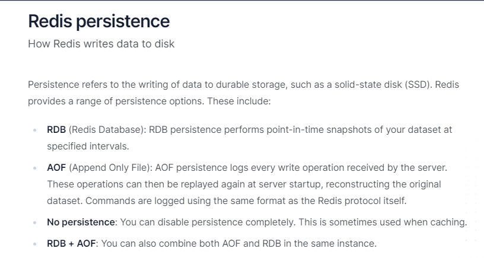


主要两种方式:

+ **RDB**(Redis DataBase)

+ **AOF**(Append Only File)

## RDB(Redis DataBase)

RDB(Redis 数据库)：RDB持久化以指定的时间间隔执行数据集的时间点快照

### 介绍

+ 在指定的时间间隔，执行数据集的时间点快照

+ 实现类似照片记录效果的方式，就是把某一时刻的数据和状态以文件的形式写到磁盘上，也就是快照。这样一来即使故障宕机，快照文件也不会丢失，数据的可靠性也就得到了保证

+ 这个快照文件就称为RDB文件(dump.rdb)

### 作用

+ 在指定的时间间隔内将内存中的数据集快照写入磁盘，也就是snapshot内存快照，它恢复时再将硬盘快照文件直接读回到内存里

+ Redis的数据都在内存中，保存备份时它执行的是全量快照，也就是说，把内存中的所有数据都记录到磁盘中，一锅端

+ RDB保存的是dump.rdb文件

### RDB案例

#### 需求说明


$\textcolor{red}{配置文件}$(6 VS 7)

Redis6.0.16及以下


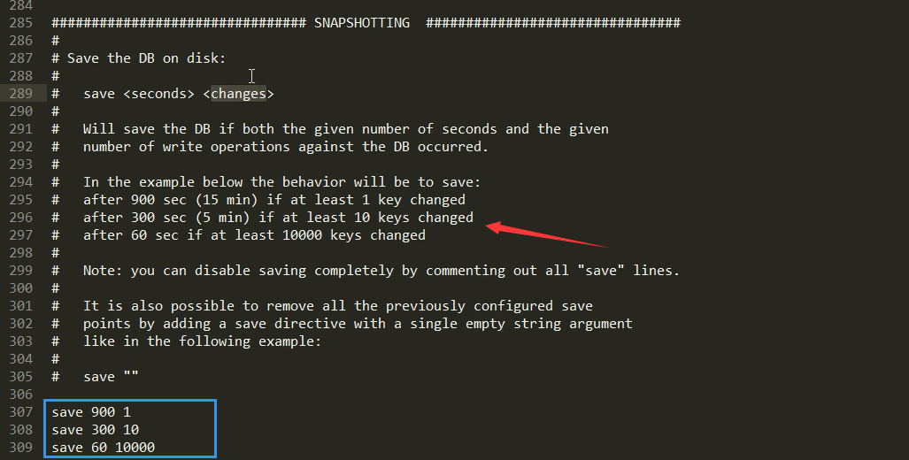

Redis6.2以及Redis-7.0.0


#### 操作步骤


##### 自动触发

Redis7版本，按照redis.conf里配置的 save \<seconds> \<changes>

**本次案例5秒2次修改**


**修改dump文件保存路径**


**修改dump文件名称**


**触发备份**

第一种情况，5秒内保存2次


第二种情况，两次保存间隔超过5秒


  注：RDB 持久化是 Redis 的一种持久化机制，它会在 Redis 数据发生修改时对内存中的数据进行快照，然后保存到磁盘，以保证数据的持久性。通常情况下，RDB 保存快照的时间间隔由配置文件中的参数 save 决定，格式为 save \<seconds> \<changes>，表示在 \<seconds> 秒内，如果数据有 \<changes> 次修改，则会进行一次快照。

在题目描述的情况下，RDB 设置了每 5 秒进行一次快照，但是如果在 5 秒内修改次数超过了 2 次，也会进行快照。这是因为在 Redis 中，保存快照并不是在规定的时间到达后才进行，而是在修改数据时和时间间隔条件的双重限制下才进行的。

如果限制只按时间间隔来进行保存快照，则会出现两个问题：

如果时间间隔太大，那么 Redis 持久化的数据可能会丢失，并且故障恢复时的数据可能会受到影响。

如果时间间隔太小，那么数据的保存成本就会过高，并可能导致 Redis 运行效率下降。

因此，Redis 引入了按时间和数据修改次数双重限制的快照保存机制，以在灵活性和效率之间取得平衡。如果在 5 秒内修改的次数超过 2 次，则说明数据的变化较快，在此情况下保存快照并不会带来明显的性能问题。因此，Redis 将其纳入保存快照的范围，以保证数据的安全和一致性

**如何恢复**

将备份文件(dump.rdb)移动到 Redis 安装目录并启动服务即可

备份成功后故意用flushdb清空redis，看看是否可以恢复数据

- 执行flushall/flushdb命令也会产生dump.rdb文件，但里面是空的，无意义

物理恢复，一定要将服务产生的RDB文件备份一份，然后分机隔离，避免生产上物理损坏后备份文件也挂了。

##### 手动触发

使用save或者bgsave命令

$\textcolor{red}{redis提供了两个命令来生成RDB文件，分别是save和bgsave}$


**save**：在主程序中执行会**阻塞**当前redis服务器，直到持久化工作完成执行save命令期间，Redis不能处理其他命令，**线上禁止使用**

**bgsave(默认)**：

- redis会在后台异步进行快照操作，**不阻塞**快照同时还可以相应客户端请求，该触发方式会fork一个子进程由子进程复制持久化过程

- 官网说明

  

- Redis会使用bgsave对当前内存中的所有数据做快照，这个操作是子进程在后台完成的，这就允许主进程同时可以修改数据。

- fork是什么？
  在Linux程序中，fork()会产生一个和父进程完全相同的子进程，但子进程在此后会exec系统调用，处于效率考虑，尽量避免膨胀

- LASTSAVE

  可以通过lastsave命令获取最后一次成功执行快照的时间


### RDB优劣

#### 优势

官网说明：


- RDB是Redis 数据的一个非常紧凑的单文件时间点表示。RDB文件非常适合备份。例如，您可能希望在最近的24小时内每小时归档一次RDB文件，并在30天内每天保存一个RDB快照。这使您可以在发生灾难时轻松恢复不同版本的数据集。
- RDB非常适合灾难恢复，它是一个可以传输到远程数据中心或Amazon S3(可能已加密）的压缩文件。
- RDB最大限度地提高了Redis 的性能，因为Redis 父进程为了持久化而需要做的唯一工作就是派生一个将完成所有其余工作的子进程。父进程永远不会执行磁盘I/О或类似操作。
- 与AOF 相比，RDB允许使用大数据集更快地重启。
- 在副本上，RDB支持重启和故障转移后的部分重新同步。

总结：

- 适合大规模的数据恢复
- 按照业务定时备份
- 对数据完整性和一致性要求不高
- RDB文件在内存中的加载速度要比AOF快很多

#### 劣势

官网说明：


- 如果您需要在Redis停止工作时（例如断电后）将数据丢失的可能性降到最低，那么RDB并不好。您可以配置生成RDB的不同保存点（例如，在对数据集至少5分钟和100次写入之后，您可以有多个保存点)。但是，您通常会每五分钟或更长时间创建一次RDB快照，因此，如果Redis由于任何原因在没有正确关闭的情况下停止工作，您应该准备好丢失最新分钟的数据。
- RDB需要经常fork()以便使用子进程在磁盘上持久化。如果数据集很大，fork()可能会很耗时，并且如果数据集很大并且CPU性能不是很好，可能会导致Redis停止为客户端服务几毫秒甚至一秒钟。AOF也需要fork()但频率较低，您可以调整要重写日志的频率，而不需要对持久性进行任何权衡。

小总结：

- 在一定间隔时间做一次备份，所以如果redis意外down掉的话，就会丢失从当前至最近一次快照期间的数据，**快照之间的数据会丢失**
- 内存数据的全量同步，如果数据量太大会导致IO严重影响服务器性能
- RDB依赖于主进程的fork，在更大的数据集中，这可能会导致服务请求的瞬间延迟。fork的时候内存中的数据被克隆了一份，大致2倍的膨胀性，需要考虑

模拟数据丢失：


### RDB快照文件.md

#### 如何检查修复dump.rdb文件？

进入到redis安装目录，执行redis-check-rdb命令 redis-check-rdb ./redisconfig/dump.rdb

#### 哪些情况会触发RDB快照

1. 配置文件中默认的快照配置
2. 手动save/bgsave命令
3. 执行flushdb/fulshall命令也会产生dump.rdb文件，但是也会将命令记录到dump.rdb文件中，恢复后依旧是空，无意义
4. 执行shutdown且没有设置开启AOF持久化
5. 主从复制时，主节点自动触发

#### 如何禁用快照

1. 动态所有停止RDB保存规则的方法：redis-cli config set value ""
2. 手动修改配置文件

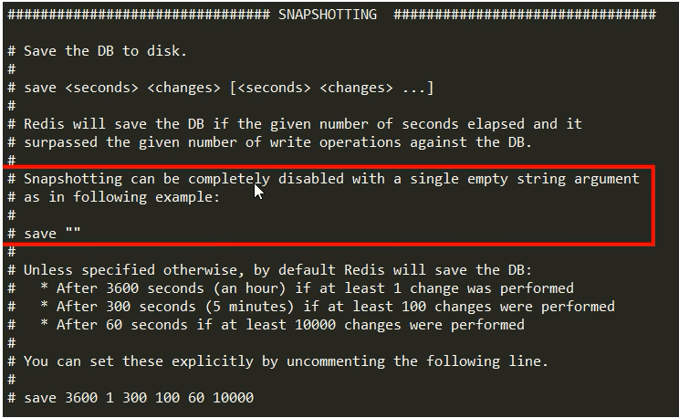

#### RDB优化配置项详解

配置文件SNAPSHOTTING模块

- save \<seconds> \<changes>：配置快照保存条件

- dir：配置快照保存目录地址

- dbfilename：配置快照的文件名

- stop-writes-on-bgsave-error：

  

  默认yes，如果配置成no，表示不在乎数据不一致或者有其他的手段发现和控制这种不一致，那么在快照写入失败时，也能确保redis继续接受新的请求

- rdbcompression：

  

  默认yes，对于存储到磁盘中的快照，可以设置是否进行压缩存储。如果是的话，Redis会采用LZF算法进行压缩。如果你不想消耗CPU来进行压缩的话，可以设置为关闭此功能

- rdbchecksum：

  

  默认yes，在存储快照后，还可以让redis使用CRC64算法来进行数据校验，但是这样做会增加大约10%的性能消耗，如果希望获取到最大的性能提升，可以关闭此功能

- rdb-del-sync-files：


在没有持久化的情况下删除复制中使用的RDB文件。默认情况下no，此选项是禁用的。

小总结：


## AOF(Append Only File)

### 官网介绍


### 是什么

$\textcolor{red}{以日志的形式来记录每个写操作}$，将Redis执行过的所有写指令记录下来(读操作不记录)，只许追加文件但是不可以改写文件，redis启动之初会读取该文件重新构建数据，换言之，redis重启的话就根据日志文件的内容将写指令从前到后执行一次以完成数据的恢复工作

默认情况下，redis是没有开启AOF的。开启AOF功能需要设置配置：appendonly yes

### 能干嘛


AOF保存的是appendonly.aof文件

### AOF持久化工作流程

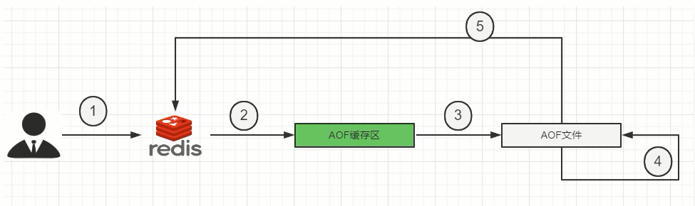

1.Client作为命令的来源，会有多个源头以及源源不断的请求命令。

2.在这些命令到达Redis Server 以后并不是直接写入AOF文件，会将其这些命令先放入AOF缓存中进行保存。这里的AOF缓冲区实际上是内存中的一片区域，存在的目的是当这些命令达到一定量以后再写入磁盘，避免频繁的磁盘IO操作。

3.AOF缓冲会根据AOF缓冲区**同步文件的三种写回策略**将命令写入磁盘上的AOF文件。

4.随着写入AOF内容的增加为避免文件膨胀，会根据规则进行命令的合并(**又称AOF重写**)，从而起到AOF文件压缩的目的。

5.当Redis Server服务器重启的时候会队AOF文件载入数据。

### AOF缓冲区三种写回策略


**ALways**：同步写回，每个写命令执行完立刻同步地将日志写会磁盘

**everysec**：每秒写回，每个写命令执行完，只是先把日志写到AOF文件的内存缓冲区，每隔1秒把缓冲区中的内容写入到磁盘

**no**：操作系统控制的写回，每个写命令执行完，只是先把日志写到AOF文件的内存缓冲区，由操作系统决定何时将缓冲区内容写回磁盘

小总结：


## AOF案例演示和优劣对比

### 配置文件说明 (6 VS 7)

#### 如何开启aof


#### 使用默认写回策略


#### aof文件-保存路径

- redis6及以前

  AOF保存文件的位置和RDB保存文件的位置一样，都是通过redis.conf配置文件的dir配置

.jpg)

- redis7最新

.jpg)

**一句话：**


#### aof文件-保存名称

- redis6及以前 ，有且仅有一个


.jpg)

- Redis7 Multi Part AOF的设计


从1个文件到3个文件

.jpg)

**MP-AOF实现**
**方案概述**
顾名思义，MP-AOF就是将原来的单个AOF文件拆分成多个AOF文件。在MP-AOF中，我们将AOF分为三种类型,
分别为:

- **BASE: 表示基础AOF**，它一般由子进程通过重写产生，该文件最多只有一个。


- **INCR:表示增量AOF**，它一般会在AOFRW开始执行时被创建，该文件可能存在多个。


- **HISTORY**:表示历史AOF，它由BASE和INCR AOF变化而来，每次AOFRW成功完成时，本次AOFRW之前对应的BASE和INCR AOF都将变为HISTORY，HISTORY类型的AOF会被Redis自动删除。

为了管理这些AOF文件，我们引入了一个manifest (清单)文件来跟踪、管理这些AOF。同时，为了便于AOF备份和拷贝，我们将所有的AOF文件和manifest文件放入一个单独的文件目录中，目录名由appenddirname配置(Redis 7.0新增配置项)决定。

Redis7.0config 中对应的配置项


### 正常恢复

1. 修改默认的appendonly no，改为yes
2. 写操作继续，生成aof文件到指定目录（然后将appendonly文件备份，使用flushdb+shutdown服务器来模拟redis宕机数据丢失，删除生成的新aof文件，将备份文件恢复）
   
3. 恢复：重启redis然后重新加载，结果OK，将数据重新写入到了redis

### 异常恢复

1. 故意胡乱改动正常的AOF文件，模拟网络闪断文件写入不完整等其他异常情况
   
2. 重启Redis之后就会进行AOF文件的载入
   
3. 异常修复命令：redis-check-aof --fix进行修复
   
4. 启动后OK


### 优势

更好的保护数据不丢失、性能高、可做紧急恢复


- 使用AOF Redis 更加持久: 您可以有不同的fsync 策略: 根本不fsync、每秒 fsync、每次查询时fsync。使用每秒fsync的默认策略，写入性能仍然很棒。fsync 是使用后台线程执行的，当没有fsync正在进行时，主线程将努力执行写入，因此您只能丢失一秒钟的写入。
- AOF 日志是一个仅附加日志，因此不会出现寻道问题，也不会在断电时出现损坏问题。即使由于某种原因(磁盘已满或其他原因) 日志以写一半的命令结尾，redis-check-aof 工具也能够轻松修复它。
- 当AOF 变得太大时，Redis 能够在后台自动重写AOF。重写是完全安全的，因为当 Redis继续附加到旧文件时，会使用创建当前数据集所需的最少操作集生成一个全新的文件，一旦第二个文件准备就绪，Redis 就会切换两者并开始附加到新的那一个。
- AOF以易于理解和解析的格式依次包含所有操作的日志。您甚至可以轻松导出AOF文件。例如，即使您不小心使用孩FLUSHALL命令刷新了所有内容，只要在此期间没有执行日志重写，您仍然可以通过停止服务器、删除最新命令并重新启动 Redis 来保存您的数据集。

### 劣势

相同数据集的数据而言AOF文件要远大于RDB文件，恢复速度慢于RDB

AOF运行效率要慢于RDB，每秒同步策略效率较好，不同步效率和RDB相同


- AOF文件通常比相同数据集的等效 RDB 文件大。
- 根据确切的 fsync策略，AOF可能比 RDB 慢。一般来说，将fsync 设置为每秒性能仍然非常高，并且在禁用 fsync的情况下，即使在高负载下它也应该与 RDB 一样快。即使在巨大的写入负载的情况下，RDB仍然能够提供关于最大延迟的更多保证。


## AOF重写机制

### 是什么？

由于AOF持久化是Redis不断将写命令记录到 AOF 文件中，随着Redis不断的进行，AOF 的文件会越来越大,文件越大，占用服务器内存越大以及 AOF 恢复要求时间越长。
为了解决这个问题，**Redis新增了重写机制**，当AOF文件的大小超过所设定的峰值时，Redis就会**自动**启动AOF文件的内容压缩.只保留可以恢复数据的最小指令集或者可以**手动使用命令 bgrewriteaof 来重新**。


一句话：启动AOF文件的内容压缩，只保留可以恢复数据的最小指令集。

### 触发机制

- **官网默认配置**


- **自动触发**

满足配置文件中的选项后，Redis会记录上次重写时的AOF大小，默认配置是当AOF文件大小是上次rewrite后大小的一倍且文件大于64M时

- **手动触发**

客户端向服务器发送bgrewriteaof命令

### 案例说明

**需求说明：**

$\textcolor{red}{启动AOF文件的内容压缩，只保留可以恢复数据的最小指令集。}$
$\textcolor{blue}{举个例子:}$ 比如有个key
开始你 set k1 v1
然后改成 set k1 v2
最后改成 set k1 v3
如果不重写，那么这3条语句都在aof文件中，内容占空间不说启动的时候都要执行一遍，共计3条命令但是，我们实际效果只需要set k1 v3这一条，所以，
开启重写后，只需要保存set k1 3就可以了只需要保留最后一次修改值，相当于给aof文件瘦身减肥，性能更好。
AOF重写不仅降低了文件的占用空间，同时更小的AOF也可以更快地被Redis加载。

**需求验证：**

$\textcolor{green}{启动AOF文件的内容压缩，只保留可以恢复数据的最小指令集。}$

**步骤：**

- 前期配置准备：

  1. 开启aof，appendonly yes，设置aof持久化开启

  2. 重写峰值修改为1k

     

  3. 关闭混合，设置为no

     

  4. 删除执勤啊的全部aof和rdb，清除干扰项


- 自动触发案例01

  1. 完成上述正确配置，重启redis服务器，执行 set k1 v1 查看aof文件是否正常

     

  2. 查看aof三大 配置文件

     appendonly.aof.1.base.aof；appendonly.aof.1.incr.aof；appendonly.aof.manifest

  3. k1不停的更新值

     

  4. 重写触发


- 手动触发案例02

  客户端向服务器发送bgrewriteaof命令


- 结论

**也就是说AOF文件重写并不是对原文件进行重新整理，而是直接读取服务器现有的键值对，然后用一条命令去代替之前记录这个键值对的多条命令，生成一个新的文件后去替换原来的AOF文件。**
AOF文件重写触发机制:通过 redis.conf配置文件中的 auto-aof-rewrite-percentage:默认值为100，以及auto-aof-rewrite-min-size: 64mb配置，也就是说默认Redis会记录上次重写时的AOF大小，**默认配置是当AOF文件大小是上次rewrite后大小的一倍且文件大于64M时触发。**

### 重写原理

1. 在重写开始前，redis会创建一个“重写子进程”，这个子进程会读取现有的AOF文件，并将其包含的指令进行分析压缩并写入到一个临时文件中。
2. 与此同时，主进程会将新接收到的写指令一边累积到内存缓冲区中，一边继续写入到原有的AOF文件中，这样做是保证原有的AOF文件的可用性，避免在重写过程中出现意外。
3. 当“重写子进程”完成重写工作后，它会给父进程发一个信号，父进程收到信号后就会将内存中缓存的写指令追加到新AOF文件中
4. 当追加结束后，redis就会用新AOF文件来代替旧AOF文件，之后再有新的写指令，就都会追加到新的AOF文件中
5. 重写aof文件的操作，并没有读取旧的aof文件，而是将整个内存中的数据库内容用命令的方式重写了一个新的aof文件，这点和快照有点类似

## AOF 优化配置项详解

配置文件 APPEND ONLY MODE模块


 总结

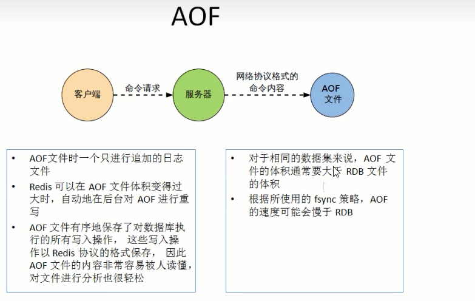


## RDB-AOF混合持久化

### 官网建议


### RDB VS AOF

**问题：**

可否共存？

如果共存听谁的？

**Redis配置文档解答：RDB和AOF共存时会优先加载AOF文件**


**$\textcolor{red}{数据恢复顺序和加载流程}$**

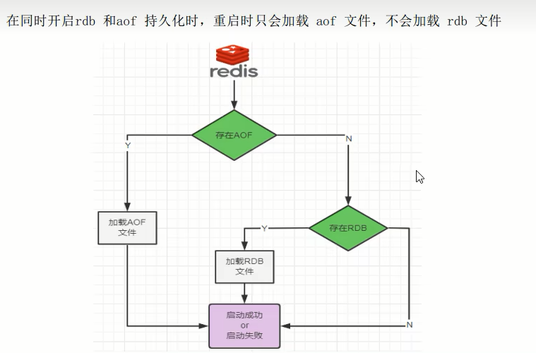

### 你怎么选？用哪个？

- RDB持久化方式能够在指定的时间间隔对你的数据进行快照存储。
- AOF持久化方式记录每次对服务器写的操作，当服务器重启的时候会重新执行这些命令来恢复原始的数据，AOF命令以redis协议追加保存每次写的操作到文件末尾。

### 同时开启两种持久化方式

- 在这种情况下，$\textcolor{red}{当redis重启的时候会优先载入AOF文件来恢复原始的数据}$，因为在通常情况下AOF文件保存的数据集要比RDB文件保存的数据集要完整。
- RDB的数据不实时，同时使用两者时服务器重启也只会找AOF文件。但是作者也不建议只使用AOF方式备份，因为RDB更适合用于备份数据库（AOF在不断的变化不好备份），留着RDB作为一个万一的手段。

### 推荐方式

RDB+AOF混合方式

1开启混合方式设置
$\textcolor{red}{设置aof-use-rdb-preamble的值为yes， yes表示开启，设置为no表示禁用}$
2 RDB+AOF的混合方式--------->结论:RDB镜像做全量持久化，AOF做增量持久化
先使用RDB进行快照存储，然后使用AOF持久化记录所有的写操作，当重写策略满足或手动触发重写的时候，将最新的数据存储为新的RDB记录。这样的话，重启服务的时候会从RDB和AOF两部分恢复数据，既保证了数据完整性，又提高了恢复数据的性能。简单来说:混合持久化方式产生的文件一部分是RDB格式，一部分是AOF格式。----》AOF包括了RDB头部+AOF混写


## 纯缓存模式

### 同时关闭RDB+AOF，专心做缓存

1. save ""  -- 禁用RDB

   禁用RDB持久化模式下，我们仍然可以使用命令save、bgsave生成RDB文件

2. appendonly no  -- 禁用AOF

   禁用AOF持久化模式下，我们仍然可以使用命令bgrewriteaof生成AOF文件


