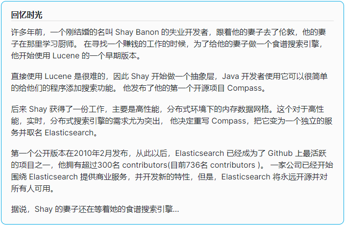
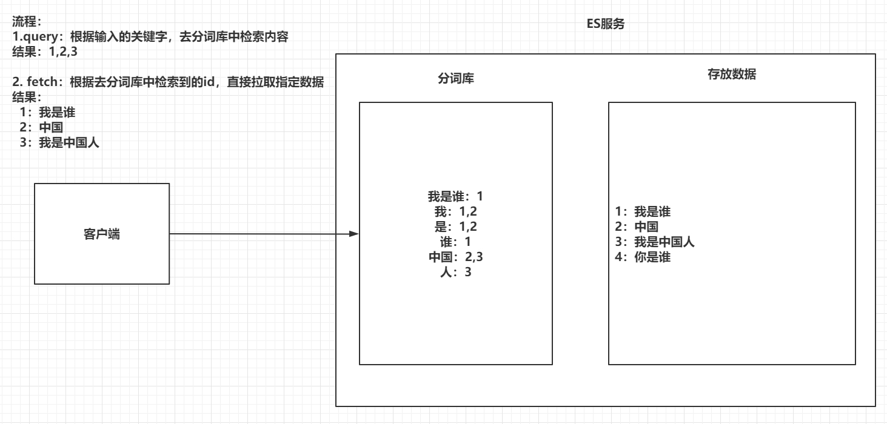
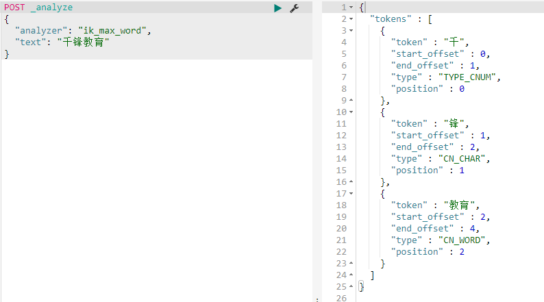
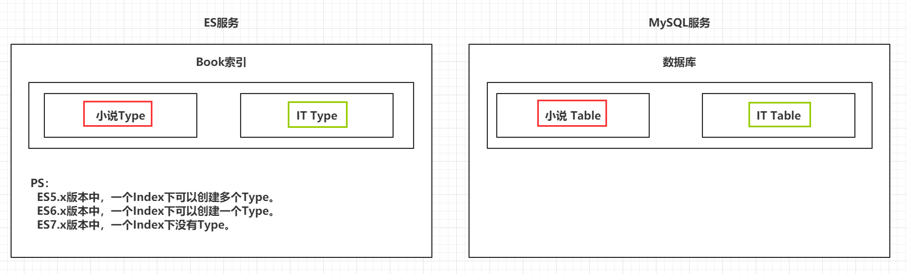
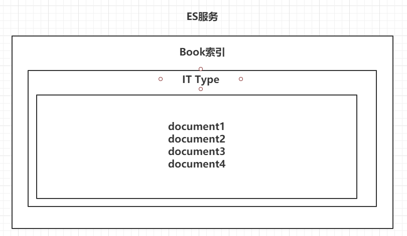
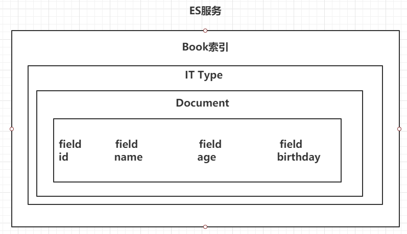
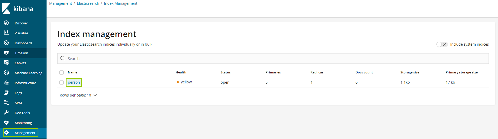
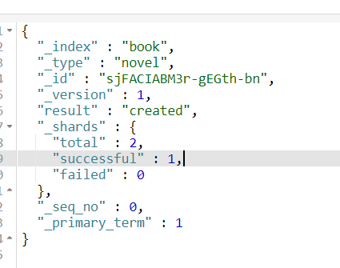
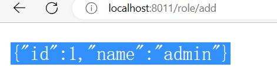
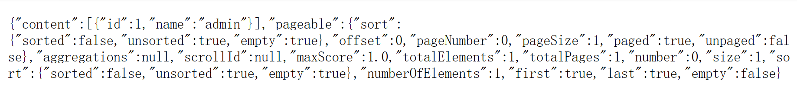

### 一、引言

------

#### 1.1 海量数据

在海量数据中执行搜索功能时，如果使用MySQL，效率太低。

#### 1.2 全文检索

在海量数据中执行搜索功能时，如果使用MySQL，效率太低。

#### 1.3 高亮显示

将搜索关键字，以红色的字体展示。

### 二、ES概述

------

#### 2.1 ES的介绍

- ES是一个使用Java语言并且基于Lucene编写的搜索引擎框架，他提供了分布式的全文搜索功能，提供了一个统一的基于RESTful风格的WEB接口，官方客户端也对多种语言都提供了相应的API。
- Lucene：Lucene本身就是一个搜索引擎的底层。
- 分布式：ES主要是为了突出他的横向扩展能力。
- 全文检索：将一段词语进行分词，并且将分出的单个词语统一的放到一个分词库中，在搜索时，根据关键字去分词库中检索，找到匹配的内容。（倒排索引）
- RESTful风格的WEB接口：操作ES很简单，只需要发送一个HTTP请求，并且根据请求方式的不同，携带参数的同，执行相应的功能。
- 应用广泛：Github.com，WIKI，Gold Man用ES每天维护将近10TB的数据。

#### 2.2 ES的由来





#### 2.3 ES和Solr

- Solr在查询死数据时，速度相对ES更快一些。但是数据如果是实时改变的，Solr的查询速度会降低很多，ES的查询的效率基本没有变化。
- Solr搭建基于需要依赖Zookeeper来帮助管理。ES本身就支持集群的搭建，不需要第三方的介入。
- 最开始Solr的社区可以说是非常火爆，针对国内的文档并不是很多。在ES出现之后，ES的社区火爆程度直线上升，ES的文档非常健全。
- ES对现在云计算和大数据支持的特别好。

#### 2.4 倒排索引

将存放的数据，以一定的方式进行分词，并且将分词的内容存放到一个单独的分词库中。

当用户去查询数据时，会将用户的查询关键字进行分词。

然后去分词库中匹配内容，最终得到数据的id标识。

根据id标识去存放数据的位置拉取到指定的数据。





### 三、 ElasticSearch安装

------

#### 3.1 安装ES&Kibana

yml文件


```java
version: "3.1"
services:
  elasticsearch:
    image: daocloud.io/library/elasticsearch:6.5.4
    restart: always
    container_name: elasticsearch
    ports:
      - 9200:9200
    environment:
      - JAVA_OPTS=--Xms256m -Xmx1024m
  kibana:
    image: daocloud.io/library/kibana:6.5.4
    restart: always
    container_name: kibana
    ports:
      - 5601:5601
    environment:
      - elasticsearch_url=http://43.138.66.98:9200
    depends_on:
      - elasticsearch
```

如果我们的es报： max virtual memory areas vm.max_map_count [65530] is too low, increase to at least [262144]  

需要在：/etc/sysctl.conf  添加上：vm.max_map_count=262144

最后启动配置：sysctl -w vm.max_map_count=262144


然后：docker-compose down  

#### 3.2 安装IK分词器

- 下载IK分词器的地址：https://github.com/medcl/elasticsearch-analysis-ik/releases/download/v6.5.4/elasticsearch-analysis-ik-6.5.4.zip
- 由于网络问题，采用国内的路径去下载：http://tomcat01.qfjava.cn:81/elasticsearch-analysis-ik-6.5.4.zip
- 进去到ES容器内部，跳转到bin目录下，执行bin目录下的脚本文件：
- ./elasticsearch-plugin install http://43.138.66.98:8080/elasticsearch-analysis-ik-6.5.4.zip
- http://43.138.66.98:8080/elasticsearch-analysis-ik-6.5.4.zip
- 重启ES的容器，让IK分词器生效。



### 四、 ElasticSearch基本操作

#### 4.1 ES的结构

##### 4.1.1 索引Index，分片和备份

- ES的服务中，可以创建多个索引。
- 每一个索引默认被分成5片存储。
- 每一个分片都会存在至少一个备份分片。
- 备份分片默认不会帮助检索数据，当ES检索压力特别大的时候，备份分片才会帮助检索数据。
- 备份的分片必须放在不同的服务器中。


##### 4.1.2 类型 Type

一个索引下，可以创建多个类型。

Ps：根据版本不同，类型的创建也不同。




##### 4.1.3 文档 Doc

一个类型下，可以有多个文档。这个文档就类似于MySQL表中的多行数据。





##### 4.1.4 属性 Field

一个文档中，可以包含多个属性（字段）。类似于MySQL表中的一行数据存在多个列。





#### 4.2 操作ES的RESTful语法 （了解）

- GET请求：

- - http://ip:port/index：查询索引信息  index（索引名）
  - http://ip:port/index/type/doc_id：查询指定的文档信息

- POST请求：(_update 修改)  增加数据

- - http://ip:port/index/type/_search（这是查询条件）：查询文档，可以在请求体中添加json字符串来代表查询条件
  - http://ip:port/index/type/doc_id/_update：修改文档，在请求体中指定json字符串代表修改的具体信息

- PUT请求：（创建） insert

- - http://ip:port/index：创建一个索引，需要在请求体中指定索引的信息，类型，结构
  - http://ip:port/index/type/_mappings：代表创建索引时，指定索引文档存储的属性的信息（mappings 里面就是就doc和feild）

- DELETE请求：

- - http://ip:port/index：删除索引
  - http://ip:port/index/type/doc_id：删除指定的文档


#### 4.3 索引的操作

##### 4.3.1 创建一个索引


语法如下


index 索引名 采用小写

```java
# 创建一个索引
PUT /person
{
  "settings": {
    "number_of_shards": 5,   //默认分片  5片
    "number_of_replicas": 1  //备份的份数
  }
}


#这是我们创建索引
PUT /person
{
  "settings": {
    "number_of_shards":5,
    "number_of_replicas":1
  }
  
}

#查询索引
GET /person
```

##### 4.3.2 查看索引信息

语法如下

```java
# 查看索引信息
GET /person
```




##### 4.3.3 删除索引

语法如下

```java
# 删除索引
DELETE /person
```

- - 或者IPV6

其他的数据类型参考官网：https://www.elastic.co/guide/en/elasticsearch/reference/6.5/mapping-types.html

#### 4.5 创建索引并指定数据结构

语法如下


```java
# 创建索引，指定数据结构
PUT /book
{
  "settings": {
    # 分片数
    "number_of_shards": 5,
    # 备份数
    "number_of_replicas": 1
  },
  # 指定数据结构
  "mappings": {
    # 类型 Type
    "novel": {
      # 文档存储的Field
      "properties": {
        # Field属性名
        "name": {
    		# 类型
          "type": "text",
    		# 指定分词器
          "analyzer": "ik_max_word",
    		# 指定当前Field可以被作为查询的条件
          "index": true ,
    		# 是否需要额外存储
          "store": false 
        },
        "author": {
          "type": "keyword"
        },
        "count": {
          "type": "long"
        },
        "on-sale": {
          "type": "date",
           # 时间类型的格式化方式 
          "format": "yyyy-MM-dd HH:mm:ss||yyyy-MM-dd||epoch_millis"
        },
        "descr": {
          "type": "text",
          "analyzer": "ik_max_word"
        }
      }
    }
  }
}
```

#### 4.6 文档的操作

文档在ES服务中的唯一标识，_index，_type，_id三个内容为组合，锁定一个文档，操作是添加还是修改。



##### 4.6.1 新建文档

自动生成_id


```java
# 添加文档，自动生成id
POST /book/novel
{
  "name": "盘龙",
  "author": "我吃西红柿",
  "count": 100000,
  "on-sale": "2000-01-01",
  "descr": "山重水复疑无路，柳暗花明又一村"
}
```

手动指定_id

```java
# 添加文档，手动指定id
PUT /book/novel/1
{
  "name": "红楼梦",
  "author": "曹雪芹",
  "count": 10000000,
  "on-sale": "1985-01-01",
  "descr": "一个是阆苑仙葩，一个是美玉无瑕"
}
```

##### 4.6.2 修改文档

覆盖式修改

```java
# 添加文档，手动指定id
PUT /book/novel/1
{
  "name": "红楼梦",
  "author": "曹雪芹",
  "count": 4353453,
  "on-sale": "1985-01-01",
  "descr": "一个是阆苑仙葩，一个是美玉无瑕"
}
```


doc修改方式

```java
# 修改文档，基于doc方式
POST /book/novel/1/_update
{
  "doc": {
     # 指定上需要修改的field和对应的值
    "count": "1234565"
  }
}
```

##### 4.6.3 删除文档

根据id删除


```java
# 根据id删除文档
DELETE /book/novel/_id
#定义我们的索引，相当于在mysql创建表
PUT /book
{
  "settings": {
    "number_of_shards": 5,
    "number_of_replicas": 1
  },
  "mappings": {
    "novel":{
      "properties":{
        "name":{
          "type":"text",
          "analyzer":"ik_max_word"
        },
        "auther":{
          "type":"keyword"
        },
        "count":{
          "type":"long"
        },
        "on-sale":{
          "type":"date",
          "format":"yyyy-MM-dd HH:mm:ss||yyyy-MM-dd||epoch_millis"
        },
        "descr":{
          "type":"text",
          "analyzer":"ik_max_word"
        }
      }
    }
  }
}
#添加一篇文章
POST /book/novel
{
  "name":"周高强裸奔议论文",
  "auther":"马垒",
  "count":"1000",
  "on-sale":"2021-12-03",
  "descr":"文章很精彩"
}

#添加文章
PUT /book/novel/1
{
  "name":"周高强裸奔议论文",
  "auther":"马垒",
  "count":"1000",
  "on-sale":"2021-12-03",
  "descr":"文章很精彩"
}

#添加文章
PUT /book/novel/1
{
  "name":"马垒裸奔议论文",
  "auther":"周高强",
  "count":"3000",
  "on-sale":"2021-12-03",
  "descr":"文章更精彩"
}

#添加文章
POST /book/novel/1/_update
{
  "doc":{
    "name":"易义凯裸奔议论文"
  }
}

# 根据id删除文档
DELETE /book/novel/RL-Pf30BJkEo8szGtFqH
POST _analyze
{
  "analyzer": "ik_max_word",
  "text":"千锋教育"
}

PUT /person
{
  "settings": {
    "number_of_shards": 5,
    "number_of_replicas": 1
    
  }
}

GET /person

DELETE /person


PUT /basic
{
  "settings": {
    "number_of_shards": 5,
    "number_of_replicas": 1
  },
  "mappings": {
    "user":{
      "properties":{
          "id":{
            "type":"integer"
          },
          "name":{
            "type":"text",
            "analyzer":"ik_max_word",
            "index": true ,
            "store": false 
          },
          "age":{
            "type":"integer"
          },
          "birday":{
            "type":"date",
            "format": "yyyy-MM-dd HH:mm:ss||yyyy-MM-dd||epoch_millis"
          }
      }
    }
  }
}


GET /basic

POST /basic/user
{
  "id":1,
  "name":"张三",
  "age":23,
  "birday":"2022-12-27"
}

GET /basic/user/rZLSUoUBy5yckUycz3l2

PUT /basic/user/rZLSUoUBy5yckUycz3l2
{
  "id":2,
  "name":"王五",
  "age":49,
  "birday":"2022-12-27"
}

DELETE /basic/user/111

POST /basic/user/rZLSUoUBy5yckUycz3l2/_update
{
  "doc":{
    "age":59
  }
  
}


PUT /sms-logs-index
{
  "settings": {
    "number_of_shards": 5,   
    "number_of_replicas": 1  
  },

  "mappings": {
    "sms-logs-type": {
      "properties": {
        "createDate": {
          "type":"date",
          "format":"yyyy-MM-dd HH:mm:ss||yyyy-MM-dd||epoch_millis"
        },
        "sendDate": {
          "type":"date",
          "format":"yyyy-MM-dd HH:mm:ss||yyyy-MM-dd||epoch_millis"
        },
        "longCode": {
          "type":"keyword"
        },
        "moblie": {
          "type":"long"
        },
        "corpName": {
          "type":"text",
          "analyzer":"ik_max_word"
        },
        "smsContent": {
          "type":"text",
          "analyzer":"ik_max_word"
        },
        "state": {
          "type":"integer"
        },
        "operatorId": {
          "type":"integer"
        },
        "province": {
          "type":"text"
        },
        "ipAddr": {
          "type":"text"
        },
        "replyTotal": {
          "type":"long"
        },
        "fee": {
          "type":"integer"
        }
      }
    }
  }
}


POST /sms-logs-index/sms-logs-type
{
  "createDate":"2022-12-27",
  "sendDate":"2022-12-27",
  "longCode":"1069886622",
  "moblie":"18302370310",
  "corpName":"千锋教育重庆",
  "smsContent":"请师生们都注意防护",
  "state":"0",
  "operatorId":"1",
  "province":"重庆",
  "ipAddr":"http://www.1000phong.com",
  "replyTotal":"2",
  "fee":"15"
}


POST /sms-logs-index/sms-logs-type
{"createDate":"2022-12-28",
  "sendDate":"2022-12-28",
  "longCode":"1069886633",
  "moblie":"15202370310",
  "corpName":"千锋教育重庆",
  "smsContent":"请师生们都注意防护",
  "state":"0",
  "operatorId":"1",
  "province":"重庆",
  "ipAddr":"http://www.1000phong.com",
  "replyTotal":"3",
  "fee":"16"
}

POST /sms-logs-index/sms-logs-type
{"createDate":"2022-12-29",
  "sendDate":"2022-12-29",
  "longCode":"1569885533",
  "moblie":"15302370310",
  "corpName":"千锋教育重庆",
  "smsContent":"请师生们都注意防护",
  "state":"0",
  "operatorId":"1",
  "province":"重庆",
  "ipAddr":"http://www.1000phong.com",
  "replyTotal":"4",
  "fee":"17"
}

POST /sms-logs-index/sms-logs-type
{"createDate":"2022-12-30",
  "sendDate":"2022-12-30",
  "longCode":"2069886793",
  "moblie":"18102370310",
  "corpName":"千锋教育重庆",
  "smsContent":"请师生们都注意防护",
  "state":"1",
  "operatorId":"1",
  "province":"重庆",
  "ipAddr":"http://www.1000phong.com",
  "replyTotal":"3",
  "fee":"15"
}

POST /sms-logs-index/sms-logs-type
{"createDate":"2022-12-25",
  "sendDate":"2022-12-25",
  "longCode":"3369886633",
  "moblie":"15202370310",
  "corpName":"千锋教育重庆",
  "smsContent":"请师生们都注意防护",
  "state":"0",
  "operatorId":"1",
  "province":"重庆",
  "ipAddr":"http://www.1000phong.com",
  "replyTotal":"1",
  "fee":"20"
}

POST /sms-logs-index/sms-logs-type
{"createDate":"2022-12-24",
  "sendDate":"2022-12-24",
  "longCode":"10699886633",
  "moblie":"18702370310",
  "corpName":"千锋教育重庆",
  "smsContent":"请师生们都注意防护",
  "state":"0",
  "operatorId":"1",
  "province":"重庆",
  "ipAddr":"http://www.1000phong.com",
  "replyTotal":"1",
  "fee":"19"
}

POST /sms-logs-index/sms-logs-type
{"createDate":"2022-12-15",
  "sendDate":"2022-12-15",
  "longCode":"4069886633",
  "moblie":"15202370310",
  "corpName":"千锋教育重庆",
  "smsContent":"请师生们都注意防护",
  "state":"0",
  "operatorId":"1",
  "province":"重庆",
  "ipAddr":"http://www.1000phong.com",
  "replyTotal":"3",
  "fee":"16"
}

POST /sms-logs-index/sms-logs-type
{"createDate":"2022-12-28",
  "sendDate":"2022-12-28",
  "longCode":"1069886633",
  "moblie":"15202370310",
  "corpName":"千锋教育北京",
  "smsContent":"请师生们都注意防护",
  "state":"1",
  "operatorId":"1",
  "province":"北京",
  "ipAddr":"http://www.1000phong.com",
  "replyTotal":"1",
  "fee":"12"
}

POST /sms-logs-index/sms-logs-type
{"createDate":"2022-12-15",
  "sendDate":"2022-12-15",
  "longCode":"1069886633",
  "moblie":"18702370310",
  "corpName":"千锋教育北京",
  "smsContent":"请师生们都注意防护",
  "state":"0",
  "operatorId":"1",
  "province":"北京",
  "ipAddr":"http://www.1000phong.com",
  "replyTotal":"1",
  "fee":"16"
}

POST /sms-logs-index/sms-logs-type
{"createDate":"2022-12-06",
  "sendDate":"2022-12-06",
  "longCode":"1069886633",
  "moblie":"11202370310",
  "corpName":"千锋教育北京",
  "smsContent":"请师生们都注意防护",
  "state":"0",
  "operatorId":"1",
  "province":"北京",
  "ipAddr":"http://www.1000phong.com",
  "replyTotal":"3",
  "fee":"5"
}

POST /sms-logs-index/sms-logs-type
{"createDate":"2022-11-15",
  "sendDate":"2022-11-15",
  "longCode":"1069886633",
  "moblie":"18752370310",
  "corpName":"千锋教育北京",
  "smsContent":"请师生们都注意防护",
  "state":"0",
  "operatorId":"1",
  "province":"北京",
  "ipAddr":"http://www.1000phong.com",
  "replyTotal":"1",
  "fee":"16"
}

POST /sms-logs-index/sms-logs-type
{"createDate":"2022-12-10",
  "sendDate":"2022-12-10",
  "longCode":"10698255761",
  "moblie":"18702370310",
  "corpName":"千锋教育北京",
  "smsContent":"请师生们都注意防护",
  "state":"0",
  "operatorId":"1",
  "province":"北京",
  "ipAddr":"http://www.1000phong.com",
  "replyTotal":"1",
  "fee":"16"
}

POST /sms-logs-index/sms-logs-type
{"createDate":"2022-12-11",
  "sendDate":"2022-12-10",
  "longCode":"10698255761",
  "moblie":"18702370310",
  "corpName":"千锋教育深圳",
  "smsContent":"请师生们都注意戴口罩",
  "state":"0",
  "operatorId":"1",
  "province":"深圳",
  "ipAddr":"http://www.1000phong.com",
  "replyTotal":"1",
  "fee":"13"
}


POST /sms-logs-index/sms-logs-type
{"createDate":"2022-12-11",
  "sendDate":"2022-12-10",
  "longCode":"10698255761",
  "moblie":"18702370310",
  "corpName":"千锋教育深圳",
  "smsContent":"请师生们都注意戴口罩",
  "state":"1",
  "operatorId":"1",
  "province":"深圳",
  "ipAddr":"http://www.1000phong.com",
  "replyTotal":"5",
  "fee":"13"
}

DELETE /sms-logs-index
```

### 五、Java操作ElasticSearch【重点】

#### 5.1 Java连接ES

创建Maven工程

导入依赖

```java
<dependencies>
    <!--        1. elasticsearch-->
    <dependency>
        <groupId>org.elasticsearch</groupId>
        <artifactId>elasticsearch</artifactId>
        <version>6.5.4</version>
    </dependency>

    <!--        2. elasticsearch的高级API-->
    <dependency>
        <groupId>org.elasticsearch.client</groupId>
        <artifactId>elasticsearch-rest-high-level-client</artifactId>
        <version>6.5.4</version>
    </dependency>

    <!--        3. junit-->
    <dependency>
        <groupId>junit</groupId>
        <artifactId>junit</artifactId>
        <version>4.12</version>
    </dependency>

    <!--        4. lombok-->
    <dependency>
        <groupId>org.projectlombok</groupId>
        <artifactId>lombok</artifactId>
        <version>1.16.22</version>
    </dependency>
</dependencies>
```

创建测试类，连接ES


```java
public class ESClient {

    public static RestHighLevelClient getClient(){

        // 创建HttpHost对象
        HttpHost httpHost = new HttpHost("192.168.199.109",9200);

        // 创建RestClientBuilder
        RestClientBuilder clientBuilder = RestClient.builder(httpHost);

        // 创建RestHighLevelClient
        RestHighLevelClient client = new RestHighLevelClient(clientBuilder);

        // 返回
        return client;
    }

}
```


#### 5.2 Java操作索引

##### 5.2.1 创建索引

代码如下


```java
public class Demo2 {

    RestHighLevelClient client = ESClient.getClient();
    String index = "person";
    String type = "man";

    @Test
    public void createIndex() throws IOException {
        //1. 准备关于索引的settings
        Settings.Builder settings = Settings.builder()
                .put("number_of_shards", 3)
                .put("number_of_replicas", 1);

        //2. 准备关于索引的结构mappings
        XContentBuilder mappings = JsonXContent.contentBuilder()
                .startObject()
                    .startObject("properties")
                        .startObject("name")
                            .field("type","text")
                        .endObject()
                        .startObject("age")
                            .field("type","integer")
                        .endObject()
                        .startObject("birthday")
                            .field("type","date")
                            .field("format","yyyy-MM-dd")
                        .endObject()
                    .endObject()
                .endObject();


        //3. 将settings和mappings封装到一个Request对象
        CreateIndexRequest request = new CreateIndexRequest(index)
                .settings(settings)
                .mapping(type,mappings);

        //4. 通过client对象去连接ES并执行创建索引
        CreateIndexResponse resp = client.indices().create(request, RequestOptions.DEFAULT);

        //5. 输出
        System.out.println("resp:" + resp.toString());

    }

}
```

##### 5.2.2 检查索引是否存在

代码如下

```java
@Test
public void exists() throws IOException {
    //1. 准备request对象
    GetIndexRequest request = new GetIndexRequest();
    request.indices(index);

    //2. 通过client去操作
    boolean exists = client.indices().exists(request, RequestOptions.DEFAULT);


    //3. 输出
    System.out.println(exists);
}
```

##### 5.2.3 删除索引

代码如下

```java
@Test
public void delete() throws IOException {
    //1. 准备request对象
    DeleteIndexRequest request = new DeleteIndexRequest();
    request.indices(index);

    //2. 通过client对象执行
    AcknowledgedResponse delete = client.indices().delete(request, RequestOptions.DEFAULT);

    //3. 获取返回结果
    System.out.println(delete.isAcknowledged());
}
```

#### 5.3 Java操作文档

##### 5.3.1 添加文档操作

导入依赖

```xml
<dependency>
            <groupId>com.fasterxml.jackson.core</groupId>
            <artifactId>jackson-core</artifactId>
            <version>2.9.0</version>
        </dependency>
        <dependency>
            <groupId>com.fasterxml.jackson.core</groupId>
            <artifactId>jackson-databind</artifactId>
            <version>2.9.0</version>
        </dependency>
        <dependency>
        <groupId>com.fasterxml.jackson.core</groupId>
        <artifactId>jackson-annotations</artifactId>
        <version>2.9.0</version>
        </dependency>
```

代码如下

```java
public class Demo3 {

    ObjectMapper mapper = new ObjectMapper();
    RestHighLevelClient client = ESClient.getClient();
    String index = "person";
    String type = "man";

    @Test
    public void createDoc() throws IOException {
        //1. 准备一个json数据
        Person person = new Person(1,"张三",23,new Date());
        String json = mapper.writeValueAsString(person);

        //2. 准备一个request对象（手动指定id）
        IndexRequest request = new IndexRequest(index,type,person.getId().toString());
        request.source(json, XContentType.JSON);

        //3. 通过client对象执行添加
        IndexResponse resp = client.index(request, RequestOptions.DEFAULT);

        //4. 输出返回结果
        System.out.println(resp.getResult().toString());
    }

}
```

##### 5.3.2 修改文档

代码如下

```java
@Test
public void updateDoc() throws IOException {
    //1. 创建一个Map，指定需要修改的内容
    Map<String,Object> doc = new HashMap<>();
    doc.put("name","张大三");
    String docId = "1";

    //2. 创建request对象，封装数据
    UpdateRequest request = new UpdateRequest(index,type,docId);
    request.doc(doc);

    //3. 通过client对象执行
    UpdateResponse update = client.update(request, RequestOptions.DEFAULT);

    //4. 输出返回结果
    System.out.println(update.getResult().toString());
}
```

##### 5.3.3 删除文档

代码如下

```java
@Test
public void deleteDoc() throws IOException {
    //1. 封装Request对象
    DeleteRequest request = new DeleteRequest(index,type,"1");

    //2. client执行
    DeleteResponse resp = client.delete(request, RequestOptions.DEFAULT);

    //3. 输出结果
    System.out.println(resp.getResult().toString());
}
```

#### 5.4 Java批量操作文档

##### 5.4.1 批量添加

代码如下

```java
@Test
public void bulkCreateDoc() throws IOException {
    //1. 准备多个json数据
    Person p1 = new Person(1,"张三",23,new Date());
    Person p2 = new Person(2,"李四",24,new Date());
    Person p3 = new Person(3,"王五",25,new Date());

    String json1 = mapper.writeValueAsString(p1);
    String json2 = mapper.writeValueAsString(p2);
    String json3 = mapper.writeValueAsString(p3);

    //2. 创建Request，将准备好的数据封装进去
    BulkRequest request = new BulkRequest();
    request.add(new IndexRequest(index,type,p1.getId().toString()).source(json1,XContentType.JSON));
    request.add(new IndexRequest(index,type,p2.getId().toString()).source(json2,XContentType.JSON));
    request.add(new IndexRequest(index,type,p3.getId().toString()).source(json3,XContentType.JSON));

    //3. 用client执行
    BulkResponse resp = client.bulk(request, RequestOptions.DEFAULT);

    //4. 输出结果
    System.out.println(resp.toString());
}
```

##### 5.4.2 批量删除

代码如下

```java
@Test
public void bulkDeleteDoc() throws IOException {
    //1. 封装Request对象
    BulkRequest request = new BulkRequest();
    request.add(new DeleteRequest(index,type,"1"));
    request.add(new DeleteRequest(index,type,"2"));
    request.add(new DeleteRequest(index,type,"3"));

    //2. client执行
    BulkResponse resp = client.bulk(request, RequestOptions.DEFAULT);

    //3. 输出
    System.out.println(resp);
}
```

#### 5.5 ElasticSearch练习  (作业)

创建索引，指定数据结构

索引名：sms-logs-index

类型名：sms-logs-type

结构如下：


### 六、 ElasticSearch的各种查询

#### 6.1 term&terms查询【重点】

##### 6.1.1 term查询（keyword）

term的查询是代表完全匹配，搜索之前不会对你搜索的关键字进行分词，对你的关键字去文档分词库中去匹配内容。select * from xxx where yyy=?

```java
# term查询
POST /sms-logs-index/sms-logs-type/_search
{
  "from": 0,     # limit ？
  "size": 5,	  # limit x,?
  "query": {
    "term": {
      "province": {
        "value": "北京"
      }
    }
  }
}
```

代码实现方式

```java
// Java代码实现方式
@Test
public void termQuery() throws IOException {
    //1. 创建Request对象
    SearchRequest request = new SearchRequest(index);
    request.types(type);

    //2. 指定查询条件
    SearchSourceBuilder builder = new SearchSourceBuilder();
    builder.from(0);
    builder.size(5);
    builder.query(QueryBuilders.termQuery("province","北京"));

    request.source(builder);

    //3. 执行查询
    SearchResponse resp = client.search(request, RequestOptions.DEFAULT);

    //4. 获取到_source中的数据，并展示
    for (SearchHit hit : resp.getHits().getHits()) {
        Map<String, Object> result = hit.getSourceAsMap();
        System.out.println(result);
    }
}
```

##### 6.1.2 terms查询

terms和term的查询机制是一样，都不会将指定的查询关键字进行分词，直接去分词库中匹配，找到相应文档内容。

terms是在针对一个字段包含多个值的时候使用。

term：where province = 北京；

terms：where province = 北京 or province = ？or province = ？


```java
# terms查询
POST /sms-logs-index/sms-logs-type/_search
{
  "query": {
    "terms": {
      "province": [
        "北京",
        "山西",
        "武汉"
      ]
    }
  }
}
```

代码实现方式

```java
// Java实现
@Test
public void termsQuery() throws IOException {
    //1. 创建request
    SearchRequest request = new SearchRequest(index);
    request.types(type);

    //2. 封装查询条件
    SearchSourceBuilder builder = new SearchSourceBuilder();
    builder.query(QueryBuilders.termsQuery("province","北京","山西"));

    request.source(builder);

    //3. 执行查询
    SearchResponse resp = client.search(request, RequestOptions.DEFAULT);

    //4. 输出_source
    for (SearchHit hit : resp.getHits().getHits()) {
        System.out.println(hit.getSourceAsMap());
    }
}
```


#### 6.2 match查询【重点】（*****）

match查询属于高层查询，他会根据你查询的字段类型不一样，采用不同的查询方式。

- 查询的是日期或者是数值的话，他会将你基于的字符串查询内容转换为日期或者数值对待。
- 如果查询的内容是一个不能被分词的内容（keyword），match查询不会对你指定的查询关键字进行分词。
- 如果查询的内容时一个可以被分词的内容（text），match会将你指定的查询内容根据一定的方式去分词，去分词库中匹配指定的内容。

match查询，实际底层就是多个term查询，将多个term查询的结果给你封装到了一起。

##### 6.2.1 match_all查询

查询全部内容，不指定任何查询条件。

```java
# match_all查询
POST /sms-logs-index/sms-logs-type/_search
{
  "query": {
    "match_all": {}
  }
}
```

代码实现方式

```java
//  java代码实现
@Test
public void matchAllQuery() throws IOException {
    //1. 创建Request
    SearchRequest request = new SearchRequest(index);
    request.types(type);

    //2. 指定查询条件
    SearchSourceBuilder builder = new SearchSourceBuilder();
    builder.query(QueryBuilders.matchAllQuery());
    builder.size(20);           // ES默认只查询10条数据，如果想查询更多，添加size
    request.source(builder);

    //3. 执行查询
    SearchResponse resp = client.search(request, RequestOptions.DEFAULT);

    //4. 输出结果
    for (SearchHit hit : resp.getHits().getHits()) {
        System.out.println(hit.getSourceAsMap());
    }
    System.out.println(resp.getHits().getHits().length);


}
```

##### 6.2.2 match查询

指定一个Field作为筛选的条件

```java
# match查询
POST /sms-logs-index/sms-logs-type/_search
{
  "query": {
    "match": {
      "smsContent": "收货安装"
    }
  }
}
@Test
public void matchQuery() throws IOException {
    //1. 创建Request
    SearchRequest request = new SearchRequest(index);
    request.types(type);

    //2. 指定查询条件
    SearchSourceBuilder builder = new SearchSourceBuilder();
    //-----------------------------------------------
    builder.query(QueryBuilders.matchQuery("smsContent","收货安装"));
    //-----------------------------------------------
    request.source(builder);
    //3. 执行查询
    SearchResponse resp = client.search(request, RequestOptions.DEFAULT);

    //4. 输出结果
    for (SearchHit hit : resp.getHits().getHits()) {
        System.out.println(hit.getSourceAsMap());
    }
}
```

##### 6.2.3 布尔match查询

基于一个Field匹配的内容，采用and或者or的方式连接


```java
# 布尔match查询
POST /sms-logs-index/sms-logs-type/_search
{
  "query": {
    "match": {
      "smsContent": {
        "query": "中国 健康",
        "operator": "and"      # 内容既包含中国也包含健康
      }
    }
  }
}


# 布尔match查询
POST /sms-logs-index/sms-logs-type/_search
{
  "query": {
    "match": {
      "smsContent": {
        "query": "中国 健康",
        "operator": "or"		# 内容包括健康或者包括中国
      }
    }
  }
}
// Java代码实现
@Test
public void booleanMatchQuery() throws IOException {
    //1. 创建Request
    SearchRequest request = new SearchRequest(index);
    request.types(type);

    //2. 指定查询条件
    SearchSourceBuilder builder = new SearchSourceBuilder();
    //-----------------------------------------------                               选择AND或者OR
    builder.query(QueryBuilders.matchQuery("smsContent","中国 健康").operator(Operator.OR));
    //-----------------------------------------------
    request.source(builder);
    //3. 执行查询
    SearchResponse resp = client.search(request, RequestOptions.DEFAULT);

    //4. 输出结果
    for (SearchHit hit : resp.getHits().getHits()) {
        System.out.println(hit.getSourceAsMap());
    }
}
```

##### 6.2.4 multi_match查询

match针对一个field做检索，multi_match针对多个field进行检索，多个field对应一个text。

```java
# multi_match 查询
POST /sms-logs-index/sms-logs-type/_search
{
  "query": {
    "multi_match": {
      "query": "北京",					# 指定text
      "fields": ["province","smsContent"]    # 指定field们
    }
  }
}
// java代码实现
@Test
public void multiMatchQuery() throws IOException {
    //1. 创建Request
    SearchRequest request = new SearchRequest(index);
    request.types(type);

    //2. 指定查询条件
    SearchSourceBuilder builder = new SearchSourceBuilder();
    //-----------------------------------------------
    builder.query(QueryBuilders.multiMatchQuery("北京","province","smsContent"));
    //-----------------------------------------------
    request.source(builder);
    //3. 执行查询
    SearchResponse resp = client.search(request, RequestOptions.DEFAULT);

    //4. 输出结果
    for (SearchHit hit : resp.getHits().getHits()) {
        System.out.println(hit.getSourceAsMap());
    }
}
```

#### 6.3 其他查询

##### 6.3.1 id查询

根据id查询 where id = ?

```java
# id查询
GET /sms-logs-index/sms-logs-type/1
// Java代码实现
@Test
public void findById() throws IOException {
    //1. 创建GetRequest
    GetRequest request = new GetRequest(index,type,"1");

    //2. 执行查询
    GetResponse resp = client.get(request, RequestOptions.DEFAULT);

    //3. 输出结果
    System.out.println(resp.getSourceAsMap());
}
```

##### 6.3.2 ids查询

根据多个id查询，类似MySQL中的where id in（id1，id2，id2...）

```java
# ids查询
POST /sms-logs-index/sms-logs-type/_search
{
  "query": {
    "ids": {
      "values": ["1","2","3"]
    }
  }
}
```


```java
// Java代码实现
@Test
public void findByIds() throws IOException {
    //1. 创建SearchRequest
    SearchRequest request = new SearchRequest(index);
    request.types(type);

    //2. 指定查询条件
    SearchSourceBuilder builder = new SearchSourceBuilder();
    //----------------------------------------------------------
    builder.query(QueryBuilders.idsQuery().addIds("1","2","3"));
    //----------------------------------------------------------
    request.source(builder);

    //3. 执行
    SearchResponse resp = client.search(request, RequestOptions.DEFAULT);

    //4. 输出结果
    for (SearchHit hit : resp.getHits().getHits()) {
        System.out.println(hit.getSourceAsMap());
    }
}
```


##### 6.3.3 prefix查询 like xxx%

前缀查询，可以通过一个关键字去指定一个Field的前缀，从而查询到指定的文档。


```java
#prefix 查询
POST /sms-logs-index/sms-logs-type/_search
{
  "query": {
    "prefix": {
      "corpName": {
        "value": "途虎"
      }
    }
  }
}
// Java实现前缀查询
@Test
public void findByPrefix() throws IOException {
    //1. 创建SearchRequest
    SearchRequest request = new SearchRequest(index);
    request.types(type);

    //2. 指定查询条件
    SearchSourceBuilder builder = new SearchSourceBuilder();
    //----------------------------------------------------------
    builder.query(QueryBuilders.prefixQuery("corpName","盒马"));
    //----------------------------------------------------------
    request.source(builder);

    //3. 执行
    SearchResponse resp = client.search(request, RequestOptions.DEFAULT);

    //4. 输出结果
    for (SearchHit hit : resp.getHits().getHits()) {
        System.out.println(hit.getSourceAsMap());
    }
}
```

##### 6.3.4 fuzzy查询

模糊查询，我们输入字符的大概，ES就可以去根据输入的内容大概去匹配一下结果。


```java
# fuzzy查询
POST /sms-logs-index/sms-logs-type/_search
{
  "query": {
    "fuzzy": {
      "corpName": {
        "value": "盒马先生",
        "prefix_length": 2			# 指定前面几个字符是不允许出现错误的
      }
    }
  }
}
// Java代码实现Fuzzy查询
@Test
public void findByFuzzy() throws IOException {
    //1. 创建SearchRequest
    SearchRequest request = new SearchRequest(index);
    request.types(type);

    //2. 指定查询条件
    SearchSourceBuilder builder = new SearchSourceBuilder();
    //----------------------------------------------------------
    builder.query(QueryBuilders.fuzzyQuery("corpName","盒马先生").prefixLength(2));
    //----------------------------------------------------------
    request.source(builder);

    //3. 执行
    SearchResponse resp = client.search(request, RequestOptions.DEFAULT);

    //4. 输出结果
    for (SearchHit hit : resp.getHits().getHits()) {
        System.out.println(hit.getSourceAsMap());
    }
}
```

##### 6.3.5 wildcard查询

通配查询，和MySQL中的like是一个套路，可以在查询时，在字符串中指定通配符*和占位符？

```java
# wildcard 查询
POST /sms-logs-index/sms-logs-type/_search
{
  "query": {
    "wildcard": {
      "corpName": {
        "value": "中国*"    # 可以使用*和？指定通配符和占位符
      }
    }
  }
}
/ Java代码实现Wildcard查询
@Test
public void findByWildCard() throws IOException {
    //1. 创建SearchRequest
    SearchRequest request = new SearchRequest(index);
    request.types(type);

    //2. 指定查询条件
    SearchSourceBuilder builder = new SearchSourceBuilder();
    //----------------------------------------------------------
    builder.query(QueryBuilders.wildcardQuery("corpName","中国*"));
    //----------------------------------------------------------
    request.source(builder);

    //3. 执行
    SearchResponse resp = client.search(request, RequestOptions.DEFAULT);

    //4. 输出结果
    for (SearchHit hit : resp.getHits().getHits()) {
        System.out.println(hit.getSourceAsMap());
    }
}
```


##### 6.3.6 range查询

范围查询，只针对数值类型，对某一个Field进行大于或者小于的范围指定

```java
# range 查询
POST /sms-logs-index/sms-logs-type/_search
{
  "query": {
    "range": {
      "fee": {
        "gt": 5,
        "lte": 10
         # 可以使用 gt：>      gte：>=     lt：<     lte：<=
      }
    }
  }
}
// Java实现range范围查询
@Test
public void findByRange() throws IOException {
    //1. 创建SearchRequest
    SearchRequest request = new SearchRequest(index);
    request.types(type);

    //2. 指定查询条件
    SearchSourceBuilder builder = new SearchSourceBuilder();
    //----------------------------------------------------------
    builder.query(QueryBuilders.rangeQuery("fee").lte(10).gte(5));
    //----------------------------------------------------------
    request.source(builder);

    //3. 执行
    SearchResponse resp = client.search(request, RequestOptions.DEFAULT);

    //4. 输出结果
    for (SearchHit hit : resp.getHits().getHits()) {
        System.out.println(hit.getSourceAsMap());
    }
}
```

##### 6.3.7 regexp查询

正则查询，通过你编写的正则表达式去匹配内容。

Ps：prefix，fuzzy，wildcard和regexp查询效率相对比较低，要求效率比较高时，避免去使用


```java
# regexp 查询
POST /sms-logs-index/sms-logs-type/_search
{
  "query": {
    "regexp": {
      "mobile": "180[0-9]{8}"    # 编写正则
    }
  }
}
```


```java
// Java代码实现正则查询
@Test
public void findByRegexp() throws IOException {
    //1. 创建SearchRequest
    SearchRequest request = new SearchRequest(index);
    request.types(type);

    //2. 指定查询条件
    SearchSourceBuilder builder = new SearchSourceBuilder();
    //----------------------------------------------------------
    builder.query(QueryBuilders.regexpQuery("mobile","139[0-9]{8}"));
    //----------------------------------------------------------
    request.source(builder);

    //3. 执行
    SearchResponse resp = client.search(request, RequestOptions.DEFAULT);

    //4. 输出结果
    for (SearchHit hit : resp.getHits().getHits()) {
        System.out.println(hit.getSourceAsMap());
    }
}
```


#### 6.4 深分页Scroll

ES对from + size是有限制的，from和size二者之和不能超过1W

原理：

- from+size在ES查询数据的方式：

- - 第一步现将用户指定的关键进行分词。
  - 第二步将词汇去分词库中进行检索，得到多个文档的id。
  - 第三步去各个分片中去拉取指定的数据。耗时较长。
  - 第四步将数据根据score进行排序。耗时较长。
  - 第五步根据from的值，将查询到的数据舍弃一部分。
  - 第六步返回结果。

- scroll+size在ES查询数据的方式：

- - 第一步现将用户指定的关键进行分词。
  - 第二步将词汇去分词库中进行检索，得到多个文档的id。
  - 第三步将文档的id存放在一个ES的上下文中。
  - 第四步根据你指定的size的个数去ES中检索指定个数的数据，拿完数据的文档id，会从上下文中移除。
  - 第五步如果需要下一页数据，直接去ES的上下文中，找后续内容。
  - 第六步循环第四步和第五步

Scroll查询方式，不适合做实时的查询


```java
# 执行scroll查询，返回第一页数据，并且将文档id信息存放在ES上下文中，指定生存时间1m
POST /sms-logs-index/sms-logs-type/_search?scroll=1m
{
  "query": {
    "match_all": {}
  },
  "size": 2,
  "sort": [					# 排序
    {
      "fee": {
        "order": "desc"
      }
    }
  ]
}

# 根据scroll查询下一页数据
POST /_search/scroll
{
  "scroll_id": "<根据第一步得到的scorll_id去指定>",
  "scroll": "<scorll信息的生存时间>"
}


# 删除scroll在ES上下文中的数据
DELETE /_search/scroll/scroll_id
```


```java
// Java实现scroll分页
@Test
public void scrollQuery() throws IOException {
    //1. 创建SearchRequest
    SearchRequest request = new SearchRequest(index);
    request.types(type);

    //2. 指定scroll信息
    request.scroll(TimeValue.timeValueMinutes(1L));

    //3. 指定查询条件
    SearchSourceBuilder builder = new SearchSourceBuilder();
    builder.size(4);
    builder.sort("fee", SortOrder.DESC);
    builder.query(QueryBuilders.matchAllQuery());
    
    request.source(builder);

    //4. 获取返回结果scrollId，source
    SearchResponse resp = client.search(request, RequestOptions.DEFAULT);

    String scrollId = resp.getScrollId();
    System.out.println("----------首页---------");
    for (SearchHit hit : resp.getHits().getHits()) {
        System.out.println(hit.getSourceAsMap());
    }


    while(true) {
        //5. 循环 - 创建SearchScrollRequest
        SearchScrollRequest scrollRequest = new SearchScrollRequest(scrollId);

        //6. 指定scrollId的生存时间
        scrollRequest.scroll(TimeValue.timeValueMinutes(1L));

        //7. 执行查询获取返回结果
        SearchResponse scrollResp = client.scroll(scrollRequest, RequestOptions.DEFAULT);

        //8. 判断是否查询到了数据，输出
        SearchHit[] hits = scrollResp.getHits().getHits();
        if(hits != null && hits.length > 0) {
            System.out.println("----------下一页---------");
            for (SearchHit hit : hits) {
                System.out.println(hit.getSourceAsMap());
            }
        }else{
            //9. 判断没有查询到数据-退出循环
            System.out.println("----------结束---------");
            break;
        }
    }


    //10. 创建CLearScrollRequest
    ClearScrollRequest clearScrollRequest = new ClearScrollRequest();

    //11. 指定ScrollId
    clearScrollRequest.addScrollId(scrollId);

    //12. 删除ScrollId
    ClearScrollResponse clearScrollResponse = client.clearScroll(clearScrollRequest, RequestOptions.DEFAULT);

    //13. 输出结果
    System.out.println("删除scroll：" + clearScrollResponse.isSucceeded());

}
```

#### 6.5 delete-by-query

根据term，match等查询方式去删除大量的文档

Ps：如果你需要删除的内容，是index下的大部分数据，推荐创建一个全新的index，将保留的文档内容，添加到全新的索引


```java
# delete-by-query
POST /sms-logs-index/sms-logs-type/_delete_by_query
{
  "query": {
    "range": {
      "fee": {
        "lt": 4
      }
    }
  }
}
```


```java
// Java代码实现
@Test
public void deleteByQuery() throws IOException {
    //1. 创建DeleteByQueryRequest
    DeleteByQueryRequest request = new DeleteByQueryRequest(index);
    request.types(type);

    //2. 指定检索的条件    和SearchRequest指定Query的方式不一样
    request.setQuery(QueryBuilders.rangeQuery("fee").lt(4));

    //3. 执行删除
    BulkByScrollResponse resp = client.deleteByQuery(request, RequestOptions.DEFAULT);

    //4. 输出返回结果
    System.out.println(resp.toString());

}
```


#### 6.6 复合查询

##### 6.6.1 bool查询

复合过滤器，将你的多个查询条件，以一定的逻辑组合在一起。

- must： 所有的条件，用must组合在一起，表示And的意思
- must_not：将must_not中的条件，全部都不能匹配，标识Not的意思
- should：所有的条件，用should组合在一起，表示Or的意思

```java
# 查询省份为武汉或者北京
# 运营商不是联通
# smsContent中包含中国和平安
# bool查询
POST /sms-logs-index/sms-logs-type/_search
{
  "query": {
    "bool": {
      "should": [
        {
          "term": {
            "province": {
              "value": "北京"
            }
          }
        },
        {
          "term": {
            "province": {
              "value": "武汉"
            }
          }
        }
      ],
      "must_not": [
        {
          "term": {
            "operatorId": {
              "value": "2"
            }
          }
        }
      ],
      "must": [
        {
          "match": {
            "smsContent": "中国"
          }
        },
        {
          "match": {
            "smsContent": "平安"
          }
        }
      ]
    }
  }
}
```


```java
// Java代码实现Bool查询
@Test
public void BoolQuery() throws IOException {
    //1. 创建SearchRequest
    SearchRequest request = new SearchRequest(index);
    request.types(type);

    //2. 指定查询条件
    SearchSourceBuilder builder = new SearchSourceBuilder();
    BoolQueryBuilder boolQuery = QueryBuilders.boolQuery();
    // # 查询省份为武汉或者北京
    boolQuery.should(QueryBuilders.termQuery("province","武汉"));
    boolQuery.should(QueryBuilders.termQuery("province","北京"));
    // # 运营商不是联通
    boolQuery.mustNot(QueryBuilders.termQuery("operatorId",2));
    // # smsContent中包含中国和平安
    boolQuery.must(QueryBuilders.matchQuery("smsContent","中国"));
    boolQuery.must(QueryBuilders.matchQuery("smsContent","平安"));

    builder.query(boolQuery);
    request.source(builder);

    //3. 执行查询
    SearchResponse resp = client.search(request, RequestOptions.DEFAULT);

    //4. 输出结果
    for (SearchHit hit : resp.getHits().getHits()) {
        System.out.println(hit.getSourceAsMap());
    }
}
```


##### 6.6.2 boosting查询

boosting查询可以帮助我们去影响查询后的score。

- positive：只有匹配上positive的查询的内容，才会被放到返回的结果集中。
- negative：如果匹配上和positive并且也匹配上了negative，就可以降低这样的文档score。
- negative_boost：指定系数，必须小于1.0 

关于查询时，分数是如何计算的：

- 搜索的关键字在文档中出现的频次越高，分数就越高
- 指定的文档内容越短，分数就越高
- 我们在搜索时，指定的关键字也会被分词，这个被分词的内容，被分词库匹配的个数越多，分数越高

```java
# boosting查询  收货安装
POST /sms-logs-index/sms-logs-type/_search
{
  "query": {
    "boosting": {
      "positive": {
        "match": {
          "smsContent": "收货安装"
        }
      },
      "negative": {
        "match": {
          "smsContent": "王五"
        }
      },
      "negative_boost": 0.5
    }
  }
}
// Java实现Boosting查询
@Test
public void BoostingQuery() throws IOException {
    //1. 创建SearchRequest
    SearchRequest request = new SearchRequest(index);
    request.types(type);

    //2. 指定查询条件
    SearchSourceBuilder builder = new SearchSourceBuilder();
    BoostingQueryBuilder boostingQuery = QueryBuilders.boostingQuery(
            QueryBuilders.matchQuery("smsContent", "收货安装"),
            QueryBuilders.matchQuery("smsContent", "王五")
    ).negativeBoost(0.5f);

    builder.query(boostingQuery);
    request.source(builder);

    //3. 执行查询
    SearchResponse resp = client.search(request, RequestOptions.DEFAULT);

    //4. 输出结果
    for (SearchHit hit : resp.getHits().getHits()) {
        System.out.println(hit.getSourceAsMap());
    }
}
```


#### 6.7 filter查询

query，根据你的查询条件，去计算文档的匹配度得到一个分数，并且根据分数进行排序，不会做缓存的。

filter，根据你的查询条件去查询文档，不去计算分数，而且filter会对经常被过滤的数据进行缓存。


```java
# filter查询
POST /sms-logs-index/sms-logs-type/_search
{
  "query": {
    "bool": {
      "filter": [
        {
          "term": {
            "corpName": "盒马鲜生"
          }
        },
        {
          "range": {
            "fee": {
              "lte": 4
            }
          }
        }
      ]
    }
  }
}
// Java实现filter操作
@Test
public void filter() throws IOException {
    //1. SearchRequest
    SearchRequest request = new SearchRequest(index);
    request.types(type);

    //2. 查询条件
    SearchSourceBuilder builder = new SearchSourceBuilder();
    BoolQueryBuilder boolQuery = QueryBuilders.boolQuery();
    boolQuery.filter(QueryBuilders.termQuery("corpName","盒马鲜生"));
    boolQuery.filter(QueryBuilders.rangeQuery("fee").lte(5));

    builder.query(boolQuery);
    request.source(builder);

    //3. 执行查询
    SearchResponse resp = client.search(request, RequestOptions.DEFAULT);

    //4. 输出结果
    for (SearchHit hit : resp.getHits().getHits()) {
        System.out.println(hit.getSourceAsMap());
    }


}
```

#### 6.8 高亮查询【重点】

高亮查询就是你用户输入的关键字，以一定的特殊样式展示给用户，让用户知道为什么这个结果被检索出来。

高亮展示的数据，本身就是文档中的一个Field，单独将Field以highlight的形式返回给你。

ES提供了一个highlight属性，和query同级别的。

- fragment_size：指定高亮数据展示多少个字符回来。
- pre_tags：指定前缀标签，举个栗子< font color="red" >
- post_tags：指定后缀标签，举个栗子< /font >
- fields：指定哪几个Field以高亮形式返回


```java
# highlight查询
POST /sms-logs-index/sms-logs-type/_search
{
  "query": {
    "match": {
      "smsContent": "盒马"
    }
  },
  "highlight": {
    "fields": {
      "smsContent": {}
    },
    "pre_tags": "<font color='red'>",
    "post_tags": "</font>",
    "fragment_size": 10
  }
}
// Java实现高亮查询
@Test
public void highLightQuery() throws IOException {
    //1. SearchRequest
    SearchRequest request = new SearchRequest(index);
    request.types(type);

    //2. 指定查询条件（高亮）
    SearchSourceBuilder builder = new SearchSourceBuilder();
    //2.1 指定查询条件
    builder.query(QueryBuilders.matchQuery("smsContent","盒马"));
    //2.2 指定高亮
    HighlightBuilder highlightBuilder = new HighlightBuilder();
    highlightBuilder.field("smsContent",10)
            .preTags("<font color='red'>")
            .postTags("</font>");
    builder.highlighter(highlightBuilder);

    request.source(builder);

    //3. 执行查询
    SearchResponse resp = client.search(request, RequestOptions.DEFAULT);

    //4. 获取高亮数据，输出
    for (SearchHit hit : resp.getHits().getHits()) {
        System.out.println(hit.getHighlightFields().get("smsContent"));
    }
}
```


#### 6.9 聚合查询【重点】sum count max min

ES的聚合查询和MySQL的聚合查询类似，ES的聚合查询相比MySQL要强大的多，ES提供的统计数据的方式多种多样。


```java
# ES聚合查询的RESTful语法
POST /index/type/_search
{
    "aggs": {
        "名字（agg）": {
            "agg_type": {
                "属性": "值"
            }
        }
    }
}
##### 6.9.1 去重计数查询

> 去重计数，即Cardinality，第一步先将返回的文档中的一个指定的field进行去重，统计一共有多少条
```


```java
# 去重计数查询 北京 上海 武汉 山西
POST /sms-logs-index/sms-logs-type/_search
{
  "aggs": {
    "agg": {
      "cardinality": {
        "field": "province"
      }
    }
  }
}
//  Java代码实现去重计数查询
@Test
public void cardinality() throws IOException {
    //1. 创建SearchRequest
    SearchRequest request = new SearchRequest(index);
    request.types(type);

    //2. 指定使用的聚合查询方式
    SearchSourceBuilder builder = new SearchSourceBuilder();
    builder.aggregation(AggregationBuilders.cardinality("agg").field("province"));

    request.source(builder);

    //3. 执行查询
    SearchResponse resp = client.search(request, RequestOptions.DEFAULT);

    //4. 获取返回结果
    Cardinality agg = resp.getAggregations().get("agg");
    long value = agg.getValue();
    System.out.println(value);
}
```


##### 6.9.2 范围统计

统计一定范围内出现的文档个数，比如，针对某一个Field的值在 0~100,100~200,200~300之间文档出现的个数分别是多少。

范围统计可以针对普通的数值，针对时间类型，针对ip类型都可以做相应的统计。

range，date_range，ip_range

数值统计


```java
# 数值方式范围统计
POST /sms-logs-index/sms-logs-type/_search
{
  "aggs": {
    "agg": {
      "range": {
        "field": "fee",
        "ranges": [
          {
            "to": 5
          },
          {
            "from": 5,    # from有包含当前值的意思  
            "to": 10
          },
          {
            "from": 10
          }
        ]
      }
    }
  }
}
```


```java
# 时间方式范围统计
POST /sms-logs-index/sms-logs-type/_search
{
  "aggs": {
    "agg": {
      "date_range": {
        "field": "createDate",
        "format": "yyyy", 
        "ranges": [
          {
            "to": 2000
          },
          {
            "from": 2000
          }
        ]
      }
    }
  }
}
# ip方式 范围统计
POST /sms-logs-index/sms-logs-type/_search
{
  "aggs": {
    "agg": {
      "ip_range": {
        "field": "ipAddr",
        "ranges": [
          {
            "to": "10.126.2.9"
          },
          {
            "from": "10.126.2.9"
          }
        ]
      }
    }
  }
}
// Java实现数值 范围统计
@Test between
public void range() throws IOException {
    //1. 创建SearchRequest
    SearchRequest request = new SearchRequest(index);
    request.types(type);

    //2. 指定使用的聚合查询方式
    SearchSourceBuilder builder = new SearchSourceBuilder();
    //---------------------------------------------
    builder.aggregation(AggregationBuilders.range("agg").field("fee")
                                        .addUnboundedTo(5)
                                        .addRange(5,10)
                                        .addUnboundedFrom(10));
    //---------------------------------------------
    request.source(builder);

    //3. 执行查询
    SearchResponse resp = client.search(request, RequestOptions.DEFAULT);

    //4. 获取返回结果
    Range agg = resp.getAggregations().get("agg");
    for (Range.Bucket bucket : agg.getBuckets()) {
        String key = bucket.getKeyAsString();
        Object from = bucket.getFrom();
        Object to = bucket.getTo();
        long docCount = bucket.getDocCount();
        System.out.println(String.format("key：%s，from：%s，to：%s，docCount：%s",key,from,to,docCount));
    }
}
```


##### 6.9.3 统计聚合查询

他可以帮你查询指定Field的最大值，最小值，平均值，平方和等

使用：extended_stats

```java
# 统计聚合查询
POST /sms-logs-index/sms-logs-type/_search
{
  "aggs": {
    "agg": {
      "extended_stats": {
        "field": "fee"
      }
    }
  }
}
// Java实现统计聚合查询
@Test
public void extendedStats() throws IOException {
    //1. 创建SearchRequest
    SearchRequest request = new SearchRequest(index);
    request.types(type);

    //2. 指定使用的聚合查询方式
    SearchSourceBuilder builder = new SearchSourceBuilder();
    //---------------------------------------------
    builder.aggregation(AggregationBuilders.extendedStats("agg").field("fee"));
    //---------------------------------------------
    request.source(builder);

    //3. 执行查询
    SearchResponse resp = client.search(request, RequestOptions.DEFAULT);

    //4. 获取返回结果
    ExtendedStats agg = resp.getAggregations().get("agg");
    double max = agg.getMax();
    double min = agg.getMin();
    System.out.println("fee的最大值为：" + max + "，最小值为：" + min);
}
```

其他的聚合查询方式查看官方文档：https://www.elastic.co/guide/en/elasticsearch/reference/6.5/index.html

#### 6.10 地图经纬度搜索

ES中提供了一个数据类型 geo_point，这个类型就是用来存储经纬度的。

创建一个带geo_point类型的索引，并添加测试数据


```java
# 创建一个索引，指定一个name，locaiton
PUT /map
{
  "settings": {
    "number_of_shards": 5,
    "number_of_replicas": 1
  },
  "mappings": {
    "map": {
      "properties": {
        "name": {
          "type": "text"
        },
        "location": {
          "type": "geo_point"
        }
      }
    }
  }
}


# 添加测试数据
PUT /map/map/1
{
  "name": "天安门",
  "location": {
    "lon": 116.403981,
    "lat": 39.914492 
  }
}


PUT /map/map/2
{
  "name": "海淀公园",
  "location": {
    "lon": 116.302509,
    "lat": 39.991152 
  }
}

PUT /map/map/3
{
  "name": "北京动物园",
  "location": {
    "lon": 116.343184,
    "lat": 39.947468 
  }
}
```


##### 6.10.1 ES的地图检索方式

| **geo_distance** | **直线距离检索方式**                             |
| ---------------- | ------------------------------------------------ |
| geo_bounding_box | 以两个点确定一个矩形，获取在矩形内的全部数据     |
| 语法             | 说明                                             |
| geo_polygon      | 以多个点，确定一个多边形，获取多边形内的全部数据 |


 

##### 6.10.2 基于RESTful实现地图检索

geo_distance


```java
# geo_distance
POST /map/map/_search
{
  "query": {
    "geo_distance": {
      "location": {				# 确定一个点
        "lon": 116.433733,
        "lat": 39.908404
      },
      "distance": 3000,			 # 确定半径
      "distance_type": "arc"     # 指定形状为圆形
    }
  }
}
```


```java
# geo_bounding_box
POST /map/map/_search
{
  "query": {
    "geo_bounding_box": {
      "location": {
        "top_left": {				# 左上角的坐标点
          "lon": 116.326943,
          "lat": 39.95499
        },
        "bottom_right": {			 # 右下角的坐标点
          "lon": 116.433446,
          "lat": 39.908737
        }
      }
    }
  }
}
# geo_polygon
POST /map/map/_search
{
  "query": {
    "geo_polygon": {
      "location": {
        "points": [					# 指定多个点确定一个多边形
          {
            "lon": 116.298916,
            "lat": 39.99878
          },
          {
            "lon": 116.29561,
            "lat": 39.972576
          },
          {
            "lon": 116.327661,
            "lat": 39.984739
          }
        ]
      }
    }
  }
}
// 基于Java实现geo_polygon查询
@Test
public void geoPolygon() throws IOException {
    //1. SearchRequest
    SearchRequest request = new SearchRequest(index);
    request.types(type);

    //2. 指定检索方式
    SearchSourceBuilder builder = new SearchSourceBuilder();
    List<GeoPoint> points = new ArrayList<>();
    points.add(new GeoPoint(39.99878,116.298916));
    points.add(new GeoPoint(39.972576,116.29561));
    points.add(new GeoPoint(39.984739,116.327661));
    builder.query(QueryBuilders.geoPolygonQuery("location",points));

    request.source(builder);

    //3. 执行查询
    SearchResponse resp = client.search(request, RequestOptions.DEFAULT);

    //4. 输出结果
    for (SearchHit hit : resp.getHits().getHits()) {
        System.out.println(hit.getSourceAsMap());
    }
}
```

### 七、整合SpringBoot

特别提醒：springboot版本要对应ES版本，es版本要对应服务器版本

#### 7.1、导入依赖

```html
<parent>
  <artifactId>spring-boot-starter-parent</artifactId>
  <groupId>org.springframework.boot</groupId>
  <version>2.3.12.RELEASE</version>
</parent>

<dependency>
  <groupId>org.springframework.boot</groupId>
  <artifactId>spring-boot-starter-data-elasticsearch</artifactId>
</dependency>
```

#### 7.2、配置yml

```yaml
spring:
  elasticsearch:
  	rest:
  		uris: 43.138.66.98:9200
```

#### 7.3、编写代码

##### 7.3.1、编写entity

```java
@Data
@Document(indexName = "db_role",type = "t_role",shards = 5)
public class Role {
    @Id
    private Integer id;
    @Field(type = FieldType.Text)
    private String name;
}
```

首先创建bean对象，其中几个常用注解含义如下

```java
@Persistent
@Inherited
@Retention(RetentionPolicy.RUNTIME)
@Target({ElementType.TYPE})
public @interface Document {
    String indexName();//索引库的名称，个人建议以项目的名称命名
    String type() default "";//类型，个人建议以实体的名称命名
    short shards() default 5;//默认分区数
    short replicas() default 1;//每个分区默认的备份数
    String refreshInterval() default "1s";//刷新间隔
    String indexStoreType() default "fs";//索引文件存储类型
}
```

@Document作用于类上，经测试代码初始化时若es中没有对应的索引，则会在es中创建一个。

```csharp
@Retention(RetentionPolicy.RUNTIME)
@Target(ElementType.FIELD)
@Documented
@Inherited
public @interface Field {

    FieldType type() default FieldType.Auto;#自动检测属性的类型
    FieldIndex index() default FieldIndex.analyzed;#默认情况下分词
    DateFormat format() default DateFormat.none;
    String pattern() default "";
    boolean store() default false;#默认情况下不存储原文
    String searchAnalyzer() default "";#指定字段搜索时使用的分词器
    String indexAnalyzer() default "";#指定字段建立索引时指定的分词器
    String[] ignoreFields() default {};#如果某个字段需要被忽略
    boolean includeInParent() default false;
}
```


##### 7.3.2、编写dao

```java
@Repository
public interface RoleDao extends ElasticsearchRepository<Role,Integer>, PagingAndSortingRepository<Role,Integer> {

}
```

创建Repository对象

```java
public interface GoodsRepository extends ElasticsearchRepository<TestGoodsBo,Long> , PagingAndSortingRepository<TestGoodsBo,Long> {

        List<TestGoodsBo> findByNameAndPrice(String name, Long price);

        List<TestGoodsBo> findByNameOrPrice(String name, Long price);
        
        Page<TestGoodsBo> findByName(String name,Pageable page);

        Page<TestGoodsBo> findByNameNot(String name,Pageable page);

        Page<TestGoodsBo> findByPriceBetween(long price,Pageable page);

        Page<TestGoodsBo> findByNameLike(String name,Pageable page);

        @Query("{\"bool\" : {\"must\" : {\"term\" : {\"message\" : \"?0\"}}}}")
        Page<TestGoodsBo> findByMessage(String message, Pageable pageable);
}
```


ES的操作主要通过自定义的Repository对象完成，该对象可以通过继承模板接口ElasticsearchRepository<T, ID extends Serializable>实现，该模板提供了save、findById、findAll和search等通用方法的实现，同时还支持通过规定的名称格式自定义操作方法，自定义的规则见上述方法名。


Pageable对象

然后要重点讲解一下Pageable类型的对象，该对象可以帮助我们完成分页和排序操作，有手动和自动两种方式实现。


- 手动方式

```java
Sort sort = new Sort(Sort.Direction.ASC,"name");
Pageable page = PageRequest.of(0,10,sort);
```

- 自动方式

```kotlin
@GetMapping(value = "/search")
    public Page<TestGoodsBo> search(String name, @PageableDefault(value = 15, sort = { "id" }, direction = Sort.Direction.DESC)Pageable pageable)
```

自动方式可以在request传参的同时就根据传入的参数来组装Pageable对象，同时还能使用@PageableDefault注解设定默认值，因此更推荐使用。Spring支持的request参数如下：

- page，第几页，从0开始，默认为第0页
- size，每一页的大小，默认为20
- sort，排序相关的信息，以property,property(,ASC|DESC)的方式组织，例如sort=firstname&sort=lastname,desc表示在按firstname正序排列基础上按lastname倒序排列


##### 7.3.3、编写service

```java
@Service
public class RoleServiceImpl {

    @Resource
    private RoleDao roleDao;

    public Role add(){
        Role role = new Role();
        role.setId(1);
        role.setName("admin");

        Role save = roleDao.save(role);
        return save;
    }

    public Iterable<Role> findAll(){
        Iterable<Role> all = roleDao.findAll();
        return all;
    }
}
```

##### 7.3.4、编写controller

```java
@RestController
@RequestMapping("/role")
public class RoleController {
    @Resource
    private RoleServiceImpl roleService;

    @GetMapping("/add")
    public Role add(){
        Role add = roleService.add();
        return add;
    }

    @GetMapping("/findAll")
    public Iterable<Role> findAll(){
        return roleService.findAll();

    }
}
```

##### 7.3.5、测试






#### 7.4、本例采用一下版本

```yaml
version: '3'
services:
  elasticsearch:
    image: elasticsearch:7.6.2  #镜像
    container_name: elk_elasticsearch  #定义容器名称
    restart: always  #开机启动，失败也会一直重启
    environment:
      - "cluster.name=elasticsearch" #设置集群名称为elasticsearch
      - "discovery.type=single-node" #以单一节点模式启动
      - "ES_JAVA_OPTS=-Xms512m -Xmx1024m" #设置使用jvm内存大小
    volumes:
      - ./plugins:/usr/share/elasticsearch/plugins #插件文件挂载
      - ./data:/usr/share/elasticsearch/data #数据文件挂载
    ports:
      - 9200:9200
```

中文分词

https://github.com/medcl/elasticsearch-analysis-ik/releases/download/v7.6.2/elasticsearch-analysis-ik-7.6.2.zip


kibana配置文件

```
server.name: kibana
# kibana的主机地址 0.0.0.0可表示监听所有IP
server.host: "0.0.0.0"
#
# 这边设置自己es的地址，
elasticsearch.hosts: [ "http://43.138.66.98:9200" ]
elasticsearch.username: 'kibana'
elasticsearch.password: '123456'
# # 显示登陆页面
xpack.monitoring.ui.container.elasticsearch.enabled: true
# 开启中文模式
i18n.locale: "zh-CN"
```

```
version: '3'
services:
  kibana:
    image: kibana:7.6.2
    container_name: elk_kibana
    restart: always
    volumes:
      - ./kibana.yml:/usr/share/kibana/config/kibana.yml
    ports:
      - 5601:5601
    privileged: true    #环境变量
```

