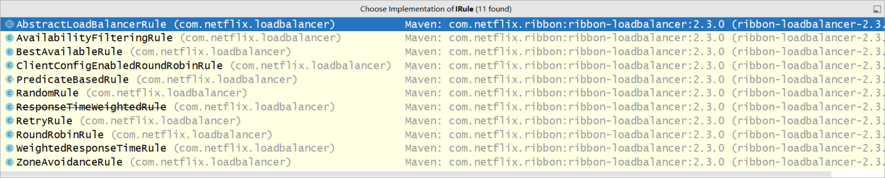
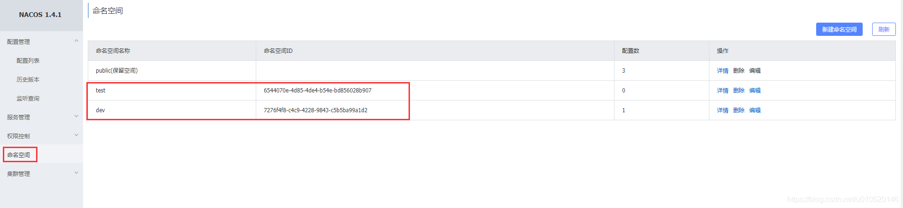

一、介绍

Spring Cloud Alibaba 为分布式应用开发提供一站式解决方案。它包含开发分布式应用程序所需的所有组件，使您可以轻松地使用 Spring Cloud 开发应用程序。

使用Spring Cloud Alibaba，您只需添加一些注解和少量配置，即可将Spring Cloud应用连接到阿里巴巴的分布式解决方案，并通过阿里巴巴中间件构建分布式应用系统。

- **流量控制和服务降级**：使用[阿里巴巴哨兵进行](https://github.com/alibaba/Sentinel/)流量控制、断路和系统自适应保护
- **服务注册与发现**：实例可以注册到[阿里巴巴Nacos](https://github.com/alibaba/nacos/)，客户端可以使用Spring管理的bean来发现实例。通过 Spring Cloud Netflix 支持 Ribbon，客户端负载均衡器
- **分布式配置**：使用[阿里巴巴Nacos](https://github.com/alibaba/nacos/)作为数据存储
- **Event-driven**：构建与 Spring Cloud Stream [RocketMQ](https://rocketmq.apache.org/) Binder连接的高度可扩展的事件驱动微服务
- **消息总线**：使用 Spring Cloud Bus RocketMQ 链接分布式系统的节点
- **分布式事务**：支持高性能、易用的分布式事务解决方案与[Seata](https://github.com/seata/seata)
- **Dubbo RPC**：通过[Apache Dubbo RPC](https://dubbo.apache.org/en/)扩展Spring Cloud服务到服务调用的通信协议 

二、环境搭建

查看cloud和springboot的对应关系

https://start.spring.io/actuator/info

查看cloud与alibaba的版本对应关系

[https://github.com/alibaba/spring-cloud-alibaba/wiki/%E7%89%88%E6%9C%AC%E8%AF%B4%E6%98%8E](https://github.com/alibaba/spring-cloud-alibaba/wiki/版本说明)


 导入依赖

```

<parent>
        <artifactId>spring-boot-starter-parent</artifactId>
        <groupId>org.springframework.boot</groupId>
        <version>2.3.12.RELEASE</version>
    </parent>
    
    
    <dependencies>
        <dependency>
            <groupId>org.springframework.boot</groupId>
            <artifactId>spring-boot-starter-web</artifactId>
        </dependency>
        <dependency>
            <groupId>org.projectlombok</groupId>
            <artifactId>lombok</artifactId>
        </dependency>
        <dependency>
            <groupId>org.springframework.boot</groupId>
            <artifactId>spring-boot-starter-test</artifactId>
        </dependency>
    </dependencies>
    
    <dependencyManagement>
      <dependencies>
            <dependency>
                <groupId>com.alibaba.cloud</groupId>
                <artifactId>spring-cloud-alibaba-dependencies</artifactId>
                <version>2.2.7.RELEASE</version>
                <type>pom</type>
                <scope>import</scope>
            </dependency>

            <dependency>
                <groupId>org.springframework.cloud</groupId>
                <artifactId>spring-cloud-dependencies</artifactId>
                <version>Hoxton.SR12</version>
                <type>pom</type>
                <scope>import</scope>
            </dependency>
      </dependencies>
    </dependencyManagement>
```

# 二、 nacos教程

## 一、  nacos介绍


Nacos （Name Configurations）

Nacos 致力于帮助您发现、配置和管理微服务。Nacos 提供了一组简单易用的特性集，帮助您快速实现动态服务发现、服务配置、服务元数据及流量管理。

Nacos 帮助您更敏捷和容易地构建、交付和管理微服务平台。 Nacos 是构建以“服务”为中心的现代应用架构 (例如微服务范式、云原生范式) 的服务基础设施。


## 二、 安装nocos

### 2.1、版本选择

您可以在Nacos的[release notes](https://github.com/alibaba/nacos/releases)及[博客](https://nacos.io/zh-cn/blog/index.html)中找到每个版本支持的功能的介绍，当前推荐的稳定版本为2.0.3。

### 2.2、预备环境准备

Nacos 依赖 [Java](https://docs.oracle.com/cd/E19182-01/820-7851/inst_cli_jdk_javahome_t/) 环境来运行。如果您是从代码开始构建并运行Nacos，还需要为此配置 [Maven](https://maven.apache.org/index.html)环境，请确保是在以下版本环境中安装使用:

1. 64 bit OS，支持 Linux/Unix/Mac/Windows，推荐选用 Linux/Unix/Mac。
2. 64 bit JDK 1.8+；[下载](http://www.oracle.com/technetwork/java/javase/downloads/jdk8-downloads-2133151.html) & [配置](https://docs.oracle.com/cd/E19182-01/820-7851/inst_cli_jdk_javahome_t/)。
3. Maven 3.2.x+；[下载](https://maven.apache.org/download.cgi) & [配置](https://maven.apache.org/settings.html)。

### 2.3、下载源码或者安装包

你可以通过源码和发行包两种方式来获取 Nacos。

https://nacos.io/zh-cn/

https://github.com/alibaba/nacos/releases

https://github.com/alibaba/nacos/releases/tag/2.0.3


### 2.4、安装nacos


```
linux/unix/mac启动
打开终端进入nacos的bin目录执行如下命令
./startup.sh -m standaloner

windows启动
cmd startup.cmd或者双击startup,cmd运行文件
```

启动查看

```
startup -m standalone
```


访问地址：[http://43.156.149.47:8848/nacos](http://162.14.64.72:8848/nacos)

初始化账户和密码：nacos和nacos


进入页面


### 2.5、数据持久化到数据库

修改配置文件（conf/application.properties）

```yaml
### If use MySQL as datasource:
spring.datasource.platform=mysql
### Connect URL of DB:
db.num=1
db.url.0=jdbc:mysql://127.0.0.1:3306/db_nacos?characterEncoding=utf8&connectTimeout=1000&socketTimeout=3000&autoReconnect=true&useUnicode=true&useSSL=false&serverTimezone=UTC
db.user.0=root
db.password.0=gitea
```

执行我们  nacos-mysql .sql

### 2.6、集群搭建

```yaml
cp nacos ./nacos1
cp nacos ./nacos2

nacos1
nacos2
两台
修改两台服务器端口（8848  8850） 数据库配置（db_nacos  db_nacos1）
修改两台服务下conf里面的cluster.conf.example   为cluster.conf
配置cluster.conf 两台一样
127.0.0.1:8848
127.0.0.1:8850
```

注意事项：


### 2.7、nginx做负载均衡

```yaml
upstream nacos-cluster {
    server 43.156.149.47:8848;
    server 43.156.149.47:8850;
}

server {
    listen       80;
    server_name  localhost;

    location / {
        proxy_pass http://nacos-cluster;
    }
}
```


### 2.8、注册原理：


服务注册时在服务端本地会通过轮询注册中心集群节点地址进行服务得注册，在注册中心上，即Nacos Server上采用了Map保存实例信息，当然配置了持久化的服务会被保存到数据库中，在服务的调用方，为了保证本地服务实例列表的动态感知，Nacos与其他注册中心不同的是，采用了 Pull/Push同时运作的方式。通过这些我们对Nacos注册中心的原理有了一定的了解。我们从源码层面去验证这些理论知识。


默认是临时实例, 推荐不修改

**1.Nacos与eureka的共同点**

+ 都支持服务注册和服务拉取
+ 都支持服务提供者心跳方式做健康检测

**2.Nacos与Eureka的区别**

+ Nacos支持服务端主动检测提供者状态:临时实例采用心跳模式，非临时实例采用主动检测模式临时实例心跳不正常会被剔除，非临时实例则不会被剔除
+ Nacos支持服务列表变更的消息推送模式，服务列表更新更及时
+ Nacos集群默认采用AP方式，当集群中存在非临时实例时，采用CP模式;Eureka采用AP方式

### 2.9、CAP定理

CAP定理，C - 一致性，A-可用性，P-分区容错性，这三个特性在分布式环境下，只能满足2个，而且分区容错性在分布式环境下，是必须要满足的，只能在AC之间进行权衡。

如果选择CP，保证了一致性，可能会造成你系统在一定时间内是不可用的，如果你同步数据的时间比较长，造成的损失大。

Eureka就是一个AP的效果，高可用的集群，Eureka集群是无中心，Eureka即便宕机几个也不会影响系统的使用，不需要重新的去推举一个master，也会导致一定时间内数据是不一致。

### 2.10、BASE理论

BASE理论是对CAP的扩充，在强一致性和高可用性无法同时满足的情况下，寻求一种中间解决方案。其中就有最终一致性的表述。

BASE名称由来：

- **BA: Basic Availability**基本可用性；
- **S: Soft state**柔性状态；
- **E: Eventual consistency**最终一致性；

#### 2.10.1、基本可用性（ Basic Availability）

也就是允许有一定的异常。比如第一次刷出现网络异常，再次刷新就好了。保持基本可用就行。到底允许多大的异常占比，就看用户的接受度了。

#### 2.10.2、柔性状态（Soft state）

柔性状态，或者软状态，也就是一种中间状态；其实就是在无法做到强一致性的情况下，在数据还没有同步之前，允许存在的一个状态。

#### 2.10.3、最终一致性（Eventual consistency）

也就是经过一段时间之后，达成一致。这里的一段时间可以是几秒、也可能是几分钟、甚至几小时。（此过程是异步进行的）

- 读己之写一致性

自己能马上读取到自己写入的内容。比如博客，提交之后，自己马上可以看到，其他人可能要等一会才能看到。

- 3、因果一致性

因果一致性，也就是一种逻辑顺序上的一致性。比如先有问题才有回答。因为一致性不是很及时、或者存在地区差异导致数据同步差异，例如：北京网友提问，上海网友看到了并回答了问题。因为某些原因，上海网友的回答快。读同步到了南京地区，但北京的问题还没有同步到南京。这时就保证先有问题才能看到回答。问题没有同步、回答同步了，逻辑上也不能只显示回答，而没有问题。这时就要进行因果一致性。

在一致性研究上，还出现过很多类似的一致性名词，类似：[Sequential 和 Linearizability](https://mp.weixin.qq.com/s/CEaAdb88O4TBU5aPN47Lsw)

#### 2.10.4、总结

BASE理论是CAP的实践指导理论。因为对于系统来说，最好就是同时满足CAP，但是强CAP满足不了，我们就折中选择弱CAP，也就是BASE理论。

在BASE理论中，我们关注的是最终一致性。需要研究的也就是最终一致性。

## 三、创建服务注册

### 3.1 导入依赖

```xml
<parent>
        <artifactId>spring-boot-starter-parent</artifactId>
        <groupId>org.springframework.boot</groupId>
        <version>2.3.12.RELEASE</version>
    </parent>

<dependencyManagement>
        <dependencies>
            <dependency>
                <groupId>com.alibaba.cloud</groupId>
                <artifactId>spring-cloud-alibaba-dependencies</artifactId>
                <version>2.2.7.RELEASE</version>
                <type>pom</type>
                <scope>import</scope>
            </dependency>

            <dependency>
                <groupId>org.springframework.cloud</groupId>
                <artifactId>spring-cloud-dependencies</artifactId>
                <version>Hoxton.SR12</version>
                <type>pom</type>
                <scope>import</scope>
            </dependency>
        </dependencies>
    </dependencyManagement>

    <dependencies>
        <dependency>
            <groupId>org.springframework.boot</groupId>
            <artifactId>spring-boot-starter-web</artifactId>
        </dependency>

        <dependency>
            <groupId>org.springframework.boot</groupId>
            <artifactId>spring-boot-starter-actuator</artifactId>
        </dependency>

        <dependency>
            <groupId>com.alibaba.cloud</groupId>
            <artifactId>spring-cloud-starter-alibaba-nacos-discovery</artifactId>
        </dependency>
    </dependencies>
```

### 3.2 添加注解

@EnableDiscoveryClient

```xml
@SpringBootApplication
@EnableDiscoveryClient
public class NacosServerApplication {
    public static void main(String[] args) {
        SpringApplication.run(NacosServerApplication.class,args);
    }
}
```

3.3 编写bootstrap.yml

```yaml
server:
  port: 9011
spring:
  application:
    name: publisher
  cloud:
    nacos:
      discovery:
        server-addr: http://43.156.149.47:8848 #nacos 服务地址
management:
  endpoints:
    web:
      exposure:
        include: "*" #健康检查
```


### 3.4  查看服务列表


# Nacos的依赖

父工程：

```xml
<dependency>
    <groupId>com.alibaba.cloud</groupId>
    <artifactId>spring-cloud-alibaba-dependencies</artifactId>
    <version>2.2.5.RELEASE</version>
    <type>pom</type>
    <scope>import</scope>
</dependency>
```

客户端：

```xml
<!-- nacos客户端依赖包 -->
<dependency>
    <groupId>com.alibaba.cloud</groupId>
    <artifactId>spring-cloud-starter-alibaba-nacos-discovery</artifactId>
</dependency>
```

# 服务集群


1.修改user-service服务中的application.yml，添加如下内容


2.在Nacos控制台可以看到集群变化


# 负载均衡


# 环境隔离


不同名称空间的就是两个世界的人


# Nacos配置管理


## Nacos流程


## 控制台配置


## 代码配置

**配置**


**简单测试**


**Ncos中的配置文件变更后，微服务无需重启就可以感知。不过需要通过下面两种配置实现：**

+ 方式一：在@Value注入的变量所在类上添加注解@RefreshScope

  

+ 方式二: 直接使用配置类的方式, 读取配置文件, 无需加载@RefreshScope注解(推荐)

## 多服务共享配置


# nacos集群搭建


>  集群搭自行百度

# 三、 服务间的调用-OpenFeign

## 引言

RestTemplate方式调用存在的问题: 代码可读性差，编程体验不统-


使用Feign可以帮助我们实现面向接口编程，就直接调用其他的服务，简化开发

功能:

+ Feign可插拔的注解支持，包括Feign注解和JAX-RS注解；

+ Feign与Ribbon负载均衡器、Hystrix或Sentinel熔断器无缝集成；

+ Feign支持可插拔的HTTP编码器和解码器；

+ Feign支持HTTP请求和响应的压缩等

## 服务间调用的几种方式

使用Spring Cloud开发微服务时，在服务消费者调用服务提供者时，底层通过HTTP Client 的方式访问。但实际上在服务调用时，有主要以下来实现：

+ 使用JDK原生的URLConnection
+ Apache提供的HTTP Client
+ Netty提供的异步HTTP Client
+ Spring提供的RestTemplate

+ Spring Cloud的Spring Cloud Open Feign相对是最方便与最优雅的，使Feign支持Spring MVC注解的同时并整合l 了Ribbon

**2 Feign的快速入门**
client 客服端 消费者
导入依赖

```xml
<dependency>
    <groupId>org.springframework.cloud</groupId>
    <artifactId>spring-cloud-starter-openfeign</artifactId>
</dependency>
```

添加一个注解  cutomer

```java
@EnableFeignClients

@FeignClient("SEARCH")   // 指定服务名称
public interface SearchClient {
    
    // value -> 目标服务的请求路径，method -> 映射请求方式
    @RequestMapping(value = "/search",method = RequestMethod.GET)
    String search();

}
```

测试使用

```java
@Autowired
private SearchClient searchClient;

    /**
     * 1、除修饰符不一样，其返回值  方法  以及 参数列表都要与生产者里面接口保持一样
     * 2、openfeign 路径映射只有用RequestMapping，不能使用省略get post put delete option等等
     * 3、RequestMapping 不能用在接口名上面，只能用在我们方法名上
     * 4、方法上的参数列表，必须严格按照restful语法进行(@RequestParam,@RequestBody,@PathVariable)
     */

@GetMapping("/customer")
public String customer(){
    String result = searchClient.search();
    return result;
}
```

**3 Feign的传递参数方式**
注意事项
●如果你传递的参数，比较复杂时，默认会采用POST的请求方式。
●传递单个参数时，推荐使用@PathVariable。
●如果传递的单个参数比较多，这里也可以采用@RequestParam，不要省略value属性
●传递对象信息时，统一采用json的方式，添加@RequestBody
●Client接口必须采用@RequestMapping

在Search模块下准备三个接口

```java
@GetMapping("/search/{id}")
public Customer findById(@PathVariable Integer id){
    return new Customer(1,"张三",23);
}

@GetMapping("/getCustomer")
public Customer getCustomer(@RequestParam Integer id,@RequestParam String name){
    return new Customer(id,name,23);
}

@PostMapping("/save")            
public Customer save(@RequestBody Customer customer){
    return customer;
}
```


再封装feign接口

```java
@RequestMapping(value = "/search/{id}",method = RequestMethod.GET)
Customer findById(@PathVariable(value = "id") Integer id);

@RequestMapping(value = "/getCustomer",method = RequestMethod.GET)
Customer getCustomer(@RequestParam(value = "id") Integer id, @RequestParam(value = "name") String name);

@RequestMapping(value = "/save",method = RequestMethod.POST)
Customer save(@RequestBody Customer customer);
```

封装Customer模块下的Controller

```java
@GetMapping("/customer/{id}")
public Customer findById(@PathVariable Integer id){
    return searchClient.findById(id);
}

@GetMapping("/getCustomer")
public Customer getCustomer(@RequestParam Integer id, @RequestParam String name){
    return searchClient.getCustomer(id,name);
}

@GetMapping("/save")            // 会自动转换为POST请求  405
public Customer save(Customer customer){
    return searchClient.save(customer);
}
```

#### 4 Feign的Fallback

Fallback可以帮助我们在使用Feign去调用另外一个服务时，如果出现了问题，走服务降级，返回一个错误数据，避免功能因为一个服务出现问题，全部失效。

##### 4.1 FallBack方式

创建一个POJO类，实现Client接口。

```java
@Component
public class SearchClientFallBack implements SearchClient {
    @Override
    public String search() {
        return "出现问题啦！！！";
    }

    @Override
    public Customer findById(Integer id) {
        return null;
    }

    @Override
    public Customer getCustomer(Integer id, String name) {
        return null;
    }

    @Override
    public Customer save(Customer customer) {
        return null;
    }
}
```


不能添加我的requestmapping 注解，回报方法名已存在


在client添加yml配置

```java
feign:
  hystrix:
    enabled: true
```

##### 4.2 FallBackFactory方式


调用方无法知道具体的错误信息是什么，通过FallBackFactory的方式去实现这个功能

FallBackFactory基于Fallback

创建一个POJO类，实现FallBackFactory<Client>

```java
import feign.hystrix.FallbackFactory;

@Component
public class SearchClientFallBackFactory implements FallbackFactory<SearchClient> {

    @Autowired
    private SearchClientFallBack searchClientFallBack;

    @Override
    public SearchClient create(Throwable throwable) {
        throwable.printStackTrace();
        return searchClientFallBack;
    }
}
```

修改Client接口中的属性

```java
@FeignClient(value = "SEARCH",fallbackFactory = SearchClientFallBackFactory.class)
```

作业：

1、自我阐述cap 和base理论

2、实现robbin 集群

3、使用feign编写登录和注册

4、config来做


# 四、 服务间的负载均衡-Robbin

#### 1 引言

Robbin是帮助我们实现服务和服务负载均衡，Robbin属于客户端负载均衡

客户端负载均衡：customer客户模块，将2个Search模块信息全部拉取到本地的缓存，在customer中自己做一个负载均衡的策略，选中某一个服务。

服务端负载均衡：在注册中心中，直接根据你指定的负载均衡策略，帮你选中一个指定的服务信息，并返回。


#### 2 Robbin的快速入门

启动两个search模块

在customer导入robbin依赖

```java
<dependency>
    <groupId>org.springframework.cloud</groupId>
    <artifactId>spring-cloud-starter-netflix-ribbon</artifactId>
</dependency>
```

配置整合RestTemplate和Robbin

```java
@Bean
@LoadBalanced
public RestTemplate restTemplate(){
    return new RestTemplate();
}
```

在customer中去访问search 


```java
@GetMapping("/customer")
public String customer(){
    String result = restTemplate.getForObject("http://SEARCH/search", String.class);

    //4. 返回
    return result;
}
```

在search服务里面启动两台服务8012和9991服务  

-Dserver.port=9991


在controller 添加样式


```java
@Value("${server.port}")
private String port;
```

#### 3 Robbin配置负载均衡策略


负载均衡策略

- RandomRule：随机策略 //nginx ip_hash
- RoundRobbinRule：轮询策略(默认配置) nginx也是轮询
- WeightedResponseTimeRule：默认会采用轮询的策略，后续会根据服务的响应时间，自动给你分配权重 nginx weight 权重
- BestAvailableRule：根据被调用方并发数最小的去分配（调优）

两种方式：


3.1 采用注解的形式 cutomer

```java
@Bean
public IRule robbinRule(){
    return new RandomRule();
}
```



3.2 配置文件去指定负载均衡的策略（推荐） cutomer

```
# 指定具体服务的负载均衡策略
SEARCH:      # 编写服务名称
  ribbon:
    NFLoadBalancerRuleClassName: com.netflix.loadbalancer.WeightedResponseTimeRule  # 具体负载均衡使用的类
```

# 五、feign和robbin整合

一、使用cloud-feign整合

1.1 导入依赖

```xml
<dependency>
    <groupId>org.springframework.cloud</groupId>
    <artifactId>spring-cloud-starter-openfeign</artifactId>
</dependency>
```


1.2 编写customer

1.2.1 编写启动类

```java
@SpringBootApplication
@EnableDiscoveryClient
public class CustomerApplication {
    public static void main(String[] args) {

        SpringApplication.run(CustomerApplication.class,args);

    }
}
```

1.2.2 编写yml

```yaml
server:
  port: 9012
spring:
  application:
    name: customer
  cloud:
    nacos:
      discovery:
        server-addr: http://162.14.64.72:8848
management:
  endpoints:
    web:
      exposure:
        include: "*"
```

1.2.3 编写comtroller

```java
@RestController
@RequestMapping(value = "customer")
public class TestCustomerComtroller {
    @Value("${server.port}")
    private String port;
    @GetMapping("/test")
    public String test(){
        System.out.println("customer port:"+port);

        return port;
    }

}
```


1.3 编写pulisher 

1.3.1 编写controller

```java
@RestController
@RequestMapping("publisher")
public class PublisherController {
    @Autowired
    private CostomerFeignClient costomerFeignClient;
    @GetMapping("/test")
    public String test(){
        String test = costomerFeignClient.test();
        return test;
    }
}
```

1.3.2 编写feignclient

```java
@FeignClient(value = "customer")
    public interface CostomerFeignClient {

    @RequestMapping("/customer/test")
    public String test();
}
```

一、使用cloud-feign整合

1.1 导入依赖

```xml
<dependency>
    <groupId>org.springframework.cloud</groupId>
    <artifactId>spring-cloud-starter-openfeign</artifactId>
</dependency>
```


1.2 编写customer

1.2.1 编写启动类

```java
@SpringBootApplication
@EnableDiscoveryClient
public class CustomerApplication {
    public static void main(String[] args) {

        SpringApplication.run(CustomerApplication.class,args);

    }
}
```

1.2.2 编写yml

```yaml
server:
  port: 9012
spring:
  application:
    name: customer
  cloud:
    nacos:
      discovery:
        server-addr: http://162.14.64.72:8848
management:
  endpoints:
    web:
      exposure:
        include: "*"
```

1.2.3 编写comtroller

```java
@RestController
@RequestMapping(value = "customer")
public class TestCustomerComtroller {
    @Value("${server.port}")
    private String port;
    @GetMapping("/test")
    public String test(){
        System.out.println("customer port:"+port);

        return port;
    }

}
```


1.3 编写pulisher 

1.3.1 编写controller

```java
@RestController
@RequestMapping("publisher")
public class PublisherController {
    @Autowired
    private CostomerFeignClient costomerFeignClient;
    @GetMapping("/test")
    public String test(){
        String test = costomerFeignClient.test();
        return test;
    }
}
```

1.3.2 编写feignclient

```java
@FeignClient(value = "customer")
    public interface CostomerFeignClient {

    @RequestMapping("/customer/test")
    public String test();
}
```

1.4 测试


# 六、config整合

## 一 、config介绍


## 二、创建config

## 2.1 导入依赖

```xml
<dependency>
    <groupId>com.alibaba.cloud</groupId>
    <artifactId>spring-cloud-starter-alibaba-nacos-config</artifactId>
</dependency>

<dependency>
    <groupId>com.alibaba.cloud</groupId>
    <artifactId>spring-cloud-starter-alibaba-nacos-discovery</artifactId>  
</dependency>
```


## 2.2 创建远程配置文件


## 2.3 添加yml文件配置

```yaml
spring:
  application:
    name: provider-user
  cloud:
    nacos:
      discovery:
        server-addr: 127.0.0.1:8848
      config:
        server-addr: 127.0.0.1:8848
        group: DEFAULT_GROUP
        file-extension: yaml
        enabled: true
        refresh-enabled: true
${prefix}-${spring.profile.active}.${file-extension}

（1）prefix：
默认为 spring.application.name 的值，也可以通过配置项 spring.cloud.nacos.config.prefix来配置。
（2）spring.profile.active：
即为当前环境对应的 profile，详情可以参考 Spring Boot文档。 注意：当 spring.profile.active 为空时，对应的连接符 - 也将不存在，dataId 的拼接格式变成 p r e f i x . {prefix}. prefix.{file-extension}
（3）file-exetension ：
为配置内容的数据格式，可以通过配置项 spring.cloud.nacos.config.file-extension 来配置。目前只支持 properties 和 yaml 类型。
```


```java
@RestController
    public class UserService {
        @Value("${testname}")
        private String testName;

        @GetMapping("getTestName")
        public String getTestName(){
            return testName;
        }
    }
```


## 2.4、多环境配置

在bootstrap.yml增加参数 spring.profiles.active=dev

```yaml
spring:
  application:
    name: provider-user
  cloud:
    nacos:
      discovery:
        server-addr: 127.0.0.1:8848
      config:
        server-addr: 127.0.0.1:8848
        group: DEFAULT_GROUP
        file-extension: yaml
        enabled: true
        refresh-enabled: true
  profiles:
    active: dev
```


## 2.5、通过Group实现

在bootstrap.yml 修改group的配置

```yaml
spring:
  application:
    name: provider-user
  cloud:
    nacos:
      discovery:
        server-addr: 127.0.0.1:8848
      config:
        server-addr: 127.0.0.1:8848
#        group: DEFAULT_GROUP
        group: GROUP_DEV
        file-extension: yaml
        enabled: true
        refresh-enabled: true
#  profiles:
#    active: dev
```


## 2.6、通过Namespace实现

在nacos后台增加namespace配置文件

在命名空间界面中，新增dev,test命名空间



在配置列表界面可以切换不同的命名空间来增加配置文件


namespaceid即为dev后面的那个数值


在bootstrap.yml 指定namespace值

```yaml
spring:
  application:
    name: provider-user
  cloud:
    nacos:
      discovery:
        server-addr: 127.0.0.1:8848
      config:
        server-addr: 127.0.0.1:8848
#        group: DEFAULT_GROUP
#        group: GROUP_DEV
        file-extension: yaml
        enabled: true
        refresh-enabled: true
        namespace: 7276f4f8-c4c9-4228-9843-c5b5ba99a1d2
#  profiles:
#    active: dev
```


## 2.7、加载多个配置文件（了解）


在bootstrap.yml配置文件中加入配置: spring.cloud.nacos.config.ext-config，配置信息如下：

```xml
<!-- 支持 bootstrap.properties 或 bootstrap.yml 配置文件 -->
<dependency>
  <groupId>org.springframework.cloud</groupId>
  <artifactId>spring-cloud-starter-bootstrap</artifactId>
  <version>3.1.3</version>
</dependency>
spring:
  application:
    name: provider-user
  cloud:
    nacos:
      discovery:
        server-addr: 127.0.0.1:8848
      config:
        server-addr: 127.0.0.1:8848
        group: DEFAULT_GROUP
        file-extension: yaml
        enabled: true
        refresh-enabled: true
        extension-configs:
          - data-id: database-dev.yml
            group: ${spring.cloud.nacos.discovery.group}
            refresh: true
          - data-id: provider-user.yml
            group: ${spring.cloud.nacos.discovery.group}
            refresh: true
  profiles:
    active: dev
```


## 2.8 自动刷新

```
@RefreshScope
```


# 七、sentinel整合

## 一、简介

[https://github.com/alibaba/Sentinel/wiki/%E4%BB%8B%E7%BB%8D](https://github.com/alibaba/Sentinel/wiki/介绍)

https://sentinelguard.io/zh-cn/docs/quick-start.html

Sentinel 是什么？

随着微服务的流行，服务和服务之间的稳定性变得越来越重要。Sentinel 以流量为切入点，从流量控制、熔断降级、系统负载保护等多个维度保护服务的稳定性。

Sentinel 具有以下特征:

- **丰富的应用场景**：Sentinel 承接了阿里巴巴近 10 年的双十一大促流量的核心场景，例如秒杀（即突发流量控制在系统容量可以承受的范围）、消息削峰填谷、集群流量控制、实时熔断下游不可用应用等。
- **完备的实时监控**：Sentinel 同时提供实时的监控功能。您可以在控制台中看到接入应用的单台机器秒级数据，甚至 500 台以下规模的集群的汇总运行情况。
- **广泛的开源生态**：Sentinel 提供开箱即用的与其它开源框架/库的整合模块，例如与 Spring Cloud、Apache Dubbo、gRPC、Quarkus 的整合。您只需要引入相应的依赖并进行简单的配置即可快速地接入 Sentinel。同时 Sentinel 提供 Java/Go/C++ 等多语言的原生实现。
- **完善的 SPI 扩展机制**：Sentinel 提供简单易用、完善的 SPI 扩展接口。您可以通过实现扩展接口来快速地定制逻辑。例如定制规则管理、适配动态数据源等。


## 二、安装sentinel

## 2.1 下载sentinel 监控包 jar包

https://github.com/alibaba/Sentinel/releases/tag/1.8.2

sentinel是做服务降级的

dashborad是做降级服务监控的

## 2.2 sentinel 安装 dashborad


## 2.3 使用命令启动dashborad

注意：启动的时候最好制定一个端口

命令为：java -Dserver.port=9091 -jar sentinel-dashboard-1.8.2.jar


然后访问：http://162.14.64.72:9091/#/dashboard

访问用户和密码都为：sentinel


## 2.4 sentinel 整合 

导入依赖包

```xml
<dependency>
    <groupId>com.alibaba.cloud</groupId>
    <artifactId>spring-cloud-starter-alibaba-sentinel</artifactId>
</dependency>
```

添加配置文件

```yaml
spring:
  cloud:
    nacos:
      discovery:
        server-addr: ${spring.cloud.nacos.server-addr}
      config:
        group: DEFAULT_GROUP
        file-extension: yml
      server-addr: 162.14.64.72:8848
    sentinel:
      enabled: true
      transport:
        port: 8719
        dashboard: 162.14.64.72:9091
        clientIp: 本机ip
```

访问任务一个接口才能显示出下面内容：


实时监控：监控当前服务器接口请求数（QPS）统计:


## 2.5 流控控制


资源名：必须是当前服务里面的某一个接口路径，（相对路径即可） 如：/order/orderTest

阈值类型：QPS:在规定时间范围类型请求的数据（10/1s）; 线程数代表的并发量

单机阈值：请求数（qps:10个请求：0-10正常；>10 表示我接口要降级；线程数：单位时间内同一个时间：并发数10,0-10正常，>10接口降级）


流控模式：直接：直接降级，关联：两个访问同一个资源的，需要对方先让出资源；链路：让出资源


流控模式：


直接：直接fallback。

关联：关联的两个资源，可以使对方让出资源。

链路：可以对指定的链路进行限流。


快速失败：直接报错

warm up  ：预热限流，慢慢增加请求数

排队等待：queue


### 2.5.1、QPS-直接-快速失败


单位时间内（1s）超过请求次数就会出现熔断


```java
    @RestController
    @RequestMapping("test")
    @RefreshScope
    public class TestController {
        @Value("${version}")
        private String version;

        @GetMapping("/test")
        public String test(){
            return version;
        }

    }
```


测试结果：


### 2.5.2、QPS-直接-Warm Up（预加载）


默认coldFactor（冷加载因子（预热））为3，即请求QPS从(threshold / 3)开始，经多少预热时长才逐渐升至设定的QPS阈值。

如下案例：阀值为5，预热时长设置5秒。

系统初始化的阀值为5% 3约等于2，即阀值刚开始为2，然后过了 5秒后阀值才慢慢升高恢复到5


测试结果


### 2.5.3、QPS-直接-排队等待


排队等待（匀速器）：匀速排队，让请求以匀速的速度通过，阈值类型必须设置为QPS，否则无效

概念：匀速排队方式会严格控制请求通过的间隔时间，也即是让请求以均匀的速度通过，对应的是漏桶算法。


 这种方式主要用于处理间隔性突发的流量，例如消息队列。想象一下这样的场景，在某一秒有大量的请求到来，而接下来的几秒则处于空闲状态，我们希望系统能够在接下来的空闲期间逐渐处理这些请求，而不是在第一秒直接拒绝多余的请求（削峰填谷）。


例子：0.5秒处理两个请求，其余等待


 测试结果：


### 2.5.4、QPS-关联-快速失败

关联模式：统计与当前资源相关的另一个资源，触发阈值时，对当前资源限流

使用场景：比如用户支付时需要修改订单状态，同时用户要查询订单。查询和修改操作会争抢数据库锁，产生竞争。业务需求是有限支付和更新订单的业务，因此当修改订单业务触发阈值时，需要对查询订单业务限流。


```java
@GetMapping("/query")
    public String query(){
        return "query";
    }

    @GetMapping("/update")
    public String update(){
        return "update";
    }
```

测试：


### 2.5.5、QPS-链路-快速失败

链路：统计从指定链路访问到本资源的请求，触发阈值时，对指定链路限流

案例：有查询订单和创建订单业务，两者都需要查询商品。针对从查询订单进入到查询商品的请求统计，并设置限流。


controller层

```java
    @GetMapping("/query")
    public String query(){
        testService.goods();
        return "query";
    }

    @GetMapping("/update")
    public String update(){
        testService.goods();
        return "update";
    }
```

Service层（资源）

```java
@Service
public class TestService {

    @SentinelResource("/goods")
    public String goods(){

        return "goods";
    }
}
```

添加配置

```java
web-context-unify: false
```

测试


## 三、熔断策略


## 3.1、慢调用比例

慢调用比例 (SLOW_REQUEST_RATIO)：选择以慢调用比例作为阈值，需要设置允许的慢调用 RT（即最大的响应时间），请求的响应时间大于该值则统计为慢调用。当单位统计时长（statIntervalMs）内请求数目大于设置的最小请求数目，并且慢调用的比例大于阈值，则接下来的熔断时长内请求会自动被熔断。经过熔断时长后熔断器会进入探测恢复状态（HALF-OPEN 状态），若接下来的一个请求响应时间小于设置的慢调用 RT 则结束熔断，若大于设置的慢调用 RT 则会再次被熔断。


1.调用：一个请求发送到服务器，服务器给与响应，一个响应就是一个调用。

2.RT：响应时间，指系统对请求作出响应的时间。

3.慢调用：当调用的时间（响应的实际时间）>设置的RT的时，这个调用叫做慢调用。

4.慢调用比例：在所以调用中，慢调用占有实际的比例，= 慢调用次数 / 调用次数

5.比例阈值：自己设定的 ， 慢调用次数 / 调用次数=比例阈值


统计时长：时间的判断依据

最小请求数：设置的调用最小请求数


策略


代码

```java
@GetMapping("/test")
    public String test(Integer num){
        if(num == 1){
            try {
                Thread.sleep(5000);
            } catch (InterruptedException e) {
                e.printStackTrace();
            }
        }

        return version;
    }
```

测试

参数为：2


参数为：1


## 3.2、异常比例

异常比例 (ERROR_RATIO)：当单位统计时长（statIntervalMs）内请求数目大于设置的最小请求数目，并且异常的比例大于阈值，则接下来的熔断时长内请求会自动被熔断。经过熔断时长后熔断器会进入探测恢复状态（HALF-OPEN 状态），若接下来的一个请求成功完成（没有错误）则结束熔断，否则会再次被熔断。异常比率的阈值范围是 [0.0, 1.0]，代表 0% - 100%。


策略


代码

```java
    @GetMapping("/test")
    public String test(Integer num){
        if(num == 1){
            int i = 1/0;
        }
        return version;
    }
```

测试

参数为：1


参数为：2


## 3.2、异常数

异常数 (ERROR_COUNT)：当单位统计时长内的异常数目超过阈值之后会自动进行熔断。经过熔断时长后熔断器会进入探测恢复状态（HALF-OPEN 状态），若接下来的一个请求成功完成（没有错误）则结束熔断，否则会再次被熔断。


策略


代码

```java
    @GetMapping("/test")
    public String test(Integer num){
        if(num == 1){
            int i = 1/0;
        }
        return version;
    }
```

测试

参数为：2


参数为1：


## 四、@SentinelResource 注解

注意：注解方式埋点不支持 private 方法。

@SentinelResource 用于定义资源，并提供可选的异常处理和 fallback 配置项。 @SentinelResource 注解包含以下属性：

- value：资源名称，必需项（不能为空）
- entryType：entry 类型，可选项（默认为 EntryType.OUT）
- blockHandler / blockHandlerClass: blockHandler 对应处理 BlockException 的函数名称，可选项。blockHandler 函数访问范围需要是 public，返回类型需要与原方法相匹配，参数类型需要和原方法相匹配并且最后加一个额外的参数，类型为 BlockException。blockHandler 函数默认需要和原方法在同一个类中。若希望使用其他类的函数，则可以指定 blockHandlerClass 为对应的类的 Class 对象，注意对应的函数必需为 static 函数，否则无法解析。
- fallback / fallbackClass：fallback 函数名称，可选项，用于在抛出异常的时候提供 fallback 处理逻辑。fallback 函数可以针对所有类型的异常（除了 exceptionsToIgnore 里面排除掉的异常类型）进行处理。fallback 函数签名和位置要求：

- - 返回值类型必须与原函数返回值类型一致；
  - 方法参数列表需要和原函数一致，或者可以额外多一个 Throwable 类型的参数用于接收对应的异常。
  - fallback 函数默认需要和原方法在同一个类中。若希望使用其他类的函数，则可以指定 fallbackClass 为对应的类的 Class 对象，注意对应的函数必需为 static 函数，否则无法解析。

- defaultFallback（since 1.6.0）：默认的 fallback 函数名称，可选项，通常用于通用的 fallback 逻辑（即可以用于很多服务或方法）。默认 fallback 函数可以针对所有类型的异常（除了 exceptionsToIgnore 里面排除掉的异常类型）进行处理。若同时配置了 fallback 和 defaultFallback，则只有 fallback 会生效。defaultFallback 函数签名要求：

- - 返回值类型必须与原函数返回值类型一致；
  - 方法参数列表需要为空，或者可以额外多一个 Throwable 类型的参数用于接收对应的异常。
  - defaultFallback 函数默认需要和原方法在同一个类中。若希望使用其他类的函数，则可以指定 fallbackClass 为对应的类的 Class 对象，注意对应的函数必需为 static 函数，否则无法解析。

- exceptionsToIgnore（since 1.6.0）：用于指定哪些异常被排除掉，不会计入异常统计中，也不会进入 fallback 逻辑中，而是会原样抛出。

```java
public class TestService {

    // 原函数
    @SentinelResource(value = "hello", blockHandler = "exceptionHandler", fallback = "helloFallback")
    public String hello(long s) {
        return String.format("Hello at %d", s);
    }
    
    // Fallback 函数，函数签名与原函数一致或加一个 Throwable 类型的参数.
    public String helloFallback(long s) {
        return String.format("Halooooo %d", s);
    }

    // Block 异常处理函数，参数最后多一个 BlockException，其余与原函数一致.
    public String exceptionHandler(long s, BlockException ex) {
        // Do some log here.
        ex.printStackTrace();
        return "Oops, error occurred at " + s;
    }

    // 这里单独演示 blockHandlerClass 的配置.
    // 对应的 `handleException` 函数需要位于 `ExceptionUtil` 类中，并且必须为 public static 函数.
    @SentinelResource(value = "test", blockHandler = "handleException", blockHandlerClass = {ExceptionUtil.class})
    public void test() {
        System.out.println("Test");
    }
}
```

## 五、sentinel资源配置持久化

https://sentinelguard.io/zh-cn/docs/basic-api-resource-rule.html

当应用重启后，Sentinel 规则就消失了，生产环境需要将配置的规则进行持久化

## 5.1、添加依赖

```java
<dependency>
    <groupId>com.alibaba.csp</groupId>
    <artifactId>sentinel-datasource-nacos</artifactId>
</dependency>
```

## 5.2、配置yml文件

```java
spring:
   cloud:
    sentinel:
      # Sentinel 规则持久化
      datasource:
        ds1:  #这个名字可以随便取
          nacos:
            server-addr: localhost:8848
            dataId: ${spring.application.name}
            groupId: DEFAULT_GROUP
            data-type: json
            rule-type: flow
```

## 5.3、实例


**resource：资源名。**

**limitApp：来源应用。**

**grade：阈值类型。0 表示线程数，1 表示是QPS。**

**count：单机阈值。**

**strategy：流控模式。0 表示直接，1 表示关联，2 表示链路。**

**controlBehavior：流控效果。0 表示快速失败，1 表示Warm up，2 表示排队等待。**

**clusterMode：是否集群。false 表示否，true 表示是。**


```json
[
  {
    "resource":"message",
    "limitApp":"default",
    "grade":1,
    "count":1,
    "strategy":0,
    "controlBehavior":0,
    "clusterMode":false
  }
]
```

## 5.4、规则介绍

### 5.4.1、多规则配置实例

```yaml
spring:
  cloud:
    sentinel:
      datasource:
        # 名称随意
        flow:
          nacos:
            server-addr: localhost:8848
            dataId: ${spring.application.name}-flow-rules
            groupId: SENTINEL_GROUP
            # 规则类型，取值见：
            # org.springframework.cloud.alibaba.sentinel.datasource.RuleType
            rule-type: flow
        degrade:
          nacos:
            server-addr: localhost:8848
            dataId: ${spring.application.name}-degrade-rules
            groupId: SENTINEL_GROUP
            rule-type: degrade
        system:
          nacos:
            server-addr: localhost:8848
            dataId: ${spring.application.name}-system-rules
            groupId: SENTINEL_GROUP
            rule-type: system
        authority:
          nacos:
            server-addr: localhost:8848
            dataId: ${spring.application.name}-authority-rules
            groupId: SENTINEL_GROUP
            rule-type: authority
        param-flow:
          nacos:
            server-addr: localhost:8848
            dataId: ${spring.application.name}-param-flow-rules
            groupId: SENTINEL_GROUP
            rule-type: param-flow
```

### 5.4.2、流控规则(rule-type: flow)

```json
[
  {
    // 资源名
    "resource": "/test",
    // 针对来源，若为 default 则不区分调用来源
    "limitApp": "default",
    // 限流阈值类型(1:QPS;0:并发线程数）
    "grade": 1,
    // 阈值
    "count": 1,
    // 是否是集群模式
    "clusterMode": false,
    // 流控效果(0:快速失败;1:Warm Up(预热模式);2:排队等待)
    "controlBehavior": 0,
    // 流控模式(0:直接；1:关联;2:链路)
    "strategy": 0,
    // 预热时间（秒，预热模式需要此参数）
    "warmUpPeriodSec": 10,
    // 超时时间（排队等待模式需要此参数）
    "maxQueueingTimeMs": 500,
    // 关联资源、入口资源(关联、链路模式)
    "refResource": "rrr"
  }
]
```

### 5.4.3、降级规则(rule-type: degrade)

```json
[
  {
  	// 资源名
    "resource": "/test1",
    "limitApp": "default",
    // 熔断策略（0:慢调用比例，1:异常比率，2:异常计数）
    "grade": 0,
    // 最大RT、比例阈值、异常数
    "count": 200,
    // 慢调用比例阈值，仅慢调用比例模式有效（1.8.0 引入）
    "slowRatioThreshold": 0.2,
    // 最小请求数
    "minRequestAmount": 5,
    // 当单位统计时长(类中默认1000)
    "statIntervalMs": 1000,
    // 熔断时长
    "timeWindow": 10
  }
]
```

### 5.4.4、热点规则(rule-type: param)

```json
[
  {
  	// 资源名
    "resource": "/test1",
    // 限流模式（QPS 模式，不可更改）
    "grade": 1,
    // 参数索引
    "paramIdx": 0,
    // 单机阈值
    "count": 13,
    // 统计窗口时长
    "durationInSec": 6,
    // 是否集群 默认false
    "clusterMode": 默认false,
    // 
    "burstCount": 0,
    // 集群模式配置
    "clusterConfig": {
      // 
      "fallbackToLocalWhenFail": true,
   	  // 
      "flowId": 2,
      // 
      "sampleCount": 10,
      // 
      "thresholdType": 0,
      // 
      "windowIntervalMs": 1000
    },
    // 流控效果（支持快速失败和匀速排队模式）
    "controlBehavior": 0,
    // 
    "limitApp": "default",
    // 
    "maxQueueingTimeMs": 0,
    // 高级选项
    "paramFlowItemList": [
      {
      	// 参数类型
        "classType": "int",
      	// 限流阈值
        "count": 222,
      	// 参数值
        "object": "2"
      }
    ]
  }
]
```

### 5.4.5、系统规则(rule-type: system)

```json
[
  {
    // 资源名
    "resource": "sentinel_spring_web_context",
  	// 流控应用
    "limitApp": "/test",
    // 授权类型(0代表白名单；1代表黑名单。)
    "strategy": 0
  }
]
```

### 5.4.6、授权规则(rule-type: authority)

```
[
  {
    // 资源名
    "resource": "sentinel_spring_web_context",
  	// 流控应用
    "limitApp": "/test",
    // 授权类型(0代表白名单；1代表黑名单。)
    "strategy": 0
  }
]

```


# 八 Seata处理分布式事务

## 一、Seata介绍

Seata是一款开源的分布式事务解决方案，致力于在微服务架构下提供高性能和简单易用的分布式事务服务。


## 二、Seata模式

Seata为用户提供了AT、TCC、SAGA和XA事务模式，为用户打造一站式的分布式解决方案；

http://seata.io/zh-cn/docs/overview/what-is-seata.html

## 三、Seata角色


TM (Transaction Manager) - 事务管理器

定义全局事务的范围：开始全局事务、提交或回滚全局事务；

RM (Resource Manager) - 资源管理器

管理分支事务处理的资源，与TC交互以注册分支事务和报告分支事务的状态，并驱动分支事务提交或回滚；

TC (Transaction Coordinator) - 事务协调者

维护全局和分支事务的状态，驱动全局事务提交或回滚；


其中TC为单独部署的 Server 服务端，TM和RM为嵌入到应用中的 Client 客户端；

在Seata中，一个分布式事务的生命周期如下：


TM请求TC开启一个全局事务，TC会生成一个XID作为该全局事务的编号，XID会在[微服务](https://so.csdn.net/so/search?q=微服务&spm=1001.2101.3001.7020)的调用链路中传播，保证将多个微服务的子事务关联在一起；

RM请求TC将本地事务注册为全局事务的分支事务，通过全局事务的XID进行关联；

TM请求TC告诉XID对应的全局事务是进行提交还是回滚；

TC驱动RM将XID对应的自己的本地事务进行提交还是回滚；

## 四、安装Seata

下载Seata：http://seata.io/zh-cn/blog/download.html

源码和服务器


## 4.1、解压进入seata


## 4.2、修改配置文件 file.conf


```json
mode = "db"

db {
  ## the implement of javax.sql.DataSource, such as DruidDataSource(druid)/BasicDataSource(dbcp)/HikariDataSource(hikari) etc.
  datasource = "druid"
  ## mysql/oracle/postgresql/h2/oceanbase etc.
  dbType = "mysql"
  driverClassName = "com.mysql.cj.jdbc.Driver"
  url = "jdbc:mysql://43.156.149.47:3306/seata?useUnicode=true&characterEncoding=UTF-8&useSSL=false&serverTimezone=Asia/Shanghai"
  user = "root"
  password = "gitea"
  minConn = 5
  maxConn = 30
  globalTable = "global_table"
  branchTable = "branch_table"
  lockTable = "lock_table"
  queryLimit = 100
  maxWait = 5000
}
```


## 4.3、修改registry.conf


注册中心

```json
 type = "nacos"

  nacos {
    application = "seata-server"
    serverAddr = "43.156.149.47:8848"
    group = "SEATA_GROUP"
    namespace = ""
    cluster = "default"
    username = "nacos"
    password = "nacos"
  }
```

config配置

```json
# file、nacos 、apollo、zk、consul、etcd3
  type = "nacos"

  nacos {
    serverAddr = "43.156.149.47:8848"
    namespace = ""
    group = "SEATA_GROUP"
    username = "nacos"
    password = "nacos"
  }
```


## 4.4、修改config.txt配置文件

 复制：https://github.com/seata/seata/tree/develop/script/config-center


放到seata-server下：注 一定要放到bin 同级目录


修改config.text文件


```json
store.mode=db
store.file.dir=file_store/data
store.file.maxBranchSessionSize=16384
store.file.maxGlobalSessionSize=512
store.file.fileWriteBufferCacheSize=16384
store.file.flushDiskMode=async
store.file.sessionReloadReadSize=100
store.db.datasource=druid
store.db.dbType=mysql
store.db.driverClassName=com.mysql.cj.jdbc.Driver
store.db.url=jdbc:mysql://43.156.149.47:3306/seata?useUnicode=true&characterEncoding=UTF-8&useSSL=false&serverTimezone=Asia/Shanghai
store.db.user=root
store.db.password=gitea
store.db.minConn=5
store.db.maxConn=30
store.db.globalTable=global_table
store.db.branchTable=branch_table
store.db.queryLimit=100
store.db.lockTable=lock_table
store.db.maxWait=5000
store.redis.host=127.0.0.1
store.redis.port=6379
store.redis.maxConn=10
store.redis.minConn=1
store.redis.database=0
store.redis.password=null
store.redis.queryLimit=100
```

## 4.5、复制nacos-config.sh 文件到seata-server目录的conf中


注:

这里还有需要注意的地方就是 config.txt文件必须是在nacos-config.sh 文件的**上一级目录**中, 而且说在的路径不能有**空格**

例如:

- D:\config.txt
- D:\conf\nacos-config.sh

## 4.6、执行nacos-config.sh脚本

win环境下运行nacos-config.sh需要借助git工具

```json
 sh nacos-config.sh -h 43.156.149.47
```

出现以下信息表示上传成功


查询结果


## 4.7、执行sql语句

源码下：script/server/db/mysql.sql


```sql
-- -------------------------------- The script used when storeMode is 'db' --------------------------------
-- the table to store GlobalSession data
CREATE TABLE IF NOT EXISTS `global_table`
(
  `xid`                       VARCHAR(128) NOT NULL,
  `transaction_id`            BIGINT,
  `status`                    TINYINT      NOT NULL,
  `application_id`            VARCHAR(32),
  `transaction_service_group` VARCHAR(32),
  `transaction_name`          VARCHAR(128),
  `timeout`                   INT,
  `begin_time`                BIGINT,
  `application_data`          VARCHAR(2000),
  `gmt_create`                DATETIME,
  `gmt_modified`              DATETIME,
  PRIMARY KEY (`xid`),
  KEY `idx_gmt_modified_status` (`gmt_modified`, `status`),
  KEY `idx_transaction_id` (`transaction_id`)
) ENGINE = InnoDB
DEFAULT CHARSET = utf8;

-- the table to store BranchSession data
CREATE TABLE IF NOT EXISTS `branch_table`
(
  `branch_id`         BIGINT       NOT NULL,
  `xid`               VARCHAR(128) NOT NULL,
  `transaction_id`    BIGINT,
  `resource_group_id` VARCHAR(32),
  `resource_id`       VARCHAR(256),
  `branch_type`       VARCHAR(8),
  `status`            TINYINT,
  `client_id`         VARCHAR(64),
  `application_data`  VARCHAR(2000),
  `gmt_create`        DATETIME(6),
  `gmt_modified`      DATETIME(6),
  PRIMARY KEY (`branch_id`),
  KEY `idx_xid` (`xid`)
) ENGINE = InnoDB
DEFAULT CHARSET = utf8;

-- the table to store lock data
CREATE TABLE IF NOT EXISTS `lock_table`
(
  `row_key`        VARCHAR(128) NOT NULL,
  `xid`            VARCHAR(96),
  `transaction_id` BIGINT,
  `branch_id`      BIGINT       NOT NULL,
  `resource_id`    VARCHAR(256),
  `table_name`     VARCHAR(32),
  `pk`             VARCHAR(36),
  `gmt_create`     DATETIME,
  `gmt_modified`   DATETIME,
  PRIMARY KEY (`row_key`),
  KEY `idx_branch_id` (`branch_id`)
) ENGINE = InnoDB
DEFAULT CHARSET = utf8;
```

结果：

## 4.8、运行seata-server.bat


结果：


sh nacos-config.sh -h 43.138.66.98 -p 8848 -g SEATA_GROUP  -u nacos -w nacos

```yaml
-h 主机
-p 端口
-g 分组
-t 命名空间
-u 用户名
-w 密码
```

seata就搭建成功了

## 五、项目配置

## 5.1 子工程依赖

```xml
<dependency>
  <groupId>com.alibaba.cloud</groupId>
  <artifactId>spring-cloud-starter-alibaba-seata</artifactId>
</dependency>

<dependency>
            <groupId>org.springframework.boot</groupId>
            <artifactId>spring-boot-starter-data-jpa</artifactId>
        </dependency>

        <!--        mysql驱动-->
        <dependency>
            <groupId>mysql</groupId>
            <artifactId>mysql-connector-java</artifactId>
        </dependency>

        <!--        druid连接-->
        <dependency>
            <groupId>com.alibaba</groupId>
            <artifactId>druid-spring-boot-starter</artifactId>
            <version>1.1.10</version>
        </dependency>
```

## 5.2、配置信息

```yaml
seata:
  enabled: true
  enable-auto-data-source-proxy: true
  tx-service-group: my_test_tx_group
  registry:
    type: nacos
    nacos:
      application: seata-server
      server-addr: 127.0.0.1:8848
      username: nacos
      password: nacos
  config:
    type: nacos
    nacos:
      server-addr: 127.0.0.1:8848
      group: SEATA_GROUP
      username: nacos
      password: nacos
      namespace: 0af6e97b-a684-4647-b696-7c6d42aecce7
  service:
    vgroup-mapping:
      my_test_tx_group: default
    disable-global-transaction: false
  client:
    rm:
      report-success-enable: false
```


```yaml
 datasource:
    driver-class-name: com.mysql.cj.jdbc.Driver
    url: jdbc:mysql://43.156.149.47:3306/db_b?useUnicode=true&characterEncoding=UTF-8&useSSL=false&serverTimezone=Asia/Shanghai
    username: root
    password: gitea
    type: com.alibaba.druid.pool.DruidDataSource
  jpa:
    show-sql: true
    hibernate:
      ddl-auto: update
```

## 5.3、运行项目

服务A

```java
    @Service
    public class UserService{

        @Resource
        private UserDao userDao;
        @Resource
        private BFeignClient bFeignClient;

        @GlobalTransactional
        public void add(){
            User user = new User();
            user.setId(1);
            user.setName("a");
            userDao.save(user);
            System.out.println("==================a==================");
            bFeignClient.add();
            System.out.println("==================b==================");
        }
    }
```

服务B

```java
@Service
public class UserService{

    @Resource
    private UserDao userDao;

    @GlobalTransactional
    public void add(){
       User user = new User();
       user.setId(1);
       user.setName("b");

       userDao.save(user);

        int i = 1/0;
    }
}
```

## 5.4、配置db_undo_log.sql 表

数据库配置

​	开始我们新建的数据库还有我们的业务的数据库，也需要进行相应的表的建立。

​	这里需要两个sql文件，在1.4.0版本中也是没有的，可从0.9.0版本中获取，我会在文章最后分享所有文件的百度云连接。

在我们的业务数据库中执行db_undo_log.sql


```sql
CREATE TABLE `undo_log` (
  `id` bigint(20) NOT NULL AUTO_INCREMENT,
  `branch_id` bigint(20) NOT NULL,
  `xid` varchar(100) NOT NULL,
  `context` varchar(128) NOT NULL,
  `rollback_info` longblob NOT NULL,
  `log_status` int(11) NOT NULL,
  `log_created` datetime NOT NULL,
  `log_modified` datetime NOT NULL,
  `ext` varchar(100) DEFAULT NULL,
  PRIMARY KEY (`id`),
  UNIQUE KEY `ux_undo_log` (`xid`,`branch_id`)
) ENGINE=InnoDB AUTO_INCREMENT=1 DEFAULT CHARSET=utf8;
```

添加logs文件夹

这个时候我们直接启动会报没有log文件的异常，按下图操作即可。


启动seata


# 九 Gateway学习

## 核心概念


+ **路由(Route)**：路由网关的基本构建块。它由ID，目的URI，断言（Predicate）集合和过滤器（filter）集合组成。如果断言聚合为真，则匹配该路由。

+ **断言(Predicate)**：这是一个 Java 8函数式断言。允许开发人员匹配来自HTTP请求的任何内容，例如请求头或参数。

- **过滤器(Filter)**：可以在发送下游请求之前或之后修改请求和响应。**一个标准的Spring webFilter，Spring Cloud Gateway中的Filter分为两种类型**，分别是Gateway Filter和Global Filter。过滤器Filter可以对请求和响应进行处理。

**路由根据断言进行匹配，匹配成功就会转发请求给URI，在转发请求之前或者之后可以添加过滤器。**

## 使⽤Gateway实现⽹关服务


## 使用

### 添加gateway依赖


创建gateway服务，添加gateway依赖

```xml
<!--nacos-->
<dependency>
  <groupId>com.alibaba.cloud</groupId>
  <artifactId>spring-cloud-starter-alibaba-nacos-discovery</artifactId>
</dependency>
<!--gateway-->
<dependency>
  <groupId>org.springframework.cloud</groupId>
  <artifactId>spring-cloud-starter-gateway</artifactId>
</dependency>
```

### 配置路由规则及nacos地址

application.yml

#### 代理单个服务

```yaml
server:
  port: 10010 #网关端口号
spring:
  application:
    name: gateway
  cloud:
    nacos:
      discovery:
        server-addr: 127.0.0.1:8848  #nacos地址
        username: nacos
        password: nacos
        namespace: public
    
    gateway:
      discovery:
        locator:
          enabled: true #开启我们gateway
          lower-case-service-id: true #忽略服务名大小写
      routes: #配置映射规则 #网关路由配置
        - id: nacos-route     # 中杠“-”代表数组里面一个对象#id代表在gateway唯一标识#一般写要代理的服务名称
          uri: lb://nacos-test #需要跳转地址  路由的目标地址 Lb就是负载均衡，后面跟服务名称
          predicates: #映射别名  
            - Path=/nacostest/**  #断言 这个是按照路径匹配，只要以/nacostest/开头就符合要求
          filters:
            - RewritePath=/nacostest/(?<segment>/?.*), /$\{segment}
```

#### 代理多个服务


```yaml
server:
  port: 10010
spring:
  application:
    name: gateway-server
  main:
    web-application-type: reactive
  cloud:
    gateway:
      routes:
        - id: user-service
          uri: lb://userservice  #需要跳转地址  路由的目标地址 Lb就是负载均衡，后面跟服务名称
          predicates:
            - Path=/user/**  #匹配的url
        - id: order-servic
          uri: lb://orderservic
          predicates:
            - Path=/order/**
```


测试访问  http//localhost:10010/user/1   


### 相关细节

#### 路由规则


|  |
| ------------------------------------------------------------ |

#### 重写转发路径 

将匹配路径改为/product-service/**


重新启动网关，我们在浏览器访问http://127.0.0.1:8080/product-service/product/1，会抛出404。这
是由于路由转发规则默认转发到商品微服务（ http://127.0.0.1:9002/productservice/
product/1 ）路径上，而商品微服务又没有product-service 对应的映射配置。

（2） 添加RewritePath重写转发路径
修改application.yml ，添加重写规则。


通过RewritePath配置重写转发的url，将/product-service/(?.*)，重写为{segment}，然后转发到订单
微服务。比如在网页上请求http://localhost:8080/product-service/product，此时会将请求转发到htt
p://127.0.0.1:9002/product/1（ 值得注意的是在yml文档中 $ 要写成 $\ ）

## 断言工厂

在配置文件中写的断言规则只是字符串，这些字符串会被Predicate Factory读取并处理，转变为路由判断的条件
例如

```
Path=/user/**是按照路径匹配，这个规则是由org.springframework.cloud.qateway.handlerpredicate.PathRoutePredicateFactorv类来处理的
```


Spring Cloud Gateway包含许多内置的Route Predicate工厂。所有这些断言都匹配HTTP请求的不同属性。多路由断言工厂通过**and**组合。

官方提供的路由工厂：


这些断言工厂的配置方式，参照官方文档：https://cloud.spring.io/spring-cloud-static/spring-cloud-gateway/2.1.0.RELEASE/single/spring-cloud-gateway.html


### 3.5.1 Path

根据请求路径的正则匹配 

```yaml
spring:
  application:
    name: gateway-server
  cloud:
    gateway:
      routes:
        - id: aaa
          uri: http://localhost:8001
          predicates:
            - Path=/product/**
        - id: bbb
          uri: http://localhost:8002
          predicates:
            - Path=/order/**
```

### 3.5.2 Query

根据请求携带的参数匹配路由

```yaml
spring:
  application:
    name: gateway-server
  cloud:
    gateway:
      routes:
        - id: aaa
          uri: http://localhost:8001
          predicates:
        # 如果请求url中带有name参数 ---> http://localhost:8001
            - Query=name
        - id: bbb
          uri: http://localhost:8002
          predicates:
        #如果请求url中带有pwd参数 ---> http://localhost:8002
            - Query=pwd
```

### 3.5.3 Header

根据Header中携带的参数匹配

```yaml
spring:
  application:
    name: gateway-server
  cloud:
    gateway:
      routes:
        - id: aaa
          uri: http://localhost:8001
          predicates:
            - Header=token
        - id: bbb
          uri: http://localhost:8002
          predicates:
            - Header=aa,haha
```


### 3.5.4 自定义断言工厂

自定义路由断言工厂需要继承 AbstractRoutePredicateFactory 类，重写 apply 方法的逻辑和shortcutFieldOrder方法。

在 apply 方法中可以通过 exchange.getRequest() 拿到 ServerHttpRequest 对象，从而可以获取到请求的参数、请求方式、请求头等信息。

apply 方法的参数是自定义的配置类，在使用的时候配置参数，在 apply 方法中直接获取使用。

命名需要以 RoutePredicateFactory 结尾，比如 CheckAuthRoutePredicateFactory，那么在使用的时候 CheckAuth 就是这个路由断言工厂的名称。代码如下所示。

```java
    @Slf4j
    @Component
    public class CheckAuthRoutePredicateFactory extends AbstractRoutePredicateFactory<CheckAuthRoutePredicateFactory.Config> {


        public CheckAuthRoutePredicateFactory() {
            super(Config.class);
            log.info("Loaded RoutePredicateFactory [CheckAuth]");
        }

        @Override
        public List<String> shortcutFieldOrder() {
            return Arrays.asList("name");
        }


        @Override
        public Predicate<ServerWebExchange> apply(Config config) {

            return exchange -> {
                if (config.getName().equals("zhangsan")) {
                    return true;
                }
                return false;
            };
        }


        public static class Config {

            private String name;

            public void setName(String name) {
                this.name = name;
            }

            public String getName() {
                return name;
            }
        }

    }
spring:
  cloud:
    gateway:
      routes:
      - id: customer_route
        predicates:
        - CheckAuth=zhangsan
        uri: http://51ufo.cn
```


## 过滤器

### 4.1 Gateway内置⽹关过滤器

gateway ⽹关可以对⽤户的请求和响应进⾏处理， gateway 提供了多个内置的过滤器，

不同的过滤器可以完成不同的请求或者响应的处理


这些过滤器工厂的配置方式，同样参照官方文档：https://cloud.spring.io/spring-cloud-static/spring-cloud-gateway/2.1.0.RELEASE/single/spring-cloud-gateway.html


过滤器 有 20 多个 实现类,根据过滤器工厂的用途来划分，可以分为以下几种：Header、Parameter、Path、Body、Status、Session、Redirect、Retry、RateLimiter和Hystrix


### 4.2 Gateway内置⽹关过滤器使用

普通过滤器

```yaml
spring:
  application:
    name: gateway-server
  cloud:
    gateway:
      routes:
        - id: aaa
        uri: http://localhost:8001
        predicates:
          - Path=/red/aaa/product/**
        filters:
          - AddRequestHeader=token,wahahaawahaha
          - AddRequestParameter=username, ergou
          - SetStatus=404
        # - RewritePath=/red(?<segment>/?.*), $\{segment}
          - StripPrefix=2 #去掉前缀（2 去掉两个前缀）
```

默认过滤器

 如果要对所有的路由都生效，则可以将过滤器工厂写到default下。格式如下

|  |
| ------------------------------------------------------------ |

### 4.3 Gateway 自定义内置过滤器

有两种方式：

- 在上面全局模式的基础上，改为实现gatewayFilter和Ordered接口
- 继承AbstractGatewayFilterFactory类（推荐)


自定义Gateway Filter

```java
/**
 * 此过滤器功能为计算请求完成时间
 */
public class MyFilter implements GatewayFilter, Ordered {
 
    private static final String ELAPSED_TIME_BEGIN = "elapsedTimeBegin";
 
    @Override
    public Mono<Void> filter(ServerWebExchange exchange, GatewayFilterChain chain) {
        exchange.getAttributes().put(ELAPSED_TIME_BEGIN, System.currentTimeMillis());
        return chain.filter(exchange).then(
                Mono.fromRunnable(() -> {
                    Long startTime = exchange.getAttribute(ELAPSED_TIME_BEGIN);
                    if (startTime != null) {
                        System.out.println(exchange.getRequest().getURI().getRawPath() + ": " + (System.currentTimeMillis() - startTime) + "ms");
                    }
                })
        );
    }
 
    /*
    *过滤器存在优先级，order越大，优先级越低
    */
    @Override
    public int getOrder() {
        return Ordered.LOWEST_PRECEDENCE;
    }
}
```

定义好MyFilter以后，其需要跟Route绑定使用，不能在application.yml文件中配置使用

```java
@Bean
public RouteLocator routeLocator(RouteLocatorBuilder builder) {
     return builder.routes().route(r ->
             r.path("/aa")
                     //转发路由
                     .uri("http://localhost:8080/provider/test")
                     //注册自定义过滤器
                     .filters(new MyFilter())
                    //给定id
                    .id("user-service"))
                    .build();
}
```


继承AbstractGatewayFilterFactory类

```java
public class MyPartGatewayFilterFactory extends AbstractGatewayFilterFactory<MyPartGatewayFilterFactory.Config> {

    private static final Log log = LogFactory.getLog(GatewayFilter.class);
    private static final String NAME = "name";

    public MyPartGatewayFilterFactory() {
        super(Config.class);
    }

    @Override
    public List<String> shortcutFieldOrder() {
        return Arrays.asList(NAME);
    }

    @Override
    public GatewayFilter apply(Config config) {
        return (exchange, chain) -> {
            return chain.filter(exchange).then(
                    Mono.fromRunnable(() -> {
                        StringBuilder sb = new StringBuilder("这是2022年7月25日8点半之后的请求，请求者name（入参）：");
                        sb.append(config.getName());
                        log.info(sb.toString());
                    })
            );
        };
    }
    public static class Config{
        private String name；
        public String getName() {
            return name;
        }
        public void setName(String name) {
            this.name = name;
        }
    }
}
```

进行注册

```java
@Bean
    public MyPartGatewayFilterFactory myGatewayFilterFactory(){
        return new MyPartGatewayFilterFactory();
    }
```


```yaml
- id: my_route
          uri: http://127.0.0.1:8010
          filters:
            - name: MyPart
              args:
                name: yuan
          predicates:
#            - After=2017-01-20T17:42:47.789-07:00[America/Denver]
            - After=2022-07-25T08:30:00.003+08:00[Asia/Shanghai]
```

### 4.4 Gateway全局过滤器

需要实现：GlobalFilter, Ordered接口

```java
@Component
    public class MyGlobalFilter implements GlobalFilter, Ordered {
        @Override
        public Mono<Void> filter(ServerWebExchange exchange,GatewayFilterChain chain) {

            System.out.println("----------------------------------------------MyGlobalFilter");
            List<String> list = exchange.getRequest().getHeaders().get("token");
            if (list != null && list.size()>0){
                String token = list.get(0);
                System.out.println("token:"+token);
                return chain.filter(exchange);
            }else{
                //如果没有token，或者token过期
                ServerHttpResponse response = exchange.getResponse();
                //设置响应头
                response.getHeaders().add("ContentType","application/json;charset=utf-8");
                //设置状态码
                response.setStatusCode(HttpStatus.UNAUTHORIZED);
                // 封装响应数据
                String str = "";
                DataBuffer dataBuffer = response.bufferFactory().wrap(str.getBytes());
                return response.writeWith(Mono.just(dataBuffer));
            }
        }
        
        
        // 优先级
        @Override
        public int getOrder() {
            return 0;
        }
    }
```

### 4.5 过滤器执行顺序


原理:


### 4.6 Gateway⼯作流程图


## 跨域


## 5、Gateway整合Sentinel

## 5.1、添加 sentinel 相关依赖：

```xml
<!-- 引入sentinel进行服务降级熔断 -->
<dependency>
  <groupId>com.alibaba.cloud</groupId>
  <artifactId>spring-cloud-starter-alibaba-sentinel</artifactId>
</dependency>
<!-- gateway网关整合sentinel进行限流降级 -->
<dependency>
  <groupId>com.alibaba.cloud</groupId>
  <artifactId>spring-cloud-alibaba-sentinel-gateway</artifactId>
</dependency>
```

## 5.2、配置文件中添加 sentinel 控制台的配置：

```yaml
sentinel:  #sentinel的配置
  transport:
    dashboard: localhost:8080  #配置sentinel dashboard地址
    port:  8719   #默认端口8719
```

## 5.3、访问 sentinel 控制台：

至此，我们就已经将 Spring Cloud Gateway 与 Sentinel 整合好了，进入 sentinel 控制台就能够看到网关项目被监控了


## 5.4、网关流控规则：


网关流控规则 GatewayFlowRule 的核心属性如下：

① resourceMode：规则是针对 API Gateway 的 route（RESOURCE_MODE_ROUTE_ID）还是用户在 Sentinel 中定义的 API 分组（RESOURCE_MODE_CUSTOM_API_NAME），默认是 route。

② resource：资源名称，可以是网关中的 route 名称或者用户自定义的 API 分组名称。

③ grade：限流指标维度，同限流规则的 grade 字段

④ count：限流阈值

⑤ intervalSec：统计时间窗口，单位是秒，默认是 1 秒

⑥ controlBehavior：流量整形的控制效果，目前支持快速失败和匀速排队两种模式，默认是快速失败。

⑦ burst：应对突发请求时额外允许的请求数目。

⑧ maxQueueingTimeoutMs：匀速排队模式下的最长排队时间，单位是毫秒，仅在匀速排队模式下生效。

⑨ paramItem：参数限流配置。若不提供，则代表不针对参数进行限流，该网关规则将会被转换成普通流控规则；否则会转换成热点规则。其中的字段：

parseStrategy：从请求中提取参数的策略，目前支持提取来源 IP（PARAM_PARSE_STRATEGY_CLIENT_IP）、Host（PARAM_PARSE_STRATEGY_HOST）、任意 Header（PARAM_PARSE_STRATEGY_HEADER）和任意 URL 参数（PARAM_PARSE_STRATEGY_URL_PARAM）四种模式。

fieldName：若提取策略选择 Header 模式或 URL 参数模式，则需要指定对应的 header 名称或 URL 参数名称。

pattern：参数值的匹配模式，只有匹配该模式的请求属性值会纳入统计和流控；若为空则统计该请求属性的所有值。

matchStrategy：参数值的匹配策略，目前支持精确匹配（PARAM_MATCH_STRATEGY_EXACT）、子串匹配（PARAM_MATCH_STRATEGY_CONTAINS）和正则匹配（PARAM_MATCH_STRATEGY_REGEX）。

## 5.5、API 分组管理：

API 分组就是对接口进行分组，然后对不同组的接口实施不同的限流策略。

（1）添加API分组：

如下图，按指定步骤进入自定义API界面：


API 分组有三种配置模式：精确、前缀和正则三种模式。

精确模式：指对URL的路径完全匹配时，进行限流。例如，匹配串配置为 /order/1

前缀模式：指对URL的路径前缀匹配时，进行限流。例如，匹配串配置为 /order/*

正则模式：指对URL的路径符合正则表示式规则时，进行限流。例如，匹配串配置为 /order/d*   ^(?=.*1).*$


（2）配置限流规则：

接下来需要对这个API分组添加流控规则，API名称可以选择不同的API分组进行配置，如下图所示：


新增之后，限流规则就会对符合匹配模式的 API 生效了。

## 6、自定义流控异常消息

网关流控的默认异常返回信息并不够人性化，直接返回：“Blocked by Sentinel: ParamFlowException”，这种肯定是不能接受的，那么我们如何自定义配置流控异常信息呢？其实 sentinel 已经为我们实现了自定义流控异常的返回内容。只需要在配置文件中添加配置如下：

```yaml
spring:
  cloud:
    sentinel:
      #配置限流之后的响应内容
      scg:  
        fallback:
          # 两种模式：一种是response返回文字提示信息，一种是redirect，重定向跳转，需要同时配置redirect(跳转的uri)
          mode: response
          # 响应的状态
          response-status: 426
          # 响应体
          response-body: '{"code": 426,"message": "限流了，稍后重试！"}'
```

上述配置中 mode 配置的是 response，一旦被限流了，将会返回 JSON 串

```yaml
{
    "code": 426,
    "message": "限流了，稍后重试！"
}
```

重定向的配置如下：

```yaml
spring:
  cloud:
    sentinel:
      #配置限流之后的响应内容
      scg:
        fallback:
          ## 两种模式，一种是response返回文字提示信息，一种是redirect，重定向跳转，需要同时配置redirect(跳转的uri)
          mode: redirect
          ## 跳转的URL
          redirect: http://www.baidu.com
```

一旦被限流，将会直接跳转到：http://www.baidu.com


# 十 多语言支持-Sidecar

1 引言

在SpringCloud的项目中，需要接入一些非Java的程序，第三方接口，无法接入eureka，hystrix，feign等等组件。启动一个代理的微服务，代理微服务去和非Java的程序或第三方接口交流，通过代理的微服务去计入SpringCloud的相关组件。


2 Sidecar实现

创建一个第三方的服务

创建一个SpringBoot工程，并且添加一个Controller


导入依赖

```
        <dependency>
            <groupId>com.alibaba.cloud</groupId>
            <artifactId>spring-cloud-starter-alibaba-sidecar</artifactId>
        </dependency>

            
         <--如果启动时候报：java.lang.ClassNotFoundException: reactor.core.scheduler.Schedulers
 请添加下面依赖-->
        <dependency>
            <groupId>io.lettuce</groupId>
            <artifactId>lettuce-core</artifactId>
            <version>5.0.4.RELEASE</version>
        </dependency>
```

编写配置文件

```
server:
  port: 81
spring:
  application:
    name: other-service
  cloud:
    nacos:
      discovery:
        server-addr: 119.29.215.207:8848
sidecar:
  port: 7001
```


# 十一 服务的链路追踪-Sleuth


#### 1 引言

在整个微服务架构中，微服务很多，一个请求可能需要调用很多很多的服务，最终才能完成一个功能，如果说，整个功能出现了问题，在这么多的服务中，如何去定位到问题的所在点，出现问题的原因是什么。

- Sleuth可以获得到整个服务链路的信息。
- Zipkin通过图形化界面去看到信息。  运维  mq  es
- Sleuth将日志信息存储到数据库中。


#### 2 Sleuth的使用

导入依赖

```yaml
<dependency>
    <groupId>org.springframework.cloud</groupId>
    <artifactId>spring-cloud-starter-sleuth</artifactId>
</dependency>
```

编写配置文件

```yaml
logging:
  level:
    org.springframework.web.servlet.DispatcherServlet: DEBUG
```


[OPEN-USER-v1,ebb3cc2e66f86a7a,bd37765364975051,true] 


```yaml
SEARCH：服务名称  OPEN-USER-v1
ebb：总链路id
bd3：当前服务的链路id
false：不会将当前的日志信息，输出其他系统中
```

#### 3 Zipkin的使用

搭建Zipkin的web工程 https://zipkin.io/


```yaml
version: "3.1"
services:
  zipkin:
   image: daocloud.io/daocloud/zipkin:latest
   restart: always
   container_name: zipkin
   ports:
     - 9411:9411
```

http：//lp:port/zipkin

http://162.14.64.72:9411/zipkin/  访问地址

```yaml
<dependency>
    <groupId>org.springframework.cloud</groupId>
    <artifactId>spring-cloud-starter-zipkin</artifactId>
</dependency>
```

编写配置文件

```yaml
#指定服务的名称
spring:
  sleuth:
    sampler:
      probability: 1   # 百分之多少的sleuth信息需要输出到zipkin中（0.5  0.01）
  zipkin:
    base-url: http://192.168.199.109:9411/  # 指定zipkin的地址
```

测试


#### 4 整合RabbitMQ

导入RabbitMQ依赖

```java
 <dependency>
            <groupId>org.springframework.cloud</groupId>
            <artifactId>spring-cloud-starter-bus-amqp</artifactId>
        </dependency>
```

修改配置文件

```yaml
spring:
  zipkin:
    sender:
      type: rabbit
      
      
      
rabbitmq:
    host: 101.42.253.234
    port: 5672
    username: test
    password: test
    virtual-host: test      
      
```

修改Zipkin的信息

```yaml
version: "3.1"
services:
  zipkin:
   image: daocloud.io/daocloud/zipkin:latest
   restart: always
   container_name: zipkin
   ports:
     - 9411:9411
   environment:
     - RABBIT_ADDRESSES=119.29.215.207:5672
     - RABBIT_USER=test
     - RABBIT_PASSWORD=test
     - RABBIT_VIRTUAL_HOST=/test
```


#### 5 Zipkin存储数据到ES  oss  fastdfc  Hadoop  磁盘阵列

重新修改zipkin的yml文件

```
version: "3.1"
services:
  zipkin:
   image: daocloud.io/daocloud/zipkin:latest
   restart: always
   container_name: zipkin
   ports:
     - 9411:9411
   environment:
     - RABBIT_ADDRESSES=43.138.66.98:5672
     - RABBIT_USER=test
     - RABBIT_PASSWORD=test
     - RABBIT_VIRTUAL_HOST=/test
     - STORAGE_TYPE=elasticsearch
     - ES_HOSTS=http://43.138.66.98:9200
```


# 十二 服务间的消息传递-Stream


#### 1 引言

Stream就是在消息队列的基础上，对其进行封装，让咱们更方便的去操作MQ消息队列。


#### 2 Stream快速入门

启动RabbitMQ

消费者-导入依赖

```yaml
<dependency>
    <groupId>org.springframework.cloud</groupId>
    <artifactId>spring-cloud-starter-stream-rabbit</artifactId>
</dependency>
```


消费者-配置文件


```yaml
spring:
  # 连接RabbitMQ
  rabbitmq:
    host: 192.168.199.109
    port: 5672
    username: test
    password: test
    virtual-host: /test
```

消费者-监听的队列


```yaml
public interface StreamClient {
    @Input("myMessage")
    SubscribableChannel input();
}
//-------------------------------------------------
@Component
@EnableBinding(StreamClient.class)
public class StreamReceiver {
    @StreamListener("myMessage")
    public void msg(Object msg){
        System.out.println("接收到消息： " + msg);
    }
}
```

生产者-导入依赖

```yaml
<dependency>
    <groupId>org.springframework.cloud</groupId>
    <artifactId>spring-cloud-starter-stream-rabbit</artifactId>
</dependency>
```

生产者-配置文件

```yaml
spring:
  # 连接RabbitMQ
  rabbitmq:
    host: 192.168.199.109
    port: 5672
    username: test
    password: test
    virtual-host: /test
```

生产者-发布消息

```yaml
public interface StreamClient {
    @Output("myMessage")
    MessageChannel output();
}
//----------------------------------------------  在启动类中添加注解 @EnableBinding(StreamClient.class)
@Autowired
private StreamClient streamClient;

@GetMapping("/send")
public String send(){
    streamClient.output().send(MessageBuilder.withPayload("Hello Stream!!").build());
    return "消息发送成功！！";
}
```

#### 3 Stream重复消费问题

只需要添加一个配置，指定消费者组

```yaml
spring:
  cloud:
    stream:
      bindings:
        myMessage:				# 队列名称
          group: customer      # 消费者组
```

#### 4 Stream的消费者手动ack

编写配置

```yaml
spring:
  cloud:
    stream:
      # 实现手动ACK
      rabbit:
        bindings:
          myMessage:
            consumer:
              acknowledgeMode: MANUAL
```

修改消费端方法

```
@StreamListener("myMessage")
public void msg(Object msg,
                @Header(name = AmqpHeaders.CHANNEL) Channel channel,
                @Header(name = AmqpHeaders.DELIVERY_TAG) Long deliveryTag) throws IOException {
    System.out.println("接收到消息： " + msg);
    channel.basicAck(deliveryTag,false);
}
```

