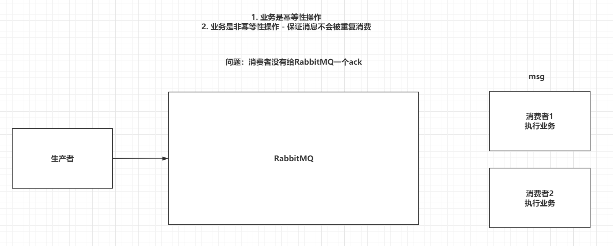

一、引言

模块之间的耦合度多高，导致一个模块宕机后，全部功能都不能用了，并且同步通讯的成本过高，用户体验差。


# 二、RabbitMQ介绍

市面上比较火爆的几款MQ：


ActiveMQ，RocketMQ，Kafka分布式消息队列，RabbitMQ。

- 语言的支持：ActiveMQ，RocketMQ只支持Java语言，Kafka可以支持多们语言，RabbitMQ支持多种语言。
- 效率方面：ActiveMQ，RocketMQ，Kafka效率都是毫秒级别，RabbitMQ是微秒级别的。
- 消息丢失，消息重复问题： RabbitMQ针对消息的持久化，和重复问题都有比较成熟的解决方案。
- 学习成本：RabbitMQ非常简单。

RabbitMQ是由Rabbit公司去研发和维护的，最终是在Pivotal。

RabbitMQ严格的遵循AMQP协议，高级消息队列协议，帮助我们在进程之间传递异步消息。

https://www.rabbitmq.com

# 三、RabbitMQ安装

创建目录，用于存放Docker Compose部署RabbitMQ的yaml文件：

```
mkdir -p /root/composefile/rabbitmq
写入该yaml文件：
```

```shell
vim /root/composefile/rabbitmq/rabbitmq.yaml
```


内容如下所示：

```yaml
version: '3'
services:
  rabbitmq:
    image: rabbitmq:management
    container_name: rabbitmq
    restart: always
    ports:
      - 5672:5672
      - 15672:15672
    environment:
      RABBITMQ_DEFAULT_VHOST: '/'
      RABBITMQ_DEFAULT_USER: admin
      RABBITMQ_DEFAULT_PASS: admin
```

执行命令

```shell
docker compose -f /root/composefile/rabbitmq/rabbitmq.yaml up -d
```

```shell
root@lfj-virtual-machine:/# docker ps
CONTAINER ID   IMAGE                 COMMAND                  CREATED              STATUS                                                                                         
aaceef24ccc9   rabbitmq:management   "docker-entrypoint.s…"   About a minute ago   Up Abo672/tcp, 15671/tcp, 15691-15692/tcp, 25672/tcp, 0.0.0.0:15672->15672/tcp, :::15672->1567

root@lfj-virtual-machine:/# ifconfig
ens33: flags=4163<UP,BROADCAST,RUNNING,MULTICAST>  mtu 1500
        inet 192.168.200.134  netmask 255.255.255.0  broadcast 192.168.200.255
        inet6 fe80::2e18:9f04:8aff:3c23  prefixlen 64  scopeid 0x20<link>
        ether 00:0c:29:b8:41:f3  txqueuelen 1000  (Ethernet)
        RX packets 93519  bytes 134921788 (134.9 MB)
        RX errors 1083  dropped 1231  overruns 0  frame 0
        TX packets 52456  bytes 4125913 (4.1 MB)
        TX errors 0  dropped 0 overruns 0  carrier 0  collisions 0
        device interrupt 19  base 0x2000  
        
```

访问`http://192.168.200.134:15672/#/`，即可进入`RabbitMQ`的管理界面。


使用`Docker Compose`部署`RabbitMQ`很方便。如果部署出现问题，可以通过查看容器的日志来发现问题。

```
docker logs rabbitmq
```

# 四、RabbitMQ架构【重点】

## 4.1 官方的简单架构图

- Publisher - 生产者：发布消息到RabbitMQ中的Exchange
- Consumer - 消费者：监听RabbitMQ中的Queue中的消息
- Exchange - 交换机：和生产者建立连接并接收生产者的消息
- Queue - 队列：Exchange会将消息分发到指定的Queue，Queue和消费者进行交互
- Routes - 路由：交换机以什么样的策略将消息发布到Queue


## 4.2 RabbitMQ的完整架构图


## 4.3 查看图形化界面并创建一个Virtual Host

默认账户：guest guest

创建一个全新的用户和全新的Virtual Host，并且将test用户设置上可以操作/test的权限

http://162.14.64.72:15672/


# 五、RabbitMQ的使用【重点】

## 5.1 RabbitMQ的通讯方式


## 5.2 Java连接RabbitMQ

### 5.2.2 导入依赖

```yaml
<dependencies>
    <dependency>
        <groupId>com.rabbitmq</groupId>
        <artifactId>amqp-client</artifactId>
        <version>5.6.0</version>
    </dependency>

    <dependency>
        <groupId>junit</groupId>
        <artifactId>junit</artifactId>
        <version>4.12</version>
    </dependency>
    
    
</dependencies>
```

### 5.2.3 创建工具类连接RabbitMQ

```java
public static Connection getConnection(){
    // 创建Connection工厂
    ConnectionFactory factory = new ConnectionFactory();
    factory.setHost("192.168.199.109");
    factory.setPort(5672);
    factory.setUsername("test");
    factory.setPassword("test");
    factory.setVirtualHost("/test");

    // 创建Connection
    Connection conn = null;
    try {
        conn = factory.newConnection();
    } catch (Exception e) {
        e.printStackTrace();
    }
    // 返回
    return conn;
}
```


## 5.3 Simple-简单模型

一个生产者，一个默认的交换机，一个队列，一个消费者


创建生产者，创建一个channel，发布消息到exchange，指定路由规则。

```java
@Test
public void publish() throws Exception {
    //1. 获取Connection
    Connection connection = RabbitMQClient.getConnection();

    //2. 创建Channel
    Channel channel = connection.createChannel();

    //3. 发布消息到exchange，同时指定路由的规则
    String msg = "Hello-World！";
    // 参数1：指定exchange，使用""。
    // 参数2：指定路由的规则，使用具体的队列名称。
    // 参数3：指定传递的消息所携带的properties，使用null。
    // 参数4：指定发布的具体消息，byte[]类型
     String message = "Hello World!";
    channel.basicPublish("", QUEUE_NAME, null, message.getBytes());
    System.out.println(" [x] Sent '" + message + "'");
    // Ps：exchange是不会帮你将消息持久化到本地的，Queue才会帮你持久化消息。
    System.out.println("生产者发布消息成功！");
    //4. 释放资源
    channel.close();
    connection.close();
}
```

创建消费者，创建一个channel，创建一个队列，并且去消费当前队列

```java
@Test
public void consume() throws Exception {
    //1. 获取连接对象
    Connection connection = RabbitMQClient.getConnection();

    //2. 创建channel
    Channel channel = connection.createChannel();

    //3. 声明队列-HelloWorld
    //参数1：queue - 指定队列的名称
    //参数2：durable - 当前队列是否需要持久化（true）
    //参数3：exclusive - 是否排外（conn.close() - 当前队列会被自动删除，当前队列只能被一个消费者消费） 死信队列
    //参数4：autoDelete - 如果这个队列没有消费者在消费，队列自动删除  消息挤压
    //参数5：arguments - 指定当前队列的其他信息
    channel.queueDeclare("HelloWorld",true,false,false,null);

    //4. 开启监听Queue
    DefaultConsumer consume = new DefaultConsumer(channel){
        @Override
        public void handleDelivery(String consumerTag, Envelope envelope, AMQP.BasicProperties properties, byte[] msg) throws IOException {
            System.out.println(" [消费者1] received : " +new String(msg,"UTF-8")+ "!");
            //开启手动ACK
            channel.basicAck(envelope.getDeliveryTag(),false);
            
        }
    };

    //参数1：queue - 指定消费哪个队列
    //参数2：autoAck - 指定是否自动ACK （true，接收到消息后，会立即告诉RabbitMQ）
    //参数3：consumer - 指定消费回调
    channel.basicConsume("HelloWorld",true,consume);

    System.out.println("消费者开始监听队列！");
    // System.in.read();
    System.in.read();

    //5. 释放资源
    channel.close();
    connection.close();
}
```

## 5.4 Work-工作模型

一个生产者，一个默认的交换机，一个队列，两个消费者


只需要在消费者端，添加Qos能力以及更改为手动ack即可让消费者，根据自己的能力去消费指定的消息，而不是默认情况下由RabbitMQ平均分配了，生产者不变，正常发布消息到默认的exchange，并指定routing

消费者指定Qos和手动ack

```java
//1 指定当前消费者，一次消费多少个消息
channel.basicQos(1);
DefaultConsumer consumer = new DefaultConsumer(channel){
    @Override
    public void handleDelivery(String consumerTag, Envelope envelope, AMQP.BasicProperties properties, byte[] body) throws IOException {
        try {
            Thread.sleep(100);
        } catch (InterruptedException e) {
            e.printStackTrace();
        }
        System.out.println("消费者1号接收到消息：" + new String(body,"UTF-8"));

        //2. 手动ack
        channel.basicAck(envelope.getDeliveryTag(),false);
    }
};
//3. 指定手动ack
channel.basicConsume("Work",false,consumer);
```

补充:

工作队列，又称任务队列。主要思想就是避免执行资源密集型任务时，必须等待它执行完成。相反我们稍后完成任务，我们将任务封装为消息并将其发送到队列。 在后台运行的工作进程将获取任务并最终执行作业。当你运行许多消费者时，任务将在他们之间共享，但是**一个消息只能被一个消费者获取**。

这个概念在Web应用程序中特别有用，因为在短的HTTP请求窗口中无法处理复杂的任务

```java
public class Send {
    private final static String QUEUE_NAME = "test_work_queue";
 
    public static void main(String[] argv) throws Exception {
        // 获取到连接
        Connection connection = ConnectionUtil.getConnection();
        // 获取通道
        Channel channel = connection.createChannel();
        // 声明队列
        channel.queueDeclare(QUEUE_NAME, false, false, false, null);
        // 循环发布任务
        for (int i = 0; i < 50; i++) {
            // 消息内容
            String message = "task .. " + i;
            channel.basicPublish("", QUEUE_NAME, null, message.getBytes());
            System.out.println(" [x] Sent '" + message + "'");
 
            Thread.sleep(i * 2);
        }
        // 关闭通道和连接
        channel.close();
        connection.close();
    }
}
```

创建一个新的消费者2

```java
public static void main(String[] argv) throws Exception {
        // 获取到连接
        Connection connection = ConnectionUtil.getConnection();
        // 创建通道
        Channel channel = connection.createChannel();
        // 声明队列
        channel.queueDeclare(QUEUE_NAME, false, false, false, null);
        // 定义队列的消费者
        DefaultConsumer consumer = new DefaultConsumer(channel) {
            // 获取消息，并且处理，这个方法类似事件监听，如果有消息的时候，会被自动调用
            @Override
            public void handleDelivery(String consumerTag, Envelope envelope, 
                          BasicProperties properties,byte[] body) throws IOException {
                // body 即消息体
                String msg = new String(body);
                System.out.println(" [消费者2] received : " + msg + "!");
                try{
                    //模拟任务完成耗时
                    Thread.sleep(1000);
                }catch(Exception e){
                    
                }
                //开启手动ACK
                channel.basicAck(envelope.getDeliveryTag(),false);
            }
        };
        // 监听队列，第二个参数：是否自动进行消息确认。
        channel.basicConsume(QUEUE_NAME, false, consumer);
    }
```

## 5.5 Publish/Subscribe

一个生产者，一个交换机，两个队列，两个消费者


声明一个Fanout类型的exchange，并且将exchange和queue绑定在一起，绑定的方式就是直接绑定。

让生产者创建一个exchange并且指定类型，和一个或多个队列绑定到一起。

```java
//3. 创建exchange - 绑定某一个队列
//参数1： exchange的名称
//参数2： 指定exchange的类型  FANOUT - pubsub ,   DIRECT - Routing , TOPIC - Topics
channel.exchangeDeclare("pubsub-exchange", BuiltinExchangeType.FANOUT);
channel.queueBind("pubsub-queue1","pubsub-exchange","");
channel.queueBind("pubsub-queue2","pubsub-exchange","");
```

消费者还是正常的监听某一个队列即可。


发布订阅模式与之前案例的区别就是允许将同一消息发送给多个消费者。实现方式是加入了exchange(交换机)


常见exchange类型包括：

+ Fanout:广播
+ Direct:路由
+ Topic:话题

###  Fanout-交换机(Fanoutchange)


**在consumer服务中, 编写配置类(后面都用注解的方式, 但是配置类推荐)**

|  |
| ------------------------------------------------------------ |

**在consumer服务中，编写两个消费者方法，分别监听fanout.queue1和fanout.queue2**

|  |
| ------------------------------------------------------------ |

**在publisher中编写测试方法，向itcast.fanout发送消息**

|  |
| ------------------------------------------------------------ |

### Direct-交换机(DirectExchange)


**在consumer服务声明Exchange、Queue**

1. 在consumer服务中，编写两个消费者方法，分别监听direct.queue1和direct.queue.2
2. 并利用@RabbitListener声明Exchange、Queue、RoutingKey

|  |
| ------------------------------------------------------------ |

**在publisher中编写测试方法，向itcast.direct发送消息**

|  |
| ------------------------------------------------------------ |

**Direct交换机与Fanout交换机差异**

+ Fanout交换机将消息路由给每一个与之绑定的队列
+ Direct交换机根据RoutingKey判断路由给哪个队列

###  Topic-交换机(TopicExchange)

TopicExchange与DirectExchange类似，区别在于routing Key必须是多个单词的列表，并且以，分割。
Queue与Exchange指定BindingKeyl时可以使用通配符：

+ #:   代指0个或多个单词
+ *:   代指一个单词


**在consumer服务中，编写两个消费者方法，分别监听topic.queue1和topic.queue2**

|  |
| ------------------------------------------------------------ |

**在publisher中编写测试方法，向itcast.topic发送消息**

|  |
| ------------------------------------------------------------ |

## 5.6 Routing

一个生产者，一个交换机，两个队列，两个消费者


生产者在创建DIRECT类型的exchange后，根据RoutingKey去绑定相应的队列，并且在发送消息时，指定消息的具体RoutingKey即可。


```java
//3. 创建exchange, routing-queue-error,routing-queue-info,
channel.exchangeDeclare("routing-exchange", BuiltinExchangeType.DIRECT);
channel.queueBind("routing-queue-error","routing-exchange","ERROR");
channel.queueBind("routing-queue-info","routing-exchange","INFO");

//4. 发布消息到exchange，同时指定路由的规则
channel.basicPublish("routing-exchange","ERROR",null,"ERROR".getBytes());
channel.basicPublish("routing-exchange","INFO",null,"INFO1".getBytes());
channel.basicPublish("routing-exchange","INFO",null,"INFO2".getBytes());
channel.basicPublish("routing-exchange","INFO",null,"INFO3".getBytes());
```

消费者没有变化


## 5.7 Topic

一个生产者，一个交换机，两个队列，两个消费者


生产者创建Topic的exchange并且绑定到队列中，这次绑定可以通过*和#关键字，对指定RoutingKey内容，编写时注意格式 xxx.xxx.xxx去编写， * -> 一个xxx，而# -> 代表多个xxx.xxx，在发送消息时，指定具体的RoutingKey到底是什么。

route：xxx.xxx.xxx

实例：yellow.zgq.qj

*.zgq.*

bule.#(zgq.qj)


```java
//2. 创建exchange并指定绑定方式
channel.exchangeDeclare("topic-exchange", BuiltinExchangeType.TOPIC);
channel.queueBind("topic-queue-1","topic-exchange","*.red.*");
channel.queueBind("topic-queue-2","topic-exchange","fast.#");
channel.queueBind("topic-queue-2","topic-exchange","*.*.rabbit");

//3. 发布消息到exchange，同时指定路由的规则
channel.basicPublish("topic-exchange","fast.red.monkey",null,"红快猴子".getBytes());
channel.basicPublish("topic-exchange","slow.black.dog",null,"黑漫狗".getBytes());
channel.basicPublish("topic-exchange","fast.white.cat",null,"快白猫".getBytes());
```

消费者只是监听队列，没变化。


# 六、RabbitMQ整合SpringBoot【重点】

## 6.1 SpringBoot整合RabbitMQ

 RabbitMQ的通讯方式使用发布订阅的方式

### 6.1.1 创建SpringBoot工程


### 6.1.2 导入依赖

```xml
<dependencies>
        <dependency>
            <groupId>org.springframework.boot</groupId>
            <artifactId>spring-boot-starter-web</artifactId>
        </dependency>
        <dependency>
            <groupId>org.springframework.boot</groupId>
            <artifactId>spring-boot-starter-test</artifactId>
        </dependency>
       <!--因为publisher和consumer服务都需要amqp依赖，因此这里把依赖直接放到父工程-->
    	<dependency>
            <groupId>org.springframework.boot</groupId>
            <artifactId>spring-boot-starter-amqp</artifactId>
        </dependency>
    </dependencies>
```

### 6.1.3 编写配置文件


配置上图信息及rabbitmq地址

```yaml
spring:
  rabbitmq:
    host: 192.168.199.109  #主机名
    port: 5672  #端口
    username: test  #用户名
    password: test  #密码
    virtual-host: /test  #虚拟主机
```


### 6.1.4 消费者声明exchange、queue (也可以用注解的方法)

```java
@Configuration
public class RabbitMQConfig {
    //1. 创建exchange - topic 交换机
    @Bean
    public TopicExchange getTopicExchange(){
        //TopicExchange 交换机类型
        return new TopicExchange("boot-topic-exchange",true,false);
    }

    //2. 创建queue
    @Bean
    public Queue getQueue(){
        return new Queue("boot-queue",true,false,false,null);
    }

    //3. 绑定在一起
    @Bean
    public Binding getBinding(TopicExchange topicExchange,Queue queue){
        return BindingBuilder.bind(queue).to(topicExchange).with("*.red.*");
    }
}
```

### 6.1.5 发布消息到RabbitMQ

```java
import org.junit.jupiter.api.Test;
import org.springframework.amqp.rabbit.core.RabbitTemplate;
import org.springframework.beans.factory.annotation.Autowired;
import org.springframework.boot.test.context.SpringBootTest;

import javax.annotation.Resource;

@SpringBootTest
public class TestBootRabbitMQ {

    @Autowired
    private RabbitTemplate rabbitTemplate;

    @Test
    public void pulisher(){
        // 发送消息  参数 交换机, key
        rabbitTemplate.convertAndSend("boot-exchange","yellow.zgq.xj","周被洗脚仙人跳！！！");
    }

}

@Autowired
private RabbitTemplate rabbitTemplate;

@Test
void contextLoads() {
    rabbitTemplate.convertAndSend("boot-topic-exchange","slow.red.dog","红色大狼狗！！");
}
```

### 6.1.6 创建消费者监听消息

```java
import cn.lfj.mq.listener

@Component
public class Consumer {

    //类中声明方法，添加@RabbitListener注解，方法参数就时消息
    @RabbitListener(queues = "boot-queue")
    public void getMessage(Object message){
        System.out.println("接收到消息：" + message);
    }

}
```

## 6.2 手动Ack

### 6.2.1 添加配置文件

```yaml
spring:
  rabbitmq:
    listener:
      simple:
        acknowledge-mode: manual
```

### 6.2.2 手动ack

```java
@RabbitListener(queues = "boot-queue")
public void getMessage(String msg, Channel channel, Message message) throws IOException {
    System.out.println("接收到消息：" + msg);
    int i = 1 / 0;
    // 手动ack
    channel.basicAck(message.getMessageProperties().getDeliveryTag(),false);
}
```


## 序列化


# 七、RabbitMQ的其他操作

## 7.1 消息的可靠性

RabbitMQ的事务：事务可以保证消息100%传递，可以通过事务的回滚去记录日志，后面定时再次发送当前消息。事务的操作，效率太低，加了事务操作后，比平时的操作效率至少要慢100倍。

RabbitMQ除了事务，还提供了Confirm的确认机制，这个效率比事务高很多。

### 7.1.1 普通Confirm方式


```java
//3.1 开启confirm
channel.confirmSelect();
//3.2 发送消息
String msg = "Hello-World！";
channel.basicPublish("","HelloWorld",null,msg.getBytes());
//3.3 判断消息发送是否成功
if(channel.waitForConfirms()){
    System.out.println("消息发送成功");
}else{
    System.out.println("发送消息失败");
}
```

### 7.1.2 批量Confirm方式。

```java
//3.1 开启confirm
channel.confirmSelect();
//3.2 批量发送消息
for (int i = 0; i < 1000; i++) {
    String msg = "Hello-World！" + i;
    channel.basicPublish("","HelloWorld",null,msg.getBytes());
}
//3.3 确定批量操作是否成功
channel.waitForConfirmsOrDie();     // 当你发送的全部消息，有一个失败的时候，就直接全部失败 抛出异常IOException
```

### 7.1.3 异步Confirm方式。

```java
//3.1 开启confirm
channel.confirmSelect();
//3.2 批量发送消息
for (int i = 0; i < 1000; i++) {
    String msg = "Hello-World！" + i;
    channel.basicPublish("","HelloWorld",null,msg.getBytes());
}
//3.3 开启异步回调
channel.addConfirmListener(new ConfirmListener() {

    @Override
    public void handleAck(long deliveryTag, boolean multiple) throws IOException {
        System.out.println("消息发送成功，标识：" + deliveryTag + ",是否是批量" + multiple);
    }

    @Override
    public void handleNack(long deliveryTag, boolean multiple) throws IOException {
        System.out.println("消息发送失败，标识：" + deliveryTag + ",是否是批量" + multiple);
    }
});
```


### 7.1.4 Return机制

Confirm只能保证消息到达exchange，无法保证消息可以被exchange分发到指定queue。

而且exchange是不能持久化消息的，queue是可以持久化消息。

采用Return机制来监听消息是否从exchange送到了指定的queue中


开启Return机制，并在发送消息时，指定mandatory为true

```java
// 开启return机制
channel.addReturnListener(new ReturnListener() {
    @Override
    public void handleReturn(int replyCode, String replyText, String exchange, String routingKey, AMQP.BasicProperties properties, byte[] body) throws IOException {
        // 当消息没有送达到queue时，才会执行。
        System.out.println(new String(body,"UTF-8") + "没有送达到Queue中！！");
    }
});

// 在发送消息时，指定mandatory参数为true
channel.basicPublish("","HelloWorld",true,null,msg.getBytes());
```


## 7.2 SpringBoot实现

### 7.2.1 编写配置文件


```java
spring:
  rabbitmq:
    publisher-confirm-type: simple
    publisher-returns: true
```

### 7.2.2 开启Confirm和Return


```java
@Component
public class PublisherConfirmAndReturnConfig implements RabbitTemplate.ConfirmCallback ,RabbitTemplate.ReturnCallback {

    @Autowired
    private RabbitTemplate rabbitTemplate;

    @PostConstruct  // init-method
    public void initMethod(){
        rabbitTemplate.setConfirmCallback(this);
        rabbitTemplate.setReturnCallback(this);
    }

    @Override
    public void confirm(CorrelationData correlationData, boolean ack, String cause) {
        if(ack){
            System.out.println("消息已经送达到Exchange");
        }else{
            System.out.println("消息没有送达到Exchange");
        }
    }

    @Override
    public void returnedMessage(Message message, int replyCode, String replyText, String exchange, String routingKey) {
        System.out.println("消息没有送达到Queue");
    }
}
```

## 7.3 避免消息重复消费  (作业)

重复消费消息，会对非幂等行操作造成问题

重复消费消息的原因是，消费者没有给RabbitMQ一个ack





为了解决消息重复消费的问题，可以采用Redis，在消费者消费消息之前，现将消息的id放到Redis中，

id-0（正在执行业务）

id-1（执行业务成功）

如果ack失败，在RabbitMQ将消息交给其他的消费者时，先执行setnx，如果key已经存在，获取他的值，如果是0，当前消费者就什么都不做，如果是1，直接ack。

极端情况：第一个消费者在执行业务时，出现了死锁，在setnx的基础上，再给key设置一个生存时间。

生产者，发送消息时，指定messageId


```java
AMQP.BasicProperties properties = new AMQP.BasicProperties().builder()
    .deliveryMode(1)     //指定消息书否需要持久化 1 - 需要持久化  2 - 不需要持久化
    .messageId(UUID.randomUUID().toString())
    .build();
String msg = "Hello-World！";
channel.basicPublish("","HelloWorld",true,properties,msg.getBytes());
```


消费者，在消费消息时，根据具体业务逻辑去操作redis


```java
DefaultConsumer consume = new DefaultConsumer(channel){
    @Override
    public void handleDelivery(String consumerTag, Envelope envelope, AMQP.BasicProperties properties, byte[] body) throws IOException {
        Jedis jedis = new Jedis("192.168.199.109",6379);
        String messageId = properties.getMessageId();
        //1. setnx到Redis中，默认指定value-0
        String result = jedis.set(messageId, "0", "NX", "EX", 10);
        if(result != null && result.equalsIgnoreCase("OK")) {
            System.out.println("接收到消息：" + new String(body, "UTF-8"));
            //2. 消费成功，set messageId 1
            jedis.set(messageId,"1");
            channel.basicAck(envelope.getDeliveryTag(),false);
        }else {
            //3. 如果1中的setnx失败，获取key对应的value，如果是0，return，如果是1
            String s = jedis.get(messageId);
            if("1".equalsIgnoreCase(s)){
                channel.basicAck(envelope.getDeliveryTag(),false);
            }
        }
    }
};
```


## 7.4 SpringBoot如何实现

### 7.4.1 导入依赖


```java
<dependency>
    <groupId>org.springframework.boot</groupId>
    <artifactId>spring-boot-starter-data-redis</artifactId>
</dependency>
```

### 7.4.2 编写配置文件

```java
spring:
  redis:
    host: 192.168.199.109
    port: 6379
```

### 7.4.3 修改生产者

```java
@Test
void contextLoads() throws IOException {
    CorrelationData messageId = new CorrelationData(UUID.randomUUID().toString());
    rabbitTemplate.convertAndSend("boot-topic-exchange","slow.red.dog","红色大狼狗！！",messageId);
    System.in.read();
}
```


### 7.4.4  修改消费者

```
@Autowired
private StringRedisTemplate redisTemplate;


@RabbitListener(queues = "boot-queue")
public void getMessage(String msg, Channel channel, Message message) throws IOException {
    //0. 获取MessageId
    String messageId = message.getMessageProperties().getHeader("spring_returned_message_correlation");
    //1. 设置key到Redis
    if(redisTemplate.opsForValue().setIfAbsent(messageId,"0",10, TimeUnit.SECONDS)) {
        //2. 消费消息
        System.out.println("接收到消息：" + msg);

        //3. 设置key的value为1
        redisTemplate.opsForValue().set(messageId,"1",10,TimeUnit.SECONDS);
        //4.  手动ack
        channel.basicAck(message.getMessageProperties().getDeliveryTag(),false);
    }else {
        //5. 获取Redis中的value即可 如果是1，手动ack
        if("1".equalsIgnoreCase(redisTemplate.opsForValue().get(messageId))){
            channel.basicAck(message.getMessageProperties().getDeliveryTag(),false);
        }
    }
}
```

