# Nginx高性能服务

## 一、引言

### 1.1 代理问题

客户端到底要将请求发送给哪台服务器。

| 发送给服务器1还是服务器2                                     |
| ------------------------------------------------------------ |
|  |

### 1.2 负载均衡问题

如果所有客户端的请求都发送给了服务器1，那么服务器2将没有任何意义

| 负载均衡问题                                                 |
| ------------------------------------------------------------ |
| 服务器1访问数据库客户端服务器2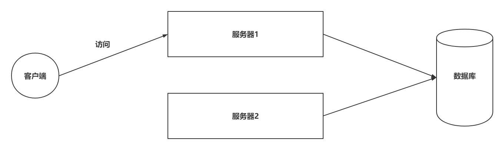 |

### 1.3 资源优化

客户端发送的请求可能是申请动态资源的，也有申请静态资源，但是都是去Tomcat中获取的

| 静态资源访问                                                 |
| ------------------------------------------------------------ |
| 客户端数据库服务器1本地静态资源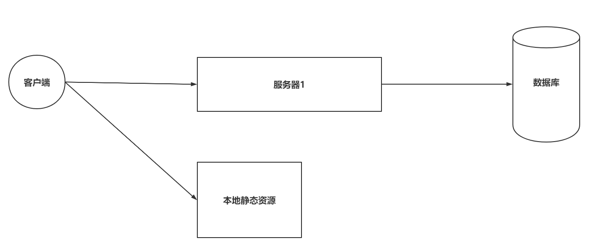 |

### 1.4 Nginx处理

| 在搭建集群后，使用Nginx                                      |
| ------------------------------------------------------------ |
|  |

## 二、Nginx概述

Nginx是由俄罗斯人研发的，应对Rambler的网站，并且2004年发布的第一个版本。

Nginx (engine x) 是一个高性能的HTTP和反向代理web服务器，同时也提供了IMAP/POP3/SMTP服务。Nginx是由伊戈尔·赛索耶夫为俄罗斯访问量第二的Rambler.ru站点（俄文：Рамблер）开发的，第一个公开版本0.1.0发布于2004年10月4日。2011年6月1日，nginx 1.0.4发布。

其特点是占有内存少，并发能力强，事实上nginx的并发能力在同类型的网页服务器中表现较好，中国大陆使用nginx网站用户有：百度、京东、新浪、网易、腾讯、淘宝等。在全球活跃的网站中有12.18%的使用比率，大约为2220万个网站。

Nginx 是一个安装非常的简单、配置文件非常简洁（还能够支持perl语法）、Bug非常少的服务。Nginx 启动特别容易，并且几乎可以做到7*24不间断运行，即使运行数个月也不需要重新启动。你还能够不间断服务的情况下进行软件版本的升级。

Nginx代码完全用C语言从头写成。官方数据测试表明能够支持高达 50,000 个并发连接数的响应。

### 2.1 Nginx的特点

+ 稳定性极强。 7*24小时不间断运行。
+ Nginx提供了非常丰富的配置实例。
+ 占用内存小，并发能力强。

| Nginx引入前后,客户端请求处理流程的对比                       |
| ------------------------------------------------------------ |
| 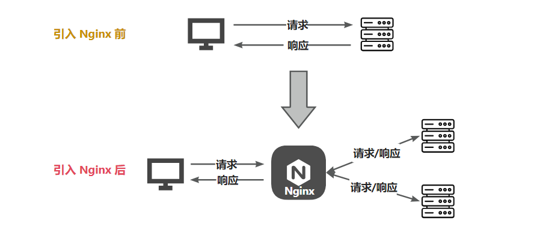 |

### 2.2 Nginx作用

> Http代理，反向代理：作为web服务器最常用的功能之一，尤其是反向代理。

**正向代理:  代理客户端**

**反向代理:  代理服务端**
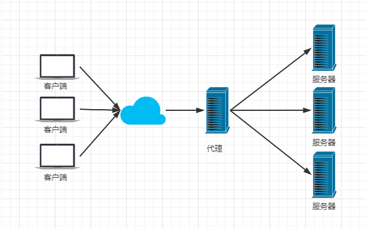

> Nginx提供的负载均衡策略有2种：内置策略和扩展策略。内置策略为轮询，加权轮询，Ip hash。扩展策略，就天马行空，只有你想不到的没有他做不到的。

轮询

加权轮询

iphash对客户端请求的ip进行hash操作，然后根据hash结果将同一个客户端ip的请求分发给同一台服务器进行处理，可以解决session不共享的问题。


> 动静分离，在我们的软件开发中，有些请求是需要后台处理的，有些请求是不需要经过后台处理的（如：css、html、jpg、js等等文件），这些不需要经过后台处理的文件称为静态文件。让动态网站里的动态网页根据一定规则把不变的资源和经常变的资源区分开来，动静资源做好了拆分以后，我们就可以根据静态资源的特点将其做缓存操作。提高资源响应的速度。


目前，通过使用Nginx大大提高了我们网站的响应速度，优化了用户体验，让网站的健壮性更上一层楼！软件层面一般常用Nginx来做反向代理服务器，它的性能非常好，用来做负载均衡。

## 三、Nginx的安装

### 3.1 windows下安装并使用

**1、下载nginx**

http://nginx.org/en/download.html 下载稳定版本。
以nginx/Windows-1.16.1为例，直接下载 nginx-1.16.1.zip。
下载后解压，解压后如下：


**2、启动nginx**

有很多种方法启动nginx

(1)直接双击nginx.exe，双击后一个黑色的弹窗一闪而过

(2)打开cmd命令窗口，切换到nginx解压目录下，输入命令 `nginx.exe` ，回车即可

**3、检查nginx是否启动成功**

直接在浏览器地址栏输入网址 [http://localhost:80](http://localhost/) 回车，出现以下页面说明启动成功！


**4、配置监听**

nginx的配置文件是conf目录下的nginx.conf，默认配置的nginx监听的端口为80，如果80端口被占用可以修改为未被占用的端口即可。

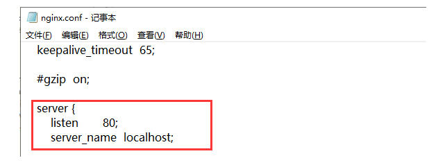

当我们修改了nginx的配置文件nginx.conf 时，不需要关闭nginx后重新启动nginx，只需要执行命令

```
 nginx -s reload 即可让改动生效
```

**5、关闭nginx**

如果使用cmd命令窗口启动nginx， 关闭cmd窗口是不能结束nginx进程的，可使用两种方法关闭nginx

(1)输入nginx命令 

```
nginx -s stop(快速停止nginx) 或 nginx -s quit(完整有序的停止nginx)
```

(2)使用taskkill `taskkill /f /t /im nginx.exe`

```
taskkill是用来终止进程的，/f是强制终止 ./t终止指定的进程和任何由此启动的子进程。/im示指定的进程名称 .
```

### 3.2 linux下安装

**1、安装gcc**

安装 nginx 需要先将官网下载的源码进行编译，编译依赖 gcc 环境，如果没有 gcc 环境，则需要安装：

```
yum install gcc-c++
```

**2、PCRE pcre-devel 安装**

PCRE(Perl Compatible Regular Expressions) 是一个Perl库，包括 perl 兼容的正则表达式库。nginx 的 http 模块使用 pcre 来解析正则表达式，所以需要在 linux 上安装 pcre 库，pcre-devel 是使用 pcre 开发的一个二次开发库。nginx也需要此库。命令：

```
yum install -y pcre pcre-devel
```

**3、zlib 安装**

zlib 库提供了很多种压缩和解压缩的方式， nginx 使用 zlib 对 http 包的内容进行 gzip ，所以需要在 Centos 上安装 zlib 库。

```
yum install -y zlib zlib-devel
```

**4、OpenSSL 安装**
OpenSSL 是一个强大的安全套接字层密码库，囊括主要的密码算法、常用的密钥和证书封装管理功能及 SSL 协议，并提供丰富的应用程序供测试或其它目的使用。
nginx 不仅支持 http 协议，还支持 https（即在ssl协议上传输http），所以需要在 Centos 安装 OpenSSL 库。

```
yum install -y openssl openssl-devel
```

  **一次性安装，执行如下命令**

```
yum install gcc openssl openssl-devel pcre pcre-devel zlib zlib-devel -y
```

**5、下载安装包**

手动下载.tar.gz安装包，地址：https://nginx.org/en/download.html

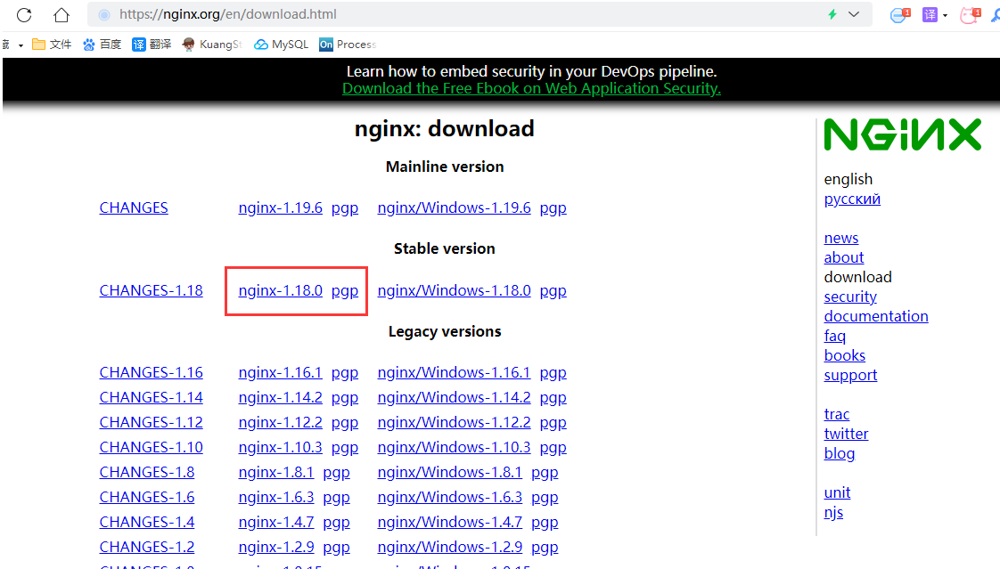

下载完毕上传到服务器上 /root

**6、解压**

```
tar -zxvf nginx-1.18.0.tar.gzcd nginx-1.18.0
```

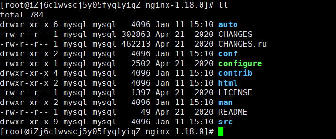

**7、配置**

使用默认配置，在nginx根目录下执行

```
./configuremakemake install
```

查找安装路径： `whereis nginx`


### 3.3 使用Docker-Compose安装

编写docker-compose.yml

```yml
version: '3.1'
services:
  nginx:
    restart: always
    image: daocloud.io/library/nginx:latest
    container_name: nginx
    ports:
      - 80:80
```

```shell
docker compose -f docker-compose.yml up -d
```

##  Nginx的核心配置文件nginx.conf


### 结构说明

1、全局块：配置影响nginx全局的指令。一般有运行nginx服务器的用户组，nginx进程pid存放路径，日志存放路径，配置文件引入，允许生成worker process数等。

2、events块：配置影响nginx服务器或与用户的网络连接。有每个进程的最大连接数，选取哪种事件驱动模型处理连接请求，是否允许同时接受多个网路连接，开启多个网络连接序列化等。

3、http块：可以嵌套多个server，配置代理，缓存，日志定义等绝大多数功能和第三方模块的配置。如文件引入，mime-type定义，日志自定义，是否使用sendfile传输文件，连接超时时间，单连接请求数等。

4、server块：配置虚拟主机的相关参数，一个http中可以有多个server。

5、location块：配置请求的路由，以及各种页面的处理情况。

```
...              #全局块

events {         #events块
   ...
}

http      #http块
{
    ...   #http全局块
    server        #server块
    { 
        ...       #server全局块
        location [PATTERN]   #location块
        {
            ...
        }
        location [PATTERN] 
        {
            ...
        }
    }
    server
    {
      ...
    }
    ...     #http全局块
}
```

/etc/nginx/nginx.conf

### nginx.conf

```yaml
########### 每个指令必须有分号结束。#################
#配置用户或者组，默认为nobody nobody，以什么用户启动 nginx程序，涉及到文件的读写权限，一般应该用root。
user root;  

#允许生成的进程数，默认为1。标配一个cpu起一个进程。
worker_processes auto;  

#指定nginx进程运行文件存放地址
pid /nginx/pid/nginx.pid;   

#制定日志路径，级别。这个设置可以放入全局块，http块，server块，级别以此为：debug|info|notice|warn|error|crit|alert|emerg
#error_log log/error.log debug;  

events {
	#设置网路连接序列化，防止惊群现象发生，默认为on
    #accept_mutex on;  
     
    #设置一个进程是否同时接受多个网络连接，默认为off
    #multi_accept on; 
    
    #事件驱动模型，select|poll|kqueue|epoll|resig|/dev/poll|eventport
    #use epoll;     
    
    #最大连接数，可以根据实际情况扩大，生产可扩大到10240
    worker_connections  10240;    
}


http {
	#文件扩展名与文件类型映射表
    include       mime.types; 
      
    #默认文件类型，默认为text/plain
    default_type  application/octet-stream; 
    
    #取消服务日志
    #access_log off; 
    
    #自定义格式    
    #log_format myFormat '$remote_addr–$remote_user [$time_local] $request $status $body_bytes_sent $http_referer $http_user_agent $http_x_forwarded_for'; 
    
    #combined为日志格式的默认值
    #access_log log/access.log myFormat;  

	#允许sendfile方式传输文件，默认为off，可以在http块，server块，location块。
    sendfile on; 
    
    #每个进程每次调用传输数量不能大于设定的值，默认为0，即不设上限。
    sendfile_max_chunk 100k;  
    
    #连接超时时间，默认为75s，可以在http，server，location块。
    keepalive_timeout 75;  
    
    #接收客户端请求体超时
    client_body_timeout 20s;
    
    #客户端连接nginx超时, 建议5s内,接收客户端header超时时间,超时返回408
    client_header_timeout 10s;

	#限制请求体的大小，若超过所设定的大小，返回413错误。
    client_max_body_size 10M;


	#Nginx分配给请求数据的Buffer大小，如果请求的数据小于client_body_buffer_size直接将数据先在内存中存储。
	#大于该值小于client_max_body_size，就会将数据先存储到临时文件（用户组要有读写权限）中，client_body_temp 指定的路径中，默认该路径值是/tmp/。
    client_body_buffer_size 128k;
    
    #开启自定义错误重定向，不存在会返回404页面
    fastcgi_intercept_errors on;

	#热备  负载均衡配置
    upstream mysvr { 
      #服务器资源
      server 127.0.0.1:7878;
      server 192.168.10.121:3333 backup;  
    }

    server {
    	#单连接请求上限次数。
        keepalive_requests 120; 
        #监听端口
        listen       4545;   
        #监听地址 
        server_name  127.0.0.1;    
        #请求的url过滤，正则匹配，~为区分大小写，~*为不区分大小写。     
        location  ~*^.+$ {   
        	#根目录,设置目录
           #root path;  
           #设置默认页
           #index index.htm;  
           #请求转向mysvr 定义的服务器列表  反向代理
           proxy_pass  http://mysvr;    # 如果是4545请求代理到mysvr中 
            #拒绝的ip
           #deny 127.0.0.1; 
            #允许的ip
           #allow 172.18.5.54;           
        } 
    }
}

```

例子

```yaml
worker_processes  1;		
error_log  /var/log/nginx/error.log warn;
# 以上统称为全局块， 
# worker_processes他的数值越大，Nginx的并发能力就越强  集群
# error_log 代表Nginx的错误日志存放的位置

events {
    worker_connections  1024;
}
# events块
# worker_connections他的数值越大，Nignx并发能力越强

http {  #text/html text/plian  xml  images:jpg png gif
    include       /etc/nginx/mime.types; #媒体类型 http 头部信息 contenttype=application/json
    default_type  application/octet-stream;
    server {
        listen       80;
        server_name  localhost;
		#代理

        location / { #策略
            root   /usr/share/nginx/html; #webapps资源
            index  index.html index.htm; #设计程序入口
        }
		# location块
		# root：将接收到的请求根据/usr/share/nginx/html去查找静态资源
		# index： 默认去上述的路径中找到index.html或者index.htm
    }
	# server块
	# listen： 代表Nginx监听的端口号
	# localhost：代表Nginx接收请求的ip
}
# http块
# include代表引入一个外部的文件 -> /mime.types中放着大量的媒体类型
# include /etc/nginx/conf.d/*.conf; -> 引入了conf.d目录下的以.conf为结尾的配置文件
```

 修改docker-compose文件

为了方便修改Nginx配置，修改yml文件

```yml
version: '3.1'
services:
  nginx:
    restart: always
    image: daocloud.io/library/nginx:latest
    container_name: nginx
    ports:
      - 80:80
    volumes:
      - /opt/docker_nginx/conf.d/:/etc/nginx/conf.d
```

案例

```
upstream lb{
    server 127.0.0.1:8080 weight=3;
    server 127.0.0.1:8081 weight=1;
}
location / {
    proxy_pass http://lb;
}
```

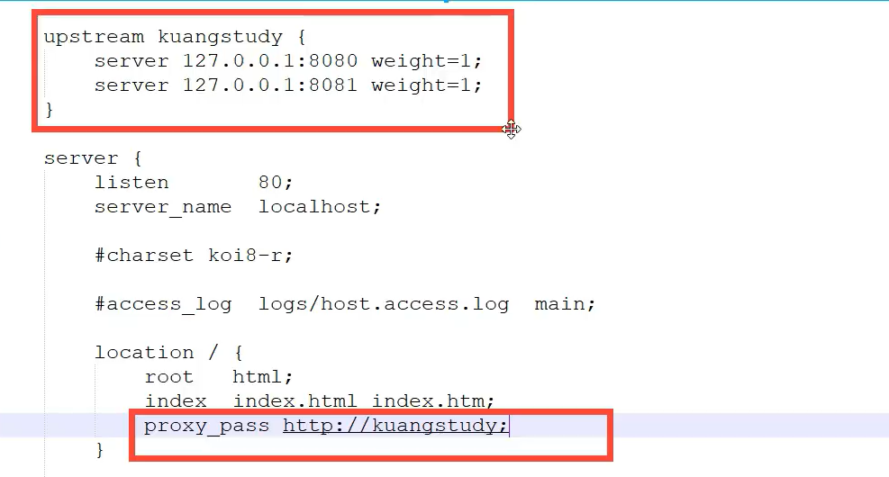

### 案例1：页面转发，80端口指向index，前后台可用

```clike
 server {
        listen       80;
        server_name  localhost;
        location / {
            root   /home/user01/dist/;
            try_files $uri $uri/ /index.html;
            index  index.html index.htm;
        }
```

### 案例2：接口转发

[详细代码](C:\Users\16658\Documents\GitHub\java_note\note\spring boot3\Docker Compose实战\test01)

**java**

```properties
# 端口号
server:
  port: 2001
```

controller

```java
@RequestMapping("/v1")
@RestController
public class HelloController {

	@Value("${server.port}")
	private int port;

	@GetMapping("")
	public String test() {
		return "invoke url /,port="+port;
	}

	@GetMapping("/test1")
	public String test1() {
		return "invoke url /test1,port="+port;
	}

	@GetMapping("/test2")
	public String test2() {
		return "invoke url /test2,port="+port;
	}
}
```

测试

```c
http://127.0.0.1:2001/v1
http://127.0.0.1:2001/v1/test1
http://127.0.0.1:2001/v1/test2
```


**nginx**

修改nginx.conf文件

```json
worker_processes  1;

events {
    worker_connections  1024;
}


http {
    include       mime.types;
    default_type  application/octet-stream;

    sendfile        on;
    
    keepalive_timeout  65;

    server {
        listen       90;
        server_name  127.0.0.1;

		location / {
            root   html; 
            index  index.html index.htm; 
        }
        location /t {
            proxy_pass http://127.0.0.1:2001/v1;
        }
		location /t1 {
            proxy_pass http://127.0.0.1:2001/v1/test1;
        }
		location /t2 {
            proxy_pass http://127.0.0.1:2001/v1/test2;
        }
    }
}
```

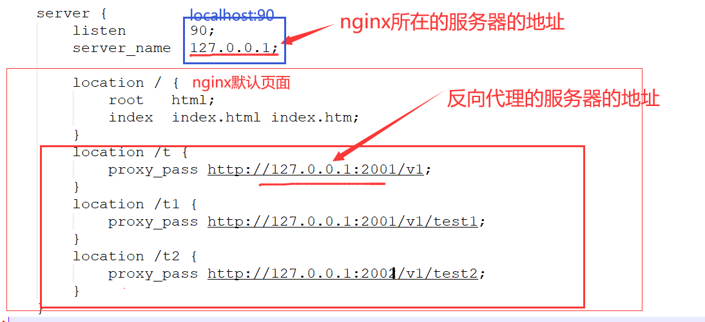

测试

```c
http://127.0.0.1:90/t
http://127.0.0.1:90/t1
http://127.0.0.1:90/t2
```


### 案例3：文件路径转发。80/uploadFile指向文件路径

```clike
server {  
		location /uploadFile/{
            proxy_pass http://localhost:48081/;
        }  
}

   server {  
        listen         48081;        
        server_name  localhost;   
        charset utf-8; 
        root    /home/user01/java/file; 
        location / {
            autoindex on;             
            autoindex_exact_size off; 
            autoindex_localtime on;  
        } 
   }
```

简略配置：

```clike
location /uploadFile{
 		root    /home/user01/java/file; 
}
123
```

### 案例4:：端口转发，将本地端口指向其他地址

```clike
server {
	listen 127.0.0.1:8279;
	location / { 
		proxy_pass http://ip:8279;
	}
}
123456
```

### 案例5：负载均衡，将一个端口指向多个服务

```clike
server {
		listen 8888;
		location / { 
			#通过代理将请求发送给 upstream 命名的HTTP 服务
			proxy_pass http://myserver;
		}
	}
	
#定义一个 HTTP 服务组
upstream  myserver{
		#用server定义HTTP 地址。后面不写默认轮询。
		server 127.0.0.1:8080 max_fails=5 fail_timeout=10s weight=10;
		server 127.0.0.1:8081 backup;
		server 127.0.0.1:8082 down;
	}
123456789101112131415
upstream  myserver{
	#相同的客户端ip请求相同的服务器。
	server 127.0.0.1:8080;
	server 127.0.0.1:8081;
	ip_hash;
}
123456
```

- weight，加权轮询。
- down，表示当前的server暂时不参与负载均衡。
- backup，预留的备份机器。当其他所有的非backup机器出现故障或者忙的时候，才会请求backup机器，因此这台机器的压力最轻。
- max_fails，允许请求失败的次数，默认为1。当超过最大次数时，返回proxy_next_upstream 模块定义的错误。
- fail_timeout，在经历了max_fails次失败后，暂停服务的时间。max_fails可以和fail_timeout一起使用。


### 配置文件新增端口转发配置技巧

1、在nginx.conf中http加入一行include tcpconf/*.conf;

```clike
http {
include tcpconf/*.conf;
}
```

2、在nginx.conf目录下，新建文件夹tcpconf，其他配置文件命名.conf，文件中写入转发的配置。例如下面，然后重启生效。

```clike
server {
    listen 127.0.0.1:8279;
   location / { 
   proxy_pass http://ip:8279;
	}
}
```

## 四、Nginx的反向代理【`重点`】

### 4.1 正向代理和反向代理介绍

正向代理：

- 正向代理服务是由客户端设立的。
- 客户端了解代理服务器和目标服务器都是谁。
- 帮助咱们实现突破访问权限，提高访问的速度，对目标服务器隐藏客户端的ip地址。

| 正向代理                                                     |
| ------------------------------------------------------------ |
| 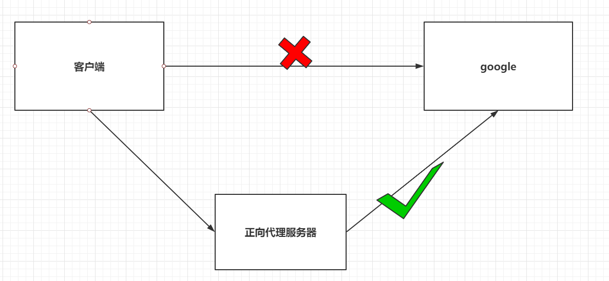 |

反向代理：

- 反向代理服务器是配置在服务端的。
- 客户端是不知道访问的到底是哪一台服务器。
- 达到负载均衡，并且可以隐藏服务器真正的ip地址。

| 反向代理                                                     |
| ------------------------------------------------------------ |
| 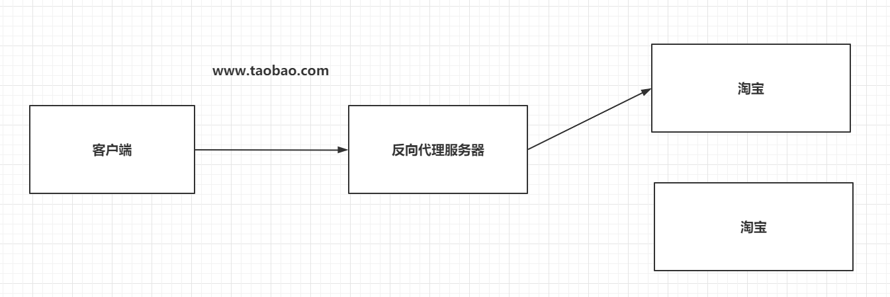 |

### 4.2 基于Nginx实现反向代理

准备一个目标服务器。

 启动了之前的tomcat服务器。

 编写nginx的配置文件，通过Nginx访问到tomcat服务器。

```json
server{
  listen 80;
  server_name localhost;
    # 基于反向代理访问到Tomcat服务器
  location / {
    proxy_pass http://192.168.199.109:8080/;
  }
}
```


### 4.3 关于Nginx的location路径映射

优先级关系如下： 资源管理  其二我的nginx

- location = /路径：优先级最高，精准匹配，一旦匹配， 不再去找其他匹配项。
- location ^~ /路径：优先级次之，字符串匹配，一旦匹配， 不再去找其他匹配项。
- location ~ 正则表达式：如果有多个location的正则能匹配的话，则使用正则表达式最长的那个。
- location ~* 正则表达式：和location ~ 正则表达式相同，不过当前方式不区分大小写。
- location /路径：常规方式，匹配前缀，优先级最低。

举个栗子：

```json
# 直接匹配
location = / {
  # 精准匹配，主机名后面不能带任何的字符串
}

# 常规匹配
location /xxx {
  # 匹配所有以/xxx开头的路径
}

# 正则匹配
location ~ /xxx {
  # 匹配所有以/xxx开头的路径
}

# 匹配开头路径
location ^~ /images/ {
  # 匹配所有以/images开头的路径，匹配后，不再删选其他选项
}

# 正则匹配后缀
location ~* \.(gif|jpg|png)$ {
  # 匹配以gif或者jpg或者png为结尾的路径
}

# 全部通配
location / {
  # 匹配全部路径  
}
```

## 五、Nginx负载均衡【`重点`】

Nginx为我们默认提供了三种负载均衡的策略：

-  轮询：将客户端发起的请求，平均的分配给每一台服务器。 
-  权重：会将客户端的请求，根据服务器的权重值不同，分配不同的数量。 
-  ip_hash：基于发起请求的客户端的ip地址不同，他始终会将请求发送到指定的服务器上。 

### 5.1 轮询

想实现Nginx轮询负载均衡机制只需要在配置文件中添加以下内容

```json
upstream 名字 {
  server ip:port;
  server ip:port;
  ...
}
server {
  listen 80;
  server_name localhost;
  
  location / {
    proxy_pass http://upstream的名字/;
  }
}
```

### 5.2 权重

实现权重的方式

```json
权重比例：1-9数字
upstream 名字 {
  server ip:port weight=权重比例;
  server ip:port weight=权重比例;
  ...
}
server {
  listen 80;
  server_name localhost;
  
  location / {
    proxy_pass http://upstream的名字/;
  }
}
```

#### 5.3 ip_hash

ip_hash实现

```json
upstream 名字 {
  ip_hash;
  server ip:port;
  server ip:port;
  ...
}
server {
  listen 80;
  server_name localhost;
  
  location / {
    proxy_pass http://upstream的名字/;
  }
}
```

## 六、Nginx动静分离【`重点`】

```
Nginx的并发能力公式：

​	worker_processes * worker_connections / 4 | 2 = Nginx最终的并发能力

动态资源需要/4，静态资源需要/2.
Nginx通过动静分离，来提升Nginx的并发能力，更快的给用户响应。
```

### 6.1 动态资源代理

使用proxy_pass动态代理

```json
# 配置如下
location / {
  proxy_pass 路径;
}
```

### 6.2 静态资源代理

使用root静态代理

```json
# 配置如下
location / {
  root 静态资源路径;
  index 默认访问路径下的什么资源;
  autoindex on; # 代表展示静态资源全的全部内容，以列表的形式展开。
}

server{
  listen 80;
  server_name localhost;
  location / {
    root /opt/docker_nginx/upload;  #容器内部资源路径，这个你可以数据卷映射，宿主机上上传资源文件，但是在这里必须配置容映射的路径
    index *.html *.png; #如果配置了多个资源，需要列表显示（autoindex on），需要用*配置所有资源，（切记不要制定资源全名）
    autoindex on;
  }
}


# 先修改docker，添加一个数据卷，映射到Nginx服务器的一个目录
# 添加了index.html和1.jpg静态资源
# 修改配置文件
```
