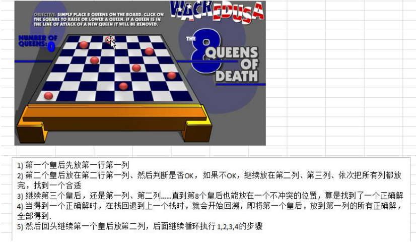

### 八皇后问题（回溯算法）

#### 八皇后问题介绍

八皇后问题，是一个古老而著名的问题，是回溯算法的典型案例。该问题是国际西洋棋棋手马克斯·贝瑟尔于 1848 年提出：在 8×8 格的国际象棋上摆放八个皇后，使其不能互相攻击，即：**任意两个皇后都不能处于同一行、同一列或同一斜线上，问有多少种摆法**(92)。


#### 八皇后问题算法思路分析

1. 第一个皇后先放到第一行第一列
2. 第二个皇后放在第二行第一列，然后判断是否OK，如果不OK，继续放到第二列。。。依次把所有的列都放完，找到一个合适的位置
3. 继续第三个皇后，还是第一列开始、第二列。。。直到第8个皇后也能放到一个不产生冲突的位置，就算找到了一个正确解
4. 当得到一个正确解时，然后栈回退到上一个栈的位置，就会开始回溯，即  将第一个皇后放到第一个位置的全部解都得到
5. 然后回头继续第一个皇后放第二列，后面继续循环执行  1,2,3,4的步骤



理论上应该创建一个二维数组来表示棋盘，但是实际上可以通过算法，用一个一维数组即可解决问题. arr[8] = {0 , 4, 7, 5, 2, 6, 1, 3} //对应 arr 下标 表示第几行，即第几个皇后，arr[i] = val , val 表示第 i+1 个皇后，放在第 i+1 行的第 val+1 列


```java
package com.romanticlei.recursion;

public class Queue8 {

    // 定义一个 max 表示共有多少个皇后
    int max = 8;
    // 定义数组array， 保存皇后放置的结果，比如 arr = {0, 4, 7, 5, 3, 6, 1, 3}
    int[] array = new int[max];

    // 声明一个变量，表示有多少种解法
    int count = 0;
    // 声明一个变量，表示回溯了多少次
    int judgeCount = 0;

    public static void main(String[] args) {
        Queue8 queue = new Queue8();
        queue.check(0);
        System.out.println("八皇后问题一共有 " + queue.count + " 种解法");
        System.out.println("八皇后问题一共回溯了 " + queue.judgeCount + " 次");
    }

    // 编写一个方法，放置第n个皇后
    public void check(int n){
        if (n >= max){
            print();
            return;
        }

        // 依次放入皇后，并判断是否冲突
        for (int i = 0; i < max; i++) {
            judgeCount++;
            // 先把当前这个皇后 n，放到该行的第一列
            array[n] = i;
            // 判断当前放置第 n 个皇后到i列时，是否冲突
            if (judge(n)){
                // 不冲突接着放 n + 1个皇后，开始递归
                // 发生冲突就继续执行for循环
                check(n + 1);
            }
        }
    }

    // 查看当我们放置第n 个皇后，就去检测该皇后是否和前面已经摆放的皇后冲突
    private boolean judge(int n) {
        for (int i = 0; i < n; i++) {
            // 如果当前皇后和前面的皇后在一条直线 或者 当前皇后与前面的皇后之间斜率绝对值为1 ,返回false
            if (array[i] == array[n] || Math.abs(n - i) == Math.abs(array[i] - array[n])) {
                return false;
            }
        }
        return true;
    }

    // 输出方法，用于将皇后摆放的位置输出
    private void print() {
        for (int i = 0; i < array.length; i++) {
            System.out.print(array[i] + "\t");
        }
        count++;
        System.out.println();
    }
}
```


