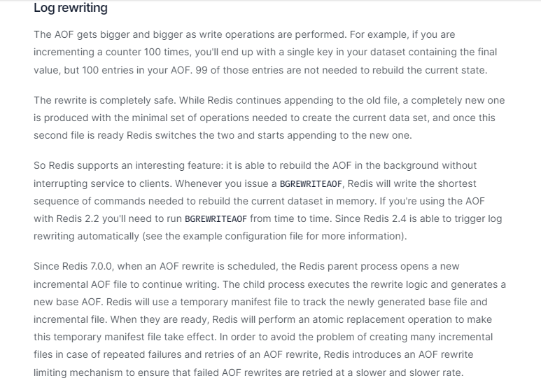
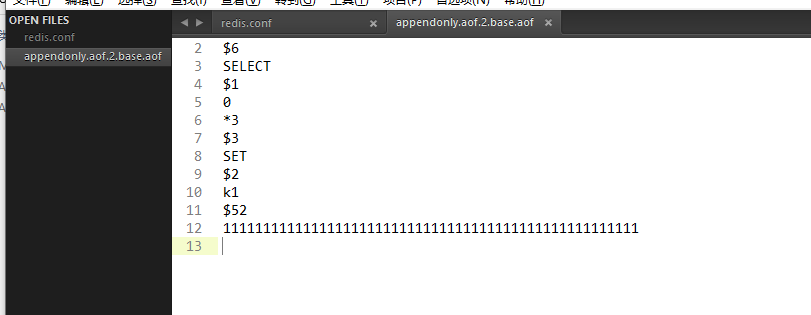

# AOF重写机制

### 是什么？

由于AOF持久化是Redis不断将写命令记录到 AOF 文件中，随着Redis不断的进行，AOF 的文件会越来越大,文件越大，占用服务器内存越大以及 AOF 恢复要求时间越长。
为了解决这个问题，**Redis新增了重写机制**，当AOF文件的大小超过所设定的峰值时，Redis就会**自动**启动AOF文件的内容压缩.只保留可以恢复数据的最小指令集或者可以**手动使用命令 bgrewriteaof 来重新**。

一句话：启动AOF文件的内容压缩，只保留可以恢复数据的最小指令集。

### 触发机制

- **官网默认配置**

- **自动触发**

满足配置文件中的选项后，Redis会记录上次重写时的AOF大小，默认配置是当AOF文件大小是上次rewrite后大小的一倍且文件大于64M时

- **手动触发**

客户端向服务器发送bgrewriteaof命令

### 案例说明

**需求说明：**

$\textcolor{red}{启动AOF文件的内容压缩，只保留可以恢复数据的最小指令集。}$
$\textcolor{blue}{举个例子:}$ 比如有个key
开始你 set k1 v1
然后改成 set k1 v2
最后改成 set k1 v3
如果不重写，那么这3条语句都在aof文件中，内容占空间不说启动的时候都要执行一遍，共计3条命令但是，我们实际效果只需要set k1 v3这一条，所以，
开启重写后，只需要保存set k1 3就可以了只需要保留最后一次修改值，相当于给aof文件瘦身减肥，性能更好。
AOF重写不仅降低了文件的占用空间，同时更小的AOF也可以更快地被Redis加载。

**需求验证：**

$\textcolor{green}{启动AOF文件的内容压缩，只保留可以恢复数据的最小指令集。}$

**步骤：**

- 前期配置准备：

  1. 开启aof，appendonly yes，设置aof持久化开启

  2. 重写峰值修改为1k

     

  3. 关闭混合，设置为no

     

  4. 删除执勤啊的全部aof和rdb，清除干扰项

- 自动触发案例01

  1. 完成上述正确配置，重启redis服务器，执行 set k1 v1 查看aof文件是否正常

     

  2. 查看aof三大 配置文件

     appendonly.aof.1.base.aof；appendonly.aof.1.incr.aof；appendonly.aof.manifest

  3. k1不停的更新值

     

  4. 重写触发

- 手动触发案例02

  客户端向服务器发送bgrewriteaof命令

- 结论

**也就是说AOF文件重写并不是对原文件进行重新整理，而是直接读取服务器现有的键值对，然后用一条命令去代替之前记录这个键值对的多条命令，生成一个新的文件后去替换原来的AOF文件。**
AOF文件重写触发机制:通过 redis.conf配置文件中的 auto-aof-rewrite-percentage:默认值为100，以及auto-aof-rewrite-min-size: 64mb配置，也就是说默认Redis会记录上次重写时的AOF大小，**默认配置是当AOF文件大小是上次rewrite后大小的一倍且文件大于64M时触发。**

### 重写原理

1. 在重写开始前，redis会创建一个“重写子进程”，这个子进程会读取现有的AOF文件，并将其包含的指令进行分析压缩并写入到一个临时文件中。
2. 与此同时，主进程会将新接收到的写指令一边累积到内存缓冲区中，一边继续写入到原有的AOF文件中，这样做是保证原有的AOF文件的可用性，避免在重写过程中出现意外。
3. 当“重写子进程”完成重写工作后，它会给父进程发一个信号，父进程收到信号后就会将内存中缓存的写指令追加到新AOF文件中
4. 当追加结束后，redis就会用新AOF文件来代替旧AOF文件，之后再有新的写指令，就都会追加到新的AOF文件中
5. 重写aof文件的操作，并没有读取旧的aof文件，而是将整个内存中的数据库内容用命令的方式重写了一个新的aof文件，这点和快照有点类似

# AOF 优化配置项详解

配置文件 APPEND ONLY MODE模块

# 小总结

