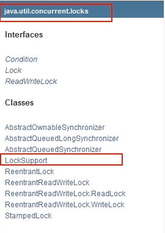
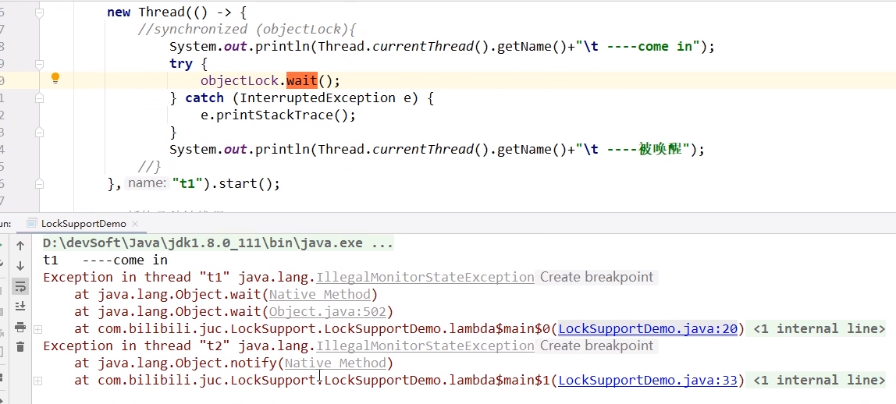

# LockSupport是什么

# 3种让线程等待和唤醒的方法

### 线程等待和唤醒的方法

1. 使用Object中的wait()方法让线程等待，使用Object中的notify()方法唤醒线程
2. 使用JUC包中Condition的await()方法让线程等待，使用signal()方法唤醒线程
3. LockSupport类可以阻塞当前线程以及唤醒指定被阻塞的线程

# Object类中的wait和notify方法实现线程等待和唤醒

正常：wait和notify都包裹在synchronized代码块里面，休眠和唤醒都是正常的

异常1：wait和notify方法，两个都去掉同步代码块，会报异常

异常2：程序先notify后wait，程序无法向后执行，线程无法被唤醒

# Condition接口中的await和signal方法实现线程的等待和唤醒

正常：await和signal都在lock锁里面，休眠和唤醒都是正常的

异常1：await和signal方法，两个都去掉加锁解锁方法块，会报异常

异常2：程序先signal后await，程序无法向后执行，线程无法被唤醒

#### 即Condition中的线程等待和唤醒方法，需要先获取锁，一定要先await后signal，一定不能反了

### 上述两个对象Object和Condition使用的限制条件：线程先要获得并持有锁，必须在锁块(synchronized或lock)中，必须要先等待后唤醒，线程才能够被唤醒

# LockSupport类中的park等待和unpark唤醒

### 是什么

它是通过park()和unpark(thread)方法来实现阻塞和唤醒线程的操作

官网解锁：

LockSupport是用来创建锁和其他同步类的基本线程阻塞原语。

LockSupport类使用了一种名为Permit（许可）的概念来做到阻塞和唤醒线程的功能，每个线程都有一个许可（permit）。

但与Semaphore不同的是，许可的累加上限是1。

### 主要方法

API：

阻塞：park()/park(Object blocker)，阻塞房钱线程/阻塞传入的具体线程

唤醒：unpark(Thread thread)，唤醒处于阻塞状态的指定线程。调用unpark(Thread thread)后，就会将thread线程的许可证permit发放，会自动唤醒park线程，即之前阻塞中的LockSupport.park()方法会立即返回。

### LockSupport加锁解锁说明

1. 正常+无锁块要求

2. 之前错误的先唤醒后等待，LockSupport照样支持

   

3. 成双成对要牢记

### 重点说明

LockSupport是用来创建锁和其他同步类的基本线程阻塞原语。

LockSupport是一个线程阻塞工具类，所有的方法都是静态方法，可以让线程在任意位置阻塞，阻塞之后也有对应的唤醒方法。归根结底，LockSupport调用的Unsafe中的native代码。

LockSupport 提供park()和unpark()方法实现阻塞线程和解除线程阻塞的过程

LockSupport和每个使用它的线程都有一个许可(permit)关联。

每个线程都有一个相关的permit，permit最多只有一个，重复调用unpark也不会积累凭证。

形象的理解

线程阻塞需要消耗凭证(permit)，这个凭证最多只有1个。

当调用 park方法时

*如果有凭证，则会直接消耗掉这个凭证然后正常退出；

*如果无凭证，就必须阻塞等待凭证可用；

而unpark则相反，它会增加一个凭证，但凭证最多只能有1个，累加无效。

# 面试总结

为什么可以突破wait/notify的原有调用顺序？

因为unpark获得了一个凭证，之后再调用park方法，就可以名正言顺的凭证消费，故不会阻塞。

先发放了凭证后续可以畅通无阻。

为什么唤醒两次后阻塞两次，但最终结果还会阻塞线程？

因为凭证的数量最多为1，连续调用两次unpark和调用一次unpark效果一样，只会增加一个凭证；

而调用两次park却需要消费两个凭证，证不够，不能放行。

