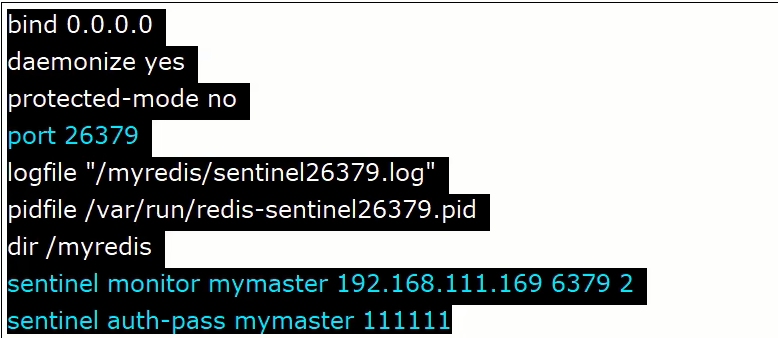
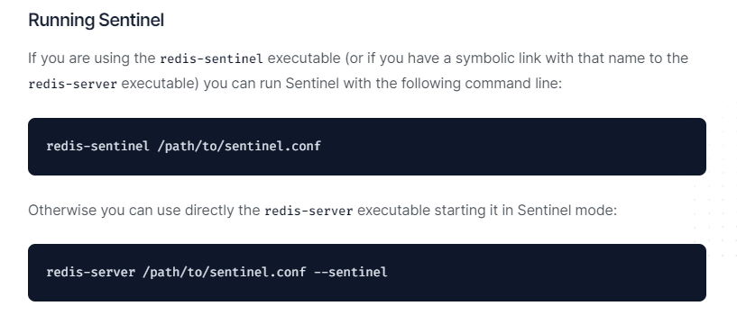
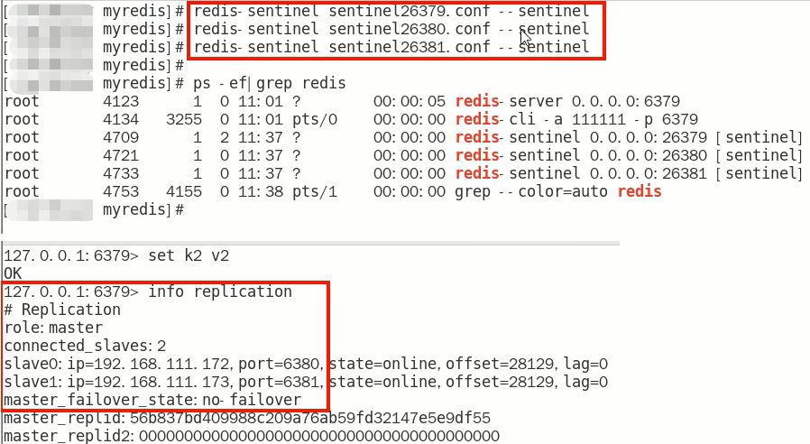

# sentinel通用配置及主从配置

### sentinel26379.conf、sentinel26380.conf、sentinel26381.conf

### 最终配置

### master主机配置文件说明

理论上sentinel配置文件应该部署在不同的服务器上，做成集群，但是本次演示将其放到一台机器上

### 先启动一主二从3个redis实例，测试正常的主从复制

- 架构说明

  

- 主机6379配置修改

  

  6379后续可能会变成从机，需要设置访问新主机的密码，所以此处会设置masterauth，**不然后续可能会报错 master_link_status:down**

- 3台不同的虚拟机实例，启动三台真是机器实例并连接

  redis-server redis6379.conf

  redis-server redis6380.conf

  redis-server redis6381.conf

  redis-cli -a 123456 -p 6379

  redis-cli -a 123456 -p 6380

  redis-cli -a 123456 -p 6381

- sentinel的两种启动方式

  

- 再启动3个哨兵监控后再测试一次主从复制

  redis-server sentinel26379.conf --sentinel

  redis-server sentinel26380.conf --sentinel

  redis-server sentinel26381.conf --sentinel

  

启动后我们会发现sentinel配置文件会自动在配置文件中加上部分配置

